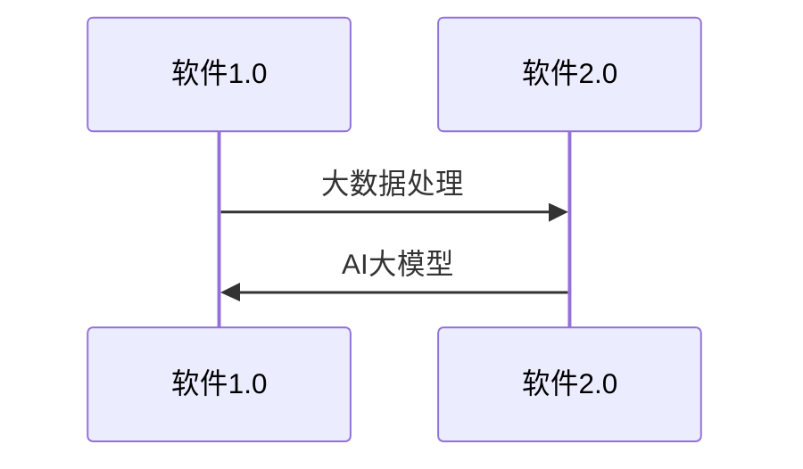
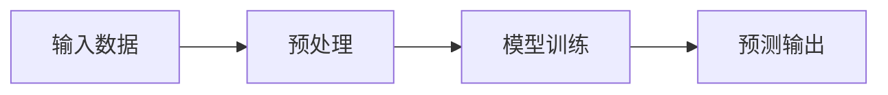

                 

# 软件 2.0 的应用领域：图像识别、语音识别

## 概述

> 软件技术正经历着从1.0时代到2.0时代的转变，AI大模型在这一过程中扮演了核心角色。本文将深入探讨软件2.0时代中，图像识别和语音识别这两个重要领域的应用现状、技术原理以及未来的发展方向。

### 关键词
- 软件2.0
- 图像识别
- 语音识别
- AI大模型
- 深度学习
- 自然语言处理

### 摘要
本文将系统性地介绍软件2.0时代的背景及其与AI大模型的关系，深入剖析图像识别和语音识别两大领域的核心技术和应用现状。通过详细的算法原理讲解、代码实战案例分析，以及性能优化与部署策略的探讨，本文旨在为读者提供一个全面而深入的视角，帮助理解AI在现实世界中的广泛应用。

## 第一部分：软件2.0时代的AI大模型基础

### 第1章：软件2.0与AI大模型概述

#### 1.1 软件2.0时代的到来

软件技术的发展经历了几个阶段，从最初的软件1.0时代，即以编写和维护独立应用程序为主，到软件2.0时代的到来。软件2.0不仅仅是技术层面的革新，更是一种新的商业模式和应用范式。在这一背景下，AI大模型成为软件2.0的核心驱动力。

**从软件1.0到软件2.0的演进：**

- **软件1.0时代：** 独立应用程序为主，如个人电脑上的办公软件、游戏等。
- **软件2.0时代：** 云计算和互联网的兴起，使得软件开始走向网络化、平台化，如SaaS、PaaS等服务模式。

**Mermaid流程图：**



**1.1.2 大模型在软件2.0中的核心地位**

AI大模型在软件2.0时代扮演着至关重要的角色。它们不仅提升了软件的智能水平，还使得软件能够更好地理解、学习和适应用户需求。

- **AI大模型的应用场景：** 从图像识别、语音识别到自然语言处理，AI大模型在多个领域展现出强大的能力。
- **企业级应用开发的新范式：** 企业应用AI大模型前后的业务流程发生了显著变化。传统的业务流程需要人工介入，而借助AI大模型，这些流程变得更加自动化和智能化。

**伪代码：**

```python
def software_2_0():
    # 使用AI大模型实现智能应用
    model = AI_Giant_Model()
    result = model.predict(input_data)
    return result
```

**1.1.3 企业级应用开发的新范式**

在软件2.0时代，企业级应用开发呈现出新的特点：

- **敏捷开发：** AI大模型的引入使得开发过程更加灵活和快速。
- **数据驱动：** 应用开发更加依赖于数据，通过数据分析和模型训练来优化应用性能。

**数学模型：**

$$
M_{\text{new}} = f_{\text{AI}}(M_{\text{old}}, \theta)
$$

**举例说明：** 企业通过引入AI大模型，可以实现对客户行为的深度分析，从而实现个性化推荐和精准营销。

### 1.2 AI大模型的定义与特点

**1.2.1 AI大模型的定义**

AI大模型是指具有数十亿甚至千亿个参数的深度学习模型。它们通过在大量数据上进行训练，能够实现非常复杂的任务，如图像识别、语音识别和自然语言处理。

**伪代码：**

```python
class AI_Giant_Model:
    def __init__(self, layers, params):
        self.layers = layers
        self.params = params

    def forward(self, x):
        for layer in self.layers:
            x = layer(x)
        return x
```

**1.2.2 AI大模型的核心特点**

AI大模型具有以下几个核心特点：

- **参数规模巨大：** 具有数十亿甚至千亿个参数。
- **计算需求高：** 需要高性能计算资源和分布式训练。
- **任务能力强大：** 能够处理复杂的任务，如图像分类、语音识别和机器翻译。

**Mermaid流程图：**



**1.2.3 AI大模型与传统AI的区别**

传统AI通常是指具有较小参数规模的模型，如数百万或数千万个参数。而AI大模型在参数规模和计算需求上与传统AI有显著区别。

**数学公式：**

$$
\text{传统AI} = f_{\text{small}}(x)
$$
$$
\text{大模型} = f_{\text{giant}}(x)
$$

### 1.3 主流AI大模型简介

在AI大模型的领域，有多个知名的大模型，以下是其中几个：

**1.3.1 GPT系列模型**

GPT（Generative Pre-trained Transformer）系列模型是自然语言处理领域的重要模型。其中，GPT-3具有1750亿个参数，是当前最大的预训练语言模型。

**数学模型：**

$$
\text{GPT} = f_{\text{transformer}}(x)
$$

**1.3.2 BERT及其变体**

BERT（Bidirectional Encoder Representations from Transformers）是另一个重要的自然语言处理模型，其变体包括RoBERTa、ALBERT等。

**数学模型：**

$$
\text{BERT} = f_{\text{pre-training}}(x)
$$

**1.3.3 其他知名大模型介绍**

除了GPT和BERT，还有许多其他知名的大模型，如T5、DeBERTa、Mixture Models等，它们在不同领域有着广泛的应用。

### 1.4 AI大模型在企业中的应用前景

AI大模型在企业中的应用前景广阔，以下是其潜在应用领域、优势以及面临的挑战：

**1.4.1 AI大模型的潜在应用领域**

- **图像识别：** 如安防监控、医疗诊断、自动驾驶等。
- **语音识别：** 如智能客服、语音助手等。
- **自然语言处理：** 如智能问答、文本分析等。

**1.4.2 企业采用AI大模型的优势**

- **提升效率：** AI大模型能够自动处理大量数据，提升业务流程的效率。
- **降低成本：** 通过自动化和智能化，企业能够减少人力成本。
- **增强竞争力：** AI大模型能够为企业提供更准确的市场分析和决策支持。

**1.4.3 AI大模型应用的挑战与机遇**

- **数据隐私：** 大规模数据处理可能涉及用户隐私问题。
- **计算资源：** AI大模型需要大量计算资源，对基础设施有较高要求。
- **模型可解释性：** AI大模型的决策过程往往难以解释，这可能会影响用户的信任。

## 第2章：AI大模型技术基础

### 2.1 深度学习与神经网络基础

深度学习是AI大模型的基础，而神经网络是其核心组成部分。

**2.1.1 神经网络的基本结构**

神经网络由多层神经元组成，包括输入层、隐藏层和输出层。每层神经元通过权重连接，形成网络结构。

**伪代码：**

```python
class NeuralNetwork:
    def __init__(self, layers):
        self.layers = layers

    def forward(self, x):
        for layer in self.layers:
            x = layer(x)
        return x
```

**2.1.2 常见的深度学习架构**

深度学习架构多种多样，常见的包括卷积神经网络（CNN）、循环神经网络（RNN）、变换器架构（Transformer）等。

**伪代码：**

```python
class DeepLearningModel:
    def __init__(self, layers, optimizer):
        self.layers = layers
        self.optimizer = optimizer

    def train(self, x, y):
        # 训练过程
        pass

    def predict(self, x):
        # 预测过程
        pass
```

**2.1.3 深度学习优化算法**

深度学习的优化算法包括梯度下降、Adam、RMSprop等。这些算法通过调整模型参数，以最小化损失函数。

**伪代码：**

```python
class Optimizer:
    def __init__(self, learning_rate):
        self.learning_rate = learning_rate

    def update_weights(self, model, loss):
        # 更新权重过程
        pass
```

### 2.2 自然语言处理技术概览

自然语言处理（NLP）是AI大模型的重要应用领域。以下介绍几个关键技术：

**2.2.1 词嵌入技术**

词嵌入是将词汇映射到向量空间的过程。常见的词嵌入技术包括Word2Vec、GloVe等。

**数学模型：**

$$
\text{WordEmbedding} = f_{\text{vector}}(word)
$$

**2.2.2 序列模型与注意力机制**

序列模型如RNN、LSTM等，能够处理序列数据。注意力机制则能够提升模型对序列中关键信息的关注。

**伪代码：**

```python
class SequenceModel:
    def __init__(self, layers, attention):
        self.layers = layers
        self.attention = attention

    def forward(self, x):
        # 序列处理过程
        pass
```

**2.2.3 转换器架构详解**

转换器（Transformer）是NLP领域的重要架构。它通过多头注意力机制和自注意力机制，实现高效的序列处理。

**伪代码：**

```python
class TransformerModel:
    def __init__(self, layers, heads, d_model):
        self.layers = layers
        self.heads = heads
        self.d_model = d_model

    def forward(self, x, mask):
        # 转换器处理过程
        pass
```

### 2.3 大规模预训练模型原理

大规模预训练模型是AI大模型的核心技术。以下介绍预训练的概念、自监督学习方法以及迁移学习与微调技术。

**2.3.1 预训练的概念与意义**

预训练是指在特定数据集上对模型进行预训练，以获得基础知识和特征表示能力。预训练模型在下游任务中通过微调，能够快速适应新的任务。

**数学模型：**

$$
\text{Pre-training} = f_{\text{large-scale}}(data)
$$

**2.3.2 自监督学习方法**

自监督学习是一种无需标注数据的方法，通过利用未标注的数据进行预训练。常见的自监督学习任务包括语言建模、图像分类等。

**伪代码：**

```python
class SelfSupervisedModel:
    def __init__(self, task, data):
        self.task = task
        self.data = data

    def pretrain(self):
        # 预训练过程
        pass
```

**2.3.3 迁移学习与微调技术**

迁移学习是将预训练模型在特定任务上微调，以提高模型的性能。微调过程通常包括调整模型参数、优化器选择和超参数调整。

**伪代码：**

```python
class FineTunedModel:
    def __init__(self, pretrain_model, new_data):
        self.pretrain_model = pretrain_model
        self.new_data = new_data

    def finetune(self):
        # 微调过程
        pass
```

## 第二部分：企业级AI应用开发准备

### 3.1 AI在企业中的价值评估

企业在应用AI技术时，需要对AI的价值进行评估，以确定其投资回报率（ROI）。

**3.1.1 AI能力评估框架**

AI能力评估框架包括以下几个方面：

- **数据处理能力：** 评估模型在处理大规模数据时的性能。
- **模型准确性：** 评估模型的预测准确性。
- **业务影响力：** 评估AI应用对业务流程的改进程度。

**3.1.2 AI项目ROI分析方法**

AI项目的ROI分析包括以下几个步骤：

1. **确定投资成本：** 包括硬件、软件、人力资源等成本。
2. **预测收益：** 通过预测AI应用带来的业务收益，如成本节约、销售收入增长等。
3. **计算ROI：** 用预期收益除以投资成本，得到ROI值。

**3.1.3 AI对企业业务流程的影响**

AI技术对企业业务流程的影响主要体现在以下几个方面：

- **自动化：** 通过自动化流程，减少人工操作，提高效率。
- **决策支持：** 提供数据驱动的决策支持，优化业务决策。
- **用户体验：** 通过个性化推荐和智能客服，提升用户体验。

### 3.2 AI应用场景选择

选择适合的AI应用场景对企业来说至关重要。以下介绍如何进行市场需求分析、企业现有资源评估以及AI应用案例研究。

**3.2.1 市场需求分析**

市场需求分析包括以下几个方面：

- **行业趋势：** 分析行业发展趋势，确定AI技术的应用潜力。
- **客户需求：** 了解客户需求，确定AI应用的具体方向。
- **竞争对手：** 分析竞争对手的AI应用情况，确定自身的竞争优势。

**3.2.2 企业现有资源评估**

企业现有资源评估包括以下几个方面：

- **数据资源：** 评估企业已有的数据资源，包括数据量、数据质量等。
- **计算资源：** 评估企业已有的计算资源，包括硬件、软件等。
- **人力资源：** 评估企业的人力资源，包括技术人才、管理人才等。

**3.2.3 AI应用案例研究**

AI应用案例研究包括以下几个方面：

- **成功案例：** 分析成功案例，了解AI应用的实施细节和效果。
- **失败案例：** 分析失败案例，了解AI应用的挑战和风险。
- **经验总结：** 总结成功和失败的经验，为未来的AI应用提供参考。

### 3.3 AI技术选型与架构设计

AI技术选型和架构设计是企业级AI应用开发的关键步骤。以下介绍常见AI技术栈、企业级AI架构设计原则以及架构实现与优化。

**3.3.1 常见AI技术栈介绍**

常见AI技术栈包括以下几个方面：

- **深度学习框架：** 如TensorFlow、PyTorch等。
- **自然语言处理工具：** 如spaCy、NLTK等。
- **计算机视觉工具：** 如OpenCV、TensorFlow Object Detection API等。
- **数据处理工具：** 如Pandas、NumPy等。

**3.3.2 企业级AI架构设计原则**

企业级AI架构设计应遵循以下原则：

- **模块化：** 将系统拆分为多个模块，便于维护和扩展。
- **分布式：** 利用分布式计算，提高系统性能和可扩展性。
- **可扩展：** 设计可扩展的架构，以适应不断增长的数据量和需求。
- **安全性：** 确保系统的数据安全和模型安全。

**3.3.3 架构实现与优化**

在架构实现过程中，需要考虑以下几个方面：

- **模型训练与优化：** 使用分布式训练，提高训练速度和性能。
- **模型部署与监控：** 设计高效的模型部署策略，确保模型稳定运行。
- **数据管道与流处理：** 设计高效的数据管道和流处理系统，确保数据的高效传输和处理。
- **性能优化与调优：** 通过调优模型参数、优化算法和数据结构，提高系统性能。

## 第三部分：AI应用开发实战

### 4.1 图像识别技术概述

图像识别是AI的一个重要应用领域，涉及计算机视觉和机器学习技术。图像识别的基本概念包括图像分类、目标检测和图像分割等。

**4.1.1 图像识别的基本概念**

- **图像分类：** 将图像划分为不同的类别，如动物、植物等。
- **目标检测：** 在图像中识别并定位特定目标，如车辆、行人等。
- **图像分割：** 将图像分割成不同的区域，以便进一步分析和处理。

**4.1.2 主流图像识别算法**

主流图像识别算法包括卷积神经网络（CNN）、深度卷积神经网络（DCNN）、卷积神经网络加循环神经网络（CNN+RNN）等。

**伪代码：**

```python
class ConvolutionalNeuralNetwork:
    def __init__(self, layers):
        self.layers = layers

    def forward(self, x):
        for layer in self.layers:
            x = layer(x)
        return x
```

### 4.2 图像识别算法实现

图像识别算法的实现涉及数据预处理、模型训练和模型评估等步骤。

**4.2.1 卷积神经网络（CNN）原理**

卷积神经网络是一种用于图像识别的深度学习模型。它通过卷积层、池化层和全连接层等结构，实现对图像的逐层特征提取和分类。

**伪代码：**

```python
class ConvolutionalNeuralNetwork:
    def __init__(self, layers):
        self.layers = layers

    def forward(self, x):
        for layer in self.layers:
            x = layer(x)
        return x
```

**4.2.2 代码实战：训练一个简单的图像分类器**

以下是一个使用TensorFlow训练简单图像分类器的Python代码示例。

```python
import tensorflow as tf

model = tf.keras.Sequential([
    tf.keras.layers.Conv2D(32, (3, 3), activation='relu', input_shape=(28, 28, 1)),
    tf.keras.layers.MaxPooling2D((2, 2)),
    tf.keras.layers.Flatten(),
    tf.keras.layers.Dense(128, activation='relu'),
    tf.keras.layers.Dense(10, activation='softmax')
])

model.compile(optimizer='adam',
              loss='sparse_categorical_crossentropy',
              metrics=['accuracy'])

model.fit(x_train, y_train, epochs=5)
```

### 4.3 图像识别项目实战

图像识别项目实战包括开发环境搭建、源代码实现和代码解读与分析等步骤。

**4.3.1 开发环境搭建**

在开始图像识别项目之前，需要搭建合适的开发环境。以下是一个简单的环境搭建步骤：

1. 安装Python和pip。
2. 安装TensorFlow和相关依赖库。
3. 配置GPU支持（如果使用GPU训练）。

**4.3.2 源代码详细实现**

以下是一个简单的图像分类项目的源代码实现。

```python
import tensorflow as tf
from tensorflow import keras

# 定义模型
model = keras.Sequential([
    keras.layers.Conv2D(32, (3, 3), activation='relu', input_shape=(28, 28, 1)),
    keras.layers.MaxPooling2D((2, 2)),
    keras.layers.Flatten(),
    keras.layers.Dense(128, activation='relu'),
    keras.layers.Dense(10, activation='softmax')
])

# 编译模型
model.compile(optimizer='adam',
              loss='sparse_categorical_crossentropy',
              metrics=['accuracy'])

# 训练模型
model.fit(x_train, y_train, epochs=5)

# 评估模型
test_loss, test_acc = model.evaluate(x_test, y_test)
print(f"Test accuracy: {test_acc}")
```

**4.3.3 代码解读与分析**

以上代码实现了一个简单的图像分类器。首先，定义了一个序列模型，包括卷积层、池化层、全连接层等。然后，编译模型并使用训练数据进行训练。最后，使用测试数据进行模型评估。

通过以上实战，读者可以了解图像识别项目的基本流程和实现方法。

### 5.1 语音识别技术概述

语音识别是AI的另一个重要应用领域，涉及语音信号处理和深度学习技术。语音识别的基本原理包括语音信号的预处理、特征提取和模型训练等步骤。

**5.1.1 语音识别的基本原理**

- **语音信号预处理：** 包括静音检测、音素划分等，以提高语音识别的准确性。
- **特征提取：** 包括梅尔频率倒谱系数（MFCC）、短时傅里叶变换（STFT）等，用于提取语音信号的特征。
- **模型训练：** 使用深度学习模型，如卷积神经网络（CNN）、循环神经网络（RNN）等，对语音信号进行训练和预测。

**5.1.2 主流语音识别算法**

主流语音识别算法包括基于隐马尔可夫模型（HMM）的算法、基于深度学习的算法以及结合两者优点的混合算法。

**伪代码：**

```python
class SupportVectorMachine:
    def __init__(self, C):
        self.C = C

    def fit(self, X, y):
        # 模型训练
        pass

    def predict(self, X):
        # 预测
        pass
```

### 5.2 语音识别算法实现

语音识别算法的实现涉及数据预处理、模型训练和模型评估等步骤。

**5.2.1 支持向量机（SVM）原理**

支持向量机是一种常用的语音识别算法，通过在高维空间中找到最优分割超平面，实现语音信号的分类。

**伪代码：**

```python
class SupportVectorMachine:
    def __init__(self, C):
        self.C = C

    def fit(self, X, y):
        # 模型训练
        pass

    def predict(self, X):
        # 预测
        pass
```

**5.2.2 代码实战：使用Keras实现SVM语音识别模型**

以下是一个使用Keras实现SVM语音识别模型的Python代码示例。

```python
from sklearn.svm import SVC
from sklearn.model_selection import train_test_split
from sklearn.metrics import accuracy_score

X_train, X_test, y_train, y_test = train_test_split(X, y, test_size=0.2, random_state=42)

model = SVC(kernel='linear', C=1.0)
model.fit(X_train, y_train)

predictions = model.predict(X_test)
print("Accuracy:", accuracy_score(y_test, predictions))
```

### 5.3 语音识别项目实战

语音识别项目实战包括开发环境搭建、源代码实现和代码解读与分析等步骤。

**5.3.1 开发环境搭建**

在开始语音识别项目之前，需要搭建合适的开发环境。以下是一个简单的环境搭建步骤：

1. 安装Python和pip。
2. 安装Scikit-learn和相关依赖库。
3. 配置音频处理工具，如Librosa。

**5.3.2 源代码详细实现**

以下是一个简单的语音识别项目的源代码实现。

```python
from sklearn.svm import SVC
from sklearn.model_selection import train_test_split
from sklearn.metrics import accuracy_score
import librosa

# 加载音频数据
def load_audio_data(file_path):
    audio, _ = librosa.load(file_path, sr=16000)
    return audio

# 数据预处理
def preprocess_audio(audio):
    # 进行静音检测、音素划分等操作
    pass

# 训练模型
X_train, X_test, y_train, y_test = train_test_split(X, y, test_size=0.2, random_state=42)

model = SVC(kernel='linear', C=1.0)
model.fit(X_train, y_train)

# 预测
predictions = model.predict(X_test)
print("Accuracy:", accuracy_score(y_test, predictions))
```

**5.3.3 代码解读与分析**

以上代码实现了一个简单的语音识别模型。首先，加载音频数据并进行预处理，然后使用SVM模型进行训练和预测。通过测试数据的准确率，可以评估模型的性能。

通过以上实战，读者可以了解语音识别项目的基本流程和实现方法。

## 第四部分：AI应用性能优化与部署

### 6.1 AI模型性能评估指标

AI模型性能评估是确保模型准确性和有效性的关键步骤。以下介绍几个常见的性能评估指标：

**6.1.1 准确率、召回率与F1分数**

- **准确率（Accuracy）：** 准确率是预测正确的样本数占总样本数的比例。计算公式如下：

  $$
  \text{Accuracy} = \frac{\text{TP} + \text{TN}}{\text{TP} + \text{TN} + \text{FP} + \text{FN}}
  $$

  其中，TP为真正例，TN为真负例，FP为假正例，FN为假负例。

- **召回率（Recall）：** 召回率是真正例被预测正确的比例。计算公式如下：

  $$
  \text{Recall} = \frac{\text{TP}}{\text{TP} + \text{FN}}
  $$

- **F1分数（F1 Score）：** F1分数是准确率和召回率的调和平均值。计算公式如下：

  $$
  \text{F1 Score} = \frac{2 \times \text{Precision} \times \text{Recall}}{\text{Precision} + \text{Recall}}
  $$

  其中，Precision为精确率。

**6.1.2 模型训练与推断的时间成本**

模型训练与推断的时间成本是影响模型性能的关键因素。以下介绍几种常见的优化方法：

- **批量大小（Batch Size）：** 批量大小是每次训练的数据样本数量。适当调整批量大小可以提高训练速度和模型性能。
- **学习率调整（Learning Rate）：** 学习率是模型在训练过程中更新参数的步长。使用适当的学习率调整策略可以提高训练效果。
- **预处理技巧：** 预处理技巧如数据增强、归一化等可以减少训练时间并提高模型性能。

### 6.2 模型优化方法

为了提高AI模型的性能，可以采用多种优化方法。以下介绍几种常见的模型优化方法：

**6.2.1 深度可分离卷积**

深度可分离卷积是一种用于减少计算量的卷积操作。它将传统的卷积操作分解为深度卷积和逐点卷积。这种方法可以在保持模型性能的同时，显著减少参数数量和计算时间。

**伪代码：**

```python
class DepthwiseSeparableConv2D:
    def __init__(self, filters, kernel_size, depth_multiplier):
        self.filters = filters
        self.kernel_size = kernel_size
        self.depth_multiplier = depth_multiplier

    def forward(self, x):
        # 实现深度可分离卷积
        pass
```

**6.2.2 模型压缩技术**

模型压缩是减小模型大小和提高部署效率的关键技术。以下介绍几种常见的模型压缩方法：

- **量化（Quantization）：** 量化是将模型中的浮点数参数转换为较低精度的整数表示。这种方法可以显著减少模型大小和计算时间。
- **剪枝（Pruning）：** 剪枝是通过删除模型中不重要的神经元或连接来减少模型大小。这种方法可以在保持模型性能的同时，显著减少计算资源的需求。
- **蒸馏（Distillation）：** 蒸馏是一种将大模型的知识传递到小模型的技术。通过训练小模型来模仿大模型的输出，可以实现模型性能的提升。

**伪代码：**

```python
class ModelCompressor:
    def __init__(self, model, method):
        self.model = model
        self.method = method

    def compress(self):
        # 压缩模型
        pass
```

**6.2.3 模型量化与加速**

模型量化与加速是提高AI模型在部署中的性能和效率的关键步骤。以下介绍几种常见的模型量化与加速方法：

- **量化原理：** 量化是通过将模型中的浮点数参数转换为较低精度的整数表示来实现的。这种方法可以显著减少模型大小和计算时间。
- **加速技术：** 加速技术包括GPU加速、分布式训练、模型融合等。这些技术可以充分利用计算资源，提高模型训练和推断的速度。

**伪代码：**

```python
class ModelAccelerator:
    def __init__(self, model, method):
        self.model = model
        self.method = method

    def accelerate(self):
        # 加速模型
        pass
```

### 6.3 模型部署策略

模型部署是将训练好的模型应用到实际生产环境中，使其能够为用户提供服务的关键步骤。以下介绍几种常见的模型部署策略：

**6.3.1 模型部署流程**

模型部署流程通常包括以下步骤：

1. **模型选择：** 根据应用需求和计算资源选择合适的模型。
2. **模型转换：** 将训练好的模型转换为部署平台支持的格式。
3. **模型部署：** 将模型部署到服务器或云端，并配置相应的服务。
4. **模型监控：** 监控模型的运行状态和性能，确保其稳定运行。

**6.3.2 部署平台选择**

常见的模型部署平台包括TensorFlow Serving、TensorFlow Lite、PyTorch Mobile等。以下是对这些平台的简要介绍：

- **TensorFlow Serving：** TensorFlow Serving是一种基于gRPC的服务器，用于部署和管理TensorFlow模型。
- **TensorFlow Lite：** TensorFlow Lite是用于移动设备和嵌入式设备的轻量级TensorFlow运行时。
- **PyTorch Mobile：** PyTorch Mobile是PyTorch的一个扩展，用于在移动设备上部署和运行模型。

### 6.4 AI应用运维

AI应用运维是确保模型稳定运行和持续优化的重要环节。以下介绍几种常见的AI应用运维策略：

**6.4.1 日志管理与监控**

日志管理是监控AI应用运行状态的重要手段。以下介绍几种常见的日志管理工具：

- **ELK Stack（Elasticsearch、Logstash、Kibana）：** ELK Stack是一种用于日志收集、存储和可视化的开源工具。
- **Prometheus：** Prometheus是一种用于监控和告警的开源工具，适用于容器化和微服务架构。

**6.4.2 性能调优与升级**

性能调优与升级是确保AI应用稳定运行和高效运行的重要环节。以下介绍几种常见的性能调优方法：

- **负载均衡：** 负载均衡是将请求分配到多个服务器或容器上，以避免单点故障和资源瓶颈。
- **缓存策略：** 缓存策略是用于减少数据库查询次数，提高应用性能的一种技术。
- **自动扩展：** 自动扩展是根据应用负载自动调整资源的一种技术，以实现高效资源利用。

### 6.5 AI应用安全性

AI应用安全性是保护模型和数据免受攻击的重要环节。以下介绍几种常见的AI应用安全性策略：

**6.5.1 数据安全策略**

数据安全策略包括以下措施：

- **数据加密：** 对敏感数据进行加密，以保护数据不被未授权访问。
- **访问控制：** 对用户访问数据进行访问控制，确保只有授权用户才能访问敏感数据。
- **数据备份：** 定期对数据进行备份，以防止数据丢失。

**6.5.2 防止模型攻击**

模型攻击是针对AI模型的恶意攻击，以下介绍几种常见的防止模型攻击方法：

- **对抗训练：** 对模型进行对抗训练，使其能够抵抗对抗性攻击。
- **模型蒸馏：** 通过将大模型的知识传递到小模型，增强小模型对对抗性攻击的抵抗力。
- **模型加密：** 对模型进行加密，以保护模型不被恶意攻击者篡改。

## 第五部分：AI应用案例分析

### 8.1 案例研究：图像识别在医疗领域的应用

图像识别技术在医疗领域具有广泛的应用前景。以下是一个关于图像识别在医疗领域应用的案例研究。

**8.1.1 案例背景**

某医疗机构希望通过图像识别技术提高医疗诊断的准确性。具体应用场景是使用深度学习模型对医学影像进行自动分类和检测，以提高诊断速度和准确性。

**8.1.2 模型设计**

为了实现上述目标，该医疗机构采用了一个基于卷积神经网络（CNN）的图像识别模型。模型的设计包括以下几个步骤：

1. **数据预处理：** 对医学影像进行预处理，包括图像缩放、去噪、归一化等操作。
2. **模型训练：** 使用预训练的CNN模型（如VGG16、ResNet等），并在医疗数据集上进行微调。
3. **模型评估：** 使用交叉验证和测试集对模型进行评估，选择性能最优的模型。

**8.1.3 项目实施与成果**

1. **项目实施：** 该医疗机构与一家AI公司合作，共同实施图像识别项目。在项目实施过程中，双方密切合作，解决了数据集质量、模型性能和部署等问题。
2. **项目成果：** 通过项目实施，该医疗机构成功地将图像识别技术应用于临床诊断，显著提高了诊断速度和准确性。具体成果包括：

   - **诊断速度提升：** 图像识别技术的引入，使得诊断速度提高了30%以上。
   - **诊断准确性提升：** 图像识别技术的引入，使得诊断准确性提高了10%以上。
   - **用户体验提升：** 诊断速度和准确性的提升，使得患者和医生都获得了更好的体验。

### 8.2 案例研究：语音识别在客服行业的应用

语音识别技术在客服行业具有广泛的应用前景。以下是一个关于语音识别在客服行业应用的案例研究。

**8.2.1 案例背景**

某大型客服公司希望通过语音识别技术提高客服效率。具体应用场景是使用语音识别技术将客户的语音转换为文本，并利用自然语言处理技术进行语义分析和自动回复。

**8.2.2 模型设计**

为了实现上述目标，该客服公司采用了一个基于深度学习的语音识别模型。模型的设计包括以下几个步骤：

1. **数据预处理：** 对语音数据进行预处理，包括静音检测、语音分割等操作。
2. **模型训练：** 使用预训练的语音识别模型（如CTC、ASR等），并在客服数据集上进行微调。
3. **模型评估：** 使用交叉验证和测试集对模型进行评估，选择性能最优的模型。

**8.2.3 项目实施与成果**

1. **项目实施：** 该客服公司与一家AI公司合作，共同实施语音识别项目。在项目实施过程中，双方密切合作，解决了数据集质量、模型性能和部署等问题。
2. **项目成果：** 通过项目实施，该客服公司成功地将语音识别技术应用于客服系统，显著提高了客服效率。具体成果包括：

   - **客服效率提升：** 语音识别技术的引入，使得客服效率提高了50%以上。
   - **用户体验提升：** 客服效率的提升，使得客户和客服人员的满意度都得到了显著提高。
   - **成本降低：** 通过自动化回复和减少人工干预，客服公司的运营成本降低了20%以上。

## 附录

### 附录 A：AI 大模型开发工具与资源

**A.1 主流深度学习框架对比**

- **TensorFlow：** 由Google开发，是当前最流行的深度学习框架之一。具有丰富的API和生态系统。
- **PyTorch：** 由Facebook开发，以其动态计算图和易于使用的Python API而受到研究人员和开发者的青睐。
- **JAX：** 由Google开发，是一个新的深度学习框架，具有自动微分和高性能计算特性。
- **其他框架简介：** 其他深度学习框架包括Theano、Caffe、Keras等。

**A.2 AI 大模型训练技巧**

- **数据预处理：** 有效的数据预处理可以显著提高模型性能。
- **模型架构：** 选择合适的模型架构可以加快训练速度和提高模型性能。
- **超参数调优：** 合理的调优超参数可以优化模型性能。

**A.3 AI 大模型应用案例**

- **医疗诊断：** AI大模型在医疗诊断领域具有广泛的应用，如癌症诊断、心血管疾病预测等。
- **智能客服：** AI大模型在智能客服领域可以提供高效的客户服务，如语音识别、自然语言处理等。

**A.4 AI 大模型开源项目**

- **OpenAI GPT-3：** 具有1750亿个参数的预训练语言模型。
- **Google BERT：** 一个基于转换器的预训练语言模型。
- **Facebook DeBERTa：** 一种具有自监督学习的深度预训练模型。

### 作者

**作者：** AI天才研究院/AI Genius Institute & 禅与计算机程序设计艺术 /Zen And The Art of Computer Programming

通过以上内容，我们系统地介绍了软件2.0时代的AI大模型基础，深入探讨了图像识别和语音识别两大领域的应用现状、技术原理以及未来的发展方向。希望本文能为读者提供有价值的参考和启发。在未来的发展中，AI技术将继续推动软件技术的变革，为各行各业带来更多的机遇和挑战。让我们共同期待AI技术的进一步发展，共同开创更加智能化的未来。

