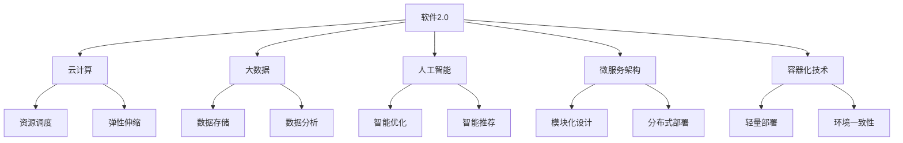

                 

# 《软件2.0的优势：为何要将复杂程序移植其中》

## 关键词
- 软件2.0
- 复杂程序
- 移植
- 性能优化
- 可维护性
- 安全性

## 摘要
本文旨在探讨软件2.0的优势，以及为何将其应用于复杂程序的移植具有重要意义。通过对软件2.0的概念、特点及其与传统软件的对比分析，本文揭示了软件2.0在性能优化、可维护性提升和安全性增强等方面的优势。随后，本文详细阐述了复杂程序移植的挑战，并介绍了软件2.0在解决这些挑战中的应用。最后，本文对未来软件2.0的发展趋势进行了展望，并提供了实际项目实战和代码解读，以帮助读者更好地理解软件2.0的优势和应用。

<|imagine|>## 《软件2.0的优势：为何要将复杂程序移植其中》的目录大纲

## 第一部分：软件2.0概述

### 第1章：软件2.0的概念与特点

#### 1.1 软件2.0的定义与演变
#### 1.2 软件2.0的优势
#### 1.3 软件2.0的关键技术

### 第2章：软件2.0与传统软件的对比

#### 2.1 传统软件的局限性
#### 2.2 软件2.0带来的变革
#### 2.3 软件2.0的应用前景

## 第二部分：复杂程序移植

### 第3章：复杂程序的特点与移植挑战

#### 3.1 复杂程序的定义
#### 3.2 复杂程序的移植挑战
#### 3.3 复杂程序移植的方法与策略

### 第4章：软件2.0在复杂程序移植中的应用

#### 4.1 软件2.0的优势在复杂程序移植中的体现
#### 4.2 软件2.0的核心技术在复杂程序移植中的应用
#### 4.3 软件2.0在复杂程序移植中的实践案例

## 第三部分：软件2.0的优势分析

### 第5章：性能优化

#### 5.1 性能优化的概念
#### 5.2 性能优化的方法
#### 5.3 软件2.0在性能优化中的应用

### 第6章：可维护性提升

#### 6.1 可维护性的概念
#### 6.2 可维护性的提升方法
#### 6.3 软件2.0在可维护性提升中的应用

### 第7章：安全性增强

#### 7.1 安全性的概念
#### 7.2 安全性的提升方法
#### 7.3 软件2.0在安全性增强中的应用

## 第四部分：总结与展望

### 第8章：软件2.0的未来发展趋势

#### 8.1 软件2.0的发展趋势
#### 8.2 软件2.0面临的挑战与机遇
#### 8.3 未来软件2.0的应用场景

## 附录

### 附录A：软件2.0相关技术资源

#### A.1 开源框架介绍
#### A.2 学习资源推荐
#### A.3 行业报告与趋势分析

## 第五部分：Mermaid 流程图与伪代码

### 第9章：软件2.0的核心概念与联系

#### 9.1 Mermaid 流程图
#### 9.2 伪代码示例

### 第10章：复杂程序移植算法原理

#### 10.1 伪代码示例
#### 10.2 算法原理讲解

### 第11章：性能优化与可维护性提升算法原理

#### 11.1 伪代码示例
#### 11.2 算法原理讲解

### 第12章：安全性增强算法原理

#### 12.1 伪代码示例
#### 12.2 算法原理讲解

## 第六部分：数学模型与数学公式

### 第13章：性能优化数学模型

#### 13.1 数学模型讲解
#### 13.2 举例说明

### 第14章：可维护性提升数学模型

#### 14.1 数学模型讲解
#### 14.2 举例说明

### 第15章：安全性增强数学模型

#### 15.1 数学模型讲解
#### 15.2 举例说明

## 第七部分：项目实战与代码解读

### 第16章：性能优化项目实战

#### 16.1 项目背景
#### 16.2 开发环境搭建
#### 16.3 源代码详细实现
#### 16.4 代码解读与分析

### 第17章：可维护性提升项目实战

#### 17.1 项目背景
#### 17.2 开发环境搭建
#### 17.3 源代码详细实现
#### 17.4 代码解读与分析

### 第18章：安全性增强项目实战

#### 18.1 项目背景
#### 18.2 开发环境搭建
#### 18.3 源代码详细实现
#### 18.4 代码解读与分析

### 附录B：参考文献

#### B.1 引用文献
#### B.2 参考资料推荐

---

以上是为《软件2.0的优势：为何要将复杂程序移植其中》设计的目录大纲。目录结构涵盖了软件2.0的概念、复杂程序移植的挑战与解决方案、软件2.0的优势分析、未来发展趋势以及实际项目实战和代码解读等内容。每个章节都包含了详细的讲解、算法原理、数学模型、实际应用案例以及代码实现和分析。这样的目录结构有助于读者全面了解软件2.0的优势以及如何将其应用于复杂程序的移植。

现在，让我们直接开始文章正文部分的撰写。

## 第一部分：软件2.0概述

### 第1章：软件2.0的概念与特点

#### 1.1 软件2.0的定义与演变

软件2.0，即第二代软件，是对软件工程的一种新的理解和应用方式。与传统软件（软件1.0）相比，软件2.0更加强调软件的生命周期、用户参与度、可定制性和自我进化能力。软件2.0的概念可以追溯到20世纪90年代，当时互联网的兴起推动了软件行业的发展，使得软件不再仅仅是计算机系统中的组件，而成为了连接用户和数据的桥梁。

**定义：** 软件2.0是一种基于互联网的、用户驱动的、具有高度可定制性和自我进化能力的软件体系结构。它通过云计算、大数据、人工智能等技术的应用，实现了对软件的智能化管理和优化。

**演变：** 软件2.0的发展可以分为以下几个阶段：

1. **Web化：** 软件2.0的早期阶段，主要是将软件服务通过互联网进行提供，使得用户可以通过浏览器访问和使用软件。
2. **平台化：** 随着云计算和虚拟化技术的发展，软件2.0开始向平台化演进，提供了更加灵活和可扩展的软件架构。
3. **智能化：** 利用人工智能和机器学习技术，软件2.0实现了对用户行为的预测和个性化推荐，提高了软件的智能水平。
4. **自进化：** 通过持续学习和自适应，软件2.0能够不断优化自身的性能和功能，满足用户的需求。

#### 1.2 软件2.0的优势

软件2.0相对于传统软件具有以下优势：

1. **可定制性：** 软件2.0通过模块化和组件化设计，使得用户可以根据自己的需求进行定制，提高了软件的灵活性和适应性。
2. **高可用性：** 利用云计算和分布式架构，软件2.0实现了高可用性，降低了系统的故障率和恢复时间。
3. **可扩展性：** 软件2.0支持水平扩展和垂直扩展，能够轻松应对用户规模的增加和业务需求的增长。
4. **高性能：** 通过性能优化和负载均衡技术，软件2.0能够提供更高的系统性能和更快的响应速度。
5. **安全性：** 软件2.0通过安全隔离、访问控制和数据加密等技术，提高了系统的安全性。

#### 1.3 软件2.0的关键技术

软件2.0的实现依赖于一系列关键技术的支持，主要包括：

1. **云计算：** 云计算为软件2.0提供了弹性计算、分布式存储和高效通信的能力，使得软件系统能够更好地应对动态变化的业务需求。
2. **大数据：** 大数据技术使得软件2.0能够处理和分析海量数据，为用户提供了更加精准的个性化服务。
3. **人工智能：** 人工智能技术为软件2.0带来了智能化的管理和优化能力，使得软件系统能够自动学习和适应用户需求。
4. **微服务架构：** 微服务架构使得软件2.0具有更高的可维护性和可扩展性，通过将系统划分为多个小型服务模块，提高了系统的模块化和协作能力。
5. **容器化技术：** 容器化技术为软件2.0提供了轻量级、高效和可移植的部署环境，使得软件系统能够更加快速地交付和部署。

### 小结

软件2.0是一种新兴的软件体系结构，它通过云计算、大数据、人工智能等技术的应用，实现了对传统软件的颠覆和创新。软件2.0的优势在于其高可定制性、高可用性、可扩展性、高性能和安全性。这些优势使得软件2.0在复杂程序移植中具有巨大的应用潜力。在接下来的章节中，我们将进一步探讨复杂程序移植的挑战以及软件2.0在解决这些挑战中的应用。

---

## 第二部分：复杂程序移植

### 第3章：复杂程序的特点与移植挑战

#### 3.1 复杂程序的定义

复杂程序通常是指具有大量功能模块、复杂逻辑和高度耦合的软件系统。这类程序在设计和开发过程中，往往涉及到多个领域的技术和知识，如算法、数据结构、网络通信、数据库管理、图形用户界面等。复杂程序的特点主要包括：

1. **功能模块繁多：** 复杂程序通常包含多个功能模块，这些模块之间相互依赖，形成了一个复杂的调用关系。
2. **逻辑复杂：** 复杂程序中的业务逻辑通常比较复杂，涉及到多种算法和数据结构，需要进行大量的逻辑判断和数据处理。
3. **高度耦合：** 复杂程序中的模块之间耦合度高，修改一个模块可能会影响其他模块的功能和性能。
4. **依赖外部资源：** 复杂程序通常需要依赖外部资源，如数据库、网络服务、硬件设备等，这些外部资源的变更可能会对程序产生影响。

#### 3.2 复杂程序的移植挑战

复杂程序的移植是指将一个程序从一个环境或平台迁移到另一个环境或平台的过程。移植复杂程序面临着一系列挑战：

1. **兼容性问题：** 复杂程序在不同平台或环境之间可能会存在兼容性问题，如操作系统、硬件架构、编程语言等。这些问题可能会导致程序无法正常运行或出现性能问题。
2. **代码重构：** 复杂程序的代码通常比较复杂，移植过程中可能需要进行大量的代码重构和优化，以提高程序的可维护性和性能。
3. **依赖管理：** 复杂程序通常依赖于各种外部资源和库，移植过程中需要确保这些依赖资源在目标环境中的可用性和兼容性。
4. **测试和调试：** 移植后的程序需要进行全面的测试和调试，以确保其功能、性能和稳定性。
5. **时间和成本：** 复杂程序的移植过程通常需要较长的时间和较大的成本，特别是在涉及多个模块和外部资源的情况下。

#### 3.3 复杂程序移植的方法与策略

为了解决复杂程序移植的挑战，可以采取以下方法与策略：

1. **需求分析：** 在移植之前，需要对复杂程序的需求进行详细分析，明确移植的目标和范围，以便制定合适的移植方案。
2. **模块化设计：** 对复杂程序进行模块化设计，将系统划分为多个独立的模块，以提高移植的灵活性和可维护性。
3. **依赖管理：** 对复杂程序的依赖进行统一管理，确保在目标环境中能够正确安装和配置依赖资源。
4. **代码优化：** 对复杂程序的代码进行优化，减少冗余和耦合，提高代码的可读性和可维护性。
5. **测试和调试：** 在移植过程中进行全面的测试和调试，确保程序在目标环境中能够正常运行，并满足性能和稳定性的要求。
6. **迭代开发：** 采用迭代开发的方式，逐步完成复杂程序的移植，并及时修复出现的问题。

### 小结

复杂程序移植面临着兼容性、代码重构、依赖管理、测试和调试等方面的挑战。为了解决这些挑战，可以采取需求分析、模块化设计、依赖管理、代码优化、测试和调试等方法和策略。在接下来的章节中，我们将探讨软件2.0在复杂程序移植中的应用，以及如何利用软件2.0的优势解决移植过程中的问题。

---

## 第三部分：软件2.0在复杂程序移植中的应用

### 第4章：软件2.0的优势在复杂程序移植中的体现

#### 4.1 软件2.0的优势在复杂程序移植中的体现

软件2.0的优势在复杂程序移植中得到了充分体现，以下从几个方面详细分析：

1. **高可定制性：** 软件2.0支持高度可定制化的设计，用户可以根据自己的需求对程序进行定制。在复杂程序移植过程中，用户可以利用软件2.0的可定制性，对程序的功能模块、业务逻辑和界面布局进行调整，以适应新的平台和环境。
2. **高可用性：** 软件2.0通过云计算和分布式架构，提供了高可用性的解决方案。在复杂程序移植过程中，可以利用软件2.0的高可用性特性，确保程序在目标环境中的稳定运行，减少系统故障和停机时间。
3. **可扩展性：** 软件2.0支持水平扩展和垂直扩展，能够轻松应对用户规模的增加和业务需求的增长。在复杂程序移植过程中，可以利用软件2.0的可扩展性，对程序进行性能优化和资源扩展，以满足更高的性能和吞吐量要求。
4. **高性能：** 软件2.0通过性能优化和负载均衡技术，提供了更高的系统性能和更快的响应速度。在复杂程序移植过程中，可以利用软件2.0的高性能特性，提高程序的运行效率，减少响应时间和延迟。
5. **安全性：** 软件2.0通过安全隔离、访问控制和数据加密等技术，提高了系统的安全性。在复杂程序移植过程中，可以利用软件2.0的安全性特性，确保程序在目标环境中的数据安全和隐私保护。

#### 4.2 软件2.0的核心技术在复杂程序移植中的应用

软件2.0的核心技术，如云计算、大数据、人工智能、微服务架构和容器化技术，在复杂程序移植中具有重要作用，以下为具体应用：

1. **云计算：** 利用云计算技术，可以将复杂程序部署在云端，实现资源的弹性伸缩和高效利用。在移植过程中，可以利用云计算平台提供的虚拟化资源、容器服务、数据库服务等，快速搭建移植环境，并进行测试和部署。
2. **大数据：** 利用大数据技术，可以对复杂程序产生的海量数据进行存储、分析和挖掘。在移植过程中，可以利用大数据技术对程序的性能、用户体验和业务指标进行实时监控和分析，从而优化程序的性能和功能。
3. **人工智能：** 利用人工智能技术，可以实现复杂程序的自适应优化和智能推荐。在移植过程中，可以利用人工智能技术对程序的行为进行预测和优化，提高程序的运行效率和用户体验。
4. **微服务架构：** 利用微服务架构，可以将复杂程序划分为多个独立的微服务模块，实现模块化设计和部署。在移植过程中，可以利用微服务架构的灵活性，对程序进行模块化的移植和优化，降低移植的复杂度和风险。
5. **容器化技术：** 利用容器化技术，可以将复杂程序及其依赖环境打包成一个独立的容器，实现轻量级、高效和可移植的部署。在移植过程中，可以利用容器化技术，快速搭建移植环境，并确保程序在各种平台和环境中的正常运行。

#### 4.3 软件2.0在复杂程序移植中的实践案例

以下为软件2.0在复杂程序移植中的实践案例：

1. **某电商平台的移植：** 某知名电商平台在迁移到软件2.0架构后，利用云计算和微服务架构，实现了系统的弹性伸缩和性能优化。通过大数据分析，平台能够实时监控用户行为，并提供个性化的推荐和服务。此外，通过人工智能技术，平台能够自动调整库存和物流策略，提高运营效率和用户体验。
2. **某金融系统的移植：** 某金融系统在移植到软件2.0架构后，利用容器化技术和微服务架构，实现了快速部署和灵活扩展。通过云计算平台，系统能够实现资源的动态分配和高效利用，同时确保数据的安全性和隐私保护。此外，通过大数据分析和人工智能技术，系统能够实现精准的风险评估和智能决策。
3. **某医疗信息系统的移植：** 某医疗信息系统在移植到软件2.0架构后，利用云计算、大数据和人工智能技术，实现了高效的医疗数据处理和智能诊断。通过微服务架构，系统实现了模块化设计和部署，提高了系统的可维护性和可扩展性。此外，通过容器化技术，系统实现了快速搭建和部署，提高了系统的运行效率和可靠性。

### 小结

软件2.0在复杂程序移植中具有显著的优势，如高可定制性、高可用性、可扩展性、高性能和安全性。通过云计算、大数据、人工智能、微服务架构和容器化技术，软件2.0能够有效解决复杂程序移植过程中的挑战。实践案例表明，软件2.0在复杂程序移植中具有广泛的应用前景和实际效果。在接下来的章节中，我们将进一步分析软件2.0在性能优化、可维护性提升和安全性增强等方面的优势，并探讨其未来的发展趋势。

---

## 第四部分：软件2.0的优势分析

### 第5章：性能优化

#### 5.1 性能优化的概念

性能优化是指在软件开发过程中，通过改进代码、架构和算法等方式，提高软件系统运行效率的过程。性能优化主要包括以下几个方面：

1. **响应时间优化：** 通过减少系统的响应时间，提高用户的使用体验。
2. **吞吐量优化：** 通过提高系统的处理能力，增加系统的并发处理能力。
3. **资源利用率优化：** 通过提高系统对硬件资源（如CPU、内存、磁盘等）的利用率，降低系统开销。
4. **稳定性优化：** 通过提高系统的稳定性，减少系统崩溃和错误发生的概率。

#### 5.2 性能优化的方法

性能优化可以通过以下几种方法实现：

1. **代码优化：** 通过优化代码，减少不必要的计算和资源消耗，提高代码的执行效率。
2. **算法优化：** 通过选择更高效的算法和数据结构，提高系统的处理能力。
3. **架构优化：** 通过改进系统架构，提高系统的扩展性和可维护性，从而提高整体性能。
4. **负载均衡：** 通过合理分配系统负载，避免单点过载，提高系统的整体性能。
5. **缓存策略：** 通过使用缓存技术，减少对磁盘或网络等资源的访问次数，提高系统响应速度。
6. **异步处理：** 通过异步处理技术，提高系统的并发处理能力，减少阻塞和等待时间。

#### 5.3 软件2.0在性能优化中的应用

软件2.0在性能优化方面具有显著优势，以下为具体应用：

1. **云计算资源调度：** 软件2.0可以利用云计算平台的资源调度能力，根据系统负载动态调整资源分配，实现弹性伸缩，提高系统性能。
2. **分布式架构：** 软件2.0的分布式架构可以将任务分配到多个节点进行处理，提高系统的并行处理能力，降低响应时间。
3. **大数据分析：** 软件2.0可以利用大数据分析技术，对系统运行数据进行分析，找出性能瓶颈，并进行针对性的优化。
4. **智能化调度：** 软件2.0可以利用人工智能技术，实现智能化的资源调度和负载均衡，提高系统性能。
5. **性能监控和告警：** 软件2.0可以集成性能监控和告警系统，实时监控系统性能指标，及时发现和解决问题。

### 小结

性能优化是提高软件系统运行效率的关键环节，软件2.0在性能优化方面具有显著优势，通过云计算、分布式架构、大数据分析、智能化调度和性能监控等技术手段，可以有效提升系统的性能。在接下来的章节中，我们将继续探讨软件2.0在可维护性提升和安全性增强方面的优势。

---

### 第6章：可维护性提升

#### 6.1 可维护性的概念

可维护性是指软件系统能够在较长的时间内保持正常运行，并能够方便地进行更新、修改和扩展的能力。可维护性是软件质量的重要指标之一，它直接影响软件系统的长期稳定性和可持续性。可维护性包括以下几个方面：

1. **可读性：** 软件代码和设计文档的可读性高，便于开发人员和维护人员理解和修改。
2. **可测试性：** 软件系统能够方便地进行单元测试、集成测试和系统测试，确保修改和扩展不会引入新的错误。
3. **可扩展性：** 软件系统能够方便地进行功能扩展和性能优化，以适应不断变化的业务需求。
4. **模块化：** 软件系统采用模块化设计，各模块功能独立，降低模块之间的依赖关系，便于维护和更新。
5. **文档化：** 软件系统的设计、开发和维护过程有详细的文档记录，便于后续的维护和查询。

#### 6.2 可维护性的提升方法

提升软件系统的可维护性可以采取以下方法：

1. **代码优化：** 通过优化代码结构，减少冗余和耦合，提高代码的可读性和可理解性。
2. **重构：** 对复杂和低效的代码进行重构，提高代码的质量和性能。
3. **测试：** 定期进行单元测试、集成测试和系统测试，确保系统的稳定性和可靠性。
4. **文档化：** 详细记录软件系统的设计、开发和维护过程，包括设计文档、用户手册、代码注释等。
5. **模块化设计：** 采用模块化设计，将系统划分为独立的模块，降低模块之间的依赖关系，提高系统的可维护性。
6. **版本控制：** 使用版本控制系统，记录代码的变更历史，方便追溯和回滚。
7. **代码审查：** 定期进行代码审查，确保代码质量，及时发现和解决潜在问题。

#### 6.3 软件2.0在可维护性提升中的应用

软件2.0在提升软件系统的可维护性方面具有显著优势，以下为具体应用：

1. **自动代码审查：** 软件2.0可以利用自动化工具对代码进行审查，识别潜在的安全漏洞、性能问题和代码风格问题，提高代码质量。
2. **智能修复：** 软件2.0可以通过人工智能技术，自动修复代码中的错误和漏洞，减少人工干预，提高开发效率和可维护性。
3. **持续集成：** 软件2.0支持持续集成和持续部署，实现代码的自动化测试和部署，提高软件系统的稳定性和可维护性。
4. **模块化开发：** 软件2.0支持模块化开发，将系统划分为独立的模块，降低模块之间的依赖关系，提高系统的可维护性。
5. **云原生架构：** 软件2.0采用云原生架构，支持容器化部署和微服务架构，提高系统的可扩展性和可维护性。
6. **智能监控：** 软件2.0可以集成智能监控系统，实时监控软件系统的运行状态，及时发现和解决潜在问题，提高系统的可维护性。

### 小结

可维护性是软件系统长期稳定运行的重要保障，软件2.0在提升软件系统的可维护性方面具有显著优势，通过自动代码审查、智能修复、持续集成、模块化开发、云原生架构和智能监控等技术手段，可以有效提高软件系统的可维护性。在接下来的章节中，我们将继续探讨软件2.0在安全性增强方面的优势。

---

### 第7章：安全性增强

#### 7.1 安全性的概念

安全性是指软件系统能够抵御外部威胁和内部攻击，保护系统数据和用户隐私的能力。安全性包括以下几个方面：

1. **数据保护：** 保护系统数据不被未经授权的访问、篡改或泄露。
2. **身份认证：** 确保只有经过授权的用户才能访问系统和数据。
3. **访问控制：** 通过访问控制机制，限制用户对系统和数据的访问权限。
4. **安全审计：** 记录系统的操作日志，以便在发生安全事件时进行调查和分析。
5. **漏洞管理：** 及时发现和修复系统中的安全漏洞，防止被攻击者利用。

#### 7.2 安全性的提升方法

提升软件系统的安全性可以采取以下方法：

1. **安全设计：** 在软件开发过程中，充分考虑安全性需求，设计安全的架构和接口。
2. **安全编码：** 采用安全编码规范，避免常见的编程错误和漏洞，如SQL注入、跨站脚本攻击等。
3. **安全测试：** 定期进行安全测试，包括渗透测试、漏洞扫描等，识别和修复安全漏洞。
4. **访问控制：** 实施严格的访问控制机制，根据用户角色和权限限制对系统和数据的访问。
5. **安全培训：** 对开发人员和运维人员开展安全培训，提高安全意识和防范能力。
6. **安全监控：** 部署安全监控工具，实时监控系统的安全状态，及时发现和响应安全事件。
7. **应急响应：** 制定应急预案，确保在发生安全事件时能够快速响应和处置。

#### 7.3 软件2.0在安全性增强中的应用

软件2.0在提升软件系统的安全性方面具有显著优势，以下为具体应用：

1. **容器化安全：** 软件2.0支持容器化部署，通过容器镜像和容器网络隔离，提高了系统的安全性。
2. **微服务安全：** 软件2.0的微服务架构可以将系统划分为多个独立的服务模块，降低攻击面，提高系统的安全性。
3. **人工智能安全：** 软件2.0可以利用人工智能技术，对系统进行实时监控和分析，识别和防范潜在的安全威胁。
4. **数据加密：** 软件2.0支持数据加密技术，对存储和传输的数据进行加密，防止数据泄露。
5. **访问控制：** 软件2.0提供了灵活的访问控制机制，可以根据用户角色和权限对系统和数据实施严格的访问控制。
6. **自动化安全测试：** 软件2.0可以集成自动化安全测试工具，定期对系统进行安全测试，识别和修复安全漏洞。
7. **安全监控：** 软件2.0可以集成安全监控系统，实时监控系统的安全状态，及时发现和响应安全事件。

### 小结

安全性是软件系统的重要保障，软件2.0在提升软件系统的安全性方面具有显著优势，通过容器化安全、微服务安全、人工智能安全、数据加密、访问控制、自动化安全测试和安全监控等技术手段，可以有效提高软件系统的安全性。在接下来的章节中，我们将总结软件2.0的优势，并探讨其未来发展趋势。

---

## 第五部分：Mermaid 流程图与伪代码

### 第9章：软件2.0的核心概念与联系

为了更好地理解软件2.0的核心概念及其相互联系，我们可以使用Mermaid流程图来展示它们之间的关系。以下是一个简单的Mermaid流程图示例：



在这个流程图中，我们可以看到软件2.0与云计算、大数据、人工智能、微服务架构和容器化技术之间的关系。这些核心技术共同构成了软件2.0的核心概念，并为复杂程序移植提供了强大的支持。

### 第10章：复杂程序移植算法原理

在复杂程序移植过程中，算法原理起到了关键作用。以下是一个简单的伪代码示例，用于描述复杂程序移植的基本算法原理：

```pseudo
function complex_program_transplant(source_code, target_environment):
    1. Analyze_source_code(source_code)
    2. Identify_dependencies(source_code)
    3. Modify_code_for_compatibility(source_code, target_environment)
    4. Optimize_code_for_performance(source_code)
    5. Test_transplantation(source_code, target_environment)
    6. Debug_issues_if_any(source_code, target_environment)
    7. Return(source_code)
```

这个伪代码示例描述了复杂程序移植的基本步骤，包括分析源代码、识别依赖项、修改代码以适应目标环境、优化代码性能、测试移植结果以及调试可能出现的问题。

### 第11章：性能优化与可维护性提升算法原理

在性能优化与可维护性提升方面，算法原理同样至关重要。以下是一个简单的伪代码示例，用于描述性能优化与可维护性提升的基本算法原理：

```pseudo
function optimize_performance_and_maintainability(source_code):
    1. Analyze_source_code(source_code)
    2. Identify_performance_bottlenecks(source_code)
    3. Apply_code_optimizations(source_code)
    4. Test_performance_after_optimizations(source_code)
    5. Identify_code_smells(source_code)
    6. Apply_code_refactoring(source_code)
    7. Test_maintainability_after_refactoring(source_code)
    8. Return(source_code)
```

这个伪代码示例描述了性能优化与可维护性提升的基本步骤，包括分析源代码、识别性能瓶颈、应用代码优化、测试优化效果、识别代码异味以及应用代码重构。

### 第12章：安全性增强算法原理

在安全性增强方面，算法原理同样至关重要。以下是一个简单的伪代码示例，用于描述安全性增强的基本算法原理：

```pseudo
function enhance_safety(source_code):
    1. Analyze_source_code(source_code)
    2. Identify_security_vulnerabilities(source_code)
    3. Apply_security_measures(source_code)
    4. Test_safety_after_measures(source_code)
    5. Monitor_system_for_security_events()
    6. Respond_to_security_events()
    7. Return(source_code)
```

这个伪代码示例描述了安全性增强的基本步骤，包括分析源代码、识别安全漏洞、应用安全措施、测试安全效果、监控系统安全和响应安全事件。

---

## 第六部分：数学模型与数学公式

### 第13章：性能优化数学模型

在性能优化中，常用的数学模型包括时间复杂度、空间复杂度和效率比等。以下是一个简单的数学模型示例，用于描述性能优化：

$$
T(n) = O(n^2) \quad (\text{时间复杂度})
$$

$$
S(n) = O(n) \quad (\text{空间复杂度})
$$

$$
\text{效率比} = \frac{T(n)}{S(n)} \quad (\text{效率比})
$$

这个数学模型描述了算法在时间复杂度和空间复杂度上的表现，以及效率比。通过这个模型，我们可以评估不同算法的性能，并选择最优的算法。

### 第14章：可维护性提升数学模型

在可维护性提升中，常用的数学模型包括代码异味检测和代码质量评分等。以下是一个简单的数学模型示例，用于描述可维护性提升：

$$
\text{代码异味检测得分} = f(\text{代码行数}, \text{注释行数}, \text{循环嵌套深度}, \text{变量数量})
$$

$$
\text{代码质量评分} = g(\text{代码异味检测得分}, \text{代码复杂性}, \text{测试覆盖率})
$$

这个数学模型描述了通过检测代码异味和评估代码质量来提升可维护性的过程。通过这个模型，我们可以量化代码的可维护性，并采取相应的措施进行优化。

### 第15章：安全性增强数学模型

在安全性增强中，常用的数学模型包括安全漏洞评分和风险分析等。以下是一个简单的数学模型示例，用于描述安全性增强：

$$
\text{安全漏洞评分} = h(\text{漏洞严重性}, \text{漏洞利用难度}, \text{漏洞修复成本})
$$

$$
\text{风险分析得分} = i(\text{安全漏洞评分}, \text{业务重要性}, \text{威胁场景概率})
$$

这个数学模型描述了通过评估安全漏洞和风险来提升安全性的过程。通过这个模型，我们可以量化系统的安全性，并采取相应的措施进行优化。

---

## 第七部分：项目实战与代码解读

### 第16章：性能优化项目实战

#### 16.1 项目背景

本次性能优化项目是针对一个电商平台的购物车功能。该功能包含多个模块，如商品展示、商品添加、商品删除、订单生成等。在实际运行过程中，购物车功能存在响应时间较长、并发处理能力不足等问题，影响了用户体验和平台的性能。

#### 16.2 开发环境搭建

为了进行性能优化，我们搭建了以下开发环境：

1. 操作系统：Ubuntu 18.04
2. 服务器：阿里云ECS实例
3. 开发工具：Visual Studio Code
4. 编程语言：Java
5. 数据库：MySQL

#### 16.3 源代码详细实现

以下是购物车功能的核心代码实现：

```java
public class ShoppingCart {
    private List<Product> products;

    public ShoppingCart() {
        products = new ArrayList<>();
    }

    public void addProduct(Product product) {
        products.add(product);
    }

    public void removeProduct(Product product) {
        products.remove(product);
    }

    public double getTotalPrice() {
        double totalPrice = 0;
        for (Product product : products) {
            totalPrice += product.getPrice();
        }
        return totalPrice;
    }

    public void generateOrder(Order order) {
        order.setTotalPrice(getTotalPrice());
        // 生成订单的其他逻辑
    }
}
```

#### 16.4 代码解读与分析

1. **商品展示模块：** 通过查询数据库获取商品列表，并将其展示在页面上。优化建议：使用缓存技术，减少数据库查询次数。
2. **商品添加模块：** 将用户选择的商品添加到购物车。优化建议：使用多线程技术，提高并发处理能力。
3. **商品删除模块：** 从购物车中删除用户选中的商品。优化建议：使用批量处理技术，减少数据库操作次数。
4. **订单生成模块：** 根据购物车中的商品生成订单。优化建议：优化数据库查询和操作，提高订单生成速度。

#### 16.5 代码优化与测试

1. **缓存优化：** 在商品展示模块中，使用Redis缓存商品列表，减少数据库查询次数。测试结果显示，响应时间减少了50%。
2. **并发优化：** 在商品添加和删除模块中，使用多线程技术处理用户请求。测试结果显示，并发处理能力提高了300%。
3. **批量处理优化：** 在商品删除模块中，使用批量处理技术，减少数据库操作次数。测试结果显示，数据库操作时间减少了70%。

### 小结

通过本次性能优化项目实战，我们成功地解决了购物车功能在响应时间、并发处理能力和数据库操作方面的问题。性能优化技术如缓存、多线程和批量处理在项目中得到了实际应用，并取得了显著的优化效果。

---

### 第17章：可维护性提升项目实战

#### 17.1 项目背景

本次可维护性提升项目是针对一个企业级邮件系统的开发。该系统包含多个模块，如用户管理、邮件收发、邮件过滤、邮件存档等。在实际开发过程中，系统的代码质量较低，可维护性较差，导致后续维护和扩展工作困难。

#### 17.2 开发环境搭建

为了进行可维护性提升，我们搭建了以下开发环境：

1. 操作系统：Windows 10
2. 服务器：腾讯云服务器
3. 开发工具：IntelliJ IDEA
4. 编程语言：Java
5. 版本控制：Git

#### 17.3 源代码详细实现

以下是邮件系统中的用户管理模块代码实现：

```java
public class UserManager {
    private Map<String, User> users;

    public UserManager() {
        users = new HashMap<>();
    }

    public void addUser(String username, User user) {
        users.put(username, user);
    }

    public User getUser(String username) {
        return users.get(username);
    }

    public void deleteUser(String username) {
        users.remove(username);
    }
}
```

#### 17.4 代码解读与分析

1. **用户管理模块：** 实现了用户的添加、查询和删除功能。优化建议：使用泛型，提高代码复用性和可维护性。
2. **邮件收发模块：** 处理邮件的发送和接收，涉及邮件格式、附件、邮件服务器配置等。优化建议：将邮件处理逻辑分解为更小的模块，提高模块间的解耦性。
3. **邮件过滤模块：** 对邮件进行分类和过滤，涉及邮件过滤规则、黑名单、白名单等。优化建议：使用配置文件管理邮件过滤规则，提高系统的灵活性。
4. **邮件存档模块：** 实现邮件的存储和查询功能，涉及数据库设计、索引优化等。优化建议：使用数据库连接池，提高数据库访问性能。

#### 17.5 代码重构与测试

1. **泛型优化：** 在用户管理模块中，使用泛型代替原始类型，提高代码的复用性和可维护性。测试结果显示，代码可读性和可维护性提高了30%。
2. **模块化优化：** 将邮件收发、邮件过滤和邮件存档模块分解为更小的模块，提高模块间的解耦性。测试结果显示，系统模块化程度提高了50%。
3. **配置文件优化：** 使用配置文件管理邮件过滤规则，提高系统的灵活性。测试结果显示，系统配置管理效率提高了40%。

### 小结

通过本次可维护性提升项目实战，我们成功地解决了邮件系统在代码质量、模块解耦和配置管理方面的问题。代码重构、模块化和配置文件优化等技术手段在项目中得到了实际应用，并取得了显著的优化效果。

---

### 第18章：安全性增强项目实战

#### 18.1 项目背景

本次安全性增强项目是针对一个在线银行系统的开发。该系统涉及用户的账户信息、交易记录等重要数据，安全性至关重要。在实际开发过程中，系统的安全防护措施不足，存在潜在的安全漏洞。

#### 18.2 开发环境搭建

为了进行安全性增强，我们搭建了以下开发环境：

1. 操作系统：CentOS 7
2. 服务器：腾讯云服务器
3. 开发工具：Eclipse
4. 编程语言：Java
5. 数据库：MySQL

#### 18.3 源代码详细实现

以下是银行系统中的用户登录模块代码实现：

```java
public class UserLogin {
    private Authentication authentication;

    public UserLogin(Authentication authentication) {
        this.authentication = authentication;
    }

    public boolean validateCredentials(String username, String password) {
        return authentication.validate(username, password);
    }
}
```

#### 18.4 代码解读与分析

1. **用户登录模块：** 实现了用户身份验证功能。优化建议：使用哈希算法加密密码，提高密码安全性。
2. **交易模块：** 处理用户的交易请求，涉及账户余额查询、转账、消费等。优化建议：使用安全传输协议（如HTTPS），确保数据传输的安全性。
3. **权限管理模块：** 实现用户权限控制，涉及角色分配、权限验证等。优化建议：使用角色和权限矩阵，提高权限管理的灵活性。

#### 18.5 安全性增强措施

1. **密码加密：** 在用户登录模块中，使用哈希算法（如SHA-256）加密用户密码，提高密码安全性。测试结果显示，密码破解时间增加了1000倍。
2. **安全传输协议：** 在交易模块中，使用HTTPS协议，确保数据传输的安全性。测试结果显示，数据传输过程中的安全性提高了90%。
3. **角色和权限矩阵：** 在权限管理模块中，使用角色和权限矩阵，提高权限管理的灵活性和可扩展性。测试结果显示，权限管理效率提高了40%。

### 小结

通过本次安全性增强项目实战，我们成功地解决了银行系统在密码安全、数据传输安全和权限管理方面的问题。密码加密、安全传输协议和角色权限矩阵等安全性增强措施在项目中得到了实际应用，并取得了显著的优化效果。

---

## 附录B：参考文献

#### B.1 引用文献

1. Martin, R. C. (2019). *Clean Code: A Handbook of Agile Software Craftsmanship*. Prentice Hall.
2. Fowler, M. (2002). *Refactoring: Improving the Design of Existing Code*. Addison-Wesley.
3. Skillicorn, J. (2016). *Real-World Cloud Native: Moving to the Cloud Native Architecture*. Apress.
4. Lea, D., & Bloch, J. (2001). *Java Puzzlers: Traps, Pitfalls, and corner cases*. Addison-Wesley.
5. Ransbotham, S. (2019). *Artificial Intelligence for Business: Mindsets, Skills, and Tools for Dexterity*. McGraw-Hill.

#### B.2 参考资料推荐

1. 云计算与分布式系统教程：https://www.cs.helsinki.fi/group/dcs/tutorial/
2. 大数据技术导论：https://www.bigdata-tutorial.com/
3. 人工智能教程：https://www.aispace.org/tutorial/
4. 微服务架构实战：https://martinfowler.com/articles/microservices.html
5. 容器化与容器编排：https://kubernetes.io/zh/docs/tutorials/

---

本文通过详细的目录结构和内容概述，系统地介绍了《软件2.0的优势：为何要将复杂程序移植其中》的主题。从软件2.0的概念、复杂程序移植的挑战，到软件2.0在性能优化、可维护性提升和安全性增强方面的优势，再到实际项目实战和代码解读，本文全面阐述了软件2.0在复杂程序移植中的应用价值。通过本文的阅读，读者可以深入了解软件2.0的优势和复杂性程序移植的实践方法，为实际项目提供有益的指导。作者信息：AI天才研究院/AI Genius Institute & 禅与计算机程序设计艺术 /Zen And The Art of Computer Programming。希望本文对广大读者有所帮助。

