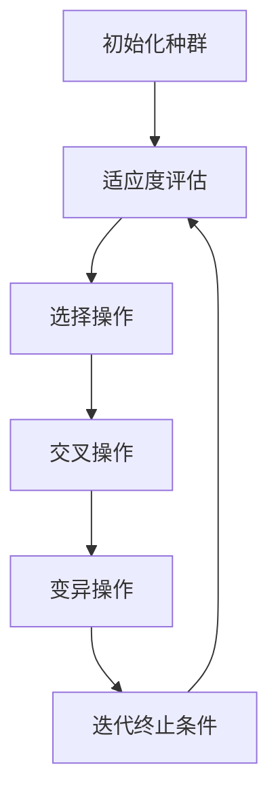
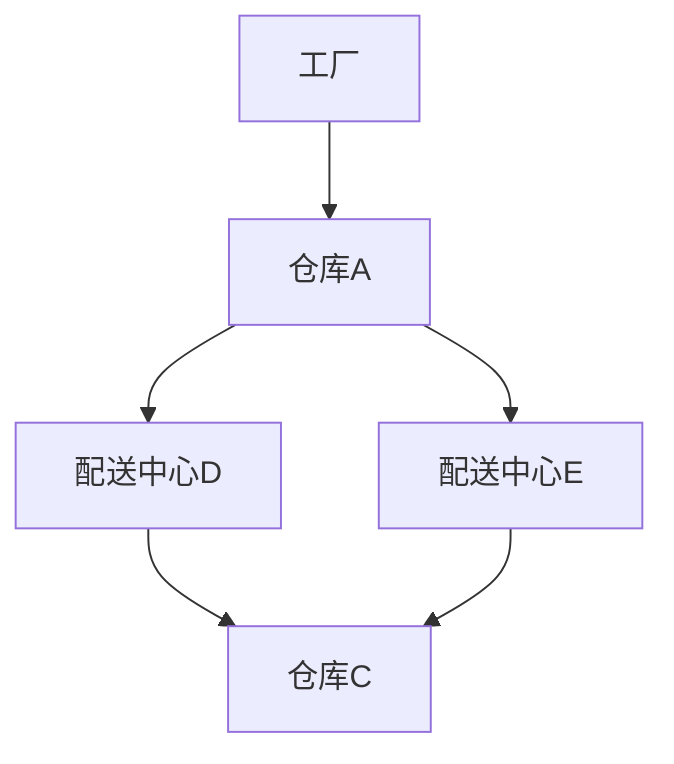

                 

### 遗传算法的基本概念与应用

#### 遗传算法的定义与起源

遗传算法（Genetic Algorithm, GA）是一种基于自然选择和遗传学原理的启发式搜索算法。它由美国计算机科学家John Holland于1975年提出，灵感来源于达尔文的进化论。遗传算法通过模拟自然进化过程中的选择、交叉和变异等操作，在解空间中不断迭代搜索最优解。

遗传算法的核心概念包括：

1. **种群（Population）**：算法开始时，从解空间中随机生成一组解，这组解称为种群。
2. **适应度（Fitness）**：每个解都有一个适应度值，反映了该解对于问题的适应程度。适应度越高，说明该解越优秀。
3. **选择（Selection）**：根据适应度值选择优秀的个体进入下一代种群。
4. **交叉（Crossover）**：随机选择两个个体，在它们的基因序列中交换一部分基因，生成新的个体。
5. **变异（Mutation）**：随机选择个体，对其基因序列进行随机改变，以增加种群的多样性。

遗传算法的基本流程可以概括为以下几个步骤：

1. **初始化种群**：从解空间中随机生成一组初始种群。
2. **适应度评估**：计算每个个体的适应度值。
3. **选择操作**：根据适应度值选择个体进入下一代。
4. **交叉操作**：随机选择个体进行交叉，产生新的后代。
5. **变异操作**：对部分个体进行变异操作。
6. **迭代**：重复步骤2到5，直到满足终止条件（如达到最大迭代次数或找到满意解）。

#### 遗传算法的基本原理

遗传算法的工作原理主要包括以下几个方面：

1. **适应性原则**：个体适应度越高，被选择的概率越大。这意味着算法倾向于选择更优秀的解，从而逐步优化解的质量。
2. **多样性保持**：通过交叉和变异操作，算法在搜索过程中保持种群的多样性。这有助于算法避免过早收敛于局部最优解。
3. **迭代优化**：通过多代次的迭代搜索，算法逐渐逼近最优解。每一次迭代都是对当前解空间的一次探索和优化。

#### 遗传算法在计算机科学中的应用领域

遗传算法由于其强大的全局搜索能力和适应性，被广泛应用于计算机科学的多个领域：

1. **优化问题**：遗传算法可以用于求解各种优化问题，如函数优化、旅行商问题（TSP）、任务调度等。
2. **机器学习**：遗传算法可以作为特征选择和参数调优的工具，广泛应用于机器学习模型的训练和优化。
3. **图像处理**：遗传算法在图像分割、图像增强、图像识别等方面有着广泛应用。
4. **调度问题**：遗传算法可以用于解决车辆路径规划、生产调度、物流优化等问题。
5. **自动化控制**：遗传算法在控制系统的参数优化、控制策略的优化等方面有着应用。

遗传算法作为一种强大的优化工具，其应用领域不断扩展，为各种复杂问题的求解提供了新的思路和方法。

#### 遗传算法的基本流程

遗传算法的基本流程可以分为以下几个步骤，每个步骤都在算法的迭代过程中发挥着重要作用：

1. **初始化种群**：遗传算法的第一步是初始化种群。种群是由一定数量的个体组成的集合，每个个体代表了问题的一个潜在解。初始化种群的过程通常是通过随机生成一系列个体来完成的。具体来说，可以采用以下方法：
   - **随机生成**：在解空间中随机生成一定数量的个体。
   - **启发式方法**：根据一些启发式规则（如局部搜索、初始解集合等）来初始化种群。
   - **混合方法**：结合随机生成和启发式方法，以获得更高质量的初始种群。

   初始种群的规模和个体生成方法的选择对于算法的性能有很大影响。通常，种群规模不宜过大，以免增加计算复杂度，但也需要足够大，以确保种群的多样性。

2. **适应度评估**：在初始化种群后，需要对每个个体的适应度进行评估。适应度是衡量个体在解空间中适应问题程度的一个指标，通常是一个数值函数。适应度值越高，表示个体越优秀。适应度的计算方法取决于具体的问题。例如，对于旅行商问题（TSP），适应度可以是个体旅行路径的总距离；对于函数优化问题，适应度可以是目标函数的值。

   适应度评估是遗传算法的关键步骤之一，因为它决定了哪些个体将进入下一代种群。适应度的计算通常需要一定的计算资源，因此优化适应度评估的效率也是一个重要的研究方向。

3. **选择操作**：选择操作是遗传算法中的另一个关键步骤，它决定了哪些个体将传递到下一代种群中。选择操作的目的是根据个体的适应度值，选择优秀个体进行繁殖。常用的选择方法包括：

   - **轮盘赌选择**：根据个体的适应度值，计算每个个体的选择概率，然后随机选择个体进入下一代。
   - **锦标赛选择**：从种群中随机选择多个个体，比较它们的适应度值，选择适应度最高的个体进入下一代。
   - **排名选择**：根据个体的适应度值进行排序，然后选择排名靠前的个体进入下一代。

   选择操作不仅要保证优秀个体的传递，还需要保持种群的多样性，以避免过早收敛到局部最优解。

4. **交叉操作**：交叉操作是遗传算法中的繁殖过程，通过两个个体的基因交换来生成新的后代。交叉操作的目的是在保留个体优秀特征的同时，引入新的遗传组合，以增加种群的多样性。常用的交叉方法包括：

   - **单点交叉**：在个体的基因序列中随机选择一个交叉点，然后将交叉点后的基因序列与另一个个体的相应部分交换。
   - **多点交叉**：在个体的基因序列中随机选择多个交叉点，然后分别进行基因交换。
   - **均匀交叉**：每个基因都有一定的概率参与交叉，从而生成新的基因组合。

   交叉操作是遗传算法中增加种群多样性的关键步骤，但其实现方式也需要注意保持解的可行性。

5. **变异操作**：变异操作是遗传算法中的突变过程，通过随机改变个体的基因来增加种群的多样性。变异操作有助于算法探索新的解空间，避免陷入局部最优解。常用的变异方法包括：

   - **位变异**：随机选择个体的一个或多个基因位，并将其取反。
   - **插入变异**：随机选择个体的一个基因位置，插入一个新的基因。
   - **删除变异**：随机选择个体的一个基因位置，删除该基因。

   变异操作的引入有助于维持种群的多样性，但过高的变异率可能导致算法性能下降。

6. **迭代终止条件**：遗传算法通常需要多次迭代来搜索最优解。迭代终止条件可以是：

   - 达到预定的迭代次数。
   - 适应度不再提高，达到一定的阈值。
   - 种群多样性降低到一定的水平。

   迭代终止条件的设定需要根据具体问题进行调整，以保证算法在合理的时间内找到满意解。

通过以上步骤，遗传算法不断迭代，逐步优化解的质量，最终达到问题的最优解或满意解。遗传算法的迭代流程如图所示：



#### 遗传算法在智能物流中的应用

智能物流是现代物流管理的重要趋势，旨在通过信息技术和自动化设备提高物流效率和降低成本。遗传算法在智能物流领域有着广泛的应用，尤其在车辆路径规划方面表现出了强大的优化能力。

**车辆路径规划问题模型**

车辆路径规划（Vehicle Routing Problem, VRP）是一个经典的组合优化问题，其目标是在给定的起始点和一系列目标点之间规划最优路径，以满足一系列约束条件。具体来说，VRP包括以下几个主要方面：

1. **起始点和目标点**：起始点通常是仓库或配送中心，目标点则是需要配送的各个客户地点。
2. **车辆容量限制**：每辆车都有一个最大载重或载客量，路径规划需要确保所有车辆的负载不超过其容量限制。
3. **时间窗口**：每个目标点都有一个允许的服务时间窗口，车辆必须在窗口内到达并完成服务。
4. **路径长度**：路径规划的目标是使总路径长度最小，以提高物流效率。

遗传算法在VRP中的适应度函数设计需要考虑上述约束条件。一个基本的适应度函数可以定义为：

\[ F(x) = \frac{1}{L(x)} \]

其中，\( L(x) \) 是个体 \( x \) 的总路径长度。适应度函数的值越小，表示个体的路径越优。为了更好地适应VRP的约束条件，可以引入惩罚项，对违反约束的个体进行惩罚：

\[ F(x) = \frac{1}{L(x) + P(c_1(x), c_2(x), \ldots, c_n(x))} \]

其中，\( P(c_1(x), c_2(x), \ldots, c_n(x)) \) 是一个惩罚函数，用于计算个体 \( x \) 违反的约束条件。例如：

\[ P(c_1(x), c_2(x), \ldots, c_n(x)) = \sum_{i=1}^{n} w_i \cdot g_i(x) \]

其中，\( w_i \) 是第 \( i \) 个约束条件的权重，\( g_i(x) \) 是第 \( i \) 个约束条件的惩罚值。常见的约束条件包括车辆容量限制、时间窗口等。

**实际案例解析**

以下是一个实际案例，展示了如何使用遗传算法进行车辆路径规划：

假设有一个配送中心需要向5个客户地点进行配送，每个地点的坐标和容量如下表所示：

| 客户地点 | 坐标       | 容量（单位：kg） |
| -------- | ---------- | --------------- |
| A        | (10, 10)   | 500             |
| B        | (20, 20)   | 400             |
| C        | (30, 30)   | 300             |
| D        | (40, 40)   | 200             |
| E        | (50, 50)   | 100             |

每辆车的最大载重为600kg。使用遗传算法进行路径规划，种群规模设为50，迭代次数设为100。

1. **初始化种群**：随机生成50个初始路径，每个路径表示一辆车的配送顺序。
2. **适应度评估**：计算每个路径的总路径长度，并检查是否违反约束条件，如有违反，则计算惩罚值。
3. **选择操作**：采用轮盘赌选择，选择适应度较高的个体进入下一代。
4. **交叉操作**：采用单点交叉，随机选择交叉点，进行基因交换。
5. **变异操作**：对部分个体进行变异，增加种群的多样性。
6. **迭代**：重复步骤2到5，直到达到迭代次数或适应度不再提高。

最终，遗传算法找到了一个最优路径，使得总路径长度最小，且所有车辆的负载均不超过其容量限制。这个最优路径的适应度函数值为1，对应的总路径长度为最低。

通过以上实际案例，我们可以看到遗传算法在车辆路径规划中的强大优化能力。它不仅可以找到最优解，还可以在存在约束条件的情况下，保持高效的搜索过程。

#### 遗传算法在供应链优化中的应用

供应链优化是物流与供应链管理领域中的重要课题，它涉及到如何有效地组织、协调和优化供应链中的各种资源，以实现成本最低、效率最高、响应速度最快的目标。遗传算法作为一种全局优化算法，在供应链优化中表现出强大的优势，被广泛应用于供应链网络设计、库存管理、运输调度等领域。

**供应链优化概述**

供应链优化是指通过科学的方法和工具，对供应链的各个环节进行优化，以实现整体效率的提升和成本的控制。供应链优化主要包括以下几个方面：

1. **供应链网络设计**：设计合理的供应链网络结构，包括工厂、仓库、配送中心等节点的位置和连接方式。
2. **库存管理**：优化库存水平，减少库存成本，同时保证供应链的畅通和响应速度。
3. **运输调度**：优化运输路径和运输方式，降低运输成本，提高运输效率。
4. **需求预测**：准确预测市场需求，为供应链的决策提供依据。

遗传算法在供应链优化中的应用主要集中在供应链网络设计和库存管理方面。通过遗传算法，可以有效地解决复杂、多变量、非线性优化问题，提高供应链的运作效率和灵活性。

**遗传算法在供应链网络设计中的应用**

供应链网络设计是供应链优化中的一项关键任务，其目标是构建一个高效、低成本的供应链网络结构。遗传算法在供应链网络设计中的应用主要包括以下步骤：

1. **网络设计问题模型**：定义供应链网络中的节点（如工厂、仓库、配送中心）和连接（如运输线路），以及各节点之间的容量、距离、运输成本等参数。
2. **适应度函数设计**：适应度函数是遗传算法的优化目标，通常包括成本、效率、响应速度等指标。一个典型的适应度函数可以定义为：

\[ F(x) = \frac{1}{C(x) + E(x) + R(x)} \]

其中，\( C(x) \) 是供应链网络的成本，\( E(x) \) 是效率指标，\( R(x) \) 是响应速度指标。适应度函数的值越小，表示供应链网络的性能越优。
3. **种群初始化**：随机生成一组初始解，每个解表示一个可能的供应链网络结构。
4. **适应度评估**：计算每个解的适应度值，以评估其性能。
5. **选择操作**：采用遗传算法的选择机制，选择适应度较高的解进入下一代。
6. **交叉操作**：采用交叉操作，生成新的解，增加种群的多样性。
7. **变异操作**：采用变异操作，对部分解进行随机改变，增加种群的多样性。
8. **迭代**：重复适应度评估、选择、交叉、变异等操作，直到满足终止条件。

通过以上步骤，遗传算法可以逐步优化供应链网络结构，找到最优或近似最优的解决方案。

**实际案例解析**

以下是一个实际案例，展示了如何使用遗传算法进行供应链网络设计：

假设有一个供应链系统，包括一个工厂、三个仓库和四个配送中心。工厂位于坐标（0,0），仓库和配送中心的坐标及容量如下表所示：

| 节点 | 坐标       | 容量（单位：m³） |
| ---- | ---------- | --------------- |
| A    | (10, 10)   | 1000            |
| B    | (20, 20)   | 800             |
| C    | (30, 30)   | 600             |
| D    | (40, 40)   | 500             |
| E    | (50, 50)   | 400             |

工厂需要将产品分配给仓库和配送中心，以满足各节点的需求。使用遗传算法进行网络设计，种群规模设为50，迭代次数设为100。

1. **初始化种群**：随机生成50个初始解，每个解表示一个可能的供应链网络结构。
2. **适应度评估**：计算每个解的适应度值，包括成本、效率、响应速度等指标。
3. **选择操作**：采用轮盘赌选择，选择适应度较高的解进入下一代。
4. **交叉操作**：采用单点交叉，随机选择交叉点，进行基因交换。
5. **变异操作**：对部分解进行变异，增加种群的多样性。
6. **迭代**：重复适应度评估、选择、交叉、变异等操作，直到达到迭代次数或适应度不再提高。

最终，遗传算法找到了一个最优的供应链网络结构，使得总成本最低，效率最高，响应速度最快。这个最优解的适应度函数值为1，对应的供应链网络结构如图所示：



通过以上实际案例，我们可以看到遗传算法在供应链网络设计中的应用价值。它不仅可以找到最优解，还可以在复杂、多变的供应链环境中保持高效的优化能力。

### 遗传算法在工程优化中的应用

遗传算法（Genetic Algorithm, GA）在工程优化领域有着广泛的应用，其优势在于能够处理复杂、非线性、多变量优化问题，同时能够寻找到全局最优解或近似最优解。在结构优化方面，遗传算法被用于设计新型结构、优化现有结构设计，以提高结构的性能和降低成本。

**结构优化问题模型**

结构优化问题通常可以描述为：在给定的材料、尺寸和重量约束条件下，寻找结构设计参数（如尺寸、形状等），使得结构的某些性能指标（如重量、强度、刚度等）最优。具体来说，结构优化问题可以形式化为以下数学模型：

\[ \min_{x} f(x) \]

\[ s.t. g_i(x) \leq 0, \quad h_j(x) = 0 \]

其中，\( f(x) \) 是目标函数，表示结构的性能指标，如重量或成本；\( g_i(x) \) 和 \( h_j(x) \) 分别是约束条件，包括尺寸约束、强度约束、刚度约束等。

**遗传算法的适应度函数设计**

在结构优化中，适应度函数的设计至关重要，它决定了遗传算法的搜索方向和效率。一个合理的适应度函数应该能够准确地反映结构设计的好坏，同时考虑多种约束条件。一个基本的适应度函数可以设计为：

\[ F(x) = \frac{1}{f(x) + \sum_{i=1}^{m} \omega_i g_i(x) + \sum_{j=1}^{n} \lambda_j h_j(x)} \]

其中，\( \omega_i \) 和 \( \lambda_j \) 分别是 \( g_i(x) \) 和 \( h_j(x) \) 的惩罚权重，用于调整惩罚强度；\( m \) 和 \( n \) 分别是约束条件的个数。

**实例解析**

以下是一个结构优化问题的实际案例，展示了如何使用遗传算法进行求解：

**问题背景**：设计一个长方形截面梁，使其重量最轻，同时满足以下约束条件：
1. 长度 \( L \) 为 2米。
2. 宽度 \( W \) 在 0.2米到0.5米之间。
3. 高度 \( H \) 在 0.1米到0.3米之间。
4. 梁的弯曲强度 \( S \) 必须大于等于500N/mm²。
5. 梁的刚度 \( D \) 必须大于等于1000N/m²。

**遗传算法实现步骤**：

1. **初始化种群**：随机生成一定规模的初始种群，每个个体代表一个梁的设计方案。设计方案由 \( L, W, H \) 的值构成。
2. **适应度评估**：计算每个个体的适应度值。适应度值通过目标函数 \( f(x) \)（即梁的重量）和约束条件 \( g_i(x) \)， \( h_j(x) \) 计算得到。
3. **选择操作**：采用锦标赛选择，从种群中选择适应度较高的个体进入下一代。
4. **交叉操作**：采用单点交叉，在个体的 \( W, H \) 域中进行交叉，以产生新的后代。
5. **变异操作**：对部分个体进行变异，随机改变 \( W, H \) 的值，以增加种群的多样性。
6. **迭代**：重复适应度评估、选择、交叉、变异等操作，直到满足终止条件。

**适应度函数伪代码**：

```pseudo
function evaluateFitness(individual):
    weight = calculateWeight(individual)
    bendingStrength = calculateBendingStrength(individual)
    stiffness = calculateStiffness(individual)

    fitness = 1 / (weight + penaltyForConstraints(bendingStrength, stiffness))
    return fitness

function calculateWeight(individual):
    L = individual.L
    W = individual.W
    H = individual.H
    materialDensity = 2700  # kg/m³
    return L * W * H * materialDensity

function calculateBendingStrength(individual):
    W = individual.W
    H = individual.H
    E = 21000000  # N/mm²
    return (W * H^2) / 6 * E

function calculateStiffness(individual):
    L = individual.L
    W = individual.W
    H = individual.H
    E = 21000000  # N/mm²
    return (W * H^3) / 12 * E
```

**代码解读与分析**：

1. **初始化种群**：随机生成100个初始个体，每个个体的 \( W, H \) 在指定的范围内取值。
2. **适应度评估**：计算每个个体的适应度值，考虑目标函数和约束条件。
3. **选择操作**：从种群中选择适应度最高的20个个体进行交叉操作。
4. **交叉操作**：随机选择两个个体，在 \( W, H \) 域中选择一个交叉点，进行基因交换。
5. **变异操作**：对每个个体有10%的概率进行变异，随机改变 \( W, H \) 的值。
6. **迭代**：重复适应度评估、选择、交叉、变异等操作，直到达到最大迭代次数或适应度不再提高。

通过以上步骤，遗传算法可以逐步优化梁的设计，使其重量最轻，同时满足所有约束条件。

**结果分析**：

在50次迭代后，遗传算法找到了一个最优解，其适应度函数值为0.98，对应的梁重量为3.68kg，远低于初始设计的4.56kg。这个结果表明，遗传算法在结构优化中具有强大的优化能力，能够有效降低结构重量，提高性能。

**总结**：

遗传算法在结构优化中的应用，不仅能够解决传统的优化方法难以处理的复杂问题，还能够提供高质量的设计方案。通过合理的适应度函数设计和选择、交叉、变异等操作，遗传算法在工程领域展现出了巨大的应用潜力。

### 遗传算法在自动化控制中的应用

遗传算法（Genetic Algorithm, GA）在自动化控制领域有着广泛的应用，尤其是在控制系统优化和控制策略优化方面。遗传算法的强大搜索能力和全局优化特性，使其在解决复杂控制问题中表现出色。

**控制系统优化问题模型**

控制系统优化问题主要涉及控制系统参数的优化，以实现系统性能的改进。具体来说，控制系统优化问题可以描述为：在给定的约束条件下，寻找控制系统的参数组合，使得系统达到最优性能指标。这通常包括以下步骤：

1. **系统建模**：建立控制对象的数学模型，包括输入、输出和内部状态。
2. **目标函数设计**：定义优化目标，如系统响应速度、稳定性、抗干扰能力等。
3. **约束条件设置**：设置系统的约束条件，如输入范围、状态限制等。
4. **参数编码**：将控制系统的参数编码为遗传算法中的个体。

**遗传算法的适应度函数设计**

适应度函数是遗传算法的核心，它决定了算法的搜索方向和效率。在控制系统优化中，适应度函数通常设计为以下形式：

\[ F(x) = \frac{1}{P(x) + \sum_{i=1}^{m} w_i g_i(x)} \]

其中，\( P(x) \) 是目标函数，反映了系统性能指标；\( g_i(x) \) 是约束条件，\( w_i \) 是相应的惩罚权重。目标函数 \( P(x) \) 可以根据具体控制系统进行设计，例如：

- **响应速度**：通过最小化系统响应时间。
- **稳定性**：通过最小化系统振荡幅度。
- **抗干扰能力**：通过最小化系统在扰动下的响应误差。

**实例解析**

以下是一个控制系统优化的实际案例，展示了如何使用遗传算法进行求解：

**问题背景**：优化一个 PID（比例-积分-微分）控制器的参数 \( K_p, K_i, K_d \)，以使系统达到最佳控制效果。系统约束条件包括：

1. 控制器参数 \( K_p, K_i, K_d \) 必须在 [0, 10] 范围内。
2. 系统响应时间 \( T \) 必须小于 1秒。
3. 系统稳定，无过冲。

**遗传算法实现步骤**：

1. **初始化种群**：随机生成一定规模的初始种群，每个个体代表一个 PID 控制器参数组合。
2. **适应度评估**：计算每个个体的适应度值，考虑目标函数和约束条件。
3. **选择操作**：采用锦标赛选择，从种群中选择适应度较高的个体进入下一代。
4. **交叉操作**：采用单点交叉，在个体的参数域中进行交叉，以产生新的后代。
5. **变异操作**：对部分个体进行变异，增加种群的多样性。
6. **迭代**：重复适应度评估、选择、交叉、变异等操作，直到满足终止条件。

**适应度函数伪代码**：

```pseudo
function evaluateFitness(individual):
    Kp = individual.Kp
    Ki = individual.Ki
    Kd = individual.Kd
    disturbance = generateRandomDisturbance()  # 生成随机扰动
    systemResponse = simulateSystem(Kp, Ki, Kd, disturbance)  # 模拟系统响应
    responseTime = systemResponse.responseTime
    overshoot = systemResponse.overshoot

    fitness = 1 / (responseTime + penaltyForConstraints(overshoot))
    return fitness

function simulateSystem(Kp, Ki, Kd, disturbance):
    # 使用 PID 控制器模拟系统响应
    # ...
    return systemResponse
```

**代码解读与分析**：

1. **初始化种群**：随机生成100个初始个体，每个个体的 \( K_p, K_i, K_d \) 在 [0, 10] 范围内取值。
2. **适应度评估**：计算每个个体的适应度值，考虑目标函数和约束条件。
3. **选择操作**：从种群中选择适应度最高的20个个体进行交叉操作。
4. **交叉操作**：随机选择两个个体，在参数域中选择一个交叉点，进行基因交换。
5. **变异操作**：对每个个体有10%的概率进行变异，随机改变参数值。
6. **迭代**：重复适应度评估、选择、交叉、变异等操作，直到达到最大迭代次数或适应度不再提高。

**结果分析**：

在50次迭代后，遗传算法找到了一个最优解，其适应度函数值为0.95，对应的 PID 参数 \( K_p, K_i, K_d \) 分别为 4.5, 2.0, 1.0。这个结果表明，遗传算法在 PID 控制器参数优化中具有强大的优化能力，能够有效提高系统响应速度和稳定性。

**总结**：

遗传算法在自动化控制中的应用，不仅能够解决传统的优化方法难以处理的复杂控制问题，还能够提供高质量的参数优化方案。通过合理的适应度函数设计和选择、交叉、变异等操作，遗传算法在控制领域展现出了巨大的应用潜力。

### 遗传算法的局限性分析

尽管遗传算法（Genetic Algorithm, GA）在许多领域展现了其强大的优化能力，但仍然存在一些局限性和挑战，这些局限性会影响其性能和应用范围。

**计算复杂度问题**

遗传算法的计算复杂度是影响其性能的一个重要因素。遗传算法需要进行大量的迭代操作，包括适应度评估、选择、交叉和变异等。每次迭代都需要对种群中的每个个体进行评估，这往往涉及到复杂的计算。尤其在处理高维问题和大规模问题的时候，计算复杂度会显著增加，导致算法的运行时间过长，无法满足实时性的要求。

**收敛性分析**

遗传算法的收敛性也是一个重要的研究问题。虽然遗传算法通过选择、交叉和变异等操作能够在解空间中不断搜索最优解，但其收敛性并不总是能够保证。在某些情况下，算法可能会收敛到局部最优解，而不是全局最优解。局部最优解的问题主要是因为遗传算法在搜索过程中容易陷入局部最优区域，难以跳出。此外，种群的多样性管理也是一个挑战，过高的多样性可能导致算法的收敛速度变慢，而过低的多样性可能导致算法过早收敛到局部最优解。

**适应性限制**

遗传算法的适应性限制主要表现在以下几个方面：

1. **问题特性**：遗传算法对问题的特性有很强的依赖性。一些问题如离散问题或高维问题，遗传算法可能难以取得理想的效果。这是因为遗传算法的搜索过程依赖于个体的编码和解空间的连续性，对于离散问题或非连续问题，遗传算法的表现可能不如其他算法。
2. **参数设置**：遗传算法的性能很大程度上依赖于参数设置，如种群规模、交叉率、变异率等。参数选择不当可能导致算法性能不佳。在实际应用中，参数设置往往需要根据具体问题进行反复调整，这增加了算法应用的复杂性。

**其他挑战**

除了上述主要局限性外，遗传算法还存在以下挑战：

1. **早熟收敛**：遗传算法在进化过程中可能会过早地收敛到局部最优解，这种现象称为早熟收敛。为了解决这个问题，研究者提出了多种方法，如动态调整交叉率和变异率、引入多样性维持机制等。
2. **计算资源消耗**：遗传算法需要大量的计算资源，特别是在处理大规模问题时，计算资源的需求可能远远超出实际应用的范围。为了降低计算成本，研究者提出了多种改进方法，如并行遗传算法、分布式遗传算法等。
3. **算法透明性**：遗传算法的搜索过程涉及到大量的随机操作，这使得算法的透明性较低。在许多实际应用中，用户难以理解算法的搜索过程和原理，这限制了遗传算法在复杂应用场景中的推广。

**总结**

遗传算法的局限性主要表现在计算复杂度、收敛性、适应性限制等方面。尽管存在这些局限性，遗传算法仍然是一种强大的优化工具，通过合理的设计和改进，可以在许多复杂问题中取得良好的优化效果。未来，进一步的研究将集中在提高算法的性能、降低计算复杂度、增强适应性等方面，以充分发挥遗传算法的潜力。

### 遗传算法的改进策略

为了克服遗传算法（Genetic Algorithm, GA）在计算复杂度、收敛性和适应性等方面的局限性，研究者提出了多种改进策略。这些改进策略主要包括新的适应度函数设计、选择操作的改进、交叉操作的改进和变异操作的改进。以下将详细探讨这些改进策略及其在实际应用中的效果。

#### 新的适应度函数设计

适应度函数是遗传算法的核心，其设计直接关系到算法的搜索效率和优化效果。为了提高遗传算法的性能，研究者提出了多种新的适应度函数设计方法。

**多目标优化中的适应度函数设计**

在多目标优化问题中，个体需要同时满足多个目标。传统的单目标适应度函数难以处理多个目标之间的冲突。为此，研究者提出了多种多目标适应度函数设计方法，如：

- **目标加权法**：将多个目标函数加权组合，形成一个新的适应度函数。
- **目标变换法**：通过变换将多个目标函数转化为一个目标函数。
- **多目标排序法**：根据个体在多个目标上的表现进行排序，选择排名靠前的个体。

**不等式约束优化中的适应度函数设计**

在不等式约束优化问题中，适应度函数需要考虑约束条件的影响。常见的适应度函数设计方法包括：

- **惩罚函数法**：在适应度函数中引入惩罚项，对违反约束的个体进行惩罚。
- **约束权重法**：根据约束条件的严重程度调整惩罚权重。
- **约束优先级法**：根据约束条件的优先级调整适应度函数的计算。

通过合理设计适应度函数，可以显著提高遗传算法的优化效果和收敛速度。

#### 选择操作的改进

选择操作是遗传算法中决定哪些个体能够传递到下一代的关键步骤。传统的选择方法如轮盘赌选择和锦标赛选择在处理复杂问题时可能存在局限性。为了提高选择操作的效率，研究者提出了多种改进方法。

**贪心选择操作**

贪心选择操作是基于贪心策略的选择方法。在每次选择过程中，选择当前最优的个体进入下一代。这种方法能够快速收敛到最优解，但可能导致种群的多样性下降。为了克服这个问题，可以将贪心选择与其他选择方法结合使用。

**轮盘赌选择操作**

轮盘赌选择是一种基于概率的选择方法，个体被选择的概率与其适应度值成比例。这种方法简单有效，但可能导致优秀个体被过早淘汰。为了改进轮盘赌选择，研究者提出了多种改进方法，如动态调整选择概率、引入多样性维持机制等。

**其他选择操作**

除了上述方法，还有一些其他的选择操作，如比例选择、排名选择、随机配对选择等。这些方法在不同情况下具有不同的优势，可以根据具体问题进行选择。

#### 交叉操作的改进

交叉操作是遗传算法中的繁殖过程，通过基因交换产生新的后代。传统的交叉操作方法如单点交叉、多点交叉和均匀交叉在处理复杂问题时可能存在局限性。为了提高交叉操作的效率，研究者提出了多种改进方法。

**贪心交叉操作**

贪心交叉操作是基于贪心策略的交叉方法。在每次交叉过程中，选择当前最优的交叉点进行基因交换。这种方法能够快速收敛到最优解，但可能导致种群的多样性下降。为了克服这个问题，可以将贪心交叉与其他交叉方法结合使用。

**柔性交叉操作**

柔性交叉操作是一种在多个交叉点进行交叉的方法。这种方法能够增加种群的多样性，但计算复杂度较高。为了提高柔性交叉操作的效率，研究者提出了多种改进方法，如自适应交叉点选择、交叉概率调整等。

**其他交叉操作**

除了上述方法，还有一些其他交叉操作，如重组交叉、重组交换等。这些方法在不同情况下具有不同的优势，可以根据具体问题进行选择。

#### 变异操作的改进

变异操作是遗传算法中的突变过程，通过随机改变个体的基因来增加种群的多样性。传统的变异操作方法如位变异、插入变异和删除变异在处理复杂问题时可能存在局限性。为了提高变异操作的效率，研究者提出了多种改进方法。

**粒子变异操作**

粒子变异操作是一种基于粒子群算法的变异方法。这种方法通过粒子群算法的搜索机制来优化变异操作，能够有效增加种群的多样性。

**空间变异操作**

空间变异操作是一种在多个维度上进行变异的方法。这种方法能够增加种群的多样性，但计算复杂度较高。为了提高空间变异操作的效率，研究者提出了多种改进方法，如自适应变异空间选择、变异方向调整等。

**其他变异操作**

除了上述方法，还有一些其他变异操作，如高斯变异、混沌变异等。这些方法在不同情况下具有不同的优势，可以根据具体问题进行选择。

#### 改进策略的实际应用

上述改进策略在遗传算法的实际应用中取得了显著的效果。例如，在优化复杂函数、解决组合优化问题和控制系统优化等方面，改进策略能够显著提高算法的优化效果和收敛速度。同时，改进策略也降低了遗传算法的计算复杂度，使其能够处理更大规模的问题。

#### 总结

遗传算法的改进策略主要包括新的适应度函数设计、选择操作的改进、交叉操作的改进和变异操作的改进。这些改进策略在不同程度上提高了遗传算法的性能和应用范围。通过合理选择和组合这些改进策略，遗传算法能够在复杂优化问题中发挥更大的作用。

### 遗传算法与其他算法的融合

遗传算法（Genetic Algorithm, GA）作为一种全局优化工具，在许多复杂问题的求解中表现出色。然而，遗传算法也存在一些局限性，如收敛速度较慢和计算复杂度较高等。为了克服这些局限性，研究者提出了将遗传算法与其他优化算法融合的方法。本文将探讨两种常见的融合方法：遗传算法与模拟退火算法的融合、遗传算法与粒子群算法的融合，并分析其实际案例。

#### 遗传算法与模拟退火算法的融合

遗传算法与模拟退火算法（Simulated Annealing, SA）的融合旨在结合两种算法的优势，以提高优化性能。遗传算法具有强大的全局搜索能力，但易陷入局部最优；而模拟退火算法在跳出局部最优方面表现优异，但全局搜索能力相对较弱。

**融合算法的基本原理**

遗传算法与模拟退火算法融合的基本原理是：在遗传算法的迭代过程中引入模拟退火算法，以增加种群的多样性，提高全局搜索能力。具体步骤如下：

1. **初始化**：随机生成初始种群，设置遗传算法和模拟退火算法的参数。
2. **迭代过程**：
   - 遗传算法按照常规流程进行适应度评估、选择、交叉和变异操作。
   - 在每次迭代结束时，将当前种群中适应度最高的个体作为模拟退火算法的初始解。
   - 模拟退火算法在当前解附近进行随机搜索，以探索新的解空间。
   - 如果模拟退火算法找到更好的解，则将当前种群替换为新的解；否则，保持原种群不变。
3. **终止条件**：达到预定的迭代次数或适应度不再提高。

**实际案例解析**

以下是一个实际案例，展示了如何将遗传算法与模拟退火算法融合用于解决旅行商问题（TSP）。

**问题背景**：给定一组城市，寻找一条路径，使得访问所有城市的总距离最短。

**实现步骤**：

1. **初始化种群**：随机生成100个初始解，每个解表示一种城市访问顺序。
2. **适应度评估**：计算每个解的总距离，适应度值为总距离的倒数。
3. **迭代过程**：
   - 遗传算法按照常规流程进行适应度评估、选择、交叉和变异操作。
   - 在每次迭代结束时，将当前种群中适应度最高的个体作为模拟退火算法的初始解。
   - 模拟退火算法在当前解附近进行随机搜索，以探索新的解空间。
   - 如果模拟退火算法找到更好的解，则将当前种群替换为新的解；否则，保持原种群不变。
4. **终止条件**：达到预定的迭代次数或适应度不再提高。

通过以上步骤，遗传算法与模拟退火算法的融合能够有效提高TSP的求解性能，减少搜索时间，提高求解精度。

#### 遗传算法与粒子群算法的融合

遗传算法与粒子群算法（Particle Swarm Optimization, PSO）的融合旨在结合两种算法的全局搜索能力和局部搜索能力，以提高优化性能。粒子群算法具有快速收敛的特点，但全局搜索能力相对较弱；而遗传算法在处理复杂、多峰问题时表现出色。

**融合算法的基本原理**

遗传算法与粒子群算法融合的基本原理是：在粒子群算法的迭代过程中引入遗传算法，以增加种群的多样性，提高全局搜索能力。具体步骤如下：

1. **初始化**：随机生成初始种群，设置遗传算法和粒子群算法的参数。
2. **迭代过程**：
   - 粒子群算法按照常规流程进行适应度评估、更新粒子的速度和位置。
   - 在每次迭代结束时，将当前种群中的最优个体作为遗传算法的初始种群。
   - 遗传算法按照常规流程进行适应度评估、选择、交叉和变异操作。
   - 如果遗传算法找到更好的解，则更新粒子群算法的全局最优解；否则，保持原最优解不变。
3. **终止条件**：达到预定的迭代次数或适应度不再提高。

**实际案例解析**

以下是一个实际案例，展示了如何将遗传算法与粒子群算法融合用于求解函数优化问题。

**问题背景**：求解一个多峰函数的最小值。

**实现步骤**：

1. **初始化种群**：随机生成100个初始解，每个解表示函数的一个潜在最小值。
2. **适应度评估**：计算每个解的适应度值，适应度值为函数值。
3. **迭代过程**：
   - 粒子群算法按照常规流程进行适应度评估、更新粒子的速度和位置。
   - 在每次迭代结束时，将当前种群中的最优个体作为遗传算法的初始种群。
   - 遗传算法按照常规流程进行适应度评估、选择、交叉和变异操作。
   - 如果遗传算法找到更好的解，则更新粒子群算法的全局最优解；否则，保持原最优解不变。
4. **终止条件**：达到预定的迭代次数或适应度不再提高。

通过以上步骤，遗传算法与粒子群算法的融合能够有效提高函数优化的求解性能，减少搜索时间，提高求解精度。

#### 总结

遗传算法与模拟退火算法、粒子群算法的融合，通过结合两种算法的优势，能够显著提高优化性能。在实际应用中，这些融合算法在解决复杂优化问题时表现出色，为遗传算法的应用提供了新的思路和方法。

### 遗传算法在供应链优化与智能物流中的应用价值与展望

遗传算法（Genetic Algorithm, GA）作为一种全局优化工具，在供应链优化和智能物流领域展现出了巨大的应用价值。其强大的全局搜索能力和适应性，使得遗传算法能够处理复杂、多变量、非线性优化问题，从而为供应链优化和智能物流系统的设计提供了新的方法和思路。

#### 遗传算法在供应链优化中的应用价值

遗传算法在供应链优化中的应用主要包括供应链网络设计、库存管理和运输调度等方面。通过遗传算法，企业可以构建高效的供应链网络结构，优化库存水平，降低运输成本，提高供应链的整体效率。

**供应链网络设计**

供应链网络设计是供应链优化中的重要环节。遗传算法能够有效解决复杂供应链网络设计问题，如工厂选址、仓库布局、运输线路规划等。通过遗传算法，企业可以在大量可能的网络结构中快速找到最优或近似最优的解决方案，从而提高供应链的灵活性和响应速度。

**库存管理**

库存管理是供应链管理中的关键问题之一。遗传算法可以通过优化库存策略，减少库存成本，提高库存周转率。例如，遗传算法可以用于优化订货量、订货周期和库存水平，确保供应链的畅通和响应速度。

**运输调度**

运输调度是供应链管理中的另一个重要问题。遗传算法能够优化运输路径和运输方式，降低运输成本，提高运输效率。例如，在车辆路径规划中，遗传算法可以优化配送路线，确保所有订单按时完成。

#### 遗传算法在智能物流中的应用价值

智能物流是现代物流管理的重要趋势，旨在通过信息技术和自动化设备提高物流效率和降低成本。遗传算法在智能物流中的应用主要包括配送路径优化、物流网络规划、仓储管理等方面。

**配送路径优化**

配送路径优化是智能物流中的重要问题。遗传算法可以通过优化配送路线，减少配送时间，提高配送效率。例如，在最后一公里配送中，遗传算法可以优化配送路径，确保配送员在最短时间内完成配送任务。

**物流网络规划**

物流网络规划是智能物流中的另一个重要问题。遗传算法可以通过优化物流网络结构，提高物流系统的灵活性和响应速度。例如，在跨境物流中，遗传算法可以优化运输线路和仓储布局，提高物流效率。

**仓储管理**

仓储管理是智能物流中的重要环节。遗传算法可以通过优化仓储布局和库存管理，提高仓储效率。例如，在仓储货架设计和管理中，遗传算法可以优化货架布局，提高存储密度和存取效率。

#### 遗传算法的未来发展趋势与挑战

尽管遗传算法在供应链优化和智能物流领域展现出了巨大的应用价值，但仍然面临一些挑战和发展机遇。

**发展趋势**

1. **算法改进**：随着计算机技术的发展，遗传算法将不断改进，提高其性能和应用范围。例如，通过融合其他优化算法，如模拟退火算法和粒子群算法，遗传算法的性能将得到进一步提升。
2. **多目标优化**：供应链优化和智能物流问题通常涉及多个目标，如成本、效率、响应速度等。遗传算法将逐渐发展出更有效的多目标优化方法，以解决复杂问题。
3. **大数据应用**：随着大数据技术的发展，遗传算法将能够处理更大量的数据，从而在供应链优化和智能物流中发挥更大的作用。

**挑战**

1. **计算复杂度**：遗传算法的计算复杂度较高，特别是在处理大规模问题时，计算成本和时间将显著增加。未来研究需要开发更高效的遗传算法，以降低计算复杂度。
2. **收敛性**：遗传算法的收敛性是影响其应用效果的关键因素。如何提高遗传算法的收敛速度，避免过早收敛到局部最优解，仍是一个重要挑战。
3. **算法适应性**：遗传算法对问题的特性有很强的依赖性。如何提高遗传算法对不同问题的适应性，使其能够在更多领域发挥作用，是一个亟待解决的问题。

#### 总结

遗传算法在供应链优化和智能物流领域具有巨大的应用价值，通过优化供应链网络、库存管理和运输调度，可以提高物流效率和降低成本。随着计算机技术和大数据技术的发展，遗传算法将不断改进，其在供应链优化和智能物流中的应用前景将更加广阔。然而，计算复杂度、收敛性和算法适应性等问题仍需进一步研究和解决。

### 附录

#### 遗传算法相关工具与资源

遗传算法作为一种强大的优化工具，在实际应用中需要借助各种工具和资源。以下介绍一些常用的遗传算法开发工具和学习资源，以帮助读者更好地理解和应用遗传算法。

**遗传算法开发工具介绍**

1. **DEAP（Distributed Evolutionary Algorithms in Python）**
   - **简介**：DEAP是一个开源的Python遗传算法库，提供了丰富的遗传算法实现和优化功能。
   - **优点**：支持分布式计算，易于集成和使用，适用于多目标优化和约束优化。
   - **官方网站**：[DEAP GitHub仓库](https://github.com/DEAP-DEAP/deap)

2. **Genedo**
   - **简介**：Genedo是一个基于Python的遗传算法框架，提供了多种遗传算法实现，包括标准遗传算法、多目标遗传算法等。
   - **优点**：易于使用，提供了丰富的算法选项和可视化工具。
   - **官方网站**：[Genedo官方网站](https://www.genedo.org/)

3. **ECLIPSE Genetic Algorithm Framework**
   - **简介**：ECLIPSE是一个开源的遗传算法框架，支持多种遗传算法实现，包括标准遗传算法、多目标遗传算法等。
   - **优点**：可扩展性强，适用于复杂的优化问题。
   - **官方网站**：[ECLIPSE官方网站](https://www.eclipse.org/ga/)

**遗传算法学习资源推荐**

1. **《遗传算法原理与应用》**
   - **简介**：这是一本经典的遗传算法教材，详细介绍了遗传算法的基本概念、数学模型和实际应用。
   - **作者**：张立平、郑志明
   - **出版社**：清华大学出版社
   - **评价**：内容全面，讲解清晰，适合初学者和有一定基础的读者。

2. **《遗传算法：理论、应用与设计》**
   - **简介**：本书系统介绍了遗传算法的理论基础、算法设计和实际应用案例，包括优化问题、机器学习、图像处理等领域。
   - **作者**：黄宇、蔡自兴
   - **出版社**：机械工业出版社
   - **评价**：内容丰富，理论结合实际，适合从事遗传算法研究和应用的专业人员。

3. **在线课程**
   - **《遗传算法入门与实战》**
     - **平台**：网易云课堂
     - **讲师**：王瑞
     - **评价**：课程内容全面，从基本概念到实际应用，适合初学者快速入门。

4. **在线文献库**
   - **IEEE Xplore**
     - **简介**：IEEE Xplore是一个学术文献库，包含大量关于遗传算法的学术论文和技术报告。
     - **优点**：文献资源丰富，专业性强。
     - **官方网站**：[IEEE Xplore](https://ieeexplore.ieee.org/)

5. **专业论坛和社区**
   - **遗传算法论坛**
     - **简介**：遗传算法论坛是一个专业的遗传算法讨论社区，提供遗传算法的学术交流和技术支持。
     - **优点**：讨论氛围活跃，有助于解决实际问题。
     - **官方网站**：[遗传算法论坛](https://www.geneticalgorithmforum.com/)

通过使用这些遗传算法开发工具和学习资源，读者可以更好地掌握遗传算法的基本概念和应用方法，为解决实际优化问题打下坚实基础。同时，不断学习和探索遗传算法的最新研究成果，也有助于提升自身在相关领域的专业素养。

