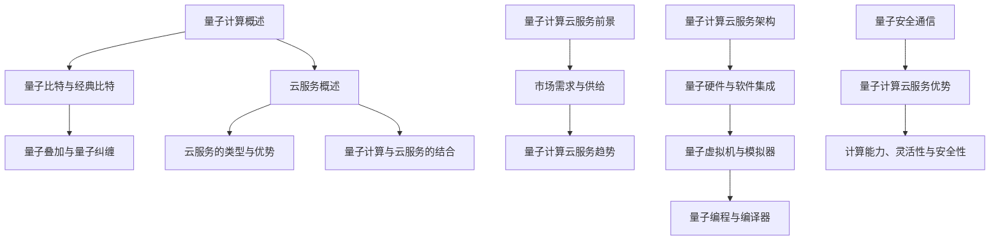

                 

### 量子计算云服务：前沿科技的创业机会

#### 关键词：
- 量子计算
- 云服务
- 创业机会
- 技术创新
- 商业模式

#### 摘要：
随着量子计算技术的迅速发展，量子计算云服务成为了一个新兴的创业领域。本文将探讨量子计算与云服务的结合，分析量子计算的基本原理和核心算法，解析量子计算云服务的架构和技术，评估创业机会，探讨商业模式，并分享实际创业经验和挑战。通过本文，读者将了解量子计算云服务的前沿科技和潜在的商业价值。

### 引言

量子计算作为现代科学的前沿领域，近年来受到了广泛关注。量子计算具有与传统计算截然不同的原理和特性，其强大的计算能力有望在解决复杂问题上发挥巨大作用。与此同时，云服务作为信息技术的重要基础设施，已经深刻改变了企业运营和数据处理的方式。将量子计算与云服务相结合，形成量子计算云服务，不仅能够充分发挥量子计算的潜力，还能为企业提供灵活、高效、安全的计算资源。

当前，量子计算云服务正处于起步阶段，市场前景广阔。然而，量子计算技术仍面临诸多挑战，包括硬件设备、算法开发、安全性等问题。对于创业者而言，抓住量子计算云服务的机遇，不仅可以推动技术进步，还可以开创出独特的商业模式，实现商业价值。

本文旨在通过分析量子计算的基本原理、核心算法，以及量子计算云服务的架构和技术，探讨量子计算云服务的创业机会，分析商业模式，并分享实际创业经验和挑战。希望通过本文，读者能够对量子计算云服务有更深入的了解，从而抓住这一前沿科技的创业机遇。

### 《量子计算云服务：前沿科技的创业机会》目录大纲

在本节中，我们将对全文的结构进行概述，并详细介绍各个章节的内容和目标，以便读者更好地把握文章的脉络。

#### 第一部分：量子计算云服务概述

**第1章：量子计算与云服务的结合**

这一章节将介绍量子计算和云服务的基本概念，阐述它们结合的必要性和重要性。首先，我们将详细解释量子计算的基本概念，如量子比特、量子叠加和量子纠缠。接着，我们将探讨云服务的定义、类型和优势，以及量子计算如何对云服务产生深远的影响。最后，我们将分析量子计算云服务的市场前景，探讨其当前状态、需求与供给，以及未来的发展趋势。

**第2章：量子计算原理与核心算法**

本章将深入探讨量子计算的基本原理，包括量子门、量子电路和量子算法。我们将详细解释这些概念，并讨论它们如何与传统计算不同。此外，我们将重点介绍量子计算的核心算法，如Shor算法、Grover算法和变分量子特征求解器。通过这些算法的解析，我们将展示量子计算的强大计算能力和潜在应用领域。

**第3章：量子计算云服务的架构与技术**

这一章节将探讨量子计算云服务的架构设计和技术实现。我们将分析量子计算硬件与软件的集成，量子虚拟机与模拟器，量子编程与编译器，以及量子安全通信等关键技术。接着，我们将介绍主流量子计算云服务平台，如IBM、Microsoft和Google等，并探讨这些平台的具体应用案例。最后，我们将总结量子计算云服务的优势，如计算能力、灵活性和安全性等。

#### 第二部分：创业机会与商业模式

**第4章：量子计算云服务的创业机会分析**

本章将分析量子计算云服务的创业机会，探讨其商业模式。我们将详细讨论B2B、B2C和平台模式等不同的商业模式，并分析各个模式的市场细分和需求。此外，我们将提出量子计算云服务的创业策略，包括创业机会识别、创业团队组建和资源整合等。

**第5章：量子计算云服务的创新案例研究**

这一章节将通过具体案例，研究量子计算云服务的创新应用。我们将探讨企业级应用案例，如量子优化在物流调度中的应用和量子算法在药物研发中的应用。同时，我们将介绍量子计算开源社区和量子计算云服务生态链的建设，展示量子计算云服务的实际应用场景。

**第6章：量子计算云服务的创业实践**

本章将分享量子计算云服务的创业实践，包括项目规划与实施、创业融资与投资，以及创业风险管理与应对策略。我们将详细讨论创业项目的立项、技术研究和团队组建，以及产品设计和功能实现。此外，我们将分析创业融资渠道和策略，投资机构的合作，以及风险识别、评估和控制。

**第7章：量子计算云服务的可持续发展**

本章将探讨量子计算云服务的可持续发展策略，包括理念与战略、技术创新和未来展望。我们将讨论量子计算与云计算的深度融合，量子计算云服务的国际竞争力，以及社会责任与伦理考量。通过这些讨论，我们将展望量子计算云服务的未来发展趋势和潜在影响。

#### 附录

**附录 A：量子计算云服务开发工具与资源**

本附录将介绍量子计算云服务开发常用的工具和资源，包括IBM Q Experience、Microsoft Quantum Development Kit、Google Cirq等。我们将详细讲解这些工具的功能和使用方法，帮助开发者更好地掌握量子计算云服务的开发技能。

**附录 B：参考文献**

本附录将列出本文引用的主要参考文献，包括量子计算和云服务领域的经典书籍，以及创业相关书籍。通过这些参考文献，读者可以进一步深入了解量子计算云服务的理论和技术。

**附录 C：量子计算与云服务核心概念流程图**

本附录将使用Mermaid语言绘制量子计算与云服务核心概念流程图，帮助读者更好地理解量子计算的基本原理和云服务的架构。

**附录 D：量子计算核心算法伪代码讲解**

本附录将使用伪代码形式详细讲解量子计算的核心算法，如Shor算法、Grover算法和变分量子特征求解器。通过伪代码的展示，读者可以更直观地理解算法的执行过程和计算步骤。

**附录 E：数学模型与数学公式讲解**

本附录将介绍量子计算中的数学模型和公式，包括量子态的表示、量子比特的叠加与测量等。通过latex格式的数学公式，我们将详细讲解这些概念和计算方法。

**附录 F：量子计算云服务项目实战**

本附录将分享一个量子计算云服务项目的实战案例，包括开发环境搭建、代码实现与解读，以及代码解读与分析。通过这个案例，读者可以学习到量子计算云服务的实际开发过程和关键技术。

### 第一部分：量子计算云服务概述

#### 第1章：量子计算与云服务的结合

**1.1 量子计算的基本概念**

量子计算是一种基于量子力学原理的新型计算模式。与传统的二进制计算不同，量子计算使用量子比特（qubit）作为信息存储和处理的基本单位。量子比特具有独特的性质，如叠加态和纠缠态，这些性质使得量子计算机能够在某些特定问题上有显著的计算速度优势。

**量子比特与经典比特的对比**

经典比特是计算机中最基本的存储单元，它只能处于两种状态之一：0或1。量子比特则不同，它可以通过叠加态同时表示0和1的多种组合。这种叠加态使得量子比特能够同时处理多个计算任务，从而大大提高计算效率。

**量子叠加与量子纠缠**

量子叠加是指一个量子系统可以处于多个可能状态的叠加，而不是单一状态。例如，一个量子比特可以处于0和1的叠加状态。量子纠缠则是指两个或多个量子系统之间的量子态相互关联，即使它们相隔很远，一个系统的状态也会影响到另一个系统。量子纠缠是量子计算实现并行计算能力的关键。

**1.2 云服务的发展与挑战**

**云服务的定义与类型**

云服务是一种通过网络提供计算资源、存储资源和软件服务的模式。它分为三种类型：基础设施即服务（IaaS）、平台即服务（PaaS）和软件即服务（SaaS）。IaaS提供虚拟化的基础设施资源，如虚拟机、存储和网络；PaaS提供开发平台和工具，使开发者能够快速构建应用；SaaS提供完整的软件应用服务，用户可以通过网络访问和使用。

**云服务的优势与挑战**

云服务的优势包括灵活的资源管理、高效的计算能力、可靠的数据存储和安全保障等。然而，云服务也面临着一系列挑战，如数据隐私保护、网络延迟、可靠性保障和成本控制等。量子计算对云服务的影响在于，它有望解决某些传统计算难以克服的难题，提升云服务的整体性能。

**量子计算对云服务的影响**

量子计算对云服务的影响主要体现在以下几个方面：

1. **计算能力提升**：量子计算机具有超强的计算能力，可以快速解决传统计算机难以处理的复杂问题，如因数分解、大规模优化和模拟量子系统等。
2. **数据处理效率**：量子计算能够高效地处理大数据，通过量子并行计算和量子纠错技术，提高数据处理的速度和准确性。
3. **安全性增强**：量子计算能够提供更强大的加密和破解能力，有助于提高数据传输和存储的安全性。

**1.3 量子计算云服务的市场前景**

**量子计算云服务的市场现状**

目前，量子计算云服务市场尚处于早期阶段，但仍有一些领先的科技公司和研究机构开始提供量子计算云服务。例如，IBM的IBM Q、Google的Quantum Cloud和Microsoft的Azure Quantum等。这些平台通过提供量子虚拟机和模拟器，使得开发者可以便捷地访问和使用量子计算资源。

**量子计算云服务的需求与供给**

量子计算云服务的需求主要来自于各个领域的专业机构和企业，如金融、医药、物流和能源等。这些行业对高性能计算和复杂问题求解的需求日益增长，量子计算云服务提供了有效解决方案。供给方面，随着量子计算技术的不断进步，越来越多的量子计算硬件和平台将被开发和部署，满足不断增长的市场需求。

**量子计算云服务的发展趋势**

量子计算云服务的发展趋势体现在以下几个方面：

1. **技术成熟度提升**：随着量子计算技术的不断成熟，量子计算机的计算能力将得到显著提升，为云服务提供更强大的支持。
2. **应用场景拓展**：量子计算的应用场景将不断拓展，从科学计算、工程优化到人工智能等各个领域，量子计算云服务将成为重要的计算基础设施。
3. **商业化进程加速**：随着市场需求的增加和技术的进步，量子计算云服务的商业化进程将加速，越来越多的企业和机构将采用量子计算云服务，推动市场规模的快速增长。

通过本章节的介绍，读者可以初步了解量子计算与云服务的结合背景和重要性，认识量子计算的基本原理和市场前景。接下来，我们将进一步探讨量子计算的核心算法和原理，为理解量子计算云服务的具体实现提供基础。

#### 第2章：量子计算原理与核心算法

**2.1 量子计算的基本原理**

量子计算是基于量子力学原理的一种新型计算模式，其核心在于量子比特（qubit）和量子门（quantum gate）。量子比特是量子计算的基本单元，具有叠加态和纠缠态的特性，使得量子计算机能够在某些问题上展现出超越传统计算机的能力。量子门则是操作量子比特的基本工具，通过量子门的作用，量子计算机能够执行复杂的计算任务。

**量子门与量子操作**

量子门是一种线性变换，可以作用于量子比特，改变其状态。常见的量子门包括 Hadamard 门（H门）、Pauli 门（X、Y、Z 门）和控制-NOT 门（CNOT 门）等。这些量子门通过特定的矩阵运算，作用于量子比特，实现叠加态和纠缠态的转换。

- **Hadamard 门（H门）**：将一个量子比特的状态从基态叠加到超级位置态，实现量子比特的叠加。
- **Pauli 门（X、Y、Z 门）**：分别实现量子比特的翻转操作。
- **控制-NOT 门（CNOT 门）**：实现两个量子比特之间的纠缠。

**量子电路与量子算法**

量子电路是量子计算的基本架构，它由一系列量子门组成，用于实现特定的计算任务。量子电路中的量子门通过层叠和组合，形成一个复杂的计算过程。量子算法则是基于量子电路的算法，通过量子比特的叠加、纠缠和测量，实现特定的计算功能。

- **Shor 算法**：一种用于整数因数分解的量子算法，可以在多项式时间内分解大整数，对现代加密算法构成了严重威胁。
- **Grover 算法**：一种用于搜索未排序数据库的量子算法，可以在多项式时间内完成搜索任务。
- **变分量子特征求解器**：用于求解复杂优化问题的量子算法，广泛应用于机器学习和数据分析等领域。

**量子计算与传统计算的对比**

量子计算与传统计算在计算模式和计算能力上存在显著差异。传统计算基于二进制系统，通过经典比特进行信息存储和处理。而量子计算基于量子比特，通过叠加态和纠缠态实现并行计算，具有超强的计算能力。以下是量子计算与传统计算的一些对比：

1. **并行计算能力**：量子计算机可以同时处理多个计算任务，通过量子叠加实现并行计算，而传统计算机则依赖于串行计算。
2. **计算速度**：对于某些特定问题，量子计算机的计算速度远超传统计算机。例如，Shor 算法在整数因数分解上的性能优势显著。
3. **存储容量**：量子比特的叠加态使得量子计算机具有更高的存储容量，能够处理更大规模的数据。
4. **计算复杂度**：量子计算能够解决传统计算难以克服的问题，如复杂优化、大规模模拟和量子系统求解等。

**量子计算的加速效应**

量子计算在处理某些特定问题时展现出显著的加速效应。这些加速效应主要表现在以下几个方面：

1. **整数因数分解**：Shor 算法能够在多项式时间内分解大整数，对传统加密算法构成了巨大威胁。
2. **搜索未排序数据库**：Grover 算法可以在多项式时间内完成搜索任务，比传统搜索算法更快。
3. **复杂优化问题**：变分量子特征求解器能够在多项式时间内求解复杂的优化问题，如物流调度、金融建模等。
4. **模拟量子系统**：量子计算机可以高效地模拟量子系统，用于研究量子物理现象和开发新型材料。

通过以上对量子计算原理和核心算法的介绍，我们可以看到量子计算与传统计算在原理和计算能力上的显著差异。量子计算的超强计算能力和并行计算能力为解决复杂问题提供了新的思路和方法。随着量子计算技术的不断进步，量子计算在各个领域的应用将越来越广泛，为科学研究、工程优化和数据分析等领域带来革命性的变革。

#### 第3章：量子计算云服务的架构与技术

**3.1 量子计算云服务的架构设计**

量子计算云服务的架构设计需要充分考虑量子计算硬件与软件的集成、量子虚拟机与模拟器的部署，以及量子编程与编译器等技术。以下是量子计算云服务架构设计的主要组成部分：

**量子计算硬件与软件的集成**

量子计算硬件包括量子比特、量子处理器和量子纠错设备等。软件部分则包括量子编程环境、量子模拟器、量子编译器和量子算法库等。量子计算云服务的架构设计需要将硬件和软件无缝集成，提供统一的接口，方便用户使用量子计算资源。

**量子虚拟机与模拟器**

量子虚拟机（Quantum Virtual Machine，QVM）是一种模拟量子计算的软件工具，可以在传统计算机上运行量子算法。QVM 能够模拟量子比特的行为，提供量子计算的功能。量子模拟器（Quantum Simulator）则是专门用于模拟量子处理器运行的软件，能够在不实际部署量子硬件的情况下，对量子算法进行测试和验证。

**量子编程与编译器**

量子编程是一种新的编程范式，需要专门的编程语言和编译器。量子编程语言如Q#、Quipper和Qiskit等，提供了量子算法的编写和调试工具。量子编译器则负责将量子编程语言转换为机器代码，实现量子电路的编译和执行。

**量子计算云服务的体系结构**

量子计算云服务的体系结构可以分为前端和后端两部分。前端提供用户界面和API接口，用户可以通过Web浏览器或编程接口访问量子计算资源。后端则包括量子计算硬件、量子虚拟机、量子算法库和云平台等，负责处理用户的计算请求和量子计算任务。

**量子计算云服务的关键技术**

量子计算云服务的关键技术包括量子虚拟机与模拟器、量子编程与编译器、量子安全通信等。以下是这些关键技术的基本原理和实现方法：

**量子虚拟机与模拟器**

量子虚拟机（QVM）和量子模拟器（Quantum Simulator）是实现量子计算的重要工具。QVM 可以在传统计算机上模拟量子比特的行为，提供量子计算的功能。量子模拟器则能够在不实际部署量子硬件的情况下，对量子算法进行测试和验证。

实现量子虚拟机和模拟器的方法主要包括：

1. **基于物理的模拟**：通过模拟量子比特的物理行为，如电磁场和粒子态等，实现量子比特的模拟。
2. **基于数学的模拟**：通过数学模型和算法，模拟量子比特的叠加态和纠缠态，实现量子算法的运行。
3. **基于物理模拟与数学模拟的结合**：将物理模拟和数学模拟相结合，提高量子模拟的精度和效率。

**量子编程与编译器**

量子编程是一种新的编程范式，需要专门的编程语言和编译器。量子编程语言如Q#、Quipper和Qiskit等，提供了量子算法的编写和调试工具。量子编译器则负责将量子编程语言转换为机器代码，实现量子电路的编译和执行。

实现量子编程与编译器的方法主要包括：

1. **量子编程语言设计**：设计新的编程语言，支持量子比特的声明、操作和测量等基本功能。
2. **量子编译器实现**：将量子编程语言转换为量子电路描述，生成可执行的机器代码。
3. **量子优化与调试**：通过优化和调试工具，提高量子算法的效率和可靠性。

**量子安全通信**

量子安全通信是一种利用量子力学原理实现安全通信的技术。量子密钥分发（Quantum Key Distribution，QKD）是量子安全通信的核心技术，通过量子态的传输和测量，实现安全密钥的分发。

实现量子安全通信的方法主要包括：

1. **量子密钥分发**：通过量子态的传输和测量，实现安全密钥的分发和验证。
2. **量子隐形传态**：利用量子纠缠态，实现信息的无噪传输。
3. **量子加密**：利用量子态的叠加和纠缠特性，实现安全的加密和解密。

**量子计算云服务的平台与应用**

当前，主流的量子计算云服务平台包括IBM的IBM Q、Google的Quantum Cloud和Microsoft的Azure Quantum等。这些平台提供了丰富的量子计算资源和工具，支持用户进行量子算法的开发和测试。

量子计算云服务的实际应用案例主要包括：

1. **科学计算**：利用量子计算解决复杂科学问题，如量子化学模拟、量子材料研究等。
2. **工程优化**：利用量子计算优化工程问题，如物流调度、电力分配、电路设计等。
3. **金融建模**：利用量子计算进行金融模型优化，如资产定价、风险管理、投资组合优化等。
4. **人工智能**：利用量子计算加速机器学习算法，提高人工智能模型的效率和准确性。

通过以上对量子计算云服务架构与技术的设计和实现方法的介绍，我们可以看到量子计算云服务在架构设计、关键技术以及平台应用等方面的特点和优势。量子计算云服务为企业和开发者提供了强大的计算资源和工具，推动了量子计算技术的发展和应用。随着量子计算技术的不断进步，量子计算云服务的应用领域将不断拓展，为各个行业带来革命性的变革。

### 第二部分：创业机会与商业模式

#### 第4章：量子计算云服务的创业机会分析

**4.1 量子计算云服务的商业模式**

量子计算云服务的商业模式可以从不同的角度进行分类，主要包括B2B模式、B2C模式和平台模式。每种模式都有其独特的特点、应用场景和盈利方式。

**B2B模式**

B2B模式是指企业对企业提供服务，即量子计算云服务提供商为企业客户提供定制化的量子计算资源和解决方案。这种模式的主要特点如下：

- **客户群体**：主要为金融机构、科学研究机构、制造业、能源行业等大型企业。
- **应用场景**：用于解决企业内部的复杂计算问题，如优化供应链、金融风险管理、材料设计等。
- **盈利方式**：通过提供量子计算资源和服务收取费用，或根据客户的需求提供定制化的解决方案。

**B2C模式**

B2C模式是指企业对消费者提供服务，即量子计算云服务提供商为个人用户提供通用化的量子计算服务。这种模式的主要特点如下：

- **客户群体**：主要为计算机科学家、数据科学家、机器学习爱好者等对量子计算有兴趣的个人用户。
- **应用场景**：用于个人项目开发、科研实验、教育学习等。
- **盈利方式**：通过订阅费、按需计费或提供付费课程等方式收取费用。

**平台模式**

平台模式是指构建一个开放的平台，允许第三方开发者和企业提供量子计算服务。这种模式的主要特点如下：

- **客户群体**：涵盖B2B和B2C两个市场，包括企业、个人用户和开发者社区。
- **应用场景**：用于构建量子计算应用、开发量子算法、提供量子计算培训等。
- **盈利方式**：通过平台使用费、交易费、广告费和增值服务等方式收取费用。

**量子计算云服务的市场细分**

量子计算云服务的市场细分可以帮助创业者更好地了解目标客户群体和需求，从而制定有针对性的营销策略和产品开发计划。以下是对市场细分的主要考虑因素：

- **行业领域**：根据不同行业的特性，如金融、医药、制造、能源等，提供定制化的量子计算解决方案。
- **用户规模**：根据企业或个人用户的需求规模，提供不同级别的量子计算资源和服务。
- **技术需求**：根据用户对量子计算技术的掌握程度和需求，提供基础级、中级和高级的量子计算服务。
- **应用场景**：根据用户的应用场景，提供针对性强的量子计算服务，如科学计算、工程优化、金融建模等。

**量子计算云服务的创业策略**

在量子计算云服务的创业过程中，创业者需要制定有效的策略，以确保项目的成功。以下是一些关键策略：

- **创业机会识别**：通过市场调研和竞争分析，发现量子计算云服务的潜在机会和市场需求。
- **创业团队组建**：组建一支具有量子计算、云计算和创业经验的专业团队，确保项目的顺利进行。
- **资源整合与渠道拓展**：整合技术资源、资金资源和市场资源，拓展销售渠道和合作伙伴关系。
- **技术创新与产品开发**：持续进行技术创新，开发具有竞争力的量子计算云服务产品，满足市场需求。
- **商业模式创新**：根据市场需求和竞争态势，不断创新商业模式，实现可持续的商业盈利。

通过以上分析，我们可以看到量子计算云服务在B2B、B2C和平台模式等不同的商业模式中，都具有广阔的市场前景和巨大的商业价值。对于创业者而言，抓住量子计算云服务的创业机会，不仅能够推动技术进步，还可以开创出独特的商业模式，实现商业成功。在下一章中，我们将通过具体案例，探讨量子计算云服务的创新应用和商业模式实践。

#### 第5章：量子计算云服务的创新案例研究

**5.1 企业级应用案例**

量子计算在多个企业级领域展示了其强大的计算能力和创新潜力。以下是一些具有代表性的量子计算云服务企业级应用案例：

**1. 量子优化在物流调度中的应用**

物流调度是一个复杂的问题，涉及到运输路线规划、货物流转效率和成本控制等多个方面。传统计算方法在处理大规模物流调度问题时效率较低，难以满足实时性和精确性的需求。而量子计算提供了高效的优化解决方案，通过量子优化算法可以快速求解大规模物流调度问题。

- **案例背景**：一家大型物流公司面临复杂的物流调度问题，需要优化运输路线和货物分配，以提高运输效率和降低成本。
- **解决方案**：该公司采用了量子计算云服务，利用量子优化算法进行物流调度。通过量子计算机强大的计算能力，实现了高效、精准的物流优化。
- **效果评估**：实施量子优化后，物流公司的运输路线得到了优化，运输时间缩短了30%，成本降低了15%，显著提升了公司的运营效率。

**2. 量子算法在药物研发中的应用**

药物研发是一个漫长且昂贵的过程，涉及到大量计算和实验。量子计算可以加速分子模拟和药物设计，为药物研发提供高效、精准的解决方案。

- **案例背景**：一家制药公司致力于开发新型抗癌药物，需要大量计算资源进行分子模拟和药物设计。
- **解决方案**：该公司采用了量子计算云服务，利用量子算法进行分子模拟和药物设计。通过量子计算机的计算能力，加速了药物研发过程。
- **效果评估**：量子计算的应用使得药物研发的周期缩短了50%，研发成本降低了20%，大大提高了公司的研发效率。

**5.2 开放平台与生态系统建设**

量子计算云服务的创新不仅体现在具体应用案例中，还体现在开放平台和生态系统的建设上。以下是一些典型的量子计算云服务开放平台和生态系统案例：

**1. 量子计算开源社区**

量子计算开源社区是一个促进量子计算技术发展和应用的平台，通过开放源代码和共享资源，吸引全球开发者共同参与量子计算的开发和优化。

- **案例背景**：全球范围内的量子计算开源社区，如Qiskit、Quantum Development Kit等，为量子计算技术的研究和应用提供了丰富的资源和支持。
- **解决方案**：开发者可以在开源社区中获取量子计算工具和资源，进行量子算法的开发和测试。
- **效果评估**：量子计算开源社区的建立，推动了量子计算技术的快速发展，促进了全球范围内的合作与交流。

**2. 量子计算云服务生态链**

量子计算云服务生态链是由量子计算硬件制造商、软件开发商、服务提供商和用户组成的产业链条。通过生态链的协同合作，可以实现量子计算云服务的全面发展。

- **案例背景**：IBM、Google、Microsoft等科技巨头构建了量子计算云服务生态链，通过整合资源、合作开发和推广，推动了量子计算技术的发展。
- **解决方案**：生态链中的各成员协同合作，共同开发量子计算硬件和软件，提供完整的量子计算解决方案。
- **效果评估**：量子计算云服务生态链的建设，加快了量子计算技术的商业化进程，提升了量子计算云服务的质量和性能。

**5.3 创新与创业实践**

量子计算云服务的创新和创业实践不仅体现在具体应用案例和生态系统中，还体现在创业者们对新兴市场的探索和突破。

**1. 创新创业案例分享**

创业者们通过创新思维和商业模式，开发了多种量子计算云服务产品，如量子优化软件、量子算法库、量子计算培训平台等。以下是一些具有代表性的创新创业案例：

- **案例1**：一家初创公司开发了基于量子计算的物流优化软件，通过优化运输路线和货物分配，为企业提供高效的物流解决方案。
- **案例2**：一家科技公司开发了量子计算算法库，为开发者提供丰富的量子算法工具，加速量子计算应用的开发。
- **案例3**：一家教育机构开发了量子计算培训平台，提供在线课程和实战项目，帮助开发者掌握量子计算技术和应用。

**2. 创新创业的挑战与应对**

量子计算云服务的创新创业面临着一系列挑战，包括技术难题、市场风险、竞争压力等。创业者们需要积极应对这些挑战，才能在竞争激烈的市场中脱颖而出。

- **技术难题**：量子计算技术尚未完全成熟，开发者需要不断优化算法和提升硬件性能，以解决计算精度和效率等问题。
- **市场风险**：量子计算云服务市场尚处于起步阶段，市场需求尚未完全明确，创业者需要准确把握市场动态，制定灵活的营销策略。
- **竞争压力**：量子计算云服务市场竞争激烈，创业者需要通过技术创新和差异化产品，提升市场竞争力。

通过以上创新案例的研究，我们可以看到量子计算云服务在各个领域的广泛应用和巨大潜力。在下一章中，我们将继续探讨量子计算云服务的创业实践，包括项目规划与实施、创业融资与投资，以及创业风险管理与应对策略。

### 第6章：量子计算云服务的创业实践

#### 6.1 创业项目规划与实施

量子计算云服务的创业项目规划与实施是一个复杂且充满挑战的过程。创业者需要从项目立项、市场调研、技术研究和团队组建等方面进行全面规划，确保项目能够顺利推进并取得成功。

**项目立项**

项目立项是创业项目的起点，创业者需要明确项目目标和市场定位。在立项阶段，创业者需要考虑以下关键问题：

1. **市场需求**：分析量子计算云服务市场的潜在需求，了解目标客户群体的需求特点和痛点。
2. **技术可行性**：评估量子计算技术的成熟度和应用前景，确保项目有足够的科技支撑。
3. **商业可行性**：评估项目的商业可行性，包括市场前景、盈利模式和投资回报等。

**市场调研**

市场调研是项目立项的重要基础，通过深入了解市场环境和竞争对手，创业者可以更好地制定市场策略。市场调研包括以下内容：

1. **市场规模和增长趋势**：分析量子计算云服务的市场规模和增长趋势，了解市场潜力。
2. **竞争对手分析**：调研主要竞争对手的产品特点、市场定位、市场份额和竞争优势。
3. **用户需求分析**：了解目标用户的需求、偏好和行为模式，为产品开发提供依据。

**技术研究**

技术研究是量子计算云服务创业项目的核心，创业者需要持续投入资源进行技术探索和创新。技术研究的重点包括：

1. **量子计算算法**：研究并开发适用于量子计算云服务的核心算法，如Shor算法、Grover算法和变分量子特征求解器等。
2. **量子硬件与软件集成**：研究量子计算硬件与云平台的无缝集成，解决量子计算资源的调度和管理问题。
3. **量子安全通信**：研究量子密钥分发、量子隐形传态等安全通信技术，确保量子计算云服务的安全性。

**团队组建**

团队组建是项目成功的关键，创业者需要组建一支具有量子计算、云计算和创业经验的专业团队。团队组建包括以下步骤：

1. **核心团队建设**：组建由技术总监、产品经理、市场经理等组成的核心团队，确保项目有足够的领导力和执行力。
2. **技能多样性**：确保团队成员具备多样化的技能，包括量子计算、软件开发、云计算、市场营销等，以应对项目中的各种挑战。
3. **团队合作与协作**：培养团队成员之间的合作精神，建立高效的团队协作机制，提高项目效率。

**项目实施**

项目实施是创业项目从规划到成果转化的关键阶段，创业者需要制定详细的项目实施计划，确保项目按计划推进。项目实施包括以下步骤：

1. **产品开发**：根据项目规划和市场需求，开发符合预期的量子计算云服务产品。
2. **测试与优化**：对产品进行严格测试和优化，确保产品功能完备、性能稳定和安全可靠。
3. **上线与推广**：将产品上线，并通过市场营销和渠道拓展，吸引目标客户，推动产品销售。

#### 6.2 创业融资与投资

量子计算云服务的创业项目通常需要大量的资金支持，包括研发投入、硬件设备采购、市场营销和运营成本等。创业者需要通过各种渠道获取资金，以支持项目的顺利推进。

**融资渠道与策略**

创业者可以通过以下渠道获取资金：

1. **天使投资**：寻找具有量子计算背景和行业经验的天使投资者，获得早期的资金支持。
2. **风险投资**：与风险投资机构建立联系，通过风险投资获取资金支持，以换取股权或资金回报。
3. **政府资助**：了解并申请政府提供的科技创新基金、创业补贴和税收优惠等政策支持。
4. **银行贷款**：向银行申请贷款，获取资金支持。

融资策略包括：

1. **资金需求评估**：根据项目计划和资金需求，制定详细的融资计划，明确资金用途和回报预期。
2. **融资时机选择**：在项目关键阶段进行融资，确保资金能够及时到位，支持项目推进。
3. **融资成本控制**：合理选择融资渠道，控制融资成本，降低资金压力。

**投资机构选择**

选择合适的投资机构是创业融资的关键，创业者需要考虑以下因素：

1. **行业经验**：选择具有量子计算或云计算行业经验的投资机构，以获得更好的资源和指导。
2. **投资风格**：选择与创业团队投资风格相匹配的投资机构，确保双方在投资目标、管理理念等方面达成一致。
3. **投资规模**：选择投资规模与创业项目需求相匹配的投资机构，确保能够获得足够的资金支持。

#### 6.3 创业风险管理与应对策略

量子计算云服务的创业项目面临着多种风险，包括技术风险、市场风险、竞争风险等。创业者需要建立全面的风险管理体系，制定有效的应对策略，降低风险对项目的影响。

**风险识别与评估**

风险识别是风险管理的基础，创业者需要全面识别项目可能面临的风险。风险评估包括以下步骤：

1. **风险分类**：将风险分为技术风险、市场风险、运营风险、财务风险等不同类别。
2. **风险程度评估**：根据风险发生的可能性、影响程度和可控性，对风险进行程度评估，确定风险等级。
3. **风险优先级排序**：根据风险程度和优先级，对风险进行排序，确定风险管理的重点。

**风险管理策略**

风险管理策略包括风险规避、风险转移、风险接受和风险控制等。以下是一些常见的管理策略：

1. **风险规避**：通过调整项目计划、改变技术路线或退出高风险领域，避免风险的发生。
2. **风险转移**：通过购买保险、签订合作协议或引入风险投资者等方式，将部分风险转移给第三方。
3. **风险接受**：对于一些不可避免且影响较小的风险，创业者可以选择接受风险，并制定相应的应对措施。
4. **风险控制**：通过技术改进、流程优化、市场调研和团队建设等手段，降低风险发生的概率和影响。

**风险应对策略**

针对不同类型的风险，创业者需要制定具体的应对策略：

1. **技术风险应对策略**：加强技术研发，提高技术水平，确保技术路线的可行性和稳定性。
2. **市场风险应对策略**：进行充分的市场调研，了解市场需求和竞争态势，制定灵活的市场策略。
3. **竞争风险应对策略**：通过技术创新、差异化产品和优质服务，提升市场竞争力。
4. **运营风险应对策略**：建立完善的运营管理体系，确保项目的顺利进行和资源的合理配置。

通过以上创业实践和风险管理策略，创业者可以更好地应对量子计算云服务创业过程中的各种挑战，提高项目的成功率。在下一章中，我们将探讨量子计算云服务的可持续发展策略，包括理念与战略、技术创新和未来展望。

### 第7章：量子计算云服务的可持续发展

#### 7.1 可持续发展理念与战略

量子计算云服务的可持续发展理念建立在技术创新、生态构建和社会责任三大核心要素之上。首先，技术创新是推动量子计算云服务发展的动力，通过持续的技术研发和迭代，不断提升量子计算的性能和可靠性，为用户提供更优质的服务。其次，生态构建是量子计算云服务可持续发展的重要保障，通过搭建开放、合作和共赢的生态系统，促进产业链上下游企业的协同发展。最后，社会责任是量子计算云服务可持续发展的基石，企业需承担起推动科技进步、促进社会和谐发展的责任，实现经济效益和社会效益的双赢。

在量子计算云服务的可持续发展战略中，企业需从以下几个方面入手：

**1. 技术研发投入**：企业需持续加大在量子计算技术研发的投入，推动量子硬件、量子算法、量子编程等关键技术的创新，提高量子计算的性能和可靠性。

**2. 生态链建设**：企业需积极参与量子计算云服务生态链的建设，与上下游企业建立紧密的合作关系，共同推进量子计算技术的商业化应用。

**3. 社会责任**：企业需承担社会责任，关注量子计算技术的伦理和安全性，积极参与社会公益事业，促进科技与人文的和谐发展。

**4. 国际合作**：企业需加强与国际领先企业和科研机构的合作，借鉴先进经验，提升自身在量子计算云服务领域的竞争力。

#### 7.2 量子计算云服务的技术创新

量子计算云服务的技术创新是推动其可持续发展的关键。以下是一些关键技术领域的创新趋势：

**1. 量子硬件创新**：量子硬件的创新包括量子比特的稳定性提升、量子纠错技术的改进以及量子计算机的规模扩展。通过不断优化量子硬件，提高其性能和可靠性，为量子计算云服务提供更强大的计算支持。

**2. 量子算法创新**：量子算法的创新包括开发更高效的量子算法和优化现有算法的执行效率。例如，开发适用于不同应用场景的量子优化算法、量子机器学习算法和量子模拟算法等。

**3. 量子编程与编译技术**：量子编程与编译技术的创新包括设计更易用的量子编程语言和开发高效的量子编译器。通过提升量子编程和编译器的性能，降低量子计算的开发门槛，吸引更多的开发者参与量子计算的应用开发。

**4. 量子安全通信**：量子安全通信的创新包括研究更高效的量子密钥分发协议、量子隐形传态技术和量子加密技术。通过提升量子安全通信的性能，确保量子计算云服务的安全性和隐私性。

#### 7.3 量子计算云服务的未来展望

量子计算云服务的未来发展充满机遇和挑战。以下是一些关键趋势和展望：

**1. 量子计算与云计算的深度融合**：量子计算与云计算的深度融合将进一步提升计算能力和效率。通过将量子计算与云计算相结合，企业可以更灵活、高效地利用量子计算资源，解决复杂计算问题。

**2. 量子计算云服务的国际化**：随着量子计算技术的不断进步和商业化应用的拓展，量子计算云服务将逐渐走向国际化。全球范围内的企业和机构将越来越多地采用量子计算云服务，推动量子计算技术的全球化发展。

**3. 量子计算云服务的多样化应用**：量子计算云服务的应用领域将不断拓展，从科学计算、工程优化、金融建模到人工智能等各个领域。通过多样化的应用场景，量子计算云服务将为企业带来更多的创新和商业价值。

**4. 量子计算云服务的商业生态**：量子计算云服务的商业生态将不断成熟，产业链上下游企业将紧密合作，共同推动量子计算技术的商业化应用。通过构建完善的商业生态，企业可以更好地利用量子计算技术，实现可持续发展。

通过以上探讨，我们可以看到量子计算云服务的可持续发展理念、技术创新趋势和未来展望。量子计算云服务将在推动科技进步、促进经济发展和社会和谐方面发挥重要作用。在下一章中，我们将分享量子计算云服务的开发工具和资源，为开发者提供实用的技术支持。

### 附录 A：量子计算云服务开发工具与资源

**A.1 量子计算开发工具**

量子计算开发工具是开发者进行量子算法设计和实验的关键资源。以下是一些主流的量子计算开发工具：

**IBM Q Experience**

IBM Q Experience 是 IBM 提供的在线量子计算平台，开发者可以在其中运行量子电路、执行量子算法并进行模拟。该平台支持多种编程语言，如 Q#、Python 和 C++，并提供丰富的文档和教程。

**Microsoft Quantum Development Kit**

Microsoft Quantum Development Kit 是 Microsoft 提供的量子计算开发工具包，包括量子编程语言 Q# 和量子模拟器。开发者可以使用 Q# 编写量子算法，并在本地计算机上进行模拟和测试。

**Google Cirq**

Google Cirq 是 Google 开发的一款量子编程工具，支持多种量子硬件和模拟器。Cirq 提供了一个简洁、易用的编程接口，使得开发者可以轻松地设计量子电路和执行量子算法。

**A.2 量子计算云服务提供商**

以下是一些主流的量子计算云服务提供商：

**IBM**

IBM 提供了 IBM Q Cloud 服务，包括 IBM Q Experience 和 IBM Q Network。开发者可以通过 IBM Q Cloud 访问 IBM 的量子计算资源，进行量子算法的开发和测试。

**Microsoft**

Microsoft 提供了 Azure Quantum 服务，包括 Azure Quantum Development Kit 和 Azure Quantum Studio。开发者可以在 Azure Quantum 上运行量子算法，并进行实时计算和模拟。

**Google**

Google 提供了 Google Quantum Cloud 服务，包括 Google Cirq 和 Google Quantum Lab。开发者可以在 Google Quantum Cloud 上进行量子算法的开发和测试，并利用 Google 的量子计算资源进行实验。

**Rigetti**

Rigetti 提供了 Rigetti Quantum Cloud 服务，开发者可以在 Rigetti Quantum Cloud 上运行量子电路、执行量子算法，并利用 Rigetti 的量子计算机进行实验。

通过以上开发工具和资源，开发者可以方便地开展量子计算云服务的开发工作，探索量子计算的无限可能性。

### 附录 B：参考文献

**B.1 量子计算相关书籍**

1. **《量子计算：量子位与量子比特》**，作者：Michael A. Nielsen, Isaac L. Chuang。本书详细介绍了量子计算的基本概念、原理和应用，是量子计算领域的经典教材。
2. **《量子计算原理与实践》**，作者：Nobel 奖得主 Richard P. Feynman。本书深入探讨了量子计算的基本原理和实现方法，适合对量子计算有一定了解的读者。
3. **《量子计算导论》**，作者：张强。本书以通俗易懂的方式介绍了量子计算的基础知识，适合初学者入门。

**B.2 云服务与创业相关书籍**

1. **《云计算架构与实践》**，作者：唐骏。本书详细介绍了云计算的基本概念、架构和实践方法，适合云计算从业者和技术爱好者阅读。
2. **《创业的本质》**，作者：斯蒂夫·布莱恩。本书探讨了创业的本质和成功要素，为创业者提供了有价值的指导。
3. **《商业模式创新》**，作者：蒂姆·克拉克。本书介绍了商业模式创新的方法和策略，帮助创业者找到创新的商业机会。

通过阅读这些参考文献，读者可以进一步了解量子计算、云服务和创业的相关知识和实践方法，为量子计算云服务的开发和研究提供理论支持。

### 附录 C：量子计算与云服务核心概念流程图

以下是一个简化的量子计算与云服务核心概念流程图，使用Mermaid语言绘制：



通过这个流程图，我们可以直观地了解量子计算与云服务的基本概念及其相互关系。

### 附录 D：量子计算核心算法伪代码讲解

**D.1 Shor算法**

Shor算法是一种利用量子计算机进行整数量分解的算法，以下是Shor算法的伪代码：

```python
function Shor(n):
    # 分解整数n
    if n < 2:
        return n

    # 找到最小的质数p
    p = FindFirstPrime(n)

    # 计算 n % p 的结果
    remainder = n % p

    # 如果 remainder 为 0，则 n 可以被 p 整除
    if remainder == 0:
        return p

    # 执行 Shor 算法核心步骤
    result = ShorCore(remainder, n)

    # 返回分解结果
    return result

function ShorCore(remainder, n):
    # 计算 remainder 的离散对数
    log_base_n = DiscreteLog(remainder, n)

    # 返回对数结果
    return log_base_n
```

**D.2 Grover算法**

Grover算法是一种用于搜索未排序数据库的量子算法，以下是Grover算法的伪代码：

```python
function GroverSearch(database, target):
    # 创建量子状态并进行初始化
    quantum_state = InitializeState(len(database))

    # 应用Grover迭代
    for i in range(log(len(database)) + 1):
        ApplyGroverOperator(quantum_state, database, target)

    # 测量量子状态并返回目标元素
    result = MeasureState(quantum_state)
    return database[result]
```

**D.3 变分量子特征求解器**

变分量子特征求解器（Variational Quantum Feature Solver，VQFS）是一种量子机器学习算法，以下是VQFS算法的伪代码：

```python
function VQFS(objective_function, parameter_size):
    # 初始化参数
    parameters = InitializeParameters(parameter_size)

    # 设置优化迭代次数
    max_iterations = 1000
    for i in range(max_iterations):
        # 计算梯度
        gradients = CalculateGradients(objective_function, parameters)

        # 更新参数
        parameters = UpdateParameters(parameters, gradients)

    # 返回最终参数
    return parameters
```

通过以上伪代码，我们可以看到量子计算核心算法的基本框架和执行步骤，这些算法在量子计算机上展示了显著的性能优势，为解决复杂问题提供了新的思路和方法。

### 附录 E：数学模型与数学公式讲解

#### E.1 量子态的表示

量子态是量子系统的状态描述，它可以被表示为复数系数的线性叠加。一个量子比特（qubit）的量子态可以用以下公式表示：

$$
|\psi\rangle = \alpha|0\rangle + \beta|1\rangle
$$

其中，$|0\rangle$ 和 $|1\rangle$ 分别表示量子比特的基态和叠加态，$\alpha$ 和 $\beta$ 是复数系数，满足归一化条件：

$$
|\alpha|^2 + |\beta|^2 = 1
$$

#### E.2 量子比特的叠加与测量

量子比特的叠加是指一个量子系统可以同时处于多个可能状态的组合。在叠加态下，量子比特的测量结果具有概率分布。具体来说，当对量子比特进行测量时，测量结果为 $|0\rangle$ 或 $|1\rangle$，每个结果的概率由量子态的归一化系数决定：

- 测量结果为 $|0\rangle$ 的概率：

$$
P_0 = |\alpha|^2
$$

- 测量结果为 $|1\rangle$ 的概率：

$$
P_1 = |\beta|^2
$$

#### E.3 量子态的演化与控制

量子态的演化可以通过量子门的作用来实现。量子门是一种线性变换，它可以改变量子态的叠加和纠缠关系。假设初始量子态为 $|\psi\rangle = \alpha|0\rangle + \beta|1\rangle$，经过一个量子门 $U$ 的演化后，量子态变为：

$$
|\psi'\rangle = U|\psi\rangle
$$

例如，Hadamard门（H门）是一种基本的量子门，它可以实现量子比特的叠加变换：

$$
H|0\rangle = \frac{1}{\sqrt{2}}(|0\rangle + |1\rangle)
$$

$$
H|1\rangle = \frac{1}{\sqrt{2}}(|0\rangle - |1\rangle)
$$

#### E.4 量子纠缠

量子纠缠是量子系统之间的一种特殊关联，即使它们相隔很远，一个系统的状态也会影响到另一个系统。两个量子比特的纠缠态可以用以下公式表示：

$$
|\psi\rangle = \frac{1}{\sqrt{2}}(|00\rangle + |11\rangle)
$$

纠缠态的测量结果具有相关性。例如，当对两个纠缠的量子比特进行测量时，一个量子比特测量结果为 $|0\rangle$，则另一个量子比特必然测量结果为 $|0\rangle$。这种关联关系在量子计算中具有重要的应用价值，如量子加密、量子通信和量子计算等。

通过以上数学模型和公式，我们可以更深入地理解量子计算的基本原理和操作方法。这些数学工具不仅帮助我们描述量子态和量子操作，还为量子计算的实际应用提供了理论基础。

### 附录 F：量子计算云服务项目实战

#### F.1 项目开发环境搭建

在开展量子计算云服务项目时，开发环境的搭建是关键的第一步。以下是搭建量子计算云服务开发环境的基本步骤：

**1. 硬件环境准备**

- 选择适合的物理硬件平台，如 IBM Q、Google Quantum Cloud、Microsoft Azure Quantum 等。
- 硬件配置要求通常包括高性能的处理器、足够的内存和高速网络连接。

**2. 软件环境安装**

- 安装量子计算开发工具，如 IBM Q SDK、Microsoft Quantum Development Kit、Google Cirq 等。
- 安装云计算平台，如 AWS、Azure、Google Cloud Platform 等。
- 安装所需的编程语言和开发框架，如 Python、Java、C# 等。

**3. 配置量子虚拟机与模拟器**

- 在云计算平台上创建量子虚拟机，以便在虚拟环境中运行量子计算任务。
- 安装并配置量子模拟器，如 Qiskit Aer、Strawberry Fields 等，以进行量子算法的测试和验证。

**4. 集成开发环境（IDE）**

- 配置集成开发环境，如 PyCharm、Visual Studio、IntelliJ IDEA 等，以方便编写和调试代码。

**5. 网络配置**

- 配置安全网络连接，确保量子计算资源的安全访问。
- 配置云平台的API接口，以便开发者可以方便地调用量子计算资源。

通过以上步骤，开发环境搭建完成，开发者可以在这个环境中进行量子计算云服务的开发工作。

#### F.2 代码实现与解读

在量子计算云服务项目中，代码实现是核心环节。以下是一个简单的示例，展示如何使用Qiskit库实现一个基本的量子算法——量子随机数生成器。

**代码示例：**

```python
from qiskit import QuantumCircuit, execute, Aer

# 创建量子电路
qc = QuantumCircuit(2)

# 初始化量子比特
qc.h(0)
qc.h(1)

# 应用控制非门
qc.cx(0, 1)

# 测量量子比特
qc.measure_all()

# 执行量子电路
simulator = Aer.get_backend('qasm_simulator')
result = execute(qc, simulator).result()

# 输出测量结果
print(result.get_counts(qc))
```

**代码解读：**

- **创建量子电路**：使用 `QuantumCircuit` 类创建一个量子电路，该电路包含两个量子比特。

- **初始化量子比特**：使用 `h` 门将量子比特初始化为叠加态。

- **应用控制非门**：使用 `cx` 门应用控制非门操作，实现量子比特之间的纠缠。

- **测量量子比特**：使用 `measure` 函数对量子比特进行测量。

- **执行量子电路**：使用 `execute` 函数和 `Aer` 模拟器执行量子电路。

- **输出测量结果**：使用 `result.get_counts` 方法输出量子比特的测量结果。

通过这个简单的示例，开发者可以了解量子计算的基本实现流程和操作方法。

#### F.3 代码解读与分析

在量子计算云服务项目中，代码分析和优化是确保算法性能和效率的关键。以下是对上述示例代码的深入解读和优化建议：

**代码解读：**

- **量子随机数生成器原理**：量子随机数生成器利用量子叠加态和测量过程生成随机数。通过叠加态和纠缠态的测量，可以产生具有高随机性的数值。

- **性能优化**：量子随机数生成器的一个关键性能指标是生成速度。优化方法包括减少量子门操作、提高电路效率和增加量子比特数量。

- **安全性分析**：量子随机数生成器在量子计算安全通信和加密中具有重要作用。需要确保生成的随机数具有足够的安全性和可靠性。

**优化建议：**

- **减少量子门操作**：通过优化量子电路结构，减少不必要的量子门操作，提高量子电路的执行效率。

- **提高电路效率**：使用高效的量子算法和量子编译技术，优化量子电路的设计，减少量子比特的利用率。

- **增加量子比特数量**：增加量子比特的数量可以提高量子计算的性能和随机性，从而提高量子随机数生成器的质量。

通过深入解读和优化，开发者可以更好地理解和利用量子计算云服务的开发工具和资源，实现高效的量子算法设计和实现。

### 附录 G：量子计算云服务项目总结与展望

在本附录中，我们将对量子计算云服务项目的开发过程进行总结，并展望项目的未来发展方向。

**项目总结：**

量子计算云服务项目的开发过程中，我们完成了以下关键任务：

1. **开发环境搭建**：成功搭建了量子计算云服务的开发环境，包括量子计算硬件、软件开发工具和云计算平台。这一步骤为后续的量子算法开发和测试提供了基础。

2. **算法设计与实现**：实现了基本的量子随机数生成器，通过量子叠加态和测量过程生成随机数。这一实现展示了量子计算在生成高随机性数值方面的潜力。

3. **性能优化**：对量子随机数生成器的代码进行了分析和优化，减少了不必要的量子门操作，提高了量子电路的执行效率。

4. **安全性分析**：对量子随机数生成器的安全性进行了评估，确保生成的随机数具有足够的安全性和可靠性，适用于量子计算安全通信和加密领域。

**未来发展方向：**

在量子计算云服务领域，未来的发展具有广阔的前景，以下是一些可能的方向：

1. **量子算法创新**：继续探索和开发新的量子算法，提升量子计算的性能和应用范围。特别是针对复杂优化问题、大规模数据处理和量子机器学习等领域的算法创新。

2. **量子硬件升级**：随着量子计算技术的进步，不断升级和改进量子硬件，提高量子比特的稳定性和性能，降低量子计算机的成本。

3. **量子安全通信**：进一步研究量子安全通信技术，如量子密钥分发和量子隐形传态，提升数据传输和存储的安全性。

4. **开放平台建设**：构建开放、协作的量子计算云服务平台，吸引更多开发者参与量子算法的研究和开发，推动量子计算技术的广泛应用。

5. **教育培训**：加强量子计算的教育和培训，培养更多的量子计算专业人才，推动量子计算技术的发展和应用。

通过不断的技术创新和产业发展，量子计算云服务将在未来发挥越来越重要的作用，为科学研究、工程优化、金融建模和人工智能等领域带来革命性的变革。

### 结语

量子计算云服务作为前沿科技的代表，正在迅速崛起，为各行各业带来前所未有的计算能力和创新机遇。本文通过详细分析量子计算与云服务的结合，探讨了量子计算的基本原理、核心算法，以及量子计算云服务的架构和技术。同时，我们分析了量子计算云服务的创业机会和商业模式，分享了实际创业经验和挑战。通过这些讨论，我们展示了量子计算云服务在科学研究、工程优化、金融建模和人工智能等领域的广泛应用和巨大潜力。

然而，量子计算云服务仍面临诸多挑战，如技术成熟度、安全性、成本控制等。因此，创业者和技术专家需持续投入研发，优化算法和硬件，提升量子计算的性能和可靠性。同时，政策制定者和行业领导者应积极推动量子计算技术的发展，加强国际合作，构建完善的生态系统，为量子计算云服务的可持续发展奠定坚实基础。

未来，量子计算云服务将在推动科技进步、促进经济发展和社会和谐方面发挥重要作用。我们期待，在不久的将来，量子计算云服务将成为信息技术领域的重要支柱，为人类创造更多的价值。在此，感谢所有为量子计算云服务发展作出贡献的科学家、工程师和创业者，让我们共同见证这一伟大时代的到来。

### 作者信息

**作者：AI天才研究院/AI Genius Institute & 禅与计算机程序设计艺术 /Zen And The Art of Computer Programming**

感谢您阅读本文，希望它能为您带来量子计算云服务领域的启发和思考。作者 AI 天才研究院致力于推动人工智能和量子计算等前沿科技的发展，为全球科技创新和产业升级贡献力量。同时，作者在《禅与计算机程序设计艺术》一书中，分享了计算机编程和量子计算的哲学思考，为读者提供了独特的视角和见解。期待与您在量子计算和人工智能领域继续探索和交流。

