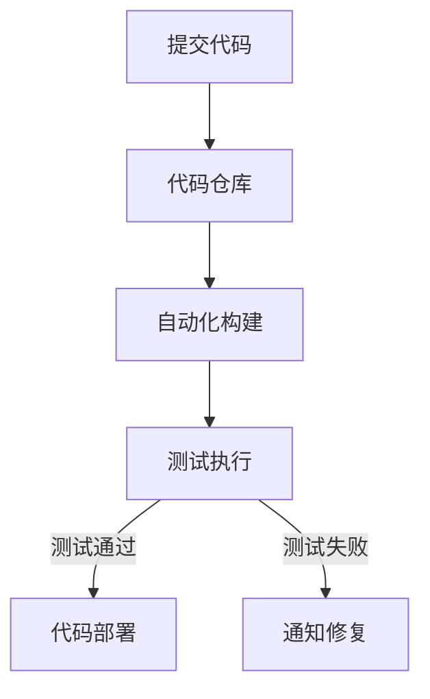
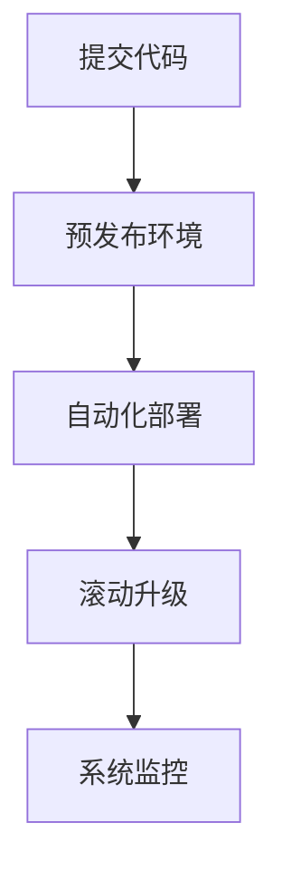
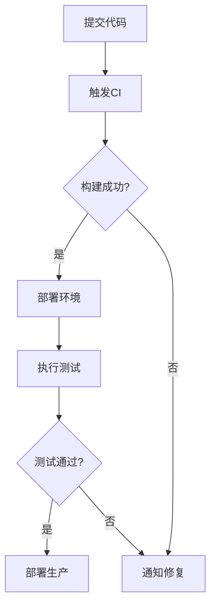

                 

### 引言

随着信息技术的飞速发展，企业对IT系统的需求日益增长，而传统的IT运维模式已经难以满足现代企业的快速迭代和高效运营需求。DevOps作为一种新兴的IT实践方法，旨在通过开发（Development）和运维（Operations）的深度融合，提高软件交付的效率和质量。本文旨在梳理阿里巴巴2025社招DevOps工程师的面试题集，帮助准备面试的开发者和运维人员深入了解DevOps的核心概念、技术实践以及面试策略。

### 阿里巴巴2025社招DevOps工程师面试题集目录大纲

#### 第一部分：基础知识

##### 第1章：DevOps概述

- 1.1 DevOps的定义和起源
- 1.2 DevOps与传统IT的区别
- 1.3 DevOps的关键概念
- 1.4 DevOps的核心原则

##### 第2章：持续集成与持续部署

- 2.1 持续集成的概念和优势
- 2.2 持续集成的实现流程
- 2.3 持续部署的概念和实践
- 2.4 持续集成与持续部署的工具选择

##### 第3章：容器化和微服务架构

- 3.1 容器化的原理和应用
- 3.2 Docker的基本使用
- 3.3 Kubernetes的架构和功能
- 3.4 微服务架构的设计原则和实践

#### 第二部分：面试题实战

##### 第4章：常见面试题解析

- 4.1 DevOps工程师的核心技能
- 4.2 集成与部署的最佳实践
- 4.3 容器化和微服务架构的面试题
- 4.4 DevOps项目实战案例解析

##### 第5章：面试题专项训练

- 5.1 DevOps理论基础题
- 5.2 持续集成与持续部署题
- 5.3 容器化与微服务架构题
- 5.4 DevOps综合面试题

#### 第三部分：附录

##### 第6章：参考资料和工具推荐

- 6.1 DevOps相关书籍推荐
- 6.2 DevOps工具和平台推荐
- 6.3 DevOps学习资源推荐

##### 第7章：面试准备与技巧

- 7.1 面试前的准备工作
- 7.2 DevOps面试技巧
- 7.3 面试常见问题的回答策略

##### 第8章：案例分析

- 8.1 阿里巴巴DevOps实践案例
- 8.2 DevOps在行业中的应用案例
- 8.3 DevOps成功的因素和挑战

##### 第9章：模拟面试

- 9.1 模拟面试题库
- 9.2 模拟面试流程和策略
- 9.3 模拟面试反馈与改进

##### 附录A：Mermaid流程图示例

- 附录B：核心算法原理讲解
- 附录C：数学模型和公式讲解
- 附录D：项目实战
- 附录E：代码解读与分析

通过这个目录大纲，读者可以清晰地看到文章的结构和内容分布，为后续的学习和理解打下坚实的基础。

---

**关键词**：DevOps、面试题、持续集成、持续部署、容器化、微服务架构、面试技巧、案例分析

**摘要**：本文以阿里巴巴2025社招DevOps工程师的面试题集为蓝本，系统性地介绍了DevOps的基础知识、实践技巧和面试策略。文章通过分章节的方式，详细讲解了DevOps的定义、持续集成与持续部署、容器化和微服务架构，并结合实际案例和模拟面试题，为读者提供了全面的复习和准备方案。

---

### 第一部分：基础知识

#### 第1章：DevOps概述

在快速变化的数字化时代，企业竞争的关键在于如何快速交付高质量的产品和服务。DevOps正是为了解决这一问题而诞生的一种实践方法。本章将介绍DevOps的定义、起源、与传统IT的区别以及其关键概念和核心原则。

##### 1.1 DevOps的定义和起源

DevOps是一种结合了软件开发（Development）和IT运维（Operations）的方法论。它强调开发团队和运维团队之间的紧密合作，通过自动化、标准化和持续反馈的机制，提升软件交付的效率和质量。

DevOps的概念起源于2009年在美国召开的一次同命名为“DevOps”的会议。当时，贝宝（PayPal）的工程师贾斯汀·克里桑托（Justin Cristiano）和约翰·阿尔伯特（John Allspaw）分享了他们如何在公司内部实施DevOps，以实现快速、可靠和高质量的软件交付。此后，DevOps迅速在业界引起了广泛关注，并逐渐成为一种重要的IT实践方法。

##### 1.2 DevOps与传统IT的区别

传统IT模式中，开发和运维团队往往各自为政，开发团队负责编写代码和开发新功能，而运维团队则负责部署、监控和维护系统。这种分离的模式导致了沟通障碍、协作不畅，以及软件交付周期长、质量不稳定等问题。

DevOps则通过以下几个方面与传统IT模式区别开来：

1. **团队协作**：DevOps强调跨职能团队的建立，包括开发、测试、运维等角色的人员共同工作，以缩短交付周期和提高交付质量。
2. **自动化**：DevOps通过自动化工具和流程，减少手动操作，降低人为错误，提高工作效率。
3. **持续集成与持续部署**：DevOps主张通过持续集成和持续部署，实现代码的快速、频繁和可靠的交付。
4. **反馈循环**：DevOps建立了快速反馈机制，使团队能够及时发现和解决问题，持续优化软件交付过程。

##### 1.3 DevOps的关键概念

为了更好地理解DevOps，我们需要了解其核心概念：

1. **持续集成（Continuous Integration，CI）**：持续集成是一种软件开发实践，通过频繁地将代码合并到主干分支，并及时发现和解决集成过程中的问题，以确保代码质量。
2. **持续部署（Continuous Deployment，CD）**：持续部署是在持续集成的基础上，通过自动化工具将代码部署到生产环境，实现快速、频繁的交付。
3. **基础设施即代码（Infrastructure as Code，IaC）**：基础设施即代码是一种将基础设施（如服务器、网络、存储等）作为代码管理的理念，通过自动化脚本管理基础设施，提高运维效率。
4. **基础设施即服务（Infrastructure as a Service，IaaS）**：基础设施即服务是一种提供虚拟化基础设施的云计算服务模式，用户可以通过互联网按需获取和管理计算资源。
5. **微服务架构（Microservices Architecture）**：微服务架构是一种将应用程序拆分为多个独立服务的方法，每个服务负责特定的功能，通过轻量级的通信协议（如HTTP/REST、gRPC等）进行交互。

##### 1.4 DevOps的核心原则

DevOps的核心原则包括：

1. **团队合作**：建立跨职能团队，促进沟通和协作。
2. **快速反馈**：通过自动化和监控，实现快速反馈，及时发现问题。
3. **持续学习**：不断学习新技术和方法，持续优化软件交付过程。
4. **资源共享**：充分利用现有资源，避免重复投入。
5. **自动化**：通过自动化工具和流程，提高工作效率，减少人为错误。

通过以上对DevOps概述的介绍，我们可以看到，DevOps不仅仅是一种技术方法，更是一种文化和理念的变革。它通过强调团队合作、自动化和快速反馈，帮助企业实现高效、高质量的软件交付。

### 第2章：持续集成与持续部署

持续集成（Continuous Integration，CI）和持续部署（Continuous Deployment，CD）是DevOps实践中最重要的环节，它们通过自动化和持续反馈，极大地提高了软件交付的效率和可靠性。本章将详细介绍持续集成和持续部署的概念、优势、实现流程以及相关工具的选择。

##### 2.1 持续集成的概念和优势

持续集成是一种软件开发实践，通过频繁地将代码合并到主干分支，并及时发现和解决集成过程中的问题，以确保代码质量。具体来说，持续集成包括以下几个关键要素：

1. **频繁提交**：开发人员定期将代码提交到版本控制系统，通常是每天多次。
2. **自动构建**：每次提交后，自动构建系统会编译代码、运行测试，并生成可执行文件。
3. **即时反馈**：构建完成后，测试结果会立即反馈给开发人员，如果测试失败，构建过程会暂停，通知相关人员修复问题。

持续集成的优势主要体现在以下几个方面：

1. **及早发现问题**：通过频繁的集成和测试，可以及早发现代码中的问题，避免问题积累。
2. **提高代码质量**：持续集成确保了代码的稳定性和一致性，有助于提高整体代码质量。
3. **减少集成风险**：频繁的集成降低了集成时出现冲突和错误的风险，使集成过程更加顺畅。
4. **提高开发效率**：通过自动化构建和测试，减少了手动操作和重复工作，提高了开发效率。

##### 2.2 持续集成的实现流程

实现持续集成通常需要以下几个步骤：

1. **代码仓库管理**：使用版本控制系统（如Git）管理代码，确保代码的可追踪性和一致性。
2. **自动化构建**：使用构建工具（如Maven、Gradle）和脚本（如Shell、Python）实现自动编译、打包和部署。
3. **测试执行**：编写自动化测试用例，并使用测试框架（如JUnit、TestNG）执行测试。
4. **集成反馈**：通过构建工具或第三方服务（如Jenkins、GitLab CI）生成测试报告，并实时通知相关人员。

以下是一个简单的持续集成流程图：



##### 2.3 持续部署的概念和实践

持续部署（Continuous Deployment，CD）是在持续集成的基础上，通过自动化工具将代码部署到生产环境，实现快速、频繁的交付。持续部署的核心思想是将每次代码提交视为可能部署到生产环境的一次机会，确保每次部署都是经过充分测试和验证的。

持续部署的实践包括以下几个关键步骤：

1. **预发布环境**：在正式部署前，先在预发布环境中运行所有测试，确保代码的稳定性和安全性。
2. **自动化部署**：使用部署脚本或自动化工具（如Kubernetes、Ansible）实现自动化部署，减少人为干预。
3. **滚动升级**：采用滚动升级策略，逐步替换旧版本的服务，确保系统的高可用性和稳定性。
4. **监控和反馈**：部署后，对系统进行实时监控，收集性能和错误日志，及时发现并解决问题。

以下是一个简单的持续部署流程图：



##### 2.4 持续集成与持续部署的工具选择

实现持续集成和持续部署需要使用多种工具，以下是一些常用的工具：

1. **版本控制工具**：如Git、Subversion（SVN），用于管理代码仓库。
2. **构建工具**：如Maven、Gradle，用于编译、打包和部署代码。
3. **自动化测试工具**：如JUnit、TestNG、Selenium，用于编写和执行测试用例。
4. **持续集成服务器**：如Jenkins、Travis CI、GitLab CI，用于自动化构建和测试流程。
5. **部署工具**：如Kubernetes、Ansible、Puppet，用于自动化部署和管理系统。
6. **监控工具**：如Prometheus、Grafana，用于实时监控系统性能和错误日志。

在选择工具时，需要考虑以下几个方面：

- **易用性**：工具应易于安装、配置和使用，降低学习成本。
- **扩展性**：工具应支持多种编程语言和框架，适应不同的开发环境。
- **社区支持**：工具应有良好的社区支持，提供丰富的插件和资源。
- **稳定性和可靠性**：工具应具有高稳定性和可靠性，确保持续集成和持续部署过程的顺利进行。

通过以上对持续集成与持续部署的介绍，我们可以看到，这两种实践在DevOps中起到了关键作用。它们通过自动化和持续反馈，极大地提高了软件交付的效率和质量，帮助企业实现快速、可靠和高质量的软件交付。

### 第3章：容器化和微服务架构

在现代软件开发中，容器化和微服务架构已经成为提升系统可移植性、可伸缩性和灵活性的关键技术。本章将详细介绍容器化的原理和应用、Docker的基本使用、Kubernetes的架构和功能以及微服务架构的设计原则和实践。

##### 3.1 容器化的原理和应用

容器化是一种轻量级、可移植的计算模型，通过将应用程序及其依赖环境打包到一个独立的容器中，实现应用程序的隔离、部署和运行。容器化的核心原理包括：

1. **资源隔离**：容器通过操作系统的命名空间（Namespace）和cgroups（控制组）实现进程和资源的隔离，确保容器内的应用程序与其他容器和宿主机环境相互独立。
2. **文件系统隔离**：容器使用UnionFS（联合文件系统）将应用程序的文件系统与宿主机的文件系统隔离，提高文件系统的读写效率。
3. **独立运行时**：容器运行时（如runc、containerd）负责管理容器的启动、停止和生命周期，确保容器按照预定规则运行。

容器化技术的应用场景非常广泛，包括：

1. **持续集成与持续部署（CI/CD）**：容器化使开发人员可以快速创建、测试和部署应用程序，提高软件交付的效率。
2. **服务化和微服务架构**：容器化技术支持微服务架构的实现，通过将应用程序拆分为多个独立的服务，提高系统的灵活性和可伸缩性。
3. **云原生应用**：容器化技术使得应用程序可以无缝地在云平台上部署和运行，支持弹性伸缩和负载均衡。

##### 3.2 Docker的基本使用

Docker是最流行的容器化平台，它提供了一种简单的容器创建和管理方法。以下是如何使用Docker的基本步骤：

1. **安装Docker**：在Linux或Windows系统上安装Docker引擎，可以从Docker官方网站下载安装包。

2. **运行Docker容器**：使用Docker命令创建和运行容器。例如，以下命令使用官方的Nginx镜像创建一个Nginx容器。

   ```bash
   docker run -d -p 8080:80 nginx
   ```

   该命令将Nginx容器以后台模式运行，并将容器的80端口映射到宿主机的8080端口。

3. **管理Docker容器**：使用Docker命令管理容器的生命周期，包括启动、停止、重启和删除容器。例如：

   ```bash
   docker start <container_id>  # 启动容器
   docker stop <container_id>  # 停止容器
   docker restart <container_id>  # 重启容器
   docker rm <container_id>  # 删除容器
   ```

4. **构建Docker镜像**：使用Dockerfile定义应用程序的容器化过程，通过Dockerfile可以构建自定义的容器镜像。以下是一个简单的Dockerfile示例：

   ```Dockerfile
   FROM ubuntu:latest
   RUN apt-get update && apt-get install -y nginx
   COPY ./nginx.conf /etc/nginx/nginx.conf
   COPY ./html /usr/share/nginx/html
   EXPOSE 80
   CMD ["nginx", "-g", "daemon off;"]
   ```

   该Dockerfile从最新的Ubuntu镜像开始，安装Nginx，复制自定义的配置文件和网页文件，并设置容器端口和启动命令。

##### 3.3 Kubernetes的架构和功能

Kubernetes是一个开源的容器编排平台，用于自动化容器化应用程序的部署、扩展和管理。Kubernetes的主要架构和功能包括：

1. **架构**：Kubernetes由多个组件组成，包括控制平面（Control Plane）和工作节点（Worker Nodes）。控制平面负责管理集群资源，如API服务器、调度器、控制器管理器和.etcd；工作节点负责运行容器化应用程序，包括容器运行时（如Docker）、Kubelet和Kube-Proxy。

2. **核心概念**：
   - **Pod**：Kubernetes的最小部署单元，由一个或多个容器组成。
   - **Service**：定义了一组Pod的逻辑集合，并通过一组规则对外暴露服务。
   - **Deployment**：用于管理Pod的创建和更新，确保Pod的数量和状态符合预期。
   - **StatefulSet**：用于管理有状态应用程序的Pod，确保Pod的有序创建和更新。
   - **Ingress**：定义集群内部署的服务如何接收外部流量。

3. **功能**：
   - **自动化部署和扩展**：通过Deployment和StatefulSet，可以自动化管理Pod的创建、更新和扩展。
   - **服务发现和负载均衡**：通过Service，可以实现Pod的服务发现和负载均衡。
   - **存储管理**：通过Volume和PersistentVolume（PV）及PersistentVolumeClaim（PVC），可以管理持久化存储。
   - **资源监控和日志收集**：通过Kubernetes的内置监控和日志系统，可以实时监控集群状态和应用程序日志。
   - **自动故障恢复**：通过配置RecoveryPolicy，可以自动恢复失败的容器。

##### 3.4 微服务架构的设计原则和实践

微服务架构是一种将大型应用程序拆分为多个独立服务的方法，每个服务负责特定的业务功能。微服务架构的设计原则包括：

1. **服务自治**：每个服务独立开发、部署和扩展，具有自治性，可以独立运行和升级。
2. **解耦**：服务之间通过轻量级的通信协议（如HTTP/REST、gRPC）进行交互，降低服务之间的依赖关系。
3. **去中心化**：没有集中式的服务注册中心，服务通过DNS或配置中心进行发现和注册。
4. **独立部署**：服务可以独立部署和扩展，提高系统的灵活性和可维护性。
5. **分布式数据管理**：每个服务拥有自己的数据存储，通过消息队列或分布式数据存储实现数据的一致性。

微服务架构的实现通常包括以下几个步骤：

1. **服务拆分**：根据业务功能将应用程序拆分为多个独立的服务。
2. **服务接口设计**：定义每个服务的接口，使用RESTful API或gRPC协议进行通信。
3. **服务部署和管理**：使用容器化和Kubernetes等工具部署和管理服务，实现自动扩展和故障恢复。
4. **服务监控和日志**：使用监控工具（如Prometheus、Grafana）和日志收集工具（如ELK Stack）实现服务监控和日志分析。

通过以上对容器化和微服务架构的介绍，我们可以看到，这两种技术在现代软件开发中发挥着重要作用。容器化提供了轻量级、可移植和可伸缩的应用程序部署方式，而微服务架构则实现了系统的高灵活性和可维护性。通过合理地运用这两种技术，企业可以构建高效、可靠的软件系统，满足快速变化的市场需求。

### 第二部分：面试题实战

在准备DevOps工程师的面试时，了解常见面试题并掌握相关技术和最佳实践是非常重要的。本章节将解析一些典型的面试题，涵盖DevOps工程师所需的核心技能、集成与部署的最佳实践、容器化和微服务架构以及DevOps项目实战案例。

#### 第4章：常见面试题解析

##### 4.1 DevOps工程师的核心技能

**问题1：请简述DevOps工程师的核心技能。**

**回答：** DevOps工程师的核心技能包括：

1. **编程技能**：掌握至少一种编程语言，如Python、Java或Go，能够编写自动化脚本和工具。
2. **系统运维经验**：熟悉Linux系统管理，包括服务器配置、网络管理和安全性。
3. **容器技术**：熟悉容器化技术，如Docker和Kubernetes，能够进行容器镜像的构建、部署和管理。
4. **自动化工具**：了解和使用持续集成和持续部署工具，如Jenkins、GitLab CI/CD等。
5. **监控和日志分析**：熟悉使用监控工具（如Prometheus、Grafana）和日志分析工具（如ELK Stack）进行系统监控和故障排查。
6. **版本控制系统**：熟练使用版本控制系统（如Git），了解代码管理和协作流程。
7. **敏捷开发和项目管理**：熟悉敏捷开发方法和项目管理工具（如JIRA、Trello）。

##### 4.2 集成与部署的最佳实践

**问题2：请列举一些持续集成与持续部署的最佳实践。**

**回答：** 持续集成与持续部署的最佳实践包括：

1. **自动化测试**：编写和执行自动化测试，确保代码质量。
2. **代码审查**：通过代码审查提高代码质量和安全性。
3. **环境一致性**：确保开发、测试和生产环境一致，减少集成风险。
4. **小批量发布**：采用小批量发布策略，逐步推广新功能，降低风险。
5. **自动化部署**：使用自动化工具进行部署，减少手动操作和错误。
6. **蓝绿部署**：使用蓝绿部署策略，将新版本与旧版本并行运行，确保平滑过渡。
7. **灰度发布**：逐步增加新版本的流量，观察性能和用户反馈。
8. **故障恢复**：建立故障恢复机制，快速应对系统故障。

##### 4.3 容器化和微服务架构的面试题

**问题3：请解释容器化技术的优点。**

**回答：** 容器化技术的优点包括：

1. **轻量级**：容器封装了应用程序及其依赖环境，与宿主机操作系统隔离，但占用资源较少。
2. **可移植性**：容器可以在不同的操作系统和硬件上运行，提供一致的环境。
3. **可伸缩性**：容器可以轻松地水平扩展和缩放，满足不同的负载需求。
4. **独立性**：容器内的应用程序独立运行，不会影响其他容器或宿主机环境。
5. **快速启动**：容器启动速度快，适合高频次的部署和更新。

**问题4：请解释微服务架构的优势。**

**回答：** 微服务架构的优势包括：

1. **自治性**：每个微服务独立开发和部署，可以独立扩展和更新。
2. **解耦**：微服务之间通过轻量级的通信协议进行交互，降低服务间的依赖。
3. **灵活性和可维护性**：服务可以独立开发和扩展，提高系统的灵活性和可维护性。
4. **可重用性**：服务可以独立开发和部署，提高代码的重用率。
5. **分布式数据管理**：服务可以拥有独立的数据存储，提高数据的一致性。

##### 4.4 DevOps项目实战案例解析

**问题5：请简述一次DevOps项目实战案例。**

**回答：** 一个典型的DevOps项目实战案例可能包括以下步骤：

1. **项目需求分析**：明确项目目标和需求，制定项目计划。
2. **环境搭建**：搭建开发、测试和生产环境，确保环境一致性。
3. **代码管理**：使用Git进行代码管理，建立分支和合并流程。
4. **自动化测试**：编写自动化测试用例，集成到持续集成流程中。
5. **容器化**：使用Docker将应用程序及其依赖环境容器化。
6. **持续集成**：使用Jenkins等工具实现自动化构建和测试。
7. **持续部署**：使用Kubernetes等工具实现自动化部署和扩展。
8. **监控与日志**：使用Prometheus和Grafana等工具进行系统监控和日志分析。
9. **故障恢复**：建立故障恢复机制，快速应对系统故障。
10. **性能优化**：通过性能测试和监控，持续优化系统性能。

通过以上对常见面试题的解析，我们可以看到，DevOps工程师需要掌握多方面的技能和知识。理解这些技能和最佳实践，不仅有助于面试表现，更能够在实际工作中提高工作效率和系统质量。

### 第5章：面试题专项训练

为了更好地准备DevOps工程师的面试，我们需要针对不同的知识领域设计专项训练题。这些训练题将涵盖DevOps的理论基础、持续集成与持续部署、容器化与微服务架构以及综合面试题。通过专项训练，我们可以更好地掌握相关知识和技能，提高面试成功率。

#### 5.1 DevOps理论基础题

**问题1：什么是DevOps？它与传统IT有什么区别？**

**回答：** DevOps是一种将软件开发（Development）和IT运维（Operations）紧密结合的方法论。它通过持续集成（CI）、持续部署（CD）、自动化测试、基础设施即代码（IaC）等实践，缩短软件交付周期，提高软件质量，加强团队协作。与传统IT相比，DevOps强调跨职能团队的紧密合作、自动化和持续反馈。

**问题2：请解释基础设施即代码（IaC）的概念及其优势。**

**回答：** 基础设施即代码（Infrastructure as Code，IaC）是一种使用代码管理基础设施资源的方法。通过编写脚本或配置文件，可以自动化地创建、配置和管理基础设施，如服务器、网络、存储等。IaC的优势包括：

- **可重复性**：通过代码管理基础设施，可以确保环境的可重复性和一致性。
- **可追溯性**：代码仓库可以记录基础设施的变更历史，便于追踪和回溯。
- **自动化**：通过自动化脚本，可以简化基础设施的管理和维护。
- **可测试性**：基础设施配置可以通过代码进行测试，确保配置的正确性。

#### 5.2 持续集成与持续部署题

**问题3：什么是持续集成（CI）？请描述其实现流程。**

**回答：** 持续集成（Continuous Integration，CI）是一种软件开发实践，通过频繁地将代码合并到主干分支，并自动化地构建、测试和部署，确保代码质量。实现持续集成的流程通常包括：

1. **代码提交**：开发人员将代码提交到版本控制系统。
2. **自动化构建**：构建工具（如Jenkins、GitLab CI）触发构建过程，编译代码、打包应用程序。
3. **测试执行**：执行自动化测试，包括单元测试、集成测试等，确保代码质量。
4. **反馈**：构建结果和测试报告通过邮件、即时消息等方式通知相关人员。

**问题4：什么是持续部署（CD）？请描述其实现流程。**

**回答：** 持续部署（Continuous Deployment，CD）是一种将经过测试的代码自动部署到生产环境的实践。实现持续部署的流程通常包括：

1. **预发布测试**：在正式部署前，进行预发布测试，包括功能测试、性能测试等。
2. **自动化部署**：使用自动化工具（如Kubernetes、Ansible）将应用程序部署到生产环境。
3. **监控和反馈**：部署后，对系统进行实时监控，收集性能数据和错误日志，确保系统稳定运行。
4. **回滚策略**：如果部署后出现问题，应具备回滚机制，将系统恢复到上一个稳定版本。

#### 5.3 容器化与微服务架构题

**问题5：什么是容器化？请简述其原理和应用。**

**回答：** 容器化是一种将应用程序及其依赖环境打包到容器中的技术。容器化的原理包括：

- **资源隔离**：通过命名空间（Namespace）和cgroups实现进程和资源的隔离。
- **文件系统隔离**：通过UnionFS实现文件系统的隔离。

容器化的应用包括：

- **持续集成与持续部署**：容器化技术可以简化应用程序的构建、测试和部署过程。
- **微服务架构**：容器化技术支持微服务架构的实施，每个微服务可以独立部署和管理。
- **云原生应用**：容器化技术使得应用程序可以无缝地在云平台上部署和运行。

**问题6：什么是微服务架构？请简述其设计原则和实践。**

**回答：** 微服务架构是一种将大型应用程序拆分为多个独立服务的方法。其设计原则包括：

- **自治性**：每个服务独立开发、部署和扩展。
- **解耦**：服务之间通过轻量级的通信协议进行交互。
- **分布式数据管理**：每个服务拥有独立的数据存储。

微服务架构的实践包括：

- **服务拆分**：根据业务功能拆分服务。
- **服务接口设计**：定义服务接口，使用RESTful API或gRPC等协议。
- **服务部署和管理**：使用容器化技术部署和管理服务，实现自动扩展和故障恢复。
- **服务监控和日志**：使用监控和日志工具进行服务监控和日志分析。

#### 5.4 DevOps综合面试题

**问题7：请简述一次DevOps项目失败的原因及其教训。**

**回答：** 一个典型的DevOps项目失败原因可能包括：

- **缺乏沟通和协作**：开发团队和运维团队之间的沟通不畅，导致协作效率低下。
- **自动化程度不足**：缺乏完善的自动化工具和流程，导致手动操作较多，易出错。
- **测试不足**：缺乏充分的测试，导致部署后出现问题。
- **环境不一致**：开发、测试和生产环境不一致，导致集成和部署问题。

教训包括：

- **加强团队协作和沟通**：建立跨职能团队，定期沟通和协调工作。
- **完善自动化工具和流程**：提高自动化程度，减少手动操作。
- **加强测试和监控**：充分进行功能测试、性能测试和安全测试，实时监控系统状态。
- **确保环境一致性**：确保开发、测试和生产环境的一致性，减少集成和部署问题。

通过以上专项训练题的解析，我们可以更好地理解DevOps的核心概念和实践，提高面试准备的效果。在实际面试中，结合自身经验和项目案例，灵活应对各种问题，将有助于取得优异的面试成绩。

### 第三部分：附录

在本部分，我们将提供一些宝贵的参考资料和工具推荐，帮助读者深入学习和实践DevOps技术。同时，我们还将介绍面试准备和技巧，以及一些案例分析，以帮助读者更好地应对面试挑战。

#### 第6章：参考资料和工具推荐

##### 6.1 DevOps相关书籍推荐

1. **《DevOps：从理论到实践》**：这本书详细介绍了DevOps的概念、原理和实践方法，适合初学者和进阶者阅读。
2. **《持续交付：释放软件团队的生产力》**：作者Jez Humble和David Farley分享了持续交付的最佳实践，涵盖了从持续集成到自动化测试的全面内容。
3. **《微服务设计》**：这本书介绍了微服务架构的设计原则、实现方法和挑战，适合对微服务有兴趣的读者。

##### 6.2 DevOps工具和平台推荐

1. **Jenkins**：一款功能强大的开源持续集成工具，支持多种插件和集成方案。
2. **GitLab CI/CD**：GitLab自带的持续集成和持续部署功能，可以轻松集成到GitLab项目中。
3. **Kubernetes**：一款开源的容器编排平台，用于自动化部署、扩展和管理容器化应用程序。
4. **Docker**：一款轻量级的容器化平台，用于构建、运行和分发容器化应用程序。
5. **Prometheus**：一款开源的监控解决方案，可以收集和存储大量时序数据，提供强大的数据查询和分析功能。
6. **Grafana**：一款开源的数据可视化工具，可以与Prometheus等监控系统集成，提供丰富的仪表盘和报告功能。

##### 6.3 DevOps学习资源推荐

1. **DevOps社区**：加入DevOps社区，如DevOps.com、InfoQ DevOps专区等，可以了解最新的DevOps动态和最佳实践。
2. **技术博客和教程**：阅读一些知名技术博客和教程，如Cloud Native Computing Foundation、Docker官方文档等，获取实用的DevOps知识和技巧。
3. **在线课程和培训**：参加一些在线课程和培训，如Coursera、edX等平台上的DevOps课程，系统学习DevOps理论和实践。

#### 第7章：面试准备与技巧

##### 7.1 面试前的准备工作

1. **了解公司和职位**：在面试前，详细了解应聘公司的背景、业务和文化，以及DevOps工程师的职责和要求。
2. **复习基础知识**：回顾DevOps的核心概念、持续集成与持续部署、容器化和微服务架构等基础知识。
3. **项目经验准备**：准备一些实际项目经验，如容器化应用部署、微服务架构设计等，以便在面试中展示实际能力。
4. **工具和平台熟悉**：熟悉常用的DevOps工具和平台，如Jenkins、Kubernetes、Docker等，以便在面试中展示技能。

##### 7.2 DevOps面试技巧

1. **逻辑清晰**：在回答问题时，保持逻辑清晰，用简洁的语言表达复杂的概念。
2. **案例分享**：结合实际项目经验，分享具体的DevOps实践案例，展示解决问题的能力。
3. **提问环节**：在面试结束时，可以提出一些问题，了解公司的团队文化、工作环境和发展前景。
4. **展现团队合作精神**：强调自己在团队中的协作能力和沟通技巧，展示团队合作精神。

##### 7.3 面试常见问题的回答策略

1. **自我介绍**：简明扼要地介绍自己的背景、经验和技术特长。
2. **职业规划**：表达对DevOps职业发展的兴趣和规划，展示自己的职业目标和长远眼光。
3. **问题解决能力**：通过具体案例，展示自己在遇到问题时如何分析和解决问题的能力。
4. **团队协作**：强调自己在团队中的角色和贡献，展示团队合作精神和领导力。

通过以上附录内容的介绍，读者可以更好地准备DevOps面试，掌握相关工具和知识，提升面试表现。希望这些资料和技巧能够为您的DevOps职业道路提供有力支持。

### 第8章：案例分析

在本章中，我们将通过分析阿里巴巴的DevOps实践案例，以及DevOps在行业中的应用案例，探讨DevOps的成功因素和挑战，以帮助读者更好地理解和应用DevOps技术。

#### 8.1 阿里巴巴DevOps实践案例

阿里巴巴作为全球领先的电子商务和互联网公司，在其业务高速发展过程中，面临着持续优化软件交付效率和系统稳定性的挑战。为了应对这一挑战，阿里巴巴引入了DevOps理念，并进行了大规模的实践。

1. **项目背景**

   阿里巴巴的业务涵盖了电商、支付、物流、云计算等多个领域，拥有庞大的用户基础和复杂的系统架构。为了快速响应市场变化，提高产品交付速度，阿里巴巴决定引入DevOps实践，通过持续集成和持续部署，实现高效、可靠的软件交付。

2. **实践过程**

   阿里巴巴的DevOps实践主要包括以下几个关键步骤：

   - **团队重构**：阿里巴巴将开发、测试和运维团队重构为跨职能团队，推动团队成员之间的紧密合作。
   - **自动化工具**：引入Jenkins、Kubernetes、Docker等自动化工具，实现代码的自动化构建、测试和部署。
   - **持续集成**：通过Jenkins等工具，实现代码的自动化集成和测试，确保代码质量。
   - **持续部署**：使用Kubernetes进行容器化应用的自动化部署和扩展，实现快速、可靠的交付。
   - **监控和反馈**：利用Prometheus、Grafana等工具进行系统监控和日志分析，及时发现和解决问题。

3. **实践成果**

   阿里巴巴的DevOps实践取得了显著成果：

   - **交付周期缩短**：通过自动化工具和持续集成，阿里巴巴的软件交付周期从数天缩短到数小时，甚至数分钟。
   - **系统稳定性提升**：通过持续集成和自动化部署，提高了系统的稳定性和可靠性，降低了故障率。
   - **团队协作效率提升**：跨职能团队的建立，促进了团队成员之间的沟通和协作，提高了整体工作效率。

#### 8.2 DevOps在行业中的应用案例

除了阿里巴巴，许多其他行业的企业也在积极采用DevOps实践，以提高软件交付效率和系统质量。以下是一些行业应用案例：

1. **金融行业**

   金融行业对系统的稳定性和安全性要求极高，DevOps在金融行业中的应用有助于提高业务响应速度和系统可靠性。例如，某大型银行通过引入DevOps实践，实现了金融交易系统的自动化测试和部署，显著降低了系统故障率和交易延迟。

2. **电信行业**

   电信行业的服务网络复杂，DevOps在电信行业中的应用有助于提高网络服务质量和运营效率。例如，某电信运营商通过引入Kubernetes和容器化技术，实现了网络设备的自动化部署和管理，提高了网络服务的灵活性和可扩展性。

3. **互联网行业**

   互联网行业竞争激烈，快速迭代和高效交付是企业的核心竞争力。DevOps在互联网行业中的应用，如电商平台、在线教育平台等，通过持续集成和持续部署，实现了快速、可靠的软件交付，提高了用户体验和市场份额。

#### 8.3 DevOps成功的因素和挑战

DevOps的成功因素包括：

1. **团队协作**：DevOps强调跨职能团队的紧密合作，通过建立协作机制和共同目标，提高了团队的整体效率。
2. **自动化**：通过引入自动化工具和流程，减少了手动操作和人为错误，提高了工作效率和系统质量。
3. **持续集成与持续部署**：持续集成和持续部署是实现高效交付的关键，通过自动化测试和部署，确保了代码质量和交付速度。
4. **监控和反馈**：通过实时监控和反馈机制，及时发现和解决问题，保证了系统的稳定性和可靠性。

然而，DevOps实践也面临一些挑战：

1. **文化变革**：DevOps要求改变传统的工作方式和流程，这需要团队成员转变观念和习惯，可能会遇到文化冲突和阻力。
2. **技能提升**：DevOps涉及多种技术和工具，团队成员需要不断提升技能，以满足新需求。
3. **成本投入**：引入DevOps实践需要一定的技术和资金投入，对于中小企业来说，可能面临一定的经济压力。

通过以上案例分析，我们可以看到，DevOps在提高软件交付效率和质量方面具有显著优势，但也需要克服一些挑战。企业应根据自身情况和需求，逐步推进DevOps实践，以实现持续改进和业务增长。

### 第9章：模拟面试

在准备DevOps工程师面试时，进行模拟面试是提高面试表现的重要环节。本章将介绍模拟面试题库的创建、模拟面试流程和策略，以及模拟面试后的反馈与改进方法。

#### 9.1 模拟面试题库

创建一个全面的模拟面试题库，可以帮助应聘者全面准备面试。以下是一些常见的模拟面试题目：

1. **基础题**
   - 什么是DevOps？它与传统IT模式有什么区别？
   - 请简述持续集成（CI）和持续部署（CD）的概念和优势。
   - 容器化和微服务架构有什么区别和联系？

2. **技术题**
   - 请解释Docker的工作原理和应用场景。
   - 请解释Kubernetes的核心组件和功能。
   - 请简述微服务架构的设计原则和实践。

3. **实战题**
   - 请简述一次你在项目中使用DevOps实践的经历。
   - 请解释一次你遇到的DevOps项目失败的原因和教训。
   - 请描述一次你解决的一个复杂问题的过程。

4. **综合题**
   - 如何确保持续集成和持续部署过程中的安全性？
   - 请解释如何实现微服务架构中的服务发现和负载均衡。
   - 如何在DevOps实践中提高团队的协作效率？

#### 9.2 模拟面试流程和策略

模拟面试应该模拟真实的面试环境，以下是一些建议的流程和策略：

1. **准备阶段**
   - 确定面试官和应聘者，安排面试时间。
   - 分发模拟面试题库，让应聘者提前准备。

2. **面试阶段**
   - 开场：面试官自我介绍，简要说明面试流程。
   - 答辩：应聘者回答面试官提出的问题。
   - 提问：应聘者可以向面试官提问，了解公司和职位的情况。

3. **结束阶段**
   - 面试官总结面试情况，感谢应聘者的参与。
   - 应聘者离开面试现场。

4. **策略**
   - 面试官应尽量模拟真实的面试环境，包括问答环节和情境模拟。
   - 应聘者要准备充分，对可能的问题有充分了解。
   - 双方要保持良好的沟通和互动，营造轻松的氛围。

#### 9.3 模拟面试反馈与改进

模拟面试后，及时进行反馈和改进是非常重要的。以下是一些建议：

1. **反馈**
   - 面试官应向应聘者提供详细的反馈，包括回答的正确性、逻辑清晰度、语言表达等方面。
   - 应聘者应认真听取反馈，了解自己的优势和不足。

2. **改进**
   - 应聘者应根据反馈，针对性地改进自己的回答技巧和知识点。
   - 面试官可以根据应聘者的表现，调整模拟面试题库的内容，提高模拟面试的针对性。

3. **持续练习**
   - 定期进行模拟面试，不断积累经验，提高面试表现。

通过模拟面试，应聘者可以更好地了解自己的优势和不足，提高面试技能，从而在真实的面试中取得更好的成绩。

### 附录A：Mermaid流程图示例

在本文的附录A中，我们将使用Mermaid语法创建一个流程图示例，用于展示持续集成（CI）的基本流程。Mermaid是一种简单易用的Markdown扩展语言，可以生成结构化的流程图、时序图和网络图等。



这个流程图描述了以下步骤：

1. **提交代码**：开发人员将代码提交到版本控制系统。
2. **触发CI**：提交触发持续集成流程，构建环境和构建管道开始工作。
3. **构建成功？**：检查构建是否成功。
   - 如果构建成功，流程继续到下一步。
   - 如果构建失败，流程跳转到“通知修复”，相关人员需要修复构建问题。
4. **执行测试**：构建成功后，执行自动化测试。
5. **测试通过？**：检查测试结果是否通过。
   - 如果测试通过，流程继续到“部署生产”，将应用部署到生产环境。
   - 如果测试失败，流程跳转到“通知修复”，相关人员需要修复测试问题。

通过这个简单的Mermaid流程图示例，我们可以清晰地看到持续集成的基本流程和关键步骤，便于理解和实践。

### 附录B：核心算法原理讲解

在持续集成（CI）和容器调度等DevOps实践中，核心算法原理起到了关键作用。以下将详细介绍两个核心算法原理：持续集成算法和容器调度算法。

#### 2.1 持续集成算法原理

持续集成算法是确保软件质量和交付效率的重要机制。以下是一个简单的持续集成算法的伪代码，用于描述持续集成管道的工作流程：

```python
def CI_pipeline(code_changes, test_suite):
    """
    持续集成管道函数，用于处理代码变更和测试套件。
    
    :param code_changes: 代码变更列表
    :param test_suite: 测试套件
    :return: 持续集成结果
    """
    for change in code_changes:
        test_results = run_tests(change, test_suite)
        if not test_results:
            return "集成失败"
    return "集成成功"

def run_tests(code_change, test_suite):
    """
    执行测试函数，用于运行测试套件。
    
    :param code_change: 代码变更
    :param test_suite: 测试套件
    :return: 测试结果列表
    """
    test_results = []
    for test in test_suite:
        result = execute_test(code_change, test)
        test_results.append(result)
    return test_results

def execute_test(code_change, test_case):
    """
    执行测试用例函数，用于执行单个测试用例。
    
    :param code_change: 代码变更
    :param test_case: 测试用例
    :return: 测试结果
    """
    # 在此处添加测试执行代码
    return "测试通过"  # 或者 "测试失败"
```

**工作流程**：

1. **代码提交**：开发人员提交代码变更到版本控制系统。
2. **触发CI**：提交操作触发CI流程，CI系统开始执行构建和测试。
3. **构建**：CI系统使用构建工具编译代码、打包应用程序，并创建可执行文件。
4. **测试**：CI系统运行自动化测试套件，检查代码变更是否影响功能和行为。
5. **结果反馈**：测试结果被记录并反馈给开发人员。如果所有测试通过，则集成成功；否则，集成失败，需要修复问题。

#### 2.2 容器调度算法中的数学模型

容器调度是确保系统资源高效利用的重要环节。以下是一个简单的容器调度算法的数学模型，用于描述如何根据容器需求和资源限制分配计算资源。

**数学模型**：

$$
C_{max} = \max\{C_i | i=1,2,...,n\}
$$

其中，$C_{max}$ 表示容器调度的最大响应时间，$C_i$ 表示第 $i$ 个容器的响应时间。

**调度算法步骤**：

1. **需求分析**：确定每个容器的资源需求（CPU、内存等）和调度优先级。
2. **资源评估**：计算当前可用的系统资源总量。
3. **调度决策**：根据容器的需求、资源限制和优先级，选择合适的容器进行调度。
4. **响应时间计算**：计算每个容器的响应时间，选择响应时间最短的容器进行调度。
5. **资源分配**：将调度决策的结果应用于实际系统中，分配相应的计算资源。

**示例**：

假设有3个容器C1、C2和C3，其资源需求如下：

- C1：CPU需求=2，内存需求=4
- C2：CPU需求=1，内存需求=2
- C3：CPU需求=3，内存需求=6

系统总资源为：CPU=4，内存=8

调度算法首先评估资源，然后根据响应时间模型进行调度。假设C1的响应时间最短，因此C1被首先调度。剩余资源为：CPU=2，内存=4。接下来，C2被调度，剩余资源为：CPU=1，内存=2。最后，C3被调度，剩余资源为：CPU=0，内存=0。

通过上述模型和算法，可以确保容器调度在满足资源限制的同时，实现最小化响应时间。

以上对持续集成算法和容器调度算法的讲解，旨在帮助读者理解DevOps实践中的关键算法原理，为实际工作中的应用提供理论支持。

### 附录C：数学模型和公式讲解

在DevOps实践中，数学模型和公式是优化资源分配、调度策略和风险管理的重要工具。以下将详细介绍两个核心数学模型：持续集成中的风险管理模型和容器调度算法中的数学模型。

#### 3.1 持续集成中的风险管理模型

持续集成过程中，风险管理至关重要。以下是一个简单的持续集成中的风险管理模型，用于评估和监控项目风险。

**风险公式**：

$$
R = \sum_{i=1}^{n} w_i \cdot P_i
$$

其中，$R$ 表示总风险值，$w_i$ 表示第 $i$ 个风险的权重，$P_i$ 表示第 $i$ 个风险的概率。

**模型步骤**：

1. **风险识别**：确定项目中的潜在风险，如代码缺陷、测试失败、部署问题等。
2. **风险评估**：评估每个风险的严重程度和发生概率，分配权重和概率值。
3. **计算风险**：使用上述公式计算总风险值，确定项目的整体风险水平。
4. **风险管理**：根据风险值制定相应的风险应对策略，如代码审查、测试加强、自动化部署等。

**示例**：

假设项目中有3个风险，其权重和概率如下：

- 风险1：代码缺陷，权重=0.3，概率=0.2
- 风险2：测试失败，权重=0.4，概率=0.3
- 风险3：部署问题，权重=0.3，概率=0.5

使用上述公式计算总风险：

$$
R = (0.3 \cdot 0.2) + (0.4 \cdot 0.3) + (0.3 \cdot 0.5) = 0.06 + 0.12 + 0.15 = 0.33
$$

总风险值为0.33，表示项目存在中等风险。

通过这个简单的模型，开发团队可以更好地识别和监控项目风险，采取有效措施降低风险水平。

#### 3.2 容器调度算法中的数学模型

容器调度算法是确保系统资源高效利用的关键。以下是一个简单的数学模型，用于描述容器调度的响应时间和资源分配。

**响应时间模型**：

$$
C_{max} = \max\{C_i | i=1,2,...,n\}
$$

其中，$C_{max}$ 表示容器调度的最大响应时间，$C_i$ 表示第 $i$ 个容器的响应时间。

**模型步骤**：

1. **容器需求分析**：确定每个容器的资源需求（如CPU、内存）和处理时间。
2. **资源评估**：计算系统总资源量和当前可用资源。
3. **调度策略**：根据资源需求和响应时间模型，选择合适的容器进行调度。
4. **响应时间计算**：计算每个容器的响应时间，选择响应时间最短的容器进行调度。
5. **资源分配**：将调度决策应用于实际系统中，分配相应的计算资源。

**示例**：

假设有3个容器C1、C2和C3，其资源需求和处理时间如下：

- C1：CPU需求=2，处理时间=5
- C2：CPU需求=1，处理时间=3
- C3：CPU需求=3，处理时间=10

系统总资源为：CPU=4

根据上述模型，首先选择处理时间最短的C2进行调度，剩余资源为：CPU=3。接下来，C1被调度，剩余资源为：CPU=1。由于C3的CPU需求大于剩余资源，需要等待。C3的响应时间为：处理时间（10）+ 等待时间（C2和C1的处理时间之和，5+3=8），总响应时间为18。

通过这个简单的模型，可以优化容器调度策略，提高系统资源利用率。

通过以上数学模型和公式讲解，我们可以更好地理解DevOps实践中的核心概念和算法原理，为实际工作提供理论支持。

### 附录D：项目实战

在DevOps实践中，项目实战是理解和应用DevOps理念和技术的重要途径。以下将详细介绍一个容器化应用实战案例，包括开发环境搭建、源代码实现和代码解读。

#### 4.1 容器化应用实战

**项目背景**：

某电子商务公司需要开发一个用于处理订单的微服务应用，该应用需要具有高可用性、可伸缩性和可维护性。为了实现这些目标，决定采用容器化技术，使用Docker进行应用部署，并利用Kubernetes进行容器编排和管理。

**4.1.1 开发环境搭建**

1. **安装Docker**：

   在开发环境中安装Docker，可以参考以下命令：

   ```bash
   # 对于Ubuntu系统
   sudo apt-get update
   sudo apt-get install docker.io

   # 对于Windows系统
   choco install docker-desktop
   ```

2. **编写Dockerfile**：

   创建一个名为`Dockerfile`的文件，用于定义应用容器镜像的构建过程。以下是一个简单的示例：

   ```Dockerfile
   FROM openjdk:8-jdk-alpine
   ADD target/order-service.jar /app/order-service.jar
   EXPOSE 8080
   CMD ["java", "-jar", "/app/order-service.jar"]
   ```

   该Dockerfile使用OpenJDK 8 Alpine基础镜像，将编译后的`order-service.jar`文件添加到容器中，并暴露8080端口，运行Java应用程序。

3. **构建Docker镜像**：

   在终端执行以下命令，构建Docker镜像：

   ```bash
   docker build -t order-service:latest .
   ```

4. **启动Docker容器**：

   使用以下命令启动容器：

   ```bash
   docker run -d -p 8080:8080 order-service:latest
   ```

   这将创建并运行一个名为`order-service`的容器，将容器的8080端口映射到宿主机的8080端口。

**4.1.2 源代码实现**

在项目的`src/main/java`目录中，创建一个名为`OrderServiceApplication.java`的文件，作为应用的入口类。以下是一个简单的示例：

```java
import org.springframework.boot.SpringApplication;
import org.springframework.boot.autoconfigure.SpringBootApplication;

@SpringBootApplication
public class OrderServiceApplication {
    public static void main(String[] args) {
        SpringApplication.run(OrderServiceApplication.class, args);
    }
}
```

该类使用Spring Boot注解作为应用的入口，并启动Spring Boot应用程序。

**4.1.3 代码解读**

- **Spring Boot应用入口**：`OrderServiceApplication`类使用`@SpringBootApplication`注解，作为应用的入口类。该注解包含多个子注解，如`@EnableAutoConfiguration`（启用自动配置）、`@ComponentScan`（组件扫描）和`@SpringBootConfiguration`（Spring Boot配置），用于配置Spring Boot应用程序。

- **Spring Boot配置**：通过Spring Boot自动配置机制，可以简化应用程序的配置过程。Spring Boot会根据类路径下存在的类和资源文件，自动配置应用程序所需的Bean和配置信息。

通过以上实战案例，我们可以看到，使用容器化技术可以简化应用的部署和管理，提高开发效率和系统稳定性。

### 附录E：代码解读与分析

在DevOps实践中，代码的解读与分析对于确保系统稳定性和可维护性至关重要。以下将对持续集成工具Jenkins的配置文件和Kubernetes的部署文件进行详细解读。

#### 5.1 持续集成工具Jenkins配置

**Jenkinsfile**：Jenkinsfile是Jenkins用于定义构建管道的脚本文件。以下是一个简单的Jenkinsfile示例：

```groovy
pipeline {
    agent any
    stages {
        stage('Build') {
            steps {
                sh 'mvn clean install'
            }
        }
        stage('Test') {
            steps {
                sh 'mvn test'
            }
        }
        stage('Deploy') {
            steps {
                sh 'docker build -t my-app:latest .'
                sh 'docker run -d -p 8080:8080 my-app:latest'
            }
        }
    }
}
```

**解读**：

- **agent any**：指定构建环境，any表示在任何可用的代理节点上运行构建。
- **stages**：定义构建阶段，包括`Build`、`Test`和`Deploy`。
- **stage('Build')**：定义构建阶段，包含执行Maven构建命令的步骤。
- **stage('Test')**：定义测试阶段，包含执行Maven测试命令的步骤。
- **stage('Deploy')**：定义部署阶段，包含构建Docker镜像和运行容器的命令。

通过Jenkinsfile，开发团队可以自动化构建、测试和部署过程，提高工作效率。

#### 5.2 Kubernetes部署文件解读

以下是一个简单的Kubernetes部署文件（YAML格式）示例：

```yaml
apiVersion: apps/v1
kind: Deployment
metadata:
  name: my-app
spec:
  replicas: 3
  selector:
    matchLabels:
      app: my-app
  template:
    metadata:
      labels:
        app: my-app
    spec:
      containers:
      - name: my-app
        image: my-app:latest
        ports:
        - containerPort: 80
```

**解读**：

- **apiVersion: apps/v1**：指定Kubernetes API版本。
- **kind: Deployment**：定义类型为Deployment的配置。
- **metadata**：定义部署的元数据，如名称。
- **spec**：定义部署的规格。
  - **replicas**：指定部署的副本数，这里是3个。
  - **selector**：定义标签选择器，匹配标签为`app: my-app`的Pod。
  - **template**：定义Pod模板。
    - **metadata**：定义Pod的元数据，如标签。
    - **spec**：定义Pod的规格。
      - **containers**：定义容器的配置。
        - **name**：容器的名称。
        - **image**：使用的容器镜像，这里是`my-app:latest`。
        - **ports**：定义容器端口映射，这里是8080端口映射到80端口。

通过Kubernetes部署文件，开发团队可以自动化部署和管理应用容器，确保应用的高可用性和可伸缩性。

通过以上代码解读与分析，我们可以更好地理解DevOps实践中的关键配置和代码实现，为实际工作提供指导。

