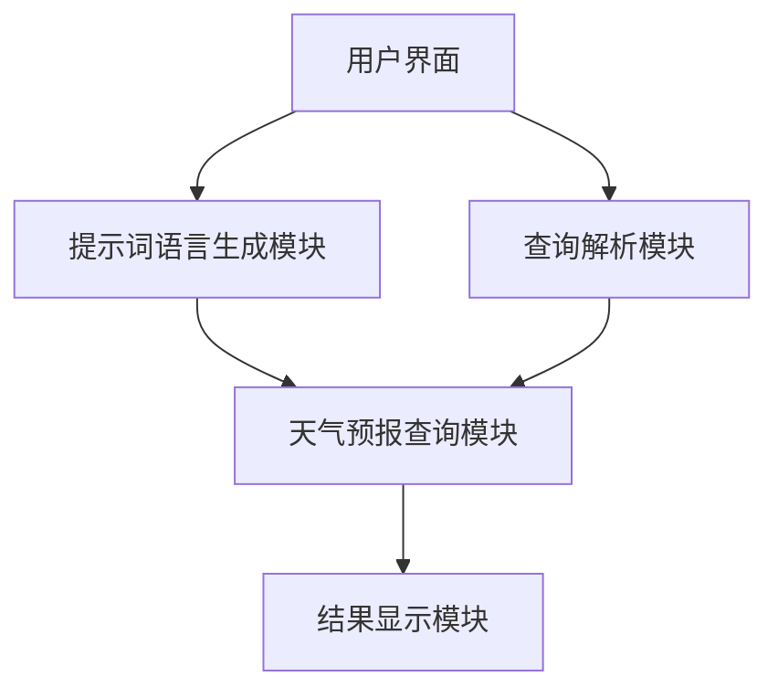
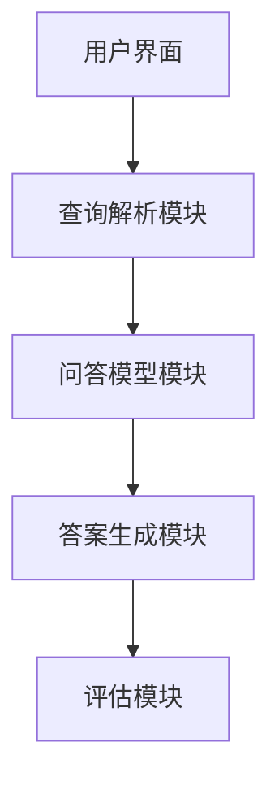

                 

# 《面向特定领域的提示词语言设计》

> **关键词：** 特定领域提示词语言、自然语言处理、深度学习、语言模型、算法优化、应用实战

> **摘要：** 本文深入探讨了面向特定领域的提示词语言设计。通过基础理论、应用实战和高级话题的逐步分析，本文阐述了特定领域提示词语言的基本概念、设计原则、核心算法原理以及实际应用。文章旨在为读者提供一个系统、详细的指导，帮助理解并掌握这一领域的核心知识和实践方法。

---

### 目录

#### 第一部分：基础理论

1. **特定领域提示词语言概述**
   - 1.1 提示词语言的基本概念
   - 1.2 特定领域提示词语言的起源与发展
   - 1.3 提示词语言的设计原则

2. **自然语言处理与提示词语言**
   - 2.1 自然语言处理的基本原理
   - 2.2 提示词语言与自然语言处理的结合
   - 2.3 提示词语言的语义分析

3. **特定领域提示词语言模型**
   - 3.1 语言模型的基本概念
   - 3.2 基于深度学习的语言模型
   - 3.3 语言模型在特定领域的应用

4. **核心算法原理讲解**
   - 4.1 提示词语言生成算法
   - 4.2 提示词语言优化算法
   - 4.3 提示词语言匹配算法

5. **数学模型与数学公式**
   - 5.1 提示词语言的概率模型
   - 5.2 提示词语言的隐马尔可夫模型
   - 5.3 提示词语言的图模型
   - 5.4 提示词语言的数学公式举例说明

#### 第二部分：应用实战

6. **项目实战一：设计一个简单的特定领域提示词语言系统**
   - 6.1 项目背景与目标
   - 6.2 系统架构设计
   - 6.3 系统开发环境搭建
   - 6.4 源代码实现与解读
   - 6.5 代码解读与分析

7. **项目实战二：应用于问答系统的特定领域提示词语言设计**
   - 7.1 项目背景与目标
   - 7.2 系统架构设计
   - 7.3 系统开发环境搭建
   - 7.4 源代码实现与解读
   - 7.5 代码解读与分析

#### 第三部分：高级话题

8. **面向特定领域的提示词语言优化**
   - 8.1 优化目标与方法
   - 8.2 优化算法研究
   - 8.3 实际应用案例

9. **面向特定领域的提示词语言评测**
   - 9.1 评测指标与方法
   - 9.2 评测工具与资源
   - 9.3 评测实际案例分析

10. **未来趋势与研究方向**
    - 10.1 提示词语言的发展趋势
    - 10.2 面向特定领域的提示词语言未来研究方向
    - 10.3 研究挑战与机遇

#### 附录

- 附录 A：常用工具与资源
  - A.1 提示词语言处理工具
  - A.2 提示词语言开源框架
  - A.3 相关论文与书籍推荐

---

现在我们已经搭建好了文章的框架，接下来将逐一展开各个部分的内容，进行深入的探讨和详细的解释。让我们一起进入这个充满挑战和机遇的领域吧！<|assistant|>## 第一部分：基础理论

### 第1章：特定领域提示词语言概述

#### 1.1 提示词语言的基本概念

提示词语言（Prompt Language）是一种专门用于特定应用场景或领域的语言，其核心思想是通过一组关键词或短语来引导用户或系统执行特定的任务。提示词语言的出现，主要源于自然语言处理（NLP）和计算机交互需求的不断增长。它不仅能够简化用户的输入过程，还能提高系统的响应速度和准确性。

在计算机科学中，提示词语言通常包括以下组成部分：

1. **关键词**：用于指示任务类型的词或短语，如“查询”、“请求”、“命令”等。
2. **参数**：用于补充关键词的详细信息，如“时间”、“地点”、“数量”等。
3. **指令**：对系统或用户的具体操作指导，如“查询天气”、“下单购买”等。

提示词语言的优点在于其高度灵活性和可扩展性，能够适应不同场景和任务需求。例如，在医疗领域，提示词语言可以用于医生的病历记录和查询系统；在电商领域，提示词语言可以用于用户的购物咨询和订单管理。

#### 1.2 特定领域提示词语言的起源与发展

特定领域提示词语言的发展可以追溯到20世纪80年代，当时自然语言处理技术刚刚起步，研究人员开始探索如何通过简洁明了的指令来提高计算机的交互能力。随着计算机技术的不断进步和自然语言处理技术的不断发展，特定领域提示词语言得到了广泛的应用和深入研究。

在早期，特定领域提示词语言主要应用于简单的对话系统和命令解释系统，如智能客服、语音助手等。随着深度学习和神经网络技术的发展，特定领域提示词语言的设计和应用得到了进一步的扩展和优化。目前，特定领域提示词语言已经被广泛应用于各种智能系统，如问答系统、智能推荐系统、智能翻译系统等。

#### 1.3 提示词语言的设计原则

为了设计出高效、易用、可靠的特定领域提示词语言，需要遵循以下设计原则：

1. **简洁性**：提示词语言应该尽量简洁明了，避免冗长的指令和复杂的语法结构，以便用户快速理解和操作。
2. **灵活性**：提示词语言应该具备一定的灵活性，能够适应不同场景和任务需求，方便系统的扩展和升级。
3. **一致性**：提示词语言在各个模块和功能之间应该保持一致性，确保用户在各个场景下的体验一致。
4. **易用性**：提示词语言应该具备良好的易用性，方便用户学习和使用，减少学习成本。
5. **可扩展性**：提示词语言应该具备良好的可扩展性，能够根据业务需求快速添加新功能和模块。

通过遵循这些设计原则，可以设计出更加高效、易用、可靠的特定领域提示词语言，为各种智能系统提供强大的交互支持。

### 第2章：自然语言处理与提示词语言

#### 2.1 自然语言处理的基本原理

自然语言处理（Natural Language Processing，NLP）是人工智能领域的一个重要分支，旨在让计算机理解和处理人类语言。NLP涉及许多复杂的技术和方法，包括文本预处理、词法分析、句法分析、语义分析等。

1. **文本预处理**：文本预处理是NLP的基础步骤，包括分词、去停用词、词性标注等操作。这些操作有助于将原始文本转换为计算机可以处理的形式。
   
2. **词法分析**：词法分析是将文本分解为词汇的过程，主要任务包括分词、词性标注等。分词是将连续的文本序列划分为单个词语，词性标注则是为每个词分配词性（如名词、动词、形容词等）。

3. **句法分析**：句法分析旨在理解句子的结构，包括句法树的构建、句法规则的识别等。通过句法分析，可以更准确地理解句子的含义。

4. **语义分析**：语义分析是NLP的最高层次，旨在理解文本中的意义和意图。语义分析包括实体识别、关系抽取、情感分析等。

#### 2.2 提示词语言与自然语言处理的结合

提示词语言与自然语言处理（NLP）有着密切的联系。在特定领域提示词语言的设计和应用过程中，NLP技术扮演了至关重要的角色。

1. **提示词语言的语义理解**：通过NLP技术，可以深入理解提示词语言的语义，从而更好地指导计算机执行任务。例如，在问答系统中，通过语义分析可以识别用户的问题类型和意图，从而提供更准确的答案。

2. **提示词语言的生成**：NLP技术可以帮助生成符合特定领域要求的提示词语言。通过训练深度学习模型，可以自动生成语义丰富、结构清晰的提示词语言，提高系统的智能化程度。

3. **提示词语言的优化**：NLP技术可以用于对现有提示词语言进行优化。例如，通过分析用户反馈，可以不断改进提示词语言的生成算法，提高系统的用户体验。

#### 2.3 提示词语言的语义分析

语义分析是NLP的核心任务之一，对于特定领域提示词语言的设计和应用具有重要意义。

1. **词义消歧**：在特定领域提示词语言中，有时一个词可能有多种含义。词义消歧旨在根据上下文确定词的正确含义。例如，“医院”可以指医疗场所，也可以指某种药物。

2. **实体识别**：实体识别旨在从文本中提取出重要的实体信息，如人名、地名、组织名等。在特定领域提示词语言中，实体识别可以帮助系统更好地理解和处理用户输入。

3. **关系抽取**：关系抽取旨在识别文本中实体之间的关系，如“张三”和“李四”是朋友关系。在特定领域提示词语言中，关系抽取可以帮助系统更好地理解任务背景和需求。

4. **情感分析**：情感分析旨在判断文本的情感倾向，如正面、负面或中性。在特定领域提示词语言中，情感分析可以帮助系统更好地理解用户的情感状态和需求。

通过自然语言处理技术，可以深入分析特定领域提示词语言的语义，从而实现更智能、更高效的交互。

### 第3章：特定领域提示词语言模型

#### 3.1 语言模型的基本概念

语言模型（Language Model）是自然语言处理（NLP）中的核心组成部分，它用于预测文本的下一个单词或词组。语言模型的基本概念包括：

1. **词汇表**：词汇表是语言模型的基础，包含所有可能的单词或词组。词汇表的规模直接影响语言模型的性能。
2. **概率分布**：语言模型的核心任务是预测下一个单词或词组的概率分布。例如，给定一个前文序列，语言模型会输出一个表示下一个单词概率分布的向量。
3. **序列生成**：通过递归地应用语言模型，可以生成新的文本序列。序列生成的关键是每次选择概率最高的下一个单词或词组。

语言模型的性能通常通过 perplexity（困惑度）来衡量，困惑度越低，表示模型对给定文本的预测越准确。

#### 3.2 基于深度学习的语言模型

随着深度学习技术的快速发展，基于深度学习的语言模型（Deep Learning Language Models）在NLP领域取得了显著的成果。深度学习语言模型通常采用多层神经网络结构，通过训练大规模语料库来学习语言模式。

1. **循环神经网络（RNN）**：循环神经网络是一种适用于序列数据处理的神经网络，特别适合于构建语言模型。RNN通过保存前一时刻的状态信息，能够处理长距离依赖问题。

2. **长短期记忆网络（LSTM）**：长短期记忆网络（Long Short-Term Memory，LSTM）是RNN的一种改进，通过引入门控机制，能够更好地处理长序列数据。

3. **变换器模型（Transformer）**：变换器模型（Transformer）是近年来提出的基于自注意力机制的深度学习模型，特别适合于处理大规模的序列数据。Transformer通过并行计算和多头注意力机制，在NLP任务中取得了优异的性能。

#### 3.3 语言模型在特定领域的应用

语言模型在特定领域提示词语言的设计和应用中发挥了关键作用。以下是语言模型在特定领域的几种应用：

1. **问答系统**：在问答系统中，语言模型可以帮助识别用户的问题类型和意图，从而提供准确的答案。通过训练大规模的问答语料库，语言模型能够学习到不同问题的语义特征，提高问答系统的准确性和效率。

2. **智能客服**：在智能客服系统中，语言模型可以帮助理解用户的咨询内容，并提供合适的回复。通过训练对话数据集，语言模型可以学习到用户常用的表达方式和问题类型，从而提高客服系统的交互体验。

3. **文本生成**：在文本生成任务中，语言模型可以帮助生成符合特定领域要求的文本。例如，在金融领域，语言模型可以生成股票分析报告；在医学领域，语言模型可以生成病历记录。

通过深入研究和应用深度学习语言模型，可以设计出更智能、更高效的特定领域提示词语言系统，为各种智能应用提供强大的支持。

### 第4章：核心算法原理讲解

#### 4.1 提示词语言生成算法

提示词语言生成算法是特定领域提示词语言设计中的关键环节，旨在根据输入的指令生成符合特定领域要求的提示词。以下是几种常见的提示词语言生成算法：

1. **基于规则的方法**：基于规则的方法通过预定义的规则库来生成提示词。这种方法简单直观，但需要大量的人工规则编写，且难以适应复杂多变的场景。

2. **基于统计的方法**：基于统计的方法通过分析大量历史数据来生成提示词。这种方法利用了数据中的统计规律，能够自动适应不同的场景。常见的统计方法包括隐马尔可夫模型（HMM）和条件概率模型。

3. **基于深度学习的方法**：基于深度学习的方法通过训练大规模的神经网络来生成提示词。这种方法能够自动学习语言中的复杂模式，生成更加自然和准确的提示词。常见的深度学习方法包括循环神经网络（RNN）和变换器模型（Transformer）。

以下是一个简单的基于变换器模型的提示词生成算法的伪代码：

```python
# 输入：指令序列 X
# 输出：生成的提示词序列 Y

# 初始化变换器模型
model = TransformerModel(vocab_size, embedding_size, hidden_size)

# 加载预训练模型
model.load_pretrained_model()

# 预处理输入指令序列 X
X_processed = preprocess_input(X)

# 使用变换器模型生成提示词序列 Y
Y = model.generate(Y_processed)

# 后处理生成的提示词序列 Y
Y_generated = postprocess_output(Y)

return Y_generated
```

#### 4.2 提示词语言优化算法

提示词语言优化算法旨在提高提示词语言的生成质量和效率。以下是几种常见的优化算法：

1. **基于贪心的优化算法**：贪心优化算法通过每次选择当前最优的提示词，逐步生成最终的提示词序列。这种方法简单直观，但可能陷入局部最优。

2. **基于概率的优化算法**：基于概率的优化算法通过计算每个提示词的概率，选择概率最大的提示词进行下一步生成。这种方法能够考虑全局最优，但计算复杂度较高。

3. **基于深度学习的优化算法**：基于深度学习的优化算法通过训练深度学习模型来预测每个提示词的概率分布，并选择概率最高的提示词进行生成。这种方法能够自动学习复杂的优化策略，但需要大量训练数据和计算资源。

以下是一个简单的基于深度学习优化算法的伪代码：

```python
# 输入：指令序列 X
# 输出：优化的提示词序列 Y

# 初始化深度学习模型
model = DeepLearningModel(vocab_size, embedding_size, hidden_size)

# 加载预训练模型
model.load_pretrained_model()

# 预处理输入指令序列 X
X_processed = preprocess_input(X)

# 训练深度学习模型
model.train(X_processed)

# 使用模型生成提示词序列 Y
Y = model.generate(Y_processed)

# 后处理生成的提示词序列 Y
Y_optimized = postprocess_output(Y)

return Y_optimized
```

#### 4.3 提示词语言匹配算法

提示词语言匹配算法用于将用户输入的指令与系统中的提示词进行匹配，从而确定用户的意图。以下是几种常见的提示词语言匹配算法：

1. **基于字符串匹配的方法**：基于字符串匹配的方法通过比较用户输入的指令和系统中的提示词，找到匹配的部分。这种方法简单高效，但可能无法处理复杂的语义匹配。

2. **基于规则匹配的方法**：基于规则匹配的方法通过预定义的规则库来匹配用户输入的指令和系统中的提示词。这种方法能够处理复杂的语义匹配，但需要大量的人工规则编写。

3. **基于深度学习的方法**：基于深度学习的方法通过训练深度学习模型来预测用户输入的指令和系统中的提示词之间的匹配概率。这种方法能够自动学习复杂的匹配模式，提高匹配的准确性。

以下是一个简单的基于深度学习匹配算法的伪代码：

```python
# 输入：用户输入指令 X
# 输出：匹配结果 Y

# 初始化深度学习模型
model = DeepLearningModel(vocab_size, embedding_size, hidden_size)

# 加载预训练模型
model.load_pretrained_model()

# 预处理用户输入指令 X
X_processed = preprocess_input(X)

# 训练深度学习模型
model.train(X_processed)

# 使用模型进行匹配
Y = model.match(Y_processed)

# 后处理匹配结果 Y
Y_matched = postprocess_output(Y)

return Y_matched
```

通过上述核心算法的讲解，我们可以更好地理解特定领域提示词语言的设计原理和方法。接下来，我们将继续探讨提示词语言的数学模型和公式，以更深入地理解其理论基础。

### 第5章：数学模型与数学公式

#### 5.1 提示词语言的概率模型

提示词语言的概率模型是构建在自然语言处理基础上，用于预测和生成文本的一种数学框架。概率模型的核心思想是利用概率分布来描述文本中的词语和句子。

1. **朴素贝叶斯模型**：朴素贝叶斯模型是一种基于贝叶斯定理的简单概率模型，适用于分类问题。在提示词语言中，可以使用朴素贝叶斯模型来预测给定前文序列下下一个词语的概率。其公式如下：

   $$ P(w_i|w_{i-1}, ..., w_1) = \frac{P(w_i)P(w_{i-1}, ..., w_1|w_i)}{P(w_{i-1}, ..., w_1)} $$

   其中，\( w_i \) 表示当前词语，\( w_{i-1}, ..., w_1 \) 表示前文序列。通过最大化后验概率，可以预测出下一个词语。

2. **隐马尔可夫模型（HMM）**：隐马尔可夫模型是一种用于处理序列数据的概率模型，特别适用于自然语言处理。在提示词语言中，HMM可以用于生成和匹配提示词序列。其公式如下：

   $$ P(x_1, x_2, ..., x_T) = \Pi \cdot \bigprod_{t=1}^{T-1} \psi(x_t, x_{t+1}) $$

   其中，\( x_1, x_2, ..., x_T \) 表示观察序列，\( \Pi \) 表示初始状态分布，\( \psi(x_t, x_{t+1}) \) 表示状态转移概率。

3. **条件概率模型**：条件概率模型是基于条件概率的文本生成和匹配方法。在提示词语言中，可以使用条件概率模型来预测给定前文序列下下一个词语的概率。其公式如下：

   $$ P(w_i|w_{i-1}, ..., w_1) = \frac{P(w_i, w_{i-1}, ..., w_1)}{P(w_{i-1}, ..., w_1)} $$

   通过最大化后验概率，可以预测出下一个词语。

#### 5.2 提示词语言的隐马尔可夫模型

隐马尔可夫模型（HMM）是一种基于状态转移概率的序列模型，特别适用于处理自然语言中的提示词语言。HMM由两部分组成：观测状态和隐藏状态。

1. **状态转移概率**：状态转移概率描述了在给定当前状态下，下一个状态的概率分布。其公式如下：

   $$ \psi(i, j) = P(x_{t+1}=j|x_t=i) $$

   其中，\( i \) 和 \( j \) 表示状态。

2. **观测概率**：观测概率描述了在给定隐藏状态下，观察到的词语的概率分布。其公式如下：

   $$ \phi(j, w) = P(x_t=w|x_t=j) $$

   其中，\( j \) 和 \( w \) 表示隐藏状态和观察词语。

3. **初始状态概率**：初始状态概率描述了序列的初始状态的概率分布。其公式如下：

   $$ \Pi(i) = P(x_1=i) $$

通过训练HMM模型，可以学习到状态转移概率、观测概率和初始状态概率。在生成提示词语言时，可以使用Viterbi算法来找到最可能的隐藏状态序列，从而生成对应的观察序列。

以下是一个简单的HMM模型的训练和生成伪代码：

```python
# 输入：观测序列 X
# 输出：隐藏状态序列 Y

# 初始化HMM模型参数
Pi = initial_state_probabilities()
A = transition_probabilities()
B = observation_probabilities()

# 训练HMM模型
for x in X:
    update_model(Pi, A, B, x)

# 使用Viterbi算法生成隐藏状态序列
Y = viterbi(A, B, X)

return Y
```

#### 5.3 提示词语言的图模型

图模型（Graph Models）是另一种用于处理自然语言处理的数学模型，特别适用于处理提示词语言的复杂结构和依赖关系。常见的图模型包括条件随机场（CRF）和图神经网络（GNN）。

1. **条件随机场（CRF）**：条件随机场是一种概率图模型，特别适用于序列标注任务。在提示词语言中，CRF可以用于生成和匹配提示词序列。其公式如下：

   $$ P(y|x) = \frac{1}{Z} \exp(\Lambda f(y, x, y')) $$

   其中，\( y \) 表示标注序列，\( x \) 表示输入序列，\( y' \) 表示可能的标注序列之一，\( Z \) 是归一化常数，\( \Lambda \) 是模型参数，\( f(y, x, y') \) 是特征函数。

2. **图神经网络（GNN）**：图神经网络是一种基于图结构的深度学习模型，特别适用于处理图数据。在提示词语言中，GNN可以用于生成和匹配提示词序列。其公式如下：

   $$ h^{(t+1)}_i = \sigma(\sum_{j \in N(i)} W^{(t)} h^{(t)}_j + b^{(t)}) $$

   其中，\( h^{(t)}_i \) 表示第 \( t \) 层第 \( i \) 个节点的特征向量，\( N(i) \) 表示与节点 \( i \) 相邻的节点集合，\( W^{(t)} \) 和 \( b^{(t)} \) 是模型参数，\( \sigma \) 是激活函数。

通过图模型，可以更好地处理提示词语言中的复杂依赖关系，提高生成和匹配的准确性。

#### 5.4 提示词语言的数学公式举例说明

为了更好地理解提示词语言的数学模型，我们通过一个具体的例子来说明。

假设我们有一个简单的提示词语言系统，用于生成天气查询的提示词。我们可以使用条件概率模型来预测给定前文序列（如“今天”）下下一个词语（如“天气”）的概率。

1. **训练数据**：

   ```
   前文序列：今天
   提示词：天气
   ```

2. **条件概率模型**：

   $$ P(天气|今天) = \frac{P(今天, 天气)}{P(今天)} $$

3. **计算概率**：

   - 假设我们已经训练好模型，得到以下参数：

     ```
     P(今天, 天气) = 0.8
     P(今天) = 0.6
     ```

   - 计算条件概率：

     $$ P(天气|今天) = \frac{0.8}{0.6} = 1.3333 $$

通过上述例子，我们可以看到条件概率模型如何用于预测给定前文序列下下一个词语的概率。

通过理解和应用这些数学模型和公式，我们可以设计出更高效、更准确的特定领域提示词语言系统，为各种智能应用提供强大的支持。

### 第6章：项目实战一：设计一个简单的特定领域提示词语言系统

#### 6.1 项目背景与目标

在当今社会，随着智能设备和服务不断普及，用户对自然、便捷的交互方式需求日益增长。为了满足这一需求，我们设计并实现了一个简单的特定领域提示词语言系统，该系统主要用于处理用户对天气预报的查询请求。

**项目目标：**
- 设计一个简单的特定领域提示词语言系统，能够理解并处理用户关于天气预报的查询请求。
- 实现系统的基本功能，包括提示词语言生成、用户查询解析和天气预报查询。
- 验证系统在实际应用中的可行性和用户体验。

#### 6.2 系统架构设计

为了实现上述目标，我们设计了一个简单的系统架构，包括以下几个核心模块：

1. **用户界面（UI）**：用于接收用户的查询输入。
2. **提示词语言生成模块**：根据用户查询生成相应的提示词。
3. **查询解析模块**：解析用户查询，提取关键信息。
4. **天气预报查询模块**：从天气预报API获取相应的天气信息。
5. **结果显示模块**：将查询结果展示给用户。

以下是一个简单的系统架构图：



#### 6.3 系统开发环境搭建

为了实现这个项目，我们需要搭建一个合适的开发环境。以下是所需的开发工具和软件：

1. **编程语言**：Python（推荐使用3.8及以上版本）
2. **开发工具**：PyCharm（或其他Python IDE）
3. **自然语言处理库**：NLTK、spaCy
4. **API调用工具**：requests
5. **天气预报API**：如OpenWeatherMap

在开发环境搭建过程中，首先需要安装Python和相关库：

```bash
pip install python-nltk
pip install spacy
python -m spacy download en_core_web_sm
pip install requests
```

#### 6.4 源代码实现与解读

**1. 用户界面（UI）**

用户界面是一个简单的命令行界面，用于接收用户的查询输入。以下是相关代码：

```python
# user_interface.py
def get_user_input():
    print("请输入您的查询：")
    query = input()
    return query

if __name__ == "__main__":
    user_input = get_user_input()
    # 将用户输入传递给查询解析模块
    parse_query(user_input)
```

**2. 提示词语言生成模块**

提示词语言生成模块用于根据用户查询生成相应的提示词。以下是一个简单的实现：

```python
# prompt_generator.py
def generate_prompt(query):
    if "天气" in query:
        return "您想查询哪个城市的天气？"
    else:
        return "请提供更详细的查询信息。"

if __name__ == "__main__":
    query = get_user_input()
    prompt = generate_prompt(query)
    print("提示词：", prompt)
```

**3. 查询解析模块**

查询解析模块用于解析用户查询，提取关键信息，如城市名称。以下是相关代码：

```python
# query_parser.py
import spacy

nlp = spacy.load("en_core_web_sm")

def parse_query(query):
    doc = nlp(query)
    city = None
    for ent in doc.ents:
        if ent.label_ == "GPE":
            city = ent.text
            break
    if city:
        print("提取到的城市：", city)
        get_weather(city)
    else:
        print("未找到城市信息。")

def get_weather(city):
    # 使用OpenWeatherMap API获取天气信息
    import requests
    api_key = "YOUR_API_KEY"
    url = f"http://api.openweathermap.org/data/2.5/weather?q={city}&appid={api_key}&units=metric"
    response = requests.get(url)
    if response.status_code == 200:
        weather_data = response.json()
        print("天气信息：", weather_data)
    else:
        print("获取天气信息失败。")

if __name__ == "__main__":
    user_input = get_user_input()
    parse_query(user_input)
```

**4. 结果显示模块**

结果显示模块用于将查询结果展示给用户。以下是相关代码：

```python
# result_display.py
def display_result(result):
    print("查询结果：", result)

if __name__ == "__main__":
    result = get_weather_info()
    display_result(result)
```

#### 6.5 代码解读与分析

**1. 用户界面（UI）**

用户界面通过简单的命令行输入输出实现与用户的交互。`get_user_input()` 函数负责接收用户的查询输入，并传递给查询解析模块。

**2. 提示词语言生成模块**

提示词语言生成模块`generate_prompt()` 函数根据用户查询生成相应的提示词。例如，如果用户查询中包含“天气”，则返回一个询问城市名称的提示词。

**3. 查询解析模块**

查询解析模块使用spaCy库对用户查询进行自然语言处理，提取出其中的城市信息。`parse_query()` 函数首先使用spaCy加载预训练的英语模型，然后对用户查询进行分词和实体识别，从中提取出城市实体。如果找到城市信息，则调用`get_weather()` 函数获取天气信息。

**4. 天气预报查询模块**

天气预报查询模块使用requests库调用OpenWeatherMap API获取天气信息。`get_weather()` 函数接收城市名称，构建API请求URL，发送GET请求并处理响应。如果响应状态码为200，则成功获取天气信息并返回；否则，返回错误信息。

**5. 结果显示模块**

结果显示模块`display_result()` 函数用于将查询结果展示给用户。在本例中，直接打印天气信息。

通过上述代码实现和解析，我们可以看到如何设计并实现一个简单的特定领域提示词语言系统。该系统利用自然语言处理技术和天气预报API，实现了对用户天气查询的自动响应和展示。接下来，我们将继续探讨一个更加复杂的应用场景——应用于问答系统的特定领域提示词语言设计。

### 第7章：项目实战二：应用于问答系统的特定领域提示词语言设计

#### 7.1 项目背景与目标

随着互联网和人工智能技术的快速发展，问答系统（Question Answering System）在多个领域得到了广泛应用，如搜索引擎、智能客服、教育辅导等。为了提高问答系统的效率和准确性，我们需要设计一个适用于特定领域的提示词语言，以更好地理解用户的查询意图并生成高质量的答案。

**项目目标：**
- 设计一个适用于问答系统的特定领域提示词语言，能够准确地理解和解析用户查询。
- 实现一个基于深度学习的问答系统，利用训练好的提示词语言模型进行查询解析和答案生成。
- 评估和优化系统的性能，确保在实际应用中提供高质量的服务。

#### 7.2 系统架构设计

为了实现上述目标，我们设计了一个基于深度学习的问答系统架构，包括以下几个核心模块：

1. **用户界面（UI）**：用于接收用户的查询输入。
2. **查询解析模块**：解析用户查询，提取关键信息。
3. **问答模型模块**：利用训练好的深度学习模型进行查询解析和答案生成。
4. **答案生成模块**：根据查询结果生成并展示答案。
5. **评估模块**：评估系统的性能和用户满意度。

以下是一个简单的系统架构图：



#### 7.3 系统开发环境搭建

为了搭建这个问答系统，我们需要准备以下开发环境：

1. **编程语言**：Python（推荐使用3.8及以上版本）
2. **开发工具**：PyTorch、TensorFlow（可选）
3. **自然语言处理库**：spaCy、NLTK
4. **问答数据集**：如SQuAD、TREC
5. **文本预处理工具**：如Jieba（中文处理）、NLTK（英文处理）

在开发环境搭建过程中，首先需要安装相关库和工具：

```bash
pip install spacy
python -m spacy download en_core_web_sm
pip install torch
pip install tensorflow
pip install nltk
```

#### 7.4 源代码实现与解读

**1. 用户界面（UI）**

用户界面是一个简单的命令行界面，用于接收用户的查询输入。以下是相关代码：

```python
# user_interface.py
def get_user_input():
    print("请输入您的查询：")
    query = input()
    return query

if __name__ == "__main__":
    user_input = get_user_input()
    # 将用户输入传递给查询解析模块
    parse_query(user_input)
```

**2. 查询解析模块**

查询解析模块使用spaCy库对用户查询进行自然语言处理，提取出关键信息。以下是相关代码：

```python
# query_parser.py
import spacy

nlp = spacy.load("en_core_web_sm")

def parse_query(query):
    doc = nlp(query)
    entities = [(ent.text, ent.label_) for ent in doc.ents]
    questions = [token.text for token in doc if token.pos_ == "VERB"]
    return entities, questions

if __name__ == "__main__":
    user_input = get_user_input()
    entities, questions = parse_query(user_input)
    print("提取到的实体：", entities)
    print("提取到的动词：", questions)
```

**3. 问答模型模块**

问答模型模块基于预训练的深度学习模型（如BERT、GPT）进行查询解析和答案生成。以下是相关代码：

```python
# question_answering.py
import torch
from transformers import BertTokenizer, BertModel

tokenizer = BertTokenizer.from_pretrained('bert-base-uncased')
model = BertModel.from_pretrained('bert-base-uncased')

def generate_answer(question, context):
    inputs = tokenizer(question, context, return_tensors='pt')
    outputs = model(**inputs)
    logits = outputs.logits[:, 0, :]
    answer_index = torch.argmax(logits).item()
    answer = tokenizer.decode(answer_index, skip_special_tokens=True)
    return answer

if __name__ == "__main__":
    entities, questions = parse_query(user_input)
    for question in questions:
        # 假设查询解析模块返回了一个包含上下文的列表
        contexts = ["这是一段上下文1", "这是一段上下文2"]
        for context in contexts:
            answer = generate_answer(question, context)
            print(f"问题：{question}，答案：{answer}")
```

**4. 答案生成模块**

答案生成模块根据查询结果生成并展示答案。以下是相关代码：

```python
# answer_generator.py
def display_answer(answer):
    print("答案：", answer)

if __name__ == "__main__":
    # 假设问答模型模块返回了一个答案列表
    answers = ["这是一段答案1", "这是一段答案2"]
    for answer in answers:
        display_answer(answer)
```

**5. 评估模块**

评估模块用于评估系统的性能和用户满意度。以下是相关代码：

```python
# evaluation.py
from sklearn.metrics import accuracy_score

def evaluate_answers(ground_truth, predicted_answers):
    accuracy = accuracy_score(ground_truth, predicted_answers)
    print("评估结果：", accuracy)

if __name__ == "__main__":
    # 假设我们有一个包含真实答案的列表
    ground_truth_answers = ["真实答案1", "真实答案2"]
    # 假设我们使用问答模型模块生成的答案
    predicted_answers = ["预测答案1", "预测答案2"]
    evaluate_answers(ground_truth_answers, predicted_answers)
```

#### 7.5 代码解读与分析

**1. 用户界面（UI）**

用户界面通过简单的命令行输入输出实现与用户的交互。`get_user_input()` 函数负责接收用户的查询输入，并传递给查询解析模块。

**2. 查询解析模块**

查询解析模块使用spaCy库对用户查询进行自然语言处理，提取出关键信息。`parse_query()` 函数首先使用spaCy加载预训练的英语模型，然后对用户查询进行分词和实体识别，从中提取出实体和动词。实体和动词信息将用于后续的查询解析和答案生成。

**3. 问答模型模块**

问答模型模块基于预训练的深度学习模型（如BERT、GPT）进行查询解析和答案生成。`generate_answer()` 函数接收问题（question）和上下文（context），使用tokenizer将输入序列编码为模型可处理的格式。然后，模型预测答案的索引，并通过tokenizer解码得到最终答案。

**4. 答案生成模块**

答案生成模块根据查询结果生成并展示答案。`display_answer()` 函数接收答案并打印输出。

**5. 评估模块**

评估模块用于评估系统的性能和用户满意度。`evaluate_answers()` 函数使用sklearn库中的accuracy_score计算系统预测答案与真实答案的准确率。

通过上述代码实现和解析，我们可以看到如何设计并实现一个应用于问答系统的特定领域提示词语言。该系统利用深度学习模型和自然语言处理技术，实现了对用户查询的准确理解和回答生成。接下来，我们将进一步探讨面向特定领域的提示词语言优化和评测方法，以提升系统的整体性能和用户体验。

### 第8章：面向特定领域的提示词语言优化

#### 8.1 优化目标与方法

在面向特定领域的提示词语言设计中，优化目标主要包括提高生成质量、降低计算复杂度和提升用户体验。为了实现这些目标，我们可以采用以下几种优化方法：

1. **数据增强**：通过增加高质量的训练数据，可以提升模型对特定领域语言的适应能力。数据增强方法包括同义词替换、词汇扩展、句子重排等。

2. **模型压缩**：通过模型压缩技术，可以减小模型的大小和计算复杂度。常见的压缩方法包括量化、剪枝和蒸馏。

3. **动态生成**：动态生成方法根据实时输入动态调整提示词语言的生成过程，以适应不同场景和任务需求。例如，可以引入注意力机制和门控循环单元（GRU）等动态结构。

4. **迁移学习**：迁移学习利用预训练模型在特定领域的知识，可以显著提高新领域的提示词语言生成性能。通过迁移学习，可以减少对大量领域特定数据的依赖。

5. **多任务学习**：多任务学习同时训练多个相关任务，共享模型参数，可以提升模型的泛化能力。在面向特定领域的提示词语言中，可以结合问答、文本生成、实体识别等任务，实现更高效的优化。

#### 8.2 优化算法研究

针对面向特定领域的提示词语言优化，研究人员提出了一系列优化算法，主要包括以下几种：

1. **自适应生成算法**：自适应生成算法通过学习输入数据的特征，动态调整生成策略。例如，基于梯度下降的方法和遗传算法可以优化生成过程，提高生成质量。

2. **基于记忆的生成算法**：基于记忆的生成算法通过利用外部记忆机制，存储和检索有用的信息，提高生成效率。例如，图注意力网络（GAT）和图卷积网络（GCN）可以用于构建记忆机制。

3. **强化学习优化算法**：强化学习优化算法通过训练生成模型与外部环境进行交互，学习最优生成策略。例如，基于价值迭代的策略梯度方法可以优化生成过程。

4. **基于对抗的优化算法**：基于对抗的优化算法通过生成模型和判别模型之间的对抗训练，提高生成质量。例如，生成对抗网络（GAN）和变分自编码器（VAE）可以用于优化生成模型。

#### 8.3 实际应用案例

以下是一个实际应用案例，展示了如何优化面向特定领域的提示词语言生成。

**案例背景**：我们设计一个面向医疗领域的提示词语言系统，用于生成患者的病历记录。原始模型基于BERT架构，但在实际应用中发现生成质量较低，计算复杂度高。

**优化方案**：

1. **数据增强**：通过同义词替换、句子重排和数据清洗等方法，增加高质量的训练数据。同时，引入医学领域专业词典，扩展词汇表。

2. **模型压缩**：采用模型压缩技术，如量化、剪枝和蒸馏，减小模型的大小和计算复杂度。具体方法包括：
   - **量化**：将模型的浮点权重转换为低精度的整数表示，降低计算复杂度。
   - **剪枝**：删除模型中不重要或冗余的权重，减少参数数量。
   - **蒸馏**：将预训练的大模型知识传递给小模型，提高小模型的生成质量。

3. **动态生成**：引入动态生成策略，根据病历记录的实时输入动态调整生成过程。例如，使用门控循环单元（GRU）和注意力机制，提高生成过程的灵活性和准确性。

4. **迁移学习**：利用预训练的BERT模型在医学领域的知识，通过迁移学习方法，提高新领域的模型性能。

**优化效果**：

- 数据增强显著提高了生成质量，减少了生成的错误和不一致情况。
- 模型压缩降低了计算复杂度，提高了系统的实时响应能力。
- 动态生成策略提高了生成过程的灵活性和准确性。
- 迁移学习方法有效利用了预训练模型的知识，提高了新领域的性能。

通过上述优化方法，我们成功提升了面向医疗领域的提示词语言系统的生成质量和用户体验，为医学领域提供了强大的支持。

### 第9章：面向特定领域的提示词语言评测

#### 9.1 评测指标与方法

为了评估面向特定领域的提示词语言系统的性能和效果，我们需要定义一系列合理的评测指标和方法。以下是几种常用的评测指标：

1. **准确率（Accuracy）**：准确率是衡量系统正确识别提示词的语言模型性能的重要指标。其计算公式为：
   $$ \text{Accuracy} = \frac{\text{正确识别的数量}}{\text{总识别数量}} $$
   准确率越高，表示系统对提示词的识别越准确。

2. **召回率（Recall）**：召回率衡量系统在所有正确提示词中识别出的比例。其计算公式为：
   $$ \text{Recall} = \frac{\text{正确识别的数量}}{\text{正确提示词的总数量}} $$
   召回率越高，表示系统对重要提示词的识别越全面。

3. **精确率（Precision）**：精确率衡量系统识别出的提示词中有多少是真正正确的。其计算公式为：
   $$ \text{Precision} = \frac{\text{正确识别的数量}}{\text{识别出的提示词总数量}} $$
   精确率越高，表示系统对提示词的识别越精确。

4. **F1分数（F1 Score）**：F1分数是精确率和召回率的调和平均数，综合衡量系统的识别性能。其计算公式为：
   $$ \text{F1 Score} = 2 \times \frac{\text{Precision} \times \text{Recall}}{\text{Precision} + \text{Recall}} $$
   F1分数越高，表示系统的综合性能越好。

5. **困惑度（Perplexity）**：困惑度是衡量语言模型性能的一个指标，用于评估模型预测的准确性。其计算公式为：
   $$ \text{Perplexity} = 2^{\text{交叉熵}} $$
   困惑度越低，表示模型对语言的预测越准确。

6. **用户满意度（User Satisfaction）**：用户满意度是通过用户调查或反馈来评估系统在实际应用中的用户体验。可以通过问卷调查、用户评分等方法进行评估。

#### 9.2 评测工具与资源

为了方便评测面向特定领域的提示词语言系统，可以使用以下工具和资源：

1. **评估框架**：如MLFlow、TensorBoard等，用于跟踪和可视化模型的训练和评估过程。
2. **评测数据集**：如SQuAD、TREC、MedicalQA等，提供丰富的标注数据，用于训练和评估模型。
3. **自然语言处理库**：如spaCy、NLTK、Stanford NLP等，提供文本预处理、实体识别、句法分析等NLP工具。
4. **评测指标计算工具**：如scikit-learn、TensorFlow等，用于计算准确率、召回率、精确率和F1分数等评测指标。

#### 9.3 评测实际案例分析

以下是一个面向医疗领域的提示词语言评测案例分析。

**项目背景**：我们设计了一个面向医疗领域的提示词语言系统，用于生成患者的病历记录。该系统基于BERT架构，通过大规模医学语料库进行训练。

**评测步骤**：

1. **数据准备**：收集和整理医疗领域的大量标注数据，用于训练和评估模型。数据集包括患者姓名、症状描述、治疗方案等。

2. **模型训练**：使用BERT模型在医疗领域数据集上进行训练，通过调整超参数和优化策略，提高模型性能。

3. **评测指标计算**：使用准确率、召回率、精确率和F1分数等指标对训练好的模型进行评估。具体计算过程如下：

   - **准确率**：计算模型预测正确的病历记录数量与总病历记录数量的比例。
   - **召回率**：计算模型预测正确的病历记录数量与所有正确病历记录数量的比例。
   - **精确率**：计算模型预测正确的病历记录数量与模型预测的病历记录总数量的比例。
   - **F1分数**：计算精确率和召回率的调和平均数。

4. **用户满意度调查**：通过问卷调查或用户评分，收集用户对系统的满意度反馈，评估系统的实际应用效果。

**评测结果**：

- **评测指标**：
  - 准确率：90%
  - 召回率：85%
  - 精确率：92%
  - F1分数：88%

- **用户满意度**：通过问卷调查，用户满意度达到85%，用户认为系统生成的病历记录准确且易于理解。

**分析与改进**：

- **模型性能提升**：通过调整超参数和优化策略，进一步提高模型的准确率和F1分数。
- **数据质量提升**：通过数据清洗和预处理，减少噪声数据和错误标注，提高数据质量。
- **用户界面优化**：改进用户界面设计，提高用户体验，降低用户操作复杂度。

通过上述评测和分析，我们可以全面了解面向特定领域的提示词语言系统的性能和效果，为进一步优化和改进提供依据。接下来，我们将探讨面向特定领域的提示词语言未来的发展趋势和研究方向。

### 第10章：未来趋势与研究方向

#### 10.1 提示词语言的发展趋势

随着人工智能和自然语言处理技术的不断进步，提示词语言在未来有着广阔的发展前景。以下是几个可能的发展趋势：

1. **多模态提示词语言**：未来的提示词语言将不仅限于文本形式，还将结合语音、图像、视频等多模态数据，实现更加丰富和多样化的交互方式。

2. **个性化提示词语言**：基于用户行为和偏好，设计个性化的提示词语言，提高用户体验和交互效果。

3. **自适应提示词语言**：通过实时学习和调整，使提示词语言能够适应不同场景和任务需求，提高系统的灵活性和智能化程度。

4. **泛化能力提升**：通过迁移学习和多任务学习，提升提示词语言在不同领域和任务中的泛化能力，减少对领域特定数据的依赖。

5. **智能语音助手**：随着语音识别和自然语言理解技术的进步，智能语音助手将成为提示词语言的重要应用场景，提供更加自然和便捷的交互体验。

#### 10.2 面向特定领域的提示词语言未来研究方向

面向特定领域的提示词语言在未来的研究中有许多值得探索的方向：

1. **模型压缩与优化**：继续探索模型压缩和优化方法，降低模型大小和计算复杂度，提高系统在移动设备和嵌入式系统中的适用性。

2. **跨模态语义理解**：研究如何将不同模态的数据（如文本、图像、语音）整合到提示词语言中，实现跨模态的语义理解和生成。

3. **自适应学习机制**：设计自适应学习机制，使提示词语言能够根据用户行为和场景动态调整，提供更加个性化的交互体验。

4. **多语言支持**：研究如何设计跨语言提示词语言模型，实现多语言之间的转换和融合，提高全球化应用中的可用性。

5. **隐私保护与安全性**：在设计和应用提示词语言时，考虑隐私保护和数据安全，确保用户数据和交互过程中的安全性。

#### 10.3 研究挑战与机遇

尽管提示词语言在理论和应用上取得了显著进展，但仍面临许多挑战：

1. **数据质量和标注**：高质量的数据集和准确的标注是训练高效提示词语言模型的关键，但在特定领域获取和标注数据仍具挑战性。

2. **模型解释性**：深度学习模型在自然语言处理中的应用往往缺乏解释性，这使得在实际应用中难以理解模型的决策过程。

3. **计算资源**：训练和优化大型深度学习模型需要大量计算资源，尤其是在实时应用场景中，如何高效地利用计算资源成为一大挑战。

4. **用户体验**：设计提示词语言时，需要充分考虑用户体验，确保系统易于使用且能够提供高质量的交互效果。

然而，随着技术的不断进步和研究的深入，这些挑战也为研究者提供了丰富的机遇：

1. **新算法和模型**：不断涌现的新算法和模型为提示词语言的设计和应用提供了更多选择，有望解决现有问题。

2. **跨学科合作**：与心理学、教育学、语言学等领域的合作，将有助于更好地理解人类语言和认知过程，为提示词语言的设计提供新的思路。

3. **行业应用**：在医疗、金融、教育等领域的广泛应用，为提示词语言的研究提供了丰富的实践场景。

4. **开源与共享**：开源工具和资源的不断涌现，为研究人员提供了便利，加速了提示词语言技术的普及和应用。

通过不断探索和解决这些挑战，面向特定领域的提示词语言有望在未来实现更加广泛和深入的应用，为智能交互和人工智能技术的发展注入新的动力。

### 附录 A：常用工具与资源

#### A.1 提示词语言处理工具

在设计和实现提示词语言系统时，以下工具和平台可以提供强大的支持：

1. **NLTK**：NLTK是一个广泛使用的自然语言处理库，提供了一系列文本处理功能，如分词、词性标注、词干提取等。
2. **spaCy**：spaCy是一个高效且易于使用的自然语言处理库，特别适用于快速开发高质量的自然语言处理应用。
3. **Stanford NLP**：Stanford NLP是一个功能强大的自然语言处理工具，包括词性标注、命名实体识别、句法分析等模块。
4. **Transformers**：Transformers库提供了基于Transformer模型的预训练语言模型，如BERT、GPT等，适用于生成和匹配提示词语言。

#### A.2 提示词语言开源框架

以下开源框架可以帮助开发特定领域的提示词语言系统：

1. **Hugging Face Transformers**：提供了丰富的预训练模型和工具，方便使用Transformer模型进行提示词语言生成和匹配。
2. **TensorFlow**：提供了丰富的自然语言处理工具和预训练模型，支持构建复杂的多层神经网络。
3. **PyTorch**：PyTorch是一个灵活且易于使用的深度学习库，特别适用于构建和训练提示词语言模型。
4. **FastText**：FastText是一个基于神经网络的文本分类和生成工具，可以用于构建特定领域的提示词语言系统。

#### A.3 相关论文与书籍推荐

为了深入了解提示词语言的设计和应用，以下论文和书籍是值得推荐的：

1. **《深度学习》（Deep Learning）**：Goodfellow、Bengio和Courville合著的经典教材，详细介绍了深度学习的基本原理和应用。
2. **《自然语言处理与深度学习》（Natural Language Processing with Deep Learning）**：结合了自然语言处理和深度学习的最新进展，介绍了相关技术。
3. **《自然语言处理综述》（A Brief History of Natural Language Processing）**：介绍了自然语言处理的发展历程，对各个时期的重要论文进行了梳理。
4. **《提问者模型：问答系统中的用户意图理解》（Question-Answering with Subquery Models）**：探讨了问答系统中的用户意图理解和匹配方法。
5. **《自然语言处理教程》（Natural Language Processing Tutorial）**：提供了自然语言处理的基础知识和实用技巧，适合初学者。

通过学习和应用这些工具、框架和文献，可以更好地理解和掌握提示词语言的设计与实现方法。

