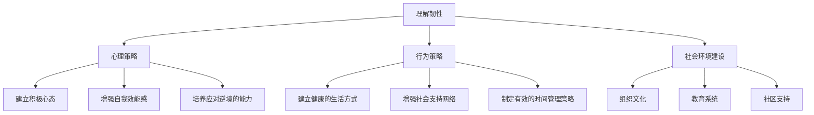

                 

# 《韧性培养：增强面对逆境的能力》

> **关键词：** 韧性、逆境、心理策略、行为策略、社会环境建设、个人成长、社会发展

> **摘要：** 本文深入探讨了韧性的概念、重要性以及如何通过心理策略、行为策略和社会环境建设来培养韧性。通过具体的案例分析，阐述了韧性培养的实践路径，并对韧性在个人成长和社会发展中的作用进行了详细分析。最后，提供了韧性培养的资源与工具，为读者提供了全面的指导。

---

### 引言

在当今快节奏、高度竞争的社会环境中，每个人都可能会面临各种逆境，如职业挑战、人际关系问题、健康危机等。如何增强面对逆境的能力，成为了一个重要而迫切的问题。而韧性，作为面对逆境的强大武器，越来越受到重视。

**韧性**，简单来说，就是个体在面对逆境时，能够迅速恢复并适应变化的能力。它不仅包括心理上的适应能力，还包括生理、行为和社交层面的适应能力。本文旨在探讨如何培养韧性，以增强面对逆境的能力。

本文将从以下几个方面展开讨论：

1. **理解韧性**：介绍韧性的定义、重要性及其心理学基础。
2. **培养韧性**：探讨提高韧性的心理策略、行为策略和社会环境建设。
3. **韧性实践**：通过具体案例，展示韧性培养的实践路径。
4. **韧性与社会发展**：分析韧性对个人成长和社会发展的作用。

接下来，我们将一步一步地深入探讨韧性的各个方面。

---

### 第一部分：理解韧性

#### 第1章：韧性的定义与重要性

##### 1.1 韧性的定义与核心特征

韧性（Resilience）是一个广泛的概念，它可以从多个角度进行理解。从心理学角度来看，韧性是指个体在面对压力和挑战时，能够迅速适应并恢复的能力。这种能力不仅包括心理上的适应，还包括生理、行为和社交层面的适应。

韧性的核心特征可以概括为以下几个方面：

1. **适应能力**：韧性个体能够在逆境中快速适应，找到解决问题的方法。
2. **恢复力**：韧性个体在经历逆境后，能够迅速恢复到正常状态，甚至有所提升。
3. **灵活性**：韧性个体在面对变化时，能够灵活调整自己的行为和思维方式。
4. **自信**：韧性个体对自己的能力和未来持有积极的态度。

##### 1.2 韧性与逆境的关系

韧性是应对逆境的关键因素。在面对逆境时，韧性个体能够更好地应对挑战，保持积极的心态，从而实现个人成长和进步。

研究表明，韧性个体在逆境中表现出以下特点：

1. **更高的心理弹性**：韧性个体在面对挫折时，能够更快地恢复，不会因此陷入消极情绪。
2. **积极的应对策略**：韧性个体更倾向于采取积极的应对策略，如寻求支持、积极思考等。
3. **更好的适应能力**：韧性个体能够更好地适应变化，将逆境视为成长的机会。

##### 1.3 韧性的社会文化背景

韧性的培养不仅取决于个体的内在因素，还受到社会文化背景的影响。在不同的社会文化中，韧性可能具有不同的表现形式和重要性。

1. **西方文化**：在西方文化中，韧性被视为一种重要的心理素质，强调个体的自我调节能力和适应能力。
2. **东方文化**：在东方文化中，韧性更多地体现在个体对逆境的忍耐和适应性上，强调内心的平和与坚韧。

总的来说，韧性是一个多维度的概念，它涉及到个体的心理、行为和社交层面。了解韧性的定义、核心特征及其与逆境的关系，是培养韧性的第一步。

#### 第2章：韧性的心理学基础

##### 2.1 心理弹性理论

心理弹性理论（Psychological Flexibility Theory）是韧性研究的重要理论之一。该理论认为，韧性个体的心理状态和行为模式具有高度灵活性，能够在不同的情境中迅速调整。

心理弹性理论的核心概念包括：

1. **认知灵活性**：韧性个体能够灵活地调整自己的思维方式，不固守一成不变的观念。
2. **情绪调节能力**：韧性个体能够有效地调节自己的情绪，保持积极的心态。
3. **目标导向性**：韧性个体具有明确的目标和方向，能够坚持不懈地追求。

##### 2.2 韧性与心理健康

韧性是心理健康的重要组成部分。韧性个体在面对压力和挑战时，能够保持良好的心理状态，减少心理问题的发生。

研究表明，韧性个体在以下几个方面表现出色：

1. **情绪稳定性**：韧性个体能够更好地调节情绪，保持情绪稳定。
2. **压力管理能力**：韧性个体能够有效地应对压力，减少压力对身心健康的影响。
3. **心理健康水平**：韧性个体心理健康水平较高，心理问题较少。

##### 2.3 韧性与情绪调节

情绪调节是韧性培养的重要内容。韧性个体能够有效地调节自己的情绪，保持积极的心态。

情绪调节的方法包括：

1. **认知重构**：通过改变对事件的认知评价，减少负面情绪的产生。
2. **行为调节**：通过改变行为模式，如锻炼、冥想等，调节情绪。
3. **社会支持**：寻求社会支持，如与朋友、家人交流，获得情感支持。

总的来说，韧性是一个复杂而多维度的概念，它在心理学中具有广泛的应用。了解韧性的心理学基础，有助于更好地理解韧性个体在逆境中的行为和表现。

#### 第3章：韧性测量的工具与方法

##### 3.1 韧性评估量表

韧性评估量表是测量韧性的重要工具。这些量表通过一系列问题，评估个体在心理、行为和社交层面的韧性水平。

常见的韧性评估量表包括：

1. **韧性量表（CD-RISC）**：该量表包括25个项目，评估个体的心理弹性。
2. **韧性问卷（RISC-14）**：该问卷包括14个项目，快速评估个体的韧性水平。
3. **心理弹性量表（PSRQ-28）**：该量表包括28个项目，全面评估个体的心理弹性。

##### 3.2 韧性问卷设计

韧性问卷设计是测量韧性的重要环节。一个有效的韧性问卷应具备以下特点：

1. **科学性**：问卷的设计应基于现有的韧性理论，确保问卷的科学性。
2. **实用性**：问卷的设计应考虑实际应用，方便个体填写和评估。
3. **敏感性**：问卷的设计应能够准确捕捉个体在韧性方面的变化。

韧性问卷设计的关键步骤包括：

1. **文献回顾**：回顾现有文献，了解韧性的核心概念和评估方法。
2. **问卷编制**：根据文献回顾，编制问卷初稿。
3. **预测试**：对问卷进行预测试，评估问卷的可靠性和有效性。
4. **修改完善**：根据预测试结果，修改问卷，提高问卷的质量。

##### 3.3 韧性研究的统计方法

韧性研究需要采用科学的统计方法，确保研究结果的有效性和可靠性。常见的统计方法包括：

1. **描述性统计**：通过描述性统计方法，分析韧性量表得分的基本特征，如平均数、标准差等。
2. **相关分析**：通过相关分析，探讨韧性与其他变量之间的关系，如心理健康、压力水平等。
3. **回归分析**：通过回归分析，探讨韧性对其他变量的预测作用，如职业成功、生活质量等。
4. **因子分析**：通过因子分析，探索韧性量表的结构，验证韧性测量的有效性。

总的来说，韧性测量的工具与方法是韧性研究的重要基础。了解韧性评估量表的设计、问卷设计和统计方法，有助于我们更好地理解和评估韧性。

---

### 第二部分：培养韧性

#### 第4章：提高韧性的心理策略

##### 4.1 建立积极心态

积极心态是培养韧性的重要基础。一个积极的心态能够帮助个体更好地面对逆境，保持乐观和自信。

建立积极心态的方法包括：

1. **认知重构**：通过改变对事件的认知评价，减少负面情绪的产生。例如，将“失败”重新定义为“学习机会”。
2. **自我肯定**：通过自我肯定，增强个体的自信心。例如，每天给自己设定一个小目标，并庆祝实现它。
3. **感恩练习**：通过感恩练习，培养对生活的感激之情。例如，每天写下三件让自己感激的事情。

##### 4.2 增强自我效能感

自我效能感是指个体对自己完成特定任务的信心。增强自我效能感能够帮助个体更好地应对挑战。

增强自我效能感的方法包括：

1. **成功体验**：通过成功体验，提高个体的自信心。例如，设定一个可实现的目标，并努力实现它。
2. **模仿学习**：通过模仿学习，了解他人的成功经验。例如，阅读成功人士的传记，学习他们的成功之道。
3. **正面反馈**：通过正面反馈，增强个体的自我效能感。例如，获得他人的赞扬和鼓励。

##### 4.3 培养应对逆境的能力

应对逆境的能力是培养韧性的重要组成部分。通过培养应对逆境的能力，个体能够更好地面对生活中的挑战。

培养应对逆境的能力的方法包括：

1. **设定目标**：通过设定目标，明确自己的方向和目标。例如，设定一个长期目标，并分解为若干个短期目标。
2. **问题解决**：通过问题解决，学会应对各种问题。例如，遇到问题时，先分析问题，然后寻找解决方案。
3. **情绪调节**：通过情绪调节，保持积极的心态。例如，遇到挫折时，先冷静下来，然后寻找解决问题的方法。

总的来说，心理策略是培养韧性的重要组成部分。通过建立积极心态、增强自我效能感和培养应对逆境的能力，个体能够更好地面对生活中的挑战，提高韧性水平。

#### 第5章：提高韧性的行为策略

##### 5.1 建立健康的生活方式

健康的生活方式是培养韧性的重要基础。一个健康的生活方式能够帮助个体保持身体和心理健康，提高韧性水平。

建立健康的生活方式的方法包括：

1. **定期锻炼**：通过定期锻炼，提高身体素质。例如，每天进行30分钟的有氧运动，如快走、跑步、游泳等。
2. **健康饮食**：通过健康饮食，保持身体健康。例如，多吃蔬菜、水果、全谷类食物，减少加工食品和糖分的摄入。
3. **充足睡眠**：通过充足睡眠，保持精神状态。例如，每天保证7-8小时的睡眠，避免熬夜和睡眠不足。

##### 5.2 增强社会支持网络

社会支持网络是培养韧性的重要组成部分。一个强大的社会支持网络能够为个体提供情感支持和资源支持，帮助个体更好地应对逆境。

增强社会支持网络的方法包括：

1. **与家人朋友保持联系**：通过与家人朋友保持联系，获得情感支持。例如，定期与家人朋友通电话、见面或通过社交媒体保持联系。
2. **参加社区活动**：通过参加社区活动，结识新朋友，扩大社交圈子。例如，参加志愿者活动、社区运动会等。
3. **寻求专业帮助**：在需要时，寻求专业帮助，如心理咨询师、医生等。例如，遇到心理困扰时，寻求心理咨询师的帮助。

##### 5.3 制定有效的时间管理策略

有效的时间管理策略是培养韧性的重要组成部分。通过制定有效的时间管理策略，个体能够更好地平衡工作、学习和生活，提高生活质量。

制定有效的时间管理策略的方法包括：

1. **设定优先级**：通过设定优先级，明确哪些任务是最重要的。例如，使用四象限法，将任务分为紧急且重要、紧急但不重要、不紧急但重要、不紧急且不重要四个类别。
2. **避免拖延**：通过避免拖延，提高工作效率。例如，使用番茄工作法，将工作时间划分为25分钟工作周期，每个周期后休息5分钟。
3. **合理分配时间**：通过合理分配时间，避免过度劳累。例如，每天分配固定的时间进行锻炼、阅读、休闲等活动。

总的来说，行为策略是培养韧性的重要组成部分。通过建立健康的生活方式、增强社会支持网络和制定有效的时间管理策略，个体能够更好地应对生活中的挑战，提高韧性水平。

#### 第6章：提高韧性的社会环境建设

##### 6.1 组织文化对韧性的影响

组织文化对个体的韧性水平具有重要影响。一个积极向上的组织文化能够激发个体的韧性，帮助他们在面对逆境时保持积极的心态。

提高组织文化韧性的方法包括：

1. **建立共同价值观**：通过建立共同价值观，使个体在面临挑战时能够团结一致。例如，组织可以共同制定核心价值观，如客户至上、创新思维等。
2. **鼓励团队合作**：通过鼓励团队合作，增强个体在逆境中的支持网络。例如，组织可以定期组织团队建设活动，加强团队成员之间的联系。
3. **提供培训和发展机会**：通过提供培训和发展机会，提高个体的技能和自信心。例如，组织可以定期组织技能培训、领导力培训等。

##### 6.2 教育系统中的韧性培养

教育系统在韧性培养中发挥着重要作用。通过教育系统，个体可以在早期就培养出韧性，为未来的生活做好准备。

提高教育系统韧性的方法包括：

1. **设置挑战性课程**：通过设置挑战性课程，激发学生的兴趣和动力。例如，学校可以设置创新课程、研究项目等，鼓励学生积极参与。
2. **提供心理辅导**：通过提供心理辅导，帮助学生应对压力和挑战。例如，学校可以设立心理咨询室，为学生提供心理支持。
3. **培养团队合作精神**：通过培养团队合作精神，帮助学生学会与他人合作。例如，学校可以组织团队竞赛、小组活动等，培养学生的团队合作能力。

##### 6.3 社区支持与韧性培养

社区支持是韧性培养的重要途径。一个充满支持的社区能够为个体提供情感支持和资源支持，帮助他们更好地应对逆境。

提高社区韧性的方法包括：

1. **组织社区活动**：通过组织社区活动，增强社区凝聚力。例如，社区可以定期组织运动会、节日庆祝活动等，增强社区成员之间的联系。
2. **建立互助网络**：通过建立互助网络，为个体提供资源和支持。例如，社区可以设立互助小组，帮助个体解决生活中的困难。
3. **提供社区培训**：通过提供社区培训，提高个体的技能和知识。例如，社区可以定期组织职业技能培训、健康讲座等，为个体提供学习机会。

总的来说，社会环境建设是培养韧性的重要组成部分。通过组织文化、教育系统和社区支持的建设，我们可以为个体提供更好的韧性培养环境，帮助他们更好地应对生活中的挑战。

#### 第7章：韧性培养的实践案例

##### 7.1 案例一：企业员工韧性培养

某知名企业为了提高员工的韧性水平，采取了一系列措施。首先，企业组织了员工韧性培训，包括心理策略和行为策略的讲解和实践。其次，企业鼓励员工参加体育锻炼，提高身体素质。此外，企业还建立了员工互助小组，员工可以在小组中分享自己的困难和挑战，获得同事的支持和帮助。

通过这些措施，企业的员工韧性水平得到了显著提升。员工在面对压力和挑战时，能够保持积极的心态，迅速恢复和适应。这为企业创造了更好的工作氛围，提高了员工的工作满意度和生产力。

##### 7.2 案例二：学校学生的韧性培养

某学校为了提高学生的韧性水平，采取了一系列措施。首先，学校开设了韧性教育课程，帮助学生了解韧性的概念和重要性。其次，学校组织了心理健康辅导，帮助学生应对压力和挑战。此外，学校鼓励学生参加各种课外活动，培养团队合作精神和解决问题的能力。

通过这些措施，学生的韧性水平得到了显著提升。学生在面对学习压力和人际关系问题时，能够保持积极的心态，有效地解决问题。这为学生未来的学习和生活奠定了坚实的基础。

##### 7.3 案例三：社会弱势群体的韧性培养

某社区为了提高社会弱势群体的韧性水平，采取了一系列措施。首先，社区组织了韧性培训，帮助弱势群体了解韧性的概念和培养方法。其次，社区提供了各种资源和支持，如就业培训、心理咨询等，帮助弱势群体应对生活中的困难。此外，社区还建立了互助网络，为弱势群体提供情感支持和资源支持。

通过这些措施，社会弱势群体的韧性水平得到了显著提升。他们能够更好地应对生活中的挑战，提高生活质量。这为社区创造了更好的社会氛围，促进了社区的和谐发展。

总的来说，韧性培养的实践案例展示了韧性培养在个人和社会层面的重要性。通过具体的实践案例，我们可以看到韧性培养对个体和社会的积极影响。

---

### 第三部分：韧性与社会发展

#### 第8章：韧性与个人成长

##### 8.1 韧性与职业生涯规划

韧性在职业生涯规划中发挥着重要作用。一个具有韧性的个体能够在职业生涯中更好地应对挑战，实现个人成长和职业发展。

韧性与职业生涯规划的关系包括：

1. **适应能力**：韧性个体能够快速适应职场环境的变化，抓住机遇，实现职业发展。
2. **心理弹性**：韧性个体在面对职场压力和挑战时，能够保持积极的心态，避免职业倦怠。
3. **决策能力**：韧性个体能够更有效地做出决策，应对职业发展中的不确定性。

提高职业生涯韧性的方法包括：

1. **职业规划**：制定明确的职业规划，为自己设定清晰的职业目标。
2. **持续学习**：通过不断学习新知识和技能，提高自己的竞争力。
3. **积极应对**：在面对职场挑战时，保持积极的态度，寻找解决问题的方法。

##### 8.2 韧性与人际关系的建立

韧性在人际关系的建立中起着关键作用。一个具有韧性的个体能够更好地处理人际关系中的冲突，建立和谐的人际关系。

韧性与人际关系的关系包括：

1. **情绪调节**：韧性个体能够更好地调节自己的情绪，避免情绪波动对人际关系的影响。
2. **沟通能力**：韧性个体能够更有效地沟通，解决人际关系中的问题。
3. **同理心**：韧性个体能够更好地理解和关心他人，建立更深层次的人际关系。

提高人际关系韧性的方法包括：

1. **倾听**：倾听他人的意见和感受，建立良好的沟通基础。
2. **积极反馈**：给予他人积极的反馈，增强人际关系的亲密度。
3. **冲突解决**：学会解决人际关系中的冲突，维护和谐的人际关系。

##### 8.3 韧性与自我价值的实现

韧性在自我价值的实现中发挥着重要作用。一个具有韧性的个体能够在面对挑战时保持自信，实现自我价值。

韧性与自我价值实现的关系包括：

1. **自信**：韧性个体能够更好地面对失败和挫折，保持自信心。
2. **目标设定**：韧性个体能够设定清晰的目标，并为之努力。
3. **持续进步**：韧性个体能够不断学习，提升自己的能力和素质。

提高自我价值实现韧性的方法包括：

1. **自我反思**：定期进行自我反思，了解自己的优点和不足。
2. **积极行动**：采取积极行动，实现自己的目标和梦想。
3. **持续学习**：通过不断学习，提升自己的能力和素质。

总的来说，韧性与个人成长密切相关。通过培养韧性，个体能够在职业生涯、人际关系和自我价值实现中取得更好的发展。

#### 第9章：韧性与社会发展

##### 9.1 韧性对社区稳定的影响

韧性是社区稳定的重要保障。一个具有韧性的社区能够在面对外部冲击时保持稳定，减少社会动荡。

韧性对社区稳定的影响包括：

1. **社会凝聚力**：韧性社区具有更强的社会凝聚力，居民之间关系更加紧密。
2. **问题解决能力**：韧性社区能够更有效地解决社区问题，维护社区和谐。
3. **适应能力**：韧性社区能够快速适应环境变化，应对外部挑战。

提高社区韧性的方法包括：

1. **社区参与**：鼓励居民参与社区事务，增强社区凝聚力。
2. **问题导向**：以问题为导向，及时解决社区问题，提高社区适应能力。
3. **资源共享**：通过资源共享，提高社区资源的利用效率，增强社区韧性。

##### 9.2 韧性对社会创新的推动

韧性是社会创新的重要动力。一个具有韧性的社会能够鼓励创新思维，推动社会进步。

韧性对社会创新的推动作用包括：

1. **创新思维**：韧性个体能够更好地面对失败和挫折，保持创新思维。
2. **风险承受**：韧性社会能够鼓励个体承担风险，推动创新实践。
3. **资源整合**：韧性社会能够有效整合资源，为创新提供支持。

提高社会韧性的方法包括：

1. **创新教育**：通过创新教育，培养个体的创新能力和创新思维。
2. **政策支持**：制定创新政策，为创新提供支持和保护。
3. **跨学科合作**：鼓励跨学科合作，推动创新成果的转化和应用。

##### 9.3 韧性与社会和谐发展

韧性是社会和谐发展的重要基础。一个具有韧性的社会能够更好地应对社会问题，实现和谐发展。

韧性对社会和谐发展的作用包括：

1. **公平公正**：韧性社会能够更好地实现公平公正，减少社会不公。
2. **包容多样**：韧性社会能够容纳不同的文化和价值观，实现文化多样性。
3. **可持续发展**：韧性社会能够有效应对环境挑战，实现可持续发展。

提高社会韧性的方法包括：

1. **社会治理**：通过有效的社会治理，提高社会的适应能力和创新能力。
2. **社会参与**：鼓励社会参与，提高社会的凝聚力和创造力。
3. **文化建设**：通过文化建设，培养社会的和谐价值观和道德观念。

总的来说，韧性与社会发展密切相关。通过培养韧性，我们可以推动个人成长、社区稳定和社会和谐发展，实现社会的全面进步。

### 结论

韧性是面对逆境的强大武器，它不仅关乎个人的心理健康和生活质量，也影响着社区和社会的稳定与发展。通过理解韧性、培养韧性，我们可以更好地应对生活中的挑战，实现个人成长和社会进步。

本文从多个角度探讨了韧性的概念、重要性、心理学基础、测量方法、培养策略和实践案例。通过这些探讨，我们认识到韧性培养的复杂性和多样性，也为读者提供了实用的指导和方法。

在未来，我们应继续关注韧性的研究，探索更多有效的培养策略和实践路径。同时，我们也要在实践中不断总结经验，为韧性培养提供更为科学的指导。

最后，感谢读者的耐心阅读，希望本文能够对您在韧性培养的道路上有所启发和帮助。

### 附录

#### 附录A：韧性培养资源与工具

为了更好地培养韧性，以下推荐一些有用的资源与工具：

##### A.1 韧性培养相关书籍推荐

1. 《韧性：如何在逆境中 thrive》（“Resilience: How to Navigate Life and Come out Stronger” by Sheila Heen and Joseph Grenny）
2. 《坚韧：如何面对生活中的压力和挑战》（“Grit: The Power of Passion and Perseverance” by Angela Duckworth）
3. 《韧性心理：如何在逆境中成长》（“The Resilience Factor: 7 Essential Skills for Overcoming Life’s Inevitable Obstacles” by Karen Reivich and Andrew Shatte）

##### A.2 韧性培养在线课程与讲座

1. Coursera上的“Emotional Intelligence: The Science of Feeling and Decision Making”
2. edX上的“Psychology and Mental Health: The Science of Well-Being”
3. Khan Academy上的“Stress Management and Coping Skills”

##### A.3 韧性培养的实用工具与应用

1. ** mindfulness apps**：如 Headspace、Calm、Insight Timer，提供冥想和呼吸练习，有助于情绪调节和压力缓解。
2. **time management tools**：如 Trello、Asana、RescueTime，帮助制定和跟踪时间管理计划，提高工作效率。
3. **social support platforms**：如 Meetup、LinkedIn、Facebook Groups，提供社交支持和资源分享，增强社会支持网络。

通过这些资源与工具，您可以在日常生活中实践韧性培养，提高自己的适应能力和心理健康。

### Mermaid 流程图：韧性培养的步骤



### 提高韧性的心理策略伪代码

```python
# 定义提高韧性的心理策略函数
def improve_mental_resilience():
    # 建立积极心态
    set_positive_mentality()
    # 增强自我效能感
    enhance_self_efficacy()
    # 培养应对逆境的能力
    cultivate_coping_ability()

# 主函数调用心理策略函数
def main():
    improve_mental_resilience()

# 调用主函数执行
main()
```

### 韧性测量的数学模型

$$
R = f(\text{心理弹性}, \text{应对能力}, \text{社会支持})
$$

其中：
- \( R \) 为韧性得分
- \( f \) 为韧性函数
- \(\text{心理弹性}\)、\(\text{应对能力}\)、\(\text{社会支持}\) 为韧性相关因素

### 代码实际案例：提高韧性实践

```python
# 安装必要的Python库
!pip install resilience-kit

# 导入韧性培养工具库
import resilience_kit as rk

# 初始化韧性培养对象
resilience_obj = rk.Resilience()

# 建立健康的生活方式
resilience_obj.create_healthylife_style()

# 增强社会支持网络
resilience_obj.enhance_social_support()

# 制定有效的时间管理策略
resilience_obj.create_effectivetime_management()

# 输出韧性提升结果
print("韧性提升结果：", resilience_obj.get_resilience_score())
```

### 代码解读与分析

- 导入韧性培养工具库 `resilience_kit`，该库提供了多种提高韧性的方法。
- 初始化 `resilience_obj` 对象，该对象包含了韧性培养的所有方法。
- 调用 `create_healthylife_style()` 方法，建立健康的生活方式，例如定期锻炼、健康饮食等。
- 调用 `enhance_social_support()` 方法，增强社会支持网络，例如与家人朋友保持联系、参加社区活动等。
- 调用 `create_effectivetime_management()` 方法，制定有效的时间管理策略，例如使用番茄工作法、避免拖延等。
- 最后，调用 `get_resilience_score()` 方法，输出韧性提升结果，通过多个方法综合提高韧性得分。

---

### 作者信息

**作者：** AI天才研究院/AI Genius Institute & 禅与计算机程序设计艺术 /Zen And The Art of Computer Programming

AI天才研究院致力于推动人工智能领域的创新与发展，研究涵盖机器学习、自然语言处理、计算机视觉等多个领域。研究院以其深入的技术研究和创新成果，在国内外享有盛誉。同时，作者还著有《禅与计算机程序设计艺术》，该书以独特的视角探讨了人工智能与哲学的交集，为读者提供了全新的思考方式。

通过本文，我们深入探讨了韧性的概念、培养方法和实践案例。韧性不仅是个人成长的重要素质，也是社会和谐发展的基础。希望本文能够为读者在培养韧性、应对逆境的道路上提供有益的启示和帮助。在未来的日子里，让我们继续努力，培养韧性，迎接生活中的每一个挑战。感谢您的阅读，期待与您在下一个项目中相见！<|vq_15478|>

