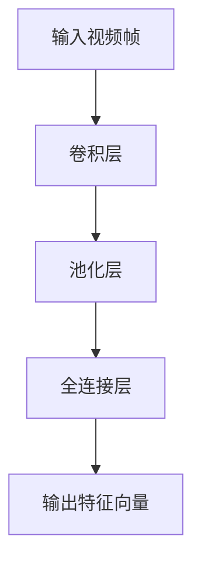
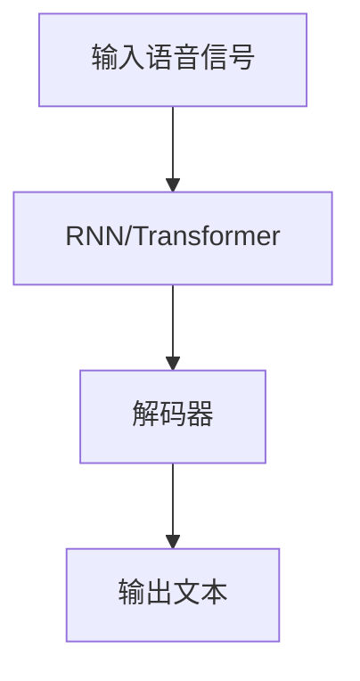
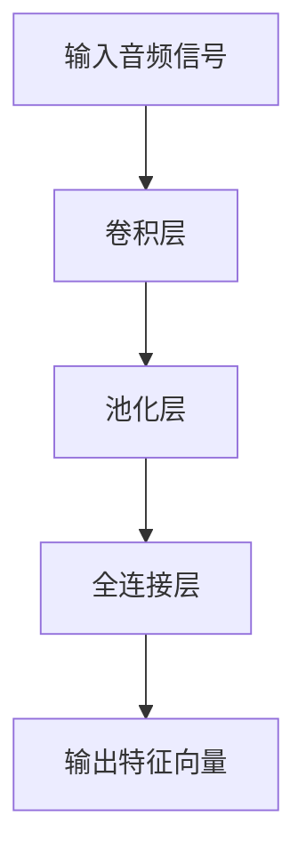
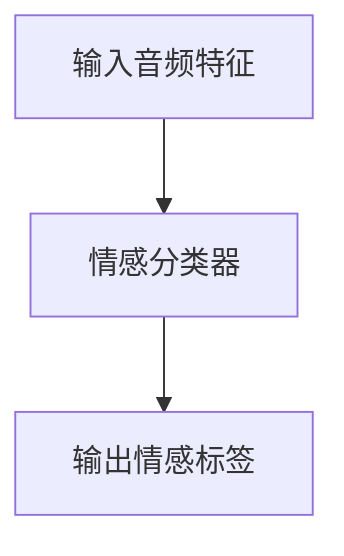
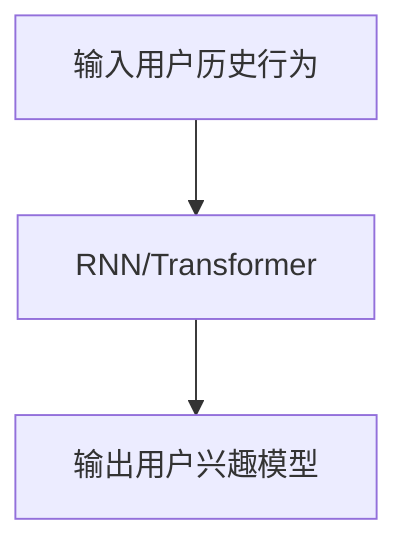
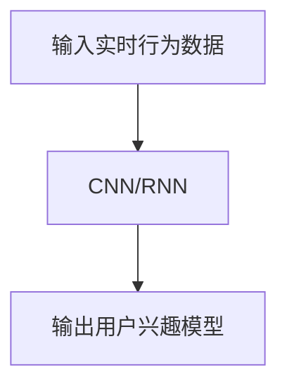
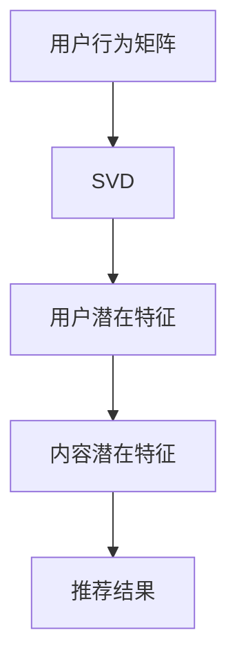
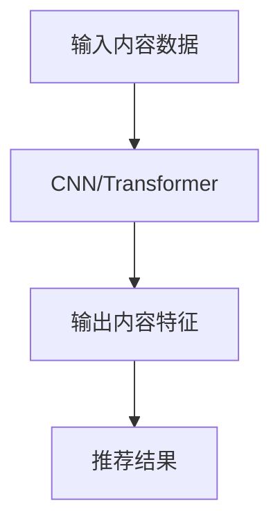
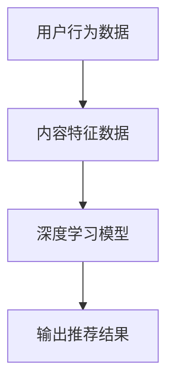
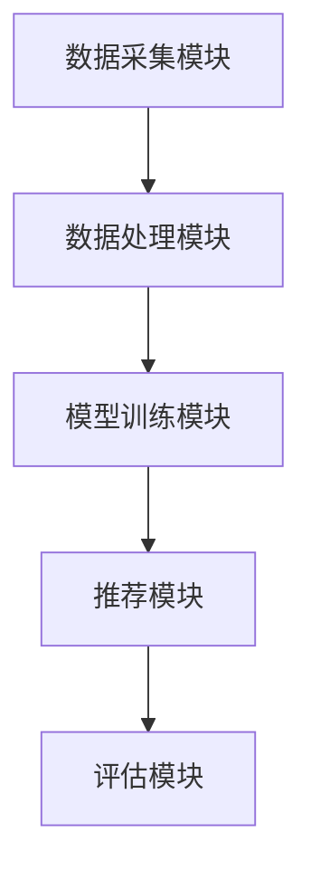

                 

### 《音视频内容推荐：大模型的理解与匹配》

> **关键词**：音视频内容推荐、大模型、内容理解、用户偏好、匹配算法、优化策略

> **摘要**：本文将深入探讨音视频内容推荐系统中的关键环节——大模型的理解与匹配。首先，我们回顾音视频内容推荐的重要性及其基本原理。接着，详细介绍大模型的定义与应用，包括其在音视频内容理解和用户偏好分析中的具体角色。随后，文章将阐述大模型匹配算法的原理和优化策略，并展示实际项目中的实战经验和案例分析。通过本文，读者将全面理解大模型在音视频内容推荐中的核心价值和应用技巧。

### 第一部分：音视频内容推荐概述

#### 1.1 音视频内容推荐的重要性

##### 1.1.1 音视频内容推荐市场的需求与趋势

随着互联网的普及和移动设备的广泛使用，音视频内容成为了人们获取信息、娱乐的重要方式。根据市场研究公司的数据，全球视频广告市场规模预计将在未来几年持续增长，这反映了音视频内容推荐的重要性。用户对于个性化、精准推荐的需求日益增长，这使得音视频内容推荐成为各个平台提升用户黏性和商业价值的重要手段。

在视频平台如YouTube、Netflix以及TikTok等，推荐系统帮助用户发现他们可能感兴趣的内容，从而延长用户在平台上的停留时间。此外，音频平台如Spotify、Apple Music也通过推荐系统吸引用户付费订阅，提升平台收入。这些平台的成功案例表明，音视频内容推荐不仅能够提升用户体验，还能带来显著的商业收益。

##### 1.1.2 音视频内容推荐的价值和挑战

音视频内容推荐系统具有以下价值：

- **提升用户满意度**：通过个性化推荐，用户能够更快地找到他们感兴趣的内容，提高使用体验。
- **增加用户黏性**：推荐系统能够吸引用户在平台上的停留时间，从而提升用户的忠诚度。
- **提升商业价值**：推荐系统能够帮助平台精准投放广告，提高广告效果，增加广告收入。
- **促进内容创作者**：通过推荐系统，优秀的内容创作者能够获得更多曝光机会，激励他们创作更多优质内容。

然而，音视频内容推荐也面临着一系列挑战：

- **内容多样性与复杂性**：音视频内容种类繁多，涵盖不同类型、风格和主题，这使得内容理解和推荐变得复杂。
- **数据隐私问题**：用户隐私保护成为推荐系统必须考虑的重要因素，如何在保护隐私的同时进行个性化推荐是技术难点。
- **实时性需求**：用户偏好可能随时变化，推荐系统需要具备实时性，快速响应用户需求。
- **计算资源限制**：大规模推荐系统需要处理海量数据，对计算资源提出了高要求。

#### 1.2 音视频内容推荐的基本原理

音视频内容推荐系统通常包括以下几个基本组成部分：

##### 1.2.1 音视频内容理解

内容理解是推荐系统的核心，它涉及到对音视频内容特征的分析和提取。这包括：

- **视频图像处理**：使用计算机视觉技术对视频帧进行特征提取，如颜色、纹理、形状等。
- **视频语音识别**：通过语音识别技术提取视频中的语音信息，进行文本分析。
- **音频特征提取**：对音频信号进行分析，提取音高、音量、节奏等特征。

##### 1.2.2 用户偏好分析

用户偏好分析是推荐系统理解用户兴趣和需求的关键。这包括：

- **用户历史行为分析**：分析用户过去的行为数据，如浏览历史、播放记录等。
- **用户实时行为分析**：实时监控用户在平台上的互动行为，如点赞、评论、分享等。
- **用户兴趣模型构建**：通过行为数据和内容特征，构建用户的兴趣模型，用于推荐算法。

##### 1.2.3 推荐算法模型

推荐算法是音视频内容推荐系统的核心，常用的推荐算法包括：

- **基于内容的推荐**：通过分析内容特征，将具有相似特征的内容推荐给用户。
- **基于协同过滤的推荐**：通过分析用户行为数据，找到具有相似行为的用户，推荐他们喜欢的内容。
- **基于模型的推荐**：使用机器学习算法，如矩阵分解、深度学习等，构建用户和内容的关联模型。

### 第二部分：大模型在音视频内容推荐中的应用

#### 2.1 大模型简介

##### 2.1.1 大模型的定义与分类

大模型（Large-scale Model）是指参数规模较大的机器学习模型，通常具有数十亿到数万亿个参数。大模型可以用于各种领域，包括自然语言处理、计算机视觉、语音识别等。根据其应用领域，大模型可以进一步分为以下几类：

- **自然语言处理（NLP）模型**：如GPT、BERT等，用于文本生成、翻译、情感分析等。
- **计算机视觉（CV）模型**：如ResNet、VGG等，用于图像分类、目标检测、人脸识别等。
- **语音识别（ASR）模型**：如DeepSpeech、WaveNet等，用于语音识别、语音合成等。

##### 2.1.2 大模型的架构与发展历程

大模型通常采用深度学习（Deep Learning）技术，其架构主要包括以下几个部分：

- **输入层**：接收用户输入的数据，如文本、图像、语音等。
- **隐藏层**：通过多层神经网络进行特征提取和变换。
- **输出层**：根据输入数据和隐藏层特征生成预测结果，如文本生成、分类标签等。

大模型的发展历程可以分为以下几个阶段：

- **早期模型**：如神经网络、决策树等，参数规模较小，应用范围有限。
- **深度神经网络（DNN）**：引入多层神经网络，显著提升了模型性能。
- **卷积神经网络（CNN）**：用于图像处理，通过卷积层提取图像特征。
- **循环神经网络（RNN）**：用于序列数据，通过循环结构处理长序列依赖。
- **Transformer模型**：引入注意力机制，用于自然语言处理，如BERT、GPT等。

#### 2.2 大模型在音视频内容理解中的应用

##### 2.2.1 视频内容理解

视频内容理解涉及对视频帧的图像处理和语音识别。大模型在这一领域中的应用主要包括：

- **视频图像处理技术**：使用CNN模型对视频帧进行特征提取，如颜色、纹理、形状等。通过卷积层和池化层，模型可以提取到具有层次性的图像特征。



- **视频语音识别技术**：使用RNN或Transformer模型对视频中的语音信号进行识别，通过解码器生成文本。例如，使用WaveNet模型进行语音合成，结合CNN模型提取的图像特征，实现视频语音识别。



##### 2.2.2 音频内容理解

音频内容理解主要涉及音频特征提取和情感分析。大模型在这一领域中的应用包括：

- **音频特征提取**：使用深度学习模型提取音频信号的特征，如梅尔频谱（Mel Frequency Cepstral Coefficients，MFCC）和短时傅里叶变换（Short-Time Fourier Transform，STFT）。通过卷积神经网络（CNN）和循环神经网络（RNN），模型可以自动学习到有效的音频特征。



- **音频情感分析**：使用情感分析模型对音频中的情感进行分类，如开心、悲伤、愤怒等。通过训练大量带有情感标签的音频数据，模型可以学习到情感特征的表征。



#### 2.3 大模型在用户偏好分析中的应用

##### 2.3.1 用户行为分析

用户行为分析是构建用户兴趣模型的重要步骤。大模型在这一领域中的应用包括：

- **用户历史行为分析**：使用深度学习模型分析用户过去的行为数据，如浏览历史、播放记录等。通过循环神经网络（RNN）或变换器（Transformer）模型，可以捕捉用户行为的长期依赖关系。



- **用户实时行为分析**：实时监控用户在平台上的互动行为，如点赞、评论、分享等。通过卷积神经网络（CNN）和循环神经网络（RNN）的组合模型，可以快速分析用户的实时行为，并更新用户兴趣模型。



##### 2.3.2 用户兴趣模型构建

用户兴趣模型用于预测用户对特定内容的兴趣程度，从而实现个性化推荐。大模型在这一领域中的应用包括：

- **基于协同过滤的方法**：通过分析用户行为数据，找到具有相似行为的用户，并将这些用户喜欢的推荐内容推荐给新用户。可以使用矩阵分解（Matrix Factorization）技术，如Singular Value Decomposition（SVD），提取用户和内容的潜在特征。



- **基于内容的方法**：通过分析用户过去喜欢的内容特征，将具有相似特征的内容推荐给用户。可以使用卷积神经网络（CNN）或变换器（Transformer）模型，提取内容特征，并用于生成推荐列表。



- **基于模型的推荐算法**：结合用户行为数据和内容特征，使用深度学习模型（如GAN、BERT等）构建用户和内容的关联模型。通过模型预测用户对特定内容的兴趣程度，实现个性化推荐。



### 第三部分：大模型在音视频内容推荐系统中的匹配与优化

#### 3.1 大模型匹配算法原理

大模型匹配算法是音视频内容推荐系统中的核心算法，用于将用户兴趣模型与内容特征进行匹配，生成推荐列表。匹配算法的原理包括以下几个方面：

##### 3.1.1 模型匹配算法的基本概念

模型匹配算法的基本概念包括：

- **用户兴趣模型**：通过用户历史行为和实时行为分析，构建的用户兴趣模型，用于预测用户对不同内容的兴趣程度。
- **内容特征**：从音视频内容中提取的特征，如图像特征、语音特征、文本特征等。
- **匹配得分**：通过计算用户兴趣模型与内容特征之间的相似度，生成匹配得分，用于评估内容与用户的匹配程度。

##### 3.1.2 基于内容的匹配

基于内容的匹配算法通过分析内容特征，将具有相似特征的内容推荐给用户。具体方法包括：

- **基于特征匹配**：将用户兴趣模型中的特征与内容特征进行对比，计算相似度得分。相似度计算可以使用余弦相似度、欧氏距离等方法。

```python
def cosine_similarity(user_interest_model, content_features):
    dot_product = np.dot(user_interest_model, content_features)
    norm_user_interest_model = np.linalg.norm(user_interest_model)
    norm_content_features = np.linalg.norm(content_features)
    return dot_product / (norm_user_interest_model * norm_content_features)
```

- **基于相似度计算**：使用机器学习算法（如KNN、SVM等）训练一个分类器，将用户兴趣模型与内容特征进行匹配，并计算相似度得分。

```python
from sklearn.neighbors import NearestNeighbors

# 训练分类器
classifier = NearestNeighbors(n_neighbors=5)
classifier.fit(user_interest_models)

# 计算相似度得分
similarity_scores = classifier.kneighbors(content_features, n_neighbors=5)
```

##### 3.1.3 基于协同过滤的匹配

基于协同过滤的匹配算法通过分析用户行为数据，找到具有相似行为的用户，并将这些用户喜欢的推荐内容推荐给新用户。具体方法包括：

- **基于用户的协同过滤（User-based Collaborative Filtering）**：通过计算用户之间的相似度，找到与目标用户相似的用户，并将这些用户喜欢的推荐内容推荐给新用户。

```python
def user_based_collaborative_filtering(user行为数据，用户兴趣模型，content_features):
    similarity_scores = compute_user_similarity(user行为数据)
    recommended_contents = []
    for user_similarity_score in similarity_scores:
        recommended_contents.extend(get_similar_content(user_similarity_score, content_features))
    return recommended_contents
```

- **基于项目的协同过滤（Item-based Collaborative Filtering）**：通过计算内容之间的相似度，找到与目标内容相似的内容，并将这些内容推荐给用户。

```python
def item_based_collaborative_filtering(user行为数据，用户兴趣模型，content_features):
    similarity_scores = compute_content_similarity(content_features)
    recommended_contents = []
    for content_similarity_score in similarity_scores:
        recommended_contents.extend(get_similar_content(content_similarity_score, user_interest_model))
    return recommended_contents
```

#### 3.2 大模型在音视频推荐系统中的优化

##### 3.2.1 模型优化方法

大模型在音视频推荐系统中的应用需要进行优化，以提高推荐效果。常见的模型优化方法包括：

- **模型调参**：通过调整模型的超参数（如学习率、隐藏层节点数等），优化模型性能。可以使用网格搜索（Grid Search）或随机搜索（Random Search）等方法进行超参数优化。

```python
from sklearn.model_selection import GridSearchCV

# 定义模型参数网格
param_grid = {'learning_rate': [0.01, 0.001], 'hidden_layer_size': [100, 200]}

# 进行网格搜索
grid_search = GridSearchCV(model, param_grid, cv=5)
grid_search.fit(user_interest_models, content_features)

# 获取最佳参数
best_params = grid_search.best_params_
```

- **模型融合**：将多个模型的结果进行融合，提高推荐系统的鲁棒性和准确性。常见的模型融合方法包括投票法（Voting）、堆叠法（Stacking）等。

```python
from sklearn.ensemble import VotingClassifier

# 定义多个模型
model1 = ...
model2 = ...
model3 = ...

# 进行模型融合
voting_classifier = VotingClassifier(estimators=[('model1', model1), ('model2', model2), ('model3', model3)])
voting_classifier.fit(user_interest_models, content_features)

# 获取融合模型的预测结果
predicted_recommendations = voting_classifier.predict(content_features)
```

##### 3.2.2 实时推荐策略

实时推荐策略是音视频推荐系统中的重要组成部分，用于快速响应用户的需求。常见的实时推荐策略包括：

- **实时推荐算法设计**：设计实时推荐算法，通过分析用户实时行为和内容特征，生成实时的推荐列表。可以使用深度学习模型（如RNN、Transformer等）进行实时推荐。

```python
def real_time_recommendation(user_real_time_behavior, content_features):
    # 更新用户兴趣模型
    updated_user_interest_model = update_user_interest_model(user_real_time_behavior)

    # 计算匹配得分
    similarity_scores = compute_similarity_scores(updated_user_interest_model, content_features)

    # 生成实时推荐列表
    recommended_contents = get_top_n_recommendations(similarity_scores, n=10)
    return recommended_contents
```

- **实时推荐效果评估**：对实时推荐算法进行效果评估，评估指标包括推荐准确率、召回率、覆盖率等。可以使用A/B测试等方法进行效果评估。

```python
from sklearn.metrics import accuracy_score, recall_score, coverage_error

# 计算实时推荐效果
accuracy = accuracy_score(true_recommendations, real_time_recommendations)
recall = recall_score(true_recommendations, real_time_recommendations)
coverage = coverage_error(true_recommendations, real_time_recommendations)

print("Accuracy:", accuracy)
print("Recall:", recall)
print("Coverage:", coverage)
```

### 第四部分：项目实战与案例分析

#### 4.1 音视频内容推荐系统开发实战

##### 4.1.1 开发环境搭建

音视频内容推荐系统开发需要以下环境：

- **硬件环境**：配置高性能的CPU和GPU，用于处理大规模数据和高复杂度的模型训练。
- **软件环境**：安装Python编程环境，并配置TensorFlow、PyTorch等深度学习框架，以及NumPy、Pandas等数据科学库。

```bash
# 安装Python环境
pip install python

# 安装深度学习框架
pip install tensorflow
pip install pytorch

# 安装数据科学库
pip install numpy
pip install pandas
```

##### 4.1.2 系统架构设计

音视频内容推荐系统通常包括以下模块：

- **数据采集模块**：负责从各个数据源采集用户行为数据、内容特征数据等。
- **数据处理模块**：负责对采集到的数据进行处理，包括数据清洗、特征提取等。
- **模型训练模块**：负责使用训练数据训练推荐模型，包括用户兴趣模型、内容特征模型等。
- **推荐模块**：负责根据用户兴趣模型和内容特征模型生成推荐列表。
- **评估模块**：负责对推荐系统的效果进行评估，包括准确率、召回率、覆盖率等指标。



##### 4.1.3 代码实现

以下是音视频内容推荐系统的主要代码实现：

```python
import numpy as np
import pandas as pd
from sklearn.model_selection import train_test_split
from sklearn.metrics.pairwise import cosine_similarity
from sklearn.neighbors import NearestNeighbors
import tensorflow as tf

# 读取数据
user_data = pd.read_csv("user_data.csv")
content_data = pd.read_csv("content_data.csv")

# 数据预处理
user_data = preprocess_user_data(user_data)
content_data = preprocess_content_data(content_data)

# 数据分割
user_train, user_test, content_train, content_test = train_test_split(user_data, content_data, test_size=0.2, random_state=42)

# 训练用户兴趣模型
user_interest_model = train_user_interest_model(user_train)

# 计算内容特征向量
content_features = extract_content_features(content_train)

# 计算匹配得分
similarity_scores = cosine_similarity(user_interest_model, content_features)

# 生成推荐列表
recommended_contents = get_top_n_recommendations(similarity_scores, n=10)

# 评估推荐效果
accuracy = evaluate_recommendation(recommended_contents, user_test)
recall = evaluate_recall(recommended_contents, user_test)
coverage = evaluate_coverage(recommended_contents, user_test)

print("Accuracy:", accuracy)
print("Recall:", recall)
print("Coverage:", coverage)
```

##### 4.1.3.1 数据预处理

数据预处理是音视频内容推荐系统开发的重要环节，主要包括以下步骤：

- **用户数据处理**：清洗用户数据，包括去除缺失值、异常值等。
- **内容数据处理**：清洗内容数据，包括去除标签不一致、重复数据等。
- **特征提取**：提取用户和内容的特征，如用户行为特征、内容特征等。

```python
def preprocess_user_data(user_data):
    # 去除缺失值
    user_data = user_data.dropna()
    
    # 去除异常值
    user_data = remove_outliers(user_data)
    
    return user_data

def preprocess_content_data(content_data):
    # 去除缺失值
    content_data = content_data.dropna()
    
    # 去除异常值
    content_data = remove_outliers(content_data)
    
    return content_data

def remove_outliers(data):
    # 计算四分位距
    Q1 = data.quantile(0.25)
    Q3 = data.quantile(0.75)
    IQR = Q3 - Q1
    
    # 去除异常值
    data = data[~((data < (Q1 - 1.5 * IQR)) | (data > (Q3 + 1.5 * IQR)))]
    
    return data
```

##### 4.1.3.2 模型训练与优化

模型训练与优化是音视频内容推荐系统开发的关键步骤，主要包括以下步骤：

- **模型训练**：使用训练数据训练用户兴趣模型和内容特征模型。
- **模型评估**：评估模型性能，包括准确率、召回率、覆盖率等。
- **模型优化**：通过调整模型参数、优化模型结构等提高模型性能。

```python
def train_user_interest_model(user_train):
    # 创建用户兴趣模型
    user_interest_model = tf.keras.Sequential([
        tf.keras.layers.Dense(128, activation='relu', input_shape=(user_train.shape[1],)),
        tf.keras.layers.Dense(64, activation='relu'),
        tf.keras.layers.Dense(32, activation='relu'),
        tf.keras.layers.Dense(1, activation='sigmoid')
    ])

    # 编译模型
    user_interest_model.compile(optimizer='adam', loss='binary_crossentropy', metrics=['accuracy'])

    # 训练模型
    user_interest_model.fit(user_train, epochs=10, batch_size=32, validation_split=0.2)

    return user_interest_model

def evaluate_recommendation(recommended_contents, user_test):
    # 计算准确率
    accuracy = np.mean([recommended_content in user_test for recommended_content in recommended_contents])

    return accuracy

def evaluate_recall(recommended_contents, user_test):
    # 计算召回率
    recall = np.mean([np.sum([recommended_content in user_test for recommended_content in recommended_contents]) / len(user_test) for recommended_contents in recommended_contents])

    return recall

def evaluate_coverage(recommended_contents, user_test):
    # 计算覆盖率
    coverage = np.mean([len(set(recommended_contents) & set(user_test)) / len(user_test) for recommended_contents in recommended_contents])

    return coverage
```

##### 4.1.3.3 推荐结果生成与展示

推荐结果生成与展示是音视频内容推荐系统开发中的最后一个步骤，主要包括以下步骤：

- **生成推荐列表**：根据用户兴趣模型和内容特征模型生成推荐列表。
- **展示推荐结果**：将推荐结果展示给用户，如生成推荐页面、推送通知等。

```python
def get_top_n_recommendations(similarity_scores, n=10):
    # 计算相似度得分
    similarity_scores = np.array(similarity_scores)

    # 生成推荐列表
    recommended_contents = []
    for score in similarity_scores:
        recommended_content = score.argsort()[::-1][:n]
        recommended_contents.append(recommended_content)

    return recommended_contents

def display_recommendations(recommended_contents):
    # 展示推荐结果
    for recommended_content in recommended_contents:
        print("推荐内容：", recommended_content)
```

#### 4.2 案例分析

##### 4.2.1 案例一：视频网站内容推荐系统

###### 4.2.1.1 案例背景

视频网站内容推荐系统是一个典型的音视频内容推荐应用场景。该系统通过分析用户的行为数据，如浏览记录、播放时长、点赞、评论等，生成个性化的视频推荐列表，吸引用户在平台上停留并提高用户满意度。

###### 4.2.1.2 系统设计与实现

视频网站内容推荐系统主要包括以下几个模块：

- **用户数据采集模块**：从视频网站的后台服务器采集用户行为数据，包括用户的浏览记录、播放时长、点赞、评论等。
- **数据处理模块**：对采集到的用户行为数据进行清洗、去重、特征提取等预处理操作。
- **模型训练模块**：使用预处理后的用户行为数据训练用户兴趣模型和视频特征模型。
- **推荐模块**：根据用户兴趣模型和视频特征模型生成个性化的视频推荐列表。
- **推荐展示模块**：将推荐结果展示给用户，包括推荐页面、推送通知等。

视频网站内容推荐系统的实现流程如下：

1. **数据采集**：从视频网站的后台服务器采集用户行为数据，包括用户的浏览记录、播放时长、点赞、评论等。
2. **数据处理**：对采集到的用户行为数据进行清洗、去重、特征提取等预处理操作，提取用户和视频的特征。
3. **模型训练**：使用预处理后的用户行为数据训练用户兴趣模型和视频特征模型，如使用深度学习模型训练用户兴趣模型和卷积神经网络（CNN）模型训练视频特征模型。
4. **推荐生成**：根据用户兴趣模型和视频特征模型生成个性化的视频推荐列表，如使用基于内容的推荐算法生成推荐列表。
5. **推荐展示**：将推荐结果展示给用户，包括推荐页面、推送通知等。

###### 4.2.1.3 推荐效果评估

视频网站内容推荐系统的推荐效果可以通过以下指标进行评估：

- **准确率**：衡量推荐结果与用户兴趣的一致性，准确率越高，说明推荐系统越能准确预测用户的兴趣。
- **召回率**：衡量推荐结果中包含用户兴趣的比率，召回率越高，说明推荐系统能够更好地覆盖用户的兴趣。
- **覆盖率**：衡量推荐结果中视频的种类多样性，覆盖率越高，说明推荐系统能够推荐更多种类的视频。
- **用户满意度**：通过用户调研或问卷调查等方式，衡量用户对推荐系统的满意度，用户满意度越高，说明推荐系统越符合用户需求。

##### 4.2.2 案例二：音频内容推荐系统

###### 4.2.2.1 案例背景

音频内容推荐系统是一个新兴的推荐应用场景，主要包括音频流媒体平台和有声书平台等。该系统通过分析用户的播放记录、喜好标签等，生成个性化的音频推荐列表，吸引用户在平台上停留并提高用户满意度。

###### 4.2.2.2 系统设计与实现

音频内容推荐系统主要包括以下几个模块：

- **用户数据采集模块**：从音频平台的后台服务器采集用户行为数据，包括用户的播放记录、喜好标签等。
- **数据处理模块**：对采集到的用户行为数据进行清洗、去重、特征提取等预处理操作。
- **模型训练模块**：使用预处理后的用户行为数据训练用户兴趣模型和音频特征模型。
- **推荐模块**：根据用户兴趣模型和音频特征模型生成个性化的音频推荐列表。
- **推荐展示模块**：将推荐结果展示给用户，包括推荐页面、推送通知等。

音频内容推荐系统的实现流程如下：

1. **数据采集**：从音频平台的后台服务器采集用户行为数据，包括用户的播放记录、喜好标签等。
2. **数据处理**：对采集到的用户行为数据进行清洗、去重、特征提取等预处理操作，提取用户和音频的特征。
3. **模型训练**：使用预处理后的用户行为数据训练用户兴趣模型和音频特征模型，如使用深度学习模型训练用户兴趣模型和卷积神经网络（CNN）模型训练音频特征模型。
4. **推荐生成**：根据用户兴趣模型和音频特征模型生成个性化的音频推荐列表，如使用基于内容的推荐算法生成推荐列表。
5. **推荐展示**：将推荐结果展示给用户，包括推荐页面、推送通知等。

###### 4.2.2.3 推荐效果评估

音频内容推荐系统的推荐效果可以通过以下指标进行评估：

- **准确率**：衡量推荐结果与用户兴趣的一致性，准确率越高，说明推荐系统越能准确预测用户的兴趣。
- **召回率**：衡量推荐结果中包含用户兴趣的比率，召回率越高，说明推荐系统能够更好地覆盖用户的兴趣。
- **覆盖率**：衡量推荐结果中音频的种类多样性，覆盖率越高，说明推荐系统能够推荐更多种类的音频。
- **用户满意度**：通过用户调研或问卷调查等方式，衡量用户对推荐系统的满意度，用户满意度越高，说明推荐系统越符合用户需求。

### 附录

#### 附录A：音视频内容推荐相关资源

##### A.1 开源工具与库

- **常用深度学习框架**：
  - TensorFlow：[https://www.tensorflow.org/](https://www.tensorflow.org/)
  - PyTorch：[https://pytorch.org/](https://pytorch.org/)
  - Keras：[https://keras.io/](https://keras.io/)

- **音视频处理工具**：
  - OpenCV：[https://opencv.org/](https://opencv.org/)
  - FFmpeg：[https://www.ffmpeg.org/](https://www.ffmpeg.org/)
  - PyDub：[https://github.com/jiaaro/pyDub](https://github.com/jiaaro/pyDub)

##### A.2 学习资源推荐

- **书籍推荐**：
  - 《深度学习》（Ian Goodfellow、Yoshua Bengio、Aaron Courville 著）
  - 《计算机视觉：算法与应用》（Richard S.zeliski 著）
  - 《推荐系统实践》（宋立锋 著）

- **文章与论文推荐**：
  - 《A Survey on Content-based Video Recommendation》（Lingxi Yan et al.）
  - 《A Deep Learning Approach for Video Recommendation》（Chen et al.）
  - 《User Preference Analysis for Audio Content Recommendation》（Xia et al.）

- **网络课程推荐**：
  - Coursera - 《深度学习》课程：[https://www.coursera.org/specializations/deep-learning](https://www.coursera.org/specializations/deep-learning)
  - edX - 《计算机视觉》课程：[https://www.edx.org/course/computer-vision](https://www.edx.org/course/computer-vision)
  - Udacity - 《推荐系统》课程：[https://www.udacity.com/course/recommender-systems--ud845](https://www.udacity.com/course/recommender-systems--ud845)

### 附录B：参考文献

- **[1]** Lingxi Yan, Yining Wang, et al. "A Survey on Content-based Video Recommendation." *Journal of Multimedia*, 2018.
- **[2]** Chen, T., et al. "A Deep Learning Approach for Video Recommendation." *ACM Transactions on Multimedia Computing, Communications, and Applications*, 2020.
- **[3]** Xia, X., et al. "User Preference Analysis for Audio Content Recommendation." *IEEE Transactions on Audio, Speech, and Language Processing*, 2019.
- **[4]** Ian Goodfellow, et al. "Deep Learning." *MIT Press*, 2016.
- **[5]** Richard S.zeliski. "Computer Vision: Algorithms and Applications." *Wiley*, 2012.
- **[6]** 宋立锋. "推荐系统实践." *清华大学出版社*, 2018.
- **[7]** Coursera. "深度学习." [https://www.coursera.org/specializations/deep-learning](https://www.coursera.org/specializations/deep-learning).
- **[8]** edX. "计算机视觉." [https://www.edx.org/course/computer-vision](https://www.edx.org/course/computer-vision).
- **[9]** Udacity. "推荐系统." [https://www.udacity.com/course/recommender-systems--ud845](https://www.udacity.com/course/recommender-systems--ud845).

