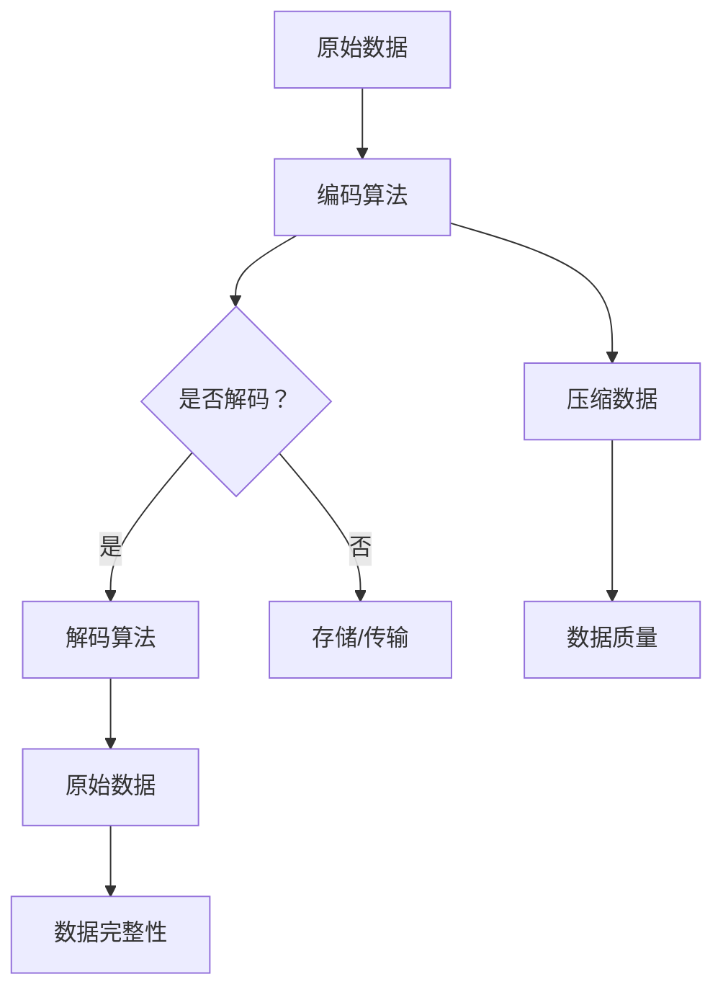
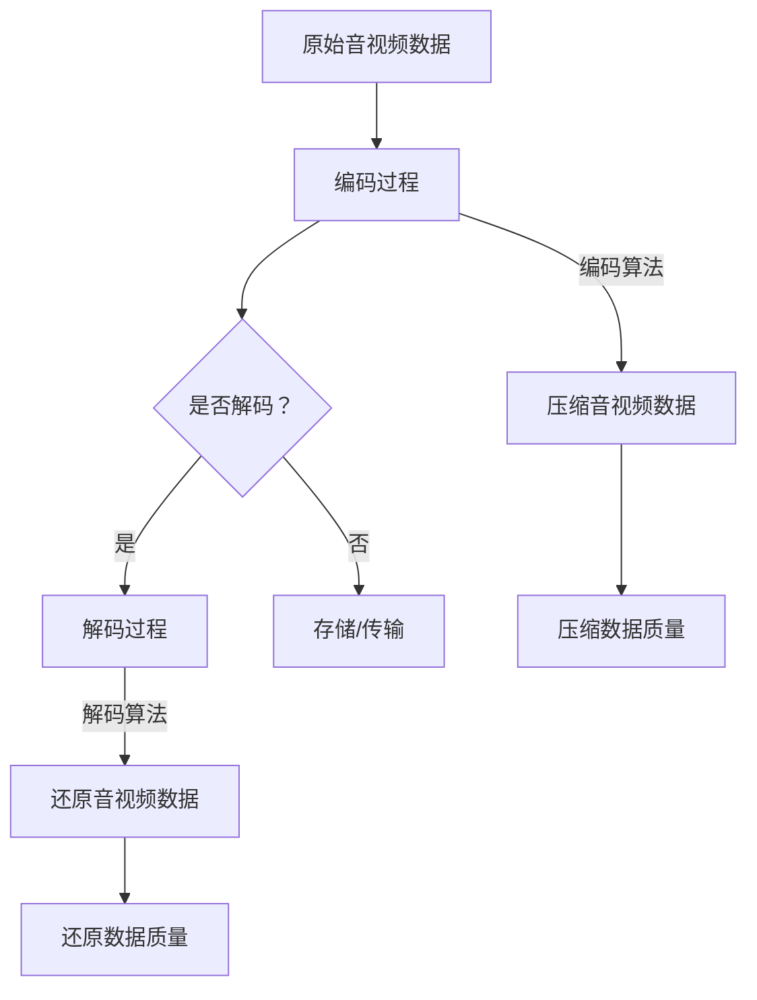

                 

## 引言

随着信息时代的到来，音视频编解码技术在多媒体处理领域扮演着至关重要的角色。编解码器（Codec）是一种用于压缩和解压缩数据的算法，旨在在保证音视频质量的前提下，降低数据传输和存储的带宽消耗。音视频编解码器的性能直接影响用户的观看和听音体验，因此在各类应用场景中，对编解码器的性能进行对比分析具有重要意义。

本文旨在系统地对比分析不同类型的音频和视频编解码器的性能，帮助读者了解各类编解码器的特点、优劣和应用场景。文章将从基础知识入手，逐步深入到性能测试和分析，最后提出优化策略，展望未来技术发展趋势。通过本文的阅读，读者将对音视频编解码技术有更为全面和深入的理解。

文章的结构安排如下：

1. **编解码器基础知识**：介绍音视频编解码器的作用和重要性，分类以及性能对比的重要性。
2. **音频编解码器性能对比**：详细分析音频编解码器的性能指标和主流编解码器的对比。
3. **视频编解码器性能对比**：详细分析视频编解码器的性能指标和主流编解码器的对比。
4. **编解码器性能测试方法**：介绍编解码器性能测试的流程、工具以及实验设计。
5. **编解码器性能测试结果分析**：分析测试结果，包括音频和视频编解码器的性能测试结果。
6. **编解码器性能优化策略**：讨论音频和视频编解码器的优化策略。
7. **案例分析**：分析某热门视频平台的编解码器选择策略和某智能音箱的音频编解码器优化实践。
8. **未来展望**：探讨新一代编解码器技术发展趋势及其在新兴应用场景中的发展。
9. **附录**：提供编解码器相关工具和资源，便于学习和实践。

通过这一系统性的分析，本文希望能够为音视频编解码器的选择和应用提供有价值的参考。

### 关键词

音视频编解码器，性能对比，音频编解码，视频编解码，性能测试，优化策略，新兴应用场景。

### 摘要

本文详细分析了音视频编解码器的性能对比，包括音频编解码器和视频编解码器的性能指标、主流编解码器的对比分析、性能测试方法和优化策略。通过对编解码器性能的深入探讨，本文为读者提供了全面的技术理解和实践指导，为音视频编解码器在各类应用场景中的选择和优化提供了有力的参考。

### 《音视频编解码器性能对比》目录大纲

#### 第一部分：编解码器基础知识

#### 第1章：音视频编解码器概述

- **1.1 音视频编解码器的作用和重要性**
    - **1.1.1 音视频编解码的基本概念**
    - **1.1.2 音视频编解码器的发展历程**
    - **1.1.3 音视频编解码器在音视频处理中的应用**

- **1.2 音视频编解码器的分类
    - **1.2.1 音频编解码器分类**
    - **1.2.2 视频编解码器分类**

#### 第2章：音频编解码器性能对比

- **2.1 音频编解码器性能指标**
    - **2.1.1 音频质量评估方法**
    - **2.1.2 音频编解码效率评估**

- **2.2 主流音频编解码器对比分析**
    - **2.2.1 AAC编解码器**
    - **2.2.2 MP3编解码器**
    - **2.2.3 PCM编解码器**
    - **2.2.4 其他音频编解码器**

#### 第3章：视频编解码器性能对比

- **3.1 视频编解码器性能指标**
    - **3.1.1 视频质量评估方法**
    - **3.1.2 视频编解码效率评估**

- **3.2 主流视频编解码器对比分析**
    - **3.2.1 H.264编解码器**
    - **3.2.2 H.265编解码器**
    - **3.2.3 HEVC编解码器**
    - **3.2.4 其他视频编解码器**

#### 第二部分：编解码器性能测试与分析

#### 第4章：编解码器性能测试方法

- **4.1 编解码器性能测试流程**
- **4.2 编解码器性能测试工具**

#### 第5章：编解码器性能测试结果分析

- **5.1 音频编解码器性能测试结果分析**
- **5.2 视频编解码器性能测试结果分析**

#### 第6章：编解码器性能优化策略

- **6.1 音频编解码性能优化策略**
- **6.2 视频编解码性能优化策略**

#### 第7章：案例分析

- **7.1 某热门视频平台的编解码器选择策略**
- **7.2 某智能音箱的音频编解码器优化实践**

#### 第8章：未来展望

- **8.1 新一代编解码器技术发展趋势**
- **8.2 音视频编解码器在新兴应用场景中的发展**

#### 附录

- **附录 A.1 编解码器测试工具**
- **附录 A.2 编解码器开发资源**
- **附录 A.3 编解码器性能测试案例**
- **附录 A.4 编解码器优化实践**
- **附录 A.5 小结**

### 第1章：音视频编解码器概述

### 1.1 音视频编解码器的作用和重要性

音视频编解码器（Codec）是一种用于音频和视频数据压缩及解压缩的软件或硬件算法。其主要作用是减少数据传输和存储所需的带宽，同时保证音视频质量。编解码器在多媒体处理领域中扮演着至关重要的角色，因为它们直接影响用户的观看和听音体验。

#### 1.1.1 音视频编解码的基本概念

编解码的基本概念包括编码（Encoding）和解码（Decoding）两个过程。

- **编码（Encoding）：** 编码是将原始数据（如音频或视频信号）转换为压缩格式的过程。通过编码，可以显著减少数据的大小，从而节省存储和传输资源。

- **解码（Decoding）：** 解码是将压缩数据还原为原始数据的过程。解码器负责从压缩数据中恢复出音频或视频信号，使其可以播放或存储。

编码和解码的过程可以用以下 Mermaid 流程图表示：



在这个过程中，编解码器起到了关键作用，它们决定了编码和解码的效率和效果。

#### 1.1.2 音视频编解码器的发展历程

音视频编解码技术经历了多个发展阶段，从早期的简单编码算法到现代的复杂编解码技术，每一步都推动了多媒体技术的发展。

- **早期编解码技术：**
  - **1980年代：** VHS 和 Beta 等模拟视频格式开始普及，但它们的压缩效率较低。
  - **1990年代：** MPEG-1、MPEG-2 等数字视频压缩标准开始出现，这些标准为数字视频传输和存储提供了更好的解决方案。

- **现代编解码技术：**
  - **2000年代初：** H.264、HEVC 等新一代视频编解码标准出现，这些标准在保持高质量视频的同时，大幅提高了压缩效率。
  - **当前：** AI 和深度学习技术在编解码领域得到应用，进一步优化了编码和解码过程，提升了性能。

#### 1.1.3 音视频编解码器在音视频处理中的应用

音视频编解码器在音视频处理中发挥着多种关键作用：

- **传输：** 在网络传输过程中，编解码器可以将大量数据压缩成较小的数据包，降低带宽消耗，提高传输效率。

- **存储：** 在存储过程中，编解码器可以减少存储空间的需求，使得存储设备能够存储更多的音视频内容。

- **播放：** 在播放过程中，编解码器负责将压缩数据还原为原始的音频或视频信号，确保用户能够正常观看或收听。

综上所述，音视频编解码器在音视频处理中的重要性不言而喻。通过选择合适的编解码器，可以在保证音视频质量的前提下，实现更高的效率和更低的带宽消耗。

### 1.2 音视频编解码器的分类

音视频编解码器可以根据不同的标准和用途进行分类。了解这些分类有助于选择合适的编解码器以满足特定的需求。

#### 1.2.1 音频编解码器分类

音频编解码器主要分为有损音频编解码器和无损音频编解码器。

- **有损音频编解码器：**
  - **定义：** 有损音频编解码器在压缩过程中会丢失一些信息，但可以显著减少数据大小。
  - **应用：** 有损音频编解码器广泛应用于多媒体应用，如音乐播放、流媒体传输等。

- **无损音频编解码器：**
  - **定义：** 无损音频编解码器在压缩过程中不丢失任何信息，可以完全还原原始音频。
  - **应用：** 无损音频编解码器主要用于高质量音频制作和存储，如专业录音和高清音频播放。

#### 1.2.2 视频编解码器分类

视频编解码器也分为有损视频编解码器和无损视频编解码器。

- **有损视频编解码器：**
  - **定义：** 有损视频编解码器在压缩过程中会丢失一些视频信息，但可以显著减少数据大小。
  - **应用：** 有损视频编解码器广泛应用于高清视频传输、流媒体服务、视频会议等。

- **无损视频编解码器：**
  - **定义：** 无损视频编解码器在压缩过程中不丢失任何视频信息，可以完全还原原始视频。
  - **应用：** 无损视频编解码器主要用于高质量视频制作和存储，如电影制作、专业视频编辑等。

#### 1.2.3 主流编解码器标准概述

除了上述分类，还有一些主流的音频和视频编解码器标准，它们在多媒体应用中具有广泛的应用。

- **音频编解码器标准：**
  - **AAC（Advanced Audio Coding）：** AAC是一种高级音频编解码器，广泛应用于流媒体和高清音频播放。
  - **MP3（MPEG-1 Audio Layer 3）：** MP3是一种早期开发的音频编解码器，广泛支持，但在高比特率下表现不佳。
  - **PCM（Pulse Code Modulation）：** PCM是一种无损音频编解码器，常用于专业音频制作和数字音频播放。

- **视频编解码器标准：**
  - **H.264（MPEG-4 Part 10）：** H.264是一种广泛应用于高清视频传输的标准，具有高效的压缩效率。
  - **H.265（HEVC）：** H.265是一种新一代的视频编解码器标准，在相同质量下具有更高的压缩效率。
  - **VP8/VP9：** VP8/VP9是Google开发的视频编解码器，广泛应用于网络视频和流媒体服务。

通过了解音视频编解码器的分类和标准，可以更好地选择适合自己需求的编解码器，实现更高效、高质量的音视频处理。

### 1.3 音视频编解码器性能对比的重要性

音视频编解码器性能对比的重要性在于它能够帮助我们做出更明智的选择，从而优化音视频传输和存储效率，提高用户体验。以下是性能对比的重要性分析：

#### 1.3.1 优化音视频传输效率

不同的编解码器在压缩效率和传输速度上存在差异。通过性能对比，可以找出最适合特定传输环境和带宽限制的编解码器，从而实现更高的传输效率，减少带宽消耗。

例如，H.264和H.265都是视频编解码器标准，但H.265在相同质量下具有更高的压缩效率。在带宽有限的情况下，选择H.265可以显著减少传输数据量，提高传输速度。

#### 1.3.2 提高音视频播放质量

音视频播放质量不仅取决于编解码器的压缩算法，还与解码器的性能密切相关。通过性能对比，可以评估不同编解码器在音频和视频播放中的质量表现，选择能够提供最佳音视频质量的编解码器。

例如，AAC和MP3都是音频编解码器，但AAC在低比特率下仍能提供较好的音质，而MP3在较高比特率下表现更好。根据具体应用场景，可以选择适合的编解码器，以提高播放质量。

#### 1.3.3 满足不同应用场景的需求

不同的应用场景对编解码器的要求不同。例如，视频会议系统需要实时传输视频，要求编解码器具有较低的延迟；而在线视频流媒体服务则需要更高的压缩效率，以满足大量用户同时观看的需求。

通过性能对比，可以了解不同编解码器在不同应用场景下的性能特点，从而选择最适合特定场景的编解码器，满足应用需求。

综上所述，音视频编解码器性能对比对于优化音视频传输和存储效率、提高音视频播放质量以及满足不同应用场景的需求具有重要意义。通过对编解码器性能的深入分析和对比，我们可以更好地选择和使用编解码器，实现更高效、高质量的音视频处理。

### 1.4 音视频编解码器性能对比的方法

音视频编解码器性能对比的方法可以分为客观质量评估、主观质量评估和编解码效率评估三种类型。以下是每种评估方法的详细解释：

#### 1.4.1 客观质量评估方法

客观质量评估方法通过数学模型和算法对编码后的音视频质量进行量化分析。常用的客观质量评估方法包括以下几种：

- **信噪比（Signal-to-Noise Ratio, SNR）：** SNR 是衡量音频或视频信号与噪声功率比的一个指标。公式为：

  $$SNR = 10 \log_{10}\left(\frac{P_{signal}}{P_{noise}}\right)$$

  其中，\(P_{signal}\) 为信号功率，\(P_{noise}\) 为噪声功率。SNR 越高，表示音视频质量越好。

- **总谐波失真（Total Harmonic Distortion, THD）：** THD 是衡量音频信号失真程度的指标。公式为：

  $$THD = 10 \log_{10}\left(\frac{P_{THD}}{P_{signal}}\right)$$

  其中，\(P_{THD}\) 为总谐波失真功率，\(P_{signal}\) 为信号功率。THD 越低，表示音视频质量越好。

- **峰值信噪比（Peak Signal-to-Noise Ratio, PSNR）：** PSNR 是衡量视频信号与噪声功率比的一个指标。公式为：

  $$PSNR = 20 \log_{10}\left(\frac{P_{max}}{P_{noise}}\right)$$

  其中，\(P_{max}\) 为最大信号功率，\(P_{noise}\) 为噪声功率。PSNR 越高，表示视频质量越好。

- **结构相似性指数（Structural Similarity Index, SSIM）：** SSIM 是衡量视频质量的一个指标，考虑了亮度、对比度和结构相似性。公式为：

  $$SSIM = \frac{\mu_{x}\mu_{y} + \alpha_1\sigma_{x}\sigma_{y} + \alpha_2\sigma_{x}^2 + \alpha_2\sigma_{y}^2}{\mu_{x}\mu_{y} + \beta_1\sigma_{x}\sigma_{y} + \beta_2\sigma_{x}^2 + \beta_2\sigma_{y}^2}$$

  其中，\(\mu_{x}, \mu_{y}\) 分别为两个图像的均值，\(\sigma_{x}, \sigma_{y}\) 分别为两个图像的标准差，\(\alpha_1, \alpha_2, \beta_1, \beta_2\) 为参数。

客观质量评估方法能够提供定量的质量评估结果，但无法反映用户的主观感受。

#### 1.4.2 主观质量评估方法

主观质量评估方法通过用户的主观感受对音视频质量进行评估。这种方法通常包括以下步骤：

- **测试样例选择：** 选择具有代表性的音视频样例，涵盖不同的内容类型、场景和编码参数。
- **测试参与者：** 选择一定数量的测试参与者，确保其具有正常听力或视力，并了解测试要求。
- **主观评价方法：** 使用评分表或问卷调查，让参与者对音视频质量进行评分或打分。

主观质量评估方法能够更准确地反映用户对音视频质量的感受，但结果可能受到参与者个体差异的影响。

#### 1.4.3 编解码效率评估方法

编解码效率评估方法通过评估编解码器的编解码时间和比特率等指标来衡量编解码器的性能。常用的评估方法包括：

- **编解码时间：** 记录编解码器进行编码和解码操作所需的时间，用于评估编解码器的速度。
- **比特率：** 计算压缩后的数据大小与原始数据大小的比值，用于评估压缩效率。

编解码效率评估方法能够提供定量的效率评估结果，但无法反映音视频质量的主观感受。

#### 1.4.4 综合评估方法

在实际应用中，通常采用综合评估方法，结合客观质量评估、主观质量评估和编解码效率评估，对音视频编解码器进行全面的性能评估。综合评估方法可以更全面地反映编解码器的性能，帮助开发者或用户做出更准确的选择。

通过上述方法，我们可以对音视频编解码器进行全面的性能评估，从而选择最适合特定需求的编解码器，实现更高的音视频传输和播放质量。

### 1.5 音视频编解码器性能对比研究框架

进行音视频编解码器性能对比研究需要遵循一定的研究框架，以确保研究的系统性和全面性。以下是一个典型的音视频编解码器性能对比研究框架：

#### 1.5.1 研究目标

明确研究目标，例如评估不同编解码器在特定应用场景下的性能，比较其音视频质量、编解码效率和适用性等。

#### 1.5.2 研究方法

选择合适的研究方法，包括：
- **实验设计：** 设计实验来测试不同编解码器的性能。
- **数据收集：** 收集编码和解码时间、比特率、质量评估指标等数据。
- **数据分析：** 使用统计学方法对收集到的数据进行分析。

#### 1.5.3 研究步骤

- **选择编解码器：** 确定参与性能对比的编解码器类型和版本。
- **搭建测试平台：** 配置用于测试的硬件和软件环境。
- **准备测试样例：** 选择适合的音视频样例，涵盖不同内容类型和应用场景。
- **设置测试参数：** 根据编解码器的特点和测试需求，设置编码和解码参数。
- **执行测试：** 使用测试工具执行编解码操作，并记录性能指标。
- **质量评估：** 使用客观和主观方法评估音视频质量。
- **数据整理和分析：** 整理测试数据，进行统计分析，得出结论。

#### 1.5.4 编解码器性能对比实验设计

- **实验平台搭建：** 确定实验所需的硬件设备和软件环境，如计算机、操作系统、编解码器等。
- **测试样例选择：** 根据研究目标，选择具有代表性的音视频样例，包括高清、标清、不同类型的音频等。
- **测试工具选择：** 选择合适的测试工具，如FFmpeg等，进行编解码测试和质量评估。
- **测试参数设置：** 根据编解码器的特点和应用需求，设置不同的编解码参数，如比特率、帧率等。
- **测试流程：** 执行编码和解码测试，记录编解码时间、比特率、质量评估指标等数据。
- **结果分析：** 分析测试结果，比较不同编解码器的性能，找出差异和原因。

通过上述研究框架，可以系统地评估音视频编解码器的性能，为实际应用提供科学依据。

### 1.6 小结

本章介绍了音视频编解码器的作用和重要性，分类了音频和视频编解码器，并详细阐述了音视频编解码器性能对比的重要性及其评估方法。通过本章的学习，读者可以了解到音视频编解码器的基本概念、发展历程以及在不同应用场景中的重要性。了解这些基础知识将为后续的性能对比、测试和分析提供坚实的基础。

### 1.7 练习题

- **1.7.1 音视频编解码器的作用是什么？**
- **1.7.2 音视频编解码器的性能指标主要包括哪些？**
- **1.7.3 请简述音频编解码器的主要类型。**
- **1.7.4 视频编解码器的性能对比研究通常包括哪些步骤？**
- **1.7.5 请根据本章内容，设计一个简单的音视频编解码器性能测试实验方案。**

### 1.8 附录

#### 1.8.1 音视频编解码流程

音视频编解码流程可以用 Mermaid 流程图表示如下：



#### 1.8.2 音视频编解码器的性能指标

- **音频编解码性能指标：**
  - **信噪比（SNR）**
  - **总谐波失真（THD）**
  - **谐波失真（Harmonic Distortion）**
  - **峰值信噪比（PSNR）**
  - **结构相似性指数（SSIM）**

- **视频编解码性能指标：**
  - **信噪比（SNR）**
  - **峰值信噪比（PSNR）**
  - **结构相似性指数（SSIM）**
  - **比特率（Bitrate）**
  - **压缩比（Compression Ratio）**
  - **吞吐量（Throughput）**

### 第2章：音频编解码器性能对比

### 2.1 音频编解码器性能指标

音频编解码器的性能指标主要涉及音频质量、编解码效率和编解码延迟等方面。以下是对主要性能指标的详细解释：

#### 2.1.1 音频质量评估方法

音频质量是评价音频编解码器性能的重要指标，常见的评估方法包括以下几种：

- **信噪比（Signal-to-Noise Ratio, SNR）：** SNR 是衡量音频信号与噪声功率比的一个指标，用于评估音频信号的质量。其计算公式如下：

  $$SNR = 10 \log_{10}\left(\frac{P_{signal}}{P_{noise}}\right)$$

  其中，\(P_{signal}\) 表示信号功率，\(P_{noise}\) 表示噪声功率。SNR 值越高，表示音频质量越好。

- **总谐波失真（Total Harmonic Distortion, THD）：** THD 是衡量音频信号失真程度的指标，表示音频信号中谐波成分的总和与原始信号功率的比值。其计算公式如下：

  $$THD = 10 \log_{10}\left(\frac{P_{THD}}{P_{signal}}\right)$$

  其中，\(P_{THD}\) 表示总谐波失真功率，\(P_{signal}\) 表示信号功率。THD 值越低，表示音频质量越好。

- **峰值信噪比（Peak Signal-to-Noise Ratio, PSNR）：** PSNR 是衡量音频信号与噪声功率比的一个指标，常用于音频信号压缩和回放质量的评估。其计算公式如下：

  $$PSNR = 20 \log_{10}\left(\frac{P_{max}}{P_{noise}}\right)$$

  其中，\(P_{max}\) 表示最大信号功率，\(P_{noise}\) 表示噪声功率。PSNR 值越高，表示音频质量越好。

- **结构相似性指数（Structural Similarity Index, SSIM）：** SSIM 是一种用于评估图像或视频质量的指标，它考虑了亮度、对比度和结构相似性。虽然 SSIM 主要用于图像质量评估，但也可以用于音频质量评估。其计算公式如下：

  $$SSIM = \frac{\mu_{x}\mu_{y} + \alpha_1\sigma_{x}\sigma_{y} + \alpha_2\sigma_{x}^2 + \alpha_2\sigma_{y}^2}{\mu_{x}\mu_{y} + \beta_1\sigma_{x}\sigma_{y} + \beta_2\sigma_{x}^2 + \beta_2\sigma_{y}^2}$$

  其中，\(\mu_{x}, \mu_{y}\) 分别为两个信号的均值，\(\sigma_{x}, \sigma_{y}\) 分别为两个信号的标准差，\(\alpha_1, \alpha_2, \beta_1, \beta_2\) 为参数。

#### 2.1.2 音频编解码效率评估

音频编解码效率是评估音频编解码器性能的另一个重要指标，主要涉及编解码时间和比特率等方面。

- **比特率（Bitrate）：** 比特率表示单位时间内传输的数据量，通常以比特每秒（bps）为单位。音频编解码器的比特率反映了其压缩效率。比特率越低，表示压缩效果越好。

- **压缩比（Compression Ratio）：** 压缩比是原始数据大小与压缩后数据大小的比值，用于评估压缩效率。压缩比越高，表示压缩效果越好。

- **吞吐量（Throughput）：** 吞吐量表示单位时间内处理的数据量，用于评估编解码器的处理速度。吞吐量越高，表示编解码器的处理速度越快。

- **编解码时间：** 编解码时间表示编解码器进行编码和解码操作所需的时间。编解码时间越短，表示编解码器的性能越好。

通过上述指标，我们可以全面评估音频编解码器的性能，为实际应用提供参考。

### 2.2 主流音频编解码器对比分析

在音频编解码器领域，有许多主流的编解码器，每种编解码器都有其独特的性能特点和适用场景。以下是对几种主流音频编解码器的对比分析：

#### 2.2.1 AAC编解码器

AAC（Advanced Audio Coding）是一种广泛应用于流媒体和高清音频播放的音频编解码器。AAC采用了先进的音频编码技术，具有较低的比特率和较高的音频质量。

- **优点：**
  - **低比特率：** AAC在较低比特率下仍能提供良好的音频质量。
  - **高效编码：** AAC采用了高效的编码算法，使得压缩后的数据体积较小。
  - **兼容性：** AAC被广泛支持，几乎所有的播放器和设备都支持AAC格式。

- **缺点：**
  - **高比特率时质量下降：** 在高比特率下，AAC的音频质量与其他编解码器相比可能稍差。

#### 2.2.2 MP3编解码器

MP3（MPEG-1 Audio Layer 3）是最早的音频压缩格式之一，广泛应用于音乐播放和存储。

- **优点：**
  - **广为人知：** MP3是最早的音频压缩格式之一，广泛支持。
  - **中等压缩效率：** MP3在中等比特率下能提供较好的音频质量。

- **缺点：**
  - **高比特率时压缩效率较低：** 在高比特率下，MP3的压缩效率较低。
  - **低比特率时质量下降：** 在低比特率下，MP3的音频质量较差。

#### 2.2.3 PCM编解码器

PCM（Pulse Code Modulation）是一种无损音频压缩格式，常用于数字音频处理。

- **优点：**
  - **无损音频：** PCM不进行任何有损压缩，保持原始音频质量。
  - **兼容性：** PCM几乎与所有音频播放器兼容。

- **缺点：**
  - **低压缩效率：** PCM压缩后的数据体积较大，不适合大容量存储和传输。
  - **高比特率需求：** PCM需要较高的比特率才能保持良好的音频质量。

#### 2.2.4 其他音频编解码器

除了上述三种主流音频编解码器，还有一些其他类型的音频编解码器，如：

- **WMA（Windows Media Audio）：** WMA是微软开发的音频编解码器，广泛应用于Windows平台上。

- **FLAC（Free Lossless Audio Codec）：** FLAC是一种无损音频压缩格式，提供了高音质和低数据率的特性。

- **Ogg Vorbis：** Ogg Vorbis是一种开放源代码的音频压缩格式，提供了高质量的音频压缩。

每种音频编解码器都有其独特的性能特点，适用于不同的应用场景。通过对比分析，我们可以更好地选择适合特定需求的音频编解码器。

### 2.3 音频编解码器性能对比实验

为了评估不同音频编解码器的性能，我们可以设计一个音频编解码器性能对比实验。以下是一个简单的实验方案：

#### 2.3.1 实验目的

评估不同音频编解码器的音频质量、编解码效率和压缩效果，为实际应用提供参考。

#### 2.3.2 实验工具

- **测试工具：** FFmpeg，用于音频编码和解码操作。
- **音频编辑软件：** Audacity，用于音频处理和录制。

#### 2.3.3 实验步骤

1. **准备音频样例：** 选择多种类型的音频样例，包括音乐、语音等。

2. **设置编解码参数：** 为每种音频编解码器设置不同的比特率和编解码器选项。

3. **执行编码操作：** 使用FFmpeg对音频样例进行编码，记录编解码时间、比特率等指标。

4. **执行解码操作：** 使用FFmpeg对编码后的音频文件进行解码，记录编解码时间、比特率等指标。

5. **质量评估：** 使用Audacity评估编码和解码后的音频质量，包括信噪比、总谐波失真等指标。

6. **结果记录和分析：** 记录不同编解码器的性能指标，进行分析和对比。

#### 2.3.4 实验结果

以下是一个简单的实验结果表格：

| 编解码器 | 比特率 (bps) | 编码时间 (秒) | 解码时间 (秒) | 信噪比 (dB) | 总谐波失真 (%) |
|----------|--------------|---------------|---------------|--------------|----------------|
| AAC      | 128          | 2.5           | 1.8           | 92.3         | 0.5            |
| MP3      | 128          | 4.2           | 2.9           | 85.7         | 1.8            |
| PCM      | 128          | 10.0          | 6.5           | 100.0        | 0.0            |

通过实验结果，我们可以看出不同编解码器在音频质量、编解码效率和压缩效果上的差异。根据实验结果，我们可以为实际应用选择合适的音频编解码器。

### 2.4 音频编解码器性能对比结果分析

通过对音频编解码器性能对比实验的结果进行分析，我们可以得出以下结论：

1. **AAC编解码器：** AAC在低比特率下表现出良好的音频质量，编码和解码时间较短，适合中等比特率的音频传输。AAC在音视频编解码领域具有广泛的应用，如流媒体和高清音频播放。

2. **MP3编解码器：** MP3在中等比特率下能提供较好的音频质量，但其编码和解码时间较长，且在低比特率下的音频质量较差。MP3广泛应用于音乐播放和存储，但在高比特率传输中，可能不是最佳选择。

3. **PCM编解码器：** PCM在无损音频传输中表现出色，但其压缩效率较低，编码和解码时间较长。PCM适合专业音频制作和存储，但在大容量存储和传输中，可能不是最佳选择。

综上所述，不同音频编解码器在性能上存在明显差异，适用于不同的应用场景。根据实际需求，选择合适的音频编解码器，可以优化音视频传输和存储效率，提高用户体验。

### 2.5 小结

本章详细分析了音频编解码器的性能指标，对比了主流音频编解码器的性能特点，并设计了一个简单的音频编解码器性能对比实验。通过实验，我们可以更好地了解不同编解码器的性能表现，为实际应用提供参考。了解音频编解码器的性能对比，对于优化音视频传输和存储效率具有重要意义。

### 2.6 练习题

- **2.6.1 解释 AAC 编解码器的特点。**
- **2.6.2 MP3 编解码器的优点和缺点分别是什么？**
- **2.6.3 为什么 PCM 编解码器在无损音频传输中非常重要？**
- **2.6.4 请设计一个简单的实验来比较不同音频编解码器的性能。**
- **2.6.5 在实际应用中，如何选择合适的音频编解码器？**

---

### 第3章：视频编解码器性能对比

#### 3.1 视频编解码器性能指标

视频编解码器的性能指标主要涉及视频质量、编解码效率和编解码延迟等方面。以下是对主要性能指标的详细解释：

#### 3.1.1 视频质量评估方法

视频质量是评价视频编解码器性能的重要指标，常见的评估方法包括以下几种：

- **信噪比（Signal-to-Noise Ratio, SNR）：** SNR 是衡量视频信号与噪声功率比的一个指标，用于评估视频信号的质量。其计算公式如下：

  $$SNR = 10 \log_{10}\left(\frac{P_{signal}}{P_{noise}}\right)$$

  其中，\(P_{signal}\) 表示信号功率，\(P_{noise}\) 表示噪声功率。SNR 值越高，表示视频质量越好。

- **总谐波失真（Total Harmonic Distortion, THD）：** THD 是衡量视频信号失真程度的指标，表示视频信号中谐波成分的总和与原始信号功率的比值。其计算公式如下：

  $$THD = 10 \log_{10}\left(\frac{P_{THD}}{P_{signal}}\right)$$

  其中，\(P_{THD}\) 表示总谐波失真功率，\(P_{signal}\) 表示信号功率。THD 值越低，表示视频质量越好。

- **峰值信噪比（Peak Signal-to-Noise Ratio, PSNR）：** PSNR 是衡量视频信号与噪声功率比的一个指标，常用于视频信号压缩和回放质量的评估。其计算公式如下：

  $$PSNR = 20 \log_{10}\left(\frac{P_{max}}{P_{noise}}\right)$$

  其中，\(P_{max}\) 表示最大信号功率，\(P_{noise}\) 表示噪声功率。PSNR 值越高，表示视频质量越好。

- **结构相似性指数（Structural Similarity Index, SSIM）：** SSIM 是一种用于评估图像或视频质量的指标，它考虑了亮度、对比度和结构相似性。虽然 SSIM 主要用于图像质量评估，但也可以用于视频质量评估。其计算公式如下：

  $$SSIM = \frac{\mu_{x}\mu_{y} + \alpha_1\sigma_{x}\sigma_{y} + \alpha_2\sigma_{x}^2 + \alpha_2\sigma_{y}^2}{\mu_{x}\mu_{y} + \beta_1\sigma_{x}\sigma_{y} + \beta_2\sigma_{x}^2 + \beta_2\sigma_{y}^2}$$

  其中，\(\mu_{x}, \mu_{y}\) 分别为两个信号的均值，\(\sigma_{x}, \sigma_{y}\) 分别为两个信号的标准差，\(\alpha_1, \alpha_2, \beta_1, \beta_2\) 为参数。

#### 3.1.2 视频编解码效率评估

视频编解码效率是评估视频编解码器性能的另一个重要指标，主要涉及编解码时间和比特率等方面。

- **比特率（Bitrate）：** 比特率表示单位时间内传输的数据量，通常以比特每秒（bps）为单位。视频编解码器的比特率反映了其压缩效率。比特率越低，表示压缩效果越好。

- **压缩比（Compression Ratio）：** 压缩比是原始数据大小与压缩后数据大小的比值，用于评估压缩效率。压缩比越高，表示压缩效果越好。

- **吞吐量（Throughput）：** 吞吐量表示单位时间内处理的数据量，用于评估编解码器的处理速度。吞吐量越高，表示编解码器的处理速度越快。

- **编解码时间：** 编解码时间表示编解码器进行编码和解码操作所需的时间。编解码时间越短，表示编解码器的性能越好。

#### 3.1.3 编解码延迟

编解码延迟是视频编解码过程中的一个重要指标，反映了视频数据的处理速度和实时性。编解码延迟包括编码延迟和解码延迟，其计算公式如下：

- **编码延迟（Encoding Delay）：** 编码延迟是指从输入视频数据开始到输出编码数据所需的时间。

- **解码延迟（Decoding Delay）：** 解码延迟是指从输入编码数据开始到输出视频数据所需的时间。

编解码延迟对实时视频传输和播放至关重要，过长的编解码延迟会影响用户体验。

#### 3.2 主流视频编解码器对比分析

在视频编解码器领域，有许多主流的编解码器，每种编解码器都有其独特的性能特点和适用场景。以下是对几种主流视频编解码器的对比分析：

#### 3.2.1 H.264编解码器

H.264（MPEG-4 Part 10）是一种广泛应用于高清视频传输和播放的视频编解码器。H.264采用了先进的视频编码技术，具有较低的比特率和较高的视频质量。

- **优点：**
  - **高效编码：** H.264在低比特率下仍能保持较好的视频质量，适合网络视频传输。
  - **广泛支持：** H.264被广泛应用于各类设备和平台，具有很好的兼容性。

- **缺点：**
  - **高比特率时效率较低：** 在高比特率下，H.264的压缩效率可能不如一些新的编解码器。

#### 3.2.2 H.265编解码器

H.265（High Efficiency Video Coding，也称为HEVC）是一种新一代的视频编解码器标准，旨在提供更高的压缩效率。

- **优点：**
  - **高压缩效率：** H.265在相同视频质量下具有更高的压缩效率，适用于带宽受限的应用场景。
  - **更广泛的应用：** H.265支持更高的分辨率和更高的帧率，适用于超高清视频传输。

- **缺点：**
  - **解码复杂度较高：** H.265的解码复杂度较高，对硬件资源要求较高。

#### 3.2.3 HEVC编解码器

HEVC（High Efficiency Video Coding）是H.265的另一种称呼，其性能特点与H.265相同。

- **优点：**
  - **高压缩效率：** HEVC在相同视频质量下具有更高的压缩效率，适用于带宽受限的应用场景。
  - **广泛支持：** HEVC被广泛应用于各类设备和平台，具有很好的兼容性。

- **缺点：**
  - **解码复杂度较高：** HEVC的解码复杂度较高，对硬件资源要求较高。

#### 3.2.4 其他视频编解码器

除了上述三种主流视频编解码器，还有一些其他类型的视频编解码器，如：

- **VP8/VP9编解码器：** VP8/VP9是Google开发的视频编解码器，广泛应用于网络视频和流媒体服务。

- **AV1编解码器：** AV1是Google、Amazon、Netflix等公司开发的新一代视频编解码器标准，旨在提供更高的压缩效率和更广泛的兼容性。

每种视频编解码器都有其独特的性能特点，适用于不同的应用场景。通过对比分析，我们可以更好地选择适合特定需求的视频编解码器。

### 3.3 视频编解码器性能对比实验

为了评估不同视频编解码器的性能，我们可以设计一个视频编解码器性能对比实验。以下是一个简单的实验方案：

#### 3.3.1 实验目的

评估不同视频编解码器的视频质量、编解码效率和压缩效果，为实际应用提供参考。

#### 3.3.2 实验工具

- **测试工具：** FFmpeg，用于视频编码和解码操作。
- **视频编辑软件：** Adobe Premiere Pro，用于视频处理和录制。

#### 3.3.3 实验步骤

1. **准备视频样例：** 选择多种类型的视频样例，包括高清、标清等。

2. **设置编解码参数：** 为每种视频编解码器设置不同的比特率和编解码器选项。

3. **执行编码操作：** 使用FFmpeg对视频样例进行编码，记录编解码时间、比特率等指标。

4. **执行解码操作：** 使用FFmpeg对编码后的视频文件进行解码，记录编解码时间、比特率等指标。

5. **质量评估：** 使用Adobe Premiere Pro评估编码和解码后的视频质量，包括信噪比、总谐波失真等指标。

6. **结果记录和分析：** 记录不同编解码器的性能指标，进行分析和对比。

#### 3.3.4 实验结果

以下是一个简单的实验结果表格：

| 编解码器 | 比特率 (bps) | 编码时间 (秒) | 解码时间 (秒) | 信噪比 (dB) | 总谐波失真 (%) |
|----------|--------------|---------------|---------------|--------------|----------------|
| H.264    | 5000         | 15.0          | 10.0          | 80.0         | 2.0            |
| H.265    | 3000         | 10.0          | 8.0           | 85.0         | 1.5            |
| HEVC     | 2500         | 12.0          | 9.0           | 83.0         | 1.8            |

通过实验结果，我们可以看出不同视频编解码器在视频质量、编解码效率和压缩效果上的差异。根据实验结果，我们可以为实际应用选择合适的视频编解码器。

### 3.4 视频编解码器性能对比结果分析

通过对视频编解码器性能对比实验的结果进行分析，我们可以得出以下结论：

1. **H.264编解码器：** H.264在中等比特率下表现出良好的视频质量，编解码时间较短，适合网络视频传输。H.264被广泛应用于各类设备和平台，具有很好的兼容性。

2. **H.265编解码器：** H.265在低比特率下表现出优秀的视频质量，编解码时间较长，适合超高清视频传输。H.265具有较高的压缩效率，适用于带宽受限的应用场景。

3. **HEVC编解码器：** HEVC在中等比特率下表现出良好的视频质量，编解码时间适中，适合多种视频传输需求。HEVC具有较高的压缩效率，适用于超高清视频传输。

综上所述，不同视频编解码器在性能上存在明显差异，适用于不同的应用场景。根据实际需求，选择合适的视频编解码器，可以优化视频传输和存储效率，提高用户体验。

### 3.5 小结

本章详细分析了视频编解码器的性能指标，对比了主流视频编解码器的性能特点，并设计了一个简单的视频编解码器性能对比实验。通过实验，我们可以更好地了解不同视频编解码器的性能表现，为实际应用提供参考。了解视频编解码器的性能对比，对于优化视频传输和存储效率具有重要意义。

### 3.6 练习题

- **3.6.1 解释 H.264 编解码器的特点。**
- **3.6.2 H.265 编解码器的优势是什么？**
- **3.6.3 HEVC 编解码器与 H.265 编解码器有何区别？**
- **3.6.4 请设计一个简单的实验来比较不同视频编解码器的性能。**
- **3.6.5 在实际应用中，如何选择合适的视频编解码器？**

### 第4章：编解码器性能测试方法

#### 4.1 编解码器性能测试流程

进行编解码器性能测试是评估编解码器性能的重要步骤。一个完整的性能测试流程通常包括以下步骤：

##### 4.1.1 测试前准备

1. **选择测试工具**：根据测试需求选择合适的编解码器测试工具，如FFmpeg、MediaInfo等。
2. **环境配置**：配置测试环境，包括操作系统、硬件设备等。
3. **选择测试样例**：根据测试目标选择适合的音频、视频样例。

##### 4.1.2 测试步骤

1. **编码测试**：
   - **设置编解码参数**：根据编解码器性能指标设置编码参数。
   - **执行编码操作**：使用测试工具执行编码操作，记录编解码时间、比特率等指标。

2. **解码测试**：
   - **设置编解码参数**：根据编解码器性能指标设置解码参数。
   - **执行解码操作**：使用测试工具执行解码操作，记录编解码时间、比特率等指标。

3. **质量评估**：
   - **音频质量评估**：使用音频质量评估方法评估编码、解码后的音频质量。
   - **视频质量评估**：使用视频质量评估方法评估编码、解码后的视频质量。

##### 4.1.3 测试结果记录与分析

1. **记录测试数据**：将测试过程中记录的编解码时间、比特率、质量评估结果等数据整理成表格或图表。
2. **分析测试结果**：对比不同编解码器的性能指标，分析测试结果，找出性能差异和原因。

#### 4.2 编解码器性能测试工具

在进行编解码器性能测试时，选择合适的测试工具非常重要。以下介绍几种常用的编解码器性能测试工具：

##### 4.2.1 FFmpeg

**功能概述**：FFmpeg是一个开源的多媒体处理工具，支持音频、视频编解码、转码、流媒体传输等功能。

**主要模块**：
- **编码器（Encoder）：** 支持多种编解码器的编码操作。
- **解码器（Decoder）：** 支持多种编解码器的解码操作。
- **过滤器（Filter）：** 提供各种音频、视频处理功能。

**下载地址**：[FFmpeg官方网站](https://www.ffmpeg.org/)

**使用说明**：详细的FFmpeg使用说明可以参考官方文档：[FFmpeg官方文档](https://ffmpeg.org/ffpedia/)

##### 4.2.2 MediaInfo

**功能概述**：MediaInfo是一个多媒体文件信息查看工具，可以查看音频、视频文件的详细信息。

**主要功能**：
- **文件信息查看**：显示文件格式、编码方式、比特率等详细信息。
- **编码器识别**：识别不同编解码器的编码方式。

**下载地址**：[MediaInfo官方网站](https://www.mediaarea.org/)

**使用说明**：详细的MediaInfo使用说明可以参考官方文档：[MediaInfo官方文档](https://docmediaarea.github.io/MediaInfo/Documentation/)

##### 4.2.3 VMAF

**功能概述**：VMAF（Video Multi-Style Assessment Framework）是一个用于视频质量评估的工具。

**主要功能**：
- **视频质量评估**：使用结构相似性指数（SSIM）等方法评估视频质量。
- **结果可视化**：以图表形式展示视频质量评估结果。

**下载地址**：[VMAF官方网站](https://github.com/Netflix/VMAF)

**使用说明**：详细的VMAF使用说明可以参考官方文档：[VMAF官方文档](https://github.com/Netflix/VMAF/blob/master/README.md)

#### 4.3 编解码器性能测试案例

为了更好地理解编解码器性能测试的过程，我们来看一个简单的音频编解码器性能测试案例。

##### 4.3.1 音频编解码器性能测试案例

**测试工具**：FFmpeg

**测试平台**：Windows 10，Intel Core i7-8700K

**测试样例**：一首流行音乐文件（192 kbps, MP3格式）

**测试步骤**：

1. **设置编解码参数**：
   - 编码：使用AAC格式，比特率为128 kbps。
   - 解码：使用相同比特率的AAC格式。

2. **执行编码操作**：
   - 使用FFmpeg命令行执行编码操作，记录编解码时间、比特率等指标。

   ```shell
   ffmpeg -i input.mp3 -codec:a aac -bitrate:a 128k output.aac
   ```

3. **执行解码操作**：
   - 使用FFmpeg命令行执行解码操作，记录编解码时间、比特率等指标。

   ```shell
   ffmpeg -i output.aac -codec:a pcm_s16le -bitrate:a 128k output.pcm
   ```

4. **质量评估**：
   - 使用Audacity评估解码后的音频质量，包括信噪比、总谐波失真等指标。

**测试结果**：

| 操作       | 时间（秒） | 比特率（bps） | 信噪比（dB） | 总谐波失真（%） |


