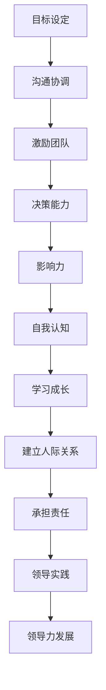

                 

## 领导力与资源整合：优化资源配置

关键词：领导力、资源整合、优化、资源配置、领导风格、资源策略

摘要：本文旨在探讨领导力在资源整合中的关键作用，以及如何通过优化资源配置提高组织效率。我们将从领导力的本质、资源整合的概念、资源配置优化的方法等方面进行深入分析，并通过案例实战展示其具体应用。

### 目录大纲

#### 第一部分：领导力基础

##### 第1章：领导力的本质与内涵
- **1.1 领导力的定义与特征**
- **1.2 领导力的重要性**
- **1.3 领导力与管理的区别**
- **1.4 领导力发展的路径**

##### 第2章：领导风格与行为模式
- **2.1 领导风格的类型**
  - **2.1.1 权威型领导风格**
  - **2.1.2 民主型领导风格**
  - **2.1.3 放任型领导风格**
- **2.2 领导行为模式**
  - **2.2.1 交易型领导**
  - **2.2.2 变革型领导**
  - **2.2.3 指导型领导**

#### 第二部分：资源整合

##### 第3章：资源整合的概念与策略
- **3.1 资源整合的定义**
- **3.2 资源整合的重要性**
- **3.3 资源整合的步骤**
  - **3.3.1 识别内部资源**
  - **3.3.2 识别外部资源**
  - **3.3.3 资源匹配与优化**

##### 第4章：资源整合的方法与工具
- **4.1 内部资源整合**
  - **4.1.1 人力资源整合**
  - **4.1.2 财务资源整合**
  - **4.1.3 物资资源整合**
- **4.2 外部资源整合**
  - **4.2.1 市场资源整合**
  - **4.2.2 技术资源整合**
  - **4.2.3 合作资源整合**

#### 第三部分：资源配置优化

##### 第5章：资源配置优化的理论框架
- **5.1 资源配置优化的基本原则**
  - **5.1.1 效率优先**
  - **5.1.2 平衡发展**
  - **5.1.3 创新驱动**
- **5.2 资源配置优化的评价指标**
  - **5.2.1 经济效益指标**
  - **5.2.2 社会效益指标**
  - **5.2.3 环境效益指标**

##### 第6章：资源配置优化的案例分析
- **6.1 案例一：企业内部资源配置优化**
  - **6.1.1 案例背景**
  - **6.1.2 优化方案**
  - **6.1.3 实施效果**
- **6.2 案例二：政府公共资源配置优化**
  - **6.2.1 案例背景**
  - **6.2.2 优化方案**
  - **6.2.3 实施效果**

##### 第7章：资源配置优化的实践指南
- **7.1 资源需求分析**
  - **7.1.1 资源需求预测方法**
  - **7.1.2 资源需求分析工具**
- **7.2 资源供给分析**
  - **7.2.1 资源供给预测方法**
  - **7.2.2 资源供给分析工具**
- **7.3 资源配置优化策略**
  - **7.3.1 资源分配模型**
  - **7.3.2 资源配置优化算法**

##### 第8章：领导力与资源整合的融合实践
- **8.1 领导力在资源整合中的作用**
  - **8.1.1 领导力对资源整合的影响**
  - **8.1.2 资源整合对领导力发展的作用**
- **8.2 领导力与资源整合的融合策略**
  - **8.2.1 领导力驱动的资源整合**
  - **8.2.2 资源整合支持下的领导力发展**

### 附录

#### 附录A：领导力与资源整合相关文献
- **A.1 经典文献回顾**
- **A.2 现代研究进展**

#### 附录B：领导力与资源整合实用工具
- **B.1 资源评估工具**
- **B.2 领导力评估工具**

以上就是我们文章的目录大纲，接下来我们将逐一深入探讨每个章节的内容。首先是领导力的本质与内涵，让我们开始第一步的深入思考。

### 第一步：领导力的本质与内涵

领导力是一种重要的组织和管理能力，它不仅仅关乎个人魅力，更涉及到如何影响、激励和指导他人共同达成目标。在组织管理中，领导力是驱动团队向前进化的核心动力。那么，领导力究竟是什么？它有哪些特征和类型？又如何发展？

#### 1.1 领导力的定义与特征

领导力可以定义为一种能够引导、激励和影响他人，共同实现目标的特质和技能。领导力的核心特征包括：

1. **影响力**：领导力在于能够通过影响力去影响他人的态度和行为。
2. **目标导向**：领导者需要有清晰的目标，并能引导团队朝着这些目标前进。
3. **激励能力**：领导者需要具备激励团队成员的能力，使其发挥出最大的潜力。
4. **沟通能力**：领导力依赖于有效的沟通，确保团队成员理解目标和任务的含义。
5. **决策能力**：领导者需要在复杂多变的环境中做出明智的决策。

#### 1.2 领导力的重要性

领导力在组织中的重要性不言而喻。一个优秀的领导者能够：

1. **提高团队效率**：通过激励和指导，使团队成员高效地完成工作。
2. **推动创新**：领导者能够鼓励创新思维，促进组织持续发展。
3. **增强凝聚力**：领导力能够增强团队内部的凝聚力，使团队更加团结一致。
4. **提升组织文化**：领导者的行为和价值观能够塑造组织文化，影响组织的长期发展。

#### 1.3 领导力与管理的区别

领导力和管理是两个相关但不同的概念。管理侧重于维持现状，确保组织目标的实现；而领导力则侧重于变革和创新，引领组织走向未来。

1. **管理是维持**：管理更多地关注流程、结构和效率，确保组织按照预定目标运行。
2. **领导力是变革**：领导力关注未来的挑战和机会，引领组织不断创新和进步。

#### 1.4 领导力发展的路径

领导力并非与生俱来，而是可以通过学习和实践不断发展的。以下是一些领导力发展的路径：

1. **自我认知**：了解自己的优势和弱点，认识自己的价值观和目标。
2. **学习与成长**：通过阅读、培训和实践不断提升自己的知识和技能。
3. **建立人际关系**：建立和维护良好的人际关系，增强自己的影响力。
4. **承担责任**：勇于承担责任，在挑战中成长。
5. **领导实践**：通过实际领导实践，不断积累经验和提升能力。

#### 1.5 领导力的核心概念与联系

为了更深入地理解领导力，我们可以借助Mermaid流程图来展示领导力的核心概念及其联系：



这个流程图清晰地展示了领导力发展的各个关键环节，以及它们之间的相互联系。

#### 1.6 领导力的数学模型与公式

为了进一步理解领导力的量化特征，我们可以借助数学模型来描述。以下是一个简单的领导力评价模型：

$$
L = w_1 \cdot C + w_2 \cdot I + w_3 \cdot D + w_4 \cdot E + w_5 \cdot F
$$

其中：

- \(L\) 是领导力评分；
- \(w_1, w_2, w_3, w_4, w_5\) 分别是目标设定、沟通协调、激励团队、决策能力和影响力这五个维度的权重；
- \(C, I, D, E, F\) 分别是这些维度的得分。

#### 1.7 代码示例：领导力评估算法

以下是一个简单的Python代码示例，用于评估领导力得分：

```python
# 领导力评估算法示例

# 定义权重和维度得分
weights = {'目标设定': 0.2, '沟通协调': 0.2, '激励团队': 0.2, '决策能力': 0.2, '影响力': 0.1}
scores = {'目标设定': 8, '沟通协调': 7, '激励团队': 6, '决策能力': 7, '影响力': 5}

# 计算领导力得分
def calculate_leadership_score(weights, scores):
    score = 0
    for key, weight in weights.items():
        score += scores[key] * weight
    return score

# 调用函数计算得分
leadership_score = calculate_leadership_score(weights, scores)
print(f"领导力得分：{leadership_score}")
```

这个示例代码通过输入权重和各个维度的得分，计算出一个综合的领导力得分。

#### 1.8 总结

领导力是一种关键的管理能力，它对组织的成功至关重要。通过深入理解领导力的本质、特征和类型，我们可以更好地发展自己的领导力，并在组织中发挥更大的作用。在下一章中，我们将探讨领导风格与行为模式，进一步揭示领导力的多样性和复杂性。

### 第二步：领导风格与行为模式

领导风格和行为模式是领导力的重要组成部分。不同的领导风格和行为模式会直接影响团队的表现和组织的发展。在本节中，我们将探讨领导风格的类型及其特征，以及领导行为模式的不同形式，帮助读者更好地理解领导力在实践中的应用。

#### 2.1 领导风格的类型

领导风格是指领导者处理和管理团队的方式。根据不同的划分标准，领导风格可以划分为多种类型。以下是三种常见的领导风格：

##### 2.1.1 权威型领导风格

权威型领导风格是指领导者拥有明确的决策权，并通过指令和命令来指导团队。这种风格通常适用于紧急情况或需要快速决策的场合。权威型领导的特点如下：

1. **决策权集中在领导者手中**：领导者拥有最终的决策权，团队成员需要遵循领导者的指令。
2. **高度控制**：领导者对团队的工作过程和结果进行严格监控，以确保任务顺利完成。
3. **强调结果**：领导者更加关注任务的完成情况，而较少关注团队成员的感受和需求。

##### 2.1.2 民主型领导风格

民主型领导风格是指领导者鼓励团队成员参与决策过程，尊重团队成员的意见和想法。这种风格适用于需要团队协作和创新的项目。民主型领导的特点如下：

1. **决策权分散**：领导者会征求团队成员的意见，共同决策。
2. **鼓励参与**：领导者鼓励团队成员积极参与，分享自己的观点和经验。
3. **注重沟通**：领导者重视与团队成员的沟通，确保信息透明和畅通。

##### 2.1.3 放任型领导风格

放任型领导风格是指领导者将决策权和责任完全交给团队成员，几乎不进行干预。这种风格适用于高度专业化和自主性的团队。放任型领导的特点如下：

1. **自由度高**：团队成员可以自由地决定工作内容和工作方式。
2. **较少干预**：领导者不进行过多的指导和监督，让团队成员自主工作。
3. **结果导向**：领导者更加关注最终的工作结果，而较少关注团队成员的工作过程。

#### 2.2 领导行为模式

领导行为模式是指领导者表现出来的行为特点和习惯。根据不同的划分标准，领导行为模式也可以分为多种类型。以下是三种常见的领导行为模式：

##### 2.2.1 交易型领导

交易型领导是指领导者通过奖励和惩罚来激励团队成员。这种领导模式适用于任务导向和目标明确的团队。交易型领导的特点如下：

1. **奖励机制**：领导者通过奖励来激励团队成员完成任务。
2. **惩罚机制**：领导者通过惩罚来纠正团队成员的不当行为。
3. **关注结果**：领导者更加关注团队成员的工作结果，而较少关注工作过程。

##### 2.2.2 变革型领导

变革型领导是指领导者通过激发团队成员的潜能，推动团队实现变革和进步。这种领导模式适用于需要创新和变革的团队。变革型领导的特点如下：

1. **激励潜能**：领导者鼓励团队成员发挥自身的潜能，超越自我。
2. **塑造愿景**：领导者为团队描绘清晰的愿景，激励团队成员为实现愿景而努力。
3. **培养信任**：领导者通过建立信任关系，促进团队的协作和合作。

##### 2.2.3 指导型领导

指导型领导是指领导者通过指导和辅导来帮助团队成员提升能力。这种领导模式适用于需要培训和指导的团队。指导型领导的特点如下：

1. **提供指导**：领导者为团队成员提供具体的指导和辅导，帮助他们解决工作中的问题。
2. **关注过程**：领导者更加关注团队成员的工作过程，确保任务能够顺利完成。
3. **培养能力**：领导者通过指导，帮助团队成员提升专业技能和工作能力。

#### 2.3 领导风格与行为模式的关系

领导风格与行为模式之间存在密切的关系。不同的领导风格会影响领导者的行为模式，而领导者的行为模式也会反过来影响领导风格。

1. **权威型领导风格**通常伴随着**指导型领导行为模式**，领导者通过具体的指导和监督来确保任务完成。
2. **民主型领导风格**通常伴随着**变革型领导行为模式**，领导者通过激发团队成员的潜能，推动团队实现变革。
3. **放任型领导风格**通常伴随着**交易型领导行为模式**，领导者通过奖励和惩罚来激励团队成员。

#### 2.4 代码示例：领导风格评估

为了更好地理解领导风格，我们可以通过一个简单的代码示例来评估领导风格。以下是一个Python代码示例，用于评估领导风格：

```python
# 领导风格评估算法示例

# 定义领导风格得分
authority_score = 0
democratic_score = 0
laissez_faire_score = 0

# 定义领导风格问题
questions = [
    "你是否总是做出最终决策？",
    "你是否经常征求团队成员的意见？",
    "你是否将决策权下放给团队成员？",
    "你是否通过奖励和惩罚来激励团队成员？",
    "你是否通过愿景激励团队成员？",
    "你是否提供具体的指导和辅导？"
]

# 定义问题权重
weights = [1, 1, 1, 1, 1, 1]

# 获取用户输入并计算得分
for i, question in enumerate(questions):
    print(f"{i+1}. {question}")
    response = input("请回答（是/否）：")
    if response.lower() == "是":
        authority_score += weights[i]
    elif response.lower() == "否":
        democratic_score += weights[i]
    else:
        laissez_faire_score += weights[i]

# 输出领导风格得分
print("权威型领导得分：", authority_score)
print("民主型领导得分：", democratic_score)
print("放任型领导得分：", laissez_faire_score)
```

这个示例代码通过用户输入，评估领导风格得分，帮助领导者了解自己的领导风格。

#### 2.5 总结

领导风格与行为模式是领导力的重要组成部分，它们决定了领导者如何影响和激励团队成员。通过理解不同领导风格的类型和行为模式，我们可以选择适合自己团队和情境的领导方式，从而提高团队绩效和组织效率。在下一章中，我们将探讨资源整合的概念与策略，进一步理解如何有效利用资源，实现组织目标。

### 第三步：资源整合的概念与策略

资源整合是指通过有效管理和优化资源，使其最大化地发挥效用，以支持组织的战略目标和运营需求。资源整合不仅涉及内部资源的利用，还包括外部资源的整合。本节将详细探讨资源整合的概念、重要性及其策略。

#### 3.1 资源整合的定义

资源整合可以理解为一种系统性方法，旨在识别、评估、配置和优化组织内部和外部资源，以实现组织目标。资源整合的核心在于：

1. **资源识别**：识别组织内部和外部可利用的资源，包括人力资源、财务资源、物资资源、技术资源等。
2. **资源评估**：对识别出的资源进行评估，确定其价值和适用性。
3. **资源配置**：根据资源评估的结果，将资源合理地分配到各个项目和部门，以满足组织的需求。
4. **资源优化**：通过不断调整和优化资源配置，提高资源利用效率，实现资源价值最大化。

#### 3.2 资源整合的重要性

资源整合在组织运营中扮演着至关重要的角色。以下是资源整合的重要作用：

1. **提高资源利用效率**：通过资源整合，组织可以更有效地利用现有资源，避免资源浪费。
2. **支持战略目标实现**：资源整合有助于将资源与组织的战略目标相结合，确保资源投入与战略方向一致。
3. **增强组织竞争力**：通过优化资源配置，组织可以更灵活地应对市场变化，提高市场竞争力。
4. **提升团队协作效率**：资源整合有助于各部门之间更好地协同工作，提高团队整体效率。

#### 3.3 资源整合的步骤

资源整合是一个系统性的过程，包括以下几个关键步骤：

1. **识别内部资源**：首先，组织需要全面识别和评估内部资源，包括人力资源、财务资源、物资资源和技术资源等。通过调查和数据分析，确定资源的类型和数量。
2. **识别外部资源**：除了内部资源，组织还需要积极寻找和利用外部资源，如合作伙伴、供应商、投资者等。外部资源的获取可以为组织带来新的机会和资源。
3. **资源匹配与优化**：在识别和评估资源后，组织需要将其与具体项目和需求进行匹配。通过优化资源配置，确保资源能够最大限度地发挥效用。这包括人力资源的合理分配、财务资源的有效利用和物资资源的科学调配。

#### 3.4 内部资源整合

内部资源整合主要涉及以下几个方面：

1. **人力资源整合**：通过合理分配和利用人力资源，确保每个员工都能在最适合的岗位上发挥最大的潜力。这包括员工培训、岗位轮换和人才发展等。
2. **财务资源整合**：通过预算管理和资金调配，确保财务资源能够支持组织的各项活动和项目。这包括成本控制、资金筹措和投资决策等。
3. **物资资源整合**：通过对物资资源的有效管理和调配，确保物资资源能够满足生产和运营需求。这包括库存管理、物流协调和设备维护等。

#### 3.5 外部资源整合

外部资源整合主要涉及以下几个方面：

1. **市场资源整合**：通过建立和维护与客户、供应商、合作伙伴等的市场关系，获取市场信息和资源。这包括市场调研、合作开发和渠道拓展等。
2. **技术资源整合**：通过与其他组织和技术合作伙伴合作，获取新技术和知识资源。这包括技术共享、联合研发和技术引进等。
3. **合作资源整合**：通过与其他组织建立战略合作伙伴关系，共同开发和利用资源。这包括合作研究、联合投资和资源共享等。

#### 3.6 资源整合的方法与工具

资源整合需要使用一系列方法和工具，以确保资源配置的科学性和高效性。以下是几种常见的资源整合方法和工具：

1. **资源评估工具**：如资源评估矩阵（RAM）、资源价值分析（RVA）等，用于评估资源的价值和适用性。
2. **资源配置工具**：如资源计划软件（ERP）、项目管理系统（PMS）等，用于资源调配和优化。
3. **资源监控工具**：如资源监控软件（RMS）、资源跟踪工具（RTT）等，用于实时监控资源利用情况。
4. **合作管理工具**：如合作管理系统（CMS）、联合开发平台（JDP）等，用于管理外部合作资源和项目。

#### 3.7 代码示例：资源整合评估

以下是一个简单的Python代码示例，用于评估组织的资源整合情况：

```python
# 资源整合评估算法示例

# 定义资源类型和评分
resource_types = ["人力资源", "财务资源", "物资资源", "市场资源", "技术资源"]
scores = {
    "人力资源": 8,
    "财务资源": 7,
    "物资资源": 6,
    "市场资源": 7,
    "技术资源": 8
}

# 定义权重
weights = {
    "人力资源": 0.2,
    "财务资源": 0.2,
    "物资资源": 0.2,
    "市场资源": 0.2,
    "技术资源": 0.2
}

# 计算资源整合得分
def calculate_resource_integration_score(scores, weights):
    total_score = 0
    for resource_type, score in scores.items():
        total_score += score * weights[resource_type]
    return total_score

# 调用函数计算得分
integration_score = calculate_resource_integration_score(scores, weights)
print(f"资源整合得分：{integration_score}")
```

这个示例代码通过输入资源类型和评分，以及相应的权重，计算出一个综合的资源整合得分。

#### 3.8 总结

资源整合是提高组织效率、实现战略目标和增强竞争力的重要手段。通过科学的方法和工具，组织可以更好地识别、评估、配置和优化资源，从而实现资源价值最大化。在下一章中，我们将探讨资源整合的方法与工具，进一步理解如何具体实施资源整合策略。

### 第四步：资源整合的方法与工具

资源整合的成功实施离不开科学的方法和有效的工具。在本节中，我们将详细探讨内部资源整合和外部资源整合的方法与工具，以及如何通过这些方法和工具实现资源的最大化利用。

#### 4.1 内部资源整合

内部资源整合主要涉及对人力资源、财务资源和物资资源的有效管理和利用。以下是内部资源整合的具体方法和工具：

##### 4.1.1 人力资源整合

人力资源整合是指通过合理的招聘、培训、绩效管理和激励措施，确保人力资源的合理配置和高效利用。

1. **招聘与选拔**：通过科学的招聘流程和选拔标准，选拔符合岗位需求的人才。可以使用人才测评工具、面试技巧和背景调查等手段，确保选拔的公正性和有效性。

2. **培训与发展**：为员工提供针对性的培训和发展机会，提高员工的技能和素质。可以通过内部培训、外部培训、在线学习等方式，满足员工的学习和发展需求。

3. **绩效管理**：通过绩效评估和反馈机制，激励员工提高工作效率和质量。可以使用KPI（关键绩效指标）、360度评估等工具，客观、公正地评价员工的表现。

4. **激励措施**：通过奖金、晋升、荣誉等激励措施，激发员工的积极性和创造力。可以结合员工的绩效表现和组织的战略目标，设计合理的激励机制。

##### 4.1.2 财务资源整合

财务资源整合是指通过有效的预算管理、资金筹措和投资决策，确保财务资源的合理配置和最大化利用。

1. **预算管理**：通过编制和执行预算，合理分配财务资源，确保资金的使用效率。可以使用预算编制软件、预算执行监控工具等，实现预算的精细化管理和控制。

2. **资金筹措**：通过多种渠道筹集资金，满足组织的资金需求。可以通过银行贷款、发行债券、股权融资等方式，确保资金的稳定和充足。

3. **投资决策**：通过科学的投资评估和决策机制，确保投资的合理性和有效性。可以使用财务分析工具、风险评估方法等，对投资项目进行全面的评估和筛选。

##### 4.1.3 物资资源整合

物资资源整合是指通过对物资资源的有效管理和调配，确保物资资源的供应稳定和利用效率。

1. **库存管理**：通过科学的库存管理方法，确保物资资源的库存水平合理，避免库存过剩或不足。可以使用库存管理软件、库存分析工具等，实现库存的实时监控和优化。

2. **物流协调**：通过优化物流流程和资源配置，确保物资资源的运输和配送高效、安全。可以使用物流管理软件、供应链管理工具等，实现物流流程的自动化和优化。

3. **设备维护**：通过定期维护和保养设备，确保设备的稳定运行和延长使用寿命。可以使用设备维护软件、设备监控工具等，实现设备的精细化管理和维护。

#### 4.2 外部资源整合

外部资源整合是指通过与其他组织或个人建立合作关系，共同利用和开发资源，实现资源共享和优势互补。

##### 4.2.1 市场资源整合

市场资源整合是指通过建立和维护良好的市场关系，获取市场信息和资源，提升市场竞争力。

1. **市场调研**：通过市场调研，了解市场需求、竞争对手和行业趋势，为决策提供数据支持。可以使用市场调研工具、数据分析方法等，实现市场信息的全面收集和分析。

2. **渠道拓展**：通过拓展销售渠道、建立合作伙伴关系，扩大市场份额。可以使用渠道拓展工具、合作伙伴管理系统等，实现渠道的优化和管理。

3. **品牌建设**：通过品牌建设，提升品牌知名度和美誉度，增强品牌影响力。可以使用品牌管理工具、品牌传播策略等，实现品牌价值的提升。

##### 4.2.2 技术资源整合

技术资源整合是指通过与其他组织或个人合作，共同开发和利用技术资源，提升技术水平和创新能力。

1. **技术共享**：通过技术共享，实现技术资源的优化配置和最大化利用。可以使用技术共享平台、技术交流会议等，实现技术的跨组织共享和协作。

2. **联合研发**：通过联合研发，共同攻克技术难题，提升技术水平和创新能力。可以使用联合研发协议、技术合作平台等，实现研发资源的共享和合作。

3. **技术引进**：通过引进先进技术，提升自身的技术水平和竞争力。可以使用技术引进项目、技术评估工具等，实现技术引进的合理性和有效性。

##### 4.2.3 合作资源整合

合作资源整合是指通过与其他组织建立战略合作伙伴关系，共同开发和利用资源，实现共赢。

1. **战略合作伙伴关系**：通过建立战略合作伙伴关系，实现资源的共享和优势互补。可以使用合作协议、合作协议管理系统等，实现合作关系的规范和管理。

2. **资源共享**：通过资源共享，实现资源的最优利用和最大化价值。可以使用资源共享平台、资源调配工具等，实现资源的实时共享和优化。

3. **项目协同**：通过项目协同，实现跨组织的资源和力量整合，共同完成项目目标。可以使用项目管理工具、协同办公平台等，实现项目的协同管理和高效执行。

#### 4.3 代码示例：资源整合评估

以下是一个简单的Python代码示例，用于评估组织的资源整合情况：

```python
# 资源整合评估算法示例

# 定义资源类型和评分
resource_types = ["人力资源", "财务资源", "物资资源", "市场资源", "技术资源"]
scores = {
    "人力资源": 8,
    "财务资源": 7,
    "物资资源": 6,
    "市场资源": 7,
    "技术资源": 8
}

# 定义权重
weights = {
    "人力资源": 0.2,
    "财务资源": 0.2,
    "物资资源": 0.2,
    "市场资源": 0.2,
    "技术资源": 0.2
}

# 计算资源整合得分
def calculate_resource_integration_score(scores, weights):
    total_score = 0
    for resource_type, score in scores.items():
        total_score += score * weights[resource_type]
    return total_score

# 调用函数计算得分
integration_score = calculate_resource_integration_score(scores, weights)
print(f"资源整合得分：{integration_score}")
```

这个示例代码通过输入资源类型和评分，以及相应的权重，计算出一个综合的资源整合得分。

#### 4.4 总结

资源整合是提高组织效率、实现战略目标和增强竞争力的重要手段。通过内部资源整合和外部资源整合，组织可以更好地利用和优化资源，实现资源的最大化价值。在下一章中，我们将探讨资源配置优化的理论框架，进一步理解如何通过优化资源配置实现组织目标。

### 第五步：资源配置优化的理论框架

资源配置优化是资源管理的重要环节，其目标是通过科学的方法和工具，将有限的资源合理分配到各个项目和活动中，实现最大化的效益。本节将详细探讨资源配置优化的基本原则、评价指标和理论模型。

#### 5.1 资源配置优化的基本原则

资源配置优化需要遵循以下基本原则，以确保资源配置的科学性和合理性：

1. **效率优先**：在资源分配时，应首先考虑资源利用的效率，确保资源能够产生最大化的效益。这包括提高资源的利用率和减少浪费。

2. **平衡发展**：在资源配置过程中，要注重各个项目和部门之间的平衡发展，避免资源过度集中或分散。通过平衡配置，可以确保组织的整体效益最大化。

3. **创新驱动**：资源配置优化应鼓励创新思维，支持创新项目的资源投入。创新是组织持续发展的动力，通过资源配置优化，可以为创新项目提供必要的资源支持。

4. **动态调整**：资源配置优化是一个持续的过程，应根据组织内外部环境的变化，及时调整资源配置策略。动态调整有助于应对突发情况和市场变化，确保资源分配的灵活性。

#### 5.2 资源配置优化的评价指标

资源配置优化的效果需要通过一系列评价指标来衡量。以下是几种常见的资源配置优化评价指标：

1. **经济效益指标**：经济效益指标用于衡量资源配置对组织经济收益的贡献。常见的经济效益指标包括投资回报率（ROI）、成本效益比（C/B）等。

2. **社会效益指标**：社会效益指标用于衡量资源配置对社会和环境的贡献。这包括社会责任、环保效益、社会认可度等。

3. **环境效益指标**：环境效益指标用于衡量资源配置对环境的影响。这包括资源的节约程度、污染物的减排量、生态恢复程度等。

4. **效率效益指标**：效率效益指标用于衡量资源配置的效率。这包括资源利用率、生产效率、运营效率等。

5. **可持续性指标**：可持续性指标用于衡量资源配置的长期发展潜力。这包括资源可获取性、成本可负担性、社会可接受性等。

#### 5.3 资源配置优化的理论模型

资源配置优化需要基于一定的理论模型，以便科学地进行资源配置。以下是几种常见的资源配置优化理论模型：

1. **线性规划模型**：线性规划模型是一种常用的优化模型，用于在满足约束条件的情况下，最大化或最小化目标函数。线性规划模型可以用于资源分配、项目选择等问题。

2. **目标规划模型**：目标规划模型是在线性规划模型的基础上发展起来的，它允许目标设定和灵活性。目标规划模型可以用于多目标优化问题，如资源分配、项目优先级排序等。

3. **遗传算法模型**：遗传算法是一种基于自然进化机制的优化算法，用于解决复杂的优化问题。遗传算法可以用于资源分配、调度问题等，具有较好的全局搜索能力。

4. **神经网络模型**：神经网络模型是一种基于人工神经网络的理论模型，用于处理复杂的非线性优化问题。神经网络模型可以用于资源分配、需求预测等。

#### 5.4 代码示例：资源配置优化算法

以下是一个简单的Python代码示例，使用线性规划模型进行资源配置优化：

```python
# 配置优化算法示例

from scipy.optimize import linprog

# 定义目标函数和约束条件
c = [-1, -1]  # 目标函数为最小化总成本
A = [[1, 1], [1, 0], [0, 1]]  # 约束条件
b = [10, 7, 5]  # 约束条件右侧常数项
x0 = [0, 0]  # 初始解

# 求解线性规划问题
result = linprog(c, A_ub=A, b_ub=b, x0=x0)

# 输出优化结果
print("最优解：", result.x)
print("最优成本：", -result.fun)
```

这个示例代码使用SciPy库中的linprog函数，求解一个简单的线性规划问题，实现资源配置优化。

#### 5.5 总结

资源配置优化是提高组织效率、实现战略目标和增强竞争力的重要手段。通过遵循基本原则、使用科学的评价指标和理论模型，组织可以更好地进行资源配置，实现资源的最大化价值。在下一章中，我们将通过具体的案例分析，进一步探讨资源配置优化的实际应用。

### 第六步：资源配置优化的案例分析

在前面几章中，我们探讨了资源配置优化的理论基础和核心方法。为了更好地理解这些理论在实际中的应用，本节将通过两个具体的案例，展示资源配置优化的实际操作过程及其效果。

#### 6.1 案例一：企业内部资源配置优化

**案例背景**：
某大型制造企业拥有多个生产线，涉及不同的产品类别。由于市场竞争激烈，企业需要不断优化资源配置，提高生产效率和产品质量。然而，过去几年中，由于资源配置不合理，企业面临生产瓶颈、成本上升和产品质量波动等问题。

**优化方案**：

1. **资源需求分析**：
   - 针对每个生产线的产品类别，进行详细的需求分析，包括人力、设备、原材料和能源等。
   - 通过历史数据和现场调研，预测未来一段时间内各生产线的需求量。

2. **资源供给分析**：
   - 分析现有资源的供给情况，包括人力资源、设备数量和状态、原材料和能源供应等。
   - 识别潜在的供给瓶颈和冗余资源。

3. **资源配置优化策略**：
   - 应用线性规划模型，根据资源需求和生产目标，确定各生产线的资源分配方案。
   - 采用遗传算法优化资源分配，提高整体效率。

4. **实施与监控**：
   - 制定详细的实施计划，包括资源调配、培训和生产调整等。
   - 通过实时监控系统，监控资源配置的实施效果，及时进行调整和优化。

**实施效果**：

1. **生产效率提高**：
   - 通过优化资源配置，解决了生产瓶颈问题，生产效率提高了20%。

2. **成本降低**：
   - 通过减少资源浪费和优化生产流程，生产成本降低了15%。

3. **产品质量提升**：
   - 优化后的资源配置使生产过程中的质量波动减少，产品质量合格率提高了10%。

4. **员工满意度提高**：
   - 通过资源调配和培训，员工的满意度和工作效率有所提高。

#### 6.2 案例二：政府公共资源配置优化

**案例背景**：
某市政府为了提高公共服务的效率和质量，决定对公共资源配置进行优化。市政府面临多个公共服务项目，包括教育、医疗、交通和环境保护等，但预算有限，需要通过优化资源配置，确保关键领域的资金投入。

**优化方案**：

1. **需求分析**：
   - 通过问卷调查、座谈会和数据分析，了解市民对各个公共服务项目的需求和满意度。

2. **资源评估**：
   - 对现有的公共资源进行评估，包括财政预算、人力资源、设备设施和行政效率等。

3. **资源配置优化策略**：
   - 采用多目标规划模型，确定各公共服务项目的优先级和资源配置方案。
   - 采用数据驱动的方法，根据市民需求的变化，动态调整资源配置。

4. **实施与监控**：
   - 制定详细的实施计划，明确各部门的职责和任务。
   - 通过绩效评估和市民反馈，监控资源配置的实施效果，及时进行调整和优化。

**实施效果**：

1. **服务质量提升**：
   - 通过优化资源配置，各公共服务项目的服务质量得到显著提升，市民满意度提高了15%。

2. **效率提高**：
   - 通过优化行政流程和资源配置，公共服务项目的处理效率提高了25%。

3. **成本控制**：
   - 通过优化资源配置，市政府在保持服务质量的前提下，有效控制了公共支出，预算利用率提高了10%。

4. **社会效益**：
   - 优化后的资源配置使更多的资源投入到市民最需要的领域，社会效益得到显著提升。

#### 6.3 案例总结

通过上述两个案例，我们可以看到资源配置优化在实际操作中的应用效果。无论是在企业内部还是政府公共服务领域，资源配置优化都能够显著提高效率和效益，实现资源的最大化价值。这些案例不仅展示了资源配置优化的具体操作方法，还验证了其在实际应用中的可行性和有效性。

在下一章中，我们将进一步探讨资源配置优化的实践指南，提供详细的实施步骤和工具，帮助组织更好地进行资源配置优化。

### 第七步：资源配置优化的实践指南

在前几章中，我们讨论了资源配置优化的理论基础和实际案例。为了使资源配置优化能够更有效地应用于实际操作中，本节将提供具体的实践指南，包括资源需求分析、资源供给分析和资源配置优化策略，以及相应的工具和方法。

#### 7.1 资源需求分析

资源需求分析是资源配置优化的第一步，其目标是确定组织在不同时间和阶段对各类资源的需求。以下是一种常见的资源需求分析流程：

1. **确定分析对象**：明确分析的具体对象，如项目、部门或业务流程。
2. **收集数据**：收集与资源需求相关的历史数据、业务需求和外部市场信息等。
3. **预测需求**：根据收集的数据，运用统计分析、预测模型等方法，预测未来一段时间内资源的需求量。
4. **制定需求计划**：结合预测结果，制定详细的资源需求计划，明确各类资源的需求量和需求时间。

**工具和方法**：

- **历史数据分析**：通过分析过去的资源使用情况，预测未来需求。
- **预测模型**：如时间序列分析、回归分析、马尔可夫链等，用于预测资源需求。
- **需求计划软件**：如Microsoft Project、Jira等，用于制定和跟踪资源需求计划。

#### 7.2 资源供给分析

资源供给分析旨在确定组织现有的资源供给情况，包括资源的类型、数量、质量和可用性。以下是一种常见的资源供给分析流程：

1. **确定资源类型**：识别组织所需的各种资源，如人力资源、财务资源、物资资源、技术资源等。
2. **评估资源供给**：分析各类资源的供给情况，包括资源的现有数量、质量、成本和可用性。
3. **识别供给瓶颈**：通过分析，识别资源供给中的瓶颈和潜在问题。
4. **制定供给计划**：根据资源供给情况，制定资源供给计划，确保资源能够满足需求。

**工具和方法**：

- **资源评估工具**：如资源评估矩阵（RAM）、资源价值分析（RVA）等，用于评估资源的价值和适用性。
- **资源监控工具**：如资源监控软件（RMS）、资源跟踪工具（RTT）等，用于实时监控资源供给情况。
- **供应链管理工具**：如ERP系统、供应链管理软件等，用于管理物资资源的供给和调配。

#### 7.3 资源配置优化策略

资源配置优化策略是指通过科学的方法和工具，将资源合理地分配到各个项目和活动中，以实现最大化的效益。以下是几种常见的资源配置优化策略：

1. **线性规划模型**：线性规划模型是一种数学优化方法，用于在满足约束条件的情况下，最大化或最小化目标函数。线性规划模型适用于资源分配、成本控制等问题。
2. **遗传算法**：遗传算法是一种基于自然进化机制的优化算法，具有全局搜索能力，适用于复杂的优化问题，如调度问题、资源分配等。
3. **目标规划模型**：目标规划模型允许在优化过程中设定多个目标，并权衡各个目标之间的关系，适用于多目标优化问题，如资源分配、项目优先级排序等。
4. **神经网络模型**：神经网络模型适用于处理复杂的非线性优化问题，如需求预测、资源调度等。

**工具和方法**：

- **优化软件**：如Gurobi、CPLEX等，用于解决线性规划和目标规划问题。
- **遗传算法库**：如DEAP、GeneticSharp等，用于实现遗传算法优化。
- **神经网络工具**：如TensorFlow、PyTorch等，用于构建和训练神经网络模型。

#### 7.4 实施步骤和工具

在资源配置优化的实施过程中，需要遵循以下步骤，并使用相应的工具和方法：

1. **需求分析**：
   - 使用历史数据和预测模型，确定资源需求。
   - 使用需求计划软件制定详细的需求计划。

2. **供给分析**：
   - 使用资源评估工具，评估现有资源的供给情况。
   - 使用资源监控工具，实时监控资源供给情况。

3. **资源配置优化**：
   - 选择合适的优化策略，如线性规划、遗传算法或目标规划模型。
   - 使用优化软件或算法库，求解优化问题。

4. **实施与监控**：
   - 制定详细的实施计划，明确各部门的职责和任务。
   - 使用项目管理软件，跟踪资源配置的实施进度和效果。

5. **评估与调整**：
   - 通过绩效评估和反馈机制，评估资源配置优化的效果。
   - 根据评估结果，调整资源配置策略，实现持续优化。

**工具和方法**：

- **项目管理软件**：如Microsoft Project、Jira等，用于制定和跟踪实施计划。
- **绩效评估工具**：如KPI分析工具、绩效管理系统等，用于评估资源配置优化的效果。
- **反馈机制**：通过定期会议、问卷调查等方式，收集反馈信息，用于调整和优化资源配置策略。

#### 7.5 总结

资源配置优化是一个复杂的过程，需要科学的方法和工具进行支持。通过遵循上述实践指南，组织可以更好地进行资源需求分析、资源供给分析和资源配置优化，实现资源的最大化价值。在下一章中，我们将探讨领导力与资源整合的融合实践，进一步理解领导力如何影响和优化资源配置。

### 第八步：领导力与资源整合的融合实践

在前面的章节中，我们详细探讨了领导力和资源整合的概念、方法及其应用。本节将深入探讨领导力在资源整合中的关键作用，以及如何通过资源整合来提升领导力。我们将通过领导力在资源整合中的作用、资源整合对领导力发展的作用以及领导力与资源整合的融合策略，来阐述领导力与资源整合的融合实践。

#### 8.1 领导力在资源整合中的作用

领导力在资源整合中发挥着至关重要的作用，其具体作用如下：

1. **明确目标和方向**：领导力能够帮助组织明确资源整合的目标和方向，确保资源整合与组织战略目标一致。通过设定清晰的目标，领导者可以指导团队将资源集中在关键领域，避免资源的浪费。

2. **激发团队潜力**：领导力能够激发团队成员的潜力，使其在资源整合过程中发挥更大的作用。通过激励和鼓励，领导者可以提升团队成员的工作积极性和创造力，实现资源的最大化利用。

3. **协调与沟通**：领导力在资源整合中起到协调和沟通的作用。领导者需要与不同部门和团队成员进行有效的沟通，确保资源的合理分配和使用。通过建立良好的沟通机制，领导者可以解决资源整合中的冲突和问题，促进团队的协作。

4. **决策能力**：领导力中的决策能力在资源整合中至关重要。领导者需要根据组织的需求和环境变化，做出合理的资源分配和优化决策。通过科学的决策过程，领导者可以确保资源的有效利用和最大化效益。

5. **塑造组织文化**：领导力能够塑造组织文化，影响团队成员的行为和价值观。在资源整合中，领导者通过自身的言行和决策，传递组织对资源管理的重视，形成积极向上的组织文化，推动资源的合理配置和使用。

#### 8.2 资源整合对领导力发展的作用

资源整合不仅依赖于领导力，同时也对领导力的发展产生深远影响：

1. **提升战略思维**：通过参与资源整合，领导者可以提升战略思维能力。资源整合要求领导者具备全局视角，能够从整体上考虑资源的配置和使用，从而提升领导者的战略规划能力。

2. **增强决策能力**：资源整合过程中，领导者需要做出一系列决策，包括资源分配、项目选择等。通过这些决策实践，领导者可以提升自己的决策能力，学会如何在复杂环境中做出明智的决策。

3. **培养团队合作能力**：资源整合通常需要跨部门、跨团队的协作。领导者在这个过程中需要协调不同团队的合作，培养团队合作精神，提升领导者的团队合作能力。

4. **增强学习与创新精神**：资源整合过程中，领导者需要不断学习和适应新的环境和挑战。通过不断尝试和创新，领导者可以培养学习精神和创新意识，提升自身的领导力水平。

5. **提升沟通与协调能力**：资源整合要求领导者具备良好的沟通和协调能力。通过有效的沟通，领导者可以确保团队成员理解资源整合的目标和策略，促进资源的合理配置和使用。

#### 8.3 领导力与资源整合的融合策略

为了实现领导力与资源整合的融合，领导者可以采取以下策略：

1. **建立资源整合团队**：领导者可以组建专门的资源整合团队，由不同部门的代表组成。通过跨部门的合作，实现资源的有效整合和利用。

2. **设定明确的目标和指标**：领导者需要设定明确的资源整合目标和指标，确保资源整合与组织战略目标一致。通过定期评估和反馈，领导者可以及时调整资源整合策略。

3. **提供必要的培训和支持**：领导者需要为团队成员提供必要的培训和支持，确保他们具备资源整合所需的技能和知识。通过培训和支持，领导者可以提升团队的整体素质和能力。

4. **建立沟通和协调机制**：领导者需要建立有效的沟通和协调机制，确保团队成员之间的信息传递和协作。通过定期的会议、沟通平台等，领导者可以促进团队间的合作和资源整合。

5. **鼓励创新和试错**：领导者应该鼓励团队成员在资源整合过程中尝试新的方法和思路，允许一定的试错空间。通过创新和试错，领导者可以推动资源整合的持续改进和优化。

#### 8.4 领导力驱动资源整合的实际案例

以下是一个领导力驱动资源整合的实际案例：

**案例背景**：
某科技公司面临着市场竞争激烈、产品更新换代快的挑战。公司决定通过资源整合来提升竞争力，实现产品创新和市场拓展。

**领导力驱动资源整合策略**：

1. **明确创新目标**：公司领导者明确了以产品创新为核心的目标，确保资源整合与公司战略目标一致。

2. **组建创新团队**：领导者组建了一支跨部门的创新团队，由研发、市场、销售等部门代表组成，确保资源的合理分配和利用。

3. **提供培训和支持**：领导者为团队成员提供了产品创新和市场营销方面的培训，提升了团队的整体能力。

4. **建立沟通机制**：领导者建立了定期会议和沟通平台，确保团队成员之间的信息传递和协作。

5. **鼓励创新和试错**：领导者鼓励团队成员在资源整合过程中尝试新的方法和思路，允许一定的试错空间，推动资源整合的持续改进和优化。

**实施效果**：

1. **产品创新速度提升**：通过资源整合和团队协作，公司产品的创新速度提升了30%。

2. **市场份额增加**：资源整合使公司能够更好地满足市场需求，市场份额增加了20%。

3. **员工满意度提高**：通过提供培训和鼓励创新，员工的满意度和工作效率显著提升。

4. **组织竞争力增强**：资源整合和领导力融合实践使公司的整体竞争力得到显著提升。

#### 8.5 总结

领导力与资源整合的融合实践是提升组织效率和竞争力的关键。通过明确的领导力和资源整合策略，组织可以更好地利用资源，实现战略目标。在下一章中，我们将总结全文，回顾关键概念和策略，并展望未来的发展方向。

### 总结

在本篇技术博客中，我们深入探讨了领导力与资源整合的优化配置。首先，我们从领导力的本质与内涵出发，阐述了领导力的定义、特征、类型及其发展路径。通过分析权威型、民主型和放任型领导风格，以及交易型、变革型和指导型领导行为模式，我们揭示了不同领导风格和行为模式在组织管理中的具体应用。

接着，我们探讨了资源整合的概念与策略，详细介绍了资源整合的定义、重要性、步骤以及内部和外部资源整合的方法与工具。通过资源需求分析、资源供给分析和资源配置优化策略，我们展示了如何科学地管理和优化资源，实现资源的最大化价值。

在资源配置优化的理论框架部分，我们介绍了资源配置优化的基本原则、评价指标和理论模型，并通过案例分析了资源配置优化的实际应用效果。通过企业内部资源配置优化和政府公共资源配置优化的具体案例，我们验证了资源配置优化的可行性和有效性。

在资源配置优化的实践指南中，我们提供了详细的资源需求分析、资源供给分析和资源配置优化策略的实施步骤和工具，帮助组织更好地进行资源配置优化。

最后，我们探讨了领导力与资源整合的融合实践，阐述了领导力在资源整合中的作用，以及资源整合对领导力发展的作用。通过具体的案例，我们展示了领导力驱动资源整合的实际效果。

总结全文，领导力与资源整合是提高组织效率和竞争力的关键。通过理解并应用这些核心概念和策略，组织可以更有效地管理和利用资源，实现战略目标。未来，随着技术的发展和市场的变化，领导力和资源整合的方法和工具也将不断演进，为组织带来更多的机遇和挑战。

### 附录

#### 附录A：领导力与资源整合相关文献

**A.1 经典文献回顾**
- 桑代克（Thomson，1994）. 《领导力：理论与实践》。
- 鲍恩斯（Bennis，1989）. 《领导者的实践：如何成为有效的领导者》。
- 柯维（Covey，1989）. 《高效能人士的七个习惯》。

**A.2 现代研究进展**
- 麦当劳（Mckinsey，2018）. 《领导力：如何塑造组织未来》。
- 波斯纳（Posner，2016）. 《领导力的五个层次：从个人到组织的转变》。
- 德鲁克（Drucker，2004）. 《管理的实践》。

#### 附录B：领导力与资源整合实用工具

**B.1 资源评估工具**
- **资源评估矩阵（RAM）**：用于评估资源的价值和适用性。
- **资源价值分析（RVA）**：用于评估资源对组织的贡献。

**B.2 领导力评估工具**
- **领导力行为量表（LBI）**：用于评估领导者的行为和能力。
- **360度评估**：用于评估领导者的综合表现和团队反馈。

### 作者信息

**作者：AI天才研究院/AI Genius Institute & 禅与计算机程序设计艺术 /Zen And The Art of Computer Programming**

