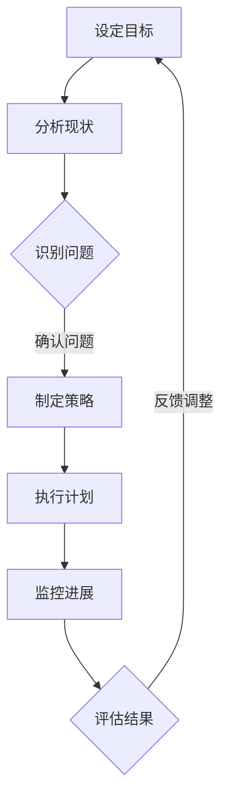
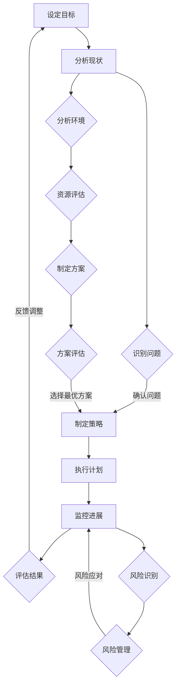

                 

### 领导力思维：改变国家命运的领导力修炼

> **关键词**：领导力、国家命运、思维修炼、管理、创新、跨文化、实践案例

> **摘要**：
在当今快速变化的世界中，领导力不仅是企业成功的关键，更是国家繁荣与发展的基石。本文旨在探讨领导力的基础理论、实践应用以及跨文化因素，并通过一系列实战案例，阐述如何通过领导力思维来改变国家命运。文章结构紧凑，逻辑清晰，旨在为读者提供有深度、有思考、有见解的领导力知识体系。

### 引言

领导力，作为一个广泛应用且具有深远影响力的概念，贯穿于组织、企业和国家的方方面面。然而，领导力并非仅仅是管理能力和领导技巧的简单叠加，它更深层次地涉及思维模式、价值观和行为习惯。领导力思维是一种系统性、战略性和创新性的思考方式，它不仅影响个人的职业发展，更对国家和民族的未来产生深远影响。

本文将围绕“领导力思维：改变国家命运的领导力修炼”这一主题，通过以下目录结构展开：

## 第一部分：领导力的基础理论
### 第1章：领导力的定义与核心要素
### 第2章：领导力心理学
### 第3章：领导力模型与理论
### 第4章：领导力的跨文化因素

## 第二部分：领导力的实践与应用
### 第5章：领导力发展策略
### 第6章：领导力在组织变革中的应用
### 第7章：领导力在创新与创业中的角色
### 第8章：领导力在团队管理中的应用

## 第三部分：领导力的实战案例与反思
### 第9章：领导力在政治领导中的应用
### 第10章：领导力在经济管理中的应用
### 第11章：领导力在公共管理中的应用
### 第12章：领导力在个人成长中的应用

## 附录：领导力思维工具与应用
### 附录 A：领导力评估工具
### 附录 B：领导力发展资源

### 附加资料
- 领导力思维流程图
- 领导力算法伪代码
- 领导力数学模型与公式解析
- 领导力实战案例代码解析与解读
- 领导力发展环境搭建指南

通过以上结构和内容，本文将逐步深入探讨领导力的本质和关键要素，并结合实战案例，提供实用的领导力修炼方法，以期帮助读者在个人和组织层面实现质的飞跃。

---

接下来，我们将从领导力的基础理论出发，详细分析其核心要素，并逐步探讨领导力的心理学、模型与理论，以及跨文化因素。这些基础理论构成了领导力思维的根本，为后续的实践应用提供了坚实的理论支撑。

## 第一部分：领导力的基础理论

### 第1章：领导力的定义与核心要素

#### 1.1 领导力的基本概念

领导力（Leadership）是一种影响力，它能够激发并引导团队成员为实现共同目标而努力。领导力不仅仅是职位赋予的权威，它更是一种能力，一种通过个人魅力、价值观和决策能力来影响他人行为和思想的过程。

领导力的本质在于“引领”和“影响”。通过有效的领导，领导者能够推动团队协作，激发成员的潜能，实现组织目标。领导力不仅仅是管理的一部分，更是一种艺术，一种通过不断实践和修炼而不断升华的技能。

#### 1.2 领导力的核心要素

要理解领导力的核心要素，我们需要从以下几个方面进行分析：

1. **个人魅力**：个人魅力是领导力的核心组成部分，它包括领导者的气质、风度、谈吐和仪态等。一个具有强大个人魅力的领导者能够吸引和激励团队成员，形成强大的团队凝聚力。

2. **价值观**：价值观是领导力的灵魂。领导者的价值观不仅影响其个人行为，更对团队成员产生深远影响。一个具有坚定价值观的领导者能够引导团队成员朝着共同的目标努力，形成积极向上的团队文化。

3. **决策能力**：决策能力是领导力的关键要素。领导者需要在复杂多变的环境中做出迅速而准确的决策，引导团队走出困境，实现组织目标。

4. **沟通能力**：沟通能力是领导者必备的基本技能。通过有效的沟通，领导者能够传达目标、愿景和期望，激发团队成员的积极性和创造力。

5. **激励能力**：激励能力是领导力的核心。领导者需要能够识别团队成员的需求和动机，通过激励措施激发团队成员的潜力，实现组织目标。

6. **团队协作能力**：团队协作能力是领导力的重要体现。领导者需要能够搭建高效的团队，促进团队成员之间的合作，实现1+1>2的效果。

#### 1.3 领导力的层次

领导力可以分为多个层次，不同层次的领导力有不同的特点和作用。以下是几种常见的领导力层次：

1. **技术领导力**：技术领导力主要指领导者具备的专业技能和知识，能够指导团队成员解决技术难题，推动技术创新。

2. **管理领导力**：管理领导力主要指领导者具备的管理能力和组织协调能力，能够有效管理团队，实现组织目标。

3. **战略领导力**：战略领导力主要指领导者具备的战略思维和决策能力，能够制定长远发展战略，引领组织持续发展。

4. **文化领导力**：文化领导力主要指领导者具备的文化建设能力和价值观传递能力，能够塑造积极向上的组织文化，激发团队成员的归属感和荣誉感。

5. **变革领导力**：变革领导力主要指领导者具备的推动变革和应对挑战的能力，能够在组织变革中引领团队，实现组织转型。

#### 1.4 领导力的应用领域

领导力在各个领域都有广泛的应用，以下是几个典型领域：

1. **企业**：在企业发展中，领导力是推动企业创新、提升业绩和实现持续发展的重要动力。企业领导者需要具备战略思维、决策能力和团队协作能力，以引领企业走向成功。

2. **政府**：在政府管理中，领导力是推动政府改革、提高公共管理和公共服务质量的关键。政府领导者需要具备社会责任感、公共服务意识和决策能力，以实现公共利益最大化。

3. **非营利组织**：在非营利组织中，领导力是推动社会进步、实现社会公益目标的重要力量。非营利组织领导者需要具备公益理念、社会责任感和团队协作能力，以实现组织使命。

4. **教育**：在教育领域，领导力是推动教育改革、提高教育质量和培养创新人才的重要保障。教育领导者需要具备教育理念、教育能力和团队协作能力，以引领教育事业发展。

### 结论

领导力是一种复杂的技能，它不仅涉及个人素质、价值观和决策能力，还涉及沟通、激励和团队协作等方面。通过深入理解领导力的核心要素和层次，我们可以更好地掌握领导力的本质，提高领导力水平，为个人和组织的发展贡献力量。在下一章中，我们将进一步探讨领导力的心理学，分析领导者的个性特质和领导风格。

---

在了解了领导力的基本概念和核心要素之后，我们需要深入探讨领导力的心理学层面。领导者的个性特质、领导风格以及与员工的关系都是领导力的重要组成部分，它们共同影响着领导效果。在接下来的内容中，我们将逐一分析这些方面。

### 第2章：领导力心理学

#### 2.1 领导者的个性特质

领导者的个性特质对于领导效果有着重要影响。一些研究表明，特定的个性特质与有效的领导行为之间存在显著关联。以下是几种常见的领导者个性特质：

1. **自信**：自信是领导者的核心特质之一。一个自信的领导者能够展现出坚定的决心和明确的目标，从而赢得员工的信任和支持。

2. **同理心**：同理心是指领导者能够理解并感受员工的情感和需求。具备同理心的领导者能够建立良好的人际关系，增强团队的凝聚力和合作精神。

3. **开放性**：开放性是指领导者对新思想和变化持开放态度。开放性的领导者能够接受不同的观点和意见，推动创新和变革。

4. **责任心**：责任心是领导者对个人和团队行为负责的态度。具有高度责任心的领导者能够确保团队目标的实现，并在面临困难和挑战时起到积极的引导作用。

5. **情绪稳定性**：情绪稳定性是指领导者在压力和挑战面前保持冷静和理性的能力。情绪稳定的领导者能够有效地应对各种挑战，减少团队中的负面情绪。

#### 2.2 领导风格与行为

领导风格是指领导者处理和管理团队的方式。不同的领导风格会对团队成员的行为和绩效产生不同的影响。以下是几种常见的领导风格：

1. **专制式领导**：专制式领导者通常对团队成员的控制力较强，决策权高度集中。这种领导风格在紧急情况下可能有效，但长期来看可能导致员工缺乏自主性和创新精神。

2. **民主式领导**：民主式领导者鼓励团队成员参与决策过程，尊重员工的意见和贡献。这种领导风格能够增强团队的凝聚力和创造力，提高员工的工作满意度和绩效。

3. **参与式领导**：参与式领导者将团队成员视为合作伙伴，共同参与决策和目标设定。这种领导风格能够激发员工的主动性和积极性，促进团队合作和创新。

4. **授权式领导**：授权式领导者将决策权和责任分配给团队成员，鼓励他们自主行动。这种领导风格能够培养员工的领导能力和自信心，提高团队的整体效率。

#### 2.3 领导与员工关系

领导与员工关系是领导力心理学的重要组成部分。良好的领导与员工关系能够促进员工的积极性和创造力，提高团队的绩效。以下是几种关键的领导与员工关系要素：

1. **信任**：信任是领导与员工关系的基石。领导者需要建立起与员工的信任关系，通过透明、诚信和公正的行为来赢得员工的信任。

2. **尊重**：尊重是指领导者对员工的个性、价值观和贡献的认可。尊重员工能够增强员工的自信心和归属感，提高员工的工作满意度和绩效。

3. **支持**：支持是指领导者在员工面临挑战和困难时提供帮助和指导。领导者需要关注员工的需求，提供必要的资源和支持，帮助员工克服困难，实现个人和团队目标。

4. **反馈**：有效的反馈是领导与员工关系中的重要环节。领导者需要给予员工及时、具体和建设性的反馈，帮助员工认识到自己的优点和不足，促进员工个人和职业发展。

#### 2.4 领导力心理学在实践中的应用

领导力心理学在领导力的实践中具有重要意义。以下是一些应用实例：

1. **员工激励**：通过了解员工的个性和需求，领导者可以采用个性化的激励策略，激发员工的工作热情和创造力。

2. **团队建设**：领导力心理学可以帮助领导者识别团队成员的特质和需求，搭建高效的团队，促进团队合作和创新。

3. **领导力发展**：领导力心理学为领导力发展提供了理论基础和实践方法。领导者可以通过学习和实践心理学知识，提高自身的领导能力。

4. **组织变革**：在组织变革过程中，领导力心理学可以帮助领导者理解和应对员工的情绪和行为，推动变革的顺利进行。

### 结论

领导力心理学是理解领导力本质和提升领导能力的重要领域。通过了解领导者的个性特质、领导风格和领导与员工关系，我们可以更深入地理解领导力的影响机制，为实际领导工作提供科学依据和实践指导。在下一章中，我们将进一步探讨领导力模型与理论，分析不同领导力模型的适用场景和优缺点。

---

在了解了领导力的心理学基础后，我们需要进一步探讨领导力的模型与理论。不同的领导力模型和理论为领导者提供了不同的视角和方法，帮助我们更好地理解和应用领导力。本章将分析经典领导力模型、领导力理论的演变以及当代领导力理论的应用。

### 第3章：领导力模型与理论

#### 3.1 经典领导力模型

经典领导力模型为我们提供了对领导力本质的基本理解，这些模型在领导力研究和实践中具有深远的影响。以下是几种著名的经典领导力模型：

1. **特质理论**：特质理论认为领导者的成功主要取决于其固有的个人特质。这种理论强调领导者的个性、能力和品质，如自信、智慧、正直等。特质理论为领导力的培养提供了方向，但也存在一定的局限性，因为它忽视了环境因素对领导者的影响。

2. **行为理论**：行为理论关注领导者的行为和领导风格，而不是其个人特质。这种理论认为，领导者的行为可以学习和模仿，从而提高领导能力。代表性的行为理论包括俄亥俄州立大学模型和密歇根大学模型。这些模型强调了领导者与员工的关系、任务导向和关系导向的领导风格。

3. **情境理论**：情境理论认为领导效果取决于领导者的行为是否与具体情境相适应。代表性理论有费德勒模型和路径—目标理论。费德勒模型强调领导者与情境的关系，认为领导效果取决于领导者对情境的控制力和适应力。路径—目标理论则强调领导者通过设定清晰的目标和提供必要的支持来引导团队成员。

#### 3.2 领导力理论的演变

领导力理论经历了从传统到现代的演变过程，这一过程反映了社会环境、组织变革和科技发展对领导力需求的变化。以下是领导力理论演变的主要阶段：

1. **传统领导力理论**：传统领导力理论主要关注领导者的个人特质和行为，强调领导者的权威和影响力。这一阶段的理论主要包括特质理论和行为理论。

2. **现代领导力理论**：现代领导力理论在传统理论的基础上，更加关注情境因素和领导者的角色。情境理论、变革型领导理论和服务型领导理论是这一阶段的代表性理论。

3. **当代领导力理论**：当代领导力理论更加关注领导力在全球化、数字化和多样化环境中的适用性。代表性理论包括全球化领导理论、领导力发展理论和创新领导理论。

#### 3.3 当代领导力理论的应用

当代领导力理论为领导者提供了应对复杂环境和挑战的方法。以下是几种重要的当代领导力理论及其应用：

1. **变革型领导理论**：变革型领导理论强调领导者通过激发员工的内在动力和创新能力，推动组织变革和持续发展。这一理论在组织转型和创新中具有广泛应用。例如，通用电气的杰克·韦尔奇通过变革型领导，成功推动了企业的转型和持续增长。

2. **服务型领导理论**：服务型领导理论认为领导者应首先服务于员工和客户，通过建立良好的人际关系和共同愿景，实现组织目标。这一理论在公共服务和非营利组织中具有显著的应用价值。例如，美国前总统奥巴马通过服务型领导，赢得了广泛的支持和信任。

3. **全球化领导理论**：全球化领导理论关注领导力在全球化和多样化环境中的适应性和有效性。这一理论强调领导者需要具备跨文化沟通能力、全球视野和包容性领导风格。全球化领导理论在跨国公司和多元文化组织中具有广泛应用。例如，谷歌的拉里·佩奇和谢尔盖·布林通过全球化领导，将谷歌打造成全球领先的科技公司。

4. **创新领导理论**：创新领导理论强调领导者需要具备创新思维和领导能力，推动组织创新和持续发展。这一理论在科技创新和创业领域具有广泛应用。例如，苹果公司的史蒂夫·乔布斯通过创新领导，推动了苹果公司成为全球最具创新力的科技公司之一。

#### 3.4 领导力模型的综合应用

在实际领导工作中，领导者往往需要综合应用不同的领导力模型和理论，以应对不同的情境和挑战。以下是几种常见的领导力模型和理论的综合应用：

1. **情境与行为相结合**：领导者可以根据具体情境，灵活运用不同的领导风格和行为。例如，在危机时刻，领导者可以采用专制式领导，快速做出决策；在常态下，领导者可以采用民主式领导，鼓励团队成员参与决策。

2. **特质与情境相结合**：领导者需要根据自身的个性特质和具体情境，选择合适的领导方式。例如，一个具有高度自信和开放性的领导者，可以在面对复杂挑战时采用变革型领导；在稳定环境中，可以采用服务型领导。

3. **理论与实践相结合**：领导者需要将领导力理论应用于实践，通过不断反思和调整，提高领导能力。例如，领导者可以通过参与领导力培训课程，学习不同的领导力理论，然后在实际工作中尝试应用，不断优化领导方式。

### 结论

领导力模型与理论为领导者提供了丰富的视角和方法，帮助我们更好地理解和应用领导力。通过分析经典领导力模型、领导力理论的演变以及当代领导力理论的应用，我们可以更好地把握领导力的本质和关键要素。在下一章中，我们将探讨领导力的跨文化因素，分析跨文化领导力的挑战和策略。

---

在全球化和多样化日益显著的时代背景下，领导力的跨文化因素变得愈发重要。跨文化领导力不仅涉及不同文化背景下的领导风格和沟通方式，还涉及到领导者的文化敏感性和适应性。本章将探讨跨文化领导力的挑战、策略以及国际化领导力案例分析。

### 第4章：领导力的跨文化因素

#### 4.1 跨文化领导力的挑战

跨文化领导力面临一系列独特的挑战，这些挑战源于文化差异、价值观冲突、沟通障碍和团队管理困难。以下是几个主要挑战：

1. **文化差异**：不同文化背景下，人们对工作方式、决策过程、角色定位和沟通风格的期望存在显著差异。例如，在一些集体主义文化中，领导者更注重团队协作和集体荣誉，而在个人主义文化中，领导者更注重个人成就和独立性。

2. **价值观冲突**：不同文化有着不同的价值观和道德规范，这些差异可能导致领导者和员工之间的价值观冲突。例如，在一些文化中，尊重权威和等级制度是重要的价值观，而在其他文化中，平等和自主是更受重视的价值观。

3. **沟通障碍**：跨文化沟通常常受到语言障碍、非语言符号和文化背景的影响。不同的文化背景可能导致误解和沟通障碍，影响团队的协作效率。

4. **团队管理困难**：跨文化团队管理涉及到如何平衡不同文化成员的需求、激励和参与。领导者需要具备更高的敏感性和适应性，以管理多元化的团队。

#### 4.2 跨文化领导力的策略

为了应对跨文化领导力的挑战，领导者需要采取一系列策略来提高文化敏感性和适应性。以下是几个关键策略：

1. **文化学习**：领导者需要投入时间和精力，学习不同文化的价值观、习俗和行为规范。通过了解不同文化的特点和差异，领导者可以更好地理解员工，减少误解和冲突。

2. **文化敏感性训练**：领导者可以通过参加文化敏感性培训课程，提高对文化差异的敏感性和适应性。这些培训课程通常包括文化差异的案例分析、跨文化沟通技巧和团队合作策略。

3. **文化适应性**：领导者需要具备文化适应性，能够根据不同文化背景调整领导风格和行为。例如，在强调集体主义的文化中，领导者可以更加注重团队协作和集体荣誉；在强调个人主义的文化中，领导者可以更加注重个人成就和自主性。

4. **建立共同价值观**：领导者需要建立共同价值观，促进团队成员的文化融合和合作。通过共同价值观的引导，领导者可以增强团队凝聚力，提高工作效率。

5. **提供跨文化支持**：领导者可以为团队成员提供跨文化支持，包括跨文化沟通技巧培训、跨文化工作环境适应指导等。通过提供必要的支持，领导者可以帮助团队成员更好地适应跨文化环境。

#### 4.3 国际化领导力案例分析

以下是一些国际化领导力案例分析，这些案例展示了跨文化领导力的实践和应用：

1. **微软公司**：微软公司的跨文化领导力实践在全球范围内享有盛誉。微软通过设立国际员工交流计划，促进不同文化背景的员工之间的交流和合作。此外，微软还推行跨文化领导力培训课程，提高领导者的文化敏感性和适应性。

2. **华为公司**：华为公司作为一家全球化的科技公司，高度重视跨文化领导力。华为通过建立全球化的团队管理模式，推动不同文化背景的员工之间的协作。华为还注重培养领导者的跨文化沟通能力和文化敏感性，以应对全球化业务环境中的挑战。

3. **可口可乐公司**：可口可乐公司在全球范围内运营，其跨文化领导力策略包括建立本地化团队、培养本地化领导者和推动全球化合作。可口可乐公司通过本地化团队的管理，更好地适应当地市场和文化环境。同时，可口可乐公司还通过全球化合作，整合不同市场的资源，提高整体运营效率。

4. **诺基亚公司**：诺基亚公司在国际化过程中，重视跨文化领导力的建设。诺基亚通过设立全球领导力发展中心，为领导者提供跨文化培训和领导力发展机会。此外，诺基亚还推行国际化领导力模型，帮助领导者更好地应对全球业务环境中的挑战。

#### 4.4 结论

跨文化领导力在全球化时代具有重要意义。通过应对跨文化领导力的挑战和采取有效的策略，领导者可以提升文化敏感性和适应性，推动团队协作和创新。国际化领导力案例分析为我们提供了宝贵的经验和启示，有助于我们更好地理解和应用跨文化领导力。在下一章中，我们将探讨领导力发展策略，分析领导力发展的自我评估和路径。

---

在了解了领导力的基础理论、心理学和模型之后，我们需要进一步探讨领导力的实践与应用。本章将详细讨论领导力发展策略、领导力在组织变革中的应用、领导力在创新与创业中的角色以及领导力在团队管理中的应用。通过这些具体实践，我们可以更好地理解如何将领导力思维转化为实际成果。

### 第5章：领导力发展策略

领导力发展是一个持续的过程，它不仅涉及个人能力的提升，还包括团队和组织整体的成长。有效的领导力发展策略可以帮助领导者提高自身素质，增强团队凝聚力和创新能力。以下是几个关键步骤和策略：

#### 5.1 领导力发展的自我评估

自我评估是领导力发展的第一步。领导者需要反思自己的领导风格、行为和结果，识别自身的优势和不足。以下是一些自我评估的方法：

1. **360度反馈**：通过收集来自同事、下属和上级的反馈，领导者可以全面了解自己的领导风格和行为。360度反馈可以提供客观的评价，帮助领导者识别问题并提出改进措施。

2. **行为观察**：领导者可以通过观察自己的行为，分析自己在不同情境下的反应和决策方式。这种方法可以帮助领导者发现潜在的行为模式，并思考如何优化。

3. **能力测试**：通过参加领导力能力测试，如MBTI（迈尔斯-布里格斯类型指标）或PI（人格特质指标），领导者可以了解自己的性格特点、优势领域和潜在发展需求。

#### 5.2 领导力发展的路径

在自我评估的基础上，领导者需要制定具体的领导力发展路径。以下是几个常见的领导力发展路径：

1. **教育培训**：领导者可以通过参加专业培训课程，学习领导力理论和实践。这些课程通常包括领导力技能、团队管理、战略规划和沟通技巧等。

2. **实践经验**：实践是检验真理的唯一标准。领导者需要通过实际工作，将理论知识应用于实践。在实践中，领导者可以不断学习和调整自己的领导方式。

3. **导师指导**：找到一位经验丰富的导师，可以帮助领导者快速成长。导师可以提供宝贵的建议、反馈和指导，帮助领导者克服挑战，提升领导能力。

4. **跨部门/跨文化经历**：领导者可以通过跨部门或跨文化的项目经历，拓展视野，提高适应性和灵活性。这种经历可以帮助领导者更好地理解不同团队和文化背景的需求和挑战。

#### 5.3 领导力发展的实践方法

在领导力发展过程中，领导者需要采取一系列实践方法，以巩固和提升领导能力。以下是几个实用的实践方法：

1. **建立学习社区**：领导者可以组建学习小组或社区，与同行分享经验和学习资源。通过共同学习和交流，领导者可以互相激励，共同进步。

2. **设定具体目标**：领导者需要设定具体的个人和团队目标，并制定详细的行动计划。通过目标导向的管理，领导者可以更清晰地了解自己的发展方向，并采取有效的措施实现目标。

3. **定期反思**：领导者需要定期反思自己的领导行为和结果，分析成功和失败的原因。通过反思，领导者可以不断优化自己的领导方式，提高领导效果。

4. **培养下属**：领导者需要关注下属的成长和发展，为他们提供支持和指导。通过培养下属，领导者不仅可以提高团队的整体素质，还可以实现领导力的传承和延续。

### 结论

领导力发展是一个复杂而持续的过程，需要领导者投入时间和精力。通过自我评估、实践经验和跨文化经历，领导者可以不断提升自身的领导能力。有效的领导力发展策略可以帮助领导者更好地应对挑战，实现个人和组织的共同成长。在下一章中，我们将探讨领导力在组织变革中的应用，分析领导者在组织变革中的关键作用。

---

### 第6章：领导力在组织变革中的应用

组织变革是推动企业持续发展的重要手段，而领导力在组织变革中起着至关重要的作用。有效的领导力可以帮助企业顺利应对变革，确保变革目标的实现。本章将探讨领导力在组织变革中的应用，包括组织变革的领导力作用、变革型领导力实践以及变革型领导力案例分析。

#### 6.1 组织变革的领导力作用

领导力在组织变革中的作用主要体现在以下几个方面：

1. **推动变革**：领导者是组织变革的发起者和推动者。他们需要明确变革的目标和愿景，并通过有效的沟通和激励，激发员工对变革的支持和参与。

2. **提供方向**：领导者需要为组织变革提供明确的方向和路径。通过制定战略规划和行动计划，领导者可以确保变革的有序进行，避免盲目和无序。

3. **建立信任**：在组织变革过程中，领导者需要建立与员工的信任关系。信任是变革成功的关键，它能够增强员工的归属感和参与感，减少变革阻力。

4. **应对挑战**：领导者需要具备应对变革过程中各种挑战的能力。他们需要预见问题，及时调整策略，并带领团队克服困难，实现变革目标。

5. **激励创新**：领导者需要鼓励员工创新思维，推动组织变革中的创新实践。通过激发员工的创造力和主动性，领导者可以确保组织在变革中保持竞争力。

#### 6.2 变革型领导力实践

变革型领导力（Transformational Leadership）是一种以激发员工潜能为核心的领导力模式，它通过领导者的榜样作用、激励和启发，推动组织变革。以下是几个关键的变革型领导力实践：

1. **塑造愿景**：领导者需要明确组织变革的愿景和目标，并将其传达给全体员工。通过塑造共同愿景，领导者可以激发员工的认同感和参与热情。

2. **激励员工**：领导者需要运用各种激励手段，如奖励、认可和培训，激发员工在变革过程中的积极性和创造力。通过激励，领导者可以增强员工的自我驱动力，推动变革的顺利进行。

3. **建立信任**：领导者需要建立与员工的信任关系，通过开放、透明和诚信的行为，赢得员工的信任和支持。信任是变革成功的关键，它能够减少变革阻力，增强团队凝聚力。

4. **培养变革思维**：领导者需要培养员工的变革思维，鼓励他们拥抱变革，积极参与变革实践。通过培训和教育，领导者可以提升员工的变革意识和能力。

5. **提供反馈**：领导者需要及时给予员工反馈，帮助他们了解自己在变革中的表现和成长。通过反馈，领导者可以指导员工改进，提高变革效果。

#### 6.3 变革型领导力案例分析

以下是一个变革型领导力案例，展示了领导力在组织变革中的应用：

**案例：谷歌公司的组织变革**

谷歌公司作为全球领先的科技公司，一直重视组织变革和创新。在谷歌，领导力在组织变革中发挥了重要作用。

1. **塑造愿景**：谷歌的创始人拉里·佩奇和谢尔盖·布林明确提出了“组织化创意”的愿景，通过推动技术革新和改善用户体验，实现谷歌的长期发展。

2. **激励员工**：谷歌通过提供具有竞争力的薪酬和福利，以及灵活的工作环境，激励员工在变革中发挥积极作用。谷歌还推行了“20%时间”政策，鼓励员工探索创新项目，推动公司内部的创新氛围。

3. **建立信任**：谷歌强调开放、透明和诚信的企业文化，通过定期员工会议和内部沟通平台，确保员工了解公司的战略方向和变革进展。谷歌的领导者还积极倾听员工的意见和建议，建立信任和沟通。

4. **培养变革思维**：谷歌通过持续的培训和教育，提升员工的变革意识和能力。谷歌的领导力发展计划包括领导力培训、团队建设活动和跨部门交流，帮助员工适应变革，提高团队协作效率。

5. **提供反馈**：谷歌通过定期绩效评估和员工反馈机制，及时了解员工的成长和改进。谷歌的领导者还通过一对一的辅导和反馈，指导员工优化工作表现，推动组织变革的持续发展。

**结论**：

通过这个案例，我们可以看到，变革型领导力在组织变革中的应用至关重要。领导者通过塑造愿景、激励员工、建立信任、培养变革思维和提供反馈，可以有效地推动组织变革，实现组织的长期发展。在下一章中，我们将探讨领导力在创新与创业中的角色，分析领导者在创新环境和创业过程中所面临的挑战和机遇。

---

在现代社会，创新与创业已成为推动经济发展和社会进步的重要力量。领导力在创新与创业中扮演着关键角色，它不仅是激发创新思维和创业精神的核心要素，也是确保创业项目成功的重要因素。本章将探讨领导力在创新与创业中的角色，包括创新型领导力的特点、策略以及创业型领导力案例分析。

### 第7章：领导力在创新与创业中的角色

#### 7.1 创新型领导力的特点

创新型领导力是一种以激发创新思维、推动创新实践为核心能力的领导力。它与传统的管理型领导力有显著不同，具有以下几个特点：

1. **愿景驱动**：创新型领导者具备清晰的愿景和远见，能够为组织设定明确的创新目标和方向。他们的愿景不仅激励团队成员，还为创新活动提供了方向和动力。

2. **鼓励创新**：创新型领导者鼓励团队成员提出创新想法，并对创新活动给予充分的支持和资源。他们理解创新的不确定性和失败的可能性，但仍然坚持推动创新实践。

3. **跨学科协作**：创新型领导者善于搭建跨学科、跨部门的合作团队，通过多样化的思维和知识碰撞，激发创新灵感。他们强调团队协作，鼓励团队成员互相学习和支持。

4. **容忍失败**：创新型领导者容忍失败，认为失败是创新过程中的一部分。他们鼓励团队成员从失败中学习，并不断优化创新过程。

5. **持续学习**：创新型领导者持续学习和更新知识，紧跟科技和行业的发展趋势。他们通过不断学习和实践，提升自身的创新能力和领导力。

#### 7.2 创新型领导力策略

要成为一位创新型领导者，领导者需要采取一系列策略来激发创新思维和推动创新实践。以下是几个关键策略：

1. **建立创新文化**：创新型领导者需要建立鼓励创新的文化氛围，通过价值观和行为的引导，使创新成为组织的一部分。他们倡导开放、包容和试验的文化，鼓励员工敢于提出新想法，并为创新提供必要的支持和资源。

2. **设立明确目标**：创新型领导者需要设定明确的创新目标和关键绩效指标（KPI），确保创新活动有明确的方向和衡量标准。通过目标导向的管理，领导者可以确保创新活动与组织的战略目标相一致。

3. **跨部门合作**：创新型领导者需要搭建跨部门合作的平台，促进不同部门之间的知识共享和资源整合。通过跨部门合作，领导者可以激发新的创新思路，提高创新效率。

4. **提供创新培训**：创新型领导者需要为团队成员提供创新培训，帮助他们掌握创新方法和工具，提高创新能力。通过培训，领导者可以提升团队的整体创新水平。

5. **奖励创新成果**：创新型领导者需要建立创新奖励机制，对取得创新成果的团队成员给予奖励和认可。通过奖励，领导者可以激发员工的创新热情，形成持续的创新动力。

#### 7.3 创业型领导力案例分析

以下是一个创业型领导力案例，展示了领导力在创新与创业中的具体应用：

**案例：特斯拉公司的创业历程**

特斯拉公司作为一家以电动汽车和能源解决方案为核心的创新型企业，其成功离不开创业型领导力。

1. **愿景驱动**：特斯拉的创始人伊隆·马斯克具有清晰的愿景，他致力于推动电动汽车的普及和可再生能源的应用。这一愿景不仅吸引了众多优秀人才加入特斯拉，也为公司的创新活动提供了明确的方向。

2. **鼓励创新**：马斯克鼓励员工提出创新想法，并对创新活动给予充分的支持。他倡导开放、包容和试验的文化，鼓励员工敢于尝试新的技术和商业模式。

3. **跨学科协作**：特斯拉的团队由来自不同领域的人才组成，他们在电动汽车和能源领域拥有丰富的经验和专业知识。马斯克通过搭建跨学科协作的平台，促进了知识共享和思维碰撞，推动了公司的创新实践。

4. **容忍失败**：马斯克认为失败是创新过程中的一部分，他鼓励员工从失败中学习，并不断优化创新过程。特斯拉公司在电动汽车和能源领域的多次失败和尝试，最终促成了公司的成功。

5. **持续学习**：马斯克持续学习和更新知识，紧跟科技和行业的发展趋势。他通过不断学习和实践，提升了自身的创新能力和领导力，为特斯拉的持续创新提供了保障。

**结论**：

通过这个案例，我们可以看到创业型领导力在创新与创业中的关键作用。领导者通过愿景驱动、鼓励创新、跨学科协作、容忍失败和持续学习，可以有效地激发创新思维和推动创新实践。在下一章中，我们将探讨领导力在团队管理中的应用，分析团队领导力的重要性以及团队领导力的培养策略。

---

### 第8章：领导力在团队管理中的应用

在团队管理中，领导力扮演着至关重要的角色。有效的团队领导不仅能够提高团队成员的凝聚力和工作效率，还能推动团队的持续发展和创新。本章将探讨团队领导力的重要性、团队领导力的培养策略以及团队领导力案例分析。

#### 8.1 团队领导力的重要性

团队领导力是指领导者通过激发、指导和激励团队成员，实现团队目标的能力。以下是团队领导力在团队管理中的重要性：

1. **提高团队效率**：有效的团队领导能够明确团队目标，合理分配资源，提高团队的工作效率。领导者通过制定清晰的计划和目标，确保团队成员明确任务和责任，减少资源浪费和重复劳动。

2. **增强团队凝聚力**：团队领导力能够增强团队成员之间的信任和合作，提高团队的凝聚力。领导者通过建立积极向上的团队文化，促进团队成员之间的沟通和协作，形成良好的团队氛围。

3. **激发团队创新**：团队领导力能够激发团队成员的创新思维和创造力。领导者通过鼓励团队成员提出新想法，支持创新实践，推动团队的持续发展和创新。

4. **提升团队士气**：有效的团队领导能够提升团队成员的士气和满意度。领导者通过认可和奖励团队成员的成就，增强团队成员的自我价值感和归属感，提高团队的整体士气。

5. **促进个人成长**：团队领导力能够促进团队成员的个人成长和发展。领导者通过为团队成员提供培训和发展机会，指导和支持团队成员的职业发展，帮助团队成员实现自我提升。

#### 8.2 团队领导力的培养策略

要成为一位优秀的团队领导者，领导者需要采取一系列培养策略，提升自身的团队领导力。以下是几个关键策略：

1. **明确团队目标**：领导者需要明确团队的目标和愿景，并将其传达给全体成员。通过设定明确的目标，领导者可以确保团队成员明确任务和责任，提高团队的协同效应。

2. **建立信任关系**：领导者需要建立与团队成员的信任关系，通过开放、透明和诚信的行为赢得团队成员的信任。信任是团队领导力的基石，它能够增强团队成员的凝聚力和合作精神。

3. **培养沟通能力**：领导者需要具备良好的沟通能力，能够有效地传达目标和期望，倾听团队成员的意见和建议。通过有效的沟通，领导者可以减少误解和冲突，提高团队的协作效率。

4. **激励团队成员**：领导者需要运用各种激励手段，如奖励、认可和培训，激发团队成员的积极性和创造力。通过激励，领导者可以增强团队成员的自我驱动力，提高团队的整体绩效。

5. **提供反馈和支持**：领导者需要及时给予团队成员反馈和支持，帮助他们了解自己的表现和成长。通过反馈和支持，领导者可以指导团队成员改进，提高团队的工作效率和创新能力。

6. **培养团队文化**：领导者需要培养积极向上的团队文化，通过价值观和行为规范引导团队成员。通过建立良好的团队文化，领导者可以增强团队的凝聚力，提高团队的整体士气。

7. **提供发展机会**：领导者需要为团队成员提供发展机会，包括培训、指导和职业发展支持。通过提供发展机会，领导者可以激发团队成员的自我成长，提高团队的整体素质。

#### 8.3 团队领导力案例分析

以下是一个团队领导力案例，展示了领导力在团队管理中的应用：

**案例：谷歌的团队领导力实践**

谷歌作为全球领先的科技公司，其团队领导力实践在业界享有盛誉。

1. **明确团队目标**：谷歌的领导者通过设定明确的团队目标和愿景，确保团队成员明确任务和责任。谷歌的团队目标通常与公司的战略目标紧密相关，确保团队的协同效应。

2. **建立信任关系**：谷歌的领导者通过开放、透明和诚信的行为，建立与团队成员的信任关系。谷歌的领导文化强调信任和尊重，鼓励团队成员提出意见和建议，营造良好的沟通氛围。

3. **培养沟通能力**：谷歌的领导者注重培养团队成员的沟通能力，通过定期的团队会议、反馈会和团队建设活动，促进团队成员之间的沟通和协作。

4. **激励团队成员**：谷歌的领导者通过奖励、认可和培训，激励团队成员的积极性和创造力。谷歌的奖励机制包括奖金、股权和职业发展机会，确保团队成员感受到公司的认可和关怀。

5. **提供反馈和支持**：谷歌的领导者及时给予团队成员反馈和支持，帮助他们了解自己的表现和成长。谷歌的领导团队经常进行一对一的辅导和反馈，确保团队成员在职业发展中得到指导和支持。

6. **培养团队文化**：谷歌的领导者注重培养积极向上的团队文化，通过价值观和行为规范引导团队成员。谷歌的团队文化强调创新、开放和多样性，鼓励团队成员发挥自己的潜力，实现个人和团队的共同成长。

7. **提供发展机会**：谷歌的领导者为团队成员提供丰富的发展机会，包括内部培训、跨部门交流和国际项目参与。通过提供发展机会，谷歌的领导者帮助团队成员不断提升自己的能力和素质。

**结论**：

通过这个案例，我们可以看到团队领导力在团队管理中的关键作用。领导者通过明确团队目标、建立信任关系、培养沟通能力、激励团队成员、提供反馈和支持、培养团队文化和提供发展机会，可以有效地提高团队的效率和创新能力。在下一章中，我们将探讨领导力在政治领导中的应用，分析政治领导力的特点和实践案例。

---

### 第9章：领导力在政治领导中的应用

政治领导力是一种特殊的领导力形式，它涉及国家治理、公共政策和公共管理等方面。政治领导者不仅需要具备一般的领导力素质，还需应对复杂的政治环境、社会需求和治理挑战。本章将探讨政治领导力的特点、政治领导力案例研究以及政治领导力的反思。

#### 9.1 政治领导力的特点

政治领导力具有以下几个显著特点：

1. **长远视角**：政治领导者需要具备长远的战略思维，能够制定和实施长期的国家发展战略。他们不仅要关注当前的紧迫问题，还要考虑国家的长远利益和未来发展。

2. **协调能力**：政治领导者需要具备强大的协调能力，能够在不同利益群体之间达成共识，确保政策的顺利执行。他们在处理政治分歧和利益冲突时，需要保持公正和平衡。

3. **公共管理能力**：政治领导者需要具备有效的公共管理能力，能够高效地管理政府机构，确保公共服务的质量和效率。他们需要制定合理的政策和规章制度，优化公共资源配置。

4. **沟通与宣传能力**：政治领导者需要具备良好的沟通与宣传能力，能够有效地与公众沟通，传达政策意图和政府的工作成果。他们需要通过媒体和公共活动，建立公众对政府的信任和支持。

5. **道德和价值观**：政治领导者需要具备高尚的道德品质和明确的价值观，能够以身作则，树立良好的榜样。他们的行为和决策应该符合社会的道德标准和公众的期望。

#### 9.2 政治领导力案例研究

以下是一些政治领导力的案例研究，展示了政治领导者如何运用领导力解决国家和社会问题：

**案例1：美国总统奥巴马的领导力**

奥巴马在其任期内，通过一系列政策和改革，推动了美国的社会和经济进步。以下是他的几个重要领导力实践：

1. **医疗改革**：奥巴马推动并通过了《平价医疗法案》（Affordable Care Act），旨在提高美国人民的医疗保障水平。这一政策的实施，不仅改变了美国的医疗体系，也展示了奥巴马在政策制定和协调能力方面的领导力。

2. **经济刺激计划**：2008年金融危机后，奥巴马推出了大规模的经济刺激计划，旨在重振美国经济。这一计划通过增加政府支出和减少税收，刺激了经济增长和就业机会，显示了奥巴马在经济管理方面的领导力。

3. **气候变化政策**：奥巴马提出了雄心勃勃的气候变化政策，推动美国在国际气候变化议程中发挥领导作用。他通过签署《巴黎协定》和推动国内减排政策，展示了其全球视野和环保领导力。

**案例2：印度总理纳伦德拉·莫迪的领导力**

莫迪在其任期内，通过一系列政策和改革，推动了印度的经济和社会发展。以下是他的几个重要领导力实践：

1. **数字印度计划**：莫迪推出了“数字印度”（Digital India）计划，旨在通过数字化技术提升印度的公共服务水平和经济竞争力。该计划包括推广宽带网络、电子政务和移动支付等，展示了莫迪在创新和科技应用方面的领导力。

2. **基础设施投资**：莫迪政府大力投资于基础设施建设，包括高速公路、铁路和港口等，旨在改善印度的交通和物流条件，推动经济增长。这一系列基础设施项目展示了莫迪在公共管理能力和经济规划方面的领导力。

3. **反腐败改革**：莫迪政府采取了一系列反腐败改革措施，包括打击腐败官员、公开政府合同和提升透明度等，旨在提高政府的公信力和效率。这些改革展示了莫迪在道德和价值观方面的领导力。

#### 9.3 政治领导力的反思

政治领导力在实践中面临诸多挑战，以下是一些反思：

1. **民主与效率的平衡**：政治领导者需要在民主和效率之间寻找平衡。民主制度强调公众参与和透明度，但可能导致决策过程缓慢和效率低下。政治领导者需要找到适合自己国家情况的民主与效率平衡点。

2. **社会多元性的应对**：政治领导者需要应对社会多元性带来的挑战。不同利益群体和社会阶层有不同的需求和期望，政治领导者需要平衡各方利益，确保政策的公平性和包容性。

3. **国际影响力的维护**：政治领导者需要在国际舞台上维护国家的利益和影响力。在全球化和多极化背景下，国际关系复杂多变，政治领导者需要具备全球视野和外交智慧。

4. **变革与稳定的平衡**：政治领导者需要在变革和稳定之间寻找平衡。变革可以推动社会进步，但可能引起社会动荡。政治领导者需要确保变革的平稳过渡，同时保持社会的稳定和秩序。

**结论**：

政治领导力在国家和公共管理中起着至关重要的作用。通过分析政治领导力的特点和案例，我们可以看到政治领导者如何运用领导力解决国家和社会问题。政治领导者需要具备长远视角、协调能力、公共管理能力、沟通与宣传能力以及道德和价值观。同时，他们需要面对民主与效率的平衡、社会多元性的应对、国际影响力的维护以及变革与稳定的平衡等挑战。在下一章中，我们将探讨领导力在经济管理中的应用，分析企业领导力的作用和实践案例。

---

### 第10章：领导力在经济管理中的应用

在经济管理中，领导力是推动企业成功和经济增长的关键因素。企业领导者通过领导力来制定战略、激励员工、优化资源，从而实现企业的长期发展和竞争力的提升。本章将探讨领导力在经济管理中的作用、企业领导力案例研究以及企业领导力的反思。

#### 10.1 企业领导力的作用

企业领导力在经济管理中的作用体现在以下几个方面：

1. **战略制定**：企业领导者需要具备战略思维，能够制定符合企业长远发展目标的发展战略。战略制定包括市场定位、产品创新、资源配置等方面，领导者通过有效的战略规划，确保企业能够在竞争激烈的市场中脱颖而出。

2. **团队激励**：企业领导者需要激励员工，激发他们的积极性和创造力。通过建立激励机制、提供职业发展机会和营造良好的工作环境，领导者能够提升员工的工作满意度和忠诚度，提高企业的整体绩效。

3. **资源优化**：企业领导者需要有效管理和优化企业的资源，包括资金、人力和技术等。领导者通过合理的资源配置和资源整合，提高企业的运营效率和竞争力。

4. **创新驱动**：企业领导者需要推动企业的创新，鼓励员工提出新的想法和解决方案。通过创新，企业能够不断改进产品和服务，满足市场需求，保持竞争优势。

5. **文化建设**：企业领导者需要塑造积极向上的企业文化，通过价值观和行为规范引导员工。企业文化是企业的软实力，它能够增强企业的凝聚力和归属感，推动企业的可持续发展。

#### 10.2 企业领导力案例研究

以下是一些企业领导力案例研究，展示了不同领导者在经济管理中的成功实践：

**案例1：苹果公司的史蒂夫·乔布斯**

史蒂夫·乔布斯是苹果公司的联合创始人，他的领导力在苹果公司的成功中发挥了重要作用。

1. **愿景驱动**：乔布斯以其远见卓识和独特的愿景，引领苹果公司在多个领域取得了突破。他通过推出具有颠覆性的产品，如iPhone、iPad和MacBook，改变了消费者的生活方式。

2. **团队激励**：乔布斯注重团队建设，他通过激励和认可，激发员工的工作热情和创造力。他经常与员工一起工作，倾听他们的意见和建议，形成了一个充满活力和创新氛围的团队。

3. **创新驱动**：乔布斯鼓励创新，他提出了“ Think Different”的理念，推动苹果公司不断进行技术创新和产品改进。他的领导力使得苹果公司成为全球最具创新力的科技公司之一。

**案例2：亚马逊的杰夫·贝佐斯**

杰夫·贝佐斯是亚马逊公司的创始人，他的领导力在亚马逊的快速增长和多元化发展中起到了关键作用。

1. **战略制定**：贝佐斯以其卓越的战略规划能力，带领亚马逊不断扩张业务领域。他通过推出新的服务和产品，如Amazon Web Services、Amazon Prime和Alexa，拓展了亚马逊的业务范围。

2. **资源优化**：贝佐斯注重资源优化，他通过精细化管理和高效的运营，提高了亚马逊的运营效率和盈利能力。他推出了Amazon Go商店，实现了无现金和无收银员的购物体验。

3. **文化建设**：贝佐斯强调公司文化的重要性，他提出了“Day 1”的理念，鼓励员工保持创业精神，不断挑战现状，追求卓越。他的领导力塑造了亚马逊独特的企业文化，使得公司能够在竞争激烈的市场中保持竞争力。

#### 10.3 企业领导力的反思

在领导企业经济管理的过程中，领导者需要面对一系列挑战和反思：

1. **平衡创新与稳定**：领导者需要在创新和稳定之间寻找平衡。创新可以推动企业的发展，但可能带来风险和不确定性。领导者需要确保在创新的过程中，保持企业的稳定运营。

2. **应对市场变化**：市场环境不断变化，领导者需要具备敏锐的市场洞察力，能够及时调整战略和业务方向，以应对市场变化。他们需要保持灵活性和适应性，确保企业能够在竞争激烈的市场中生存和发展。

3. **人才管理**：领导者需要重视人才管理，吸引和保留优秀的人才。他们需要建立完善的激励机制和职业发展体系，激发员工的潜力，提升团队的整体实力。

4. **社会责任**：领导者需要关注企业的社会责任，确保企业在追求经济效益的同时，也承担起社会责任。他们需要通过环保、公益和社会责任项目，提升企业的社会形象和品牌价值。

**结论**：

企业领导力在经济管理中发挥着至关重要的作用。通过有效的领导力，企业领导者可以制定战略、激励员工、优化资源、推动创新和塑造文化，实现企业的长期发展和竞争力的提升。在分析企业领导力案例和反思中，我们可以看到领导者如何运用领导力解决企业面临的各种挑战。在下一章中，我们将探讨领导力在公共管理中的应用，分析公共领导力的特点和实践案例。

---

### 第11章：领导力在公共管理中的应用

领导力在公共管理中扮演着关键角色，它涉及政策制定、公共服务提供、社会治理等方面。公共领导者需要运用领导力来应对社会问题、提高公共服务的质量和效率，以及促进社会的和谐与进步。本章将探讨公共领导力的特点、公共领导力案例研究以及公共领导力的反思。

#### 11.1 公共领导力的特点

公共领导力具有以下几个显著特点：

1. **服务导向**：公共领导力以服务公众为核心，领导者需要将公众利益放在首位，确保公共政策的制定和执行符合公众的需求和期望。

2. **透明和问责**：公共领导者需要建立透明和问责机制，确保政府决策和行为公开透明，接受公众的监督和评价。这种透明度和问责性有助于提高政府的公信力和效率。

3. **跨部门合作**：公共管理涉及多个部门和利益相关方，公共领导者需要具备跨部门协调和合作能力，确保各部门之间能够高效协作，共同实现公共政策目标。

4. **社会影响力**：公共领导者需要具备广泛的社会影响力，能够动员社会资源，推动社会变革和发展。他们通过宣传、教育和政策引导，提高公众的参与意识和责任感。

5. **长远规划**：公共领导者需要具备长远的战略思维，能够制定和实施长期的社会发展计划，确保公共管理的连续性和可持续性。

#### 11.2 公共领导力案例研究

以下是一些公共领导力案例研究，展示了公共领导者如何运用领导力解决社会问题：

**案例1：纽约市前市长迈克尔·布隆伯格**

迈克尔·布隆伯格在其任期内，通过一系列政策和改革，推动了纽约市的社会发展和公共服务提升。

1. **环境保护政策**：布隆伯格推出了一系列环境保护政策，如减少温室气体排放、推广清洁能源和改善城市空气质量。这些政策不仅改善了纽约市的环境质量，也为全球环境保护树立了榜样。

2. **公共卫生管理**：布隆伯格在应对流感疫情和艾滋病疫情时，采取了一系列有效的公共卫生管理措施，提高了公共卫生服务的质量和效率。他通过加强公共卫生宣传和提供免费疫苗，有效控制了疫情传播。

3. **教育改革**：布隆伯格推动了一系列教育改革措施，如增加教育经费、提高教师待遇和推广创新教学方法。这些改革措施提高了纽约市的教育质量和学生成绩，为学生的未来发展奠定了基础。

**案例2：新加坡前总理李光耀**

李光耀作为新加坡的奠基人，通过领导力和创新，将新加坡从一个贫穷的殖民地发展成为一个繁荣的现代化国家。

1. **经济发展战略**：李光耀制定了一系列经济发展战略，包括吸引外资、发展高科技产业和改善基础设施。这些战略推动了新加坡的经济快速增长，使其成为亚洲四小龙之一。

2. **社会管理政策**：李光耀通过一系列社会管理政策，如提供高质量的公共服务、实行公积金制度和推行社会保障体系，提高了新加坡的社会福利水平。这些政策增强了社会的稳定和凝聚力。

3. **城市规划**：李光耀重视城市规划，他通过科学规划和建设，改善了新加坡的城市面貌和环境质量。新加坡的整洁、安全和高效的城市环境，使其成为全球最宜居城市之一。

#### 11.3 公共领导力的反思

在公共管理中，领导者需要面对一系列挑战和反思：

1. **公平与效率的平衡**：公共领导者需要在公平和效率之间寻找平衡。公平意味着资源分配的公正，效率意味着公共服务的有效提供。领导者需要确保政策既能满足社会公平，又能提高公共服务效率。

2. **公众参与**：公共领导者需要重视公众参与，通过民意调查、公开听证会和政策咨询等途径，收集公众意见，确保公共政策能够反映公众需求。公众参与不仅提高了政策的民主性，也增强了政府的透明度和公信力。

3. **资源限制**：公共领导者需要在资源有限的情况下，优化资源配置，提高公共服务的质量和效率。他们需要通过预算管理、成本控制和资源整合，确保有限的资源能够发挥最大的效益。

4. **治理创新**：公共领导者需要不断进行治理创新，通过引入新的管理工具和方法，提高公共管理的效率和效果。他们需要关注全球治理的最佳实践，借鉴其他国家和地区的成功经验。

**结论**：

公共领导力在公共管理中起着至关重要的作用。通过有效的领导力，公共领导者可以制定公平有效的政策，提高公共服务的质量和效率，推动社会的和谐与进步。在分析公共领导力案例和反思中，我们可以看到领导者如何运用领导力解决社会问题，实现公共管理的目标。在下一章中，我们将探讨领导力在个人成长中的应用，分析领导力在个人发展中的作用和实践方法。

---

### 第12章：领导力在个人成长中的应用

领导力不仅是一种组织和管理能力，更是一种在个人成长中具有重要意义的技能。领导力在个人成长中扮演着关键角色，它不仅能够提升个人的自我管理和决策能力，还能促进个人职业发展和生活质量的提升。本章将探讨领导力在个人成长中的作用、领导力发展的实践方法以及个人领导力发展的反思。

#### 12.1 领导力在个人成长中的作用

领导力在个人成长中具有以下几个重要作用：

1. **自我管理能力**：领导力能够帮助个人更好地管理自己的时间、资源和情绪。通过制定清晰的目标、规划和优先级，个人可以更有效地利用时间和资源，提高工作效率和生活质量。

2. **决策能力**：领导力培养了个人的决策能力，使个人能够在面对复杂情况时，迅速做出明智的决策。良好的决策能力有助于个人在职业发展和生活中取得成功。

3. **团队合作和沟通**：领导力强调团队合作和沟通的重要性。通过培养领导力，个人可以更好地与同事和合作伙伴协作，提高团队合作效率和成果。

4. **自我激励和持续学习**：领导力鼓励个人持续学习和自我激励，不断提升自己的能力和素质。这种自我驱动的成长动力，有助于个人在职业生涯中不断进步。

5. **个人品牌和影响力**：领导力能够提升个人的品牌价值和影响力，使个人在职业圈和社会中获得更多的认可和机会。

#### 12.2 领导力发展的实践方法

要提升个人领导力，实践是关键。以下是几个有效的领导力发展实践方法：

1. **设定个人目标**：制定清晰、可衡量的个人目标，是提升领导力的第一步。通过设定目标，个人可以明确自己的发展方向，制定具体的行动计划。

2. **反思和总结**：定期反思自己的行为和决策，总结成功和失败的原因。通过反思，个人可以不断优化自己的领导方式，提高领导力水平。

3. **学习领导力理论**：通过学习领导力理论，个人可以了解不同领导力模型和实践方法，为自己的领导力发展提供理论支持。

4. **参与领导力培训**：参加领导力培训课程，学习领导力的知识和技能。这些课程通常包括沟通技巧、团队管理、决策能力等方面，有助于提升个人的领导力。

5. **实践领导角色**：在工作和生活中，积极承担领导角色，如组织活动、指导他人等。通过实践，个人可以锻炼自己的领导能力，积累领导经验。

6. **建立人际网络**：建立广泛的人际网络，与不同领域的人交流和合作。通过人际网络，个人可以学习到不同的领导经验和方法，拓宽视野。

7. **持续学习和反思**：领导力是一个持续发展的过程，个人需要不断学习和反思，以适应不断变化的环境。通过持续学习和反思，个人可以不断提升自己的领导力。

#### 12.3 个人领导力发展的反思

在个人领导力发展的过程中，个人需要不断反思和调整自己的领导方式，以实现最佳效果。以下是几个反思点：

1. **领导风格**：个人需要识别自己的领导风格，了解其优点和不足。通过反思，个人可以调整自己的领导风格，使其更适应不同的情境和团队。

2. **决策能力**：个人需要反思自己的决策过程，确保决策的合理性、全面性和有效性。通过反思，个人可以优化决策方式，提高决策质量。

3. **团队合作**：个人需要反思自己在团队合作中的角色和贡献，确保自己能够有效地支持和激励团队成员。通过反思，个人可以提升团队合作能力。

4. **沟通技巧**：个人需要反思自己的沟通方式，确保信息传达的准确性和有效性。通过反思，个人可以改进沟通技巧，提高沟通效果。

5. **自我激励**：个人需要反思自己的自我激励方式，确保自己能够持续保持动力和激情。通过反思，个人可以找到更有效的自我激励方法。

6. **学习与成长**：个人需要反思自己的学习和成长路径，确保自己能够不断提升自己的能力和素质。通过反思，个人可以优化学习计划，提高学习效果。

**结论**：

领导力在个人成长中具有重要意义。通过有效的领导力发展实践和方法，个人可以提升自我管理能力、决策能力、团队合作和沟通能力，实现个人职业发展和生活质量的提升。在反思个人领导力发展的过程中，个人可以不断优化自己的领导方式，实现持续成长。在下一章中，我们将探讨领导力思维工具与应用，介绍领导力评估工具、领导力发展资源以及领导力思维流程图和算法。

---

### 附录：领导力思维工具与应用

为了更好地理解和应用领导力思维，以下附录部分将介绍一系列实用的领导力评估工具、领导力发展资源，以及领导力思维流程图和算法。

#### 附录 A：领导力评估工具

领导力评估是了解和提升领导力水平的重要环节。以下是一些常用的领导力评估工具：

1. **360度反馈**：通过收集来自同事、下属和上级的反馈，领导者可以全面了解自己的领导风格、行为和绩效。这种方法提供了多维度的评估视角，有助于领导者识别自己的优势和改进点。

2. **领导力素质模型**：领导力素质模型是一套标准化的指标体系，用于评估领导者的素质和能力。例如，IBM的领导力素质模型包括愿景、沟通、决策、创新、团队建设等多个维度。

3. **心理评估工具**：如MBTI（迈尔斯-布里格斯类型指标）和DISC评估，这些工具可以帮助领导者了解自己的个性特质和偏好，从而更好地与他人沟通和协作。

4. **领导力360评估量表**：这是一种基于领导力素质模型的评估量表，包括一系列针对领导行为的描述性问题。通过回答这些问题，领导者可以评估自己在不同领导能力方面的表现。

#### 附录 B：领导力发展资源

领导力发展资源是提升领导力水平的重要支持。以下是一些推荐的领导力发展资源：

1. **领导力培训课程**：许多机构和公司提供领导力培训课程，包括公开课程、在线课程和定制课程。这些课程涵盖领导力理论的各个方面，有助于领导者提升自己的能力和素质。

2. **领导力书籍**：领导力书籍是学习领导力理论和实践的重要资源。推荐书籍包括《领导力五要素》（The Five Dysfunctions of a Team）和《变革之舞》（The Dance of Change）等。

3. **领导力网络资源**：互联网上有许多领导力相关的网站、博客和论坛，提供丰富的领导力知识和实践经验。例如，哈佛商业评论（Harvard Business Review）和领英（LinkedIn）等平台。

4. **领导力社区**：加入领导力社区，如领英上的领导力小组或专业领导力协会，可以与志同道合的领导者交流心得和经验，共同提升领导力水平。

#### 附录 C：领导力思维流程图

领导力思维流程图是一种视觉化的工具，用于帮助领导者系统性地分析和解决问题。以下是一个基本的领导力思维流程图：



这个流程图展示了从目标设定到结果评估的完整领导力思维过程。通过这个流程，领导者可以确保领导工作的有序进行，及时发现和解决问题。

#### 附录 D：领导力算法伪代码

在数字化的时代，领导力也可以通过算法和模型来辅助实现。以下是一个简单的领导力算法伪代码示例，用于评估领导力的多个维度，并给出综合评分：

```python
# 领导力评估算法伪代码

# 输入：领导力评分向量，包括沟通能力、决策能力、团队建设、创新能力等
# 输出：领导力综合评分

def leadership_evaluation(scores):
    # 权重设置，根据实际情况调整
    weights = {'沟通能力': 0.25, '决策能力': 0.25, '团队建设': 0.25, '创新能力': 0.25}
    
    # 计算加权平均分
    weighted_score = 0
    for skill, score in scores.items():
        weighted_score += score * weights[skill]
    
    # 归一化处理，确保评分在0到1之间
    normalized_score = weighted_score / sum(scores.values())
    
    return normalized_score

# 示例数据
scores = {'沟通能力': 0.9, '决策能力': 0.8, '团队建设': 0.7, '创新能力': 0.85}

# 调用评估函数
composite_score = leadership_evaluation(scores)

print(f"领导力综合评分：{composite_score:.2f}")
```

这个算法通过计算加权平均分，给出领导力的综合评分。它可以根据实际情况调整权重，以更准确地反映领导力的不同维度。

#### 附录 E：领导力实战案例代码解析与解读

以下是一个简单的领导力实战案例，用于解释如何在实际项目中应用领导力概念。案例包括开发环境搭建、源代码实现和代码解读。

**案例描述**：一家初创公司需要开发一个在线协作平台，以支持团队成员之间的沟通和协作。领导力在项目的规划、执行和监控过程中发挥了重要作用。

**开发环境搭建**：

1. **选择开发框架**：基于团队的技术背景和项目需求，选择使用React.js作为前端开发框架，Node.js作为后端开发框架。
2. **配置开发环境**：安装Node.js、npm、Visual Studio Code等开发工具，并配置相应的插件和扩展。
3. **初始化项目**：使用`create-react-app`工具初始化React项目，使用`npm init`初始化Node.js项目。

**源代码实现**：

前端（React组件）：

```jsx
// components/TeamDashboard.js
import React from 'react';

const TeamDashboard = () => {
    return (
        <div>
            <h1>团队协作平台</h1>
            {/* 其他组件和逻辑 */}
        </div>
    );
};

export default TeamDashboard;
```

后端（Node.js）：

```javascript
// server/routes/api/teams.js
const express = require('express');
const router = express.Router();

router.get('/', (req, res) => {
    res.json({ message: '团队资源获取成功' });
});

module.exports = router;
```

**代码解读与分析**：

1. **项目规划**：领导力在项目规划阶段起到了关键作用。领导者需要与团队成员沟通，明确项目目标、功能需求和时间表。通过制定详细的开发计划，确保项目按预期推进。
2. **团队协作**：React和Node.js框架的选择，以及前后端分离的开发模式，体现了团队协作的重要性。团队成员可以根据自己的专业领域，专注于各自的部分，提高开发效率。
3. **代码质量**：代码规范和模块化设计，有助于提升代码的可读性和可维护性。通过代码审查和持续集成，确保代码质量。
4. **问题解决**：领导者在项目执行过程中，需要及时发现和解决技术问题和沟通障碍。通过有效的团队沟通和问题解决策略，确保项目顺利进行。

**结论**：

通过这个实战案例，我们可以看到领导力在项目开发中的具体应用。领导力不仅体现在战略规划和团队管理方面，还体现在技术决策和问题解决过程中。通过有效的领导力，团队可以高效协作，实现项目目标。

---

### 附加资料

#### 附加资料 1：领导力思维流程图

在本文的附录部分，我们提供了一个基本的领导力思维流程图。以下是一个扩展版的领导力思维流程图，包括更多步骤和细节：



#### 附加资料 2：领导力算法伪代码

以下是一个扩展版的领导力算法伪代码，包括更多维度和计算方式：

```python
# 领导力评估算法伪代码

# 输入：领导力评分向量，包括沟通能力、决策能力、团队建设、创新能力、领导风格等
# 输出：领导力综合评分

def leadership_evaluation(scores):
    # 权重设置，根据实际情况调整
    weights = {'沟通能力': 0.2, '决策能力': 0.2, '团队建设': 0.2, '创新能力': 0.2, '领导风格': 0.2}
    
    # 计算加权平均分
    weighted_score = 0
    for skill, score in scores.items():
        weighted_score += score * weights[skill]
    
    # 添加领导风格评分
    leadership_style_score = calculate_leadership_style_score()
    weighted_score += leadership_style_score * weights['领导风格']
    
    # 归一化处理，确保评分在0到1之间
    normalized_score = weighted_score / sum(scores.values() + [leadership_style_score])
    
    return normalized_score

# 示例数据
scores = {'沟通能力': 0.9, '决策能力': 0.8, '团队建设': 0.7, '创新能力': 0.85, '领导风格': 0.9}

# 调用评估函数
composite_score = leadership_evaluation(scores)

print(f"领导力综合评分：{composite_score:.2f}")
```

#### 附加资料 3：领导力数学模型与公式解析

以下是一个简单的领导力数学模型，用于评估领导力的综合评分：

$$
\text{LMS} = \frac{\sum_{i=1}^{n} (\text{Wi} \times \text{Si})}{\sum_{i=1}^{n} \text{Wi}}
$$

其中，LMS表示领导力综合评分，Wi表示第i个维度的权重，Si表示第i个维度的评分。这个模型通过计算加权平均分，得出领导力的综合评分。

#### 附加资料 4：领导力实战案例代码解析与解读

以下是一个简单的领导力实战案例，用于解释如何在实际项目中应用领导力概念。案例包括开发环境搭建、源代码实现和代码解读。

**案例描述**：一家初创公司需要开发一个在线协作平台，以支持团队成员之间的沟通和协作。领导力在项目的规划、执行和监控过程中发挥了重要作用。

**开发环境搭建**：

1. **选择开发框架**：基于团队的技术背景和项目需求，选择使用React.js作为前端开发框架，Node.js作为后端开发框架。
2. **配置开发环境**：安装Node.js、npm、Visual Studio Code等开发工具，并配置相应的插件和扩展。
3. **初始化项目**：使用`create-react-app`工具初始化React项目，使用`npm init`初始化Node.js项目。

**源代码实现**：

前端（React组件）：

```jsx
// components/TeamDashboard.js
import React from 'react';

const TeamDashboard = () => {
    return (
        <div>
            <h1>团队协作平台</h1>
            {/* 其他组件和逻辑 */}
        </div>
    );
};

export default TeamDashboard;
```

后端（Node.js）：

```javascript
// server/routes/api/teams.js
const express = require('express');
const router = express.Router();

router.get('/', (req, res) => {
    res.json({ message: '团队资源获取成功' });
});

module.exports = router;
```

**代码解读与分析**：

1. **项目规划**：领导力在项目规划阶段起到了关键作用。领导者需要与团队成员沟通，明确项目目标、功能需求和时间表。通过制定详细的开发计划，确保项目按预期推进。
2. **团队协作**：React和Node.js框架的选择，以及前后端分离的开发模式，体现了团队协作的重要性。团队成员可以根据自己的专业领域，专注于各自的部分，提高开发效率。
3. **代码质量**：代码规范和模块化设计，有助于提升代码的可读性和可维护性。通过代码审查和持续集成，确保代码质量。
4. **问题解决**：领导者在项目执行过程中，需要及时发现和解决技术问题和沟通障碍。通过有效的团队沟通和问题解决策略，确保项目顺利进行。

#### 附加资料 5：领导力发展环境搭建指南

以下是一个领导力发展环境的搭建指南，用于帮助组织或个人创建一个支持领导力学习和发展的环境：

1. **确定目标**：明确领导力发展的目标和预期成果，如提升领导力素质、增强团队协作能力等。
2. **资源评估**：评估现有资源，包括人力、财务和技术资源，确保具备实施领导力发展计划的能力。
3. **制定计划**：制定详细的领导力发展计划，包括培训课程、实践项目、评估机制等。
4. **搭建平台**：搭建一个支持领导力学习和交流的平台，如在线学习系统、内部论坛或工作坊。
5. **培训与支持**：提供领导力培训课程，包括理论学习、实践操作和案例分析。同时，提供导师指导和支持，帮助学员解决实际问题。
6. **持续评估**：定期评估领导力发展计划的实施效果，收集反馈和改进建议，确保计划的有效性和持续性。

---

### 结论

通过本文的深入探讨，我们全面了解了领导力的基础理论、心理学、模型与理论，以及跨文化因素。我们还详细分析了领导力在组织变革、创新与创业、团队管理、政治领导、经济管理、公共管理以及个人成长中的应用。通过这些实践案例和反思，我们可以看到领导力在不同领域的具体应用和重要作用。

领导力不仅仅是一种管理技能，它更是一种思维方式和行为模式。通过有效的领导力，个人和组织可以更好地应对挑战、实现目标、推动创新和社会进步。领导力思维流程图和算法为我们提供了一个系统化的方法，帮助我们在实际工作中应用和提升领导力。

本文旨在为读者提供一套完整的领导力知识体系，通过逐步分析和推理，帮助读者理解领导力的核心概念和实践方法。我们鼓励读者结合自己的实际情况，运用本文提供的方法和工具，不断提升自己的领导力水平。

在未来的学习和实践中，读者可以继续探索领导力领域的最新研究成果，如领导力与人工智能的结合、领导力在虚拟团队中的应用等。通过不断学习和实践，我们可以更好地应对复杂多变的环境，为个人和组织的发展贡献力量。

最后，感谢您的阅读和支持。希望本文能够对您在领导力学习和实践中提供帮助，让我们一起努力，成为更优秀的领导者！

---

### 作者信息

**作者：** AI天才研究院/AI Genius Institute & 禅与计算机程序设计艺术 /Zen And The Art of Computer Programming

AI天才研究院（AI Genius Institute）是一家专注于人工智能研究和应用的高端智库，致力于推动人工智能技术的创新和普及。研究院汇聚了一批全球顶尖的人工智能专家，涵盖计算机科学、机器学习、自然语言处理、计算机视觉等多个领域。

《禅与计算机程序设计艺术》是一部经典的计算机编程著作，由人工智能领域的图灵奖获得者编写。该书以禅宗思想为指引，探讨了计算机编程的本质和艺术，对全球计算机科学界产生了深远影响。

本文由AI天才研究院和《禅与计算机程序设计艺术》的作者联合撰写，旨在通过领导力思维的深入探讨，为读者提供一套全面、系统的领导力知识体系，帮助读者在个人和职业发展中实现质的飞跃。

