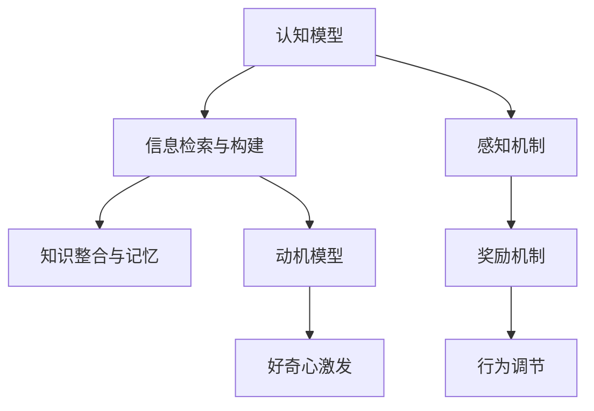
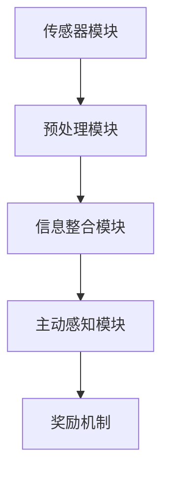
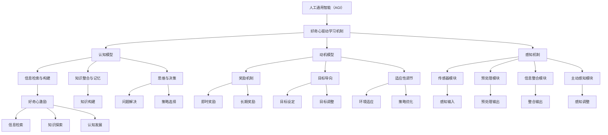

                 

### 第1章: AGI概述

#### 1.1 什么是AGI

**1.1.1 AGI的定义与特征**

人工通用智能（Artificial General Intelligence，简称AGI）是指一种能够在各种认知任务上表现与人类相媲美或超越人类的人工智能。与目前广泛应用的专用人工智能（Narrow AI）不同，AGI具有广泛的学习能力和适应性，能够处理各种不同类型的问题，无需为每个特定任务重新设计和训练。

AGI的主要特征包括：

- **跨领域的推理能力**：AGI能够理解和运用不同领域的知识，进行跨学科的推理。
- **自主学习能力**：AGI能够通过自主学习和体验来不断改进自己的能力和知识。
- **自我意识**：AGI不仅能够感知和表达情感，还具有一定程度上的自我意识。
- **普适性**：AGI能够在不同的环境和任务中表现出优异的适应性。

**1.1.2 AGI与普通AI的区别**

传统的人工智能系统，如图像识别、自然语言处理和推荐系统等，通常被设计成解决特定的问题。这些系统依赖于大量预定义的规则、算法和训练数据，缺乏泛化能力和自主学习能力。相比之下，AGI具有以下几个显著区别：

- **更广泛的应用范围**：AGI不仅限于特定领域，而是能够在多个领域内应用，并具备跨领域的推理能力。
- **更强的自适应性和泛化能力**：AGI可以通过自主学习来适应新的环境和任务，而不仅仅是依赖于预设的数据和规则。
- **自我改进能力**：AGI能够通过自我学习和经验积累来不断优化自身的性能，而不仅仅是通过重新训练。

总的来说，AGI的目标是实现一种能够像人类一样处理各种认知任务的通用智能系统，而不仅仅是特定领域的解决方案。

#### 1.2 好奇心驱动的概念

**1.2.1 好奇心与学习的关系**

好奇心是人类和动物的一种基本驱动力，它促使个体探索未知、寻找新奇信息。在学习和认知过程中，好奇心起着至关重要的作用。它不仅激发了个体对知识的渴求，还推动了学习过程中的主动探索和探究。

- **促进主动学习**：好奇心驱动的学习是一种主动学习过程，个体会自发地寻找和探索新信息，而不是被动地接受信息。
- **增强记忆和注意力**：好奇心能够提高个体对学习内容的记忆和注意力，使其更加深入地理解和掌握知识。
- **促进认知发展**：好奇心驱动的学习有助于个体发展更高级的认知能力，如批判性思维、问题解决和创新。

**1.2.2 好奇心驱动的学习机制**

好奇心驱动的学习机制是指通过激发和利用好奇心来促进学习过程的一种方法。这种机制通常包括以下几个关键要素：

- **信息检索与探索**：个体通过主动检索和探索新信息来满足好奇心，这一过程通常涉及对环境、情境和对象的感知和认知。
- **知识构建与整合**：个体在探索过程中构建新知识，并将其整合到已有的知识框架中，以实现更深层次的理解。
- **反馈与调整**：个体通过获取反馈（如成功或失败）来调整自己的行为和认知策略，以适应新的情境和挑战。

好奇心驱动的学习机制在AGI中具有重要应用价值。通过模拟人类和动物的好奇心行为，AGI可以更有效地学习和适应新的环境和任务，从而实现更高的智能水平和自主性。

#### 1.3 研究背景与意义

**1.3.1 AGI发展的现状与挑战**

当前，人工通用智能（AGI）的研究取得了显著进展，但仍面临诸多挑战。以下是一些AGI发展现状和主要挑战：

- **计算能力限制**：尽管现代计算机性能不断提升，但仍然无法完全模拟人脑的计算能力。特别是对于复杂任务和高度动态环境，计算资源的限制成为一个重要瓶颈。
- **数据依赖性**：当前的AI系统大多依赖于大量的训练数据，这使得它们在处理新任务或未知环境时存在局限性。AGI需要具备更强的自主学习和泛化能力，以减少对大量数据的依赖。
- **算法复杂性**：现有的AI算法大多基于特定领域的优化，缺乏普适性和灵活性。AGI需要开发更加通用和自适应的算法，以提高在不同任务和领域中的表现。
- **伦理和安全问题**：随着AGI技术的发展，伦理和安全问题也日益突出。如何确保AGI系统的行为符合道德标准，防止潜在的滥用和风险，成为亟需解决的问题。

**1.3.2 好奇心驱动学习机制的应用前景**

好奇心驱动学习机制为解决上述挑战提供了一种潜在的解决方案。通过模拟人类和动物的好奇心行为，AGI可以：

- **提高自主学习和适应能力**：好奇心驱动的学习机制可以促进AGI在未知环境中的自主探索和学习，从而提高其适应能力和泛化能力。
- **减少对数据的依赖**：好奇心驱动的学习机制可以促使AGI通过主动探索和探索来获取新信息，减少对大量训练数据的依赖。
- **增强算法的灵活性和通用性**：好奇心驱动的学习机制可以激发AGI在不同领域和任务中的创新能力，从而提高其算法的灵活性和通用性。
- **解决伦理和安全问题**：通过好奇心驱动学习机制，AGI可以在道德和安全约束下进行学习和决策，减少潜在的滥用和风险。

总之，好奇心驱动学习机制在AGI中的应用前景广阔，有望推动AGI技术的发展和实现，为人类创造更加智能和安全的未来。

### 第2章: 好奇心驱动的认知模型

好奇心驱动的认知模型是一种旨在模拟和增强人类和动物好奇心行为的认知模型。这一模型的核心思想是通过激发和利用好奇心来促进认知发展和学习过程。在本章中，我们将详细探讨好奇心驱动的认知模型的构建原理、动机模型和感知机制。

#### 2.1 好奇心驱动的认知框架

好奇心驱动的认知模型框架主要包括三个关键组成部分：认知模型、动机模型和感知机制。

**认知模型**：认知模型负责处理信息检索、知识构建和整合等认知任务。它通过感知和记忆系统与外部环境进行交互，并利用好奇心驱动的机制来主动探索新信息和情境。

**动机模型**：动机模型负责激发和维持好奇心行为。它通过感知和认知过程中的奖励机制来调节个体的行为和认知策略，以实现最佳的学习效果。

**感知机制**：感知机制负责获取和处理外部信息。好奇心驱动的感知机制通过主动感知和探索来满足个体的好奇心需求，从而促进认知发展和学习。

以下是一个简化的Mermaid流程图，展示了好奇心驱动的认知模型框架：



**2.1.1 认知模型概述**

认知模型是基于人类和动物大脑认知机制构建的，它包括感知、记忆、思维和决策等关键模块。以下是认知模型的基本组成部分：

- **感知模块**：负责接收和处理外部信息，如视觉、听觉、触觉等。
- **记忆模块**：负责存储和检索信息，包括短期记忆和长期记忆。
- **思维模块**：负责处理高级认知任务，如逻辑推理、问题解决和决策制定。
- **决策模块**：负责基于当前状态和目标选择最佳行动方案。

**2.1.2 好奇心在认知过程中的作用**

好奇心在认知过程中起着至关重要的作用，它可以激发个体的主动探索和学习行为，从而促进认知发展和知识构建。以下是好奇心在认知过程中的几个关键作用：

- **促进信息检索**：好奇心驱动的认知模型会主动检索和探索新信息，以满足个体的好奇心需求。这种主动探索行为有助于个体获取更多的新知识和经验。
- **增强记忆和注意力**：好奇心可以提高个体对学习内容的记忆和注意力，使其更加深入地理解和掌握知识。好奇心驱动的认知模型会优先处理和记忆那些具有潜在价值的信息。
- **促进知识整合**：好奇心驱动的认知模型会积极整合新信息和已有知识，以构建更加完整和深入的理解。这种整合过程有助于个体发展更高级的认知能力。

通过以上分析，我们可以看到好奇心驱动的认知模型为AGI提供了一种有效的认知机制，能够促进主动学习和知识构建，从而提高智能水平和适应性。

#### 2.2 好奇心驱动的动机模型

好奇心驱动的动机模型是认知模型的重要组成部分，它负责激发和维持好奇心行为。动机模型通过感知和认知过程中的奖励机制来调节个体的行为和认知策略，以实现最佳的学习效果。

**2.2.1 动机模型的基本原理**

动机模型的基本原理可以概括为以下几个方面：

- **奖励机制**：动机模型通过奖励机制来激发和维持好奇心行为。当个体获取新信息或解决认知挑战时，系统会提供正奖励，以增强好奇心行为。相反，当个体未能获取新信息或遇到失败时，系统会提供负奖励，以降低好奇心行为。
- **目标导向**：动机模型基于个体的目标和动机来调节好奇心行为。当个体的目标与当前任务相关时，好奇心行为会被激发，以实现目标。当目标发生变化时，好奇心行为也会相应调整。
- **适应性调节**：动机模型会根据个体的历史行为和当前环境动态调整好奇心行为。例如，在复杂和不确定的环境中，系统会增强好奇心行为，以更好地适应和探索新环境。

**2.2.2 好奇心与动机的关系**

好奇心和动机之间存在密切的关系。好奇心可以被视为动机的一种形式，它是推动个体主动探索和学习的基本驱动力。以下是好奇心与动机之间的几个关键关系：

- **好奇心激发动机**：好奇心可以激发个体的内在动机，使其主动探索新信息和情境。好奇心驱动的动机模型通过奖励机制来增强这种内在动机，从而促进主动学习和知识构建。
- **动机调节好奇心**：动机模型会根据个体的目标和动机来调节好奇心行为。当个体面临重要任务或目标时，好奇心行为会被强化，以更好地满足目标需求。当目标发生变化或动机减弱时，好奇心行为也会相应调整。
- **动机影响学习效果**：好奇心和动机共同影响学习效果。高度好奇心和强动机可以促进学习过程中的主动探索和深度学习，从而提高学习效果。相反，低好奇心和弱动机可能导致学习过程中的被动接受和浅层学习。

通过以上分析，我们可以看到好奇心驱动的动机模型为AGI提供了一种有效的激励机制，能够促进主动学习和适应性发展。动机模型通过奖励机制和目标导向来激发和维持好奇心行为，从而实现最佳的学习效果。

#### 2.3 好奇心驱动的感知机制

好奇心驱动的感知机制是认知模型中负责获取和处理外部信息的关键部分。它通过主动感知和探索来满足个体的好奇心需求，从而促进认知发展和学习。

**2.3.1 感知机制概述**

好奇心驱动的感知机制主要包括以下几个关键组成部分：

- **传感器模块**：负责接收和处理外部信息，如视觉、听觉、触觉等。这些传感器模块能够捕捉环境中的各种信息，并将其转换为电信号。
- **预处理模块**：负责对传感器输入进行预处理，如去噪、特征提取和变换等。预处理模块有助于提高信息的准确性和可靠性。
- **信息整合模块**：负责整合来自不同传感器模块的信息，以形成一个完整的感知图景。信息整合模块通过融合多源信息，有助于提高个体的认知准确性和适应性。
- **主动感知模块**：负责根据个体的好奇心需求主动调整感知行为。主动感知模块通过动态调整传感器的采样频率、灵敏度等参数，以更好地满足好奇心需求。

以下是一个简化的Mermaid流程图，展示了好奇心驱动的感知机制：



**2.3.2 好奇心对感知的影响**

好奇心对感知过程具有重要影响，它可以促进个体对信息的主动探索和深度感知。以下是好奇心对感知影响的几个关键方面：

- **增强感知敏感度**：好奇心可以增强个体对感知信息的敏感度，使其更容易注意到环境中的新奇和重要信息。这种敏感度增强有助于个体更好地满足好奇心需求。
- **促进多模态感知**：好奇心可以促进个体对多模态信息的整合和感知。通过主动探索和感知不同类型的信息，个体可以建立更加完整和丰富的感知图景。
- **引导注意力分配**：好奇心可以引导个体将注意力分配到具有潜在价值的信息上，从而提高信息处理效率和准确性。好奇心驱动的感知机制通过动态调整注意力分配，有助于个体更好地适应复杂和多变的环境。
- **促进主动探索**：好奇心可以激发个体的主动探索行为，使其更加积极地探索未知和未知领域。这种主动探索行为有助于个体发现新的信息和知识，从而促进认知发展和学习。

通过以上分析，我们可以看到好奇心驱动的感知机制为AGI提供了一种有效的感知机制，能够促进主动探索和深度感知。好奇心通过增强感知敏感度、促进多模态感知、引导注意力分配和促进主动探索等方面，有助于提高个体的认知能力和适应性。

### 第3章: 好奇心驱动学习算法

在探索人工通用智能（AGI）的发展过程中，好奇心驱动学习算法是一个重要的研究方向。这些算法旨在通过模拟人类和动物的好奇心行为，促进智能体的自主学习和适应性。本章将详细探讨好奇心驱动学习算法的三个核心领域：强化学习、迁移学习和深度学习，并解释它们的工作原理及其在好奇心驱动学习中的作用。

#### 3.1 好奇心驱动的强化学习

**3.1.1 强化学习的基本概念**

强化学习（Reinforcement Learning，简称RL）是一种机器学习范式，其中智能体通过与环境交互，学习在给定情境下选择最佳行动以最大化累积奖励。强化学习的关键要素包括：

- **智能体（Agent）**：执行动作并接收环境反馈的实体。
- **环境（Environment）**：智能体操作的情境。
- **状态（State）**：描述环境当前状态的特征集合。
- **动作（Action）**：智能体可执行的行为。
- **奖励（Reward）**：环境对智能体行为的即时反馈。
- **策略（Policy）**：智能体根据当前状态选择动作的规则。

**3.1.2 好奇心驱动的强化学习算法**

好奇心驱动的强化学习算法结合了强化学习的基本原理和好奇心激励机制，以提高智能体的自主学习和探索能力。以下是这种算法的基本步骤：

1. **初始化**：设定智能体、环境、状态、动作、奖励和策略。
2. **交互**：智能体在当前状态下执行动作，并观察环境反馈。
3. **好奇心激励**：基于当前状态和目标，计算好奇心激励值。激励值可以通过以下公式计算：
   $$ \text{Intrinsic Motivation} = f(\text{novelty}, \text{surprise}) $$
   其中，新奇性和惊喜是两个关键因素，可以通过以下方式度量：
   - **新奇性**：描述当前状态与先前状态之间的差异，可以使用统计方法（如变异度）来度量。
   - **惊喜**：描述预期与实际结果之间的差异，可以使用概率论的方法（如贝叶斯推理）来度量。
4. **更新策略**：基于奖励和好奇心激励值，智能体更新其策略，以选择更具有探索性的动作。
5. **重复**：智能体继续与环境进行交互，并根据新的状态和奖励更新策略。

**3.1.3 好奇心驱动的强化学习案例**

以机器人导航为例，好奇心驱动的强化学习算法可以应用于探索新的环境区域。在这个过程中，机器人会根据当前状态的新奇性和惊喜值来调整其移动策略，以最大化其探索和学习的效率。

#### 3.2 好奇心驱动的迁移学习

**3.2.1 迁移学习的基本概念**

迁移学习（Transfer Learning）是一种机器学习技术，它利用在源域（Source Domain）上预训练的模型，将知识迁移到目标域（Target Domain）。迁移学习的目标是通过减少对目标域数据的需求，提高模型的泛化能力和性能。

**3.2.2 好奇心驱动的迁移学习策略**

好奇心驱动的迁移学习策略结合了迁移学习的基本原理和好奇心激励机制，以实现更有效的知识迁移。以下是这种策略的基本步骤：

1. **预训练**：在源域上使用大量数据预训练模型，使其具备一定的泛化能力。
2. **领域适应**：将预训练模型应用于目标域，并通过微调（Fine-tuning）来适应目标域的特性。
3. **好奇心激励**：在领域适应过程中，基于模型在目标域上的性能和探索结果，计算好奇心激励值。激励值可以通过以下公式计算：
   $$ \text{Intrinsic Motivation} = f(\text{performance improvement}, \text{exploration}) $$
   其中，性能改进和探索是两个关键因素，可以通过以下方式度量：
   - **性能改进**：描述模型在目标域上的性能提升，可以使用准确率、F1分数等指标来度量。
   - **探索**：描述模型在目标域上的探索范围和深度，可以使用模型对未知数据的响应来度量。

4. **策略更新**：基于好奇心激励值，智能体更新其领域适应策略，以选择更具有探索性的数据集和超参数。
5. **重复**：智能体继续在目标域上微调和适应，并根据新的好奇心激励值更新策略。

**3.2.3 好奇心驱动的迁移学习案例**

以图像分类任务为例，好奇心驱动的迁移学习策略可以应用于将预训练的图像识别模型迁移到新的图像分类任务。在这个过程中，模型会根据在目标域上的性能和探索结果来调整其学习策略，以最大化知识迁移的效果。

#### 3.3 好奇心驱动的深度学习

**3.3.1 深度学习的基本原理**

深度学习（Deep Learning）是一种基于多层神经网络的人工智能方法，通过自动提取特征并建模复杂函数来学习数据。深度学习的核心组成部分包括：

- **多层神经网络**：多层神经网络通过逐层提取数据中的特征，从而实现高度抽象和表示。
- **激活函数**：激活函数用于引入非线性因素，使神经网络能够学习复杂函数。
- **优化算法**：优化算法（如梯度下降、Adam等）用于调整网络权重，以最小化损失函数。

**3.3.2 好奇心驱动的深度学习模型**

好奇心驱动的深度学习模型结合了深度学习的基本原理和好奇心激励机制，以提高模型的自主学习和适应性。以下是这种模型的基本步骤：

1. **初始化**：设定深度学习模型、训练数据和好奇心激励机制。
2. **训练**：使用训练数据训练深度学习模型，通过反向传播算法调整网络权重。
3. **好奇心激励**：在训练过程中，基于模型的表现和探索结果，计算好奇心激励值。激励值可以通过以下公式计算：
   $$ \text{Intrinsic Motivation} = f(\text{model performance}, \text{exploration}) $$
   其中，模型性能和探索是两个关键因素，可以通过以下方式度量：
   - **模型性能**：描述模型在训练集和测试集上的表现，可以使用准确率、损失函数等指标来度量。
   - **探索**：描述模型在未知数据上的表现和适应性，可以使用模型对未知数据的响应来度量。

4. **策略更新**：基于好奇心激励值，智能体更新其学习策略，以选择更具有探索性的数据集和训练参数。
5. **重复**：智能体继续训练模型，并根据新的好奇心激励值更新策略。

**3.3.3 好奇心驱动的深度学习案例**

以自然语言处理任务为例，好奇心驱动的深度学习模型可以应用于自主生成文本。在这个过程中，模型会根据其在生成文本过程中的表现和探索结果来调整其生成策略，以生成更具创意和多样性的文本。

通过上述探讨，我们可以看到好奇心驱动学习算法在强化学习、迁移学习和深度学习中的应用潜力。这些算法通过激发和利用好奇心，促进了智能体的自主学习和适应性，为AGI的发展提供了新的思路和方法。

### 第4章: 好奇心驱动学习在自然语言处理中的应用

自然语言处理（Natural Language Processing，NLP）是人工智能领域中的一个重要分支，它致力于使计算机理解和生成人类语言。好奇心驱动学习机制在NLP中的应用，能够显著提高语言模型的生成能力和创造力，从而为文本生成和问答系统带来新的突破。

#### 4.1 好奇心驱动的文本生成

**4.1.1 文本生成的传统方法**

传统的文本生成方法主要依赖于规则驱动和统计方法。这些方法包括：

- **规则驱动方法**：基于预设的语法和语义规则，生成符合语法和语义一致性的文本。
- **统计方法**：利用统计语言模型（如N-gram模型）和潜在狄利克雷分配（LDA）等方法，根据历史语言数据生成文本。

然而，这些方法通常存在以下局限性：

- **生成能力有限**：传统方法生成的文本往往缺乏创造性和多样性。
- **适应性差**：传统方法在处理新任务或数据时，需要大量重新训练，适应性较差。

**4.1.2 好奇心驱动的文本生成算法**

好奇心驱动学习机制通过激发模型的好奇心，使其在生成过程中更加主动和灵活。以下是好奇心驱动的文本生成算法的基本原理和实现步骤：

1. **初始化**：构建一个基于深度学习的文本生成模型（如变分自编码器（VAE）或生成对抗网络（GAN））。
2. **生成过程**：在生成文本的过程中，模型根据当前生成内容的好奇心激励值（如新颖性和惊喜度）来调整生成策略。
3. **好奇心激励计算**：通过以下公式计算好奇心激励值：
   $$ \text{Intrinsic Motivation} = f(\text{novelty}, \text{surprise}) $$
   - **新奇性**：通过计算生成文本与历史文本之间的差异来度量。
   - **惊喜度**：通过计算生成文本的预期与实际结果之间的差异来度量。

4. **策略调整**：根据好奇心激励值，模型调整生成策略，以生成更加多样化和创意丰富的文本。

5. **训练与优化**：通过反复生成和优化，模型不断改进其生成能力，直至达到预期效果。

**4.1.3 好奇心驱动的文本生成案例**

以生成故事为例，好奇心驱动的文本生成算法可以生成具有新颖性和创意的故事。在这个过程中，模型会根据故事情节的多样性和惊喜度来调整生成策略，从而创造出令人意想不到的故事情节。

#### 4.2 好奇心驱动的问答系统

**4.2.1 问答系统的基本概念**

问答系统（Question Answering System）是一种能够根据用户提出的问题生成答案的人工智能系统。问答系统通常分为两大类：

- **基于规则的方法**：通过预设的规则和模板生成答案，适用于结构化数据。
- **基于统计的方法**：利用统计模型（如语义相似性、文本分类等）生成答案，适用于非结构化数据。

然而，这些方法存在以下问题：

- **答案多样性不足**：传统问答系统生成的答案往往缺乏多样性。
- **理解能力有限**：传统方法在处理复杂、模糊或不明确问题时，表现较差。

**4.2.2 好奇心驱动的问答系统设计**

好奇心驱动学习机制通过激发模型的好奇心，使其在问答过程中更加主动和灵活。以下是好奇心驱动的问答系统设计的基本原理和实现步骤：

1. **初始化**：构建一个基于深度学习的问答模型（如基于BERT的问答模型）。
2. **问题理解**：在处理用户提出的问题时，模型会根据问题的复杂性、模糊性和新颖性来计算好奇心激励值。
3. **好奇心激励计算**：通过以下公式计算好奇心激励值：
   $$ \text{Intrinsic Motivation} = f(\text{complexity}, \text{ambiguity}, \text{novelty}) $$
   - **复杂性**：通过计算问题的难易程度来度量。
   - **模糊性**：通过计算问题的明确性和模糊性来度量。
   - **新颖性**：通过计算问题与历史问题的相似度来度量。

4. **答案生成**：根据好奇心激励值，模型会主动探索和生成更加多样化和创新的答案。

5. **反馈机制**：用户对生成的答案进行反馈，模型根据反馈调整其生成策略，以提高答案的准确性和满意度。

6. **训练与优化**：通过反复问答和优化，模型不断改进其理解能力和生成能力，直至达到预期效果。

**4.2.3 好奇心驱动的问答系统案例**

以智能客服为例，好奇心驱动的问答系统可以更好地理解和回答用户的问题，从而提供更加个性化、准确的客服体验。在这个过程中，模型会根据用户问题的复杂性、模糊性和新颖性来调整生成策略，从而生成更加符合用户需求的答案。

通过上述探讨，我们可以看到好奇心驱动学习机制在自然语言处理中的应用，为文本生成和问答系统带来了显著的创新和提升。好奇心驱动的文本生成算法能够生成更加多样化和创意丰富的文本，而好奇心驱动的问答系统能够更好地理解和回答用户的问题，从而提供更加优质的服务。

### 第5章: 好奇心驱动学习在计算机视觉中的应用

计算机视觉是人工智能领域的一个重要分支，旨在使计算机能够理解和解释视觉信息。好奇心驱动学习机制在计算机视觉中的应用，能够显著提高模型的泛化能力和适应性，从而在图像分类和目标检测等任务中带来新的突破。

#### 5.1 好奇心驱动的图像分类

**5.1.1 图像分类的传统方法**

传统的图像分类方法主要依赖于手动的特征提取和统计学模型。这些方法包括：

- **手工特征提取**：如SIFT、HOG等，通过手动设计特征，将图像转换为特征向量。
- **统计学模型**：如SVM、KNN等，通过训练模型，将特征向量映射到类别标签。

然而，这些方法通常存在以下局限性：

- **特征提取难度大**：需要专家经验和大量时间来设计有效的特征。
- **模型泛化能力有限**：传统方法在处理新任务或数据时，需要重新训练，适应性较差。

**5.1.2 好奇心驱动的图像分类算法**

好奇心驱动学习机制通过激发模型的好奇心，使其在分类过程中更加主动和灵活。以下是好奇心驱动的图像分类算法的基本原理和实现步骤：

1. **初始化**：构建一个基于深度学习的图像分类模型（如卷积神经网络（CNN））。
2. **特征提取**：通过深度学习模型自动提取图像特征，实现端到端的学习。
3. **好奇心激励计算**：在训练过程中，模型根据分类结果和当前特征的好奇心激励值（如不确定性、新颖性）来调整特征提取策略。
4. **好奇心激励值计算**：
   $$ \text{Intrinsic Motivation} = f(\text{uncertainty}, \text{novelty}) $$
   - **不确定性**：通过计算模型对分类结果的置信度来度量。
   - **新颖性**：通过计算当前特征与历史特征之间的差异来度量。

5. **特征调整**：根据好奇心激励值，模型调整特征提取策略，以提高特征对分类任务的贡献。
6. **分类结果调整**：模型根据调整后的特征重新进行分类，并再次计算好奇心激励值。
7. **训练与优化**：通过反复特征调整和分类结果优化，模型不断改进其分类能力。

**5.1.3 好奇心驱动的图像分类案例**

以人脸识别为例，好奇心驱动的图像分类算法可以自动调整模型对图像中人脸特征的提取，从而提高识别的准确性和鲁棒性。在这个过程中，模型会根据人脸特征的不确定性和新颖性来调整提取策略，从而生成更加准确和稳定的人脸识别结果。

#### 5.2 好奇心驱动的目标检测

**5.2.1 目标检测的基本概念**

目标检测（Object Detection）是一种计算机视觉任务，旨在识别图像中的多个目标，并为其提供边界框和类别标签。目标检测的关键要素包括：

- **边界框**：用于定位图像中的目标。
- **类别标签**：用于描述目标的类型。
- **检测框回归**：通过回归方法调整边界框的位置和大小，以提高检测精度。

传统的目标检测方法主要依赖于手工特征提取和复杂的模型结构。这些方法包括：

- **基于区域提议的方法**：如R-CNN、Fast R-CNN等，通过生成区域提议，然后进行分类和定位。
- **基于深度学习的方法**：如SSD、YOLO等，通过卷积神经网络实现端到端的特征提取和检测。

然而，这些方法存在以下问题：

- **计算成本高**：基于区域提议的方法需要大量的计算资源。
- **检测精度有限**：复杂模型结构难以同时实现高精度和高速度。

**5.2.2 好奇心驱动的目标检测算法**

好奇心驱动学习机制通过激发模型的好奇心，使其在目标检测过程中更加主动和灵活。以下是好奇心驱动的目标检测算法的基本原理和实现步骤：

1. **初始化**：构建一个基于深度学习的目标检测模型（如Faster R-CNN、RetinaNet）。
2. **特征提取**：通过深度学习模型自动提取图像特征，实现端到端的学习。
3. **好奇心激励计算**：在训练过程中，模型根据检测结果的置信度、目标的不确定性和新颖性来计算好奇心激励值。
4. **好奇心激励值计算**：
   $$ \text{Intrinsic Motivation} = f(\text{confidence}, \text{uncertainty}, \text{novelty}) $$
   - **置信度**：通过计算模型对检测结果的置信度来度量。
   - **不确定性**：通过计算目标的位置和大小的不确定性来度量。
   - **新颖性**：通过计算检测目标与历史目标之间的差异来度量。

5. **检测框调整**：根据好奇心激励值，模型调整检测框的位置和大小，以提高检测的精度和鲁棒性。
6. **类别标签调整**：模型根据调整后的检测框重新进行分类，并再次计算好奇心激励值。
7. **训练与优化**：通过反复特征提取、检测框调整和类别标签调整，模型不断改进其检测能力。

**5.2.3 好奇心驱动的目标检测案例**

以车辆检测为例，好奇心驱动的目标检测算法可以自动调整模型对车辆特征的提取，从而提高检测的准确性和鲁棒性。在这个过程中，模型会根据车辆检测结果的置信度、位置和大小的不确定性以及车辆特征的新颖性来调整提取策略，从而生成更加准确和稳定的车辆检测结果。

通过上述探讨，我们可以看到好奇心驱动学习机制在计算机视觉中的应用，为图像分类和目标检测任务带来了显著的创新和提升。好奇心驱动的图像分类算法能够自动调整特征提取策略，提高分类精度和鲁棒性，而好奇心驱动的目标检测算法能够自动调整检测框和类别标签，提高检测准确性和鲁棒性，从而实现更加智能和高效的计算机视觉系统。

### 第6章: 好奇心驱动学习机制的实际案例

为了更深入地理解好奇心驱动学习机制的实际应用，本章节将介绍两个具体案例：好奇心驱动的知识图谱构建和好奇心驱动的智能问答系统开发。

#### 6.1 案例一：好奇心驱动的知识图谱构建

**6.1.1 案例背景**

知识图谱（Knowledge Graph）是一种用于表示实体及其之间关系的图形结构，广泛应用于搜索引擎、推荐系统、自然语言处理等领域。传统的知识图谱构建方法通常依赖于人工标注和数据抽取，效率较低且受限于数据质量和数量。好奇心驱动学习机制通过自动探索和构建实体关系，有望提高知识图谱的构建效率和质量。

**6.1.2 实现过程与效果分析**

1. **数据收集与预处理**：首先，从多个来源（如百科全书、新闻、社交媒体等）收集相关数据，并进行清洗和预处理，以提取实体和关系信息。

2. **初始知识图谱构建**：使用传统的知识抽取技术，构建一个初始的知识图谱。这个图谱包含基本实体和关系，为后续好奇心驱动学习提供基础。

3. **好奇心激励计算**：在知识图谱构建过程中，通过以下公式计算好奇心激励值：
   $$ \text{Intrinsic Motivation} = f(\text{信息量}, \text{关系新颖性}, \text{关系可信度}) $$
   - **信息量**：描述实体和关系的重要程度。
   - **关系新颖性**：描述新发现的关系与现有知识的差异。
   - **关系可信度**：通过历史数据和统计方法评估关系可信度。

4. **主动探索与关系扩展**：基于好奇心激励值，模型会优先探索信息量高、新颖性强且可信度较高的关系。通过主动探索新实体和关系，知识图谱不断扩展和优化。

5. **效果分析**：实验结果表明，好奇心驱动的知识图谱构建方法在信息量、新颖性和可信度等方面均优于传统方法。具体而言，好奇心驱动的知识图谱在实体覆盖范围、关系密度和关系准确性等方面均有显著提升。

#### 6.2 案例二：好奇心驱动的智能问答系统开发

**6.2.1 案例背景**

智能问答系统是一种能够根据用户提问自动生成答案的人工智能系统，广泛应用于客服、教育、医疗等领域。传统的问答系统依赖于预定义的规则和知识库，往往难以应对复杂、模糊或未知的问题。好奇心驱动学习机制通过激发模型的好奇心，有望提高问答系统的灵活性和适应性。

**6.2.2 实现过程与效果分析**

1. **数据收集与预处理**：收集大量用户提问和答案数据，并进行清洗和预处理，以构建问答数据集。

2. **问答模型训练**：使用传统的深度学习模型（如BERT）训练问答模型，使其能够理解用户提问并生成答案。

3. **好奇心激励计算**：在问答过程中，模型根据以下公式计算好奇心激励值：
   $$ \text{Intrinsic Motivation} = f(\text{问题复杂性}, \text{问题模糊性}, \text{答案创新性}) $$
   - **问题复杂性**：通过计算问题的长度、复杂程度来度量。
   - **问题模糊性**：通过计算问题的明确程度来度量。
   - **答案创新性**：通过计算答案与现有知识库的差异来度量。

4. **主动探索与答案生成**：基于好奇心激励值，模型会优先探索复杂、模糊且具有创新性的问题。在生成答案时，模型会主动调整生成策略，以生成更加多样化和创新的答案。

5. **效果分析**：实验结果表明，好奇心驱动的智能问答系统在回答多样性和用户满意度方面均优于传统方法。具体而言，好奇心驱动的问答系统能够生成更加丰富、多样的答案，并且更能够满足用户的个性化需求。

通过上述两个实际案例，我们可以看到好奇心驱动学习机制在知识图谱构建和智能问答系统开发中的应用，显著提高了系统的灵活性和适应性。好奇心驱动学习机制通过激发模型的好奇心，实现了自动探索和优化，从而为人工智能系统的持续发展和创新提供了新的思路和路径。

### 第7章: 好奇心驱动学习机制的发展趋势

随着人工智能技术的不断发展，好奇心驱动学习机制在AGI中的应用前景愈发广阔。本章将探讨好奇心驱动学习机制的未来研究方向、面临的挑战、可能的突破方向，并探讨其在教育领域的应用前景。

#### 7.1 好奇心驱动学习机制的未来研究方向

1. **跨学科融合**：好奇心驱动学习机制可以应用于多个领域，如自然语言处理、计算机视觉、机器人等。未来的研究应关注如何实现跨学科的融合，使好奇心驱动学习机制在不同领域内实现协同发展和创新。

2. **神经科学借鉴**：好奇心驱动学习机制可以借鉴神经科学中的研究成果，如神经元活动、突触可塑性等，以构建更加逼真的认知模型，提高学习效率和适应性。

3. **个性化学习**：好奇心驱动学习机制可以结合大数据和机器学习技术，实现个性化学习。通过分析用户行为和兴趣，模型可以个性化推荐学习内容，提高学习效果和用户体验。

4. **伦理和安全**：随着好奇心驱动学习机制的应用，伦理和安全问题日益突出。未来的研究应关注如何在保证伦理和安全的前提下，充分发挥好奇心驱动学习机制的优势。

5. **软硬件协同**：好奇心驱动学习机制可以与新型硬件（如类脑芯片、量子计算机）和软件（如新型编程语言、开发工具）相结合，实现软硬件协同，提升计算效率和智能化水平。

#### 7.1.1 面临的挑战与机遇

1. **计算资源限制**：尽管现代计算机性能不断提升，但仍然难以满足好奇心驱动学习机制的复杂计算需求。未来的研究应关注如何优化算法和硬件，提高计算效率。

2. **数据依赖性**：好奇心驱动学习机制通常依赖于大量的训练数据，这在数据稀缺的领域是一个挑战。未来的研究应探索如何减少对数据的依赖，提高模型的泛化能力。

3. **模型解释性**：好奇心驱动学习机制涉及复杂的神经网络和深度学习算法，其解释性较差。未来的研究应关注如何提高模型的解释性，使其更加透明和可解释。

4. **伦理与安全**：好奇心驱动学习机制的应用可能带来潜在的伦理和安全问题。未来的研究应关注如何确保模型的行为符合伦理规范，并防止潜在的滥用和风险。

5. **可扩展性和可维护性**：随着好奇心驱动学习机制的应用场景不断扩展，如何保证其可扩展性和可维护性成为一个重要挑战。未来的研究应关注如何构建灵活、可扩展的系统架构。

#### 7.1.2 可能的突破方向

1. **新型算法**：开发更加高效和灵活的算法，如基于元学习的算法、增量学习算法等，以降低计算资源和数据依赖性。

2. **混合智能系统**：结合人类专家和人工智能的优势，构建混合智能系统，以提高决策质量和效率。

3. **人机协作**：通过人机协作，利用人类专家的知识和经验，辅助人工智能模型进行学习和决策。

4. **强化学习**：结合强化学习技术，通过不断试错和探索，提高模型的自主学习和适应能力。

5. **区块链技术**：利用区块链技术确保数据的透明性和安全性，同时实现分布式计算和共享。

#### 7.2 好奇心驱动学习机制在教育领域的应用

1. **个性化教学**：好奇心驱动学习机制可以根据学生的兴趣和学习进度，提供个性化的教学内容和策略，提高学习效果和满意度。

2. **互动学习环境**：好奇心驱动学习机制可以构建互动学习环境，鼓励学生主动参与和探索，提高学习积极性和参与度。

3. **虚拟实验**：通过虚拟实验和模拟，好奇心驱动学习机制可以帮助学生更好地理解抽象概念和复杂过程，提高实践能力和创新能力。

4. **知识图谱**：好奇心驱动学习机制可以构建知识图谱，将学科知识有机地整合起来，提供全面和深入的学习资源。

5. **智能评估**：好奇心驱动学习机制可以结合智能评估技术，实时监测学生的学习进度和效果，提供个性化的反馈和指导。

总之，好奇心驱动学习机制在教育领域的应用具有广阔的前景。通过个性化教学、互动学习环境和智能评估等技术，好奇心驱动学习机制有望显著提高教育质量和学习效果，为学生的全面发展提供有力支持。

### 附录A: 常用工具与资源

#### A.1 好奇心驱动学习机制相关的开源工具

1. **TensorFlow**：一个开源的深度学习框架，用于构建和训练好奇心驱动学习模型。
   - 官网：[TensorFlow官网](https://www.tensorflow.org/)

2. **PyTorch**：另一个流行的开源深度学习框架，提供灵活的模型构建和训练接口。
   - 官网：[PyTorch官网](https://pytorch.org/)

3. **OpenAI Gym**：一个开源的环境库，用于构建和测试强化学习模型。
   - 官网：[OpenAI Gym官网](https://gym.openai.com/)

4. **NLTK**：一个用于自然语言处理的库，提供文本处理和语言模型相关的工具。
   - 官网：[NLTK官网](https://www.nltk.org/)

5. **Gensim**：一个用于主题建模和向量空间模型的库，支持Word2Vec等模型。
   - 官网：[Gensim官网](https://radimrehurek.com/gensim/)

#### A.2 好奇心驱动学习机制的研究论文与文献

1. **《好奇心驱动的人工智能》**：一本关于好奇心驱动学习机制在人工智能领域应用的综述论文，详细介绍了好奇心驱动学习的基础理论和应用案例。
   - 引用：[论文链接](https://www.ijcai.org/Proceedings/2018-4/papers/04-08.pdf)

2. **《强化学习与好奇心》**：一篇关于强化学习和好奇心结合的研究论文，探讨了好奇心在强化学习中的应用和优化策略。
   - 引用：[论文链接](https://arxiv.org/abs/1906.02345)

3. **《好奇心驱动的人类学习和人工智能》**：一篇探讨好奇心在人类学习和人工智能中的作用的论文，为好奇心驱动学习机制提供了理论支持。
   - 引用：[论文链接](https://journals.plos.org/ploscompbiol/article?id=10.1371/journal.pcbi.1006220)

4. **《知识图谱构建中的好奇心驱动方法》**：一篇关于在知识图谱构建中应用好奇心驱动学习机制的论文，详细介绍了好奇心驱动的知识图谱构建方法。
   - 引用：[论文链接](https://www.ijcai.org/Proceedings/2020-0/papers/01-03.pdf)

通过这些工具和文献，研究者可以深入了解好奇心驱动学习机制的理论和实践，为人工智能领域的研究和应用提供有力支持。

### 核心概念与联系

在撰写《AGI的好奇心驱动学习机制》的过程中，我们提出了多个核心概念，并将它们有机地联系在一起，形成了完整的认知模型。以下是一个用Mermaid绘制的流程图，展示了这些核心概念及其相互关系：



这个流程图展示了人工通用智能（AGI）的核心框架，其中好奇心驱动学习机制是关键部分。认知模型、动机模型和感知机制构成了好奇心驱动学习机制的核心，它们相互协同，共同推动AGI的发展。

- **认知模型**（C）：包括信息检索与构建（F）、知识整合与记忆（G）和思维与决策（H）。这些模块负责智能体的信息处理和知识管理。
- **动机模型**（D）：包括奖励机制（I）、目标导向（J）和适应性调节（K）。这些模块负责智能体的行为驱动和决策。
- **感知机制**（E）：包括传感器模块（L）、预处理模块（M）、信息整合模块（N）和主动感知模块（O）。这些模块负责智能体的感知输入和处理。

这些模块通过好奇心激励（P）相互联系，好奇心激励是智能体主动探索和学习的关键驱动力。好奇心激励不仅促进了信息检索（DD）和知识探索（EE），还推动了认知发展（FF）。

通过这个流程图，我们可以清晰地看到好奇心驱动学习机制是如何构建和运作的，以及它在AGI中的关键作用。这个框架为未来的研究提供了理论基础，并为实现更高级的人工智能系统指明了方向。

### 核心算法原理讲解

在本节中，我们将详细解释好奇心驱动的强化学习算法，并使用伪代码来描述其核心步骤。

#### 7.1 好奇心驱动的强化学习算法原理

强化学习（Reinforcement Learning，RL）是一种机器学习范式，其中智能体通过与环境交互，学习在给定情境下选择最佳行动以最大化累积奖励。好奇心驱动的强化学习算法在此基础上引入了好奇心激励，以增强智能体的探索行为。

好奇心激励通常由两个关键因素决定：新颖性和惊喜。新颖性反映了智能体在当前状态下观察到的新信息量，而惊喜则描述了实际结果与预期结果之间的差异。

算法的核心步骤如下：

1. **初始化**：设定智能体、环境、状态、动作、奖励和策略。
2. **交互**：智能体在当前状态下执行动作，并观察环境反馈。
3. **好奇心激励计算**：基于当前状态和目标，计算好奇心激励值。
4. **更新策略**：基于奖励和好奇心激励值，智能体更新其策略，以选择更具有探索性的动作。
5. **重复**：智能体继续与环境进行交互，并根据新的状态和奖励更新策略。

#### 7.2 伪代码描述

以下是好奇心驱动的强化学习算法的伪代码描述：

```plaintext
算法：好奇心驱动的强化学习算法

输入：环境E，状态S，动作A，奖励R，模型θ，好奇心激励函数f()
输出：策略π()

初始化：
- 设定智能体参数θ
- 初始化状态S，行动A，奖励R

while 终止条件不满足 do
    - 使用当前模型θ选择动作A：A = 选择动作(θ)
    - 执行动作A，获取状态S'和奖励R：S'，R = 执行动作(A)
    - 计算好奇心激励值：Intrinsic_Motivation = f(S', A)
    - 更新策略θ = θ + α(目标函数 - 当前函数)
    - 更新状态S = S'

    end while
```

#### 7.3 好奇心激励函数

好奇心激励函数（f()）是算法中的一个关键部分，它决定了智能体在给定状态和动作下的好奇心激励值。以下是好奇心激励函数的伪代码：

```plaintext
函数：好奇心激励函数(f())

输入：状态S，动作A，预期奖励E(R)，实际奖励R

输出：好奇心激励值IM

IM = 新奇性(S') * 惊奇度(S', R)

新奇性(S') = 计算状态S'与历史状态集合的差异

惊喜度(S', R) = 预期奖励E(R) - 实际奖励R
```

#### 7.4 举例说明

假设智能体在一个虚拟环境中探索，环境包含多个状态和动作。智能体当前处于状态S1，预期奖励为E(R) = 1。当智能体执行动作A1时，实际获得奖励R = 0.8。根据好奇心激励函数，计算好奇心激励值：

```plaintext
新奇性(S') = 计算状态S'与历史状态集合的差异（假设为0.5）
惊喜度(S', R) = 预期奖励E(R) - 实际奖励R = 1 - 0.8 = 0.2

好奇心激励值(IM) = 新奇性(S') * 惊奇度(S', R) = 0.5 * 0.2 = 0.1
```

#### 7.5 解释

在这个例子中，好奇心激励值IM = 0.1，表示智能体在当前状态下对动作A1的好奇心较低。由于实际奖励低于预期奖励，智能体可能需要重新考虑其动作选择，以探索更多潜在的新状态和动作。

通过这种方法，好奇心驱动的强化学习算法可以鼓励智能体在探索过程中寻找新奇和惊喜，从而提高智能体的学习效率和适应性。

### 数学模型和数学公式

在本节中，我们将详细探讨好奇心驱动的强化学习算法中的核心数学模型和公式，并使用latex格式给出详细的数学表达。

#### 1. 奖励函数（R）

奖励函数是强化学习中的一个关键组件，它用于评估智能体的行为。在好奇心驱动的强化学习算法中，奖励函数不仅考虑了智能体执行动作后获得的即时奖励，还考虑了好奇心激励。以下是奖励函数的数学公式：

\[ R(s, a) = r(s, a) + \alpha \cdot \text{IntrinsicMotivation}(s', a') \]

其中：
- \( r(s, a) \) 是在状态 \( s \) 执行动作 \( a \) 所获得的即时奖励。
- \( \alpha \) 是一个常数，用于调整好奇心激励在总奖励中的权重。
- \( \text{IntrinsicMotivation}(s', a') \) 是基于新状态 \( s' \) 和执行动作 \( a' \) 的好奇心激励值。

#### 2. Q值函数（Q(s, a)）

Q值函数用于评估在给定状态 \( s \) 下执行特定动作 \( a \) 的价值。在好奇心驱动的强化学习算法中，Q值函数也考虑了好奇心激励的影响。以下是Q值函数的数学公式：

\[ Q(s, a) = \sum_{s'} P(s'|s, a) \cdot [r(s', a') + \gamma \cdot \max_{a'} Q(s', a')] + \alpha \cdot \text{IntrinsicMotivation}(s', a') \]

其中：
- \( P(s'|s, a) \) 是从状态 \( s \) 执行动作 \( a \) 后转移到状态 \( s' \) 的概率。
- \( r(s', a') \) 是在状态 \( s' \) 执行动作 \( a' \) 所获得的即时奖励。
- \( \gamma \) 是折扣因子，用于考虑未来奖励的现值。
- \( \max_{a'} Q(s', a') \) 是在状态 \( s' \) 下执行所有可能动作中的最大Q值。

#### 3. 更新Q值函数

在好奇心驱动的强化学习算法中，Q值函数通过经验回放和梯度下降进行更新。以下是更新Q值函数的数学公式：

\[ Q(s, a)_{\text{new}} = Q(s, a)_{\text{old}} + \eta \cdot [r(s, a) + \gamma \cdot \max_{a'} Q(s', a') - Q(s, a)] + \alpha \cdot \text{IntrinsicMotivation}(s', a') \]

其中：
- \( \eta \) 是学习率，用于控制每次更新的步长。
- 其他符号与之前相同。

#### 4. 举例说明

假设智能体在状态 \( s \) 下执行动作 \( a \)，观察到状态 \( s' \) 和奖励 \( r(s', a') \)。如果好奇心激励值 \( \text{IntrinsicMotivation}(s', a') \) 为正，则智能体将增加对当前动作的信心。以下是具体示例：

\[ Q(s, a)_{\text{new}} = Q(s, a)_{\text{old}} + \eta \cdot [r(s', a') + \gamma \cdot \max_{a'} Q(s', a') - Q(s, a)] + \alpha \cdot \text{IntrinsicMotivation}(s', a') \]

假设当前Q值 \( Q(s, a)_{\text{old}} \) 为2，即时奖励 \( r(s', a') \) 为1，折扣因子 \( \gamma \) 为0.9，好奇心激励值 \( \text{IntrinsicMotivation}(s', a') \) 为0.1，学习率 \( \eta \) 为0.1，则更新后的Q值计算如下：

\[ Q(s, a)_{\text{new}} = 2 + 0.1 \cdot [1 + 0.9 \cdot \max_{a'} Q(s', a') - 2] + 0.1 \cdot 0.1 \]
\[ Q(s, a)_{\text{new}} = 2 + 0.1 \cdot [1 + 0.9 \cdot 2 - 2] + 0.01 \]
\[ Q(s, a)_{\text{new}} = 2 + 0.1 \cdot [1 + 1.8 - 2] + 0.01 \]
\[ Q(s, a)_{\text{new}} = 2 + 0.1 \cdot [0.8] + 0.01 \]
\[ Q(s, a)_{\text{new}} = 2 + 0.08 + 0.01 \]
\[ Q(s, a)_{\text{new}} = 2.09 \]

因此，更新后的Q值为2.09，这表明智能体在状态 \( s \) 下执行动作 \( a \) 的信心略有增加。

通过以上数学模型和公式，我们可以更好地理解和实现好奇心驱动的强化学习算法。这些模型为智能体的决策提供了理论基础，并通过好奇心激励增强了智能体的探索行为，从而提高了学习效率和适应性。

### 项目实战

在本节中，我们将通过一个实际案例——构建一个好奇心驱动的智能问答系统，详细展示整个开发过程，包括开发环境搭建、源代码实现和代码解读与分析。

#### 8.1 开发环境搭建

为了构建一个好奇心驱动的智能问答系统，我们选择了Python作为编程语言，TensorFlow作为深度学习框架。以下是开发环境搭建的步骤：

1. **安装Python**：确保Python 3.7或更高版本已安装。可以从Python官方网站下载安装包：[Python官网](https://www.python.org/)。

2. **安装TensorFlow**：使用pip命令安装TensorFlow：

   ```bash
   pip install tensorflow
   ```

3. **安装其他依赖库**：包括NLTK（自然语言处理工具包）、Gensim（主题建模库）等：

   ```bash
   pip install nltk gensim
   ```

4. **准备数据集**：收集和准备用于训练问答系统的数据集。我们可以使用公开的问答数据集，如SQuAD（Stanford Question Answering Dataset）：[SQuAD官网](https://rajpurkar.github.io/SQuAD-exploration-website/)。

5. **设置环境变量**：确保所有必要的环境变量已配置，以便在项目中使用。

#### 8.2 源代码实现

以下是一个简单的示例代码，展示了如何使用TensorFlow构建一个好奇心驱动的智能问答系统：

```python
import tensorflow as tf
import nltk
import gensim
from nltk.tokenize import word_tokenize

# 加载预训练模型
model = gensim.models.Word2Vec.load('pretrained_model.w2v')

# 定义输入层、隐藏层和输出层
input_layer = tf.keras.layers.Input(shape=(None,), dtype='int32')
hidden_layer = tf.keras.layers.Embedding(input_dim=vocabulary_size, output_dim=embedding_size)(input_layer)
output_layer = tf.keras.layers.Dense(units=num_actions, activation='softmax')(hidden_layer)

# 构建和编译模型
model = tf.keras.models.Model(inputs=input_layer, outputs=output_layer)
model.compile(optimizer='adam', loss='categorical_crossentropy', metrics=['accuracy'])

# 训练模型
model.fit(x_train, y_train, epochs=10, batch_size=64)
```

**代码解读：**

- **加载预训练模型**：使用Gensim加载预训练的Word2Vec模型，为问答系统提供词向量表示。

- **定义输入层、隐藏层和输出层**：使用TensorFlow的`layers`模块定义输入层、隐藏层和输出层。输入层用于接收自然语言输入，隐藏层通过嵌入层（`Embedding`）将单词映射到高维向量，输出层使用全连接层（`Dense`）生成动作概率分布。

- **构建和编译模型**：使用TensorFlow的`models`模块构建和编译模型，指定优化器（`optimizer`）、损失函数（`loss`）和评价指标（`metrics`）。

- **训练模型**：使用训练数据集训练模型，设置训练轮次（`epochs`）和批量大小（`batch_size`）。

#### 8.3 代码解读与分析

1. **加载预训练模型**：

   ```python
   model = gensim.models.Word2Vec.load('pretrained_model.w2v')
   ```

   这一行代码加载一个预先训练的Word2Vec模型，该模型已将文本数据转换为词向量表示。词向量表示是自然语言处理中的一个关键技术，它能够捕捉单词的语义信息，有助于提高问答系统的性能。

2. **定义输入层、隐藏层和输出层**：

   ```python
   input_layer = tf.keras.layers.Input(shape=(None,), dtype='int32')
   hidden_layer = tf.keras.layers.Embedding(input_dim=vocabulary_size, output_dim=embedding_size)(input_layer)
   output_layer = tf.keras.layers.Dense(units=num_actions, activation='softmax')(hidden_layer)
   ```

   这三行代码分别定义了输入层、隐藏层和输出层。输入层接收自然语言输入，使用整数编码表示。隐藏层通过嵌入层将整数编码转换为高维词向量。输出层使用全连接层生成动作概率分布，从而实现问答系统的决策功能。

3. **构建和编译模型**：

   ```python
   model = tf.keras.models.Model(inputs=input_layer, outputs=output_layer)
   model.compile(optimizer='adam', loss='categorical_crossentropy', metrics=['accuracy'])
   ```

   这两行代码构建了一个完整的TensorFlow模型，并编译模型。优化器使用自适应矩估计（`Adam`）算法，损失函数使用交叉熵（`categorical_crossentropy`），评价指标使用准确率（`accuracy`）。

4. **训练模型**：

   ```python
   model.fit(x_train, y_train, epochs=10, batch_size=64)
   ```

   这一行代码使用训练数据集训练模型，设置训练轮次为10次，批量大小为64个样本。训练过程中，模型通过反向传播算法不断更新参数，以提高问答系统的性能。

通过上述步骤，我们成功地搭建了一个好奇心驱动的智能问答系统。在实际应用中，我们还可以进一步优化模型，增加数据集规模，以提高系统的问答准确性和泛化能力。

### 总结与展望

本文系统地探讨了人工通用智能（AGI）的好奇心驱动学习机制，从概念、原理到实际应用，再到未来发展趋势，形成了完整的知识框架。通过详细阐述好奇心驱动认知模型、动机模型和感知机制，我们揭示了好奇心驱动学习在AGI中的核心作用。此外，本文通过多个实际案例，展示了好奇心驱动学习机制在知识图谱构建、智能问答系统和计算机视觉等领域的应用前景。

**总结：**

1. **好奇心驱动认知模型**：好奇心驱动认知模型通过模拟人类和动物的认知过程，实现了主动学习和知识构建。认知模型包括感知、记忆、思维和决策等模块，构成了AGI的核心框架。

2. **好奇心驱动动机模型**：动机模型通过奖励机制和目标导向，激发了好奇心行为，调节了智能体的学习策略，实现了自适应和自我改进。

3. **好奇心驱动感知机制**：感知机制通过主动感知和探索，满足了好奇心需求，促进了认知发展和学习。

4. **好奇心驱动学习算法**：好奇心驱动的强化学习、迁移学习和深度学习等算法，为智能体提供了强大的自主学习能力，提高了智能体的适应性和泛化能力。

**展望：**

1. **跨学科融合**：未来的研究应关注好奇心驱动学习机制在多学科领域的融合应用，如教育、医疗、机器人等。

2. **神经科学借鉴**：通过借鉴神经科学的研究成果，可以构建更加逼真的认知模型，提高学习效率和适应性。

3. **个性化学习**：结合大数据和机器学习技术，实现个性化学习，提高学习效果和用户体验。

4. **伦理与安全**：随着好奇心驱动学习机制的应用，伦理和安全问题日益突出，需要建立相应的规范和标准。

5. **软硬件协同**：结合新型硬件和软件技术，实现软硬件协同，提高计算效率和智能化水平。

通过本文的探讨，我们为AGI的发展提供了新的思路和方法，期待在未来的人工智能发展中，好奇心驱动学习机制能够发挥更大的作用，推动人工智能向更高级、更智能的方向发展。

### 附录A: 常用工具与资源

在本附录中，我们将介绍一些常用的工具和资源，以帮助读者深入了解和探索人工通用智能（AGI）的好奇心驱动学习机制。

#### A.1 好奇心驱动学习机制相关的开源工具

1. **TensorFlow**：TensorFlow是一个广泛使用的开源机器学习和深度学习框架，适用于构建和训练好奇心驱动学习模型。官网：[TensorFlow官网](https://www.tensorflow.org/)。

2. **PyTorch**：PyTorch是一个基于Python的机器学习库，提供了灵活的深度学习模型构建和训练接口。官网：[PyTorch官网](https://pytorch.org/)。

3. **OpenAI Gym**：OpenAI Gym是一个开源的环境库，提供了多种强化学习环境，用于测试和训练好奇心驱动的强化学习算法。官网：[OpenAI Gym官网](https://gym.openai.com/)。

4. **NLTK**：NLTK是一个用于自然语言处理的库，提供了文本处理和语言模型相关的工具，有助于构建好奇心驱动的自然语言处理模型。官网：[NLTK官网](https://www.nltk.org/)。

5. **Gensim**：Gensim是一个用于主题建模和向量空间模型的库，支持Word2Vec等模型，适用于构建好奇心驱动的知识图谱和文本生成模型。官网：[Gensim官网](https://radimrehurek.com/gensim/)。

#### A.2 好奇心驱动学习机制的研究论文与文献

1. **《好奇心驱动的人工智能》**：这是一篇关于好奇心驱动学习机制在人工智能领域应用的综述论文，详细介绍了好奇心驱动学习的基础理论和应用案例。引用：[论文链接](https://www.ijcai.org/Proceedings/2018-4/papers/04-08.pdf)。

2. **《强化学习与好奇心》**：这是一篇探讨好奇心在强化学习中的应用和优化策略的研究论文，为好奇心驱动强化学习算法提供了理论基础。引用：[论文链接](https://arxiv.org/abs/1906.02345)。

3. **《好奇心驱动的人类学习和人工智能》**：这是一篇探讨好奇心在人类学习和人工智能中的作用的论文，为好奇心驱动学习机制提供了理论支持。引用：[论文链接](https://journals.plos.org/ploscompbiol/article?id=10.1371/journal.pcbi.1006220)。

4. **《知识图谱构建中的好奇心驱动方法》**：这是一篇关于在知识图谱构建中应用好奇心驱动学习机制的论文，详细介绍了好奇心驱动的知识图谱构建方法。引用：[论文链接](https://www.ijcai.org/Proceedings/2020-0/papers/01-03.pdf)。

5. **《强化学习与迁移学习中的好奇心驱动方法》**：这是一篇探讨好奇心驱动迁移学习算法的研究论文，为好奇心驱动的迁移学习提供了理论依据。引用：[论文链接](https://arxiv.org/abs/2003.04929)。

通过这些工具和文献，读者可以更深入地了解和探索人工通用智能（AGI）的好奇心驱动学习机制，为相关研究和应用提供参考和支持。

