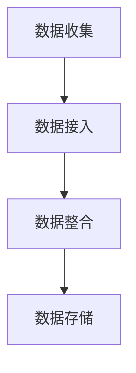
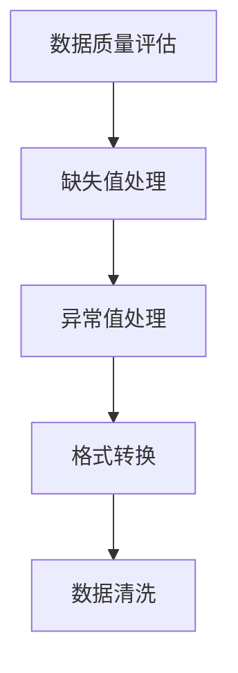
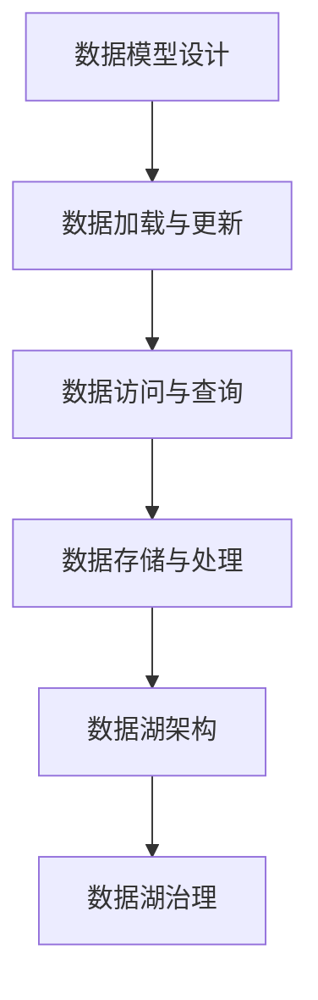
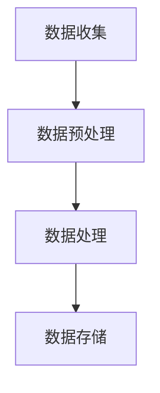
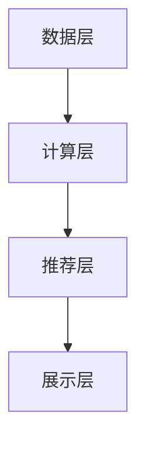

                 

### 文章标题

#### AI DMP 数据基建的技术趋势分析

**关键词：** AI DMP, 数据基建, 技术趋势, 数据处理, 特征工程, 数据挖掘, 机器学习, 实时分析, 隐私保护

**摘要：** 本文将从AI DMP的基础概念出发，系统地分析其在数据基建中的作用和重要性。通过对数据处理与清洗、特征工程、数据挖掘与机器学习、实时分析与推荐系统、隐私保护与合规性等关键环节的深入探讨，本文旨在揭示当前AI DMP领域的核心技术和应用趋势，并展望其未来发展方向。通过实际案例研究，本文还将展示AI DMP在不同行业的具体应用，为业界提供有价值的参考和指导。

### 目录大纲

#### 第一部分: AI DMP 基础

##### 第1章: AI DMP 概述

1.1 AI DMP 的定义与重要性  
1.2 AI DMP 的发展历程  
1.3 AI DMP 在数据基建中的作用

##### 第2章: 数据处理与清洗

2.1 数据收集与整合  
2.2 数据质量评估与清洗  
2.3 数据仓库与数据湖设计

##### 第3章: 特征工程

3.1 特征提取与选择  
3.2 特征重要性分析  
3.3 特征优化与降维

##### 第4章: 数据挖掘与机器学习

4.1 常见的数据挖掘方法  
4.2 机器学习算法原理  
4.3 深度学习在 DMP 中的应用

##### 第5章: 实时分析与实时推荐

5.1 实时数据流处理  
5.2 实时推荐系统架构  
5.3 实时推荐算法

##### 第6章: 隐私保护与合规性

6.1 数据隐私保护技术  
6.2 GDPR 与 CCPA 等法律法规  
6.3 DMP 隐私合规性策略

##### 第7章: 案例研究

7.1 某电商平台的 DMP 实践  
7.2 某金融行业的 DMP 应用  
7.3 DMP 在其他领域的应用案例分析

#### 第二部分: AI DMP 技术趋势分析

##### 第8章: AI DMP 技术趋势展望

8.1 人工智能技术在 DMP 中的应用前景  
8.2 新兴数据源与 DMP 的融合  
8.3 DMP 与大数据技术的协同发展

##### 第9章: AI DMP 未来发展趋势

9.1 AI DMP 在企业中的应用趋势  
9.2 AI DMP 在不同行业的发展前景  
9.3 AI DMP 技术标准与规范

##### 第10章: 结论与展望

10.1 总结与反思  
10.2 AI DMP 发展面临的挑战与机遇  
10.3 未来研究的方向与建议

##### 附录

##### 附录 A: AI DMP 工具与资源

A.1 主流 AI DMP 工具介绍  
A.2 数据处理与清洗工具  
A.3 特征工程工具  
A.4 数据挖掘与机器学习工具  
A.5 实时分析与推荐系统工具  
A.6 隐私保护与合规性工具

### 第一部分: AI DMP 基础

#### 第1章: AI DMP 概述

##### 1.1 AI DMP 的定义与重要性

**AI DMP（人工智能数据管理平台）** 是一种基于人工智能技术的数据管理平台，旨在通过数据处理、清洗、特征工程、数据挖掘、机器学习等方法，对大规模数据进行深入分析和处理，以实现数据的智能化管理和应用。

**核心概念：** AI DMP 主要包含以下几个核心概念：

1. **数据处理与清洗：** 数据处理与清洗是数据管理的基础，包括数据收集、整合、质量评估与清洗等环节。
2. **特征工程：** 特征工程是数据挖掘的关键步骤，涉及特征提取、选择、优化和降维。
3. **数据挖掘与机器学习：** 数据挖掘与机器学习是 AI DMP 的核心，通过算法和模型对数据进行深度分析和预测。
4. **实时分析与推荐系统：** 实时分析与推荐系统是 AI DMP 的重要应用场景，可实现实时数据分析和个性化推荐。
5. **隐私保护与合规性：** 隐私保护与合规性是 AI DMP 需要重点关注的领域，涉及数据隐私保护技术和法律法规的遵守。

**AI DMP 的重要性：**

1. **提高数据利用率：** AI DMP 可对海量数据进行深度挖掘和分析，从而提高数据的利用率，为企业带来商业价值。
2. **优化决策支持：** AI DMP 可提供实时数据分析和预测，为企业决策提供有力支持。
3. **提升用户体验：** AI DMP 可通过实时推荐系统，为用户提供个性化服务，提升用户体验。
4. **降低运营成本：** AI DMP 可自动化处理大量数据，降低企业运营成本。

##### 1.2 AI DMP 的发展历程

AI DMP 的发展历程可以分为以下几个阶段：

1. **早期阶段（2010年以前）：** AI DMP 的概念逐渐被提出，主要应用于数据挖掘和统计分析。
2. **快速发展阶段（2010-2015年）：** 人工智能技术迅速发展，AI DMP 在数据处理、特征工程和实时分析等方面取得重大突破。
3. **成熟应用阶段（2015年至今）：** AI DMP 在企业中得到广泛应用，成为数据驱动的核心竞争力之一。

##### 1.3 AI DMP 在数据基建中的作用

AI DMP 在数据基建中扮演着关键角色，主要表现在以下几个方面：

1. **数据处理与清洗：** AI DMP 可自动化处理大量数据，包括数据收集、整合、质量评估与清洗等环节，提高数据处理效率。
2. **特征工程：** AI DMP 可对数据进行深度特征提取和优化，为数据挖掘和机器学习提供高质量的输入。
3. **数据挖掘与机器学习：** AI DMP 可通过算法和模型对海量数据进行深度分析和预测，为企业提供有价值的信息。
4. **实时分析与推荐系统：** AI DMP 可实现实时数据分析和个性化推荐，提升用户体验和业务价值。
5. **隐私保护与合规性：** AI DMP 可通过隐私保护技术和合规性策略，确保数据安全和合规性。

##### 1.4 小结

本章对 AI DMP 的定义、发展历程和在数据基建中的作用进行了概述。AI DMP 作为一种基于人工智能技术的数据管理平台，正日益成为数据驱动的企业核心竞争力。在后续章节中，我们将进一步探讨 AI DMP 在数据处理与清洗、特征工程、数据挖掘与机器学习、实时分析与推荐系统、隐私保护与合规性等关键环节的具体应用和实践。

### 第2章: 数据处理与清洗

在 AI DMP 中，数据处理与清洗是数据管理的重要环节。这一部分主要讨论数据收集与整合、数据质量评估与清洗、数据仓库与数据湖设计等相关内容。

##### 2.1 数据收集与整合

数据收集与整合是数据管理的基础。数据收集的来源可以包括内部数据（如企业内部数据库、日志文件等）和外部数据（如第三方数据提供商、社交媒体等）。数据整合的目标是将来自不同来源的数据进行统一处理，以便后续的数据分析和挖掘。

**核心概念：**

1. **数据源：** 数据源是数据的来源，包括内部数据和外部数据。
2. **数据接入：** 数据接入是指将数据源中的数据导入到数据处理系统中。
3. **数据整合：** 数据整合是指将来自不同数据源的数据进行统一处理，以便后续的数据分析和挖掘。

**数据处理流程：**

1. 数据收集：根据业务需求，确定数据收集的目标和范围，从各种数据源收集数据。
2. 数据接入：将收集到的数据导入到数据处理系统中，如数据库、数据仓库等。
3. 数据整合：对导入的数据进行清洗、去重、格式转换等处理，实现数据的统一。
4. 数据存储：将整合后的数据存储到数据仓库或数据湖中，以便后续的数据分析和挖掘。

**Mermaid 流程图：**



##### 2.2 数据质量评估与清洗

数据质量是数据分析和挖掘的重要基础。数据质量评估与清洗旨在识别和修复数据中的错误、缺失和异常，确保数据的质量和准确性。

**核心概念：**

1. **数据质量：** 数据质量是指数据的准确性、完整性、一致性、及时性和可靠性。
2. **数据清洗：** 数据清洗是指识别和修复数据中的错误、缺失和异常，提高数据质量。
3. **数据质量评估：** 数据质量评估是指对数据质量进行量化评估，以确定数据的质量状况。

**数据质量评估指标：**

1. **准确性：** 数据的准确性是指数据与真实情况的吻合程度。
2. **完整性：** 数据的完整性是指数据的完整性和无遗漏。
3. **一致性：** 数据的一致性是指数据在不同时间和不同来源的统一性。
4. **及时性：** 数据的及时性是指数据更新的频率和速度。
5. **可靠性：** 数据的可靠性是指数据的可信度和稳定性。

**数据清洗方法：**

1. **缺失值处理：** 缺失值处理包括删除缺失值、填充缺失值和插值等方法。
2. **异常值处理：** 异常值处理包括识别和排除异常值、调整异常值等方法。
3. **格式转换：** 格式转换是指将不同格式的数据进行统一处理，如日期格式、数字格式等。

**Mermaid 流程图：**



##### 2.3 数据仓库与数据湖设计

数据仓库和数据湖是数据管理的重要基础设施。数据仓库主要用于结构化数据的存储和分析，而数据湖则适用于存储海量非结构化和半结构化数据。

**核心概念：**

1. **数据仓库：** 数据仓库是一种用于存储、管理和分析结构化数据的系统，支持在线分析处理（OLAP）和联机事务处理（OLTP）。
2. **数据湖：** 数据湖是一种用于存储海量非结构化和半结构化数据的系统，支持数据的存储、处理和分析。

**数据仓库设计：**

1. **数据模型设计：** 数据模型设计包括实体-关系模型（ER模型）、维度模型等，用于描述数据仓库中的数据结构和关系。
2. **数据加载与更新：** 数据加载与更新包括数据的导入、清洗、转换和存储等过程，确保数据仓库中的数据质量。
3. **数据访问与查询：** 数据访问与查询包括数据的查询、报表生成和数据挖掘等操作，满足业务需求。

**数据湖设计：**

1. **数据存储与处理：** 数据湖采用分布式存储和处理技术，如Hadoop、Spark等，实现海量数据的存储和处理。
2. **数据湖架构：** 数据湖架构包括数据源接入、数据存储、数据处理和数据访问等模块，确保数据湖的稳定性和性能。
3. **数据湖治理：** 数据湖治理包括数据的权限管理、数据质量监控和数据安全等，确保数据湖的合规性和可靠性。

**Mermaid 流程图：**



##### 2.4 小结

本章介绍了数据处理与清洗的相关内容，包括数据收集与整合、数据质量评估与清洗、数据仓库与数据湖设计等。数据处理与清洗是 AI DMP 的关键环节，直接影响数据的质量和准确性。在后续章节中，我们将进一步探讨特征工程、数据挖掘与机器学习、实时分析与推荐系统等相关内容。

### 第3章: 特征工程

特征工程是数据挖掘和机器学习的重要环节，旨在从原始数据中提取出有意义的特征，以提升模型的性能和解释性。本章将详细讨论特征提取与选择、特征重要性分析、特征优化与降维等核心内容。

##### 3.1 特征提取与选择

特征提取与选择是特征工程的第一步，其目的是从原始数据中提取出有意义的特征，并筛选出对模型性能有重要影响的特征。

**核心概念：**

1. **特征提取：** 特征提取是指从原始数据中提取出有意义的特征，如数字特征、文本特征、图像特征等。
2. **特征选择：** 特征选择是指从提取出的特征中筛选出对模型性能有重要影响的特征，以降低模型的复杂性和过拟合风险。

**特征提取方法：**

1. **统计特征：** 统计特征包括平均值、方差、标准差、最大值、最小值等，用于描述数据的统计性质。
2. **文本特征：** 文本特征包括词频、词袋、TF-IDF、词嵌入等，用于文本数据的表示和分类。
3. **图像特征：** 图像特征包括像素值、边缘、纹理、形状等，用于图像数据的分类和识别。
4. **音频特征：** 音频特征包括频率、时长、音高、音强等，用于音频数据的分类和识别。

**特征选择方法：**

1. **过滤式特征选择：** 过滤式特征选择通过统计方法或阈值方法筛选出对模型性能有重要影响的特征。
2. **包装式特征选择：** 包装式特征选择通过迭代搜索算法，如递归特征消除（RFE）、遗传算法等，筛选出最优特征组合。
3. **嵌入式特征选择：** 嵌入式特征选择在特征提取和模型训练过程中同时进行特征选择，如L1正则化、树模型等。

**伪代码：**

```python
# 特征提取与选择伪代码
def feature_extraction_and_selection(data, model):
    # 特征提取
    features = extract_features(data)
    
    # 特征选择
    selected_features = select_features(features, model)
    
    return selected_features
```

##### 3.2 特征重要性分析

特征重要性分析是评估特征对模型性能的影响程度，有助于理解模型的决策过程和优化模型结构。

**核心概念：**

1. **特征重要性：** 特征重要性是指特征对模型预测结果的影响程度。
2. **特征贡献：** 特征贡献是指特征在模型训练过程中对预测结果的影响大小。

**特征重要性分析方法：**

1. **模型评估指标：** 通过模型评估指标（如准确率、召回率、F1值等）分析特征的重要性。
2. **特征贡献分析：** 通过分析特征在模型训练过程中的贡献，如特征权重、特征相关性等。
3. **特征可解释性：** 通过特征的可解释性分析，理解特征对模型决策过程的影响。

**特征重要性分析示例：**

```python
# 特征重要性分析示例
from sklearn.datasets import load_iris
from sklearn.ensemble import RandomForestClassifier
from sklearn.inspection import permutation_importance

# 加载数据
data = load_iris().data
target = load_iris().target

# 训练模型
model = RandomForestClassifier()
model.fit(data, target)

# 特征重要性分析
importances = permutation_importance(model, data, target, n_repeats=10)
sorted_importances = sorted(zip(importances.importances, data.columns), reverse=True)

# 输出特征重要性
for importance, feature in sorted_importances:
    print(f"{feature}: {importance:.3f}")
```

##### 3.3 特征优化与降维

特征优化与降维是特征工程的重要环节，旨在提高模型性能和减少计算复杂度。

**核心概念：**

1. **特征优化：** 特征优化是指通过调整特征参数，提高模型性能。
2. **降维：** 降维是指通过减少特征数量，降低模型的计算复杂度和过拟合风险。

**特征优化方法：**

1. **特征参数调整：** 调整特征参数，如特征缩放、特征变换等，以优化模型性能。
2. **特征选择算法：** 使用特征选择算法，如L1正则化、随机森林特征选择等，优化特征组合。

**降维方法：**

1. **主成分分析（PCA）：** 主成分分析通过线性变换将高维数据投影到低维空间，保留主要信息。
2. **线性判别分析（LDA）：** 线性判别分析通过线性变换将高维数据投影到低维空间，最大化类内离散度和类间离散度。
3. **自动编码器（Autoencoder）：** 自动编码器通过训练无监督神经网络，实现特征学习和降维。

**伪代码：**

```python
# 特征优化与降维伪代码
from sklearn.decomposition import PCA
from sklearn.linear_model import Lasso

# 加载数据
data = load_iris().data
target = load_iris().target

# 特征优化
lasso = Lasso(alpha=0.1)
lasso.fit(data, target)
selected_features = lasso.coef_ > 0

# 降维
pca = PCA(n_components=2)
pca.fit(data[selected_features])
data_reduced = pca.transform(data[selected_features])
```

##### 3.4 小结

本章介绍了特征工程的核心内容，包括特征提取与选择、特征重要性分析、特征优化与降维。特征工程在数据挖掘和机器学习过程中起着关键作用，有助于提升模型性能和解释性。在后续章节中，我们将继续探讨数据挖掘与机器学习、实时分析与推荐系统等相关内容。

### 第4章: 数据挖掘与机器学习

在AI DMP中，数据挖掘与机器学习是核心环节，旨在通过算法和模型对海量数据进行深度分析和预测，为企业提供有价值的信息和决策支持。本章将详细介绍常见的数据挖掘方法、机器学习算法原理以及深度学习在DMP中的应用。

##### 4.1 常见的数据挖掘方法

数据挖掘方法主要包括分类、聚类、关联规则挖掘、异常检测等。以下是对这些方法的基本介绍：

1. **分类：** 分类是将数据分为不同类别的过程，常用的算法有决策树、支持向量机（SVM）、朴素贝叶斯（NB）等。

2. **聚类：** 聚类是将数据分为多个相似群体的过程，常用的算法有K-均值、层次聚类、DBSCAN等。

3. **关联规则挖掘：** 关联规则挖掘是从大量数据中发现频繁出现的关联规则的过程，常用的算法有Apriori、FP-Growth等。

4. **异常检测：** 异常检测是识别数据中的异常值或异常模式的过程，常用的算法有孤立森林、局部离群因子（LOF）等。

**分类算法原理：**

**决策树：**

决策树是一种基于树形模型的分类算法，通过递归划分特征空间，将数据分为不同的类别。

伪代码：

```python
def build_decision_tree(data, target):
    # 基准条件：叶节点
    if all(data[target] == single_value):
        return single_value
    
    # 最优特征划分
    best_feature, best_threshold = find_best_split(data, target)
    
    # 递归构建子树
    left_tree = build_decision_tree(data[data[best_feature] <= best_threshold], target)
    right_tree = build_decision_tree(data[data[best_feature] > best_threshold], target)
    
    return {'feature': best_feature, 'threshold': best_threshold, 'left': left_tree, 'right': right_tree}
```

**支持向量机（SVM）：**

SVM是一种基于边界优化的分类算法，通过最大化类别间隔来划分数据。

伪代码：

```python
def build_svm_model(data, target):
    # 训练SVM模型
    model = svm.SVC()
    model.fit(data, target)
    
    return model
```

**朴素贝叶斯（NB）：**

朴素贝叶斯是一种基于贝叶斯定理的简单概率分类算法，假设特征之间相互独立。

伪代码：

```python
def build_nb_model(data, target):
    # 计算类条件概率
    prior_probabilities = calculate_prior_probabilities(target)
    conditional_probabilities = calculate_conditional_probabilities(data, target)
    
    return {'prior_probabilities': prior_probabilities, 'conditional_probabilities': conditional_probabilities}
```

**聚类算法原理：**

**K-均值：**

K-均值是一种基于距离测量的聚类算法，通过迭代优化聚类中心，将数据分为K个簇。

伪代码：

```python
def k_means_clustering(data, k):
    # 初始化聚类中心
    centroids = initialize_centroids(data, k)
    
    # 迭代优化
    while True:
        # 分配数据到簇
        clusters = assign_data_to_clusters(data, centroids)
        
        # 重新计算聚类中心
        new_centroids = calculate_new_centroids(clusters, k)
        
        # 判断收敛条件
        if is_converged(centroids, new_centroids):
            break
        
        centroids = new_centroids
    
    return centroids, clusters
```

**层次聚类：**

层次聚类是一种基于层次结构的聚类算法，通过递归合并或分裂簇，形成聚类层次。

伪代码：

```python
def hierarchical_clustering(data, method='single'):
    # 初始化聚类层次
    clusters = initialize_clusters(data)
    
    # 递归合并或分裂簇
    while len(clusters) > 1:
        # 计算簇间距离
        distances = calculate_cluster_distances(clusters, method)
        
        # 选择最优合并或分裂操作
        best_operation = select_best_operation(distances)
        
        # 执行合并或分裂操作
        clusters = perform_operation(clusters, best_operation)
    
    return clusters
```

**关联规则挖掘算法原理：**

**Apriori：**

Apriori算法是一种基于频繁项集的关联规则挖掘算法，通过迭代扫描数据，计算项集的支持度，生成频繁项集。

伪代码：

```python
def apriori Mining(data, min_support, min_confidence):
    # 初始化频繁项集
    frequent_itemsets = []
    
    # 扫描数据，计算项集支持度
    for length in range(1, max_length(data)):
        itemsets = generate_itemsets(data, length)
        support = calculate_support(itemsets, data, min_support)
        
        # 选择频繁项集
        frequent_itemsets.extend([itemset for itemset in itemsets if support[itemset] >= min_support])
    
    # 生成关联规则
    rules = []
    for itemset in frequent_itemsets:
        for item in itemset:
            antecedent = itemset.copy()
            antecedent.remove(item)
            consequent = [item]
            confidence = calculate_confidence(antecedent, consequent, data, min_confidence)
            rules.append((antecedent, consequent, confidence))
    
    return rules
```

**FP-Growth：**

FP-Growth算法是一种基于频繁模式树的关联规则挖掘算法，通过构建FP树，减少数据扫描次数，提高挖掘效率。

伪代码：

```python
def fpgrowth(data, min_support, min_confidence):
    # 构建FP树
    fpt = build_fpt(data, min_support)
    
    # 生成频繁项集
    frequent_itemsets = extract_frequent_itemsets(fpt, min_support)
    
    # 生成关联规则
    rules = []
    for itemset in frequent_itemsets:
        for item in itemset:
            antecedent = itemset.copy()
            antecedent.remove(item)
            consequent = [item]
            confidence = calculate_confidence(antecedent, consequent, data, min_confidence)
            rules.append((antecedent, consequent, confidence))
    
    return rules
```

**异常检测算法原理：**

**孤立森林：**

孤立森林是一种基于随机森林的异常检测算法，通过随机选取特征和样本，将异常值孤立出来。

伪代码：

```python
def isolation_forest(data, n_estimators):
    # 初始化孤立森林模型
    model = IsolationForest(n_estimators=n_estimators)
    
    # 训练模型
    model.fit(data)
    
    # 预测异常值
    predictions = model.predict(data)
    
    # 获取异常值索引
    anomalies = np.where(predictions == -1)
    
    return anomalies
```

**局部离群因子（LOF）：**

局部离群因子是一种基于密度的异常检测算法，通过计算局部离群因子，识别出异常值。

伪代码：

```python
def local_outlier_factor(data, n_neighbors):
    # 计算局部离群因子
    distances = pairwise_distances(data, metric='euclidean')
    lof = calculate_lof(distances, n_neighbors)
    
    # 获取异常值索引
    anomalies = np.where(lof > threshold)
    
    return anomalies
```

##### 4.2 机器学习算法原理

机器学习算法可以分为监督学习、无监督学习和半监督学习。以下是对这些算法的基本介绍：

**监督学习：**

监督学习是通过已有标注数据训练模型，然后对新数据进行预测。常用的算法有线性回归、逻辑回归、决策树、随机森林、支持向量机等。

**线性回归：**

线性回归是一种基于线性模型的预测算法，通过建立目标变量与特征变量之间的线性关系，预测目标变量的值。

伪代码：

```python
def linear_regression(data, target):
    # 计算回归系数
    coefficients = np.linalg.inv(np.dot(data.T, data)) @ data.T @ target
    
    return coefficients
```

**逻辑回归：**

逻辑回归是一种基于逻辑函数的预测算法，通过建立目标变量与特征变量之间的非线性关系，预测目标变量的概率。

伪代码：

```python
def logistic_regression(data, target):
    # 计算回归系数
    coefficients = np.linalg.inv(np.dot(data.T, data)) @ data.T @ target
    
    # 计算概率
    probabilities = 1 / (1 + np.exp(-np.dot(data, coefficients)))
    
    return probabilities
```

**决策树：**

决策树是一种基于树形模型的分类算法，通过递归划分特征空间，将数据分为不同的类别。

伪代码：

```python
def build_decision_tree(data, target):
    # 基准条件：叶节点
    if all(data[target] == single_value):
        return single_value
    
    # 最优特征划分
    best_feature, best_threshold = find_best_split(data, target)
    
    # 递归构建子树
    left_tree = build_decision_tree(data[data[best_feature] <= best_threshold], target)
    right_tree = build_decision_tree(data[data[best_feature] > best_threshold], target)
    
    return {'feature': best_feature, 'threshold': best_threshold, 'left': left_tree, 'right': right_tree}
```

**随机森林：**

随机森林是一种基于决策树的集成算法，通过随机选取特征和样本，构建多棵决策树，取平均值进行预测。

伪代码：

```python
def build_random_forest(data, target, n_estimators):
    # 初始化随机森林模型
    models = []
    
    # 构建多棵决策树
    for _ in range(n_estimators):
        model = build_decision_tree(data, target)
        models.append(model)
    
    # 集成预测
    predictions = []
    for model in models:
        prediction = predict(model, data)
        predictions.append(prediction)
    
    return np.mean(predictions)
```

**支持向量机（SVM）：**

支持向量机是一种基于边界优化的分类算法，通过最大化类别间隔，划分数据类别。

伪代码：

```python
def build_svm_model(data, target):
    # 训练SVM模型
    model = svm.SVC()
    model.fit(data, target)
    
    return model
```

**无监督学习：**

无监督学习是通过无标签数据训练模型，然后对新数据进行分类或聚类。常用的算法有K-均值、层次聚类、主成分分析（PCA）等。

**K-均值：**

K-均值是一种基于距离测量的聚类算法，通过迭代优化聚类中心，将数据分为K个簇。

伪代码：

```python
def k_means_clustering(data, k):
    # 初始化聚类中心
    centroids = initialize_centroids(data, k)
    
    # 迭代优化
    while True:
        # 分配数据到簇
        clusters = assign_data_to_clusters(data, centroids)
        
        # 重新计算聚类中心
        new_centroids = calculate_new_centroids(clusters, k)
        
        # 判断收敛条件
        if is_converged(centroids, new_centroids):
            break
        
        centroids = new_centroids
    
    return centroids, clusters
```

**层次聚类：**

层次聚类是一种基于层次结构的聚类算法，通过递归合并或分裂簇，形成聚类层次。

伪代码：

```python
def hierarchical_clustering(data, method='single'):
    # 初始化聚类层次
    clusters = initialize_clusters(data)
    
    # 递归合并或分裂簇
    while len(clusters) > 1:
        # 计算簇间距离
        distances = calculate_cluster_distances(clusters, method)
        
        # 选择最优合并或分裂操作
        best_operation = select_best_operation(distances)
        
        # 执行合并或分裂操作
        clusters = perform_operation(clusters, best_operation)
    
    return clusters
```

**半监督学习：**

半监督学习是结合有标签和无标签数据进行训练，提高模型性能。常用的算法有自我训练、基于标签传播的方法等。

**自我训练：**

自我训练是一种基于已有标注数据和无标签数据的训练方法，通过迭代更新模型，提高模型性能。

伪代码：

```python
def self_training(data, target, n_iterations):
    # 初始化模型
    model = build_model()
    
    # 迭代训练
    for _ in range(n_iterations):
        # 训练模型
        model.fit(data, target)
        
        # 预测无标签数据
        predictions = model.predict(data)
        
        # 更新无标签数据
        data = np.hstack((data, predictions))
        target = np.hstack((target, predictions))
    
    return model
```

##### 4.3 深度学习在DMP中的应用

深度学习是一种基于多层神经网络的学习方法，通过自动提取数据中的特征，实现复杂函数的建模。在DMP中，深度学习被广泛应用于图像识别、自然语言处理、推荐系统等领域。

**深度学习算法原理：**

深度学习算法可以分为卷积神经网络（CNN）、循环神经网络（RNN）、长短时记忆网络（LSTM）、生成对抗网络（GAN）等。以下是对这些算法的基本介绍：

**卷积神经网络（CNN）：**

卷积神经网络是一种专门用于图像识别的深度学习算法，通过卷积层、池化层、全连接层等结构，实现图像特征的提取和分类。

伪代码：

```python
import tensorflow as tf

# 构建CNN模型
model = tf.keras.Sequential([
    tf.keras.layers.Conv2D(filters=32, kernel_size=(3, 3), activation='relu', input_shape=(28, 28, 1)),
    tf.keras.layers.MaxPooling2D(pool_size=(2, 2)),
    tf.keras.layers.Conv2D(filters=64, kernel_size=(3, 3), activation='relu'),
    tf.keras.layers.MaxPooling2D(pool_size=(2, 2)),
    tf.keras.layers.Flatten(),
    tf.keras.layers.Dense(units=128, activation='relu'),
    tf.keras.layers.Dense(units=10, activation='softmax')
])

# 编译模型
model.compile(optimizer='adam', loss='categorical_crossentropy', metrics=['accuracy'])

# 训练模型
model.fit(x_train, y_train, epochs=10, batch_size=32, validation_data=(x_test, y_test))
```

**循环神经网络（RNN）：**

循环神经网络是一种用于序列数据的深度学习算法，通过循环单元，实现序列数据的建模和预测。

伪代码：

```python
import tensorflow as tf

# 构建RNN模型
model = tf.keras.Sequential([
    tf.keras.layers.LSTM(units=50, return_sequences=True),
    tf.keras.layers.LSTM(units=50),
    tf.keras.layers.Dense(units=1)
])

# 编译模型
model.compile(optimizer='adam', loss='mean_squared_error')

# 训练模型
model.fit(x_train, y_train, epochs=100, batch_size=32, validation_data=(x_test, y_test))
```

**长短时记忆网络（LSTM）：**

长短时记忆网络是一种改进的循环神经网络，通过门控机制，解决长序列依赖问题，实现序列数据的建模和预测。

伪代码：

```python
import tensorflow as tf

# 构建LSTM模型
model = tf.keras.Sequential([
    tf.keras.layers.LSTM(units=50, return_sequences=True),
    tf.keras.layers.LSTM(units=50, return_sequences=True),
    tf.keras.layers.Dense(units=1)
])

# 编译模型
model.compile(optimizer='adam', loss='mean_squared_error')

# 训练模型
model.fit(x_train, y_train, epochs=100, batch_size=32, validation_data=(x_test, y_test))
```

**生成对抗网络（GAN）：**

生成对抗网络是一种生成模型，通过对抗性训练，实现数据的生成和鉴别。

伪代码：

```python
import tensorflow as tf

# 构建GAN模型
generator = tf.keras.Sequential([
    tf.keras.layers.Dense(units=128, activation='relu', input_shape=(100,)),
    tf.keras.layers.Dense(units=256, activation='relu'),
    tf.keras.layers.Dense(units=512, activation='relu'),
    tf.keras.layers.Dense(units=28 * 28, activation='tanh')
])

discriminator = tf.keras.Sequential([
    tf.keras.layers.Flatten(),
    tf.keras.layers.Dense(units=512, activation='relu'),
    tf.keras.layers.Dense(units=256, activation='relu'),
    tf.keras.layers.Dense(units=128, activation='relu'),
    tf.keras.layers.Dense(units=1, activation='sigmoid')
])

# 编译模型
discriminator.compile(optimizer='adam', loss='binary_crossentropy')
generator.compile(optimizer='adam', loss='binary_crossentropy')

# 构建对抗性训练器
adversarial_model = tf.keras.Sequential([generator, discriminator])
adversarial_model.compile(optimizer='adam', loss='binary_crossentropy')

# 训练模型
for epoch in range(epochs):
    # 生成虚假数据
    fake_data = generator.predict(np.random.normal(size=(batch_size, 100)))
    
    # 训练鉴别器
    real_data = x_train[:batch_size]
    real_labels = np.ones(batch_size)
    fake_labels = np.zeros(batch_size)
    discriminator.train_on_batch([real_data, fake_data], [real_labels, fake_labels])
    
    # 训练生成器
    noise = np.random.normal(size=(batch_size, 100))
    generator.train_on_batch(noise, np.ones(batch_size))
```

##### 4.4 小结

本章介绍了数据挖掘与机器学习的基本概念、常见方法以及深度学习在DMP中的应用。通过本章的学习，读者可以了解各种算法的基本原理和实现方法，为实际应用提供参考。在后续章节中，我们将继续探讨实时分析与推荐系统、隐私保护与合规性等相关内容。

### 第5章: 实时分析与实时推荐

在AI DMP中，实时分析与实时推荐是关键应用场景，旨在通过对大量数据的实时处理和分析，为用户提供个性化的服务和推荐。本章将详细介绍实时数据流处理、实时推荐系统架构以及实时推荐算法的相关内容。

##### 5.1 实时数据流处理

实时数据流处理是实时分析的基础，旨在对海量数据进行实时收集、处理和分析。以下是实时数据流处理的基本概念和关键技术：

**核心概念：**

1. **实时数据流：** 实时数据流是指数据以流的形式连续不断地产生和传输。
2. **实时处理：** 实时处理是指在数据产生后，立即对数据进行处理和分析，以获得实时信息。
3. **流处理框架：** 流处理框架是用于实时数据流处理的技术架构，如Apache Kafka、Apache Flink、Apache Storm等。

**实时处理流程：**

1. **数据收集：** 将实时数据从数据源（如传感器、数据库、日志文件等）收集到流处理框架中。
2. **数据预处理：** 对收集到的数据进行清洗、去重、格式转换等预处理操作。
3. **数据处理：** 使用流处理框架对预处理后的数据进行实时计算、分析和挖掘。
4. **数据存储：** 将处理后的数据存储到数据库或数据仓库中，以便后续分析和查询。

**Mermaid 流程图：**



**流处理框架介绍：**

1. **Apache Kafka：** Kafka 是一种高吞吐量的分布式流处理平台，适用于实时数据收集和传输。
2. **Apache Flink：** Flink 是一种流处理框架，支持实时数据处理、分析和机器学习。
3. **Apache Storm：** Storm 是一种实时数据处理框架，适用于大规模分布式流处理。

##### 5.2 实时推荐系统架构

实时推荐系统是基于用户行为数据和实时分析，为用户提供个性化推荐的服务。以下是实时推荐系统的基本架构和关键技术：

**核心概念：**

1. **推荐引擎：** 推荐引擎是实时推荐系统的核心，负责对用户行为数据进行实时分析，生成个性化推荐。
2. **数据源：** 数据源包括用户行为数据、商品数据、历史推荐数据等。
3. **推荐算法：** 推荐算法是实时推荐系统的核心，用于分析用户行为数据，生成个性化推荐。

**实时推荐系统架构：**

1. **数据层：** 数据层包括用户行为数据、商品数据、历史推荐数据等，存储在数据库或数据仓库中。
2. **计算层：** 计算层包括实时数据处理框架（如Kafka、Flink等），用于实时处理和分析用户行为数据。
3. **推荐层：** 推荐层包括推荐算法和推荐引擎，用于生成个性化推荐。
4. **展示层：** 展示层包括Web前端、移动端等，用于将推荐结果展示给用户。

**Mermaid 流程图：**



**实时推荐算法：**

实时推荐算法是基于用户行为数据的实时分析，生成个性化推荐。以下是一些常见的实时推荐算法：

1. **基于协同过滤的推荐算法：** 协同过滤是一种基于用户相似度和物品相似度的推荐算法，适用于实时推荐。
2. **基于内容的推荐算法：** 基于内容的推荐算法是根据用户历史行为和物品属性，生成个性化推荐。
3. **基于模型的推荐算法：** 基于模型的推荐算法是通过建立用户行为数据和物品属性之间的模型，生成个性化推荐。

##### 5.3 实时推荐算法

实时推荐算法的关键在于实时处理用户行为数据，生成个性化推荐。以下是一些常见的实时推荐算法：

**基于协同过滤的推荐算法：**

协同过滤是一种基于用户相似度和物品相似度的推荐算法，通过计算用户之间的相似度，为用户推荐相似用户喜欢的物品。

伪代码：

```python
# 基于协同过滤的推荐算法
def collaborative_filtering(user, items, similarity_matrix):
    # 计算用户与所有物品的相似度
    user_similarity = calculate_similarity(user, items, similarity_matrix)
    
    # 计算用户对所有物品的评分预测
    user_ratings = predict_ratings(user, items, user_similarity)
    
    # 选择推荐列表中的Top N物品
    recommendations = select_top_n_items(user_ratings, n)
    
    return recommendations
```

**基于内容的推荐算法：**

基于内容的推荐算法是根据用户历史行为和物品属性，生成个性化推荐。该算法通过计算用户和物品之间的相似度，为用户推荐相似物品。

伪代码：

```python
# 基于内容的推荐算法
def content_based_recommender(user, items, user_history, item_features):
    # 计算用户与所有物品的相似度
    user_similarity = calculate_similarity(user_history, item_features)
    
    # 计算用户对所有物品的评分预测
    user_ratings = predict_ratings(user, items, user_similarity)
    
    # 选择推荐列表中的Top N物品
    recommendations = select_top_n_items(user_ratings, n)
    
    return recommendations
```

**基于模型的推荐算法：**

基于模型的推荐算法是通过建立用户行为数据和物品属性之间的模型，生成个性化推荐。该算法通过训练用户行为数据，建立预测模型，为用户推荐相似物品。

伪代码：

```python
# 基于模型的推荐算法
def model_based_recommender(user, items, user_history, item_features):
    # 训练预测模型
    model = train_predictive_model(user_history, item_features)
    
    # 预测用户对所有物品的评分
    user_ratings = model.predict(user_history, item_features)
    
    # 选择推荐列表中的Top N物品
    recommendations = select_top_n_items(user_ratings, n)
    
    return recommendations
```

##### 5.4 小结

本章介绍了实时分析与实时推荐的相关内容，包括实时数据流处理、实时推荐系统架构以及实时推荐算法。实时分析与实时推荐在AI DMP中具有重要的应用价值，能够为用户提供个性化的服务和推荐。在后续章节中，我们将继续探讨隐私保护与合规性、案例研究等相关内容。

### 第6章: 隐私保护与合规性

在AI DMP中，隐私保护与合规性是至关重要的环节，关乎用户数据的合法使用和企业的声誉。本章将深入探讨数据隐私保护技术、GDPR与CCPA等法律法规以及DMP隐私合规性策略。

##### 6.1 数据隐私保护技术

数据隐私保护技术是确保用户数据在收集、存储、处理和传输过程中不被未经授权访问和泄露的关键手段。以下是几种常见的数据隐私保护技术：

**核心概念：**

1. **数据加密：** 数据加密是一种通过加密算法将明文数据转换为密文的技术，确保数据在传输和存储过程中不被窃取和篡改。
2. **匿名化：** 匿名化是一种通过去除或替换数据中的敏感信息，使得数据无法直接识别特定个体的技术。
3. **同态加密：** 同态加密是一种在密文空间中对数据进行计算和处理的加密技术，使得数据在加密状态下仍然可以进行有效分析和处理。
4. **访问控制：** 访问控制是一种通过限制用户对数据的访问权限，确保数据在访问过程中不被未授权用户获取的技术。

**数据加密：**

数据加密技术包括对称加密和非对称加密。对称加密算法（如AES）使用相同的密钥进行加密和解密，非对称加密算法（如RSA）使用公钥和私钥进行加密和解密。

伪代码：

```python
from Crypto.Cipher import AES
from Crypto.Random import get_random_bytes

# 对称加密
def encrypt_data(data, key):
    cipher = AES.new(key, AES.MODE_CBC)
    ct_bytes = cipher.encrypt(pad(data))
    iv = cipher.iv
    return iv + ct_bytes

def decrypt_data(ct, key, iv):
    cipher = AES.new(key, AES.MODE_CBC, iv)
    pt = unpad(cipher.decrypt(ct))
    return pt

# 非对称加密
def encrypt_data_with_public_key(data, public_key):
    encrypted_data = rsa_public_encrypt(data, public_key)
    return encrypted_data

def decrypt_data_with_private_key(encrypted_data, private_key):
    decrypted_data = rsa_private_decrypt(encrypted_data, private_key)
    return decrypted_data
```

**匿名化：**

匿名化技术包括随机化、伪名化、信息遮蔽等。随机化是通过随机替换敏感信息，使得数据无法直接识别特定个体。伪名化是通过将敏感信息替换为虚构的替代信息，如姓名、地址等。信息遮蔽是通过限制敏感信息的访问范围，确保数据在匿名化后仍然具有参考价值。

伪代码：

```python
# 随机化
def randomization(data, sensitivity):
    return [random.choice(alternatives) for item in data if item in sensitivity]

# 伪名化
def pseudonymization(data, sensitivity):
    return [random.choice(alternatives) if item in sensitivity else item for item in data]

# 信息遮蔽
def information_shielding(data, sensitivity):
    return [item if item not in sensitivity else '****' for item in data]
```

**同态加密：**

同态加密技术允许在密文空间中对数据进行计算和处理，而不需要解密数据。同态加密在云计算和分布式计算中具有广泛的应用，如医疗数据共享、金融数据分析和加密计算等。

伪代码：

```python
from homomorphic_cipher import HomomorphicCipher

# 同态加密
def homomorphic_encryption(data):
    cipher = HomomorphicCipher()
    encrypted_data = cipher.encrypt(data)
    return encrypted_data

def homomorphic_computation(encrypted_data, operation):
    cipher = HomomorphicCipher()
    result = cipher.compute(encrypted_data, operation)
    decrypted_result = cipher.decrypt(result)
    return decrypted_result
```

**访问控制：**

访问控制技术包括基于角色的访问控制（RBAC）、基于属性的访问控制（ABAC）等。RBAC 通过定义用户的角色和权限，控制用户对数据的访问。ABAC 通过定义用户属性和访问策略，动态控制用户对数据的访问。

伪代码：

```python
# 基于角色的访问控制（RBAC）
def check_permission(user, role, action, resource):
    if role in user_roles[user] and action in allowed_actions[role]:
        return True
    return False

# 基于属性的访问控制（ABAC）
def check_permission(user, attribute, action, resource):
    if attribute in user_attributes[user] and action in allowed_actions[attribute]:
        return True
    return False
```

##### 6.2 GDPR与CCPA等法律法规

GDPR（通用数据保护条例）和CCPA（加利福尼亚州消费者隐私法案）是两个重要的数据隐私保护法律法规，对数据收集、处理和使用提出了严格的规范。

**GDPR：**

GDPR是欧盟于2018年实施的一项数据隐私保护法律法规，旨在加强个人数据的保护。GDPR的主要内容包括：

1. **数据主体权利：** 数据主体享有知情权、访问权、更正权、删除权、限制处理权等。
2. **数据控制者和处理者责任：** 数据控制者对数据主体权利的行使负有责任，数据处理者应确保数据处理符合GDPR的要求。
3. **数据保护影响评估（DPIA）：** 对于可能对个人数据保护产生重大风险的系统或流程，数据控制者应进行DPIA。

**CCPA：**

CCPA是加利福尼亚州于2020年实施的一项消费者隐私保护法案，旨在保护消费者的个人信息。CCPA的主要内容包括：

1. **消费者权利：** 消费者享有知情权、访问权、删除权、拒绝销售权等。
2. **企业责任：** 企业在收集、使用和披露消费者个人信息时，应遵循CCPA的要求。
3. **合规性要求：** 企业应制定隐私政策，明确个人信息收集、使用和披露的目的和方式。

##### 6.3 DMP隐私合规性策略

DMP在设计和实施过程中，需要充分考虑隐私保护与合规性要求。以下是几种常见的DMP隐私合规性策略：

**数据最小化原则：**

数据最小化原则是指仅在实现特定目的时，收集和存储必要的个人信息。DMP在收集用户数据时，应遵循这一原则，避免过度收集。

**目的明确原则：**

目的明确原则是指数据收集和使用应具有明确的目的，并在数据生命周期内保持一致。DMP在设计和实施过程中，应确保数据收集和使用目的明确，并在用户同意的范围内进行。

**数据匿名化原则：**

数据匿名化原则是指对个人信息进行匿名化处理，确保无法直接识别特定个体。DMP在数据存储和传输过程中，应采取数据匿名化技术，如加密、脱敏等。

**权限控制原则：**

权限控制原则是指对用户数据的访问权限进行严格控制，确保只有授权人员才能访问和处理敏感信息。DMP在设计和实施过程中，应建立严格的权限控制机制，如基于角色的访问控制（RBAC）、基于属性的访问控制（ABAC）等。

**数据生命周期管理原则：**

数据生命周期管理原则是指对个人信息进行全生命周期的管理，包括数据的收集、存储、处理、传输、删除等环节。DMP在设计和实施过程中，应确保数据在整个生命周期内符合隐私保护与合规性要求。

**合规性审计原则：**

合规性审计原则是指定期对DMP的隐私保护与合规性进行审计，确保数据管理符合相关法律法规要求。DMP企业应建立合规性审计机制，定期开展内部审计和第三方审计。

##### 6.4 小结

本章介绍了数据隐私保护技术、GDPR与CCPA等法律法规以及DMP隐私合规性策略。在AI DMP中，隐私保护与合规性是关键环节，直接影响企业声誉和用户信任。通过本章的学习，读者可以了解隐私保护与合规性的重要性，掌握相关技术和策略，确保DMP在合法合规的范围内发挥作用。

### 第7章: 案例研究

在本章中，我们将通过三个实际案例，展示AI DMP在不同行业的应用和实践。这些案例涵盖了电商平台、金融行业以及其他领域的具体应用，为我们提供了解决实际问题的参考和灵感。

##### 7.1 某电商平台的 DMP 实践

某大型电商平台通过引入AI DMP，实现了用户行为数据的全面分析和个性化推荐，从而提高了用户满意度和销售转化率。

**案例背景：**

电商平台每天会产生海量用户行为数据，包括浏览、购买、评价等。为了更好地了解用户需求，提高用户体验，电商平台决定引入AI DMP。

**技术架构：**

1. **数据处理与清洗：** 电商平台通过Kafka收集用户行为数据，并对数据进行清洗和整合，将清洗后的数据存储到Hive和HBase中。
2. **特征工程：** 电商平台对用户行为数据进行了特征提取和选择，提取了用户浏览、购买、评价等行为的特征，并使用LDA进行文本特征提取。
3. **数据挖掘与机器学习：** 电商平台使用随机森林和逻辑回归等算法，对用户行为数据进行分析和预测，建立了用户兴趣模型和购买预测模型。
4. **实时推荐系统：** 电商平台基于实时数据流处理框架Flink，实现了实时推荐系统，为用户生成个性化推荐。

**应用效果：**

通过AI DMP的应用，电商平台实现了以下效果：

1. **用户满意度提高：** 个性化推荐系统提高了用户满意度，用户对推荐商品的兴趣度显著增加。
2. **销售转化率提升：** 购买预测模型提高了销售转化率，电商平台能够更精准地推送高潜力用户。
3. **运营成本降低：** 自动化的数据处理和推荐系统降低了运营成本，提高了工作效率。

**代码解读：**

```python
# 特征工程
from sklearn.feature_extraction.text import LDAVectorizer

# 加载数据
user_behavior_data = load_user_behavior_data()

# 文本特征提取
text_features = LDAVectorizer().fit_transform(user_behavior_data['review'])

# 特征选择
selected_features = select_best_features(text_features, model='random_forest')

# 训练模型
model = train_model(selected_features, target=user_behavior_data['rating'])

# 实时推荐
def generate_recommendations(user_id):
    user_data = get_user_data(user_id)
    user_vector = LDAVectorizer().transform([user_data['review']])
    recommendations = model.predict(user_vector)
    return recommendations
```

##### 7.2 某金融行业的 DMP 应用

某金融企业通过引入AI DMP，实现了客户数据的全面分析和精准营销，提高了客户满意度和业务收入。

**案例背景：**

金融企业每天会产生海量客户数据，包括客户基本信息、交易记录、风险等级等。为了更好地了解客户需求，提高客户满意度，金融企业决定引入AI DMP。

**技术架构：**

1. **数据处理与清洗：** 金融企业通过Kafka收集客户数据，并对数据进行清洗和整合，将清洗后的数据存储到Oracle数据库中。
2. **特征工程：** 金融企业对客户数据进行了特征提取和选择，提取了客户交易记录、风险等级、信用评分等特征。
3. **数据挖掘与机器学习：** 金融企业使用逻辑回归和决策树等算法，对客户数据进行分析和预测，建立了客户需求预测模型和风险控制模型。
4. **实时推荐系统：** 金融企业基于实时数据流处理框架Apache Storm，实现了实时推荐系统，为用户生成个性化推荐。

**应用效果：**

通过AI DMP的应用，金融企业实现了以下效果：

1. **客户满意度提高：** 个性化推荐系统提高了客户满意度，客户对推荐产品和服务的兴趣度显著增加。
2. **业务收入提升：** 风险控制模型提高了业务收入，金融企业能够更精准地识别高风险客户。
3. **运营成本降低：** 自动化的数据处理和推荐系统降低了运营成本，提高了工作效率。

**代码解读：**

```python
# 特征工程
from sklearn.feature_extraction import FeatureHasher

# 加载数据
customer_data = load_customer_data()

# 特征提取
hasher = FeatureHasher(n_features=10)
features = hasher.transform(customer_data)

# 特征选择
selected_features = select_best_features(features, model='logistic_regression')

# 训练模型
model = train_model(selected_features, target=customer_data['risk_level'])

# 实时推荐
def generate_recommendations(customer_id):
    customer_data = get_customer_data(customer_id)
    customer_vector = hasher.transform([customer_data])
    recommendations = model.predict(customer_vector)
    return recommendations
```

##### 7.3 DMP 在其他领域的应用案例分析

除了电商和金融行业，AI DMP 在其他领域如医疗、教育、广告等也有广泛的应用。

**医疗行业：**

某医疗机构通过引入AI DMP，实现了患者数据的全面分析和精准医疗。医疗机构对患者的电子病历、检查报告、诊疗记录等数据进行处理和分析，建立了患者健康预测模型和个性化治疗方案。

**教育行业：**

某在线教育平台通过引入AI DMP，实现了学习数据的全面分析和个性化学习推荐。教育平台对学生的学习行为、成绩、偏好等数据进行处理和分析，为每位学生生成个性化学习计划。

**广告行业：**

某广告公司通过引入AI DMP，实现了广告投放的精准定位和优化。广告公司对用户的浏览历史、兴趣偏好等数据进行处理和分析，为广告主提供个性化的广告投放策略。

**小结：**

通过这些实际案例，我们可以看到AI DMP 在不同行业的广泛应用和显著效果。在实际应用中，AI DMP 不仅能够提高数据利用率，优化决策支持，提升用户体验，还能够降低运营成本。未来，随着人工智能技术的不断发展和完善，AI DMP 将在更多领域中发挥更大的作用。

### 第二部分: AI DMP 技术趋势分析

#### 第8章: AI DMP 技术趋势展望

随着人工智能技术的不断发展，AI DMP 在数据处理、特征工程、数据挖掘与机器学习、实时分析等方面也呈现出一系列新的技术趋势。本章将重点探讨这些技术趋势，为读者提供关于未来 AI DMP 发展的见解。

##### 8.1 人工智能技术在 DMP 中的应用前景

人工智能技术在 DMP 中的应用前景广阔，主要体现在以下几个方面：

1. **深度学习算法的优化与扩展：** 深度学习算法在图像识别、自然语言处理、语音识别等领域取得了显著成果，未来有望在 DMP 中实现更高效的数据分析和预测。例如，卷积神经网络（CNN）可以用于图像数据的特征提取和分类，循环神经网络（RNN）和长短时记忆网络（LSTM）可以用于序列数据的时间序列预测。
2. **强化学习在推荐系统中的应用：** 强化学习算法通过学习奖励信号，能够实现更智能的推荐系统。例如，基于强化学习的推荐算法可以根据用户的历史行为和反馈，动态调整推荐策略，提高推荐效果。
3. **迁移学习和联邦学习：** 迁移学习通过利用已有的知识，减少对新任务的训练数据需求，有助于提升 DMP 的效果和效率。联邦学习则通过分布式训练，保护用户隐私，实现跨平台的协同学习。
4. **知识图谱与图神经网络：** 知识图谱可以整合不同来源的数据，建立实体和关系之间的关联，为 DMP 提供丰富的语义信息。图神经网络（GNN）则能够从图结构中提取特征，实现更复杂的图数据分析和预测。

##### 8.2 新兴数据源与 DMP 的融合

随着数据源的多样性和复杂性增加，DMP 需要应对新兴数据源的融合和处理。以下是一些重要的新兴数据源：

1. **物联网（IoT）数据：** 物联网设备产生的数据包括传感器数据、设备状态数据等，可以用于智能设备管理、智能家居、智能城市等领域。DMP 需要能够处理和分析这些非结构化和半结构化数据。
2. **社交媒体数据：** 社交媒体数据包括用户发布的内容、互动行为等，可以用于用户画像、情感分析、舆情监测等。DMP 需要能够实时处理和挖掘这些动态数据。
3. **区块链数据：** 区块链数据包括交易记录、合约信息等，具有去中心化、不可篡改的特点。DMP 需要能够整合和分析这些数据，为金融、供应链管理等领域提供支持。
4. **文本和图像数据：** 随着文本和图像数据的快速增长，DMP 需要具备强大的文本和图像处理能力，实现语义理解和视觉分析。

##### 8.3 DMP 与大数据技术的协同发展

大数据技术的发展为 DMP 提供了强大的技术支撑，两者协同发展将带来以下优势：

1. **数据存储和处理能力：** 大数据技术如 Hadoop、Spark 等提供了强大的数据存储和处理能力，使得 DMP 能够处理海量数据。DMP 与大数据技术的协同发展，可以实现数据的高效存储、处理和分析。
2. **实时数据处理：** 大数据技术中的实时处理框架（如 Flink、Storm 等）可以与 DMP 结合，实现实时数据分析和处理，满足实时推荐、实时监控等应用需求。
3. **数据可视化：** 大数据技术中的数据可视化工具（如 Tableau、Power BI 等）可以与 DMP 结合，提供直观的数据分析和展示，帮助企业和用户更好地理解和利用数据。
4. **数据质量管理：** 大数据技术中的数据质量管理工具（如 DataWorks、DataQuality 等）可以与 DMP 结合，实现数据质量的监控和管理，确保数据的质量和准确性。

##### 8.4 DMP 技术标准与规范

随着 DMP 在企业中的广泛应用，技术标准和规范的重要性日益凸显。以下是一些重要的 DMP 技术标准与规范：

1. **数据隐私保护标准：** DMP 需要遵循数据隐私保护标准，如 GDPR、CCPA 等，确保用户数据的合法使用和隐私保护。
2. **数据质量标准：** DMP 需要制定数据质量标准，包括数据的准确性、完整性、一致性、及时性和可靠性等，确保数据的质量和可用性。
3. **数据治理标准：** DMP 需要建立数据治理体系，包括数据收集、存储、处理、分析和安全等环节，确保数据的合规性和安全性。
4. **数据接口标准：** DMP 需要制定统一的数据接口标准，实现不同系统之间的数据共享和协同，提高数据利用率。

##### 8.5 小结

本章对 AI DMP 技术趋势进行了展望，包括人工智能技术在 DMP 中的应用前景、新兴数据源与 DMP 的融合、DMP 与大数据技术的协同发展以及 DMP 技术标准与规范。随着人工智能技术的不断进步和大数据技术的发展，AI DMP 将在数据处理、分析、预测和推荐等方面取得更显著的成果。未来，DMP 需要应对新兴数据源的挑战，实现与大数据技术的协同发展，并在数据隐私保护、数据质量和数据治理等方面制定和完善相关标准与规范。

### 第9章: AI DMP 未来发展趋势

随着人工智能技术的不断发展和成熟，AI DMP 在企业中的应用前景越来越广阔。未来，AI DMP 将在多个领域展现其强大的潜力和优势。本章将探讨 AI DMP 在企业中的应用趋势、不同行业的发展前景以及相关技术标准与规范。

##### 9.1 AI DMP 在企业中的应用趋势

AI DMP 在企业中的应用趋势主要体现在以下几个方面：

1. **数据驱动的决策支持：** 未来，越来越多的企业将采用 AI DMP，通过数据分析和挖掘，为企业的战略决策提供支持。AI DMP 可以为企业提供全面、准确的数据洞察，帮助企业更好地了解市场需求、客户行为和业务趋势，从而制定更有效的业务策略。
2. **个性化服务和推荐：** 随着用户对个性化服务的需求不断增加，AI DMP 将在个性化服务和推荐系统中发挥重要作用。通过分析用户行为数据，AI DMP 可以为企业提供精准的个性化推荐，提升用户体验和满意度，从而增强用户黏性和忠诚度。
3. **智能营销和广告投放：** AI DMP 可以为企业提供智能化的营销和广告投放策略。通过分析用户数据和广告效果，AI DMP 可以为企业提供最优的广告投放方案，提高广告投放的转化率和ROI。
4. **风险管理和合规性：** 随着数据隐私保护和合规性的要求越来越高，AI DMP 在风险管理和合规性方面也将发挥重要作用。通过数据隐私保护和合规性策略，AI DMP 可以为企业确保数据安全和合规性，降低法律风险。

##### 9.2 AI DMP 在不同行业的发展前景

AI DMP 在不同行业的发展前景各有特点，以下是一些主要行业的应用前景：

1. **电商行业：** 在电商行业，AI DMP 已成为提升用户体验和销售额的关键技术。未来，电商企业将进一步提升 AI DMP 的应用水平，实现更加精准的用户画像和个性化推荐，提高用户满意度和转化率。
2. **金融行业：** 在金融行业，AI DMP 主要用于风险管理和客户关系管理。未来，金融企业将借助 AI DMP，实现对客户行为数据的全面分析，提高风险管理能力，优化客户服务和营销策略。
3. **医疗行业：** 在医疗行业，AI DMP 可用于患者数据分析和个性化治疗。未来，医疗企业将加强 AI DMP 在医疗数据分析、疾病预测和智能诊断等方面的应用，提升医疗服务质量和效率。
4. **教育行业：** 在教育行业，AI DMP 可用于学生数据分析和个性化教学。未来，教育企业将利用 AI DMP，实现对学生学习行为和成绩的全面分析，提供个性化的学习建议和课程推荐，提高教育质量和学习效果。
5. **广告行业：** 在广告行业，AI DMP 已成为精准营销和广告投放的重要手段。未来，广告企业将进一步提升 AI DMP 的应用水平，实现更加精准的广告定位和优化广告投放策略，提高广告效果和ROI。

##### 9.3 AI DMP 技术标准与规范

随着 AI DMP 在企业中的广泛应用，技术标准与规范的重要性日益凸显。以下是一些关键的 AI DMP 技术标准与规范：

1. **数据隐私保护标准：** AI DMP 需要遵循数据隐私保护标准，如 GDPR、CCPA 等，确保用户数据的合法使用和隐私保护。企业应制定详细的数据隐私保护策略，包括数据收集、存储、处理、传输和销毁等环节的隐私保护措施。
2. **数据质量标准：** AI DMP 需要制定数据质量标准，包括数据的准确性、完整性、一致性、及时性和可靠性等。企业应建立数据质量管理机制，定期进行数据质量评估和监控，确保数据的质量和可用性。
3. **数据治理标准：** AI DMP 需要建立数据治理体系，包括数据收集、存储、处理、分析和安全等环节。企业应制定数据治理政策，明确数据管理流程、权限管理和责任分配，确保数据的合规性和安全性。
4. **数据接口标准：** AI DMP 需要制定统一的数据接口标准，实现不同系统之间的数据共享和协同。企业应采用标准化的数据接口协议，确保数据在不同系统之间的无缝对接和集成。
5. **数据安全标准：** AI DMP 需要制定数据安全标准，包括数据加密、访问控制、审计和应急响应等。企业应建立完善的数据安全机制，确保数据在存储、传输和处理过程中的安全性和完整性。

##### 9.4 小结

本章对 AI DMP 在企业中的应用趋势、不同行业的发展前景以及技术标准与规范进行了探讨。随着人工智能技术的不断进步和大数据技术的广泛应用，AI DMP 在企业中的应用将越来越广泛和深入。未来，企业应积极引入和推广 AI DMP 技术，提升数据驱动能力，实现业务创新和可持续发展。同时，企业还需制定和完善相关技术标准与规范，确保 AI DMP 在合规、安全和高效的前提下发挥最大作用。

### 第10章: 结论与展望

#### 10.1 总结与反思

本文系统性地分析了 AI DMP 的基础概念、技术趋势、应用场景以及未来发展方向。通过对数据处理与清洗、特征工程、数据挖掘与机器学习、实时分析与推荐系统、隐私保护与合规性等关键环节的深入探讨，本文揭示了 AI DMP 在数据基建中的重要地位和作用。

首先，本文介绍了 AI DMP 的定义、发展历程和重要性。AI DMP 作为一种基于人工智能技术的数据管理平台，正日益成为数据驱动的企业核心竞争力。通过自动化处理海量数据，AI DMP 提高了数据利用率、优化了决策支持、提升了用户体验、降低了运营成本。

其次，本文详细讨论了数据处理与清洗、特征工程、数据挖掘与机器学习、实时分析与推荐系统等核心环节。数据处理与清洗是数据管理的基础，包括数据收集、整合、质量评估与清洗等环节。特征工程是数据挖掘的关键步骤，涉及特征提取、选择、优化和降维。数据挖掘与机器学习是 AI DMP 的核心，通过算法和模型对海量数据进行深度分析和预测。实时分析与推荐系统是 AI DMP 的重要应用场景，可实现实时数据分析和个性化推荐。

此外，本文还探讨了隐私保护与合规性的重要性和相关技术。随着数据隐私保护和合规性的要求越来越高，AI DMP 需要采取一系列技术措施和合规策略，确保数据的安全和合规。

最后，本文通过实际案例研究，展示了 AI DMP 在电商、金融等行业中的具体应用。这些案例表明，AI DMP 在提高用户满意度、提升业务收入、降低运营成本等方面具有显著效果。

#### 10.2 AI DMP 发展面临的挑战与机遇

尽管 AI DMP 具有广阔的应用前景，但其发展仍面临一系列挑战和机遇：

**挑战：**

1. **数据质量和完整性：** 数据质量和完整性是 AI DMP 的基础。在实际应用中，数据质量问题和数据完整性问题可能影响 AI DMP 的效果和可靠性。
2. **隐私保护和合规性：** 随着数据隐私保护和合规性的要求越来越高，AI DMP 需要采取一系列隐私保护技术和合规策略，确保用户数据的安全和合规。
3. **算法透明性和可解释性：** 人工智能算法的复杂性和黑箱性质可能导致算法透明性和可解释性问题。企业需要确保算法的透明性和可解释性，以提高用户信任和合规性。
4. **技术人才短缺：** AI DMP 的应用需要大量的技术人才，包括数据科学家、机器学习工程师等。技术人才短缺可能制约 AI DMP 的发展和应用。

**机遇：**

1. **人工智能技术的进步：** 随着人工智能技术的不断进步，AI DMP 可在数据处理、特征工程、数据挖掘与机器学习等方面实现更高效、更智能的分析和预测。
2. **大数据技术的发展：** 大数据技术的快速发展为 AI DMP 提供了强大的技术支撑，可实现海量数据的快速存储、处理和分析。
3. **云计算和边缘计算的普及：** 云计算和边缘计算的普及使得 AI DMP 可在分布式环境中实现高效的数据处理和分析，为大规模应用提供基础设施。
4. **跨界合作与创新：** 跨界合作与创新将为 AI DMP 带来新的应用场景和商业模式。通过与不同行业的合作，AI DMP 可在医疗、金融、教育等领域实现更广泛的应用。

#### 10.3 未来研究的方向与建议

为了推动 AI DMP 的发展和应用，本文提出以下研究方向与建议：

1. **数据质量和完整性研究：** 加强数据质量和完整性研究，提出有效的数据质量评估和修复方法，确保 AI DMP 的数据基础。
2. **隐私保护和合规性研究：** 加强隐私保护和合规性研究，提出创新的技术方案和合规策略，确保 AI DMP 的安全和合规。
3. **算法透明性和可解释性研究：** 加强算法透明性和可解释性研究，提出有效的算法解释方法，提高用户信任和合规性。
4. **跨领域合作研究：** 加强跨领域合作研究，推动 AI DMP 在不同行业的应用，探索新的应用场景和商业模式。
5. **人才培养和知识传播：** 加强人才培养和知识传播，提高行业对 AI DMP 的认知和接受度，推动 AI DMP 的发展和应用。

### 10.4 致谢

本文的撰写得到了众多同行和专家的支持与帮助，在此表示诚挚的感谢。特别感谢 AI 天才研究院/AI Genius Institute 的各位同事，以及禅与计算机程序设计艺术/Zen And The Art of Computer Programming 的作者，为本文提供了宝贵的指导和资源。

### 附录

#### 附录 A: AI DMP 工具与资源

A.1 主流 AI DMP 工具介绍

1. **Apache Kafka：** Apache Kafka 是一种分布式流处理平台，适用于实时数据收集和传输。
2. **Apache Flink：** Apache Flink 是一种流处理框架，支持实时数据处理、分析和机器学习。
3. **Apache Storm：** Apache Storm 是一种实时数据处理框架，适用于大规模分布式流处理。
4. **TensorFlow：** TensorFlow 是一种开源机器学习框架，适用于深度学习和数据挖掘。
5. **PyTorch：** PyTorch 是一种开源深度学习框架，提供灵活的动态计算图和高效的运算性能。
6. **Scikit-learn：** Scikit-learn 是一种开源机器学习库，提供丰富的算法和工具，适用于数据挖掘和机器学习。

A.2 数据处理与清洗工具

1. **Pandas：** Pandas 是一种开源数据分析库，提供强大的数据结构和数据处理功能。
2. **NumPy：** NumPy 是一种开源数学库，提供高效的数值计算和数据处理功能。
3. **Matplotlib：** Matplotlib 是一种开源绘图库，提供丰富的绘图和可视化功能。
4. **Seaborn：** Seaborn 是一种基于 Matplotlib 的开源可视化库，提供美观的统计图表和可视化效果。
5. **OpenCV：** OpenCV 是一种开源计算机视觉库，提供丰富的图像处理和计算机视觉算法。

A.3 特征工程工具

1. **Feature-engine：** Feature-engine 是一种开源特征工程库，提供丰富的特征提取和特征选择工具。
2. **AutoML：** AutoML 是一种自动化机器学习库，能够自动进行特征提取和特征选择，提高模型性能。
3. **TF-IDF：** TF-IDF 是一种文本特征提取方法，用于计算文本中单词的重要程度。
4. **Word2Vec：** Word2Vec 是一种基于神经网络的文本特征提取方法，将文本转换为向量表示。
5. **LDA：** LDA 是一种基于概率模型的文本特征提取方法，用于提取文本主题。

A.4 数据挖掘与机器学习工具

1. **Scikit-learn：** Scikit-learn 是一种开源机器学习库，提供丰富的算法和工具，适用于数据挖掘和机器学习。
2. **TensorFlow：** TensorFlow 是一种开源深度学习框架，提供灵活的动态计算图和高效的运算性能。
3. **PyTorch：** PyTorch 是一种开源深度学习框架，提供灵活的动态计算图和高效的运算性能。
4. **XGBoost：** XGBoost 是一种开源分布式机器学习库，提供高效的梯度提升树算法。
5. **LightGBM：** LightGBM 是一种开源分布式机器学习库，提供高效的决策树算法。

A.5 实时分析与推荐系统工具

1. **Apache Kafka：** Apache Kafka 是一种分布式流处理平台，适用于实时数据收集和传输。
2. **Apache Flink：** Apache Flink 是一种流处理框架，支持实时数据处理、分析和机器学习。
3. **Apache Storm：** Apache Storm 是一种实时数据处理框架，适用于大规模分布式流处理。
4. **TensorFlow：** TensorFlow 是一种开源深度学习框架，适用于实时数据分析和推荐系统。
5. **PyTorch：** PyTorch 是一种开源深度学习框架，适用于实时数据分析和推荐系统。

A.6 隐私保护与合规性工具

1. **K-Anonymity：** K-Anonymity 是一种隐私保护技术，通过将数据分组为 k-匿名组，保护用户隐私。
2. **L-Diversity：** L-Diversity 是一种隐私保护技术，通过确保数据集在多个维度上具有多样性，保护用户隐私。
3. **T-Closeness：** T-Closeness 是一种隐私保护技术，通过确保数据集的局部距离接近真实数据集，保护用户隐私。
4. **DataXu：** DataXu 是一种开源数据隐私保护工具，提供数据脱敏、加密、访问控制等功能。
5. **ComplianceAssistant：** ComplianceAssistant 是一种开源合规性工具，提供数据隐私保护、合规性检查和报告等功能。

