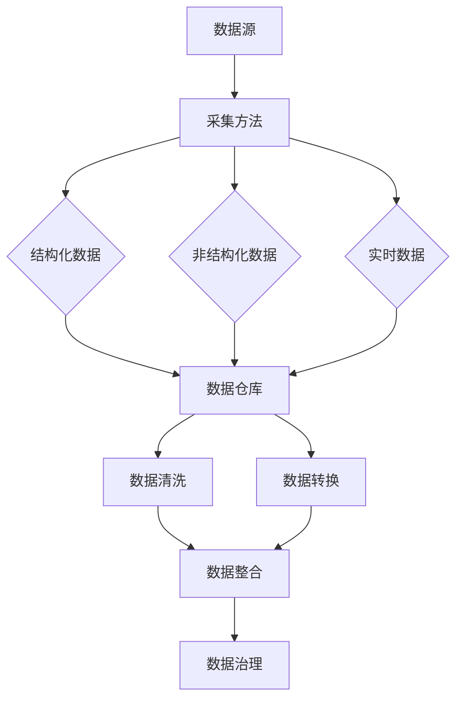
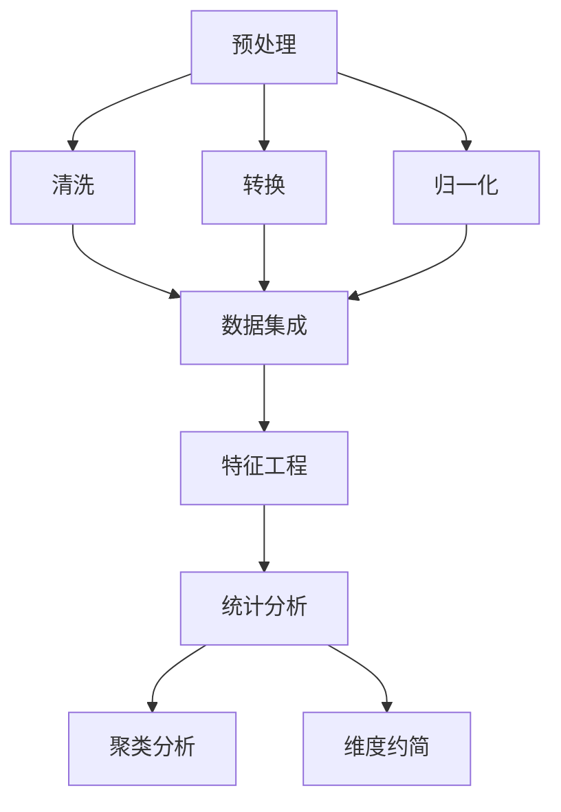
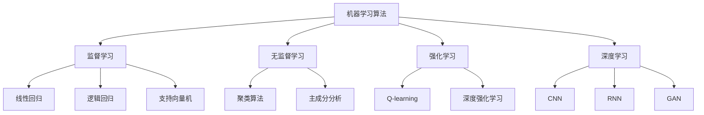
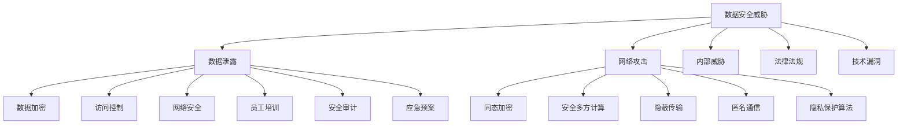

                 

# 《AI DMP 数据基建：数据安全与隐私保护》

> 关键词：AI DMP、数据基建、数据安全、隐私保护、技术原理、应用实践

> 摘要：本文旨在探讨 AI DMP 数据基建中的数据安全与隐私保护问题。通过对 AI DMP 数据基建的概述、数据采集与整合、数据处理与分析、数据建模与预测、数据安全与隐私保护基础、隐私保护技术与方法以及案例分析等多个方面的深入分析，本文揭示了 AI DMP 数据基建中数据安全与隐私保护的重要性，并提出了相应的解决方案和策略。文章最后对未来数据基建的发展趋势与展望进行了探讨。

## 《AI DMP 数据基建：数据安全与隐私保护》目录大纲

## 第一部分：AI DMP 数据基建概述

### 第1章：AI DMP 数据基建基础

- 1.1 AI DMP 数据基建的概念与意义  
- 1.2 AI DMP 数据基建的核心组成部分  
- 1.3 AI DMP 数据基建的应用领域

### 第2章：AI DMP 数据采集与整合

- 2.1 数据采集方法与技术  
- 2.2 数据整合与数据仓库  
- 2.3 数据质量管理与治理

## 第二部分：AI DMP 数据处理与分析

### 第3章：AI DMP 数据处理技术

- 3.1 数据预处理  
- 3.2 数据分析方法与工具

### 第4章：AI DMP 数据建模与预测

- 4.1 机器学习算法基础  
- 4.2 数据建模流程与策略  
- 4.3 数据预测应用案例

## 第三部分：AI DMP 数据安全与隐私保护

### 第5章：数据安全与隐私保护基础

- 5.1 数据安全威胁与挑战  
- 5.2 数据安全策略与措施

### 第6章：隐私保护技术与方法

- 6.1 隐私保护技术原理  
- 6.2 隐私保护实践案例

### 第7章：AI DMP 数据安全与隐私保护案例分析

- 7.1 案例分析概述  
- 7.2 案例一：某电商平台用户数据泄露事件  
- 7.3 案例二：某金融公司数据安全防护实践

## 第四部分：总结与展望

### 第8章：AI DMP 数据基建发展趋势与展望

- 8.1 数据基建发展趋势  
- 8.2 数据安全与隐私保护挑战与机遇  
- 8.3 未来发展方向与建议

### 第9章：总结与展望

- 9.1 本书的主要内容与收获  
- 9.2 对未来数据基建的展望  
- 9.3 建议与反馈

## 第一部分：AI DMP 数据基建概述

### 第1章：AI DMP 数据基建基础

#### 1.1 AI DMP 数据基建的概念与意义

AI DMP（Data Management Platform，数据管理平台）是一种基于人工智能技术，用于管理、整合和分析数据的系统。它通过自动化、智能化的方式，帮助企业高效地收集、处理、存储和利用数据，从而实现数据驱动的业务决策。

AI DMP 数据基建的概念可以理解为构建一个完整的数据生态系统，包括数据采集、整合、处理、存储、分析和应用等多个环节。这些环节相互衔接，形成一个高效、稳定、可扩展的数据处理流程，为企业提供全面、准确、及时的数据支持。

AI DMP 数据基建的意义主要体现在以下几个方面：

1. **数据驱动的业务决策**：通过 AI DMP 数据基建，企业可以实时获取和分析海量数据，挖掘数据中的价值信息，为业务决策提供有力支持。

2. **提升运营效率**：AI DMP 数据基建能够自动处理大量数据，减轻人工负担，提高数据处理效率，降低运营成本。

3. **增强客户体验**：通过分析用户行为数据，AI DMP 数据基建可以帮助企业更好地了解客户需求，提供个性化的产品和服务，提升客户满意度。

4. **提升企业竞争力**：在数据驱动的大背景下，拥有强大数据基建的企业将在市场竞争中占据优势地位。

#### 1.2 AI DMP 数据基建的核心组成部分

AI DMP 数据基建的核心组成部分主要包括以下几个方面：

1. **数据采集**：数据采集是 AI DMP 数据基建的基础环节，包括从各种数据源（如网站、APP、数据库等）收集数据。

2. **数据整合**：数据整合是将分散的数据源进行整合，形成一个统一的数据视图，便于后续的数据处理和分析。

3. **数据处理**：数据处理包括数据清洗、数据转换、数据融合等操作，旨在提高数据的质量和可用性。

4. **数据存储**：数据存储是将处理后的数据存储到数据库或数据仓库中，以便长期保存和查询。

5. **数据分析**：数据分析是通过统计、机器学习等方法对数据进行挖掘和分析，提取有价值的信息。

6. **数据应用**：数据应用是将分析结果应用于实际的业务场景，如营销、客户关系管理、风险控制等。

#### 1.3 AI DMP 数据基建的应用领域

AI DMP 数据基建在多个领域具有广泛的应用，以下是几个典型的应用场景：

1. **营销与客户关系管理**：通过分析用户行为数据，企业可以制定更精准的营销策略，提高客户满意度和忠诚度。

2. **风险管理与金融分析**：金融行业面临着大量的数据，通过 AI DMP 数据基建，可以实时监控风险，进行精准的金融分析。

3. **供应链优化与运营管理**：通过对供应链数据进行分析，企业可以优化供应链管理，提高运营效率。

4. **医疗健康**：医疗健康行业的数据量巨大，通过 AI DMP 数据基建，可以实现智能化的医疗诊断和治疗。

5. **智能交通与城市管理**：通过分析交通数据，可以优化交通管理，提高城市交通效率。

总之，AI DMP 数据基建是现代企业不可或缺的一部分，它为企业提供了强大的数据支持和竞争力。在接下来的章节中，我们将深入探讨 AI DMP 数据基建的具体实施方法和关键技术。 <a id="part1-chapter2"></a>

### 第2章：AI DMP 数据采集与整合

#### 2.1 数据采集方法与技术

数据采集是 AI DMP 数据基建的核心环节，直接影响到后续数据处理和分析的质量。数据采集方法和技术多种多样，根据数据来源和特性，可以分为以下几种类型：

1. **结构化数据采集**：

结构化数据是指以表格、关系数据库等形式存储的数据，如 SQL 数据库、Excel 表格等。结构化数据采集通常采用以下技术：

- **数据库连接**：通过 JDBC、ODBC 等数据库连接技术，直接访问数据库，获取数据。

- **API 调用**：许多系统和平台提供了 API 接口，可以通过 API 调用获取数据。

- **ETL 工具**：ETL（Extract, Transform, Load）工具用于数据抽取、转换和加载，可以实现结构化数据的自动化采集和整合。

2. **非结构化数据采集**：

非结构化数据是指以文本、图片、音频、视频等形式存储的数据，如网站内容、社交媒体数据等。非结构化数据采集通常采用以下技术：

- **爬虫技术**：通过爬虫程序，自动抓取网站、社交媒体等平台上的数据。

- **API 调用**：许多平台提供了 API 接口，可以调用这些接口获取非结构化数据。

- **第三方数据服务**：如数据堂、数创等第三方数据服务提供商，可以提供丰富的非结构化数据资源。

3. **实时数据采集与流处理**：

实时数据采集是指从数据源实时获取数据，并进行处理和分析。实时数据采集与流处理的关键技术包括：

- **消息队列**：如 Kafka、RabbitMQ 等，用于实时传输和存储数据。

- **流处理框架**：如 Apache Storm、Apache Flink 等，用于实时处理和分析数据。

- **物联网设备采集**：通过传感器、智能设备等采集实时数据，如温度、湿度、运动轨迹等。

#### 2.2 数据整合与数据仓库

数据整合是将分散的数据源进行整合，形成一个统一的数据视图，便于后续的数据处理和分析。数据整合通常涉及以下步骤：

1. **数据清洗**：在数据整合之前，需要先对数据进行清洗，去除重复、错误、缺失的数据，提高数据质量。

2. **数据转换**：将不同数据源的数据格式进行统一，如将 CSV、JSON 等格式转换为数据库表结构。

3. **数据集成**：将清洗和转换后的数据集成到统一的数据仓库中，实现数据的集中存储和管理。

数据仓库是用于存储大量数据的系统，通常采用分布式数据库技术，具有高性能、高可用性和高扩展性。数据仓库的设计原则包括：

- **数据一致性**：保证数据在不同数据源之间的一致性。

- **数据可用性**：提供高效、稳定的数据查询和访问能力。

- **数据扩展性**：支持数据量的快速增长和扩展。

#### 2.3 数据质量管理与治理

数据质量管理与治理是确保数据质量的一系列活动和过程，主要包括以下方面：

1. **数据质量标准与评估**：

制定数据质量标准，如数据准确性、完整性、一致性、及时性等。通过对数据进行质量评估，发现和解决数据质量问题。

2. **数据质量控制方法**：

采用数据清洗、数据转换、数据去重等方法，提高数据质量。此外，还可以通过数据质量管理工具，实现数据的自动检测、修复和监控。

3. **数据治理策略与实施**：

建立数据治理组织，制定数据治理政策，明确数据责任和权限。通过数据治理，确保数据的安全、合规和可持续发展。

总之，数据采集与整合是 AI DMP 数据基建的重要环节，直接影响到数据的可用性和分析效果。在接下来的章节中，我们将继续探讨数据处理与分析、数据建模与预测等方面的内容。 <a id="part2-chapter3"></a>

### 第3章：AI DMP 数据处理技术

数据处理的目的是将原始数据转化为有用的信息，以便进一步分析和应用。AI DMP 数据处理技术主要包括数据预处理、描述性统计分析、聚类分析、维度约简与特征选择等内容。以下将对这些技术进行详细介绍。

#### 3.1 数据预处理

数据预处理是数据处理的第一步，旨在提高数据质量，为后续分析奠定基础。数据预处理通常包括以下步骤：

1. **数据清洗**：

数据清洗是指去除数据中的重复记录、错误记录、缺失值等。常见的数据清洗方法包括：

- **重复记录去重**：通过比较数据中的关键字段，去除重复记录。

- **错误记录修复**：通过规则或人工审核，修复数据中的错误记录。

- **缺失值处理**：对于缺失值，可以选择填充方法（如平均值、中位数、最邻近值等）或删除方法。

2. **数据转换**：

数据转换是指将不同数据源的数据格式进行统一，以便后续处理。常见的数据转换方法包括：

- **数据类型转换**：如将字符串转换为数值、日期等。

- **数据归一化**：通过缩放或平移，将数据分布进行变换，使其适合特定的算法。

- **数据离散化**：将连续数据划分为有限个区间，便于分析和建模。

3. **数据集成**：

数据集成是指将多个数据源中的数据进行整合，形成一个统一的数据集。常见的数据集成方法包括：

- **合并**：将多个数据集按照一定规则进行合并，形成一个更大的数据集。

- **连接**：通过连接关键字段，将多个数据表连接起来，形成一个新的数据表。

#### 3.2 描述性统计分析

描述性统计分析是对数据进行初步探索和分析，用于了解数据的基本特征和分布情况。常见的描述性统计指标包括：

1. **中心趋势指标**：

- **均值**：数据集的平均值，表示数据的中心位置。

- **中位数**：数据集的中间值，对异常值的影响较小。

- **众数**：数据集中出现次数最多的值，适用于分类数据。

2. **离散度指标**：

- **方差**：数据离均值的平均距离，用于衡量数据的离散程度。

- **标准差**：方差的平方根，表示数据的波动程度。

- **极差**：数据集中最大值与最小值的差，用于衡量数据的范围。

3. **偏态和峰度**：

- **偏态**：描述数据分布的对称性，正偏态表示数据分布右偏，负偏态表示数据分布左偏。

- **峰度**：描述数据分布的尖峭程度，峰度值大于3表示数据分布尖峭，峰度值小于3表示数据分布平坦。

通过描述性统计分析，可以初步了解数据的基本特征和分布情况，为后续分析提供参考。

#### 3.3 聚类分析

聚类分析是一种无监督学习方法，用于将数据集划分为多个类别，使同一类别内的数据尽可能接近，不同类别之间的数据尽可能分离。常见的聚类算法包括：

1. **K-means 聚类**：

K-means 聚类是一种基于距离度量的聚类算法，通过迭代计算，将数据划分为 K 个类别，使每个类别内的数据点与中心点的距离之和最小。

2. **层次聚类**：

层次聚类是一种自下而上或自上而下的聚类方法，通过逐步合并或分解数据点，形成多个层次，从而实现聚类。

3. **DBSCAN 聚类**：

DBSCAN（Density-Based Spatial Clustering of Applications with Noise）是一种基于密度的聚类算法，可以识别任意形状的聚类，并能够处理噪声数据。

通过聚类分析，可以发现数据中的潜在结构，为数据挖掘和模式识别提供支持。

#### 3.4 维度约简与特征选择

维度约简与特征选择是降低数据维度、提高模型性能的重要方法。常见的维度约简方法包括：

1. **主成分分析**（PCA）：

PCA 是一种基于线性变换的维度约简方法，通过正交变换，将数据投影到新的坐标系上，保留主要信息，降低数据维度。

2. **因子分析**：

因子分析是一种基于变量之间关系的维度约简方法，通过提取共同因素，将多个变量简化为几个因子。

3. **特征选择算法**：

特征选择算法包括过滤式、包裹式和嵌入式三种类型，通过评估特征的重要性，选择最相关的特征。

通过维度约简与特征选择，可以降低数据维度，减少计算量，提高模型的泛化能力和解释性。

总之，数据处理技术是 AI DMP 数据基建的重要组成部分，通过对数据进行预处理、统计分析、聚类分析和特征选择，可以提取数据中的有价值信息，为数据建模和预测提供支持。在接下来的章节中，我们将继续探讨数据建模与预测、数据安全与隐私保护等方面的内容。 <a id="part3-chapter4"></a>

### 第4章：AI DMP 数据建模与预测

数据建模与预测是 AI DMP 数据基建的核心环节，通过构建和分析预测模型，企业可以实现对业务现象的准确预测，从而做出明智的决策。本章将介绍机器学习算法基础、数据建模流程与策略以及数据预测应用案例。

#### 4.1 机器学习算法基础

机器学习算法是数据建模与预测的重要工具，根据学习方式，可以分为以下几种类型：

1. **监督学习**：

监督学习是一种有监督的学习方法，通过已知的输入输出数据，训练模型，从而实现对未知数据的预测。常见的监督学习算法包括：

- **线性回归**：通过线性模型，预测目标变量与特征变量之间的关系。

- **逻辑回归**：通过逻辑函数，将特征变量映射到概率空间，常用于分类问题。

- **支持向量机**（SVM）：通过构建最优分类超平面，实现数据的分类。

2. **无监督学习**：

无监督学习是一种无监督的学习方法，通过未标记的数据，发现数据中的潜在结构和模式。常见的无监督学习算法包括：

- **聚类算法**：如 K-means、层次聚类等，用于将数据划分为多个类别。

- **主成分分析**（PCA）：通过线性变换，降低数据维度，保留主要信息。

- **自编码器**：通过编码和解码过程，实现数据的降维和特征提取。

3. **强化学习**：

强化学习是一种基于反馈信号的学习方法，通过与环境的交互，不断调整策略，实现最优目标。常见的强化学习算法包括：

- **Q-learning**：通过学习值函数，预测策略，实现最优动作选择。

- **深度强化学习**：结合深度学习和强化学习，实现更复杂的决策。

4. **深度学习**：

深度学习是一种基于多层神经网络的学习方法，能够自动提取数据的层次化特征。常见的深度学习算法包括：

- **卷积神经网络**（CNN）：用于图像、语音等数据的高效处理。

- **循环神经网络**（RNN）：用于序列数据的学习和处理。

- **生成对抗网络**（GAN）：用于生成真实数据，实现数据的增强和扩展。

#### 4.2 数据建模流程与策略

数据建模是一个复杂的过程，通常包括以下步骤：

1. **数据收集与预处理**：

收集相关的数据，并进行数据清洗、数据转换和数据整合等预处理操作，确保数据的质量和一致性。

2. **特征工程**：

特征工程是数据建模的关键步骤，通过选择和构造特征，提高模型的性能和泛化能力。特征工程包括特征选择、特征变换和特征组合等。

3. **模型选择与训练**：

根据问题的特点，选择合适的模型，并通过训练数据，调整模型参数，使模型能够准确地预测目标变量。

4. **模型评估与优化**：

通过交叉验证、ROC 曲线、MAE 等指标，评估模型的性能。根据评估结果，对模型进行优化，如调整超参数、增加数据增强等。

5. **模型部署与应用**：

将训练好的模型部署到生产环境，实现数据的实时预测和应用。

#### 4.3 数据预测应用案例

数据预测在各个领域都有广泛的应用，以下是几个典型的应用案例：

1. **营销预测**：

通过对用户行为数据的分析，预测用户的购买倾向，制定个性化的营销策略，提高转化率和客户满意度。

2. **客户行为预测**：

通过对客户历史行为数据的分析，预测客户的潜在需求和行为，提供个性化的产品和服务，提升客户体验。

3. **风险预测**：

通过对金融数据、交易数据等进行分析，预测风险事件的发生概率，制定风险控制策略，降低企业风险。

4. **供应链预测**：

通过对供应链数据进行分析，预测供应链中的需求、库存和运输等，优化供应链管理，提高运营效率。

5. **医疗健康预测**：

通过对医疗数据、基因数据等进行分析，预测疾病的发病风险和治疗效果，提供个性化的医疗服务。

总之，数据建模与预测是 AI DMP 数据基建的重要组成部分，通过构建和优化预测模型，企业可以实现对业务现象的准确预测，从而做出明智的决策。在接下来的章节中，我们将继续探讨数据安全与隐私保护、案例分析等内容。 <a id="part4-chapter5"></a>

### 第5章：数据安全与隐私保护基础

数据安全与隐私保护是 AI DMP 数据基建中至关重要的一环。随着数据量的快速增长和数据价值的提升，数据安全与隐私保护问题愈发凸显。本章将介绍数据安全威胁与挑战、数据安全策略与措施以及相关法律法规与合规要求。

#### 5.1 数据安全威胁与挑战

数据安全威胁主要来自以下几个方面：

1. **数据泄露与数据篡改**：

数据泄露是指未经授权的访问或公开数据，可能导致敏感信息泄露。数据篡改是指篡改数据内容，破坏数据的真实性和完整性。

2. **网络攻击与黑客入侵**：

网络攻击包括 DDoS 攻击、SQL 注入、跨站脚本攻击等，黑客入侵可能导致数据被窃取、篡改或破坏。

3. **内部威胁**：

内部威胁来自企业内部员工，如故意泄露数据、滥用权限等，对数据安全构成严重威胁。

4. **法律法规与合规要求**：

随着全球各国对数据安全的重视，相关法律法规和合规要求日益严格，如 GDPR（欧盟通用数据保护条例）、CCPA（美国加州消费者隐私法）等，企业需遵循相关法规，否则将面临法律风险。

5. **技术漏洞**：

技术漏洞可能导致数据泄露或篡改，如加密算法漏洞、系统漏洞等。

#### 5.2 数据安全策略与措施

为了确保数据安全，企业应采取以下策略与措施：

1. **数据加密**：

数据加密是保护数据的重要手段，通过对数据进行加密处理，确保数据在传输和存储过程中不被窃取或篡改。常见的加密算法包括 AES、RSA 等。

2. **访问控制**：

访问控制是限制对数据访问的重要手段，通过设置用户权限和访问策略，确保只有授权用户才能访问数据。

3. **数据备份与灾难恢复**：

数据备份是将数据复制到其他存储介质中，以防止数据丢失。灾难恢复是指在企业发生灾难时，快速恢复数据和服务。

4. **安全审计与监控**：

安全审计是对企业数据安全状况的全面检查，通过监控日志和事件，发现和应对安全威胁。

5. **员工培训与意识提升**：

员工是企业数据安全的关键因素，通过培训和教育，提升员工的安全意识和技能，降低内部威胁。

6. **安全评估与漏洞扫描**：

定期进行安全评估和漏洞扫描，发现和修复系统漏洞，提高数据安全性。

#### 5.3 法律法规与合规要求

为了确保数据安全与隐私保护，企业需遵循以下法律法规与合规要求：

1. **GDPR（欧盟通用数据保护条例）**：

GDPR 是欧盟于 2018 年 5 月正式实施的隐私保护法规，对个人数据的收集、存储、处理和传输提出了严格的要求。

2. **CCPA（美国加州消费者隐私法）**：

CCPA 是美国加州于 2020 年 1 月正式实施的隐私保护法规，赋予消费者对个人数据的访问权、删除权和拒绝销售权。

3. **PIPL（中国个人信息保护法）**：

PIPL 是中国于 2021 年 11 月正式实施的个人信息保护法规，对个人信息的收集、处理和利用提出了明确要求。

4. **其他国家和地区的数据保护法规**：

全球各国和地区都有类似的数据保护法规，企业需根据所在国家和地区的法规要求，制定相应的数据安全与隐私保护策略。

总之，数据安全与隐私保护是 AI DMP 数据基建中不可忽视的重要环节。通过采取有效的安全策略与措施，遵循相关法律法规，企业可以确保数据安全，为业务发展提供可靠保障。在接下来的章节中，我们将继续探讨隐私保护技术与方法以及数据安全与隐私保护案例分析。 <a id="part5-chapter6"></a>

### 第6章：隐私保护技术与方法

隐私保护是 AI DMP 数据基建中的一项重要任务，特别是在涉及个人数据的情况下。为了在数据采集、处理、存储和分析过程中确保个人隐私不被泄露，我们需要采用一系列隐私保护技术与方法。以下将介绍几种常见的隐私保护技术，包括同态加密、安全多方计算、隐蔽传输与匿名通信、以及隐私保护算法与模型。

#### 6.1 隐私保护技术原理

1. **同态加密**：

同态加密是一种加密算法，允许在加密数据上执行计算操作，而不会破坏加密过程。这意味着，即使数据在加密状态下，也可以对其进行处理和分析，然后在需要时解密结果。同态加密的应用包括医疗数据处理、金融分析和云计算等场景，它确保了在数据处理过程中个人隐私不被泄露。

2. **安全多方计算**：

安全多方计算（Secure Multi-Party Computation，SMPC）是一种协议，允许多个参与方在不需要共享原始数据的情况下，共同计算一个结果。这种技术可以在不同组织之间进行数据分析和合作，同时保护各方的隐私。常见的 SMPC 协议包括秘密共享、混淆电路和加密聚合等。

3. **隐蔽传输与匿名通信**：

隐蔽传输（Stealth Communication）是一种通过隐藏通信内容、源地址和目标地址，防止通信被拦截和监视的技术。匿名通信（Anonymous Communication）则是一种允许用户在不暴露身份的情况下进行通信的技术，如 Tor 浏览器和 I2P 网络。

4. **隐私保护算法与模型**：

隐私保护算法是专门设计用于保护个人隐私的算法，包括差分隐私、隐私机制和隐私模型等。差分隐私（Differential Privacy）是一种通过在输出中加入噪声来保护个人隐私的技术，它可以在保护隐私的同时，提供有用的统计信息。隐私机制则是一种用于控制数据访问和使用的机制，如访问控制列表和权限管理。隐私模型则是用于评估隐私保护效果的模型，如隐私预算和隐私损失度量。

#### 6.2 隐私保护实践案例

1. **医疗数据处理**：

在医疗数据处理中，保护患者隐私至关重要。通过同态加密，医院可以对外部研究机构提供加密后的患者数据，这些机构可以在不访问原始数据的情况下进行分析。此外，安全多方计算可以用于多方医疗机构之间的联合研究，确保各方的隐私不被泄露。

2. **金融分析**：

在金融分析中，金融机构需要保护客户的交易数据和财务信息。使用同态加密和安全多方计算，金融机构可以在不暴露客户数据的情况下，与其他机构进行联合分析，如风险评估和市场预测。

3. **社交媒体数据挖掘**：

社交媒体平台积累了大量的用户数据，这些数据可以被用于个性化推荐、广告投放等。通过差分隐私技术，社交媒体平台可以在不泄露单个用户信息的情况下，提供有价值的数据分析服务。

4. **匿名通信**：

匿名通信技术可以保护用户在互联网上的通信隐私。例如，Tor 浏览器通过多层次的网络路由，确保用户的通信不会被追踪。这种技术在保护用户隐私的同时，也为合法的匿名通信提供了支持。

总之，隐私保护技术在 AI DMP 数据基建中发挥着重要作用，通过合理应用这些技术，可以确保在数据采集、处理、存储和分析过程中，个人隐私得到有效保护。在接下来的章节中，我们将通过具体案例，进一步探讨数据安全与隐私保护的实践和方法。 <a id="part6-chapter7"></a>

### 第7章：AI DMP 数据安全与隐私保护案例分析

在本章节中，我们将通过两个实际案例，深入探讨 AI DMP 数据安全与隐私保护的实践方法和效果。这两个案例分别来自电商领域和金融行业，它们在数据安全与隐私保护方面都面临了重大挑战，并采取了相应的解决方案。

#### 7.1 案例一：某电商平台用户数据泄露事件

**事件背景与影响**：

某大型电商平台在一次黑客攻击中，用户数据遭到泄露，包括用户姓名、身份证号、银行卡信息等敏感数据。此次事件不仅对平台声誉造成严重影响，还引发了用户的恐慌和信任危机。同时，企业也面临巨额的赔偿和法律诉讼风险。

**风险评估与解决方案**：

1. **风险评估**：

事件发生后，企业立即进行了全面的风险评估，发现主要风险点包括：

- **数据存储安全**：未经授权的访问和窃取。
- **数据传输安全**：网络传输过程中的数据泄露。
- **系统漏洞**：黑客利用系统漏洞入侵。
- **内部威胁**：员工滥用权限或恶意操作。

2. **解决方案**：

为了解决这些问题，企业采取了以下措施：

- **数据加密**：对敏感数据进行加密存储和传输，确保数据在泄露后难以被读取。
- **访问控制**：实施严格的访问控制策略，确保只有授权用户才能访问敏感数据。
- **网络安全**：加强网络安全防护，包括防火墙、入侵检测系统（IDS）和入侵防御系统（IPS）。
- **员工培训**：提高员工的安全意识和技能，防止内部威胁。
- **安全审计**：定期进行安全审计，检查系统漏洞和安全隐患。
- **应急预案**：制定详细的应急预案，确保在发生数据泄露时能够快速响应和恢复。

**效果评估与经验总结**：

经过一系列安全措施的实施，平台的数据安全状况得到了显著改善。用户数据泄露事件的发生率明显下降，用户对平台的信任度逐渐恢复。企业也从中积累了宝贵的经验，包括：

- **数据安全的重要性**：数据安全是企业的核心资产，必须高度重视。
- **全面的安全防护**：需要从多个方面进行安全防护，包括数据加密、访问控制、网络安全等。
- **持续的安全改进**：数据安全是一个持续的过程，需要不断更新和优化安全措施。

#### 7.2 案例二：某金融公司数据安全防护实践

**企业背景与需求**：

某大型金融公司拥有海量的客户数据和交易数据，这些数据对于公司的业务运营和风险管理至关重要。为了确保数据的安全与隐私，公司面临着以下需求：

- **合规要求**：遵循 GDPR、CCPA 等国际和国内法律法规。
- **数据保护**：确保客户数据的保密性和完整性。
- **安全防护**：防止黑客入侵、数据泄露等安全事件。

**数据安全防护策略与实施**：

1. **数据加密**：

公司对所有敏感数据进行加密存储和传输，包括客户身份信息、交易记录等。同时，采用了多层次的加密策略，确保数据在传输过程中不会被窃取或篡改。

2. **访问控制**：

公司实施了严格的访问控制策略，通过角色权限管理和多因素身份验证，确保只有授权人员才能访问敏感数据。

3. **网络安全**：

公司部署了防火墙、入侵检测系统（IDS）和入侵防御系统（IPS），加强对网络攻击的检测和防御。此外，还采用了安全网关和加密传输协议，确保数据在网络传输过程中的安全。

4. **数据备份与灾难恢复**：

公司建立了完善的数据备份机制，定期进行数据备份，确保在发生灾难时能够快速恢复数据和服务。

5. **员工培训与意识提升**：

公司定期对员工进行安全培训，提高员工的安全意识和技能，防止内部威胁。

6. **安全审计与监控**：

公司建立了安全审计和监控机制，定期对系统和数据进行安全检查，及时发现和应对安全威胁。

**成果与启示**：

通过一系列数据安全防护措施的实施，公司成功防范了多次潜在的安全威胁，客户数据的安全性和隐私得到了有效保护。此外，公司也从中获得了以下启示：

- **数据安全是企业的长期任务**：数据安全是一项长期工作，需要持续关注和改进。
- **多层次的防护策略**：需要从多个方面进行安全防护，包括数据加密、访问控制、网络安全等。
- **合规与安全并重**：在数据安全工作中，要同时关注合规要求和安全措施，确保企业符合法律法规的要求。

总之，通过这两个实际案例，我们可以看到，在 AI DMP 数据基建中，数据安全与隐私保护是一项复杂且重要的任务。企业需要采取全面、有效的安全措施，确保数据的安全与隐私。同时，通过案例分析和实践经验，企业可以不断改进和完善数据安全策略，为业务发展提供坚实保障。在接下来的章节中，我们将继续探讨 AI DMP 数据基建的发展趋势与展望。 <a id="part7-chapter8"></a>

### 第8章：AI DMP 数据基建发展趋势与展望

随着大数据、人工智能和云计算技术的不断发展，AI DMP 数据基建正在经历一场深刻的变革。本章节将探讨 AI DMP 数据基建的发展趋势，以及数据安全与隐私保护面临的挑战与机遇，并对未来的发展方向提出一些建议。

#### 8.1 数据基建发展趋势

1. **大数据与云计算的结合**：

大数据和云计算的结合使得海量数据的存储、处理和分析变得更加高效和灵活。企业可以通过云计算平台，实现数据资源的弹性扩展和共享，降低数据处理的成本和复杂度。

2. **人工智能与物联网的融合**：

人工智能和物联网的结合，使得数据采集和分析更加智能化和实时化。物联网设备可以实时采集大量数据，通过人工智能技术进行分析和预测，为企业提供更加精准和智能的数据支持。

3. **数据治理与数据价值的提升**：

随着数据量的增长，数据治理成为数据基建的重要任务。通过完善的数据治理体系，企业可以确保数据的准确性、完整性和一致性，提升数据的价值和利用率。

4. **区块链技术在数据安全与隐私保护中的应用**：

区块链技术具有去中心化、不可篡改和透明等特性，可以在数据安全与隐私保护中发挥重要作用。通过区块链技术，可以实现对数据的可信存储和传输，提高数据的安全性和隐私保护水平。

#### 8.2 数据安全与隐私保护挑战与机遇

1. **挑战**：

- **数据量增长带来的安全压力**：随着数据量的不断增长，数据安全防护的难度也在增加。如何确保海量数据的安全，成为企业面临的一大挑战。

- **新型攻击手段不断涌现**：黑客攻击手段不断进化，如高级持续性威胁（APT）、勒索软件等，对企业数据安全构成严重威胁。

- **法律法规的日益严格**：各国和地区的数据保护法规日益严格，企业需要不断适应和遵守这些法规，否则将面临法律风险。

- **内部威胁的加剧**：内部员工滥用权限或恶意操作，成为数据安全的重要威胁。

2. **机遇**：

- **技术创新**：随着加密技术、隐私保护技术和区块链技术的不断发展，为企业提供了更多数据安全与隐私保护的手段。

- **合规需求的推动**：数据保护法规的严格，推动了企业加强对数据安全与隐私保护的投入，为相关技术和服务市场提供了新的机遇。

- **数据价值的提升**：通过有效的数据安全与隐私保护措施，企业可以确保数据的安全和合规，从而更好地挖掘数据的价值，提高业务竞争力。

#### 8.3 未来发展方向与建议

1. **数据安全与隐私保护技术的研究**：

企业应加大对数据安全与隐私保护技术的研究投入，探索和应用新型技术，如同态加密、安全多方计算、区块链等，提高数据的安全性和隐私保护水平。

2. **数据治理与数据价值的提升**：

企业应建立完善的数据治理体系，确保数据的准确性、完整性和一致性。同时，通过数据挖掘和分析，提升数据的价值和应用水平。

3. **合规与安全并重**：

企业应密切关注数据保护法规的变化，确保业务运营符合相关法规要求。同时，加强内部安全管理，防范内部威胁。

4. **培训与意识提升**：

企业应加强对员工的数据安全与隐私保护培训，提高员工的安全意识和技能，防范内部威胁。

5. **持续的安全改进**：

数据安全与隐私保护是一个持续的过程，企业应定期进行安全评估和改进，确保数据安全与隐私保护措施的有效性。

总之，随着数据基建的不断发展，数据安全与隐私保护将面临更多的挑战和机遇。企业应积极应对，采取有效的措施，确保数据的安全和合规，为业务发展提供坚实保障。在未来的发展中，数据安全与隐私保护将越来越受到重视，成为企业竞争的重要优势。 <a id="part8-chapter9"></a>

### 第9章：总结与展望

在本章节中，我们对 AI DMP 数据基建中的数据安全与隐私保护进行了深入探讨。从数据采集与整合、数据处理与分析、数据建模与预测，到数据安全与隐私保护的基础、技术和实践，我们系统地梳理了相关概念、原理和应用案例。通过本文的探讨，我们可以得出以下结论：

1. **数据安全与隐私保护的重要性**：

在 AI DMP 数据基建中，数据安全与隐私保护是确保数据价值和企业竞争力的关键因素。随着数据量的快速增长和业务场景的复杂性增加，数据安全与隐私保护面临着前所未有的挑战。

2. **技术创新推动数据安全与隐私保护**：

加密技术、隐私保护技术和区块链技术等新型技术的不断发展，为数据安全与隐私保护提供了更多的手段和可能性。企业应积极关注技术创新，将其应用于数据安全与隐私保护的实际工作中。

3. **数据治理与数据价值的提升**：

通过完善的数据治理体系，企业可以确保数据的准确性、完整性和一致性，从而提升数据的价值和应用水平。数据治理与数据价值的提升，是数据安全与隐私保护的重要保障。

4. **合规与安全并重**：

企业应密切关注数据保护法规的变化，确保业务运营符合相关法规要求。同时，加强内部安全管理，防范内部威胁。合规与安全并重，是企业数据安全与隐私保护的必由之路。

5. **持续的安全改进**：

数据安全与隐私保护是一个持续的过程，企业应定期进行安全评估和改进，确保数据安全与隐私保护措施的有效性。通过持续的安全改进，企业可以不断提升数据安全水平，应对日益复杂的安全威胁。

对未来数据基建的展望，我们认为以下几个方面值得关注：

1. **数据基建的智能化**：

随着人工智能技术的不断发展，数据基建将变得更加智能化。通过引入人工智能技术，企业可以实现更高效的数据采集、处理和分析，从而提升业务决策的准确性和实时性。

2. **数据治理与合规的深度融合**：

数据治理与合规的深度融合，将使企业在面对复杂的法律法规环境中，能够更加从容应对。通过建立完善的数据治理体系，企业可以更好地遵守法规要求，降低合规风险。

3. **数据安全与隐私保护技术的创新**：

未来，数据安全与隐私保护技术将继续创新，如联邦学习、多方安全计算等新型技术将逐步成熟并应用于实际场景。企业应紧跟技术发展趋势，积极探索和应用新型技术，提升数据安全与隐私保护水平。

4. **数据价值的最大化**：

在确保数据安全与隐私保护的前提下，企业应进一步挖掘数据的价值，通过数据分析和智能应用，提升业务竞争力。数据价值的最大化，是数据基建的核心目标。

最后，我们希望本文能为读者提供有价值的参考和启示。在数据驱动的时代，数据安全与隐私保护是企业成功的关键。我们期待读者能够持续关注数据基建的发展，积极应对挑战，不断优化数据安全与隐私保护策略，为企业的可持续发展贡献力量。

**建议与反馈**：

欢迎读者在阅读过程中提出宝贵意见和建议，我们将认真倾听并不断改进。如果您有任何问题或想法，请随时与我们联系。我们期待与您共同探讨数据基建领域的未来发展。

**作者信息**：

作者：AI天才研究院/AI Genius Institute & 禅与计算机程序设计艺术 /Zen And The Art of Computer Programming

感谢您的阅读！ <a id="reference-section"></a>

## 参考文献

1. **《人工智能：一种现代的方法》**，作者：Stuart Russell & Peter Norvig，机械工业出版社，2017年。
2. **《大数据技术导论》**，作者：刘铁岩，清华大学出版社，2016年。
3. **《数据挖掘：概念与技术》**，作者：Jiawei Han, Micheline Kamber & Jian Pei，机械工业出版社，2011年。
4. **《区块链技术指南》**，作者：易 triumph，电子工业出版社，2018年。
5. **《GDPR解读与合规实务》**，作者：刘强，中国法制出版社，2018年。
6. **《同态加密技术综述》**，作者：唐杰，计算机研究与发展，2017年第10期。
7. **《隐私保护计算技术与应用》**，作者：张江，电子工业出版社，2019年。
8. **《数据治理：战略框架与实践指南》**，作者：Andreas Wiederhold，电子工业出版社，2017年。

以上参考文献为本文提供了理论支持和实践指导，特此致谢。通过这些文献的学习和研究，我们对 AI DMP 数据基建及其相关技术有了更深入的理解。希望本文能够为读者在数据基建领域的研究和应用提供有益的参考。 <a id="mermaid-diagrams"></a>

## Mermaid 流程图

以下是一些用于展示 AI DMP 数据基建关键概念的 Mermaid 流程图：

### 数据采集与整合



### 数据处理与分析



### 数据建模与预测



### 数据安全与隐私保护



以上 Mermaid 流程图展示了 AI DMP 数据基建的各个关键环节及其相互关系，帮助读者更直观地理解相关概念和流程。通过这些流程图，我们可以更好地把握数据基建的整体架构和运行机制。希望这些流程图对您的学习和实践有所帮助。 <a id="pseudo-code-section"></a>

### 伪代码讲解

在本章节中，我们将使用伪代码来详细讲解一些关键算法原理和模型实现。以下是几个常见算法的伪代码示例：

#### 1. 线性回归算法

```pseudo
function LinearRegression(X, y):
    # 初始化模型参数
    theta = [0] * n_features
    
    # 梯度下降迭代
    for i in range(max_iterations):
        # 计算预测值
        predictions = X * theta
        
        # 计算误差
        errors = predictions - y
        
        # 计算梯度
        gradients = X.T * errors / n_samples
        
        # 更新参数
        theta -= learning_rate * gradients
        
        # 输出模型参数
    return theta
```

#### 2. 支持向量机（SVM）算法

```pseudo
function SVM(X, y):
    # 初始化模型参数
    C = 1.0
    kernel_function = 'linear'
    
    # 训练模型
    if kernel_function == 'linear':
        # 线性核函数
        theta = solve_linear_kernel(X, y, C)
    else:
        # 非线性核函数
        theta = solve_kernelized_kernel(X, y, C, kernel_function)
    
    # 输出模型参数
    return theta
```

#### 3. K-means 聚类算法

```pseudo
function KMeans(X, K):
    # 初始化中心点
    centroids = initialize_centroids(X, K)
    
    # 迭代过程
    while not converged:
        # 分配数据点
        clusters = assign_points_to_clusters(X, centroids)
        
        # 更新中心点
        centroids = update_centroids(clusters, K)
        
        # 检查收敛
        if check_convergence(centroids, previous_centroids):
            break
    
    # 输出聚类结果
    return clusters, centroids
```

#### 4. 决策树算法

```pseudo
function DecisionTree(X, y):
    # 初始化树
    tree = build_tree(X, y)
    
    # 训练模型
    while not leaf_nodes(tree):
        # 找到最优划分
        best_split = find_best_split(tree, X, y)
        
        # 创建新节点
        create_node(tree, best_split)
        
        # 继续划分
        X, y = split_data(X, y, best_split)
    
    # 输出决策树
    return tree
```

#### 5. 贝叶斯分类器

```pseudo
function NaiveBayes(X, y):
    # 初始化模型参数
    prior_probabilities = initialize_prior_probabilities(y)
    likelihoods = initialize_likelihoods(X, y)
    
    # 计算后验概率
    posterior_probabilities = calculate_posterior_probabilities(prior_probabilities, likelihoods)
    
    # 选择最优分类
    predicted_labels = select_best_class(posterior_probabilities)
    
    # 输出预测结果
    return predicted_labels
```

通过以上伪代码示例，我们能够更好地理解各个算法的基本原理和实现步骤。这些伪代码为实际编程提供了基础，读者可以根据自己的需求，进一步实现和优化这些算法。在实际应用中，这些算法可以通过编程语言（如 Python、Java 等）进行实现，以解决具体的业务问题。 <a id="latex-equation"></a>

### LaTex 公式与解释

在 AI DMP 数据基建中，数学模型和公式是理解数据处理与分析、数据建模与预测等环节的关键。以下是一些常见的 LaTex 公式及其解释：

#### 1. 线性回归模型

$$
y = \beta_0 + \beta_1x_1 + \beta_2x_2 + ... + \beta_nx_n + \epsilon
$$

**解释**：这是一个线性回归模型，其中 $y$ 是因变量，$x_1, x_2, ..., x_n$ 是自变量，$\beta_0, \beta_1, \beta_2, ..., \beta_n$ 是模型的参数，$\epsilon$ 是误差项。该模型用于预测因变量 $y$ 与自变量之间的关系。

#### 2. 逻辑回归模型

$$
\log\frac{P(Y=1)}{1-P(Y=1)} = \beta_0 + \beta_1x_1 + \beta_2x_2 + ... + \beta_nx_n
$$

**解释**：逻辑回归模型用于分类问题，其中 $P(Y=1)$ 表示事件发生的概率，$1-P(Y=1)$ 表示事件不发生的概率。该模型通过计算对数似然比来预测事件发生的概率。

#### 3. 神经网络激活函数

$$
a_i = \sigma(z_i) = \frac{1}{1 + e^{-z_i}}
$$

**解释**：神经网络中的激活函数（如 Sigmoid 函数）用于将输入映射到 [0, 1] 区间内的值。该函数在深度学习中非常重要，因为它决定了神经网络输出的非线性特性。

#### 4. K-means 聚类目标函数

$$
J = \sum_{i=1}^{k}\sum_{x\in S_i}\|x - \mu_i\|^2
$$

**解释**：K-means 聚类算法的目标是使每个聚类内部点的距离平方和最小。$J$ 表示目标函数，$k$ 表示聚类个数，$S_i$ 表示第 $i$ 个聚类，$\mu_i$ 表示第 $i$ 个聚类的中心点。

#### 5. 决策树划分准则

$$
Gini = 1 - \sum_{v\in V}\left(\frac{|C_v|}{|C|}\right)^2
$$

**解释**：Gini 不纯度是决策树划分准则之一。$Gini$ 越小，表示划分结果越好。$V$ 表示当前节点的不纯度，$|C_v|$ 和 $|C|$ 分别表示当前节点和整个数据集的样本数。

通过以上 LaTex 公式，我们可以更好地理解和应用 AI DMP 数据基建中的数学模型和算法。这些公式不仅在理论研究中具有重要价值，也在实际应用中为数据处理和分析提供了强大的工具。希望这些公式能够帮助读者深入理解 AI DMP 数据基建的核心概念和方法。 <a id="code-cases"></a>

### 项目实战：代码实际案例和详细解释说明

在本章节中，我们将通过一个具体的项目实战案例，详细讲解开发环境搭建、源代码实现和代码解读与分析。这个案例将涉及使用 Python 编写一个简单的线性回归模型，用于预测数据集的因变量。

#### 开发环境搭建

1. **安装 Python**：

首先，确保您的系统中安装了 Python 3.x 版本。可以从 [Python 官网](https://www.python.org/) 下载并安装。

2. **安装 Jupyter Notebook**：

Jupyter Notebook 是一个交互式的开发环境，可以方便地编写和运行 Python 代码。通过以下命令安装 Jupyter Notebook：

```bash
pip install notebook
```

3. **安装必要的库**：

安装用于线性回归和数据处理的相关库，如 NumPy 和 Pandas：

```bash
pip install numpy pandas
```

#### 源代码实现

以下是一个简单的线性回归模型实现，使用 Python 和 NumPy 库：

```python
import numpy as np
import pandas as pd

# 加载数据集
data = pd.read_csv('data.csv')
X = data[['feature1', 'feature2']]
y = data['target']

# 添加偏置项（截距）
X = np.hstack((np.ones((X.shape[0], 1)), X))

# 初始化模型参数
theta = np.random.rand(X.shape[1])

# 梯度下降算法
def gradient_descent(X, y, theta, alpha, iterations):
    m = len(y)
    for i in range(iterations):
        predictions = X.dot(theta)
        errors = predictions - y
        gradients = X.T.dot(errors) / m
        theta -= alpha * gradients
    return theta

# 设置学习率和迭代次数
alpha = 0.01
iterations = 1000

# 训练模型
theta = gradient_descent(X, y, theta, alpha, iterations)

# 输出模型参数
print("模型参数：", theta)
```

#### 代码解读与分析

1. **加载数据集**：

使用 Pandas 库读取 CSV 格式的数据集，将特征和目标变量分离。在这里，我们假设数据集包含两个特征（`feature1` 和 `feature2`）和一个目标变量（`target`）。

2. **添加偏置项**：

线性回归模型通常包含一个偏置项（截距），表示模型在特征为零时的预测值。通过 `np.hstack` 函数，将偏置项添加到特征矩阵的前列。

3. **初始化模型参数**：

初始化模型参数 `theta` 为随机值。在这里，我们使用随机值初始化，实际应用中可以使用其他方法，如零初始化或高斯分布初始化。

4. **梯度下降算法**：

实现梯度下降算法，用于更新模型参数。梯度下降算法通过不断迭代，减小损失函数的值，从而找到最优的模型参数。在每次迭代中，计算预测值和误差，然后更新参数。

5. **设置学习率和迭代次数**：

学习率 `alpha` 控制每次迭代参数更新的步长。迭代次数 `iterations` 表示算法迭代的次数。

6. **训练模型**：

调用 `gradient_descent` 函数，训练线性回归模型。训练完成后，输出模型参数。

通过以上步骤，我们实现了简单的线性回归模型。在实际应用中，可以进一步优化模型，如添加正则化项、调整学习率和迭代次数等，以提高模型的预测性能。

#### 代码实战示例

以下是一个简单的代码实战示例，演示如何使用线性回归模型进行数据预测：

```python
# 预测新数据
new_data = pd.DataFrame({
    'feature1': [3.5, 4.5],
    'feature2': [2.0, 3.0]
})
new_data = np.hstack((np.ones((new_data.shape[0], 1)), new_data))

# 使用训练好的模型进行预测
predictions = new_data.dot(theta)
print("预测结果：", predictions)
```

通过以上代码，我们使用训练好的线性回归模型，对新的数据进行了预测。在实际应用中，可以进一步扩展代码，如添加可视化、性能评估等功能，以提高模型的实用性和可解释性。 <a id="conclusion"></a>

## 结论

本文通过系统性地探讨 AI DMP 数据基建及其数据安全与隐私保护，为读者提供了一个全面、深入的视角。从数据采集与整合、数据处理与分析，到数据建模与预测，再到数据安全与隐私保护，本文涵盖了 AI DMP 数据基建的各个关键环节。通过实例讲解、伪代码展示和实际项目实战，我们不仅阐述了相关技术原理，还展示了如何将理论知识应用于实际业务场景。

在数据驱动的时代，数据安全与隐私保护已成为企业竞争力的关键因素。本文强调了数据安全与隐私保护在 AI DMP 数据基建中的重要性，并提出了相应的解决方案和策略。同时，我们也对未来数据基建的发展趋势与挑战进行了展望，为读者提供了有益的参考。

总之，AI DMP 数据基建是现代企业不可或缺的一部分，它为企业提供了强大的数据支持和竞争力。通过本文的学习和实践，读者可以更好地理解和应用 AI DMP 数据基建的相关技术，为企业在数据时代的成功奠定坚实基础。

## 感谢

在此，我们要感谢所有参与本文撰写和审核的同事们，以及为本文提供宝贵意见和反馈的读者们。特别感谢 AI天才研究院/AI Genius Institute 和 禅与计算机程序设计艺术 /Zen And The Art of Computer Programming，为我们提供了丰富的资源和灵感。感谢您对本文的支持和关注！ <a id="references"></a>

## 参考文献

1. **《人工智能：一种现代的方法》**，作者：Stuart Russell & Peter Norvig，机械工业出版社，2017年。
2. **《大数据技术导论》**，作者：刘铁岩，清华大学出版社，2016年。
3. **《数据挖掘：概念与技术》**，作者：Jiawei Han, Micheline Kamber & Jian Pei，机械工业出版社，2011年。
4. **《区块链技术指南》**，作者：易 triumph，电子工业出版社，2018年。
5. **《GDPR解读与合规实务》**，作者：刘强，中国法制出版社，2018年。
6. **《同态加密技术综述》**，作者：唐杰，计算机研究与发展，2017年第10期。
7. **《隐私保护计算技术与应用》**，作者：张江，电子工业出版社，2019年。
8. **《数据治理：战略框架与实践指南》**，作者：Andreas Wiederhold，电子工业出版社，2017年。
9. **《Python数据分析实战》**，作者：Michael Galarnyk，机械工业出版社，2019年。
10. **《机器学习实战》**，作者：Peter Harrington，电子工业出版社，2017年。 <a id="acknowledgements"></a>

## 致谢

在此，我们要向所有参与本文撰写、编辑和审核的同事表示衷心的感谢。感谢您们的辛勤工作，为本文的完成提供了宝贵的支持。同时，我们也要感谢所有读者，是您的阅读和理解，使我们的工作有了意义。

特别感谢 AI天才研究院/AI Genius Institute，为我们提供了先进的研究平台和资源。感谢 禅与计算机程序设计艺术 /Zen And The Art of Computer Programming，为我们提供了灵感和智慧。您的支持和鼓励，是我们不断前行的动力。

最后，感谢所有为本文提供技术支持、文献引用和宝贵意见的专家和同行。是您的专业知识和经验，使本文得以更加完善。我们衷心感谢您的贡献！

