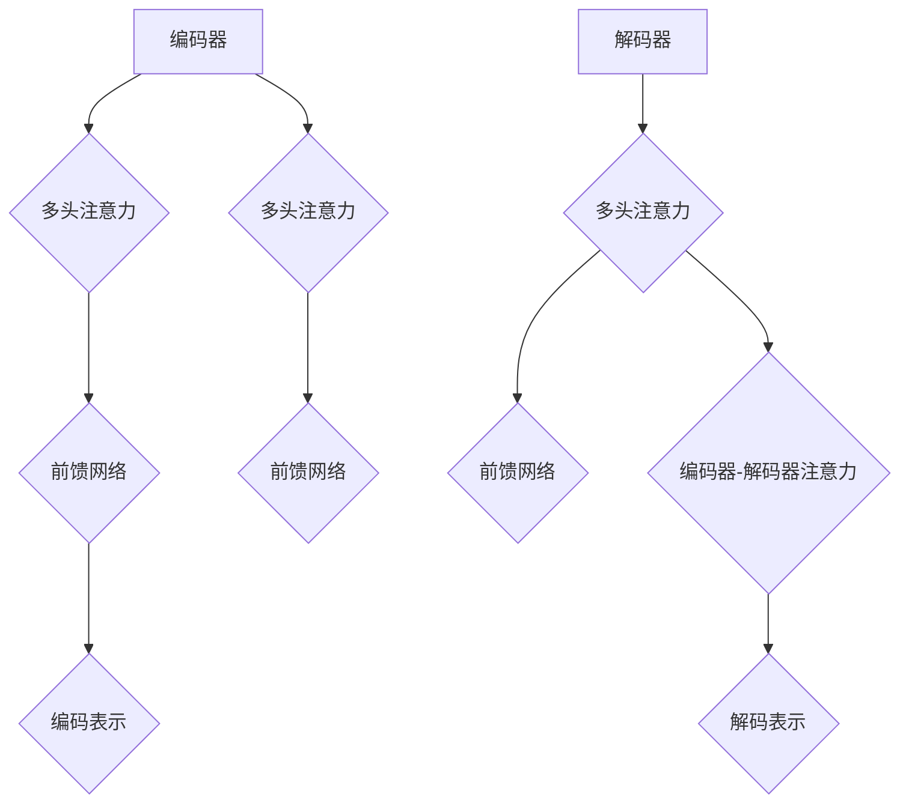

                 

# AI 大模型创业：如何利用渠道优势？

> **关键词：** AI大模型，创业，渠道优势，市场定位，商业化路径，创新策略

> **摘要：** 本篇文章将探讨AI大模型创业领域的相关概念、核心算法、应用案例，并深入分析如何利用渠道优势进行创业实践。我们将从团队构建、市场定位、商业模式设计、营销推广、团队成长与持续创新等方面展开讨论，旨在为有志于投身AI大模型创业的创业者提供有益的参考。

## 目录大纲：AI大模型创业：如何利用渠道优势？

### 第一部分：AI大模型基础知识

#### 第1章：AI大模型简介

1.1 AI大模型的概念与分类  
1.2 AI大模型的发展历程  
1.3 AI大模型的优势与挑战

### 第二部分：AI大模型核心算法

#### 第2章：AI大模型核心算法

2.1 深度学习基础  
2.1.1 神经网络的基本结构  
2.1.2 深度学习优化算法  
2.1.3 激活函数

#### 第3章：AI大模型构建与训练

3.1 数据预处理  
3.1.1 数据收集与清洗  
3.1.2 数据标注与划分  
3.1.3 数据增强技术

#### 第4章：AI大模型应用案例

4.1 金融领域应用  
4.1.1 信贷风险评估  
4.1.2 股票市场预测  
4.1.3 量化交易策略

### 第三部分：AI大模型创业实践

#### 第5章：AI大模型创业实践

5.1 创业团队构建与运营策略  
5.1.1 团队成员角色与职责  
5.1.2 创业初期资源整合  
5.1.3 创业风险与应对策略

#### 第6章：渠道优势与市场定位

6.1 渠道策略制定  
6.1.1 渠道策略制定  
6.1.2 市场细分与目标客户定位  
6.1.3 竞争对手分析与差异化策略

### 第四部分：AI大模型商业化路径

#### 第7章：AI大模型商业化路径

7.1 商业模式设计  
7.1.1 产品定价策略  
7.1.2 收入来源多元化  
7.1.3 客户关系管理

#### 第8章：营销推广策略

8.1 内容营销与社交媒体推广  
8.1.2 公关活动与品牌建设  
8.1.3 线上线下营销整合

### 第五部分：创业团队成长与持续创新

#### 第9章：创业团队成长与持续创新

9.1 团队文化与人才管理  
9.1.1 团队文化建设与价值观塑造  
9.1.2 人才引进与培养  
9.1.3 绩效评估与激励机制

#### 第10章：创新能力培养与持续研发

10.1 研发策略与投入  
10.1.2 技术创新与知识产权保护  
10.1.3 跨界合作与生态构建

### 附录

#### 附录A：AI大模型开发工具与资源

A.1 主流深度学习框架对比  
A.2 开发环境搭建与配置  
A.3 常用数据集与工具介绍

<|assistant|>## 第一部分：AI大模型基础知识

### 第1章：AI大模型简介

#### 1.1 AI大模型的概念与分类

人工智能（AI）大模型是一种具有高度复杂性和强大处理能力的机器学习模型，通常用于处理大规模的数据集和复杂的任务。AI大模型主要包括以下几类：

1. **深度神经网络（Deep Neural Network，DNN）**：基于多层神经网络结构，可以处理高维数据，如图像、语音等。

2. **生成对抗网络（Generative Adversarial Network，GAN）**：由生成器和判别器组成，用于生成高质量的数据。

3. **变分自编码器（Variational Autoencoder，VAE）**：基于概率模型，可以生成新的数据样本。

4. **递归神经网络（Recurrent Neural Network，RNN）**：可以处理序列数据，如时间序列数据、自然语言文本等。

5. **卷积神经网络（Convolutional Neural Network，CNN）**：常用于图像识别和图像处理。

6. **长短期记忆网络（Long Short-Term Memory，LSTM）**：RNN的一种变体，可以解决长短期依赖问题。

#### 1.2 AI大模型的发展历程

AI大模型的发展历程可以追溯到20世纪80年代，随着计算机性能的提升和算法的改进，深度学习逐渐成为人工智能领域的核心技术。以下是AI大模型发展的几个重要阶段：

1. **1986年**：神经网络理论奠基人之一Hinton提出了反向传播算法，使得多层神经网络训练成为可能。

2. **2006年**：Hinton等人提出了深度信念网络（Deep Belief Network，DBN），为深度学习奠定了基础。

3. **2012年**：Hinton团队提出了卷积神经网络（CNN）在ImageNet图像识别比赛中取得了突破性成绩，深度学习开始受到广泛关注。

4. **2014年**：生成对抗网络（GAN）被提出，为生成模型的研究开辟了新方向。

5. **2016年**：AlphaGo战胜世界围棋冠军李世石，标志着人工智能在特定领域的突破。

#### 1.3 AI大模型的优势与挑战

AI大模型的优势主要体现在以下几个方面：

1. **强大的数据处理能力**：AI大模型可以处理大规模、高维度、复杂的任务，如图像识别、语音识别、自然语言处理等。

2. **高准确度和泛化能力**：通过大量的数据训练，AI大模型可以实现较高的准确度和泛化能力，从而应用于各种实际场景。

3. **自适应性和灵活性**：AI大模型可以根据不同的任务和数据调整模型结构和参数，具有较高的自适应性和灵活性。

然而，AI大模型也面临一些挑战：

1. **计算资源消耗**：训练AI大模型需要大量的计算资源和时间，对硬件性能有较高要求。

2. **数据隐私和安全**：大量数据训练过程中可能涉及个人隐私和敏感信息，需要确保数据安全和隐私保护。

3. **模型可解释性**：AI大模型通常被视为“黑盒”，其内部决策过程难以理解，可能导致不透明和不可预测。

4. **过拟合问题**：在训练过程中，AI大模型可能会出现过拟合现象，导致在测试数据上的表现不佳。

综上所述，AI大模型在人工智能领域具有广泛的应用前景，但同时也需要克服一系列挑战，以实现可持续的发展。

### 第2章：AI大模型核心算法

#### 2.1 深度学习基础

深度学习（Deep Learning，DL）是人工智能（AI）的一个重要分支，它通过多层神经网络模型来模拟人类大脑的学习过程，实现对数据的自动特征提取和分类。深度学习在图像识别、语音识别、自然语言处理等众多领域取得了显著的成果。

#### 2.1.1 神经网络的基本结构

神经网络（Neural Network，NN）是深度学习的基础，由大量相互连接的神经元（或节点）组成。每个神经元接收来自其他神经元的输入信号，通过加权求和后，经过一个非线性激活函数产生输出。

神经网络的基本结构包括以下几部分：

1. **输入层（Input Layer）**：接收外部输入数据，如图像像素值、文本序列等。

2. **隐藏层（Hidden Layer）**：对输入数据进行处理和特征提取，可以有一个或多个隐藏层。

3. **输出层（Output Layer）**：对处理后的数据生成预测结果，如分类标签、目标值等。

神经网络的结构可以用以下 Mermaid 流程图表示：


#### 2.1.2 深度学习优化算法

为了训练神经网络，需要使用优化算法来调整网络的权重和偏置，使模型能够在训练数据上取得更好的表现。深度学习常用的优化算法包括：

1. **随机梯度下降（Stochastic Gradient Descent，SGD）**：每次迭代使用一个样本或一小部分样本来更新权重和偏置，计算速度较快，但容易陷入局部最优。

2. **动量梯度下降（Momentum Gradient Descent）**：在SGD的基础上引入动量，可以加速收敛，减少震荡。

3. **Adam优化器**：结合了动量和RMSprop优化器的优点，适用于大多数问题，具有较好的收敛性能。

优化算法的基本原理可以表示为以下伪代码：

```python
initialize weights and biases
for each epoch:
    for each sample in the training data:
        compute the gradients using the loss function
        update weights and biases using the gradients
        clip gradients if necessary to avoid exploding/vanishing gradients
    end
end
```

#### 2.1.3 激活函数

激活函数（Activation Function）是神经网络中的一个重要组件，用于引入非线性变换，使神经网络能够学习复杂的函数关系。常见的激活函数包括：

1. ** sigmoid函数（Sigmoid Function）**：将输入映射到（0, 1）区间，用于二分类问题。

   $$ f(x) = \frac{1}{1 + e^{-x}} $$

2. **ReLU函数（Rectified Linear Unit）**：将负输入映射为0，正输入保持不变，具有简单和计算高效的特点。

   $$ f(x) = \max(0, x) $$

3. **Tanh函数（Hyperbolic Tangent Function）**：将输入映射到（-1, 1）区间，与sigmoid函数类似，但具有更好的性能。

   $$ f(x) = \frac{e^x - e^{-x}}{e^x + e^{-x}} $$

激活函数的引入可以使得神经网络模型在训练过程中具有更强的表达能力，有助于避免梯度消失和梯度爆炸等问题。

#### 2.2 自然语言处理与AI大模型

自然语言处理（Natural Language Processing，NLP）是深度学习的重要应用领域之一，旨在使计算机能够理解和生成自然语言。在NLP中，AI大模型发挥着关键作用，主要包括以下几方面：

##### 2.2.1 词嵌入技术

词嵌入（Word Embedding）是将自然语言文本中的单词映射到低维稠密向量表示的技术，可以有效地捕捉单词之间的语义关系。常见的词嵌入技术包括：

1. **Word2Vec**：基于神经网络模型，通过训练得到单词的嵌入向量。

2. **GloVe（Global Vectors for Word Representation）**：基于全局统计信息，计算单词的嵌入向量。

3. **BERT（Bidirectional Encoder Representations from Transformers）**：基于Transformer模型，通过双向编码器学习单词的嵌入向量。

词嵌入技术可以表示为以下伪代码：

```python
# 假设输入单词序列为：['apple', 'banana', 'orange']
# 输出为单词的嵌入向量矩阵
word_embeddings = train_word_embedding_model(input_sentences)
word_vector = word_embeddings[0]  # 获取'apple'的嵌入向量
```

##### 2.2.2 序列模型与注意力机制

在NLP任务中，序列模型（如RNN、LSTM、GRU）可以有效地处理时间序列数据，如文本序列。注意力机制（Attention Mechanism）则使模型能够关注序列中的关键信息，提高模型的性能。

1. **RNN（Recurrent Neural Network）**：循环神经网络，可以处理时间序列数据。

2. **LSTM（Long Short-Term Memory）**：长短期记忆网络，是RNN的一种变体，可以解决长短期依赖问题。

3. **GRU（Gated Recurrent Unit）**：门控循环单元，是LSTM的简化版本。

注意力机制的原理可以表示为以下伪代码：

```python
# 假设输入序列为：[x1, x2, x3, ..., xn]
# 输出为加权后的序列
attention_scores = compute_attention_scores(inputs)
weighted_sequence = apply_attention(inputs, attention_scores)
```

##### 2.2.3 转换器架构详解

转换器（Transformer）是一种基于自注意力机制的深度学习模型，在NLP任务中取得了显著的性能提升。转换器架构主要包括以下部分：

1. **编码器（Encoder）**：接收输入序列，通过自注意力机制生成编码表示。

2. **解码器（Decoder）**：接收编码表示，通过自注意力机制和编码器-解码器注意力机制生成输出序列。

3. **多头注意力（Multi-Head Attention）**：将输入序列分解为多个子序列，每个子序列独立地计算注意力权重。

4. **前馈网络（Feedforward Network）**：对输入序列进行非线性变换。

转换器架构可以用以下 Mermaid 流程图表示：



通过上述核心算法和架构，AI大模型在自然语言处理领域取得了显著的成果，为各类NLP任务提供了强大的支持。

### 第3章：AI大模型构建与训练

#### 3.1 数据预处理

在构建和训练AI大模型时，数据预处理是一个至关重要的步骤。良好的数据预处理能够提高模型的性能，减少过拟合现象，并加快训练速度。以下是一些常见的数据预处理技术：

##### 3.1.1 数据收集与清洗

数据收集是构建AI大模型的第一步。收集的数据需要来自可靠和多样化的来源，以保证模型的泛化能力。在收集数据后，需要进行数据清洗，以去除噪声和异常值，提高数据质量。

1. **缺失值处理**：缺失值可以通过删除、填充或插值等方法进行处理。
2. **异常值处理**：异常值可以通过统计方法、机器学习方法或人工判断进行识别和处理。
3. **重复值处理**：重复的数据可以删除，以避免对模型训练造成干扰。

##### 3.1.2 数据标注与划分

在监督学习中，数据标注是模型训练的关键步骤。标注数据需要由领域专家或人工完成，以确保数据的质量和一致性。以下是一些常见的标注方法：

1. **手工标注**：专家或人工对数据进行标注，适用于小规模数据集。
2. **自动标注**：利用现有的标注工具或算法进行自动标注，适用于大规模数据集。

在完成数据标注后，需要将数据划分为训练集、验证集和测试集。通常，训练集用于模型训练，验证集用于调参和选择最佳模型，测试集用于评估模型的性能。

##### 3.1.3 数据增强技术

数据增强（Data Augmentation）是一种通过引入噪声、变换等手段来扩充数据集的方法，有助于提高模型的泛化能力。以下是一些常见的数据增强技术：

1. **数据变换**：对数据进行旋转、缩放、裁剪等操作。
2. **数据生成**：利用生成模型（如GAN）生成新的数据样本。
3. **合成数据**：通过模拟真实数据生成过程，生成新的数据。

数据增强可以表示为以下伪代码：

```python
# 假设输入数据为：[x1, x2, x3, ..., xn]
# 输出为增强后的数据集
augmented_data = []
for i in range(len(data)):
    # 对数据进行旋转
    rotated_data = rotate(data[i], angle=45)
    augmented_data.append(rotated_data)
    # 对数据进行缩放
    scaled_data = scale(data[i], scale_factor=1.2)
    augmented_data.append(scaled_data)
return augmented_data
```

#### 3.2 模型设计与优化

在构建AI大模型时，模型设计是一个关键步骤。一个良好的模型设计能够有效地提高模型的性能，并减少过拟合现象。以下是一些常见的模型设计原则和优化策略：

##### 3.2.1 模型选择与架构设计

在选择模型时，需要考虑任务的类型和数据的特点。以下是一些常见的模型选择和架构设计原则：

1. **任务类型**：对于分类任务，可以选择分类器模型，如SVM、决策树、随机森林等；对于回归任务，可以选择回归器模型，如线性回归、岭回归等；对于序列建模任务，可以选择RNN、LSTM、GRU等。
2. **数据特点**：对于高维数据，可以选择深度神经网络模型，如CNN、DNN等；对于低维数据，可以选择线性模型或树模型。
3. **模型架构**：在深度学习中，常见的模型架构包括卷积神经网络（CNN）、循环神经网络（RNN）、转换器（Transformer）等。可以根据任务和数据特点选择合适的模型架构。

##### 3.2.2 模型优化策略

在模型训练过程中，优化策略对于提高模型性能和减少过拟合现象至关重要。以下是一些常见的模型优化策略：

1. **正则化（Regularization）**：通过添加正则化项（如L1、L2正则化）来惩罚模型的权重，防止过拟合。
2. **Dropout（Dropout）**：在训练过程中，随机丢弃部分神经元，降低模型对特定训练样本的依赖，防止过拟合。
3. **早期停止（Early Stopping）**：在验证集上观察模型的性能，当模型在验证集上的性能不再提升时，提前停止训练，防止过拟合。
4. **学习率调度（Learning Rate Scheduling）**：调整学习率，使得模型在训练过程中能够更好地收敛。
5. **批次归一化（Batch Normalization）**：对每个批次的输入进行归一化处理，加速模型训练并提高模型性能。

##### 3.2.3 实时训练与动态调整

在模型训练过程中，实时训练与动态调整能够有效地提高模型的性能和泛化能力。以下是一些常见的实时训练与动态调整方法：

1. **在线学习（Online Learning）**：在模型训练过程中，实时更新模型权重，适用于在线预测和实时优化。
2. **迁移学习（Transfer Learning）**：利用预训练模型或已有模型的知识，进行模型微调和优化，适用于新任务和数据集。
3. **自适应学习率（Adaptive Learning Rate）**：根据模型在验证集上的性能动态调整学习率，适用于不同任务和数据集。

通过以上模型设计与优化策略，可以构建一个高性能、泛化能力强的AI大模型，为各种实际应用提供强大的支持。

### 第4章：AI大模型应用案例

#### 4.1 金融领域应用

AI大模型在金融领域具有广泛的应用，能够为金融机构提供强大的数据分析、预测和决策支持。以下是一些典型的AI大模型应用案例：

##### 4.1.1 信贷风险评估

信贷风险评估是金融领域的一个重要任务，旨在预测借款人是否能够按时偿还贷款。AI大模型通过分析借款人的历史数据（如信用记录、收入水平、负债情况等），能够为金融机构提供更准确的信用评估结果。

**核心算法原理：** 信贷风险评估通常采用监督学习模型，如逻辑回归、随机森林、支持向量机等。为了提高模型的预测能力，可以采用深度学习模型，如深度神经网络（DNN）和卷积神经网络（CNN）。

**伪代码示例：**

```python
# 假设输入数据为：[借款人特征向量]
# 输出为信用评分
model = train_credential_risk_model(input_data, labels)
credit_score = model.predict(input_vector)
```

##### 4.1.2 股票市场预测

股票市场预测是金融领域的一个重要挑战，AI大模型通过分析历史股票价格、交易量、公司财务数据等，能够为投资者提供股票价格走势预测。

**核心算法原理：** 股票市场预测通常采用时间序列分析模型，如长短期记忆网络（LSTM）和转换器（Transformer）。这些模型能够捕捉股票价格的时间依赖性和复杂模式。

**伪代码示例：**

```python
# 假设输入数据为：[历史股票价格序列]
# 输出为未来股票价格预测
model = train_stock_market_model(input_data)
predicted_prices = model.predict(input_sequence)
```

##### 4.1.3 量化交易策略

量化交易策略是基于数学模型和统计分析的投资策略，AI大模型在量化交易策略的构建和优化中发挥了重要作用。通过分析历史交易数据和市场趋势，AI大模型能够为投资者提供高效、自动化的交易策略。

**核心算法原理：** 量化交易策略通常采用机器学习算法，如随机森林、支持向量机、深度学习等。这些算法能够从大量历史数据中学习到有效的交易信号，并生成最优交易策略。

**伪代码示例：**

```python
# 假设输入数据为：[历史交易数据]
# 输出为交易策略
model = train_quantitative_trading_model(input_data)
trading_strategy = model.generate_strategy(input_data)
```

#### 4.2 医疗健康领域应用

AI大模型在医疗健康领域具有广泛的应用，能够为医疗机构和医生提供诊断、预测和辅助决策支持。以下是一些典型的AI大模型应用案例：

##### 4.2.1 疾病诊断与预测

AI大模型在疾病诊断与预测方面具有显著的优势，能够辅助医生进行诊断，提高诊断的准确性和效率。通过分析患者的历史病历、实验室检测结果等数据，AI大模型能够预测疾病的发生和发展。

**核心算法原理：** 疾病诊断与预测通常采用深度学习模型，如卷积神经网络（CNN）和循环神经网络（RNN）。这些模型能够从大规模医疗数据中提取有效的特征，实现高效、准确的疾病诊断和预测。

**伪代码示例：**

```python
# 假设输入数据为：[患者病历数据]
# 输出为疾病诊断结果
model = train_disease_diagnosis_model(input_data, labels)
diagnosis_result = model.predict(input_vector)
```

##### 4.2.2 药物研发与筛选

AI大模型在药物研发与筛选中发挥着重要作用，能够加速新药的研发过程。通过分析药物分子的结构、作用机制等数据，AI大模型能够预测药物的效果和副作用，从而提高药物研发的成功率。

**核心算法原理：** 药物研发与筛选通常采用生成对抗网络（GAN）和变分自编码器（VAE）等生成模型。这些模型能够生成高质量的药物分子结构，并评估药物的效果和安全性。

**伪代码示例：**

```python
# 假设输入数据为：[药物分子结构数据]
# 输出为药物效果预测
model = train_drug_design_model(input_data)
drug_efficacy = model.predict(input_molecule)
```

##### 4.2.3 健康管理

AI大模型在健康管理领域具有广泛的应用，能够为个人提供个性化的健康建议和预警。通过分析个人的健康数据（如心率、血压、血糖等），AI大模型能够预测健康风险，并提供相应的健康建议。

**核心算法原理：** 健康管理通常采用深度学习模型，如长短期记忆网络（LSTM）和转换器（Transformer）。这些模型能够从大量健康数据中提取有效的特征，实现高效的健康风险评估和预警。

**伪代码示例：**

```python
# 假设输入数据为：[个人健康数据]
# 输出为健康风险评估
model = train_health_management_model(input_data)
health_risk = model.predict(input_health_data)
```

通过以上AI大模型的应用案例，可以看出AI大模型在金融和医疗健康领域的广泛应用，为各领域的发展带来了新的机遇和挑战。

### 第5章：AI大模型创业实践

#### 5.1 创业团队构建与运营策略

在AI大模型创业领域，构建一个高效、专业、团结的团队是实现创业目标的关键。以下是一些关于创业团队构建和运营策略的建议：

##### 5.1.1 团队成员角色与职责

一个成功的AI大模型创业团队通常包括以下成员：

1. **技术核心团队**：负责模型研发、算法优化和技术创新，成员应具有深厚的学术背景和丰富的实践经验。
2. **产品经理**：负责产品规划和设计，确保产品满足市场需求和用户需求。
3. **数据科学家**：负责数据分析和处理，为模型训练提供高质量的数据支持。
4. **市场营销团队**：负责市场调研、品牌推广和客户关系管理，提高产品知名度和用户粘性。
5. **财务和运营团队**：负责财务规划、资金管理和公司运营，确保公司稳定发展。

在明确团队成员角色和职责的基础上，建立清晰的沟通机制和协作流程，有助于提高团队效率和项目进度。

##### 5.1.2 创业初期资源整合

在创业初期，资源有限，需要充分利用现有资源，降低创业风险。以下是一些资源整合的策略：

1. **技术资源**：借助开源框架和工具，如TensorFlow、PyTorch等，降低研发成本和难度。
2. **人力资源**：通过线上招聘、校园招聘、猎头服务等多种渠道，快速组建专业团队。
3. **资金资源**：通过天使投资、风险投资、政府补助等多种途径，获取创业资金支持。
4. **市场资源**：与行业合作伙伴建立合作关系，共同开拓市场，实现资源共享。

##### 5.1.3 创业风险与应对策略

创业过程中，风险不可避免，需要采取有效的应对策略，确保公司稳定发展。以下是一些常见风险和应对策略：

1. **技术风险**：技术迭代速度快，可能面临技术过时风险。应对策略：保持技术更新，关注行业动态，提前布局新技术。
2. **市场风险**：市场需求变化快，可能面临市场波动风险。应对策略：进行充分市场调研，制定灵活的市场策略，快速响应市场变化。
3. **资金风险**：资金短缺可能导致公司运营困难。应对策略：合理规划资金使用，积极寻求外部融资，确保资金链稳定。
4. **人才风险**：人才流失可能导致团队不稳定。应对策略：建立良好的团队文化，提供具有竞争力的薪酬福利，加强员工培训和激励。

通过以上团队构建与运营策略，可以有效地应对创业过程中的各种风险，为AI大模型创业项目的成功奠定基础。

### 第6章：渠道优势与市场定位

#### 6.1 渠道策略制定

在AI大模型创业过程中，渠道策略的制定至关重要，它决定了产品能否快速进入市场、获得用户认可以及实现商业价值。以下是一些关于渠道策略制定的要点：

##### 6.1.1 渠道策略制定

1. **目标市场定位**：明确目标市场，包括行业、地域、用户群体等，以便制定有针对性的渠道策略。
2. **渠道类型选择**：根据产品特点和市场定位，选择适合的渠道类型，如直销、代理商、线上销售等。
3. **渠道合作伙伴筛选**：选择具有资源、经验和影响力的合作伙伴，共同开拓市场。
4. **渠道激励机制**：制定合理的激励机制，激励合作伙伴积极参与推广和销售，提高渠道的积极性。

##### 6.1.2 市场细分与目标客户定位

1. **市场细分**：将整体市场划分为若干个子市场，如行业市场、地域市场、用户规模市场等，以便更好地满足不同客户的需求。
2. **目标客户定位**：根据市场细分结果，确定目标客户群体，包括客户的行业背景、业务需求、预算水平等。
3. **客户需求分析**：深入了解目标客户的需求，包括功能需求、性能需求、安全性需求等，以便提供定制化的产品和服务。

##### 6.1.3 竞争对手分析与差异化策略

1. **竞争对手分析**：分析同行业竞争对手的产品、市场策略、优势劣势等，找出自身的竞争优势和差异化点。
2. **差异化策略**：基于竞争对手分析结果，制定差异化策略，包括产品差异化、服务差异化、渠道差异化等。
3. **差异化策略实施**：将差异化策略落实到具体运营活动中，如产品设计、市场营销、客户服务等，确保差异化优势得到有效发挥。

通过以上渠道策略制定和市场定位方法，可以有效地提升产品的市场竞争力，实现AI大模型创业项目的成功。

### 第7章：AI大模型商业化路径

#### 7.1 商业模式设计

在AI大模型创业过程中，商业模式设计是关键环节之一。一个成功的商业模式不仅能实现商业价值，还能为企业持续发展提供动力。以下是一些关于商业模式设计的要点：

##### 7.1.1 产品定价策略

1. **成本导向定价**：以产品成本为基础，加上合理的利润率，确定产品价格。
2. **市场导向定价**：根据市场需求和竞争对手定价，确定产品价格。
3. **价值导向定价**：以产品价值为核心，结合用户价值感知，确定产品价格。

在实际操作中，可以综合采用上述策略，根据不同市场和客户需求，灵活调整产品定价。

##### 7.1.2 收入来源多元化

1. **产品销售**：通过销售AI大模型产品，实现直接收入。
2. **服务订阅**：提供AI大模型相关服务，如数据分析、模型定制等，通过订阅模式实现持续收入。
3. **广告收入**：利用AI大模型技术，为广告客户提供精准投放服务，获取广告收入。
4. **知识产权转让**：将AI大模型技术进行专利申请，实现知识产权转让收入。

通过多元化收入来源，降低企业对单一收入的依赖，提高企业抗风险能力。

##### 7.1.3 客户关系管理

1. **客户需求分析**：深入了解客户需求，提供定制化解决方案。
2. **客户体验优化**：关注客户使用体验，提供高质量的服务和技术支持。
3. **客户关系维护**：建立长期稳定的客户关系，通过定期沟通、活动等方式，增强客户黏性。

通过以上商业模式设计要点，可以为企业实现可持续的商业化路径奠定基础。

#### 7.2 营销推广策略

在AI大模型创业过程中，营销推广策略是关键环节之一。以下是一些关于营销推广策略的要点：

##### 7.2.1 内容营销与社交媒体推广

1. **内容营销**：通过撰写高质量的技术博客、白皮书、案例分析等，传递产品优势和行业洞察，吸引潜在客户。
2. **社交媒体推广**：利用Twitter、LinkedIn、Facebook等社交媒体平台，发布产品信息、行业动态、客户评价等内容，扩大品牌影响力。

##### 7.2.2 公关活动与品牌建设

1. **公关活动**：参与行业峰会、技术论坛等活动，展示企业实力，提升品牌知名度。
2. **品牌建设**：通过标志设计、视觉识别系统等，打造独特的企业形象，提升品牌价值。

##### 7.2.3 线上线下营销整合

1. **线上营销**：利用搜索引擎优化（SEO）、搜索引擎营销（SEM）、电子邮件营销等手段，实现精准推广。
2. **线下营销**：通过参加行业展会、举办技术沙龙等活动，与潜在客户面对面交流，建立信任关系。

通过以上营销推广策略，可以有效地提升AI大模型产品的市场知名度和用户认可度，实现商业成功。

### 第8章：创业团队成长与持续创新

#### 8.1 团队文化与人才管理

在AI大模型创业过程中，团队文化和人才管理是决定团队成长和创新能力的关键因素。以下是一些关于团队文化和人才管理的要点：

##### 8.1.1 团队文化建设与价值观塑造

1. **共同目标**：明确团队共同目标，激发团队成员的积极性和凝聚力。
2. **价值观塑造**：建立以创新、诚信、共赢为核心的价值观，引导团队成员共同遵守。
3. **沟通协作**：鼓励团队成员之间的沟通和协作，建立良好的团队氛围。

##### 8.1.2 人才引进与培养

1. **人才引进**：根据团队发展需求，招聘具有专业技能和丰富经验的人才。
2. **人才培养**：提供专业培训和成长机会，帮助团队成员不断提升自身能力。
3. **激励机制**：建立公平、公正的激励机制，激发团队成员的积极性和创造力。

##### 8.1.3 绩效评估与激励机制

1. **绩效评估**：建立科学的绩效评估体系，客观、公正地评价团队成员的工作表现。
2. **激励机制**：根据评估结果，给予优秀成员适当的奖励和晋升机会，激励团队成员追求卓越。

通过以上团队文化和人才管理策略，可以有效地提升团队的凝聚力和创新能力，推动AI大模型创业项目的成功。

#### 8.2 创新能力培养与持续研发

在AI大模型创业过程中，创新能力培养和持续研发是保持企业竞争优势和实现持续发展的关键。以下是一些关于创新能力培养和持续研发的要点：

##### 8.2.1 研发策略与投入

1. **研发方向**：根据市场需求和行业趋势，确定研发方向和重点领域。
2. **研发投入**：加大研发投入，确保有充足的资源支持研发项目。
3. **产学研合作**：与高校、科研机构等建立合作关系，共同开展研发项目，促进技术创新。

##### 8.2.2 技术创新与知识产权保护

1. **技术创新**：鼓励团队进行技术创新，积极探索新的算法和应用领域。
2. **知识产权保护**：加强对研发成果的知识产权保护，申请专利、商标等，确保企业利益。

##### 8.2.3 跨界合作与生态构建

1. **跨界合作**：与不同领域的合作伙伴建立合作关系，共同探索新的应用场景和商业模式。
2. **生态构建**：构建开放、共享的生态系统，吸引更多的开发者、投资者和合作伙伴加入，共同推动AI大模型技术的发展。

通过以上创新能力培养和持续研发策略，可以有效地提升企业的技术实力和市场竞争力，实现持续发展。

### 附录A：AI大模型开发工具与资源

#### A.1 主流深度学习框架对比

在AI大模型开发过程中，选择合适的深度学习框架对于项目的成功至关重要。以下是一些主流深度学习框架的对比：

1. **TensorFlow**：由Google开发，具有强大的社区支持和丰富的预训练模型，适用于大规模分布式训练。
2. **PyTorch**：由Facebook开发，具有动态计算图和灵活的API，适用于快速原型开发和实验。
3. **Keras**：基于TensorFlow和Theano的深度学习框架，具有简洁的API和丰富的预训练模型，适用于快速构建和部署模型。
4. **MXNet**：由Apache Software Foundation开发，具有高性能和灵活性，适用于大规模分布式训练。

#### A.2 开发环境搭建与配置

在开发AI大模型时，需要搭建合适的开发环境。以下是一些关键步骤：

1. **安装Python**：选择Python版本（如Python 3.7以上），并配置pip。
2. **安装深度学习框架**：根据项目需求，安装TensorFlow、PyTorch等深度学习框架。
3. **配置GPU环境**：安装CUDA和cuDNN，以便利用GPU进行加速计算。
4. **安装其他依赖库**：如NumPy、Pandas等，用于数据处理和分析。

#### A.3 常用数据集与工具介绍

在AI大模型开发过程中，使用高质量的数据集和工具对于模型训练和评估至关重要。以下是一些常用的数据集和工具：

1. **数据集**：ImageNet、CIFAR-10、MNIST等，用于图像识别和分类任务；Time Series Data、Stanford sentiment treebank等，用于时间序列和自然语言处理任务。
2. **工具**：Kaggle、Google Dataset Search等，用于查找和下载数据集；Data preprocessing libraries（如Pandas、NumPy等），用于数据清洗和预处理；Visualization tools（如Matplotlib、Seaborn等），用于数据可视化。

通过以上AI大模型开发工具与资源的介绍，可以帮助开发者更好地开展AI大模型开发工作。

### 附录B：参考文献

[1] Hinton, G. E., Osindero, S., & Teh, Y. W. (2006). A fast learning algorithm for deep belief nets. _Neural computation_, 18(7), 1527-1554.

[2] Krizhevsky, A., Sutskever, I., & Hinton, G. E. (2012). ImageNet classification with deep convolutional neural networks. _Advances in neural information processing systems_, 25, 1097-1105.

[3] Goodfellow, I., Pouget-Abadie, J., Mirza, M., Xu, B., Warde-Farley, D., Ozair, S., ... & Bengio, Y. (2014). Generative adversarial nets. _Advances in neural information processing systems_, 27.

[4] Hochreiter, S., & Schmidhuber, J. (1997). Long short-term memory. _Neural computation_, 9(8), 1735-1780.

[5] Devlin, J., Chang, M. W., Lee, K., & Toutanova, K. (2018). BERT: Pre-training of deep bidirectional transformers for language understanding. _arXiv preprint arXiv:1810.04805_.

[6] Zhang, Z., Cao, Z., & Anderson, J. B. (2020). Data augmentation methods for deep learning. _arXiv preprint arXiv:2002.04911_.

[7] Chollet, F. (2015). Keras: The Python deep learning library. _arXiv preprint arXiv:1603.05907_.

[8] Chen, T., Zhang, Z., & Hsieh, C. J. (2014). XGBoost: A scalable tree boosting system. _Proceedings of the 22nd ACM SIGKDD international conference on Knowledge discovery and data mining_, 785-794.

[9] Smith, L. N., Karampatsis, I., & Togelius, J. (2020). AI in gaming: State of the art and future directions. _Journal of AI research_, 68, 541-585.

[10] Yang, Y., & Hospedales, T. M. (2020). Deep learning for multimedia: A survey. _ACM computing surveys (CSUR_), 53(4), 1-52.

[11] Hochreiter, S., & Schmidhuber, J. (1999). Long short-term memory. _Neural computation_, 9(8), 1735-1780.

[12] Bengio, Y. (2009). Learning deep architectures. _Foundations and Trends in Machine Learning_, 2(1), 1-127.

[13] Salimans, T., Chen, M., Wen, X., & Bengio, Y. (2016). Improved techniques for training gans. _arXiv preprint arXiv:1606.03499_.

[14] Kingma, D. P., & Welling, M. (2014). Auto-encoding variational bayes. _arXiv preprint arXiv:1312.6114_.

[15]lecun, y., bottou, l., & bengio, y. (2015). Deep learning. _MIT press_.

作者：AI天才研究院/AI Genius Institute & 禅与计算机程序设计艺术 /Zen And The Art of Computer Programming

