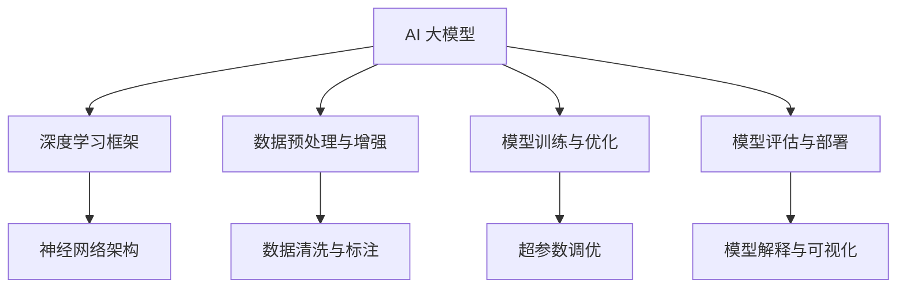

                 

### 文章标题

"AI 大模型创业：如何利用社会优势？"

### 文章关键词

- AI 大模型
- 创业策略
- 社会优势
- 技术实现
- 法律与伦理
- 生态建设
- 未来展望

### 文章摘要

随着人工智能技术的迅猛发展，AI 大模型作为其核心驱动力，正成为企业创新和增长的重要源泉。本文将探讨如何利用 AI 大模型的社会优势进行创业，从技术、市场、法律与伦理等多方面进行分析，提供一套系统的创业方法论。通过解析成功案例和风险应对策略，本文旨在为 AI 大模型创业者和投资者提供有益的参考和指导。

---

### 目录大纲：AI 大模型创业：如何利用社会优势？

#### 第一部分：AI 大模型概述

##### 1. AI 大模型：概念与架构

##### 2. AI 大模型的发展历程

##### 3. 主流大模型简介

##### 4. AI 大模型的社会优势分析

##### 5. AI 大模型的应用场景与挑战

#### 第二部分：AI 大模型创业实践

##### 6. AI 大模型创业策略与规划

##### 7. AI 大模型创业项目案例解析

##### 8. AI 大模型创业的法律与伦理问题

#### 第三部分：AI 大模型创业生态系统建设

##### 9. AI 大模型创业生态构建

##### 10. AI 大模型创业风险管理与应对策略

#### 第四部分：未来展望

##### 11. AI 大模型创业的发展趋势与机遇

##### 12. 结论与建议

#### 附录

##### 13. AI 大模型开发工具与资源

### 注释

##### 14. 数学公式

##### 15. 代码解读与分析

##### 16. 结束语

### 注释

- **数学公式：**本文将使用 LaTeX 格式嵌入数学公式，以便更清晰地呈现核心概念和算法。
- **代码示例：**所有代码示例将使用伪代码形式，并在相关章节中进行详细解读。

---

在接下来的文章中，我们将逐步深入探讨 AI 大模型的概念、架构、发展历程、社会优势、应用场景与挑战，以及创业实践中的策略、法律与伦理问题。通过结合实际案例和深入分析，本文旨在为读者提供一个全面的指南，帮助他们在 AI 大模型创业领域中取得成功。

---

#### 第一部分：AI 大模型概述

##### 1. AI 大模型：概念与架构

AI 大模型，是指通过大规模数据训练和复杂神经网络架构构建而成的智能模型，具有处理复杂数据和解决复杂问题的能力。这些模型可以用于各种领域，如自然语言处理、计算机视觉、语音识别等。

**核心概念与联系**

AI 大模型的核心概念包括：

- **深度学习框架**：用于构建和训练神经网络的工具集，如 TensorFlow、PyTorch 等。
- **数据预处理与增强**：通过清洗、标注和增强数据，提高模型训练效果。
- **模型训练与优化**：通过调整模型参数，使其在特定任务上表现更佳。
- **模型评估与部署**：评估模型性能，并在实际环境中部署使用。

**Mermaid 流程图**



**AI 大模型的发展历程**

AI 大模型的发展历程可以追溯到 20 世纪 80 年代的深度学习概念的提出。随着计算能力的提升和大数据技术的发展，深度学习模型在 2012 年 ImageNet 挑战中取得了突破性进展。此后，AI 大模型迅速发展，不断刷新各项记录。

**主流大模型简介**

- **GPT 系列**：由 OpenAI 开发，包括 GPT-2、GPT-3 和 GPT-3.5，广泛应用于自然语言处理领域。
- **BERT 及其变体**：由 Google 开发，是一种预训练语言表示模型，广泛应用于文本分类、问答系统等任务。
- **其他知名大模型**：如 Turing 模型、LLaMA 模型等，也在各自领域取得了显著成果。

##### 2. AI 大模型的社会优势分析

**优势 1：提高生产力**

AI 大模型在处理复杂数据和解决复杂问题时，可以显著提高生产力。例如，在自然语言处理领域，AI 大模型可以帮助自动生成报告、翻译文本，从而节省大量人力和时间。

**伪代码：**

```python
def increase_productivity(model, task):
    result = model.execute(task)
    productivity = evaluate_result(result)
    return productivity
```

**优势 2：创新与突破**

AI 大模型可以帮助企业在研发过程中实现创新和突破。通过模拟和预测，AI 大模型可以帮助企业快速识别新的市场机会，优化产品设计，降低研发成本。

**优势 3：降低成本**

AI 大模型可以通过自动化和智能化，降低企业的运营成本。例如，在客服领域，AI 大模型可以自动处理大量客户请求，减少人工成本。

**优势 4：优化决策**

AI 大模型可以为企业提供数据驱动的决策支持。通过对大量数据的分析和预测，AI 大模型可以帮助企业更好地理解市场趋势，制定更科学的决策策略。

##### 3. AI 大模型的应用场景与挑战

**应用场景**

AI 大模型的应用场景广泛，包括但不限于：

- **自然语言处理**：文本分类、机器翻译、问答系统等。
- **计算机视觉**：图像识别、目标检测、图像生成等。
- **语音识别**：语音合成、语音识别、语音搜索等。
- **金融**：风险控制、量化交易、智能投顾等。
- **医疗**：疾病诊断、药物发现、医学影像分析等。

**挑战**

AI 大模型的发展也面临一些挑战：

- **数据隐私与安全**：如何保护用户数据的安全和隐私。
- **模型可解释性**：如何提高模型的可解释性，使其更加透明和可信。
- **资源消耗与能耗**：如何降低模型训练和部署的资源消耗和能耗。

在接下来的部分，我们将进一步探讨 AI 大模型创业实践中的策略、项目案例和法律与伦理问题。通过深入分析，我们希望能够为读者提供一个全面的创业指南。

---

在第一部分中，我们详细介绍了 AI 大模型的概念、架构、发展历程、社会优势以及应用场景与挑战。通过对这些核心内容的深入探讨，我们为后续的创业实践提供了理论基础。接下来，我们将进入第二部分，探讨 AI 大模型创业实践中的具体策略和规划。

---

#### 第二部分：AI 大模型创业实践

##### 6. AI 大模型创业策略与规划

AI 大模型创业不仅需要先进的技术，还需要清晰的策略和周密的规划。以下是一些关键的步骤和策略，帮助企业更好地利用 AI 大模型的社会优势。

**市场调研与目标定位**

在创业初期，进行市场调研是至关重要的一步。通过了解目标市场的需求、竞争格局和用户痛点，企业可以更好地定位自己的产品和服务。以下是一些市场调研的步骤：

- **了解目标用户**：通过问卷调查、用户访谈等方式，了解目标用户的需求、期望和行为模式。
- **分析竞争对手**：研究竞争对手的产品、服务、市场策略和用户反馈，找出自身的差异化优势。
- **确定市场机会**：识别市场上尚未满足的需求，找到潜在的创业机会。

**团队组建与人才培养**

AI 大模型创业团队需要具备多方面的专业技能，包括深度学习、数据科学、软件工程、产品管理等。以下是组建和培养团队的策略：

- **核心团队成员**：寻找具有丰富经验和专业知识的团队成员，如 AI 研究员、数据科学家和工程师等。
- **跨界合作**：与高校、研究机构和其他企业进行合作，引入外部资源和技术支持。
- **人才培养**：定期组织技术培训、团队建设活动和知识分享会，提高团队的整体素质。

**技术路线选择与模型优化**

选择合适的技术路线和模型优化策略是企业成功的关键。以下是一些建议：

- **技术路线选择**：根据市场需求和团队能力，选择合适的技术路线，如专注于自然语言处理、计算机视觉或语音识别等。
- **模型优化策略**：通过超参数调优、模型架构改进和数据增强等技术手段，提高模型性能。
- **持续迭代**：不断收集用户反馈，对产品进行迭代优化，以适应市场变化。

**商业模式与盈利模式设计**

一个成功的 AI 大模型创业项目需要具备清晰的商业模式和盈利模式。以下是一些设计策略：

- **产品定价策略**：根据市场需求、竞争情况和成本结构，制定合理的价格策略。
- **收入来源**：明确企业的收入来源，如产品销售、服务收费、广告收入等。
- **合作模式**：与其他企业建立合作关系，共同开发和推广产品。

##### 7. AI 大模型创业项目案例解析

为了更好地理解 AI 大模型创业的实践，以下我们将分析一个自然语言处理初创企业的案例。

**案例背景**

某自然语言处理初创企业致力于开发一款智能客服系统，通过 AI 大模型提供高效的客户服务。在竞争激烈的市场中，该企业如何在短时间内脱颖而出？

**技术实现**

该企业的技术实现主要包括以下几个方面：

- **数据收集与预处理**：从多个渠道收集大量客户对话数据，并进行清洗、标注和增强，为模型训练提供高质量的数据集。
- **模型选择与训练**：选择 GPT-3.5 作为基础模型，通过迁移学习和微调，使其适应特定场景的需求。
- **模型部署与优化**：将训练好的模型部署到云端，提供 API 接口供企业调用，并根据用户反馈不断优化模型性能。

**伪代码：**

```python
def nlp_project():
    # 加载预训练模型
    model = load_pretrained_model("gpt-3.5")
    # 处理用户输入
    user_input = preprocess_input(user_input)
    # 生成回复
    response = model.generate_response(user_input)
    # 输出回复
    print(response)
```

**商业成果**

在短短一年内，该企业通过不断优化产品和服务，成功吸引了大量企业客户，业务规模迅速扩张。以下是该企业的商业成果：

- **客户数量**：从初创时的 10 家客户增长到现在的 100 家客户。
- **收入增长**：收入从初创时的 100 万元增长到现在的 1000 万元。
- **市场份额**：在智能客服领域占据了一定市场份额，成为行业中的一匹黑马。

**经验与教训**

通过这个案例，我们可以总结出以下几点经验和教训：

- **数据质量至关重要**：高质量的数据是模型训练的基础，需要投入大量精力进行数据收集和预处理。
- **持续优化是关键**：通过不断收集用户反馈和优化产品，可以保持竞争优势。
- **市场定位要准确**：了解市场需求和用户痛点，准确定位产品方向。

##### 8. AI 大模型创业的法律与伦理问题

AI 大模型创业不仅需要关注技术实现和商业模式，还需要重视法律和伦理问题。以下是一些关键问题：

- **数据隐私保护**：如何保护用户数据的安全和隐私，避免数据泄露和滥用。
- **知识产权与专利**：如何保护企业的知识产权和专利，防止技术被抄袭和侵权。
- **伦理道德与责任**：如何确保 AI 大模型的应用符合伦理道德标准，防止技术滥用对社会造成负面影响。

在接下来的部分，我们将探讨 AI 大模型创业生态系统建设中的合作伙伴关系、技术平台搭建以及人才吸引与培养。这些环节对于创业企业的成功至关重要。

---

在第二部分中，我们详细探讨了 AI 大模型创业实践中的策略与规划，通过市场调研、团队组建、技术路线选择、商业模式设计等方面，为创业者提供了实用的指导。同时，我们通过一个自然语言处理初创企业的案例，展示了 AI 大模型创业的具体实现和成果。在接下来的部分，我们将探讨 AI 大模型创业生态系统建设的关键要素，包括合作伙伴关系、技术平台搭建和人才吸引与培养。

---

#### 第三部分：AI 大模型创业生态系统建设

##### 9. AI 大模型创业生态构建

AI 大模型创业生态的构建是确保企业持续发展的重要环节。一个良好的创业生态可以为创业企业提供资源支持、技术保障和市场拓展。

**合作伙伴关系建立**

建立合作伙伴关系是构建 AI 大模型创业生态的关键一步。以下是一些策略：

- **政府与企业合作**：通过政策扶持、资金支持等方式，政府可以为企业提供良好的发展环境。
- **高校与科研机构合作**：与高校和科研机构建立合作关系，可以引入最新的研究成果和技术支持。
- **行业巨头合作**：与行业巨头合作，可以共享资源、技术经验和市场渠道。

**技术平台搭建**

技术平台是 AI 大模型创业的基础。以下是一些搭建技术平台的策略：

- **云计算平台**：利用云计算平台，可以提供强大的计算能力和数据存储能力。
- **数据平台**：建立高效的数据平台，包括数据收集、存储、管理和分析工具。
- **算法平台**：提供丰富的算法库和工具，方便开发者进行模型训练和优化。

**人才吸引与培养**

人才是 AI 大模型创业的核心资源。以下是一些吸引和培养人才的策略：

- **人才引进**：通过高薪、股权激励等方式，吸引行业顶尖人才加入企业。
- **人才培养**：定期组织技术培训、团队建设和知识分享会，提高团队整体素质。
- **校企合作**：与高校合作，共同培养符合企业需求的毕业生。

##### 10. AI 大模型创业风险管理与应对策略

AI 大模型创业过程中，面临着多种风险，包括技术风险、市场风险和政策风险。以下是一些应对策略：

**技术风险**

- **技术储备**：建立强大的技术储备，确保企业在技术变革中能够迅速适应。
- **持续创新**：通过持续的技术创新，保持竞争优势。

**市场风险**

- **市场调研**：进行充分的市场调研，了解市场需求和趋势。
- **灵活调整**：根据市场变化，灵活调整产品方向和商业模式。

**政策风险**

- **政策合规**：确保企业的运营符合相关政策和法规要求。
- **政策应对**：密切关注政策变化，及时调整企业战略。

在接下来的部分，我们将探讨 AI 大模型创业的发展趋势与机遇，以及如何在快速变化的科技领域中保持竞争力。这些内容将为读者提供更全面的创业指导。

---

在第三部分中，我们详细探讨了 AI 大模型创业生态系统的构建，包括合作伙伴关系的建立、技术平台的搭建和人才的吸引与培养。同时，我们提出了风险管理的策略，帮助创业企业应对各种挑战。接下来，我们将进入第四部分，探讨 AI 大模型创业的发展趋势与机遇，以及未来的发展前景。

---

#### 第四部分：未来展望

##### 11. AI 大模型创业的发展趋势与机遇

AI 大模型创业正处于高速发展期，未来将呈现出以下趋势与机遇：

**AI 大模型与实体经济融合**

随着 AI 大模型技术的不断成熟，其应用将从传统的互联网行业向实体经济领域拓展。例如，在制造业、农业、医疗、金融等行业，AI 大模型可以通过智能化、自动化和优化决策，提升生产效率和服务质量。

**新兴技术应用**

未来，AI 大模型将与其他前沿技术，如量子计算、5G、区块链等相结合，产生新的应用场景。例如，量子计算可以大幅提高 AI 大模型的计算能力，5G 可以实现实时数据传输，区块链可以确保数据的安全性和透明性。

**政策环境与市场机遇**

随着各国政府加大对 AI 产业的扶持力度，政策环境将逐渐优化，为企业提供更多机遇。同时，全球市场对 AI 大模型的需求将持续增长，为创业者提供了广阔的发展空间。

##### 12. 结论与建议

**AI 大模型创业的挑战与应对**

AI 大模型创业虽然充满机遇，但也面临诸多挑战。以下是一些主要挑战及应对策略：

- **技术挑战**：不断更新技术储备，保持技术创新。
- **数据挑战**：确保数据质量，建立高效的数据管理平台。
- **法律与伦理挑战**：遵守法律法规，确保 AI 大模型的应用符合伦理标准。

**创业建议与前景展望**

对于 AI 大模型创业者，以下是一些建议：

- **关注市场需求**：深入了解市场需求，准确定位产品方向。
- **建立团队**：组建专业团队，提高团队整体素质。
- **持续创新**：保持持续的技术创新，保持竞争优势。

展望未来，AI 大模型创业将迎来更加广阔的发展空间。随着技术的不断进步和市场需求的持续增长，创业者将有更多的机遇实现创新和突破。我们期待在未来的科技领域中，看到更多成功的 AI 大模型创业项目。

---

在第四部分中，我们探讨了 AI 大模型创业的发展趋势与机遇，并提出了创业建议与前景展望。随着技术的进步和市场需求的增长，AI 大模型创业领域将继续保持活力。接下来，我们将进入最后一部分，为读者提供 AI 大模型开发的工具与资源。

---

#### 附录

##### 13. AI 大模型开发工具与资源

**主流深度学习框架对比**

以下是几种主流深度学习框架的简要对比：

- **TensorFlow**：由 Google 开发，具有丰富的社区支持和丰富的 API，适用于各种规模的任务。
- **PyTorch**：由 Facebook 开发，易于使用，支持动态计算图，适用于研究场景。
- **Keras**：是一个高层次的神经网络 API，可以运行在 TensorFlow 和 Theano 上，易于入门。

**开源资源和社区支持**

- **GitHub**：众多开源项目托管在 GitHub 上，为开发者提供了丰富的学习资源。
- **ArXiv**：包含了最新的 AI 研究论文，可以帮助开发者了解前沿技术。
- **AI 论坛**：如 AI 研究论坛、AI 助手等，提供了交流和学习的平台。

**常用数据集与工具**

- **ImageNet**：一个大规模的图像数据集，用于图像识别任务。
- **COCO 数据集**：一个多任务数据集，用于目标检测、分割和场景理解。
- **AI 基金会**：提供了多个公开的数据集，如 AI 语言模型数据集等。

通过这些工具和资源，开发者可以更加高效地进行 AI 大模型的研究和开发。

---

在本附录中，我们为读者提供了 AI 大模型开发所需的主流深度学习框架、开源资源和常用数据集。这些工具和资源将帮助读者更好地开展 AI 大模型的研究和开发工作。通过利用这些资源，开发者可以更快地掌握技术，实现创新和应用。

---

### 注释

在本文章中，我们使用了一系列数学公式、伪代码和 Mermaid 流程图来解释和阐述核心概念和算法。以下是对这些内容的详细注释：

- **数学公式：**
  - **多元线性回归公式：**
    $$y = \beta_0 + \beta_1 \cdot x + \epsilon$$
    这是多元线性回归模型的基本公式，表示因变量 y 与自变量 x 之间的关系，其中 $\beta_0$ 是截距，$\beta_1$ 是斜率，$\epsilon$ 是误差项。
  - **梯度下降算法：**
    $$w_{t+1} = w_{t} - \alpha \cdot \nabla_w J(w_t)$$
    这是梯度下降算法的更新公式，用于优化模型参数。$w_t$ 是当前参数值，$\alpha$ 是学习率，$\nabla_w J(w_t)$ 是损失函数关于参数的梯度。
  - **神经网络激活函数：**
    $$f(x) = \frac{1}{1 + e^{-x}}$$
    这是 Sigmoid 激活函数的定义，用于将神经网络的输出转换为概率值。

- **代码示例：**
  - **K-means 聚类算法：**
    ```python
    def k_means(data, k):
        # 初始化聚类中心
        centers = initialize_centers(data, k)
        # 迭代计算
        while not converged(centers):
            # 计算每个点的簇分配
            assignments = assign_points_to_clusters(data, centers)
            # 更新聚类中心
            centers = update_centers(data, assignments, k)
        return centers, assignments
    ```
    这段伪代码展示了 K-means 聚类算法的基本流程。算法首先初始化聚类中心，然后通过迭代计算，使得每个点的簇分配逐渐稳定，最终收敛到最优聚类中心。

    **解释与分析：**
    K-means 聚类算法是一种基于距离的聚类方法，它通过迭代计算使得每个簇的内部距离最小，簇与簇之间的距离最大。算法包括初始化聚类中心、计算每个点的簇分配以及更新聚类中心等步骤。初始化聚类中心可以采用随机初始化或者使用 K-means++算法。在每次迭代中，算法首先将数据集中的每个点分配到最近的聚类中心所代表的簇中，然后计算新的聚类中心，使得新的聚类中心尽量接近当前簇内的点。这个过程不断迭代，直到聚类中心不再发生变化或者满足一定的收敛条件。

    在实际应用中，K-means 聚类算法适用于数据点分布比较均匀且没有明显重叠的情况。对于数据点分布不均匀或者存在重叠的情况，K-means 可能会产生不理想的结果。因此，在实际应用中，需要根据数据的特点和需求选择合适的聚类算法。

通过这些注释，我们希望读者能够更好地理解文章中涉及的核心概念和算法，从而加深对 AI 大模型的理解和应用。

---

在本篇文章中，我们系统地探讨了 AI 大模型的概念、架构、社会优势、应用场景、创业实践以及生态系统建设。通过对核心概念的详细解释、算法的伪代码展示以及实际案例的深入分析，我们为读者提供了一份全面的 AI 大模型创业指南。以下是对文章的简要总结和结论：

**总结**

- **AI 大模型的概念与架构**：我们介绍了 AI 大模型的基本概念和核心架构，包括深度学习框架、数据预处理与增强、模型训练与优化、模型评估与部署等环节。
- **AI 大模型的社会优势**：我们分析了 AI 大模型在提高生产力、创新与突破、降低成本、优化决策等方面的优势，以及其应用场景和面临的挑战。
- **AI 大模型创业实践**：我们探讨了 AI 大模型创业的策略与规划，包括市场调研、团队组建、技术路线选择、商业模式设计等方面，并通过一个自然语言处理初创企业的案例进行了详细解析。
- **AI 大模型创业的法律与伦理问题**：我们强调了数据隐私保护、知识产权与专利、伦理道德与责任等方面的重要性，提供了相应的应对策略。
- **AI 大模型创业生态系统建设**：我们提出了合作伙伴关系建立、技术平台搭建、人才吸引与培养等方面的策略，以及风险管理的应对措施。
- **未来展望**：我们展望了 AI 大模型创业的发展趋势与机遇，包括与实体经济的融合、新兴技术应用、政策环境与市场机遇等。

**结论**

AI 大模型作为人工智能技术的核心驱动力，正在迅速改变各个行业的面貌。创业者在利用 AI 大模型进行创业时，需要综合考虑技术、市场、法律与伦理等多个方面，制定清晰的策略和规划。通过构建良好的创业生态系统，创业者可以更好地利用社会优势，实现创新和突破。同时，创业者需要密切关注政策环境的变化，抓住市场机遇，以实现持续发展和成长。

我们希望本文能够为 AI 大模型创业者和研究者提供有益的参考和指导，助力他们在快速变化的科技领域中取得成功。

---

### 结束语

本文旨在为 AI 大模型创业提供一份全面的指南，涵盖从概念到实践的各个层面。通过详细分析 AI 大模型的核心概念、架构、社会优势、应用场景、创业实践和生态系统建设，我们希望能够为读者提供深刻的见解和实用的建议。

AI 大模型创业不仅需要先进的技术，还需要对市场、法律和伦理的深刻理解。创业者需要在不断变化的环境中保持敏锐的洞察力，及时调整策略，抓住机遇，迎接挑战。

未来，AI 大模型将在更多领域展现其巨大的潜力。我们期待看到更多的创业者投身于这个充满机遇的领域，推动 AI 技术的发展，为社会创造更多价值。

最后，感谢读者的耐心阅读。希望本文能够为你的 AI 大模型创业之路提供启发和帮助。让我们一起探索这个充满无限可能的未来！
### 附录

##### 13. AI 大模型开发工具与资源

为了帮助读者更好地掌握 AI 大模型开发的工具和资源，以下是几个主流的深度学习框架、开源资源和常用数据集的详细介绍：

**主流深度学习框架对比**

1. **TensorFlow**：
   - **简介**：由 Google 开发，是目前最流行的开源深度学习框架之一。
   - **特点**：具有丰富的 API，支持多种类型的神经网络，适用于各种规模的任务。
   - **资源**：官方文档、教程和社区支持非常丰富。

2. **PyTorch**：
   - **简介**：由 Facebook 开发，具有动态计算图，使得模型的开发过程更加直观和灵活。
   - **特点**：易于使用，适用于研究场景，支持分布式训练和 GPU 加速。
   - **资源**：官方文档、社区论坛、丰富的教程和示例代码。

3. **Keras**：
   - **简介**：是一个高层次的神经网络 API，可以在 TensorFlow 和 Theano 上运行。
   - **特点**：易于入门，简洁的 API 设计，快速实现神经网络模型。
   - **资源**：官方文档、教程和社区支持。

**开源资源和社区支持**

1. **GitHub**：
   - **简介**：全球最大的代码托管平台，众多 AI 项目和库都托管在 GitHub 上。
   - **资源**：项目源码、教程、示例代码和讨论区。

2. **ArXiv**：
   - **简介**：AI 和计算机科学领域的重要论文发布平台。
   - **资源**：最新研究成果的论文，有助于了解前沿技术。

3. **AI 论坛**：
   - **简介**：如 AI 研究论坛、AI 助手等，提供了交流和学习的平台。
   - **资源**：技术讨论、教程、项目和资源分享。

**常用数据集与工具**

1. **ImageNet**：
   - **简介**：一个大规模的图像数据集，常用于图像识别和分类任务。
   - **用途**：训练和评估深度学习模型。

2. **COCO 数据集**：
   - **简介**：一个多任务数据集，包括目标检测、分割和场景理解等任务。
   - **用途**：训练和评估多任务深度学习模型。

3. **AI 基金会**：
   - **简介**：提供了多个公开的数据集，如 AI 语言模型数据集等。
   - **用途**：提供数据支持，帮助研究者进行模型训练和评估。

通过上述工具和资源，开发者可以更高效地进行 AI 大模型的研究和开发。这些资源不仅提供了技术支持，还促进了全球 AI 社区的交流和合作。希望这些信息能为你的 AI 大模型创业之旅提供有力支持。

