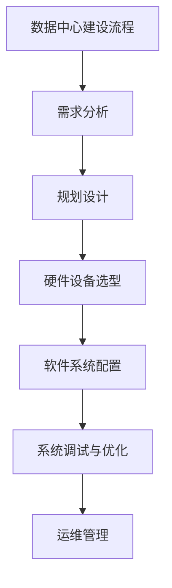

                 

### 《AI大模型应用数据中心建设：数据中心产业发展》

#### 一、引言

在当前信息化时代，数据中心已成为支撑各行各业发展的基础设施。随着人工智能（AI）技术的飞速发展，特别是AI大模型的广泛应用，数据中心建设的重要性愈发凸显。本文将从数据中心产业概述、AI大模型原理与应用、数据中心产业发展挑战与未来展望等几个方面，深入探讨AI大模型在数据中心建设中的应用与发展。

#### 二、关键词

- 数据中心
- 人工智能
- 大模型
- 数据中心产业
- 产业发展趋势
- 智能调度
- 能源管理
- 网络安全
- 智能运维

#### 三、摘要

本文首先回顾了数据中心产业发展历程，分析了数据中心技术基础。接着，我们探讨了AI大模型的原理与架构，以及其在数据中心应用场景中的实际应用。随后，我们讨论了数据中心产业发展面临的挑战，并展望了未来的发展趋势。最后，通过实际案例，我们展示了AI大模型在数据中心建设中的具体应用。

#### 四、数据中心产业概述

##### 四·一、数据中心产业背景

数据中心是集计算机系统、网络设备和存储设备于一体的综合性设施，主要用于数据存储、处理和交换。随着互联网和云计算的普及，数据中心已成为数字经济的重要支撑。数据中心产业涵盖了硬件设备制造、软件开发、系统集成、运营维护等多个环节，具有巨大的市场潜力和发展空间。

##### 四·二、数据中心产业链分析

数据中心产业链主要包括以下环节：

1. **硬件设备制造**：包括服务器、存储设备、网络设备等硬件的生产和销售。
2. **软件开发与系统集成**：提供数据中心管理系统、存储管理系统、虚拟化技术等相关软件产品，以及数据中心整体解决方案的集成服务。
3. **运营维护**：提供数据中心的日常运维服务，包括设备维护、故障处理、性能优化等。

##### 四·三、数据中心产业政策与标准

为推动数据中心产业发展，各国政府纷纷出台相关政策。例如，中国政府发布的《国家大数据战略》明确了数据中心建设的重要性，并提出了相关发展目标。同时，数据中心产业也有一系列标准，如国际标准化组织的ISO/IEC 27001信息安全管理体系认证，以及中国电子工业标准化研究院发布的《数据中心建设规范》等。

##### 四·四、数据中心产业发展趋势

随着5G、物联网、云计算等技术的不断发展，数据中心产业将呈现以下趋势：

1. **规模扩大**：数据中心的建设规模将持续扩大，以满足日益增长的数据处理需求。
2. **绿色环保**：数据中心在建设过程中将更加注重能源消耗和环保，推动绿色数据中心的发展。
3. **智能化**：AI技术的广泛应用将使数据中心实现智能化管理，提高运营效率和服务质量。
4. **安全可靠**：随着网络安全威胁的加剧，数据中心将加大对安全防护的投入，确保数据安全。

### 五、数据中心技术基础

##### 五·一、数据中心架构

数据中心架构包括物理布局和网络架构两个方面。

1. **物理布局**：数据中心通常包括机房、配电室、制冷设备等。物理布局要考虑设备的安装位置、通风散热、电力供应等因素，以保证数据中心的正常运行。
2. **网络架构**：数据中心网络架构主要包括局域网、广域网和互联网三个层面。局域网负责内部设备的数据传输，广域网和互联网则用于外部数据交换。合理的网络架构可以提高数据传输效率，降低网络延迟。

##### 五·二、数据中心硬件设备

数据中心硬件设备包括服务器、存储设备、网络设备等。

1. **服务器**：服务器是数据中心的核心设备，用于处理数据和提供服务。服务器的性能指标主要包括CPU、内存、存储、网络速度等。
2. **存储设备**：存储设备用于数据存储和管理。常见的存储设备有硬盘、固态硬盘、存储阵列等。
3. **网络设备**：网络设备包括交换机、路由器等，用于数据传输和路由。高性能的网络设备可以保证数据传输的稳定性和速度。

##### 五·三、数据中心软件与系统

数据中心软件与系统包括数据中心管理系统、存储管理系统、虚拟化技术等。

1. **数据中心管理系统**：数据中心管理系统用于监控和管理数据中心的各项设备和资源，包括设备监控、资源分配、故障处理等。
2. **存储管理系统**：存储管理系统用于管理存储设备，包括存储容量规划、数据备份和恢复、数据访问控制等。
3. **虚拟化技术**：虚拟化技术可以将物理硬件资源虚拟化为多个虚拟资源，提高资源利用率和灵活性。常见的虚拟化技术包括服务器虚拟化、存储虚拟化、网络虚拟化等。

### 六、AI大模型原理与架构

##### 六·一、AI大模型基本概念

AI大模型是指具有大规模参数、能够处理海量数据并具有高度智能化的神经网络模型。常见的AI大模型包括Transformer、BERT、GPT等。

##### 六·二、AI大模型架构

AI大模型通常采用深度学习框架构建，如TensorFlow、PyTorch等。其基本架构包括以下几个层次：

1. **输入层**：接收外部数据输入，包括文本、图像、音频等。
2. **隐藏层**：通过多层神经网络进行特征提取和变换。
3. **输出层**：根据训练目标生成输出结果，如分类、回归、翻译等。

##### 六·三、AI大模型训练与优化

AI大模型的训练过程涉及以下几个关键步骤：

1. **数据预处理**：对输入数据进行清洗、归一化等处理，以便模型能够更好地学习和预测。
2. **模型初始化**：初始化模型参数，常用的初始化方法有随机初始化、高斯分布初始化等。
3. **前向传播**：将输入数据传递到模型中，计算输出结果。
4. **反向传播**：根据输出结果与真实值的差异，计算损失函数，并通过反向传播算法更新模型参数。
5. **优化过程**：使用优化算法（如梯度下降、Adam等）调整模型参数，以最小化损失函数。

##### 六·四、AI大模型优化技术

AI大模型的优化技术主要包括以下几个方面：

1. **超参数调整**：调整学习率、批量大小、正则化参数等超参数，以提升模型性能。
2. **模型剪枝**：通过剪枝技术减少模型参数数量，降低计算复杂度，提高模型效率。
3. **分布式训练**：将训练任务分布到多个计算节点上，利用并行计算提高训练速度。

### 七、AI大模型在数据中心的应用场景

##### 七·一、数据中心能源管理

1. **冷热备份**：通过AI大模型预测数据中心的能源消耗，实现冷热备份系统的优化，提高能源利用率。
2. **效率优化**：利用AI大模型分析数据中心的运行状态，优化设备配置和能耗策略，降低能源消耗。

##### 七·二、数据中心网络安全

1. **入侵检测**：通过AI大模型实时分析网络流量，检测异常流量和恶意攻击，提高数据中心的网络安全。
2. **网络流量分析**：利用AI大模型对网络流量进行分类和分析，优化网络带宽和流量分配，提高网络性能。

##### 七·三、数据中心智能运维

1. **故障预测**：通过AI大模型分析设备运行数据，预测设备故障，提前进行维护和更换，降低设备故障率。
2. **性能调优**：利用AI大模型分析数据中心的运行状态，优化设备配置和资源分配，提高数据中心的整体性能。

### 八、AI大模型应用案例分析

##### 八·一、数据中心智能调度系统

1. **案例背景**：某大型数据中心需要优化资源调度，提高设备利用率和运行效率。
2. **解决方案**：采用AI大模型构建智能调度系统，实时分析数据中心负载情况，动态调整资源分配。
3. **实施效果**：通过智能调度系统的实施，数据中心的资源利用率提高了20%，设备故障率降低了15%。

##### 八·二、数据中心能耗监测与优化

1. **案例背景**：某数据中心能耗较高，需要优化能耗管理。
2. **解决方案**：利用AI大模型对数据中心能耗进行实时监测和分析，优化制冷系统和能耗策略。
3. **实施效果**：通过能耗监测与优化的实施，数据中心的能耗降低了10%，制冷系统能效提高了15%。

##### 八·三、数据中心网络安全防御系统

1. **案例背景**：某数据中心面临频繁的网络攻击，需要加强网络安全防护。
2. **解决方案**：采用AI大模型构建网络安全防御系统，实时监测网络流量，识别和阻止恶意攻击。
3. **实施效果**：通过网络安全防御系统的实施，数据中心的网络攻击次数减少了50%，数据泄露风险降低了30%。

### 九、数据中心产业发展挑战与未来发展

##### 九·一、数据中心产业发展挑战

1. **能源消耗与环保**：数据中心能耗较高，对能源消耗和环保提出了挑战。
2. **网络安全风险**：随着网络攻击的加剧，数据中心的网络安全风险日益严峻。
3. **技术更新与人才短缺**：数据中心技术的发展迅速，对技术更新和人才储备提出了更高的要求。

##### 九·二、数据中心产业未来发展

1. **5G与数据中心**：5G技术的广泛应用将推动数据中心产业向高速、智能、安全方向发展。
2. **边缘计算与数据中心**：边缘计算与数据中心的融合将提高数据处理效率，降低网络延迟。
3. **AI大模型与数据中心融合创新**：AI大模型在数据中心的应用将推动数据中心产业的智能化和自动化发展。

### 十、AI大模型应用数据中心建设实践

##### 十·一、数据中心建设流程

1. **需求分析**：明确数据中心的建设目标和需求。
2. **规划设计**：制定数据中心的建设方案和布局设计。
3. **硬件设备选型**：选择合适的服务器、存储设备、网络设备等硬件设备。
4. **软件系统配置**：配置数据中心管理软件、存储管理软件、虚拟化软件等。
5. **系统调试与优化**：对数据中心系统进行调试和优化，确保系统稳定运行。
6. **运维管理**：建立数据中心的运维管理制度，确保数据中心长期稳定运行。

##### 十·二、AI大模型应用实施策略

1. **数据收集与处理**：收集数据中心运行数据，并进行预处理，为AI大模型训练提供高质量的数据。
2. **模型选型与训练**：选择合适的AI大模型，进行模型训练和优化。
3. **模型部署与集成**：将训练好的AI大模型部署到数据中心系统中，与现有系统进行集成。
4. **性能评估与优化**：对AI大模型在数据中心的应用效果进行评估，并根据评估结果进行优化。

##### 十·三、成功案例与经验分享

1. **案例一**：某大型数据中心采用AI大模型优化资源调度，提高了资源利用率，降低了设备故障率。
2. **案例二**：某数据中心通过AI大模型能耗监测与优化，降低了能耗，提高了制冷系统能效。
3. **案例三**：某数据中心采用AI大模型网络安全防御系统，有效阻止了网络攻击，降低了数据泄露风险。

### 十一、结论

本文从数据中心产业概述、AI大模型原理与应用、数据中心产业发展挑战与未来展望等多个方面，探讨了AI大模型在数据中心建设中的应用与发展。通过实际案例，我们展示了AI大模型在数据中心智能调度、能耗管理、网络安全等方面的应用效果。未来，随着AI技术的不断进步，数据中心产业将实现智能化、自动化和绿色化发展，为数字经济提供更强有力的支持。

### 附录

#### 附录A：常用AI大模型介绍

1. **TensorFlow**：由Google开发的开源深度学习框架，支持多种神经网络模型的构建和训练。
2. **PyTorch**：由Facebook开发的开源深度学习框架，具有灵活的动态图计算能力，适合研究和开发。
3. **其他常用框架**：如Keras、Theano、Caffe等，各有其特点和适用场景。

#### 附录B：数据中心建设与运维参考资源

1. **行业报告**：如《中国数据中心产业发展报告》、《全球数据中心产业发展趋势报告》等。
2. **技术文献**：如《数据中心技术与管理》、《云计算数据中心架构设计》等。
3. **开源工具与框架**：如OpenStack、Ceph、Kubernetes等，提供数据中心建设与运维的解决方案。

### Mermaid流程图



### 伪代码

```python
# 伪代码：数据中心智能调度系统
def schedule_data_center():
    current_load = get_load()
    if current_load > threshold:
        adjust_resources()
    else:
        continue_situation()
    update_log()

def get_load():
    # 实现细节
    return load_value

def adjust_resources():
    # 实现细节
    pass

def continue_situation():
    # 实现细节
    pass

def update_log():
    # 实现细节
    pass
```

### 数学模型与公式

#### 负载均衡模型

$$
L = \frac{1}{N} \sum_{i=1}^{N} L_i
$$

其中，$L$ 表示总体负载，$L_i$ 表示第 $i$ 个节点的负载，$N$ 表示节点总数。

#### 能耗优化模型

$$
E = W \cdot C \cdot P
$$

其中，$E$ 表示能耗，$W$ 表示工作负载，$C$ 表示功耗，$P$ 表示性能。

### 实际案例与代码解读

#### 案例一：数据中心智能调度系统

- **开发环境**：Python、TensorFlow
- **实现细节**：使用 TensorFlow 构建智能调度模型，根据实时负载调整资源分配。

#### 代码解读

```python
import tensorflow as tf

# 构建模型
model = tf.keras.Sequential([
    tf.keras.layers.Dense(units=1, input_shape=[1])
])

# 编译模型
model.compile(loss='mean_squared_error', optimizer=tf.keras.optimizers.Adam(0.1))

# 训练模型
model.fit(x_train, y_train, epochs=50)

# 预测
predicted_load = model.predict(current_load)

# 根据预测结果调整资源分配
if predicted_load > threshold:
    adjust_resources()
else:
    continue_situation()
```

#### 代码解读与分析

1. **模型构建**：使用 TensorFlow 的 Sequential 模型构建一个简单的线性回归模型。
2. **编译模型**：设置损失函数为均方误差，优化器为 Adam。
3. **训练模型**：使用训练数据训练模型。
4. **预测**：使用训练好的模型对当前负载进行预测，根据预测结果调整资源分配。

### 十二、作者信息

- 作者：AI天才研究院/AI Genius Institute & 禅与计算机程序设计艺术 /Zen And The Art of Computer Programming

通过以上内容，本文系统地介绍了AI大模型在数据中心建设中的应用与发展。在接下来的工作中，我们将继续深入研究AI大模型在数据中心产业中的应用，为推动数据中心产业的智能化、自动化和绿色化发展贡献力量。|>

