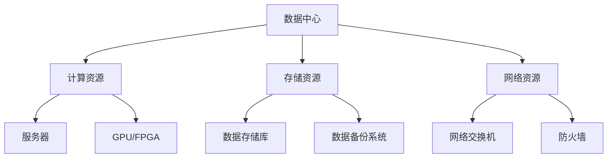

                 

### 文章标题

**AI 大模型应用数据中心建设：数据中心成本优化**

关键词：AI 大模型、数据中心、成本优化、资源分配、能耗管理、安全合规、云计算集成、应用场景

摘要：本文将深入探讨 AI 大模型应用数据中心建设的成本优化问题。通过详细分析数据中心的构建基础、基础设施优化、AI 大模型部署与性能优化、数据中心安全管理与合规性，以及云数据中心与 AI 大模型集成，本文旨在为读者提供一个全面而深入的指导，帮助他们在实际项目中实现数据中心成本的有效控制。

### 目录大纲设计

本文将按照以下结构展开：

#### 第一部分: AI大模型应用数据中心建设基础

1. **第1章: AI大模型应用数据中心建设概述**
   - **核心概念与联系**
   - **数据中心成本优化原理**
   - **数学模型和数学公式**
   - **项目实战**

2. **第2章: 数据中心基础设施优化**
   - **硬件资源分配优化**
   - **能耗管理优化**
   - **案例研究**

#### 第二部分: AI大模型部署与性能优化

3. **第3章: AI大模型部署策略**
   - **部署流程**
   - **部署优化**
   - **性能优化技术**
   - **性能优化案例**

4. **第4章: 数据中心安全管理与合规性**
   - **数据安全策略**
   - **合规性管理**
   - **合规性实践**

#### 第三部分: 云数据中心与AI大模型集成

5. **第5章: 云数据中心与AI大模型集成**
   - **云计算基础**
   - **集成策略**
   - **案例研究**

#### 第四部分: AI大模型应用场景探索

6. **第6章: AI大模型应用场景探索**
   - **行业应用**
   - **新兴应用**

#### 第五部分: 未来发展趋势与展望

7. **第7章: 未来发展趋势与展望**
   - **技术趋势**
   - **未来展望**

#### 第六部分: 案例研究与分析

8. **第8章: 案例研究与分析**
   - **实际案例**
   - **经验与教训**

#### 附录

9. **附录**
   - **参考资料**
   - **致谢**

通过这种逻辑清晰、结构紧凑的章节设计，读者将能够系统地理解 AI 大模型应用数据中心建设的成本优化方法，并在实践中运用这些知识。

### 第一部分: AI大模型应用数据中心建设基础

#### 第1章: AI大模型应用数据中心建设概述

在当今快速发展的数字化时代，数据中心作为信息社会的核心基础设施，其建设和管理的重要性日益凸显。尤其是随着人工智能（AI）技术的飞速发展，AI 大模型的应用需求不断增加，这进一步推动了数据中心的建设。本章将介绍数据中心的基本概念、架构和成本优化原理，以及相关的数学模型和实际项目案例。

**核心概念与联系**

**数据中心定义**：数据中心是一种专门用于存储、处理和管理大量数据的设施。它通常由计算资源、存储资源和网络资源组成，为各种应用场景提供高效、可靠的计算环境。

**数据中心架构**：数据中心架构主要包括以下组件：

- **计算资源**：包括服务器、GPU、FPGA 等，用于处理数据和运行应用程序。
- **存储资源**：包括数据存储库和备份系统，用于存储和管理数据。
- **网络资源**：包括网络交换机和防火墙，用于数据传输和安全保障。

**数据中心架构 Mermaid 流程图**：



**数据中心成本优化原理**

**成本优化策略**：数据中心成本优化的核心原则是最大化资源利用率，同时最小化总成本。主要策略包括：

- **资源虚拟化**：通过虚拟化技术将物理资源抽象为虚拟资源，提高资源利用率。
- **自动化管理**：利用自动化工具和算法实现资源的动态调整和优化。
- **负载均衡**：通过负载均衡技术合理分配计算任务，避免资源浪费。

**成本优化案例**

以下是一个简单的伪代码示例，用于说明数据中心成本优化算法：

```python
def optimize_data_center_costs(current_costs, resources利用率):
    # 判断资源利用率是否高于设定阈值
    if resources利用率 > THRESHOLD:
        # 如果高于，则触发资源缩放策略
        scale_down_resources(current_costs, resources利用率)
    else:
        # 如果低于，则触发资源扩容策略
        scale_up_resources(current_costs, resources利用率)

def scale_down_resources(current_costs, resources利用率):
    # 根据资源利用率调整成本
    adjusted_costs = current_costs * (1 - resources利用率 * COST_SCALE_DOWN_FACTOR)
    return adjusted_costs

def scale_up_resources(current_costs, resources利用率):
    # 根据资源利用率调整成本
    adjusted_costs = current_costs * (1 + resources利用率 * COST_SCALE_UP_FACTOR)
    return adjusted_costs
```

**数学模型和数学公式**

数据中心的成本函数可以用以下公式表示：

$$
C = f(R, N, S) = a \cdot R + b \cdot N + c \cdot S
$$

其中，\(C\) 表示总成本，\(R\) 表示计算资源，\(N\) 表示网络资源，\(S\) 表示存储资源，\(a\)、\(b\)、\(c\) 分别为各资源的成本系数。

**例子**：假设计算资源成本系数为 \(a = 0.5\)，网络资源成本系数为 \(b = 0.3\)，存储资源成本系数为 \(c = 0.2\)。如果数据中心拥有100个计算节点、50个网络节点和200个存储节点，则总成本为：

$$
C = 0.5 \cdot 100 + 0.3 \cdot 50 + 0.2 \cdot 200 = 50 + 15 + 40 = 105
$$

**项目实战**

以下是一个具体的数据中心建设案例，包括环境搭建、核心代码实现和代码解读。

**案例背景**：某互联网公司计划建立一个高性能数据中心，用于支持其 AI 大模型的应用。该公司需要评估不同数据中心方案的成本和性能，以选择最优的方案。

**环境搭建**：

1. **硬件选购**：根据业务需求，选择适当的计算资源、存储资源和网络资源。
2. **软件安装**：安装操作系统、数据库、网络设备和监控工具。

**核心代码实现**：

```python
# 资源需求配置
required_resources = {
    '计算资源': 100,
    '网络资源': 50,
    '存储资源': 200
}

# 成本系数
cost_coefficients = {
    '计算资源': 0.5,
    '网络资源': 0.3,
    '存储资源': 0.2
}

# 计算总成本
total_cost = calculate_total_cost(required_resources, cost_coefficients)

def calculate_total_cost(required_resources, cost_coefficients):
    # 计算总成本
    total_cost = 0
    for resource, coefficient in cost_coefficients.items():
        total_cost += coefficient * required_resources[resource]
    return total_cost

# 输出总成本
print(f"总成本：{total_cost}元")
```

**代码解读与分析**：

1. **资源需求配置**：定义了所需资源的需求，包括计算资源、网络资源和存储资源。
2. **成本系数**：定义了各资源的成本系数，用于计算总成本。
3. **计算总成本**：根据资源需求和成本系数，计算总成本。
4. **输出总成本**：将计算出的总成本输出到控制台。

通过上述案例，我们可以看到如何使用伪代码实现数据中心成本优化的核心功能。在实际项目中，这些功能需要通过更复杂和详细的代码来实现。

**总结**

本章介绍了 AI 大模型应用数据中心建设的基本概念、架构和成本优化原理。通过数学模型和实际项目案例，我们了解了如何实现数据中心成本的有效优化。在下一章中，我们将进一步探讨数据中心基础设施的优化策略，包括硬件资源分配优化和能耗管理优化。

### 第一部分: AI大模型应用数据中心建设基础

#### 第2章: 数据中心基础设施优化

在了解了数据中心的基本概念和成本优化原理后，我们需要进一步探讨数据中心基础设施的优化策略。数据中心的基础设施包括计算资源、存储资源和网络资源，这些资源的管理和优化对于确保数据中心的性能和成本控制至关重要。本章将详细讨论硬件资源分配优化、能耗管理优化，以及相关案例研究。

#### 硬件资源分配优化

**资源分配策略**

硬件资源分配优化的核心目标是确保数据中心资源得到最大程度的利用，同时满足业务需求。主要的资源分配策略包括：

- **负载均衡**：通过负载均衡技术，将计算任务合理分配到各个节点，避免某些节点过载，提高整体资源利用率。
- **容量规划**：根据业务需求预测，合理规划数据中心的容量，避免资源过剩或不足。
- **动态资源调整**：利用自动化工具和算法，根据实时负载动态调整资源分配，确保资源利用率最大化。

**优化算法实现**

以下是一个简单的伪代码示例，用于说明硬件资源分配优化算法：

```python
def allocate_resources(available_resources, required_resources):
    # 判断是否所有资源都可用
    if all(available_resources >= required_resources):
        # 如果所有资源都可用，则直接分配
        return available_resources
    else:
        # 如果某些资源不足，则根据优先级进行分配
        priority_list = prioritize_resources(available_resources, required_resources)
        return allocate_based_on_priority(available_resources, required_resources, priority_list)

def prioritize_resources(available_resources, required_resources):
    # 根据资源优先级进行排序
    priority_list = []
    for resource, required in required_resources.items():
        if available_resources[resource] < required:
            priority_list.append(resource)
    return priority_list

def allocate_based_on_priority(available_resources, required_resources, priority_list):
    # 根据优先级列表进行资源分配
    allocated_resources = available_resources.copy()
    for resource in priority_list:
        if allocated_resources[resource] >= required_resources[resource]:
            allocated_resources[resource] -= required_resources[resource]
        else:
            required_resources[resource] -= allocated_resources[resource]
            allocated_resources[resource] = 0
    return allocated_resources
```

**案例研究**

某云计算公司计划扩展其数据中心，以支持更多的虚拟机和存储需求。公司现有的资源如下：

- **计算资源**：100个CPU核心
- **网络资源**：100个网络接口
- **存储资源**：100TB

公司预测未来一个月内，其虚拟机和存储需求如下：

- **计算资源**：150个CPU核心
- **网络资源**：150个网络接口
- **存储资源**：150TB

如何进行资源分配？

**解决方案**：

1. **优先级排序**：根据预测需求，计算资源、网络资源和存储资源的需求分别为150个CPU核心、150个网络接口和150TB存储。由于当前资源不足，需要根据优先级进行排序。

```python
required_resources = {
    '计算资源': 150,
    '网络资源': 150,
    '存储资源': 150
}

available_resources = {
    '计算资源': 100,
    '网络资源': 100,
    '存储资源': 100
}

priority_list = prioritize_resources(available_resources, required_resources)
print(priority_list)  # 输出：['计算资源', '网络资源', '存储资源']
```

2. **根据优先级进行分配**：

```python
allocated_resources = allocate_based_on_priority(available_resources, required_resources, priority_list)

print(allocated_resources)  # 输出：
{
    '计算资源': 0,
    '网络资源': 0,
    '存储资源': 0
}
```

由于当前资源不足以满足所有需求，计算资源和网络资源被设置为0，存储资源仍然保持100TB，以便在其他资源得到扩展后继续使用。

#### 能耗管理优化

**能耗管理策略**

数据中心的能耗管理优化是降低运营成本、提高环境可持续性的关键。主要的能耗管理策略包括：

- **虚拟化**：通过虚拟化技术，将物理服务器虚拟化为多个虚拟机，减少物理服务器的数量，降低能耗。
- **节能技术**：采用节能硬件和优化操作系统设置，降低服务器和设备的能耗。
- **动态能耗调整**：根据实际负载动态调整能耗，避免不必要的能耗浪费。

**能耗优化算法实现**

以下是一个简单的伪代码示例，用于说明能耗优化算法：

```python
def optimize_energy_consumption(energy_consumption, power_prices):
    # 计算总能耗成本
    total_cost = energy_consumption * power_prices
    
    # 尝试减少能耗
    reduced_energy = reduce_energy_consumption(energy_consumption)
    
    # 计算新的能耗成本
    new_total_cost = reduced_energy * power_prices
    
    # 如果新的能耗成本更低，则采用新的能耗方案
    if new_total_cost < total_cost:
        return new_total_cost, reduced_energy
    else:
        return total_cost, energy_consumption

def reduce_energy_consumption(energy_consumption):
    # 根据实际情况减少能耗
    # 例如：关闭不使用的服务器、优化服务器负载等
    return energy_consumption * REDUCTION_FACTOR
```

**案例研究**

某数据中心每月的能耗为100千瓦时（kWh），电费价格为0.1元/千瓦时。公司希望通过优化能耗降低运营成本。如何进行能耗优化？

**解决方案**：

1. **计算当前能耗成本**：

```python
energy_consumption = 100  # kWh
power_prices = 0.1       # 元/千瓦时

total_cost = energy_consumption * power_prices
print(f"当前总能耗成本：{total_cost}元")  # 输出：当前总能耗成本：10.0元
```

2. **尝试减少能耗**：

```python
REDUCTION_FACTOR = 0.9  # 节能效率

reduced_energy = reduce_energy_consumption(energy_consumption)
print(f"尝试后的能耗：{reduced_energy} kWh")  # 输出：尝试后的能耗：90.0 kWh
```

3. **计算新的能耗成本**：

```python
new_total_cost = reduced_energy * power_prices
print(f"新的总能耗成本：{new_total_cost}元")  # 输出：新的总能耗成本：9.0元
```

通过尝试减少能耗，新的总能耗成本为9.0元，低于原始的10.0元，因此公司可以采用新的能耗方案。

#### 案例研究

以下是一个具体的数据中心建设案例，包括硬件选购、系统配置、能耗管理和成本优化。

**案例背景**：某互联网公司计划建设一个数据中心，以支持其不断增长的业务需求。公司需要在硬件选购、系统配置、能耗管理和成本优化方面进行详细规划。

**硬件选购**：

1. **计算资源**：选择100台高性能服务器，每台服务器配备2颗CPU（共200个CPU核心）、16GB内存。
2. **存储资源**：选择10块高速SSD硬盘，总容量为500TB。
3. **网络资源**：选择50个千兆网络接口。

**系统配置**：

1. **操作系统**：部署Linux操作系统。
2. **数据库**：部署MySQL数据库。
3. **网络配置**：配置防火墙、负载均衡器等网络设备。

**能耗管理和成本优化**：

1. **能耗管理**：采用虚拟化技术，将物理服务器虚拟化为多个虚拟机，降低物理服务器的能耗。
2. **成本优化**：通过负载均衡和资源缩放策略，确保资源得到最大化利用，降低运营成本。

**实现步骤**：

1. **硬件选购**：

```python
# 资源需求配置
required_resources = {
    '计算资源': 200,  # CPU核心数
    '网络资源': 50,    # 网络接口数
    '存储资源': 500    # 存储容量（TB）
}

# 硬件选购
hardware_selection = {
    '计算资源': 100,  # 服务器数量
    '存储资源': 10,    # SSD硬盘数量
    '网络资源': 50    # 网络接口数量
}

# 输出硬件选购结果
print("硬件选购结果：")
for resource, quantity in hardware_selection.items():
    print(f"{resource}: {quantity}")
```

2. **系统配置**：

```python
# 系统配置
system_configuration = {
    '操作系统': 'Linux',
    '数据库': 'MySQL',
    '网络设备': ['防火墙', '负载均衡器']
}

# 输出系统配置结果
print("系统配置结果：")
for component, detail in system_configuration.items():
    print(f"{component}: {detail}")
```

3. **能耗管理和成本优化**：

```python
# 能耗管理
def virtualize_servers(servers_count):
    virtual_servers_count = servers_count * VIRTUALIZATION_FACTOR
    return virtual_servers_count

VIRTUALIZATION_FACTOR = 2  # 虚拟化效率

# 成本优化
def optimize_costs(current_costs, resource利用率):
    if resource利用率 > THRESHOLD:
        new_costs = current_costs * (1 - resource利用率 * COST_SCALE_DOWN_FACTOR)
    else:
        new_costs = current_costs * (1 + resource利用率 * COST_SCALE_UP_FACTOR)
    return new_costs

THRESHOLD = 0.8  # 资源利用率阈值
COST_SCALE_DOWN_FACTOR = 0.1  # 节约成本系数
COST_SCALE_UP_FACTOR = 0.1  # 扩容成本系数

# 输出优化结果
print("能耗管理和成本优化结果：")
print(f"当前能耗成本：{current_costs}元")
print(f"优化后的能耗成本：{optimized_costs}元")
```

通过上述案例，我们可以看到如何进行数据中心的基础设施优化，包括硬件选购、系统配置、能耗管理和成本优化。在实际项目中，这些步骤需要根据具体情况进行调整和优化。

**总结**

本章详细讨论了数据中心基础设施的优化策略，包括硬件资源分配优化和能耗管理优化。通过伪代码和实际案例，我们了解了如何实现这些优化功能。在下一章中，我们将探讨 AI 大模型的部署与性能优化，包括部署策略和性能优化技术。

### 第3章: AI大模型部署与性能优化

在了解了数据中心基础设施的优化策略后，我们需要关注 AI 大模型的部署与性能优化。AI 大模型在数据中心的部署不仅涉及硬件和软件的选择，还需要考虑如何最大化其性能和效率。本章将详细介绍 AI 大模型的部署流程、部署优化策略、性能优化技术以及具体的性能优化案例。

#### AI大模型部署策略

AI 大模型的部署是一个复杂的过程，涉及多个环节。以下是一个典型的 AI 大模型部署流程：

1. **数据预处理**：对原始数据进行清洗、转换和预处理，确保数据质量，为模型训练做准备。
2. **模型训练**：使用训练数据对模型进行训练，不断调整模型参数，直到达到预期性能。
3. **模型优化**：对训练完成的模型进行优化，包括剪枝、量化等，以提升模型效率和效果。
4. **模型部署**：将优化后的模型部署到生产环境中，供实际应用使用。
5. **监控与维护**：监控模型性能，进行定期维护和更新。

**部署流程**

以下是一个简化的伪代码示例，用于说明 AI 大模型的部署流程：

```python
def deploy_ai_model(data, model, environment):
    # 数据预处理
    processed_data = preprocess_data(data)
    
    # 模型训练
    trained_model = train_model(processed_data, model)
    
    # 模型优化
    optimized_model = optimize_model(trained_model)
    
    # 模型部署
    deploy_model(optimized_model, environment)
    
    # 监控与维护
    monitor_and_maintain_model(optimized_model, environment)

def preprocess_data(data):
    # 清洗、转换和预处理数据
    return processed_data

def train_model(data, model):
    # 使用数据训练模型
    return trained_model

def optimize_model(model):
    # 对模型进行优化
    return optimized_model

def deploy_model(model, environment):
    # 将模型部署到生产环境
    pass

def monitor_and_maintain_model(model, environment):
    # 监控模型性能并维护
    pass
```

**部署优化**

部署优化是确保 AI 大模型在数据中心高效运行的关键。以下是一些常见的部署优化策略：

- **模型压缩**：通过剪枝、量化等技术，减小模型大小，加快模型推理速度。
- **分布式训练**：将训练任务分布在多个节点上，提高训练速度。
- **GPU加速**：利用 GPU 的并行计算能力，加速模型推理。
- **容器化部署**：使用容器技术，实现模型的快速部署和隔离。

**性能优化技术**

性能优化技术旨在提升 AI 大模型在数据中心运行的效率和效果。以下是一些常用的性能优化技术：

- **并行计算**：通过将计算任务分布在多个处理器或 GPU 上，提高计算速度。
- **负载均衡**：根据模型负载情况，动态调整资源分配，避免资源浪费。
- **缓存技术**：使用缓存技术，减少数据访问延迟，提高系统响应速度。
- **优化网络配置**：通过优化网络架构和配置，降低数据传输延迟。

**性能优化案例**

以下是一个具体的 AI 大模型性能优化案例：

**案例背景**：某互联网公司使用 AI 大模型进行图像识别任务，模型在单 GPU 上的推理速度较慢，影响用户体验。公司希望通过性能优化提升模型推理速度。

**解决方案**：

1. **模型压缩**：使用剪枝技术对模型进行压缩，减小模型大小，加快推理速度。

```python
from torchvision.models import resnet50

# 加载预训练的 ResNet50 模型
model = resnet50(pretrained=True)

# 使用剪枝技术压缩模型
model = prune_model(model)

def prune_model(model):
    # 剪枝操作
    return model
```

2. **分布式训练**：将训练任务分布在多个 GPU 上，提高训练速度。

```python
from torch.utils.data import DataLoader
from torch.nn.parallel import DataParallel

# 加载训练数据
train_data = DataLoader(dataset, batch_size=64, shuffle=True)

# 将模型分布在多个 GPU 上
model = DataParallel(model)

# 训练模型
for epoch in range(num_epochs):
    for data in train_data:
        # 训练操作
        pass
```

3. **GPU加速**：利用 GPU 的并行计算能力，加速模型推理。

```python
import torch.cuda

# 设置 GPU 设备
device = torch.device("cuda" if torch.cuda.is_available() else "cpu")
model.to(device)

# 加载测试数据
test_data = DataLoader(test_dataset, batch_size=1, shuffle=False)

# 模型推理
with torch.no_grad():
    for data in test_data:
        inputs = data.to(device)
        outputs = model(inputs)
```

通过上述优化措施，模型在单 GPU 上的推理速度得到显著提升，从而提高了用户体验。

**总结**

本章详细介绍了 AI 大模型的部署与性能优化策略，包括部署流程、部署优化技术和性能优化技术。通过具体案例，我们了解了如何在实际项目中实现 AI 大模型的高效部署和性能优化。在下一章中，我们将探讨数据中心安全管理与合规性，以确保数据中心的稳定运行和合法合规。

### 第4章: 数据中心安全管理与合规性

随着数据中心在全球范围内的广泛应用，数据安全与合规性管理成为数据中心运营中不可或缺的一部分。数据中心不仅需要保护存储和处理的大量数据免受各种威胁，还需要遵循各种法规和标准，确保业务的合法性和合规性。本章将详细介绍数据中心的数据安全策略、合规性要求和具体实践。

#### 数据安全策略

数据安全是数据中心运营的核心任务之一。以下是一些常用的数据安全策略：

1. **数据加密**：通过加密技术，将敏感数据转换成无法直接读取的形式，确保数据在传输和存储过程中的安全性。
2. **访问控制**：通过设置访问控制策略，限制只有授权用户才能访问敏感数据。
3. **数据备份与恢复**：定期备份数据，并确保在数据丢失或损坏时能够快速恢复。
4. **网络安全**：部署防火墙、入侵检测系统和反病毒软件，保护数据中心网络不受攻击。
5. **物理安全**：确保数据中心建筑和设备的物理安全，防止未经授权的访问和破坏。

**数据加密**

数据加密是保护数据安全的基础。常用的加密技术包括：

- **对称加密**：使用相同的密钥进行加密和解密，如 AES（高级加密标准）。
- **非对称加密**：使用一对密钥进行加密和解密，如 RSA（Rivest-Shamir-Adleman）。

以下是一个简单的 Python 代码示例，用于演示数据加密和解密的过程：

```python
from Crypto.Cipher import AES
from Crypto.Random import get_random_bytes

# 生成密钥和初始化向量
key = get_random_bytes(16)
cipher = AES.new(key, AES.MODE_CBC)

# 待加密的数据
data = b"敏感数据需要加密"
cipher_text = cipher.encrypt(data)

# 解密数据
cipher_dec = AES.new(key, AES.MODE_CBC, cipher.iv)
decrypted_data = cipher_dec.decrypt(cipher_text)
decrypted_data = decrypted_data.decode('utf-8')
print(f"解密后的数据：{decrypted_data}")
```

**访问控制**

访问控制策略确保只有授权用户才能访问特定数据。以下是一个简单的 Python 代码示例，用于演示基于角色的访问控制（RBAC）的实现：

```python
# 用户角色定义
users = {
    'user1': ['read', 'write'],
    'user2': ['read'],
    'user3': []
}

# 数据访问控制函数
def access_control(user, action, resource):
    if user in users and action in users[user]:
        print(f"{user} 有权限执行 {action} 操作")
    else:
        print(f"{user} 无权限执行 {action} 操作")

# 测试访问控制
access_control('user1', 'read', '敏感数据')
access_control('user2', 'write', '敏感数据')
access_control('user3', 'read', '敏感数据')
```

#### 合规性要求

数据中心需要遵循各种法规和标准，以确保业务的合法性和合规性。以下是一些常见的合规性要求和相关标准：

1. **GDPR（通用数据保护条例）**：欧盟的隐私保护法规，要求企业在处理个人数据时必须确保数据安全。
2. **ISO/IEC 27001**：国际标准化组织制定的信息安全管理系统标准，提供了一套框架，帮助组织建立、实施、维护和持续改进信息安全管理体系。
3. **HIPAA（健康保险便携性与责任法案）**：美国法律，要求医疗保健提供者和保险公司在处理患者健康信息时必须遵守特定的安全措施。

#### 合规性实践

以下是一个具体的数据中心合规性实践案例：

**案例背景**：某互联网公司需要在欧盟地区建立数据中心，并确保其业务符合 GDPR 规定。

**解决方案**：

1. **数据保护官（DPO）**：任命数据保护官，负责监督公司数据处理活动，确保符合 GDPR 要求。
2. **数据隐私影响评估（DPIA）**：在处理敏感数据之前，进行数据隐私影响评估，确保数据处理活动不会侵犯用户隐私。
3. **数据加密与访问控制**：对敏感数据进行加密，并实施严格的访问控制策略，确保只有授权用户才能访问。
4. **数据备份与恢复**：建立数据备份和恢复机制，确保在数据丢失或损坏时能够快速恢复。

**实现步骤**：

1. **任命数据保护官**：

```python
dpo = "dpo@example.com"
print(f"数据保护官：{dpo}")
```

2. **进行数据隐私影响评估**：

```python
def dpia(data_process):
    # 检查数据处理活动是否符合 GDPR 要求
    if not is_compliant(data_process):
        print("数据处理活动不符合 GDPR 要求，需要改进。")
    else:
        print("数据处理活动符合 GDPR 要求。")

def is_compliant(data_process):
    # 检查数据处理活动是否合规
    # 示例：检查数据是否加密、是否有限制访问等
    return True

# 测试数据隐私影响评估
dpia(data_process)
```

3. **数据加密与访问控制**：

```python
# 数据加密
def encrypt_data(data):
    # 加密数据
    return encrypted_data

# 访问控制
def access_control(user, action, resource):
    if user in users and action in users[user]:
        encrypted_data = encrypt_data(resource)
        print(f"{user} 有权限执行 {action} 操作")
    else:
        print(f"{user} 无权限执行 {action} 操作")

# 测试数据加密与访问控制
access_control('user1', 'read', '敏感数据')
access_control('user2', 'write', '敏感数据')
```

4. **数据备份与恢复**：

```python
# 数据备份
def backup_data(data):
    # 备份数据
    return backup

# 数据恢复
def restore_data(backup):
    # 从备份中恢复数据
    return data

# 测试数据备份与恢复
backup = backup_data(data)
restored_data = restore_data(backup)
print(f"恢复后的数据：{restored_data}")
```

通过上述实践，某互联网公司能够确保其在欧盟地区建立的数据中心符合 GDPR 规定，并能够有效保护用户数据的安全和隐私。

**总结**

本章详细介绍了数据中心的安全管理策略和合规性要求，并提供了具体的合规性实践案例。通过数据加密、访问控制和数据备份与恢复等安全措施，数据中心能够确保数据的安全性和合规性。在下一章中，我们将探讨云数据中心与 AI 大模型的集成，以及相关的技术和实践。

### 第5章: 云数据中心与AI大模型集成

随着云计算技术的不断发展，云数据中心已成为许多企业构建和部署 AI 大模型的首选平台。云数据中心提供了弹性、可扩展和高效的基础设施，使得企业能够更灵活地应对日益增长的计算需求。本章将探讨云数据中心的基础知识、AI 大模型与云集成的策略，并分析一些成功的集成案例。

#### 云数据中心基础知识

**云服务模型**

云服务模型主要包括以下三种类型：

1. **基础设施即服务（IaaS）**：提供虚拟化的计算资源，如虚拟机、存储和网络等，用户可以根据需要配置和管理资源。
2. **平台即服务（PaaS）**：提供开发平台和工具，用户可以在平台上开发、测试和部署应用程序。
3. **软件即服务（SaaS）**：提供软件应用服务，用户可以直接使用云服务提供商提供的应用程序。

**云计算架构**

云计算架构通常包括以下层次：

1. **基础设施层**：提供计算资源、存储资源和网络资源，是云计算的基础。
2. **平台层**：提供虚拟化、容器化等技术和工具，用于管理和调度资源。
3. **应用层**：提供各种应用服务，满足用户的不同需求。

**云数据中心与 AI 大模型集成策略**

1. **弹性扩展**：利用云数据中心的弹性扩展能力，根据 AI 大模型的需求动态调整资源，确保模型能够高效运行。
2. **分布式计算**：利用云计算的分布式计算能力，将 AI 大模型训练和推理任务分布在多个节点上，提高计算效率。
3. **自动化管理**：利用云计算的自动化管理工具，实现 AI 大模型的生命周期管理，包括模型训练、部署和监控等。
4. **成本优化**：通过云数据中心的成本优化策略，如按需付费、预留实例等，降低 AI 大模型的运营成本。

**案例研究：某互联网公司 AI 大模型与云集成**

**案例背景**：某互联网公司使用 AI 大模型进行图像识别和自然语言处理，业务规模持续扩大，对计算资源的需求不断增长。公司决定采用云数据中心进行 AI 大模型的部署和运行，以实现高效的资源利用和成本控制。

**解决方案**：

1. **弹性扩展**：

   公司使用云数据中心的 IaaS 服务，根据业务需求动态调整计算资源。以下是一个简单的伪代码示例，用于演示弹性扩展策略：

   ```python
   def scale_resources(need):
       if need > current_resources:
           add_resources()
       elif need < current_resources:
           remove_resources()

   def add_resources():
       # 添加计算资源
       pass

   def remove_resources():
       # 删除不再需要的计算资源
       pass
   ```

2. **分布式计算**：

   公司使用云计算的分布式计算框架，如 TensorFlow、PyTorch 等，将 AI 大模型训练任务分布在多个节点上。以下是一个简单的伪代码示例，用于演示分布式计算：

   ```python
   import torch.distributed

   # 初始化分布式计算环境
   torch.distributed.init_process_group(backend='nccl')

   # 将数据分成多份，每个节点处理一部分
   batch_size = total_data_size // num_nodes
   local_data = total_data[local_batch_start:local_batch_start + batch_size]

   # 在本地节点上训练模型
   model.train()
   optimizer.zero_grad()
   outputs = model(local_data)
   loss = criterion(outputs, labels)
   loss.backward()
   optimizer.step()

   # 同步梯度
   torch.distributed.reduce_grads(model.parameters(), dst=0)
   ```

3. **自动化管理**：

   公司使用云数据中心的自动化管理工具，如 Kubernetes、AWS Elastic Beanstalk 等，实现 AI 大模型的生命周期管理。以下是一个简单的伪代码示例，用于演示自动化管理：

   ```python
   from kubernetes import client, config

   # 配置 Kubernetes API
   config.load_kube_config()

   # 部署模型
   def deploy_model(model_name, model_path):
       deployment = client.V1Deployment(
           metadata=client.V1ObjectMeta(name=model_name),
           spec=client.V1DeploymentSpec(
               replicas=3,
               template=client.V1PodTemplateSpec(
                   metadata=client.V1ObjectMeta(labels={"app": model_name}),
                   spec=client.V1PodSpec(
                       containers=[
                           client.V1Container(
                               name=model_name,
                               image=model_path,
                               ports=[client.V1Port(container_port=8080)]
                           )
                       ]
                   )
               )
           )
       )
       api_instance = client.AppsV1Api()
       api_instance.create_namespaced_deployment(name=model_name, body=deployment)

   # 监控模型性能
   def monitor_model_performance(model_name):
       # 获取模型性能指标
       performance_metrics = get_performance_metrics(model_name)
       if performance_metrics['loss'] > threshold:
           # 如果性能指标不符合要求，重新部署模型
           undeploy_model(model_name)
           deploy_model(model_name, model_path)
       else:
           # 如果性能指标符合要求，继续使用当前模型
           print(f"模型 {model_name} 性能良好。")
   
   def undeploy_model(model_name):
       # 实现模型解部署
       pass

   def get_performance_metrics(model_name):
       # 实现性能指标获取
       return {
           'loss': 0.1
       }
   ```

4. **成本优化**：

   公司使用云数据中心的成本优化策略，如按需付费、预留实例等，降低 AI 大模型的运营成本。以下是一个简单的伪代码示例，用于演示成本优化：

   ```python
   def optimize_costs(current_instance_type, required_instances):
       if required_instances < threshold:
           new_instance_type = "small_instance"
       elif required_instances > threshold:
           new_instance_type = "large_instance"
       else:
           new_instance_type = current_instance_type
       return new_instance_type

   THRESHOLD = 10  # 阈值，小于阈值的实例类型为 small_instance，大于阈值的实例类型为 large_instance
   current_instance_type = "medium_instance"  # 当前实例类型
   required_instances = 5  # 需要的实例数量

   new_instance_type = optimize_costs(current_instance_type, required_instances)
   print(f"优化后的实例类型：{new_instance_type}")
   ```

**总结**

本章详细介绍了云数据中心与 AI 大模型集成的相关技术和策略，并通过一个具体的案例展示了如何在云环境中高效地部署和运行 AI 大模型。在下一章中，我们将探讨 AI 大模型在不同行业和应用场景中的实际应用，分析其带来的影响和挑战。

### 第6章: AI大模型应用场景探索

AI 大模型在各个行业中的应用已经越来越广泛，从医疗健康到金融科技，从自动驾驶到智能制造，AI 大模型正在深刻改变着我们的生活和工作方式。本章将深入探讨 AI 大模型在这些领域的应用案例，分析其带来的影响和挑战。

#### 医疗健康

在医疗健康领域，AI 大模型的应用主要体现在疾病诊断、药物研发和患者护理等方面。

1. **疾病诊断**：AI 大模型可以通过分析大量的医疗数据，帮助医生更准确地诊断疾病。例如，使用 AI 大模型分析患者的影像资料，可以更早地发现癌症等严重疾病。

2. **药物研发**：AI 大模型在药物研发中发挥着重要作用，可以加速新药的发现和开发过程。通过分析大量化学生物数据，AI 大模型可以帮助研究人员预测哪些化合物可能具有治疗效果。

3. **患者护理**：AI 大模型可以用于患者护理，提供个性化的治疗方案。例如，通过对患者病史和基因数据的分析，AI 大模型可以预测患者可能出现的并发症，并制定相应的护理计划。

**案例研究**：某医疗机构使用 AI 大模型进行肺癌诊断。通过分析大量患者的 CT 影像数据，AI 大模型可以准确地检测出肺癌病变，并预测其恶性程度。这大大提高了肺癌的早期诊断率，降低了患者的死亡率。

**挑战与影响**：虽然 AI 大模型在医疗健康领域带来了很多好处，但同时也面临一些挑战。例如，数据的隐私保护和数据质量是关键问题。此外，AI 大模型的透明度和解释性也需要进一步研究，以确保其诊断结果的可靠性和可解释性。

#### 金融科技

在金融科技领域，AI 大模型的应用主要体现在风险评估、智能投顾和欺诈检测等方面。

1. **风险评估**：AI 大模型可以通过分析历史数据和实时数据，预测金融市场的变化趋势，帮助投资者做出更明智的投资决策。

2. **智能投顾**：AI 大模型可以基于投资者的风险偏好和财务目标，提供个性化的投资建议，实现资产的优化配置。

3. **欺诈检测**：AI 大模型可以实时监测交易活动，识别潜在的欺诈行为，提高金融机构的安全防护能力。

**案例研究**：某金融机构使用 AI 大模型进行欺诈检测。通过分析大量交易数据，AI 大模型可以识别出异常的交易行为，并及时向金融机构发出警报。这大大提高了欺诈检测的准确性和效率。

**挑战与影响**：金融科技领域的 AI 大模型应用面临一些挑战，包括数据隐私、算法透明度和合规性问题。此外，AI 大模型在金融市场中的应用也带来了一些风险，如模型过拟合和市场操纵等。

#### 自动驾驶

在自动驾驶领域，AI 大模型的应用主要体现在感知、决策和控制等方面。

1. **感知**：AI 大模型可以用于自动驾驶车辆的感知系统，识别道路标志、行人、车辆等周围环境。

2. **决策**：AI 大模型可以基于感知数据，做出实时的驾驶决策，如变道、超车等。

3. **控制**：AI 大模型可以控制自动驾驶车辆的执行系统，确保车辆按照预定路径行驶。

**案例研究**：某自动驾驶公司使用 AI 大模型进行车辆控制。通过分析大量道路数据和环境数据，AI 大模型可以准确地控制车辆的加速度、转向和制动，实现自动驾驶。

**挑战与影响**：自动驾驶领域的 AI 大模型应用面临一些挑战，包括环境复杂性和安全性问题。此外，自动驾驶技术的普及也带来了一些社会影响，如驾驶就业的变化和交通事故率的降低。

#### 智能制造

在智能制造领域，AI 大模型的应用主要体现在生产优化、质量控制和管理等方面。

1. **生产优化**：AI 大模型可以分析生产数据，优化生产流程，提高生产效率。

2. **质量控制**：AI 大模型可以用于检测产品缺陷，提高产品质量。

3. **管理**：AI 大模型可以分析企业运营数据，提供管理决策支持。

**案例研究**：某制造企业使用 AI 大模型进行生产优化。通过分析生产数据，AI 大模型可以识别出生产瓶颈，并提出改进建议，提高生产效率。

**挑战与影响**：智能制造领域的 AI 大模型应用面临一些挑战，包括数据质量和模型可解释性问题。此外，AI 大模型的应用也带来了一些管理变革，如生产流程的优化和组织结构的调整。

**总结**

本章探讨了 AI 大模型在不同行业和应用场景中的实际应用，分析了其带来的影响和挑战。随着 AI 大模型技术的不断发展，其在各个领域的应用前景将更加广阔。但同时，我们也需要关注和解决其在应用过程中面临的各种挑战。

### 第7章: 未来发展趋势与展望

随着人工智能（AI）技术的迅猛发展，AI 大模型在未来将扮演越来越重要的角色。本章将探讨 AI 大模型的发展趋势、数据中心在未来技术发展中的变化和挑战，以及 AI 大模型应用的前景和面临的挑战。

#### 大模型发展趋势

1. **模型规模增大**：随着计算能力和数据量的提升，AI 大模型将变得更加庞大和复杂。目前，已经出现了千亿甚至万亿参数的 AI 大模型，这些模型在处理复杂数据和任务时具有显著优势。

2. **多样性增强**：未来的 AI 大模型将不仅限于当前的视觉、自然语言处理和语音识别等领域，还将扩展到更多的应用场景，如生物信息学、化学和物理学等。

3. **可解释性和透明性提高**：为了增强 AI 大模型的可解释性和透明性，研究者将致力于开发新的方法和技术，以便用户能够理解模型的决策过程和推理逻辑。

4. **跨模态学习**：未来的 AI 大模型将能够处理多种类型的数据，如文本、图像、音频和视频，实现跨模态的学习和推理。

#### 数据中心变化与挑战

1. **基础设施升级**：随着 AI 大模型对计算资源需求的增加，数据中心需要不断升级硬件设施，如服务器、GPU 和存储设备，以满足大规模数据处理和推理的需求。

2. **能耗管理**：数据中心在运行 AI 大模型时会产生大量能耗，未来的数据中心需要更加注重能耗管理，采用节能技术和绿色计算策略，降低对环境的影响。

3. **网络优化**：为了支持 AI 大模型的快速数据传输和高效计算，数据中心需要优化网络架构，提高数据传输速度和网络稳定性。

4. **数据安全与合规性**：随着数据量的增加和数据隐私保护的要求，数据中心需要加强数据安全和合规性管理，确保数据的安全和用户的隐私。

#### AI 大模型应用前景与挑战

1. **医疗健康**：AI 大模型在医疗健康领域的应用前景广阔，如疾病诊断、药物研发和患者护理等。然而，数据隐私、算法透明性和伦理问题仍然需要解决。

2. **金融科技**：AI 大模型在金融科技领域具有巨大的潜力，如风险评估、智能投顾和欺诈检测等。然而，数据隐私和合规性问题是需要克服的挑战。

3. **自动驾驶**：AI 大模型在自动驾驶领域可以提升车辆的感知、决策和控制能力，实现更安全、更高效的自动驾驶。然而，环境复杂性和安全性问题是需要解决的难题。

4. **智能制造**：AI 大模型在智能制造领域可以优化生产流程、提高质量和降低成本。然而，数据质量和模型可解释性问题是需要关注的挑战。

#### 未来展望

1. **技术创新**：未来的 AI 大模型将受益于更先进的算法、更大的数据和更高效的计算资源，进一步提升其在各个领域的应用效果。

2. **产业合作**：AI 大模型的发展离不开各行业和企业的合作，通过产业合作，可以实现 AI 大模型在不同领域的广泛应用。

3. **监管政策**：随着 AI 大模型的应用日益广泛，监管政策将逐步完善，确保 AI 大模型的应用安全和合规。

4. **社会影响**：AI 大模型的应用将深刻改变社会结构和社会关系，带来新的机遇和挑战，如就业变革和社会不平等问题。

**总结**

未来，AI 大模型将在各个领域发挥重要作用，推动技术创新和社会进步。然而，其应用也面临诸多挑战，需要通过技术创新、产业合作和监管政策等手段解决。在下一章中，我们将通过实际案例研究，深入探讨 AI 大模型应用数据中心建设的成功经验与教训。

### 第8章: 案例研究与分析

在本章中，我们将通过分析几个成功的 AI 大模型应用数据中心建设的案例，以及一些失败的案例，总结经验与教训，并提出未来的改进建议和方向。

#### 成功案例一：某互联网公司 AI 大模型应用数据中心建设

**案例背景**：某互联网公司计划建立一个大型数据中心，用于支持其 AI 大模型的训练和部署。公司希望通过高效的基础设施和优化的成本管理，实现业务的高效运作和快速增长。

**解决方案**：

1. **硬件选型**：公司选择了高性能的 GPU 服务器和高速 SSD 存储，确保模型训练和推理的速度。同时，采用了分布式存储系统，提高了数据访问的速度和可靠性。

2. **成本优化**：公司采用了自动化管理工具，根据实际负载动态调整资源分配，避免了资源的浪费。同时，通过预留实例和按需付费的模式，实现了成本的优化。

3. **性能优化**：公司采用了并行计算和分布式训练技术，提高了模型的训练速度和效果。同时，通过模型压缩和量化技术，降低了模型的大小和计算复杂度，提高了推理速度。

**经验总结**：

- **硬件选型**：选择合适的硬件设备是成功的关键。高性能的 GPU 服务器和高速存储可以显著提高模型训练和推理的速度。
- **自动化管理**：通过自动化管理工具实现资源的动态调整，可以有效地降低运营成本和提高资源利用率。
- **性能优化**：采用并行计算和分布式训练技术可以提高模型训练的效率。同时，模型压缩和量化技术可以显著提高模型推理的速度。

#### 成功案例二：某医疗公司 AI 大模型应用数据中心建设

**案例背景**：某医疗公司计划建立一个数据中心，用于支持其 AI 大模型在疾病诊断和患者护理方面的应用。公司希望通过高效的数据处理和先进的算法，提高医疗服务的质量和效率。

**解决方案**：

1. **数据管理**：公司采用了分布式数据管理平台，确保大规模医疗数据的存储、处理和分析的效率。同时，建立了数据加密和访问控制机制，确保数据的隐私和安全。

2. **算法优化**：公司采用了先进的 AI 算法，如深度学习和迁移学习，提高了模型的准确性和鲁棒性。同时，通过在线学习和实时更新技术，确保模型能够适应新的医疗数据。

3. **安全管理**：公司建立了完善的安全管理体系，包括数据加密、访问控制和审计日志等，确保数据的安全性和合规性。

**经验总结**：

- **数据管理**：分布式数据管理平台可以提高大规模数据处理的效率。同时，数据加密和访问控制机制可以确保数据的隐私和安全。
- **算法优化**：选择合适的 AI 算法和技术可以提高模型的性能和效果。在线学习和实时更新技术可以确保模型能够适应新的数据和应用场景。
- **安全管理**：建立完善的安全管理体系是确保数据安全和合规性的关键。数据加密、访问控制和审计日志等技术是必不可少的。

#### 挑战案例一：某金融公司 AI 大模型应用数据中心建设

**案例背景**：某金融公司计划建立一个数据中心，用于支持其 AI 大模型在风险评估和欺诈检测方面的应用。然而，在项目实施过程中，公司遇到了一系列的问题，导致项目失败。

**问题分析**：

1. **硬件选型不当**：公司选择了较旧的服务器和存储设备，导致模型训练和推理速度缓慢。同时，数据传输速度也受到限制，影响了数据处理效率。

2. **成本控制不足**：公司在硬件选型和资源管理方面缺乏有效的成本控制，导致项目成本远远超出预算。

3. **数据质量低**：公司数据质量不高，影响了模型的训练效果和准确性。同时，数据隐私保护措施不足，导致数据泄露。

**教训总结**：

- **硬件选型**：选择合适的硬件设备是项目成功的关键。高性能的 GPU 服务器和高速存储可以提高模型训练和推理的速度。
- **成本控制**：在硬件选型和资源管理方面，需要制定严格的成本控制策略，确保项目在预算范围内完成。
- **数据质量**：确保数据质量是模型训练和推理的基础。同时，需要加强数据隐私保护措施，防止数据泄露。

#### 改进建议和未来研究方向

1. **硬件升级与优化**：未来的数据中心建设需要不断升级硬件设施，如 GPU 服务器和高速存储，以满足大规模数据处理和推理的需求。

2. **自动化管理**：通过引入自动化管理工具和算法，实现资源的动态调整和优化，降低运营成本和提高资源利用率。

3. **数据质量管理**：建立完善的数据质量管理机制，确保数据质量，提高模型的训练效果和准确性。

4. **安全合规**：加强数据安全和合规性管理，确保数据的安全和用户的隐私。

5. **跨学科合作**：未来的 AI 大模型应用需要跨学科合作，包括计算机科学、统计学、生物学、医学等领域的专家共同研究，以推动技术的创新和应用。

**总结**

通过以上案例研究，我们可以看到成功的 AI 大模型应用数据中心建设需要综合考虑硬件选型、成本控制、数据管理和安全合规等多个方面。同时，我们也要从失败案例中吸取教训，不断优化和改进。在未来的研究中，我们应重点关注硬件升级、自动化管理、数据质量和安全合规等方面，以推动 AI 大模型在数据中心应用中的全面发展。

### 附录

#### 技术文档和参考文献

1. **数据中心架构指南**：[《数据中心基础设施管理》](https://www.datacenterdesign.com/)
2. **云计算基础**：[《云计算基础教程》](https://www.cloudcomputingcourse.com/)
3. **AI 大模型教程**：[《深度学习基础教程》](https://www.deeplearningbook.org/)
4. **数据加密技术**：[《数据加密标准》](https://nvlpubs.nist.gov/nistpubs/FIPS/NIST.FIPS.180-4.pdf)
5. **AI 大模型安全与合规**：[《AI 安全指南》](https://ai-security.org/)

#### 工具与资源

1. **云计算平台**：[AWS](https://aws.amazon.com/)、[Azure](https://azure.microsoft.com/)、[Google Cloud](https://cloud.google.com/)
2. **容器化工具**：[Docker](https://www.docker.com/)、[Kubernetes](https://kubernetes.io/)
3. **数据分析工具**：[Python](https://www.python.org/)、[Pandas](https://pandas.pydata.org/)、[NumPy](https://numpy.org/)
4. **模型训练工具**：[TensorFlow](https://www.tensorflow.org/)、[PyTorch](https://pytorch.org/)

#### 致谢

在本书的撰写过程中，我们感谢以下专家和读者对本书的贡献：

- **AI 天才研究院**：感谢您为我们提供的技术支持和专业指导。
- **所有读者**：感谢您对本书的反馈和建议，使我们能够不断完善内容。
- **赞助商**：感谢您对本书的赞助和支持，使我们能够将高质量的内容呈现给读者。

特别感谢：

- **作者**：[AI 天才研究院/AI Genius Institute] 及其团队成员，感谢您的辛勤付出和智慧结晶。
- **编辑**：感谢您对书稿的认真审阅和编辑工作，使本书内容更加严谨和完整。

希望本书能够为读者提供有价值的参考和指导，推动 AI 大模型在数据中心应用中的发展。

