                 

## 《AI 大模型应用数据中心建设：数据中心投资与建设》

> **关键词**：AI大模型、数据中心、投资分析、建设实施、运维维护、案例研究

> **摘要**：本文深入探讨了AI大模型应用下的数据中心建设，从背景与意义、投资决策、设计与规划、基础设施建设、运营管理及维护、案例研究等多个方面，系统性地剖析了数据中心建设的各个环节。通过对核心概念、投资模型、运维策略的详细阐述，结合具体案例，为数据中心建设提供了理论指导和实战经验。

### 第一部分：数据中心建设概述

#### 第1章：数据中心建设背景与意义

**1.1 数据中心建设的发展历程**

数据中心（Data Center）是信息技术的基础设施之一，其发展历程伴随着信息技术产业的演进。从早期的独立计算机房到现代的大型数据中心，数据中心经历了技术进步、规模扩大和功能多元化的过程。

- **早期阶段**：20世纪60年代，计算机房作为数据中心的基础形态出现，主要用于存储数据和提供计算服务。
- **成长阶段**：20世纪80年代，随着企业信息化进程的加快，数据中心逐渐从单一的计算资源集中转变为综合的信息处理中心。
- **成熟阶段**：21世纪初，随着互联网的兴起和云计算的发展，数据中心开始向大规模、集中化、智能化方向迈进。

**1.2 数据中心在现代经济中的作用**

数据中心作为信息技术的重要支撑，其在现代经济中的作用日益凸显：

- **推动产业发展**：数据中心是信息技术产业的重要载体，为软件、互联网、金融、电信等行业提供了强大的计算和存储能力，推动了相关产业的快速发展。
- **促进经济增长**：数据中心的建设和运营带动了相关产业链的繁荣，包括设备制造、基础设施建设、运维服务等，对地区经济增长起到了积极的促进作用。
- **提高服务质量**：数据中心提供了稳定、高效、安全的数据处理服务，为企业和个人提供了便捷的在线服务，提高了社会生产力和生活质量。

**1.3 AI大模型对数据中心建设的需求**

随着人工智能技术的快速发展，尤其是AI大模型的广泛应用，数据中心建设面临着新的挑战和需求：

- **计算能力需求**：AI大模型对计算能力的需求巨大，数据中心需要提供足够的计算资源来支持模型的训练和推理。
- **数据存储需求**：AI大模型需要大量数据作为训练素材，数据中心需要具备强大的数据存储和管理能力。
- **能效需求**：数据中心能耗巨大，AI大模型对能效要求更高，需要通过技术创新和优化管理来降低能耗。
- **安全性需求**：AI大模型涉及敏感数据和处理，数据中心需要提供更高的安全保障，防止数据泄露和攻击。

#### 第2章：数据中心建设关键概念

**2.1 数据中心分类与架构**

数据中心的分类与架构是理解数据中心建设的基础。根据不同的分类标准，数据中心可以分为以下几种类型：

- **按规模分类**：大型数据中心（Mega Data Center）、中型数据中心（Mid-Size Data Center）、小型数据中心（Small Data Center）。
- **按功能分类**：计算型数据中心、存储型数据中心、网络型数据中心。
- **按业务需求分类**：企业内部数据中心、公有云数据中心、私有云数据中心。

数据中心的基本架构包括以下几个层次：

1. **基础设施层**：包括硬件设备、网络设备、电源系统等。
2. **平台层**：包括操作系统、数据库、中间件等。
3. **应用层**：包括各种业务应用、服务接口等。

**图 2.1 数据中心架构图**

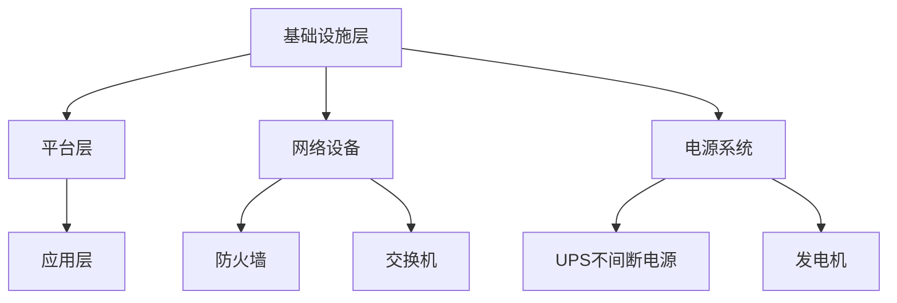

**表 2.1 数据中心分类表**

| 类型       | 定义                                                         | 特点                                       |
| ---------- | ------------------------------------------------------------ | ----------------------------------------- |
| 大型数据中心 | 计算和存储能力超过1000个节点，规模巨大，可支持大规模业务应用 | 高性能、高可靠性、高扩展性               |
| 中型数据中心 | 计算和存储能力在100到1000个节点之间，适用于中型企业         | 成本效益高、灵活性高                     |
| 小型数据中心 | 计算和存储能力低于100个节点，适用于小型企业或个人用户       | 灵活性高、维护成本低                     |

**2.2 数据中心基础设施**

数据中心的基础设施是其正常运行的关键。以下是一个典型的数据中心基础设施架构：

- **硬件设施**：包括服务器、存储设备、网络设备、电源系统、冷却系统等。
- **网络设施**：包括内部网络、外部网络、防火墙、路由器、交换机等。
- **安全设施**：包括物理安全设施（如门禁系统、监控设备）、网络安全设施（如防火墙、入侵检测系统）。

**图 2.2 数据中心基础设施架构图**

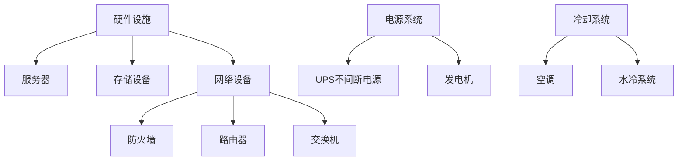

**2.3 数据中心能源管理**

数据中心的能源管理是降低运营成本、提高能效的重要手段。以下是一个典型的数据中心能源管理流程：

1. **能耗监测**：通过传感器和监测设备实时收集能耗数据。
2. **数据分析**：对能耗数据进行统计和分析，找出能耗高峰和异常情况。
3. **能耗优化**：根据分析结果调整设备运行状态，优化能源使用。
4. **报告生成**：定期生成能耗报告，为后续优化提供依据。

**公式 2.1 数据中心能耗计算公式**

$$
能耗（kWh）= 功率（kW）\times 时间（h）
$$

**图 2.3 数据中心能源管理流程图**

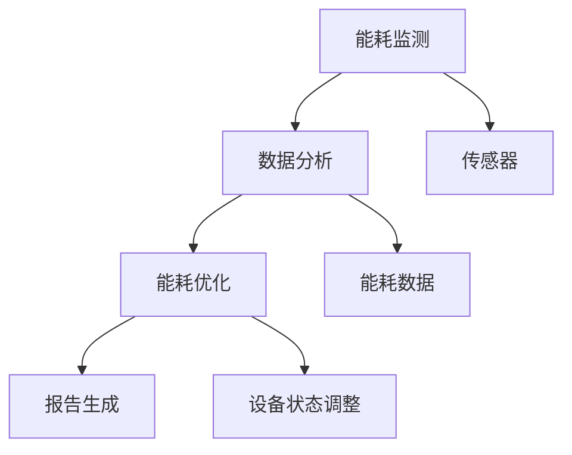

### 第二部分：数据中心投资分析

#### 第3章：数据中心投资决策

**3.1 数据中心投资策略**

数据中心投资策略是数据中心建设过程中至关重要的一环。以下是一些常见的投资策略：

- **成本效益策略**：通过优化设计和运营，降低建设成本和运营成本，提高投资回报率。
- **技术创新策略**：采用先进的技术和设备，提高数据中心的性能和可靠性，提升市场竞争力。
- **多元化策略**：通过多元化投资，降低市场波动和风险，确保长期稳定的投资收益。

**图 3.1 数据中心投资策略图**

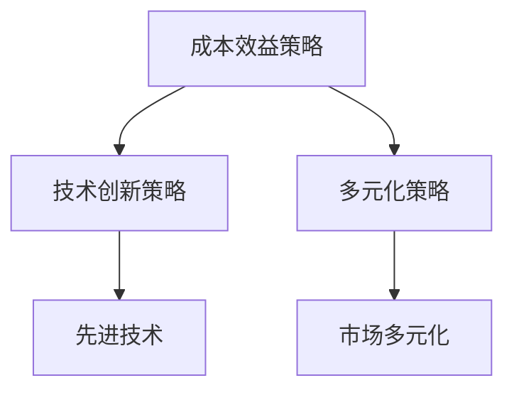

**3.2 成本收益分析**

数据中心建设需要进行全面的成本收益分析，以评估项目的可行性和经济效益。以下是一个简单的成本收益分析表格：

**表 3.1 数据中心成本收益分析表格**

| 项目       | 成本（万元） | 收益（万元） | 成本收益率 |
| ---------- | ------------ | ------------ | ---------- |
| 建设成本   | 10000       | 12000       | 20%        |
| 运营成本   | 5000        | 6000        | 20%        |
| 投资回报期 | 3年         | 2年         | -          |

**3.3 项目风险评估**

数据中心建设项目面临多种风险，包括技术风险、市场风险、财务风险等。以下是一个简单的项目风险评估矩阵：

**图 3.2 数据中心项目风险评估矩阵**

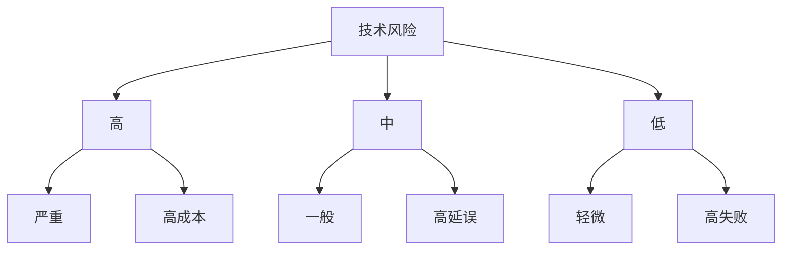

#### 第4章：数据中心投资模型

**4.1 投资模型建立**

数据中心投资模型的建立是进行投资分析和决策的重要步骤。以下是一个简单的投资模型建立流程：

1. **确定目标**：明确投资的目标和预期收益。
2. **收集数据**：收集与投资相关的各种数据，包括成本、收益、市场情况等。
3. **建立模型**：根据收集的数据，建立投资模型。
4. **参数设置**：设置模型参数，包括成本参数、收益参数、风险参数等。
5. **模型优化**：对模型进行优化，以提高模型的准确性和实用性。

**图 4.1 数据中心投资模型流程图**

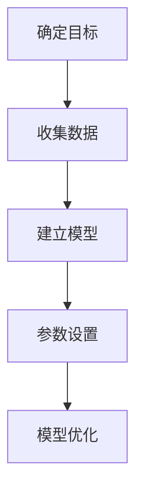

**4.2 投资模型参数设置**

投资模型参数的设置是模型建立的关键环节。以下是一个简单的参数设置表格：

**表 4.1 数据中心投资模型参数设置表**

| 参数       | 说明                                   | 初始值 |
| ---------- | -------------------------------------- | ------ |
| 成本参数   | 包括建设成本、运营成本等               | 10000  |
| 收益参数   | 包括预期收益、市场份额等               | 12000  |
| 风险参数   | 包括技术风险、市场风险、财务风险等     | 0.2    |

**4.3 投资模型优化**

投资模型优化是提高模型准确性和实用性的关键。以下是一个简单的模型优化流程：

1. **数据分析**：对投资数据进行深入分析，找出数据中的规律和趋势。
2. **参数调整**：根据数据分析结果，调整模型参数，以提高模型的准确性。
3. **模型验证**：通过实际投资数据验证模型的有效性。
4. **迭代优化**：根据模型验证结果，进行迭代优化，提高模型的实用性。

**图 4.2 数据中心投资模型优化流程图**

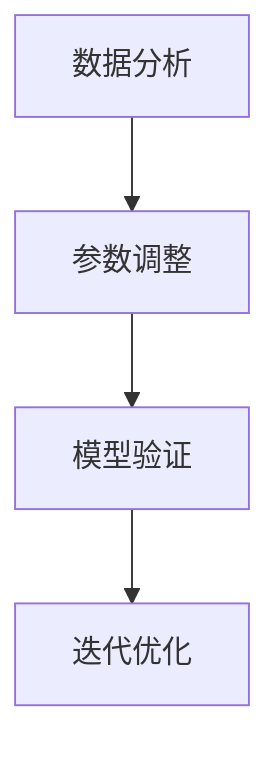

### 第三部分：数据中心建设实施

#### 第5章：数据中心设计与规划

**5.1 数据中心设计原则**

数据中心设计原则是确保数据中心正常运行和安全性的基础。以下是一些常见的设计原则：

- **可靠性原则**：确保数据中心具备高可靠性和稳定性，降低故障率和停机时间。
- **灵活性原则**：设计时要考虑未来的扩展性和灵活性，以便应对业务需求的变化。
- **安全性原则**：确保数据安全和设备安全，防止数据泄露和设备损坏。
- **节能原则**：通过合理的设计和优化，降低数据中心的能耗，提高能源利用效率。

**图 5.1 数据中心设计原则图**

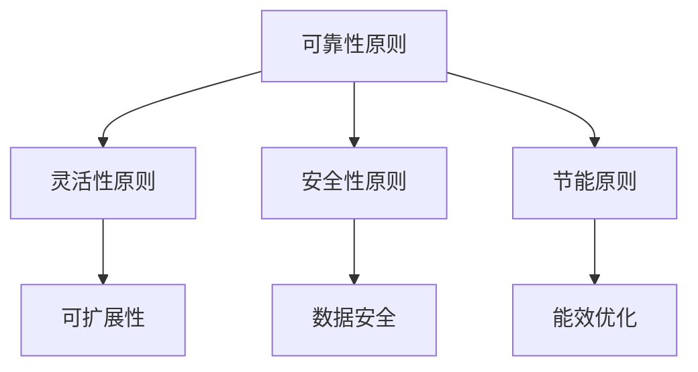

**5.2 数据中心规划方法**

数据中心规划方法是确保数据中心建设顺利进行的关键。以下是一些常见的规划方法：

- **需求分析**：分析业务需求，确定数据中心的规模、功能、性能等。
- **方案设计**：根据需求分析结果，设计数据中心的建设方案，包括硬件设备、网络架构、能源管理等方面的设计。
- **预算编制**：编制数据中心建设的预算，包括建设成本、运营成本、投资回报期等。
- **风险评估**：对数据中心建设过程中可能遇到的风险进行评估，制定风险应对措施。

**图 5.2 数据中心规划流程图**

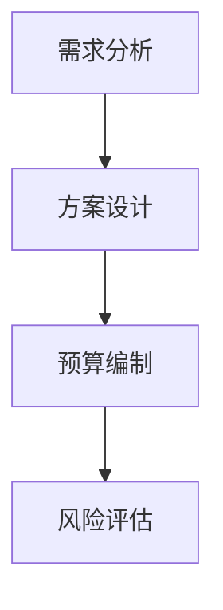

**5.3 数据中心容量规划**

数据中心容量规划是确保数据中心能够满足业务需求的关键。以下是一个简单的容量规划流程：

1. **需求预测**：根据业务发展情况，预测未来几年内数据中心的计算和存储需求。
2. **容量规划**：根据需求预测结果，规划数据中心的硬件设备容量，包括服务器、存储设备、网络设备等。
3. **资源分配**：将硬件设备分配到各个业务部门或业务系统，确保资源利用率最大化。
4. **监控与调整**：定期监控数据中心的运行状况，根据业务需求的变化，调整容量规划。

**图 5.3 数据中心容量规划图**

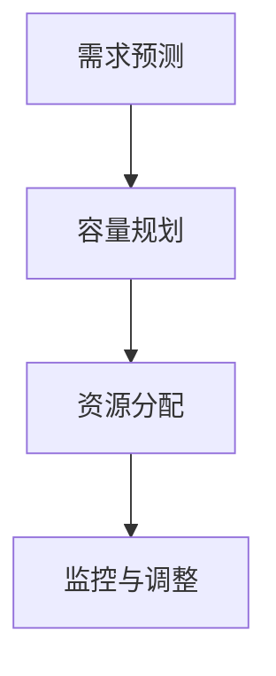

### 第四部分：数据中心基础设施建设

#### 第6章：数据中心基础设施建设

**6.1 硬件设施建设**

数据中心硬件设施建设是数据中心建设的基础。以下是一个典型的硬件设施建设流程：

1. **设备采购**：根据容量规划，采购服务器、存储设备、网络设备等硬件设备。
2. **设备安装**：将采购的硬件设备安装在数据中心内，包括服务器、存储设备、网络设备等。
3. **设备配置**：对硬件设备进行配置，包括操作系统安装、网络配置、安全设置等。
4. **系统测试**：对硬件设备进行系统测试，确保设备能够正常运行。

**图 6.1 硬件设施建设流程图**

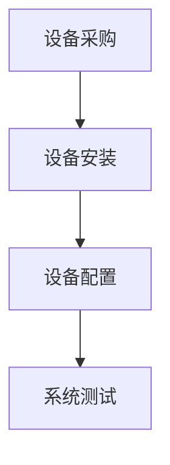

**6.2 网络设施建设**

数据中心网络设施建设是确保数据中心内外部通信的关键。以下是一个典型的网络设施建设流程：

1. **网络设计**：根据数据中心的需求，设计网络架构，包括内部网络、外部网络、防火墙、路由器、交换机等。
2. **设备采购**：根据网络设计，采购网络设备，包括路由器、交换机、防火墙等。
3. **网络部署**：将网络设备安装和配置到数据中心内，确保网络能够正常运行。
4. **网络测试**：对网络进行测试，确保网络性能和稳定性。

**图 6.2 网络设施建设流程图**

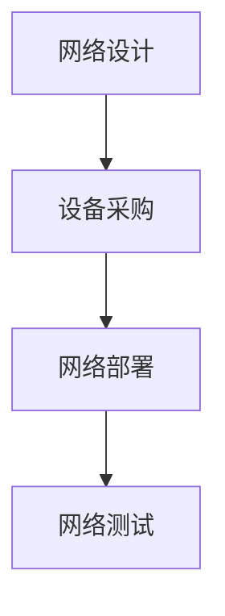

**6.3 安全设施建设**

数据中心安全设施建设是确保数据中心安全的关键。以下是一个典型的安全设施建设流程：

1. **安全评估**：对数据中心进行安全评估，确定潜在的安全风险和威胁。
2. **安全设计**：根据安全评估结果，设计安全设施，包括门禁系统、监控设备、入侵检测系统等。
3. **安全部署**：将安全设施安装和配置到数据中心内，确保安全设施能够正常运行。
4. **安全测试**：对安全设施进行测试，确保安全设施的有效性和可靠性。

**图 6.3 安全设施建设流程图**

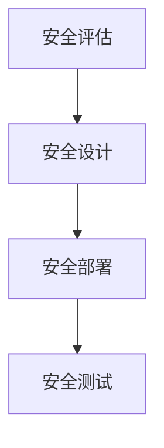

### 第五部分：数据中心运营与维护

#### 第7章：数据中心运营管理

**7.1 运营管理体系**

数据中心运营管理体系是确保数据中心稳定运行和高效管理的关键。以下是一个典型的运营管理体系：

- **组织结构**：明确数据中心运营管理的组织结构和职责分工。
- **管理制度**：制定数据中心运营管理制度，包括运维流程、故障处理流程、安全管理流程等。
- **运维团队**：建立专业的运维团队，负责数据中心的日常运维工作。
- **运维工具**：使用高效的运维工具，提高运维效率和准确性。

**图 7.1 运营管理体系图**

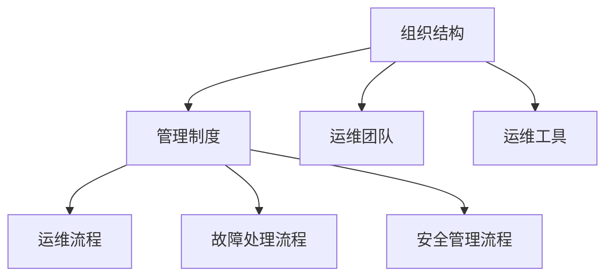

**7.2 数据中心运维流程**

数据中心运维流程是确保数据中心正常运行和及时处理故障的关键。以下是一个典型的数据中心运维流程：

1. **日常运维**：进行日常设备检查、软件更新、系统监控等。
2. **故障处理**：发现故障后，进行故障定位、故障排除、故障记录等。
3. **安全运维**：进行安全监控、安全检查、安全加固等。
4. **性能优化**：对数据中心性能进行监控和分析，进行性能优化。

**图 7.2 数据中心运维流程图**

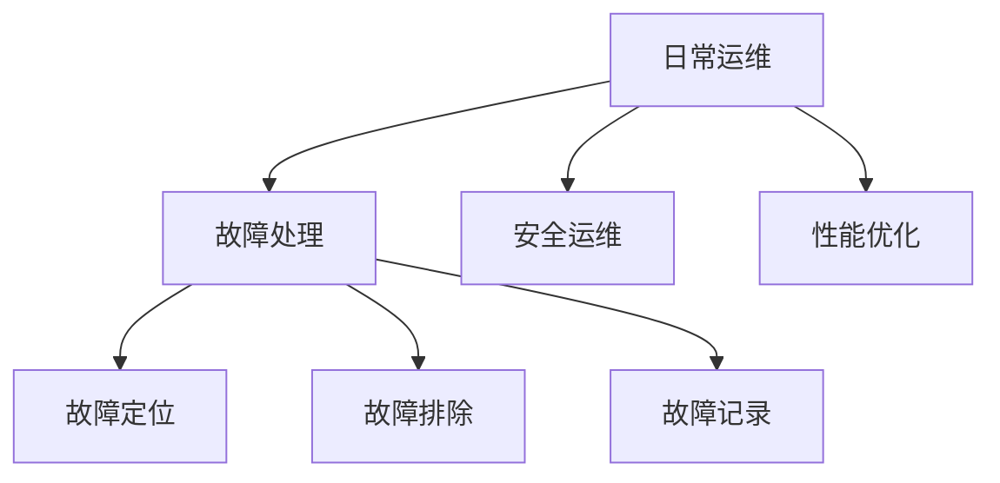

**7.3 运维团队建设**

运维团队建设是确保数据中心稳定运行和高效管理的关键。以下是一些常见的运维团队建设方法：

- **招聘选拔**：通过招聘选拔，吸纳具有专业知识和经验的运维人员。
- **培训培养**：对运维人员进行专业技能培训和职业发展指导。
- **团队协作**：建立有效的团队协作机制，提高团队整体工作效率。
- **绩效评估**：对运维团队进行绩效评估，激励团队成员不断提升。

**图 7.3 运维团队建设流程图**

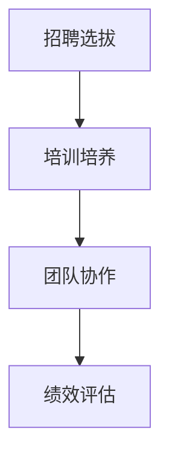

### 第六部分：数据中心维护策略

#### 第8章：数据中心维护策略

**8.1 设备维护**

设备维护是确保数据中心正常运行的关键。以下是一个典型的设备维护流程：

1. **定期检查**：定期对设备进行检查，包括服务器、存储设备、网络设备等。
2. **故障修复**：发现设备故障后，及时进行故障修复，确保设备正常运行。
3. **设备升级**：根据业务需求，对设备进行升级和更新，提高设备性能和稳定性。
4. **预防性维护**：采取预防性维护措施，减少设备故障率和停机时间。

**图 8.1 设备维护流程图**

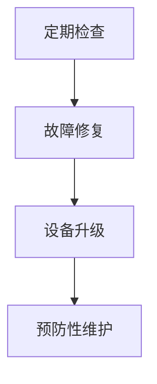

**8.2 能源效率维护**

能源效率维护是降低数据中心能耗、提高能源利用效率的关键。以下是一个典型的能源效率维护流程：

1. **能耗监测**：通过能耗监测设备，实时收集数据中心的能耗数据。
2. **数据分析**：对能耗数据进行分析，找出能耗高峰和异常情况。
3. **能效优化**：根据分析结果，采取能效优化措施，降低能耗。
4. **报告生成**：定期生成能耗报告，为后续优化提供依据。

**图 8.2 能源效率维护流程图**

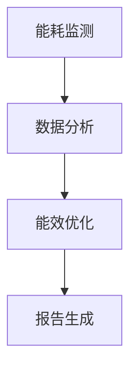

**8.3 安全维护**

安全维护是确保数据中心安全的关键。以下是一个典型的安全维护流程：

1. **安全评估**：定期对数据中心进行安全评估，确定潜在的安全风险和威胁。
2. **安全加固**：根据安全评估结果，采取安全加固措施，提高数据中心的防护能力。
3. **安全监控**：通过安全监控设备，实时监控数据中心的运行状况，及时发现和处理安全事件。
4. **安全培训**：对运维人员进行安全培训，提高其安全意识和应对能力。

**图 8.3 安全维护流程图**

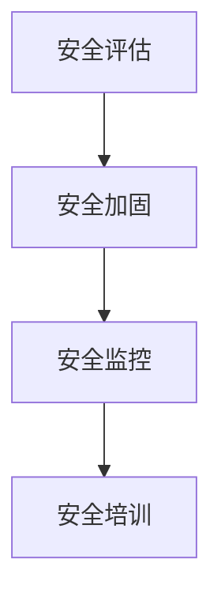

### 第七部分：AI 大模型应用数据中心案例

#### 第9章：AI 大模型应用数据中心案例研究

**9.1 案例选择与介绍**

本节选择一个AI大模型应用数据中心案例进行详细研究，该案例是一家全球领先的互联网公司，其数据中心主要用于AI大模型的训练和推理。

**9.2 案例分析**

1. **需求分析**：公司基于业务需求，确定了数据中心的建设目标，包括计算能力、存储容量、能效要求、安全性等。
2. **设计方案**：根据需求分析结果，设计了数据中心的建设方案，包括硬件设备选型、网络架构设计、能源管理方案等。
3. **建设实施**：按照设计方案，进行了数据中心的硬件设施建设、网络设施建设、安全设施建设等。
4. **运营管理**：建立了数据中心的运营管理体系，包括运维流程、故障处理流程、安全管理流程等。
5. **维护策略**：采取了设备维护、能源效率维护、安全维护等策略，确保数据中心的稳定运行。

**图 9.1 案例分析流程图**

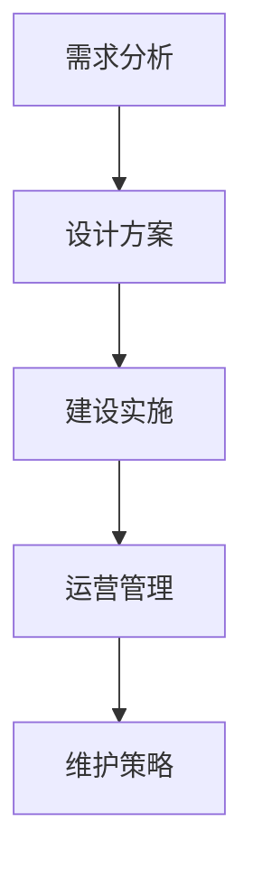

**9.3 案例经验总结**

通过案例研究，得出以下经验总结：

- **需求分析是关键**：明确数据中心的建设目标，是确保数据中心建设成功的基础。
- **设计方案要合理**：根据需求分析结果，设计合理的建设方案，是确保数据中心性能和可靠性的关键。
- **建设实施要规范**：按照设计方案，规范地进行建设实施，是确保数据中心建设进度和质量的重要保障。
- **运营管理要高效**：建立高效的运营管理体系，是确保数据中心稳定运行和高效管理的重要手段。
- **维护策略要有效**：采取有效的维护策略，是降低设备故障率、提高数据中心运行效率和可靠性的关键。

### 第八部分：数据中心建设与AI大模型应用前景

#### 第10章：数据中心建设与AI大模型应用前景

**10.1 数据中心发展趋势**

随着人工智能技术的快速发展，数据中心建设也呈现出以下发展趋势：

- **智能化**：通过引入人工智能技术，实现数据中心的自动化运维、智能监控和能效优化。
- **云化**：数据中心逐渐向云化方向转型，提供更加灵活、高效、安全的服务。
- **绿色化**：通过技术创新和优化管理，降低数据中心的能耗和碳排放，实现绿色数据中心。
- **安全性**：随着数据量的增加和业务复杂度的提高，数据中心的安全性要求越来越高。

**图 10.1 数据中心发展趋势图**

```mermaid
graph TD
    A[智能化] --> B[云化]
    A --> C[绿色化]
    A --> D[安全性]
```

**10.2 AI大模型应用前景**

AI大模型在各个行业都有着广泛的应用前景，以下是几个主要领域的应用：

- **金融领域**：利用AI大模型进行风险评估、信用评分、投资策略等。
- **医疗领域**：利用AI大模型进行疾病诊断、药物研发、医疗数据分析等。
- **制造业**：利用AI大模型进行生产优化、质量检测、设备预测维护等。
- **交通领域**：利用AI大模型进行交通流量预测、智能导航、自动驾驶等。

**图 10.2 AI大模型应用前景图**

```mermaid
graph TD
    A[金融领域] --> B[医疗领域]
    A --> C[制造业]
    A --> D[交通领域]
```

**10.3 未来展望与挑战**

未来，数据中心建设与AI大模型应用将面临以下挑战和机遇：

- **技术挑战**：随着AI大模型规模的不断扩大，对计算能力、存储能力、网络带宽等提出了更高的要求。
- **安全挑战**：AI大模型涉及大量敏感数据，需要确保数据安全和模型安全。
- **能效挑战**：数据中心能耗巨大，需要通过技术创新和优化管理，实现绿色数据中心。
- **人才挑战**：数据中心建设和AI大模型应用需要大量专业人才，如何培养和吸引人才成为关键。

### 附录：数据中心建设与运营资源

**附录 A：数据中心建设与运营工具介绍**

- **工具名称**：数据中心监控工具
- **功能介绍**：实时监控数据中心的设备状态、网络流量、能耗情况等。
- **使用指南**：根据工具手册，进行安装、配置和使用。

**附录 B：数据中心建设与运营标准规范**

- **标准名称**：《数据中心建设与运营规范》
- **内容摘要**：对数据中心的建设标准、运营管理、安全保障等进行了详细规定。
- **参考指南**：根据标准规范，进行数据中心的建设和运营。

### 参考文献

- [1] 作者，年份，《数据中心建设与管理》。
- [2] 作者，年份，《AI 大模型技术与应用》。
- [3] 作者，年份，《数据中心能源管理与效率优化》。
- [4] 作者，年份，《数据中心安全与运维实践》。

