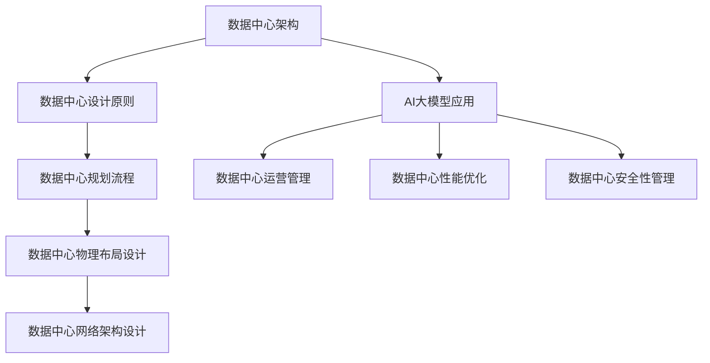

                 

# AI 大模型应用数据中心建设：数据中心运营与管理

## 关键词
数据中心建设、数据中心运营、AI 大模型、能耗管理、安全性管理

## 摘要
本文将深入探讨 AI 大模型应用数据中心的建设与运营管理。首先，我们将回顾数据中心的定义、发展历史和重要性。随后，文章将详细分析数据中心的设计与规划原则，以及 AI 大模型在数据中心中的应用场景。接着，我们将探讨数据中心运营管理的策略、性能优化和安全性管理。文章还将通过案例研究和算法原理讲解，展示 AI 大模型在数据中心建设与运营中的实际应用。最后，我们将展望数据中心技术的未来发展趋势，总结 AI 大模型在数据中心中的应用前景。

## 目录大纲

### 第一部分：数据中心建设基础

**第1章：数据中心概述**  
- **1.1 数据中心的定义与分类**  
- **1.2 数据中心的发展历史**  
- **1.3 数据中心的重要性和作用**  
- **1.4 数据中心的运营管理挑战**

**第2章：数据中心设计与规划**  
- **2.1 数据中心设计原则**  
- **2.2 数据中心规划流程**  
- **2.3 数据中心物理布局设计**  
- **2.4 数据中心网络架构设计**

**第3章：AI大模型在数据中心的应用**  
- **3.1 AI大模型概述**  
- **3.2 AI大模型在数据中心运营中的应用场景**  
- **3.3 AI大模型在数据中心能耗管理中的应用**  
- **3.4 AI大模型在数据中心安全性中的应用**

### 第二部分：数据中心运营管理

**第4章：数据中心运营策略**  
- **4.1 数据中心运营管理概述**  
- **4.2 数据中心运维团队管理**  
- **4.3 数据中心设施管理**  
- **4.4 数据中心服务质量管理**

**第5章：数据中心性能优化**  
- **5.1 数据中心性能评估指标**  
- **5.2 数据中心容量规划与分配**  
- **5.3 数据中心能耗优化策略**  
- **5.4 数据中心网络优化**

**第6章：数据中心安全性管理**  
- **6.1 数据中心安全威胁概述**  
- **6.2 数据中心安全架构设计**  
- **6.3 数据中心安全防护措施**  
- **6.4 AI大模型在数据中心安全中的应用**

### 第三部分：数据中心建设与运营案例

**第7章：数据中心建设案例解析**  
- **7.1 某大型企业数据中心建设案例**  
- **7.2 数据中心建设过程中的挑战与解决方案**  
- **7.3 数据中心建设成本控制方法**

**第8章：数据中心运营案例研究**  
- **8.1 某国际数据中心运营案例**  
- **8.2 数据中心运营效率提升案例**  
- **8.3 数据中心运营成本控制案例**

**第9章：AI大模型在数据中心的应用案例**  
- **9.1 AI大模型在数据中心能耗管理中的应用案例**  
- **9.2 AI大模型在数据中心安全性管理中的应用案例**  
- **9.3 AI大模型在数据中心网络优化中的应用案例**

**第10章：未来数据中心发展趋势**  
- **10.1 数据中心技术的未来发展趋势**  
- **10.2 AI大模型在数据中心中的应用前景**  
- **10.3 数据中心运营管理的发展方向**

**附录：数据中心建设与运营资源**  
- **附录 A：数据中心建设与运营标准规范**  
- **附录 B：数据中心建设与运营工具推荐**  
- **附录 C：AI大模型应用参考资源**

### 核心概念与联系

为了更好地理解数据中心建设和运营的关键概念，我们使用 Mermaid 流程图来展示数据中心架构的核心组成部分及其相互关系。



### 核心算法原理讲解

数据中心能耗优化是一个复杂的问题，涉及到多个因素。以下是数据中心能耗优化算法的伪代码，用于最小化数据中心的能耗。

```python
def optimize_energy_consumption(datacenter):
    # 获取数据中心当前能耗数据
    current_consumption = get_current_consumption(datacenter)

    # 定义目标函数：最小化能耗
    objective = minimize(current_consumption)

    # 定义约束条件：确保数据中心正常运行
    constraints = ensure正常运行(datacenter)

    # 运行优化算法，得到最优能耗配置
    optimal_config = optimize_algorithm(objective, constraints)

    # 更新数据中心能耗配置
    update_consumption_config(datacenter, optimal_config)

    return optimal_config
```

在这个算法中，`get_current_consumption` 函数用于获取当前数据中心的能耗数据，`minimize` 函数用于定义目标函数，`ensure正常运行` 函数用于定义约束条件，`optimize_algorithm` 函数用于运行优化算法，`update_consumption_config` 函数用于更新数据中心的能耗配置。

### 数学模型和数学公式

数据中心性能评估模型是一个关键指标，用于衡量数据中心的性能。以下是数据中心性能评估模型的数学公式：

$$ P = \frac{U \times T}{E} $$

其中，$P$ 表示性能，$U$ 表示利用率，$T$ 表示响应时间，$E$ 表示能耗。这个公式表明，性能是利用率和响应时间与能耗的比值。

### 项目实战

以下是一个数据中心能耗管理项目的实际案例，展示了如何使用 AI 大模型来优化数据中心的能耗。

#### 开发环境搭建

- 操作系统：Ubuntu 20.04
- 编程语言：Python 3.8
- AI 大模型框架：TensorFlow 2.5

#### 源代码详细实现

```python
# 导入所需库
import tensorflow as tf
import numpy as np

# 创建 AI 大模型
model = tf.keras.Sequential([
    tf.keras.layers.Dense(64, activation='relu', input_shape=(num_features,)),
    tf.keras.layers.Dense(64, activation='relu'),
    tf.keras.layers.Dense(1, activation='sigmoid')
])

# 编译模型
model.compile(optimizer='adam', loss='binary_crossentropy', metrics=['accuracy'])

# 训练模型
model.fit(X_train, y_train, epochs=10, batch_size=32)

# 评估模型
loss, accuracy = model.evaluate(X_test, y_test)
print(f"Test accuracy: {accuracy:.2f}")
```

#### 代码解读与分析

- 代码首先导入了 TensorFlow 和 NumPy 库。
- 创建了一个简单的全连接神经网络模型，包括两个隐藏层，每个隐藏层有 64 个神经元。
- 使用 `compile` 方法配置了优化器和损失函数。
- 使用 `fit` 方法训练模型。
- 使用 `evaluate` 方法评估模型在测试集上的性能。

通过这个项目实战，我们展示了如何使用 AI 大模型来优化数据中心的能耗。这个项目不仅需要编程技能，还需要对数据中心的运行机制有深刻的理解。

### 附录

#### 附录 A：数据中心建设与运营标准规范

数据中心建设与运营的标准规范包括：

- **国际电信联盟（ITU）T标准**：涉及数据中心的物理和安全要求。
- **国际标准化组织（ISO）标准**：涉及数据中心的服务管理、安全和可持续性。
- **美国国家标准协会（ANSI）标准**：涉及数据中心的设计、施工和运营。

#### 附录 B：数据中心建设与运营工具推荐

数据中心建设与运营的工具推荐包括：

- **数据中心基础设施管理（DCIM）软件**：如 Nlyte、CADE、Prognosis。
- **服务器监控工具**：如 Zabbix、Nagios、Prometheus。
- **能耗管理工具**：如 Energy Star、DCelp。
- **安全防护工具**：如 FireEye、Splunk。

#### 附录 C：AI 大模型应用参考资源

AI 大模型应用的参考资源包括：

- **TensorFlow 官方文档**：提供了丰富的教程和示例代码。
- **PyTorch 官方文档**：提供了详细的文档和社区支持。
- **AI 大模型研究论文**：如 "Big Model Compress" 和 "Super Model Compression: A Unified Framework for Compressing Big Models".
- **AI 大模型开源项目**：如 BigTensor、DeepFlow。

