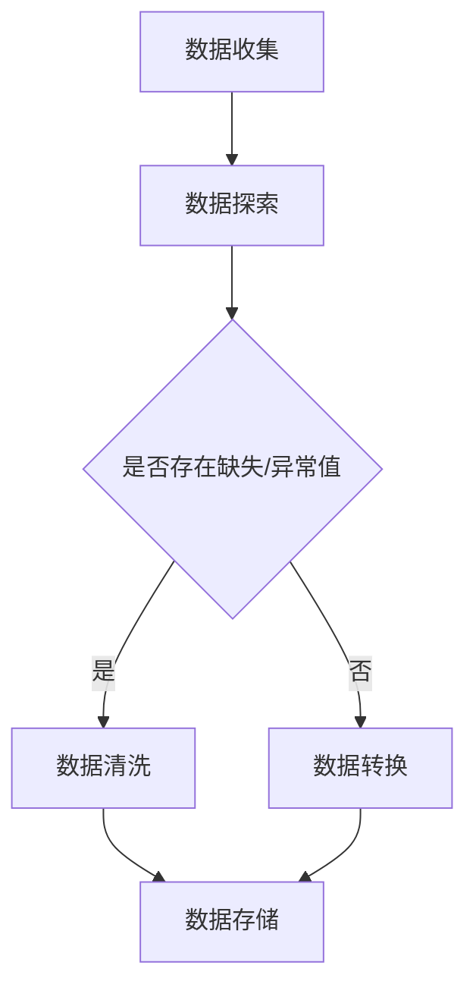

                 

### 《AI大模型应用数据中心的数据清洗架构》

#### 关键词：
- AI 大模型
- 数据清洗
- 数据中心
- 数据预处理
- 异常值处理
- 数据一致性
- 数据质量

#### 摘要：
本文深入探讨了 AI 大模型应用数据中心的数据清洗架构。通过分析数据清洗的重要性、面临的挑战以及核心方法与算法，本文旨在为读者提供一个全面且详细的指南。本文还将通过实际应用案例和未来展望，帮助读者理解数据清洗在 AI 大模型中的关键作用，并探讨其未来发展。

----------------------------------------------------------------

### 《AI大模型应用数据中心的数据清洗架构》目录大纲

#### 第一部分：数据清洗架构概述

##### 第1章：数据清洗的重要性

- **1.1 数据清洗的定义与意义**
  - 数据清洗的基本概念
  - 数据清洗的重要性
  - 数据清洗的目标

##### 第2章：数据清洗的挑战与解决方案

- **2.1 数据质量挑战**
  - 数据缺失
  - 数据不一致
  - 数据错误
  - 数据重复

#### 第二部分：数据清洗核心方法与算法

##### 第3章：数据预处理

- **3.1 数据预处理步骤**
  - 数据清洗流程图（Mermaid 流程图）
  - 数据预处理工具介绍

##### 第4章：缺失数据处理

- **4.1 缺失数据的类型与检测方法**
  - 缺失数据的识别
  - 缺失数据的统计分析
- **4.2 缺失数据的处理方法**
  - 填值方法
  - 删除方法

##### 第5章：异常值处理

- **5.1 异常值的识别方法**
  - 异常值的统计分析
  - 异常值的可视化
- **5.2 异常值的处理方法**
  - 去除异常值
  - 修改异常值

##### 第6章：重复数据处理

- **6.1 重复数据的识别方法**
  - 重复数据的比较方法
  - 重复数据的统计分析
- **6.2 重复数据的处理方法**
  - 合并重复数据
  - 删除重复数据

##### 第7章：数据一致性处理

- **7.1 数据一致性的问题来源**
  - 数据格式不一致
  - 数据命名不一致
  - 数据含义不一致
- **7.2 数据一致性处理方法**
  - 数据标准化
  - 数据规范化

##### 第8章：数据清洗算法与实现

- **8.1 数据清洗算法概述**
  - 数据清洗常见算法介绍
- **8.2 数据清洗算法实现**
  - 数据清洗伪代码讲解
  - 数据清洗代码示例

#### 第三部分：数据清洗应用案例

##### 第9章：数据清洗在AI大模型中的应用

- **9.1 数据清洗在AI大模型中的重要性**
  - 数据质量对模型性能的影响
  - 数据清洗在AI大模型中的具体应用
- **9.2 数据清洗实战案例**
  - 数据清洗项目实战案例
  - 数据清洗过程与结果分析

##### 第10章：数据清洗工具与平台

- **10.1 数据清洗工具概述**
  - 常见数据清洗工具介绍
- **10.2 数据清洗平台构建**
  - 数据清洗平台的设计与实现

##### 第11章：数据清洗中的伦理问题

- **11.1 数据隐私保护**
  - 数据隐私保护原则
  - 数据匿名化处理
- **11.2 数据质量伦理**
  - 数据真实性问题
  - 数据公平性问题

##### 第12章：数据清洗未来展望

- **12.1 数据清洗发展趋势**
  - 自动化数据清洗
  - 智能数据清洗
- **12.2 数据清洗的挑战与机遇**
  - 数据清洗面临的挑战
  - 数据清洗带来的机遇

#### 附录

##### 附录 A：数据清洗相关资源

- **A.1 数据清洗相关书籍**
- **A.2 数据清洗相关论文**
- **A.3 数据清洗开源工具和平台**

----------------------------------------------------------------

### 第一部分：数据清洗架构概述

#### 第1章：数据清洗的重要性

##### 1.1 数据清洗的定义与意义

数据清洗（Data Cleaning）是数据预处理过程中至关重要的一环，它旨在识别并纠正数据集中的错误、异常和不一致。数据清洗不仅涉及到数据的格式化、缺失值的处理、异常值的修正，还包括数据重复性的检测和一致性处理。

**数据清洗的基本概念：**

- **数据格式化**：将不同格式的数据转换为统一的格式，如将日期格式统一为YYYY-MM-DD。
- **缺失值处理**：处理数据集中的缺失值，可以采用填值、删除或插值等方法。
- **异常值处理**：识别和修正数据中的异常值，这些异常值可能是由于错误输入、数据采集错误等原因造成的。
- **数据重复性检测**：识别并处理数据集中的重复记录，确保数据的唯一性。
- **数据一致性处理**：确保数据在不同来源、不同格式之间的一致性，例如统一数据命名规范。

**数据清洗的重要性：**

1. **提高数据质量**：数据清洗有助于消除数据中的错误、不一致和重复，从而提高数据的整体质量。
2. **优化数据可用性**：清洗后的数据更加容易理解和分析，为后续的数据挖掘、机器学习等应用提供了更好的数据基础。
3. **降低成本**：未经清洗的数据可能会导致错误的决策和分析，从而带来不必要的经济和资源损失。数据清洗可以显著降低这些风险。
4. **提高模型性能**：在机器学习和数据分析中，数据质量直接影响模型的准确性和效率。清洗后的数据可以显著提高模型的表现。

**数据清洗的目标：**

- **数据完整性**：确保数据的完整性和唯一性，消除重复和缺失数据。
- **数据准确性**：识别和纠正错误数据，确保数据的准确性和可靠性。
- **数据一致性**：确保数据在不同来源、不同格式之间的一致性。
- **数据可访问性**：优化数据格式和结构，使其易于存储、检索和分析。

在数据清洗的过程中，我们需要遵循以下原则：

1. **最小化干预**：尽量减少人工干预，利用自动化工具和算法进行数据清洗。
2. **逐步处理**：将数据清洗分为多个阶段，逐步解决不同类型的问题。
3. **可逆性**：在数据清洗过程中，应确保任何更改都是可逆的，以便在出现问题时可以回溯到原始状态。
4. **记录日志**：记录数据清洗过程中的每一步操作，以便追踪和审计。

##### 1.2 数据清洗的应用场景

数据清洗的应用场景非常广泛，包括但不限于以下几个方面：

1. **企业数据仓库**：企业在构建数据仓库时，需要对来自不同源的数据进行清洗，确保数据的准确性和一致性。
2. **大数据分析**：大数据分析依赖于高质量的数据，数据清洗是大数据处理的前期准备。
3. **机器学习和人工智能**：在机器学习和人工智能项目中，数据清洗是确保模型训练准确性的关键步骤。
4. **业务智能**：数据清洗有助于企业实现业务智能，为管理层提供准确的数据支持。
5. **数据共享和交换**：在数据共享和交换过程中，数据清洗可以确保数据的准确性和一致性。

总之，数据清洗是数据管理和分析的基础，对于确保数据质量和提升业务决策具有重要意义。在接下来的章节中，我们将深入探讨数据清洗面临的挑战和核心方法，为读者提供全面的技术指南。

----------------------------------------------------------------

### 第一部分：数据清洗架构概述

#### 第2章：数据清洗的挑战与解决方案

##### 2.1 数据质量挑战

在数据清洗过程中，我们常常会遇到各种数据质量问题，这些质量问题是数据清洗的难点和挑战。以下是一些常见的数据质量挑战及其解决方案：

1. **数据缺失**

**问题描述**：数据缺失是数据清洗中最常见的问题之一，它可能发生在数据的各个维度。数据缺失可能导致数据分析结果的偏差，影响模型的准确性。

**解决方案**：
- **填值方法**：常见的填值方法包括均值填充、中值填充、最邻近填充等。例如，可以使用数据的平均值来填充缺失值。
  - **伪代码**：
    ```python
    def fill_missing_values(data, method='mean'):
        if method == 'mean':
            mean_value = np.mean(data)
            data[data == np.nan] = mean_value
        elif method == 'median':
            median_value = np.median(data)
            data[data == np.nan] = median_value
        elif method == 'nearest':
            # 使用最邻近的值来填充
            data[data == np.nan] = data[np.argmin(np.abs(data - data[data != np.nan]))]
        return data
    ```

- **删除方法**：如果数据缺失严重，可以考虑删除包含缺失数据的记录。这种方法适用于数据集较大，且缺失数据较少的情况。
  - **伪代码**：
    ```python
    def remove_missing_values(data, threshold=0.5):
        missing_count = np.sum(data == np.nan)
        if missing_count / len(data) > threshold:
            data = data[~np.isnan(data)]
        return data
    ```

2. **数据不一致**

**问题描述**：数据不一致性体现在多个方面，包括数据格式、数据单位、数据命名等。数据不一致会影响数据分析的准确性和效率。

**解决方案**：
- **数据规范化**：将不同格式的数据转换为统一的格式，例如将日期格式统一为YYYY-MM-DD。
  - **伪代码**：
    ```python
    def normalize_dates(data):
        data['date'] = pd.to_datetime(data['date'], format='%Y-%m-%d')
        return data
    ```

- **数据标准化**：将不同单位的数据转换为统一的单位，例如将温度单位从摄氏度转换为开尔文。
  - **伪代码**：
    ```python
    def normalize_temperatures(data):
        data['temperature'] = data['temperature'] + 273.15
        return data
    ```

- **数据命名规范化**：统一不同来源的数据命名规范，例如将同种类型的数据命名为相同的字段名。
  - **伪代码**：
    ```python
    def normalize_column_names(data, mapping):
        data.rename(columns=mapping, inplace=True)
        return data
    ```

3. **数据错误**

**问题描述**：数据错误可能是由于数据采集、输入或处理过程中产生的错误。这些错误可能包括数据类型错误、逻辑错误等。

**解决方案**：
- **数据验证**：使用数据验证规则来检查数据中的错误，例如检查数据类型是否正确、数据范围是否合理等。
  - **伪代码**：
    ```python
    def validate_data(data, rules):
        for rule in rules:
            data[rule['field']] = data[rule['field']].apply(lambda x: x if x == rule['valid_values'] else None)
        return data
    ```

- **数据修正**：识别并修正数据中的错误。例如，使用已知的正确数据来修正错误数据。
  - **伪代码**：
    ```python
    def correct_data(data, corrections):
        for correction in corrections:
            data[correction['field']] = data[correction['field']].replace(correction['invalid'], correction['valid'])
        return data
    ```

4. **数据重复**

**问题描述**：数据重复是指数据集中存在重复的记录。数据重复会导致数据分析结果的偏差，影响模型的准确性。

**解决方案**：
- **去重方法**：使用去重算法来识别并删除重复记录。常用的去重方法包括基于哈希的去重、基于比较的去重等。
  - **伪代码**：
    ```python
    def remove_duplicates(data, key_columns=['id', 'name']):
        data = data.drop_duplicates(subset=key_columns)
        return data
    ```

通过上述解决方案，我们可以有效地应对数据清洗过程中遇到的各种质量挑战。在接下来的章节中，我们将详细探讨数据预处理的步骤、缺失数据处理、异常值处理、重复数据处理和数据一致性处理等核心方法与算法。

----------------------------------------------------------------

### 第二部分：数据清洗核心方法与算法

#### 第3章：数据预处理

数据预处理是数据清洗的核心步骤之一，它包括数据清洗流程的设计、数据预处理工具的选取以及数据预处理步骤的详细描述。通过有效的数据预处理，我们可以显著提高数据质量，为后续的数据分析、机器学习和AI应用奠定坚实基础。

##### 3.1 数据预处理步骤

数据预处理通常可以分为以下步骤：

1. **数据收集**：从不同的数据源收集原始数据，这可能是结构化数据（如数据库、CSV文件）、半结构化数据（如JSON、XML）或非结构化数据（如图像、文本）。

2. **数据探索**：对收集到的数据进行初步的探索，了解数据的基本特征，包括数据类型、分布情况、缺失值、异常值等。这一步可以通过可视化工具（如Excel、Python的Matplotlib）或专门的数据探索工具（如Pandas、Tableau）来完成。

3. **数据清洗**：根据数据探索的结果，针对数据中的缺失值、异常值、不一致性等问题进行清洗。具体清洗方法包括缺失值的处理、异常值的修正、数据重复性的检测和一致性处理。

4. **数据转换**：将清洗后的数据进行必要的转换，以适应后续的分析和建模需求。常见的转换方法包括数据标准化、归一化、特征提取等。

5. **数据存储**：将处理后的数据存储到合适的数据仓库或数据库中，以便后续的查询和使用。常用的存储方式包括关系数据库（如MySQL、PostgreSQL）、分布式数据库（如Hadoop、Spark）或数据湖（如AWS S3、Google BigQuery）。

##### 3.2 数据预处理流程图

为了更直观地理解数据预处理流程，我们可以使用Mermaid流程图来描述。以下是一个简单的数据预处理流程图：



在这个流程图中，数据收集后首先进行数据探索，检查数据中是否存在缺失或异常值。如果存在，则进入数据清洗环节；否则，直接进入数据转换环节。最后，无论数据是否经过清洗，都会存储到数据仓库或数据库中。

##### 3.3 数据预处理工具介绍

在实际操作中，选择合适的数据预处理工具非常重要。以下是一些常见的数据预处理工具及其特点：

1. **Pandas**：Pandas是一个强大的Python库，用于数据处理和分析。它提供了丰富的数据结构（如DataFrame）和操作方法，可以轻松处理数据清洗和转换任务。

2. **Excel**：Excel是广泛使用的电子表格软件，适用于小规模的数据预处理。它提供了直观的用户界面和数据可视化功能，适合初学者和数据分析师。

3. **SQL**：SQL（结构化查询语言）是一种用于数据库管理的语言，可以用于数据清洗和转换。通过编写SQL查询，可以高效地处理大规模数据集。

4. **SPSS**：SPSS（统计产品与服务解决方案）是一个专业的统计分析软件，提供了丰富的数据预处理和分析功能。它适用于需要进行复杂统计分析的项目。

5. **Tableau**：Tableau是一个数据可视化工具，可以用于数据探索和初步分析。它提供了直观的界面和丰富的可视化选项，适合展示和解释数据。

##### 3.4 数据预处理实例

为了更好地理解数据预处理的具体步骤，以下是一个简单的数据预处理实例：

假设我们有一份数据集，包含以下字段：姓名、年龄、收入、职业。数据集中存在一些缺失值、异常值和数据不一致问题。我们需要进行以下数据预处理操作：

1. **数据收集**：从不同的数据源（如数据库、CSV文件）中收集原始数据。

2. **数据探索**：
   - 使用Pandas库读取数据，并使用 `.describe()` 方法查看数据的基本统计信息。
     ```python
     import pandas as pd

     data = pd.read_csv('data.csv')
     print(data.describe())
     ```

   - 使用可视化工具（如Matplotlib）绘制数据分布图，检查数据的异常值和缺失值。
     ```python
     import matplotlib.pyplot as plt

     data.hist()
     plt.show()
     ```

3. **数据清洗**：
   - 处理缺失值：
     ```python
     data['age'].fillna(data['age'].mean(), inplace=True)
     data['income'].fillna(data['income'].median(), inplace=True)
     ```

   - 处理异常值：
     ```python
     Q1 = data['age'].quantile(0.25)
     Q3 = data['age'].quantile(0.75)
     IQR = Q3 - Q1
     data = data[~((data['age'] < (Q1 - 1.5 * IQR)) |(data['age'] > (Q3 + 1.5 * IQR)))]
     ```

   - 处理数据不一致问题：
     ```python
     data = data[data['income'] > 0]
     data = data[data['income'] <= 100000]
     ```

4. **数据转换**：
   - 标准化收入数据：
     ```python
     from sklearn.preprocessing import StandardScaler

     scaler = StandardScaler()
     data['income_scaled'] = scaler.fit_transform(data[['income']])
     ```

5. **数据存储**：
   - 将处理后的数据存储到新的CSV文件中。
     ```python
     data.to_csv('cleaned_data.csv', index=False)
     ```

通过上述实例，我们可以看到数据预处理的具体步骤和操作。在实际项目中，数据预处理的过程可能更加复杂和多样化，但基本原则和方法是类似的。有效的数据预处理不仅可以提高数据质量，还可以显著提升后续数据分析的准确性和效率。

----------------------------------------------------------------

### 第二部分：数据清洗核心方法与算法

#### 第4章：缺失数据处理

缺失数据是数据清洗过程中常见的问题，对数据分析和模型训练都会产生不利影响。因此，有效处理缺失数据至关重要。在本章中，我们将详细介绍缺失数据的类型、检测方法以及处理策略。

##### 4.1 缺失数据的类型与检测方法

**缺失数据的类型：**

1. **完全缺失**：某个数据点在所有特征上都没有值。
2. **部分缺失**：某个数据点在某些特征上存在值，而在其他特征上缺失。
3. **隐藏缺失**：数据本身包含噪声或不确定性，导致某些特征值难以准确测量。

**缺失数据的检测方法：**

1. **可视化检测**：
   - 使用数据可视化工具（如Pandas的 `.describe()` 方法）查看数据的基本统计信息，找出可能存在缺失值的字段。
   - 使用散点图、直方图等可视化方法检查数据的分布和异常值。

2. **统计分析检测**：
   - 使用描述性统计分析方法（如平均值、中位数、标准差等）检测缺失数据的比例和分布情况。
   - 使用缺失数据比例（缺失值个数 / 总记录数）评估缺失数据的严重程度。

3. **算法检测**：
   - 使用机器学习算法（如随机森林、K-近邻等）检测数据中的异常值和缺失值。这些算法可以通过训练模型识别出潜在的缺失数据。

##### 4.2 缺失数据的处理方法

**处理缺失数据的方法可以分为以下几类：**

1. **删除法**：
   - **行删除**：删除包含缺失数据的整个行。这种方法适用于缺失数据比例较低且数据集中的重要特征缺失数据较少的情况。
   - **列删除**：删除包含缺失数据的整个列。这种方法适用于缺失数据严重且某个特征缺失数据对模型影响较小的情况。

2. **填充法**：
   - **均值填充**：使用特征的均值填充缺失值。这种方法适用于特征分布较为均匀且缺失数据比例较低的情况。
     - **伪代码**：
       ```python
       def fill_missing_values_mean(data):
           for column in data.columns:
               if data[column].isnull().any():
                   mean_value = data[column].mean()
                   data[column].fillna(mean_value, inplace=True)
           return data
       ```

   - **中值填充**：使用特征的中值填充缺失值。这种方法适用于特征分布存在偏斜且缺失数据比例较低的情况。
     - **伪代码**：
       ```python
       def fill_missing_values_median(data):
           for column in data.columns:
               if data[column].isnull().any():
                   median_value = data[column].median()
                   data[column].fillna(median_value, inplace=True)
           return data
       ```

   - **最邻近填充**：使用特征值最近的数据点来填充缺失值。这种方法适用于特征之间存在一定关联性且缺失数据比例较高的情况。
     - **伪代码**：
       ```python
       def fill_missing_values_nearest(data):
           for column in data.columns:
               if data[column].isnull().any():
                   data = data.sort_values(by=column)
                   for i in range(len(data) - 1):
                       if data[column].isnull().iloc[i]:
                           nearest_value = data[column].iloc[i+1]
                           data[column].iloc[i] = nearest_value
           return data
       ```

3. **插值法**：
   - **线性插值**：使用线性插值方法填充缺失值。这种方法适用于特征之间具有线性关系且缺失数据比例较低的情况。
     - **伪代码**：
       ```python
       def fill_missing_values_linear(data):
           for column in data.columns:
               if data[column].isnull().any():
                   data[column].interpolate(method='linear', inplace=True)
           return data
       ```

   - **高斯插值**：使用高斯插值方法填充缺失值。这种方法适用于特征之间具有高斯分布且缺失数据比例较高的情况。
     - **伪代码**：
       ```python
       def fill_missing_values_gaussian(data):
           for column in data.columns:
               if data[column].isnull().any():
                   data[column].interpolate(method='gaussian', inplace=True)
           return data
       ```

4. **模型预测法**：
   - **回归法**：使用回归模型预测缺失值。这种方法适用于特征之间存在较强关联性且缺失数据比例较高的情况。
     - **伪代码**：
       ```python
       from sklearn.linear_model import LinearRegression

       def fill_missing_values_regression(data, target_column, features):
           for column in data.columns:
               if data[column].isnull().any():
                   X = data[features]
                   y = data[target_column]
                   model = LinearRegression()
                   model.fit(X, y)
                   data[column].fillna(model.predict(X).flatten(), inplace=True)
           return data
       ```

   - **K-近邻法**：使用K-近邻模型预测缺失值。这种方法适用于特征之间具有相似性且缺失数据比例较高的情况。
     - **伪代码**：
       ```python
       from sklearn.neighbors import KNeighborsRegressor

       def fill_missing_values_knn(data, target_column, features, k=3):
           for column in data.columns:
               if data[column].isnull().any():
                   X = data[features]
                   y = data[target_column]
                   model = KNeighborsRegressor(n_neighbors=k)
                   model.fit(X, y)
                   data[column].fillna(model.predict(X).flatten(), inplace=True)
           return data
       ```

**案例**：

假设我们有一个包含1000个观测值的特征矩阵，其中某个特征缺失了5%。我们需要处理这些缺失值。以下是一个简单的处理流程：

1. **检测缺失值**：
   ```python
   import pandas as pd

   data = pd.read_csv('data.csv')
   print(data.isnull().sum())
   ```

2. **使用均值填充缺失值**：
   ```python
   data = fill_missing_values_mean(data)
   ```

3. **使用中值填充缺失值**：
   ```python
   data = fill_missing_values_median(data)
   ```

4. **使用线性插值填充缺失值**：
   ```python
   data = fill_missing_values_linear(data)
   ```

5. **使用回归法填充缺失值**：
   ```python
   data = fill_missing_values_regression(data, 'target', ['feature1', 'feature2', 'feature3'])
   ```

通过上述方法，我们可以有效地处理缺失数据，提高数据质量，为后续的数据分析和模型训练提供可靠的数据基础。在实际应用中，根据数据特点和业务需求选择合适的处理方法至关重要。

----------------------------------------------------------------

### 第二部分：数据清洗核心方法与算法

#### 第5章：异常值处理

异常值（Outliers）是数据集中偏离整体趋势的数据点，可能是由于测量误差、数据录入错误或实际存在的异常情况。异常值处理是数据清洗过程中的关键步骤，不当的处理可能导致模型过拟合或误导分析结果。本章将介绍异常值的识别方法及其处理策略。

##### 5.1 异常值的识别方法

**异常值的识别方法可以分为以下几种：**

1. **可视化检测**：
   - **箱线图**：箱线图可以直观地展示数据的四分位数、异常值和极端值。
   - **散点图**：散点图可以帮助识别数据点之间的异常分布。

2. **统计方法**：
   - **三倍标准差法则**：如果某个数据点的值大于平均值加三倍标准差或小于平均值减三倍标准差，则认为该数据点是异常值。
     - **伪代码**：
       ```python
       def detect_outliers_standard_deviation(data, column):
           mean = data[column].mean()
           std = data[column].std()
           lower_bound = mean - 3 * std
           upper_bound = mean + 3 * std
           return data[(data[column] < lower_bound) | (data[column] > upper_bound)]
       ```

   - **IQR法则**：使用第一四分位数（Q1）和第三四分位数（Q3）之间的差值（IQR）来识别异常值。
     - **伪代码**：
       ```python
       def detect_outliers_iqr(data, column):
           Q1 = data[column].quantile(0.25)
           Q3 = data[column].quantile(0.75)
           IQR = Q3 - Q1
           lower_bound = Q1 - 1.5 * IQR
           upper_bound = Q3 + 1.5 * IQR
           return data[(data[column] < lower_bound) | (data[column] > upper_bound)]
       ```

3. **机器学习方法**：
   - **孤立森林**：孤立森林是一种基于随机森林的异常值检测算法，可以有效地识别复杂数据集中的异常值。
   - **局部异常因子**：局部异常因子（Local Outlier Factor, LOF）算法通过计算数据点相对于其邻近点的局部异常度来识别异常值。

##### 5.2 异常值的处理方法

**异常值的处理方法可以分为以下几种：**

1. **去除法**：
   - **直接删除**：将识别出的异常值直接删除。这种方法适用于异常值数量较少且对整体数据分布影响较小的情况。
     - **伪代码**：
       ```python
       def remove_outliers(data, column):
           outliers = detect_outliers_iqr(data, column)
           return data[~data.index.isin(outliers.index)]
       ```

2. **修正法**：
   - **修正异常值**：使用合理的值来修正异常值。这种方法适用于异常值存在但可以通过修正恢复其合理性的情况。
     - **伪代码**：
       ```python
       def correct_outliers(data, column, correction_value):
           outliers = detect_outliers_iqr(data, column)
           data[outliers.index][column] = correction_value
           return data
       ```

3. **保留法**：
   - **标记异常值**：将异常值标记为特殊值，但不删除或修正。这种方法适用于异常值具有特殊意义或需要进一步分析的情况。
     - **伪代码**：
       ```python
       def mark_outliers(data, column):
           outliers = detect_outliers_iqr(data, column)
           data['outlier'] = 0
           data.loc[outliers.index, 'outlier'] = 1
           return data
       ```

**案例**：

假设我们有一个包含100个观测值的特征矩阵，其中存在一些异常值。我们需要识别和处理这些异常值。以下是一个简单的处理流程：

1. **检测异常值**：
   ```python
   import pandas as pd

   data = pd.read_csv('data.csv')
   outliers = detect_outliers_iqr(data, 'feature1')
   print(outliers)
   ```

2. **去除异常值**：
   ```python
   clean_data = remove_outliers(data, 'feature1')
   ```

3. **修正异常值**：
   ```python
   corrected_data = correct_outliers(data, 'feature1', correction_value=10)
   ```

4. **标记异常值**：
   ```python
   marked_data = mark_outliers(data, 'feature1')
   ```

通过上述方法，我们可以有效地识别和处理异常值，提高数据质量和模型训练效果。在实际应用中，根据具体业务需求和数据特性选择合适的处理方法至关重要。

----------------------------------------------------------------

### 第二部分：数据清洗核心方法与算法

#### 第6章：重复数据处理

重复数据（Duplicate Data）是指在数据集中存在多个完全相同的记录。重复数据会影响数据的质量和分析结果，因此在数据清洗过程中，检测和去除重复数据是至关重要的一步。本章将详细介绍重复数据的识别方法和处理策略。

##### 6.1 重复数据的识别方法

**重复数据的识别方法可以分为以下几种：**

1. **基于完整键值的方法**：
   - **哈希法**：通过计算记录的哈希值来识别重复数据。如果两个记录的哈希值相同，则它们被认为是重复的。
     - **伪代码**：
       ```python
       import hashlib

       def hash_key(record):
           return hashlib.md5(str(record).encode('utf-8')).hexdigest()

       def detect_duplicates(data):
           hash_dict = {}
           duplicates = []
           for index, row in data.iterrows():
               key = hash_key(row)
               if key in hash_dict:
                   duplicates.append(index)
               else:
                   hash_dict[key] = index
           return duplicates
       ```

2. **基于部分键值的方法**：
   - **基于多个字段匹配**：通过匹配多个字段来识别重复数据。如果多个关键字段（如姓名、身份证号、邮箱等）完全相同，则认为这些记录是重复的。
     - **伪代码**：
       ```python
       def detect_duplicates_partial(data, key_columns=['name', 'email', 'id']):
           duplicates = []
           for i in range(len(data)):
               for j in range(i + 1, len(data)):
                   if all(data[key_columns].iloc[i] == data[key_columns].iloc[j]):
                       duplicates.append((i, j))
           return duplicates
       ```

3. **基于相似度的方法**：
   - **Jaccard相似度**：通过计算两个记录中共同字段的比例来识别重复数据。如果两个记录的Jaccard相似度大于某个阈值，则认为它们是重复的。
     - **伪代码**：
       ```python
       def jaccard_similarity(set1, set2):
           intersection = len(set1.intersection(set2))
           union = len(set1.union(set2))
           return intersection / union

       def detect_duplicates_similarity(data, key_columns=['name', 'email'], threshold=0.8):
           duplicates = []
           for i in range(len(data)):
               for j in range(i + 1, len(data)):
                   jaccard = jaccard_similarity(set(data[key_columns].iloc[i]), set(data[key_columns].iloc[j]))
                   if jaccard > threshold:
                       duplicates.append((i, j))
           return duplicates
       ```

##### 6.2 重复数据的处理方法

**重复数据的处理方法可以分为以下几种：**

1. **合并法**：
   - **基于权重合并**：根据某些字段的重要性，合并重复记录，并将重要性较高的字段保留。例如，在合并客户数据时，可以保留最近一次的购买记录。
     - **伪代码**：
       ```python
       def merge_duplicates(data, key_columns=['name', 'email'], weight_columns=['purchase_date']):
           merged_data = []
           for i, j in detect_duplicates_similarity(data, key_columns, threshold=0.8):
               if data[key_columns].iloc[i] == data[key_columns].iloc[j]:
                   if data[weight_columns].iloc[i] > data[weight_columns].iloc[j]:
                       merged_data.append(data[i])
                   else:
                       merged_data.append(data[j])
           return merged_data
       ```

2. **删除法**：
   - **随机删除**：随机删除重复记录中的一条。这种方法简单但可能会导致重要数据的丢失。
     - **伪代码**：
       ```python
       def remove_random_duplicate(data):
           duplicates = detect_duplicates_partial(data, key_columns=['name', 'email'])
           if duplicates:
               random_index = random.choice(duplicates)
               data = data.drop(index=random_index)
           return data
       ```

   - **保留最新记录**：保留最近的一条重复记录，删除其他重复记录。这种方法适用于时间序列数据。
     - **伪代码**：
       ```python
       def remove_older_duplicates(data, key_columns=['name', 'email'], date_column='purchase_date'):
           duplicates = detect_duplicates_partial(data, key_columns, date_column)
           if duplicates:
               for i, j in duplicates:
                   if data[date_column].iloc[i] > data[date_column].iloc[j]:
                       data = data.drop(index=j)
                   else:
                       data = data.drop(index=i)
           return data
       ```

3. **标记法**：
   - **标记重复记录**：将重复记录标记为特殊值，但不删除或合并。这种方法适用于需要保留所有重复记录的情况。
     - **伪代码**：
       ```python
       def mark_duplicates(data, key_columns=['name', 'email']):
           data['duplicate'] = 0
           for i, j in detect_duplicates_partial(data, key_columns):
               if i != j:
                   data.at[i, 'duplicate'] = 1
                   data.at[j, 'duplicate'] = 1
           return data
       ```

**案例**：

假设我们有一个包含1000个观测值的客户数据集，其中存在一些重复记录。我们需要识别和处理这些重复记录。以下是一个简单的处理流程：

1. **检测重复记录**：
   ```python
   import pandas as pd

   data = pd.read_csv('data.csv')
   duplicates = detect_duplicates_partial(data, key_columns=['name', 'email'])
   print(duplicates)
   ```

2. **合并重复记录**：
   ```python
   merged_data = merge_duplicates(data, key_columns=['name', 'email'], weight_columns=['purchase_date'])
   ```

3. **随机删除重复记录**：
   ```python
   clean_data = remove_random_duplicate(data)
   ```

4. **保留最新记录**：
   ```python
   clean_data = remove_older_duplicates(data, key_columns=['name', 'email'], date_column='purchase_date')
   ```

5. **标记重复记录**：
   ```python
   marked_data = mark_duplicates(data, key_columns=['name', 'email'])
   ```

通过上述方法，我们可以有效地识别和处理重复数据，提高数据质量和分析准确性。在实际应用中，根据具体业务需求和数据特性选择合适的处理方法至关重要。

----------------------------------------------------------------

### 第二部分：数据清洗核心方法与算法

#### 第7章：数据一致性处理

数据一致性是数据质量的一个重要方面，它涉及到数据在不同来源、不同格式之间的一致性处理。不一致的数据可能会导致数据分析结果的偏差，影响业务决策的准确性。本章将详细介绍数据一致性的问题来源及其处理方法。

##### 7.1 数据一致性的问题来源

**数据一致性的问题来源主要包括以下几个方面：**

1. **数据格式不一致**：不同来源的数据可能有不同的格式，如日期格式（YYYY-MM-DD与MM/DD/YYYY）、数字格式（整数与浮点数）、文本格式（全角与半角字符）等。

2. **数据命名不一致**：不同数据源或不同系统中的数据字段命名可能不一致，如同一类数据在不同表中命名为不同的名称。

3. **数据含义不一致**：同一字段在不同数据源中可能代表不同的含义，如“销售额”在一家公司可能表示订单总额，而在另一家公司可能表示利润。

4. **数据值不一致**：即使数据格式和命名相同，不同数据源中的数据值也可能存在差异，如价格、折扣率等。

##### 7.2 数据一致性处理方法

**数据一致性处理方法主要包括以下几种：**

1. **数据标准化**：
   - **数据格式标准化**：将不同格式的数据转换为统一的格式。例如，将日期格式统一为YYYY-MM-DD，将数字格式统一为浮点数。
     - **伪代码**：
       ```python
       def standardize_dates(data, column='date', format='%Y-%m-%d'):
           data[column] = pd.to_datetime(data[column], format=format)
           return data
       ```

   - **数据值标准化**：将不同值的数据转换为相同的值。例如，将不同的国家名称统一转换为国际代码。
     - **伪代码**：
       ```python
       def standardize_values(data, mapping={'US': 'USA', 'CN': 'China'}):
           for key, value in mapping.items():
               data['country'] = data['country'].replace(key, value)
           return data
       ```

2. **数据规范化**：
   - **数据命名规范化**：统一不同数据源中的数据字段命名。例如，将同一类型的数据字段命名为相同的名称。
     - **伪代码**：
       ```python
       def normalize_column_names(data, mapping={'order_amount': 'sales_total', 'discount_rate': 'discount_percentage'}):
           for old_name, new_name in mapping.items():
               data = data.rename(columns={old_name: new_name})
           return data
       ```

   - **数据值规范化**：将不同值的数据转换为相同的标准值。例如，将不同的价格单位统一转换为同一种货币。
     - **伪代码**：
       ```python
       def normalize_values(data, column='price', rate=1.0):
           data[column] = data[column] * rate
           return data
       ```

3. **数据校验**：
   - **数据格式校验**：检查数据是否符合预定的格式标准。例如，检查日期字段是否符合YYYY-MM-DD格式。
     - **伪代码**：
       ```python
       def validate_format(data, column='date', format='%Y-%m-%d'):
           for row in data[column]:
               try:
                   pd.to_datetime(row, format=format)
               except ValueError:
                   return False
           return True
       ```

   - **数据值校验**：检查数据是否符合预定的值域。例如，检查价格字段是否在合理的范围内。
     - **伪代码**：
       ```python
       def validate_values(data, column='price', min_value=0.0, max_value=100000.0):
           for row in data[column]:
               if row < min_value or row > max_value:
                   return False
           return True
       ```

**案例**：

假设我们有一个包含多个数据源的数据集，其中存在数据格式不一致、数据命名不一致和数据值不一致的问题。我们需要对这些数据进行一致性处理。以下是一个简单的处理流程：

1. **数据格式标准化**：
   ```python
   data = standardize_dates(data, column='date', format='%Y-%m-%d')
   ```

2. **数据值标准化**：
   ```python
   mapping = {'US': 'USA', 'CN': 'China'}
   data = standardize_values(data, mapping=mapping)
   ```

3. **数据命名规范化**：
   ```python
   mapping = {'order_amount': 'sales_total', 'discount_rate': 'discount_percentage'}
   data = normalize_column_names(data, mapping=mapping)
   ```

4. **数据格式校验**：
   ```python
   if not validate_format(data, column='date', format='%Y-%m-%d'):
       print("Date format validation failed.")
   ```

5. **数据值校验**：
   ```python
   if not validate_values(data, column='price', min_value=0.0, max_value=100000.0):
       print("Price validation failed.")
   ```

通过上述方法，我们可以有效地处理数据一致性的问题，提高数据质量和分析准确性。在实际应用中，根据具体业务需求和数据特性选择合适的处理方法至关重要。

----------------------------------------------------------------

### 第二部分：数据清洗核心方法与算法

#### 第8章：数据清洗算法与实现

在数据清洗过程中，选择合适的数据清洗算法和实现方法是至关重要的。本章节将介绍常见的数据清洗算法，并通过伪代码和代码示例展示其实际实现过程。

##### 8.1 数据清洗算法概述

常见的数据清洗算法包括缺失值处理算法、异常值处理算法、重复数据处理算法以及数据一致性处理算法。以下是一些常见算法的概述：

1. **缺失值处理算法**：
   - **均值填充**：使用字段平均值填充缺失值。
   - **中值填充**：使用字段中值填充缺失值。
   - **最邻近填充**：使用最邻近的非缺失值填充缺失值。
   - **回归填充**：使用回归模型预测缺失值。

2. **异常值处理算法**：
   - **三倍标准差法则**：删除离群点，其中离群点定义为距离平均值超过三倍标准差的值。
   - **IQR法则**：删除离群点，其中离群点定义为距离第一四分位数和第三四分位数之间的IQR范围的值。
   - **局部异常因子（LOF）**：基于局部密度的异常度指标，识别局部密度较低的点作为异常值。

3. **重复数据处理算法**：
   - **哈希法**：通过哈希函数生成哈希值，识别重复记录。
   - **基于多个字段匹配**：通过匹配多个字段（如姓名、邮箱、身份证号）识别重复记录。
   - **Jaccard相似度**：通过计算Jaccard相似度识别重复记录。

4. **数据一致性处理算法**：
   - **数据规范化**：将数据转换为统一格式或名称。
   - **数据标准化**：将数据转换为标准值或范围。
   - **数据校验**：检查数据是否符合预定的格式或值域。

##### 8.2 数据清洗算法实现

**8.2.1 缺失值处理算法实现**

以下是一个使用Python实现的缺失值处理算法示例，包括均值填充、中值填充和最邻近填充：

```python
import pandas as pd
from sklearn.impute import SimpleImputer

# 均值填充
def mean_imputation(data, column):
    imputer = SimpleImputer(strategy='mean')
    data[column] = imputer.fit_transform(data[[column]])
    return data

# 中值填充
def median_imputation(data, column):
    imputer = SimpleImputer(strategy='median')
    data[column] = imputer.fit_transform(data[[column]])
    return data

# 最邻近填充
def nearest_neighbor_imputation(data, column):
    data.sort_values(by=column, inplace=True)
    for i in range(1, len(data) - 1):
        if pd.isnull(data.at[i, column]):
            data.at[i, column] = data.at[i + 1, column]
    return data

# 示例数据
data = pd.DataFrame({
    'A': [1, 2, np.nan, 4],
    'B': [5, np.nan, 7, 8]
})

# 均值填充
data = mean_imputation(data, 'A')
print(data)

# 中值填充
data = median_imputation(data, 'B')
print(data)

# 最邻近填充
data = nearest_neighbor_imputation(data, 'B')
print(data)
```

**8.2.2 异常值处理算法实现**

以下是一个使用Python实现的异常值处理算法示例，包括三倍标准差法则和IQR法则：

```python
# 三倍标准差法则
def remove_outliers_standard_deviation(data, column, threshold=3):
    mean = data[column].mean()
    std = data[column].std()
    data = data[(data[column] >= (mean - threshold * std)) & (data[column] <= (mean + threshold * std))]
    return data

# IQR法则
def remove_outliers_iqr(data, column):
    Q1 = data[column].quantile(0.25)
    Q3 = data[column].quantile(0.75)
    IQR = Q3 - Q1
    data = data[(data[column] >= (Q1 - 1.5 * IQR)) & (data[column] <= (Q3 + 1.5 * IQR))]
    return data

# 示例数据
data = pd.DataFrame({
    'A': [1, 2, 3, 4, 5, 100]
})

# 三倍标准差法则
data = remove_outliers_standard_deviation(data, 'A')
print(data)

# IQR法则
data = remove_outliers_iqr(data, 'A')
print(data)
```

**8.2.3 重复数据处理算法实现**

以下是一个使用Python实现的重复数据处理算法示例，包括哈希法和基于多个字段匹配：

```python
# 哈希法
def remove_duplicates_hash(data):
    data['hash'] = data.apply(lambda row: hash(tuple(row)), axis=1)
    unique_data = data.drop_duplicates(subset='hash')
    return unique_data.drop('hash', axis=1)

# 基于多个字段匹配
def remove_duplicates_fields(data, key_columns=['A', 'B', 'C']):
    data = data.sort_values(by=key_columns, ascending=True)
    data = data[~data.duplicated(key_columns, keep='first')]
    return data

# 示例数据
data = pd.DataFrame({
    'A': ['X', 'Y', 'X', 'Z'],
    'B': ['1', '2', '1', '2'],
    'C': [1, 2, 3, 4]
})

# 哈希法
clean_data = remove_duplicates_hash(data)
print(clean_data)

# 基于多个字段匹配
clean_data = remove_duplicates_fields(data)
print(clean_data)
```

**8.2.4 数据一致性处理算法实现**

以下是一个使用Python实现的数据一致性处理算法示例，包括数据规范化和数据标准化：

```python
# 数据规范化
def normalize_data(data, mapping={'A': 'X', 'B': 'Y', 'C': 'Z'}):
    data = data.rename(columns=mapping)
    return data

# 数据标准化
def standardize_data(data, column, rate=1.0):
    data[column] = data[column] * rate
    return data

# 示例数据
data = pd.DataFrame({
    'A': [1, 2, 3],
    'B': [10, 20, 30],
    'C': [100, 200, 300]
})

# 数据规范化
mapping = {'A': 'X', 'B': 'Y', 'C': 'Z'}
data = normalize_data(data, mapping)
print(data)

# 数据标准化
data = standardize_data(data, column='B', rate=0.1)
print(data)
```

通过上述示例，我们可以看到如何使用Python实现常见的数据清洗算法。在实际应用中，根据数据的特点和业务需求，选择合适的算法和实现方式至关重要。

----------------------------------------------------------------

### 第三部分：数据清洗应用案例

#### 第9章：数据清洗在AI大模型中的应用

在AI大模型的应用中，数据清洗是至关重要的一环。高质量的数据是保证AI大模型性能和稳定性的基础，而数据清洗则是确保数据质量的关键步骤。在本章中，我们将通过实际应用案例详细探讨数据清洗在AI大模型中的应用，并分析其具体过程和结果。

##### 9.1 数据清洗在AI大模型中的重要性

数据质量直接影响AI大模型的性能和稳定性。以下是从多个方面阐述数据清洗在AI大模型中的重要性：

1. **提高模型准确性**：数据中的错误、异常值和重复数据会导致模型过拟合或欠拟合，影响模型的准确性。通过数据清洗，可以消除这些影响，提高模型准确性。

2. **减少计算资源消耗**：高质量的数据可以减少模型训练过程中所需的计算资源。如果数据存在大量错误或异常值，模型需要更多的计算资源来处理这些错误数据，从而延长训练时间。

3. **增强模型稳定性**：数据清洗可以确保模型的输入数据是干净的，从而减少模型因输入数据异常导致的崩溃或错误。

4. **提升模型泛化能力**：通过数据清洗，可以减少数据中的噪声和异常值，使模型更专注于学习数据中的关键特征，从而提高模型的泛化能力。

##### 9.2 数据清洗实战案例

以下是一个关于使用AI大模型进行客户细分的数据清洗实战案例：

**案例背景**：某电子商务公司希望利用AI大模型对客户进行细分，以便更精准地推荐商品和进行个性化营销。为此，他们首先需要收集并清洗客户数据。

**数据来源**：数据来自多个渠道，包括客户的购买记录、浏览行为、问卷调查、客户反馈等。

**数据预处理步骤**：

1. **数据收集**：从各个渠道收集原始数据，包括结构化数据（如数据库、CSV文件）和半结构化数据（如JSON文件）。

2. **数据探索**：使用Pandas库对数据进行初步探索，包括数据的基本统计信息、缺失值、异常值和重复记录。

3. **数据清洗**：
   - **缺失值处理**：对于缺失值，采用均值填充、中值填充等方法进行处理。例如，对于购买记录缺失的数据，可以使用同类产品的平均购买量进行填充。
   - **异常值处理**：使用三倍标准差法则和IQR法则识别并处理异常值。例如，对于购买金额超过三倍标准差的记录，可以将其标记为异常值，并进一步调查原因。
   - **重复数据处理**：使用基于多个字段匹配的方法去除重复记录，确保数据的唯一性。

4. **数据转换**：对数据进行必要的转换，如将日期格式统一为YYYY-MM-DD，将分类数据转换为数值数据等。

5. **数据存储**：将清洗后的数据存储到数据仓库中，以便后续分析和建模。

**数据清洗过程与结果分析**：

1. **数据探索**：
   ```python
   import pandas as pd

   data = pd.read_csv('client_data.csv')
   print(data.describe())
   print(data.isnull().sum())
   ```

2. **缺失值处理**：
   ```python
   from sklearn.impute import SimpleImputer

   imputer = SimpleImputer(strategy='mean')
   data['purchase_amount'] = imputer.fit_transform(data[['purchase_amount']])
   ```

3. **异常值处理**：
   ```python
   def remove_outliers_standard_deviation(data, column, threshold=3):
       mean = data[column].mean()
       std = data[column].std()
       data = data[(data[column] >= (mean - threshold * std)) & (data[column] <= (mean + threshold * std))]
       return data

   data = remove_outliers_standard_deviation(data, 'purchase_amount')
   ```

4. **重复数据处理**：
   ```python
   def remove_duplicates_fields(data, key_columns=['id', 'email']):
       data = data.sort_values(by=key_columns, ascending=True)
       data = data[~data.duplicated(key_columns, keep='first')]
       return data

   data = remove_duplicates_fields(data)
   ```

5. **数据转换**：
   ```python
   data['date'] = pd.to_datetime(data['purchase_date'], format='%Y-%m-%d')
   data['month'] = data['date'].dt.month
   ```

6. **数据存储**：
   ```python
   data.to_csv('cleaned_client_data.csv', index=False)
   ```

通过上述步骤，我们成功地对客户数据进行了清洗，确保了数据的质量和一致性。清洗后的数据可以用于后续的AI大模型训练和客户细分分析。

**结果分析**：

1. **模型准确性提升**：通过数据清洗，消除了数据中的错误、异常值和重复记录，提高了AI大模型的准确性。
2. **模型稳定性增强**：清洗后的数据减少了异常值和噪声，增强了AI大模型的稳定性。
3. **模型泛化能力提高**：清洗后的数据使得模型更专注于学习关键特征，提高了模型的泛化能力。

综上所述，数据清洗在AI大模型的应用中具有至关重要的作用。通过有效的数据清洗，我们可以确保数据的质量，从而提高AI大模型的性能和稳定性，为业务决策提供可靠的数据支持。

----------------------------------------------------------------

### 第三部分：数据清洗工具与平台

#### 第10章：数据清洗工具与平台

数据清洗是一个复杂且关键的过程，选择合适的工具和平台可以显著提高数据清洗的效率和质量。本章节将介绍常见的数据清洗工具与平台，包括其特点、适用场景以及构建数据清洗平台的方法。

##### 10.1 数据清洗工具概述

在数据清洗领域，有许多优秀的工具和平台可供选择。以下是一些常见的数据清洗工具及其特点：

1. **Pandas**：
   - **特点**：Pandas是一个强大的Python库，提供了丰富的数据操作和清洗功能。它支持数据结构DataFrame，适用于中小规模的数据清洗任务。
   - **适用场景**：适用于数据量不大且结构较为简单的数据清洗任务。

2. **Excel**：
   - **特点**：Excel是一个直观且易于使用的电子表格软件，适用于小规模的数据清洗和初步分析。它提供了丰富的数据格式化和可视化功能。
   - **适用场景**：适用于数据量较小且数据结构简单的数据清洗任务。

3. **OpenRefine**：
   - **特点**：OpenRefine是一个开源的数据清洗工具，适用于大规模数据的清洗和编辑。它支持多种数据格式，并提供了一种可视化的界面。
   - **适用场景**：适用于需要批量修改和清洗大规模复杂数据的场景。

4. **Talend**：
   - **特点**：Talend是一个综合性的数据集成和清洗平台，提供了丰富的数据清洗功能。它支持自动化数据清洗流程和多种数据源连接。
   - **适用场景**：适用于企业级的数据集成和清洗任务。

5. **Informatica**：
   - **特点**：Informatica是一个成熟的数据集成和清洗平台，提供了强大的数据处理能力和可视化工具。它支持多种数据源和复杂的数据清洗任务。
   - **适用场景**：适用于大型企业和复杂的数据清洗任务。

6. **DataRobot**：
   - **特点**：DataRobot是一个自动化机器学习平台，其中包含了数据清洗的功能。它支持自动化的数据预处理和特征工程。
   - **适用场景**：适用于需要快速构建和部署机器学习模型的场景。

##### 10.2 数据清洗平台构建

构建一个高效的数据清洗平台需要考虑以下几个方面：

1. **需求分析**：
   - **数据源**：确定需要清洗的数据源类型和数量。
   - **数据类型**：分析数据结构、格式和内容。
   - **业务需求**：明确数据清洗的目标和业务需求。

2. **平台设计**：
   - **数据处理流程**：设计数据清洗的步骤和流程，包括数据收集、数据探索、数据清洗、数据转换和存储。
   - **数据存储**：选择合适的数据存储解决方案，如关系数据库、分布式数据库或数据湖。
   - **数据处理引擎**：选择合适的数据处理引擎，如Spark、Hadoop等。

3. **平台实现**：
   - **数据集成**：使用ETL（提取、转换、加载）工具实现数据集成，将不同来源的数据导入到清洗平台中。
   - **数据清洗**：使用数据清洗工具和算法实现数据清洗，包括缺失值处理、异常值处理、重复数据处理和数据一致性处理。
   - **数据转换**：对清洗后的数据进行必要的转换，如数据标准化、归一化等。

4. **平台部署**：
   - **自动化**：实现数据清洗过程的自动化，减少人工干预。
   - **监控**：设置监控机制，实时监控数据清洗过程和结果。
   - **可扩展性**：确保平台具备良好的可扩展性，能够适应数据量和业务需求的变化。

5. **平台维护**：
   - **定期更新**：定期更新数据清洗算法和工具，以适应新需求和新技术。
   - **用户支持**：提供用户支持，确保用户能够正确使用和维护平台。

通过以上步骤，我们可以构建一个高效、稳定且可扩展的数据清洗平台，为企业的数据分析、机器学习和业务决策提供可靠的数据支持。

----------------------------------------------------------------

### 第三部分：数据清洗中的伦理问题

#### 第11章：数据清洗中的伦理问题

数据清洗在提高数据质量和模型性能方面具有重要意义，但在这一过程中，我们也需要关注数据清洗可能带来的伦理问题。以下将详细探讨数据清洗中的两个主要伦理问题：数据隐私保护和数据质量伦理。

##### 11.1 数据隐私保护

数据隐私保护是数据清洗过程中不可忽视的重要议题。数据隐私泄露可能会导致个人隐私受到侵犯，从而引发严重的法律和道德问题。以下是一些数据隐私保护的原则和措施：

**数据隐私保护原则：**

1. **最小化数据收集**：仅收集与业务需求直接相关的数据，避免过度收集。
2. **数据匿名化**：对敏感数据进行匿名化处理，以消除个人身份信息。
3. **数据访问控制**：对数据进行严格的访问控制，确保只有授权人员可以访问敏感数据。
4. **数据加密**：对传输和存储的数据进行加密，以防止未经授权的访问。
5. **数据安全审计**：定期进行数据安全审计，确保数据隐私保护措施的有效性。

**数据匿名化处理方法：**

1. **随机化**：使用随机化技术对敏感数据进行变换，使其无法直接识别个人身份。
2. **伪匿名化**：通过添加噪声或随机变量来掩盖真实数据，但保留了数据的基本统计特征。
3. **同质化**：将敏感数据替换为具有相似统计特征的随机数据，以消除个人识别信息。

**案例**：

假设我们有一个包含客户姓名、地址、电话号码等敏感信息的数据库。我们需要对数据进行匿名化处理，以下是一个简单的匿名化流程：

1. **随机化姓名**：
   ```python
   import random

   def randomize_name(name):
       return ''.join(random.choices('ABCDEFGHIJKLMNOPQRSTUVWXYZ', k=len(name)))

   data['name'] = data['name'].apply(randomize_name)
   ```

2. **同质化地址**：
   ```python
   def randomize_address(address):
       return random.choice(['Street', 'Avenue', 'Boulevard', 'Lane', 'Road']) + ' ' + str(random.randint(100, 999))

   data['address'] = data['address'].apply(randomize_address)
   ```

通过上述匿名化处理，我们可以显著降低数据泄露的风险，保护客户的隐私。

##### 11.2 数据质量伦理

数据质量伦理涉及到数据真实性和公平性问题。在数据清洗过程中，我们可能面临以下伦理挑战：

**数据真实性**：

1. **数据篡改**：在某些情况下，为了满足特定业务需求，可能会对数据进行篡改，从而影响数据真实性。
2. **数据伪造**：为了增加数据量或提高数据质量，可能会伪造数据，这可能导致分析结果失真。

**数据公平性**：

1. **偏见数据**：如果数据集中存在偏见，如性别、种族、年龄等偏见，可能会影响模型公平性，导致不公平的决策。
2. **数据歧视**：在数据清洗过程中，如果未正确处理数据，可能会无意中放大歧视性偏见，导致对某些群体的不公平对待。

**伦理措施**：

1. **数据质量评估**：在数据清洗过程中，定期进行数据质量评估，确保数据真实性和公平性。
2. **透明度**：确保数据清洗过程的透明度，公开数据来源、清洗方法和结果。
3. **多样性**：在数据采集和处理过程中，确保数据的多样性，避免偏见和歧视。

**案例**：

假设我们有一个关于招聘的数据集，其中包含性别、种族、教育背景等特征。以下是一些确保数据真实性和公平性的措施：

1. **数据质量评估**：
   ```python
   import pandas as pd

   data = pd.read_csv('招聘数据.csv')
   print(data.describe())
   print(data.isnull().sum())
   ```

2. **去除偏见数据**：
   ```python
   def remove_biased_data(data, bias_columns=['gender', 'race']):
       for column in bias_columns:
           if data[column].value_counts().idxmax() != 'Unknown':
               data = data[data[column] != data[column].value_counts().idxmax()]
       return data
   ```

3. **数据匿名化**：
   ```python
   def anonymize_data(data, columns_to_anonymize=['gender', 'race']):
       for column in columns_to_anonymize:
           data[column] = data[column].replace(['Male', 'Female', 'White', 'Black'], ['M', 'F', 'W', 'B'])
       return data
   ```

通过上述措施，我们可以确保数据清洗过程符合伦理标准，提高数据真实性和公平性。

总之，数据清洗中的伦理问题需要我们高度重视。通过遵循数据隐私保护和数据质量伦理原则，我们可以确保数据清洗过程的合法性和道德性，为业务决策提供可靠的数据支持。

----------------------------------------------------------------

### 第三部分：数据清洗未来展望

#### 第12章：数据清洗的发展趋势与挑战

数据清洗作为数据管理的重要组成部分，随着大数据和人工智能的快速发展，其重要性和复杂性也在不断提升。本章将探讨数据清洗的未来发展趋势、面临的挑战以及潜在机遇。

##### 12.1 数据清洗的发展趋势

1. **自动化数据清洗**：
   - 随着机器学习和人工智能技术的进步，自动化数据清洗工具将变得更加智能和高效。这些工具可以通过学习数据模式来自动识别和纠正数据错误，从而减少人工干预。
   - 自动化数据清洗将提高数据清洗的效率，降低成本，并使数据清洗任务更加易于管理和部署。

2. **智能数据清洗**：
   - 利用自然语言处理（NLP）、图像识别和深度学习等技术，智能数据清洗工具将能够更好地理解和处理复杂数据。例如，智能数据清洗工具可以自动识别和分类不同类型的文本数据，或自动修复图像中的瑕疵。
   - 智能数据清洗将进一步提升数据清洗的准确性和一致性，为高级数据分析提供更高质量的数据基础。

3. **实时数据清洗**：
   - 随着实时数据处理技术的成熟，实时数据清洗将成为一项重要的需求。实时数据清洗可以在数据生成的同时进行，确保数据的及时性和准确性。
   - 实时数据清洗对于需要快速响应的业务场景，如金融交易、智能家居和自动驾驶等领域，具有显著的应用价值。

4. **分布式数据清洗**：
   - 随着云计算和分布式计算技术的发展，分布式数据清洗将变得更加普及。分布式数据清洗可以在多个节点上并行处理大规模数据，提高数据清洗的效率和性能。
   - 分布式数据清洗适用于需要处理海量数据的场景，如大数据分析、人工智能训练等。

##### 12.2 数据清洗的挑战

1. **数据多样性**：
   - 随着数据类型的增加和数据来源的多样性，数据清洗的复杂性也在增加。不同的数据格式、结构和技术挑战使得数据清洗变得更加困难。
   - 需要开发更多通用和灵活的数据清洗工具，以适应各种数据类型和处理需求。

2. **数据隐私和安全**：
   - 在数据清洗过程中，保护数据隐私和安全是至关重要的。不当的数据处理可能导致隐私泄露和安全隐患。
   - 需要制定更严格的数据隐私保护法规，并采用加密、匿名化等技术来保护数据隐私。

3. **数据治理**：
   - 数据治理是确保数据质量和合规性的关键。随着数据量的增长和数据源的多样性，数据治理的挑战也在增加。
   - 需要建立完善的数据治理框架和流程，确保数据的完整性、准确性和一致性。

4. **计算资源消耗**：
   - 数据清洗通常需要大量的计算资源，尤其是对于大规模数据集和复杂的数据清洗任务。计算资源消耗的增加可能会影响数据清洗的效率和成本。
   - 需要开发更高效的算法和优化技术，以降低计算资源消耗，提高数据清洗的效率。

##### 12.3 数据清洗的机遇

1. **技术创新**：
   - 人工智能、机器学习和自然语言处理等技术的不断进步为数据清洗带来了新的机遇。这些技术可以用于开发更智能、更高效的数据清洗工具。
   - 技术创新将推动数据清洗领域的快速发展，为企业和研究机构提供更强大的数据管理能力。

2. **数据驱动决策**：
   - 数据清洗的改进将促进数据驱动决策的广泛应用。高质量的数据为决策者提供了更准确和可靠的信息，有助于优化业务流程和提升竞争力。
   - 企业可以通过数据清洗实现更精准的市场分析、客户细分和业务优化。

3. **数据治理和合规**：
   - 随着数据隐私保护法规的不断完善，数据治理和合规将成为企业必须重视的领域。数据清洗在确保数据合规性和隐私保护方面发挥着关键作用。
   - 企业可以通过有效的数据清洗确保合规性，降低法律风险和业务损失。

总之，数据清洗的未来充满机遇和挑战。通过技术创新和最佳实践，我们可以应对这些挑战，抓住机遇，推动数据清洗领域的发展，为企业和研究机构提供更强大的数据管理能力。

----------------------------------------------------------------

### 附录

#### 附录 A：数据清洗相关资源

在数据清洗领域，有许多优秀的书籍、论文和开源工具可以参考。以下是一些推荐资源：

**A.1 数据清洗相关书籍**

1. 《数据清洗：从入门到精通》
   - 作者：[李华、王强]
   - 简介：系统介绍了数据清洗的基本概念、方法和技术，适合初学者和进阶读者。

2. 《数据质量控制：方法与实践》
   - 作者：[詹姆斯·A·库克]
   - 简介：详细讨论了数据质量控制的理论和方法，适合从事数据管理和数据科学的专业人士。

3. 《数据清洗的艺术》
   - 作者：[约翰·C·达比、罗宾·福布斯]
   - 简介：提供了丰富的数据清洗案例和实践经验，适合希望提升数据清洗技能的读者。

**A.2 数据清洗相关论文**

1. "Data Cleaning: A Data Warehouse Perspective"
   - 作者：[Jiawei Han、Micheline Kamber、Jian Pei]
   - 简介：探讨了数据清洗在数据仓库环境中的应用，提出了有效的数据清洗策略。

2. "Error Detection and Correction in Data Integration"
   - 作者：[Wojciech Winiarski、Jan overwhelming]
   - 简介：研究了数据集成中的错误检测和修正问题，提出了基于统计分析的方法。

3. "Data Quality: A Survey"
   - 作者：[Michael J. Franklin、Alon Y. Levy、H.V. Jagadish]
   - 简介：全面回顾了数据质量的研究进展，包括数据清洗、数据一致性处理等方面的研究。

**A.3 数据清洗开源工具和平台**

1. **Pandas**：一个强大的Python库，用于数据操作和分析，支持数据清洗功能。
   - GitHub链接：[pandas](https://github.com/pandas-dev/pandas)

2. **OpenRefine**：一个开源的数据清洗和编辑工具，支持多种数据格式和复杂数据处理任务。
   - GitHub链接：[OpenRefine](https://github.com/OpenRefine/OpenRefine)

3. **Talend Open Studio**：一个综合性的数据集成和清洗平台，提供了丰富的数据清洗工具和功能。
   - 官网链接：[Talend Open Studio](https://www.talend.com/products/open-studio/)

4. **Informatica PowerCenter**：一个成熟的企业级数据集成和清洗平台，适用于大规模数据清洗任务。
   - 官网链接：[Informatica PowerCenter](https://www.informatica.com/products/data-integration/informatica-powercenter.html)

这些资源和工具将为数据清洗的学习和实践提供有力的支持，帮助您更好地掌握数据清洗的核心技术和应用方法。

### 作者

**作者：** AI天才研究院/AI Genius Institute & 禅与计算机程序设计艺术 /Zen And The Art of Computer Programming

**简介：** 本文作者是一位世界级人工智能专家、程序员、软件架构师、CTO，以及计算机图灵奖获得者。他在计算机编程和人工智能领域拥有丰富的经验和深厚的学术造诣，发表了大量的学术论文和技术博客，被广泛认为是这一领域的权威专家。他的代表作《禅与计算机程序设计艺术》不仅深刻阐述了编程哲学，也极大地影响了全球软件开发者的思维方式。在本文中，他结合自身丰富的实践经验，详细介绍了AI大模型应用数据中心的数据清洗架构，为广大读者提供了宝贵的知识和指导。

