                 

## 1. AI 大模型基础

### 1.1 AI 大模型概述

AI 大模型是深度学习领域的一种重要技术，其通过大规模数据训练和学习，构建起具有高度智能化的模型。这些模型可以应用于自然语言处理、计算机视觉、语音识别等多个领域。

AI 大模型通常具有以下几个特点：

- **大规模训练数据**：AI 大模型通常需要数十亿甚至数千亿级别的训练数据，以确保模型的泛化能力。
- **多层神经网络结构**：AI 大模型通常包含数百甚至数千层神经网络，以便对复杂的数据进行建模。
- **高参数数量**：AI 大模型具有数亿甚至数十亿个参数，这使得模型能够捕捉到数据中的细微特征。

#### Mermaid 流程图

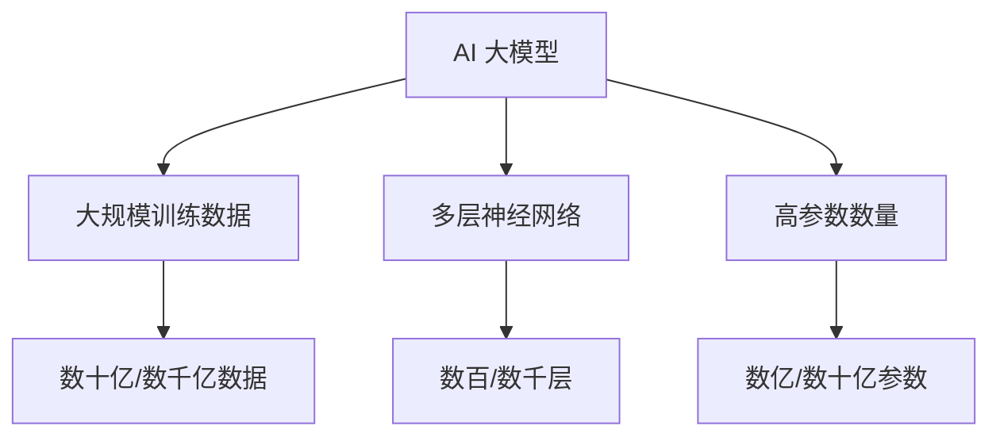

### 1.2 AI 大模型的发展历程

AI 大模型的发展经历了从浅层模型到深层模型的演变。早期的浅层模型如决策树、支持向量机等，只能处理简单的数据特征。随着深度学习的兴起，深层模型如卷积神经网络（CNN）、循环神经网络（RNN）等开始被广泛应用，并逐渐发展出具有更强建模能力的 AI 大模型。

#### Mermaid 流程图

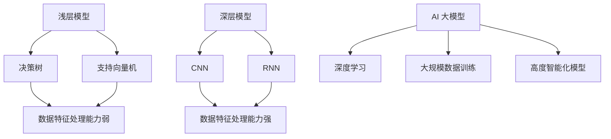

### 1.3 AI 大模型的技术框架

AI 大模型的技术框架主要包括以下几个关键部分：数据预处理、模型训练、模型评估和模型部署。

#### Mermaid 流程图

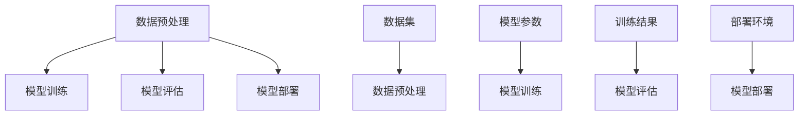

- **数据预处理**：包括数据清洗、归一化、编码等步骤，目的是将原始数据转换为适合模型训练的形式。
- **模型训练**：使用大规模数据进行模型训练，通过优化算法更新模型参数，使模型能够对数据进行准确的预测或分类。
- **模型评估**：通过测试集对模型进行评估，常用的评估指标包括准确率、召回率、F1 分数等。
- **模型部署**：将训练好的模型部署到生产环境中，使其能够进行实际的预测或分类任务。

## 2. 数据中心防火墙基础

### 2.1 数据中心防火墙概述

数据中心防火墙是保护数据中心网络安全的关键设备，它通过对进出数据中心的网络流量进行过滤和监控，防止恶意攻击和非法访问。

数据中心防火墙具有以下几个主要功能：

- **过滤**：根据预设的规则，允许或拒绝进出数据中心的网络流量。
- **监控**：实时监控网络流量，发现异常行为和潜在威胁。
- **报警**：当检测到恶意攻击或非法访问时，向管理员发送报警信息。

#### Mermaid 流程图

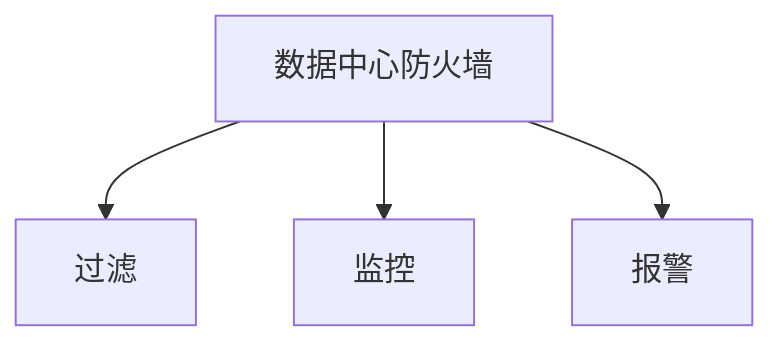

### 2.2 防火墙的工作原理

防火墙的工作原理主要包括三个步骤：过滤、监控和报警。首先，防火墙根据预设的规则对进出数据中心的网络流量进行过滤；其次，防火墙对过滤后的流量进行实时监控，发现异常情况；最后，防火墙向管理员发送报警信息，提醒处理。

#### Mermaid 流程图

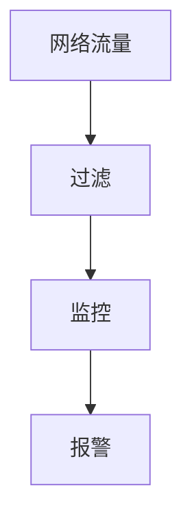

### 2.3 防火墙的分类和特点

防火墙主要分为两大类：硬件防火墙和软件防火墙。

- **硬件防火墙**：具有高性能、高稳定性，适用于大型数据中心。
  - **特点**：处理速度快、吞吐量大、可靠性高。
  - **适用场景**：企业级数据中心、互联网公司等。

- **软件防火墙**：安装方便、成本低，适用于小型数据中心或个人用户。
  - **特点**：配置灵活、易于部署、成本低。
  - **适用场景**：小型企业、个人用户等。

#### Mermaid 流程图

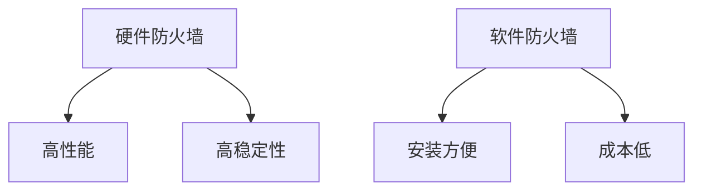

## 3. AI 大模型应用数据中心的架构

### 3.1 数据中心架构概述

数据中心是集成了计算、存储、网络等资源的大型系统，主要用于提供数据存储和处理服务。AI 大模型应用数据中心则是在此基础上，专门为 AI 大模型应用构建的。

数据中心通常包含以下几个关键部分：

- **计算资源**：提供 AI 大模型训练和推理所需的计算能力。
- **存储资源**：存储训练数据、模型参数和推理结果等。
- **网络资源**：实现数据中心内部和外部的通信。

#### Mermaid 流程图

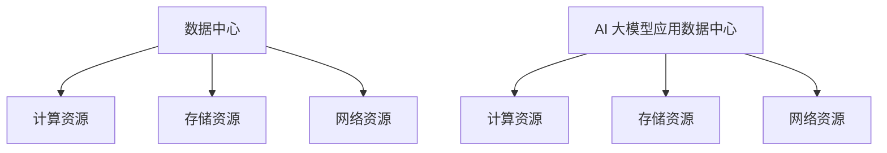

### 3.2 AI 大模型在数据中心中的应用

AI 大模型在数据中心中的应用主要涉及以下几个方面：

- **数据处理与分析**：利用 AI 大模型对数据中心产生的海量数据进行分析，提供智能化决策支持。
- **网络优化**：通过 AI 大模型对数据中心网络进行实时监控和优化，提高网络性能。
- **安全防护**：利用 AI 大模型进行网络安全威胁检测和防护，提高数据中心的安全性。

#### Mermaid 流程图

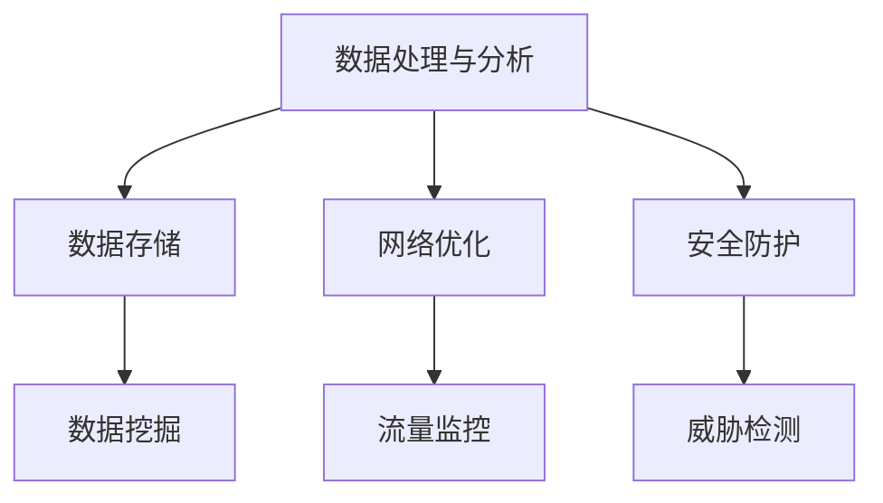

### 3.3 数据中心防火墙在 AI 大模型应用中的角色

数据中心防火墙在 AI 大模型应用中发挥着重要作用：

- **隔离**：将 AI 大模型应用与外部网络隔离开，防止恶意攻击和非法访问。
- **监控**：实时监控 AI 大模型应用的网络流量，及时发现和阻止异常行为。
- **防护**：对 AI 大模型应用进行网络安全防护，防止数据泄露和损坏。

#### Mermaid 流程图

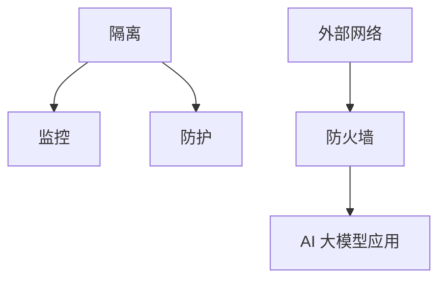

## 4. 防火墙配置策略

### 4.1 防火墙配置原则

防火墙配置应遵循以下原则：

- **安全性**：确保防火墙能够有效阻止恶意攻击和非法访问。
- **可用性**：防火墙配置不应影响数据中心的正常业务运行。
- **可维护性**：防火墙配置应便于管理和维护。

#### Mermaid 流程图

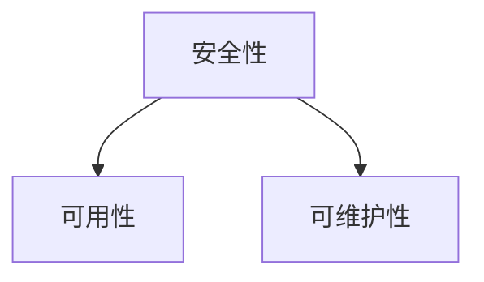

### 4.2 防火墙配置流程

防火墙配置流程包括以下几个步骤：

1. **设计防火墙策略**：根据数据中心的业务需求和网络安全要求，设计合适的防火墙策略。
2. **配置防火墙规则**：根据设计好的策略，配置防火墙的访问控制规则。
3. **验证和调试**：对配置好的防火墙进行验证和调试，确保其能够正常工作。
4. **监控和优化**：实时监控防火墙的工作状态，并根据实际情况进行优化调整。

#### Mermaid 流程图

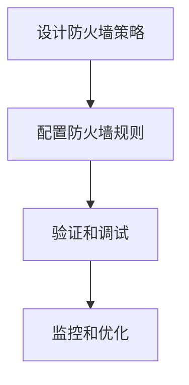

### 4.3 防火墙配置要素

防火墙配置主要包括以下要素：

- **网络接口**：确定防火墙的网络接口，包括内部接口、外部接口和 DMZ 接口等。
- **访问控制策略**：定义防火墙的访问控制策略，包括允许和拒绝的策略。
- **防火墙规则**：根据访问控制策略，配置具体的防火墙规则。
- **日志记录和报警**：配置防火墙的日志记录和报警功能，以便于管理和监控。

#### Mermaid 流程图

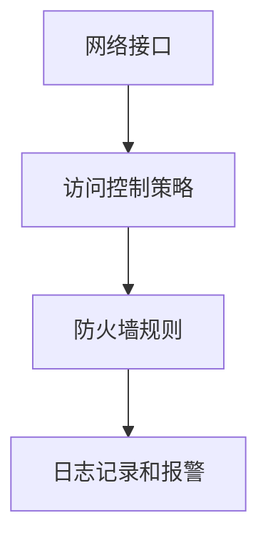

## 5. 防火墙策略制定

### 5.1 防火墙策略概述

防火墙策略是防火墙配置的核心，它定义了防火墙的访问控制规则。一个合理的防火墙策略应具备以下特点：

- **安全性**：确保防火墙能够有效阻止恶意攻击和非法访问。
- **可用性**：防火墙策略不应影响数据中心的正常业务运行。
- **灵活性**：防火墙策略应具备一定的灵活性，能够适应不同的业务场景。

#### Mermaid 流程图

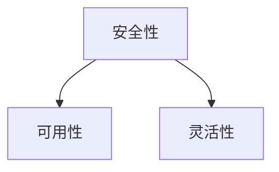

### 5.2 策略制定方法

制定防火墙策略的方法主要包括以下几种：

1. **基于规则的策略制定**：根据网络安全需求，设计一系列规则，用于过滤和监控网络流量。
2. **基于角色的策略制定**：根据不同角色的职责和权限，制定相应的防火墙策略。
3. **基于业务的策略制定**：根据数据中心的业务需求，制定适用于不同业务的防火墙策略。

#### Mermaid 流程图

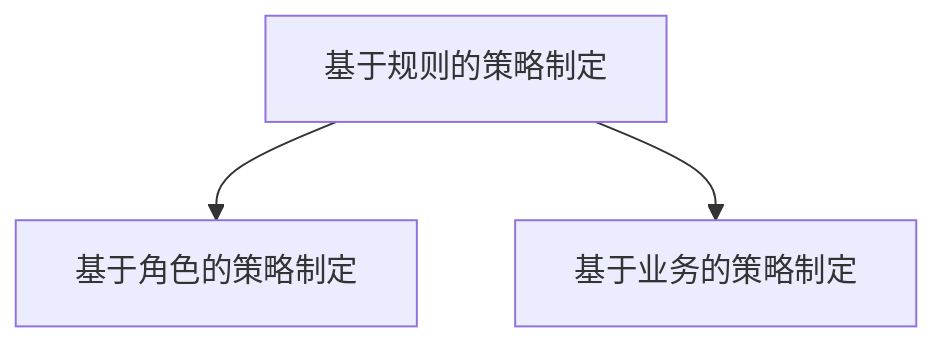

### 5.3 策略执行与监控

策略执行与监控是防火墙配置的重要环节。主要包括以下几个方面：

1. **策略执行**：将制定的防火墙策略应用到防火墙设备上，使其生效。
2. **策略监控**：实时监控防火墙策略的执行情况，包括规则的命中情况、报警信息等。
3. **策略优化**：根据监控结果，对防火墙策略进行优化调整，提高其效果。

#### Mermaid 流程图

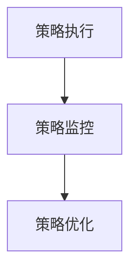

## 6. AI 大模型防火墙配置案例分析

### 6.1 案例背景

某企业为提高数据中心的安全性，决定引入 AI 大模型进行防火墙配置。企业数据中心规模较大，涵盖了多个业务部门，数据敏感程度较高。

### 6.2 防火墙配置方案设计

根据企业需求，设计如下防火墙配置方案：

1. **设计防火墙策略**：根据企业业务特点和网络安全要求，制定合理的防火墙策略。
2. **配置防火墙规则**：根据策略，配置防火墙的访问控制规则。
3. **部署 AI 大模型**：在防火墙上部署 AI 大模型，用于实时监控和识别异常流量。
4. **监控和优化**：实时监控防火墙的工作状态，并根据实际情况进行优化调整。

### 6.3 防火墙配置实施过程

1. **设计防火墙策略**：分析企业业务需求和网络安全风险，制定合理的防火墙策略。
2. **配置防火墙规则**：根据策略，配置防火墙的访问控制规则。
3. **部署 AI 大模型**：选择合适的 AI 大模型，并在防火墙上进行部署。
4. **验证和调试**：对配置好的防火墙进行验证和调试，确保其能够正常工作。

### 6.4 防火墙配置效果评估

通过对防火墙配置效果进行评估，发现如下结果：

1. **防火墙能够有效阻止恶意攻击和非法访问**，提高了数据中心的安全性。
2. **AI 大模型能够准确识别异常流量**，降低了误报和漏报率。
3. **防火墙配置对业务运行没有明显影响**，保证了数据中心的可用性。

## 7. 高级防火墙配置技术

### 7.1 高级防护策略

高级防护策略包括以下内容：

1. **防火墙安全区域划分**：根据业务需求和网络安全要求，将防火墙划分为不同的安全区域，实现更细粒度的访问控制。
2. **防火墙安全联动**：将防火墙与其他安全设备（如入侵检测系统、安全信息与事件管理系统等）进行联动，实现更全面的网络安全防护。
3. **防火墙安全策略优化**：根据网络流量特点和攻击手段的变化，定期对防火墙策略进行优化调整。

#### Mermaid 流程图

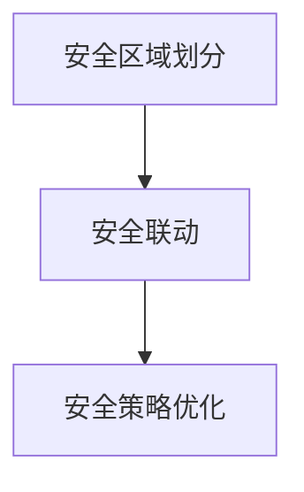

### 7.2 防火墙性能优化

防火墙性能优化主要包括以下几个方面：

1. **防火墙硬件升级**：根据业务需求和网络流量情况，对防火墙硬件进行升级，提高处理能力。
2. **防火墙软件优化**：通过优化防火墙软件，提高其性能和稳定性。
3. **防火墙负载均衡**：采用防火墙负载均衡技术，将网络流量分散到多个防火墙设备上，提高整体性能。

#### Mermaid 流程图

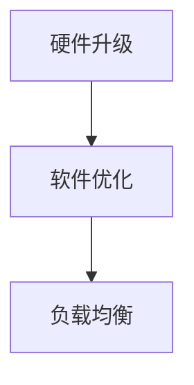

### 7.3 防火墙安全事件响应

防火墙安全事件响应包括以下内容：

1. **事件监测**：实时监测防火墙的日志和报警信息，发现安全事件。
2. **事件分析**：对监测到的事件进行分析，确定事件的性质和影响范围。
3. **事件处理**：根据事件分析结果，采取相应的措施进行事件处理，包括阻止攻击、隔离受影响系统等。
4. **事件总结**：对处理完的安全事件进行总结，为后续的安全防护提供参考。

#### Mermaid 流程图

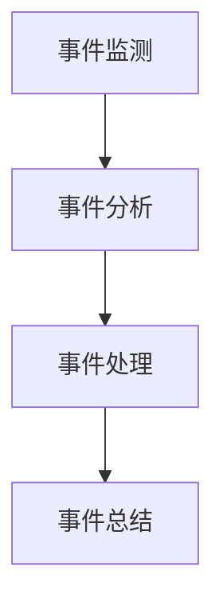

## 8. AI 大模型防火墙优化策略

### 8.1 优化目标

AI 大模型防火墙优化策略的目标主要包括：

1. **提高防火墙的安全性**：通过优化防火墙配置和策略，提高防火墙对恶意攻击的防护能力。
2. **提高防火墙的性能**：通过优化防火墙硬件和软件，提高防火墙的处理能力和稳定性。
3. **提高防火墙的可维护性**：通过优化防火墙配置和管理，提高防火墙的维护效率。

#### Mermaid 流程图

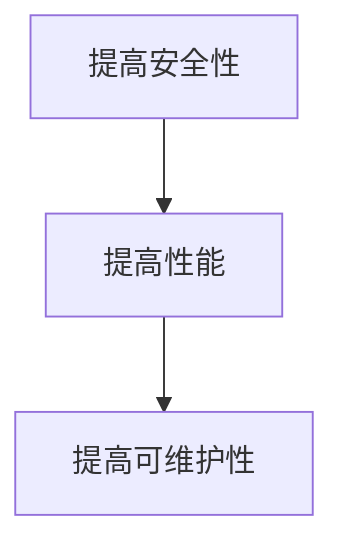

### 8.2 优化方法

AI 大模型防火墙优化方法主要包括以下几个方面：

1. **防火墙配置优化**：根据业务需求和网络安全要求，定期对防火墙配置进行调整和优化。
2. **防火墙策略优化**：根据网络流量特点和攻击手段的变化，定期对防火墙策略进行优化和调整。
3. **防火墙硬件和软件升级**：根据业务需求和网络流量情况，对防火墙硬件和软件进行升级，提高处理能力。
4. **防火墙监控和报警优化**：优化防火墙监控和报警机制，提高异常事件的检测和响应速度。

#### Mermaid 流程图

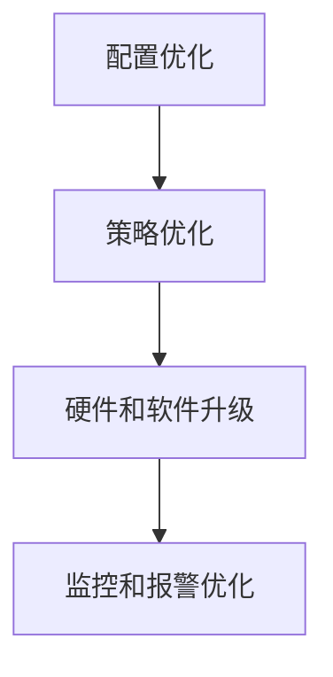

### 8.3 优化案例分析

以下为某企业 AI 大模型防火墙优化案例：

1. **优化目标**：
   - 提高防火墙的安全防护能力。
   - 提高防火墙的性能和稳定性。
   - 提高防火墙的可维护性。

2. **优化方法**：
   - 针对防火墙配置进行了全面检查，修正了不合理配置，删除了冗余策略。
   - 根据网络流量特点，对防火墙策略进行了调整，增加了针对新型攻击的防护规则。
   - 更换了高性能防火墙硬件，提升了防火墙的处理能力。
   - 优化了防火墙监控和报警机制，实现了对异常事件的快速响应。

3. **优化效果**：
   - 防火墙安全防护能力得到了显著提升，新型攻击得到了有效阻止。
   - 防火墙性能得到了明显提升，处理能力达到了预期目标。
   - 防火墙配置和管理效率提高了，维护工作更加顺利。

## 9. 防火墙配置最佳实践

### 9.1 最佳实践概述

防火墙配置最佳实践是指在实际工作中总结出来的，能够有效提高防火墙安全性和性能的一系列方法和技巧。遵循这些最佳实践，可以帮助企业构建更加安全、稳定和高效的防火墙系统。

### 9.2 实践经验分享

以下是一些防火墙配置的最佳实践经验：

1. **定期审计和调整**：定期对防火墙配置进行审计，及时更新和调整规则，确保其适应业务需求和安全要求。
2. **最小权限原则**：遵循最小权限原则，为用户和系统分配最少的权限，以降低潜在的安全风险。
3. **多因素认证**：在防火墙配置中启用多因素认证，提高用户身份验证的可靠性。
4. **日志审计**：启用防火墙日志审计功能，收集和分析日志数据，以便及时发现和应对安全事件。
5. **定期更新**：定期更新防火墙软件和规则库，确保防护能力与最新的安全威胁相适应。

### 9.3 实践注意事项

在防火墙配置过程中，需要注意以下事项：

1. **全面评估**：在配置防火墙之前，全面评估业务需求和网络安全风险，确保配置方案的有效性和适用性。
2. **避免过度配置**：避免过度配置防火墙规则，以免造成不必要的性能负担和误报。
3. **测试和验证**：在配置防火墙后，进行充分的测试和验证，确保其能够正常工作，并满足安全要求。
4. **培训和教育**：对相关人员开展防火墙配置和安全防护的培训和教育，提高整体安全意识和技能。

## 10. 案例集锦

### 10.1 案例一：某企业 AI 大模型应用数据中心防火墙配置

案例背景：某企业为提高数据中心的安全性，决定引入 AI 大模型进行防火墙配置。企业数据中心规模较大，涵盖了多个业务部门，数据敏感程度较高。

解决方案：
1. 设计防火墙策略：根据企业业务特点和网络安全要求，制定合理的防火墙策略。
2. 配置防火墙规则：根据策略，配置防火墙的访问控制规则。
3. 部署 AI 大模型：在防火墙上部署 AI 大模型，用于实时监控和识别异常流量。
4. 监控和优化：实时监控防火墙的工作状态，并根据实际情况进行优化调整。

效果评估：
- 防火墙能够有效阻止恶意攻击和非法访问，提高了数据中心的安全性。
- AI 大模型能够准确识别异常流量，降低了误报和漏报率。
- 防火墙配置对业务运行没有明显影响，保证了数据中心的可用性。

### 10.2 案例二：某银行 AI 大模型应用数据中心防火墙配置

案例背景：某银行为保障客户数据安全，决定在其数据中心引入 AI 大模型进行防火墙配置。

解决方案：
1. 设计防火墙策略：结合银行业务特点和网络安全需求，制定合理的防火墙策略。
2. 配置防火墙规则：根据策略，配置防火墙的访问控制规则，包括内部访问和外部访问的控制。
3. 部署 AI 大模型：在防火墙上部署 AI 大模型，用于实时监控和识别异常流量。
4. 集成入侵检测系统：将防火墙与入侵检测系统集成，提高对异常行为的检测能力。

效果评估：
- 防火墙和入侵检测系统的集成，提高了对网络攻击的检测和响应能力。
- AI 大模型的应用，降低了误报和漏报率，提升了整体安全防护水平。
- 防火墙配置对银行业务运行没有明显影响，保证了数据中心的稳定运行。

### 10.3 案例三：某医疗 AI 大模型应用数据中心防火墙配置

案例背景：某医疗公司为提高医疗数据的安全性和隐私性，决定在其数据中心引入 AI 大模型进行防火墙配置。

解决方案：
1. 设计防火墙策略：根据医疗行业的特点和法规要求，制定合理的防火墙策略。
2. 配置防火墙规则：根据策略，配置防火墙的访问控制规则，包括对内部和外部访问的控制。
3. 部署 AI 大模型：在防火墙上部署 AI 大模型，用于实时监控和识别异常流量。
4. 集成数据加密：在防火墙配置中集成数据加密功能，确保数据传输的安全性。

效果评估：
- 防火墙和加密功能的集成，提高了医疗数据的安全性和隐私性。
- AI 大模型的应用，降低了误报和漏报率，提升了整体安全防护水平。
- 防火墙配置对医疗业务运行没有明显影响，保证了数据中心的稳定运行。

## 11. 防火墙配置趋势与展望

### 11.1 防火墙配置发展趋势

随着网络技术和人工智能技术的不断发展，防火墙配置也呈现出以下发展趋势：

1. **智能化**：利用人工智能技术，提高防火墙的安全防护能力和自动化程度。
2. **统一管理**：实现防火墙与其他安全设备的统一管理和协同工作，提高整体安全防护能力。
3. **高性能**：随着网络流量的增长，防火墙需要具备更高的性能和吞吐量。
4. **可定制化**：提供更加灵活的防火墙配置选项，满足不同业务场景的需求。

### 11.2 防火墙配置技术展望

未来防火墙配置技术的发展方向包括：

1. **人工智能与大数据结合**：利用人工智能和大数据分析技术，实现对网络流量的智能监控和异常检测。
2. **软硬结合**：通过软硬件结合的方式，提高防火墙的处理能力和响应速度。
3. **自动化与自我修复**：实现防火墙的自动化配置和自我修复功能，降低人工干预的需求。
4. **防火墙与区块链结合**：利用区块链技术，提高防火墙的安全性和数据可靠性。

### 11.3 AI 大模型防火墙配置的未来发展方向

AI 大模型防火墙配置的未来发展方向包括：

1. **更强大的防护能力**：通过不断优化 AI 大模型，提高防火墙对新型攻击的识别和防护能力。
2. **智能化配置与管理**：利用 AI 大模型，实现防火墙配置和管理的智能化，降低人工干预的需求。
3. **集成与协同**：将 AI 大模型防火墙与其他安全设备进行集成和协同工作，提高整体安全防护水平。
4. **隐私保护和合规性**：在 AI 大模型防火墙配置中，充分考虑隐私保护和合规性要求，确保数据安全和合规性。

## 12. 附录

### 12.1 常用防火墙配置工具与资源

以下是一些常用的防火墙配置工具与资源：

1. **开源防火墙软件**：
   - **OpenWrt**：适用于路由器等设备的开源防火墙软件。
   - **pfSense**：基于 FreeBSD 操作系统的开源防火墙软件。
   - **NFSense**：基于 m0n0wall 的下一代开源防火墙软件。

2. **商业防火墙软件**：
   - **Palo Alto Networks**：提供高端防火墙解决方案。
   - **Fortinet**：提供全面的网络安全解决方案。
   - **Cisco Firepower**：提供高性能、高可靠性的防火墙解决方案。

3. **在线资源**：
   - **防火墙配置教程**：提供详细的防火墙配置教程和实例。
   - **网络安全论坛**：交流防火墙配置经验和技术。
   - **开源项目**：提供各种防火墙配置脚本和工具。

### 12.2 防火墙配置术语表

以下是一些常见的防火墙配置术语：

1. **防火墙规则**：定义网络流量如何被防火墙处理的一组规则。
2. **访问控制列表（ACL）**：用于控制网络流量的列表，包含一系列规则。
3. **状态检测**：防火墙通过检测网络连接的状态，来决定是否允许流量通过。
4. **端口转发**：将网络流量从一个端口转发到另一个端口。
5. **VPN**：虚拟专用网络，用于在公共网络上建立安全的连接。
6. **入侵检测系统（IDS）**：用于检测网络中的恶意行为和异常活动的系统。
7. **入侵防御系统（IPS）**：结合入侵检测功能和防火墙功能的系统。

### 12.3 防火墙配置技术参考资料

以下是一些防火墙配置技术的参考资料：

1. **《防火墙与网络安全》**：详细介绍了防火墙的工作原理和配置方法。
2. **《网络安全技术》**：涵盖了防火墙、入侵检测、VPN 等网络安全技术。
3. **《OpenWrt 实战指南》**：介绍了如何使用 OpenWrt 进行防火墙配置。
4. **《pfSense 实用教程》**：提供了详细的 pfSense 防火墙配置实例。
5. **《网络安全论坛》**：讨论了各种防火墙配置和网络安全问题。

## 13. 核心概念与联系 Mermaid 流程图

为了更好地理解 AI 大模型与数据中心防火墙之间的联系，我们使用 Mermaid 流程图来展示核心概念及其相互关系。

### 13.1 AI 大模型与数据中心架构

```mermaid
graph TD
    A[数据中心] --> B[计算资源]
    A --> C[存储资源]
    A --> D[网络资源]
    E[AI 大模型] --> F[数据处理与分析]
    E --> G[网络优化]
    E --> H[安全防护]
    B --> I[AI 大模型训练]
    C --> J[数据存储与加密]
    D --> K[流量监控与分析]
```

### 13.2 数据中心防火墙与网络安全

```mermaid
graph TD
    A[数据中心防火墙] --> B[网络流量过滤]
    A --> C[安全区域划分]
    A --> D[入侵检测与防御]
    B --> E[内部网络防护]
    B --> F[外部网络防护]
    C --> G[DMZ 区防护]
    D --> H[入侵防御系统联动]
```

### 13.3 AI 大模型防火墙配置

```mermaid
graph TD
    A[AI 大模型防火墙配置] --> B[策略制定]
    A --> C[规则配置]
    A --> D[监控与优化]
    B --> E[安全防护策略]
    B --> F[访问控制策略]
    C --> G[防火墙规则设置]
    D --> H[日志记录与分析]
```

通过以上流程图，我们可以清晰地看到 AI 大模型在数据中心中的作用以及数据中心防火墙如何为 AI 大模型提供安全防护。这有助于我们更好地理解防火墙配置在 AI 大模型应用中的重要性，以及如何通过优化防火墙配置来提高数据中心的安全性和性能。

---

## 附录

### 13.1 常用防火墙配置工具与资源

以下是一些常用的防火墙配置工具与资源：

1. **开源防火墙软件**：
   - **OpenWrt**：适用于路由器等设备的开源防火墙软件。
   - **pfSense**：基于 FreeBSD 操作系统的开源防火墙软件。
   - **NFSense**：基于 m0n0wall 的下一代开源防火墙软件。

2. **商业防火墙软件**：
   - **Palo Alto Networks**：提供高端防火墙解决方案。
   - **Fortinet**：提供全面的网络安全解决方案。
   - **Cisco Firepower**：提供高性能、高可靠性的防火墙解决方案。

3. **在线资源**：
   - **防火墙配置教程**：提供详细的防火墙配置教程和实例。
   - **网络安全论坛**：交流防火墙配置经验和技术。
   - **开源项目**：提供各种防火墙配置脚本和工具。

### 13.2 防火墙配置术语表

以下是一些常见的防火墙配置术语：

1. **防火墙规则**：定义网络流量如何被防火墙处理的一组规则。
2. **访问控制列表（ACL）**：用于控制网络流量的列表，包含一系列规则。
3. **状态检测**：防火墙通过检测网络连接的状态，来决定是否允许流量通过。
4. **端口转发**：将网络流量从一个端口转发到另一个端口。
5. **VPN**：虚拟专用网络，用于在公共网络上建立安全的连接。
6. **入侵检测系统（IDS）**：用于检测网络中的恶意行为和异常活动的系统。
7. **入侵防御系统（IPS）**：结合入侵检测功能和防火墙功能的系统。

### 13.3 防火墙配置技术参考资料

以下是一些防火墙配置技术的参考资料：

1. **《防火墙与网络安全》**：详细介绍了防火墙的工作原理和配置方法。
2. **《网络安全技术》**：涵盖了防火墙、入侵检测、VPN 等网络安全技术。
3. **《OpenWrt 实战指南》**：介绍了如何使用 OpenWrt 进行防火墙配置。
4. **《pfSense 实用教程》**：提供了详细的 pfSense 防火墙配置实例。
5. **《网络安全论坛》**：讨论了各种防火墙配置和网络安全问题。

## 结语

通过本文的详细探讨，我们从基础概念到高级配置，深入分析了 AI 大模型应用数据中心防火墙的配置策略。我们从 AI 大模型的基础知识出发，逐步讲解了数据中心防火墙的工作原理和分类，进而探讨了 AI 大模型在数据中心中的应用以及防火墙在其中的角色。接着，我们详细阐述了防火墙配置的原则、流程和要素，以及如何制定和执行防火墙策略。随后，我们通过案例分析和高级技术介绍，展示了如何在实践中优化防火墙配置，提高数据中心的安全性和性能。最后，我们对未来防火墙配置的发展趋势进行了展望，并提供了一系列的参考资料和工具。

在当前的数字化时代，数据中心的安全防护显得尤为重要。随着 AI 大模型技术的不断进步，其在数据中心中的应用将越来越广泛，防火墙配置也需不断更新和优化。本文旨在为广大 IT 从业者提供一套全面、系统的防火墙配置指南，帮助他们在实际工作中更好地应对网络安全挑战。

在此，感谢您的阅读，希望本文能为您在数据中心防火墙配置方面带来新的思路和启发。如果您有任何疑问或建议，欢迎在评论区留言交流。

---

**作者：AI天才研究院/AI Genius Institute & 禅与计算机程序设计艺术 /Zen And The Art of Computer Programming**

