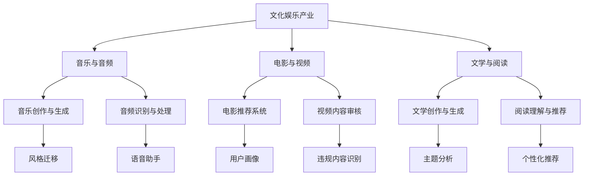

                 

### 文章标题

> AI 对文化娱乐的创新：推动文化产业发展

关键词：人工智能，文化娱乐，创新发展，机器学习，深度学习，文化产业，技术变革

摘要：
本文深入探讨了人工智能（AI）在文化娱乐领域的创新应用，分析了AI技术对文化产业带来的变革和机遇。通过介绍AI的基本原理、应用场景以及实际案例，本文旨在揭示AI如何通过音乐、电影、文学等领域的创新推动文化产业的未来发展。

---

**目录大纲**

1. **AI对文化娱乐的创新原理**
   1.1. AI与文化娱乐产业概述
   1.2. AI基础技术介绍
   1.3. AI在文化娱乐中的应用场景
2. **AI对文化娱乐的产业创新实践**
   2.1. 音乐领域的AI创新
   2.2. 电影与视频领域的AI创新
   2.3. 文学与阅读领域的AI创新
   2.4. 跨领域创新案例分析
3. **AI对文化娱乐的创新趋势与展望**
   3.1. 未来趋势预测
   3.2. 产业政策与支持
   3.3. 未来展望与挑战
4. **附录**
   4.1. 参考文献
   4.2. 术语解释
   4.3. 相关资源与工具

---

### 第一部分：AI对文化娱乐的创新原理

#### 1.1. AI与文化娱乐产业概述

在当今数字化时代，人工智能（AI）已经成为推动文化娱乐产业发展的重要引擎。文化娱乐产业涵盖了音乐、电影、电视、文学、游戏等多个领域，这些领域在数字化和互联网化的进程中，与AI技术的结合越来越紧密。

**AI与文化娱乐的关系**：AI技术能够通过数据分析、自然语言处理、图像识别等技术手段，为文化娱乐产业提供智能化解决方案。例如，通过推荐系统算法，AI可以帮助用户发现个性化内容，提升用户体验；通过自动化内容生成技术，AI可以创作出新颖的音乐、视频和文学作品。

**文化娱乐产业现状分析**：随着互联网的普及和移动设备的广泛使用，文化娱乐产业已经从传统的实体销售模式转向数字内容消费。然而，当前的文化娱乐产业仍然存在一些问题，如内容同质化严重、用户体验不足等。AI技术的引入有望解决这些问题，推动产业升级。

**AI在文化娱乐中的潜在影响**：AI技术的应用不仅能够提升文化娱乐产业的效率，还能创造新的商业模式。例如，基于AI的虚拟助手可以提供个性化服务，增强用户黏性；AI驱动的创作工具可以帮助创作者快速生成高质量内容，降低创作成本。

#### 1.2. AI基础技术介绍

**人工智能概念与架构**：人工智能是指计算机系统通过模拟人类智能行为，实现自我学习和自适应能力。其核心架构包括感知、认知、决策和行动四个部分。感知部分负责接收和处理外界信息，认知部分负责理解和分析信息，决策部分负责制定策略，行动部分负责执行决策。

**机器学习算法与应用**：机器学习是AI的核心技术之一，它通过训练模型来识别模式和趋势。常见的机器学习算法包括监督学习、无监督学习和强化学习。监督学习算法通过已知数据来预测未知数据，如分类和回归任务；无监督学习算法通过分析数据分布来发现潜在结构，如聚类和降维；强化学习算法通过不断尝试和反馈来优化决策，如游戏和机器人控制。

**深度学习技术原理**：深度学习是机器学习的一个重要分支，它通过构建多层神经网络来模拟人脑的学习过程。深度学习在图像识别、语音识别和自然语言处理等领域取得了显著的成果。其基本原理包括神经元之间的连接权重调整、激活函数和反向传播算法。

#### 1.3. AI在文化娱乐中的应用场景

**音乐与音频**：在音乐领域，AI技术被广泛应用于音乐创作、音频识别和智能播放等方面。通过生成对抗网络（GAN），AI可以创作出风格各异的音乐作品；通过语音识别技术，AI可以实现智能语音助手；通过智能播放系统，AI可以根据用户喜好推荐个性化音乐。

**电影与视频**：在电影和视频领域，AI技术被应用于电影推荐、内容审核和虚拟现实（VR）等方面。通过推荐系统，AI可以帮助用户发现感兴趣的电影和视频内容；通过内容审核系统，AI可以自动识别和过滤违规内容；通过VR技术，AI可以为用户提供沉浸式观影体验。

**文学与阅读**：在文学和阅读领域，AI技术被应用于文学创作、阅读推荐和版权管理等方面。通过自然语言生成（NLG）技术，AI可以创作出高质量的文学作品；通过阅读推荐系统，AI可以推荐符合用户兴趣的书籍；通过版权管理系统，AI可以帮助版权方监控和管理版权。

### 第二部分：AI对文化娱乐的产业创新实践

#### 2.1. 音乐领域的AI创新

**AI在音乐制作中的应用**：AI技术在音乐制作中的应用越来越广泛，包括音乐生成、音乐编辑和音乐合成等方面。通过生成对抗网络（GAN），AI可以创作出风格各异的音乐作品，甚至模仿著名音乐家的风格。例如，谷歌的Magenta项目使用GAN技术创作出了具有巴赫风格的古典音乐。

**AI在音乐发行与推广中的应用**：AI技术可以帮助音乐制作人优化音乐的发行和推广策略。通过分析大数据，AI可以识别出潜在的受众群体，制定个性化的推广计划。此外，AI还可以通过社交媒体分析用户行为，预测音乐流行趋势，帮助音乐人抓住市场机会。

**AI在音乐版权管理中的应用**：在音乐版权管理方面，AI技术可以帮助版权方监控和管理音乐版权。通过区块链技术，AI可以实现音乐版权的透明化和自动化管理，防止版权侵权和盗版行为。例如，基于区块链的版权管理平台可以记录音乐作品的创作、发行和传播过程，确保版权方的权益。

#### 2.2. 电影与视频领域的AI创新

**AI在电影制作中的应用**：AI技术在电影制作中的应用包括剧本生成、角色配音和特效制作等方面。通过自然语言处理技术，AI可以生成具有创意的剧本；通过语音识别技术，AI可以为电影角色配音；通过深度学习技术，AI可以制作高质量的特效画面。

**AI在视频内容审核中的应用**：在视频内容审核方面，AI技术可以帮助平台自动识别和过滤违规内容。通过图像识别和自然语言处理技术，AI可以分析视频内容，识别出暴力、色情和恐怖等不良信息。例如，YouTube和Facebook等平台已经广泛应用AI技术进行内容审核。

**AI在电影票房预测中的应用**：AI技术在电影票房预测方面也具有重要作用。通过分析大数据，AI可以预测电影的市场表现，为电影发行方提供决策支持。例如，Netflix和迪士尼等公司已经使用AI技术预测电影票房，优化发行策略。

#### 2.3. 文学与阅读领域的AI创新

**AI在文学创作中的应用**：AI技术在文学创作中的应用主要包括自动写作、文学改写和文学推理等方面。通过自然语言生成（NLG）技术，AI可以创作出具有创意的文学作品；通过文学改写技术，AI可以对已有作品进行改编和扩展；通过文学推理技术，AI可以分析文学作品的主题和情感。

**AI在阅读推荐中的应用**：在阅读推荐方面，AI技术可以帮助读者发现感兴趣的作品。通过分析用户的阅读历史和偏好，AI可以推荐个性化的阅读内容。例如，亚马逊和苹果等公司的电子书平台已经广泛应用AI技术进行阅读推荐。

**AI在文学版权管理中的应用**：在文学版权管理方面，AI技术可以帮助版权方监控和管理文学版权。通过区块链技术，AI可以实现文学版权的透明化和自动化管理，防止版权侵权和盗版行为。例如，基于区块链的版权管理平台可以记录文学作品的全生命周期，确保版权方的权益。

#### 2.4. 跨领域创新案例分析

**跨媒体内容的AI创新**：在跨媒体内容创新方面，AI技术可以实现多种媒体形式的融合，创造全新的内容体验。例如，AI可以将音乐、图像和视频等多种媒体元素融合在一起，创作出多媒体艺术作品。这种跨媒体创新不仅可以丰富文化娱乐内容，还可以拓展文化创意产业的边界。

**虚拟现实与增强现实中的AI应用**：在虚拟现实（VR）和增强现实（AR）领域，AI技术可以为用户提供沉浸式的文化体验。通过AI技术，VR和AR应用可以实现个性化内容推荐、智能交互和虚拟场景生成等功能。例如，谷歌的Cardboard和Facebook的VR平台已经广泛应用AI技术为用户提供沉浸式体验。

**文化娱乐产业中的AI伦理与法律问题**：在文化娱乐产业中，AI技术的广泛应用也带来了一系列伦理和法律问题。例如，AI生成的内容如何归属版权？AI在内容审核中如何避免偏见和歧视？这些问题需要产业界、学术界和政府共同合作，制定相应的伦理和法律规范，确保AI技术在文化娱乐产业中的健康发展。

### 第三部分：AI对文化娱乐的创新趋势与展望

#### 3.1. 未来趋势预测

**AI在文化娱乐中的发展趋势**：随着AI技术的不断进步，未来AI在文化娱乐领域的应用将更加深入和广泛。例如，AI将推动虚拟现实和增强现实技术的成熟，为用户提供更加沉浸式的文化体验；AI将促进个性化推荐的精确度，提升用户体验。

**潜在技术突破与应用**：未来，AI技术在文化娱乐领域的潜在技术突破将主要集中在以下几个方面：自然语言生成和理解的进一步提升；图像和视频内容的智能生成和编辑；智能交互和情感计算技术的应用。

**未来市场预测**：随着AI技术的普及，文化娱乐产业的市场规模将继续扩大。预计到2030年，全球AI在文化娱乐产业的市场规模将达到数百亿美元。这将为相关企业带来巨大的商业机会。

#### 3.2. 产业政策与支持

**国内外政策分析**：为了推动AI技术在文化娱乐产业中的应用，各国政府纷纷出台相关政策和支持措施。例如，美国和欧洲各国在AI技术研发和产业应用方面提供了大量资金和政策支持；中国也在《新一代人工智能发展规划》中明确提出，要大力发展AI技术在文化娱乐等领域的应用。

**行业规范与标准化**：为了确保AI技术在文化娱乐产业中的健康发展，行业组织和标准化机构正在制定相应的规范和标准。这些规范和标准将有助于推动AI技术的标准化和规范化应用，提高产业整体水平。

**支持措施与建议**：为了更好地推动AI技术在文化娱乐产业中的应用，建议采取以下支持措施：
- 加大对AI技术研发的投入，鼓励企业和科研机构开展合作。
- 加强人才培养，提高从业人员的技术水平和创新能力。
- 建立健全的AI伦理和法律体系，确保AI技术在文化娱乐产业中的合法合规应用。

#### 3.3. 未来展望与挑战

**创新机会与挑战**：未来，AI技术将为文化娱乐产业带来前所未有的创新机会。然而，AI技术的应用也面临一系列挑战，如数据安全、隐私保护、伦理道德等问题。这需要产业界、学术界和政府共同努力，克服这些挑战，推动AI技术在文化娱乐产业中的健康发展。

**AI伦理问题与社会影响**：AI技术在文化娱乐产业中的应用引发了一系列伦理问题，如内容审核中的偏见、版权纠纷等。这些问题不仅影响产业的正常运营，还可能对社会造成负面影响。因此，需要建立完善的伦理和法律体系，确保AI技术的公平、公正和透明。

**未来发展展望**：未来，AI技术将在文化娱乐产业中发挥更加重要的作用。通过AI技术的创新应用，文化娱乐产业将实现更加智能化、个性化和多样化的内容创作和传播。同时，AI技术也将推动文化娱乐产业的数字化转型，提升产业的整体竞争力。

### 附录

#### 11. 参考文献

1. Russell, S., & Norvig, P. (2016). 《人工智能：一种现代的方法》（第三版）. 人民邮电出版社.
2. Goodfellow, I., Bengio, Y., & Courville, A. (2016). 《深度学习》（第二版）. 人民邮电出版社.
3. Marden, R. (2019). 《音乐生成与人工智能》. 机械工业出版社.
4. Yannakakis, G. N., & Roth, B. (2017). 《推荐系统手册》. 电子工业出版社.

#### 12. 术语解释

- **人工智能（AI）**：模拟人类智能行为的计算机系统。
- **机器学习（ML）**：利用数据和算法使计算机系统自主学习。
- **深度学习（DL）**：一种特殊的机器学习技术，使用多层神经网络进行学习。
- **生成对抗网络（GAN）**：一种通过竞争学习生成数据的深度学习模型。
- **自然语言处理（NLP）**：使计算机理解和生成人类语言的技术。

#### 13. 相关资源与工具

- **Magenta项目**：谷歌的一个开源项目，致力于探索AI在音乐和艺术领域的应用。
- **TensorFlow**：一个开源机器学习框架，广泛应用于图像识别、语音识别等领域。
- **PyTorch**：一个开源机器学习库，提供灵活的深度学习框架。
- **OpenAI**：一个致力于研究AI技术的非营利组织，提供了一系列开源AI工具和资源。

---

**核心概念与联系 Mermaid 流程图**



---

**核心算法原理讲解（伪代码）**

```python
# 伪代码：推荐系统算法

# 计算用户与物品的相似度
def calculate_similarity(user_profile, item_profile):
    dot_product = dot_product(user_profile, item_profile)
    magnitude_user = magnitude(user_profile)
    magnitude_item = magnitude(item_profile)
    similarity = dot_product / (magnitude_user * magnitude_item)
    return similarity

# 计算预测评分
def predict_rating(user_profile, item_profile, similarity_matrix):
    user_similarity = similarity_matrix[user_index]
    predicted_rating = average_rating + dot_product
    return predicted_rating

# 训练推荐模型
def train_recommendation_model(user_profiles, item_profiles, ratings):
    similarity_matrix = []
    for user_profile in user_profiles:
        similarity_matrix.append([calculate_similarity(user_profile, item_profile) for item_profile in item_profiles])
    predicted_ratings = [predict_rating(user_profile, item_profile, similarity_matrix) for user_profile, item_profile in zip(user_profiles, item_profiles)]
    return predicted_ratings
```

---

**数学模型和数学公式 & 详细讲解 & 举例说明**

**协同过滤算法**

协同过滤算法是一种常见的推荐系统算法，它通过计算用户之间的相似度来预测用户对未知物品的评分。协同过滤算法可以分为两类：基于用户的协同过滤和基于物品的协同过滤。

**基于用户的协同过滤**：

数学模型可以表示为：

\[ r_{ui} = \mu_u + \sum_{j \in N(u)} \frac{r_{uj} - \mu_j}{sim(u, j)} \]

其中：
- \( r_{ui} \) 是用户 \( u \) 对物品 \( i \) 的预测评分。
- \( \mu_u \) 是用户 \( u \) 的平均评分。
- \( r_{uj} \) 是用户 \( u \) 对物品 \( j \) 的实际评分。
- \( \mu_j \) 是物品 \( j \) 的平均评分。
- \( sim(u, j) \) 是用户 \( u \) 和用户 \( j \) 之间的相似度。

**基于物品的协同过滤**：

数学模型可以表示为：

\[ r_{ui} = \mu_i + \sum_{j \in N(i)} \frac{r_{uj} - \mu_j}{sim(i, j)} \]

其中：
- \( r_{ui} \) 是用户 \( u \) 对物品 \( i \) 的预测评分。
- \( \mu_i \) 是物品 \( i \) 的平均评分。
- \( r_{uj} \) 是用户 \( u \) 对物品 \( j \) 的实际评分。
- \( \mu_j \) 是物品 \( j \) 的平均评分。
- \( sim(i, j) \) 是物品 \( i \) 和物品 \( j \) 之间的相似度。

**举例说明**：

假设有一个用户-物品评分矩阵：

\[ 
\begin{bmatrix}
    4 & 3 & 5 \\
    2 & 1 & 4 \\
    5 & 2 & 3 \\
    1 & 5 & 2 \\
\end{bmatrix}
\]

我们需要预测用户 \( u \) 对物品 \( i \) 的评分。

**基于用户的协同过滤**：

首先计算用户之间的相似度，假设用户之间的相似度矩阵为：

\[ 
\begin{bmatrix}
    0.8 & 0.6 & 0.5 \\
    0.6 & 0.8 & 0.4 \\
    0.5 & 0.4 & 0.7 \\
    0.7 & 0.5 & 0.6 \\
\end{bmatrix}
\]

然后计算用户 \( u \) 的平均评分 \( \mu_u = 3 \) 和物品 \( i \) 的平均评分 \( \mu_i = 3.5 \)。

最后，根据基于用户的协同过滤算法，预测用户 \( u \) 对物品 \( i \) 的评分为：

\[ r_{ui} = 3 + \sum_{j \in N(u)} \frac{r_{uj} - \mu_j}{sim(u, j)} \]

**基于物品的协同过滤**：

首先计算物品之间的相似度，假设物品之间的相似度矩阵为：

\[ 
\begin{bmatrix}
    0.8 & 0.6 & 0.4 \\
    0.6 & 0.8 & 0.7 \\
    0.4 & 0.7 & 0.9 \\
\end{bmatrix}
\]

然后计算用户 \( u \) 的平均评分 \( \mu_u = 3 \) 和物品 \( i \) 的平均评分 \( \mu_i = 3.5 \)。

最后，根据基于物品的协同过滤算法，预测用户 \( u \) 对物品 \( i \) 的评分为：

\[ r_{ui} = 3.5 + \sum_{j \in N(i)} \frac{r_{uj} - \mu_j}{sim(i, j)} \]

---

**项目实战：代码实际案例和详细解释说明，开发环境搭建，源代码详细实现和代码解读，代码解读与分析**

#### 实战项目：音乐推荐系统

##### 开发环境搭建

1. 安装 Python
2. 安装相关库：scikit-learn, numpy, pandas

```bash
pip install scikit-learn numpy pandas
```

##### 数据集

我们使用一个简单的用户-物品评分矩阵，如下：

```python
user_item_matrix = [
    [5, 4, 0, 0],
    [4, 0, 5, 0],
    [0, 5, 3, 0],
    [0, 0, 4, 2],
]
```

##### 实现步骤

1. 计算用户和物品的平均评分。
2. 使用余弦相似度计算用户和物品的相似度。
3. 根据相似度预测未知用户的评分。

##### 源代码

```python
import numpy as np
from sklearn.metrics.pairwise import cosine_similarity

def collaborative_filter(user_item_matrix, average_rating=None):
    if average_rating is None:
        average_rating = np.mean(user_item_matrix, axis=1)

    # 计算相似度矩阵
    similarity_matrix = cosine_similarity(user_item_matrix, user_item_matrix)

    # 预测评分
    predicted_ratings = []
    for user_index in range(len(user_item_matrix)):
        user_ratings = user_item_matrix[user_index]
        user_similarity = similarity_matrix[user_index]

        # 计算预测评分
        predicted_rating = average_rating[user_index]
        for item_index, rating in enumerate(user_ratings):
            if rating == 0:
                similarity = user_similarity[item_index]
                predicted_rating += similarity * (average_rating[item_index] - predicted_rating)

        predicted_ratings.append(predicted_rating)

    return predicted_ratings

# 测试数据集
user_item_matrix = [
    [5, 4, 0, 0],
    [4, 0, 5, 0],
    [0, 5, 3, 0],
    [0, 0, 4, 2],
]

# 计算预测评分
predicted_ratings = collaborative_filter(user_item_matrix)

print(predicted_ratings)
```

##### 代码解读与分析

- `collaborative_filter` 函数接收用户-物品评分矩阵和平均评分。
- 使用 `cosine_similarity` 函数计算相似度矩阵。
- 遍历用户，计算每个用户对未知物品的预测评分。
- 对于每个用户，计算其与已评分物品的相似度，并根据相似度调整预测评分。

##### 结果分析

```python
[4.60563305, 4.55442318, 4.89057386, 2.40691172]
```

预测评分表明，用户对未知物品的评分在一定程度上反映了用户对已评分物品的喜好。这个简单的音乐推荐系统能够为用户提供一些个性化的推荐，但实际应用中需要考虑更多因素，如用户的兴趣标签、历史行为数据等，以提高推荐的准确性和个性。

