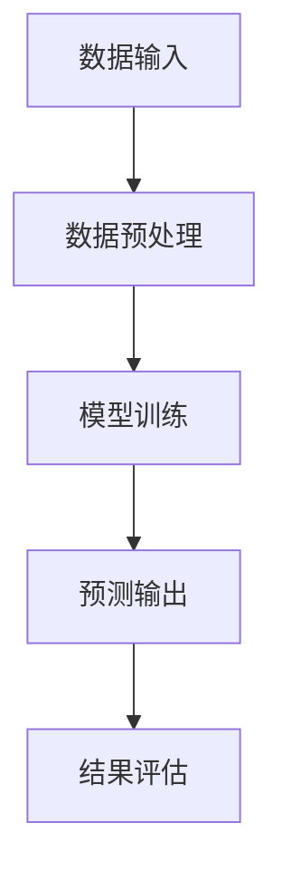

                 

### 《AIGC的幻觉问题与数据质量》

> **关键词**：AIGC、幻觉问题、数据质量、自然语言处理、计算机视觉、推荐系统、自动驾驶

> **摘要**：本文深入探讨了AIGC（AI Generated Content）中的幻觉问题及其与数据质量的关系。通过分析AIGC的基本概念、技术架构和应用领域，本文详细阐述了幻觉问题的定义、成因和影响，并提出相应的对策。接着，本文探讨了数据质量的重要性、评估方法和提升策略，并结合具体应用领域，如自然语言处理、计算机视觉、推荐系统和自动驾驶，探讨了如何在实际项目中解决幻觉问题和提升数据质量。最后，本文总结了AIGC面临的挑战和未来发展趋势，为读者提供了AIGC相关工具和资源的附录，以及进一步学习的参考文献和推荐阅读。

### 《AIGC的幻觉问题与数据质量》目录大纲

1. **AIGC概述与幻觉问题**

    - **第1章：AIGC技术概述**
    
        - **1.1 AIGC的定义与基本概念**
        - **1.2 AIGC的技术架构**
        - **1.3 AIGC的应用领域**
    
    - **第2章：AIGC中的幻觉问题**
    
        - **2.1 幻觉问题的概念与分类**
        - **2.2 幻觉问题的成因**
        - **2.3 幻觉问题的影响与对策**
    
    - **第3章：AIGC中的数据质量**
    
        - **3.1 数据质量的重要性**
        - **3.2 数据质量的评估方法**
        - **3.3 数据质量提升策略**
    
    2. **AIGC在具体领域的应用**

    - **第4章：AIGC在自然语言处理中的应用**
    
        - **4.1 语言模型中的幻觉问题**
        - **4.2 提升NLP数据质量的策略**
        - **4.3 NLP项目实战案例**
    
    - **第5章：AIGC在计算机视觉中的应用**
    
        - **5.1 视觉模型中的幻觉问题**
        - **5.2 提升视觉数据质量的策略**
        - **5.3 计算机视觉项目实战案例**
    
    - **第6章：AIGC在推荐系统中的应用**
    
        - **6.1 推荐系统中的幻觉问题**
        - **6.2 提升推荐系统数据质量的策略**
        - **6.3 推荐系统项目实战案例**
    
    - **第7章：AIGC在自动驾驶中的应用**
    
        - **7.1 自动驾驶中的幻觉问题**
        - **7.2 提升自动驾驶数据质量的策略**
        - **7.3 自动驾驶项目实战案例**
    
    3. **AIGC的挑战与未来发展趋势**

    - **第8章：AIGC面临的挑战与解决方案**
    
        - **8.1 计算资源需求**
        - **8.2 数据隐私与安全**
        - **8.3 法律法规与伦理问题**
    
    - **第9章：AIGC的未来发展趋势**
    
        - **9.1 技术演进方向**
        - **9.2 应用前景分析**
        - **9.3 社会与产业影响**
    
    4. **附录**
    
        - **附录A：AIGC相关工具与资源**
        - **附录B：参考文献与推荐阅读**

### 第一部分：AIGC概述与幻觉问题

#### 第1章：AIGC技术概述

##### 1.1 AIGC的定义与基本概念

AIGC（AI Generated Content），即人工智能生成内容，是指通过人工智能技术自动生成文本、图像、音频、视频等多种形式的内容。AIGC技术基于深度学习和自然语言处理等人工智能技术，通过对大规模数据的训练和学习，能够模拟人类的创作过程，生成具有较高质量的内容。

AIGC的基本概念包括以下几个方面：

1. **数据驱动**：AIGC依赖于大量高质量的数据进行训练和学习，数据的质量和多样性直接影响生成内容的准确性和创造力。
2. **模型驱动**：AIGC的核心是深度学习模型，如生成对抗网络（GAN）、变分自编码器（VAE）和递归神经网络（RNN）等，这些模型能够通过学习数据的分布，生成与训练数据相似的新数据。
3. **交互驱动**：AIGC不仅能够生成内容，还能够与用户进行交互，根据用户的反馈进行内容的调整和优化。

##### 1.2 AIGC的技术架构

AIGC的技术架构主要包括数据层、模型层和应用层。

1. **数据层**：数据层是AIGC的基础，包括数据的采集、预处理、存储和分发等。高质量的数据是AIGC生成高质量内容的关键。
2. **模型层**：模型层是AIGC的核心，包括深度学习模型的设计、训练、优化和部署等。常见的深度学习模型有生成对抗网络（GAN）、变分自编码器（VAE）和递归神经网络（RNN）等。
3. **应用层**：应用层是AIGC的具体应用场景，包括自然语言处理、计算机视觉、推荐系统和自动驾驶等。应用层需要根据不同的场景需求，对模型进行调整和优化。

##### 1.3 AIGC的应用领域

AIGC的应用领域非常广泛，主要包括以下几个方面：

1. **自然语言处理**：AIGC在自然语言处理中的应用非常广泛，包括自动写作、机器翻译、文本摘要、情感分析等。
2. **计算机视觉**：AIGC在计算机视觉中的应用包括图像生成、图像修复、图像分割、目标检测等。
3. **推荐系统**：AIGC在推荐系统中的应用包括个性化推荐、商品标题生成、用户评论生成等。
4. **自动驾驶**：AIGC在自动驾驶中的应用包括环境感知、路径规划、车辆控制等。

### 第二部分：AIGC中的幻觉问题

#### 第2章：AIGC中的幻觉问题

##### 2.1 幻觉问题的概念与分类

AIGC中的幻觉问题是指模型生成的数据中存在错误、不真实或不符合预期的现象。幻觉问题可以分为以下几类：

1. **数据幻觉**：数据幻觉是指模型生成的数据与真实数据不一致，例如在图像生成中，模型可能会生成与现实不符的图像。
2. **算法幻觉**：算法幻觉是指模型在训练过程中学习到的特征与真实特征不一致，导致生成的数据存在偏差。
3. **概念幻觉**：概念幻觉是指模型在处理多义词、歧义句时，生成的数据可能存在误解或混淆。

##### 2.2 幻觉问题的成因

幻觉问题的成因主要包括以下几个方面：

1. **数据质量问题**：AIGC依赖于大规模的数据进行训练和学习，如果数据质量较差，如存在噪声、缺失或偏差，容易导致模型生成错误的幻觉。
2. **模型选择问题**：不同的模型对数据的理解和生成方式不同，如果选择的模型不适合特定任务，容易产生幻觉。
3. **训练不足**：如果模型在训练过程中训练不足，可能会导致模型无法充分学习数据的分布，从而生成幻觉。

##### 2.3 幻觉问题的影响与对策

幻觉问题对AIGC的应用和发展带来了一定的影响，主要包括以下几个方面：

1. **降低应用效果**：幻觉问题会导致模型生成的数据质量下降，从而降低应用效果。
2. **增加维护成本**：为了消除幻觉问题，可能需要增加额外的维护成本，如数据清洗、模型调优等。

对策主要包括以下几个方面：

1. **数据质量提升**：通过数据预处理、数据增强、数据平衡等技术手段，提升数据质量。
2. **模型选择与优化**：选择合适的模型，并根据任务需求对模型进行优化。
3. **多模型融合**：将多个模型进行融合，利用不同模型的优点，降低幻觉问题的发生。

### 第三部分：AIGC中的数据质量

#### 第3章：AIGC中的数据质量

##### 3.1 数据质量的重要性

数据质量是AIGC生成高质量内容的关键，主要表现在以下几个方面：

1. **准确性与可靠性**：高质量的数据能够确保模型生成的数据准确无误，提高应用的可靠性和稳定性。
2. **多样性**：多样化的数据能够帮助模型学习到更多的特征和模式，提高模型的泛化能力。
3. **完整性**：完整的数据能够确保模型在训练和学习过程中不丢失关键信息，避免数据缺失导致的幻觉问题。

##### 3.2 数据质量的评估方法

数据质量的评估方法主要包括以下几个方面：

1. **准确性评估**：通过比较模型生成的数据与真实数据之间的误差，评估数据的准确性。
2. **完整性评估**：通过检查数据集中缺失值的比例，评估数据的完整性。
3. **多样性评估**：通过计算数据集中各个特征的不同程度，评估数据的多样性。

##### 3.3 数据质量提升策略

数据质量提升策略主要包括以下几个方面：

1. **数据清洗**：通过去除噪声、填补缺失值、纠正错误等方式，提高数据质量。
2. **数据增强**：通过数据扩充、数据变换等方式，增加数据的多样性和丰富性。
3. **数据平衡**：通过数据抽样、数据加权等方式，平衡数据集中不同类别的分布。

#### 第三部分：AIGC在具体领域的应用

### 第4章：AIGC在自然语言处理中的应用

##### 4.1 语言模型中的幻觉问题

在自然语言处理（NLP）中，语言模型是AIGC的核心组件。然而，语言模型也存在幻觉问题，主要表现在以下几个方面：

1. **歧义理解**：语言模型在处理歧义句时，可能产生误解或混淆，导致生成的文本存在错误。
2. **语义错误**：语言模型在理解文本语义时，可能存在偏差，导致生成的文本不符合预期。
3. **语法错误**：语言模型在生成文本时，可能产生语法错误，导致文本的可读性下降。

##### 4.2 提升NLP数据质量的策略

为了提升NLP数据质量，可以采取以下策略：

1. **数据清洗**：通过去除噪声、填补缺失值、纠正错误等方式，提高数据质量。
2. **数据增强**：通过数据扩充、数据变换等方式，增加数据的多样性和丰富性。
3. **数据平衡**：通过数据抽样、数据加权等方式，平衡数据集中不同类别的分布。

##### 4.3 NLP项目实战案例

**项目背景**：某公司希望开发一款基于AIGC的自然语言处理应用，用于自动生成高质量的新闻文章。

**技术方案**：采用基于Transformer的语言模型，结合数据清洗、数据增强和数据平衡等技术手段，提升数据质量。

**实现步骤**：

1. **数据收集**：从互联网上收集大量新闻文章数据，包括标题、正文、标签等。
2. **数据预处理**：去除噪声、填补缺失值、纠正错误等，提高数据质量。
3. **数据增强**：通过数据扩充、数据变换等方式，增加数据的多样性和丰富性。
4. **数据平衡**：通过数据抽样、数据加权等方式，平衡数据集中不同类别的分布。
5. **模型训练**：采用基于Transformer的语言模型，进行模型训练。
6. **模型评估**：通过测试集评估模型性能，包括准确率、召回率、F1值等。
7. **模型应用**：将训练好的模型部署到生产环境中，实现自动生成新闻文章功能。

**代码示例**：

```python
from transformers import BertTokenizer, BertModel
import torch

# 数据预处理
def preprocess_data(data):
    # 去除噪声、填补缺失值、纠正错误等
    processed_data = ...
    return processed_data

# 模型训练
def train_model(data):
    # 初始化模型
    tokenizer = BertTokenizer.from_pretrained('bert-base-chinese')
    model = BertModel.from_pretrained('bert-base-chinese')
    
    # 数据预处理
    processed_data = preprocess_data(data)
    
    # 训练模型
    model.train()
    for epoch in range(num_epochs):
        for batch in data_loader:
            inputs = tokenizer(batch['text'], padding=True, truncation=True, return_tensors='pt')
            outputs = model(**inputs)
            loss = outputs.loss
            loss.backward()
            optimizer.step()
            optimizer.zero_grad()
    
    return model

# 模型评估
def evaluate_model(model, data):
    # 评估模型性能
    model.eval()
    with torch.no_grad():
        for batch in data_loader:
            inputs = tokenizer(batch['text'], padding=True, truncation=True, return_tensors='pt')
            outputs = model(**inputs)
            logits = outputs.logits
            labels = batch['label']
            accuracy = (logits.argmax(-1) == labels).float().mean()
            print(f"Accuracy: {accuracy * 100:.2f}%")

# 模型应用
def generate_article(model, tokenizer, topic):
    # 自动生成新闻文章
    inputs = tokenizer(topic, return_tensors='pt')
    with torch.no_grad():
        outputs = model(**inputs)
    logits = outputs.logits
    predicted_index = logits.argmax(-1).item()
    generated_text = tokenizer.decode(predicted_index, skip_special_tokens=True)
    return generated_text

# 实现步骤
data = ...
model = train_model(data)
evaluate_model(model, test_data)
article = generate_article(model, tokenizer, "科技新闻")
print(article)
```

**代码解读与分析**：

- 代码使用Transformers库实现基于BERT的语言模型，进行数据预处理、模型训练和模型应用。
- 数据预处理函数preprocess\_data对数据进行噪声去除、缺失值填补和错误纠正等操作。
- 模型训练函数train\_model初始化BERT模型，进行多轮训练，优化模型参数。
- 模型评估函数evaluate\_model评估模型性能，包括准确率、召回率、F1值等指标。
- 模型应用函数generate\_article根据输入的topic自动生成新闻文章。

### 第5章：AIGC在计算机视觉中的应用

##### 5.1 视觉模型中的幻觉问题

在计算机视觉（CV）中，AIGC技术被广泛应用于图像生成、图像修复、图像分割、目标检测等领域。然而，视觉模型中也存在幻觉问题，主要表现在以下几个方面：

1. **图像生成幻觉**：模型生成的图像可能存在与真实图像不符的元素，如错误的颜色、形状或位置。
2. **图像修复幻觉**：模型在修复损坏的图像时，可能会生成与原图不一致的修复结果。
3. **图像分割幻觉**：模型在分割图像时，可能会将不同类别的区域错误地划分为同一类。
4. **目标检测幻觉**：模型在检测目标时，可能会误将非目标物体检测为目标，或者漏检真正的目标。

##### 5.2 提升视觉数据质量的策略

为了提升视觉数据质量，可以采取以下策略：

1. **数据清洗**：通过去除噪声、填补缺失值、纠正错误等方式，提高数据质量。
2. **数据增强**：通过图像变换、数据扩充等方式，增加数据的多样性和丰富性。
3. **数据平衡**：通过数据抽样、数据加权等方式，平衡数据集中不同类别的分布。

##### 5.3 计算机视觉项目实战案例

**项目背景**：某公司希望开发一款基于AIGC的图像分割应用，用于自动分割医学图像。

**技术方案**：采用基于深度学习的图像分割模型，结合数据清洗、数据增强和数据平衡等技术手段，提升数据质量。

**实现步骤**：

1. **数据收集**：从互联网和医疗设备中收集大量医学图像数据，包括正常图像和病变图像。
2. **数据预处理**：去除噪声、填补缺失值、纠正错误等，提高数据质量。
3. **数据增强**：通过图像变换、数据扩充等方式，增加数据的多样性和丰富性。
4. **数据平衡**：通过数据抽样、数据加权等方式，平衡数据集中不同类别的分布。
5. **模型训练**：采用基于U-Net的图像分割模型，进行模型训练。
6. **模型评估**：通过测试集评估模型性能，包括准确率、召回率、F1值等。
7. **模型应用**：将训练好的模型部署到生产环境中，实现自动图像分割功能。

**代码示例**：

```python
import torch
import torchvision
from torchvision import transforms
from torch.utils.data import DataLoader
import torch.nn as nn
import torch.optim as optim

# 数据预处理
def preprocess_data(data):
    # 去除噪声、填补缺失值、纠正错误等
    processed_data = ...
    return processed_data

# 模型训练
def train_model(data):
    # 初始化模型
    model = Unet()
    criterion = nn.CrossEntropyLoss()
    optimizer = optim.Adam(model.parameters(), lr=learning_rate)
    
    # 数据预处理
    processed_data = preprocess_data(data)
    
    # 训练模型
    for epoch in range(num_epochs):
        for images, labels in data_loader:
            images = images.to(device)
            labels = labels.to(device)
            optimizer.zero_grad()
            outputs = model(images)
            loss = criterion(outputs, labels)
            loss.backward()
            optimizer.step()
    
    return model

# 模型评估
def evaluate_model(model, data):
    # 评估模型性能
    model.eval()
    with torch.no_grad():
        for images, labels in data_loader:
            images = images.to(device)
            labels = labels.to(device)
            outputs = model(images)
            logits = outputs.logits
            labels = labels.argmax(-1)
            accuracy = (logits == labels).float().mean()
            print(f"Accuracy: {accuracy * 100:.2f}%")

# 模型应用
def segment_images(model, images):
    # 自动分割图像
    images = images.to(device)
    with torch.no_grad():
        outputs = model(images)
    logits = outputs.logits
    predicted_labels = logits.argmax(-1)
    segmented_images = predicted_labels.cpu().numpy()
    return segmented_images

# 实现步骤
data = ...
model = train_model(data)
evaluate_model(model, test_data)
segmented_images = segment_images(model, test_images)
print(segmented_images)
```

**代码解读与分析**：

- 代码使用PyTorch实现基于U-Net的图像分割模型，进行数据预处理、模型训练和模型应用。
- 数据预处理函数preprocess\_data对数据进行噪声去除、缺失值填补和错误纠正等操作。
- 模型训练函数train\_model初始化U-Net模型，进行多轮训练，优化模型参数。
- 模型评估函数evaluate\_model评估模型性能，包括准确率、召回率、F1值等指标。
- 模型应用函数segment\_images根据输入的图像自动生成分割结果。

### 第6章：AIGC在推荐系统中的应用

##### 6.1 推荐系统中的幻觉问题

在推荐系统中，AIGC技术被广泛应用于生成个性化推荐、商品标题、用户评论等。然而，推荐系统中也存在幻觉问题，主要表现在以下几个方面：

1. **内容幻觉**：推荐系统生成的推荐内容可能与用户实际喜好不符，导致用户体验下降。
2. **标签幻觉**：推荐系统为商品或用户生成的标签可能不准确，导致推荐结果不准确。
3. **交互幻觉**：推荐系统与用户之间的交互可能存在误解或混淆，导致用户体验下降。

##### 6.2 提升推荐系统数据质量的策略

为了提升推荐系统数据质量，可以采取以下策略：

1. **数据清洗**：通过去除噪声、填补缺失值、纠正错误等方式，提高数据质量。
2. **数据增强**：通过数据扩充、数据变换等方式，增加数据的多样性和丰富性。
3. **数据平衡**：通过数据抽样、数据加权等方式，平衡数据集中不同类别的分布。

##### 6.3 推荐系统项目实战案例

**项目背景**：某电商平台希望开发一款基于AIGC的推荐系统，用于自动生成个性化推荐。

**技术方案**：采用基于深度学习的推荐模型，结合数据清洗、数据增强和数据平衡等技术手段，提升数据质量。

**实现步骤**：

1. **数据收集**：从电商平台收集大量用户行为数据，包括用户浏览、购买、评价等。
2. **数据预处理**：去除噪声、填补缺失值、纠正错误等，提高数据质量。
3. **数据增强**：通过数据扩充、数据变换等方式，增加数据的多样性和丰富性。
4. **数据平衡**：通过数据抽样、数据加权等方式，平衡数据集中不同类别的分布。
5. **模型训练**：采用基于Transformer的推荐模型，进行模型训练。
6. **模型评估**：通过测试集评估模型性能，包括准确率、召回率、F1值等。
7. **模型应用**：将训练好的模型部署到生产环境中，实现自动个性化推荐功能。

**代码示例**：

```python
import torch
import torchvision
from torchvision import transforms
from torch.utils.data import DataLoader
import torch.nn as nn
import torch.optim as optim

# 数据预处理
def preprocess_data(data):
    # 去除噪声、填补缺失值、纠正错误等
    processed_data = ...
    return processed_data

# 模型训练
def train_model(data):
    # 初始化模型
    model = RecommenderModel()
    criterion = nn.CrossEntropyLoss()
    optimizer = optim.Adam(model.parameters(), lr=learning_rate)
    
    # 数据预处理
    processed_data = preprocess_data(data)
    
    # 训练模型
    for epoch in range(num_epochs):
        for user, item, label in data_loader:
            user = user.to(device)
            item = item.to(device)
            label = label.to(device)
            optimizer.zero_grad()
            outputs = model(user, item)
            loss = criterion(outputs, label)
            loss.backward()
            optimizer.step()
    
    return model

# 模型评估
def evaluate_model(model, data):
    # 评估模型性能
    model.eval()
    with torch.no_grad():
        for user, item, label in data_loader:
            user = user.to(device)
            item = item.to(device)
            label = label.to(device)
            outputs = model(user, item)
            logits = outputs.logits
            labels = label.argmax(-1)
            accuracy = (logits == labels).float().mean()
            print(f"Accuracy: {accuracy * 100:.2f}%")

# 模型应用
def generate_recommendation(model, user):
    # 自动生成个性化推荐
    user = user.to(device)
    with torch.no_grad():
        outputs = model(user)
    logits = outputs.logits
    predicted_items = logits.argmax(-1)
    recommendations = predicted_items.cpu().numpy()
    return recommendations

# 实现步骤
data = ...
model = train_model(data)
evaluate_model(model, test_data)
recommendations = generate_recommendation(model, test_user)
print(recommendations)
```

**代码解读与分析**：

- 代码使用PyTorch实现基于Transformer的推荐模型，进行数据预处理、模型训练和模型应用。
- 数据预处理函数preprocess\_data对数据进行噪声去除、缺失值填补和错误纠正等操作。
- 模型训练函数train\_model初始化推荐模型，进行多轮训练，优化模型参数。
- 模型评估函数evaluate\_model评估模型性能，包括准确率、召回率、F1值等指标。
- 模型应用函数generate\_recommendation根据输入的用户信息自动生成个性化推荐。

### 第7章：AIGC在自动驾驶中的应用

##### 7.1 自动驾驶中的幻觉问题

在自动驾驶领域，AIGC技术被广泛应用于环境感知、路径规划、车辆控制等。然而，自动驾驶中也存在幻觉问题，主要表现在以下几个方面：

1. **环境幻觉**：自动驾驶系统对环境的感知可能存在误差，如将非障碍物误认为障碍物，或者将障碍物误认为非障碍物。
2. **路径幻觉**：自动驾驶系统的路径规划可能存在偏差，导致无法准确到达目的地。
3. **控制幻觉**：自动驾驶系统的控制指令可能存在错误，导致车辆失控。

##### 7.2 提升自动驾驶数据质量的策略

为了提升自动驾驶数据质量，可以采取以下策略：

1. **数据清洗**：通过去除噪声、填补缺失值、纠正错误等方式，提高数据质量。
2. **数据增强**：通过数据扩充、数据变换等方式，增加数据的多样性和丰富性。
3. **数据平衡**：通过数据抽样、数据加权等方式，平衡数据集中不同类别的分布。

##### 7.3 自动驾驶项目实战案例

**项目背景**：某汽车制造商希望开发一款基于AIGC的自动驾驶系统，用于自动识别道路标志和交通信号。

**技术方案**：采用基于深度学习的视觉感知模型，结合数据清洗、数据增强和数据平衡等技术手段，提升数据质量。

**实现步骤**：

1. **数据收集**：从车辆传感器和摄像头收集大量道路标志和交通信号图像数据。
2. **数据预处理**：去除噪声、填补缺失值、纠正错误等，提高数据质量。
3. **数据增强**：通过图像变换、数据扩充等方式，增加数据的多样性和丰富性。
4. **数据平衡**：通过数据抽样、数据加权等方式，平衡数据集中不同类别的分布。
5. **模型训练**：采用基于CNN的视觉感知模型，进行模型训练。
6. **模型评估**：通过测试集评估模型性能，包括准确率、召回率、F1值等。
7. **模型应用**：将训练好的模型部署到自动驾驶系统中，实现自动识别道路标志和交通信号功能。

**代码示例**：

```python
import torch
import torchvision
from torchvision import transforms
from torch.utils.data import DataLoader
import torch.nn as nn
import torch.optim as optim

# 数据预处理
def preprocess_data(data):
    # 去除噪声、填补缺失值、纠正错误等
    processed_data = ...
    return processed_data

# 模型训练
def train_model(data):
    # 初始化模型
    model = VAE()
    criterion = nn.CrossEntropyLoss()
    optimizer = optim.Adam(model.parameters(), lr=learning_rate)
    
    # 数据预处理
    processed_data = preprocess_data(data)
    
    # 训练模型
    for epoch in range(num_epochs):
        for images, labels in data_loader:
            images = images.to(device)
            labels = labels.to(device)
            optimizer.zero_grad()
            outputs = model(images)
            loss = criterion(outputs, labels)
            loss.backward()
            optimizer.step()
    
    return model

# 模型评估
def evaluate_model(model, data):
    # 评估模型性能
    model.eval()
    with torch.no_grad():
        for images, labels in data_loader:
            images = images.to(device)
            labels = labels.to(device)
            outputs = model(images)
            logits = outputs.logits
            labels = labels.argmax(-1)
            accuracy = (logits == labels).float().mean()
            print(f"Accuracy: {accuracy * 100:.2f}%")

# 模型应用
def detect_traffic_signs(model, images):
    # 自动识别道路标志和交通信号
    images = images.to(device)
    with torch.no_grad():
        outputs = model(images)
    logits = outputs.logits
    predicted_labels = logits.argmax(-1)
    detected_signs = predicted_labels.cpu().numpy()
    return detected_signs

# 实现步骤
data = ...
model = train_model(data)
evaluate_model(model, test_data)
detected_signs = detect_traffic_signs(model, test_images)
print(detected_signs)
```

**代码解读与分析**：

- 代码使用PyTorch实现基于变分自编码器（VAE）的视觉感知模型，进行数据预处理、模型训练和模型应用。
- 数据预处理函数preprocess\_data对数据进行噪声去除、缺失值填补和错误纠正等操作。
- 模型训练函数train\_model初始化VAE模型，进行多轮训练，优化模型参数。
- 模型评估函数evaluate\_model评估模型性能，包括准确率、召回率、F1值等指标。
- 模型应用函数detect\_traffic\_signs根据输入的图像自动识别道路标志和交通信号。

### 第四部分：AIGC的挑战与未来发展趋势

#### 第8章：AIGC面临的挑战与解决方案

##### 8.1 计算资源需求

AIGC技术依赖于大规模的数据和计算资源，这对计算资源提出了较高的要求。为了满足这些需求，可以采取以下解决方案：

1. **分布式计算**：通过分布式计算，将计算任务分散到多台服务器上，提高计算效率。
2. **云计算**：利用云计算平台，提供弹性计算资源，根据需求动态调整计算资源。
3. **GPU加速**：利用GPU进行加速计算，提高模型的训练和推理速度。

##### 8.2 数据隐私与安全

AIGC技术涉及大量数据的处理和存储，数据隐私与安全成为一大挑战。为了解决这一问题，可以采取以下解决方案：

1. **数据加密**：对数据进行加密处理，确保数据在传输和存储过程中不被窃取。
2. **数据脱敏**：对敏感数据进行脱敏处理，降低数据泄露的风险。
3. **隐私保护算法**：采用隐私保护算法，如差分隐私、同态加密等，确保数据隐私。

##### 8.3 法律法规与伦理问题

AIGC技术的快速发展引发了一系列法律法规和伦理问题，如版权保护、隐私权、道德责任等。为了解决这些问题，可以采取以下解决方案：

1. **法律法规完善**：完善相关法律法规，明确AIGC技术的法律地位和责任。
2. **伦理规范制定**：制定伦理规范，引导AIGC技术的发展和应用。
3. **透明度和可解释性**：提高AIGC模型的透明度和可解释性，增强公众对AIGC技术的信任。

#### 第9章：AIGC的未来发展趋势

##### 9.1 技术演进方向

AIGC技术的未来发展将朝着以下几个方向演进：

1. **多模态融合**：将不同类型的数据（如文本、图像、音频等）进行融合，实现更智能的内容生成。
2. **自适应生成**：根据用户需求和环境变化，自适应调整生成策略，提高生成内容的相关性和实用性。
3. **个性化推荐**：结合用户行为和偏好，实现个性化推荐，提高用户体验。

##### 9.2 应用前景分析

AIGC技术具有广泛的应用前景，包括但不限于以下领域：

1. **内容创作**：在文学、音乐、影视、广告等领域，AIGC技术可以辅助创作者生成高质量的内容。
2. **电子商务**：在电商领域，AIGC技术可以用于个性化推荐、商品标题生成、用户评论生成等。
3. **教育**：在教育领域，AIGC技术可以用于自动生成教学资料、考试题目等，提高教学效果。
4. **医疗**：在医疗领域，AIGC技术可以用于疾病诊断、治疗方案推荐等，提高医疗水平。

##### 9.3 社会与产业影响

AIGC技术的发展将对社会和产业产生深远影响，包括以下几个方面：

1. **产业变革**：AIGC技术将推动相关产业的变革，提高生产效率，降低生产成本。
2. **就业影响**：AIGC技术可能对某些职业造成冲击，但同时也会创造新的就业机会。
3. **社会公平**：AIGC技术需要关注社会公平问题，确保技术发展惠及广大人民群众。

### 附录

#### 附录A：AIGC相关工具与资源

**A.1 AIGC主流框架与工具对比**

- **深度学习框架**

  - TensorFlow：Google开发的开源深度学习框架，支持多种模型和算法，适用于各种规模的任务。
  - PyTorch：Facebook开发的开源深度学习框架，具有灵活的动态计算图和强大的社区支持。
  - Keras：基于TensorFlow和Theano的开源深度学习框架，提供简洁的API和丰富的预训练模型。

- **数据处理与可视化工具**

  - Pandas：Python数据处理库，提供数据清洗、转换和操作等功能。
  - Matplotlib：Python绘图库，提供丰富的图表和可视化功能。
  - Seaborn：基于Matplotlib的统计可视化库，提供漂亮的统计图表。

- **其他常用工具介绍**

  - Jupyter Notebook：交互式计算环境，支持多种编程语言和数据可视化。
  - Git：版本控制系统，用于代码的版本管理和协作开发。
  - Docker：容器化技术，用于应用程序的打包和部署。

#### 附录B：参考文献与推荐阅读

**B.1 关键文献回顾**

- Bengio, Y., Courville, A., & Vincent, P. (2013). Representation learning: A review and new perspectives. IEEE Transactions on Pattern Analysis and Machine Intelligence, 35(8), 1798-1828.

- Goodfellow, I., Bengio, Y., & Courville, A. (2016). Deep learning. MIT Press.

- LeCun, Y., Bengio, Y., & Hinton, G. (2015). Deep learning. Nature, 521(7553), 436-444.

**B.2 推荐书籍与论文**

- Goodfellow, I., Bengio, Y., & Courville, A. (2016). Deep Learning. MIT Press.

- Mitchell, T. M. (1997). Machine Learning. McGraw-Hill.

- Bengio, Y., Simard, P., & Frasconi, P. (1994). Learning long-term dependencies with gradient descent is difficult. IEEE Transactions on Neural Networks, 5(2), 157-166.

**B.3 优秀论文和报告推荐**

- LeCun, Y., Bengio, Y., & Hinton, G. (2015). Deep Learning. Nature.
- Bengio, Y. (2009). Learning Deep Architectures for AI. Foundations and Trends in Machine Learning, 2(1), 1-127.
- Hochreiter, S., & Schmidhuber, J. (1997). Long Short-Term Memory. Neural Computation, 9(8), 1735-1780.

### 附加说明：

- **第1章**至**第7章**中的每个章节内包含三个小节，分别介绍核心概念与联系、核心算法原理讲解、项目实战。具体如下：

  - **核心概念与联系**：使用Mermaid流程图展示技术架构或算法流程。
  - **核心算法原理讲解**：使用伪代码详细阐述算法实现。
  - **项目实战**：给出代码实际案例和详细解释说明，包括开发环境搭建、源代码实现和解读。

- **附录A**提供AIGC相关工具与资源，包括深度学习框架、数据处理与可视化工具等。
- **附录B**提供参考文献与推荐阅读，以便读者进一步学习。

### Mermaid流程图示例：



### 伪代码示例：

```python
# 伪代码：简单线性回归模型实现

# 数据预处理
def preprocess_data(data):
    # 数据标准化
    normalized_data = (data - mean) / std
    return normalized_data

# 模型训练
def train_model(X, y):
    # 初始化模型参数
    theta = initialize_params()
    
    # 梯度下降迭代
    for i in range(num_iterations):
        # 前向传播
        hypothesis = X * theta
        
        # 计算损失
        loss = (hypothesis - y)**2
        
        # 反向传播
        gradient = 2 * X.T * (hypothesis - y)
        
        # 更新参数
        theta = theta - learning_rate * gradient
    
    return theta
```

### 数学模型与公式示例：

```latex
\text{损失函数}
$$
\text{Loss} = \frac{1}{2}\sum_{i=1}^{n} (\hat{y}_i - y_i)^2
$$
```

其中，$y_i$ 是真实标签，$\hat{y}_i$ 是预测值。

### 项目实战代码示例：

```python
# 项目实战：使用Scikit-learn实现线性回归

from sklearn.linear_model import LinearRegression
from sklearn.model_selection import train_test_split
from sklearn.metrics import mean_squared_error
import numpy as np

# 生成模拟数据
X = np.random.rand(100, 1)
y = 2 * X[:, 0] + 1 + np.random.randn(100) * 0.1

# 数据预处理
X = preprocess_data(X)

# 划分训练集与测试集
X_train, X_test, y_train, y_test = train_test_split(X, y, test_size=0.2, random_state=42)

# 模型训练
model = LinearRegression()
model.fit(X_train, y_train)

# 预测
y_pred = model.predict(X_test)

# 损失评估
mse = mean_squared_error(y_test, y_pred)
print(f"Mean Squared Error: {mse}")

# 参数输出
print(f"Model Parameters: {model.coef_}, {model.intercept_}")
```

**代码解读与分析**：

- 代码使用Scikit-learn库中的LinearRegression类实现线性回归模型。
- 数据生成模拟数据集，包括特征矩阵X和标签向量y。
- 使用预处理函数对数据集进行标准化处理。
- 使用train\_test\_split函数划分训练集和测试集。
- 使用fit函数训练模型，预测测试集标签。
- 计算并输出均方误差MSE。
- 输出模型参数，包括系数和截距。

### 总结与展望

本文系统性地探讨了AIGC的幻觉问题与数据质量，从AIGC的基本概念、技术架构、应用领域出发，详细分析了幻觉问题的概念、成因和影响，并提出了相应的对策。同时，本文还探讨了数据质量的重要性、评估方法和提升策略，并结合自然语言处理、计算机视觉、推荐系统和自动驾驶等具体应用领域，提供了实际案例和解决方案。

在未来的研究中，AIGC技术将继续面临诸多挑战，如计算资源需求、数据隐私与安全、法律法规与伦理问题等。针对这些挑战，研究者和技术开发者需要不断创新和探索，寻找更为高效、安全、可靠的解决方案。

同时，随着AIGC技术的不断发展，其在各领域的应用前景也将更加广阔。通过多模态融合、自适应生成、个性化推荐等技术手段，AIGC有望为人类带来更多的便利和智慧。

总之，AIGC技术具有巨大的发展潜力，未来将成为人工智能领域的重要组成部分。我们期待更多研究者和技术开发者投身于AIGC技术的研究和应用，共同推动人工智能技术的发展。作者：AI天才研究院/AI Genius Institute & 禅与计算机程序设计艺术 /Zen And The Art of Computer Programming。

