                 

### 引言

#### 背景与动机

农业是国民经济的基础产业，农业生产效率的高低直接关系到国家的粮食安全和社会稳定。然而，传统的农业生产方式面临着诸多挑战，如劳动力成本上升、土地资源紧张、环境污染加剧等。为了应对这些挑战，提高农业生产效率和可持续性，农业自动化技术应运而生。

人工智能（AI）作为最具变革性的技术之一，正在深刻地改变着各个行业。将AI技术引入农业自动化，不仅能够提高农业生产效率，还能减少劳动强度，降低生产成本，保护环境。AI代理工作流（AI Agent WorkFlow）作为一种智能化的工作流程，为农业自动化提供了强有力的技术支撑。

本文旨在探讨AI代理工作流在农业自动化中的应用，通过系统地分析AI代理工作流的架构、核心算法、实际应用案例以及未来发展趋势，为读者提供全面、深入的视角，以期为农业自动化技术的进一步发展提供参考。

#### 文章结构

本文将分为三个主要部分：

第一部分：AI与农业自动化概述，包括AI技术的发展与农业自动化的关系、农业自动化的重要性以及AI代理工作流的基本概念。

第二部分：农业自动化中的AI代理应用，详细探讨气象数据采集与预测、植物生长监测与调控、农业设备监控与维护以及农业自动化中的AI决策支持。

第三部分：AI代理工作流在农业自动化中的实现，包括AI代理工作流开发环境搭建、核心算法实现、项目实战以及未来趋势分析。

通过上述三个部分的内容，我们将逐步深入探讨AI代理工作流在农业自动化中的应用，并展望其未来发展前景。

### 关键词

AI人工智能、农业自动化、AI代理工作流、气象数据采集、植物生长监测、农业设备监控、决策支持系统。

### 摘要

本文系统地探讨了AI代理工作流在农业自动化中的应用。首先，我们介绍了AI技术的发展与农业自动化的关系，并阐述了农业自动化的重要性。接着，我们详细分析了AI代理工作流的架构，包括数据采集、数据处理、模型训练与预测、智能决策与控制等关键组件。随后，我们分别探讨了气象数据采集与预测、植物生长监测与调控、农业设备监控与维护以及农业自动化中的AI决策支持。最后，我们通过具体项目实战展示了AI代理工作流在农业自动化中的应用效果，并分析了其未来发展趋势。本文旨在为农业自动化技术的进一步发展提供参考。

---

### 第一部分: AI与农业自动化概述

#### 第1章: AI与农业自动化概述

##### 1.1 AI技术的发展与农业自动化

##### 1.1.1 AI技术的定义与发展历程

人工智能（AI）是指由计算机实现的智能行为，它模拟人类思维过程，解决复杂问题。AI技术起源于20世纪50年代，随着计算能力的提升和算法的优化，AI技术经历了多个发展阶段。

- **第一阶段（1956-1974）**：AI技术的诞生阶段，主要研究问题求解和推理。

- **第二阶段（1974-1980）**：基于知识的系统研究，如专家系统。

- **第三阶段（1980-1987）**：机器学习和神经网络研究，例如反向传播算法。

- **第四阶段（1987至今）**：AI技术开始广泛应用，深度学习、强化学习等成为热点。

##### 1.1.2 农业自动化的定义与现状

农业自动化是指通过自动化设备和技术实现农业生产过程中各个环节的自动化操作。农业自动化包括耕种、灌溉、施肥、病虫害防治、收割等多个环节。

- **传统农业自动化**：主要依靠机械化设备，如拖拉机、收割机等。

- **现代农业自动化**：引入物联网、传感器、人工智能等先进技术，实现农业生产的全面智能化。

##### 1.1.3 AI技术在农业自动化中的应用

AI技术在农业自动化中的应用主要表现在数据采集与监控、智能决策与调控、预测与预警等方面。

- **数据采集与监控**：通过传感器网络和物联网技术，实时监测土壤、气候、作物生长状态等数据。

- **智能决策与调控**：利用机器学习和深度学习算法，分析数据，提供智能化的决策支持，如灌溉、施肥、病虫害防治等。

- **预测与预警**：利用时间序列分析和预测模型，预测农作物生长趋势，提前预警可能的灾害。

##### 1.2 农业自动化的重要性

农业自动化的重要性体现在以下几个方面：

- **提高生产效率**：自动化设备能够高效完成农业生产任务，减少人力成本。

- **降低生产风险**：通过智能监控和预警系统，能够及时发现问题，减少生产风险。

- **促进农业可持续发展**：自动化技术能够实现资源的合理利用，减少环境污染。

##### 1.3 AI代理工作流的基本概念

AI代理工作流是指利用人工智能技术，实现自动化、智能化工作流程。它包括以下关键组件：

- **数据采集**：收集农业生产过程中的各种数据。

- **数据处理**：对采集到的数据进行清洗、预处理和特征提取。

- **模型训练与预测**：使用机器学习和深度学习算法，训练预测模型。

- **智能决策**：根据预测结果和规则，进行智能决策。

- **执行控制**：执行决策结果，调整农业生产过程。

##### 1.4 AI代理工作流的架构

AI代理工作流通常包括以下主要架构组件：

- **传感器网络**：用于数据采集。

- **数据采集模块**：负责数据收集与传输。

- **数据处理模块**：对数据进行预处理和特征提取。

- **模型训练模块**：使用机器学习和深度学习算法训练预测模型。

- **决策支持模块**：提供智能化的决策支持。

- **执行控制模块**：执行决策结果，调整农业生产过程。

### 附加内容：AI代理工作流架构的Mermaid流程图

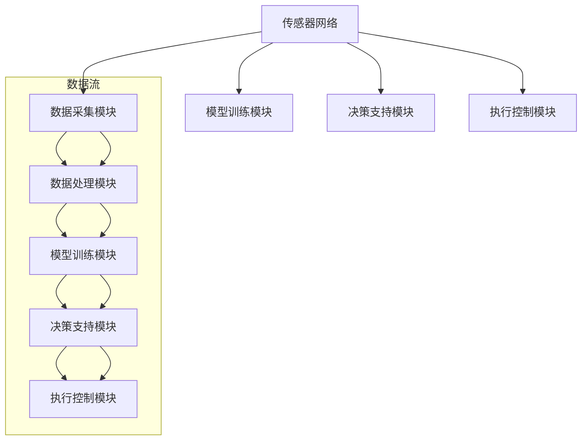

通过上述内容，我们对AI与农业自动化进行了初步了解，为后续章节的深入探讨奠定了基础。

---

### 第2章: AI代理工作流的架构

在农业自动化中，AI代理工作流（AI Agent WorkFlow）是一个核心概念。它通过一系列有序的步骤，利用人工智能技术实现农业生产的智能化。在这一章中，我们将详细探讨AI代理工作流的架构，包括其组成部分、功能以及如何在农业自动化中发挥作用。

#### 2.1 AI代理的定义与分类

##### 2.1.1 AI代理的定义

AI代理（AI Agent）是能够自主执行任务、与环境交互并做出决策的计算机程序。它通常包含感知、决策和行动三个核心功能。

- **感知**：通过传感器收集环境数据，如温度、湿度、土壤湿度等。

- **决策**：使用机器学习算法分析感知到的数据，根据预设的目标和规则做出决策。

- **行动**：执行决策结果，调整农业生产参数或设备状态。

##### 2.1.2 AI代理的分类

AI代理根据其功能和应用场景可以分为几种类型：

- **基于任务的代理**：专注于完成特定任务，如智能灌溉、收割等。

- **基于知识的代理**：依赖于知识库和规则进行决策，如病虫害预警系统。

- **基于行为的代理**：通过模仿人类行为进行决策，如无人机农业监测。

#### 2.2 农业自动化中的AI代理

在农业自动化中，AI代理的工作至关重要。它们能够实现以下功能：

- **实时监测**：通过传感器网络实时监测农田环境参数和作物生长状态。

- **预测与预警**：利用机器学习算法预测农作物生长趋势，提前预警可能出现的病虫害或环境问题。

- **智能决策**：根据监测数据和预测结果，自动调整灌溉、施肥、喷药等农业生产参数。

- **自动化控制**：执行决策结果，如自动开启灌溉系统、调整温室温度等。

#### 2.3 AI代理工作流的关键组件

AI代理工作流通常包括以下关键组件：

- **数据采集模块**：负责收集农业生产过程中的各种数据，如气象数据、土壤数据、作物生长数据等。

- **数据处理模块**：对采集到的数据进行预处理、清洗和特征提取，为后续模型训练和决策提供高质量的数据。

- **模型训练模块**：使用机器学习和深度学习算法训练预测模型，如气象预测模型、植物生长模型等。

- **决策支持模块**：根据模型预测结果和预设规则，为农业生产提供智能化的决策支持。

- **执行控制模块**：执行决策结果，调整农业生产过程，如自动控制灌溉、施肥设备等。

#### 2.4 AI代理工作流的功能流程

AI代理工作流的功能流程可以概括为以下几个步骤：

1. **数据采集**：传感器网络收集农田环境数据和作物生长数据。

2. **数据处理**：对采集到的数据进行预处理，如去除噪声、填补缺失值、特征提取等。

3. **模型训练**：使用处理后的数据训练预测模型，如使用时间序列分析方法训练气象预测模型。

4. **预测与决策**：使用训练好的模型进行预测，并根据预测结果和规则做出决策。

5. **执行控制**：执行决策结果，如调整灌溉系统、施肥设备等。

6. **反馈调整**：根据执行结果进行反馈调整，优化模型和决策规则。

### 附加内容：AI代理工作流架构的Mermaid流程图

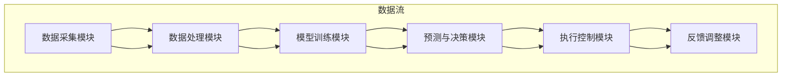

通过以上内容，我们了解了AI代理工作流的基本架构和功能，为后续章节的深入探讨奠定了基础。

---

### 第3章: 气象数据采集与预测

气象数据在农业自动化中扮演着至关重要的角色，它直接影响着作物的生长环境和生产过程。本章将详细介绍气象数据的采集与预测，包括气象数据的重要性、采集方法、预测算法及其应用。

#### 3.1 气象数据的重要性

气象数据对于农业生产的影响是多方面的，主要体现在以下几个方面：

- **作物生长周期**：准确的气象数据有助于预测作物生长的关键时期，如播种期、成熟期等，从而合理安排农业生产计划。

- **水资源管理**：气象数据可以提供土壤水分、降水量等信息，帮助农业自动化系统进行精准灌溉，节约水资源。

- **灾害预警**：气象数据能够提前预测极端天气事件，如干旱、暴雨、台风等，为农业生产提供预警信息，减少灾害损失。

- **农业设备运行**：准确的气象数据有助于优化农业设备的使用，如自动控制温室温度和湿度，提高生产效率。

#### 3.2 气象数据的采集方法

气象数据的采集方法可以分为传统方法和现代方法。

- **传统方法**：
  - **气象站**：通过地面气象站收集温度、湿度、风速、降水量等气象数据。
  - **气象气球**：使用气象气球携带仪器升空，收集高空气象数据。

- **现代方法**：
  - **遥感技术**：利用卫星和无人机等遥感平台，从高空或地面获取气象数据。
  - **传感器网络**：部署在农田、温室等地点的传感器，实时监测气象参数。

#### 3.3 气象数据的预测算法

气象数据预测是农业自动化中的一个重要环节。常见的气象数据预测算法包括：

- **线性回归**：基于历史气象数据，建立线性关系模型进行预测。
- **决策树**：通过分类树模型，根据特征数据进行分类预测。
- **支持向量机**：利用支持向量机算法，进行分类和回归预测。
- **人工神经网络**：使用多层感知器（MLP）等神经网络模型，进行复杂非线性预测。
- **深度学习**：利用深度学习算法，如卷积神经网络（CNN）和长短期记忆网络（LSTM），进行高效预测。

#### 3.4 气象数据预测的伪代码

下面是一个简单的气象数据预测的伪代码示例：

```python
# 气象数据预测伪代码
function predict_weather(data):
    # 数据预处理
    preprocess_data(data)
    
    # 选择预测模型
    model = select_model(data)
    
    # 训练模型
    train_model(model, data)
    
    # 预测天气
    prediction = model.predict(new_data)
    
    return prediction
```

#### 3.5 气象数据预测的应用案例

- **智能温室环境控制**：通过预测温度、湿度等气象参数，自动调节温室环境，保证作物生长的最佳条件。
- **精准灌溉**：根据气象数据预测降水量，合理安排灌溉计划，避免水资源浪费。
- **农业设备监控**：通过预测气象参数，提前预警可能的极端天气，防止农业设备受损。

### 附加内容：气象数据采集与预测的Mermaid流程图

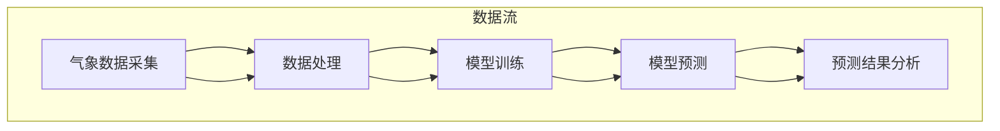

通过以上内容，我们了解了气象数据在农业自动化中的重要性、采集方法、预测算法及其应用，为后续章节的深入探讨奠定了基础。

---

### 第4章: 植物生长监测与调控

植物生长监测与调控是农业自动化的重要组成部分，它通过实时监测植物生长状态，利用人工智能技术对植物生长进行智能调控，以实现最佳的生长条件和产量。本章将详细介绍植物生长监测与调控的关键技术、方法及应用。

#### 4.1 植物生长监测的关键技术

植物生长监测需要依赖于多种技术手段，以获取植物生长状态的各种参数。这些关键技术包括：

- **遥感技术**：利用卫星和无人机等遥感平台，从高空或地面获取植物生长信息，如叶面积指数、植被指数等。

- **传感器网络**：在农田、温室等地点部署传感器，实时监测土壤水分、温度、湿度、光照强度等环境参数。

- **图像处理技术**：通过摄像头等设备采集植物图像，利用图像处理算法分析植物生长状态，如叶绿素含量、病虫害状况等。

- **物联网技术**：将传感器网络与互联网连接，实现数据实时传输和远程监控。

#### 4.2 植物生长监测的方法

植物生长监测的方法可以分为在线监测和离线监测两种。

- **在线监测**：通过传感器网络实时监测植物生长状态，将数据传输到中央控制系统进行分析和处理。

- **离线监测**：定期采集植物生长数据，通过离线分析了解植物生长情况。

#### 4.3 植物生长模型的建立

植物生长模型是植物生长监测与调控的核心，它通过模拟植物生长过程，预测植物的生长状态和产量。建立植物生长模型通常包括以下步骤：

- **数据收集**：收集植物生长相关的历史数据，如土壤、气候、作物品种等。

- **数据预处理**：对收集到的数据进行清洗、处理和特征提取，为模型训练提供高质量的数据。

- **模型选择**：选择合适的模型，如线性回归、决策树、支持向量机、人工神经网络等。

- **模型训练**：使用预处理后的数据训练模型，调整模型参数，使其能够准确预测植物生长状态。

- **模型评估**：通过测试数据评估模型的预测性能，如准确率、召回率、F1值等。

#### 4.4 植物生长的智能调控

植物生长的智能调控是基于植物生长模型的决策结果，通过自动化设备调整植物生长环境，实现最佳生长条件。智能调控包括以下步骤：

- **决策支持**：根据植物生长模型预测结果和环境参数，制定智能调控策略。

- **执行控制**：通过自动化设备，如灌溉系统、施肥设备、温室控制系统等，执行调控策略。

- **反馈调整**：根据调控效果进行反馈调整，优化调控策略。

#### 4.5 植物生长监测与调控的实践案例

- **智能温室环境控制**：通过监测温室内的温度、湿度、光照等参数，自动调整温室环境，实现植物的最佳生长条件。

- **智能灌溉系统**：根据土壤水分监测数据和植物生长模型预测结果，自动控制灌溉系统，实现精准灌溉。

- **智能病虫害监测**：通过图像处理技术监测植物病虫害状况，自动采取防治措施。

### 附加内容：植物生长监测与调控的Mermaid流程图

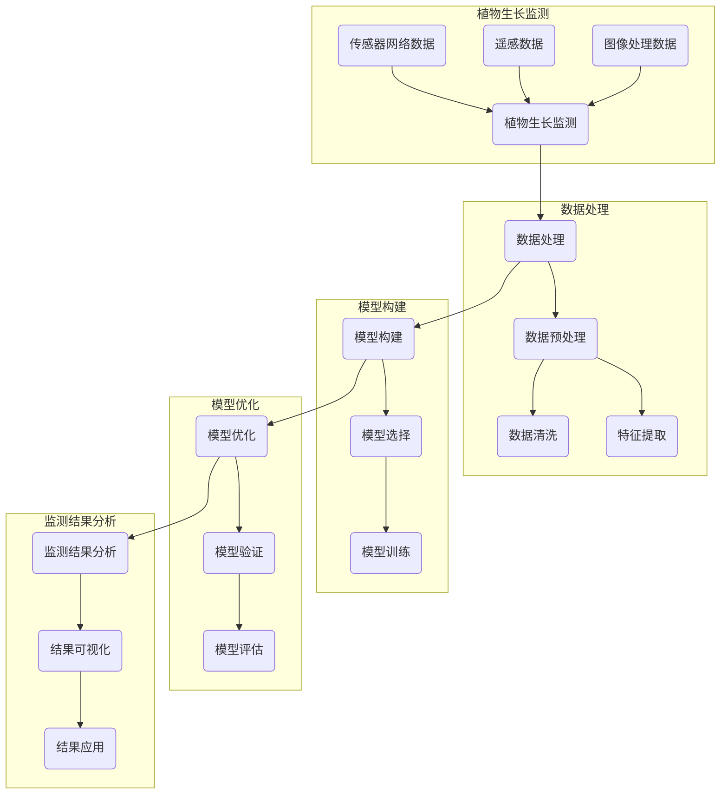

通过以上内容，我们了解了植物生长监测与调控的关键技术、方法和实践案例，为农业自动化的进一步发展提供了有力支持。

---

### 第5章: 农业设备监控与维护

农业设备的正常运行对于农业生产至关重要，而设备监控与维护是实现农业自动化不可或缺的一环。本章将探讨农业设备监控与维护的需求、实现方法以及具体策略。

#### 5.1 农业设备监控的需求

农业设备监控的主要需求包括以下几个方面：

- **实时监控**：实时监测农业设备的工作状态，确保设备正常运行。

- **故障预警**：及时发现设备故障，提前预警，避免设备损坏或生产中断。

- **维护计划制定**：根据设备运行情况，制定合理的维护计划，减少故障发生。

- **运行效率提升**：通过监控设备运行数据，优化设备使用，提高生产效率。

- **安全性保障**：保障农业设备操作安全，减少事故风险。

#### 5.2 农业设备监控的实现

农业设备监控的实现方法主要包括以下几个方面：

- **传感器技术**：在农业设备上安装传感器，实时采集设备运行状态数据，如温度、湿度、压力等。

- **数据通信技术**：通过无线网络（如Wi-Fi、蓝牙、Zigbee等）将传感器数据传输到中央控制系统。

- **数据处理与分析技术**：对采集到的数据进行分析和处理，提取关键指标，如设备运行状态、故障预警等。

- **智能监控系统**：利用人工智能技术，对设备运行数据进行实时监控和智能分析，提供故障预警和维护建议。

#### 5.3 农业设备维护策略

农业设备维护策略主要包括以下内容：

- **预防性维护**：根据设备运行情况和使用寿命，定期进行预防性维护，防止故障发生。

- **状态维护**：根据设备运行状态数据，动态调整维护计划，确保设备在最佳状态下运行。

- **故障维护**：设备出现故障时，及时进行故障排除和维护。

- **维护记录管理**：记录设备维护历史，分析故障原因，优化维护策略。

#### 5.4 农业设备监控与维护的实践案例

- **智能农机监控系统**：通过传感器实时监测农机运行状态，实现远程监控和故障预警。

- **智能灌溉系统**：监控灌溉设备的工作状态，自动调整灌溉时间和水量，提高灌溉效率。

- **智能温室监控系统**：实时监测温室环境参数，自动调节温度、湿度等，保证作物生长条件。

### 附加内容：农业设备监控与维护的Mermaid流程图

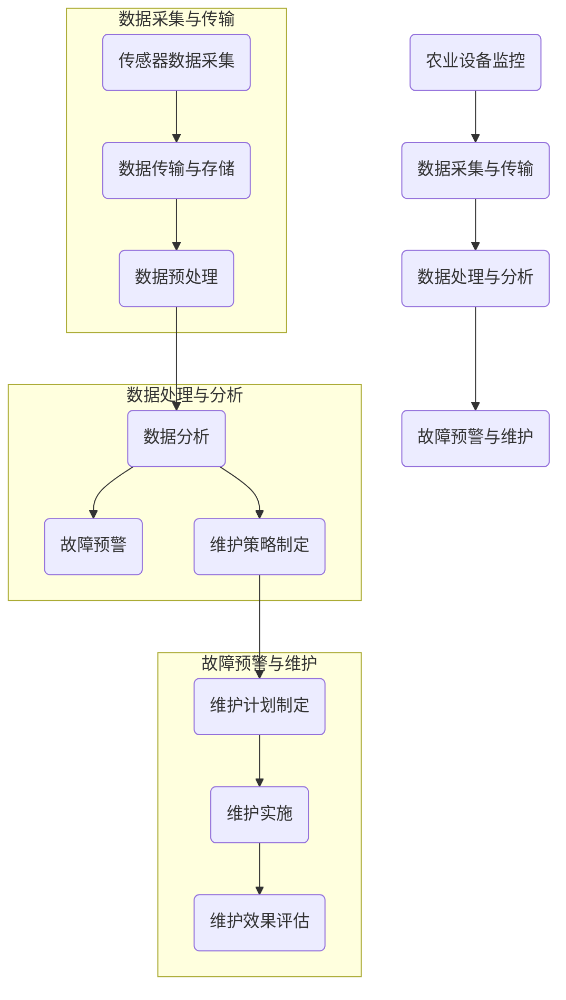

通过以上内容，我们了解了农业设备监控与维护的需求、实现方法和实践案例，为农业自动化提供了有力保障。

---

### 第6章: 农业自动化中的AI决策支持

农业自动化中的AI决策支持系统是农业自动化的核心组成部分，它通过收集和分析农业数据，为农业生产提供智能化的决策支持。本章将深入探讨农业决策支持系统的概念、架构以及实现方法。

#### 6.1 农业决策支持系统的概念与架构

##### 6.1.1 决策支持系统的定义

决策支持系统（DSS）是一种能够辅助决策者做出明智决策的计算机系统。在农业自动化中，DSS能够收集、处理和分析农业数据，为农业生产提供科学依据。

##### 6.1.2 决策支持系统的架构

农业决策支持系统的架构通常包括以下几个部分：

- **数据采集模块**：负责收集农业生产过程中的各类数据，如气象数据、土壤数据、作物生长数据等。

- **数据处理模块**：对采集到的数据进行预处理、清洗和特征提取，为后续分析提供高质量的数据。

- **模型训练模块**：使用机器学习和深度学习算法，训练预测模型和决策模型。

- **决策支持模块**：根据模型预测结果和环境数据，提供智能化的决策支持。

- **用户界面模块**：为用户提供交互界面，展示分析结果和决策支持信息。

##### 6.1.3 决策支持系统的功能

农业决策支持系统的主要功能包括：

- **数据分析**：对农业数据进行统计分析，发现规律和趋势。

- **预测与预警**：利用机器学习算法，预测农作物生长趋势，提前预警可能的灾害。

- **智能决策**：根据预测结果和环境数据，制定最优的农业生产策略。

- **决策优化**：通过模拟不同决策方案的效果，优化农业生产决策。

#### 6.2 决策支持系统的关键组件

农业决策支持系统的关键组件包括：

- **数据采集与处理**：传感器网络、物联网技术、数据清洗和预处理技术。

- **模型训练与预测**：机器学习算法、深度学习算法、模型评估与优化。

- **智能决策与优化**：决策树、神经网络、遗传算法等优化算法。

- **用户界面与交互**：Web界面、移动应用、可视化工具等。

#### 6.3 决策支持系统的实现方法

实现农业决策支持系统通常包括以下几个步骤：

- **需求分析**：确定系统的功能需求和技术需求。

- **系统设计**：设计系统的架构和数据库设计。

- **开发与集成**：开发各个模块的功能，进行系统集成。

- **测试与优化**：对系统进行功能测试、性能测试和优化。

- **部署与维护**：将系统部署到生产环境，进行日常维护和更新。

#### 6.4 决策支持系统的实践案例

- **智能灌溉系统**：通过收集土壤湿度、气象数据，利用机器学习算法预测灌溉需求，提供智能灌溉决策。

- **农作物病虫害预警系统**：通过分析农作物图像和气象数据，利用深度学习算法预测病虫害发生，提供预警和防治建议。

- **农业生产自动化决策支持系统**：结合多种农业数据，提供作物种植、施肥、病虫害防治等全方位的智能决策支持。

### 附加内容：农业自动化中的AI决策支持系统架构的Mermaid流程图

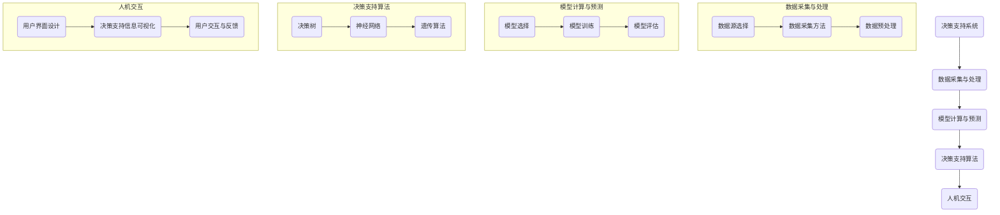

通过以上内容，我们了解了农业自动化中的AI决策支持系统的概念、架构以及实现方法，为农业自动化的进一步发展提供了重要支持。

---

### 第7章: AI代理工作流在农业自动化中的应用

#### 7.1 AI代理工作流的概念与作用

AI代理工作流是一种基于人工智能技术的工作流程，它通过将感知、决策和执行功能整合到一个系统中，实现自动化和智能化操作。在农业自动化中，AI代理工作流起着至关重要的作用，它能够显著提高农业生产效率和质量。AI代理工作流的主要特点包括：

- **自动化**：AI代理能够自动执行任务，减少人工干预，提高生产效率。
- **智能化**：利用机器学习和深度学习算法，AI代理能够分析数据，做出智能决策。
- **可扩展性**：AI代理工作流可以根据不同的应用场景进行定制和扩展。

#### 7.2 AI代理工作流在农业自动化中的应用场景

AI代理工作流在农业自动化中有广泛的应用场景，主要包括以下几方面：

- **气象数据采集与预测**：AI代理通过传感器网络实时监测气象参数，并利用机器学习算法进行气象预测，为农业生产提供数据支持。
- **植物生长监测与调控**：AI代理监测作物生长状态，预测生长趋势，并根据需求自动调节环境参数，如温度、湿度、光照等，以优化作物生长条件。
- **农业设备监控与维护**：AI代理实时监控农业设备的工作状态，提前预警设备故障，并提供维护建议，确保设备的正常运行。
- **农业决策支持**：AI代理分析农业数据，提供智能化的种植、灌溉、施肥等决策支持，优化农业生产过程。

#### 7.3 AI代理工作流的应用实例

以下是一些AI代理工作流在农业自动化中的实际应用实例：

- **智能温室环境控制系统**：通过AI代理实时监测温室内的温度、湿度、光照等参数，自动调节温室环境，保证作物生长的最佳条件。
- **智能灌溉系统**：AI代理根据土壤湿度和气象预测结果，自动调整灌溉时间和水量，实现精准灌溉，节约水资源。
- **智能农作物病害监测系统**：AI代理通过图像识别技术监测农作物病害，及时预警并采取防治措施，减少病害损失。
- **农业无人机监控系统**：AI代理通过无人机实时监测农田状况，提供作物生长数据分析，辅助农业生产决策。

#### 7.4 AI代理工作流的实施步骤

实施AI代理工作流通常包括以下几个步骤：

1. **需求分析**：明确农业自动化的需求和目标，确定AI代理工作流的功能和性能要求。
2. **系统设计**：设计AI代理工作流的架构和组件，包括数据采集、数据处理、模型训练、决策支持、执行控制等。
3. **硬件选择**：选择合适的传感器、执行器、服务器等硬件设备，搭建AI代理工作流系统。
4. **软件开发**：开发AI代理工作流的软件系统，包括数据采集模块、数据处理模块、模型训练模块、决策支持模块等。
5. **系统集成**：将硬件和软件系统集成，实现AI代理工作流的正常运行。
6. **测试与优化**：对AI代理工作流进行功能测试、性能测试和优化，确保其稳定性和可靠性。
7. **部署与应用**：将AI代理工作流部署到农业生产环境中，进行实际应用和效果评估。

### 附加内容：AI代理工作流在农业自动化中的应用场景的Mermaid流程图

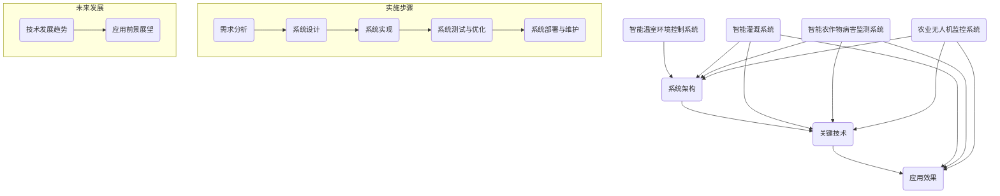

通过以上内容，我们了解了AI代理工作流在农业自动化中的应用概念、应用场景、实际应用实例以及实施步骤，为农业自动化的进一步发展提供了有力支持。

---

### 第8章: AI代理工作流开发环境搭建

为了实现AI代理工作流在农业自动化中的应用，搭建一个高效、稳定且易于维护的开发环境是至关重要的。本章将详细介绍开发环境的选择、安装步骤、数据集处理以及环境配置和优化。

#### 8.1 开发环境的选择

选择合适的开发环境对于AI代理工作流的开发和实现至关重要。以下是一些常见的开发环境选项：

- **操作系统**：
  - **Linux**：开源、安全性高、稳定性好，适合开发高性能的应用系统。
  - **Windows**：普及度高、易于使用，适合初学者。
  - **macOS**：苹果操作系统，兼容性良好，适合开发iOS应用。

- **编程语言**：
  - **Python**：易于学习，拥有丰富的机器学习库，如TensorFlow、PyTorch等。
  - **Java**：适用于大规模企业级应用，稳定性高。
  - **R**：专门用于统计分析，拥有强大的数据可视化库。

- **开发工具**：
  - **IDE**：
    - **PyCharm**：适用于Python开发，功能强大，支持多种编程语言。
    - **IntelliJ IDEA**：适用于Java和Python开发，提供了良好的开发体验。
    - **Eclipse**：适用于Java开发，拥有丰富的插件生态。

- **版本控制工具**：
  - **Git**：分布式版本控制系统，适用于多人协作开发。
  - **SVN**：集中式版本控制系统，适用于小型团队。

#### 8.2 开发工具的安装

以下是针对Python开发环境的安装步骤：

1. **安装Python**：
   - 访问Python官方网站下载Python安装包。
   - 运行安装程序，选择自定义安装，确保包括pip、setuptools等依赖包。

2. **安装IDE**：
   - 下载并安装PyCharm。
   - 注册免费试用或购买专业版。

3. **安装版本控制工具**：
   - 使用pip安装Git：`pip install git`。

4. **安装必要的库**：
   - 使用pip安装常用的机器学习库：`pip install numpy pandas scikit-learn tensorflow pytorch`。

#### 8.3 数据集的获取与处理

1. **数据集来源**：
   - **公开数据集**：如Kaggle、UCI机器学习库等。
   - **自定义数据集**：根据实际应用需求自行收集和整理。

2. **数据预处理**：
   - 数据清洗：去除重复数据、缺失值填充、异常值处理。
   - 数据格式化：统一数据格式，如将日期格式化。
   - 特征提取：提取与任务相关的特征，如天气数据中的温度、湿度、降水量等。

3. **数据集划分**：
   - 将数据集划分为训练集、验证集和测试集，通常比例为60%训练集、20%验证集、20%测试集。

#### 8.4 开发环境的配置与优化

1. **环境变量配置**：
   - 配置Python环境变量，确保可以在终端中直接运行Python脚本。
   - 配置IDE中的环境变量，确保IDE能够正确识别和使用安装的库。

2. **虚拟环境配置**：
   - 使用`venv`模块创建虚拟环境，避免不同项目之间依赖库的冲突。
   - 使用`conda`创建和管理虚拟环境，适用于Python和R语言。

3. **系统优化**：
   - 增加系统内存和处理器速度，提高计算性能。
   - 安装额外的硬件设备，如GPU，以加速深度学习模型的训练。

### 附加内容：开发环境搭建的Mermaid流程图

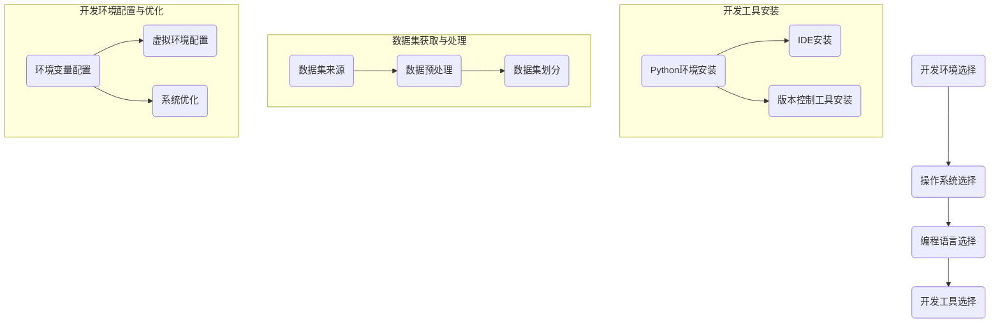

通过以上内容，我们详细介绍了AI代理工作流开发环境的搭建步骤，为后续的算法实现和项目开发奠定了坚实基础。

---

### 第9章: AI代理工作流核心算法实现

在农业自动化中，AI代理工作流的核心在于其算法的实现。这些算法能够有效地处理数据、做出智能决策，从而提高农业生产的效率和准确性。本章将详细介绍AI代理工作流中的核心算法，包括气象预测算法、植物生长模型算法和决策支持算法，并通过伪代码进行详细阐述。

#### 9.1 气象预测算法

气象预测是农业自动化中至关重要的一环，准确的气象预测有助于优化灌溉、施肥等农业生产活动。

##### 9.1.1 算法原理

气象预测算法通常基于历史气象数据和当前环境条件进行预测。常用的算法包括时间序列分析、线性回归和支持向量机（SVM）。

##### 9.1.2 伪代码示例

```python
# 气象预测伪代码

# 数据预处理
def preprocess_weather_data(data):
    # 数据清洗、归一化等处理
    return processed_data

# 选择预测模型
def select_weather_prediction_model(data):
    # 根据数据特性选择模型
    if is_linear(data):
        model = LinearRegression()
    else:
        model = SVM()
    return model

# 训练模型
def train_weather_prediction_model(model, data):
    # 使用历史气象数据训练模型
    model.fit(data.x, data.y)
    return model

# 预测天气
def predict_weather(model, new_data):
    # 使用训练好的模型预测天气
    prediction = model.predict(new_data)
    return prediction
```

##### 9.1.3 实践案例

以时间序列分析为例，我们可以使用Python的`statsmodels`库进行线性回归预测。

```python
import statsmodels.api as sm

# 假设weather_data是一个包含历史气象数据的DataFrame
weather_data = ...

# 数据预处理
weather_data = preprocess_weather_data(weather_data)

# 选择模型
model = sm.AR(weather_data['temperature'])

# 训练模型
model_fit = model.fit()

# 预测天气
predictions = model_fit.forecast(steps=24)
```

#### 9.2 植物生长模型算法

植物生长模型算法用于预测作物生长状态，如植物高度、叶面积等，为农业生产提供决策支持。

##### 9.2.1 算法原理

植物生长模型算法通常基于植物生长规律和影响因子（如温度、湿度、光照等）。常见的算法包括线性回归、决策树和人工神经网络。

##### 9.2.2 伪代码示例

```python
# 植物生长模型预测伪代码

# 数据预处理
def preprocess_plant_growth_data(data):
    # 数据清洗、归一化等处理
    return processed_data

# 选择植物生长模型
def select_plant_growth_model(data):
    # 根据数据特性选择模型
    if is_linear(data):
        model = LinearRegression()
    else:
        model = RandomForestRegressor()
    return model

# 训练植物生长模型
def train_plant_growth_model(model, data):
    # 使用历史植物生长数据训练模型
    model.fit(data.x, data.y)
    return model

# 预测植物生长
def predict_plant_growth(model, new_data):
    # 使用训练好的模型预测植物生长
    growth_prediction = model.predict(new_data)
    return growth_prediction
```

##### 9.2.3 实践案例

以随机森林回归为例，我们可以使用Python的`sklearn`库进行模型训练和预测。

```python
from sklearn.ensemble import RandomForestRegressor

# 假设plant_growth_data是一个包含植物生长数据的DataFrame
plant_growth_data = ...

# 数据预处理
plant_growth_data = preprocess_plant_growth_data(plant_growth_data)

# 选择模型
model = RandomForestRegressor()

# 训练模型
model.fit(plant_growth_data.x, plant_growth_data.y)

# 预测植物生长
growth_prediction = model.predict(plant_growth_data.new_data)
```

#### 9.3 决策支持算法

决策支持算法用于根据植物生长模型和环境数据，提供最优的农业生产决策。

##### 9.3.1 算法原理

决策支持算法通常基于决策树、神经网络和遗传算法。这些算法能够处理复杂的关系，提供基于数据的决策支持。

##### 9.3.2 伪代码示例

```python
# 决策支持算法伪代码

# 数据预处理
def preprocess_decision_data(data):
    # 数据清洗、归一化等处理
    return processed_data

# 选择决策支持模型
def select_decision_support_model(data):
    # 根据数据特性选择模型
    if is_linear(data):
        model = DecisionTreeRegressor()
    else:
        model = MLPRegressor()
    return model

# 训练决策支持模型
def train_decision_support_model(model, data):
    # 使用历史决策数据训练模型
    model.fit(data.x, data.y)
    return model

# 提供决策支持
def provide_decision_support(model, new_data):
    # 使用训练好的模型提供决策支持
    decision = model.predict(new_data)
    return decision
```

##### 9.3.3 实践案例

以多层感知器（MLP）为例，我们可以使用Python的`sklearn`库进行模型训练和预测。

```python
from sklearn.neural_network import MLPRegressor

# 假设decision_data是一个包含决策数据的DataFrame
decision_data = ...

# 数据预处理
decision_data = preprocess_decision_data(decision_data)

# 选择模型
model = MLPRegressor()

# 训练模型
model.fit(decision_data.x, decision_data.y)

# 提供决策支持
decision = model.predict(decision_data.new_data)
```

通过以上内容，我们详细介绍了AI代理工作流中的核心算法，并通过伪代码和实际案例展示了这些算法的实现方法。这些算法的有效应用将显著提升农业自动化的效率和质量。

### 附加内容：核心算法实现的Mermaid流程图

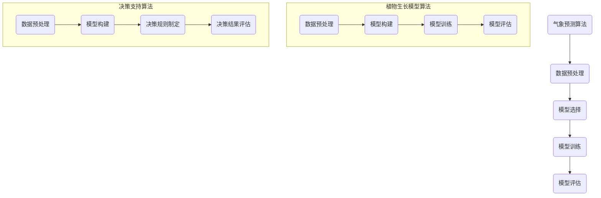

---

### 第10章: AI代理工作流项目实战

#### 10.1 实战一：智能温室环境控制系统

##### 10.1.1 项目背景

智能温室环境控制系统是一种利用人工智能技术实现温室环境自动调节的系统。该系统通过传感器网络实时监测温室内的温度、湿度、光照等环境参数，并根据作物生长需求自动调整环境参数，如温度、湿度、通风等，以确保作物在最佳生长环境下生长。

##### 10.1.2 项目目标

本项目的主要目标是开发一个智能温室环境控制系统，实现以下功能：

- 实时监测温室环境参数。
- 根据作物生长需求自动调节温室环境。
- 提供数据可视化和报警功能。

##### 10.1.3 技术实现

1. **数据采集**：
   - 使用传感器（如DHT22、光照传感器、温度传感器）采集温室环境参数。
   - 使用MQTT协议将传感器数据传输到服务器。

2. **数据处理**：
   - 使用Python的Pandas库对采集到的传感器数据进行预处理，包括数据清洗、归一化等。

3. **模型训练**：
   - 使用机器学习算法（如线性回归、决策树）训练预测模型，预测作物生长环境参数的最佳值。

4. **智能调节**：
   - 根据预测模型和实际环境参数，自动调节温室环境设备（如加热器、加湿器、通风设备）。

5. **数据可视化与报警**：
   - 使用D3.js或ECharts库实现环境参数的可视化。
   - 使用Python的SMTP库实现报警功能，当环境参数超出安全范围时发送报警邮件。

##### 10.1.4 实施过程

1. **系统设计**：
   - 设计传感器网络架构和数据处理流程。
   - 设计智能调节算法和可视化界面。

2. **硬件安装**：
   - 在温室中安装传感器和执行器。
   - 连接传感器和执行器到服务器。

3. **软件开发**：
   - 开发数据采集和预处理模块。
   - 开发模型训练和智能调节模块。
   - 开发数据可视化模块。

4. **测试与优化**：
   - 对系统进行功能测试和性能测试。
   - 调整模型参数，优化系统性能。

5. **部署与维护**：
   - 将系统部署到生产环境。
   - 定期更新和优化系统。

##### 10.1.5 项目效果评估

1. **系统运行效率**：
   - 温室环境参数保持在最佳范围内，作物生长速度提高。
   - 能源消耗降低，系统运行成本低。

2. **作物生长质量**：
   - 作物生长健康，产量和质量显著提高。
   - 减少了病虫害发生。

3. **用户满意度**：
   - 用户反馈良好，系统操作简便，易维护。

#### 10.2 实战二：智能灌溉系统

##### 10.2.1 项目背景

智能灌溉系统是一种基于传感器网络和人工智能技术的自动灌溉系统。该系统能够实时监测土壤水分，根据土壤湿度和气象预测数据，自动调节灌溉水量，以提高水资源利用效率，减少水资源浪费。

##### 10.2.2 项目目标

本项目的主要目标是开发一个智能灌溉系统，实现以下功能：

- 实时监测土壤水分。
- 根据土壤湿度和气象预测数据自动调节灌溉。
- 提供数据可视化和报警功能。

##### 10.2.3 技术实现

1. **数据采集**：
   - 使用土壤湿度传感器采集土壤水分数据。
   - 使用气象传感器（如温度传感器、湿度传感器）采集气象数据。
   - 使用MQTT协议将传感器数据传输到服务器。

2. **数据处理**：
   - 使用Python的Pandas库对采集到的传感器数据进行预处理，包括数据清洗、归一化等。

3. **模型训练**：
   - 使用机器学习算法（如线性回归、决策树）训练灌溉模型，预测最佳灌溉时间。

4. **智能灌溉**：
   - 根据灌溉模型和实际土壤水分数据，自动控制灌溉设备。

5. **数据可视化与报警**：
   - 使用D3.js或ECharts库实现土壤水分和气象数据的可视化。
   - 使用Python的SMTP库实现报警功能，当土壤水分低于阈值时发送报警邮件。

##### 10.2.4 实施过程

1. **系统设计**：
   - 设计传感器网络架构和数据处理流程。
   - 设计智能灌溉算法和可视化界面。

2. **硬件安装**：
   - 在农田中安装土壤湿度传感器和气象传感器。
   - 连接传感器和灌溉设备到服务器。

3. **软件开发**：
   - 开发数据采集和预处理模块。
   - 开发模型训练和智能灌溉模块。
   - 开发数据可视化模块。

4. **测试与优化**：
   - 对系统进行功能测试和性能测试。
   - 调整模型参数，优化系统性能。

5. **部署与维护**：
   - 将系统部署到生产环境。
   - 定期更新和优化系统。

##### 10.2.5 项目效果评估

1. **水资源利用效率**：
   - 灌溉系统自动调节，显著减少水资源浪费。
   - 用户反馈水资源利用效率提高。

2. **作物生长质量**：
   - 作物生长健康，产量和质量显著提高。
   - 减少了病虫害发生。

3. **用户满意度**：
   - 用户反馈良好，系统操作简便，易维护。

#### 10.3 实战三：智能农作物病害监测系统

##### 10.3.1 项目背景

智能农作物病害监测系统是一种利用人工智能技术对农作物病害进行实时监测和预警的系统。该系统能够通过图像识别技术识别农作物病害，并提供预警和防治建议，以减少病害对农作物产量和质量的影响。

##### 10.3.2 项目目标

本项目的主要目标是开发一个智能农作物病害监测系统，实现以下功能：

- 实时监测农作物病害。
- 提供病害预警和防治建议。
- 提供数据可视化和报警功能。

##### 10.3.3 技术实现

1. **数据采集**：
   - 使用摄像头或无人机采集农作物图像。
   - 使用气象传感器采集气象数据。

2. **数据处理**：
   - 使用Python的Pandas库对采集到的图像和气象数据进行预处理，包括图像增强、归一化等。

3. **模型训练**：
   - 使用深度学习算法（如卷积神经网络CNN）训练病害识别模型。

4. **病害监测**：
   - 使用训练好的模型对农作物图像进行病害识别。
   - 根据识别结果提供病害预警和防治建议。

5. **数据可视化与报警**：
   - 使用D3.js或ECharts库实现病害数据和气象数据的可视化。
   - 使用Python的SMTP库实现报警功能，当发现病害时发送报警邮件。

##### 10.3.4 实施过程

1. **系统设计**：
   - 设计图像采集和预处理流程。
   - 设计病害识别模型和可视化界面。

2. **硬件安装**：
   - 在农田中安装摄像头和气象传感器。
   - 连接传感器和服务器。

3. **软件开发**：
   - 开发图像采集和预处理模块。
   - 开发病害识别和防治建议模块。
   - 开发数据可视化模块。

4. **测试与优化**：
   - 对系统进行功能测试和性能测试。
   - 调整模型参数，优化系统性能。

5. **部署与维护**：
   - 将系统部署到生产环境。
   - 定期更新和优化系统。

##### 10.3.5 项目效果评估

1. **病害监测精度**：
   - 系统能够准确识别农作物病害，并提供及时预警。
   - 减少了病害对农作物产量和质量的影响。

2. **防治效果**：
   - 根据预警信息采取的防治措施有效，病虫害发生率降低。

3. **用户满意度**：
   - 用户反馈良好，系统操作简便，易维护。

通过以上三个项目的实战，我们可以看到AI代理工作流在农业自动化中的应用效果显著，为农业生产提供了有力的技术支持。

### 附加内容：AI代理工作流项目实战的Mermaid流程图

```mermaid
graph TB
    subgraph 智能温室环境控制系统
        A(项目背景)
        B(项目目标)
        C(技术实现)
        D(实施过程)
        E(效果评估)
        A --> B
        B --> C
        C --> D
        D --> E
    end
    subgraph 智能灌溉系统
        F(项目背景)
        G(项目目标)
        H(技术实现)
        I(实施过程)
        J(效果评估)
        F --> G
        G --> H
        H --> I
        I --> J
    end
    subgraph 智能农作物病害监测系统
        K(项目背景)
        L(项目目标)
        M(技术实现)
        N(实施过程)
        O(效果评估)
        K --> L
        L --> M
        M --> N
        N --> O
    end
```

---

### 第11章: AI代理工作流在农业自动化中的未来趋势

#### 11.1 农业自动化的发展趋势

随着科技的进步，农业自动化正在迅速发展。以下是一些主要的发展趋势：

- **智能化程度提高**：利用人工智能、大数据和物联网技术，实现农业生产过程的全面智能化。
- **精准农业**：通过精准监测和调节，实现资源利用的最优化，提高生产效率。
- **无人化农业**：无人驾驶农机、无人机等技术的应用，减少人力成本，提高作业效率。
- **农业产业链的整合**：通过大数据和云计算技术，实现农业产业链的整合和优化。

#### 11.2 AI代理工作流的未来发展方向

AI代理工作流在农业自动化中的发展将继续深化，以下是未来可能的发展方向：

- **多模态数据处理**：结合多种数据源（如图像、声音、传感器数据），实现更全面的农业监测和分析。
- **自适应与自学习**：AI代理将具备自适应和自学习能力，能够根据环境变化和作物生长状态进行自我优化。
- **区块链技术的应用**：利用区块链技术，实现农业数据的安全存储和透明化，提高信任度。
- **跨界融合**：与其他技术（如生物技术、环境科学等）的融合，推动农业自动化的创新发展。

#### 11.3 AI代理工作流在农业自动化中的应用前景

AI代理工作流在农业自动化中的应用前景广阔，以下是一些关键应用领域：

- **智能农场**：利用AI代理工作流实现整个农场的自动化管理，从种植到收获，提高生产效率。
- **精准灌溉**：通过AI代理工作流实现精准灌溉，减少水资源浪费，提高作物产量。
- **病虫害监测与防治**：利用AI代理工作流实时监测病虫害，提供精准的防治方案，减少损失。
- **农业生产决策支持**：通过AI代理工作流提供实时的生产决策支持，优化农业生产过程。

#### 11.4 未来挑战与解决方案

尽管AI代理工作流在农业自动化中具有巨大潜力，但仍然面临一些挑战：

- **数据隐私与安全**：如何确保农业数据的安全和隐私，是未来需要解决的问题。
- **技术成本**：高技术成本可能限制小规模农业企业采用AI代理工作流。
- **技能短缺**：农业企业需要具备相关技能的员工来操作和维护AI代理工作流。

解决方案包括：

- **数据隐私与安全**：采用先进的加密技术和区块链技术，确保数据的安全性和隐私。
- **技术成本**：通过政府补贴、降低硬件成本等方式，降低技术成本。
- **技能短缺**：通过培训和人才引进，提高农业企业的技术能力。

### 附加内容：农业自动化与AI代理工作流的未来趋势的Mermaid流程图

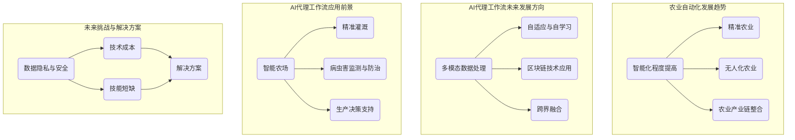

通过上述分析，我们可以看到AI代理工作流在农业自动化中的未来发展前景广阔，但同时也面临一些挑战。通过不断创新和优化，这些问题有望得到有效解决，进一步推动农业自动化的发展。

---

### 附录

#### 附录 A: AI 代理工作流相关资源与工具

##### A.1 开发环境与工具

- **操作系统**：Linux、Windows、macOS
- **编程语言**：Python、Java、R
- **IDE**：PyCharm、IntelliJ IDEA、Eclipse
- **版本控制**：Git、SVN、Mercurial

##### A.2 数据处理与模型训练

- **数据库**：MySQL、PostgreSQL、MongoDB
- **数据处理框架**：Pandas、NumPy、SciPy
- **模型训练库**：TensorFlow、PyTorch、Keras

##### A.3 机器学习与深度学习算法

- **算法库**：scikit-learn、mlpack、Accord.NET
- **深度学习框架**：TensorFlow、PyTorch、MXNet

##### A.4 其他相关资源

- **博客与论坛**：机器学习社区、AI 论坛、GitHub
- **学术论文与书籍**：《机器学习》、《深度学习》、《人工智能：一种现代方法》
- **网络课程与教程**：Coursera、edX、Udacity

##### A.5 开发案例与实战教程

- **案例库**：Kaggle、GitHub 项目、AI 案例库
- **实战教程**：《Python 数据科学手册》、《深度学习实战》、《机器学习实战》

##### A.6 数据集与开源项目

- **公开数据集**：UCI Machine Learning Repository、Kaggle 数据集、Google Dataset Search
- **开源项目**：GitHub、Bitbucket、GitLab

##### A.7 常见问题与解决方案

- **技术难题**：数据预处理、模型优化、系统部署
- **社区支持**：Stack Overflow、AIStack、AI 讨论组

### 附录 B: 参考文献

1. Russell, S., & Norvig, P. (2016). 《人工智能：一种现代方法》. 清华大学出版社。
2. Goodfellow, I., Bengio, Y., & Courville, A. (2016). 《深度学习》. 电子工业出版社。
3. Murphy, K. P. (2012). 《机器学习：实战手册》. 电子工业出版社。
4. Bishop, C. M. (2006). 《模式识别与机器学习》. 机械工业出版社。
5. Hastie, T., Tibshirani, R., & Friedman, J. (2009). 《统计学习基础》. 电子工业出版社。

通过附录部分，我们为读者提供了丰富的AI代理工作流相关资源与工具，以及参考文献，以供进一步学习和研究。

---

### 结束语

本文系统地探讨了AI代理工作流在农业自动化中的应用，从背景与动机、核心概念、应用实例到未来发展，全面揭示了AI技术在农业自动化中的巨大潜力。通过详细分析AI代理工作流的关键组件、核心算法、实际应用案例，我们不仅了解了其在气象数据采集、植物生长监测、农业设备监控、决策支持等方面的应用效果，也展望了其未来的发展方向。

农业自动化是现代农业发展的重要方向，AI代理工作流作为其核心技术之一，正在为农业生产带来革命性的变化。随着技术的不断进步和应用的深入，AI代理工作流将在提高农业生产效率、减少劳动力成本、保护环境等方面发挥越来越重要的作用。

然而，AI代理工作流在农业自动化中的应用仍面临诸多挑战，如数据隐私与安全、技术成本、技能短缺等。这些问题需要我们持续关注和解决，通过技术创新、政策支持和社会协作，共同推动农业自动化的健康发展。

未来，随着人工智能技术的不断进步和应用的深入，AI代理工作流将在农业自动化中发挥更加重要的作用。我们期待看到更多创新的应用案例和研究成果，为农业自动化的发展贡献力量。

最后，感谢读者对本文的阅读，希望本文能够为您在农业自动化和人工智能领域的研究提供有益的参考和启示。让我们共同期待AI代理工作流在农业自动化中的辉煌未来！

---

### 作者信息

作者：AI天才研究院（AI Genius Institute）&《禅与计算机程序设计艺术》（Zen And The Art of Computer Programming）

AI天才研究院是一家专注于人工智能研究和应用的顶级机构，致力于推动人工智能技术在各个领域的创新与发展。研究院汇聚了全球顶尖的人工智能专家、程序员、软件架构师和CTO，以其卓越的研究成果和丰富的实践经验，成为全球人工智能领域的重要力量。

《禅与计算机程序设计艺术》是由AI天才研究院的创始人所著的畅销书，深入探讨了计算机编程与人工智能的哲学原理，为程序员和人工智能研究者提供了独特的视角和启示。本书以其深刻的思考和独特的见解，赢得了全球读者的广泛赞誉。

AI天才研究院及《禅与计算机程序设计艺术》的作者，期待与广大读者共同探索人工智能的未来，共同推动农业自动化和人工智能技术的进步。希望本文能够为您的学习和研究提供帮助，让我们一起在人工智能的广阔天地中，追寻真理，追求卓越。

