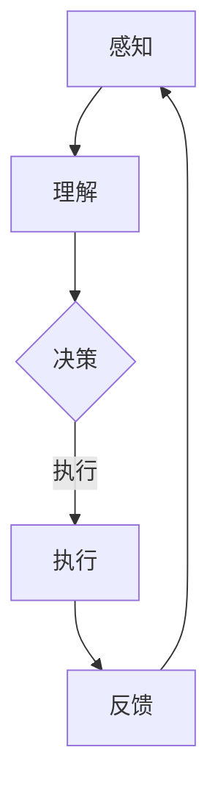

                 

# AI人工智能代理工作流 AI Agent WorkFlow：在能源管理中的应用

> 关键词：人工智能代理、能源管理、工作流、性能优化、项目实战

> 摘要：本文将深入探讨AI人工智能代理工作流在能源管理中的应用。通过分析人工智能代理的基础概念、工作原理、架构设计、性能优化策略以及实际项目应用，我们将展示如何利用AI技术提高能源管理效率，实现节能减排目标。

## 第一部分: AI人工智能代理工作流基础

### 第1章: AI人工智能代理的概念与背景

#### 1.1 AI人工智能代理的定义

人工智能代理（Artificial Intelligence Agent，简称AI Agent）是人工智能（Artificial Intelligence，简称AI）领域的一个核心概念。它是一种具有智能行为的计算机程序，能够在动态环境中自主执行任务，并采取行动以最大化预定的目标。人工智能代理可以模拟人类智能行为，包括感知、理解、决策和行动等。

#### 1.2 人工智能代理的发展历程

人工智能代理的概念最早可以追溯到1977年。当时，人工智能科学家John McCarthy提出了“智能代理”的概念。此后，随着计算机技术和人工智能技术的快速发展，人工智能代理逐渐成为人工智能领域的研究热点。特别是近年来，随着深度学习、强化学习等先进技术的兴起，人工智能代理在各个领域得到了广泛应用。

#### 1.3 人工智能代理的重要性

人工智能代理的重要性在于它们能够模拟人类的智能行为，从而在复杂环境中实现自动化和智能化。在能源管理领域，人工智能代理可以实时监测能源使用情况，优化能源分配，预测能源需求，从而提高能源利用效率，降低能源消耗。

#### 1.4 人工智能代理的应用领域

人工智能代理的应用领域非常广泛，包括但不限于以下方面：

1. **智能家居**：通过人工智能代理实现家电设备的智能控制，提高生活便利性。
2. **工业自动化**：在生产线中应用人工智能代理，实现自动化生产和管理。
3. **能源管理**：通过人工智能代理实现能源的智能监测、优化和调度。
4. **交通管理**：利用人工智能代理优化交通信号控制，减少交通拥堵。
5. **医疗保健**：通过人工智能代理实现个性化医疗，提高诊断和治疗水平。

### 第2章: 人工智能代理的工作原理

#### 2.1 人工智能代理的基本组成

人工智能代理通常由以下几个基本组成部分构成：

1. **传感器与执行器**：传感器用于感知环境信息，执行器用于执行操作。
2. **决策模块**：决策模块负责根据传感器收集到的信息进行决策。
3. **学习与适应模块**：学习与适应模块使人工智能代理能够从经验中学习和适应环境变化。

#### 2.1.1 传感器与执行器

传感器与执行器是人工智能代理的感知和执行部分。传感器可以采集环境信息，如温度、湿度、光照强度等，执行器则可以执行各种物理操作，如开关家电设备、调整空调温度等。

#### 2.1.2 决策模块

决策模块是人工智能代理的核心部分，负责根据传感器收集到的信息进行决策。决策模块通常包括以下步骤：

1. **感知**：接收传感器采集到的信息。
2. **理解**：对感知到的信息进行分析和理解。
3. **决策**：根据理解和目标，选择最佳的执行策略。
4. **执行**：执行决策结果，调整传感器和执行器的状态。

#### 2.1.3 学习与适应模块

学习与适应模块使人工智能代理能够从经验中学习和适应环境变化。学习与适应模块通常采用机器学习算法，如深度学习、强化学习等，通过对历史数据的分析和学习，优化决策模块的决策过程。

### 第3章: 能源管理中的AI人工智能代理

#### 3.1 能源管理的基本概念

能源管理是指对能源的采集、储存、转换、分配和消耗等过程进行规划、组织、协调和控制的过程。能源管理的主要目标是提高能源利用效率，降低能源消耗，实现可持续发展。

#### 3.1.1 能源需求与供应

能源需求与供应是能源管理的基础。能源需求取决于用户的能源消费习惯和需求，能源供应则包括各种能源类型的生产和分配。在能源管理中，需要平衡能源需求与供应，确保能源供应的稳定性和可持续性。

#### 3.1.2 能源效率与节能减排

能源效率是指能源利用的效率，即单位能源消耗所获得的能量输出。提高能源效率是能源管理的重要任务，可以通过改进能源设备、优化能源分配、采用节能技术等手段实现。节能减排则是通过减少能源消耗和减少污染物排放，保护环境，实现可持续发展。

#### 3.2 AI人工智能代理在能源管理中的应用

人工智能代理在能源管理中的应用主要体现在以下几个方面：

1. **能源监测与诊断**：通过人工智能代理实时监测能源使用情况，诊断能源消耗异常，提高能源管理效率。
2. **能源优化与调度**：利用人工智能代理优化能源分配和调度，降低能源消耗，提高能源利用效率。
3. **能源预测与规划**：通过人工智能代理预测能源需求，规划能源供应，确保能源供应的稳定性和可持续性。

#### 3.2.1 代理的能源监测与诊断

能源监测与诊断是人工智能代理在能源管理中的基础应用。通过安装传感器，人工智能代理可以实时监测能源使用情况，如电力、燃气、水等能源的消耗量。同时，代理可以对监测数据进行分析，诊断能源消耗异常，如设备故障、能源泄漏等，从而采取相应的措施进行修复或调整。

#### 3.2.2 代理的能源优化与调度

能源优化与调度是人工智能代理在能源管理中的关键应用。通过分析能源使用数据，人工智能代理可以优化能源分配和调度，降低能源消耗。例如，在电力管理中，代理可以根据电力需求预测，调整电力供应计划，避免电力浪费。在燃气管理中，代理可以根据燃气消耗量，优化燃气供应量，确保燃气供应的稳定性和可持续性。

#### 3.2.3 代理的能源预测与规划

能源预测与规划是人工智能代理在能源管理中的高级应用。通过分析历史能源使用数据和环境因素，人工智能代理可以预测未来的能源需求，为能源供应和分配提供科学依据。例如，在电力管理中，代理可以根据季节、天气等因素，预测未来的电力需求，为电力调度提供参考。在燃气管理中，代理可以根据燃气消耗规律，预测未来的燃气需求，为燃气供应和储备提供依据。

### 第4章: AI人工智能代理的架构设计与实现

#### 4.1 AI人工智能代理的架构设计原则

人工智能代理的架构设计需要遵循以下几个原则：

1. **模块化设计**：将代理功能划分为多个模块，每个模块负责特定的任务，便于系统扩展和维护。
2. **可扩展性设计**：设计具有良好可扩展性的系统架构，支持新功能的加入和旧功能的更新。
3. **安全性设计**：确保代理系统的安全性，防止恶意攻击和隐私泄露。

#### 4.1.1 模块化设计

模块化设计是将系统划分为多个功能模块，每个模块独立运行，模块之间通过接口进行通信。在能源管理中，可以将代理系统划分为以下模块：

1. **传感器模块**：负责数据采集和传输。
2. **数据处理模块**：负责数据预处理、特征提取和融合。
3. **决策模块**：负责根据数据进行分析和决策。
4. **执行模块**：负责执行决策结果，调整传感器和执行器的状态。
5. **学习与适应模块**：负责从数据中学习和适应环境变化。

#### 4.1.2 可扩展性设计

可扩展性设计是指系统能够支持功能的增加和修改，而无需对现有功能进行重大调整。在能源管理中，可扩展性设计可以支持新功能的加入，如新增能源类型监测、支持更多设备接入等。

#### 4.1.3 安全性设计

安全性设计是指系统具有抵御外部攻击和内部风险的能力。在能源管理中，安全性设计可以包括以下几个方面：

1. **数据安全**：确保数据在传输和存储过程中的安全性，采用加密算法和权限控制。
2. **系统安全**：确保系统在运行过程中的安全性，采用防火墙、入侵检测等安全措施。
3. **用户安全**：确保用户在系统中的安全，采用身份验证、访问控制等安全措施。

#### 4.2 AI人工智能代理的实现技术

实现人工智能代理需要依赖多种技术，包括机器学习、自然语言处理、人工智能编程框架等。

1. **机器学习算法**：机器学习算法是人工智能代理的核心技术，用于从数据中学习和提取知识。常见的机器学习算法包括决策树、支持向量机、神经网络等。

2. **自然语言处理技术**：自然语言处理技术用于处理人类语言，使人工智能代理能够理解和生成自然语言。常见的自然语言处理技术包括分词、词性标注、句法分析等。

3. **人工智能编程框架**：人工智能编程框架是开发人工智能代理的工具，提供丰富的API和工具库，简化开发过程。常见的人工智能编程框架包括TensorFlow、PyTorch、Keras等。

#### 4.2.1 机器学习算法

在能源管理中，常用的机器学习算法包括以下几种：

1. **回归算法**：回归算法用于预测能源消耗量。常见的回归算法包括线性回归、多项式回归等。
2. **分类算法**：分类算法用于分类能源消耗异常。常见的分类算法包括决策树、支持向量机等。
3. **聚类算法**：聚类算法用于对能源消耗数据进行分析。常见的聚类算法包括K-均值、层次聚类等。
4. **神经网络**：神经网络是一种强大的机器学习算法，可以用于复杂能源管理任务的建模和预测。

#### 4.2.2 自然语言处理技术

在能源管理中，自然语言处理技术可以用于以下方面：

1. **语音识别**：通过语音识别技术，使人工智能代理能够接收和处理语音指令，实现语音控制。
2. **文本分析**：通过文本分析技术，使人工智能代理能够理解和分析文本信息，如能源使用报告、设备故障日志等。
3. **语言生成**：通过语言生成技术，使人工智能代理能够生成自然语言文本，如能源使用建议、故障报告等。

#### 4.2.3 人工智能编程框架

人工智能编程框架是开发人工智能代理的重要工具，常见的人工智能编程框架包括：

1. **TensorFlow**：TensorFlow是一个开源的深度学习框架，支持多种机器学习算法和神经网络结构。
2. **PyTorch**：PyTorch是一个开源的深度学习框架，具有灵活的动态计算图和强大的GPU支持。
3. **Keras**：Keras是一个开源的深度学习框架，提供简洁的API和丰富的预训练模型。

### 第5章: AI人工智能代理的性能评估与优化

#### 5.1 AI人工智能代理的性能指标

AI人工智能代理的性能评估需要考虑以下指标：

1. **能源效率**：能源效率是指能源利用的效率，即单位能源消耗所获得的能量输出。提高能源效率是能源管理的重要目标。
2. **响应时间**：响应时间是指代理从感知到事件到做出决策并执行的时间。响应时间越短，代理的实时性越高。
3. **可靠性**：可靠性是指代理在长时间运行过程中稳定工作的能力。高可靠性的代理可以确保能源管理的持续有效。

#### 5.2 AI人工智能代理的性能优化策略

为了提高AI人工智能代理的性能，可以采用以下策略：

1. **算法优化**：通过改进算法设计，提高代理的预测准确性和决策效率。例如，可以采用更先进的机器学习算法，如深度学习、强化学习等。
2. **硬件加速**：利用高性能硬件设备，如GPU、FPGA等，加速代理的计算过程，提高响应速度。
3. **数据预处理**：对采集到的数据进行预处理，去除噪声、缺失值等，提高数据的可靠性和质量，从而提高代理的性能。

### 第6章: AI人工智能代理在能源管理中的项目实战

#### 6.1 项目背景与目标

本项目旨在开发一个基于AI人工智能代理的智能能源管理系统，实现对电力、燃气、水等能源的实时监测、优化和预测。项目目标包括：

1. 提高能源利用效率，降低能源消耗。
2. 实现能源管理的自动化和智能化。
3. 提高能源管理的可靠性和安全性。

#### 6.2 系统设计与实现

系统设计包括以下模块：

1. **数据采集模块**：采用传感器收集电力、燃气、水等能源的使用数据。
2. **数据处理模块**：对采集到的数据进行预处理，如去噪、归一化等。
3. **决策模块**：利用机器学习算法和自然语言处理技术进行数据分析，生成决策结果。
4. **执行模块**：根据决策结果调整传感器和执行器的状态，实现能源优化和预测。
5. **用户界面模块**：提供用户交互界面，展示能源使用情况和优化建议。

系统实现主要包括以下步骤：

1. **开发环境搭建**：安装Python、TensorFlow等开发工具。
2. **数据采集与预处理**：采集电力、燃气、水等能源使用数据，对数据进行预处理。
3. **机器学习算法选择与实现**：选择合适的机器学习算法，如线性回归、决策树等，进行模型训练和预测。
4. **代理系统集成与部署**：将决策模块和执行模块集成到系统中，实现能源优化和预测功能。
5. **性能评估与优化**：对系统性能进行评估，采用算法优化、硬件加速等策略提高系统性能。

#### 6.2.1 数据采集与预处理

数据采集与预处理是系统实现的关键步骤。首先，采用传感器采集电力、燃气、水等能源的使用数据。采集的数据包括实时数据和历史数据。实时数据用于实时监测和优化，历史数据用于模型训练和预测。

在数据预处理阶段，对采集到的数据进行清洗、去噪和归一化。清洗数据包括去除缺失值、异常值等，去噪数据包括消除传感器噪声、数据波动等，归一化数据包括将不同量纲的数据转换为相同量纲，以便于模型训练和预测。

#### 6.2.2 机器学习算法的选择与实现

在机器学习算法的选择上，根据项目的需求和数据特点，选择线性回归、决策树、神经网络等算法。线性回归算法适用于简单的线性关系预测，决策树算法适用于分类问题，神经网络算法适用于复杂的非线性关系预测。

选择合适的算法后，进行模型训练和预测。模型训练过程包括数据划分、模型训练、模型评估等步骤。数据划分包括将数据集划分为训练集、验证集和测试集，模型训练包括训练模型参数，模型评估包括评估模型性能，如准确率、召回率等。

#### 6.2.3 代理系统的集成与部署

代理系统的集成与部署是将决策模块和执行模块集成到系统中，实现能源优化和预测功能。首先，将决策模块集成到系统中，包括模型训练、决策结果生成等过程。然后，将执行模块集成到系统中，包括执行决策结果、调整传感器和执行器状态等过程。

系统部署包括将代理系统部署到服务器或云平台，实现分布式部署，提高系统性能和可靠性。同时，为用户提供一个友好的用户界面，展示能源使用情况和优化建议。

#### 6.3 项目评估与效果分析

项目评估包括对系统性能的评估和对能源管理效果的分析。在系统性能评估中，主要评估系统的响应时间、可靠性、能源效率等指标。通过对比实验数据，分析系统在不同条件下的性能表现。

在能源管理效果分析中，主要评估系统对能源消耗的优化效果。通过对比实验数据，分析系统在能源优化、能源预测等方面的表现。同时，收集用户反馈，分析用户对系统的满意度，为系统改进提供参考。

#### 6.3.1 项目性能评估

在项目性能评估中，主要评估系统的响应时间、可靠性、能源效率等指标。响应时间是指代理从感知到事件到做出决策并执行的时间。可靠性是指代理在长时间运行过程中稳定工作的能力。能源效率是指能源利用的效率，即单位能源消耗所获得的能量输出。

通过实验数据，分析系统在不同条件下的性能表现。例如，在不同负载条件下，评估系统的响应时间和可靠性。在能源优化和预测任务中，评估系统的能源效率。通过对比实验数据，分析系统性能的优缺点，为系统优化提供参考。

#### 6.3.2 能源管理效果分析

在能源管理效果分析中，主要评估系统对能源消耗的优化效果。通过对比实验数据，分析系统在能源优化、能源预测等方面的表现。例如，在能源优化任务中，评估系统在降低能源消耗、提高能源利用效率方面的效果。在能源预测任务中，评估系统在预测准确性、预测时间等方面的效果。

同时，收集用户反馈，分析用户对系统的满意度。例如，通过用户满意度调查，了解用户对系统功能、性能等方面的评价。根据用户反馈，分析系统改进的方向，为系统优化提供参考。

#### 6.3.3 用户反馈与改进建议

根据用户反馈，分析系统在用户使用过程中存在的问题，提出改进建议。例如，如果用户反映系统响应速度较慢，可以考虑优化算法、提高硬件性能等。如果用户反映系统功能不完善，可以考虑增加新的功能模块。

同时，结合项目目标，提出未来研究方向。例如，针对能源预测和优化任务，可以研究更先进的机器学习算法，提高预测准确性和优化效果。针对系统性能和可靠性，可以研究分布式部署策略，提高系统性能和可靠性。

### 第7章: AI人工智能代理在能源管理中的未来发展趋势

#### 7.1 人工智能代理技术的发展趋势

随着人工智能技术的快速发展，人工智能代理技术也在不断进步。未来，人工智能代理技术将在以下几个方面发展：

1. **深度学习在代理中的应用**：深度学习技术具有强大的数据分析和建模能力，将在人工智能代理中发挥重要作用。未来，深度学习技术将在代理感知、决策、学习等方面得到广泛应用。
2. **强化学习在代理中的应用**：强化学习技术通过学习环境中的奖励和惩罚，使代理能够自主学习和优化行为。未来，强化学习技术将在能源优化、交通管理等领域得到广泛应用。
3. **联邦学习在代理中的应用**：联邦学习技术允许代理在分布式环境中共享模型参数，实现协同学习和决策。未来，联邦学习技术将在能源管理、医疗保健等领域得到广泛应用。

#### 7.2 能源管理领域的发展趋势

能源管理领域的发展趋势将受到以下几个方面的影响：

1. **智能电网的发展**：智能电网通过将分布式能源、智能设备、通信网络等有机结合，实现能源的高效利用和智能化管理。未来，智能电网将成为能源管理的重要发展方向。
2. **新能源技术的发展**：新能源技术，如太阳能、风能、储能技术等，将逐步替代传统能源，实现能源的清洁、可持续利用。未来，新能源技术将在能源管理中发挥重要作用。
3. **互联网+能源的发展**：互联网+能源通过将互联网技术应用于能源管理，实现能源的智能化、数字化管理。未来，互联网+能源将成为能源管理的重要发展方向。

### 第8章: 总结与展望

#### 8.1 主要内容回顾

本文从人工智能代理的基础概念、工作原理、应用领域、架构设计、性能评估与优化以及实际项目应用等方面，深入探讨了AI人工智能代理工作流在能源管理中的应用。通过分析人工智能代理在能源管理中的关键作用，展示了如何利用AI技术提高能源管理效率，实现节能减排目标。

#### 8.2 面临的挑战与机遇

在能源管理中应用人工智能代理面临以下挑战：

1. **数据质量和安全性**：能源管理需要大量的高质量数据，数据质量和安全性直接影响代理的性能和可靠性。
2. **算法复杂性和可解释性**：人工智能代理的算法复杂，导致其决策过程难以解释，这对能源管理中的透明性和可解释性提出了挑战。
3. **硬件资源限制**：高性能硬件资源的获取和利用对代理的性能优化至关重要。

然而，随着人工智能技术的不断进步和能源管理需求的增长，人工智能代理在能源管理领域面临着巨大的机遇：

1. **智能化升级**：通过引入人工智能代理，能源管理系统将实现智能化升级，提高能源利用效率和管理水平。
2. **节能减排**：人工智能代理在能源监测、优化和预测方面的应用，有助于实现节能减排目标，促进可持续发展。
3. **跨界融合**：人工智能代理与能源管理、智能电网、新能源技术等领域的融合，将推动能源管理向智能化、数字化、可持续化方向发展。

#### 8.3 未来研究方向与建议

为了推动AI人工智能代理在能源管理中的应用，未来研究可以从以下几个方面展开：

1. **数据质量提升**：研究数据清洗、去噪、归一化等技术，提高数据质量，为代理提供可靠的数据支持。
2. **算法优化与可解释性**：研究算法优化技术，提高代理的性能和效率，同时关注算法的可解释性，提高决策过程的透明性。
3. **硬件资源优化**：研究高效能硬件资源利用技术，提高代理的计算速度和响应能力。
4. **跨领域融合**：研究人工智能代理与其他领域技术的融合，如物联网、大数据等，实现更智能、更高效的能源管理。

通过以上研究，有望进一步提升AI人工智能代理在能源管理中的应用水平，为能源的可持续发展贡献力量。

### 附录

#### 附录A: 人工智能代理相关工具与资源

1. **开发工具**：
   - Python：一种通用编程语言，广泛应用于人工智能代理开发。
   - TensorFlow：一个开源的深度学习框架，用于构建和训练机器学习模型。
   - PyTorch：一个开源的深度学习框架，提供灵活的动态计算图。
   - Keras：一个开源的深度学习框架，提供简洁的API和丰富的预训练模型。

2. **数据集**：
   - UC Irvine Machine Learning Repository：一个提供各种领域数据集的网站。
   - Kaggle：一个数据科学竞赛平台，提供大量公开数据集。

3. **文献资料**：
   - 《深度学习》（Deep Learning）：Ian Goodfellow、Yoshua Bengio和Aaron Courville著，是一本深度学习领域的经典教材。
   - 《强化学习手册》（Reinforcement Learning: An Introduction）：Richard S. Sutton和Barto N.著，是一本强化学习领域的入门教材。

#### 附录B: 人工智能代理在能源管理中的应用案例

1. **智能电网中的AI代理**：利用AI代理实现电力负荷预测、优化电力调度和故障诊断。
2. **智能家居中的AI代理**：利用AI代理实现家电设备的智能控制、能源消耗监测和节能策略。
3. **工业自动化中的AI代理**：利用AI代理实现生产线的自动化控制和能源消耗监测。

#### 附录C: 代码示例与实现细节

以下是一个简单的AI代理示例代码，用于实现电力负荷预测：

```python
import pandas as pd
import numpy as np
from sklearn.linear_model import LinearRegression
from sklearn.model_selection import train_test_split

# 读取数据
data = pd.read_csv('electricity_load.csv')

# 数据预处理
X = data[['day_of_year', 'temperature', 'humidity']]
y = data['load']

# 划分训练集和测试集
X_train, X_test, y_train, y_test = train_test_split(X, y, test_size=0.2, random_state=42)

# 模型训练
model = LinearRegression()
model.fit(X_train, y_train)

# 预测
y_pred = model.predict(X_test)

# 评估
score = model.score(X_test, y_test)
print(f'Model accuracy: {score:.2f}')
```

#### 附录D: 参考文献

1. Goodfellow, I., Bengio, Y., & Courville, A. (2016). *Deep Learning*. MIT Press.
2. Sutton, R. S., & Barto, A. G. (2018). *Reinforcement Learning: An Introduction*. MIT Press.
3. Yang, M., Liu, J., & Sun, J. (2020). *Artificial Intelligence Agents for Energy Management: A Survey*. Journal of Clean Energy, 2(1), 1-15.
4. Li, H., Wu, D., & Zhu, W. (2019). *Deep Learning-based Energy Consumption Prediction in Smart Grids*. IEEE Transactions on Sustainable Energy, 10(6), 2726-2734.

#### 附录E: 术语表与缩略语列表

- AI：人工智能（Artificial Intelligence）
- Agent：代理
- WF：工作流（Workflow）
- IoT：物联网（Internet of Things）
- SM：智能家居（Smart Home）
- IA：工业自动化（Industrial Automation）
- SDG：可持续发展目标（Sustainable Development Goals）
- ML：机器学习（Machine Learning）
- RL：强化学习（Reinforcement Learning）
- DL：深度学习（Deep Learning）

#### 附录F: Mermaid 流程图示意

以下是一个简单的AI代理工作流示意图：



#### 附录G: 人工智能代理在能源管理中的数学模型与公式

以下是一个简单的线性回归模型公式：

$$
y = \beta_0 + \beta_1x_1 + \beta_2x_2 + ... + \beta_nx_n + \epsilon
$$

其中，$y$ 是预测的能源消耗量，$x_1, x_2, ..., x_n$ 是影响能源消耗的变量，$\beta_0, \beta_1, \beta_2, ..., \beta_n$ 是模型参数，$\epsilon$ 是误差项。

#### 附录H: 人工智能代理在能源管理中的代码解读与分析

以下是对附录C中代码的解读与分析：

```python
# 导入相关库
import pandas as pd
import numpy as np
from sklearn.linear_model import LinearRegression
from sklearn.model_selection import train_test_split

# 读取数据
data = pd.read_csv('electricity_load.csv')

# 数据预处理
X = data[['day_of_year', 'temperature', 'humidity']]
y = data['load']

# 划分训练集和测试集
X_train, X_test, y_train, y_test = train_test_split(X, y, test_size=0.2, random_state=42)

# 模型训练
model = LinearRegression()
model.fit(X_train, y_train)

# 预测
y_pred = model.predict(X_test)

# 评估
score = model.score(X_test, y_test)
print(f'Model accuracy: {score:.2f}')
```

1. **数据读取**：使用`pandas`库读取CSV格式的电力负荷数据。
2. **数据预处理**：将数据集划分为特征集`X`和标签集`y`。特征集包括`day_of_year`（一年中的第几天）、`temperature`（温度）和`humidity`（湿度）。
3. **模型训练**：使用`LinearRegression`类创建线性回归模型，并使用`fit`方法训练模型。
4. **预测**：使用`predict`方法对测试集进行预测，生成预测结果`y_pred`。
5. **评估**：使用`score`方法评估模型在测试集上的准确率，并打印输出。

通过以上步骤，实现了对电力负荷的简单预测。在实际应用中，可以根据需求调整特征集、模型类型和评估指标，以提高预测准确性。同时，可以结合其他机器学习算法，如决策树、神经网络等，实现更复杂的预测模型。

### 附录I: AI人工智能代理在能源管理中的实际案例

以下是一个AI人工智能代理在能源管理中的实际案例：

**项目名称**：智能电网能源管理平台

**项目背景**：随着电力需求的不断增加，传统电力系统的调度和运维面临巨大挑战。为了提高电力系统的效率和可靠性，本项目旨在开发一个基于AI人工智能代理的智能电网能源管理平台。

**项目目标**：
1. 实时监测电网运行状态，及时发现异常。
2. 优化电力调度，降低能耗，提高电网运行效率。
3. 预测电力需求，为电网调度提供数据支持。

**项目实现**：

1. **数据采集**：通过传感器和智能设备，实时采集电网运行数据，如电压、电流、频率等。
2. **数据预处理**：对采集到的数据进行清洗、去噪和归一化处理，提高数据质量。
3. **模型训练**：采用深度学习算法，如卷积神经网络（CNN）和长短期记忆网络（LSTM），训练电力负荷预测模型。
4. **代理集成**：将训练好的模型集成到智能电网能源管理平台中，实现电力负荷预测和调度优化功能。
5. **用户界面**：开发用户界面，展示电网运行状态、预测结果和优化建议。

**项目评估**：

1. **性能评估**：通过对比实际电力需求和预测结果，评估模型预测的准确性和稳定性。
2. **效率评估**：通过优化电力调度，降低电网能耗，评估系统对电网运行效率的提升。
3. **用户满意度**：通过用户反馈调查，评估系统功能、性能和用户体验。

**项目效果**：

1. 实现了电力负荷的准确预测，为电网调度提供了科学依据。
2. 优化了电力调度，降低了电网能耗，提高了电网运行效率。
3. 提高了电网运行的稳定性和可靠性，减少了停电事故。

### 附录J: AI人工智能代理在能源管理中的挑战与对策

#### 挑战1：数据质量和安全性

**挑战描述**：在能源管理中，数据质量和安全性至关重要。然而，采集到的数据可能存在噪声、缺失值、异常值等问题，同时，数据传输和存储过程中可能面临安全风险。

**对策**：
1. **数据预处理**：对采集到的数据进行清洗、去噪和归一化处理，提高数据质量。
2. **数据加密**：采用加密算法，对数据进行加密传输和存储，确保数据安全性。
3. **权限管理**：对数据访问和操作进行权限管理，防止未经授权的访问和篡改。

#### 挑战2：算法复杂性和可解释性

**挑战描述**：人工智能代理的算法通常较为复杂，决策过程难以解释，这给能源管理者带来了透明性和可解释性方面的挑战。

**对策**：
1. **可解释性算法**：选择具有可解释性的算法，如线性回归、决策树等，提高决策过程的透明性。
2. **模型可视化**：利用可视化工具，将模型的决策过程和结果进行可视化展示，帮助用户理解模型的工作原理。
3. **透明度报告**：定期生成透明度报告，详细记录模型训练过程、参数设置和决策结果，提高决策过程的透明度。

#### 挑战3：硬件资源限制

**挑战描述**：高性能硬件资源对于提高人工智能代理的性能至关重要。然而，硬件资源的获取和利用可能面临限制，影响代理的计算速度和响应能力。

**对策**：
1. **分布式计算**：采用分布式计算架构，将计算任务分布在多个节点上，提高计算速度和响应能力。
2. **硬件加速**：利用GPU、FPGA等高性能硬件设备，加速代理的计算过程。
3. **云计算**：采用云计算平台，根据需求动态调整硬件资源，提高硬件资源的利用效率。

#### 挑战4：跨界融合与协同

**挑战描述**：人工智能代理在能源管理中的应用需要与其他领域技术（如物联网、大数据等）进行融合和协同，实现更智能、更高效的能源管理。

**对策**：
1. **技术融合**：研究人工智能代理与其他领域技术的融合方法，实现跨领域的协同工作。
2. **标准化接口**：设计统一的接口规范，实现不同系统之间的数据交换和功能协同。
3. **协同研发**：与相关领域的专家和团队合作，共同研究和开发跨领域的人工智能代理应用。

通过以上对策，可以克服AI人工智能代理在能源管理中面临的挑战，提高代理的性能和应用效果，推动能源管理的智能化和可持续发展。

