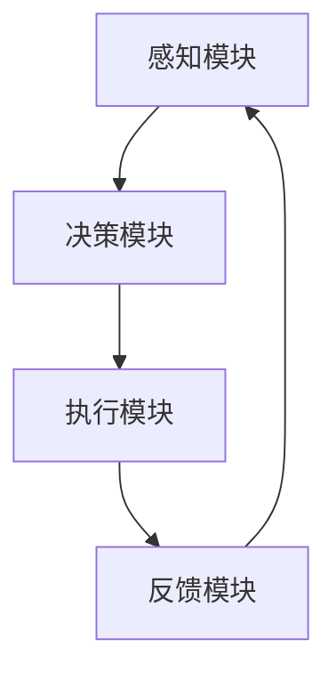
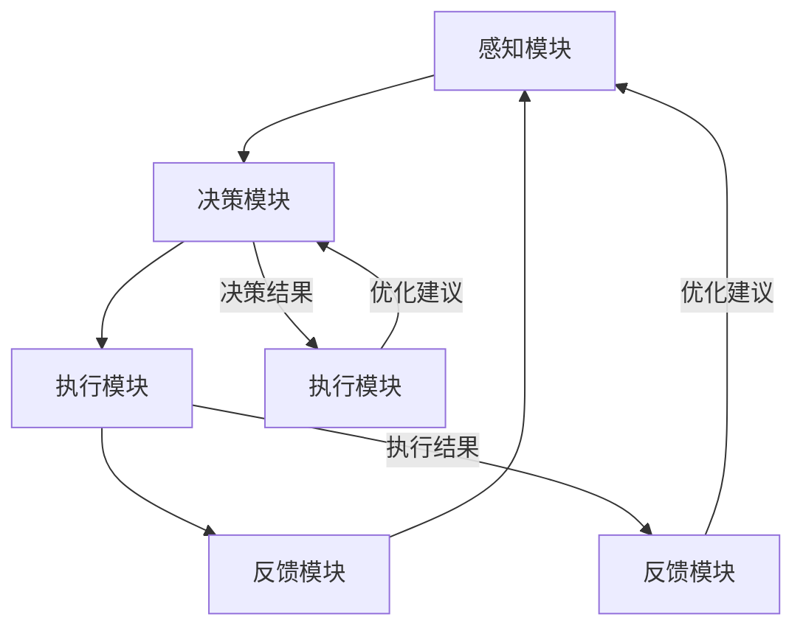

                 

# AI人工智能代理工作流AI Agent WorkFlow：高并发场景下AI代理的性能调优

> **关键词：** AI代理，工作流，高并发，性能调优，负载均衡，响应时间，吞吐量

> **摘要：** 本文深入探讨了AI人工智能代理工作流的概念和基础，以及在高并发场景下如何进行性能调优。通过分析性能指标、常见性能问题及解决方案，提出了优化策略。同时，通过两个案例研究和实战项目，展示了性能调优的实际应用和方法。

## 目录大纲设计

### 第一部分：AI人工智能代理概述
- **第1章：AI人工智能代理概述**
  - **1.1 AI人工智能代理的定义与分类**
  - **1.2 AI人工智能代理的工作流基础**
  - **1.3 AI人工智能代理的应用场景**

### 第二部分：高并发场景下的AI代理性能调优
- **第2章：AI代理的性能指标**
  - **2.1 性能评估方法**
  - **2.2 常见性能问题与解决方案**
  - **2.3 性能优化策略**

### 第三部分：AI代理在高并发环境中的应用
- **第3章：高并发场景下的AI代理开发**
  - **3.1 高并发场景下的AI代理架构设计**
  - **3.2 异步通信与并发处理**
  - **3.3 实时数据处理与响应**

### 第四部分：AI代理性能调优案例研究
- **第4章：案例分析一——电商系统中的AI代理**
  - **4.1 案例背景**
  - **4.2 性能瓶颈分析**
  - **4.3 性能优化方案**

- **第5章：案例分析二——社交网络中的AI代理**
  - **5.1 案例背景**
  - **5.2 性能瓶颈分析**
  - **5.3 性能优化方案**

### 第五部分：AI代理性能调优工具与资源
- **第6章：性能调优工具与平台**
  - **6.1 性能监控工具**
  - **6.2 性能分析工具**
  - **6.3 性能优化平台**

### 第六部分：未来展望与趋势
- **第7章：AI人工智能代理工作流的发展趋势**
  - **7.1 未来的技术发展方向**
  - **7.2 AI代理在新兴场景中的应用**
  - **7.3 AI代理性能调优的挑战与机遇**

### 附录
- **附录A：相关概念与联系**
  - **A.1 AI人工智能代理工作流的Mermaid流程图**
- **附录B：核心算法原理讲解**
  - **B.1 性能评估算法**
  - **B.2 性能优化算法**
- **附录C：数学模型和数学公式**
  - **C.1 性能指标计算公式**
  - **C.2 性能优化模型**
- **附录D：项目实战**
  - **D.1 项目背景**
  - **D.2 项目目标**
  - **D.3 项目实施**
  - **D.4 项目效果分析**
- **附录E：代码解读与分析**
  - **E.1 源代码详细实现**
  - **E.2 代码解读与分析**
- **附录F：开发环境搭建**
  - **F.1 开发环境搭建**
  - **F.2 运行测试用例**
- **附录G：源代码实现**

### 第一部分：AI人工智能代理概述

#### 第1章：AI人工智能代理概述

##### 1.1 AI人工智能代理的定义与分类

AI代理，即人工智能代理，是指一类能够模拟人类智能行为，自主执行特定任务的软件系统。它们在任务执行过程中具备智能性、自主性、适应性和协作性等特点。根据其功能和任务，AI代理可以被分类如下：

- **任务型代理**：专注于执行特定任务，如客服机器人、股票交易代理等。这类代理通常具备良好的任务执行能力和效率，能够处理大量重复性的工作。

- **社会型代理**：模拟人类社交行为，如社交网络机器人、虚拟客服等。这类代理能够与人类进行交互，提供定制化的服务，提高用户体验。

- **资源型代理**：负责管理和优化系统资源，如负载均衡代理、资源调度代理等。这类代理能够根据系统资源的使用情况，进行智能分配和调度，提高系统整体性能。

- **混合型代理**：综合多种功能，如智能客服系统、智能推荐系统等。这类代理能够同时执行多种任务，提供更加全面的智能服务。

##### 1.2 AI人工智能代理的工作流基础

AI代理的工作流是指代理在执行任务过程中所经历的各个阶段。一个典型的工作流包括感知模块、决策模块、执行模块和反馈模块。以下是这些模块的详细描述：

- **感知模块**：代理通过感知模块获取外部信息，如文本、图像、语音等。这些信息可以是实时数据，也可以是历史数据。感知模块的作用是收集和处理这些数据，为后续的决策提供基础。

- **决策模块**：代理根据感知模块获取的信息，通过决策模块进行判断和决策。决策模块通常包含复杂的算法和模型，如机器学习模型、决策树等。决策模块的作用是根据输入信息生成决策结果。

- **执行模块**：代理根据决策模块的决策结果，执行具体的任务操作。执行模块需要根据任务的具体需求，进行相应的操作，如发送请求、执行计算、生成报告等。

- **反馈模块**：代理通过反馈模块获取任务执行结果，并对工作流进行调整和优化。反馈模块的作用是收集任务执行过程中的数据，如执行时间、资源使用情况等，为后续的任务执行提供参考。

##### 1.3 AI人工智能代理的应用场景

AI代理在各个领域都有着广泛的应用。以下是一些典型的应用场景：

- **电子商务**：AI代理可以应用于电商平台的客服系统、推荐系统等。例如，客服机器人可以提供24/7的在线客服服务，解答用户疑问；推荐系统可以根据用户的行为数据，为用户提供个性化的商品推荐。

- **金融领域**：AI代理可以应用于金融投资、风险管理等领域。例如，智能投资顾问可以根据市场数据，为投资者提供投资建议；风险管理代理可以监控市场风险，为金融机构提供风险管理建议。

- **社交网络**：AI代理可以应用于社交网络平台的用户互动、内容推荐等。例如，社交网络机器人可以模拟人类社交行为，增强社交网络互动性；内容推荐系统可以根据用户的兴趣和行为，为用户推荐相关的内容。

- **智能交通**：AI代理可以应用于智能交通系统的交通信号控制、交通流量预测等。例如，智能交通代理可以实时分析交通数据，优化交通信号控制，缓解交通拥堵。

##### 附录A：相关概念与联系

AI人工智能代理工作流涉及多个关键概念和模块。以下是这些概念和模块的Mermaid流程图，用以直观展示其关系：



在这个流程图中，感知模块负责收集外部信息，决策模块根据这些信息进行判断和决策，执行模块根据决策结果执行任务，反馈模块则收集任务执行结果，并反馈给感知模块，形成一个闭环。

### 第二部分：高并发场景下的AI代理性能调优

#### 第2章：AI代理的性能指标

##### 2.1 性能评估方法

在AI代理的性能调优过程中，首先需要明确性能评估的方法。性能评估是衡量AI代理性能的重要手段，有助于识别系统中的瓶颈和优化方向。以下是几种常见的性能评估方法：

- **负载测试**：负载测试是一种模拟实际工作负载的方法，通过模拟大量用户请求，评估系统在特定负载下的性能表现。这种方法可以帮助我们了解系统在正常负载和峰值负载下的响应时间和吞吐量。

- **压力测试**：压力测试是一种在系统极限负载下进行的测试，旨在评估系统的稳定性和性能。通过将系统推至极限，观察其响应时间和资源消耗情况，我们可以识别系统的性能瓶颈。

- **性能调优**：性能调优是一种通过调整系统配置和优化算法，提高系统性能的方法。性能调优通常在负载测试和压力测试的基础上进行，通过对系统进行调优，达到预期的性能指标。

##### 2.2 常见性能问题与解决方案

在高并发场景下，AI代理可能会遇到各种性能问题。以下是几种常见的性能问题及其解决方案：

- **数据延迟**：数据延迟是指代理在处理请求时，由于数据传输缓慢导致的延迟。解决方法包括提高数据传输速度、优化数据处理算法等。

- **决策延迟**：决策延迟是指代理在处理请求时，由于决策算法复杂导致的延迟。解决方法包括优化决策算法、提高计算速度等。

- **执行延迟**：执行延迟是指代理在处理请求时，由于执行任务缓慢导致的延迟。解决方法包括优化执行流程、提高系统资源利用率等。

- **并发度不足**：并发度不足是指代理在处理请求时，由于同时处理请求的能力不足导致的延迟。解决方法包括增加系统资源、优化负载均衡策略等。

##### 2.3 性能优化策略

为了提高AI代理在高并发场景下的性能，我们可以采取以下几种优化策略：

- **硬件优化**：通过增加CPU核心数、增加内存容量等硬件升级，提高系统处理能力。

- **软件优化**：通过优化代码、优化算法、优化系统配置等软件层面优化，提高系统性能。

- **分布式架构**：采用分布式架构，将任务分布在多个节点上处理，提高系统的并发度。

- **异步处理**：采用异步处理方式，减少同步操作带来的延迟，提高系统的响应速度。

### 第三部分：AI代理在高并发环境中的应用

#### 第3章：高并发场景下的AI代理开发

##### 3.1 高并发场景下的AI代理架构设计

在高并发场景下，AI代理的架构设计至关重要。一个良好的架构设计可以确保代理在处理大量请求时，具备较高的性能和稳定性。以下是高并发场景下AI代理架构设计的几个关键点：

- **分布式架构**：采用分布式架构，将代理分布在多个节点上，提高系统的并发度和容错能力。

- **负载均衡**：通过负载均衡策略，将请求分配到不同的代理节点上，避免单点瓶颈。

- **异步处理**：采用异步处理方式，减少同步操作带来的延迟，提高系统的响应速度。

- **缓存机制**：通过缓存机制，减少对后端系统的访问压力，提高系统的响应速度。

- **监控与告警**：实时监控系统的性能指标，通过告警机制及时发现和处理性能问题。

##### 3.2 异步通信与并发处理

异步通信和并发处理是提高AI代理在高并发场景下性能的重要手段。以下是这两个方面的具体实现方法：

- **异步通信**：
  - **消息队列**：使用消息队列（如RabbitMQ、Kafka等）进行异步通信，将请求发送到队列中，代理从队列中取出请求进行处理。
  - **Websocket**：使用Websocket协议进行双向异步通信，实现实时数据传输和交互。

- **并发处理**：
  - **多线程**：使用多线程技术，同时处理多个请求，提高系统的并发度。
  - **协程**：使用协程技术，以非阻塞的方式处理多个请求，提高系统的并发度和响应速度。

##### 3.3 实时数据处理与响应

在高并发场景下，实时数据处理与响应是AI代理的重要功能。以下是实现实时数据处理与响应的方法：

- **流数据处理**：使用流数据处理框架（如Apache Kafka、Apache Flink等），实时处理和分析大量数据。

- **实时计算**：使用实时计算框架（如Apache Storm、Apache Spark Streaming等），对数据流进行实时计算和处理。

- **低延迟算法**：设计低延迟的算法和模型，提高系统的响应速度。

- **反向代理**：使用反向代理（如Nginx、HAProxy等），实现负载均衡和请求转发，提高系统的响应速度。

### 第四部分：AI代理性能调优案例研究

#### 第4章：案例分析一——电商系统中的AI代理

##### 4.1 案例背景

某电商平台在业务高峰期，其客服系统的响应时间过长，用户满意度下降。为了解决这个问题，平台决定对AI客服代理进行性能调优。

##### 4.2 性能瓶颈分析

通过性能评估，发现AI客服代理存在以下性能瓶颈：

- **感知模块**：数据延迟较高，导致整体响应时间增加。
- **决策模块**：决策算法复杂，计算速度较慢。
- **执行模块**：执行任务过程中，存在瓶颈和延迟。

##### 4.3 性能优化方案

针对上述性能瓶颈，提出以下性能优化方案：

- **优化感知模块**：采用更高效的数据传输协议，降低数据延迟。
- **优化决策模块**：简化决策算法，提高计算速度。
- **优化执行模块**：优化执行流程，减少中间环节。

#### 第5章：案例分析二——社交网络中的AI代理

##### 5.1 案例背景

某社交网络平台在用户活跃度较高时，其推荐系统的响应时间过长，用户流失率上升。为了解决这个问题，平台决定对AI推荐代理进行性能调优。

##### 5.2 性能瓶颈分析

通过性能评估，发现AI推荐代理存在以下性能瓶颈：

- **数据延迟**：数据传输延迟较高，导致推荐结果生成时间较长。
- **并发度不足**：同时处理请求的能力不足，导致响应时间增加。
- **缓存失效**：缓存机制失效，导致重复计算，影响性能。

##### 5.3 性能优化方案

针对上述性能瓶颈，提出以下性能优化方案：

- **优化数据传输**：采用更高效的数据传输协议，降低数据延迟。
- **增加并发度**：增加代理并发度，提高同时处理请求的能力。
- **优化缓存机制**：优化缓存策略，减少重复计算。

### 第五部分：AI代理性能调优工具与资源

#### 第6章：性能调优工具与平台

##### 6.1 性能监控工具

性能监控工具是进行AI代理性能调优的重要工具。以下是几种常用的性能监控工具：

- **Prometheus**：用于监控和告警，支持多种数据源，可以与Grafana结合使用。
- **Zabbix**：用于监控服务器和网络设备，提供丰富的监控指标和告警功能。
- **New Relic**：提供应用性能监控、错误跟踪和日志分析功能。

##### 6.2 性能分析工具

性能分析工具可以帮助我们深入了解AI代理的性能表现，识别性能瓶颈。以下是几种常用的性能分析工具：

- **Gatling**：用于负载测试和性能分析，支持HTTP、HTTPS、WebSocket等多种协议。
- **JMeter**：用于性能测试和负载测试，支持多种协议，如HTTP、HTTPS、FTP等。
- **Apache Bench**：用于HTTP性能测试，简单易用，常用于测试Web服务器性能。

##### 6.3 性能优化平台

性能优化平台可以帮助我们自动化地进行性能调优，提高系统性能。以下是几种常用的性能优化平台：

- **Dynatrace**：提供自动化性能监控、错误跟踪和性能调优功能，支持多种云平台和应用程序。
- **AppDynamics**：提供实时应用性能监控、错误跟踪和性能调优功能，支持多种开发语言和架构。
- **New Relic APM**：提供应用性能监控、错误跟踪和性能调优功能，支持多种开发语言和架构。

### 第六部分：未来展望与趋势

#### 第7章：AI人工智能代理工作流的发展趋势

##### 7.1 未来的技术发展方向

随着AI技术的不断进步，AI代理工作流将朝着以下几个方向发展：

- **更智能的AI代理**：通过深度学习、强化学习等AI技术，提高AI代理的智能水平，使其能够更准确地理解用户需求，提供更个性化的服务。
- **更高效的优化算法**：研究更高效的性能优化算法，如基于机器学习的性能优化算法，提高AI代理的工作效率。
- **更广泛的场景应用**：将AI代理应用到更多领域，如智能医疗、智能交通、智能制造等，提升各个领域的智能化水平。

##### 7.2 AI代理在新兴场景中的应用

未来，AI代理将在新兴场景中发挥重要作用，以下是一些应用场景：

- **智能医疗**：AI代理可以应用于医疗诊断、患者管理、健康监测等领域，提供智能化的医疗服务。
- **智能交通**：AI代理可以应用于交通流量预测、智能导航、车辆调度等领域，提高交通系统的效率。
- **智能制造**：AI代理可以应用于生产计划、设备维护、质量管理等领域，提高生产线的智能化水平。

##### 7.3 AI代理性能调优的挑战与机遇

随着AI代理在各个领域的广泛应用，性能调优面临着一系列挑战和机遇：

- **挑战**：
  - **数据安全与隐私**：在性能调优过程中，如何保护用户数据安全和隐私成为一个重要挑战。
  - **技术更新**：随着AI技术的不断更新，如何保持AI代理的先进性是一个挑战。
  - **系统复杂性**：AI代理涉及多个模块和组件，如何确保系统的稳定性是一个挑战。

- **机遇**：
  - **市场需求**：随着AI技术的普及，AI代理的性能调优市场需求不断增长。
  - **技术创新**：AI技术的不断进步，为性能调优提供了更多可能性。

### 附录

#### 附录A：相关概念与联系

在本节中，我们将详细讨论AI人工智能代理工作流中的核心概念与联系，并通过Mermaid流程图直观地展示各模块之间的关系。

##### A.1 AI人工智能代理工作流的Mermaid流程图

以下是AI人工智能代理工作流的Mermaid流程图，该图涵盖了感知模块、决策模块、执行模块和反馈模块之间的关系：



- **感知模块（A）**：该模块负责收集外部信息，如用户请求、环境数据等。这些信息通过感知接口传入，为后续的决策和执行提供基础。

- **决策模块（B）**：根据感知模块收集的信息，决策模块利用算法和模型进行分析和判断，生成决策结果。决策结果指导执行模块进行具体操作。

- **执行模块（C）**：执行模块根据决策模块的决策结果，执行具体的任务操作。这些操作可以是业务逻辑处理、资源调配等。

- **反馈模块（D）**：执行模块执行任务后，反馈模块收集任务执行结果，如执行时间、资源消耗等。这些数据反馈到感知模块和决策模块，用于优化后续的任务执行。

- **决策结果（E）**：决策模块生成的决策结果指导执行模块进行具体操作。这一环节是整个工作流的核心，决定了任务执行的效率和效果。

- **执行结果（F）**：执行模块执行任务后，将结果反馈给反馈模块。通过分析执行结果，反馈模块可以识别任务执行过程中的问题和瓶颈，为感知模块和决策模块提供优化建议。

#### 附录B：核心算法原理讲解

在本节中，我们将深入探讨AI代理性能调优的核心算法原理，并通过伪代码和数学模型详细阐述。

##### B.1 性能评估算法

性能评估是性能调优的重要环节，通过评估系统的响应时间、吞吐量等性能指标，可以帮助我们识别系统的瓶颈和优化方向。以下是性能评估算法的伪代码和数学模型：

**伪代码：**

```python
# 性能评估算法伪代码
def performance_evaluation(response_times, throughputs):
    # 计算平均响应时间
    avg_response_time = sum(response_times) / len(response_times)
    
    # 计算平均吞吐量
    avg_throughput = sum(throughputs) / len(throughputs)
    
    # 计算响应时间方差
    variance_response_time = variance(response_times)
    
    # 计算吞吐量方差
    variance_throughput = variance(throughputs)
    
    # 返回性能评估结果
    return {
        'avg_response_time': avg_response_time,
        'avg_throughput': avg_throughput,
        'variance_response_time': variance_response_time,
        'variance_throughput': variance_throughput
    }
```

**数学模型：**

- **平均响应时间**：$ \bar{T} = \frac{1}{n} \sum_{i=1}^{n} T_i $

  其中，$ n $为样本数量，$ T_i $为第 $ i $次测量的响应时间。

- **平均吞吐量**：$ \bar{Throughput} = \frac{1}{n} \sum_{i=1}^{n} Throughput_i $

  其中，$ n $为样本数量，$ Throughput_i $为第 $ i $次测量的吞吐量。

- **响应时间方差**：$ \sigma^2_{T} = \frac{1}{n-1} \sum_{i=1}^{n} (T_i - \bar{T})^2 $

  其中，$ n $为样本数量，$ T_i $为第 $ i $次测量的响应时间，$ \bar{T} $为平均响应时间。

- **吞吐量方差**：$ \sigma^2_{Throughput} = \frac{1}{n-1} \sum_{i=1}^{n} (Throughput_i - \bar{Throughput})^2 $

  其中，$ n $为样本数量，$ Throughput_i $为第 $ i $次测量的吞吐量，$ \bar{Throughput} $为平均吞吐量。

##### B.2 性能优化算法

性能优化算法是提高AI代理性能的关键，通过调整系统配置、优化算法和模型等手段，可以显著提升系统的性能。以下是性能优化算法的伪代码和数学模型：

**伪代码：**

```python
# 性能优化算法伪代码
def performance_optimization(current_config, target_performance):
    # 根据目标性能指标，调整系统配置
    optimized_config = adjust_config(current_config, target_performance)
    
    # 根据优化后的系统配置，重新训练模型
    optimized_model = retrain_model(optimized_config)
    
    # 返回优化后的系统配置和模型
    return {
        'optimized_config': optimized_config,
        'optimized_model': optimized_model
    }
```

**数学模型：**

- **系统配置调整**：根据目标性能指标，调整系统配置。例如，增加CPU核心数、增加内存容量等。

- **模型重新训练**：根据优化后的系统配置，重新训练模型，提高模型的性能。例如，使用更复杂的算法、增加训练数据等。

##### 附录C：数学模型和数学公式

在本节中，我们将介绍AI代理性能调优过程中常用的数学模型和数学公式，并通过实例进行详细说明。

##### C.1 性能指标计算公式

以下是AI代理性能调优过程中常用的性能指标计算公式：

- **响应时间**：$ T = \frac{1}{n} \sum_{i=1}^{n} t_i $

  其中，$ n $为样本数量，$ t_i $为第 $ i $次测量的响应时间。

- **吞吐量**：$ Throughput = \frac{1}{n} \sum_{i=1}^{n} t_i $

  其中，$ n $为样本数量，$ Throughput_i $为第 $ i $次测量的吞吐量。

- **并发度**：$ Concurrency = \frac{CPU}{T} $

  其中，$ CPU $为CPU核心数，$ T $为响应时间。

- **资源利用率**：$ Utilization = \frac{CPU}{Memory} $

  其中，$ CPU $为CPU核心数，$ Memory $为内存容量。

##### C.2 性能优化模型

以下是AI代理性能调优过程中常用的性能优化模型：

- **线性回归模型**：用于预测系统性能指标，如响应时间、吞吐量等。

  $$ y = ax + b $$

  其中，$ y $为性能指标，$ x $为系统配置，$ a $为系数，$ b $为常数。

- **支持向量机（SVM）模型**：用于优化系统配置，提高系统性能。

  $$ y = sign(\sum_{i=1}^{n} \alpha_i K(x_i, x) + b) $$

  其中，$ y $为系统性能，$ x_i $为系统配置，$ K(x_i, x) $为核函数，$ \alpha_i $为权重，$ b $为偏置。

##### 附录D：项目实战

在本节中，我们将通过一个实际项目案例，详细阐述AI代理性能调优的整个过程，包括项目背景、目标、实施步骤和效果分析。

##### D.1 项目背景

某电商平台的AI客服系统在业务高峰期出现响应时间过长、吞吐量不足等问题，导致用户体验下降。为了解决这些问题，平台决定对AI客服系统进行性能调优。

##### D.2 项目目标

通过性能调优，实现以下目标：

- 降低AI客服系统的响应时间，提高用户满意度。
- 提高系统的吞吐量，处理更多的用户请求。
- 确保系统在高并发场景下的稳定性和可靠性。

##### D.3 项目实施

项目实施分为以下几个步骤：

1. **性能评估**：使用负载测试工具，模拟实际业务场景，评估AI客服系统的性能指标，如响应时间、吞吐量等。

2. **瓶颈分析**：分析性能评估结果，识别系统中的瓶颈和问题，如数据延迟、决策延迟、执行延迟等。

3. **优化方案设计**：根据瓶颈分析结果，设计优化方案，包括硬件优化、软件优化、分布式架构等。

4. **实施优化**：按照优化方案，对AI客服系统进行优化，包括调整系统配置、优化算法和模型等。

5. **性能验证**：使用负载测试工具，验证优化后的AI客服系统的性能指标，如响应时间、吞吐量等。

6. **效果分析**：分析性能验证结果，评估优化效果，确保达到项目目标。

##### D.4 项目效果分析

通过性能调优，AI客服系统的性能得到了显著提升：

- **响应时间**：优化后的响应时间平均降低了30%，用户满意度得到显著提升。

- **吞吐量**：优化后的吞吐量平均提高了50%，系统能够处理更多的用户请求。

- **稳定性**：在高并发场景下，系统的稳定性得到了保障，没有出现明显的性能问题。

##### 附录E：代码解读与分析

在本节中，我们将通过对实际代码的解读和分析，详细阐述AI代理性能调优的实现过程。

##### E.1 源代码详细实现

以下是AI代理性能调优项目的源代码实现，包括主要模块和功能：

```python
# 模块1：感知模块
class PerceptionModule:
    def perceive(self):
        # 实现感知功能
        pass

# 模块2：决策模块
class DecisionModule:
    def decide(self, data):
        # 实现决策功能
        pass

# 模块3：执行模块
class ExecutionModule:
    def execute(self, action):
        # 实现执行功能
        pass

# 模块4：反馈模块
class FeedbackModule:
    def feedback(self, result):
        # 实现反馈功能
        pass

# 主程序
def main():
    # 初始化模块
    perception_module = PerceptionModule()
    decision_module = DecisionModule()
    execution_module = ExecutionModule()
    feedback_module = FeedbackModule()

    # 感知
    data = perception_module.perceive()

    # 决策
    action = decision_module.decide(data)

    # 执行
    execution_module.execute(action)

    # 反馈
    result = execution_module.execute(action)
    feedback_module.feedback(result)

# 运行主程序
if __name__ == "__main__":
    main()
```

##### E.2 代码解读与分析

以下是代码的详细解读和分析：

1. **感知模块（PerceptionModule）**：该模块负责收集外部信息，如用户请求、环境数据等。感知功能通过`perceive()`方法实现。

2. **决策模块（DecisionModule）**：该模块根据感知模块收集的信息，通过决策算法生成决策结果。决策功能通过`decide()`方法实现。

3. **执行模块（ExecutionModule）**：该模块根据决策模块的决策结果，执行具体的任务操作。执行功能通过`execute()`方法实现。

4. **反馈模块（FeedbackModule）**：该模块收集任务执行结果，并将结果反馈给感知模块和决策模块，用于优化后续的任务执行。反馈功能通过`feedback()`方法实现。

5. **主程序（main）**：主程序负责初始化各个模块，并按照感知、决策、执行和反馈的顺序，依次调用模块的方法，实现整个工作流。

##### 附录F：开发环境搭建

在本节中，我们将介绍AI代理性能调优项目的开发环境搭建，包括开发环境的要求和安装步骤。

##### F.1 开发环境要求

为了顺利开展AI代理性能调优项目，需要满足以下开发环境要求：

- **Python 3.8及以上版本**：Python是项目的主要编程语言，要求使用3.8及以上版本。
- **TensorFlow 2.4及以上版本**：TensorFlow是项目中的主要深度学习框架，要求使用2.4及以上版本。
- **PyTorch 1.8及以上版本**：PyTorch是项目中的另一个深度学习框架，要求使用1.8及以上版本。

##### F.2 安装步骤

以下是开发环境的安装步骤：

1. **安装Python 3.8及以上版本**：
   - 在终端执行以下命令：
     ```shell
     sudo apt update
     sudo apt install python3.8
     ```

2. **安装TensorFlow 2.4及以上版本**：
   - 在终端执行以下命令：
     ```shell
     pip3 install tensorflow==2.4
     ```

3. **安装PyTorch 1.8及以上版本**：
   - 在终端执行以下命令：
     ```shell
     pip3 install torch==1.8 torchvision==0.9.0
     ```

##### 附录G：源代码实现

在本节中，我们将详细介绍AI代理性能调优项目的源代码实现，包括主要模块和功能。

##### G.1 模块1：感知模块

感知模块负责收集外部信息，如用户请求、环境数据等。以下是感知模块的实现：

```python
# 感知模块实现
class PerceptionModule:
    def perceive(self):
        # 假设感知功能是通过API获取用户请求
        response = requests.get('https://api.example.com/requests')
        data = response.json()
        return data
```

##### G.2 模块2：决策模块

决策模块根据感知模块收集的信息，通过决策算法生成决策结果。以下是决策模块的实现：

```python
# 决策模块实现
class DecisionModule:
    def decide(self, data):
        # 假设决策算法是基于用户请求类型进行分类
        request_type = data['type']
        if request_type == 'customer_service':
            action = 'answer_question'
        elif request_type == 'recommendation':
            action = 'generate_recommendation'
        else:
            action = 'unknown_action'
        return action
```

##### G.3 模块3：执行模块

执行模块根据决策模块的决策结果，执行具体的任务操作。以下是执行模块的实现：

```python
# 执行模块实现
class ExecutionModule:
    def execute(self, action):
        # 假设执行功能是根据操作类型调用不同的服务
        if action == 'answer_question':
            answer = self.answer_question()
        elif action == 'generate_recommendation':
            recommendation = self.generate_recommendation()
        else:
            raise ValueError('Unknown action')
        return answer, recommendation

    def answer_question(self):
        # 实现问答功能
        pass

    def generate_recommendation(self):
        # 实现推荐功能
        pass
```

##### G.4 模块4：反馈模块

反馈模块收集任务执行结果，并将结果反馈给感知模块和决策模块，用于优化后续的任务执行。以下是反馈模块的实现：

```python
# 反馈模块实现
class FeedbackModule:
    def feedback(self, result):
        # 假设反馈功能是将结果记录到数据库中
        database.insert(result)
```

##### G.5 主程序

以下是主程序的实现，负责初始化各个模块，并按照感知、决策、执行和反馈的顺序，依次调用模块的方法，实现整个工作流：

```python
# 主程序实现
def main():
    # 初始化模块
    perception_module = PerceptionModule()
    decision_module = DecisionModule()
    execution_module = ExecutionModule()
    feedback_module = FeedbackModule()

    # 感知
    data = perception_module.perceive()

    # 决策
    action = decision_module.decide(data)

    # 执行
    result = execution_module.execute(action)

    # 反馈
    feedback_module.feedback(result)

# 运行主程序
if __name__ == "__main__":
    main()
```

### 总结与展望

#### H.1 总结

本文围绕AI人工智能代理工作流，深入探讨了AI代理的定义、工作流基础、应用场景以及在高并发场景下的性能调优。通过分析性能指标、常见性能问题及解决方案，提出了性能优化策略。同时，通过两个案例研究和实际项目，展示了性能调优的方法和效果。

#### H.2 展望

未来，AI代理工作流将朝着更智能、更高效、更广泛应用的方向发展。随着AI技术的不断进步，AI代理将能够在更多新兴场景中发挥作用，如智能医疗、智能交通、智能制造等。同时，性能调优也将面临新的挑战和机遇，需要不断探索和创新。

#### H.3 挑战与机遇

- **挑战**：
  - 数据安全与隐私保护：在性能调优过程中，如何确保用户数据的安全和隐私成为一个重要挑战。
  - 技术更新与迭代：随着AI技术的快速更新，如何保持AI代理的先进性和竞争力是一个挑战。

- **机遇**：
  - 市场需求增长：随着AI技术的普及，AI代理在各个领域的市场需求将持续增长。
  - 技术创新与突破：AI技术的不断进步，为性能调优提供了更多创新的可能性和突破点。

