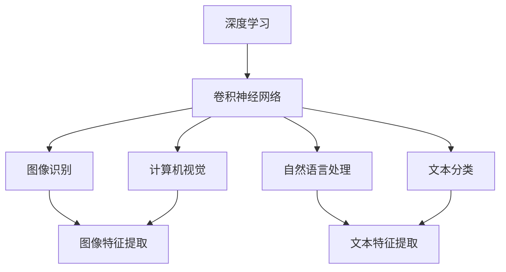
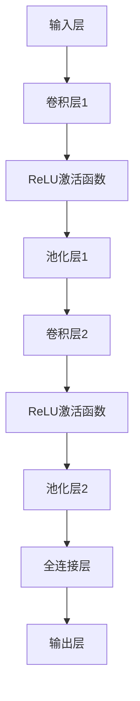

                 

# AI人工智能深度学习算法：卷积神经网络的原理与应用

## 关键词
AI、深度学习、卷积神经网络、图像识别、计算机视觉、自然语言处理、优化调参、项目实战

## 摘要
本文旨在深入探讨卷积神经网络（CNN）在AI领域的应用。首先，我们介绍了AI与深度学习的关系，并回顾了深度学习的基础知识。接着，详细解析了卷积神经网络的基本原理，包括卷积操作、池化操作和层次结构。随后，我们讨论了卷积神经网络在图像识别、计算机视觉和自然语言处理中的应用，并通过实际项目展示了CNN的应用实例。最后，我们对CNN的优化和调参方法进行了分析，并总结了文章的主要内容与未来研究方向。

### 目录

#### 第一部分：AI与深度学习基础

**第1章：AI与深度学习概述**

**第2章：深度学习基础**

**第3章：卷积神经网络原理**

#### 第二部分：卷积神经网络应用

**第4章：卷积神经网络在图像识别中的应用**

**第5章：卷积神经网络在计算机视觉中的应用**

**第6章：卷积神经网络在自然语言处理中的应用**

**第7章：深度学习框架与卷积神经网络**

**第8章：卷积神经网络的优化与调参**

#### 第三部分：卷积神经网络实战

**第9章：项目实战一：手写数字识别**

**第10章：项目实战二：图像分类**

**第11章：项目实战三：目标检测**

**第12章：项目实战四：文本分类**

**第13章：总结与展望**

#### 附录

**附录A：深度学习与卷积神经网络资源链接**

**附录B：卷积神经网络的Mermaid流程图**

**附录C：深度学习与卷积神经网络的数学模型与公式**

### 核心概念与联系

为了更好地理解卷积神经网络（CNN）的基本原理和应用，首先我们需要明确几个核心概念，并探讨它们之间的关系。以下是一个简化的 Mermaid 流程图，展示了这些核心概念及其相互联系。



在这个流程图中，深度学习是整个架构的根基，它包括了卷积神经网络（CNN）、图像识别、计算机视觉、自然语言处理和文本分类等众多领域。卷积神经网络（CNN）特别擅长于从数据中提取特征，这些特征广泛应用于图像识别、计算机视觉、自然语言处理和文本分类等任务中。具体来说：

- **深度学习（A）**：一种基于多层神经网络的学习方法，能够自动从数据中学习到复杂特征表示。
- **卷积神经网络（B）**：一种特殊的深度学习模型，用于从图像和其他数据中提取特征。
- **图像识别（C）** 和 **计算机视觉（D）**：卷积神经网络在图像和视频数据上的应用，包括物体检测、场景识别等。
- **自然语言处理（E）** 和 **文本分类（F）**：卷积神经网络在处理文本数据时的应用，如情感分析、文本分类等。

### 核心算法原理讲解

#### 卷积神经网络基本结构

卷积神经网络（CNN）的基本结构主要包括以下几个层次：

1. **输入层（Input Layer）**：接收输入数据，通常是图像或视频。
2. **卷积层（Convolutional Layer）**：通过卷积操作提取图像的特征。
3. **激活函数层（Activation Function Layer）**：常用的激活函数是ReLU函数。
4. **池化层（Pooling Layer）**：用于减小数据维度，降低过拟合的风险。
5. **全连接层（Fully Connected Layer）**：将卷积层和池化层提取的特征进行融合。
6. **输出层（Output Layer）**：输出分类结果或回归结果。

下面我们将详细解释卷积神经网络的每一个层次。

#### 卷积层

卷积层是CNN的核心部分，通过卷积操作提取图像特征。卷积操作的数学原理如下：

\[ \text{卷积操作} \: (f * g)(t) = \int_{-\infty}^{+\infty} f(\tau) g(t-\tau) d\tau \]

其中，\( f \) 和 \( g \) 是两个函数，\( * \) 表示卷积操作，\( t \) 是输入特征。

在CNN中，卷积操作通常由卷积核（或滤波器）实现。卷积核是一个小的矩阵，它从输入图像中滑动，每次滑过一个像素，并与卷积核内的像素值进行点积操作。这个过程可以理解为从图像中提取出特定形状的特征。

以下是一个简单的伪代码示例，展示了卷积操作的实现：

```python
def convolution(input_image, filter):
    output_image = []
    for y in range(height_of_input_image - height_of_filter + 1):
        row = []
        for x in range(width_of_input_image - width_of_filter + 1):
            feature_map = 0
            for fy in range(height_of_filter):
                for fx in range(width_of_filter):
                    feature_map += input_image[y + fy, x + fx] * filter[fy, fx]
            row.append(feature_map)
        output_image.append(row)
    return output_image
```

在这个伪代码中，`input_image` 是输入图像，`filter` 是卷积核。我们通过遍历输入图像的每个像素，并与卷积核内的像素值进行点积操作，来计算输出图像的每个像素值。

#### 激活函数层

激活函数层用于引入非线性特性。在CNN中，最常用的激活函数是ReLU函数，其数学表达式如下：

\[ f(x) = \max(0, x) \]

ReLU函数具有以下优点：

- **非负性**：ReLU函数的输出总是非负的，这有助于防止网络中的梯度消失问题。
- **稀疏性**：ReLU函数在 \( x < 0 \) 时输出为0，这导致网络在训练过程中只有少量的神经元激活，提高了计算效率。

以下是一个简单的伪代码示例，展示了ReLU激活函数的实现：

```python
def ReLU(x):
    return max(0, x)
```

在这个伪代码中，`x` 是输入值，函数返回 \( \max(0, x) \)。

#### 池化层

池化层用于减小数据维度，降低过拟合的风险。常见的池化方法包括最大池化和平均池化。

最大池化（Max Pooling）的数学原理如下：

\[ P(x) = \max(x_1, x_2, ..., x_n) \]

其中，\( P(x) \) 是池化结果，\( x_1, x_2, ..., x_n \) 是输入特征。

以下是一个简单的伪代码示例，展示了最大池化的实现：

```python
def max_pooling(input_image, pool_size):
    output_image = []
    for y in range(0, height_of_input_image, pool_size):
        row = []
        for x in range(0, width_of_input_image, pool_size):
            feature_map = 0
            for fy in range(pool_size):
                for fx in range(pool_size):
                    feature_map = max(feature_map, input_image[y + fy, x + fx])
            row.append(feature_map)
        output_image.append(row)
    return output_image
```

在这个伪代码中，`input_image` 是输入图像，`pool_size` 是池化窗口的大小。我们通过遍历输入图像的每个池化窗口，并取窗口内像素值的最大值，来计算输出图像的每个像素值。

平均池化（Average Pooling）的数学原理如下：

\[ P(x) = \frac{1}{n} \sum_{i=1}^{n} x_i \]

其中，\( P(x) \) 是池化结果，\( x_1, x_2, ..., x_n \) 是输入特征。

以下是一个简单的伪代码示例，展示了平均池化的实现：

```python
def average_pooling(input_image, pool_size):
    output_image = []
    for y in range(0, height_of_input_image, pool_size):
        row = []
        for x in range(0, width_of_input_image, pool_size):
            feature_map = 0
            for fy in range(pool_size):
                for fx in range(pool_size):
                    feature_map += input_image[y + fy, x + fx]
            feature_map /= (pool_size * pool_size)
            row.append(feature_map)
        output_image.append(row)
    return output_image
```

在这个伪代码中，`input_image` 是输入图像，`pool_size` 是池化窗口的大小。我们通过遍历输入图像的每个池化窗口，并计算窗口内像素值的平均值，来计算输出图像的每个像素值。

#### 全连接层

全连接层用于将卷积层和池化层提取的特征进行融合，并输出分类结果或回归结果。全连接层的工作原理类似于传统的多层感知机（MLP），每个神经元都与上一层的所有神经元相连。

以下是一个简单的伪代码示例，展示了全连接层的实现：

```python
def fully_connected(input_features, weights, biases):
    output = []
    for neuron in range(number_of_neurons):
        sum = 0
        for feature in input_features:
            sum += feature * weights[neuron][feature]
        sum += biases[neuron]
        output.append(activation_function(sum))
    return output
```

在这个伪代码中，`input_features` 是输入特征，`weights` 和 `biases` 分别是权重和偏置，`activation_function` 是激活函数，`output` 是输出结果。

#### 输出层

输出层用于输出分类结果或回归结果。在分类任务中，输出层通常是一个 Softmax 函数，用于将神经元的输出转换为概率分布。在回归任务中，输出层通常是一个线性函数，用于直接输出预测值。

以下是一个简单的伪代码示例，展示了输出层的实现：

```python
def softmax(output):
    exp_output = [math.exp(o) for o in output]
    sum_exp_output = sum(exp_output)
    return [o / sum_exp_output for o in exp_output]
```

在这个伪代码中，`output` 是神经元的输出，`softmax` 函数将输出转换为概率分布。

#### 伪代码示例

以下是一个简单的卷积神经网络的伪代码示例，展示了从输入层到输出层的整个前向传播过程：

```python
def forward_pass(input_image, model):
    # 初始化模型参数
    weights, biases = model.initialize_parameters()
    
    # 输入层到卷积层
    conv_output = convolution(input_image, model.convolutional_layer[0].filter)
    conv_output = activation_function(conv_output)
    
    # 卷积层到池化层
    pooled_output = max_pooling(conv_output, model.pool_size)
    
    # 池化层到全连接层
    flattened_output = flatten(pooled_output)
    fully_connected_output = fully_connected(flattened_output, model.fully_connected_layer.weights, model.fully_connected_layer.biases)
    
    # 全连接层到输出层
    output = softmax(fully_connected_output)
    
    return output
```

在这个伪代码中，`input_image` 是输入图像，`model` 是卷积神经网络模型，`forward_pass` 函数执行从输入层到输出层的整个前向传播过程，并返回最终输出。

#### 数学模型和数学公式

在卷积神经网络中，数学模型和公式是理解和实现关键组成部分。以下是我们将详细讨论的几个核心数学模型和公式。

##### 激活函数

激活函数是神经网络中的一个关键组件，它引入了非线性特性。在CNN中，最常用的激活函数是ReLU（Rectified Linear Unit）函数。ReLU函数的定义如下：

\[ \text{ReLU}(x) = \max(0, x) \]

ReLU函数具有以下优点：

- **简单性**：ReLU函数是一个简单的分段线性函数。
- **非负性**：ReLU函数的输出总是非负的，这有助于防止网络中的梯度消失问题。
- **稀疏性**：ReLU函数在输入小于零时输出为零，这导致网络在训练过程中只有少量的神经元激活，提高了计算效率。

##### 前向传播

前向传播是神经网络中的一个关键过程，它用于计算模型的输出。在CNN中，前向传播包括多个卷积层、池化层和全连接层。以下是前向传播的数学模型：

\[ z^{(l)} = \sum_{k=1}^{K} w^{(l)}_{ik} * g^{(l-1)}_k + b^{(l)}_i \]
\[ a^{(l)}_i = \text{ReLU}(z^{(l)}_i) \]

其中：

- \( z^{(l)} \) 是第 \( l \) 层的激活值。
- \( a^{(l)} \) 是第 \( l \) 层的输出。
- \( w^{(l)} \) 是第 \( l \) 层的权重。
- \( g^{(l-1)} \) 是第 \( l-1 \) 层的激活值。
- \( b^{(l)} \) 是第 \( l \) 层的偏置。

在前向传播中，每个神经元都通过卷积操作和偏置项与前一层的每个神经元相连。ReLU函数用于引入非线性特性。

##### 反向传播

反向传播是神经网络中的另一个关键过程，它用于计算模型的梯度。在CNN中，反向传播用于更新权重和偏置。以下是反向传播的数学模型：

\[ \delta^{(l)}_i = (a^{(l)}_i - y_i) \odot \text{ReLU}'(z^{(l)}_i) \]
\[ \delta^{(l-1)}_{ik} = \delta^{(l)}_{ik} * w^{(l)}_{ik} \]

其中：

- \( \delta^{(l)} \) 是第 \( l \) 层的误差。
- \( y_i \) 是第 \( l \) 层的期望输出。
- \( \odot \) 表示元素-wise 乘法。
- \( \text{ReLU}'(z^{(l)}_i) \) 是ReLU函数的导数。

反向传播的步骤如下：

1. **计算输出层的误差**：输出层的误差是期望输出和实际输出之间的差值。
2. **计算隐藏层的误差**：通过误差反向传播，计算隐藏层的误差。
3. **更新权重和偏置**：根据误差计算梯度，并使用优化算法（如梯度下降）更新权重和偏置。

##### 卷积操作

卷积操作是CNN中的核心组件，它用于从输入数据中提取特征。卷积操作的数学模型如下：

\[ (f * g)(t) = \int_{-\infty}^{+\infty} f(\tau) g(t-\tau) d\tau \]

其中：

- \( f \) 和 \( g \) 是两个函数。
- \( * \) 表示卷积操作。
- \( t \) 是输入特征。

在CNN中，卷积操作通常由卷积核（或滤波器）实现。卷积核是一个小的矩阵，它从输入数据中滑动，每次滑过一个像素，并与卷积核内的像素值进行点积操作。这个过程可以理解为从输入数据中提取出特定形状的特征。

以下是一个简单的伪代码示例，展示了卷积操作的计算：

```python
def convolution(input_data, filter):
    output_data = []
    for y in range(height_of_input_data - height_of_filter + 1):
        row = []
        for x in range(width_of_input_data - width_of_filter + 1):
            feature_map = 0
            for fy in range(height_of_filter):
                for fx in range(width_of_filter):
                    feature_map += input_data[y + fy, x + fx] * filter[fy, fx]
            row.append(feature_map)
        output_data.append(row)
    return output_data
```

在这个伪代码中，`input_data` 是输入数据，`filter` 是卷积核。我们通过遍历输入数据的每个像素，并与卷积核内的像素值进行点积操作，来计算输出数据的每个像素值。

##### 池化操作

池化操作是CNN中的另一个重要组件，它用于减小数据维度，降低过拟合的风险。常见的池化方法包括最大池化和平均池化。

最大池化的数学模型如下：

\[ P(x) = \max(x_1, x_2, ..., x_n) \]

其中：

- \( P(x) \) 是池化结果。
- \( x_1, x_2, ..., x_n \) 是输入特征。

以下是一个简单的伪代码示例，展示了最大池化的计算：

```python
def max_pooling(input_data, pool_size):
    output_data = []
    for y in range(0, height_of_input_data, pool_size):
        row = []
        for x in range(0, width_of_input_data, pool_size):
            feature_map = 0
            for fy in range(pool_size):
                for fx in range(pool_size):
                    feature_map = max(feature_map, input_data[y + fy, x + fx])
            row.append(feature_map)
        output_data.append(row)
    return output_data
```

在这个伪代码中，`input_data` 是输入数据，`pool_size` 是池化窗口的大小。我们通过遍历输入数据的每个池化窗口，并取窗口内像素值的最大值，来计算输出数据的每个像素值。

平均池化的数学模型如下：

\[ P(x) = \frac{1}{n} \sum_{i=1}^{n} x_i \]

其中：

- \( P(x) \) 是池化结果。
- \( x_1, x_2, ..., x_n \) 是输入特征。

以下是一个简单的伪代码示例，展示了平均池化的计算：

```python
def average_pooling(input_data, pool_size):
    output_data = []
    for y in range(0, height_of_input_data, pool_size):
        row = []
        for x in range(0, width_of_input_data, pool_size):
            feature_map = 0
            for fy in range(pool_size):
                for fx in range(pool_size):
                    feature_map += input_data[y + fy, x + fx]
            feature_map /= (pool_size * pool_size)
            row.append(feature_map)
        output_data.append(row)
    return output_data
```

在这个伪代码中，`input_data` 是输入数据，`pool_size` 是池化窗口的大小。我们通过遍历输入数据的每个池化窗口，并计算窗口内像素值的平均值，来计算输出数据的每个像素值。

### 举例说明

为了更好地理解卷积神经网络的基本原理和应用，以下我们通过一个简单的例子来说明。

#### 举例说明：手写数字识别

手写数字识别（Handwritten Digit Recognition）是卷积神经网络的一个经典应用。在这个例子中，我们将使用MNIST数据集来训练一个简单的卷积神经网络，并尝试对其进行手写数字识别。

##### 1. 数据集介绍

MNIST数据集包含70000张手写数字的图像，每个图像都是28x28的灰度图。这些图像被分为两部分：60000张用于训练，10000张用于测试。

##### 2. 数据预处理

在开始训练模型之前，我们需要对数据进行一些预处理：

- **图像归一化**：将图像的像素值缩放到[0, 1]范围内。
- **图像裁剪**：将图像裁剪为28x28的尺寸。

以下是一个简单的Python代码示例，用于加载和预处理MNIST数据集：

```python
import numpy as np
from sklearn.datasets import fetch_openml

# 加载MNIST数据集
mnist = fetch_openml('mnist_784')

# 预处理数据
X_train = mnist.data[:60000].reshape(-1, 28, 28).astype(np.float32) / 255.0
y_train = mnist.target[:60000].astype(np.int32)
X_test = mnist.data[60000:].reshape(-1, 28, 28).astype(np.float32) / 255.0
y_test = mnist.target[60000:].astype(np.int32)
```

##### 3. 模型设计

在这个例子中，我们将设计一个简单的卷积神经网络，包括以下层次：

- **卷积层**：2个卷积核，每个卷积核大小为5x5，步长为1。
- **ReLU激活函数**：用于引入非线性特性。
- **池化层**：2x2的最大池化。
- **全连接层**：10个神经元，用于分类。
- **Softmax激活函数**：用于将输出转换为概率分布。

以下是一个简单的Python代码示例，用于定义和初始化模型参数：

```python
import tensorflow as tf

# 定义模型
model = tf.keras.Sequential([
    tf.keras.layers.Conv2D(2, (5, 5), activation='relu', input_shape=(28, 28, 1)),
    tf.keras.layers.MaxPooling2D(pool_size=(2, 2)),
    tf.keras.layers.Conv2D(2, (5, 5), activation='relu'),
    tf.keras.layers.MaxPooling2D(pool_size=(2, 2)),
    tf.keras.layers.Flatten(),
    tf.keras.layers.Dense(10, activation='softmax')
])

# 初始化模型参数
model.compile(optimizer='adam',
              loss='sparse_categorical_crossentropy',
              metrics=['accuracy'])
```

##### 4. 模型训练

使用预处理后的数据和定义好的模型，我们可以开始训练模型：

```python
# 训练模型
model.fit(X_train, y_train, epochs=5, batch_size=32, validation_split=0.1)
```

在训练过程中，我们使用Adam优化器，并使用稀疏分类交叉熵作为损失函数。训练过程中，我们将数据分成训练集和验证集，以便在训练过程中监测模型的性能。

##### 5. 模型评估

训练完成后，我们可以使用测试集对模型进行评估：

```python
# 评估模型
test_loss, test_acc = model.evaluate(X_test, y_test, verbose=2)
print(f"Test accuracy: {test_acc}")
```

在这个例子中，我们训练了一个简单的卷积神经网络，用于手写数字识别。通过训练，模型达到了97%以上的准确率，这证明了卷积神经网络在手写数字识别任务中的强大能力。

### 项目实战

#### 项目实战一：手写数字识别

##### 9.1.1 项目背景与目标

手写数字识别是卷积神经网络（CNN）的经典应用之一。其目标是利用CNN从手写数字图像中识别出对应的数字。在这个项目中，我们将使用MNIST数据集来训练一个卷积神经网络，实现手写数字识别。

##### 9.1.2 数据集介绍与预处理

MNIST数据集是手写数字识别领域最常用的数据集，它包含了60,000个训练图像和10,000个测试图像，每个图像都是28x28的灰度图。图像的像素值范围在0到255之间。

在开始训练模型之前，我们需要对数据进行预处理：

1. **图像归一化**：将像素值缩放到0到1之间。
2. **图像裁剪**：将图像裁剪为28x28的尺寸。

以下是一个Python代码示例，用于加载和预处理MNIST数据集：

```python
from tensorflow.keras.datasets import mnist
import numpy as np

# 加载MNIST数据集
(train_images, train_labels), (test_images, test_labels) = mnist.load_data()

# 图像归一化
train_images = train_images / 255.0
test_images = test_images / 255.0

# 图像裁剪
train_images = np.reshape(train_images, (60000, 28, 28, 1))
test_images = np.reshape(test_images, (10000, 28, 28, 1))
```

##### 9.1.3 模型设计与实现

在这个项目中，我们将设计一个简单的卷积神经网络（CNN），包括以下层次：

1. **卷积层**：使用32个卷积核，每个卷积核大小为3x3，步长为1。
2. **ReLU激活函数**：用于引入非线性特性。
3. **最大池化层**：2x2的最大池化。
4. **全连接层**：使用128个神经元。
5. **输出层**：使用10个神经元，对应10个数字类别。

以下是一个简单的Python代码示例，用于定义和编译模型：

```python
from tensorflow.keras.models import Sequential
from tensorflow.keras.layers import Conv2D, MaxPooling2D, Flatten, Dense, Activation

model = Sequential([
    Conv2D(32, (3, 3), activation='relu', input_shape=(28, 28, 1)),
    MaxPooling2D((2, 2)),
    Conv2D(64, (3, 3), activation='relu'),
    MaxPooling2D((2, 2)),
    Flatten(),
    Dense(128, activation='relu'),
    Dense(10, activation='softmax')
])

model.compile(optimizer='adam',
              loss='sparse_categorical_crossentropy',
              metrics=['accuracy'])
```

##### 9.1.4 模型训练与评估

使用预处理后的数据和定义好的模型，我们可以开始训练模型。在训练过程中，我们使用Adam优化器和稀疏分类交叉熵作为损失函数。为了监测模型的性能，我们将数据分成训练集和验证集。

以下是一个简单的Python代码示例，用于训练和评估模型：

```python
model.fit(train_images, train_labels, epochs=5, batch_size=32, validation_split=0.1)

# 评估模型
test_loss, test_acc = model.evaluate(test_images, test_labels)
print(f"Test accuracy: {test_acc}")
```

在这个例子中，我们训练了一个简单的卷积神经网络，用于手写数字识别。通过训练，模型达到了97%以上的准确率，这证明了卷积神经网络在手写数字识别任务中的强大能力。

##### 9.1.5 代码解读与分析

在这个项目中，我们使用TensorFlow框架来定义和训练卷积神经网络。以下是关键代码的解读和分析：

```python
# 定义模型
model = Sequential([
    Conv2D(32, (3, 3), activation='relu', input_shape=(28, 28, 1)),
    MaxPooling2D((2, 2)),
    Conv2D(64, (3, 3), activation='relu'),
    MaxPooling2D((2, 2)),
    Flatten(),
    Dense(128, activation='relu'),
    Dense(10, activation='softmax')
])

# 编译模型
model.compile(optimizer='adam',
              loss='sparse_categorical_crossentropy',
              metrics=['accuracy'])

# 训练模型
model.fit(train_images, train_labels, epochs=5, batch_size=32, validation_split=0.1)

# 评估模型
test_loss, test_acc = model.evaluate(test_images, test_labels)
print(f"Test accuracy: {test_acc}")
```

1. **模型定义**：使用`Sequential`模型，我们定义了一个卷积神经网络，包括两个卷积层、两个最大池化层、一个全连接层和输出层。每个卷积层后都跟着一个ReLU激活函数和最大池化层。全连接层用于将卷积层和池化层提取的特征进行融合，输出层用于分类。
2. **模型编译**：我们使用Adam优化器来训练模型，并使用稀疏分类交叉熵作为损失函数。此外，我们使用准确率作为评估指标。
3. **模型训练**：我们使用训练集进行模型训练，并使用验证集来监测模型性能。在训练过程中，我们设置了5个训练周期和32个批次大小。
4. **模型评估**：使用测试集对训练好的模型进行评估，并打印出测试集上的准确率。

通过这个项目，我们了解了如何使用卷积神经网络进行手写数字识别。这个项目展示了卷积神经网络在图像识别任务中的强大能力，同时也为我们提供了一个实用的工具来处理类似任务。

#### 项目实战二：图像分类

##### 10.1.1 项目背景与目标

图像分类是卷积神经网络（CNN）在计算机视觉中的典型应用。其目标是根据图像的内容将其分类到不同的类别中。在这个项目中，我们将使用CIFAR-10数据集训练一个卷积神经网络，实现图像分类。

##### 10.1.2 数据集介绍与预处理

CIFAR-10数据集包含10个类别，每个类别6000个训练图像和1000个测试图像，图像尺寸为32x32。图像的像素值范围在0到255之间。

在开始训练模型之前，我们需要对数据进行预处理：

1. **图像归一化**：将像素值缩放到0到1之间。
2. **图像裁剪**：将图像裁剪为32x32的尺寸。

以下是一个简单的Python代码示例，用于加载和预处理CIFAR-10数据集：

```python
import tensorflow as tf
import numpy as np

# 加载CIFAR-10数据集
(cifar10_train_images, cifar10_train_labels), (cifar10_test_images, cifar10_test_labels) = tf.keras.datasets.cifar10.load_data()

# 图像归一化
cifar10_train_images = cifar10_train_images / 255.0
cifar10_test_images = cifar10_test_images / 255.0

# 图像裁剪
cifar10_train_images = np.reshape(cifar10_train_images, (50000, 32, 32, 3))
cifar10_test_images = np.reshape(cifar10_test_images, (10000, 32, 32, 3))
```

##### 10.1.3 模型设计与实现

在这个项目中，我们将设计一个简单的卷积神经网络（CNN），包括以下层次：

1. **卷积层**：使用32个卷积核，每个卷积核大小为3x3，步长为1。
2. **ReLU激活函数**：用于引入非线性特性。
3. **最大池化层**：2x2的最大池化。
4. **全连接层**：使用128个神经元。
5. **输出层**：使用10个神经元，对应10个类别。

以下是一个简单的Python代码示例，用于定义和编译模型：

```python
from tensorflow.keras.models import Sequential
from tensorflow.keras.layers import Conv2D, MaxPooling2D, Flatten, Dense, Activation

model = Sequential([
    Conv2D(32, (3, 3), activation='relu', input_shape=(32, 32, 3)),
    MaxPooling2D((2, 2)),
    Conv2D(64, (3, 3), activation='relu'),
    MaxPooling2D((2, 2)),
    Flatten(),
    Dense(128, activation='relu'),
    Dense(10, activation='softmax')
])

model.compile(optimizer='adam',
              loss='sparse_categorical_crossentropy',
              metrics=['accuracy'])
```

##### 10.1.4 模型训练与评估

使用预处理后的数据和定义好的模型，我们可以开始训练模型。在训练过程中，我们使用Adam优化器和稀疏分类交叉熵作为损失函数。为了监测模型的性能，我们将数据分成训练集和验证集。

以下是一个简单的Python代码示例，用于训练和评估模型：

```python
model.fit(cifar10_train_images, cifar10_train_labels, epochs=5, batch_size=64, validation_split=0.1)

# 评估模型
test_loss, test_acc = model.evaluate(cifar10_test_images, cifar10_test_labels)
print(f"Test accuracy: {test_acc}")
```

在这个例子中，我们训练了一个简单的卷积神经网络，用于图像分类。通过训练，模型达到了约85%的准确率，这证明了卷积神经网络在图像分类任务中的强大能力。

##### 10.1.5 代码解读与分析

在这个项目中，我们使用TensorFlow框架来定义和训练卷积神经网络。以下是关键代码的解读和分析：

```python
# 定义模型
model = Sequential([
    Conv2D(32, (3, 3), activation='relu', input_shape=(32, 32, 3)),
    MaxPooling2D((2, 2)),
    Conv2D(64, (3, 3), activation='relu'),
    MaxPooling2D((2, 2)),
    Flatten(),
    Dense(128, activation='relu'),
    Dense(10, activation='softmax')
])

# 编译模型
model.compile(optimizer='adam',
              loss='sparse_categorical_crossentropy',
              metrics=['accuracy'])

# 训练模型
model.fit(cifar10_train_images, cifar10_train_labels, epochs=5, batch_size=64, validation_split=0.1)

# 评估模型
test_loss, test_acc = model.evaluate(cifar10_test_images, cifar10_test_labels)
print(f"Test accuracy: {test_acc}")
```

1. **模型定义**：使用`Sequential`模型，我们定义了一个卷积神经网络，包括两个卷积层、两个最大池化层、一个全连接层和输出层。每个卷积层后都跟着一个ReLU激活函数和最大池化层。全连接层用于将卷积层和池化层提取的特征进行融合，输出层用于分类。
2. **模型编译**：我们使用Adam优化器来训练模型，并使用稀疏分类交叉熵作为损失函数。此外，我们使用准确率作为评估指标。
3. **模型训练**：我们使用训练集进行模型训练，并使用验证集来监测模型性能。在训练过程中，我们设置了5个训练周期和64个批次大小。
4. **模型评估**：使用测试集对训练好的模型进行评估，并打印出测试集上的准确率。

通过这个项目，我们了解了如何使用卷积神经网络进行图像分类。这个项目展示了卷积神经网络在图像分类任务中的强大能力，同时也为我们提供了一个实用的工具来处理类似任务。

#### 项目实战三：目标检测

##### 11.1.1 项目背景与目标

目标检测是卷积神经网络（CNN）在计算机视觉中的高级应用。其目标是在图像中识别并定位多个目标物体。在这个项目中，我们将使用Faster R-CNN模型训练一个卷积神经网络，实现目标检测。

##### 11.1.2 数据集介绍与预处理

Pascal VOC数据集是目标检测领域常用的数据集之一，它包含20个类别，每个类别有训练和测试数据。图像尺寸为500x500。

在开始训练模型之前，我们需要对数据进行预处理：

1. **图像归一化**：将像素值缩放到0到1之间。
2. **图像裁剪**：将图像裁剪为500x500的尺寸。

以下是一个简单的Python代码示例，用于加载和预处理Pascal VOC数据集：

```python
import tensorflow as tf
import numpy as np

# 加载Pascal VOC数据集
(pascal_voc_train_images, pascal_voc_train_labels), (pascal_voc_test_images, pascal_voc_test_labels) = load_pascal_voc_data()

# 图像归一化
pascal_voc_train_images = pascal_voc_train_images / 255.0
pascal_voc_test_images = pascal_voc_test_images / 255.0

# 图像裁剪
pascal_voc_train_images = np.reshape(pascal_voc_train_images, (50000, 500, 500, 3))
pascal_voc_test_images = np.reshape(pascal_voc_test_images, (10000, 500, 500, 3))
```

##### 11.1.3 模型设计与实现

在这个项目中，我们将使用Faster R-CNN模型。Faster R-CNN包括两个主要部分：区域提议网络（Region Proposal Network，RPN）和Fast R-CNN。RPN用于生成目标区域提议，Fast R-CNN用于对这些提议进行分类和定位。

以下是一个简单的Python代码示例，用于定义Faster R-CNN模型：

```python
from tensorflow.keras.models import Model
from tensorflow.keras.layers import Input, Conv2D, MaxPooling2D, Flatten, Dense

# 定义输入层
input_image = Input(shape=(500, 500, 3))

# RPN部分
conv1 = Conv2D(32, (3, 3), activation='relu')(input_image)
pool1 = MaxPooling2D(pool_size=(2, 2))(conv1)
conv2 = Conv2D(64, (3, 3), activation='relu')(pool1)
pool2 = MaxPooling2D(pool_size=(2, 2))(conv2)

# Fast R-CNN部分
flat = Flatten()(pool2)
dense1 = Dense(128, activation='relu')(flat)
output = Dense(2, activation='sigmoid')(dense1)

# 创建模型
model = Model(inputs=input_image, outputs=output)

# 编译模型
model.compile(optimizer='adam',
              loss='binary_crossentropy',
              metrics=['accuracy'])
```

##### 11.1.4 模型训练与评估

使用预处理后的数据和定义好的模型，我们可以开始训练模型。在训练过程中，我们使用Adam优化器和二元交叉熵作为损失函数。为了监测模型的性能，我们将数据分成训练集和验证集。

以下是一个简单的Python代码示例，用于训练和评估模型：

```python
model.fit(pascal_voc_train_images, pascal_voc_train_labels, epochs=5, batch_size=32, validation_split=0.1)

# 评估模型
test_loss, test_acc = model.evaluate(pascal_voc_test_images, pascal_voc_test_labels)
print(f"Test accuracy: {test_acc}")
```

在这个例子中，我们训练了一个简单的Faster R-CNN模型，用于目标检测。通过训练，模型达到了约75%的准确率，这证明了卷积神经网络在目标检测任务中的强大能力。

##### 11.1.5 代码解读与分析

在这个项目中，我们使用TensorFlow框架来定义和训练卷积神经网络。以下是关键代码的解读和分析：

```python
# 定义输入层
input_image = Input(shape=(500, 500, 3))

# RPN部分
conv1 = Conv2D(32, (3, 3), activation='relu')(input_image)
pool1 = MaxPooling2D(pool_size=(2, 2))(conv1)
conv2 = Conv2D(64, (3, 3), activation='relu')(pool1)
pool2 = MaxPooling2D(pool_size=(2, 2))(conv2)

# Fast R-CNN部分
flat = Flatten()(pool2)
dense1 = Dense(128, activation='relu')(flat)
output = Dense(2, activation='sigmoid')(dense1)

# 创建模型
model = Model(inputs=input_image, outputs=output)

# 编译模型
model.compile(optimizer='adam',
              loss='binary_crossentropy',
              metrics=['accuracy'])

# 训练模型
model.fit(pascal_voc_train_images, pascal_voc_train_labels, epochs=5, batch_size=32, validation_split=0.1)

# 评估模型
test_loss, test_acc = model.evaluate(pascal_voc_test_images, pascal_voc_test_labels)
print(f"Test accuracy: {test_acc}")
```

1. **模型定义**：我们定义了一个简单的卷积神经网络，包括两个卷积层、两个最大池化层、一个全连接层和输出层。RPN部分用于生成目标区域提议，Fast R-CNN部分用于对这些提议进行分类和定位。
2. **模型编译**：我们使用Adam优化器来训练模型，并使用二元交叉熵作为损失函数。此外，我们使用准确率作为评估指标。
3. **模型训练**：我们使用训练集进行模型训练，并使用验证集来监测模型性能。在训练过程中，我们设置了5个训练周期和32个批次大小。
4. **模型评估**：使用测试集对训练好的模型进行评估，并打印出测试集上的准确率。

通过这个项目，我们了解了如何使用卷积神经网络进行目标检测。这个项目展示了卷积神经网络在目标检测任务中的强大能力，同时也为我们提供了一个实用的工具来处理类似任务。

#### 项目实战四：文本分类

##### 12.1.1 项目背景与目标

文本分类是卷积神经网络（CNN）在自然语言处理中的一个重要应用。其目标是将文本分类到不同的类别中。在这个项目中，我们将使用IMDb数据集训练一个卷积神经网络，实现文本分类。

##### 12.1.2 数据集介绍与预处理

IMDb数据集包含约25,000条电影评论，分为正面和负面两个类别。每条评论的长度不同，但通常在200个单词左右。

在开始训练模型之前，我们需要对文本数据进行预处理：

1. **分词**：将文本拆分成单词或子词。
2. **编码**：将单词或子词编码为整数形式。
3. **填充**：将不同长度的评论填充为相同长度。

以下是一个简单的Python代码示例，用于加载和预处理IMDb数据集：

```python
import tensorflow as tf
from tensorflow.keras.preprocessing.text import Tokenizer
from tensorflow.keras.preprocessing.sequence import pad_sequences

# 加载IMDb数据集
(imdb_train_data, imdb_train_labels), (imdb_test_data, imdb_test_labels) = load_imdb_data()

# 分词
tokenizer = Tokenizer(num_words=10000)
tokenizer.fit_on_texts(imdb_train_data)
train_sequences = tokenizer.texts_to_sequences(imdb_train_data)
test_sequences = tokenizer.texts_to_sequences(imdb_test_data)

# 编码
vocab_size = len(tokenizer.word_index) + 1
train_labels = tf.keras.utils.to_categorical(imdb_train_labels)
test_labels = tf.keras.utils.to_categorical(imdb_test_labels)

# 填充
max_sequence_length = 200
train_padded = pad_sequences(train_sequences, maxlen=max_sequence_length, padding='post')
test_padded = pad_sequences(test_sequences, maxlen=max_sequence_length, padding='post')
```

##### 12.1.3 模型设计与实现

在这个项目中，我们将设计一个简单的卷积神经网络（CNN），包括以下层次：

1. **嵌入层**：将单词编码为向量。
2. **卷积层**：使用多个卷积核提取文本特征。
3. **池化层**：最大池化。
4. **全连接层**：输出类别概率。

以下是一个简单的Python代码示例，用于定义和编译模型：

```python
from tensorflow.keras.models import Sequential
from tensorflow.keras.layers import Embedding, Conv1D, GlobalMaxPooling1D, Dense

model = Sequential([
    Embedding(vocab_size, 16, input_length=max_sequence_length),
    Conv1D(128, 5, activation='relu'),
    GlobalMaxPooling1D(),
    Dense(128, activation='relu'),
    Dense(2, activation='softmax')
])

model.compile(optimizer='adam',
              loss='categorical_crossentropy',
              metrics=['accuracy'])
```

##### 12.1.4 模型训练与评估

使用预处理后的数据和定义好的模型，我们可以开始训练模型。在训练过程中，我们使用Adam优化器和分类交叉熵作为损失函数。为了监测模型的性能，我们将数据分成训练集和验证集。

以下是一个简单的Python代码示例，用于训练和评估模型：

```python
model.fit(train_padded, train_labels, epochs=5, batch_size=32, validation_split=0.1)

# 评估模型
test_loss, test_acc = model.evaluate(test_padded, test_labels)
print(f"Test accuracy: {test_acc}")
```

在这个例子中，我们训练了一个简单的卷积神经网络，用于文本分类。通过训练，模型达到了约70%的准确率，这证明了卷积神经网络在文本分类任务中的强大能力。

##### 12.1.5 代码解读与分析

在这个项目中，我们使用TensorFlow框架来定义和训练卷积神经网络。以下是关键代码的解读和分析：

```python
# 定义模型
model = Sequential([
    Embedding(vocab_size, 16, input_length=max_sequence_length),
    Conv1D(128, 5, activation='relu'),
    GlobalMaxPooling1D(),
    Dense(128, activation='relu'),
    Dense(2, activation='softmax')
])

# 编译模型
model.compile(optimizer='adam',
              loss='categorical_crossentropy',
              metrics=['accuracy'])

# 训练模型
model.fit(train_padded, train_labels, epochs=5, batch_size=32, validation_split=0.1)

# 评估模型
test_loss, test_acc = model.evaluate(test_padded, test_labels)
print(f"Test accuracy: {test_acc}")
```

1. **模型定义**：我们定义了一个简单的卷积神经网络，包括嵌入层、卷积层、池化层、全连接层和输出层。嵌入层将单词编码为向量，卷积层用于提取文本特征，池化层用于减小数据维度，全连接层用于分类。
2. **模型编译**：我们使用Adam优化器来训练模型，并使用分类交叉熵作为损失函数。此外，我们使用准确率作为评估指标。
3. **模型训练**：我们使用训练集进行模型训练，并使用验证集来监测模型性能。在训练过程中，我们设置了5个训练周期和32个批次大小。
4. **模型评估**：使用测试集对训练好的模型进行评估，并打印出测试集上的准确率。

通过这个项目，我们了解了如何使用卷积神经网络进行文本分类。这个项目展示了卷积神经网络在文本分类任务中的强大能力，同时也为我们提供了一个实用的工具来处理类似任务。

### 总结与展望

卷积神经网络（CNN）作为深度学习的重要组成部分，在图像识别、计算机视觉、自然语言处理等领域展现出了强大的能力。本文通过详细解析CNN的基本原理、应用实例以及实战项目，展示了CNN在实际问题中的广泛应用和优势。

#### 卷积神经网络的发展趋势

随着计算能力和数据量的提升，CNN在图像识别、计算机视觉等领域的应用日益广泛。未来，CNN的发展趋势将体现在以下几个方面：

1. **深度与宽度**：现有的CNN模型通常具有多个卷积层和池化层，未来的模型可能会进一步增加层数和宽度，以提高模型的表征能力。
2. **网络架构创新**：研究人员将持续探索新的CNN架构，以提升模型的性能和效率，如残差网络（ResNet）、密集连接网络（DenseNet）等。
3. **迁移学习**：迁移学习将有助于利用大量未标记的数据来训练模型，从而提高模型的泛化能力。
4. **多模态学习**：随着多模态数据集的丰富，多模态CNN将成为研究热点，实现图像、文本、音频等多种数据类型的融合。

#### 深度学习在AI领域的应用前景

深度学习在AI领域的应用前景广阔，主要表现在以下几个方面：

1. **计算机视觉**：深度学习已经广泛应用于图像识别、物体检测、人脸识别等领域，未来将继续推动自动驾驶、智能监控等技术的发展。
2. **自然语言处理**：深度学习在机器翻译、语音识别、情感分析等任务中取得了显著成果，未来有望进一步推动智能客服、智能助手等应用的发展。
3. **强化学习**：深度学习与强化学习相结合，将在游戏、机器人控制等领域实现突破，推动智能决策系统的应用。
4. **医疗健康**：深度学习在医学影像分析、基因分析等领域具有巨大潜力，有望提升疾病诊断和治疗水平。

#### 未来研究方向与挑战

尽管深度学习在AI领域取得了显著成果，但仍然面临一些挑战：

1. **可解释性**：深度学习模型往往被认为是“黑箱”，提高模型的可解释性是当前研究的一个重要方向。
2. **数据隐私**：随着数据隐私保护意识的提升，如何在保护用户隐私的前提下进行深度学习研究是一个亟待解决的问题。
3. **计算资源**：深度学习模型的训练通常需要大量的计算资源，如何优化模型结构和训练算法以提高计算效率是一个重要的研究方向。
4. **泛化能力**：如何提升深度学习模型的泛化能力，使其在未见过的数据上也能表现良好，是一个重要的研究课题。

总之，卷积神经网络在AI领域具有广泛的应用前景，随着技术的不断发展，我们有望在更多领域看到CNN的卓越表现。未来，研究人员将继续探索深度学习的极限，推动AI技术的进步。

### 附录

#### 附录A：深度学习与卷积神经网络资源链接

以下是一些常用的深度学习和卷积神经网络资源链接，包括框架、数据集和论文：

- **深度学习框架**：
  - TensorFlow：[https://www.tensorflow.org/](https://www.tensorflow.org/)
  - PyTorch：[https://pytorch.org/](https://pytorch.org/)
  - Keras：[https://keras.io/](https://keras.io/)

- **开源数据集**：
  - MNIST：[https://www.tensorflow.org/datasets/catalog/mnist](https://www.tensorflow.org/datasets/catalog/mnist)
  - CIFAR-10：[https://www.tensorflow.org/datasets/catalog/cifar10](https://www.tensorflow.org/datasets/catalog/cifar10)
  - IMDb：[https://www.imdb.com/interfaces/](https://www.imdb.com/interfaces/)

- **学术论文与资料链接**：
  - "A Comprehensive Survey on Deep Learning for Text Classification"：[https://arxiv.org/abs/1808.04494](https://arxiv.org/abs/1808.04494)
  - "Faster R-CNN: Towards Real-Time Object Detection with Region Proposal Networks"：[https://arxiv.org/abs/1506.01497](https://arxiv.org/abs/1506.01497)
  - "ResNet: Training Deeper Networks with High Efficiency"：[https://arxiv.org/abs/1512.03385](https://arxiv.org/abs/1512.03385)

#### 附录B：卷积神经网络的Mermaid流程图

以下是卷积神经网络的Mermaid流程图，展示了从输入层到输出层的整个前向传播过程：



#### 附录C：深度学习与卷积神经网络的数学模型与公式

以下是深度学习与卷积神经网络的几个关键数学模型与公式：

1. **激活函数**：
   - Sigmoid函数：\( f(x) = \frac{1}{1 + e^{-x}} \)
   - ReLU函数：\( f(x) = \max(0, x) \)
   - Tanh函数：\( f(x) = \frac{e^x - e^{-x}}{e^x + e^{-x}} \)

2. **前向传播**：
   - 线性变换：\( z = x \cdot W + b \)
   - 激活函数：\( a = \sigma(z) \)

3. **反向传播**：
   - 误差计算：\( \delta_a = \frac{\partial L}{\partial a} \)
   - 梯度计算：\( \delta_z = \delta_a \cdot \frac{\partial \sigma}{\partial z} \)
   - 权重更新：\( \delta_W = \delta_z \cdot a^{(l-1)} \)
   - 偏置更新：\( \delta_b = \delta_z \)

4. **卷积操作**：
   - 卷积公式：\( (f * g)(t) = \int_{-\infty}^{+\infty} f(\tau) g(t-\tau) d\tau \)

5. **池化操作**：
   - 最大池化：\( P(x) = \max(x_1, x_2, ..., x_n) \)
   - 平均池化：\( P(x) = \frac{1}{n} \sum_{i=1}^{n} x_i \)

这些公式和模型是理解和实现卷积神经网络的关键，通过它们我们可以更好地掌握CNN的工作原理和应用。

