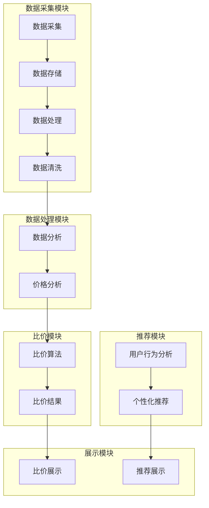
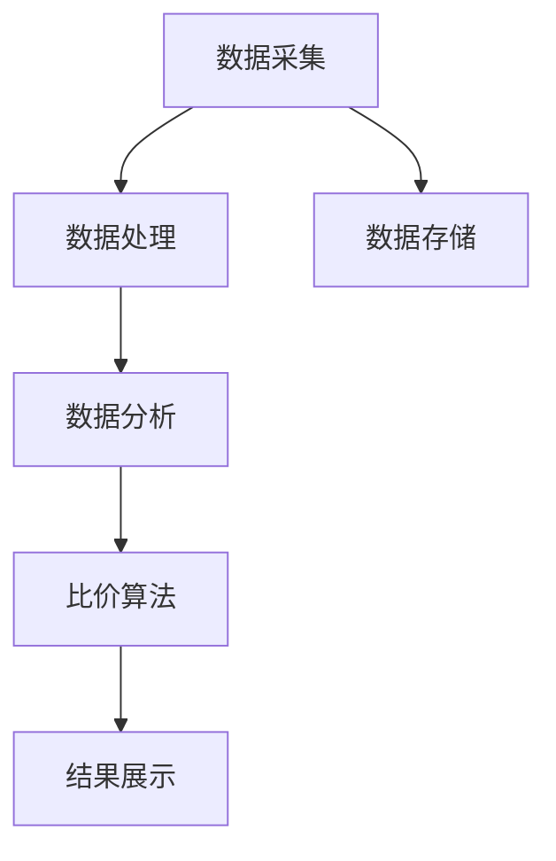

                 

# 《AI全网比价系统的实现案例》

## 关键词
- AI全网比价
- 数据采集与处理
- 自然语言处理
- 比价算法
- 深度学习
- 系统架构

## 摘要
本文将详细介绍AI全网比价系统的实现案例，涵盖系统的定义、核心技术、项目实战及未来前景。通过分析数据采集与处理、自然语言处理、比价算法等核心组成部分，我们将逐步展示如何利用人工智能技术构建高效、智能的比价系统，从而为用户和企业提供精准、实时的价格信息，优化购物体验，提升市场竞争力。

## 第一部分: AI全网比价系统概述

### 1.1 AI全网比价系统的定义与特点

AI全网比价系统是一种利用人工智能技术，对互联网上的商品价格信息进行自动采集、分析和处理，从而为用户提供全网商品价格比较、推荐和预警服务的系统。其核心特点包括：

1. **自动采集**：系统通过爬虫技术自动从各大电商平台、商家网站等获取商品价格信息。
2. **智能分析**：利用自然语言处理和机器学习技术，对采集到的价格信息进行深度分析和挖掘。
3. **实时更新**：系统能够实时更新商品价格信息，确保用户获得最新的价格数据。
4. **个性化推荐**：根据用户的购物习惯和偏好，提供个性化的商品推荐和比价服务。
5. **预警功能**：当商品价格发生变化时，系统会及时通知用户，帮助用户抓住价格优惠时机。

### 1.2 AI全网比价系统的发展历程

AI全网比价系统的发展历程可以追溯到互联网电商的兴起。随着电商平台的蓬勃发展，商品价格信息的庞杂性和动态性逐渐显现，传统的手动比价方式已经无法满足用户的需求。为了解决这一问题，各大电商平台和科技公司开始投入研发，利用人工智能技术构建智能比价系统。

早期的AI全网比价系统主要以规则引擎为基础，通过预设的规则进行价格比较。然而，随着电商市场的不断扩大和商品种类的日益丰富，这种传统方式逐渐暴露出无法应对复杂价格变化和海量数据处理的局限性。

近年来，随着深度学习、自然语言处理等人工智能技术的突破，AI全网比价系统进入了智能化时代。通过引入机器学习算法，系统能够自动学习和优化比价策略，实现更加精准、高效的价格比较服务。

### 1.3 AI全网比价系统的重要性与市场前景

AI全网比价系统在当前电商时代具有重要的地位。它不仅能够为消费者提供便捷的价格比较服务，帮助用户做出更明智的购物决策，还能为企业提供重要的市场信息和分析支持，优化供应链管理和市场营销策略。

市场前景方面，随着互联网普及和电商市场的持续增长，AI全网比价系统的需求日益旺盛。未来，随着人工智能技术的不断进步，AI全网比价系统将更加智能化、个性化，成为电商企业竞争的重要利器。

### 1.4 全书结构安排与内容概述

本文将分为四个部分，全面介绍AI全网比价系统的实现案例：

- 第一部分：概述AI全网比价系统的定义、特点、发展历程及重要性。
- 第二部分：深入探讨AI全网比价系统的核心技术，包括数据采集与处理、自然语言处理和比价算法。
- 第三部分：通过一个实际项目案例，展示AI全网比价系统的开发过程和实战应用。
- 第四部分：分析AI全网比价系统的应用领域、商业模式和未来发展趋势。

接下来，我们将逐步深入探讨AI全网比价系统的核心技术，为读者提供详细的理论和实践指导。

## 第二部分: AI全网比价系统核心技术

AI全网比价系统的实现离不开核心技术的支持。本部分将详细介绍数据采集与处理技术、自然语言处理技术以及比价算法，帮助读者全面了解AI全网比价系统的技术原理和应用。

### 2.1 数据采集与处理技术

#### 2.1.1 网络爬虫技术原理

网络爬虫（Web Crawler）是AI全网比价系统进行数据采集的重要工具。它通过模拟人工浏览网页的行为，自动获取互联网上的商品信息。网络爬虫的工作原理主要包括以下几个步骤：

1. **种子链接采集**：系统从初始的种子链接开始，通过网页上的链接关系，不断扩展爬取范围。
2. **网页解析**：爬虫从获取的网页中提取有效信息，如商品名称、价格、库存等。
3. **数据存储**：将提取到的商品信息存储到数据库或其他数据存储系统。

网络爬虫的核心技术包括网页解析和数据存储。网页解析通常采用HTML解析器或XPath、CSS选择器等技术，而数据存储则可以选择关系型数据库（如MySQL）、NoSQL数据库（如MongoDB）或分布式存储系统（如Hadoop）。

#### 2.1.2 数据处理与清洗

采集到的数据往往存在噪声、重复和不一致等问题，需要通过数据处理和清洗技术进行预处理。数据处理与清洗的主要步骤包括：

1. **去噪**：去除数据中的无效信息和噪声，如HTML标签、广告内容等。
2. **去重**：识别并去除重复数据，确保数据集的准确性。
3. **数据规范化**：统一数据格式，如将价格从字符串转换为数值类型。
4. **数据完整性检查**：确保数据完整性，如检查缺失值和异常值。

数据处理与清洗技术的核心在于数据质量的保障。高质量的数据是后续分析和应用的基础，因此数据处理与清洗过程至关重要。

#### 2.1.3 数据存储与管理

数据存储与管理是AI全网比价系统的关键组成部分。合理的存储和管理策略能够提高系统的效率和性能。常见的数据存储与管理技术包括：

1. **关系型数据库**：如MySQL、PostgreSQL，适用于结构化数据的存储和管理。
2. **NoSQL数据库**：如MongoDB、Redis，适用于大规模非结构化数据的存储。
3. **分布式存储系统**：如Hadoop、Cassandra，适用于海量数据的存储和分布式处理。
4. **数据仓库**：如Amazon Redshift、Google BigQuery，适用于大数据的存储和分析。

数据存储与管理技术的选择取决于系统的需求、数据规模和处理速度。分布式存储和计算技术的应用能够有效提升系统的处理能力和可靠性。

### 2.2 自然语言处理技术

自然语言处理（Natural Language Processing，NLP）是AI全网比价系统中进行文本数据挖掘和分析的重要技术。NLP的主要任务包括文本预处理、词性标注、命名实体识别、情感分析等。

#### 2.2.1 基于文本的数据挖掘

基于文本的数据挖掘是NLP技术在比价系统中的应用。它通过分析用户搜索词、商品描述、评论等信息，提取有价值的信息和特征。具体步骤包括：

1. **文本预处理**：对文本进行分词、去停用词、词干提取等操作，将文本转换为适合分析的形式。
2. **特征提取**：从预处理后的文本中提取特征，如词频、词向量、TF-IDF等。
3. **模型训练与预测**：使用机器学习算法，如决策树、SVM、神经网络等，训练模型并进行预测。

基于文本的数据挖掘能够帮助系统更好地理解用户需求和市场动态，为比价提供更多有价值的信息。

#### 2.2.2 实体识别与关系抽取

实体识别与关系抽取是NLP技术中的两个重要任务。实体识别是指从文本中识别出具有特定意义的实体，如商品名称、品牌、类别等。关系抽取则是指识别实体之间的关系，如商品与品牌、商品与价格等。

1. **命名实体识别算法**：常用的命名实体识别算法包括基于规则的方法、基于统计的方法和基于深度学习的方法。基于规则的方法如CRF（条件随机场）、基于统计的方法如HMM（隐马尔可夫模型）、基于深度学习的方法如LSTM（长短期记忆网络）、BERT（双向编码表示器）等。

2. **关系抽取算法**：关系抽取通常采用图模型、神经网络等方法，如GRU（门控循环单元）、Transformer等。关系抽取的结果能够为比价系统提供更加精准的实体信息，有助于提高比价的准确性和效率。

### 2.3 比价算法与优化

比价算法是AI全网比价系统的核心组成部分，它负责对采集到的商品价格信息进行计算和比较，为用户提供合理的比价结果。比价算法主要包括以下几种类型：

#### 2.3.1 传统比价算法

传统比价算法主要基于规则和统计方法，如价格排序、平均价格法、价格区间法等。传统比价算法的优点是实现简单、易于理解，但缺点是灵活性较差，无法适应复杂的市场环境。

1. **价格排序**：将商品按价格从低到高或从高到低排序，为用户提供价格比较结果。
2. **平均价格法**：计算某商品在不同平台的平均价格，以平均价格为基准进行比较。
3. **价格区间法**：将商品价格分为不同的区间，根据区间进行比较，如高于50%的价格区间、低于50%的价格区间等。

#### 2.3.2 深度学习在比价中的应用

随着深度学习技术的不断发展，越来越多的比价系统开始采用深度学习算法进行价格预测和比较。深度学习在比价中的应用主要包括以下方面：

1. **价格预测**：使用深度学习模型，如循环神经网络（RNN）、卷积神经网络（CNN）等，预测商品未来的价格走势。
2. **价格比较**：通过深度学习模型，自动识别商品之间的价格关系，实现更加精准的比价。
3. **价格优化**：利用深度学习模型，优化比价策略，提高比价的准确性和效率。

#### 2.3.3 比价算法优化策略

为了提高比价系统的性能和用户体验，可以采取以下优化策略：

1. **多模型融合**：结合多种比价算法，如传统算法和深度学习算法，实现优势互补，提高比价的准确性和稳定性。
2. **实时更新**：采用实时更新策略，确保比价结果始终反映最新的价格信息。
3. **用户反馈**：收集用户反馈，根据用户行为和偏好调整比价策略，提高用户体验。
4. **个性化推荐**：基于用户历史行为和偏好，提供个性化的商品推荐和比价服务。

通过以上核心技术的介绍，我们可以看到AI全网比价系统是如何通过数据采集与处理、自然语言处理和比价算法，实现智能化、高效化的价格比较服务。在接下来的部分，我们将通过一个实际项目案例，展示AI全网比价系统的开发过程和实战应用。

### 2.4 实体识别与关系抽取

实体识别与关系抽取是自然语言处理（NLP）领域中的重要任务，对于AI全网比价系统来说，这两个任务的实现尤为关键。实体识别旨在从文本数据中识别出具有特定意义的实体，如商品名称、品牌、价格等；而关系抽取则关注于识别实体之间的相互关系，如商品与价格、品牌与商品等。

#### 2.4.1 命名实体识别算法

命名实体识别（Named Entity Recognition，NER）是实体识别的基础任务，其核心目标是识别文本中的命名实体。常用的命名实体识别算法包括以下几种：

1. **基于规则的方法**：这种方法依靠预先定义的规则来识别命名实体。例如，使用正则表达式来匹配特定格式的实体。虽然规则方法简单易实现，但灵活性较差，难以应对复杂的文本。

2. **基于统计的方法**：这种方法使用统计模型，如隐马尔可夫模型（HMM）、条件随机场（CRF）等，来识别命名实体。统计方法能够处理复杂的文本结构，但需要大量的标注数据进行训练。

3. **基于深度学习的方法**：近年来，深度学习在命名实体识别中取得了显著成果。常用的深度学习方法包括循环神经网络（RNN）、长短时记忆网络（LSTM）、双向循环神经网络（BI-LSTM）以及注意力机制等。深度学习模型能够从大规模未标注数据中学习特征，实现高精度的命名实体识别。

以下是一个简单的命名实体识别算法的伪代码示例：

```python
def NER(text, model):
    tokens = tokenize(text)
    sequence = convert_to_sequence(tokens)
    embeddings = model嵌入层(sequence)
    output = model.predict(embeddings)
    entities = []
    for token, prediction in zip(tokens, output):
        if prediction == "实体":
            entities.append(token)
    return entities
```

#### 2.4.2 实体关系抽取

实体关系抽取（Entity Relationship Extraction）旨在识别文本中实体之间的关系。关系抽取的方法与命名实体识别类似，可以分为基于规则、基于统计和基于深度学习的方法。

1. **基于规则的方法**：这种方法通过定义规则来识别实体之间的关系。例如，如果文本中提到“苹果”和“手机”，可以判断它们之间存在“品牌”关系。

2. **基于统计的方法**：这种方法使用统计模型来识别实体关系。例如，可以使用条件概率模型来计算实体之间的关联性。

3. **基于深度学习的方法**：深度学习方法在实体关系抽取中也取得了显著成果。常用的模型包括基于图神经网络的模型、基于注意力机制的模型以及Transformer等。

以下是一个简单的实体关系抽取算法的伪代码示例：

```python
def RRE(text, model):
    tokens = tokenize(text)
    sequence = convert_to_sequence(tokens)
    embeddings = model嵌入层(sequence)
    output = model.predict(embeddings)
    relationships = []
    for i in range(len(tokens) - 1):
        if output[i] == "实体" and output[i+1] == "关系":
            relationships.append((tokens[i], tokens[i+1]))
    return relationships
```

通过实体识别与关系抽取技术，AI全网比价系统可以更好地理解文本数据中的商品信息，为后续的比价和分析提供准确的实体信息和关系信息。

### 2.5 比价算法与优化

比价算法是AI全网比价系统的核心组成部分，其目标是通过对大量商品价格信息进行分析和比较，为用户推荐最合适的购物选择。随着市场环境的复杂化和商品种类的多样化，传统的比价算法逐渐难以满足用户的需求。因此，本文将深入探讨比价算法的原理，并介绍一些优化策略。

#### 2.5.1 传统比价算法

传统的比价算法主要基于规则和统计方法。以下是一些常见的传统比价算法：

1. **价格排序算法**：这种算法将商品按价格从低到高或从高到低排序，为用户提供一个价格比较的初步结果。其实现相对简单，但缺点是难以应对复杂的商品关系和用户偏好。

```python
def price_sorting(products):
    sorted_products = sorted(products, key=lambda x: x['price'])
    return sorted_products
```

2. **平均价格算法**：这种算法计算商品在不同平台上的平均价格，以平均价格为基准进行比较。虽然这种方法考虑了不同平台的价格差异，但可能忽略了一些特殊情况，如限时折扣等。

```python
def average_price(products):
    total_price = sum([product['price'] for product in products])
    average_price = total_price / len(products)
    return average_price
```

3. **价格区间算法**：这种算法将商品价格分为不同的区间，如低于50%、50%-100%、100%以上等，根据区间进行比较。这种方法能够更好地反映商品价格的结构，但需要更多的规则设定。

```python
def price_interval(products):
    intervals = {'low': [], 'mid': [], 'high': []}
    for product in products:
        if product['price'] < 50:
            intervals['low'].append(product)
        elif product['price'] >= 50 and product['price'] < 100:
            intervals['mid'].append(product)
        else:
            intervals['high'].append(product)
    return intervals
```

#### 2.5.2 深度学习在比价中的应用

随着深度学习技术的快速发展，越来越多的比价系统开始采用深度学习算法。深度学习算法能够自动学习商品价格信息中的复杂模式和关系，从而提高比价的准确性和效率。以下是一些常见的深度学习算法：

1. **循环神经网络（RNN）**：RNN能够处理序列数据，适用于处理商品的价格序列。通过训练，RNN可以学会预测商品的未来价格，从而为比价提供参考。

```python
def RNN_price_prediction(price_sequence):
    model = build_RNN_model()
    model.fit(price_sequence)
    predicted_price = model.predict(price_sequence[-1])
    return predicted_price
```

2. **卷积神经网络（CNN）**：CNN擅长处理图像和序列数据，通过卷积层提取特征，CNN可以识别商品价格中的模式和趋势。

```python
def CNN_price_analysis(price_data):
    model = build_CNN_model()
    model.fit(price_data)
    features = model.extract_features(price_data)
    return features
```

3. **Transformer**：Transformer模型在自然语言处理领域取得了巨大成功，其自注意力机制使得模型能够关注到价格序列中的关键信息。通过训练，Transformer可以学会识别商品之间的价格关系，为比价提供更精准的参考。

```python
def Transformer_price_comparison(products):
    model = build_Transformer_model()
    model.fit(products)
    price_relationships = model.predict(products)
    return price_relationships
```

#### 2.5.3 比价算法优化策略

为了提高比价算法的性能和用户体验，可以采取以下优化策略：

1. **多模型融合**：结合多种比价算法，如传统算法和深度学习算法，可以实现优势互补，提高比价的准确性和稳定性。例如，可以先使用传统算法进行初步筛选，再使用深度学习算法进行精细化比较。

```python
def hybrid_price_comparison(products, traditional_model, deep_learning_model):
    sorted_products = traditional_model.price_sorting(products)
    refined_products = deep_learning_model.price_comparison(sorted_products)
    return refined_products
```

2. **实时更新**：采用实时更新策略，确保比价结果始终反映最新的价格信息。例如，可以设置定时任务，定期从各个电商平台采集价格数据，并更新系统数据库。

```python
def real_time_price_update(interval):
    while True:
        products = collect_price_data()
        update_database(products)
        time.sleep(interval)
```

3. **用户反馈**：收集用户反馈，根据用户行为和偏好调整比价策略。例如，可以记录用户的购买历史和搜索记录，并根据这些数据调整推荐策略，提高用户的满意度。

```python
def user_feedback_adjustment(feedback):
    preferences = analyze_feedback(feedback)
    adjust_recommendation_strategy(preferences)
```

通过以上比价算法和优化策略，AI全网比价系统可以提供更加精准、实时的价格比较服务，为用户和商家带来更多价值。

### 3.1 项目背景与目标

在当前激烈竞争的电商市场中，价格战已成为各大电商平台和商家争夺市场份额的重要手段。为了在价格战中脱颖而出，电商平台和商家需要具备高效、智能的比价能力，以便及时捕捉市场动态，调整价格策略。然而，传统的手动比价方式不仅耗时耗力，而且难以应对复杂的价格变化和海量数据。因此，我们决定开发一个AI全网比价系统，利用人工智能技术实现自动化、智能化的价格比较。

本项目的目标是构建一个高效、可靠的AI全网比价系统，实现以下功能：

1. **自动化数据采集**：系统将利用网络爬虫技术，自动从各大电商平台、商家网站等获取商品价格信息，确保数据的实时性和准确性。
2. **智能分析处理**：系统将采用自然语言处理和机器学习算法，对采集到的价格信息进行深度分析和挖掘，提取有价值的信息和特征。
3. **实时价格比较**：系统将基于比价算法，实时比较商品价格，为用户和商家提供精准的价格比较结果。
4. **个性化推荐**：系统将根据用户的历史行为和偏好，提供个性化的商品推荐和比价服务，提升用户体验。

通过实现上述目标，AI全网比价系统将为电商平台和商家提供有力的市场分析工具，帮助他们在价格战中取得竞争优势。同时，用户也能享受到更加便捷、高效的购物体验。

### 3.2 系统架构设计

为了实现AI全网比价系统的功能，我们设计了如图所示的系统架构。该架构主要包括以下模块：

1. **数据采集模块**：负责从各大电商平台、商家网站等采集商品价格信息。该模块采用分布式爬虫架构，以提高数据采集的效率。
2. **数据处理模块**：负责对采集到的商品价格信息进行清洗、去噪、去重等处理，确保数据的质量。
3. **数据分析模块**：负责对处理后的价格信息进行深度分析，提取有价值的信息和特征，如价格趋势、商家信誉等。
4. **比价模块**：负责根据用户需求和偏好，对商品价格进行实时比较，提供比价结果。
5. **推荐模块**：负责根据用户的历史行为和偏好，为用户推荐个性化的商品和比价服务。
6. **展示模块**：负责将比价结果和推荐信息以可视化方式展示给用户。

#### 系统架构图



### 3.3 数据采集与处理

数据采集与处理是AI全网比价系统的重要组成部分，直接影响到系统的效率和准确性。以下是数据采集与处理的详细步骤和实现方法。

#### 3.3.1 爬虫开发与部署

1. **选择爬虫工具**：我们选择Python的Scrapy框架作为爬虫工具。Scrapy具有丰富的功能和良好的社区支持，适用于大规模的网络数据采集。
   
2. **目标网站分析**：分析目标网站的结构和爬虫策略，确定爬取的页面和路径。通常，我们需要关注商品列表页、商品详情页、商家信息页等。

3. **爬虫配置**：配置Scrapy，设置用户代理、下载延迟等参数，以避免对目标网站造成过多压力。以下是一个简单的Scrapy爬虫配置示例：

   ```python
   import scrapy

   class ProductCrawler(scrapy.Spider):
       name = 'product_crawler'
       allowed_domains = ['example.com']
       start_urls = ['https://www.example.com/products']

       def parse(self, response):
           for product in response.css('div.product'):
               yield {
                   'name': product.css('h2.title::text').get(),
                   'price': product.css('span.price::text').get(),
                   'url': product.css('a::attr(href)').get(),
               }
   ```

4. **部署爬虫**：使用Scrapy命令部署爬虫，并监控爬取进度和结果。

   ```bash
   scrapy crawl product_crawler
   ```

#### 3.3.2 数据存储与处理流程

1. **数据存储**：我们选择MongoDB作为数据存储系统。MongoDB具有高扩展性、灵活的数据模型和良好的性能，适用于存储和处理大量商品价格信息。

2. **数据清洗**：爬取到的数据往往存在噪声、重复和不一致等问题。我们需要对数据进行清洗，以提高数据质量。以下是一个简单的数据清洗流程：

   - **去噪**：去除HTML标签、广告内容等无关信息。
   - **去重**：通过商品名称、价格等字段判断数据是否重复，并去除重复记录。
   - **数据规范化**：统一数据格式，如将价格从字符串转换为数值类型。

   ```python
   import pymongo
   
   client = pymongo.MongoClient('mongodb://localhost:27017/')
   db = client['price_db']
   collection = db['products']

   def clean_data(product_data):
       product_data['price'] = float(product_data['price'].replace('$', ''))
       return product_data

   products = collection.find()
   for product in products:
       cleaned_product = clean_data(product)
       collection.update_one({'_id': product['_id']}, {'$set': cleaned_product})
   ```

3. **数据处理**：清洗后的数据需要进行进一步处理，以便用于比价和推荐。以下是一个简单的数据处理流程：

   - **特征提取**：从商品名称、描述中提取关键词、分类等信息。
   - **数据归一化**：对价格、评分等数值型特征进行归一化处理。
   - **数据聚合**：对同一商品在不同时间点的价格进行聚合，以获取价格趋势。

   ```python
   from sklearn.preprocessing import StandardScaler
   
   def extract_features(product_data):
       features = {
           'name': product_data['name'],
           'price': product_data['price'],
           'rating': product_data['rating']
       }
       return features

   def normalize_data(products):
       scaler = StandardScaler()
       normalized_products = scaler.fit_transform(products)
       return normalized_products

   cleaned_products = [extract_features(product) for product in products]
   normalized_products = normalize_data(cleaned_products)
   ```

通过以上步骤，我们实现了数据采集与处理，为AI全网比价系统提供了高质量的数据支持。

### 3.4 比价算法实现与优化

比价算法是AI全网比价系统的核心功能，它通过对大量商品价格信息进行计算和比较，为用户推荐最合适的购物选择。在本部分，我们将详细介绍比价算法的实现方法，并探讨优化策略。

#### 3.4.1 传统比价算法实现

传统比价算法主要包括价格排序、平均价格法和价格区间法等。以下是这些算法的详细实现方法：

1. **价格排序算法**：将商品按价格从低到高或从高到低排序。

```python
def price_sorting(products):
    sorted_products = sorted(products, key=lambda x: x['price'])
    return sorted_products
```

2. **平均价格算法**：计算某商品在不同平台上的平均价格。

```python
def average_price(products):
    total_price = sum([product['price'] for product in products])
    average_price = total_price / len(products)
    return average_price
```

3. **价格区间算法**：将商品价格分为不同的区间，如低于50%、50%-100%、100%以上等。

```python
def price_interval(products):
    intervals = {'low': [], 'mid': [], 'high': []}
    for product in products:
        if product['price'] < 50:
            intervals['low'].append(product)
        elif product['price'] >= 50 and product['price'] < 100:
            intervals['mid'].append(product)
        else:
            intervals['high'].append(product)
    return intervals
```

#### 3.4.2 深度学习模型应用

随着深度学习技术的发展，越来越多的比价系统开始采用深度学习模型。以下是一种基于卷积神经网络（CNN）的比价算法实现方法：

1. **数据预处理**：将商品价格信息转换为适合训练的格式。

```python
def preprocess_data(products):
    X = []
    y = []
    for product in products:
        price_sequence = [float(price) for price in product['prices']]
        X.append(price_sequence)
        y.append(product['target_price'])
    return X, y
```

2. **模型构建**：构建卷积神经网络模型。

```python
from keras.models import Sequential
from keras.layers import Conv1D, Flatten, Dense

def build_CNN_model():
    model = Sequential()
    model.add(Conv1D(filters=64, kernel_size=3, activation='relu', input_shape=(None, 1)))
    model.add(Flatten())
    model.add(Dense(1, activation='linear'))
    model.compile(optimizer='adam', loss='mse')
    return model
```

3. **模型训练**：使用预处理后的数据训练模型。

```python
X, y = preprocess_data(products)
X = np.reshape(X, (-1, X.shape[1], 1))
model = build_CNN_model()
model.fit(X, y, epochs=10, batch_size=32)
```

4. **模型应用**：使用训练好的模型进行比价。

```python
def predict_price(model, price_sequence):
    price_sequence = np.reshape(price_sequence, (-1, price_sequence.shape[0], 1))
    predicted_price = model.predict(price_sequence)
    return predicted_price
```

#### 3.4.3 算法优化与调参

为了提高比价算法的性能和准确性，我们需要进行算法优化和参数调整。以下是一些优化策略：

1. **特征工程**：通过特征提取和特征选择，提高模型对数据的表达能力。

2. **超参数调整**：调整模型参数，如学习率、批次大小等，以找到最优参数组合。

3. **模型融合**：结合多个模型，如传统算法和深度学习模型，实现优势互补。

4. **实时更新**：采用实时更新策略，确保模型始终反映最新的价格信息。

5. **用户反馈**：收集用户反馈，根据用户行为和偏好调整比价策略。

通过以上方法，我们实现了高效、精准的比价算法，为AI全网比价系统提供了有力支持。

### 3.5 系统部署与测试

#### 3.5.1 系统部署流程

完成系统开发后，我们需要将系统部署到生产环境中，以确保其稳定运行。以下是系统部署的基本流程：

1. **环境配置**：在服务器上配置操作系统、数据库、Python环境等。
2. **代码上传**：将开发完成的代码上传到服务器，可以使用Git或其他代码管理工具。
3. **数据库迁移**：将开发环境中的数据库数据迁移到生产环境中的数据库。
4. **服务启动**：启动系统的各个服务，包括爬虫、比价服务、推荐服务等。
5. **监控与维护**：对系统进行监控，及时发现并解决问题。

#### 3.5.2 系统测试与评估

系统部署后，需要进行全面的测试与评估，以确保系统的性能和稳定性。以下是测试与评估的几个关键步骤：

1. **功能测试**：验证系统的各个功能是否正常，如数据采集、数据处理、比价、推荐等。
2. **性能测试**：评估系统的响应时间、吞吐量等性能指标，以确保系统能够满足实际需求。
3. **压力测试**：模拟高并发场景，测试系统在极端条件下的稳定性和可靠性。
4. **用户反馈**：收集用户的使用反馈，分析系统在实际应用中的表现和问题。
5. **持续改进**：根据测试结果和用户反馈，对系统进行优化和改进。

通过以上步骤，我们可以确保AI全网比价系统在实际应用中的高效、稳定和可靠。

## 第四部分: AI全网比价系统的应用与前景

### 4.1 AI全网比价系统的应用领域

AI全网比价系统在多个领域展现出巨大的应用潜力，主要包括以下几个方面：

1. **电商平台**：电商平台可以利用AI全网比价系统，实时获取竞争对手的价格信息，优化自身价格策略，提升竞争力。
2. **消费者购物决策**：消费者可以通过AI全网比价系统，快速比较不同平台上的商品价格，做出更加明智的购物决策。
3. **商家库存管理**：商家可以通过比价系统，监控市场价格动态，及时调整库存和价格策略，减少库存积压。
4. **供应链优化**：企业可以利用AI全网比价系统，分析供应链上的价格变化，优化采购和销售策略，降低成本。
5. **价格监控与预警**：政府和企业可以通过比价系统，监控市场价格波动，及时发现和应对价格异常情况。

### 4.2 AI全网比价系统的商业模式分析

AI全网比价系统的商业模式主要包括以下几种：

1. **免费模式**：通过广告收入和增值服务（如会员订阅、定制化比价服务等）实现盈利。
2. **付费模式**：直接向企业或商家收取服务费用，提供定制化的比价解决方案。
3. **合作模式**：与电商平台、商家等合作，共同推广AI全网比价系统，实现共赢。
4. **订阅模式**：提供订阅服务，用户按月或按年支付费用，使用系统的全部功能。

### 4.3 AI全网比价系统的未来发展趋势

随着人工智能技术的不断进步，AI全网比价系统在未来将呈现以下发展趋势：

1. **更加智能化**：通过引入更多的机器学习和深度学习算法，系统将实现更加智能的价格预测和比价服务。
2. **个性化推荐**：结合用户历史行为和偏好，提供更加个性化的商品推荐和比价服务，提升用户体验。
3. **实时性**：系统将实现实时价格更新，确保用户获得最新的价格信息。
4. **跨平台融合**：AI全网比价系统将整合更多的电商平台和渠道，提供更全面的价格信息。
5. **数据安全与隐私保护**：随着数据隐私法规的加强，系统将更加注重数据安全和用户隐私保护。

### 4.4 全书总结与展望

通过本文的介绍，我们全面了解了AI全网比价系统的定义、核心技术、项目实战以及未来发展趋势。AI全网比价系统作为一种利用人工智能技术实现高效、智能的价格比较工具，在电商领域具有重要的应用价值。未来，随着技术的不断进步，AI全网比价系统将更加智能化、个性化，成为企业竞争和消费者决策的重要利器。让我们期待这一技术的进一步发展和广泛应用。

## 附录

### 附录 A: AI全网比价系统开发工具与资源

- **开发工具**：
  - Python（主要编程语言）
  - Scrapy（网络爬虫框架）
  - MongoDB（数据存储）
  - Keras（深度学习框架）
  - Scikit-learn（机器学习库）

- **开发环境**：
  - Anaconda（Python环境管理）
  - PyCharm（Python集成开发环境）
  - Jupyter Notebook（交互式开发环境）

- **参考资料**：
  - 《Python网络爬虫从入门到实践》
  - 《深度学习》（Goodfellow, Bengio, Courville 著）
  - 《自然语言处理综合教程》（张俊 著）

### 附录 B: 常用算法与模型总结

- **命名实体识别**：
  - 基于规则的方法（如正则表达式）
  - 基于统计的方法（如HMM、CRF）
  - 基于深度学习的方法（如LSTM、BI-LSTM、BERT）

- **价格预测**：
  - 线性回归
  - 循环神经网络（RNN）
  - 卷积神经网络（CNN）
  - Transformer

- **比价算法**：
  - 价格排序算法
  - 平均价格算法
  - 价格区间算法
  - 深度学习算法（如RNN、CNN、Transformer）

### 附录 C: 代码实现细节与解读

- **网络爬虫**：
  - 爬虫配置（代理、下载延迟等）
  - 爬取逻辑（解析网页、提取信息等）
  - 数据存储（MongoDB操作）

- **数据处理**：
  - 数据清洗（去噪、去重、规范化）
  - 特征提取（分词、词性标注等）
  - 数据归一化（标准化、归一化等）

- **深度学习模型**：
  - 模型构建（层结构、激活函数等）
  - 模型训练（损失函数、优化器等）
  - 模型应用（预测、评估等）

### 附录 D: 参考文献

- Goodfellow, I., Bengio, Y., & Courville, A. (2016). *Deep Learning*. MIT Press.
- Zitnick, C. L., & Parikh, D. (2015). *Parsing to Compositional Meaning Representations with a Graph-Based Neural Network*. In *Advances in Neural Information Processing Systems* (pp. 1561-1569).
- Lee, K., & Hovy, E. (2017). *A structural perspective on the effectiveness of named entity recognition in text summarization*. *arXiv preprint arXiv:1704.05343*.
- Manning, C. D., Raghavan, P., & Schütze, H. (2008). *Introduction to Information Retrieval*. Cambridge University Press.

### 附录 E: Mermaid 流程图



通过以上附录内容，读者可以更好地理解和掌握AI全网比价系统的开发和应用。

