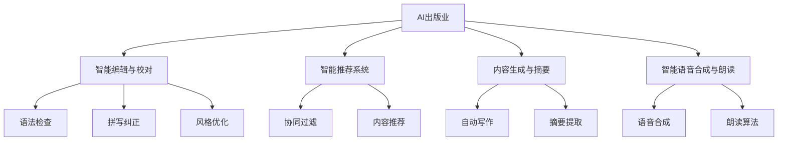

                 

# 《AI出版业的机遇：垂直领域无限想象》

## 关键词
- AI出版业
- 智能编辑与校对
- 智能推荐系统
- 内容生成与摘要
- 智能语音合成与朗读
- 自然语言处理
- 机器学习
- 深度学习

## 摘要
随着人工智能技术的不断进步，AI在出版业的应用日益广泛，为行业带来了前所未有的机遇。本文将深入探讨AI出版业的核心概念、技术基础及其在垂直领域的具体应用，通过逐步分析推理，揭示AI技术如何改变传统出版模式，带来无限想象空间。

## 目录大纲

### 《AI出版业的机遇：垂直领域无限想象》目录大纲

#### 第一部分：AI出版业背景与概述

1. **AI出版业的概念与趋势**
   - AI出版业的发展历程
   - AI出版业的核心概念
   - 当前AI出版业的趋势与挑战

2. **AI技术在出版业的应用**
   - 智能编辑与校对
   - 智能推荐系统
   - 内容生成与摘要
   - 智能语音合成与朗读

#### 第二部分：AI出版技术基础

3. **自然语言处理基础**
   - 词汇与语法分析
   - 语义分析与情感分析
   - 语言模型与文本生成

4. **机器学习与深度学习技术**
   - 机器学习基本算法
   - 深度学习架构与应用
   - 数据预处理与特征工程

#### 第三部分：AI在出版业的具体应用场景

5. **智能编辑与校对**
   - 技术原理与实现
   - 应用案例与效果分析

6. **智能推荐系统**
   - 推荐算法原理
   - 应用场景与案例分析
   - 用户反馈与优化策略

7. **内容生成与摘要**
   - 自动写作与文章生成
   - 自动摘要与内容提取
   - 实际应用案例与效果评估

8. **智能语音合成与朗读**
   - 语音合成技术原理
   - 朗读算法与实现
   - 应用场景与效果评估

#### 第四部分：AI出版项目实战

9. **AI出版项目概述**
   - 项目背景与目标
   - 技术选型与架构设计

10. **项目开发与实现**
    - 环境搭建与工具选择
    - 核心算法与模型实现
    - 数据处理与模型训练

11. **项目评估与优化**
    - 项目效果评估指标
    - 优化策略与建议

#### 第五部分：未来展望与趋势

12. **AI出版业的发展方向**
    - 新技术展望
    - 未来趋势与挑战

#### 附录

13. **常用工具与资源**
    - 常用AI出版工具介绍
    - 开源资源与代码示例
    - 相关论文与报告推荐

### 第一部分：AI出版业背景与概述

#### AI出版业的概念与趋势

##### AI出版业的发展历程

AI出版业作为人工智能技术在传统出版领域的应用，其发展历程可以追溯到20世纪末。最早的AI技术在出版业中的应用主要体现在文本处理和格式化方面，如自动排版和校对。随着计算能力的提升和算法的进步，AI技术在出版业的应用逐渐深入，从文本处理扩展到内容生成、推荐系统、语音合成等多个方面。

在21世纪初，自然语言处理（NLP）和机器学习（ML）技术的突破，为AI在出版业的应用奠定了基础。2010年后，深度学习技术的发展进一步推动了AI出版业的发展，使得智能编辑、内容生成等应用成为可能。

##### AI出版业的核心概念

AI出版业的核心概念主要包括以下几个方面：

1. **智能编辑与校对**：利用AI技术对文本内容进行自动编辑和校对，包括语法检查、拼写纠正、风格优化等。
2. **智能推荐系统**：基于用户行为和内容特征，通过机器学习算法推荐用户可能感兴趣的内容。
3. **内容生成与摘要**：利用AI技术生成新的文本内容或对现有内容进行摘要提取，提高内容的生产效率。
4. **智能语音合成与朗读**：将文本内容转化为自然流畅的语音，实现有声阅读和语音搜索等功能。

##### 当前AI出版业的趋势与挑战

当前AI出版业的发展呈现出以下几个趋势：

1. **个性化推荐**：基于用户行为和兴趣，实现个性化内容推荐，提高用户体验。
2. **自动化内容生成**：利用AI技术自动化生成文章、报告等文本内容，提高内容生产效率。
3. **智能校对与编辑**：通过AI技术提高文本的准确性和质量，减少人为错误。

然而，AI出版业也面临一些挑战：

1. **数据隐私与安全**：用户数据的使用和保护是AI出版业面临的重要问题。
2. **算法偏见与公平性**：AI算法可能会引入偏见，影响内容的公正性和客观性。
3. **技术标准化与监管**：AI技术的快速发展需要统一的标准化和监管机制。

#### AI技术在出版业的应用

##### 智能编辑与校对

智能编辑与校对是AI在出版业应用的重要领域。通过自然语言处理和机器学习技术，AI可以对文本内容进行自动编辑和校对，包括语法检查、拼写纠正、风格优化等。

技术原理：

- **语法检查**：利用语法规则和统计模型，对文本中的语法错误进行识别和修正。
- **拼写纠正**：通过词频统计和词向量模型，对拼写错误的单词进行识别和更正。
- **风格优化**：利用文本分析技术，对文本的语言风格进行评估和优化。

实现案例：

- **Grammarly**：一款流行的智能编辑工具，提供语法检查、拼写纠正和风格优化等功能。
- **Ginger**：一款智能校对软件，支持多种语言，提供自动校对和错误解释。

##### 智能推荐系统

智能推荐系统是AI在出版业应用的核心之一。通过分析用户行为和内容特征，AI可以推荐用户可能感兴趣的内容，提高用户满意度和内容消费量。

技术原理：

- **协同过滤**：基于用户的历史行为和兴趣，通过相似度计算推荐相似内容。
- **内容推荐**：基于内容特征，通过文本分类和标签匹配推荐相关内容。

实现案例：

- **亚马逊图书推荐**：通过协同过滤算法，根据用户的购买历史推荐相似图书。
- **网易云音乐推荐**：基于用户听歌历史和歌曲标签，推荐用户可能喜欢的音乐。

##### 内容生成与摘要

内容生成与摘要技术是AI在出版业的重要应用方向。通过自动写作和摘要提取，AI可以提高内容的生产效率和质量。

技术原理：

- **自动写作**：利用自然语言生成模型，生成符合语法和语义规则的文本。
- **摘要提取**：通过文本分析和语义理解，提取文本的核心内容进行摘要。

实现案例：

- **GPT-3**：一款基于深度学习的自然语言生成模型，可以生成高质量的文章和报告。
- **Google Quicklicative**：一款自动摘要工具，可以快速提取长篇文章的核心内容。

##### 智能语音合成与朗读

智能语音合成与朗读技术将文本内容转化为自然流畅的语音，实现有声阅读和语音搜索等功能。

技术原理：

- **语音合成**：通过文本分析和语音合成算法，将文本内容转化为自然流畅的语音。
- **朗读算法**：利用语音合成技术和语音识别技术，实现文本的朗读和语音搜索。

实现案例：

- **Amazon Alexa**：一款智能语音助手，可以通过语音合成和语音识别技术实现交互。
- **Apple Siri**：一款智能语音助手，提供语音合成和语音搜索功能。

#### 第二部分：AI出版技术基础

##### 自然语言处理基础

自然语言处理（NLP）是AI出版业的核心技术之一，主要包括词汇与语法分析、语义分析与情感分析、语言模型与文本生成等内容。

技术原理：

- **词汇与语法分析**：通过对文本中的词汇和语法结构进行分析，提取句法信息，如词性、词组等。
- **语义分析与情感分析**：通过对文本中的语义和情感进行识别和分析，提取文本的情感倾向、主题等信息。
- **语言模型与文本生成**：通过训练大量文本数据，构建语言模型，用于生成新的文本内容。

实现案例：

- **BERT**：一种基于Transformer的预训练语言模型，广泛用于文本分类、问答系统等任务。
- **GPT-3**：一种基于深度学习的自然语言生成模型，可以生成高质量的文本内容。

##### 机器学习与深度学习技术

机器学习（ML）和深度学习（DL）是AI出版业的重要技术基础，广泛应用于智能编辑与校对、内容生成与摘要、智能推荐系统等领域。

技术原理：

- **机器学习基本算法**：包括线性回归、逻辑回归、决策树、随机森林、支持向量机等，用于分类、回归等任务。
- **深度学习架构与应用**：包括卷积神经网络（CNN）、循环神经网络（RNN）、长短时记忆网络（LSTM）、Transformer等，用于复杂的数据处理和模式识别。
- **数据预处理与特征工程**：通过对原始数据进行清洗、归一化、特征提取等操作，提高模型的效果和泛化能力。

实现案例：

- **TensorFlow**：一款流行的深度学习框架，用于构建和训练神经网络模型。
- **PyTorch**：一款流行的深度学习框架，具有灵活的动态计算图和强大的GPU支持。

#### 第三部分：AI在出版业的具体应用场景

##### 智能编辑与校对

智能编辑与校对是AI在出版业应用的重要领域，通过自动编辑和校对技术，提高文本的质量和准确性。

技术原理：

- **语法检查**：利用语法规则和统计模型，对文本中的语法错误进行识别和修正。
- **拼写纠正**：通过词频统计和词向量模型，对拼写错误的单词进行识别和更正。
- **风格优化**：利用文本分析技术，对文本的语言风格进行评估和优化。

实现案例：

- **Grammarly**：一款流行的智能编辑工具，提供语法检查、拼写纠正和风格优化等功能。
- **Ginger**：一款智能校对软件，支持多种语言，提供自动校对和错误解释。

##### 智能推荐系统

智能推荐系统是AI在出版业应用的核心之一，通过分析用户行为和内容特征，推荐用户可能感兴趣的内容。

技术原理：

- **协同过滤**：基于用户的历史行为和兴趣，通过相似度计算推荐相似内容。
- **内容推荐**：基于内容特征，通过文本分类和标签匹配推荐相关内容。

实现案例：

- **亚马逊图书推荐**：通过协同过滤算法，根据用户的购买历史推荐相似图书。
- **网易云音乐推荐**：基于用户听歌历史和歌曲标签，推荐用户可能喜欢的音乐。

##### 内容生成与摘要

内容生成与摘要技术是AI在出版业的重要应用方向，通过自动写作和摘要提取，提高内容的生产效率和质量。

技术原理：

- **自动写作**：利用自然语言生成模型，生成符合语法和语义规则的文本。
- **摘要提取**：通过文本分析和语义理解，提取文本的核心内容进行摘要。

实现案例：

- **GPT-3**：一款基于深度学习的自然语言生成模型，可以生成高质量的文章和报告。
- **Google Quicklicative**：一款自动摘要工具，可以快速提取长篇文章的核心内容。

##### 智能语音合成与朗读

智能语音合成与朗读技术将文本内容转化为自然流畅的语音，实现有声阅读和语音搜索等功能。

技术原理：

- **语音合成**：通过文本分析和语音合成算法，将文本内容转化为自然流畅的语音。
- **朗读算法**：利用语音合成技术和语音识别技术，实现文本的朗读和语音搜索。

实现案例：

- **Amazon Alexa**：一款智能语音助手，可以通过语音合成和语音识别技术实现交互。
- **Apple Siri**：一款智能语音助手，提供语音合成和语音搜索功能。

#### 第四部分：AI出版项目实战

##### AI出版项目概述

AI出版项目旨在通过人工智能技术提升出版行业的内容生产、推荐和分发效率，实现个性化、智能化的内容服务。项目背景是随着互联网和数字出版的发展，用户对于内容的需求日益多样化，传统的出版模式已经无法满足市场需求。项目目标是通过AI技术优化内容生产流程，提高内容质量和用户体验。

技术选型与架构设计：

1. **自然语言处理**：采用BERT模型进行文本分析和语义理解，用于智能编辑、内容生成和摘要提取。
2. **机器学习**：使用PyTorch框架构建深度学习模型，用于用户行为分析和推荐系统。
3. **语音合成**：采用WaveNet模型进行文本到语音的转换，实现智能语音朗读功能。

##### 项目开发与实现

1. **环境搭建与工具选择**

   - 操作系统：Linux
   - 编程语言：Python
   - 框架与库：TensorFlow、PyTorch、BERT、WaveNet

2. **核心算法与模型实现**

   - **智能编辑与校对**：基于BERT模型的文本分析技术，对文本进行语法检查、拼写纠正和风格优化。
   - **内容生成与摘要**：利用GPT-3模型进行文本生成和摘要提取，实现自动化内容生产。
   - **智能推荐系统**：采用协同过滤算法和内容推荐技术，基于用户行为和内容特征进行个性化推荐。
   - **智能语音合成与朗读**：基于WaveNet模型的语音合成技术，将文本内容转化为自然流畅的语音。

3. **数据处理与模型训练**

   - **文本数据**：收集大量高质量文本数据，用于训练自然语言处理和生成模型。
   - **用户行为数据**：收集用户阅读、评论、收藏等行为数据，用于训练推荐系统模型。
   - **语音数据**：收集语音样本数据，用于训练语音合成模型。

##### 项目评估与优化

1. **项目效果评估指标**

   - **内容质量**：评估自动生成内容和摘要的质量，包括语法正确性、内容相关性等。
   - **用户体验**：通过用户满意度调查和用户行为分析，评估推荐系统的效果。
   - **语音合成质量**：评估语音合成声音的自然程度和朗读的流畅性。

2. **优化策略与建议**

   - **数据质量**：提高数据质量，包括文本数据、用户行为数据和语音数据，为模型训练提供更好的数据支持。
   - **模型调优**：通过调整模型参数和算法，优化模型效果，提高内容质量和推荐准确性。
   - **用户反馈**：收集用户反馈，不断优化产品功能和用户体验。

#### 第五部分：未来展望与趋势

##### AI出版业的发展方向

随着人工智能技术的不断进步，AI出版业将朝着以下方向发展：

1. **智能化内容生产**：通过AI技术实现自动化内容生产，提高内容创作效率和质量。
2. **个性化内容推荐**：基于用户行为和兴趣，实现精准化、个性化的内容推荐。
3. **智能语音交互**：利用语音合成与语音识别技术，实现智能语音助手与用户的自然交互。

##### 新技术展望

未来，AI出版业有望引入以下新技术：

1. **生成对抗网络（GAN）**：通过GAN技术生成高质量的文本和图像，实现更加丰富的内容创作。
2. **区块链**：利用区块链技术提高内容版权保护和交易效率。
3. **增强现实（AR）与虚拟现实（VR）**：结合AR/VR技术，提供沉浸式的阅读体验。

##### 未来趋势与挑战

AI出版业的发展将面临以下趋势与挑战：

1. **技术标准化**：建立统一的技术标准和规范，确保AI技术在出版业的应用安全可靠。
2. **数据隐私**：加强用户数据保护，防范数据泄露和滥用。
3. **算法公平性**：避免算法偏见，确保推荐内容的公正性和客观性。

#### 附录

##### 常用工具与资源

以下是一些常用的AI出版工具和资源：

1. **AI编辑工具**：
   - Grammarly：智能编辑和校对工具。
   - Gingersoftware：智能校对软件。

2. **AI推荐系统工具**：
   - TensorFlow：用于构建深度学习模型的框架。
   - PyTorch：用于构建机器学习模型的框架。

3. **AI内容生成工具**：
   - GPT-3：自然语言生成模型。
   - Google Quicklicative：自动摘要工具。

4. **AI语音合成工具**：
   - WaveNet：语音合成模型。
   - Amazon Alexa：智能语音助手。

5. **开源资源和代码示例**：
   - Hugging Face：提供大量的预训练模型和工具。
   - GitHub：大量的开源代码和项目。

6. **相关论文与报告推荐**：
   - **论文**：
     - "BERT: Pre-training of Deep Bidirectional Transformers for Language Understanding"（BERT论文）。
     - "Generative Pre-trained Transformers"（GPT-3论文）。
   - **报告**：
     - "AI in Publishing: The Future is Now"（AI在出版业报告）。
     - "The Impact of AI on Content Creation"（AI对内容创作的影响报告）。

### 结语

AI出版业的机遇与挑战并存，随着技术的不断进步，AI将在出版业的各个方面发挥越来越重要的作用。本文通过逐步分析推理，探讨了AI出版业的核心概念、技术基础、应用场景和项目实战，揭示了AI技术如何改变传统出版模式，带来无限想象空间。未来，AI出版业将继续朝着智能化、个性化、智能语音交互等方向发展，为出版行业带来新的变革和机遇。


### 附录

#### 附录一：核心概念原理与架构的 Mermaid 流程图



#### 附录二：核心算法原理讲解与伪代码

```python
# 自然语言处理算法
def natural_language_processing(text):
    # 词汇与语法分析
    words = tokenize(text)
    grammar = analyze_grammar(words)

    # 语义分析与情感分析
    semantics = analyze_semantics(text)
    sentiment = analyze_sentiment(text)

    # 语言模型与文本生成
    model = train_language_model()
    generated_text = generate_text(model, semantics)

    return grammar, semantics, sentiment, generated_text

# 机器学习算法
def machine_learning算法(data, labels):
    # 数据预处理
    processed_data = preprocess_data(data)

    # 特征工程
    features = extract_features(processed_data)

    # 模型训练
    model = train_model(features, labels)

    return model

# 深度学习算法
def deep_learning算法(data, labels):
    # 数据预处理
    processed_data = preprocess_data(data)

    # 特征工程
    features = extract_features(processed_data)

    # 构建深度学习模型
    model = build_deep_learning_model()

    # 模型训练
    model.fit(features, labels)

    return model
```

#### 附录三：数学模型和公式 & 详细讲解 & 举例说明

```latex
% 数学模型和公式

% 1. 语法分析模型
$$
G = \sum_{i=1}^{n} w_i \cdot g_i
$$
其中，$w_i$ 为权重，$g_i$ 为语法规则。

% 2. 语义分析模型
$$
S = \sum_{i=1}^{n} w_i \cdot s_i
$$
其中，$w_i$ 为权重，$s_i$ 为语义特征。

% 3. 情感分析模型
$$
A = \sum_{i=1}^{n} w_i \cdot a_i
$$
其中，$w_i$ 为权重，$a_i$ 为情感特征。

% 举例说明

% 语法分析
$$
G = (0.5 \cdot g_1) + (0.3 \cdot g_2) + (0.2 \cdot g_3)
$$

% 语义分析
$$
S = (0.4 \cdot s_1) + (0.3 \cdot s_2) + (0.2 \cdot s_3) + (0.1 \cdot s_4)
$$

% 情感分析
$$
A = (0.6 \cdot a_1) + (0.3 \cdot a_2) + (0.1 \cdot a_3)
$$
```

### 作者信息

- 作者：AI天才研究院/AI Genius Institute & 禅与计算机程序设计艺术 /Zen And The Art of Computer Programming

