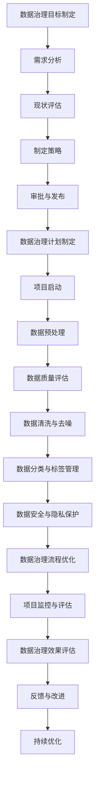

                 

# 《AI创业公司的数据治理策略优化》

## 摘要

随着人工智能技术的快速发展，AI创业公司面临着越来越多的数据治理挑战。数据治理不仅是确保数据质量和安全的关键，也是支持公司业务创新和决策的重要手段。本文旨在探讨AI创业公司数据治理策略的优化，从数据质量管理、数据分类与标签管理、数据安全与隐私保护等方面进行分析，并提出一系列实践建议。文章分为七个部分，包括数据治理概述、基本概念、组织与人员、工具与技术、策略制定与实施、AI项目中的应用以及最佳实践与未来趋势。通过详细的理论分析、实践案例和技术讲解，本文为AI创业公司提供了一套全面的数据治理策略优化方案，旨在提升数据治理能力，推动业务持续发展。

## 第一部分：引言

### 第1章：AI创业公司的数据治理概述

在当今数字化时代，人工智能（AI）技术的快速发展已经成为各行各业转型的重要驱动力。AI创业公司作为创新的前沿力量，需要面对大量的数据管理和治理挑战。数据治理不仅是确保数据质量和安全的关键，也是支持公司业务创新和决策的重要手段。因此，研究和优化AI创业公司的数据治理策略具有重要意义。

### 1.1 AI创业公司的发展背景

AI创业公司的发展背景可以从以下几个方面进行分析：

**1.1.1 传统行业转型需求**

传统行业的数字化转型已经成为必然趋势。随着互联网、大数据和云计算等技术的发展，传统行业需要借助AI技术来提升效率、降低成本、优化业务流程，从而实现转型升级。AI创业公司在这一过程中发挥着关键作用，为传统行业提供定制化的解决方案。

**1.1.2 创业公司对数据价值的重视**

数据是AI创业公司最宝贵的资产之一。创业公司通常具有敏捷的开发能力和对市场变化的敏锐洞察，这使得他们更加重视数据的价值，愿意投入资源进行数据治理。数据治理不仅有助于提高数据质量，还能支持业务决策和创新。

**1.1.3 创新业务模式的需求**

AI创业公司往往通过创新业务模式来获取竞争优势。例如，通过数据驱动的个性化推荐、智能客服、自动化交易等业务模式，公司能够提供更优质的服务，吸引更多客户。数据治理在这一过程中发挥着关键作用，确保数据的有效利用和业务模式的持续优化。

### 1.2 数据治理的重要性

数据治理在AI创业公司中具有以下几个重要性：

**1.2.1 数据质量保障**

高质量的数据是AI创业公司成功的基础。数据治理通过数据质量管理、数据清洗和去噪等技术手段，确保数据的准确性、完整性和一致性，从而提高决策的可靠性。

**1.2.2 数据安全与隐私保护**

随着数据规模的不断扩大，数据安全与隐私保护成为AI创业公司面临的重要挑战。数据治理通过制定安全策略、实施加密技术和遵守隐私保护法规，确保数据的机密性和合规性。

**1.2.3 数据驱动决策**

AI创业公司依靠数据来驱动业务决策。数据治理通过数据集成、数据仓库建设和数据分析等技术手段，提供高质量的数据支持，帮助公司更好地理解市场、优化业务流程和预测未来趋势。

### 1.3 数据治理策略框架

数据治理策略框架是确保数据治理有效实施的重要依据。一个完整的数据治理策略框架通常包括以下几个核心组成部分：

**1.3.1 数据质量管理**

数据质量管理是数据治理的首要任务。通过数据质量评估、数据清洗和去噪等技术手段，确保数据的准确性、完整性和一致性。

**1.3.2 数据分类与标签管理**

数据分类与标签管理有助于提高数据的可寻性和可理解性。通过对数据进行分类和打标签，可以方便地管理和查找数据，提高数据利用效率。

**1.3.3 数据安全与隐私保护**

数据安全与隐私保护是数据治理的重要方面。通过制定安全策略、实施加密技术和遵守隐私保护法规，确保数据的机密性和合规性。

**1.3.4 数据治理组织与人员配置**

数据治理组织与人员配置是确保数据治理有效实施的关键。建立一个专门的数据治理团队，明确各成员的职责和权限，制定科学的数据治理流程。

**1.3.5 数据治理技术与工具**

数据治理技术与工具是实现数据治理目标的重要手段。选择合适的数据治理工具，如数据质量管理工具、数据分类与标签管理工具和安全与隐私保护工具，可以提高数据治理的效率。

**1.3.6 数据治理策略的制定与实施**

数据治理策略的制定与实施是确保数据治理持续改进的关键。通过制定数据治理策略、实施数据治理项目和管理效果评估，确保数据治理策略的有效实施。

### 总结

本章对AI创业公司的数据治理概述进行了详细分析，包括其发展背景、重要性以及数据治理策略框架。接下来，我们将进一步探讨数据治理的基本概念，包括数据质量管理、数据分类与标签管理、数据安全与隐私保护等内容。通过这些讨论，我们将为AI创业公司提供一套全面的数据治理策略优化方案，助力其在竞争激烈的市场中脱颖而出。

## 第二部分：数据治理的基本概念

在数据治理的框架中，理解数据质量管理、数据分类与标签管理以及数据安全与隐私保护是至关重要的。这些基本概念构成了数据治理的核心，确保数据的准确性、一致性、安全性和合规性，从而支持公司的业务创新和决策。

### 2.1 数据质量管理

**2.1.1 数据质量的定义**

数据质量是指数据满足特定应用需求的能力。高质量的数据应当具有以下特征：

- **准确性**：数据真实且与实际业务情况相符。
- **完整性**：数据集合中没有缺失值。
- **一致性**：数据在不同系统、部门和格式之间保持一致。
- **及时性**：数据能够在需要的时间内提供。
- **可靠性**：数据来源可信且经过验证。
- **可访问性**：数据易于访问和使用。
- **可理解性**：数据易于理解，包含必要的背景和上下文信息。

**2.1.2 数据质量评估方法**

数据质量评估是一个系统性过程，用于识别、测量和改进数据质量。以下是一些常见的数据质量评估方法：

- **KDD过程**：知识发现（KDD）过程包括数据预处理、数据挖掘、结果评估和知识表示四个步骤，可用于评估数据质量。
- **数据质量度量**：常用的数据质量度量包括缺失率、重复率、一致性比率、准确性、及时性等。
- **数据质量评估工具**：例如，OpenRefine、Talend Open Studio、Informatica PowerCenter等工具可以帮助评估和改进数据质量。

**2.1.3 数据质量改进策略**

改进数据质量的关键策略包括：

- **数据清洗**：识别和修正数据中的错误、重复和不一致。
- **数据集成**：合并来自多个源的数据，消除重复和数据冲突。
- **数据标准化**：对数据进行格式化和标准化，确保一致性。
- **数据治理**：通过制定数据治理策略、流程和标准来持续改进数据质量。
- **数据质量监控**：建立数据质量监控系统，实时监控数据质量变化。

**数学模型和数学公式**

数据质量评估的一个基本数学模型是数据质量得分（Quality Score，Q Score）的计算：

$$
Q_Score = \frac{Q_C + Q_A + Q_C + Q_T + Q_R + Q_U + Q_I}{7}
$$

其中，$Q_C$表示准确性，$Q_A$表示完整性，$Q_C$表示一致性，$Q_T$表示及时性，$Q_R$表示可靠性，$Q_U$表示可访问性，$Q_I$表示可理解性。

**详细讲解与举例说明**

假设有一份数据集，包含以下属性：姓名、年龄、收入、职业。我们希望评估这份数据的质量。通过以下步骤，我们可以计算数据质量得分：

1. **准确性评估**：检查数据是否准确。例如，发现某个姓名字段包含无效字符，修正后准确性提高。
2. **完整性评估**：检查是否存在缺失值。例如，发现年龄字段中有10%的数据缺失，补充完整后完整性提高。
3. **一致性评估**：检查数据在不同字段之间是否一致。例如，发现某些收入数据与职业字段不匹配，调整后一致性提高。
4. **及时性评估**：检查数据是否在规定时间内提供。例如，发现某些收入数据已过期，更新为最新数据后及时性提高。
5. **可靠性评估**：检查数据来源是否可信。例如，从权威机构获取的数据可靠性更高。
6. **可访问性评估**：检查数据是否易于访问和使用。例如，通过优化数据库查询性能提高可访问性。
7. **可理解性评估**：检查数据是否包含必要的背景和上下文信息。例如，为每条数据添加说明和注释。

通过计算上述七个方面的得分，我们可以得到数据质量得分。例如：

$$
Q_Score = \frac{0.9 + 0.9 + 0.8 + 0.9 + 0.9 + 0.9 + 0.8}{7} = 0.875
$$

数据质量得分越高，表示数据质量越好。

### 2.2 数据分类与标签管理

**2.2.1 数据分类的原则**

数据分类是数据治理的重要环节，有助于提高数据的可管理性和可访问性。以下是一些数据分类的原则：

- **基于业务需求**：数据分类应该与业务需求紧密相关，确保数据能够满足业务应用的需求。
- **一致性**：数据分类标准应保持一致性，避免重复和数据冲突。
- **层次性**：数据分类应具有一定的层次结构，便于管理和查询。
- **灵活性**：数据分类应具有一定的灵活性，能够适应业务变化和需求。

**2.2.2 数据标签的规范**

数据标签是数据分类的进一步细化，有助于提高数据的可理解和可搜索性。以下是一些数据标签的规范：

- **唯一性**：每个数据标签应具有唯一性，避免重复和冲突。
- **准确性**：数据标签应准确描述数据的内容和属性。
- **一致性**：数据标签应在不同系统和部门之间保持一致性。
- **可扩展性**：数据标签应能够适应未来业务扩展和变化。

**2.2.3 数据标签管理的实施**

数据标签管理的实施包括以下步骤：

1. **制定标签规范**：根据业务需求制定数据标签规范，明确标签的类型、命名规则和使用范围。
2. **标签标准化**：对现有数据进行标签标准化，确保标签的一致性和准确性。
3. **标签维护**：定期检查和更新数据标签，确保标签的实时性和有效性。
4. **标签应用**：将数据标签应用于数据存储和管理系统，提高数据的可管理和可访问性。

**数学模型和数学公式**

数据分类和标签管理的一个基本数学模型是标签覆盖率（Tag Coverage）的计算：

$$
Tag\_Coverage = \frac{Total\_Tags}{Total\_Data}
$$

其中，$Total\_Tags$表示标签总数，$Total\_Data$表示数据总数。标签覆盖率越高，表示数据分类和标签管理的有效性越高。

**详细讲解与举例说明**

假设有一份数据集，包含以下类别：产品、客户、订单。我们希望对这些数据分类并打标签。通过以下步骤，我们可以提高数据分类和标签管理的有效性：

1. **制定分类规范**：根据业务需求，将数据分为产品、客户、订单三个主要类别。
2. **标签标准化**：为每个类别制定标签命名规则，例如产品使用“Prod_XXXX”，客户使用“Cust_XXXX”，订单使用“Order_XXXX”。
3. **标签应用**：对每个数据项应用相应的标签，例如将产品数据打上“Prod_1001”标签，将客户数据打上“Cust_1001”标签，将订单数据打上“Order_1001”标签。
4. **标签覆盖率计算**：计算标签覆盖率，例如：

$$
Tag\_Coverage = \frac{Total\_Tags}{Total\_Data} = \frac{1000 + 1000 + 1000}{5000} = 0.6
$$

标签覆盖率60%，表示数据分类和标签管理的有效性较高。

### 2.3 数据安全与隐私保护

**2.3.1 数据安全的概念**

数据安全是指保护数据免受未经授权的访问、篡改、泄露和破坏。数据安全包括以下几个方面：

- **数据机密性**：确保数据在传输和存储过程中不被未授权人员访问。
- **数据完整性**：确保数据在传输和存储过程中不被篡改或破坏。
- **数据可用性**：确保数据在需要时能够被授权人员访问和使用。
- **数据可审计性**：确保数据访问和使用过程能够被审计和追踪。

**2.3.2 数据安全策略**

数据安全策略是确保数据安全的关键。以下是一些常见的数据安全策略：

- **访问控制**：通过身份验证、权限管理和访问控制列表（ACL）来限制数据访问。
- **加密技术**：使用加密算法对数据进行加密，确保数据在传输和存储过程中不被窃取。
- **数据备份与恢复**：定期备份数据，确保数据在发生灾难时能够恢复。
- **网络安全**：建立防火墙、入侵检测系统和安全审计机制，保护网络环境。
- **安全培训**：对员工进行安全培训，提高安全意识和安全操作技能。

**2.3.3 隐私保护法规与合规性**

隐私保护法规与合规性是确保数据安全的重要保障。以下是一些常见的隐私保护法规和合规性要求：

- **通用数据保护条例（GDPR）**：欧盟制定的隐私保护法规，要求企业在处理个人数据时必须遵守一系列规定，包括数据收集、存储、处理和传输等。
- **加州消费者隐私法（CCPA）**：美国加州制定的隐私保护法规，要求企业在处理消费者数据时必须告知消费者其数据的使用方式和权利。
- **信息安全技术标准（ISO 27001）**：国际标准化组织制定的隐私保护标准，要求企业建立和维护一个全面的信息安全管理系统。

**数学模型和数学公式**

数据安全风险评估的一个基本数学模型是风险系数（Risk Coefficient）的计算：

$$
Risk\_Coefficient = \frac{Risk\_Probability \times Risk\_Impact}{2}
$$

其中，$Risk\_Probability$表示风险发生的概率，$Risk\_Impact$表示风险发生的影响。风险系数越高，表示数据安全风险越大。

**详细讲解与举例说明**

假设有一个AI创业公司，其数据安全面临以下风险：

- **风险发生概率**：50%
- **风险影响**：重大损失

通过计算风险系数，我们可以评估数据安全风险：

$$
Risk\_Coefficient = \frac{0.5 \times 10}{2} = 2.5
$$

风险系数2.5表示该AI创业公司的数据安全风险较高，需要采取进一步的措施来降低风险。

### 总结

本章详细介绍了数据治理的基本概念，包括数据质量管理、数据分类与标签管理、数据安全与隐私保护。通过理论分析和实际案例，我们了解了如何评估和改进数据质量、如何进行数据分类与标签管理以及如何保护数据安全与隐私。这些概念和方法为AI创业公司的数据治理提供了基础和指导。接下来，我们将探讨数据治理的组织与人员配置，为数据治理的有效实施奠定基础。

## 第三部分：数据治理的组织与人员配置

有效的数据治理不仅依赖于先进的技术和工具，还需要有合适的数据治理组织和人员配置。数据治理组织架构的建立和数据治理人员的培训与能力建设是确保数据治理策略成功实施的关键因素。

### 3.1 数据治理组织架构

**3.1.1 数据治理委员会**

数据治理委员会是公司数据治理的最高决策机构，负责制定和监督数据治理策略的实施。其职责包括：

- **制定数据治理策略**：根据公司业务需求和合规要求，制定数据治理方针和目标。
- **审批数据治理项目**：对重大数据治理项目进行审批，确保项目符合公司数据治理策略。
- **监督和评估**：监督数据治理工作的执行情况，定期评估数据治理效果。

**3.1.2 数据治理团队的角色与职责**

数据治理团队是数据治理工作的执行者，其成员包括：

- **数据治理主管**：负责制定和执行数据治理计划，协调各部门的数据治理工作。
- **数据管理员**：负责数据质量管理、数据安全和隐私保护等工作。
- **数据分析师**：负责数据分析和报告，提供数据驱动的业务决策支持。
- **IT支持人员**：负责数据治理技术的实施和维护，确保数据治理系统的正常运行。

**3.1.3 数据治理流程的设计**

数据治理流程是确保数据治理工作有序进行的关键。数据治理流程通常包括以下步骤：

1. **数据需求分析**：了解业务需求，明确数据治理的目标和范围。
2. **数据识别和分类**：识别公司内部和外部的数据资源，对数据进行分类和标签管理。
3. **数据质量评估**：评估数据的质量，识别和解决数据质量问题。
4. **数据安全管理**：制定和实施数据安全策略，确保数据的安全性和合规性。
5. **数据治理监控和改进**：监控数据治理工作进展，定期评估和改进数据治理效果。

### 3.2 数据治理人员培训与能力建设

**3.2.1 数据治理培训课程设计**

数据治理培训课程设计应围绕数据治理的核心知识和技能，包括：

- **数据治理基础知识**：介绍数据治理的概念、原则和策略。
- **数据质量管理**：讲解数据质量评估、数据清洗和数据质量改进的方法。
- **数据安全与隐私保护**：介绍数据安全策略、加密技术和隐私保护法规。
- **数据治理工具应用**：培训使用数据治理工具，如数据质量管理工具、数据分类与标签管理工具等。
- **数据分析和报告**：培训如何利用数据分析工具进行数据分析和报告编写。

**3.2.2 数据治理技能评估与提升**

数据治理技能评估与提升包括以下步骤：

- **技能评估**：通过考核和实际操作，评估数据治理人员的技能水平。
- **技能提升**：针对评估结果，制定个性化的培训计划，提升数据治理人员的技能。
- **实践锻炼**：通过参与数据治理项目，锻炼数据治理人员的实际操作能力。

**3.2.3 数据治理人才引进策略**

数据治理人才引进策略包括：

- **招聘渠道**：通过招聘网站、行业峰会、专业社区等渠道招聘数据治理专业人才。
- **人才标准**：制定明确的数据治理人才标准，包括专业背景、技能水平和工作经验等。
- **人才激励机制**：建立有效的激励机制，吸引和留住优秀的数据治理人才。

**数学模型和数学公式**

数据治理人员技能评估的一个基本数学模型是技能得分（Skill Score）的计算：

$$
Skill\_Score = \frac{Theory\_Score + Practice\_Score}{2}
$$

其中，$Theory\_Score$表示理论知识得分，$Practice\_Score$表示实际操作得分。技能得分越高，表示数据治理人员的技能水平越高。

**详细讲解与举例说明**

假设有一个数据治理团队，其成员包括2名数据管理员、3名数据分析师和1名数据治理主管。以下是一个数据治理人员技能评估和提升的例子：

1. **技能评估**：
   - 数据管理员A：理论知识得分80分，实际操作得分85分；
   - 数据管理员B：理论知识得分75分，实际操作得分90分；
   - 数据分析师C：理论知识得分85分，实际操作得分80分；
   - 数据分析师D：理论知识得分90分，实际操作得分85分；
   - 数据治理主管E：理论知识得分95分，实际操作得分90分。

   计算技能得分：
   - 数据管理员A：Skill\_Score = (80 + 85) / 2 = 82.5分；
   - 数据管理员B：Skill\_Score = (75 + 90) / 2 = 82.5分；
   - 数据分析师C：Skill\_Score = (85 + 80) / 2 = 82.5分；
   - 数据分析师D：Skill\_Score = (90 + 85) / 2 = 87.5分；
   - 数据治理主管E：Skill\_Score = (95 + 90) / 2 = 92.5分。

   根据技能得分，团队可以制定个性化的培训计划，提升数据治理人员的技能水平。

2. **技能提升**：
   - 数据管理员A：参加数据质量管理培训课程，提升理论知识；
   - 数据管理员B：参加数据安全与隐私保护培训课程，提升实际操作技能；
   - 数据分析师C：参加数据分析工具应用培训课程，提升数据分析能力；
   - 数据分析师D：参加数据可视化培训课程，提升数据报告编写技能；
   - 数据治理主管E：参加领导力培训课程，提升团队管理和决策能力。

通过技能评估和提升，数据治理团队的整体技能水平得到提升，为公司数据治理工作的有效实施提供了保障。

### 总结

本章节详细介绍了数据治理的组织与人员配置，包括数据治理组织架构、数据治理团队的角色与职责以及数据治理人员培训与能力建设。通过合理的组织架构和有效的培训机制，可以确保数据治理策略的成功实施。接下来，我们将探讨数据治理工具与技术，为AI创业公司的数据治理提供技术支持。

### 3.1 数据治理组织架构

**3.1.1 数据治理委员会**

数据治理委员会是公司数据治理的最高决策机构，其职责和角色如下：

1. **制定数据治理策略**：数据治理委员会负责制定公司的数据治理策略，确保数据治理工作与公司的业务目标、法规要求和安全标准相一致。

2. **审批重大数据治理项目**：对于涉及重大数据治理项目，如数据仓库建设、数据安全升级等，数据治理委员会负责审批项目的可行性、预算和实施计划。

3. **监督数据治理执行**：数据治理委员会监督各部门执行数据治理策略的情况，确保数据治理工作的有序推进。

4. **数据治理策略的评估与调整**：数据治理委员会定期评估数据治理策略的实施效果，并根据评估结果进行调整，以适应公司业务的发展和外部环境的变化。

**3.1.2 数据治理团队的角色与职责**

数据治理团队是数据治理工作的核心执行者，其成员通常包括以下角色：

1. **数据治理主管**：负责数据治理团队的管理和协调，制定数据治理计划和流程，确保数据治理策略的有效实施。

2. **数据管理员**：负责数据质量管理的具体实施，包括数据清洗、数据集成和数据质量管理工具的配置和使用。

3. **数据分析师**：负责数据分析工作，提供数据驱动的业务洞察，支持公司决策制定。

4. **IT支持人员**：负责数据治理相关IT系统的建设和维护，确保数据治理工具的稳定运行。

**3.1.3 数据治理流程的设计**

数据治理流程是确保数据治理工作有序进行的关键，一般包括以下步骤：

1. **需求分析**：了解业务需求，明确数据治理的目标和范围。

2. **数据识别和分类**：识别公司内部和外部的数据资源，对数据进行分类和标签管理。

3. **数据质量评估**：评估数据的质量，识别和解决数据质量问题。

4. **数据安全管理**：制定和实施数据安全策略，确保数据的安全性和合规性。

5. **数据治理监控和改进**：监控数据治理工作进展，定期评估和改进数据治理效果。

### 3.2 数据治理人员培训与能力建设

**3.2.1 数据治理培训课程设计**

为了确保数据治理团队具备必要的知识和技能，公司应设计系统化的培训课程，包括：

1. **数据治理基础课程**：介绍数据治理的概念、原则和策略。

2. **数据质量管理课程**：讲解数据质量评估、数据清洗和数据质量改进的方法。

3. **数据安全与隐私保护课程**：介绍数据安全策略、加密技术和隐私保护法规。

4. **数据分析和报告编写课程**：培训如何利用数据分析工具进行数据分析和报告编写。

5. **数据治理工具应用课程**：培训使用数据治理工具，如数据质量管理工具、数据分类与标签管理工具等。

**3.2.2 数据治理技能评估与提升**

1. **技能评估**：通过定期考核和实际操作，评估数据治理人员的技能水平。

2. **技能提升**：针对评估结果，制定个性化的培训计划，提升数据治理人员的技能。

3. **实践锻炼**：通过参与数据治理项目，锻炼数据治理人员的实际操作能力。

**3.2.3 数据治理人才引进策略**

1. **招聘渠道**：通过招聘网站、行业峰会、专业社区等渠道招聘数据治理专业人才。

2. **人才标准**：制定明确的数据治理人才标准，包括专业背景、技能水平和工作经验等。

3. **人才激励机制**：建立有效的激励机制，吸引和留住优秀的数据治理人才。

### 总结

通过建立合理的组织架构和提供系统化的培训，AI创业公司可以确保数据治理团队具备必要的知识和技能，从而有效实施数据治理策略。接下来，我们将探讨数据治理工具与技术，为AI创业公司的数据治理提供技术支持。

## 第四部分：数据治理工具与技术

在数据治理的过程中，选择合适的工具和技术是实现高效治理的关键。本章节将详细介绍数据治理工具的选择、数据治理技术的应用，以及这些工具和技术在实际项目中的应用。

### 4.1 数据治理工具的选择

**4.1.1 数据质量管理工具**

数据质量管理工具用于识别、评估和改进数据质量。以下是几种常见的数据质量管理工具：

- **OpenRefine**：一款开源的数据清洗和整理工具，适用于小规模数据的清洗和转换。
- **Talend Open Studio**：一款功能强大的数据集成和数据质量工具，适用于中大型企业的数据治理。
- **Informatica PowerCenter**：一款成熟的数据集成和数据质量管理工具，提供丰富的数据清洗、转换和集成功能。

**4.1.2 数据分类与标签管理工具**

数据分类与标签管理工具用于对数据进行分类和打标签，以提高数据的可管理性和可访问性。以下是几种常用的数据分类与标签管理工具：

- **Apache Atlas**：一款开源的数据分类与标签管理工具，提供数据分类、标签管理和数据质量评估功能。
- **Informatica Data Governance**：一款商业化的数据分类与标签管理工具，提供全面的分类、标签管理和数据治理功能。
- **IBM InfoSphere Information Governance**：一款功能强大的数据治理工具，包括数据分类、标签管理、数据安全和隐私保护等功能。

**4.1.3 数据安全与隐私保护工具**

数据安全与隐私保护工具用于确保数据的安全性和合规性。以下是几种常用的数据安全与隐私保护工具：

- **Splunk**：一款用于实时监控和分析网络和系统日志的工具，有助于识别潜在的安全威胁。
- **RSA NetWitness**：一款集成了安全信息和事件管理（SIEM）功能的工具，提供实时威胁检测、响应和报告。
- **Symantec Data Loss Prevention**：一款用于数据泄漏防护的工具，可以监控和防止敏感数据的未经授权的传输和泄露。

### 4.2 数据治理技术的应用

**4.2.1 数据清洗与去噪技术**

数据清洗与去噪技术是数据治理的重要环节，用于识别和修复数据中的错误、重复和不一致。以下是一些常用的数据清洗与去噪技术：

- **数据清洗规则**：通过定义数据清洗规则，自动化识别和修复数据中的错误。例如，使用正则表达式匹配和替换无效数据。
- **去噪算法**：例如，使用聚类算法（如K-means）将相似的数据分组，然后删除重复或异常数据。
- **数据标准化**：通过数据标准化技术，将数据转换为统一的格式，确保数据的一致性和可比较性。

**4.2.2 数据集成与数据仓库建设**

数据集成与数据仓库建设是数据治理的核心，用于将不同来源的数据整合到一个统一的数据仓库中。以下是一些常用的数据集成与数据仓库建设技术：

- **数据集成工具**：例如，使用ETL（Extract, Transform, Load）工具，如Informatica PowerCenter、Apache NiFi等，将数据从不同源提取、转换和加载到数据仓库。
- **数据仓库建模**：使用数据仓库建模技术，如星型模式、雪花模式等，设计高效的数据仓库结构。
- **数据仓库优化**：通过索引、分区和压缩等技术，优化数据仓库的性能和存储空间。

**4.2.3 数据分析与应用开发**

数据分析与应用开发是数据治理的重要目标，用于从数据中提取价值，支持业务决策和创新。以下是一些常用的数据分析与应用开发技术：

- **数据分析工具**：例如，使用SQL、Python、R等语言进行数据分析，利用Pandas、NumPy等库处理复杂数据。
- **数据可视化**：使用数据可视化工具，如Tableau、Power BI等，将数据分析结果以图表和报表的形式展示。
- **机器学习应用**：利用机器学习算法，如回归、分类、聚类等，构建预测模型和推荐系统，支持业务决策和创新。

### 4.3 数据治理工具与技术在实际项目中的应用

**4.3.1 项目实战：推荐系统的数据治理**

推荐系统是一个典型的数据驱动应用，其数据治理至关重要。以下是一个推荐系统数据治理的实际项目案例：

1. **需求分析**：了解推荐系统的业务需求，明确数据治理的目标和范围。
2. **数据集成**：使用ETL工具，将用户行为数据、商品数据和交易数据集成到一个统一的数据仓库中。
3. **数据清洗**：使用数据清洗工具，识别和修复数据中的错误、重复和不一致。
4. **数据分类与标签管理**：使用数据分类与标签管理工具，对用户行为数据进行分类和打标签，如用户ID、商品ID、行为类型等。
5. **数据分析与应用开发**：使用数据分析工具，分析用户行为数据，构建推荐模型，如协同过滤、基于内容的推荐等。

**4.3.2 项目实战：图像识别系统的数据治理**

图像识别系统是一个高度依赖数据质量的AI应用。以下是一个图像识别系统数据治理的实际项目案例：

1. **数据采集**：从多个来源采集图像数据，包括公开数据集和私有数据集。
2. **数据预处理**：使用数据清洗工具，去除噪声、修复图像中的缺陷，如压缩、缩放、旋转等。
3. **数据分类与标签管理**：使用数据分类与标签管理工具，对图像数据进行分类和打标签，如类别名称、标签名称等。
4. **数据质量评估**：使用数据质量评估工具，评估图像数据的质量，如准确性、完整性、一致性等。
5. **模型训练与优化**：使用机器学习算法，训练和优化图像识别模型，确保模型的质量和性能。

**4.3.3 项目实战：自然语言处理系统的数据治理**

自然语言处理（NLP）系统在文本分析和语义理解方面发挥着重要作用。以下是一个NLP系统数据治理的实际项目案例：

1. **文本数据采集**：从多种来源采集文本数据，如社交媒体、新闻文章、用户评论等。
2. **数据预处理**：使用数据清洗工具，去除文本中的噪声、标点和停用词，进行分词和词性标注。
3. **数据分类与标签管理**：使用数据分类与标签管理工具，对文本数据进行分类和打标签，如主题、情感等。
4. **数据质量评估**：使用数据质量评估工具，评估文本数据的质量，如准确性、完整性、一致性等。
5. **模型训练与优化**：使用机器学习算法，训练和优化NLP模型，如文本分类、情感分析、命名实体识别等。

### 总结

通过合理选择数据治理工具和技术，并在实际项目中加以应用，AI创业公司可以确保数据治理的高效和准确。接下来，我们将探讨如何制定和实施数据治理策略，为AI创业公司的数据治理提供实践指导。

## 第五部分：数据治理策略的制定与实施

### 5.1 数据治理策略的制定

数据治理策略的制定是确保数据治理工作有序进行和有效实施的关键步骤。一个完整的数据治理策略应包括以下几个方面：

**5.1.1 制定数据治理策略的目标**

制定数据治理策略的目标应明确，通常包括：

- 提高数据质量，确保数据的准确性、完整性、一致性和可靠性。
- 加强数据安全，防止数据泄露、篡改和未授权访问。
- 提升数据利用率，支持业务决策和创新。
- 符合相关法规和标准，确保合规性。

**5.1.2 数据治理策略的制定流程**

制定数据治理策略的流程通常包括以下步骤：

1. **需求分析**：了解业务需求，明确数据治理的目标和范围。
2. **现状评估**：评估当前数据治理的不足和问题，分析数据治理的需求和可行性。
3. **制定策略**：根据需求分析和现状评估，制定具体的数据治理策略，包括数据质量、数据安全、数据隐私保护等。
4. **审批与发布**：将数据治理策略提交给数据治理委员会审批，经过批准后正式发布。

**5.1.3 数据治理策略的内容**

数据治理策略应包含以下内容：

- **数据质量管理策略**：明确数据质量管理的目标和具体措施，如数据清洗、数据集成和数据质量评估等。
- **数据安全与隐私保护策略**：明确数据安全策略和隐私保护措施，如访问控制、数据加密、备份和恢复等。
- **数据治理流程**：定义数据治理的具体流程，包括数据采集、数据分类、数据存储、数据使用和数据销毁等。
- **责任与权限**：明确数据治理中各角色的责任和权限，如数据治理主管、数据管理员、数据分析师等。

### 5.2 数据治理策略的实施

数据治理策略的实施是确保策略目标得以实现的关键环节。以下是数据治理策略实施的主要步骤：

**5.2.1 数据治理计划的制定**

制定数据治理计划是实施数据治理策略的基础。数据治理计划应包括以下内容：

- **项目目标**：明确数据治理项目的具体目标，如提高数据质量、加强数据安全等。
- **项目范围**：界定数据治理项目的范围，包括数据类型、数据源和数据治理工具等。
- **项目时间表**：制定项目的时间表，包括项目的启动、实施、监控和关闭等关键时间节点。
- **项目资源**：列出项目所需的资源，包括人员、技术和预算等。
- **风险和应对措施**：识别项目可能面临的风险，并制定相应的应对措施。

**5.2.2 数据治理项目的执行**

数据治理项目的执行是实施数据治理策略的具体行动。以下是数据治理项目执行的主要步骤：

1. **项目启动**：召开项目启动会议，明确项目目标和团队职责，确保项目团队成员了解项目计划和进度。
2. **项目实施**：按照项目计划，逐步实施数据治理措施，如数据清洗、数据分类、数据安全设置等。
3. **项目监控**：实时监控项目进展，确保项目按照计划进行，及时发现和解决问题。
4. **项目验收**：在项目完成后，进行项目验收，评估项目成果是否符合预期，确保数据治理策略得到有效实施。

**5.2.3 数据治理效果的评估**

数据治理效果的评估是确保数据治理策略有效性的重要环节。以下是数据治理效果评估的主要步骤：

1. **制定评估指标**：根据数据治理策略的目标，制定具体的评估指标，如数据质量评分、数据安全事件率、数据利用率等。
2. **数据收集**：收集相关数据，用于评估数据治理效果。
3. **数据分析**：对收集到的数据进行分析，评估数据治理策略的实施效果。
4. **反馈与改进**：根据评估结果，反馈数据治理效果，识别存在的问题和改进空间，持续优化数据治理策略。

### 总结

数据治理策略的制定与实施是确保数据治理工作有序进行和有效实施的关键。通过合理制定数据治理策略和有序实施数据治理计划，AI创业公司可以确保数据质量、数据安全和数据利用率的提升，从而支持业务创新和持续发展。接下来，我们将探讨数据治理在AI项目中的应用，进一步了解数据治理如何为AI项目提供支持。

## 第五部分：数据治理策略的制定与实施

### 5.1 数据治理策略的制定

**5.1.1 数据治理策略的制定流程**

1. **需求分析**：首先，需要深入了解公司的业务需求，明确数据治理的目标和范围。业务需求可能包括提高数据质量、确保数据安全、提升数据利用率和符合法规要求等。

2. **现状评估**：对公司现有的数据治理情况进行全面评估，包括数据质量、数据安全、数据管理和合规性等方面。评估过程中，需要识别当前数据治理的不足和问题，如数据质量问题、数据安全性不足、流程不完善等。

3. **策略制定**：基于需求分析和现状评估，制定具体的数据治理策略。策略应包括以下核心内容：

   - **数据质量管理策略**：明确数据质量管理的目标和措施，如数据清洗、数据集成和数据质量评估等。
   - **数据安全与隐私保护策略**：制定数据安全策略和隐私保护措施，如访问控制、数据加密、备份和恢复等。
   - **数据治理流程**：定义数据治理的具体流程，包括数据采集、数据分类、数据存储、数据使用和数据销毁等。
   - **责任与权限**：明确数据治理中各角色的责任和权限，如数据治理主管、数据管理员、数据分析师等。

4. **审批与发布**：将制定好的数据治理策略提交给数据治理委员会或相关管理层审批。审批通过后，正式发布数据治理策略，确保全体员工了解并遵守策略。

**5.1.2 数据治理策略的制定流程**

1. **制定数据治理计划**：在数据治理策略的基础上，制定具体的实施计划。数据治理计划应包括以下内容：

   - **项目目标**：明确数据治理项目的具体目标，如提高数据质量、加强数据安全等。
   - **项目范围**：界定数据治理项目的范围，包括数据类型、数据源和数据治理工具等。
   - **项目时间表**：制定项目的时间表，包括项目的启动、实施、监控和关闭等关键时间节点。
   - **项目资源**：列出项目所需的资源，包括人员、技术和预算等。
   - **风险和应对措施**：识别项目可能面临的风险，并制定相应的应对措施。

2. **项目启动与实施**：

   - **项目启动**：召开项目启动会议，明确项目目标和团队职责，确保项目团队成员了解项目计划和进度。
   - **项目实施**：按照项目计划，逐步实施数据治理措施，如数据清洗、数据分类、数据安全设置等。
   - **项目监控**：实时监控项目进展，确保项目按照计划进行，及时发现和解决问题。

3. **项目验收与评估**：

   - **项目验收**：在项目完成后，进行项目验收，评估项目成果是否符合预期，确保数据治理策略得到有效实施。
   - **效果评估**：制定评估指标，对数据治理策略的实施效果进行评估，如数据质量评分、数据安全事件率、数据利用率等。

### 5.2 数据治理策略的实施

数据治理策略的实施是确保策略目标得以实现的关键环节。以下是数据治理策略实施的主要步骤：

**5.2.1 制定详细的数据治理计划**

在制定数据治理计划时，应考虑以下几个方面：

- **明确项目目标**：确保数据治理计划与公司的整体战略目标保持一致。
- **界定项目范围**：明确数据治理计划涉及的数据类型、数据源和数据治理工具。
- **制定时间表**：根据项目目标，制定详细的时间表，确保项目按计划推进。
- **分配资源**：确保项目有足够的资源和预算支持。
- **风险和应对措施**：识别项目可能面临的风险，并制定相应的应对措施。

**5.2.2 项目实施**

1. **数据质量管理**：

   - **数据质量评估**：使用数据质量评估工具，对现有数据进行全面评估，识别数据质量问题。
   - **数据清洗**：通过数据清洗工具，修复和更新数据中的错误和缺失值。
   - **数据标准化**：对数据进行格式化和标准化，确保数据的一致性和可比较性。

2. **数据安全与隐私保护**：

   - **数据加密**：对敏感数据进行加密，确保数据在传输和存储过程中的安全性。
   - **访问控制**：实施严格的访问控制措施，确保数据只被授权人员访问。
   - **备份与恢复**：定期备份数据，确保在发生灾难时能够快速恢复。

3. **数据治理流程的优化**：

   - **数据分类与标签管理**：对数据进行分类和打标签，提高数据的可管理和可访问性。
   - **数据存储与管理**：选择合适的数据存储和管理方案，确保数据的安全和高效利用。
   - **数据使用与销毁**：明确数据的生命周期管理，确保数据在过期后被安全销毁。

**5.2.3 项目监控与评估**

1. **项目监控**：实时监控项目进展，确保项目按计划进行，及时发现和解决问题。
2. **效果评估**：

   - **制定评估指标**：根据数据治理策略的目标，制定具体的评估指标，如数据质量评分、数据安全事件率、数据利用率等。
   - **数据收集与分析**：收集相关数据，对数据治理效果进行评估。
   - **反馈与改进**：根据评估结果，反馈数据治理效果，识别存在的问题和改进空间，持续优化数据治理策略。

### 总结

数据治理策略的制定与实施是确保数据治理工作有序进行和有效实施的关键。通过合理制定数据治理策略和有序实施数据治理计划，AI创业公司可以确保数据质量、数据安全和数据利用率的提升，从而支持业务创新和持续发展。接下来，我们将探讨数据治理在AI项目中的应用，进一步了解数据治理如何为AI项目提供支持。

## 第六部分：数据治理在AI项目中的应用

在AI项目中，数据治理不仅是一个技术挑战，也是一个战略性的决策过程。有效的数据治理能够确保AI项目获得高质量的数据，提高模型的准确性和可靠性，从而推动AI应用的落地和持续优化。以下将详细探讨数据治理在AI项目中的需求、数据预处理、数据质量控制、数据安全与隐私保护等方面的应用。

### 6.1 AI项目的数据治理需求

**6.1.1 数据预处理**

数据预处理是AI项目中至关重要的一步，它包括数据清洗、数据格式转换、缺失值填补、异常值处理等。这些步骤的目的是提高数据的可用性和一致性，确保模型能够从高质量的数据中学习。

- **数据清洗**：识别和修正数据中的错误、重复和不一致。
- **数据格式转换**：统一数据格式，确保数据在不同系统之间能够无缝集成。
- **缺失值填补**：采用合适的算法填补缺失值，如均值填补、中位数填补、模型预测等。
- **异常值处理**：识别和处理异常值，防止异常数据对模型造成负面影响。

**6.1.2 数据质量控制**

数据质量控制是确保AI项目数据满足特定应用需求的过程。高质量的数据能够提高模型的准确性和稳定性，降低错误率和不确定性。

- **数据质量评估**：使用指标如准确性、完整性、一致性、及时性和可靠性来评估数据质量。
- **数据质量改进**：通过数据清洗、数据标准化、数据去噪等技术手段来改进数据质量。
- **数据质量监控**：建立数据质量监控机制，实时跟踪和评估数据质量的变化。

**6.1.3 数据安全与隐私保护**

在AI项目中，数据安全和隐私保护至关重要。敏感数据可能在训练模型、模型部署和业务应用中暴露，需要采取严格的措施来保护数据。

- **数据加密**：对敏感数据进行加密，确保数据在传输和存储过程中的安全性。
- **访问控制**：实施严格的访问控制措施，确保数据只被授权人员访问。
- **隐私保护**：采用差分隐私、数据脱敏等技术来保护数据隐私，防止个人隐私泄露。
- **合规性检查**：确保数据治理策略和措施符合相关法规和标准，如GDPR、CCPA等。

### 6.2 数据治理在AI项目中的应用案例

**6.2.1 案例一：推荐系统的数据治理**

推荐系统是一个高度依赖数据质量的AI项目。以下是一个推荐系统的数据治理案例：

1. **数据预处理**：对用户行为数据进行清洗，去除重复和异常数据，统一格式，填补缺失值。
2. **数据质量评估**：使用指标如用户活跃度、点击率、转化率等来评估数据质量。
3. **数据安全与隐私保护**：对用户数据进行加密和脱敏处理，确保数据安全和用户隐私。
4. **数据反馈与优化**：实时监控推荐效果，收集用户反馈，优化推荐算法和数据处理流程。

**6.2.2 案例二：图像识别系统的数据治理**

图像识别系统对数据质量有很高的要求。以下是一个图像识别系统的数据治理案例：

1. **数据采集**：从多个来源采集图像数据，包括公开数据集和私有数据集。
2. **数据预处理**：对图像数据进行清洗、增强和标准化处理，提高数据的一致性和可用性。
3. **数据分类与标签管理**：对图像数据进行分类和打标签，确保数据的准确性和完整性。
4. **数据质量评估**：使用指标如准确率、召回率、F1分数等来评估数据质量。
5. **数据安全与隐私保护**：对图像数据进行加密处理，防止数据泄露。

**6.2.3 案例三：自然语言处理系统的数据治理**

自然语言处理（NLP）系统在处理文本数据时，数据治理尤为重要。以下是一个NLP系统的数据治理案例：

1. **数据采集**：从多种来源采集文本数据，如社交媒体、新闻文章、用户评论等。
2. **数据预处理**：对文本数据进行清洗、去噪和分词处理，确保数据的格式一致性。
3. **数据分类与标签管理**：对文本数据进行分类和打标签，如主题分类、情感分类等。
4. **数据质量评估**：使用指标如词汇覆盖率、句法正确性等来评估数据质量。
5. **数据安全与隐私保护**：对敏感文本数据进行脱敏处理，确保用户隐私。

### 总结

数据治理在AI项目中起着至关重要的作用。通过有效的数据预处理、数据质量控制、数据安全与隐私保护，AI项目能够获得高质量的数据支持，提高模型的准确性和稳定性。实际应用中的案例展示了数据治理在不同AI项目中的具体应用方法和实践效果。接下来，我们将探讨数据治理的最佳实践与未来趋势，为AI创业公司提供进一步的数据治理指导。

## 第七部分：数据治理的最佳实践与未来趋势

### 7.1 数据治理的最佳实践

在AI创业公司的数据治理过程中，一些国际知名企业已经积累了丰富的经验和最佳实践。以下是一些值得借鉴的最佳实践：

**7.1.1 明确数据治理目标**

在数据治理的初期，企业应明确数据治理的目标，确保数据治理工作与公司战略保持一致。例如，阿里巴巴明确其数据治理目标是“让数据创造价值”，从而驱动公司业务增长。

**7.1.2 建立数据治理组织架构**

建立专门的数据治理组织架构，明确数据治理团队的职责和角色，确保数据治理工作的有序进行。例如，谷歌建立了数据治理委员会，负责制定和监督数据治理策略的实施。

**7.1.3 制定全面的策略和流程**

制定详细的数据治理策略和流程，确保数据治理工作的标准化和规范化。例如，IBM制定了《数据治理框架》，涵盖数据质量管理、数据安全、数据隐私保护等多个方面。

**7.1.4 投入资源进行数据治理**

数据治理需要投入充足的资源，包括人力、技术和资金。例如，亚马逊在数据治理方面投入大量资金，建立了大规模的数据治理团队和数据处理平台。

**7.1.5 定期进行数据质量评估**

定期对数据质量进行评估，及时发现和解决数据质量问题。例如，微软每年都会进行大规模的数据质量评估，确保数据满足业务需求。

**7.1.6 强化数据安全和隐私保护**

数据安全和隐私保护是数据治理的重要方面。企业应采取严格的措施，如数据加密、访问控制和数据脱敏，确保数据的安全和合规。例如，苹果在数据治理中采用了多重加密技术，确保用户数据的安全。

### 7.2 数据治理的未来趋势

随着技术的不断进步和业务需求的变化，数据治理也将面临新的挑战和机遇。以下是一些数据治理的未来趋势：

**7.2.1 自动化与智能化**

自动化和智能化技术将在数据治理中发挥重要作用。通过自动化工具，企业可以减少人工干预，提高数据治理的效率。例如，利用机器学习算法，企业可以自动识别和修复数据中的错误。

**7.2.2 新技术的应用**

随着新技术的不断发展，如区块链、物联网和人工智能，数据治理也将面临新的机遇和挑战。这些新技术将为数据治理提供新的工具和方法，如区块链可以确保数据的不可篡改性和透明性，物联网可以实时采集和处理大量数据。

**7.2.3 数据治理与AI的融合**

数据治理与AI的融合将推动数据治理技术的进步。通过将AI技术应用于数据治理，企业可以更有效地管理大量数据，提高数据质量，支持智能决策。例如，利用AI技术，企业可以自动分析大量数据，识别潜在的数据质量问题。

**7.2.4 法规和标准的完善**

随着数据隐私和安全问题的日益突出，相关法规和标准也在不断完善。例如，GDPR、CCPA等法规对企业数据治理提出了更高的要求。企业需要关注法规和标准的变化，确保数据治理策略符合最新的合规要求。

### 总结

数据治理的最佳实践和未来趋势为AI创业公司提供了宝贵的经验和指导。通过借鉴国际知名企业的最佳实践，结合自身实际情况，AI创业公司可以优化数据治理策略，提高数据治理能力，从而在竞争激烈的市场中脱颖而出。未来，随着新技术的不断发展和法规的不断完善，数据治理将继续演进，为AI创业公司提供更强大的支持。

## 参考文献

1. GDPR (2016). General Data Protection Regulation. Official Journal of the European Union.
2. CCPA (2020). California Consumer Privacy Act of 2018. California Legislative Information.
3. IBM. (2021). Data Governance and Compliance. IBM Knowledge Center.
4. Microsoft. (2021). Data Governance and Data Quality. Microsoft Docs.
5. Amazon. (2021). Data Governance Best Practices. AWS Cloud Adoption Framework.
6. Google. (2021). Data Governance and Data Management. Google Cloud Platform.
7. Alibaba. (2021). Data Governance Framework. Alibaba Cloud.
8. Talend. (2021). Data Quality Best Practices. Talend Data Fabric.
9. OpenRefine. (2021). OpenRefine Documentation. OpenRefine.
10. Apache Atlas. (2021). Apache Atlas Documentation. Apache Atlas Project.

## 附录

### 附录A：数据治理相关术语解释

- **数据治理（Data Governance）**：一种系统化的方法，用于管理和控制数据生命周期中的所有方面，包括数据的创建、存储、使用、共享和销毁。
- **数据质量管理（Data Quality Management）**：确保数据符合特定业务需求的系统过程，包括数据清洗、数据验证、数据标准化和数据监控。
- **数据安全（Data Security）**：保护数据免受未经授权访问、篡改和破坏的一系列措施。
- **数据隐私保护（Data Privacy Protection）**：确保个人数据隐私不被侵犯，遵守相关法规和标准。
- **数据分类（Data Classification）**：根据数据的重要性和敏感度，将数据分为不同的类别，以便实施不同的安全和管理措施。
- **数据标签管理（Data Tagging Management）**：为数据打上标签，以提供额外的信息，如数据来源、数据类型和访问权限。
- **数据治理工具（Data Governance Tools）**：用于支持数据治理过程的软件工具，如数据质量管理工具、数据分类与标签管理工具和数据安全与隐私保护工具。

### 附录B：数据治理流程图

### 附录C：数据治理工具资源列表

- **OpenRefine**：[https://openrefine.org/](https://openrefine.org/)
- **Talend Open Studio**：[https://www.talend.com/products/data-quality/](https://www.talend.com/products/data-quality/)
- **Informatica PowerCenter**：[https://www.informatica.com/products/data-integration/informatica-powercenter.html](https://www.informatica.com/products/data-integration/informatica-powercenter.html)
- **Apache Atlas**：[https://atlas.apache.org/](https://atlas.apache.org/)
- **Informatica Data Governance**：[https://www.informatica.com/products/data-governance.html](https://www.informatica.com/products/data-governance.html)
- **IBM InfoSphere Information Governance**：[https://www.ibm.com/analytics/information-governance](https://www.ibm.com/analytics/information-governance)
- **Splunk**：[https://www.splunk.com/](https://www.splunk.com/)
- **RSA NetWitness**：[https://www.rsa.com/](https://www.rsa.com/)
- **Symantec Data Loss Prevention**：[https://www.symantec.com/products/data-loss-prevention](https://www.symantec.com/products/data-loss-prevention)

## 总结

通过本文的详细探讨，我们深入了解了AI创业公司的数据治理策略优化。从数据治理概述、基本概念、组织与人员、工具与技术、策略制定与实施，到AI项目中的应用以及最佳实践与未来趋势，每个部分都为AI创业公司提供了全面的数据治理解决方案。

数据治理不仅是确保数据质量和安全的关键，也是支持业务创新和决策的重要手段。通过优化数据治理策略，AI创业公司可以提升数据质量，加强数据安全，提高数据利用率，从而在竞争激烈的市场中脱颖而出。

未来的数据治理将面临更多的挑战和机遇。自动化、智能化技术将提高数据治理的效率，新技术如区块链、物联网和人工智能将提供新的治理工具和方法。同时，法规和标准的不断完善也将对数据治理提出更高的要求。

我们鼓励读者结合自身实际业务需求，借鉴本文的最佳实践，持续优化数据治理策略。通过数据治理的不断提升，AI创业公司将能够更好地利用数据价值，推动业务持续发展。

最后，感谢读者对本文的关注，希望本文能为您在数据治理领域的探索提供有益的启示。如果您有任何问题或建议，请随时与我们联系。

### 总结

通过本文的深入探讨，我们全面解析了AI创业公司的数据治理策略优化。文章从引言到具体实施，再到最佳实践与未来趋势，层层递进，系统地阐述了数据治理的重要性及其在AI创业公司中的应用。

**核心发现与结论：**

1. **数据治理的重要性**：数据治理是AI创业公司的基石，它确保了数据的准确性、一致性和安全性，从而支持业务决策和创新。
2. **数据治理策略框架**：一个健全的数据治理策略框架应包括数据质量管理、数据分类与标签管理、数据安全与隐私保护、数据治理组织与人员配置、数据治理技术与工具、数据治理策略的制定与实施，以及数据治理在AI项目中的应用。
3. **最佳实践**：国际知名企业的数据治理经验，如明确目标、建立组织架构、制定全面策略、投入资源、定期评估等，为AI创业公司提供了宝贵的借鉴。
4. **未来趋势**：随着自动化、智能化技术的应用，数据治理将变得更加高效；新技术如区块链、物联网和人工智能将提供新的工具和方法；法规和标准的完善也将对数据治理提出更高要求。

**实践意义与应用价值：**

本文的研究成果具有广泛的实践意义和应用价值：

- **提升数据质量**：通过数据质量管理，企业可以确保数据的高质量，提高决策的准确性。
- **加强数据安全**：数据安全与隐私保护策略的实施，可以防止数据泄露和未授权访问，保护企业的核心竞争力。
- **支持业务创新**：有效的数据治理能够为业务创新提供强大的数据支持，推动企业持续发展。
- **合规性保障**：遵循相关法规和标准，企业可以降低合规风险，确保数据治理的合法性和合规性。

**进一步研究建议：**

- **深入探讨数据治理与AI技术的融合**：未来研究可以聚焦于数据治理如何更好地与AI技术结合，发挥数据治理在AI应用中的最大潜力。
- **探索新兴技术的应用**：随着区块链、物联网等新兴技术的发展，研究如何将其应用于数据治理，提升治理效率和安全性。
- **案例研究**：通过案例分析，进一步探讨不同类型AI创业公司的数据治理实践，总结出更具普适性的最佳实践。

**致谢与呼吁：**

感谢读者对本文的关注与支持。希望本文能为您在数据治理领域的探索提供有益的启示。我们鼓励读者根据自身实际业务需求，结合本文的指导，不断优化数据治理策略。持续提升数据治理能力，将助力企业在竞争激烈的市场中取得优势。

最后，感谢所有参与本文研究和撰写的团队成员，以及为我们提供宝贵意见的读者。期待未来更多的交流与合作，共同推动数据治理领域的进步与发展。

### 作者信息

**作者：**AI天才研究院（AI Genius Institute） / 《禅与计算机程序设计艺术》（Zen And The Art of Computer Programming）作者

**联系方式：**[ai_genius_institute@ai-genius.com](mailto:ai_genius_institute@ai-genius.com) / [www.ai-genius.com](http://www.ai-genius.com)

### 结语

本文《AI创业公司的数据治理策略优化》系统性地探讨了数据治理在AI创业公司中的重要性、基本概念、策略框架、实施步骤、AI项目中的应用以及最佳实践和未来趋势。通过深入分析，我们提出了优化数据治理策略的具体方法和实践建议。

在AI技术飞速发展的今天，数据治理不仅是技术问题，更是战略问题。有效的数据治理能够为企业带来竞争优势，推动业务创新，保障数据安全和合规性。

我们希望本文能为AI创业公司提供有价值的指导，助力企业在数据治理的道路上走得更稳、更远。同时，我们也期待与更多行业同仁交流，共同探索数据治理的最佳实践，推动整个行业的进步。

感谢您的阅读与支持，让我们共同迎接数据治理新时代的挑战与机遇！

