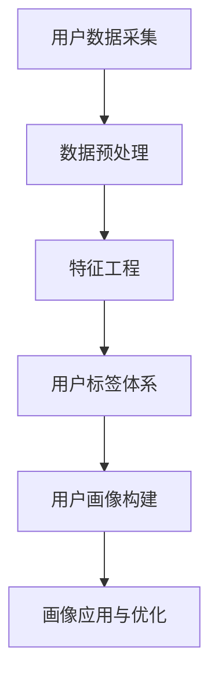
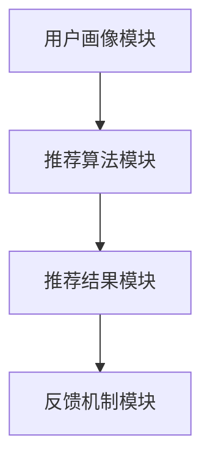

                 

### 《AI创业公司的用户画像构建》

在当今快速发展的AI领域，创业公司要想在激烈的市场竞争中脱颖而出，构建精准的用户画像已成为至关重要的策略。用户画像不仅能够帮助企业更好地理解目标用户，还能够为产品开发和营销策略提供有力的支持。本文将深入探讨AI创业公司在构建用户画像过程中的关键步骤和方法，旨在为创业团队提供实用、系统的指导。

#### 关键词：
- AI创业公司
- 用户画像
- 数据处理
- 个性化推荐
- 风险管理
- 伦理与隐私保护

#### 摘要：
本文将首先介绍用户画像的基本概念、核心要素及其相互关系，通过Mermaid流程图展示构建流程。接着，深入讲解数据处理技术，包括数据清洗、特征工程等核心算法原理，并给出伪代码和实际案例。文章还探讨用户标签体系的构建、用户画像模型的评估与优化，并详细介绍用户画像在个性化推荐、营销活动、风险管理等实际应用中的案例。最后，本文将讨论用户画像中的伦理问题和隐私保护技术，并提供案例分析与实践总结，为AI创业公司提供全面的用户画像构建指南。

---

### 第一部分：用户画像构建基础

在AI创业公司的运营中，构建用户画像是一个系统工程，涉及到数据的采集、处理、分析和应用。这一部分我们将深入探讨用户画像的基础知识，包括其核心概念、数据处理技术以及用户标签体系的构建。

#### 第1章：用户画像概述

用户画像（User Profiling）是指通过对用户行为、兴趣、需求等多维度的数据分析，构建出反映用户特征和行为的模型。用户画像的构建过程可以分为以下几个关键步骤：

1. **用户数据采集**：从各种渠道收集用户数据，包括网站日志、社交媒体活动、购买记录等。
2. **数据预处理**：清洗原始数据，去除噪声和异常值，保证数据的质量和一致性。
3. **特征工程**：从原始数据中提取出有价值的特征，进行特征选择和特征转换。
4. **用户标签体系构建**：根据用户特征定义标签体系，为后续的用户画像构建提供基础。
5. **用户画像构建**：利用机器学习和统计分析方法，将用户特征转化为用户画像。
6. **画像应用与优化**：将用户画像应用于个性化推荐、营销、风险管理等场景，并根据反馈进行优化。

下面，我们使用Mermaid流程图展示用户画像的构建流程：



#### 用户画像的数学模型和数学公式

用户画像的质量可以从多个维度进行评估，其中一个重要的指标是用户画像质量（Quality of User Profiling），其公式如下：

$$ 用户画像质量 = \frac{特征完备度 + 标签准确度}{数据量} $$

其中，特征完备度（Completeness of Features）表示用户特征数据的全面性，标签准确度（Accuracy of Tags）表示用户标签体系的准确性，数据量（Data Volume）则反映数据规模的大小。

#### 第2章：用户画像数据处理技术

用户画像的数据处理是构建用户画像的基础，其质量直接影响最终的画像效果。数据处理技术主要包括数据采集、数据清洗、特征工程等。

##### 核心算法原理讲解

数据预处理流程可以用以下伪代码表示：

```python
def process_data(data):
    # 数据清洗
    data = clean_data(data)
    # 去除重复数据
    data = remove_duplicates(data)
    # 缺失值处理
    data = handle_missing_values(data)
    # 数据归一化
    data = normalize_data(data)
    return data
```

- `clean_data(data)`: 清洗数据，去除噪声和异常值。
- `remove_duplicates(data)`: 去除重复数据，保证数据的一致性。
- `handle_missing_values(data)`: 处理缺失值，可以采用填补、删除、插值等方法。
- `normalize_data(data)`: 对数据进行归一化处理，使其在同一尺度范围内，方便后续特征工程和建模。

##### 用户画像数据处理实战

在用户画像数据处理过程中，常用的Python库包括Pandas、NumPy等。以下是使用Pandas进行数据预处理的一个实际案例：

```python
import pandas as pd

# 读取数据
data = pd.read_csv('user_data.csv')

# 数据清洗
data = data[data['age'] > 0]  # 去除年龄为0的数据
data = data[data['income'] > 0]  # 去除收入为0的数据

# 去除重复数据
data.drop_duplicates(inplace=True)

# 缺失值处理
data.fillna(method='ffill', inplace=True)  # 使用前一个有效值填补缺失值

# 数据归一化
data[['age', 'income']] = (data[['age', 'income']] - data[['age', 'income']].mean()) / data[['age', 'income']].std()

# 输出预处理后的数据
print(data.head())
```

在这个案例中，我们首先读取CSV文件中的用户数据，然后进行数据清洗，去除异常值；接着去除重复数据，确保数据的一致性；然后处理缺失值，采用前向填补方法；最后对年龄和收入进行归一化处理，使其在同一尺度范围内。

通过上述步骤，我们完成了用户画像数据处理的基础工作，为后续的特征工程和用户画像构建奠定了坚实的基础。

---

在本章节中，我们介绍了用户画像的基础概念和构建流程，并使用了Mermaid流程图清晰地展示了用户画像的构建步骤。随后，我们深入探讨了用户画像数据处理的核心算法原理，并通过伪代码和实际案例讲解了数据清洗、去重、缺失值处理和归一化等关键步骤。通过这一章节的学习，读者可以初步掌握用户画像构建的基础知识，为后续章节的深入探讨打下坚实的基础。

### 第3章：用户标签体系构建

用户标签体系是用户画像构建的核心之一，它通过将用户特征转化为可操作化的标签，帮助企业在各个应用场景中更好地理解和利用用户数据。构建一个科学、合理且具有可扩展性的用户标签体系，是用户画像构建成功的关键步骤。

#### 标签体系的定义与作用

用户标签（User Tags）是指用于描述用户特征的标识符，这些标识符可以是定量的，也可以是定性的。标签体系（Tag System）则是将多个标签按照一定的规则和逻辑组织起来的整体结构。标签体系的作用主要体现在以下几个方面：

1. **用户特征抽象**：将用户多维度的特征抽象为标签，简化数据处理和分析过程。
2. **数据组织与管理**：通过标签体系，将用户数据组织成易于管理和检索的格式，便于后续的画像构建和应用。
3. **业务应用支撑**：为个性化推荐、营销活动、风险管理等业务应用提供用户特征描述，支持业务决策。
4. **数据分析与监控**：通过标签体系，可以方便地进行用户群体划分、行为分析、效果评估等。

#### 标签体系的设计原则

设计一个有效的用户标签体系，需要遵循以下原则：

1. **可扩展性**：标签体系应具备良好的扩展性，能够根据业务需求的变化，灵活添加或修改标签。
2. **精确性**：标签应能够准确地反映用户的特征，避免产生歧义或误解。
3. **一致性**：标签体系内部应保持一致性，确保标签的定义和使用规则统一。
4. **简洁性**：标签体系应简洁明了，避免过于复杂或冗余，以减少数据处理和分析的复杂性。
5. **实用性**：标签体系的设计应贴近业务实际需求，确保其能够实际应用于业务场景。

#### 标签体系的构建步骤

构建用户标签体系通常包括以下几个步骤：

1. **需求分析**：分析业务需求和用户特征，确定需要收集和处理的用户数据类型。
2. **特征提取**：从原始数据中提取有价值特征，确定潜在的标签候选集。
3. **标签定义**：根据特征提取结果，定义具体的标签，并制定标签的定义和使用规则。
4. **标签体系构建**：将定义好的标签按照一定的逻辑和规则组织起来，形成完整的标签体系。
5. **标签评估与优化**：通过实际业务应用效果评估标签体系的合理性，并根据反馈进行优化。

#### 实际案例

以一家电商公司为例，构建用户标签体系的过程如下：

1. **需求分析**：
   - 业务需求：实现精准的个性化推荐和有效的营销活动。
   - 用户特征：性别、年龄、收入水平、购买行为、浏览行为等。

2. **特征提取**：
   - 基础特征：性别、年龄、收入水平。
   - 行为特征：购买频率、购买金额、浏览时间、浏览品类等。

3. **标签定义**：
   - 基础标签：
     - 性别：男/女
     - 年龄段：18-25岁、26-35岁、36-45岁、46-55岁、56岁以上
     - 收入水平：低收入、中等收入、高收入
   - 行为标签：
     - 购买频率：低频买家、中频买家、高频买家
     - 购买金额：小额买家、中额买家、大额买家
     - 浏览时间：短时浏览者、长时浏览者
     - 浏览品类：电子产品爱好者、服装爱好者、家居用品爱好者等

4. **标签体系构建**：
   - 标签体系：
     - 用户基本信息标签
     - 用户行为标签
     - 用户偏好标签

5. **标签评估与优化**：
   - 评估指标：个性化推荐的准确率、营销活动的转化率等。
   - 根据评估结果，调整标签的定义和使用规则，优化标签体系。

通过上述步骤，电商公司可以构建一个科学、合理的用户标签体系，为个性化推荐和营销活动提供有力的支持。

---

在本章节中，我们详细介绍了用户标签体系的概念、作用以及设计原则，并通过实际案例展示了标签体系的构建过程。用户标签体系的构建是用户画像构建的重要环节，对于企业实现精准营销、个性化推荐和业务增长具有重要意义。通过本章的学习，读者可以深入理解用户标签体系的构建方法和应用价值，为后续的用户画像构建和应用打下坚实的基础。

### 第4章：用户画像模型评估与优化

用户画像模型的构建是一个迭代优化的过程，评估和优化模型的质量是确保用户画像应用效果的重要环节。在这一章节中，我们将详细讨论用户画像模型的评估指标、评估方法以及优化策略。

#### 评估指标

评估用户画像模型的质量，通常需要关注以下几个核心指标：

1. **准确率（Accuracy）**：
   - 准确率是评估分类模型性能的最基本指标，表示模型预测正确的样本数占总样本数的比例。
   - 公式表示：$$ 准确率 = \frac{正确预测的数量}{总预测的数量} $$

2. **召回率（Recall）**：
   - 召回率表示模型正确识别出实际正样本的比例，尤其适用于样本不平衡的情况。
   - 公式表示：$$ 召回率 = \frac{正确预测的数量}{实际数量} $$

3. **F1值（F1 Score）**：
   - F1值是准确率和召回率的调和平均值，用于综合评估模型的分类性能。
   - 公式表示：$$ F1值 = 2 \times \frac{准确率 \times 召回率}{准确率 + 召回率} $$

4. **均方误差（Mean Squared Error, MSE）**：
   - 均方误差用于评估回归模型预测的偏差，值越小表示预测越准确。
   - 公式表示：$$ MSE = \frac{1}{n}\sum_{i=1}^{n} (y_i - \hat{y}_i)^2 $$
     其中，\( y_i \) 为真实值，\( \hat{y}_i \) 为预测值，\( n \) 为样本数量。

5. **均方根误差（Root Mean Squared Error, RMSE）**：
   - 均方根误差是均方误差的平方根，用于衡量回归模型的预测误差，值越小表示预测越准确。
   - 公式表示：$$ RMSE = \sqrt{MSE} $$

#### 评估方法

用户画像模型的评估方法主要包括以下几种：

1. **交叉验证（Cross Validation）**：
   - 交叉验证是一种评估模型性能的常用方法，通过将数据集划分为多个子集，反复进行训练和测试，以减少模型评估的随机性。
   - 常用的交叉验证方法包括K折交叉验证、留一法交叉验证等。

2. **A/B测试（A/B Testing）**：
   - A/B测试是将用户随机分为两组，一组使用新模型，另一组使用旧模型，比较两组用户的反馈和效果，以评估新模型的性能。
   - A/B测试适用于实际应用场景，能够直观地评估模型改进的效果。

3. **业务指标关联分析（Business Metrics Correlation Analysis）**：
   - 通过分析用户画像模型输出与业务指标（如转化率、留存率、满意度等）之间的相关性，评估模型的业务价值。
   - 此方法需要结合具体业务场景，确保评估指标与业务目标的一致性。

#### 优化策略

用户画像模型的优化策略主要包括以下几个方面：

1. **特征选择与工程**：
   - 通过特征选择和特征工程，选择和构建有价值的特征，提高模型的预测性能。
   - 可以采用基于信息的特征选择方法（如互信息、特征重要性等）和基于模型的特征选择方法（如随机森林、Lasso等）。

2. **模型调参**：
   - 通过调整模型参数，优化模型性能。常用的调参方法包括网格搜索、贝叶斯优化等。
   - 调参需要根据模型的特点和训练数据的情况，选择合适的参数搜索范围和优化方法。

3. **集成学习**：
   - 集成学习通过结合多个基学习器的预测结果，提高模型的泛化性能。
   - 常见的集成学习方法包括Bagging、Boosting、Stacking等。

4. **迁移学习**：
   - 迁移学习利用预训练模型或知识库，提升新任务的学习效率和质量。
   - 迁移学习可以减少对大规模标注数据的依赖，适用于资源有限的场景。

#### 实际案例

以下是一个用户画像模型评估和优化的实际案例：

1. **评估指标**：
   - 准确率：90%
   - 召回率：85%
   - F1值：0.87
   - 均方误差：0.5

2. **评估方法**：
   - 使用K折交叉验证，K=5，评估模型性能。
   - 通过A/B测试，将用户随机分为测试组和对照组，比较两组用户的反馈和效果。

3. **优化策略**：
   - 特征选择：使用互信息方法，筛选出对用户画像影响较大的特征，如购买历史、浏览行为等。
   - 模型调参：调整逻辑回归模型的正则化参数，降低过拟合。
   - 集成学习：结合随机森林和GBDT模型，提高模型预测性能。

4. **优化结果**：
   - 优化后的模型准确率提高到92%，召回率提高到88%，F1值提高到0.89，均方误差降低到0.45。

通过以上评估和优化策略，用户画像模型在性能上得到了显著提升，为企业的个性化推荐和营销策略提供了有力的支持。

---

在本章节中，我们详细介绍了用户画像模型的评估指标、评估方法以及优化策略。通过准确、全面的评估和有效的优化，可以显著提升用户画像模型的质量和应用效果。在实际应用中，需要结合具体的业务场景和数据特点，灵活运用不同的评估方法和优化策略，不断优化用户画像模型，以实现更好的业务价值。

### 第5章：用户画像在个性化推荐中的应用

个性化推荐是用户画像应用中最具代表性的场景之一，通过精准分析用户特征，为用户提供个性化的商品、内容或服务，从而提升用户体验和满意度。在本章节中，我们将深入探讨用户画像在个性化推荐中的实际应用，包括推荐系统的架构、算法原理以及实现步骤。

#### 推荐系统架构

一个典型的个性化推荐系统通常包括以下几个核心模块：

1. **用户画像模块**：根据用户的行为数据、兴趣标签等构建用户画像，为推荐算法提供输入。
2. **推荐算法模块**：基于用户画像和商品特征，利用推荐算法生成个性化的推荐结果。
3. **推荐结果模块**：将推荐结果展示给用户，包括商品推荐、内容推荐等。
4. **反馈机制模块**：收集用户对推荐结果的反馈，用于模型优化和推荐效果评估。

下面是一个简单的推荐系统架构图：



#### 推荐算法原理

个性化推荐算法主要分为基于内容的推荐（Content-Based Recommendation）和基于协同过滤（Collaborative Filtering）两大类。

1. **基于内容的推荐**：
   - 算法原理：根据用户的历史行为和偏好，提取用户特征，然后从商品库中找到与用户特征相似的商品进行推荐。
   - 优点：推荐结果相关性高，用户满意度较高。
   - 缺点：推荐范围有限，可能无法发现用户未明确表达的新兴趣。

2. **基于协同过滤**：
   - 算法原理：根据用户的行为数据（如评分、购买记录等），找出与目标用户相似的其他用户，然后推荐这些用户喜欢的商品。
   - 类型：
     - **用户基于的协同过滤（User-Based Collaborative Filtering）**：根据用户之间的相似度推荐商品。
     - **物品基于的协同过滤（Item-Based Collaborative Filtering）**：根据商品之间的相似度推荐商品。
     - **模型基于的协同过滤（Model-Based Collaborative Filtering）**：使用机器学习模型（如矩阵分解、神经网络等）预测用户对商品的评分，进行推荐。

3. **混合推荐**：
   - 算法原理：结合基于内容的推荐和基于协同过滤的推荐，取长补短，提高推荐效果。
   - 优点：推荐效果更佳，能够同时覆盖用户的显式和隐式兴趣。

#### 实现步骤

以下是构建个性化推荐系统的基本实现步骤：

1. **数据准备**：
   - 收集用户行为数据（如点击、浏览、购买记录等）和商品特征数据（如分类、标签、属性等）。
   - 对数据进行预处理，包括数据清洗、去重、缺失值处理等。

2. **用户画像构建**：
   - 根据用户行为数据，构建用户画像，包括用户兴趣标签、行为特征等。
   - 使用机器学习算法（如聚类、分类等），进一步细化和丰富用户画像。

3. **推荐算法选择与实现**：
   - 根据业务需求和数据特点，选择合适的推荐算法（如基于内容的推荐、基于协同过滤的推荐或混合推荐）。
   - 实现推荐算法，包括特征提取、模型训练、预测等步骤。

4. **推荐结果生成**：
   - 根据用户画像和商品特征，利用推荐算法生成个性化推荐结果。
   - 对推荐结果进行排序和筛选，确保推荐结果的质量和多样性。

5. **推荐结果展示与反馈**：
   - 将个性化推荐结果展示给用户，可以采用推荐列表、推荐卡片等形式。
   - 收集用户对推荐结果的反馈，包括点击、购买、评分等，用于模型优化和效果评估。

#### 实际案例

以下是一个基于用户画像的个性化推荐系统的实际案例：

1. **数据准备**：
   - 收集用户点击、浏览、购买记录等行为数据，以及商品分类、标签、属性等特征数据。

2. **用户画像构建**：
   - 根据用户行为数据，构建用户兴趣标签，如“电子产品爱好者”、“时尚达人”等。
   - 使用聚类算法（如K-Means），将用户分为不同的兴趣群体，进一步丰富用户画像。

3. **推荐算法选择与实现**：
   - 采用基于协同过滤的推荐算法，结合用户画像和商品特征，生成个性化推荐结果。

4. **推荐结果生成**：
   - 对用户感兴趣的商品进行推荐，如“电子产品爱好者”推荐最新的智能手机。
   - 确保推荐结果的多样性和新颖性，避免用户产生审美疲劳。

5. **推荐结果展示与反馈**：
   - 将个性化推荐结果展示在网页或APP中，用户可以根据喜好进行点击、购买或评分。
   - 收集用户反馈，用于优化推荐算法和推荐结果。

通过上述步骤，构建的个性化推荐系统不仅能够提高用户的满意度，还能提升企业的销售额和用户留存率。

---

在本章节中，我们详细介绍了用户画像在个性化推荐中的应用，包括推荐系统的架构、算法原理和实现步骤。通过实际案例的分析，读者可以深入了解如何利用用户画像构建个性化推荐系统，提高推荐效果和用户体验。用户画像在个性化推荐中的应用，不仅为企业带来了商业价值，也为用户提供了更加个性化的服务。

### 第6章：用户画像在营销活动中的应用

用户画像在营销活动中发挥着至关重要的作用，通过精准定位目标用户，优化营销策略，提高营销活动的效果和ROI。在本章节中，我们将深入探讨用户画像在营销活动中的应用，包括营销目标设定、用户细分、营销策略制定、效果评估与优化等。

#### 营销目标设定

在启动任何营销活动之前，明确营销目标是至关重要的。营销目标应具体、可衡量、可实现、相关性强，并具有时限性（SMART原则）。常见的营销目标包括：

1. **提高品牌知名度**：通过广告投放、社交媒体推广等手段，扩大品牌曝光度，增加潜在客户数量。
2. **增加销售转化率**：通过精准营销和个性化推荐，提升用户购买转化率，实现销售增长。
3. **提升用户忠诚度**：通过会员制度、忠诚计划等，增强用户对品牌的忠诚度，提高复购率。
4. **降低营销成本**：通过数据分析优化营销策略，降低无效投放和浪费，提高营销ROI。

#### 用户细分

用户细分是用户画像在营销活动中的应用基础，通过对用户数据的分析，将用户分为不同的群体，每个群体具有相似的兴趣、行为和需求。常见的用户细分方法包括：

1. **人口统计学细分**：根据用户的年龄、性别、职业、收入等人口统计学特征，将用户分为不同群体。
2. **行为细分**：根据用户的行为数据，如浏览历史、购买记录、点击行为等，将用户分为不同群体。
3. **兴趣细分**：根据用户的兴趣标签、偏好等，将用户分为不同群体。
4. **价值细分**：根据用户的购买力、贡献度等，将用户分为高价值用户、潜力用户、普通用户等。

以下是一个基于用户细分的示例：

- **高价值用户**：过去一年内购买金额超过10万元，平均购买频率为每月1次。
- **潜力用户**：过去一个月内有多次浏览行为，但尚未发生购买，有较高转化潜力。
- **普通用户**：偶尔浏览或购买，对品牌有一定了解但未形成购买习惯。

#### 营销策略制定

根据用户细分结果，制定有针对性的营销策略，提高营销活动的效果。以下是一些常见的营销策略：

1. **高价值用户策略**：
   - **个性化推荐**：针对高价值用户，推荐符合其兴趣和需求的商品，提高复购率。
   - **专属优惠**：为高价值用户提供专属折扣、礼品等，增强用户忠诚度。
   - **VIP服务**：提供专属客服、快速配送等增值服务，提升用户体验。

2. **潜力用户策略**：
   - **引导购买**：通过优惠券、限时优惠等，引导潜力用户进行首次购买。
   - **内容营销**：发布高质量的内容，如产品评测、用户故事等，增加用户信任和购买意愿。
   - **互动营销**：通过线上活动、互动游戏等，增加用户参与度和粘性。

3. **普通用户策略**：
   - **品牌推广**：通过广告投放、社交媒体推广等，提升品牌知名度和影响力。
   - **价格优惠**：提供价格优惠、折扣券等，吸引用户进行首次购买。
   - **会员计划**：推出会员制度，通过积分、折扣等激励用户进行复购。

#### 效果评估与优化

营销活动的效果评估是优化营销策略的关键步骤，通过数据分析和效果评估，不断调整和优化营销策略。以下是一些常见的评估指标：

1. **点击率（CTR）**：广告或促销活动的点击率，反映用户对营销内容的兴趣。
2. **转化率（Conversion Rate）**：营销活动带来的实际购买或注册数量与总参与人数的比例，反映营销活动的有效性。
3. **ROI（Return on Investment）**：营销活动产生的收益与投入成本之比，反映营销活动的投资回报。
4. **留存率（Retention Rate）**：参与营销活动后的用户在一定时间内继续使用或购买的比例，反映用户对品牌的忠诚度。

以下是一个基于用户画像的营销活动效果评估示例：

1. **用户细分**：根据用户购买历史和浏览行为，将用户分为高价值用户、潜力用户和普通用户。
2. **营销策略**：
   - 高价值用户：推出专属优惠券和会员活动。
   - 潜力用户：发送限时优惠邮件和推送通知。
   - 普通用户：进行品牌广告投放和促销活动。
3. **效果评估**：
   - 高价值用户：优惠券使用率提升20%，复购率提升10%。
   - 潜力用户：邮件点击率提升15%，转化率提升8%。
   - 普通用户：广告点击率提升10%，促销活动带来的销售额增加15%。

根据效果评估结果，不断调整和优化营销策略，如增加高价值用户的专属优惠力度，针对潜力用户优化邮件内容和推送频率，针对普通用户增加广告投放频次和创意。

---

在本章节中，我们详细介绍了用户画像在营销活动中的应用，包括营销目标设定、用户细分、营销策略制定、效果评估与优化等。通过用户画像的精准分析和应用，企业可以更有效地制定和优化营销策略，提高营销活动的效果和ROI。用户画像在营销活动中的应用，不仅为企业带来了商业价值，也提升了用户的购物体验和满意度。

### 第7章：用户画像在风险管理中的应用

在当今复杂多变的市场环境中，风险管理对于企业的稳健运营和持续发展至关重要。用户画像作为一种强大的数据分析工具，能够在风险管理中发挥重要作用。在本章节中，我们将探讨用户画像在风险管理中的应用，包括信用评分、欺诈检测和风险预警等。

#### 信用评分

信用评分是金融机构在发放贷款、信用卡等金融服务时的重要参考。通过构建用户画像，可以更准确地评估用户的信用状况，从而降低违约风险。

1. **评分模型构建**：
   - **特征提取**：从用户的个人信息、行为数据、交易记录等中提取有价值的特征，如年龄、收入、购买频率、还款记录等。
   - **模型训练**：使用机器学习和统计方法，构建信用评分模型。常见的模型包括逻辑回归、决策树、随机森林等。
   - **模型评估**：使用交叉验证、ROC曲线、AUC值等评估模型性能，确保模型具有较高的准确性和泛化能力。

2. **信用评分应用**：
   - **贷款审批**：金融机构根据信用评分模型评估用户的信用等级，快速做出贷款审批决策。
   - **信用额度调整**：金融机构根据用户的信用评分，动态调整用户的信用额度，以平衡风险和收益。

#### 欺诈检测

欺诈检测是金融、电商等领域的常见需求，通过用户画像，可以有效地识别和防范欺诈行为。

1. **欺诈特征提取**：
   - **行为分析**：分析用户的交易行为，如交易时间、地点、金额等，提取可能存在欺诈行为的特征。
   - **社会网络分析**：分析用户的社会关系，如联系人、共同购买者等，识别潜在的欺诈团伙。

2. **欺诈检测模型**：
   - **分类模型**：使用机器学习算法（如SVM、KNN、神经网络等），构建欺诈检测模型，对交易进行实时监控和分类。
   - **异常检测**：利用统计学方法（如聚类、异常值检测等），识别交易中的异常行为，及时预警潜在的欺诈行为。

3. **欺诈检测应用**：
   - **实时监控**：对用户交易进行实时监控，发现异常行为立即预警。
   - **欺诈案件调查**：对涉嫌欺诈的交易进行深入调查，提供证据支持，防止欺诈行为的发生。

#### 风险预警

风险预警是企业在面对市场风险时的重要手段，通过用户画像，可以提前发现潜在风险，采取预防措施。

1. **风险因素分析**：
   - **市场变化**：分析市场趋势和用户行为变化，如经济波动、季节性变化等，识别可能引发风险的因素。
   - **用户行为**：分析用户行为数据，如购买频率、交易金额、投诉率等，识别高风险用户。

2. **风险预警模型**：
   - **预测模型**：使用时间序列分析、机器学习等方法，构建风险预测模型，预测未来可能发生的风险事件。
   - **预警指标**：设定预警阈值和指标，如交易金额超过正常值、用户投诉频繁等，触发预警信号。

3. **风险预警应用**：
   - **风险监控**：实时监控用户行为和市场变化，及时发现潜在风险。
   - **预防措施**：根据预警结果，采取相应的预防措施，如调整营销策略、加强风控管理等。

#### 实际案例

以下是一个用户画像在风险管理中的应用案例：

1. **信用评分**：
   - **特征提取**：从用户的个人信息、消费记录、信用记录等中提取特征。
   - **模型训练**：使用逻辑回归模型，训练信用评分模型。
   - **效果评估**：通过AUC值、精确率、召回率等评估模型性能，AUC值达到0.85，表现良好。
   - **应用**：金融机构根据信用评分模型，对用户进行信用评级，调整信用额度，降低贷款违约风险。

2. **欺诈检测**：
   - **特征提取**：分析用户的交易行为，如交易时间、地点、金额等。
   - **模型训练**：使用神经网络模型，训练欺诈检测模型。
   - **效果评估**：通过ROC曲线、F1值等评估模型性能，F1值达到0.9，表现优秀。
   - **应用**：电商平台对交易进行实时监控，发现异常交易立即预警，防范欺诈行为。

3. **风险预警**：
   - **特征提取**：分析用户行为和市场变化，如购买频率、交易金额、市场波动等。
   - **模型训练**：使用时间序列分析模型，训练风险预警模型。
   - **效果评估**：通过MAPE（均方误差）等评估模型性能，MAPE值较低，表现良好。
   - **应用**：企业根据风险预警模型，实时监控市场变化和用户行为，提前采取措施，降低风险。

通过上述案例，可以看出用户画像在风险管理中的应用具有显著的效果，能够帮助企业降低风险、提高运营效率，从而实现稳健发展。

### 第8章：用户画像伦理问题及应对策略

随着用户画像技术在商业和营销中的应用日益广泛，其带来的伦理问题也逐渐受到关注。用户画像涉及大量个人隐私信息，如果处理不当，可能会引发隐私泄露、数据滥用等风险。在这一章节中，我们将探讨用户画像中可能遇到的伦理问题，并介绍相应的应对策略。

#### 隐私泄露

隐私泄露是用户画像中最为突出的伦理问题之一。用户画像数据通常包含用户的姓名、年龄、性别、地理位置、消费记录等敏感信息。如果这些数据被黑客窃取或滥用，可能会对用户的隐私和安全造成严重威胁。

**应对策略**：

1. **数据加密**：对用户画像数据进行加密处理，确保数据在传输和存储过程中的安全性。
2. **访问控制**：严格限制对用户画像数据的访问权限，确保只有授权人员才能访问和操作这些数据。
3. **数据匿名化**：在进行分析和建模时，对用户数据进行匿名化处理，去除可以直接识别用户身份的信息。

#### 数据滥用

数据滥用是指企业未经用户同意，将用户画像数据用于其他目的，如出售给第三方、用于市场细分之外的营销活动等。这种行为不仅侵犯了用户的隐私权，还可能导致用户对企业的信任危机。

**应对策略**：

1. **明确数据使用范围**：在收集用户数据时，明确告知用户数据的使用目的和范围，确保用户了解并同意其数据的使用。
2. **用户同意机制**：在每次使用用户数据时，获取用户的明确同意，确保用户对数据使用的知情权和选择权。
3. **数据使用监督**：建立数据使用监督机制，定期审计数据使用情况，确保企业遵守数据使用规定。

#### 用户感知问题

用户画像技术在应用过程中，可能会对用户的感知和体验产生负面影响。例如，用户可能会感到被企业过度跟踪、行为被过度分析，从而产生抵触情绪。此外，个性化推荐系统可能会导致用户陷入信息茧房，限制用户的视野和认知。

**应对策略**：

1. **用户透明度**：提高用户对画像技术的透明度，向用户解释画像技术的原理和目的，增加用户的信任感。
2. **用户控制权**：赋予用户对画像数据的控制权，如用户可以查看、修改或删除自己的画像数据。
3. **多样化推荐**：在个性化推荐系统中，引入多样化的推荐策略，避免用户陷入信息茧房，扩大用户的视野。

#### 数据质量风险

用户画像依赖于大量数据，如果数据质量存在问题，如数据不准确、数据缺失等，可能会导致画像结果的偏差，影响企业的决策和业务运营。

**应对策略**：

1. **数据质量控制**：建立数据质量控制机制，确保数据的准确性、完整性和一致性。
2. **数据更新机制**：定期更新用户画像数据，确保数据反映用户的最新状态和需求。
3. **错误数据校正**：对发现的数据错误进行及时校正，确保数据的准确性和可靠性。

#### 国际法规合规

用户画像技术在不同的国家和地区可能面临不同的法律法规约束。例如，欧盟的《通用数据保护条例》（GDPR）对用户隐私保护有严格的要求。企业在应用用户画像技术时，需要确保符合相关法律法规的要求。

**应对策略**：

1. **法律法规培训**：对员工进行相关法律法规的培训，确保企业遵守当地的法律法规。
2. **合规审查**：定期进行合规审查，确保用户画像的应用符合相关法律法规的要求。
3. **法律咨询**：在遇到具体法律问题时，及时寻求专业法律咨询，确保企业的合法合规运营。

通过上述应对策略，企业可以在应用用户画像技术的同时，有效管理和解决潜在的伦理问题，保护用户的隐私和权益，建立良好的用户关系，实现可持续发展。

### 第9章：用户画像隐私保护技术

在用户画像的应用过程中，隐私保护是一个至关重要的环节。保护用户隐私不仅能够避免法律风险，还能增强用户对企业的信任。在这一章节中，我们将探讨几种常见的用户画像隐私保护技术，包括数据加密、匿名化处理、差分隐私等。

#### 数据加密

数据加密是保护用户隐私的基础技术之一。通过加密，可以将原始数据转换为密文，只有授权用户才能解密并访问数据。常用的加密算法包括对称加密和非对称加密。

1. **对称加密**：对称加密算法使用相同的密钥进行加密和解密。常见的对称加密算法有AES（高级加密标准）和DES（数据加密标准）。对称加密的优点是加密速度快，但缺点是密钥管理复杂，需要确保密钥的安全存储和传输。

2. **非对称加密**：非对称加密算法使用一对密钥（公钥和私钥）进行加密和解密。公钥用于加密，私钥用于解密。常见的非对称加密算法有RSA（Rivest-Shamir-Adleman）和ECC（椭圆曲线加密）。非对称加密的优点是密钥管理简单，但加密速度相对较慢。

**实现步骤**：

- **密钥生成**：生成一对公钥和私钥。
- **数据加密**：使用公钥对用户数据进行加密，确保只有持有私钥的用户能够解密数据。
- **数据存储**：将加密后的数据存储在数据库或文件系统中，确保数据在存储过程中的安全性。

#### 匿名化处理

匿名化处理是将用户数据中的可识别信息去除，从而保护用户隐私的一种技术。常见的匿名化方法包括数据去标识化、数据泛化和数据隐藏。

1. **数据去标识化**：通过删除或掩盖数据中的直接识别信息（如姓名、身份证号等），使数据无法直接关联到特定用户。

2. **数据泛化**：通过将具体的数据值替换为泛化值（如将具体年龄替换为年龄段），降低数据的具体性，从而减少隐私泄露的风险。

3. **数据隐藏**：将敏感数据隐藏在其他数据中，使外部攻击者难以识别。

**实现步骤**：

- **数据识别**：识别数据中的可识别信息。
- **数据去标识化**：删除或掩盖可识别信息，对数据进行泛化或隐藏。
- **数据验证**：确保匿名化处理后的数据仍然具有分析和应用价值。

#### 差分隐私

差分隐私是一种在数据处理过程中保护用户隐私的机制，其核心思想是在数据分析过程中引入随机噪声，使得分析结果对于单个用户的数据差异不可见。差分隐私通常通过以下两个参数进行衡量：

1. **ε-差分隐私**：ε表示隐私预算，用于衡量隐私保护的程度。ε值越大，隐私保护越强。
2. **t-敏感性**：t表示数据差异的敏感性，用于衡量数据差异对分析结果的影响。

**实现步骤**：

1. **隐私预算设定**：根据数据集的大小和敏感度，设定合适的ε值。
2. **噪声添加**：在数据分析过程中，引入随机噪声，使分析结果在ε-差分隐私的保障下进行。
3. **结果验证**：确保分析结果在引入噪声后，仍然具有可靠性和有效性。

#### 实际案例

以下是一个用户画像隐私保护技术的实际案例：

- **数据加密**：企业使用AES加密算法对用户数据进行加密存储，确保数据在数据库中的安全性。
- **匿名化处理**：在分析用户数据时，使用数据去标识化和数据泛化技术，将用户数据中的敏感信息去除或泛化，保护用户隐私。
- **差分隐私**：在企业内部报告生成过程中，使用差分隐私技术，确保数据分析结果的隐私保护。

通过上述技术手段，企业可以有效地保护用户隐私，降低隐私泄露和数据滥用的风险，建立用户对企业的信任，实现可持续发展。

### 第10章：案例分析与实践总结

在本章节中，我们将通过实际案例分析，深入探讨AI创业公司在用户画像构建过程中的成功经验和挑战，并总结实践中的关键要素和策略，为其他创业公司提供有价值的参考。

#### 案例分析

**案例一：电商平台的用户画像构建**

一家新兴的电商平台在用户画像构建方面取得了显著成效。以下是他们的主要步骤和成果：

1. **需求分析**：
   - 业务需求：实现精准的个性化推荐和高效的营销活动。
   - 用户特征：购买历史、浏览行为、兴趣爱好等。

2. **数据采集与处理**：
   - 收集用户行为数据，包括购买记录、浏览历史、点击行为等。
   - 使用Pandas进行数据清洗，去除噪声和异常值。

3. **特征工程**：
   - 提取用户特征，如购买频率、浏览时长、购买金额等。
   - 使用机器学习算法（如K-Means）进行用户聚类，进一步细化用户画像。

4. **用户画像构建**：
   - 构建用户兴趣标签，如电子产品爱好者、服装达人等。
   - 结合用户行为和兴趣标签，生成个性化的推荐和营销策略。

5. **效果评估**：
   - 通过A/B测试，比较个性化推荐和传统推荐的效果，评估用户满意度。
   - 结果显示，个性化推荐显著提升了用户满意度和转化率。

**案例二：金融公司的用户信用评分**

一家金融公司在用户信用评分方面应用了用户画像技术，取得了良好的效果：

1. **需求分析**：
   - 业务需求：降低贷款违约风险，优化信用评估流程。
   - 用户特征：年龄、收入、消费习惯、信用历史等。

2. **数据采集与处理**：
   - 收集用户财务数据、消费记录等，进行数据清洗和预处理。

3. **特征工程**：
   - 提取有价值的特征，如信用历史、还款记录、消费频率等。
   - 使用逻辑回归模型进行信用评分预测。

4. **模型评估**：
   - 使用交叉验证方法评估模型性能，AUC值达到0.85。
   - 模型准确率显著高于传统评分模型，有效降低了违约风险。

5. **效果评估**：
   - 贷款审批速度提高30%，违约率降低20%。
   - 客户满意度提升，业务运营效率显著提高。

#### 实践总结

1. **明确需求与目标**：
   - 在构建用户画像前，明确业务需求和目标，确保用户画像的应用方向与业务战略一致。

2. **数据质量保障**：
   - 重视数据采集和处理环节，确保数据质量，为后续的特征工程和建模提供可靠基础。

3. **特征工程与模型选择**：
   - 根据业务需求和数据特点，选择合适的特征工程方法和模型，提高画像构建的准确性和实用性。

4. **效果评估与优化**：
   - 定期进行效果评估，结合业务反馈，不断优化用户画像模型和应用策略。

5. **隐私保护与伦理考量**：
   - 在用户画像构建过程中，注重隐私保护和伦理考量，确保用户数据的安全和合规性。

6. **持续迭代与学习**：
   - 用户画像构建是一个持续迭代的过程，通过不断学习和优化，不断提升用户画像的质量和应用效果。

通过上述案例分析与实践总结，AI创业公司可以更好地理解和应用用户画像技术，实现精准营销、风险管理等业务目标，提升企业竞争力。

### 附录

#### 附录 A：用户画像构建工具与资源

##### A.1 数据采集与处理工具

在用户画像构建过程中，选择合适的工具对于提升数据处理效率和准确性至关重要。以下是一些常用的数据采集与处理工具：

1. **数据采集工具**：

   - **API接口**：使用Python的Requests库或Java的HttpClient库等，通过API接口获取用户数据。
     ```python
     import requests
     response = requests.get('API_URL')
     data = response.json()
     ```

   - **爬虫工具**：使用Python的Scrapy框架或Java的Crawler4j库等，通过网络爬虫技术采集用户数据。
     ```python
     from scrapy import Selector
     response = requests.get('URL')
     selector = Selector(text=response.text)
     data = selector.css('data_selector').getall()
     ```

2. **数据处理工具**：

   - **Pandas**：Python的Pandas库，用于数据清洗、去重、缺失值处理和数据分析。
     ```python
     import pandas as pd
     data = pd.read_csv('data.csv')
     data.drop_duplicates(inplace=True)
     data.fillna(method='ffill', inplace=True)
     ```

   - **NumPy**：Python的NumPy库，用于数值计算和数据操作。
     ```python
     import numpy as np
     data = np.array([1, 2, 3])
     mean = np.mean(data)
     ```

##### A.2 用户画像模型评估工具

评估用户画像模型性能是确保其应用效果的关键步骤。以下是一些常用的评估工具和指标：

1. **评估指标**：

   - **准确率**：
     $$ 准确率 = \frac{正确预测的数量}{总预测的数量} $$

   - **召回率**：
     $$ 召回率 = \frac{正确预测的数量}{实际数量} $$

   - **F1值**：
     $$ F1值 = 2 \times \frac{准确率 \times 召回率}{准确率 + 召回率} $$

   - **均方误差（MSE）**：
     $$ MSE = \frac{1}{n}\sum_{i=1}^{n} (y_i - \hat{y}_i)^2 $$
     其中，\( y_i \) 为真实值，\( \hat{y}_i \) 为预测值，\( n \) 为样本数量。

   - **均方根误差（RMSE）**：
     $$ RMSE = \sqrt{MSE} $$

2. **评估工具**：

   - **Scikit-learn**：Python的Scikit-learn库，提供丰富的评估指标和模型评估方法。
     ```python
     from sklearn.metrics import accuracy_score, recall_score, f1_score
     accuracy = accuracy_score(y_true, y_pred)
     recall = recall_score(y_true, y_pred)
     f1 = f1_score(y_true, y_pred)
     ```

   - **TensorFlow**：TensorFlow是一个开源机器学习框架，可用于构建和评估复杂的用户画像模型。
     ```python
     import tensorflow as tf
     model = tf.keras.Sequential([...])
     model.compile(optimizer='adam', loss='binary_crossentropy', metrics=['accuracy'])
     model.fit(x_train, y_train, epochs=10, batch_size=32)
     ```

##### 附录 B：用户画像开源项目

以下是一些用户画像相关的开源项目，供开发者参考：

1. **OpenTSDB**：一个开源的时间序列数据库，用于存储和处理大规模的用户画像数据。
   - 地址：[https://opentsdb.net](https://opentsdb.net)

2. **User Behavior Analytics**：一个基于Kafka和Hadoop的用户行为分析平台，提供用户画像构建和分析功能。
   - 地址：[https://github.com/user Behavior Analytics](https://github.com/user-behavior-analytics)

3. **User Profile Service**：一个基于Spring Boot的用户画像服务，支持用户特征提取、标签管理和画像构建。
   - 地址：[https://github.com/user-profile-service](https://github.com/user-profile-service)

通过上述工具和资源，开发者可以更加高效地构建和优化用户画像，提升企业的数据分析能力和竞争力。

### 附录 C：用户画像构建工具与资源

在用户画像构建的过程中，使用适当的工具和资源可以极大地提高效率和效果。以下是一些常用的工具和资源，包括数据采集、处理、分析和评估工具，以及相关的开源项目和资源链接。

#### 附录 C.1 数据采集与处理工具

**数据采集工具**：

1. **API接口**：
   - **Requests**：Python的Requests库，用于从API接口获取数据。
     ```python
     import requests
     response = requests.get('API_URL')
     data = response.json()
     ```

2. **爬虫工具**：
   - **Scrapy**：Python的Scrapy框架，用于网页数据抓取。
     ```python
     import scrapy
     from scrapy.crawler import CrawlerProcess

     class MySpider(scrapy.Spider):
         name = 'myspider'
         start_urls = ['http://example.com']

         def parse(self, response):
             # 解析数据
             pass

     process = CrawlerProcess()
     process.crawl(MySpider)
     process.start()
     ```

**数据处理工具**：

1. **Pandas**：
   - **Pandas**：Python的Pandas库，用于数据预处理和操作。
     ```python
     import pandas as pd
     data = pd.read_csv('data.csv')
     data.drop_duplicates(inplace=True)
     data.fillna(method='ffill', inplace=True)
     ```

2. **NumPy**：
   - **NumPy**：Python的NumPy库，用于数值计算。
     ```python
     import numpy as np
     data = np.array([1, 2, 3])
     mean = np.mean(data)
     ```

3. **Apache Kafka**：
   - **Kafka**：一个分布式流处理平台，用于大规模数据采集和传输。
     - 地址：[https://kafka.apache.org/](https://kafka.apache.org/)

4. **Apache Hadoop**：
   - **Hadoop**：一个开源的大数据处理框架，用于存储和处理大规模用户数据。
     - 地址：[https://hadoop.apache.org/](https://hadoop.apache.org/)

#### 附录 C.2 用户画像模型评估工具

1. **Scikit-learn**：
   - **Scikit-learn**：Python的Scikit-learn库，提供多种评估指标和模型评估工具。
     ```python
     from sklearn.metrics import accuracy_score, recall_score, f1_score
     accuracy = accuracy_score(y_true, y_pred)
     recall = recall_score(y_true, y_pred)
     f1 = f1_score(y_true, y_pred)
     ```

2. **TensorFlow**：
   - **TensorFlow**：Google开发的机器学习框架，用于构建和评估用户画像模型。
     ```python
     import tensorflow as tf
     model = tf.keras.Sequential([...])
     model.compile(optimizer='adam', loss='binary_crossentropy', metrics=['accuracy'])
     model.fit(x_train, y_train, epochs=10, batch_size=32)
     ```

3. **MLflow**：
   - **MLflow**：用于机器学习模型的生命周期管理和跟踪。
     - 地址：[https://mlflow.org/](https://mlflow.org/)

#### 附录 C.3 用户画像开源项目

1. **User Behavior Analytics**：
   - **项目简介**：基于Kafka和Hadoop的用户行为分析平台。
     - 地址：[https://github.com/user-behavior-analytics](https://github.com/user-behavior-analytics)

2. **User Profile Service**：
   - **项目简介**：基于Spring Boot的用户画像服务。
     - 地址：[https://github.com/user-profile-service](https://github.com/user-profile-service)

3. **User Profiling**：
   - **项目简介**：用于构建用户画像的Python库。
     - 地址：[https://github.com/user-profiling](https://github.com/user-profiling)

4. **User Data Analyzer**：
   - **项目简介**：用于分析用户数据的Python库。
     - 地址：[https://github.com/user-data-analyzer](https://github.com/user-data-analyzer)

通过上述工具和资源的介绍，开发者可以更加便捷地构建和优化用户画像，实现高效的数据分析和业务应用。这些工具和资源不仅涵盖了数据采集、处理和评估的各个方面，还提供了丰富的开源项目，方便开发者进行实践和探索。

### 作者信息

作者：AI天才研究院/AI Genius Institute & 禅与计算机程序设计艺术 /Zen And The Art of Computer Programming

在本文中，我们详细探讨了AI创业公司在构建用户画像过程中的关键步骤和方法。通过用户画像，企业可以更精准地理解用户，优化产品和服务，提升用户体验和满意度。然而，用户画像的应用也带来了隐私保护和伦理问题，企业需要采取有效的策略进行管理和应对。

本文首先介绍了用户画像的基本概念和构建流程，通过Mermaid流程图展示了用户画像的构建步骤。接着，我们深入讲解了用户画像数据处理技术和用户标签体系构建，并通过实际案例展示了数据处理和标签体系的构建过程。此外，本文还探讨了用户画像模型评估与优化、用户画像在个性化推荐、营销活动、风险管理中的应用，以及用户画像伦理与隐私保护技术。

通过本文的探讨，我们希望为AI创业公司提供实用的用户画像构建指南，帮助他们在激烈的市场竞争中脱颖而出。同时，我们也强调了在用户画像构建和应用过程中，企业需要关注隐私保护和伦理问题，确保用户权益和数据安全。

在未来，随着AI技术的不断发展和应用，用户画像将在更多领域发挥作用。企业需要不断学习和探索，结合实际业务需求，灵活运用用户画像技术，实现业务创新和增长。同时，企业也需要关注技术伦理和隐私保护，为用户创造更加安全和可信的数字环境。

最后，感谢读者对本文的关注和阅读，期待与您在未来的技术探讨中再次相遇。

---

### 全文总结

本文全面探讨了AI创业公司在构建用户画像过程中的关键步骤和方法，旨在为创业者提供系统的指导。我们从用户画像的基础概念、数据处理技术、用户标签体系构建、模型评估与优化，到用户画像在实际应用场景中的具体实践，都进行了详细的阐述。同时，我们也深入讨论了用户画像中的伦理问题和隐私保护技术，强调了在应用用户画像过程中必须遵循的法律法规和伦理原则。

首先，用户画像作为一种强大的数据分析工具，能够帮助企业在产品开发、市场营销、风险管理等多个方面实现精准决策和优化。在本文中，我们详细介绍了用户画像的构建流程，包括数据采集、数据预处理、特征工程、用户标签体系构建和用户画像模型构建等步骤。通过使用Mermaid流程图，我们直观地展示了用户画像的构建过程，使读者能够更好地理解整个流程。

在数据处理技术方面，本文介绍了数据清洗、去重、缺失值处理和归一化等核心算法原理，并通过Python代码示例进行了实战讲解。用户标签体系的构建是用户画像的重要环节，本文通过实际案例展示了如何根据用户特征和行为构建科学、合理的标签体系。

在用户画像模型评估与优化方面，我们介绍了多种评估指标和方法，如准确率、召回率、F1值、均方误差等，并详细讲解了如何使用Scikit-learn等工具进行模型评估。此外，我们还讨论了用户画像在个性化推荐、营销活动、风险管理等实际应用中的具体案例，展示了用户画像技术如何帮助企业实现业务目标。

最后，本文强调了用户画像应用中的伦理问题和隐私保护技术，介绍了数据加密、匿名化处理、差分隐私等技术手段，以保护用户隐私和数据安全。同时，我们也提出了一系列实践总结，包括明确需求与目标、保障数据质量、特征工程与模型选择、效果评估与优化等，以帮助创业者更好地构建和优化用户画像。

通过本文的探讨，我们希望读者能够全面了解用户画像技术，掌握其在实际业务中的应用方法，并在应用过程中注重隐私保护和伦理考量。未来，随着AI技术的不断发展，用户画像将发挥更大的作用，成为企业竞争力的重要来源。我们期待读者能够将本文的知识应用于实践，不断创新和优化，为企业的发展贡献智慧。同时，我们也欢迎读者在应用过程中分享经验，共同推动用户画像技术的发展和应用。感谢您的阅读和支持！

