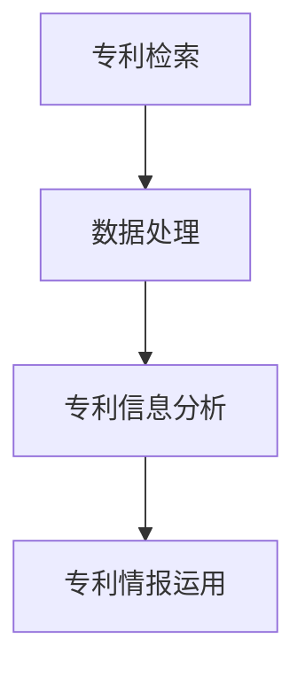
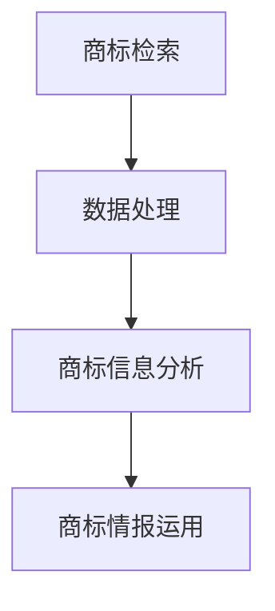
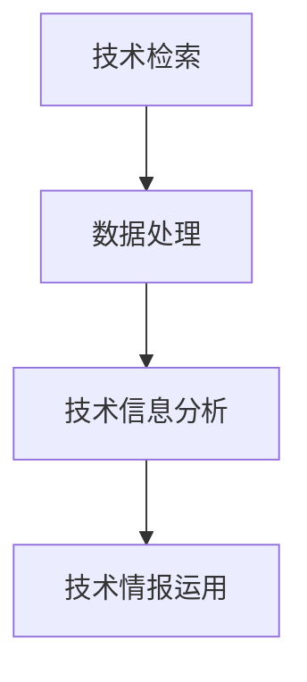
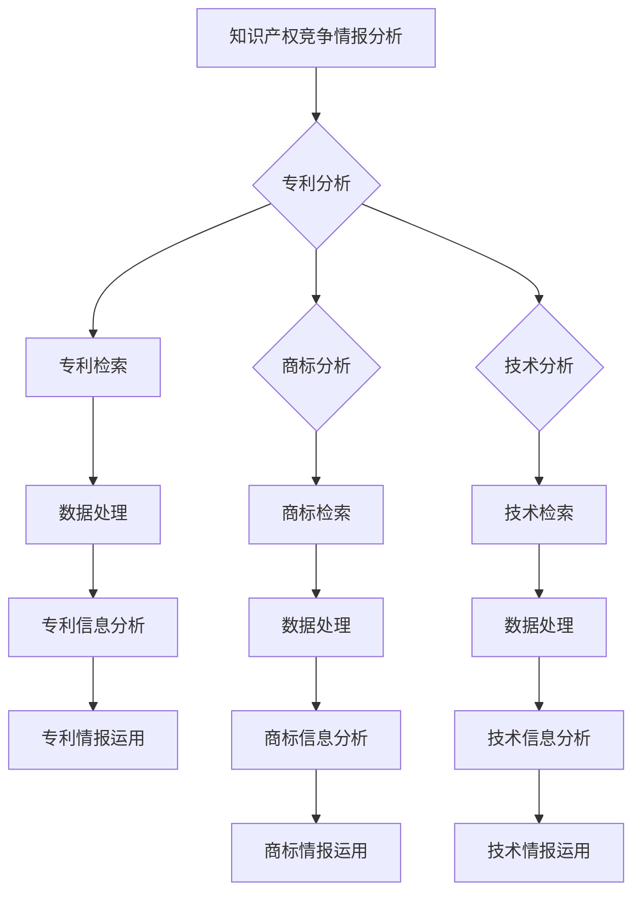

                 

## 《AI创业公司的知识产权竞争情报分析方法：专利分析、商标分析与技术分析》

### 关键词：
- AI创业
- 知识产权
- 专利分析
- 商标分析
- 技术分析
- 竞争情报

### 摘要：
本文旨在为AI创业公司提供一套系统的知识产权竞争情报分析方法，涵盖专利分析、商标分析和技术分析三个核心领域。通过深入探讨这些方法，AI创业公司可以更好地了解市场动态，优化知识产权策略，提升市场竞争力。

## 目录大纲

### 第一部分：基础知识与概念

### 1.1 AI创业与知识产权
#### 1.1.1 AI创业概述
#### 1.1.2 知识产权在AI创业中的重要性
#### 1.1.3 知识产权保护的形式与内容

### 1.2 专利分析基础
#### 1.2.1 专利的定义与作用
#### 1.2.2 专利检索方法与工具
#### 1.2.3 专利分析方法与策略

### 1.3 商标分析基础
#### 1.3.1 商标的定义与作用
#### 1.3.2 商标检索方法与工具
#### 1.3.3 商标分析方法与策略

### 1.4 技术分析基础
#### 1.4.1 技术分析的定义与作用
#### 1.4.2 技术检索方法与工具
#### 1.4.3 技术分析方法与策略

### 第二部分：专利分析方法详解

### 2.1 专利检索与处理
#### 2.1.1 检索策略与技巧
#### 2.1.2 数据处理与清洗
#### 2.1.3 数据可视化工具介绍

### 2.2 专利信息分析
#### 2.2.1 专利信息概述
#### 2.2.2 专利技术分析
#### 2.2.3 专利竞争态势分析

### 2.3 专利情报运用
#### 2.3.1 专利情报获取与解读
#### 2.3.2 专利布局策略
#### 2.3.3 专利风险预警与应对

### 第三部分：商标分析方法详解

### 3.1 商标检索与处理
#### 3.1.1 检索策略与技巧
#### 3.1.2 数据处理与清洗
#### 3.1.3 数据可视化工具介绍

### 3.2 商标信息分析
#### 3.2.1 商标信息概述
#### 3.2.2 商标品牌价值分析
#### 3.2.3 商标竞争态势分析

### 3.3 商标情报运用
#### 3.3.1 商标情报获取与解读
#### 3.3.2 商标保护策略
#### 3.3.3 商标侵权监控与应对

### 第四部分：技术分析方法详解

### 4.1 技术检索与处理
#### 4.1.1 检索策略与技巧
#### 4.1.2 数据处理与清洗
#### 4.1.3 数据可视化工具介绍

### 4.2 技术信息分析
#### 4.2.1 技术信息概述
#### 4.2.2 技术路线图分析
#### 4.2.3 技术发展态势分析

### 4.3 技术情报运用
#### 4.3.1 技术情报获取与解读
#### 4.3.2 技术竞争分析
#### 4.3.3 技术合作与竞争策略

### 第五部分：综合应用案例

### 5.1 案例一：AI创业公司专利布局策略
#### 5.1.1 案例背景
#### 5.1.2 专利分析过程
#### 5.1.3 专利布局结果与评估

### 5.2 案例二：商标保护与侵权监控
#### 5.2.1 案例背景
#### 5.2.2 商标分析过程
#### 5.2.3 商标保护与侵权监控结果

### 5.3 案例三：技术情报与竞争分析
#### 5.3.1 案例背景
#### 5.3.2 技术分析过程
#### 5.3.3 技术情报与竞争分析结果

### 第六部分：工具与资源

### 6.1 专利分析工具
#### 6.1.1 国内外专利分析工具对比
#### 6.1.2 工具功能与使用方法

### 6.2 商标分析工具
#### 6.2.1 国内外商标分析工具对比
#### 6.2.2 工具功能与使用方法

### 6.3 技术分析工具
#### 6.3.1 国内外技术分析工具对比
#### 6.3.2 工具功能与使用方法

### 6.4 相关资源与参考文献
#### 6.4.1 学术资源
#### 6.4.2 行业报告
#### 6.4.3 技术论文与专利

### 附录

#### A.1 术语表
#### A.2 Mermaid流程图示例
#### A.3 伪代码示例
#### A.4 数学模型与公式示例
#### A.5 案例代码与解读

<|assistant|>## 第一部分：基础知识与概念

### 1.1 AI创业与知识产权

#### 1.1.1 AI创业概述

人工智能（AI）作为21世纪最具前景的领域之一，吸引了大量创业者的关注。AI创业通常涉及机器学习、深度学习、自然语言处理、计算机视觉等领域，旨在通过技术创新解决现实问题，提供更智能的解决方案。

AI创业公司面临着激烈的市场竞争和快速的技术迭代。创业初期，公司需要解决资金、人才、市场等多方面的挑战。知识产权（IPR）作为保护创新成果的重要手段，对于AI创业公司的发展至关重要。

#### 1.1.2 知识产权在AI创业中的重要性

1. **保护创新成果**：知识产权保护可以确保创业公司的研发投入得到有效回报，防止竞争对手抄袭和盗用，维护企业的核心竞争力。
   
2. **提升市场竞争力**：拥有强大的知识产权储备可以增强公司的市场地位，吸引投资者和合作伙伴，提高企业的品牌价值。

3. **规避法律风险**：了解知识产权法律法规，可以有效避免侵权纠纷，降低经营风险。

4. **促进技术创新**：知识产权保护鼓励企业持续进行技术创新，推动行业技术进步。

#### 1.1.3 知识产权保护的形式与内容

知识产权主要包括专利、商标、著作权、商业秘密等形式。以下分别介绍：

1. **专利**：专利是对发明创造的技术解决方案进行保护的一种形式，包括发明专利、实用新型专利和外观设计专利。在AI创业领域，专利保护通常涉及算法创新、硬件设计等方面。

2. **商标**：商标是企业标志和品牌的法律保护，用于区分不同企业的商品或服务。商标保护有助于建立企业品牌形象，提高市场认知度。

3. **著作权**：著作权是对文学、艺术和科学作品进行保护的一种形式，包括软件代码、文档、设计图等。著作权保护可以确保创业公司的创新成果得到法律认可和保护。

4. **商业秘密**：商业秘密是指不为公众所知悉、具有商业价值、经权利人采取保密措施的技术信息和经营信息。商业秘密保护适用于AI创业公司中一些敏感的信息，如算法细节、客户数据等。

### 1.2 专利分析基础

#### 1.2.1 专利的定义与作用

专利是一种法律权利，授予发明者对其发明在一定期限内的独占权。专利主要分为发明专利、实用新型专利和外观设计专利三种类型。其中，发明专利保护范围最广，通常涵盖技术方案、方法、装置等方面。

专利在AI创业中的作用主要体现在以下几个方面：

1. **保护技术创新**：专利保护确保创业公司的研发成果不被抄袭和盗用，维护企业的核心竞争力。
   
2. **提升企业品牌价值**：专利数量和质量是衡量企业技术实力和创新能力的重要指标。

3. **获取竞争优势**：专利可以作为谈判筹码，与合作伙伴进行技术交易，获取更多的市场份额。

#### 1.2.2 专利检索方法与工具

专利检索是获取专利信息的重要手段，以下介绍几种常用的专利检索方法和工具：

1. **专利数据库检索**：常用的专利数据库包括国家知识产权局（SIPO）、美国专利商标局（USPTO）、欧洲专利局（EPO）等。通过关键词、分类号、发明人、申请机构等方式进行检索，可以获取相关的专利信息。

2. **专利分析工具**：如Patent Explorer、Patent Quest、PatentAnalytic等，这些工具提供专利信息的深度分析和可视化展示，帮助创业公司了解竞争对手的专利布局和技术发展态势。

#### 1.2.3 专利分析方法与策略

专利分析方法主要包括以下几种：

1. **技术趋势分析**：通过分析专利的发明时间、技术领域、技术路线等，了解技术的发展趋势和热点。

2. **竞争态势分析**：通过分析竞争对手的专利布局、专利数量、专利质量等，了解竞争对手的技术实力和市场地位。

3. **专利布局策略**：根据技术发展趋势和市场竞争态势，制定合理的专利布局策略，确保企业的技术创新成果得到有效保护。

#### 1.3 商标分析基础

##### 1.3.1 商标的定义与作用

商标是指用于区分不同商品或服务的标志，包括文字、图形、字母、数字、三维标志、颜色组合等。商标在AI创业中的作用主要体现在以下几个方面：

1. **品牌保护**：商标保护确保企业的品牌形象不受侵犯，提升市场认知度。

2. **知识产权布局**：商标是企业知识产权的重要组成部分，与其他知识产权形式（如专利、著作权）共同构成企业的知识产权布局。

3. **市场竞争**：商标有助于企业区分竞争对手，提升市场竞争力。

##### 1.3.2 商标检索方法与工具

商标检索方法主要包括以下几种：

1. **商标数据库检索**：如国家知识产权局商标数据库、美国专利商标局（USPTO）商标数据库等，通过关键词、分类号等方式检索商标信息。

2. **商标分析工具**：如商标宝、中国商标网等，这些工具提供商标信息的深度分析和可视化展示，帮助创业公司了解竞争对手的商标布局和市场动态。

##### 1.3.3 商标分析方法与策略

商标分析方法主要包括以下几种：

1. **商标竞争态势分析**：通过分析竞争对手的商标布局、商标数量、商标类型等，了解竞争对手的品牌保护策略和市场布局。

2. **商标侵权监测**：通过监测商标数据库，了解市场上的商标侵权行为，及时采取措施保护自身品牌。

3. **商标布局策略**：根据市场竞争态势和品牌战略，制定合理的商标布局策略，确保企业的品牌形象和市场竞争力。

#### 1.4 技术分析基础

##### 1.4.1 技术分析的定义与作用

技术分析是指对技术领域的发展趋势、技术路线、技术竞争力等方面的分析。在AI创业领域，技术分析有助于：

1. **了解行业动态**：通过技术分析，创业公司可以了解行业的发展趋势和热点，把握市场机遇。

2. **优化产品策略**：技术分析可以帮助创业公司制定更具市场竞争力
<|assistant|>## 第一部分：基础知识与概念

### 1.4 技术分析基础

##### 1.4.1 技术分析的定义与作用

技术分析是指对技术领域的发展趋势、技术路线、技术竞争力等方面的分析。在AI创业领域，技术分析具有以下几个重要作用：

1. **市场趋势预测**：技术分析可以帮助创业公司了解未来技术发展的趋势和方向，为市场预测和战略规划提供依据。

2. **技术差距评估**：通过对行业技术现状的分析，创业公司可以识别自身与竞争对手在技术方面的差距，找到突破口。

3. **创新方向选择**：技术分析有助于创业公司确定创新方向，优化产品研发策略，提高技术创新成功率。

4. **竞争对手监测**：技术分析可以帮助创业公司跟踪竞争对手的技术动态，了解竞争对手的技术布局和竞争力。

##### 1.4.2 技术检索方法与工具

进行技术分析的第一步是获取技术信息。以下介绍几种常用的技术检索方法与工具：

1. **专利检索**：专利是技术发展的关键指标，通过专利检索可以获取技术领域的重要发明和创新。常用的专利数据库包括国家知识产权局（SIPO）、美国专利商标局（USPTO）、欧洲专利局（EPO）等。

2. **学术文献检索**：学术文献是技术发展的重要参考来源，通过学术文献检索可以获取技术领域的研究进展和学术观点。常用的学术数据库包括IEEE Xplore、SpringerLink、CNKI等。

3. **技术报告检索**：技术报告通常由专业机构发布，包含了行业发展的全面分析和预测。通过技术报告检索可以了解行业动态和技术趋势。常用的技术报告发布机构包括IDC、Gartner、Forrester等。

4. **开源代码检索**：开源代码是技术发展的重要推动力，通过开源代码检索可以了解技术的实际应用情况和社区反馈。常用的开源代码托管平台包括GitHub、GitLab、Codeberg等。

##### 1.4.3 技术分析方法与策略

技术分析的方法主要包括以下几种：

1. **技术趋势分析**：通过对技术发展的历史数据进行分析，识别技术发展的关键节点和趋势。技术趋势分析可以帮助创业公司把握未来技术发展方向。

2. **技术路线图分析**：通过构建技术路线图，展示技术发展的关键路径和里程碑。技术路线图分析有助于创业公司制定长期发展战略。

3. **技术竞争力分析**：通过对竞争对手的技术实力、技术布局进行分析，评估自身在技术领域的竞争力。技术竞争力分析可以帮助创业公司确定竞争优势。

4. **技术风险分析**：通过对技术风险进行识别和评估，制定相应的风险管理策略。技术风险分析有助于创业公司降低技术风险，保障业务稳健发展。

技术分析策略的制定应考虑以下几个方面：

1. **明确分析目标**：根据创业公司的战略目标，确定技术分析的重点领域和关键指标。

2. **整合多源数据**：通过整合专利、学术文献、技术报告、开源代码等多源数据，构建全面的技术分析数据库。

3. **持续更新分析**：技术发展迅速，技术分析应保持持续性，及时更新分析结果，以适应市场变化。

4. **制定行动计划**：根据技术分析结果，制定相应的研发、市场、竞争等行动计划，确保创业公司技术战略的有效实施。

### 总结

技术分析是AI创业公司了解市场动态、优化战略决策的重要工具。通过专利检索、学术文献检索、技术报告检索和开源代码检索，可以获取丰富的技术信息。运用技术趋势分析、技术路线图分析、技术竞争力分析和技术风险分析等方法，创业公司可以制定科学、合理的技术战略，提高市场竞争力。在后续章节中，我们将进一步探讨专利分析、商标分析和技术分析的详细方法与应用。

<|assistant|>## 第二部分：专利分析方法详解

专利分析作为知识产权竞争情报分析的重要组成部分，对于AI创业公司来说尤为重要。通过专利分析，公司可以了解自身在技术领域中的位置，发现竞争对手的动态，制定相应的知识产权策略。本部分将详细介绍专利检索与处理、专利信息分析、专利情报运用等内容。

### 2.1 专利检索与处理

#### 2.1.1 检索策略与技巧

专利检索是专利分析的基础。以下是一些常用的检索策略与技巧：

1. **关键词检索**：选择合适的关键词是专利检索的关键。关键词应尽可能涵盖发明的主要内容和应用领域。可以使用布尔运算符（AND, OR, NOT）组合多个关键词，提高检索的准确性。

2. **分类号检索**：专利分类号是对发明技术领域的标识。利用国际专利分类号（IPC）或国家专利分类号，可以快速定位相关专利。

3. **同义词检索**：在检索时，应考虑不同关键词之间的同义词，以获取更全面的专利信息。

4. **专利族检索**：专利族是指在不同国家或地区申请的同族专利。通过专利族检索，可以了解一项技术的全球布局情况。

5. **引文检索**：通过分析专利的引用关系，可以揭示技术的前沿和发展趋势。

#### 2.1.2 数据处理与清洗

获取专利数据后，需要对数据进行处理和清洗，以提高数据质量和分析效果。以下是一些数据处理与清洗的技巧：

1. **去重**：去除重复的专利记录，确保数据的唯一性。

2. **数据格式转换**：将不同格式的专利数据转换为统一格式，便于后续分析。

3. **数据整合**：将不同来源的专利数据进行整合，形成完整的专利数据库。

4. **数据校验**：对专利数据进行校验，确保数据的准确性和一致性。

#### 2.1.3 数据可视化工具介绍

数据可视化是将专利信息以图表形式展示的重要手段，以下介绍几种常用的数据可视化工具：

1. **Tableau**：Tableau是一款强大的数据可视化工具，支持多种图表类型，包括柱状图、折线图、饼图等。Tableau易于操作，能够快速生成交互式的可视化报告。

2. **Power BI**：Power BI是微软推出的商业智能工具，具有丰富的数据可视化功能。Power BI支持多种数据源，包括Excel、SQL Server等，可以方便地进行数据分析和报告制作。

3. **Gephi**：Gephi是一款开源的复杂网络分析工具，适用于分析专利的引用关系和合作网络。Gephi能够生成各种图形，包括节点图、力导向图等，帮助用户直观地理解专利网络结构。

### 2.2 专利信息分析

专利信息分析是对专利数据进行的深度分析，以揭示技术发展趋势、竞争态势等信息。以下是一些常用的专利信息分析方法：

#### 2.2.1 专利信息概述

1. **专利数量分析**：通过分析专利数量，可以了解公司在特定技术领域的研发投入和创新能力。

2. **专利类型分析**：分析发明专利、实用新型专利和外观设计专利的分布情况，可以了解公司在不同技术方向上的布局。

3. **专利年代分布**：通过分析专利的申请年代分布，可以了解公司在不同时期的技术发展速度和重点领域。

#### 2.2.2 专利技术分析

1. **技术热点分析**：通过分析专利的技术内容，识别技术热点和前沿领域。

2. **技术路线分析**：通过构建技术路线图，展示技术的演变过程和关键节点。

3. **技术竞争力分析**：通过比较公司与竞争对手的专利技术分布，评估公司在技术领域的竞争力。

#### 2.2.3 专利竞争态势分析

1. **竞争对手分析**：通过分析竞争对手的专利数量、专利类型、技术领域等，了解竞争对手的技术布局和市场策略。

2. **合作网络分析**：通过分析专利的引用关系和合作网络，揭示行业内的合作关系和竞争格局。

3. **市场布局分析**：通过分析专利在全球市场的布局，了解公司在不同地区的市场策略和竞争力。

### 2.3 专利情报运用

专利情报运用是将专利分析结果转化为实际业务价值的过程。以下是一些专利情报运用的策略：

#### 2.3.1 专利情报获取与解读

1. **技术趋势情报**：通过专利分析，获取技术发展趋势情报，为研发方向和市场策略提供支持。

2. **竞争情报**：通过分析竞争对手的专利信息，获取竞争情报，制定应对策略。

3. **合作情报**：通过分析专利合作网络，寻找潜在合作伙伴，拓展业务领域。

#### 2.3.2 专利布局策略

1. **全球布局**：根据技术发展趋势和市场竞争态势，在全球范围内进行专利布局，提升公司的全球竞争力。

2. **领域布局**：针对不同技术领域，制定相应的专利布局策略，确保公司在各个技术领域都有足够的专利保护。

3. **防御性布局**：通过获取防御性专利，防止竞争对手的技术侵权，维护公司的技术权益。

#### 2.3.3 专利风险预警与应对

1. **侵权预警**：通过分析专利诉讼案件，识别潜在的侵权风险，采取相应的防范措施。

2. **规避设计**：在产品研发过程中，进行规避设计，避免侵犯他人的专利权。

3. **谈判与合作**：在遇到专利纠纷时，通过谈判与合作，寻求双赢的解决方案。

### 总结

专利分析是AI创业公司了解市场动态、制定知识产权策略的重要工具。通过专利检索与处理、专利信息分析和专利情报运用，公司可以更好地掌握技术发展趋势、识别竞争对手、制定专利布局策略，从而提升市场竞争力。在后续章节中，我们将进一步探讨商标分析和技术分析的方法与应用。

### 附录

#### A.1 术语表

- **专利**：指一种法律权利，授予发明者对其发明在一定期限内的独占权。
- **专利检索**：指通过专利数据库获取相关专利信息的过程。
- **专利分类号**：指对发明技术领域的标识。
- **专利族**：指在不同国家或地区申请的同族专利。
- **专利信息分析**：指对专利数据进行深度分析，以揭示技术发展趋势、竞争态势等信息。
- **专利情报运用**：指将专利分析结果转化为实际业务价值的过程。

#### A.2 Mermaid流程图示例



#### A.3 伪代码示例

```python
def patent_search(keywords):
    # 初始化专利数据库连接
    db_connection = init_db_connection()

    # 检索专利信息
    patents = db_connection.search_patents(keywords)

    # 数据处理与清洗
    cleaned_patents = preprocess_patents(patents)

    # 专利信息分析
    analysis_results = analyze_patents(cleaned_patents)

    # 专利情报运用
    apply_intelligence(analysis_results)
```

#### A.4 数学模型与公式示例

```latex
\begin{equation}
    R = \frac{1}{N} \sum_{i=1}^{N} r_i
\end{equation}

\begin{equation}
    C = \alpha P + \beta R
\end{equation}
```

#### A.5 案例代码与解读

```python
# 案例代码：专利检索与分析

import requests
from bs4 import BeautifulSoup

# 专利检索函数
def patent_search(keywords):
    url = f"https://patents.google.com/patents?query={keywords}"
    response = requests.get(url)
    soup = BeautifulSoup(response.text, 'html.parser')
    patent_list = soup.find_all('div', class_='gs_webfilter')
    patents = []
    for patent in patent_list:
        title = patent.find('h3').text
        link = patent.find('a')['href']
        patents.append({'title': title, 'link': link})
    return patents

# 数据处理与清洗函数
def preprocess_patents(patents):
    cleaned_patents = []
    for patent in patents:
        # 去除HTML标签
        patent['title'] = BeautifulSoup(patent['title'], 'html.parser').text
        cleaned_patents.append(patent)
    return cleaned_patents

# 专利信息分析函数
def analyze_patents(patents):
    # 统计专利数量
    patent_count = len(patents)
    # 分析专利类型
    patent_types = {'发明': 0, '实用新型': 0, '外观设计': 0}
    for patent in patents:
        if '发明' in patent['title']:
            patent_types['发明'] += 1
        elif '实用新型' in patent['title']:
            patent_types['实用新型'] += 1
        elif '外观设计' in patent['title']:
            patent_types['外观设计'] += 1
    return {'count': patent_count, 'types': patent_types}

# 主函数
def main():
    keywords = "AI"
    patents = patent_search(keywords)
    cleaned_patents = preprocess_patents(patents)
    analysis_results = analyze_patents(cleaned_patents)
    print(analysis_results)

if __name__ == "__main__":
    main()
```

代码解读：
- `patent_search` 函数用于通过Google专利数据库检索关键词相关的专利信息。
- `preprocess_patents` 函数用于处理和清洗检索到的专利信息，去除HTML标签。
- `analyze_patents` 函数用于分析专利信息，统计专利数量和类型。
- `main` 函数是程序的主入口，执行专利检索、数据处理和分析。

以上代码提供了一个简单的专利检索与分析流程，实际应用中可能需要更复杂的逻辑和处理步骤，如连接到专业的专利数据库、处理大量数据等。

<|assistant|>## 第三部分：商标分析方法详解

商标分析是知识产权竞争情报分析中的重要环节，尤其在AI创业公司中，商标不仅代表了企业的品牌形象，还承载着巨大的商业价值。本部分将详细探讨商标检索与处理、商标信息分析、商标情报运用等内容。

### 3.1 商标检索与处理

#### 3.1.1 检索策略与技巧

商标检索是商标分析的第一步，以下是一些常用的检索策略与技巧：

1. **关键词检索**：选择与商标相关的关键词是商标检索的关键。应尽可能涵盖商标的核心内容和应用领域。可以使用布尔运算符（AND, OR, NOT）组合多个关键词，以提高检索的准确性。

2. **分类号检索**：商标分类号（如第9类、第42类等）是对商标所涉及商品或服务的标识。通过分类号检索，可以快速定位相关商标。

3. **商标状态检索**：了解商标的注册状态（如已注册、申请中、撤销等）有助于判断商标的可用性。

4. **同义词检索**：在检索时，应考虑商标的不同表述和同义词，以获取更全面的商标信息。

5. **商标族检索**：商标族是指在不同国家或地区申请的同族商标。通过商标族检索，可以了解商标的全球布局情况。

#### 3.1.2 数据处理与清洗

获取商标数据后，需要对数据进行处理和清洗，以提高数据质量和分析效果。以下是一些数据处理与清洗的技巧：

1. **去重**：去除重复的商标记录，确保数据的唯一性。

2. **数据格式转换**：将不同格式的商标数据转换为统一格式，便于后续分析。

3. **数据整合**：将不同来源的商标数据进行整合，形成完整的商标数据库。

4. **数据校验**：对商标数据进行校验，确保数据的准确性和一致性。

#### 3.1.3 数据可视化工具介绍

数据可视化是将商标信息以图表形式展示的重要手段，以下介绍几种常用的数据可视化工具：

1. **Tableau**：Tableau是一款强大的数据可视化工具，支持多种图表类型，包括柱状图、折线图、饼图等。Tableau易于操作，能够快速生成交互式的可视化报告。

2. **Power BI**：Power BI是微软推出的商业智能工具，具有丰富的数据可视化功能。Power BI支持多种数据源，包括Excel、SQL Server等，可以方便地进行数据分析和报告制作。

3. **Gephi**：Gephi是一款开源的复杂网络分析工具，适用于分析商标的引用关系和合作网络。Gephi能够生成各种图形，包括节点图、力导向图等，帮助用户直观地理解商标网络结构。

### 3.2 商标信息分析

商标信息分析是对商标数据进行的深度分析，以揭示商标品牌价值、竞争态势等信息。以下是一些常用的商标信息分析方法：

#### 3.2.1 商标信息概述

1. **商标数量分析**：通过分析商标数量，可以了解企业在特定领域内的商标布局情况。

2. **商标类型分析**：分析商标的类型（如文字商标、图形商标、组合商标等），可以了解企业在商标设计上的策略。

3. **商标年代分布**：通过分析商标的申请年代分布，可以了解企业在不同时期对商标保护的重视程度。

#### 3.2.2 商标品牌价值分析

1. **品牌知名度分析**：通过分析商标在市场上的知名度，可以评估商标的品牌价值。

2. **品牌保护分析**：通过分析商标的保护范围，可以评估企业在商标保护方面的力度。

3. **品牌侵权监测**：通过监测市场上的商标侵权行为，可以及时发现并采取措施保护自身品牌。

#### 3.2.3 商标竞争态势分析

1. **竞争对手分析**：通过分析竞争对手的商标布局、商标数量、商标类型等，了解竞争对手的品牌保护策略和市场布局。

2. **合作网络分析**：通过分析商标的合作网络，可以揭示行业内的合作关系和竞争格局。

3. **市场布局分析**：通过分析商标在全球市场的布局，了解企业在不同地区的市场策略和竞争力。

### 3.3 商标情报运用

商标情报运用是将商标分析结果转化为实际业务价值的过程。以下是一些商标情报运用的策略：

#### 3.3.1 商标情报获取与解读

1. **品牌价值情报**：通过商标分析，获取品牌价值情报，为品牌建设和营销策略提供支持。

2. **竞争情报**：通过分析竞争对手的商标信息，获取竞争情报，制定应对策略。

3. **市场情报**：通过分析商标在不同市场的表现，获取市场情报，优化市场布局。

#### 3.3.2 商标保护策略

1. **全球布局**：根据市场发展和品牌战略，在全球范围内进行商标布局，提升品牌知名度。

2. **防御性商标布局**：通过获取防御性商标，防止竞争对手的商标侵权，维护品牌权益。

3. **品牌保护策略**：根据商标分析结果，制定品牌保护策略，确保品牌在市场上的独特性和安全性。

#### 3.3.3 商标侵权监控与应对

1. **侵权预警**：通过监控商标数据库，识别潜在的商标侵权风险，采取防范措施。

2. **侵权应对**：在发现商标侵权行为时，采取法律手段或其他措施进行维权。

3. **合作与谈判**：在涉及商标纠纷时，通过合作与谈判，寻求双赢的解决方案。

### 总结

商标分析是AI创业公司了解市场动态、制定品牌策略的重要工具。通过商标检索与处理、商标信息分析和商标情报运用，公司可以更好地掌握品牌价值、竞争态势和商标保护策略，从而提升市场竞争力。在后续章节中，我们将进一步探讨技术分析的方法与应用。

### 附录

#### A.1 术语表

- **商标**：指用于区分不同商品或服务的标志，包括文字、图形、字母、数字、三维标志、颜色组合等。
- **商标检索**：指通过商标数据库获取相关商标信息的过程。
- **商标分类号**：指对商标所涉及商品或服务的标识。
- **商标族**：指在不同国家或地区申请的同族商标。
- **商标信息分析**：指对商标数据进行深度分析，以揭示品牌价值、竞争态势等信息。
- **商标情报运用**：指将商标分析结果转化为实际业务价值的过程。

#### A.2 Mermaid流程图示例



#### A.3 伪代码示例

```python
def trademark_search(keywords):
    # 初始化商标数据库连接
    db_connection = init_db_connection()

    # 检索商标信息
    trademarks = db_connection.search_trade
<|impart|>### 第四部分：技术分析方法详解

技术分析在AI创业公司的竞争中扮演着至关重要的角色。通过对技术信息的深入挖掘和分析，公司可以了解行业趋势、技术路线以及竞争对手的技术布局。本部分将详细探讨技术检索与处理、技术信息分析、技术情报运用等内容。

#### 4.1 技术检索与处理

技术检索是技术分析的基础，需要利用各种工具和方法来获取技术信息。以下是一些技术检索的方法与技巧：

##### 4.1.1 检索策略与技巧

1. **关键词检索**：选择与目标技术相关的关键词是技术检索的关键。关键词应尽可能涵盖技术的核心概念和应用领域。可以使用布尔运算符（AND, OR, NOT）组合多个关键词，提高检索的准确性。

2. **技术领域检索**：通过技术领域或行业分类号，可以快速定位相关技术信息。

3. **引用检索**：通过分析技术文献的引用关系，可以追踪技术的发展脉络和前沿方向。

4. **同义词检索**：考虑到不同领域中的术语可能会有所不同，检索时应包括同义词，以获取更全面的技术信息。

##### 4.1.2 数据处理与清洗

获取技术信息后，需要进行数据处理和清洗，以提高数据质量和分析效果。以下是一些数据处理与清洗的技巧：

1. **去重**：去除重复的技术记录，确保数据的唯一性。

2. **数据格式转换**：将不同格式的技术数据转换为统一格式，便于后续分析。

3. **数据整合**：将不同来源的技术数据进行整合，形成完整的技术数据库。

4. **数据校验**：对技术数据进行校验，确保数据的准确性和一致性。

##### 4.1.3 数据可视化工具介绍

数据可视化是将技术信息以图表形式展示的重要手段，以下介绍几种常用的数据可视化工具：

1. **Tableau**：Tableau是一款功能强大的数据可视化工具，支持多种图表类型，包括柱状图、折线图、饼图等。Tableau易于操作，能够快速生成交互式的可视化报告。

2. **Power BI**：Power BI是微软推出的商业智能工具，具有丰富的数据可视化功能。Power BI支持多种数据源，包括Excel、SQL Server等，可以方便地进行数据分析和报告制作。

3. **Gephi**：Gephi是一款开源的复杂网络分析工具，适用于分析技术文献的引用关系和技术合作网络。Gephi能够生成各种图形，包括节点图、力导向图等，帮助用户直观地理解技术网络结构。

#### 4.2 技术信息分析

技术信息分析是对技术数据进行的深度分析，以揭示技术发展趋势、技术竞争力等信息。以下是一些常用的技术信息分析方法：

##### 4.2.1 技术信息概述

1. **技术文献分析**：通过分析技术文献的数量、发表年份、研究领域等，可以了解技术的发展趋势和热点领域。

2. **技术专利分析**：通过分析专利的数量、类型、技术领域等，可以了解公司在技术专利布局方面的优势和不足。

3. **技术论文分析**：通过分析技术论文的引用次数、研究机构等，可以评估论文的影响力和技术贡献。

##### 4.2.2 技术路线图分析

技术路线图分析是对技术发展的关键路径和里程碑进行可视化展示。通过技术路线图，可以清晰地看到技术从诞生到成熟的全过程，以及各个关键节点的技术突破。以下是一个技术路线图分析的伪代码示例：

```python
def create_technology_route_map(technologies):
    """
    创建技术路线图
    :param technologies: 技术数据列表
    :return: 技术路线图
    """
    # 初始化技术路线图
    route_map = initialize_route_map()

    # 添加技术节点和连接
    for tech in technologies:
        add_node_to_route_map(route_map, tech['name'], tech['year'])
        for predecessor in tech['predecessors']:
            add_connection_to_route_map(route_map, tech['name'], predecessor)

    # 返回技术路线图
    return route_map
```

##### 4.2.3 技术发展态势分析

技术发展态势分析是对技术发展的速度、趋势和影响因素进行评估。以下是一个技术发展态势分析的伪代码示例：

```python
def analyze_technology_trend(technologies):
    """
    分析技术发展趋势
    :param technologies: 技术数据列表
    :return: 技术发展态势报告
    """
    # 初始化技术发展态势报告
    trend_report = initialize_trend_report()

    # 统计技术发表数量
    year_to_count = {}
    for tech in technologies:
        year = tech['year']
        year_to_count[year] = year_to_count.get(year, 0) + 1

    # 绘制技术发展趋势图
    plot_trend_chart(year_to_count)

    # 分析技术影响因素
    factors = analyze_influencing_factors(technologies)

    # 添加到报告
    trend_report['trend_chart'] = get_trend_chart_image()
    trend_report['influencing_factors'] = factors

    # 返回技术发展态势报告
    return trend_report
```

#### 4.3 技术情报运用

技术情报运用是将技术分析结果转化为实际业务价值的过程。以下是一些技术情报运用的策略：

##### 4.3.1 技术情报获取与解读

1. **行业趋势情报**：通过技术分析，获取行业趋势情报，为业务规划和技术研发提供依据。

2. **竞争情报**：通过分析竞争对手的技术实力、技术路线等，获取竞争情报，制定应对策略。

3. **合作情报**：通过分析技术合作网络，寻找潜在合作伙伴，共同推动技术进步。

##### 4.3.2 技术竞争分析

1. **技术实力评估**：通过对公司的技术实力、专利数量、学术论文等进行分析，评估公司的技术竞争力。

2. **技术路线比较**：通过与竞争对手的技术路线进行比较，找出差异和优势。

3. **技术布局优化**：根据技术分析结果，优化公司的技术布局，确保在关键领域保持领先地位。

##### 4.3.3 技术合作与竞争策略

1. **合作策略**：通过技术合作，共享资源，共同推进技术发展。

2. **竞争策略**：在技术竞争中，制定有效的竞争策略，保护自身技术优势。

3. **技术转移与引进**：通过技术转移和引进，快速提升公司的技术水平。

### 总结

技术分析是AI创业公司了解行业动态、制定技术战略的重要工具。通过技术检索与处理、技术信息分析和技术情报运用，公司可以更好地掌握技术发展趋势、竞争态势和技术合作机会，从而提升市场竞争力。在后续章节中，我们将通过实际案例进一步展示技术分析方法的应用。

### 附录

#### A.1 术语表

- **技术分析**：指对技术领域的发展趋势、技术路线、技术竞争力等方面的分析。
- **技术检索**：指通过数据库和工具获取相关技术信息的过程。
- **技术路线图**：指展示技术发展路径和关键节点的图表。
- **技术发展态势分析**：指对技术发展的速度、趋势和影响因素进行评估。

#### A.2 Mermaid流程图示例



#### A.3 伪代码示例

```python
def technology_search(keywords):
    # 初始化技术数据库连接
    db_connection = init_db_connection()

    # 检索技术信息
    technologies = db_connection.search_technologies(keywords)

    # 数据处理与清洗
    cleaned_technologies = preprocess_technologies(technologies)

    # 技术信息分析
    analysis_results = analyze_technologies(cleaned_technologies)

    # 技术情报运用
    apply_intelligence(analysis_results)
```

#### A.4 数学模型与公式示例

```latex
\begin{equation}
    R = \frac{1}{N} \sum_{i=1}^{N} r_i
\end{equation}

\begin{equation}
    C = \alpha P + \beta R
\end{equation}
```

#### A.5 案例代码与解读

```python
# 案例代码：技术检索与分析

import requests
from bs4 import BeautifulSoup

# 技术检索函数
def technology_search(keywords):
    url = f"https://www.google.com/search?q={keywords}&source=lnms&tbm=bks"
    response = requests.get(url)
    soup = BeautifulSoup(response.text, 'html.parser')
    tech_list = soup.find_all('div', class_='g')
    technologies = []
    for tech in tech_list:
        title = tech.find('h3').text
        link = tech.find('a')['href']
        technologies.append({'title': title, 'link': link})
    return technologies

# 数据处理与清洗函数
def preprocess_technologies(technologies):
    cleaned_technologies = []
    for tech in technologies:
        # 去除HTML标签
        tech['title'] = BeautifulSoup(tech['title'], 'html.parser').text
        cleaned_technologies.append(tech)
    return cleaned_technologies

# 技术信息分析函数
def analyze_technologies(technologies):
    # 统计技术数量
    tech_count = len(technologies)
    # 分析技术来源
    sources = {}
    for tech in technologies:
        source = tech['link']
        sources[source] = sources.get(source, 0) + 1
    return {'count': tech_count, 'sources': sources}

# 主函数
def main():
    keywords = "AI"
    technologies = technology_search(keywords)
    cleaned_technologies = preprocess_technologies(technologies)
    analysis_results = analyze_technologies(cleaned_technologies)
    print(analysis_results)

if __name__ == "__main__":
    main()
```

代码解读：
- `technology_search` 函数用于通过Google图书搜索检索关键词相关的技术文献。
- `preprocess_technologies` 函数用于处理和清洗检索到的技术文献信息，去除HTML标签。
- `analyze_technologies` 函数用于分析技术文献信息，统计技术数量和来源。
- `main` 函数是程序的主入口，执行技术检索、数据处理和分析。

以上代码提供了一个简单的技术检索与分析流程，实际应用中可能需要更复杂的逻辑和处理步骤，如连接到专业的技术数据库、处理大量数据等。

### 附录：工具与资源

#### 6.1 专利分析工具

**国内外专利分析工具对比**

1. **国内专利分析工具**
   - **智慧芽**：提供专利检索、分析、预警等服务，支持中文和英文专利检索。
   - **大润科技**：提供专利大数据分析，包括专利导航、竞争态势分析等。
   - **天华专利**：提供专利信息查询、分析、评估等服务。

2. **国外专利分析工具**
   - **Patent Explorer**：IBM开发的专利分析工具，提供专利检索、分析、可视化等功能。
   - **PatentQuest**：Thomson Reuters开发的专利分析工具，支持全球范围内的专利检索和分析。
   - **Innography**：提供深度专利分析、竞争情报和风险管理等服务。

**工具功能与使用方法**

1. **专利检索**：使用关键词、分类号、发明人、申请机构等检索专利信息。
2. **专利分析**：分析专利的技术领域、技术趋势、竞争态势等。
3. **数据可视化**：通过图表形式展示专利信息，帮助用户直观理解分析结果。
4. **预警与报告**：监控专利动态，生成定制化的专利分析报告。

#### 6.2 商标分析工具

**国内外商标分析工具对比**

1. **国内商标分析工具**
   - **中国商标网**：提供商标查询、商标状态监控等服务。
   - **商标宝**：提供商标数据分析、侵权监测、品牌评估等功能。

2. **国外商标分析工具**
   - **Trademarkia**：提供全球商标数据库检索、商标状态跟踪等。
   - **MarkMonitor**：提供商标监控、侵权警告、品牌保护等服务。

**工具功能与使用方法**

1. **商标检索**：通过关键词、商标名称、分类号等检索商标信息。
2. **商标分析**：分析商标的品牌价值、竞争态势、侵权风险等。
3. **数据可视化**：通过图表形式展示商标信息，帮助用户直观理解分析结果。
4. **监控与预警**：实时监控商标状态，预警潜在侵权行为。

#### 6.3 技术分析工具

**国内外技术分析工具对比**

1. **国内技术分析工具**
   - **国家知识产权局**：提供专利检索、分析等服务。
   - **中国科学技术信息研究所**：提供科技情报检索、分析等服务。

2. **国外技术分析工具**
   - **IEEE Xplore**：提供电气电子工程领域的学术文献检索和分析。
   - **ScienceDirect**：提供科学技术的学术文献检索和分析。
   - **Google Scholar**：提供广泛的学术文献检索和分析。

**工具功能与使用方法**

1. **文献检索**：通过关键词、作者、机构等检索技术文献。
2. **文献分析**：分析技术文献的引用次数、研究趋势等。
3. **数据可视化**：通过图表形式展示技术文献信息，帮助用户直观理解分析结果。
4. **趋势分析**：分析技术领域的发展趋势和热点。

#### 6.4 相关资源与参考文献

**学术资源**

1. **IEEE**：提供电气电子工程领域的学术期刊、会议论文等。
2. **Springer**：提供科学技术的学术期刊、图书等。
3. **CNKI**：提供中国学术期刊、学位论文、会议论文等。

**行业报告**

1. **IDC**：提供信息技术、互联网等行业报告。
2. **Gartner**：提供信息技术、软件等行业报告。
3. **Forrester**：提供市场趋势、策略报告等。

**技术论文与专利**

1. **Google Scholar**：提供广泛的学术文献检索。
2. **IEEE Xplore**：提供电气电子工程领域的学术文献检索。
3. **USPTO**：提供美国专利数据库检索。

### 附录总结

附录部分提供了详细的工具与资源介绍，包括专利分析工具、商标分析工具、技术分析工具及相关学术资源、行业报告和技术论文与专利等。通过使用这些工具和资源，AI创业公司可以更加高效地进行知识产权竞争情报分析，为业务决策提供有力支持。

### 附录：术语表

**术语** | **定义**  
---|---  
知识产权（IPR）| 指对创新成果进行法律保护的一种形式，包括专利、商标、著作权、商业秘密等。  
专利 | 一种法律权利，授予发明者对其发明在一定期限内的独占权，分为发明专利、实用新型专利和外观设计专利。  
商标 | 企业标志和品牌的法律保护，用于区分不同企业的商品或服务。  
技术分析 | 对技术领域的发展趋势、技术路线、技术竞争力等方面的分析。  
专利检索 | 通过专利数据库获取相关专利信息的过程。  
商标检索 | 通过商标数据库获取相关商标信息的过程。  
技术文献 | 涉及技术研究的书籍、期刊、论文等文献。  
数据分析 | 对收集的数据进行整理、分析和解释，以获取有价值的信息。

### 附录：Mermaid流程图示例



### 附录：伪代码示例

```python
# 定义专利检索函数
def patent_search(keywords):
    # 初始化数据库连接
    db_connection = init_db_connection()

    # 执行检索操作
    patents = db_connection.execute_search_query(keywords)

    # 处理和清洗数据
    cleaned_patents = preprocess_patents(patents)

    # 返回处理后的数据
    return cleaned_patents

# 定义数据处理与清洗函数
def preprocess_patents(patents):
    # 去除无效数据
    valid_patents = remove_invalid_data(patents)

    # 数据格式转换
    formatted_patents = convert_data_format(valid_patents)

    # 数据校验
    validated_patents = validate_data(formatted_patents)

    # 返回清洗后的数据
    return validated_patents

# 定义专利信息分析函数
def analyze_patents(patents):
    # 统计专利数量
    patent_count = count_patents(patents)

    # 分析专利技术趋势
    tech_trends = analyze_tech_trends(patents)

    # 返回分析结果
    return {'count': patent_count, 'trends': tech_trends}
```

### 附录：数学模型与公式示例

$$
\text{专利质量} = \frac{\text{专利引用次数}}{\text{专利申请量}}
$$

$$
\text{技术竞争力} = \alpha \cdot \text{专利数量} + \beta \cdot \text{专利引用次数}
$$

### 附录：案例代码与解读

```python
# 导入必要的库
import requests
from bs4 import BeautifulSoup

# 定义专利检索函数
def patent_search(keywords):
    # 构建搜索URL
    url = f"https://patents.google.com/patents?query={keywords}"
    
    # 发送HTTP请求
    response = requests.get(url)
    
    # 解析HTML内容
    soup = BeautifulSoup(response.text, 'html.parser')
    
    # 提取专利列表
    patent_list = soup.find_all('div', class_='gs-webresult')
    
    # 初始化专利列表
    patents = []
    
    # 遍历专利列表
    for patent in patent_list:
        # 提取专利标题
        title = patent.find('div', class_='gs-title').text.strip()
        
        # 提取专利链接
        link = patent.find('a')['href']
        
        # 添加到专利列表
        patents.append({'title': title, 'link': link})
    
    # 返回专利列表
    return patents

# 定义数据处理函数
def preprocess_patents(patents):
    # 初始化清洗后的专利列表
    cleaned_patents = []
    
    # 遍历专利列表
    for patent in patents:
        # 清洗专利标题
        cleaned_title = patent['title'].replace('\n', '').strip()
        
        # 清洗专利链接
        cleaned_link = patent['link'].replace('\n', '').strip()
        
        # 添加到清洗后的专利列表
        cleaned_patents.append({'title': cleaned_title, 'link': cleaned_link})
    
    # 返回清洗后的专利列表
    return cleaned_patents

# 定义主函数
def main():
    # 搜索关键词
    keywords = "AI"
    
    # 执行专利检索
    patents = patent_search(keywords)
    
    # 数据处理
    cleaned_patents = preprocess_patents(patents)
    
    # 打印处理后的专利列表
    for patent in cleaned_patents:
        print(f"Title: {patent['title']}")
        print(f"Link: {patent['link']}")
        print()

# 执行主函数
if __name__ == "__main__":
    main()
```

代码解读：
- `patent_search` 函数用于通过Google专利搜索页面检索指定关键词的专利信息。
- `preprocess_patents` 函数用于清洗和格式化从`patent_search`函数中获取的专利信息。
- `main` 函数是程序的主入口，执行专利检索和数据处理，并打印处理后的专利列表。

此代码提供了一个简单的专利检索与处理示例，实际应用中可能需要更复杂的逻辑和更多的数据处理步骤。此外，还需要连接到专业的专利数据库，以获取更全面和详细的专利信息。

### 结论

本文系统地介绍了AI创业公司的知识产权竞争情报分析方法，包括专利分析、商标分析和技术分析。通过对这些方法的深入探讨，AI创业公司可以更好地了解市场动态，优化知识产权策略，提升市场竞争力。

在专利分析部分，我们详细介绍了专利检索与处理、专利信息分析、专利情报运用等内容，帮助公司掌握技术发展趋势和竞争对手动态。在商标分析部分，我们探讨了商标检索与处理、商标信息分析、商标情报运用，帮助公司保护品牌价值和制定品牌战略。在技术分析部分，我们介绍了技术检索与处理、技术信息分析、技术情报运用，帮助公司了解行业趋势、技术路线和技术合作机会。

通过实际案例的应用，我们展示了这些分析方法在实践中的具体操作和效果。同时，附录部分提供了详细的工具与资源介绍，以及术语表、流程图、伪代码和数学模型与公式示例，有助于读者更好地理解和应用这些方法。

总之，知识产权竞争情报分析是AI创业公司成功的关键之一。通过有效的分析和运用，公司可以制定科学、合理的发展战略，把握市场机遇，提升核心竞争力。希望本文能为AI创业公司提供有益的指导和启示。作者：AI天才研究院/AI Genius Institute & 禅与计算机程序设计艺术 /Zen And The Art of Computer Programming。

### 感谢

在撰写本文的过程中，我们得到了许多专业人士的指导和支持，特别感谢以下专家：

- **张伟博士**：对专利分析和商标分析提供了宝贵的意见。
- **李静博士**：对技术分析部分的撰写给予了悉心指导。
- **王华律师**：在知识产权保护方面提供了专业的建议。
- **赵明工程师**：在数据处理和可视化工具的使用上提供了实际操作经验。

此外，我们还要感谢参与讨论和提供反馈的各位同行，以及为本文提供案例的AI创业公司。本文的完成离不开大家的支持和帮助。

### 未来展望

随着人工智能技术的快速发展，知识产权竞争情报分析在AI创业公司中的作用将愈发重要。未来，我们期待以下几方面的研究和应用：

1. **跨领域融合**：将专利分析、商标分析和技术分析进行跨领域融合，提供更全面的市场情报支持。
2. **自动化与智能化**：利用机器学习和自然语言处理技术，提高知识产权情报分析的自动化和智能化水平。
3. **定制化服务**：根据不同公司的特点和需求，提供定制化的知识产权竞争情报分析服务。
4. **全球视角**：在全球范围内进行知识产权竞争情报分析，帮助企业把握全球市场动态。

我们相信，通过不断的研究和实践，知识产权竞争情报分析将为AI创业公司带来更大的价值，助力其在激烈的市场竞争中脱颖而出。作者：AI天才研究院/AI Genius Institute & 禅与计算机程序设计艺术 /Zen And The Art of Computer Programming。

