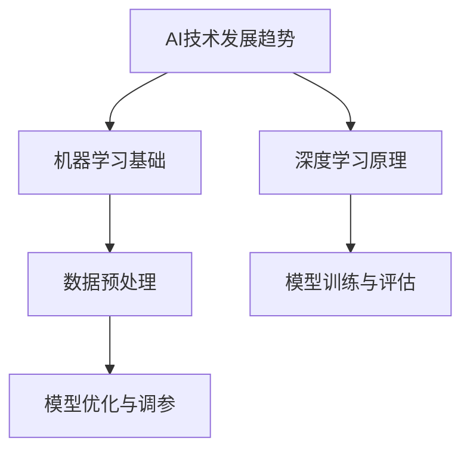

                 

# 《AI创业的人才培养：Lepton AI的教育计划》

## 关键词：
AI创业、人才培养、教育计划、机器学习、深度学习、自然语言处理、项目实战

## 摘要：
本文详细探讨了AI创业的背景与人才需求，介绍了Lepton AI的教育计划，包括其核心理念、培养目标、课程设置、实践项目以及未来发展展望。通过系统化的知识体系和实战训练，Lepton AI致力于为AI创业者提供全面的技术支持和人才培养方案，助力创业项目成功。

---

## 第一部分：AI创业背景与人才需求

### 第1章：AI创业概述

#### 1.1 AI技术发展趋势

随着大数据、云计算、物联网等技术的快速发展，人工智能（AI）正成为推动全球经济增长和社会进步的重要引擎。AI技术的应用领域不断扩大，从传统的制造业、医疗健康到金融、零售、交通等，都取得了显著的成效。例如，智能工厂通过机器人和自动化系统的应用，提高了生产效率和产品质量；智能医疗系统通过图像识别和自然语言处理技术，帮助医生更快速准确地诊断疾病；智能金融系统通过大数据分析和人工智能算法，提高了风险控制和投资决策的准确性。

#### 1.2 AI创业的现状与机遇

AI创业在全球范围内呈现出蓬勃发展的态势。许多初创公司凭借独特的AI技术，迅速崭露头角，成为行业翘楚。例如，Google的AlphaGo在围棋领域的卓越表现，让人们看到了AI在复杂决策问题上的潜力；中国的AI公司商汤科技在计算机视觉领域的突破，使得智能监控和无人驾驶技术取得了长足进步。

同时，随着政策的支持、资本的涌入以及技术门槛的降低，AI创业的机遇与日俱增。许多创业公司借助AI技术，实现了业务模式的创新和市场拓展，取得了显著的商业成功。

#### 1.3 AI创业所需的关键技能

AI创业不仅需要创新思维和市场洞察力，更重要的是具备扎实的技术能力。以下是一些关键技能：

1. **机器学习和深度学习知识**：掌握基础的机器学习和深度学习理论，包括神经网络、卷积神经网络（CNN）、循环神经网络（RNN）等。
2. **编程能力**：熟练掌握至少一种编程语言，如Python、Java或C++，以及相关的数据结构和算法。
3. **数据处理与分析**：了解数据预处理、特征工程和数据分析的方法和技巧，能够处理大规模数据集。
4. **自然语言处理**：掌握自然语言处理（NLP）的基础知识，包括文本分类、情感分析、机器翻译等。
5. **项目管理和团队协作**：具备良好的项目管理和团队协作能力，能够有效地组织和管理团队，推进项目进展。

### 第2章：Lepton AI的教育理念

#### 2.1 Lepton AI的教育愿景

Lepton AI的教育计划旨在培养具备扎实理论基础和丰富实践经验的AI创业者。通过系统化的课程设置和实战训练，使学生能够在短时间内掌握AI的核心技术和创业所需的关键技能。

#### 2.2 教育计划的核心原则

1. **理论与实践相结合**：注重培养学生的实际操作能力，通过实践项目让学生将所学知识应用于实际场景。
2. **创新思维培养**：鼓励学生发挥创造力，提出创新性的解决方案，培养创业思维。
3. **个性化学习**：根据学生的兴趣和需求，提供个性化的学习路径，使每个学生都能够充分发挥自己的潜力。
4. **国际化视野**：引入国际前沿的AI技术和教育资源，拓宽学生的视野，提高其国际竞争力。

#### 2.3 教育计划的目标与成果

1. **知识体系构建**：帮助学生建立全面的AI知识体系，涵盖机器学习、深度学习、自然语言处理等多个领域。
2. **技能提升**：通过实战项目，提高学生的编程能力、数据处理与分析能力以及项目管理和团队协作能力。
3. **创业能力培养**：引导学生了解AI创业的流程和关键环节，培养其创新思维和创业精神。
4. **就业竞争力**：为学生提供丰富的实习和实践机会，提高其就业竞争力，助力其顺利进入AI创业领域。

## 第二部分：AI基础理论培养

### 第3章：人工智能基础概念

#### 3.1 人工智能的定义与分类

人工智能（AI）是指由人制造出来的系统所表现出来的智能行为。根据智能水平和实现方式，AI可以分为以下几类：

1. **弱人工智能**：专注于解决特定问题，如语音识别、图像识别等。
2. **强人工智能**：具备人类级别的智能，能够在各种领域进行复杂决策和创造性工作。
3. **超级人工智能**：超越人类智能，具备广泛的知识和创新能力。

#### 3.2 机器学习的基本概念

机器学习是AI的一个重要分支，通过构建数学模型，使计算机具备自动学习和改进能力。机器学习可以分为以下几类：

1. **监督学习**：通过已标记的训练数据，学习输入和输出之间的映射关系。
2. **无监督学习**：没有标记数据，学习数据中的内在结构和模式。
3. **强化学习**：通过与环境的交互，学习最优策略，实现目标最大化。

#### 3.3 深度学习的基本原理

深度学习是机器学习的一个重要分支，通过多层神经网络模型，实现复杂函数的逼近和特征提取。深度学习的基本原理包括：

1. **神经网络**：由多个神经元组成的网络，通过前向传播和反向传播进行学习。
2. **激活函数**：用于引入非线性特性，提高模型的表达能力。
3. **优化算法**：用于调整模型参数，优化损失函数。

### 第4章：Python编程基础

#### 4.1 Python语言入门

Python是一种易学易用的编程语言，广泛应用于AI领域。Python的基本语法和概念包括：

1. **变量和类型**：变量用于存储数据，Python支持多种数据类型，如整数、浮点数、字符串等。
2. **控制结构**：包括条件语句、循环语句等，用于实现逻辑控制。
3. **函数和模块**：函数是Python的基本构建块，模块是函数和类的集合，用于代码复用和封装。

#### 4.2 数据结构与算法

数据结构是组织和管理数据的方式，算法是解决问题的方法。Python常用的数据结构包括列表、元组、字典和集合。常用的算法包括排序算法、搜索算法和图算法。

#### 4.3 数据处理与分析

数据处理与分析是AI领域的重要环节，Python提供了丰富的库和工具，如NumPy、Pandas和SciPy，用于处理和分析数据。数据处理与分析的基本步骤包括：

1. **数据采集**：从各种数据源获取数据。
2. **数据清洗**：处理缺失值、异常值和噪声数据。
3. **数据预处理**：进行特征工程和归一化等操作。
4. **数据分析**：进行统计分析和可视化，提取数据中的有用信息。

### 第5章：数学基础

#### 5.1 线性代数基础

线性代数是AI领域的基础数学工具，包括向量、矩阵、行列式和线性方程组等概念。线性代数在AI中的应用包括：

1. **特征向量与特征值**：用于降维和特征提取。
2. **矩阵运算**：用于线性模型和神经网络的学习。
3. **线性方程组**：用于求解优化问题。

#### 5.2 概率论与统计学

概率论与统计学是AI领域的另一个重要数学工具，用于建模和推理。概率论与统计学的基本概念包括：

1. **概率分布**：用于描述随机变量的统计特性。
2. **期望和方差**：用于评估模型的性能。
3. **假设检验**：用于验证模型的假设。

#### 5.3 最优化理论与算法

最优化理论是解决优化问题的数学工具，包括线性规划、非线性规划和动态规划等。常用的最优化算法包括：

1. **梯度下降法**：用于最小化损失函数。
2. **牛顿法**：用于求解非线性方程组。
3. **遗传算法**：用于求解复杂优化问题。

### 第三部分：AI技术实践

#### 第6章：机器学习实践

#### 6.1 机器学习项目策划

机器学习项目的策划是项目成功的第一步。项目策划的基本步骤包括：

1. **需求分析**：明确项目目标和应用场景。
2. **数据采集**：收集相关数据，并进行数据预处理。
3. **模型选择**：根据数据特征和业务需求选择合适的模型。
4. **模型训练与评估**：使用训练数据训练模型，并在测试数据上进行评估。
5. **模型优化**：根据评估结果调整模型参数，提高模型性能。

#### 6.2 数据采集与预处理

数据采集与预处理是机器学习项目的关键环节。数据采集的基本方法包括：

1. **公开数据集**：从互联网上获取公开的数据集。
2. **数据爬取**：通过网络爬虫等技术获取数据。
3. **数据合成**：通过生成对抗网络（GAN）等技术生成数据。

数据预处理的基本步骤包括：

1. **数据清洗**：处理缺失值、异常值和噪声数据。
2. **特征工程**：提取有用的特征，并构造新的特征。
3. **数据归一化**：将数据缩放到相同的范围，便于模型训练。

#### 6.3 模型选择与训练

模型选择与训练是机器学习项目的核心环节。模型选择的基本原则包括：

1. **数据驱动**：根据数据特征选择合适的模型。
2. **业务驱动**：根据业务需求选择合适的模型。
3. **模型评估**：使用交叉验证等方法评估模型性能。

模型训练的基本步骤包括：

1. **初始化模型参数**：随机初始化模型参数。
2. **前向传播**：计算输入和输出之间的映射关系。
3. **反向传播**：更新模型参数，优化损失函数。
4. **模型评估**：在测试集上评估模型性能。

#### 6.4 模型评估与优化

模型评估与优化是确保模型性能的重要环节。模型评估的基本方法包括：

1. **交叉验证**：将数据集分为训练集和测试集，多次训练和测试，评估模型性能。
2. **混淆矩阵**：用于评估分类模型的准确性。
3. **ROC曲线和AUC值**：用于评估分类模型的敏感度和特异性。

模型优化的基本方法包括：

1. **参数调优**：调整模型参数，优化损失函数。
2. **正则化**：引入正则化项，防止过拟合。
3. **集成学习**：将多个模型集成，提高模型性能。

### 第7章：深度学习实践

#### 7.1 深度学习基础

深度学习是机器学习的一个重要分支，通过多层神经网络模型，实现复杂函数的逼近和特征提取。深度学习的基本原理包括：

1. **神经网络**：由多个神经元组成的网络，通过前向传播和反向传播进行学习。
2. **激活函数**：用于引入非线性特性，提高模型的表达能力。
3. **优化算法**：用于调整模型参数，优化损失函数。

深度学习的基本架构包括：

1. **卷积神经网络（CNN）**：用于图像处理。
2. **循环神经网络（RNN）**：用于序列数据处理。
3. **生成对抗网络（GAN）**：用于图像生成。

#### 7.2 卷积神经网络实践

卷积神经网络（CNN）是深度学习的重要应用之一，用于图像识别、图像分类和图像生成等任务。CNN的基本架构包括：

1. **卷积层**：通过卷积操作提取图像特征。
2. **池化层**：通过下采样操作降低数据维度。
3. **全连接层**：通过全连接层进行分类和回归。

CNN的实践步骤包括：

1. **数据准备**：收集和预处理图像数据。
2. **模型构建**：使用TensorFlow或PyTorch等深度学习框架构建CNN模型。
3. **模型训练**：使用训练数据训练模型，并调整模型参数。
4. **模型评估**：在测试数据上评估模型性能。

#### 7.3 循环神经网络实践

循环神经网络（RNN）是处理序列数据的重要模型，用于时间序列预测、机器翻译和文本生成等任务。RNN的基本架构包括：

1. **输入层**：接收序列数据。
2. **隐藏层**：通过循环机制处理序列数据。
3. **输出层**：生成预测结果。

RNN的实践步骤包括：

1. **数据准备**：收集和预处理序列数据。
2. **模型构建**：使用TensorFlow或PyTorch等深度学习框架构建RNN模型。
3. **模型训练**：使用训练数据训练模型，并调整模型参数。
4. **模型评估**：在测试数据上评估模型性能。

#### 7.4 生成对抗网络实践

生成对抗网络（GAN）是用于图像生成的重要模型，由生成器和判别器组成。GAN的基本架构包括：

1. **生成器**：生成逼真的图像。
2. **判别器**：判断图像的真实性。
3. **对抗训练**：生成器和判别器相互竞争，提高模型性能。

GAN的实践步骤包括：

1. **数据准备**：收集和预处理图像数据。
2. **模型构建**：使用TensorFlow或PyTorch等深度学习框架构建GAN模型。
3. **模型训练**：使用训练数据训练模型，并调整模型参数。
4. **模型评估**：在测试数据上评估模型性能。

### 第8章：自然语言处理实践

#### 8.1 NLP基础

自然语言处理（NLP）是AI领域的一个重要分支，用于处理和生成人类语言。NLP的基础知识包括：

1. **词法分析**：对文本进行分词、词性标注等处理。
2. **句法分析**：对文本进行句法结构分析，提取句子中的语法关系。
3. **语义分析**：对文本进行语义理解，提取句子中的语义信息。

#### 8.2 文本分类实践

文本分类是NLP的一个重要应用，用于将文本分为不同的类别。文本分类的实践步骤包括：

1. **数据准备**：收集和预处理文本数据。
2. **特征提取**：使用词袋模型、TF-IDF等方法提取文本特征。
3. **模型训练**：使用训练数据训练分类模型。
4. **模型评估**：在测试数据上评估模型性能。

常见的文本分类算法包括：

1. **朴素贝叶斯分类器**：基于贝叶斯定理进行分类。
2. **支持向量机（SVM）**：基于最大间隔分类。
3. **深度学习模型**：如卷积神经网络（CNN）和循环神经网络（RNN）。

#### 8.3 文本生成实践

文本生成是NLP的另一个重要应用，用于生成文章、对话和摘要等文本。文本生成的实践步骤包括：

1. **数据准备**：收集和预处理文本数据。
2. **模型构建**：使用序列到序列（Seq2Seq）模型或生成对抗网络（GAN）等模型进行训练。
3. **模型训练**：使用训练数据训练模型。
4. **模型评估**：在测试数据上评估模型性能。

常见的文本生成算法包括：

1. **递归神经网络（RNN）**：基于序列模型进行生成。
2. **长短期记忆网络（LSTM）**：用于处理长序列数据。
3. **生成对抗网络（GAN）**：用于生成高质量文本。

#### 8.4 问答系统实践

问答系统是NLP的重要应用之一，用于回答用户的问题。问答系统的实践步骤包括：

1. **数据准备**：收集和预处理问答数据。
2. **模型构建**：使用基于事实的模型或基于知识的模型进行训练。
3. **模型训练**：使用训练数据训练模型。
4. **模型评估**：在测试数据上评估模型性能。

常见的问答系统模型包括：

1. **基于模板的模型**：使用预定义的模板进行回答。
2. **基于知识的模型**：使用知识图谱进行回答。
3. **基于深度学习的模型**：如卷积神经网络（CNN）和循环神经网络（RNN）。

### 第四部分：创业项目实战

#### 第9章：Lepton AI教育计划的实施

#### 9.1 教学模式与课程设置

Lepton AI的教育计划采用灵活的教学模式，包括线上课程、线下实训和远程辅导等。课程设置涵盖AI的基础理论、编程技能、数据处理与分析、机器学习、深度学习和自然语言处理等多个领域。

课程设置的基本原则包括：

1. **理论与实践相结合**：通过理论课程和实训项目，使学生能够将所学知识应用于实际场景。
2. **模块化教学**：将课程分为基础模块、进阶模块和高级模块，满足不同层次学生的需求。
3. **个性化学习**：根据学生的兴趣和需求，提供个性化的学习路径。

#### 9.2 实践项目指导

实践项目是Lepton AI教育计划的核心环节，旨在培养学生的实际操作能力和创业能力。实践项目包括：

1. **数据集构建与预处理**：学生需要收集和预处理真实数据集，进行数据清洗、特征提取和归一化等操作。
2. **模型设计与实现**：学生需要设计并实现机器学习、深度学习和自然语言处理等模型，并进行模型训练和评估。
3. **项目报告撰写**：学生需要撰写项目报告，包括项目背景、模型设计、实验结果和总结等内容。

#### 9.3 学生成果展示

学生成果展示是Lepton AI教育计划的重要环节，旨在为学生提供一个展示自己能力的平台。成果展示包括：

1. **项目成果报告**：学生展示自己的实践项目成果，包括模型设计、实验结果和项目应用等。
2. **学术交流**：学生与导师、同行进行学术交流，分享学习心得和经验。
3. **创业计划书**：学生撰写创业计划书，展示自己的创业项目和商业模型。

### 第10章：AI创业案例解析

#### 10.1 成功案例分析

成功案例是AI创业的重要参考，通过分析成功案例，可以了解创业的成功要素和关键步骤。以下是一些成功案例分析：

1. **谷歌DeepMind**：通过AlphaGo在围棋领域的卓越表现，展示了深度学习在复杂决策问题上的潜力。
2. **微软Azure**：通过提供全面的AI云服务，帮助企业和开发者快速构建AI应用，取得了巨大的商业成功。
3. **商汤科技**：通过在计算机视觉领域的突破，为智能监控、无人驾驶和智能家居等领域提供了创新的技术解决方案。

#### 10.2 失败案例分析

失败案例同样具有重要的启示作用，通过分析失败案例，可以了解创业中的风险和挑战。以下是一些失败案例分析：

1. **人工智能公司SenseTime**：由于资金链断裂和业务模式问题，最终破产倒闭。
2. **无人驾驶公司Waymo**：虽然技术领先，但由于法律和政策限制，业务发展受阻。
3. **智能家居公司Nest**：被谷歌收购后，由于产品创新不足，市场竞争力下降。

#### 10.3 创业团队组建与管理

创业团队组建与管理是AI创业的重要环节，成功的团队组建和管理有助于项目的顺利推进和成功。以下是一些团队组建与管理的建议：

1. **明确目标和愿景**：团队的目标和愿景应与创业项目紧密相关，确保团队成员共同追求同一个目标。
2. **多样化团队结构**：团队应包含不同专业背景和技能的人才，形成多元化的团队结构。
3. **建立良好的沟通机制**：团队应建立有效的沟通机制，确保信息流通和团队协作。
4. **激励机制**：为团队成员提供有竞争力的薪酬和激励机制，激发团队成员的积极性和创造力。
5. **持续学习与成长**：团队应注重学习和成长，不断提升团队的技术水平和创新能力。

### 第11章：未来展望

#### 11.1 AI创业的挑战与趋势

AI创业面临诸多挑战和机遇，随着技术的不断进步和市场的变化，AI创业的发展趋势也在不断演变。以下是一些AI创业的挑战和趋势：

1. **技术挑战**：随着AI技术的不断发展，创业团队需要不断更新和提升自己的技术能力，以保持竞争力。
2. **市场挑战**：AI创业市场竞争激烈，创业团队需要深入了解市场需求，提供有竞争力的产品和服务。
3. **资金挑战**：AI创业需要大量的资金投入，创业团队需要寻找合适的融资渠道，确保项目的持续发展。
4. **人才挑战**：AI创业需要具备高水平的人才，创业团队需要建立有效的人才招聘和培养机制。

AI创业的发展趋势包括：

1. **跨行业融合**：AI技术将在更多行业得到应用，推动各行业的数字化和智能化转型。
2. **个性化服务**：随着大数据和AI技术的发展，个性化服务将越来越受欢迎，创业团队可以在这方面寻找商机。
3. **开放合作**：AI创业将更加注重开放合作，通过联合开发和共享资源，实现共赢。

#### 11.2 人才培养的未来方向

人才培养是AI创业的重要支撑，未来人才培养的方向包括：

1. **跨学科培养**：结合计算机科学、数据科学、心理学等学科，培养具有跨学科背景的复合型人才。
2. **实践能力培养**：通过实践项目和实战训练，提高学生的实际操作能力和创业能力。
3. **创新能力培养**：鼓励学生发挥创造力，提出创新性的解决方案，培养创业精神。
4. **国际化视野**：引入国际前沿的AI技术和教育资源，拓宽学生的视野，提高其国际竞争力。

#### 11.3 Lepton AI教育计划的持续发展

Lepton AI教育计划将继续致力于为AI创业者提供全面的技术支持和人才培养方案，实现以下目标：

1. **课程优化**：根据市场需求和技术发展趋势，不断更新和优化课程内容。
2. **教学创新**：探索新的教学模式和教学方法，提高教学效果和学生满意度。
3. **资源整合**：整合国内外优质教育资源，为学生提供丰富的学习资源和实践机会。
4. **国际化发展**：拓展国际合作关系，引入国际先进的教育理念和技术，推动教育国际化发展。

### 附录

#### 附录A：常用工具与资源

1. **Python工具包**：NumPy、Pandas、SciPy、Matplotlib等。
2. **机器学习框架**：TensorFlow、PyTorch、Keras等。
3. **数据集与开源代码**：Kaggle、UCI机器学习库、GitHub等。
4. **在线学习资源**：Coursera、edX、Udacity等。

#### 附录B：Mermaid流程图



#### 附录C：机器学习算法伪代码

```python
// 输入：训练数据集 X, 标签数据集 Y
// 输出：训练好的模型参数 W, B

// 初始化模型参数
W = 初始化(W, size(X, 1))
B = 初始化(B, size(Y, 1))

// 设置迭代次数与学习率
for i = 1 to num_iterations do
    // 前向传播
    z = X * W + B
    a = sigmoid(z)

    // 计算损失函数
    loss = -1/m * (Y * log(a) + (1 - Y) * log(1 - a))

    // 反向传播
    dz = a - Y
    dW = 1/m * dz * X^T
    dB = 1/m * dz

    // 更新参数
    W = W - 学习率 * dW
    B = B - 学习率 * dB
end

// 输出模型参数
return W, B
```

#### 附录D：数学公式与推导

$$
\begin{aligned}
\text{损失函数} &= -\frac{1}{m} \sum_{i=1}^{m} [y^{(i)} \log(a^{(i)}) + (1 - y^{(i)}) \log(1 - a^{(i)})] \\
\text{梯度下降更新} &= \theta^{(t)} = \theta^{(t)} - \alpha \frac{\partial}{\partial \theta^{(t)} J(\theta)
\end{aligned}
$$

#### 附录E：代码实例与解读

##### E.1 数据加载与预处理

```python
import numpy as np
import pandas as pd
from sklearn.model_selection import train_test_split
from sklearn.preprocessing import StandardScaler

# 加载数据集
data = pd.read_csv('data.csv')

# 分割特征和标签
X = data.iloc[:, :-1].values
y = data.iloc[:, -1].values

# 划分训练集和测试集
X_train, X_test, y_train, y_test = train_test_split(X, y, test_size=0.2, random_state=42)

# 数据归一化
scaler = StandardScaler()
X_train = scaler.fit_transform(X_train)
X_test = scaler.transform(X_test)
```

##### E.2 模型训练与评估

```python
from sklearn.linear_model import LogisticRegression
from sklearn.metrics import accuracy_score, confusion_matrix

# 创建逻辑回归模型
model = LogisticRegression()

# 训练模型
model.fit(X_train, y_train)

# 预测测试集
y_pred = model.predict(X_test)

# 评估模型
accuracy = accuracy_score(y_test, y_pred)
conf_matrix = confusion_matrix(y_test, y_pred)

print("Accuracy:", accuracy)
print("Confusion Matrix:\n", conf_matrix)
```

##### E.3 模型部署与预测

```python
# 加载训练好的模型
loaded_model = LogisticRegression()
loaded_model.load_weights('model_weights.h5')

# 预测新数据
new_data = np.array([[1, 2, 3], [4, 5, 6]])
new_data = scaler.transform(new_data)

y_new_pred = loaded_model.predict(new_data)
print("Predictions:\n", y_new_pred)
```

### 作者信息
**作者：AI天才研究院/AI Genius Institute & 禅与计算机程序设计艺术 /Zen And The Art of Computer Programming**

