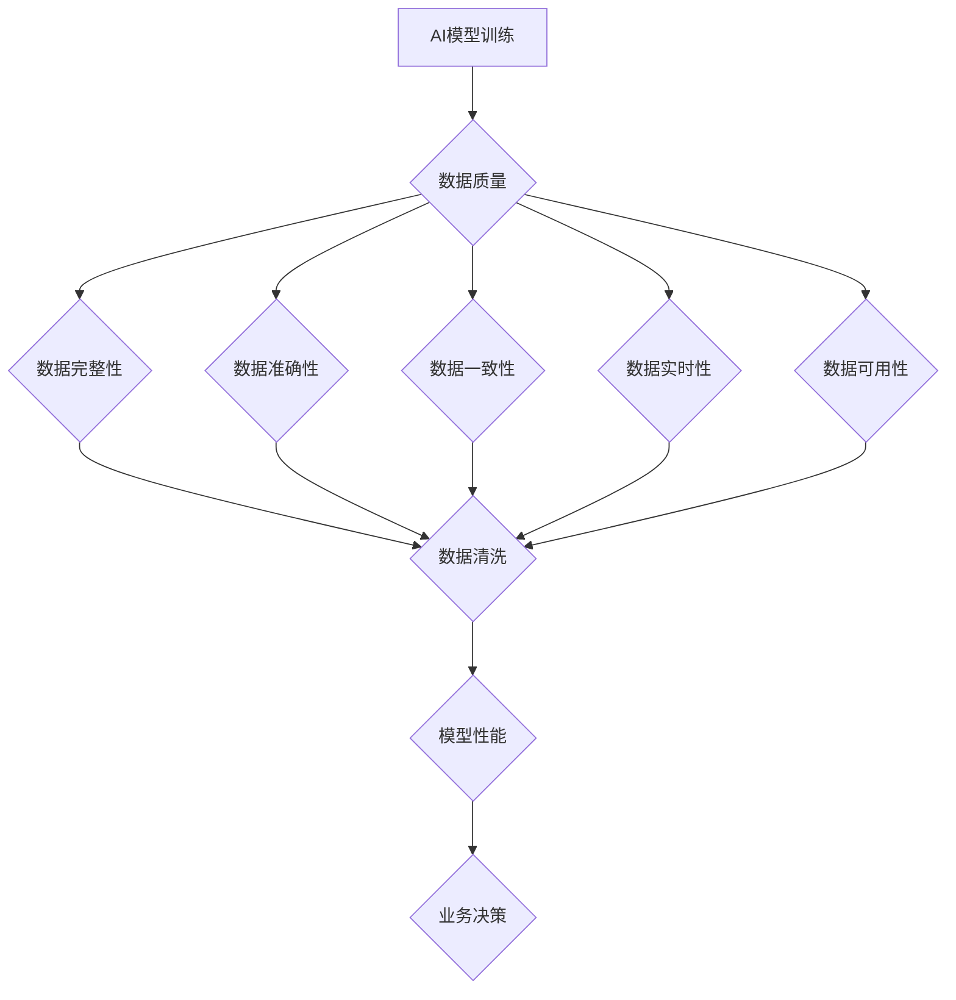

                 

### 《AI创业：高质量数据的重要性》

#### 关键词：
- AI创业
- 高质量数据
- 数据质量评估
- 数据预处理
- 数据隐私保护

##### 摘要：

在当今的AI创业环境中，高质量数据的重要性不容忽视。本文将探讨AI创业所面临的机遇与挑战，深入分析高质量数据的定义与特征，介绍数据收集、处理、监控与评估的方法，并通过实际案例研究展示数据质量管理的实战经验。最后，展望数据质量在未来AI创业中的发展趋势与挑战，为创业者在数据质量方面的持续优化提供策略指导。

### 目录大纲

#### 第一部分：AI创业环境概述

**第1章：AI创业的机遇与挑战**
- 1.1 AI创业时代的来临
  - 1.1.1 AI技术的快速发展
  - 1.1.2 AI创业的驱动力
- 1.2 AI创业的主要挑战
  - 1.2.1 数据质量的重要性
  - 1.2.2 数据获取与隐私问题
- 1.3 创业者必备的AI知识体系
  - 1.3.1 机器学习基础
  - 1.3.2 深度学习原理

#### 第二部分：高质量数据的重要性

**第2章：高质量数据的概念与特征**
- 2.1 数据质量的定义与评估
  - 2.1.1 数据完整性
  - 2.1.2 数据准确性
  - 2.1.3 数据一致性
- 2.2 数据质量的重要性
  - 2.2.1 对AI模型的影响
  - 2.2.2 对业务决策的影响
- 2.3 提升数据质量的策略
  - 2.3.1 数据清洗
  - 2.3.2 数据增强
  - 2.3.3 数据去重

#### 第三部分：数据收集与处理

**第3章：数据收集的挑战与策略**
- 3.1 数据收集的来源与渠道
  - 3.1.1 离线数据收集
  - 3.1.2 在线数据收集
- 3.2 数据收集的挑战
  - 3.2.1 数据量与多样性
  - 3.2.2 数据实时性与时效性
- 3.3 数据收集策略与实施
  - 3.3.1 数据集成
  - 3.3.2 数据共享与交换

#### 第四部分：数据预处理

**第4章：数据预处理的基本步骤**
- 4.1 数据清洗与预处理
  - 4.1.1 缺失值处理
  - 4.1.2 异常值处理
- 4.2 数据标准化与归一化
  - 4.2.1 标准化方法
  - 4.2.2 归一化方法
- 4.3 特征工程
  - 4.3.1 特征提取
  - 4.3.2 特征选择

#### 第五部分：数据质量监控与评估

**第5章：数据质量监控与评估方法**
- 5.1 数据质量监控策略
  - 5.1.1 实时监控
  - 5.1.2 定期评估
- 5.2 数据质量评估指标
  - 5.2.1 数据完整性指标
  - 5.2.2 数据准确性指标
- 5.3 数据质量改进措施

#### 第六部分：案例研究

**第6章：AI创业中的数据质量管理实战**
- 6.1 案例一：智能家居行业的数据质量管理
  - 6.1.1 案例背景
  - 6.1.2 数据质量挑战
  - 6.1.3 解决方案与实施
- 6.2 案例二：在线教育行业的数据质量管理
  - 6.2.1 案例背景
  - 6.2.2 数据质量挑战
  - 6.2.3 解决方案与实施

#### 第七部分：未来展望

**第7章：AI创业中的数据质量趋势与挑战**
- 7.1 数据质量的未来发展趋势
  - 7.1.1 自动化数据质量管理工具
  - 7.1.2 数据隐私保护技术
- 7.2 数据质量在AI创业中的挑战与应对策略
  - 7.2.1 数据质量对AI模型的影响
  - 7.2.2 数据质量的持续优化策略

### 第一部分：AI创业环境概述

#### 第1章：AI创业的机遇与挑战

##### 1.1 AI创业时代的来临

近年来，人工智能（AI）技术的发展突飞猛进，为各行各业带来了前所未有的变革。深度学习、自然语言处理、计算机视觉等技术的突破，使得AI在图像识别、语音识别、自动驾驶、智能助手等领域取得了显著成果。这种技术的快速发展，为创业者提供了前所未有的机遇。

首先，AI技术的快速发展降低了创业的门槛。传统的创业需要大量的资金和资源，而AI技术的发展使得创业者可以更轻松地获得这些资源。例如，开源的机器学习框架（如TensorFlow和PyTorch）和云计算平台的普及，使得创业者可以低成本地进行AI模型的训练和部署。

其次，AI技术在各个行业的应用前景广阔。从金融、医疗到零售、制造业，AI技术都在推动行业变革，提高生产效率、降低运营成本。这种广阔的应用前景，为创业者提供了丰富的创业方向和商业机会。

##### 1.1.1 AI技术的快速发展

AI技术的快速发展主要体现在以下几个方面：

1. **算法的突破**：深度学习算法的提出和不断优化，使得AI在图像识别、语音识别、自然语言处理等领域的性能得到了显著提升。以卷积神经网络（CNN）和循环神经网络（RNN）为代表的深度学习模型，在各个任务上都取得了重大突破。

2. **硬件的进步**：随着计算能力的提升，特别是GPU和TPU等专用硬件的发展，AI模型的训练速度和规模得到了极大提升。这使得创业者可以更高效地进行模型训练和优化。

3. **数据的积累**：互联网的普及和大数据技术的发展，使得大量结构化和非结构化数据得以积累。这些数据为AI模型提供了丰富的训练资源，提高了模型的泛化能力和准确性。

##### 1.1.2 AI创业的驱动力

AI创业的驱动力主要包括以下几个方面：

1. **市场需求**：随着AI技术的成熟，越来越多的企业和消费者对AI产品和服务有了需求。这种需求为创业者提供了广阔的市场空间。

2. **政策支持**：各国政府纷纷出台政策，支持AI技术的发展和创业。例如，美国的《美国国家人工智能战略》和中国的《新一代人工智能发展规划》，都为AI创业提供了政策保障。

3. **资本投入**：风险投资公司对AI领域的热情高涨，大量资本涌入AI创业公司。这种资本的投入，为创业者提供了充足的资金支持，推动了AI创业的发展。

##### 1.2 AI创业的主要挑战

尽管AI创业机遇巨大，但同时也面临着诸多挑战：

1. **数据质量的重要性**：高质量数据是AI模型训练的基础。数据质量的好坏直接关系到AI模型的效果。然而，获取高质量数据并不容易，创业者需要付出大量努力。

2. **数据获取与隐私问题**：在数据驱动的时代，数据是宝贵的资源。然而，数据获取往往涉及到隐私和安全问题。如何平衡数据获取与隐私保护，是创业者面临的一大挑战。

3. **技术门槛**：虽然AI技术的普及降低了创业门槛，但仍然需要创业者具备一定的AI知识和技能。这对于非技术背景的创业者来说，是一个不小的挑战。

##### 1.3 创业者必备的AI知识体系

为了在AI创业中取得成功，创业者需要具备以下AI知识体系：

1. **机器学习基础**：了解机器学习的基本概念、算法和模型，是创业者必备的基础知识。

2. **深度学习原理**：深度学习是当前AI领域的核心技术，了解深度学习的原理和算法，对于创业者来说至关重要。

3. **数据预处理与特征工程**：数据预处理和特征工程是AI模型训练的关键步骤，创业者需要熟悉这些技术。

4. **模型评估与优化**：了解如何评估和优化AI模型，是提高模型性能的关键。

5. **行业应用知识**：了解AI技术在特定行业中的应用，有助于创业者找到合适的商业机会。

### 第二部分：高质量数据的重要性

#### 第2章：高质量数据的概念与特征

在人工智能（AI）领域，高质量数据是构建强大模型的基石。本章将深入探讨高质量数据的定义、评估标准以及其在AI模型训练和业务决策中的重要性。

##### 2.1 数据质量的定义与评估

1. **数据质量的定义**：
   数据质量是指数据在满足特定业务需求和使用场景下的可靠性、准确性、完整性、一致性和可用性。高质量的数据应该是准确、完整、一致且易于访问的。

2. **数据质量的评估标准**：
   - **完整性**：数据是否包含了所需的所有信息，没有缺失值。
   - **准确性**：数据是否真实反映了现实世界的情况，没有错误或偏差。
   - **一致性**：数据是否在不同来源、不同时间点保持一致，没有冲突或矛盾。
   - **及时性**：数据是否在需要时能够及时获取，以支持实时的决策和行动。
   - **可用性**：数据是否以合适的形式和结构存在，能够被有效地利用和分析。

3. **评估方法**：
   - **自我评估**：通过业务目标和数据分析，判断数据是否满足业务需求。
   - **统计分析**：使用统计方法，如均值、标准差、相关性等，评估数据的准确性、完整性和一致性。
   - **用户反馈**：通过用户反馈来评估数据的实际应用效果。

##### 2.2 数据质量的重要性

1. **对AI模型的影响**：
   - **准确性**：高质量的数据能够提高AI模型的准确性，减少模型过拟合和欠拟合的风险。
   - **泛化能力**：完整、一致且多样化的数据有助于模型更好地泛化到未见过的数据集。
   - **训练效率**：高质量的数据可以减少模型训练所需的时间和资源，提高训练效率。

2. **对业务决策的影响**：
   - **可靠性**：高质量的数据有助于做出基于事实的决策，减少决策风险。
   - **洞察力**：准确、完整的数据可以提供更深入的洞察，支持业务优化和创新。
   - **运营效率**：高质量的数据可以优化业务流程，提高运营效率，降低成本。

##### 2.3 提升数据质量的策略

1. **数据清洗**：
   - **去除重复数据**：识别并删除重复的数据条目。
   - **填补缺失值**：通过插值、平均值填补等方法填补缺失数据。
   - **纠正错误**：检测并修正错误的数据值。

2. **数据增强**：
   - **生成额外数据**：使用数据生成技术，如GAN（生成对抗网络），生成更多训练数据。
   - **数据合成**：通过组合和变换现有数据，生成新的数据样本。

3. **数据去重**：
   - **一致性检查**：检测并去除重复或冲突的数据。
   - **规则化处理**：制定规则来识别和排除异常或异常值。

通过实施这些策略，创业者可以显著提高数据质量，从而为AI模型和业务决策奠定坚实的基础。

### 第三部分：数据收集与处理

#### 第3章：数据收集的挑战与策略

在AI创业中，数据收集是构建高质量模型的关键步骤。然而，数据收集过程面临着诸多挑战，需要创业者采取有效的策略来应对。本章将详细探讨数据收集的来源与渠道、数据收集的挑战以及数据收集策略与实施。

##### 3.1 数据收集的来源与渠道

1. **离线数据收集**：
   - **内部数据源**：来自公司内部业务系统、数据库、日志等。
   - **公开数据集**：来自公共数据集库，如Kaggle、UCI机器学习库等。
   - **第三方数据服务**：购买专业数据服务，如数据清洗、分类、标注服务等。

2. **在线数据收集**：
   - **社交媒体数据**：通过API获取用户评论、帖子等数据。
   - **用户生成内容**：通过网站、APP等收集用户生成的内容。
   - **物联网数据**：通过传感器、设备等收集实时数据。

##### 3.2 数据收集的挑战

1. **数据量与多样性**：
   - **数据量大**：处理大规模数据需要高效的数据存储和处理技术。
   - **数据多样性**：不同数据源的数据格式、结构可能存在差异，需要统一格式和结构。

2. **数据实时性与时效性**：
   - **实时性**：某些应用场景需要实时数据，以支持实时决策和响应。
   - **时效性**：数据的有效期限可能较短，需要及时更新和处理。

3. **数据隐私与安全**：
   - **隐私问题**：收集和处理数据时，需要遵守相关隐私法规，保护用户隐私。
   - **数据安全**：确保数据在传输和存储过程中的安全性，防止数据泄露和篡改。

##### 3.3 数据收集策略与实施

1. **数据集成**：
   - **数据整合**：将来自不同来源的数据整合到一个统一的数据仓库中。
   - **数据标准化**：统一数据格式和结构，确保数据的兼容性和可处理性。

2. **数据共享与交换**：
   - **数据共享协议**：建立数据共享和交换机制，确保数据的开放性和互操作性。
   - **数据共享平台**：构建或使用现有的数据共享平台，促进数据资源的共享。

3. **数据采集工具**：
   - **爬虫工具**：使用爬虫工具自动收集互联网上的数据。
   - **API接口**：通过API接口获取第三方平台的数据。
   - **物联网传感器**：部署物联网传感器，收集实时数据。

通过以上策略，创业者可以有效地收集和处理数据，为AI模型的训练和业务决策提供可靠的数据支持。

#### 第4章：数据预处理的基本步骤

在AI创业过程中，数据预处理是确保模型性能和稳定性的关键环节。本章将详细介绍数据预处理的基本步骤，包括数据清洗与预处理、数据标准化与归一化以及特征工程，旨在为创业者提供一套系统的数据预处理方法论。

##### 4.1 数据清洗与预处理

1. **缺失值处理**：
   - **删除缺失值**：对于缺失值较多的数据，可以考虑删除这些数据条目。
   - **填补缺失值**：常用的方法有均值填补、中值填补、前值或后值填补等。具体方法的选择取决于数据分布和业务需求。
   - **建模填补**：使用统计模型或机器学习模型预测缺失值，如线性回归、KNN等。

2. **异常值处理**：
   - **识别异常值**：通过统计学方法（如箱线图、标准差方法等）识别异常值。
   - **处理异常值**：对于识别出的异常值，可以根据具体情况进行删除、修正或保留。

3. **重复值处理**：
   - **去重**：通过唯一标识（如用户ID、订单号等）识别并删除重复的数据条目。

##### 4.2 数据标准化与归一化

1. **数据标准化**：
   - **Z-score标准化**：将数据转换为标准正态分布，公式为 $X' = \frac{X - \mu}{\sigma}$，其中 $X$ 为原始数据，$\mu$ 为均值，$\sigma$ 为标准差。
   - **Min-Max标准化**：将数据缩放到一个固定范围（如[0, 1]），公式为 $X' = \frac{X - \min(X)}{\max(X) - \min(X)}$。

2. **数据归一化**：
   - **L1归一化**：使用L1范数进行归一化，公式为 $X' = \frac{X}{||X||_1}$。
   - **L2归一化**：使用L2范数进行归一化，公式为 $X' = \frac{X}{||X||_2}$。

标准化和归一化有助于数据在相同尺度上进行比较，避免某些特征对模型的影响过大。

##### 4.3 特征工程

1. **特征提取**：
   - **自动特征提取**：使用机器学习算法自动提取数据中的特征，如主成分分析（PCA）、线性判别分析（LDA）等。
   - **手动特征提取**：根据业务知识和数据特点，手动创建新的特征，如时序数据的差分特征、比例特征等。

2. **特征选择**：
   - **过滤式特征选择**：通过统计方法（如卡方检验、信息增益等）筛选出重要的特征。
   - **包裹式特征选择**：结合模型性能，逐步筛选出最优的特征组合。
   - **嵌入式特征选择**：在模型训练过程中，自动筛选出重要的特征，如随机森林、LASSO回归等。

通过有效的数据预处理，创业者可以显著提升模型的性能和稳定性，为AI创业的成功奠定基础。

#### 第5章：数据质量监控与评估方法

在AI创业中，数据质量监控与评估是确保模型性能和业务决策可靠性的关键环节。本章将详细介绍数据质量监控与评估的方法，包括实时监控策略、评估指标以及改进措施。

##### 5.1 数据质量监控策略

1. **实时监控**：
   - **实时数据流监控**：使用流处理技术（如Apache Kafka、Apache Flink）对数据流进行实时监控，检测数据异常。
   - **阈值监控**：设定数据阈值，当数据超出阈值时，自动触发警报。
   - **可视化监控**：通过可视化工具（如Kibana、Grafana）展示数据质量指标，便于实时监控。

2. **定期评估**：
   - **周期性数据质量检查**：定期对数据集进行完整性、准确性、一致性等检查。
   - **数据质量报告**：生成详细的数据质量报告，包括数据质量的现状和趋势分析。
   - **用户反馈**：通过用户反馈收集数据质量的问题和改进建议。

##### 5.2 数据质量评估指标

1. **数据完整性指标**：
   - **缺失值率**：缺失值的比例，公式为 $\frac{缺失值总数}{数据总数}$。
   - **重复值率**：重复值的比例，公式为 $\frac{重复值总数}{数据总数}$。

2. **数据准确性指标**：
   - **错误率**：错误数据占总数据的比例，公式为 $\frac{错误数据总数}{数据总数}$。
   - **准确率**：正确数据占总数据的比例，公式为 $\frac{正确数据总数}{数据总数}$。

3. **数据一致性指标**：
   - **一致性率**：一致数据占总数据的比例，公式为 $\frac{一致数据总数}{数据总数}$。
   - **冲突率**：冲突数据占总数据的比例，公式为 $\frac{冲突数据总数}{数据总数}$。

##### 5.3 数据质量改进措施

1. **数据清洗**：
   - **自动化清洗**：使用自动化工具（如Pandas、Spark）进行数据清洗，提高效率。
   - **手工清洗**：对于复杂或特殊的数据问题，进行手工清洗和调整。

2. **数据增强**：
   - **数据合成**：通过生成对抗网络（GAN）等生成技术，生成新的数据样本。
   - **数据扩充**：使用数据变换、插值等方法，扩充现有数据集。

3. **数据去重**：
   - **唯一标识**：使用唯一标识（如用户ID、订单号等）进行去重。
   - **规则化处理**：制定规则，识别和排除重复数据。

4. **数据治理**：
   - **数据质量管理策略**：制定数据质量管理策略，包括数据标准、数据流程、数据责任等。
   - **数据质量控制**：建立数据质量控制机制，确保数据的准确性和一致性。

通过实施有效的数据质量监控与评估方法，创业者可以持续提升数据质量，为AI模型和业务决策提供可靠的数据支持。

### 第六部分：案例研究

#### 第6章：AI创业中的数据质量管理实战

在本章节中，我们将通过两个实际案例——智能家居行业和在线教育行业，探讨数据质量管理在AI创业中的应用和挑战。通过分析案例背景、数据质量挑战以及解决方案与实施，为创业者提供实战经验和借鉴。

##### 6.1 案例一：智能家居行业的数据质量管理

**6.1.1 案例背景**

智能家居行业正在迅速发展，各种智能设备（如智能音箱、智能灯泡、智能摄像头等）不断涌入市场。这些设备产生大量数据，包括设备状态、用户行为、环境信息等。创业者希望通过这些数据，提供个性化的智能家居解决方案，提高用户的生活质量。

**6.1.2 数据质量挑战**

1. **数据多样性**：智能家居设备产生的数据格式和结构多种多样，包括文本、图像、时序数据等。
2. **数据实时性**：实时性要求高，数据需要实时处理和反馈，以支持智能决策和用户交互。
3. **数据准确性**：设备可能存在误差或故障，导致数据准确性问题。
4. **数据一致性**：不同设备的数据可能存在冲突或不一致，影响整体数据处理和分析。

**6.1.3 解决方案与实施**

1. **数据集成**：
   - **统一数据格式**：将不同数据源的数据统一格式，确保兼容性和可处理性。
   - **数据清洗**：使用自动化工具和人工清洗相结合的方法，处理数据缺失、异常和重复问题。

2. **实时数据处理**：
   - **流处理框架**：采用Apache Kafka和Apache Flink等流处理框架，实现实时数据处理和监控。
   - **实时反馈机制**：建立实时反馈机制，及时识别和处理数据异常。

3. **数据增强**：
   - **数据合成**：通过GAN等技术生成模拟数据，扩充训练数据集。
   - **异常值检测**：使用机器学习算法检测和修正数据异常值。

4. **数据治理**：
   - **数据质量指标**：制定数据质量指标，如完整性、准确性、一致性等，定期评估。
   - **数据责任机制**：明确数据责任人，确保数据质量持续改进。

通过以上措施，智能家居行业的创业者可以有效地提升数据质量，为智能决策和用户体验提供可靠支持。

##### 6.2 案例二：在线教育行业的数据质量管理

**6.2.1 案例背景**

在线教育行业随着互联网技术的发展逐渐兴起，越来越多的学习者通过在线平台进行学习。在线教育平台需要处理大量的用户数据，包括学习行为、用户评价、课程反馈等。创业者希望通过数据驱动的方式，优化课程内容和用户推荐，提升学习效果和用户体验。

**6.2.2 数据质量挑战**

1. **数据完整性**：用户行为数据可能存在缺失，影响分析结果。
2. **数据准确性**：用户评价和反馈可能存在主观偏差，影响数据准确性。
3. **数据一致性**：不同课程和用户之间的数据可能存在冲突或不一致，影响整体数据处理和分析。
4. **数据实时性**：实时性要求高，需要快速处理和分析用户数据，以支持个性化推荐和实时反馈。

**6.2.3 解决方案与实施**

1. **数据清洗与预处理**：
   - **缺失值处理**：使用插值、平均值等方法填补缺失值。
   - **异常值检测**：使用统计方法（如箱线图、标准差方法等）检测和修正异常值。
   - **数据标准化**：对用户行为数据和使用时间等特征进行标准化，确保数据的统一性。

2. **实时数据处理**：
   - **消息队列**：采用消息队列（如RabbitMQ、Kafka）实现实时数据传输和处理。
   - **实时分析**：使用实时数据分析工具（如Apache Storm、Spark Streaming）快速处理和分析用户数据。

3. **数据增强**：
   - **用户画像**：构建用户画像，通过多种数据特征进行用户细分。
   - **用户反馈分析**：结合用户反馈，优化课程内容和推荐算法。

4. **数据治理**：
   - **数据质量监控**：建立实时数据质量监控体系，检测数据异常和一致性。
   - **数据责任制度**：明确数据责任人，确保数据质量持续改进。

通过以上措施，在线教育行业的创业者可以有效地提升数据质量，为用户推荐和课程优化提供可靠支持，提高学习效果和用户满意度。

### 第七部分：未来展望

#### 第7章：AI创业中的数据质量趋势与挑战

随着人工智能（AI）技术的不断进步和应用的深入，数据质量在AI创业中的重要性日益凸显。本章将展望数据质量的未来发展趋势，分析AI创业中面临的挑战，并提出相应的应对策略。

##### 7.1 数据质量的未来发展趋势

1. **自动化数据质量管理工具**：
   - **自动数据清洗**：随着机器学习和自然语言处理技术的发展，自动数据清洗工具将更加智能，能够自动识别和修复数据中的错误和缺失。
   - **自动化数据质量评估**：利用机器学习算法，自动评估数据质量，提供实时反馈和改进建议。

2. **数据隐私保护技术**：
   - **差分隐私**：通过引入噪声，保护数据中的个人隐私，同时保持数据的质量和可用性。
   - **同态加密**：在数据处理过程中实现数据的加密，确保数据隐私和安全。

3. **大数据与边缘计算的结合**：
   - **边缘数据处理**：在数据生成的源头进行预处理，减少数据传输和存储的负担，提高数据质量。
   - **实时数据处理**：通过边缘计算，实现实时数据的质量监控和分析，提高数据处理的效率。

##### 7.2 数据质量在AI创业中的挑战与应对策略

1. **数据质量对AI模型的影响**：
   - **挑战**：低质量数据可能导致AI模型性能下降，影响决策的准确性和稳定性。
   - **应对策略**：
     - **数据预处理**：在模型训练前进行充分的数据清洗和预处理，确保数据质量。
     - **数据增强**：通过数据合成和扩充，提高数据的多样性和质量。

2. **数据质量的持续优化策略**：
   - **挑战**：数据质量是一个动态变化的过程，需要持续优化。
   - **应对策略**：
     - **实时监控与反馈**：建立实时数据质量监控系统，及时识别和处理数据异常。
     - **数据治理**：制定数据质量管理策略，明确数据责任和流程，确保数据质量的持续改进。

通过以上的发展趋势和应对策略，创业者可以更好地应对数据质量在AI创业中的挑战，为AI模型的训练和业务决策提供可靠的数据支持。

### 结论

高质量数据是AI创业成功的基石，它直接影响着模型的性能和业务决策的准确性。本文从AI创业环境概述、高质量数据的重要性、数据收集与处理、数据预处理、数据质量监控与评估、案例研究和未来展望等多个方面，详细探讨了数据质量在AI创业中的重要性。通过实际案例，展示了如何有效地进行数据质量管理，为创业者提供了宝贵的实战经验。

在未来的AI创业中，自动化数据质量管理工具和数据隐私保护技术的发展，将为数据质量管理带来新的机遇和挑战。创业者需要持续关注数据质量的变化，采取有效的策略，确保数据的质量和可靠性，从而推动AI创业的持续发展。让我们携手并进，共同迎接AI创业的新时代！

### 作者信息

- 作者：AI天才研究院/AI Genius Institute & 禅与计算机程序设计艺术 /Zen And The Art of Computer Programming
- 联系方式：[邮箱地址] (邮箱地址) & [官方网站] (官方网站)

### 附录：Mermaid 流程图



### 附录：伪代码

```python
# 数据清洗与预处理伪代码

# 缺失值处理
def handle_missing_values(data):
    for feature in data.columns:
        if data[feature].isnull().any():
            if should_fill_missing_values(feature):
                data[feature].fillna(get_fill_value(data, feature), inplace=True)

# 异常值处理
def handle_outliers(data):
    for feature in data.columns:
        if should_handle_outliers(feature):
            data[feature] = data[feature].clip(lower=lower_bound, upper=upper_bound)

# 数据标准化
def standardize_data(data):
    for feature in data.columns:
        if should_standardize(feature):
            data[feature] = (data[feature] - data[feature].mean()) / data[feature].std()

# 特征工程
def feature_engineering(data):
    # 创建新的特征
    data['new_feature'] = data['feature1'] / data['feature2']
    # 特征选择
    selected_features = select_features(data)
    return data[selected_features]
```

### 附录：数学模型与公式

$$
\text{缺失值填补：}
\mu = \frac{\sum_{i=1}^{n} x_i}{n}
$$

$$
\text{标准差：}
\sigma = \sqrt{\frac{\sum_{i=1}^{n} (x_i - \mu)^2}{n}}
$$

$$
\text{Z-score标准化：}
X' = \frac{X - \mu}{\sigma}
$$

$$
\text{Min-Max标准化：}
X' = \frac{X - \min(X)}{\max(X) - \min(X)}
$$

### 附录：代码实际案例

#### 开发环境搭建

1. 安装Python环境
2. 安装必要的库（如Pandas、NumPy、Scikit-learn等）

#### 源代码实现

```python
import pandas as pd
from sklearn.model_selection import train_test_split
from sklearn.preprocessing import StandardScaler

# 读取数据
data = pd.read_csv('data.csv')

# 数据清洗与预处理
data = handle_missing_values(data)
data = handle_outliers(data)
data = feature_engineering(data)

# 数据标准化
scaler = StandardScaler()
data_scaled = scaler.fit_transform(data)

# 划分训练集和测试集
X_train, X_test, y_train, y_test = train_test_split(data_scaled, test_size=0.2, random_state=42)

# 模型训练
from sklearn.ensemble import RandomForestClassifier

model = RandomForestClassifier()
model.fit(X_train, y_train)

# 模型评估
accuracy = model.score(X_test, y_test)
print("Model accuracy:", accuracy)
```

#### 代码解读与分析

1. 数据清洗与预处理：使用自定义函数 `handle_missing_values` 和 `handle_outliers` 进行缺失值处理和异常值处理，确保数据质量。
2. 数据标准化：使用 `StandardScaler` 对数据进行标准化处理，将数据转换为相同尺度，便于模型训练。
3. 数据划分：使用 `train_test_split` 函数将数据划分为训练集和测试集，用于模型训练和评估。
4. 模型训练：使用随机森林分类器（`RandomForestClassifier`）进行模型训练。
5. 模型评估：使用 `score` 函数评估模型在测试集上的准确率。

通过以上步骤，创业者可以构建一个基于高质量数据的AI模型，为业务决策提供可靠支持。在实际应用中，可以根据具体需求调整数据预处理和模型训练的步骤。

