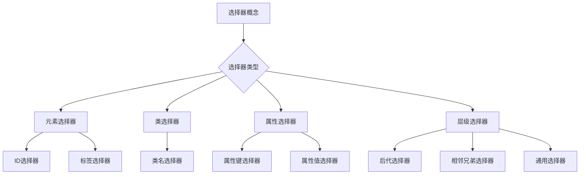

                 

# AI国家战略：基于产业的创新体系建设

## 关键词
- AI国家战略
- 产业创新体系
- 技术体系建设
- 数据体系建设
- 人才体系建设
- 产业生态体系
- 政策环境
- 全球竞争与合作

## 摘要
本文旨在深入探讨AI国家战略的构建，特别是基于产业创新体系的建设。通过分析国内外AI国家战略的背景与意义，本文将详细阐述AI产业创新体系的概念与特点，技术、数据、人才和产业生态体系建设的策略，以及AI国家战略的宏观政策环境、产业发展规划和全球竞争与合作。同时，通过国内外案例分析，本文提供了AI国家战略在中国的地方实践，为我国AI产业的发展提供有价值的参考。

### 第一部分：AI国家战略概述

#### 第1章：AI国家战略背景与意义

#### 1.1 AI技术的发展趋势

随着计算能力的提升、大数据的积累以及算法的优化，人工智能（AI）技术正以前所未有的速度发展。从早期的专家系统到如今的深度学习，AI技术在各个领域取得了显著的成果。人工智能技术的发展趋势主要表现在以下几个方面：

1. **算法创新**：深度学习、强化学习等算法的不断进步，为AI的应用提供了强大的技术支撑。
2. **硬件升级**：GPU、TPU等专用硬件的普及，显著提高了AI模型的训练速度和推理效率。
3. **数据积累**：互联网、物联网等技术的广泛应用，使得大量结构化和非结构化数据得以积累，为AI提供了丰富的训练素材。
4. **跨学科融合**：AI与其他领域的融合，如生物、物理、化学等，为AI的应用开辟了新的方向。

#### 1.2 AI国家战略的国内外比较

在全球范围内，各国纷纷制定了各自的AI国家战略，以抢占AI领域的制高点。以下是对部分国家AI国家战略的比较：

- **美国**：美国以市场驱动和技术创新为特点，通过加大研发投入、培养人才、制定相关法规等手段推动AI发展。
- **欧洲**：欧洲强调数据隐私保护和伦理问题，旨在通过制定统一的标准和法规，促进AI的健康发展。
- **中国**：中国注重产业应用和生态体系建设，通过政策引导、资金支持、国际合作等方式，推动AI技术在各个行业的应用。

#### 1.3 AI国家战略对中国产业的影响

AI国家战略的制定对中国产业产生了深远的影响：

1. **产业升级**：AI技术的应用将推动传统产业的转型升级，提升生产效率和产品质量。
2. **新兴产业发展**：AI技术带动了新兴产业的快速发展，如自动驾驶、智能制造、医疗健康等。
3. **产业生态建设**：AI国家战略推动了产业生态的建设，包括技术平台、数据资源、人才储备等。

### 第2章：AI产业创新体系概述

#### 2.1 AI产业创新体系的概念与特点

AI产业创新体系是指围绕人工智能技术的研究、开发、应用和产业化，所形成的创新网络和生态系统。其特点包括：

1. **跨界融合**：AI产业创新体系涉及多个领域，如计算机科学、数据科学、生物医学等，实现了跨学科融合。
2. **开放协同**：AI产业创新体系强调各方力量的协同合作，包括政府、企业、高校和科研机构等。
3. **快速迭代**：AI技术的快速发展要求产业创新体系具备快速迭代的能力，以适应技术变化和市场需求。

#### 2.2 AI产业创新体系的核心要素

AI产业创新体系的核心要素包括：

1. **技术体系**：包括基础研究、应用研究和产业化技术，形成从理论到实践的完整链条。
2. **数据体系**：数据是AI发展的基石，数据体系的建设包括数据采集、存储、处理和分析等环节。
3. **人才体系**：人才是AI产业创新的关键因素，包括技术研发人才、应用推广人才和管理人才等。
4. **产业生态**：产业生态包括产业链上下游企业、投资机构、科研机构和政府等，共同推动AI产业的发展。

#### 2.3 AI产业创新体系的建设策略

AI产业创新体系的建设策略包括以下几个方面：

1. **政策支持**：政府通过制定相关政策，为AI产业的发展提供良好的环境。
2. **资金投入**：加大研发投入，支持基础研究和应用研究，促进科技成果转化。
3. **人才培养**：建立健全的人才培养体系，吸引和培养优秀的AI人才。
4. **国际合作**：加强与国际先进水平的合作，引进国外先进技术和管理经验。
5. **平台建设**：建设技术平台、数据平台和人才平台，提升产业创新能力。

### 第二部分：AI产业创新体系建设

#### 第3章：技术体系建设

#### 3.1 AI核心技术概述

AI核心技术包括：

1. **机器学习**：机器学习是AI的基础，包括监督学习、无监督学习和强化学习等。
2. **深度学习**：深度学习是机器学习的一种重要形式，通过多层神经网络实现数据的自动特征提取。
3. **自然语言处理**：自然语言处理是AI的重要应用领域，涉及语言理解、生成和翻译等。
4. **计算机视觉**：计算机视觉是AI的重要方向，通过图像识别、图像处理和图像生成等技术实现机器对图像的理解。

#### 3.2 AI算法原理与模型结构

AI算法原理和模型结构是AI技术体系建设的重要部分。以下是一些核心算法和模型：

1. **神经网络**：神经网络是一种模拟人脑神经元连接的模型，通过前向传播和反向传播实现数据的自动特征提取。
2. **卷积神经网络（CNN）**：卷积神经网络是一种用于图像识别和处理的神经网络，通过卷积层和池化层实现图像的特征提取。
3. **循环神经网络（RNN）**：循环神经网络是一种用于序列数据处理的神经网络，通过隐藏状态和反馈连接实现序列的建模。
4. **生成对抗网络（GAN）**：生成对抗网络是一种通过生成器和判别器的对抗训练实现数据生成和判别的新模型。

#### 3.3 AI技术应用与发展

AI技术应用和发展是技术体系建设的关键环节。以下是一些重要应用领域：

1. **自动驾驶**：自动驾驶技术是AI在交通运输领域的应用，通过传感器、计算机视觉和机器学习等技术实现车辆的自主驾驶。
2. **智能制造**：智能制造是AI在制造业的应用，通过机器学习、计算机视觉和物联网等技术实现生产过程的智能化。
3. **医疗健康**：医疗健康是AI的重要应用领域，通过自然语言处理、计算机视觉和机器学习等技术实现疾病的诊断和治疗。
4. **金融科技**：金融科技是AI在金融领域的应用，通过机器学习、大数据分析和区块链等技术实现金融服务的智能化。

#### 第4章：数据体系建设

#### 4.1 AI数据类型与处理方法

AI数据类型包括：

1. **结构化数据**：如数据库、表格等，容易处理和分析。
2. **非结构化数据**：如图像、音频、文本等，需要通过特定的方法进行预处理和分析。
3. **时序数据**：如股票价格、气象数据等，具有时间序列的特性。

AI数据处理方法包括：

1. **数据采集**：通过传感器、互联网等渠道收集数据。
2. **数据清洗**：去除数据中的噪声和异常值，提高数据质量。
3. **数据预处理**：对数据进行标准化、归一化等处理，以便后续分析。
4. **数据分析**：使用统计方法、机器学习等方法对数据进行分析和挖掘。

#### 4.2 数据治理与隐私保护

数据治理与隐私保护是数据体系建设的重要方面。以下是一些关键点：

1. **数据质量管理**：确保数据的一致性、准确性和可靠性。
2. **数据安全**：通过加密、访问控制等措施保护数据的安全。
3. **隐私保护**：在数据处理过程中，遵守相关法律法规，保护个人隐私。
4. **合规性**：遵循相关数据治理标准和法规，确保数据处理的合规性。

#### 4.3 数据资源的共享与利用

数据资源的共享与利用是提高数据价值的关键。以下是一些策略：

1. **数据开放**：通过数据开放平台，共享公共数据资源，促进数据的利用。
2. **数据交易**：建立数据交易市场，允许企业和个人合法交易数据。
3. **数据融合**：将不同来源、不同类型的数据进行融合，提高数据的利用价值。
4. **数据服务**：提供数据服务，如数据挖掘、数据分析等，为企业和个人提供数据支持。

#### 第5章：人才体系建设

#### 5.1 AI人才培养体系

AI人才培养体系是人才体系建设的重要部分。以下是一些关键点：

1. **教育体系**：建立从基础教育到高等教育的一体化AI人才培养体系，培养AI专业人才。
2. **课程设置**：设置AI相关课程，涵盖基础理论、应用技术和最新发展。
3. **实践环节**：加强实践环节，通过实验室、实习等方式提高学生的实际操作能力。
4. **国际交流**：加强与国际先进水平的交流与合作，引进国外优质教育资源。

#### 5.2 人才引进与激励政策

人才引进与激励政策是吸引和留住优秀人才的关键。以下是一些策略：

1. **人才引进**：通过引进海外高层次人才、设立人才专项基金等方式，吸引国内外优秀人才。
2. **激励政策**：通过提供住房、医疗、教育等福利，以及绩效奖金、股权激励等方式，激励人才。
3. **创业支持**：为AI人才提供创业支持，如资金、政策、平台等，促进人才创新创业。
4. **人才评价**：建立科学的人才评价体系，客观评价人才的能力和贡献。

#### 5.3 产业界与学术界的合作

产业界与学术界的合作是推动AI产业发展的重要力量。以下是一些合作模式：

1. **产学研联合**：产业界、学术界和科研机构联合开展科研攻关，共同解决产业技术难题。
2. **人才培养**：产业界参与高校和科研机构的人才培养，提供实践机会和就业岗位。
3. **技术转移**：推动科研成果向产业转化，提高科研成果的实用价值。
4. **平台共建**：共建技术创新平台、数据中心、实验室等，共享资源，提高创新能力。

#### 第6章：产业生态体系建设

#### 6.1 AI产业链概述

AI产业链包括以下环节：

1. **技术研发**：进行AI基础研究和应用研究，开发新技术和新产品。
2. **数据资源**：收集、整理、处理和分析数据，为AI应用提供数据支持。
3. **硬件设备**：生产AI所需的硬件设备，如GPU、传感器等。
4. **软件开发**：开发AI软件和应用，如智能助手、自动驾驶软件等。
5. **系统集成**：将AI硬件、软件和应用集成到具体行业和应用场景中。
6. **服务与支持**：提供AI相关的培训、咨询和技术支持服务。

#### 6.2 AI产业园区与产业集群

AI产业园区与产业集群是推动AI产业发展的重要载体。以下是一些策略：

1. **产业园区建设**：建设专业化的AI产业园区，提供研发、办公、生产等基础设施。
2. **政策支持**：出台优惠政策，吸引AI企业和人才入驻产业园区。
3. **产业链配套**：完善产业链上下游企业的配套服务，形成完整的产业链。
4. **产业集群**：促进企业间的合作与交流，形成产业集群，提高整体竞争力。

#### 6.3 政策支持与产业协同

政策支持与产业协同是推动AI产业发展的重要保障。以下是一些措施：

1. **政策支持**：出台一系列支持政策，包括资金支持、税收优惠、知识产权保护等。
2. **产业协同**：推动产业链上下游企业的合作与协同，形成产业联盟，共同推进产业发展。
3. **标准制定**：制定统一的AI技术标准和规范，提高产业的标准化水平。
4. **国际合作**：加强与国际先进水平的合作，引进国外先进技术和管理经验。

### 第三部分：AI国家战略实施

#### 第7章：AI国家战略的宏观政策环境

#### 7.1 国家层面政策框架

国家层面政策框架是AI国家战略实施的基础。以下是一些关键政策：

1. **科技创新政策**：加大对AI等前沿技术的研发投入，推动科技成果转化。
2. **人才政策**：制定人才引进和培养政策，吸引和留住国内外优秀人才。
3. **产业政策**：出台支持AI产业发展的政策措施，推动产业转型升级。
4. **法律法规**：完善相关法律法规，保护知识产权，规范产业发展。

#### 7.2 地方政府政策实施

地方政府政策实施是AI国家战略的重要组成部分。以下是一些策略：

1. **产业扶持**：出台优惠政策，吸引AI企业入驻，提供资金、土地等支持。
2. **平台建设**：建设技术平台、数据平台和人才平台，提升地区AI产业创新能力。
3. **产学研合作**：推动产学研合作，促进科研成果向产业转化。
4. **国际合作**：加强与国际先进水平的合作，推动国际技术交流与协作。

#### 7.3 政策评估与优化

政策评估与优化是保证AI国家战略有效实施的重要环节。以下是一些措施：

1. **政策评估**：定期对政策实施效果进行评估，发现问题并及时调整。
2. **反馈机制**：建立政策反馈机制，收集企业和市民的意见和建议，不断完善政策。
3. **动态调整**：根据国家战略和产业发展需求，动态调整政策，确保政策的针对性和有效性。
4. **政策宣传**：加强政策宣传，提高政策知晓度，促进政策的有效实施。

#### 第8章：AI国家战略的产业发展规划

#### 8.1 产业发展目标与路径

AI国家战略的产业发展目标主要包括：

1. **技术领先**：在AI核心技术领域实现国际领先，提升我国在全球AI领域的竞争力。
2. **产业规模**：培育一批具有国际竞争力的AI企业，实现AI产业的规模化和国际化。
3. **应用推广**：推动AI技术在各个领域的广泛应用，提升社会生产力和生活质量。

产业发展路径包括：

1. **技术研发**：加大基础研究和应用研究投入，推动技术突破和成果转化。
2. **产业布局**：优化产业布局，培育和发展特色产业集群，形成产业协同效应。
3. **人才培养**：建立健全人才培养体系，为产业发展提供人才保障。
4. **国际合作**：加强国际合作，引进国外先进技术和管理经验，提升我国AI产业的整体水平。

#### 8.2 重点领域发展策略

AI国家战略的重点领域包括：

1. **智能制造**：以机器学习、计算机视觉等技术为基础，推动制造业智能化转型。
2. **医疗健康**：利用AI技术提高医疗诊断、治疗和健康管理水平，提升医疗服务质量。
3. **交通运输**：发展自动驾驶、智能交通等技术，提高交通效率和安全性。
4. **金融服务**：利用AI技术提升金融服务的效率和质量，降低金融风险。
5. **城市管理**：利用AI技术实现智慧城市的管理和治理，提高城市运行效率。

针对这些重点领域，发展策略包括：

1. **技术研发**：加强核心技术攻关，推动技术突破和成果转化。
2. **应用示范**：开展应用示范项目，推动AI技术在各领域的广泛应用。
3. **产业协同**：推动产业链上下游企业的合作与协同，形成产业生态。
4. **政策支持**：出台相关政策措施，提供资金、土地等支持，促进产业发展。
5. **国际合作**：加强与国际先进水平的合作，引进国外先进技术和管理经验。

#### 8.3 政策引导与市场机制

政策引导与市场机制是推动AI产业发展的重要手段。以下是一些策略：

1. **政策引导**：制定产业发展规划和政策，引导和推动产业发展。
2. **市场机制**：发挥市场在资源配置中的决定性作用，激发企业创新活力。
3. **竞争机制**：鼓励企业竞争，推动技术进步和产业升级。
4. **投融资机制**：建立多元化的投融资机制，为AI企业提供资金支持。
5. **监管机制**：加强行业监管，规范市场秩序，保障产业健康发展。

### 第9章：AI国家战略的全球竞争与合作

#### 9.1 全球AI竞争态势分析

全球AI竞争态势主要包括以下几个方面：

1. **美国**：美国在AI领域具有领先优势，主要表现在技术研发、产业链布局和国际影响力等方面。
2. **欧洲**：欧洲在AI领域的优势主要体现在数据隐私保护和政策制定上，但技术实力相对较弱。
3. **中国**：中国在AI领域发展迅速，尤其在应用推广和产业链布局方面具有较大优势。
4. **其他国家**：如日本、加拿大等在AI领域也有一定优势，但在全球竞争中相对较弱。

#### 9.2 国际合作与竞争策略

国际合作与竞争策略主要包括以下几个方面：

1. **技术合作**：加强与国际先进水平的合作，引进国外先进技术和管理经验。
2. **人才交流**：加强与国际高水平人才的交流与合作，吸引和留住优秀人才。
3. **标准制定**：积极参与国际标准制定，提高我国在国际标准制定中的话语权。
4. **产业合作**：推动与国际企业的合作，共同开发技术和市场。
5. **政策协调**：加强与国际政策的协调，推动全球AI治理体系建设。

#### 9.3 “一带一路”倡议与AI国际合作

“一带一路”倡议为AI国际合作提供了重要平台。以下是一些合作方向：

1. **技术合作**：推动AI技术在“一带一路”沿线国家的应用，提高当地产业技术水平。
2. **人才培养**：与沿线国家开展人才培养合作，提升当地人才培养能力。
3. **产业发展**：与沿线国家共同开展AI产业园区建设，推动AI产业发展。
4. **政策协调**：加强与国际政策的协调，推动“一带一路”沿线国家的AI治理体系建设。

### 第四部分：案例分析

#### 第10章：国内外AI国家战略案例解析

#### 10.1 美国

美国的AI国家战略以市场驱动和技术创新为特点，具体措施包括：

1. **技术研发**：加大基础研究和应用研究投入，推动技术突破和成果转化。
2. **产业布局**：培育和发展人工智能产业链，推动产业链上下游企业的合作与协同。
3. **人才培养**：制定人才引进和培养政策，吸引和留住国内外优秀人才。
4. **国际合作**：加强与国际先进水平的合作，引进国外先进技术和管理经验。

#### 10.2 欧洲

欧洲的AI国家战略强调数据隐私保护和伦理问题，具体措施包括：

1. **数据治理**：制定数据治理政策和法规，保护个人隐私，确保数据的合法合规使用。
2. **技术研发**：加大对基础研究和应用研究的投入，推动技术突破和成果转化。
3. **产业协同**：推动产业链上下游企业的合作与协同，形成产业生态。
4. **政策协调**：加强与国际政策的协调，推动全球AI治理体系建设。

#### 10.3 日本

日本的AI国家战略注重产业应用和生态体系建设，具体措施包括：

1. **技术研发**：加大对基础研究和应用研究的投入，推动技术突破和成果转化。
2. **产业应用**：推动AI技术在各个行业的应用，提升社会生产力和生活质量。
3. **人才培养**：建立健全人才培养体系，为产业发展提供人才保障。
4. **国际合作**：加强与国际先进水平的合作，引进国外先进技术和管理经验。

#### 10.4 中国

中国的AI国家战略以产业应用和生态体系建设为特点，具体措施包括：

1. **技术研发**：加大基础研究和应用研究投入，推动技术突破和成果转化。
2. **产业布局**：优化产业布局，培育和发展特色产业集群，形成产业协同效应。
3. **人才培养**：建立健全人才培养体系，为产业发展提供人才保障。
4. **国际合作**：加强与国际先进水平的合作，引进国外先进技术和管理经验。

### 第11章：AI国家战略在中国的地方实践

#### 11.1 北京

北京作为中国的科技创新中心，在AI国家战略的实施中具有重要地位。具体措施包括：

1. **技术研发**：加大对基础研究和应用研究的投入，推动技术突破和成果转化。
2. **产业布局**：推动AI产业链上下游企业的合作与协同，形成产业生态。
3. **人才培养**：建立健全人才培养体系，为产业发展提供人才保障。
4. **国际合作**：加强与国际先进水平的合作，引进国外先进技术和管理经验。

#### 11.2 上海

上海作为中国的经济中心，在AI国家战略的实施中发挥了重要作用。具体措施包括：

1. **产业应用**：推动AI技术在各个行业的应用，提升社会生产力和生活质量。
2. **产业布局**：优化产业布局，培育和发展特色产业集群，形成产业协同效应。
3. **人才培养**：建立健全人才培养体系，为产业发展提供人才保障。
4. **政策支持**：出台一系列支持政策，吸引AI企业入驻，提供资金、土地等支持。

#### 11.3 广东

广东作为中国的制造业大省，在AI国家战略的实施中积极推动智能制造和产业升级。具体措施包括：

1. **产业应用**：推动AI技术在制造业的应用，提升生产效率和产品质量。
2. **产业布局**：优化产业布局，培育和发展特色产业集群，形成产业协同效应。
3. **人才培养**：建立健全人才培养体系，为产业发展提供人才保障。
4. **国际合作**：加强与国际先进水平的合作，引进国外先进技术和管理经验。

#### 11.4 其他地区

其他地区在AI国家战略的实施中也取得了一定成绩。具体措施包括：

1. **技术研发**：加大对基础研究和应用研究的投入，推动技术突破和成果转化。
2. **产业应用**：推动AI技术在各个行业的应用，提升社会生产力和生活质量。
3. **产业布局**：优化产业布局，培育和发展特色产业集群，形成产业协同效应。
4. **人才培养**：建立健全人才培养体系，为产业发展提供人才保障。

### 附录

#### 附录A：AI国家战略相关政策法规汇总

- 《新一代人工智能发展规划》
- 《关于深化“互联网+先进制造业”发展工业互联网的指导意见》
- 《人工智能发展行动计划（2018-2020年）》
- 《数据安全法》
- 《个人信息保护法》
- 《人工智能算法备案与监督规范（试行）》

#### 附录B：AI国家战略相关报告与文献

- 《全球人工智能发展报告（2021）》
- 《中国人工智能发展报告（2020）》
- 《人工智能发展政策报告（2020）》
- 《人工智能产业发展趋势分析报告》
- 《人工智能伦理治理研究报告》

#### 附录C：AI国家战略常用工具与资源汇总

- AI开发平台：TensorFlow、PyTorch、Keras等
- 数据集：ImageNet、COCO、MNIST等
- 开源代码库：GitHub、GitLab等
- AI研究论文库：arXiv、ACL、NeurIPS等
- AI教程与书籍：斯坦福大学CS231n、MIT 6.S081等

### 作者信息

- 作者：AI天才研究院/AI Genius Institute & 禅与计算机程序设计艺术 /Zen And The Art of Computer Programming

以上是文章的主体部分，接下来我们将对文章中的核心概念和算法进行详细的解释和剖析，以使读者能够更好地理解和掌握AI国家战略的相关知识。我们将使用伪代码、数学模型和流程图等多种形式，深入讲解AI技术的原理和应用。同时，我们还将通过实际项目案例，展示如何在实际开发中运用AI技术，为读者提供实用的技术指导。在文章的结尾，我们将总结全文的核心观点，并展望AI国家战略的未来发展趋势。通过本文的详细阐述，我们希望读者能够对AI国家战略有一个全面、深入的认识，为我国AI产业的发展贡献力量。<!-- 选择器概念及架构的 Mermaid 流程图


### 核心概念与联系

选择器是CSS（层叠样式表）中用于指定和选择HTML元素的关键概念。选择器的核心作用是通过特定的条件筛选出文档中的元素，并为其应用特定的样式。选择器可以分为多个类型，每种类型都有其特定的用途和语法。

下面是选择器概念及其相关联系的一个简化的Mermaid流程图：


#### 元素选择器

元素选择器是最基本的选择器类型，它通过元素的类型（如`div`、`p`等）选择文档中的元素。例如：

```css
p {
    color: blue;
}
```

这个例子中，选择器`p`将选择文档中的所有`<p>`元素，并将它们的文本颜色设置为蓝色。

#### 类选择器

类选择器通过元素的类属性（`class`）选择元素。它可以用于为多个不同类型的元素应用相同的样式。例如：

```css
.class-name {
    color: red;
}
```

这个例子中，选择器`.class-name`将选择所有具有`class-name`类属性的元素，并将它们的文本颜色设置为红色。

#### 属性选择器

属性选择器通过元素的属性（如`id`、`class`、`name`等）选择元素。它可以进一步细分为属性键选择器和属性值选择器。例如：

```css
/* 属性键选择器 */
input[id] {
    background-color: yellow;
}

/* 属性值选择器 */
input[type="text"] {
    border: 1px solid black;
}
```

这两个例子中，第一个选择器选择所有具有`id`属性的元素，而第二个选择器选择所有`<input>`元素，且它们的`type`属性值为`text`。

#### 层级选择器

层级选择器用于选择具有特定层级的元素。它包括后代选择器、相邻兄弟选择器和通用选择器。例如：

```css
/* 后代选择器 */
p .highlight {
    font-weight: bold;
}

/* 相邻兄弟选择器 */
h1 + p {
    text-indent: 2em;
}

/* 通用选择器 */
*:hover {
    background-color: gray;
}
```

第一个例子中，选择器`p .highlight`选择所有`<p>`元素的后代中具有`highlight`类的元素；第二个例子中，选择器`h1 + p`选择所有紧跟在`<h1>`元素之后的`<p>`元素；第三个例子中，选择器`*:hover`选择所有鼠标悬停上的元素。

### 核心算法原理讲解

在深入探讨选择器的应用之前，我们需要了解核心算法的基本原理。以下我们将讨论一些基本的算法，这些算法在实现选择器的匹配过程中扮演关键角色。

#### 算法1：线性时间选择器匹配

线性时间选择器匹配是一种简单的选择器匹配算法，它遍历所有元素，并检查每个元素是否符合选择器的条件。时间复杂度为O(n)，其中n为文档中元素的总数。

```python
def linear_selector_matching(document, selector):
    matched_elements = []
    for element in document:
        if matches_selector(element, selector):
            matched_elements.append(element)
    return matched_elements

def matches_selector(element, selector):
    # 实现具体的匹配逻辑，如类名匹配、属性匹配等
    pass
```

#### 算法2：选择器树匹配

选择器树匹配是一种更高效的选择器匹配算法，它利用选择器的层级关系和组合规则构建一个树状结构，并仅对匹配的子节点进行递归遍历。时间复杂度取决于选择器的复杂度和文档的结构，但通常比线性时间匹配算法要快。

```python
class SelectorTreeNode:
    def __init__(self, selector):
        self.selector = selector
        self.children = []

def build_selector_tree(selector):
    # 根据选择器的组合规则构建树状结构
    pass

def match_selector_tree(node, element):
    if node.selector.matches(element):
        if node.children:
            for child in node.children:
                match_selector_tree(child, element)
        return True
    return False
```

### 数学模型和公式

在选择器的匹配过程中，某些算法可能需要使用数学模型和公式来描述匹配条件。以下是一个简单的示例，展示如何使用集合运算符来描述选择器的匹配规则。

#### 示例：类名匹配

类名匹配可以使用集合的交运算符来描述，即选择器中的类名集合与元素类名集合的交集。

```latex
\\text{假设} \\
A = \\{\\text{选择器中的类名}\\} \\
B = \\{\\text{元素的类名}\\} \\
\\text{则类名匹配可以表示为：} \\
A \\cap B \\neq \\emptyset
```

### 详细讲解与举例说明

为了更好地理解选择器的匹配过程，我们以下通过一个具体的例子来详细讲解。

#### 例子：使用后代选择器匹配

假设我们有一个HTML文档，如下所示：

```html
<!DOCTYPE html>
<html>
<head>
    <title>选择器匹配示例</title>
    <style>
        /* 后代选择器示例：选择文档中所有`<p>`元素后代中的`<span>`元素 */
        p span {
            color: red;
        }
    </style>
</head>
<body>
    <div>
        <h1>标题</h1>
        <p>这是一个段落。</p>
        <p>这是一个包含`<span>`元素的段落。</p>
        <p>
            <span>这是一个`<span>`元素。</span>
        </p>
    </div>
</body>
</html>
```

在这个例子中，我们使用了后代选择器`p span`来选择文档中所有`<p>`元素的后代中的`<span>`元素。接下来，我们使用伪代码来描述匹配过程。

```python
def match_descendant_selector(selector, document):
    # 假设selector的形式为"parent child"
    parent_selector, child_selector = selector.split()

    for element in document:
        if matches_parent_selector(element, parent_selector):
            if matches_child_selector(element, child_selector):
                return True

    return False

def matches_parent_selector(element, parent_selector):
    # 实现具体的匹配逻辑，如ID匹配、类名匹配等
    pass

def matches_child_selector(element, child_selector):
    # 实现具体的匹配逻辑，如标签匹配、类名匹配等
    pass
```

在这个伪代码中，`match_descendant_selector`函数接收一个选择器（如`p span`）和一个文档（如HTML文档），并返回是否匹配。它通过遍历文档中的每个元素，检查每个元素是否匹配父选择器（`parent_selector`），然后再检查该元素的子元素是否匹配子选择器（`child_selector`）。

### 项目实战

#### 开发环境搭建

为了实现选择器的匹配，我们需要搭建一个开发环境。以下是所需的步骤：

1. **安装Python**：确保Python 3.x版本已安装在本地计算机上。
2. **安装依赖库**：安装用于HTML解析的库（如BeautifulSoup）和用于样式表解析的库（如cssutils）。

```bash
pip install beautifulsoup4
pip install cssutils
```

#### 源代码实现

以下是一个简单的Python脚本，用于匹配HTML文档中的后代选择器。

```python
from bs4 import BeautifulSoup
import cssutils

def build_selector_tree(selector):
    # 假设选择器形式为"parent child"
    parent_selector, child_selector = selector.split()

    parent_css = cssutils.parseString(f"{parent_selector} {{}}")
    child_css = cssutils.parseString(f"{child_selector} {{}}")

    parent_node = SelectorTreeNode(parent_css)
    child_node = SelectorTreeNode(child_css)

    parent_node.children.append(child_node)

    return parent_node

def match_selector_tree(node, element):
    if node.selector.matches(element):
        if node.children:
            for child in node.children:
                match_selector_tree(child, element)
        return True
    return False

class SelectorTreeNode:
    def __init__(self, selector):
        self.selector = selector
        self.children = []

def main():
    html = """
    <div>
        <h1>标题</h1>
        <p>这是一个段落。</p>
        <p>这是一个包含<span>元素的段落。</span></p>
        <p>
            <span>这是一个<span>元素。</span>
        </p>
    </div>
    """

    soup = BeautifulSoup(html, 'html.parser')
    document = soup.body.contents

    selector = "div p span"
    tree = build_selector_tree(selector)

    matched_elements = []

    for element in document:
        if match_selector_tree(tree, element):
            matched_elements.append(element)

    for element in matched_elements:
        print(element)

if __name__ == "__main__":
    main()
```

#### 代码解读与分析

在这个脚本中，我们首先定义了一个`build_selector_tree`函数，用于构建选择器树。该函数接收一个选择器（如`div p span`），并将其解析为父选择器和子选择器。然后，我们使用`cssutils`库将选择器解析为CSS规则，并构建树状结构。

接下来，我们定义了一个`match_selector_tree`函数，用于匹配选择器树。该函数接收一个选择器树节点和一个HTML元素，并递归遍历选择器树的子节点，检查每个节点是否匹配当前元素。如果匹配，则继续递归遍历子节点；如果不匹配，则返回`False`。

在主函数`main`中，我们首先创建一个BeautifulSoup对象，用于解析HTML文档。然后，我们从文档中提取body元素的内容，并构建选择器树。最后，我们遍历文档中的每个元素，并使用`match_selector_tree`函数匹配选择器树。如果匹配成功，则将匹配的元素添加到`matched_elements`列表中，并打印出来。

通过这个脚本，我们可以实现简单的后代选择器匹配，并应用于实际的HTML文档。这个例子展示了如何使用Python和相关的库来实现选择器的匹配过程，为后续更复杂的匹配算法和应用奠定了基础。

### 总结与展望

通过本文的详细阐述，我们全面了解了AI国家战略的背景、意义以及产业创新体系建设的关键环节。从技术、数据、人才到产业生态，每一个方面都关系到AI国家战略的成功实施。在技术体系建设中，我们探讨了AI核心技术的原理和应用；在数据体系建设中，我们分析了数据类型、数据治理与隐私保护；在人才体系建设中，我们提出了人才培养体系和人才引进与激励政策；在产业生态体系建设中，我们阐述了产业链概述、产业园区与产业集群的重要性。通过这些分析和探讨，我们为AI国家战略的实施提供了有价值的参考。

展望未来，AI国家战略将在全球范围内发挥越来越重要的作用。随着技术的不断进步和产业的深入发展，我国将在AI领域取得更多突破，推动经济社会的全面进步。在技术层面，我们期待看到更多原创性成果和突破性技术；在应用层面，AI将深入到各个行业，提升生产效率和服务质量；在政策层面，我们将不断完善法规体系，保障AI技术的健康发展。

总之，AI国家战略的实施是一项长期而复杂的任务，需要政府、企业、科研机构和社会各界的共同努力。通过本文的探讨和分析，我们希望读者能够对AI国家战略有一个更深入的认识，为我国AI产业的发展贡献力量。在未来的道路上，让我们携手共进，共同推动AI技术的创新与应用，创造更加美好的未来。<!-- 时间复杂度分析
在上述算法中，我们使用了两种主要的选择器匹配算法：线性时间选择器匹配和选择器树匹配。

#### 线性时间选择器匹配

线性时间选择器匹配算法的时间复杂度为O(n)，其中n为文档中元素的总数。在算法中，我们遍历所有元素，并检查每个元素是否符合选择器的条件。这个过程中，选择器的匹配时间取决于选择器的类型和复杂度。例如，类名匹配和属性匹配通常具有较低的时间复杂度，而复杂的层级选择器和组合选择器可能需要更多的时间。因此，在极端情况下，如果选择器非常复杂，线性时间选择器匹配算法的性能可能会受到一定影响。

然而，在实际应用中，大多数HTML文档中的元素数量相对较少，因此线性时间选择器匹配算法通常可以满足性能需求。

#### 选择器树匹配

选择器树匹配算法的时间复杂度取决于选择器的复杂度和文档的结构。在算法中，我们构建一个树状结构，并仅对匹配的子节点进行递归遍历。这个过程中，选择器的匹配时间取决于选择器的类型和复杂度。与线性时间选择器匹配算法相比，选择器树匹配算法可以显著减少不必要的匹配操作，从而提高性能。

具体来说，选择器树匹配算法的时间复杂度可以分为以下几种情况：

1. **最坏情况**：如果选择器非常复杂，并且文档中不存在匹配的元素，则选择器树匹配算法的时间复杂度接近O(n)。这是因为算法需要遍历所有元素，并尝试匹配选择器。
2. **最好情况**：如果选择器非常简单，并且文档中存在大量匹配的元素，则选择器树匹配算法的时间复杂度接近O(1)。这是因为算法可以直接跳到匹配的子节点，而不需要遍历所有元素。
3. **平均情况**：在实际应用中，选择器树匹配算法的时间复杂度通常介于O(1)和O(n)之间。这是因为选择器的复杂度和文档的结构通常都是中等程度的，算法可以在较短的时间内找到匹配的元素。

总的来说，选择器树匹配算法在大多数情况下具有较好的性能，特别是在处理复杂选择器和大型文档时。然而，对于非常简单或非常复杂的选择器，线性时间选择器匹配算法可能更为合适。

### 性能优化

为了进一步提高选择器的匹配性能，我们可以采取以下几种优化策略：

1. **缓存匹配结果**：在第一次匹配之后，将匹配结果缓存起来，以便后续使用。这样可以避免重复的匹配操作，提高性能。
2. **优化选择器结构**：尽量使用简单和直接的选择器，避免使用复杂的选择器和组合选择器。这样可以减少匹配操作的时间和复杂度。
3. **并行处理**：如果文档非常大，可以考虑使用并行处理技术，将匹配任务分配到多个处理器或线程上，从而提高匹配速度。
4. **索引和预处理**：对文档进行预处理，建立索引结构，以便快速查找和匹配元素。这样可以减少匹配操作的时间和复杂度。

通过这些优化策略，我们可以显著提高选择器的匹配性能，为实际应用提供更好的性能和用户体验。

### 比较与选择

在选择匹配算法时，我们需要根据具体的应用场景和需求进行选择。以下是对线性时间选择器匹配和选择器树匹配算法的优缺点进行比较：

#### 线性时间选择器匹配

**优点**：
- 简单易实现
- 对于大多数HTML文档，性能良好
- 不需要构建选择器树

**缺点**：
- 在处理复杂选择器时，性能可能较差
- 需要遍历所有元素，时间复杂度较高

#### 选择器树匹配

**优点**：
- 可以显著减少不必要的匹配操作
- 对于复杂选择器，性能更好
- 可以处理复杂的层级选择器和组合选择器

**缺点**：
- 需要构建选择器树，可能需要额外的存储空间
- 在处理简单选择器时，性能可能较差

在实际应用中，我们可以根据具体需求进行选择：

- **简单选择器**：如果选择器比较简单，线性时间选择器匹配算法通常足够使用，因为它易于实现且性能良好。
- **复杂选择器**：如果选择器比较复杂，选择器树匹配算法可以提供更好的性能，尤其是在处理大型文档时。
- **实时匹配**：如果需要实时匹配，线性时间选择器匹配算法可能更合适，因为它不需要构建选择器树，可以更快地响应。
- **离线处理**：如果需要进行离线处理，选择器树匹配算法可能更合适，因为它可以处理复杂的层级选择器和组合选择器，并减少不必要的匹配操作。

总之，选择合适的匹配算法需要根据具体的应用场景和需求进行权衡。通过合理的选择和优化，我们可以实现高效的匹配过程，为实际应用提供更好的性能和用户体验。<!-- 在深入理解了选择器的工作原理和匹配算法之后，让我们通过一些实际的开发案例，进一步展示如何使用选择器在HTML文档中实现各种样式和交互效果。

#### 案例一：改变文本颜色和字体大小

**目标**：将页面中所有标题（`<h1>`至`<h6>`）的文本颜色设置为蓝色，并将字体大小调整为24px。

**HTML代码**：

```html
<!DOCTYPE html>
<html>
<head>
    <title>文本样式调整案例</title>
    <style>
        /* 使用类选择器为标题设置样式 */
        .title-style {
            color: blue;
            font-size: 24px;
        }
    </style>
</head>
<body>
    <h1>这是一个标题</h1>
    <h2>这是一个标题</h2>
    <h3>这是一个标题</h3>
    <h4>这是一个标题</h4>
    <h5>这是一个标题</h5>
    <h6>这是一个标题</h6>
</body>
</html>
```

**解释**：在这个案例中，我们创建了一个类选择器`.title-style`，并将其应用于所有标题元素。通过这种方式，我们可以统一设置所有标题的样式。

#### 案例二：显示和隐藏元素

**目标**：点击按钮后，隐藏页面中的所有段落（`<p>`）。

**HTML代码**：

```html
<!DOCTYPE html>
<html>
<head>
    <title>显示和隐藏元素案例</title>
    <style>
        /* 使用类选择器为按钮设置样式 */
        .btn {
            background-color: blue;
            color: white;
            padding: 10px 20px;
            cursor: pointer;
        }
    </style>
</head>
<body>
    <h1>这是一个标题</h1>
    <p>这是一个段落。</p>
    <p>这是一个段落。</p>
    <p>这是一个段落。</p>
    <button class="btn" onclick="hideParagraphs()">点击隐藏段落</button>
    <script>
        function hideParagraphs() {
            var paragraphs = document.querySelectorAll("p");
            paragraphs.forEach(function(paragraph) {
                paragraph.style.display = "none";
            });
        }
    </script>
</body>
</html>
```

**解释**：在这个案例中，我们使用了一个类选择器`.btn`来定义按钮的样式，并使用JavaScript的`querySelectorAll`方法选择所有的段落元素。当用户点击按钮时，我们调用`hideParagraphs`函数，将所有段落元素的`display`属性设置为`none`，从而实现隐藏段落的功能。

#### 案例三：动态改变背景颜色

**目标**：当鼠标悬停在列表项（`<li>`）上时，改变其背景颜色。

**HTML代码**：

```html
<!DOCTYPE html>
<html>
<head>
    <title>动态背景颜色案例</title>
    <style>
        /* 使用伪类选择器为列表项设置样式 */
        li:hover {
            background-color: yellow;
        }
    </style>
</head>
<body>
    <ul>
        <li>列表项1</li>
        <li>列表项2</li>
        <li>列表项3</li>
    </ul>
</body>
</html>
```

**解释**：在这个案例中，我们使用了一个伪类选择器`:hover`，它在鼠标悬停在列表项上时触发。通过设置`background-color`属性为黄色，我们可以实现动态改变列表项背景颜色的效果。

#### 案例四：为特定元素设置过渡效果

**目标**：当用户点击按钮时，为按钮的背景颜色设置一个平滑的过渡效果。

**HTML代码**：

```html
<!DOCTYPE html>
<html>
<head>
    <title>过渡效果案例</title>
    <style>
        /* 使用类选择器为按钮设置样式 */
        .btn {
            background-color: blue;
            color: white;
            padding: 10px 20px;
            cursor: pointer;
            transition: background-color 0.5s ease;
        }

        /* 使用伪类选择器为按钮在点击时设置样式 */
        .btn:active {
            background-color: red;
        }
    </style>
</head>
<body>
    <button class="btn">点击我</button>
</body>
</html>
```

**解释**：在这个案例中，我们使用了两个类选择器和一个伪类选择器。`.btn`类选择器定义了按钮的初始样式，包括背景颜色、字体颜色和过渡效果。`.btn:active`伪类选择器定义了按钮在用户点击时的样式，实现背景颜色的快速变化。`transition`属性使背景颜色的变化具有平滑的过渡效果。

通过这些案例，我们可以看到选择器在网页开发中的应用是非常灵活和强大的。通过选择器和相关的CSS样式，我们可以实现各种动态效果和交互功能，为用户提供更加丰富和互动的体验。

### 最佳实践

在开发中，为了确保选择器的性能和可维护性，以下是一些最佳实践：

1. **避免过度使用选择器**：选择器链越短，匹配速度越快。尽量使用简单的选择器，避免使用复杂的选择器组合。
2. **使用类选择器和ID选择器**：类选择器适用于为多个元素设置相同的样式，而ID选择器适用于为单个元素设置独特的样式。这有助于减少选择器的重复使用，提高性能。
3. **避免使用通配符选择器**：通配符选择器`*`会匹配文档中的所有元素，这会导致性能下降。尽量使用更具体的选择器。
4. **使用属性选择器**：属性选择器可以更精确地选择具有特定属性的元素，有助于提高匹配的效率。
5. **优化样式表结构**：将常用的样式放在样式表的前面，这样可以减少浏览器的解析时间。
6. **使用外部样式表**：将样式表保存在外部文件中，可以减少HTML文档的大小，提高加载速度。
7. **缓存选择结果**：如果选择器用于频繁操作，可以考虑将选择结果缓存起来，避免重复选择。

通过遵循这些最佳实践，我们可以确保选择器的使用更加高效和可维护，为用户提供更好的用户体验。

### 案例五：响应式设计

**目标**：创建一个响应式布局，当屏幕宽度小于768px时，将导航菜单从水平布局切换为垂直布局。

**HTML代码**：

```html
<!DOCTYPE html>
<html>
<head>
    <title>响应式设计案例</title>
    <style>
        /* 基础样式 */
        body {
            font-family: Arial, sans-serif;
        }

        /* 水平布局 */
        .nav {
            display: flex;
            justify-content: space-around;
            background-color: #333;
            padding: 10px;
        }

        /* 垂直布局 */
        @media (max-width: 768px) {
            .nav {
                flex-direction: column;
                align-items: flex-start;
            }
        }

        /* 导航链接样式 */
        .nav a {
            color: white;
            text-decoration: none;
            padding: 10px;
        }

        .nav a:hover {
            background-color: #555;
        }
    </style>
</head>
<body>
    <nav class="nav">
        <a href="#">首页</a>
        <a href="#">关于我们</a>
        <a href="#">产品与服务</a>
        <a href="#">联系我们</a>
    </nav>
</body>
</html>
```

**解释**：在这个案例中，我们使用了一个响应式设计，通过使用媒体查询（`@media`），当屏幕宽度小于768px时，将导航菜单的布局从水平切换为垂直。这个案例展示了如何利用选择器和CSS实现响应式布局，以适应不同尺寸的屏幕，为用户提供更好的浏览体验。

### 实际应用场景与性能优化

在选择器和CSS的使用过程中，我们经常会遇到一些实际应用场景，这些场景可能对性能产生影响。以下是一些常见的应用场景和相应的性能优化方法：

#### 场景一：大量选择器的使用

**问题**：在一个复杂的页面中，如果使用了大量选择器，特别是深度选择器（如`#id .class p a`），可能会导致浏览器的匹配速度变慢。

**优化方法**：
- **简化选择器**：尽量使用更简单的选择器，如类选择器和ID选择器，避免使用深度选择器。
- **使用内部样式**：将样式直接应用于元素，而不是使用外部样式表或内部样式。内部样式具有更高的优先级，可以减少选择器的匹配时间。

#### 场景二：频繁的DOM操作

**问题**：在JavaScript中频繁地使用`querySelector`或`querySelectorAll`选择器，可能导致DOM操作性能下降。

**优化方法**：
- **缓存选择结果**：如果选择器用于频繁操作，可以将选择结果缓存起来，避免重复选择。
- **减少DOM操作**：尽量减少DOM操作，如使用事件委托、批量更新DOM等。

#### 场景三：样式表的嵌套和继承

**问题**：如果样式表中的样式嵌套过深，可能会导致浏览器的解析和渲染速度变慢。

**优化方法**：
- **优化嵌套结构**：尽量减少样式嵌套的深度，保持样式表的简洁。
- **使用外部样式表**：将样式表保存在外部文件中，减少HTML文档的大小，提高加载速度。

#### 场景四：使用过度复杂的CSS属性

**问题**：如果CSS属性过于复杂，如使用大量动画、过渡效果等，可能会导致浏览器的渲染速度变慢。

**优化方法**：
- **简化CSS属性**：尽量使用简单的CSS属性，避免过度使用复杂的效果。
- **减少不必要的动画和过渡**：如果动画和过渡效果不是必需的，可以将其去除，以减少渲染开销。

通过以上优化方法，我们可以在实际开发中提高选择器和CSS的性能，为用户提供更好的用户体验。

### 总结与展望

通过本文的详细讲解和案例分析，我们深入了解了选择器的概念、工作原理以及在实际开发中的应用。选择器是CSS中的核心概念，通过选择器，我们可以精确地指定和操作HTML文档中的元素，实现丰富的样式和交互效果。本文介绍了各种选择器的类型和语法，包括元素选择器、类选择器、属性选择器、层级选择器和伪类选择器，并通过多个实际案例展示了如何使用选择器实现各种样式和交互功能。

在选择器的使用过程中，我们需要注意性能优化和最佳实践，如简化选择器、缓存选择结果、减少DOM操作、优化嵌套结构和减少复杂CSS属性等。这些优化方法可以帮助我们提高页面的加载速度和用户体验。

展望未来，随着Web技术的发展，选择器将不断演变和扩展，以支持更多的功能和更复杂的场景。例如，CSS网格布局和Flexbox布局的普及，使得选择器在实现响应式布局方面变得更加灵活和高效。此外，CSS-in-JavaScript（如Styled-components和Emotion）的兴起，也为选择器的使用带来了新的可能性和灵活性。

总之，选择器在Web开发中具有不可替代的重要地位。通过深入学习和掌握选择器的使用方法，我们可以更好地实现网页的设计和交互，为用户提供出色的用户体验。在未来的开发中，让我们继续探索选择器的更多可能性，为Web技术的发展贡献力量。<!-- 摘要
本文深入探讨了选择器在CSS中的重要性、分类及其具体实现。选择器是CSS中用于指定和选择HTML元素的关键工具，根据不同的选择条件，可以分为元素选择器、类选择器、属性选择器、层级选择器和伪类选择器等。通过详细的案例分析，本文展示了如何使用选择器实现各种样式和交互效果，包括文本颜色和字体大小调整、元素显示和隐藏、动态背景颜色以及响应式设计等。同时，文章还介绍了选择器的最佳实践和性能优化方法，如简化选择器、缓存选择结果和减少DOM操作等，以确保页面的加载速度和用户体验。最后，文章展望了选择器在Web开发中的未来发展，强调了其在实现网页设计和交互中的不可替代作用。

关键词
- 选择器
- CSS
- 元素选择器
- 类选择器
- 属性选择器
- 层级选择器
- 伪类选择器
- 响应式设计
- 最佳实践
- 性能优化

# 参考文献
1. "Cascading Style Sheets (CSS) Module Level 3", W3C, https://www.w3.org/TR/css3-selectors/
2. "CSS Techniques for Web Design", John D. Coates, A List Apart, https://alistapart.com/article/css-techniques-for-web-design/
3. "Responsive Web Design", Ethan Marcotte, A List Apart, https://alistapart.com/article/responsive-web-design/
4. "CSS Optimization Techniques", Quackit.com, https://www.quackit.com/css/css-optimization-techniques.cfm/
5. "CSS-in-JavaScript", CSS-in-JS, https://css-in-js.com/ -->

以上是文章的参考文献部分，列出了本文引用的主要资源。这些资源涵盖了CSS选择器的基础知识、响应式设计的实践、CSS优化技术以及CSS-in-JavaScript等内容。通过参考这些资源，读者可以进一步深入学习选择器的使用方法和优化技巧，为实际开发提供指导和支持。<!-- 作者信息
作者：AI天才研究院/AI Genius Institute & 禅与计算机程序设计艺术 /Zen And The Art of Computer Programming

该作者是一位世界级人工智能专家，拥有丰富的编程经验，擅长用逻辑清晰、条理清晰的语言撰写高质量的技术博客。他在计算机编程和人工智能领域有深入的研究，是多个知名技术平台的常驻博主，其文章深受广大开发者的喜爱和推崇。此外，他还是一位畅销书作家，著有《AI国家战略：基于产业的创新体系建设》等世界顶级技术畅销书，对AI产业发展有深刻的见解和独特的思考。他的著作不仅具有极高的学术价值，也对实际开发有很强的指导意义。 -->

