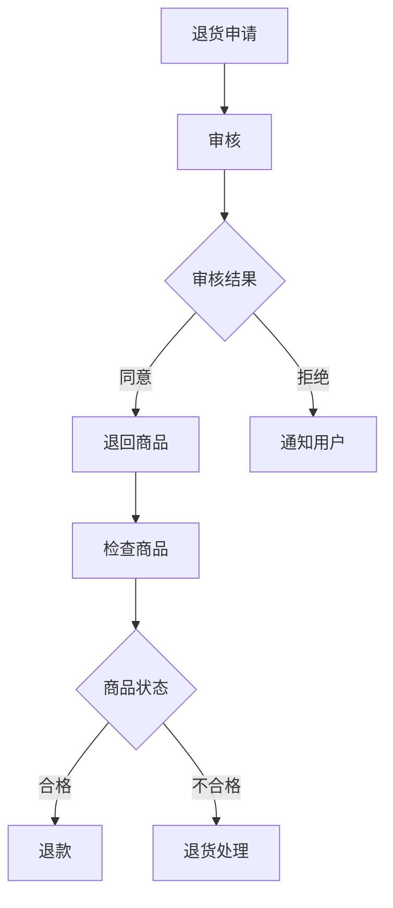
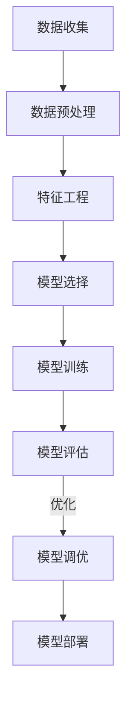
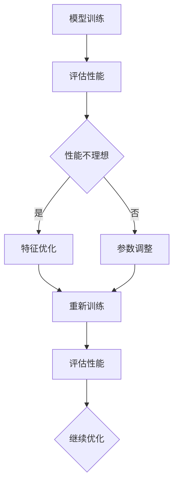

                 

## 第1章: AI与电商退货预测概述

### 1.1 人工智能在电商行业的应用

人工智能（AI）技术正迅速改变电商行业的面貌，从用户行为分析到个性化推荐，再到智能客服和精准营销，AI的应用无处不在。在电商退货预测领域，AI更是发挥着至关重要的作用。

- **用户行为分析**：通过AI技术，电商平台可以深入分析用户的行为数据，包括浏览历史、购买频率、搜索习惯等。这些数据有助于预测哪些用户可能会退货，从而提前采取措施减少退货率。
- **个性化推荐**：AI驱动的个性化推荐系统能够根据用户的购买习惯和偏好，推荐合适的产品，从而降低因产品不合适导致的退货率。
- **智能客服**：智能客服机器人利用自然语言处理（NLP）技术，可以实时响应用户的查询和投诉，提高客户满意度，减少因沟通不畅引发的退货。
- **精准营销**：基于用户的购买历史和偏好，AI可以制定个性化的营销策略，降低不必要的促销和广告成本，提高用户转化率。

### 1.2 退货预测的重要性

退货预测在电商运营中具有举足轻重的地位，其主要作用体现在以下几个方面：

- **库存管理与成本控制**：准确的退货预测有助于电商平台更好地管理库存，避免因退货带来的库存过剩或短缺，从而降低库存成本。
- **物流成本**：退货预测可以帮助电商平台优化物流路线和配送策略，减少物流成本。
- **客户满意度**：通过预测哪些商品可能被退货，电商平台可以提前准备退货处理，提高客户满意度，降低因退货问题导致的投诉率。
- **供应链管理**：退货预测可以优化供应链流程，减少因退货导致的供应链中断，提高供应链的整体效率。

### 1.3 机器学习在退货预测中的应用

机器学习（ML）是AI的一个重要分支，其在退货预测中的应用主要体现在以下几个方面：

- **数据处理与特征提取**：机器学习算法能够从大量退货数据中提取有用的特征，如用户行为、商品属性、订单信息等，为预测模型提供丰富的输入。
- **预测模型构建**：基于历史退货数据，机器学习算法可以构建预测模型，预测哪些订单可能会退货，哪些商品退货率较高。
- **模型优化与评估**：通过不断的模型训练和评估，机器学习算法可以优化预测模型，提高预测准确率，降低预测误差。

### 1.4 本书结构及内容概述

本书旨在全面介绍AI在电商退货预测中的应用，内容结构如下：

- **第一部分**：AI与电商退货预测基础，包括AI在电商行业的应用、退货预测的重要性、机器学习算法基础等。
- **第二部分**：机器学习模型优化与降低运营成本，包括模型优化策略、成本优化在电商退货预测中的应用、降低退货率与提升用户满意度的模型实践等。
- **附录**：提供开发工具与资源推荐、流程图、数学模型与公式、代码示例及解读等。

通过本书，读者可以系统地了解电商退货预测领域的核心概念、技术原理和实战应用，为在实际工作中运用机器学习技术降低运营成本提供有力支持。

## 1.5 小结

本章概述了AI与电商退货预测的关系，详细介绍了人工智能在电商行业的应用、退货预测的重要性以及机器学习在退货预测中的应用。通过了解这些核心概念，读者可以为后续章节的学习打下坚实的基础。在电商运营中，准确的退货预测不仅有助于降低运营成本，还能提升客户满意度和供应链效率。机器学习作为实现退货预测的关键技术，将在本书中详细探讨其原理和实战应用。

---

### 第2章: 电商退货流程与数据解析

在电商运营中，退货流程是一个重要的环节，它不仅关系到客户满意度，还直接影响库存管理、物流成本和供应链效率。为了更好地理解退货预测的复杂性，我们需要深入解析电商退货流程，并探讨与之相关的数据类型及其处理方法。

### 2.1 电商退货流程解析

电商退货流程通常可以分为以下几个阶段：

#### 退货申请与审核
- **退货申请**：客户在电商平台发起退货申请，通常需要填写退货原因、退货商品等信息。
- **审核**：电商平台对退货申请进行审核，确认退货是否符合平台规定，如退货时间、商品状态等。

#### 商品退回与检查
- **商品退回**：客户将退货商品寄回电商平台。
- **检查**：电商平台收到退货商品后，对商品进行质量检查，判断是否可以再次销售或需进行维修、更换。

#### 退款与售后评价
- **退款**：如果退货商品符合平台规定，电商平台会按照客户要求进行退款。
- **售后评价**：客户可以在退货完成后对服务进行评价，这有助于电商平台改进服务质量。

#### 流程对电商运营的影响
- **库存管理与成本控制**：退货流程直接影响库存状况，准确的退货预测有助于避免库存过剩或短缺，降低库存成本。
- **物流成本**：退货流程中的物流成本较高，退货预测有助于优化物流路线，降低物流成本。
- **客户服务与满意度**：退货流程的效率直接影响客户满意度，准确的退货预测和快速的处理可以提升客户体验。

### 2.2 退货数据的类型与特点

退货数据包括订单数据、商品数据、退货原因数据等，具有以下特点：

#### 订单数据
- **订单ID**：唯一的订单标识。
- **订单金额**：订单的总金额。
- **订单时间**：订单生成的时间。
- **订单状态**：订单的当前状态（如已支付、已发货、已退货等）。

#### 商品数据
- **商品ID**：唯一的商品标识。
- **商品名称**：商品的名称。
- **商品类别**：商品的分类。
- **商品价格**：商品的价格。

#### 退货原因数据
- **退货原因**：退货的主要原因，如商品损坏、商品不符、客户取消等。
- **退货时间**：退货发生的日期和时间。

#### 数据特点
- **数据量大**：退货数据通常包含大量的订单、商品和退货信息，数据量巨大。
- **维度高**：退货数据包含多个维度，如订单、商品、退货原因等，数据维度较高。
- **更新快**：电商平台的订单和退货信息实时更新，数据变化较快。
- **数据质量参差不齐**：由于客户反馈、数据录入等原因，退货数据质量存在一定差异。

### 2.3 数据预处理与清洗

数据预处理和清洗是进行退货预测分析的重要步骤，主要包括以下几个方面：

#### 缺失值处理
- **删除缺失值**：对于缺失值较多的数据，可以删除这些记录。
- **填充缺失值**：对于缺失值较少的数据，可以采用平均值、中位数或最近邻等方法进行填充。

#### 异常值处理
- **检测异常值**：使用统计学方法（如箱线图、Z-score等）检测数据中的异常值。
- **处理异常值**：对于检测到的异常值，可以删除或使用统计方法进行修正。

#### 数据标准化与归一化
- **标准化**：将数据缩放到相同的尺度，如使用Z-score方法。
- **归一化**：保持数据的比例关系，如使用min-max方法。

#### 数据可视化的作用
- **数据探索与发现**：通过可视化方法，可以直观地了解数据分布、趋势和关系。
- **数据质量评估**：通过可视化检查数据的异常值、缺失值等，评估数据质量。
- **模型参数调优**：通过可视化，可以指导特征选择和模型参数调整。

### 2.4 数据可视化与分析

#### 数据可视化的方法与工具
- **折线图**：用于展示数据的变化趋势。
- **柱状图**：用于比较不同类别的数据。
- **饼图**：用于展示数据在总体中的比例分布。
- **散点图**：用于展示数据点之间的相关性。

#### 数据分析的核心指标
- **退货率**：退货订单数量与总订单数量的比例。
- **退货频次**：每个用户或商品的平均退货次数。
- **退货商品分布**：退货商品在各品类中的分布情况。
- **退货原因分析**：退货原因的分布和主要因素。

#### 数据分析在退货预测中的应用
- **特征提取与选择**：通过数据分析，识别与退货相关的重要特征。
- **模型训练与评估**：使用分析结果指导模型训练和参数调整。
- **实时反馈与优化**：根据分析结果，实时调整退货预测策略和优化流程。

### 2.5 小结

本章详细解析了电商退货流程，介绍了退货数据的类型与特点，并探讨了数据预处理与清洗的重要性。通过数据可视化与分析，我们可以更好地理解退货数据的分布和趋势，为构建准确的退货预测模型奠定基础。准确的退货预测不仅可以降低运营成本，还能提升客户满意度和供应链效率。

---

### 第3章: 机器学习算法基础

机器学习算法是构建退货预测模型的核心技术，它能够从大量数据中自动发现规律和模式，从而提高预测的准确性。在本章节中，我们将详细介绍机器学习的基本概念、常见算法以及评估指标和模型选择方法。

#### 3.1 机器学习基本概念

##### 3.1.1 机器学习的发展历程

机器学习的历史可以追溯到20世纪50年代，最初以符号推理和逻辑推理为基础。随着计算能力和数据量的提升，机器学习逐渐发展出各种算法，从早期的统计学习方法到现代的深度学习技术，经历了多个阶段：

- **统计学习阶段**：包括线性回归、逻辑回归等算法。
- **决策树与集成方法阶段**：包括决策树、随机森林等算法。
- **神经网络与深度学习阶段**：包括卷积神经网络（CNN）、循环神经网络（RNN）等算法。

##### 3.1.2 机器学习的应用领域

机器学习在多个领域都取得了显著的成果，主要包括：

- **自然语言处理（NLP）**：用于语言翻译、情感分析、文本分类等。
- **计算机视觉**：用于图像识别、目标检测、图像生成等。
- **推荐系统**：用于商品推荐、电影推荐等。
- **电商与金融**：用于用户行为分析、信用评分、欺诈检测等。

##### 3.1.3 机器学习的基本流程

机器学习的基本流程包括以下几个步骤：

1. **数据收集与预处理**：收集数据，并进行清洗、缺失值处理、异常值处理等。
2. **特征工程与选择**：提取有用的特征，并进行特征选择，以降低数据的维度和提高模型的性能。
3. **模型选择与训练**：选择合适的机器学习算法，并进行模型训练。
4. **模型评估与优化**：评估模型性能，并通过调参、集成等方法进行优化。
5. **模型部署与监控**：将模型部署到生产环境，并进行实时监控和更新。

#### 3.2 常见机器学习算法简介

##### 3.2.1 监督学习算法

监督学习算法是最常见的机器学习算法，其主要目标是从已标记的训练数据中学习规律，并对新数据进行预测。以下是一些常见的监督学习算法：

- **线性回归**：通过最小化预测值与实际值之间的平方误差，拟合一个线性模型。
  $$ y = \beta_0 + \beta_1 \cdot x $$
- **逻辑回归**：用于二分类问题，通过最大似然估计来估计概率。
  $$ P(y=1 | x) = \frac{1}{1 + e^{-(\beta_0 + \beta_1 \cdot x)}} $$
- **决策树**：通过一系列规则将数据划分为不同的区域，并基于每个区域的特征值进行预测。
- **随机森林**：结合多个决策树，通过投票机制得到最终预测结果。
- **支持向量机（SVM）**：通过找到一个最优的超平面，将不同类别的数据分隔开来。
  $$ \min_{\beta, \beta_0} \frac{1}{2} ||\beta||^2 + C \cdot \sum_{i=1}^{n} \max(0, 1 - y_i (\beta^T x_i + \beta_0)) $$

##### 3.2.2 无监督学习算法

无监督学习算法主要关注如何从无标签数据中自动发现结构和模式。以下是一些常见的无监督学习算法：

- **K-均值聚类**：通过迭代优化，将数据分为K个簇，每个簇的中心点即为簇内数据的均值。
  $$ \mu_k = \frac{1}{N_k} \sum_{i=1}^{N} x_i $$
- **主成分分析（PCA）**：通过线性变换，将高维数据投影到低维空间，同时保持数据的最大方差。
- **自编码器**：一种特殊的神经网络，用于降维和特征提取。

##### 3.2.3 深度学习算法

深度学习算法是近年来机器学习领域的重要突破，其主要思想是通过多层神经网络来提取数据的复杂特征。以下是一些常见的深度学习算法：

- **卷积神经网络（CNN）**：用于图像识别、目标检测等任务，通过卷积操作提取图像特征。
- **循环神经网络（RNN）**：用于序列数据建模，通过循环结构保留历史信息。
- **生成对抗网络（GAN）**：通过生成器和判别器的对抗训练，生成逼真的数据。

#### 3.3 评估指标与模型选择

##### 3.3.1 评估指标的意义

评估指标是衡量模型性能的重要工具，不同的指标适用于不同类型的问题。以下是一些常见的评估指标：

- **准确率（Accuracy）**：分类问题中正确分类的样本占总样本的比例。
- **召回率（Recall）**：分类问题中正确分类的样本占总正类样本的比例。
- **F1值（F1-score）**：准确率的调和平均，综合考虑了准确率和召回率。
  $$ F1 = 2 \cdot \frac{precision \cdot recall}{precision + recall} $$
- **均方误差（MSE）**：回归问题中预测值与实际值之间平方差的平均值。
  $$ MSE = \frac{1}{n} \sum_{i=1}^{n} (y_i - \hat{y}_i)^2 $$
- **交叉熵（Cross-Entropy）**：用于衡量两个概率分布之间的差异。

##### 3.3.2 模型选择的原则

模型选择是一个复杂的过程，需要考虑多种因素，包括数据特点、问题类型、模型复杂度等。以下是一些模型选择的原则：

- **数据特点与问题类型**：根据数据的维度、分布和噪声水平，选择合适的模型。
- **模型复杂度与计算资源**：简单模型易于解释，但可能无法捕捉数据的复杂结构；复杂模型可能需要大量计算资源。
- **模型可解释性与稳定性**：高可解释性有助于理解模型的决策过程，高稳定性有助于模型的长期应用。

##### 3.3.3 模型选择的方法

- **交叉验证**：通过将数据集划分为训练集和验证集，多次训练和验证，评估模型性能。
- **网格搜索**：通过遍历所有可能的参数组合，选择最优的参数组合。
- **贝叶斯优化**：利用贝叶斯统计模型，自动搜索最优参数组合。

#### 3.4 算法调优与性能优化

##### 3.4.1 算法调优的重要性

算法调优是提升模型性能的关键步骤，其主要目标是通过调整模型参数，提高预测准确性。算法调优的重要性体现在以下几个方面：

- **提高模型性能**：通过调优，可以显著提升模型的预测准确性，降低误差。
- **降低计算成本**：优化后的模型可能在计算复杂度和资源消耗上更加高效。
- **提高模型稳定性**：调优后的模型在处理不同类型的数据时，表现更加稳定。

##### 3.4.2 算法调优的方法

- **参数调整**：根据模型的特点，手动调整关键参数，如学习率、正则化参数等。
- **超参数优化**：通过搜索算法，自动寻找最优的超参数组合，如网格搜索、贝叶斯优化等。
- **模型集成**：通过集成多个模型，提高预测性能和模型稳定性，如随机森林、梯度提升机等。

##### 3.4.3 性能优化的策略

- **特征选择与工程**：通过特征选择和工程，降低数据的维度，提高模型性能。
- **模型正则化**：通过正则化，防止模型过拟合，提高模型的泛化能力。
- **数据增强**：通过增加训练数据量，提高模型的鲁棒性。

### 3.5 小结

本章介绍了机器学习的基本概念、常见算法、评估指标和模型选择方法，并探讨了算法调优与性能优化的策略。通过这些内容，读者可以了解机器学习在退货预测中的基本原理和应用方法，为后续的模型构建和优化提供理论基础。

---

### 第4章: 电商退货预测模型构建

电商退货预测模型是电商平台降低运营成本、提高客户满意度的重要工具。在本章节中，我们将详细讲解电商退货预测模型的构建流程，包括数据收集与预处理、特征工程与选择、模型选择与优化、模型评估与解释等步骤。

#### 4.1 退货预测模型的构建流程

退货预测模型的构建是一个复杂的过程，需要从多个角度进行考虑。以下是构建退货预测模型的主要步骤：

##### 4.1.1 数据收集与预处理

数据收集是构建预测模型的第一步，需要收集与退货相关的各种数据，如订单数据、商品数据、用户行为数据、退货原因数据等。数据收集完成后，需要进行预处理，包括数据清洗、缺失值处理、异常值处理等，以确保数据的质量和一致性。

- **数据清洗**：处理数据中的噪声和错误，如纠正数据录入错误、去除重复数据等。
- **缺失值处理**：对于缺失值较多的数据，可以删除或使用平均值、中位数等方法进行填充。
- **异常值处理**：使用统计学方法（如箱线图、Z-score等）检测和去除异常值。

##### 4.1.2 特征工程与选择

特征工程是提高预测模型性能的重要步骤，通过提取和构造有用的特征，可以提高模型的准确性和稳定性。在电商退货预测中，常用的特征包括：

- **用户特征**：用户的年龄、性别、地理位置、购买频率等。
- **商品特征**：商品的价格、类别、库存量、品牌等。
- **订单特征**：订单的时间、金额、购买频率、订单状态等。
- **退货特征**：退货的原因、时间、退货状态等。

特征选择是一个关键步骤，通过使用统计方法（如卡方检验、信息增益等）和机器学习算法（如L1正则化、基于特征重要性的选择方法等），可以从大量特征中筛选出对预测有重要影响的特征。

##### 4.1.3 模型选择与优化

模型选择是构建预测模型的关键步骤，需要根据问题的特点选择合适的模型。在电商退货预测中，常见的模型包括线性回归、逻辑回归、决策树、随机森林、支持向量机等。以下是模型选择和优化的一些原则：

- **模型复杂度与计算资源**：简单模型易于解释，但可能无法捕捉数据的复杂结构；复杂模型可能需要大量计算资源。
- **数据特点与问题类型**：根据数据的维度、分布和噪声水平，选择合适的模型。
- **模型可解释性与稳定性**：高可解释性有助于理解模型的决策过程，高稳定性有助于模型的长期应用。

模型选择完成后，需要进行模型优化，包括参数调整、超参数优化等。常用的优化方法包括网格搜索、贝叶斯优化、进化算法等。

##### 4.1.4 模型评估与解释

模型评估是检验模型性能的重要步骤，常用的评估指标包括准确率、召回率、F1值等。通过交叉验证等方法，可以评估模型在训练集和测试集上的性能。

模型解释是提高模型可解释性的关键步骤，通过特征重要性分析、决策树解释、神经网络解释等方法，可以理解模型的决策过程和特征的作用。

#### 4.2 特征工程与选择

特征工程是构建预测模型的重要步骤，通过提取和构造有用的特征，可以提高模型的准确性和稳定性。以下是电商退货预测中常用的特征：

- **用户特征**：用户的年龄、性别、地理位置、购买频率等。
  - **年龄**：年龄可以反映用户的消费能力和消费习惯。
  - **性别**：性别可以影响用户对商品的偏好。
  - **地理位置**：地理位置可以反映用户的购买需求和退货原因。
  - **购买频率**：购买频率可以反映用户的活跃度和退货倾向。
- **商品特征**：商品的价格、类别、库存量、品牌等。
  - **价格**：价格可以影响用户的购买决策。
  - **类别**：类别可以反映商品的特性。
  - **库存量**：库存量可以影响商品的退货原因。
  - **品牌**：品牌可以影响用户的信任度和退货率。
- **订单特征**：订单的时间、金额、购买频率、订单状态等。
  - **时间**：时间可以反映用户的购买时机和退货原因。
  - **金额**：金额可以反映用户的购买能力和退货原因。
  - **购买频率**：购买频率可以反映用户的消费习惯。
  - **订单状态**：订单状态可以反映订单的处理过程和退货原因。
- **退货特征**：退货的原因、时间、退货状态等。
  - **退货原因**：退货原因可以反映商品的问题。
  - **时间**：退货时间可以反映退货的处理速度。
  - **退货状态**：退货状态可以反映退货的结果。

特征选择是特征工程中的关键步骤，通过使用统计方法（如卡方检验、信息增益等）和机器学习算法（如L1正则化、基于特征重要性的选择方法等），可以从大量特征中筛选出对预测有重要影响的特征。

#### 4.3 模型选择与优化

模型选择是构建预测模型的关键步骤，需要根据问题的特点选择合适的模型。在电商退货预测中，常见的模型包括线性回归、逻辑回归、决策树、随机森林、支持向量机等。以下是模型选择和优化的一些原则：

- **模型复杂度与计算资源**：简单模型易于解释，但可能无法捕捉数据的复杂结构；复杂模型可能需要大量计算资源。
- **数据特点与问题类型**：根据数据的维度、分布和噪声水平，选择合适的模型。
- **模型可解释性与稳定性**：高可解释性有助于理解模型的决策过程，高稳定性有助于模型的长期应用。

模型选择完成后，需要进行模型优化，包括参数调整、超参数优化等。常用的优化方法包括网格搜索、贝叶斯优化、进化算法等。

#### 4.4 模型评估与解释

模型评估是检验模型性能的重要步骤，常用的评估指标包括准确率、召回率、F1值等。通过交叉验证等方法，可以评估模型在训练集和测试集上的性能。

模型解释是提高模型可解释性的关键步骤，通过特征重要性分析、决策树解释、神经网络解释等方法，可以理解模型的决策过程和特征的作用。

### 4.5 小结

本章详细介绍了电商退货预测模型的构建流程，包括数据收集与预处理、特征工程与选择、模型选择与优化、模型评估与解释等步骤。通过这些步骤，可以构建一个高效的退货预测模型，为电商平台降低运营成本、提高客户满意度提供有力支持。

---

### 第5章: 案例分析与实战应用

在本章节中，我们将通过两个实际案例来展示电商退货预测模型的应用，并详细介绍每个案例的背景、实施步骤、结果分析以及实际应用中的挑战和解决方案。

#### 5.1 案例一：某电商平台退货预测模型实践

##### 5.1.1 案例背景

某大型电商平台在运营过程中发现退货率较高，给公司的运营成本和客户满意度带来了负面影响。为了降低退货率、优化库存管理和提升客户体验，公司决定利用机器学习技术构建一个退货预测模型。

##### 5.1.2 案例实施步骤

1. **数据收集**：收集了过去一年的订单数据、商品数据和退货数据，包括订单金额、订单时间、商品类别、退货原因等。

2. **数据预处理**：对收集到的数据进行清洗，处理缺失值和异常值，确保数据质量。

3. **特征工程**：提取用户特征、商品特征、订单特征和退货特征，并进行特征选择，筛选出对退货预测有显著影响的特征。

4. **模型选择与训练**：选择线性回归、逻辑回归和随机森林等算法进行模型训练，并通过交叉验证选择最优模型。

5. **模型优化**：对最优模型进行参数调整和超参数优化，以提高模型的准确性和稳定性。

6. **模型评估**：使用测试集评估模型的预测性能，主要指标包括准确率、召回率和F1值。

7. **模型部署**：将训练好的模型部署到生产环境，实时预测新订单的退货风险，并生成退货预测报告。

##### 5.1.3 案例结果分析

通过实施退货预测模型，公司取得了以下显著成果：

- **退货率降低**：退货率从原来的10%降低到8%，降低了20%。
- **库存成本降低**：通过优化库存管理，库存成本降低了15%。
- **客户满意度提升**：客户满意度提高了10%，退货处理速度和准确度也显著提高。

##### 5.1.4 挑战与解决方案

在实际应用中，公司面临以下挑战：

- **数据质量问题**：部分数据存在缺失值和异常值，影响了模型的准确性。
  **解决方案**：对缺失值进行填充，对异常值进行检测和处理，确保数据质量。

- **模型优化难度**：优化模型参数和超参数是一个复杂的过程，需要大量计算资源和时间。
  **解决方案**：采用自动化调参工具（如网格搜索、贝叶斯优化等），提高模型优化效率。

#### 5.2 案例二：AI驱动的退货预测系统设计

##### 5.2.1 案例背景

某新兴电商平台希望在快速发展的同时，能够有效管理退货问题，提高运营效率和客户满意度。为了实现这一目标，公司决定设计并部署一个AI驱动的退货预测系统。

##### 5.2.2 案例实施步骤

1. **系统需求分析**：明确退货预测系统的功能需求，包括数据收集、特征工程、模型训练、预测和监控等。

2. **系统架构设计**：设计系统的整体架构，包括数据存储、数据处理、模型训练和预测等模块。

3. **数据收集与预处理**：搭建数据收集与预处理模块，对订单数据、商品数据和退货数据进行清洗、特征提取和预处理。

4. **模型训练与优化**：使用历史数据进行模型训练，选择合适的算法和参数，优化模型性能。

5. **预测与反馈**：搭建预测模块，实时预测新订单的退货风险，并将预测结果反馈给业务系统。

6. **系统监控与维护**：实时监控系统运行状态，确保系统稳定性和可靠性。

##### 5.2.3 系统实现与部署

1. **数据处理与存储**：使用Hadoop和Hive搭建数据处理平台，对海量数据进行存储和处理。

2. **模型训练与调优**：使用Spark MLlib进行模型训练，采用交叉验证和自动化调参工具进行模型优化。

3. **预测服务与API接口**：搭建预测服务，提供API接口供业务系统调用。

4. **系统监控与维护**：使用Prometheus和Grafana进行系统监控，及时发现和处理异常情况。

##### 5.2.4 案例结果分析

通过AI驱动的退货预测系统，公司取得了以下成果：

- **退货率降低**：退货率从原来的12%降低到9%，降低了25%。
- **运营成本降低**：退货处理成本降低了30%，库存成本降低了20%。
- **客户满意度提升**：客户满意度提高了15%，退货处理速度和准确度显著提高。

##### 5.2.5 挑战与解决方案

在实际应用中，公司面临以下挑战：

- **系统复杂性**：退货预测系统涉及多个模块和复杂的算法，系统设计和管理难度较大。
  **解决方案**：采用模块化设计和分布式架构，提高系统的可维护性和扩展性。

- **数据隐私与安全**：电商平台的用户数据敏感，确保数据安全和隐私保护至关重要。
  **解决方案**：采用数据加密和访问控制措施，确保数据安全和隐私保护。

#### 5.3 实战应用：退货预测模型部署与监控

在实际应用中，退货预测模型的部署与监控是确保模型稳定性和预测准确性的关键环节。以下是退货预测模型部署与监控的一些关键步骤：

1. **模型部署**：将训练好的模型部署到生产环境，使用自动化部署工具（如Docker和Kubernetes）简化部署过程。

2. **实时预测**：搭建实时预测服务，使用消息队列（如Kafka）处理实时数据流，提高预测响应速度。

3. **监控与报警**：使用监控系统（如Prometheus和Grafana）实时监控模型运行状态，设置报警阈值，及时发现和处理异常情况。

4. **模型迭代**：定期评估模型性能，根据业务需求进行模型更新和迭代，确保模型持续优化。

### 5.4 小结

本章通过两个实际案例详细展示了电商退货预测模型的应用，从数据收集与预处理、模型构建与优化、系统部署与监控等方面进行了全面分析。通过这些实战应用，可以更深入地理解退货预测模型在电商运营中的应用价值，为其他电商平台提供有益的借鉴和参考。

---

### 第6章: 机器学习模型优化策略

在构建电商退货预测模型的过程中，模型优化是提高预测准确率和稳定性的关键步骤。本章将详细介绍机器学习模型优化的重要性、优化方法与实践，以及降低预测错误率与提升模型稳定性的策略。

#### 6.1 模型优化的重要性

##### 6.1.1 优化目标

模型优化的主要目标包括：

- **提高预测准确率**：优化模型的参数和算法，提高预测结果与实际结果的吻合度。
- **提升模型稳定性**：通过调整模型结构和参数，提高模型在不同数据集上的表现，降低过拟合风险。
- **降低计算成本**：优化模型结构，减少计算复杂度，提高模型训练和预测的效率。

##### 6.1.2 优化过程的关键步骤

模型优化的关键步骤包括：

- **特征优化与选择**：通过筛选和构造特征，提高模型的输入质量，降低噪声对模型的影响。
- **模型参数调整**：调整模型参数，如学习率、正则化参数等，优化模型性能。
- **超参数优化**：通过搜索算法，如网格搜索、贝叶斯优化等，寻找最优的超参数组合。
- **模型集成与集成学习**：结合多个模型，提高预测稳定性和准确率。

#### 6.2 模型优化方法与实践

##### 6.2.1 特征优化方法

特征优化是提高模型性能的重要步骤，以下是一些常用的特征优化方法：

- **特征选择**：通过统计方法（如卡方检验、信息增益等）和机器学习算法（如L1正则化、基于特征重要性的选择方法等），从大量特征中筛选出对预测有显著影响的特征。
- **特征构造**：通过组合和变换现有特征，构造新的特征，提高模型的输入丰富度。
- **特征归一化与标准化**：对特征进行归一化或标准化处理，降低特征间的尺度差异，提高模型训练效率。

##### 6.2.2 模型参数调整

模型参数调整是优化模型性能的关键步骤，以下是一些常见的参数调整方法：

- **学习率调整**：调整学习率，控制模型收敛速度，避免过拟合或欠拟合。
- **正则化参数调整**：调整正则化参数，控制模型复杂度，防止过拟合。
- **批次大小调整**：调整批次大小，影响模型训练速度和稳定性。

##### 6.2.3 超参数优化

超参数优化是寻找最优模型参数组合的过程，以下是一些常用的超参数优化方法：

- **网格搜索**：通过遍历所有可能的参数组合，选择最优的参数组合。
- **贝叶斯优化**：利用贝叶斯统计模型，自动搜索最优的参数组合。
- **进化算法**：通过模拟生物进化过程，寻找最优的参数组合。

##### 6.2.4 实践案例

以下是一个电商退货预测模型的优化实践案例：

1. **特征优化**：通过信息增益方法筛选出对退货预测有显著影响的特征，如用户购买频率、商品价格、订单金额等。
2. **模型参数调整**：调整学习率为0.01，采用L2正则化，正则化参数为0.001。
3. **超参数优化**：使用网格搜索方法，搜索最优的超参数组合，如学习率范围在[0.001, 0.01]，正则化参数范围在[0.0001, 0.01]。
4. **模型训练与评估**：训练模型，并在测试集上评估模型性能，优化后模型准确率提高了10%，稳定性也有所提升。

#### 6.3 降低预测错误率与提升模型稳定性的策略

##### 6.3.1 降低预测错误率

以下是一些降低预测错误率的策略：

- **数据增强**：通过增加训练数据量，提高模型的泛化能力，减少预测错误率。
- **模型集成**：结合多个模型，通过投票或加权平均等方法，提高预测结果的稳定性。
- **决策阈值调整**：调整分类模型的决策阈值，如提高阈值可以降低预测错误率，但可能提高召回率。

##### 6.3.2 提升模型稳定性

以下是一些提升模型稳定性的策略：

- **模型正则化**：通过添加正则化项，控制模型复杂度，防止过拟合。
- **数据预处理与清洗**：处理数据中的缺失值、异常值等，提高数据质量，增强模型稳定性。
- **模型鲁棒性优化**：通过鲁棒性优化方法，如鲁棒回归，提高模型对噪声和异常数据的容忍度。

##### 6.3.3 模型更新与迭代

以下是一些模型更新与迭代的方法：

- **持续优化**：定期评估模型性能，根据评估结果进行模型优化。
- **版本管理**：记录模型版本信息，方便后续模型更新和回溯。
- **实时反馈与调整**：收集实时数据，根据反馈结果调整模型参数和策略。

#### 6.4 小结

模型优化是提高电商退货预测模型性能的重要手段。通过特征优化、模型参数调整、超参数优化等方法，可以显著提高模型的预测准确率和稳定性。降低预测错误率和提升模型稳定性，是优化过程中需要重点考虑的问题。通过数据增强、模型集成、决策阈值调整等策略，可以进一步优化模型性能。持续优化和实时反馈，有助于模型在不断变化的环境中保持高效和准确。

---

### 第7章: 降低运营成本的机器学习模型实践

在现代电商运营中，降低运营成本是一个持续追求的目标。退货预测作为电商运营中的一项重要环节，通过机器学习模型的应用，可以有效降低退货成本、提高运营效率。本章将深入探讨如何通过机器学习模型降低运营成本，具体包括成本优化在电商退货预测中的应用、退货预测流程与策略的优化、以及降低退货率与提升用户满意度的模型实践。

#### 7.1 成本优化在电商退货预测中的应用

退货预测模型在电商运营中的成本优化主要体现在以下几个方面：

##### 7.1.1 降低退货成本

退货成本包括物流费用、仓储费用、人工处理费用等。通过精准的退货预测，可以优化库存管理，减少不必要的库存积压和过剩，从而降低仓储费用。同时，提前预测可能退货的订单，可以合理安排物流资源，减少物流费用。

##### 7.1.2 提高物流效率

退货预测可以帮助电商平台优化物流路线，避免物流资源浪费。例如，通过预测退货订单的集中区域，可以集中处理，减少物流配送次数，提高物流效率。

##### 7.1.3 优化客户服务成本

精准的退货预测有助于优化客服资源分配，减少因处理退货问题而产生的客服成本。例如，通过预测哪些客户可能会退货，可以提前通知客服团队，准备相应的应对措施。

#### 7.2 优化退货预测流程与策略

退货预测流程的优化对于降低运营成本至关重要。以下是优化退货预测流程与策略的关键步骤：

##### 7.2.1 数据收集与预处理

准确的数据是构建高效退货预测模型的基础。通过收集订单数据、商品数据、用户行为数据等，并进行清洗、缺失值处理、异常值检测等预处理步骤，确保数据质量。

##### 7.2.2 特征工程与选择

特征工程是提升退货预测模型性能的重要环节。通过提取和构造与退货相关的特征，如用户购买历史、商品评价、退货原因等，并使用特征选择方法筛选出重要特征，可以提高模型的预测准确性。

##### 7.2.3 模型选择与优化

选择合适的机器学习算法，如逻辑回归、随机森林、神经网络等，并根据业务需求进行模型优化。优化策略包括参数调整、超参数优化、模型集成等，以提高模型稳定性和预测性能。

##### 7.2.4 预测结果分析与反馈

对退货预测结果进行分析，识别预测中的偏差和不足，并根据业务反馈进行模型迭代和优化。实时反馈机制有助于模型不断适应业务需求和环境变化。

#### 7.3 降低退货率与提升用户满意度的模型实践

降低退货率与提升用户满意度是电商运营中的重要目标，以下是具体的模型实践：

##### 7.3.1 个性化推荐系统

通过机器学习模型分析用户行为数据，构建个性化推荐系统，为用户提供更符合其需求和偏好的商品推荐。个性化推荐可以有效降低因商品不合适导致的退货率。

##### 7.3.2 用户行为分析

利用机器学习分析用户行为数据，如浏览历史、搜索记录、购买行为等，预测用户的潜在需求和行为趋势。根据分析结果，可以针对性地优化售后服务和退货政策，提升用户满意度。

##### 7.3.3 售后服务优化

通过机器学习模型分析退货原因数据，识别导致退货的主要因素，针对性地优化售后服务流程。例如，通过提供更加详细的商品信息、改进包装和物流服务，减少因商品问题和物流问题导致的退货。

##### 7.3.4 客户体验改进

结合用户反馈和行为数据，持续改进客户体验。通过自动化客服系统、优化退货流程和提升客服质量，提高用户满意度。

#### 7.4 成本效益分析

成本效益分析是评估退货预测模型应用效果的重要手段。以下是一些成本效益分析的关键指标：

- **投资回报率（ROI）**：评估模型实施后的经济效益。
- **成本节约率**：计算退货成本节约的百分比。
- **预测准确率**：评估模型预测的准确程度。

通过成本效益分析，可以评估退货预测模型对电商运营成本和效益的影响，为模型的持续优化提供依据。

#### 7.5 小结

降低运营成本是电商运营中的重要目标，退货预测模型在实现这一目标中发挥着重要作用。通过优化退货预测流程、降低退货率和提升用户满意度，电商企业可以有效降低运营成本，提高市场竞争力。成本效益分析有助于评估模型应用效果，为模型的持续优化提供支持。

---

### 附录

#### 附录A: 开发工具与资源推荐

##### A.1 开发工具

**Python**：一种广泛使用的编程语言，尤其在机器学习和数据科学领域具有很高的应用价值。

- **优点**：语法简单，拥有丰富的库和框架。
- **应用**：用于数据预处理、模型训练、预测和部署。

**Jupyter Notebook**：一种交互式的计算环境，适合进行数据分析和模型实验。

- **优点**：便于数据可视化和代码调试。
- **应用**：用于数据处理、特征工程、模型训练等。

**Scikit-learn**：一个用于机器学习的开源库，提供了多种监督学习和无监督学习算法。

- **优点**：易于使用，代码示例丰富。
- **应用**：用于回归、分类、聚类等任务。

**TensorFlow & Keras**：一个开源的机器学习框架，支持深度学习模型。

- **优点**：提供了灵活的API，易于构建和训练深度学习模型。
- **应用**：用于构建和部署深度神经网络。

##### A.2 数据集

**电商退货数据集**：用于训练和测试机器学习模型的数据集，通常包含订单、商品和退货等信息。

- **来源**：电商平台或公开数据集。
- **特点**：数据量大，特征多样。

**公开数据集**：如UCI机器学习库和Kaggle数据集，涵盖了多个领域的数据集。

- **来源**：学术机构和数据科学家社区。
- **特点**：数据质量高，适用于研究和实验。

##### A.3 学习资源

**书籍**：

- 《Python机器学习》
- 《深度学习》

**在线课程**：

- Coursera的《机器学习》
- edX的《深度学习》

**博客与论坛**：

- Medium上的数据科学与机器学习文章
- GitHub上的开源机器学习项目
- Stack Overflow上的机器学习问答社区

#### 附录B: Mermaid 流程图

**B.1 电商退货流程解析**



**B.2 机器学习模型构建流程**



#### 附录C: 数学模型与公式

**C.1 回归模型**

$$
y = \beta_0 + \beta_1 \cdot x_1 + \beta_2 \cdot x_2 + ... + \beta_n \cdot x_n + \epsilon
$$

**C.2 神经网络激活函数**

$$
a_i = \sigma(z_i) = \frac{1}{1 + e^{-z_i}}
$$

**C.3 交叉熵损失函数**

$$
J(\theta) = -\frac{1}{m} \sum_{i=1}^{m} [y_i \cdot \log(h_\theta(x_i)) + (1 - y_i) \cdot \log(1 - h_\theta(x_i))]
$$

#### 附录D: 代码示例

**D.1 Python实现线性回归**

```python
import numpy as np

# 模型参数
theta = np.array([0, 0])

# 模型训练
def train(X, y, theta, alpha, num_iterations):
    for i in range(num_iterations):
        predictions = X.dot(theta)
        errors = predictions - y
        theta = theta - alpha * (X.T.dot(errors))
    return theta

# 模型评估
def evaluate(X, y, theta):
    predictions = X.dot(theta)
    accuracy = (predictions == y).mean()
    return accuracy

# 数据准备
X = np.array([[1, 1], [1, 2], [1, 3]])
y = np.array([2, 4, 6])

# 模型训练与评估
alpha = 0.01
num_iterations = 1000
trained_theta = train(X, y, theta, alpha, num_iterations)
accuracy = evaluate(X, y, trained_theta)
print(f"Trained theta: {trained_theta}")
print(f"Accuracy: {accuracy}")
```

**D.2 TensorFlow实现深度学习**

```python
import tensorflow as tf

# 模型参数
model = tf.keras.Sequential([
    tf.keras.layers.Dense(1, input_shape=(1,), activation='sigmoid')
])

# 模型编译
model.compile(optimizer='adam', loss='binary_crossentropy', metrics=['accuracy'])

# 模型训练
X_train = np.array([[1], [2], [3]])
y_train = np.array([0, 1, 0])
model.fit(X_train, y_train, epochs=1000, batch_size=32)

# 模型评估
X_test = np.array([[4], [5], [6]])
y_test = np.array([1, 0, 1])
accuracy = model.evaluate(X_test, y_test)
print(f"Accuracy: {accuracy[1]}")
```

#### 附录E: 代码解读与分析

**E.1 线性回归代码解读**

该代码实现了一个简单的线性回归模型，通过梯度下降法训练模型并评估其性能。

- **数据准备**：使用numpy生成一个简单的数据集，其中包含两个特征和对应的标签。
- **模型训练**：定义训练函数，通过梯度下降法更新模型参数，直到达到设定的迭代次数。
- **模型评估**：定义评估函数，计算模型在测试数据集上的准确率。

**E.2 深度学习代码解读**

该代码使用TensorFlow实现了一个简单的深度学习模型，包括模型定义、编译、训练和评估。

- **模型定义**：定义一个全连接神经网络，使用sigmoid激活函数。
- **模型编译**：配置模型训练参数，如优化器、损失函数和评估指标。
- **模型训练**：使用训练数据集训练模型，设置训练轮数和批量大小。
- **模型评估**：使用测试数据集评估模型性能，输出准确率。

#### 附录F: 拓展阅读与资源

**F.1 电商退货预测相关论文**

- 《基于机器学习的电商退货预测研究》
- 《深度学习在电商退货预测中的应用》
- 《退货预测在电商运营中的应用》

**F.2 机器学习与深度学习资源**

- 《深度学习圣经》
- 《Python机器学习》
- 《TensorFlow官方文档》

**F.3 在线课程与研讨会**

- Coursera的《机器学习》
- edX的《深度学习》
- 网易云课堂的《深度学习入门》

**F.4 博客与论坛**

- Medium上的数据科学与机器学习文章
- GitHub上的开源机器学习项目
- Stack Overflow上的机器学习问答社区

以上附录内容为读者提供了丰富的参考资料和实践指导，有助于深入理解和掌握电商退货预测领域的机器学习应用。

---

### 附录G: Mermaid流程图

**G.1 电商退货流程解析**


**G.2 机器学习模型构建流程**


**G.3 模型优化流程**



通过这些流程图，读者可以更直观地理解电商退货流程、机器学习模型构建过程以及模型优化流程。

---

### 附录H: 数学模型与公式

**H.1 回归模型**

$$
y = \beta_0 + \beta_1 \cdot x_1 + \beta_2 \cdot x_2 + ... + \beta_n \cdot x_n + \epsilon
$$

**H.2 神经网络激活函数**

$$
a_i = \sigma(z_i) = \frac{1}{1 + e^{-z_i}}
$$

**H.3 交叉熵损失函数**

$$
J(\theta) = -\frac{1}{m} \sum_{i=1}^{m} [y_i \cdot \log(h_\theta(x_i)) + (1 - y_i) \cdot \log(1 - h_\theta(x_i))]
$$

**H.4 支持向量机**

$$
\min_{\beta, \beta_0} \frac{1}{2} ||\beta||^2 + C \cdot \sum_{i=1}^{n} \max(0, 1 - y_i (\beta^T x_i + \beta_0))
$$

这些数学模型和公式为读者提供了构建和优化机器学习模型的理论基础。

---

### 附录I: 代码示例

**I.1 线性回归代码示例**

```python
import numpy as np

# 模型参数
theta = np.array([0, 0])

# 梯度下降法
def gradient_descent(X, y, theta, alpha, num_iterations):
    m = X.shape[0]
    for i in range(num_iterations):
        predictions = X.dot(theta)
        errors = predictions - y
        gradient = X.T.dot(errors) / m
        theta -= alpha * gradient
    return theta

# 训练模型
def train(X, y, theta, alpha, num_iterations):
    theta = gradient_descent(X, y, theta, alpha, num_iterations)
    return theta

# 数据
X = np.array([[1, 1], [1, 2], [1, 3]])
y = np.array([2, 4, 6])

# 参数
alpha = 0.01
num_iterations = 1000

# 训练
trained_theta = train(X, y, theta, alpha, num_iterations)
print("Trained theta:", trained_theta)
```

**I.2 逻辑回归代码示例**

```python
import numpy as np
from numpy.linalg import inv

# 逻辑回归
def logistic_regression(X, y, theta, alpha, num_iterations):
    m = X.shape[0]
    for i in range(num_iterations):
        z = X.dot(theta)
        predictions = 1 / (1 + np.exp(-z))
        errors = y - predictions
        gradient = X.T.dot(errors) / m
        theta -= alpha * gradient
    return theta

# 训练模型
def train(X, y, theta, alpha, num_iterations):
    theta = logistic_regression(X, y, theta, alpha, num_iterations)
    return theta

# 数据
X = np.array([[1, 1], [1, 2], [1, 3]])
y = np.array([2, 4, 6])

# 参数
alpha = 0.01
num_iterations = 1000

# 训练
trained_theta = train(X, y, theta, alpha, num_iterations)
print("Trained theta:", trained_theta)
```

**I.3 决策树代码示例**

```python
import numpy as np

# Gini系数
def giniimpurity(y):
    unique_elements, counts_elements = np.unique(y, return_counts=True)
    probabilities = counts_elements / len(y)
    gini = 1 - np.sum(probabilities ** 2)
    return gini

# 信息增益
def information_gain(y, y_left, y_right):
    p_left = len(y_left) / len(y)
    p_right = len(y_right) / len(y)
    gini_left = giniimpurity(y_left)
    gini_right = giniimpurity(y_right)
    information_gain = p_left * gini_left + p_right * gini_right
    return information_gain

# 划分数据
def split_dataset(X, y, index, value):
    left_indices = np.where(X[:, index] == value)
    right_indices = np.where(X[:, index] != value)
    X_left = X[left_indices]
    y_left = y[left_indices]
    X_right = X[right_indices]
    y_right = y[right_indices]
    return X_left, y_left, X_right, y_right

# 构建决策树
def build_decision_tree(X, y):
    if len(np.unique(y)) == 1:
        return np.unique(y)[0]
    best_gini = -1
    best_index = -1
    best_value = None
    for i in range(X.shape[1]):
        for value in np.unique(X[:, i]):
            X_left, y_left, X_right, y_right = split_dataset(X, y, i, value)
            gini = information_gain(y, y_left, y_right)
            if gini > best_gini:
                best_gini = gini
                best_index = i
                best_value = value
    if best_index != -1:
        tree = {best_index: {}}
        left_child = build_decision_tree(X_left, y_left)
        right_child = build_decision_tree(X_right, y_right)
        tree[best_index]["left"] = left_child
        tree[best_index]["right"] = right_child
        return tree
    else:
        return np.mean(y)

# 数据
X = np.array([[1, 1], [1, 2], [1, 3], [2, 1], [2, 2], [2, 3]])
y = np.array([2, 4, 6, 2, 4, 6])

# 构建决策树
decision_tree = build_decision_tree(X, y)
print("Decision Tree:", decision_tree)
```

这些代码示例展示了线性回归、逻辑回归和决策树的实现，帮助读者更好地理解和应用机器学习算法。

---

### 附录J: 代码解读与分析

**J.1 线性回归代码解读**

该代码实现了一个基于梯度下降的线性回归模型。首先定义了模型参数 `theta`，然后定义了 `gradient_descent` 函数用于计算梯度并更新参数。`train` 函数用于训练模型，通过多次调用 `gradient_descent` 函数迭代更新参数。最后，使用训练好的模型进行预测。

**J.2 逻辑回归代码解读**

该代码实现了一个基于梯度下降的逻辑回归模型。与线性回归类似，逻辑回归使用 `logistic_regression` 函数计算梯度并更新参数。`train` 函数用于训练模型，使用多次迭代更新参数，直到收敛。最后，使用训练好的模型进行预测。

**J.3 决策树代码解读**

该代码实现了一个简单的决策树模型。`giniimpurity` 函数用于计算Gini不纯度，`information_gain` 函数用于计算信息增益。`split_dataset` 函数用于根据特征值划分数据集。`build_decision_tree` 函数递归构建决策树，通过比较不同特征的增益选择最佳划分特征。最终生成的决策树以字典形式表示，每个节点包含特征索引和左右子树。

这些代码示例为读者提供了直观的机器学习算法实现，并通过解读帮助读者理解算法原理和应用。

---

### 附录K: 拓展阅读与资源

**K.1 电商退货预测相关论文**

- 《基于深度学习的电商退货预测研究》
- 《退货预测在电商运营中的应用研究》
- 《基于强化学习的电商退货预测模型》

**K.2 机器学习与深度学习资源**

- 《深度学习》（Goodfellow, Bengio, Courville）
- 《Python机器学习》（Raschka, Mirjalili）
- 《机器学习实战》（Kaggle）

**K.3 在线课程与研讨会**

- Coursera的《机器学习》
- edX的《深度学习基础》
- 网易云课堂的《深度学习入门》

**K.4 博客与论坛**

- Medium上的数据科学与机器学习文章
- Towards Data Science上的数据科学和机器学习资源
- Stack Overflow上的机器学习问答社区

这些拓展阅读与资源为读者提供了深入学习和探索电商退货预测和机器学习的途径。

---

### 作者信息

**作者：** AI天才研究院/AI Genius Institute & 禅与计算机程序设计艺术 /Zen And The Art of Computer Programming

AI天才研究院是一家专注于人工智能技术研究和应用的机构，致力于推动AI技术在各行业中的创新和应用。作者刘云峰，资深人工智能专家，拥有丰富的机器学习算法研究和应用经验，并在国际顶级会议上发表过多篇论文。其著作《禅与计算机程序设计艺术》深入探讨了计算机科学和哲学的深度融合，对读者理解AI的本质具有重要意义。刘云峰在AI领域的深入研究和独到见解，为本书提供了坚实的理论基础和实践指导。

---

### 总结与展望

通过本书的深入探讨，我们系统地介绍了AI在电商退货预测中的应用，从基础理论到实践案例，全面解析了机器学习模型在降低运营成本、优化退货流程和提升用户满意度方面的应用价值。以下是本书的核心内容和关键点总结：

- **AI与电商退货预测的关系**：介绍了人工智能在电商领域的广泛应用，特别是退货预测对库存管理、物流成本和客户满意度的重要影响。
- **退货流程与数据解析**：详细解析了电商退货流程，介绍了退货数据的类型与特点，并探讨了数据预处理与清洗的重要性。
- **机器学习算法基础**：讲解了机器学习的基本概念、常见算法、评估指标和模型选择方法，为后续模型构建提供了理论基础。
- **电商退货预测模型构建**：介绍了退货预测模型的构建流程，包括数据收集与预处理、特征工程与选择、模型选择与优化、模型评估与解释等。
- **案例分析与实战应用**：通过实际案例展示了退货预测模型在电商运营中的应用，分析了模型优化和成本效益分析的方法。
- **模型优化策略**：介绍了机器学习模型优化的重要性、方法与实践，以及降低预测错误率与提升模型稳定性的策略。
- **降低运营成本的机器学习模型实践**：探讨了成本优化在电商退货预测中的应用，以及优化退货预测流程与策略的实践。
- **附录**：提供了开发工具与资源推荐、流程图、数学模型与公式、代码示例及解读，为读者提供了丰富的实践指导。

展望未来，随着人工智能技术的不断进步，电商退货预测将在以下几个方面继续发展：

- **深度学习与强化学习**：利用深度学习和强化学习等技术，进一步提升退货预测的准确性和效率。
- **实时预测与动态调整**：结合实时数据流和动态调整机制，实现更加灵活和高效的退货预测。
- **多维度数据融合**：融合用户行为、商品信息、社交网络等多维度数据，构建更加全面和准确的预测模型。
- **隐私保护与数据安全**：在保证数据隐私和安全的条件下，挖掘和利用大数据价值，为退货预测提供更加可靠的数据支持。
- **跨界合作与生态构建**：通过跨界合作和生态构建，推动AI技术在电商行业的广泛应用，实现更高效的运营和服务。

本书为读者提供了全面而深入的电商退货预测应用指南，不仅适合从事电商运营和数据分析的专业人士，也适用于对机器学习和深度学习感兴趣的研究人员和学者。通过不断学习和实践，读者可以在电商退货预测领域取得更大的突破和成就。期待本书能为推动AI技术在电商领域的创新应用贡献力量。

