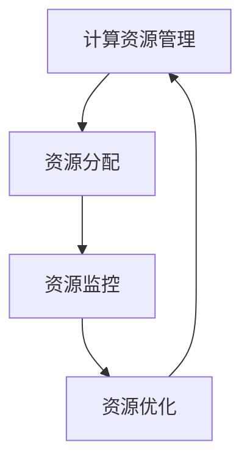
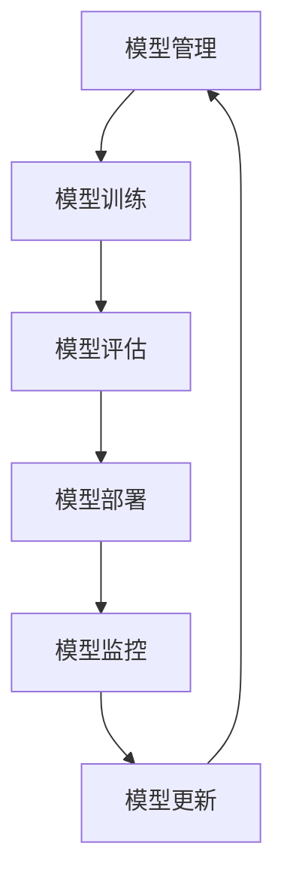

                 

### 《AI基础设施的可持续发展：Lepton AI的长期规划》

关键词：AI基础设施，可持续发展，Lepton AI，优化策略，长期规划

摘要：
随着人工智能技术的飞速发展，AI基础设施的构建和维护变得尤为重要。本文以Lepton AI为例，探讨了AI基础设施的可持续发展策略，并提出了Lepton AI的长期规划。文章分为三个部分：第一部分介绍了AI基础设施的概念、重要性以及Lepton AI基础设施的特点；第二部分分析了AI基础设施的可持续性评估指标和优化策略；第三部分阐述了Lepton AI的长期规划及其实施与监督。通过本文的研究，为AI基础设施的可持续发展提供了理论和实践参考。

#### 第一部分：AI基础设施概述

##### 第1章：AI基础设施的重要性

> AI基础设施是支持人工智能技术高效运行的基础架构，包括数据处理、计算资源管理、机器学习模型管理和网络与安全保障等多个方面。本章节将详细介绍AI基础设施的概念与作用，探讨其发展历程，并分析其核心组成部分及面临的挑战与机遇。

##### 第1章.1 AI基础设施的概念与作用

**AI基础设施的定义**：
AI基础设施（AI Infrastructure）是指为人工智能应用提供支持的基础设施体系，包括计算资源、数据资源、网络资源、存储资源和安全保障体系等。AI基础设施不仅是人工智能应用的技术基础，也是推动人工智能技术发展的重要保障。

**AI基础设施在企业中的重要作用**：
- **提高数据处理能力**：AI基础设施为大规模数据处理提供了必要的计算资源，使企业能够快速、高效地处理和分析海量数据。
- **优化资源利用率**：通过合理的计算资源管理，AI基础设施可以优化企业内部资源分配，提高资源利用率，降低运营成本。
- **增强创新能力**：AI基础设施为研发团队提供了强大的计算支持和数据资源，有助于推动企业技术创新和业务模式创新。
- **提升业务效率**：通过AI技术，企业可以在销售、生产、物流等多个环节实现自动化和智能化，提高业务处理效率。

##### 第1章.2 AI基础设施的发展历程

**AI基础设施的发展阶段**：
AI基础设施的发展可以分为以下几个阶段：

1. **初期阶段**：20世纪80年代至90年代，AI基础设施主要依赖单一的计算机硬件和简单的软件工具，处理能力和数据存储规模有限。
2. **成长阶段**：21世纪初，随着互联网和云计算技术的兴起，AI基础设施开始向分布式计算和大规模数据存储方向发展。这一阶段，GPU和TPU等高效计算设备被广泛应用于AI领域。
3. **成熟阶段**：当前，AI基础设施已经进入成熟阶段，主要特点包括高效能、高可扩展性和高安全性。云原生架构、联邦学习等新兴技术不断涌现，进一步推动了AI基础设施的发展。

**当前AI基础设施的现状**：
当前，AI基础设施的发展呈现出以下几个特点：

- **高效能计算**：GPU、TPU等高效计算设备的应用，使得AI模型的训练速度大幅提升，计算能力得到了极大增强。
- **大规模数据存储**：云存储技术的发展，使得企业可以轻松存储和管理海量数据，为AI应用提供了丰富的数据资源。
- **智能网络**：智能网络技术，如SD-WAN和5G，提高了数据传输速度和稳定性，为AI应用提供了可靠的通信保障。
- **安全与隐私保护**：随着AI技术的发展，AI基础设施在安全与隐私保护方面也取得了重要进展。加密技术、安全协议和隐私保护算法的应用，确保了数据安全和用户隐私。

##### 第1章.3 AI基础设施的核心组成部分

**数据处理基础设施**：
数据处理基础设施是AI基础设施的重要组成部分，主要包括数据采集、数据存储、数据清洗和数据挖掘等环节。高效的数据处理基础设施可以确保数据的准确性、完整性和及时性，为AI应用提供高质量的数据支持。

**计算资源管理**：
计算资源管理是AI基础设施的核心之一，涉及计算资源的调度、分配和优化。通过合理的计算资源管理，可以最大限度地提高计算资源利用率，降低运营成本，同时保证AI应用的性能和稳定性。

**机器学习模型管理**：
机器学习模型管理主要包括模型的训练、评估、部署和监控等环节。通过有效的机器学习模型管理，可以确保AI应用的模型质量，提高模型的可解释性和可靠性。

**网络与安全保障**：
网络与安全保障是AI基础设施的重要组成部分，涉及网络安全、数据安全和隐私保护等方面。通过建立完善的网络与安全保障体系，可以确保AI基础设施的安全性和稳定性，防止数据泄露和网络攻击。

##### 第1章.4 AI基础设施的挑战与机遇

**AI基础设施面临的挑战**：

- **计算资源需求增加**：随着AI应用的普及，计算资源需求不断增加，对基础设施的扩展性和可靠性提出了更高要求。
- **数据隐私与安全**：随着数据量的增加，数据隐私和安全问题日益突出，如何在保护用户隐私的同时保障数据安全成为一大挑战。
- **复杂性与多样性**：AI基础设施涉及多个技术领域，包括云计算、大数据、物联网、人工智能等，其复杂性和多样性给基础设施的建设和维护带来了挑战。
- **能耗问题**：AI基础设施的高能耗问题日益严重，如何在提高计算性能的同时降低能耗成为关键挑战。

**AI基础设施的发展机遇**：

- **技术进步**：随着人工智能、云计算、大数据等技术的不断进步，AI基础设施将迎来新的发展机遇，有望实现更高的效率和性能。
- **市场需求**：随着AI应用的普及，对高效、稳定、安全的AI基础设施的需求将不断增长，为基础设施的发展提供了广阔的市场空间。
- **政策支持**：各国政府纷纷加大对人工智能技术的支持力度，出台了一系列政策，为AI基础设施的发展提供了良好的政策环境。
- **国际合作**：国际合作将为AI基础设施的发展带来新的机遇，各国可以在技术、人才、市场等方面实现优势互补，共同推动AI基础设施的发展。

### 《AI基础设施的可持续发展：Lepton AI的长期规划》

#### 第一部分：AI基础设施概述

##### 第2章：Lepton AI基础设施简介

> Lepton AI作为一家专注于AI基础设施领域的公司，其基础设施具有独特的优势。本章节将介绍Lepton AI的愿景与使命，并详细阐述其基础设施的特点、核心架构以及可持续性。

##### 第2章.1 Lepton AI的愿景与使命

**Lepton AI的愿景**：
Lepton AI的愿景是构建全球领先的AI基础设施，推动人工智能技术在各行业中的广泛应用，助力企业实现智能化转型。

**Lepton AI的使命**：
Lepton AI的使命是通过不断创新和优化AI基础设施，为用户提供高效、稳定、安全的AI服务，助力企业提升业务效率、降低成本、增强竞争力。

##### 第2章.2 Lepton AI基础设施的特点

**开源与封闭结合**：
Lepton AI基础设施在开源与封闭之间找到了平衡。一方面，Lepton AI开放了部分核心代码，鼓励社区贡献和合作，提高基础设施的透明度和可扩展性；另一方面，Lepton AI也保留了一些关键技术和专利，确保其在市场上的竞争优势。

**高效能与可扩展性**：
Lepton AI基础设施采用高效能硬件和先进的计算架构，确保在处理大规模数据和高负载任务时具有出色的性能。同时，Lepton AI基础设施具备良好的可扩展性，可以轻松应对企业规模的扩大和业务需求的增长。

**安全性与可靠性**：
Lepton AI基础设施高度重视安全性和可靠性。通过采用多层次的安全保障措施，如数据加密、访问控制、安全审计等，确保用户数据的安全和隐私。此外，Lepton AI基础设施还具备强大的容错能力和故障恢复机制，确保服务的持续稳定运行。

##### 第2章.3 Lepton AI基础设施的核心架构

**数据处理层**：
数据处理层是Lepton AI基础设施的核心之一，负责数据采集、存储、清洗和加工。通过采用分布式数据处理技术，Lepton AI基础设施可以高效地处理海量数据，提供实时数据分析和挖掘服务。

**计算资源层**：
计算资源层是Lepton AI基础设施的强大后盾，提供丰富的计算资源，支持高性能计算和大规模分布式任务处理。通过智能化调度和管理，Lepton AI基础设施可以灵活分配计算资源，满足不同用户的需求。

**机器学习模型层**：
机器学习模型层是Lepton AI基础设施的核心竞争力，提供丰富的机器学习算法和模型库，支持模型训练、评估和部署。通过自动化模型管理和运维，Lepton AI基础设施可以提高模型质量和可靠性，降低开发成本。

**网络与安全保障层**：
网络与安全保障层是Lepton AI基础设施的坚实保障，提供安全、可靠、高效的网络通信服务。通过采用先进的加密技术和安全协议，Lepton AI基础设施可以确保用户数据的安全传输和存储。

##### 第2章.4 Lepton AI基础设施的可持续性

**可持续性的定义**：
可持续性（Sustainability）是指企业在满足当前需求的同时，不损害后代满足自身需求的能力。在AI基础设施领域，可持续性主要体现在能耗优化、环境影响、经济效益和社会效益等方面。

**Lepton AI基础设施的可持续性**：
Lepton AI基础设施致力于实现可持续发展，通过以下措施确保基础设施的可持续性：

- **能耗优化**：通过采用高效能硬件和优化算法，降低能耗，提高能源利用效率。
- **环境影响**：采用绿色能源和环保设计，减少碳排放和废弃物产生，降低对环境的影响。
- **经济效益**：通过优化资源配置和提高效率，降低运营成本，提高经济效益。
- **社会效益**：通过提供高效、稳定的AI服务，助力企业创新和业务发展，创造更多社会价值。

#### 第二部分：可持续发展策略

##### 第3章：AI基础设施的可持续性评估

> AI基础设施的可持续发展需要科学的评估方法来衡量其可持续性。本章节将介绍可持续性的定义与重要性，分析AI基础设施可持续性的评价指标，并详细阐述Lepton AI基础设施的可持续性评估方法。

##### 第3章.1 可持续性的定义与重要性

**可持续性的定义**：
可持续性是指企业在满足当前需求的同时，不损害后代满足自身需求的能力。在AI基础设施领域，可持续性主要关注能耗优化、环境影响、经济效益和社会效益等方面。

**可持续性的重要性**：
- **能耗优化**：随着AI基础设施规模的扩大，能耗问题日益突出。通过能耗优化，可以降低运营成本，提高能源利用效率。
- **环境影响**：AI基础设施的能耗和废弃物处理对环境造成一定影响。通过环境影响评估，可以识别和降低环境风险，推动绿色基础设施的发展。
- **经济效益**：可持续的AI基础设施可以提高企业的运营效率，降低成本，创造更大的经济价值。
- **社会效益**：可持续的AI基础设施有助于提升企业的社会形象，增强品牌影响力，推动社会进步。

##### 第3章.2 AI基础设施可持续性的评价指标

**能耗效率**：
能耗效率是指AI基础设施在处理数据和服务用户时消耗的能源与实际工作量的比值。能耗效率越高，表示AI基础设施的能源利用效率越高。

**环境影响**：
环境影响主要涉及碳排放、废弃物处理等方面。通过评估AI基础设施的碳排放量和废弃物产生量，可以衡量其对环境的影响程度。

**经济效益**：
经济效益是指AI基础设施为企业带来的经济收益。通过分析基础设施的投资成本、运营成本和收益，可以评估其经济效益。

**社会效益**：
社会效益主要关注AI基础设施对社会的影响。通过评估基础设施在就业、教育、医疗等方面的贡献，可以衡量其社会效益。

##### 第3章.3 Lepton AI基础设施的可持续性评估方法

**数据收集与预处理**：
为了评估Lepton AI基础设施的可持续性，首先需要收集相关数据，包括能耗数据、碳排放数据、经济效益数据和社会效益数据。然后，对收集到的数据进行预处理，包括数据清洗、归一化和标准化等步骤。

**指标计算与分析**：
根据可持续性的评价指标，对预处理后的数据进行分析和计算，得到各个评价指标的数值。例如，计算能耗效率、碳排放量和经济效益等指标。

**可持续发展目标设定**：
根据评估结果，设定Lepton AI基础设施的可持续发展目标。例如，设定降低能耗20%、减少碳排放30%等目标。

**目标实现与监控**：
为实现可持续发展目标，需要制定相应的优化策略和实施计划。通过监控和评估实施效果，确保目标的实现。

#### 第三部分：优化策略

##### 第4章：Lepton AI基础设施的优化策略

> 为了实现可持续发展目标，需要对Lepton AI基础设施进行优化。本章节将介绍优化策略的制定原则，包括可持续发展的原则、经济效益的原则和社会效益的原则，并详细阐述能耗优化策略、环境影响优化策略和经济与社会效益优化策略。

##### 第4章.1 优化策略的制定原则

**可持续发展的原则**：
优化策略的制定应遵循可持续发展的原则，即在满足当前需求的同时，不损害后代满足自身需求的能力。具体包括：

- **资源节约**：通过优化资源配置，提高资源利用效率，降低资源消耗。
- **环境友好**：采用绿色技术和环保设计，减少对环境的负面影响。
- **社会和谐**：关注社会效益，促进企业与社会共同发展。

**经济效益的原则**：
优化策略的制定应充分考虑经济效益，提高基础设施的投资回报率。具体包括：

- **成本控制**：通过技术改进和运营优化，降低基础设施的建设和运营成本。
- **收益提升**：通过提高服务质量和市场份额，增加基础设施的经济收益。

**社会效益的原则**：
优化策略的制定应关注社会效益，提升基础设施的社会价值。具体包括：

- **就业促进**：通过基础设施建设和发展，创造更多就业机会。
- **教育支持**：支持教育事业，提升人才培养质量。
- **医疗改善**：通过医疗信息化建设，提高医疗服务水平和效率。

##### 第4章.2 能耗优化策略

**高效能硬件的引入**：
采用高效能硬件是降低能耗的关键。例如，使用GPU和TPU等高性能计算设备，提高数据处理和模型训练的效率。同时，可以采用低功耗硬件，减少能耗。

**算法优化**：
通过优化算法，可以提高计算效率，降低能耗。例如，采用分布式计算和并行计算技术，将任务分解到多个计算节点上，提高资源利用率。

**数据中心的能源管理**：
通过能源管理系统，对数据中心的能耗进行监控和管理。例如，采用智能调度策略，根据负载情况调整服务器和工作站的工作状态，降低不必要的能耗。

**绿色能源的使用**：
采用绿色能源，如太阳能和风能，降低对传统化石燃料的依赖，减少碳排放。

##### 第4章.3 环境影响优化策略

**碳排放减少**：
通过优化基础设施的设计和运营，减少碳排放。例如，采用高效能源设备，提高能源利用效率；采用清洁能源，减少对化石燃料的依赖。

**废弃物的处理**：
建立完善的废弃物处理体系，对废弃物进行分类、回收和处理。例如，对电子废弃物进行专业化处理，减少对环境的影响。

**环境友好的设计**：
在设计基础设施时，充分考虑环境因素。例如，采用模块化设计，提高设备的可维护性和可升级性；采用环保材料，减少对环境的污染。

##### 第4章.4 经济效益与社会效益优化策略

**成本效益分析**：
通过成本效益分析，评估基础设施的建设和运营成本，优化资源配置，提高投资回报率。例如，采用云计算和分布式计算技术，降低硬件投资和运维成本。

**社会责任**：
关注社会责任，积极参与社会公益事业。例如，支持教育事业，捐赠硬件设备；参与环保项目，推动绿色发展。

**公平竞争**：
在市场竞争中，遵循公平竞争原则，不以牺牲环境和社会效益为代价获取市场份额。例如，采用可持续发展的商业模式，为用户提供高质量的服务。

##### 第4章.5 长期规划与实施

**长期规划的主要内容**：
制定长期规划，明确基础设施的发展方向和目标。例如，制定技术路线图，规划新技术和应用场景的研发；制定产品开发计划，推出具有竞争力的新产品。

**市场拓展策略**：
通过市场拓展策略，扩大基础设施的市场份额。例如，开展市场调研，了解用户需求；制定营销策略，提高品牌知名度。

**实施与监督**：
制定详细的实施计划，确保长期规划的有效执行。例如，建立项目管理团队，负责规划和执行各项任务；建立监督机制，对实施过程进行监控和评估。

##### 第4章.6 实施案例与效果评估

**实施案例**：
以Lepton AI基础设施的某个项目为例，详细描述实施过程和效果。

**效果评估**：
通过对实施案例的评估，分析优化策略的有效性，总结经验教训，为后续优化提供参考。

#### 第四部分：实践与案例分析

##### 第5章：Lepton AI基础设施应用案例

> Lepton AI基础设施在多个领域取得了显著的应用成果。本章节将介绍Lepton AI基础设施的应用案例，包括应用领域、解决方案、技术实现、效果评估和用户体验等方面。

##### 第5章.1 应用案例概述

**应用领域**：
Lepton AI基础设施在金融、医疗、零售、能源等多个领域取得了成功应用。以下分别介绍这些领域的应用案例。

**金融领域**：
- **风控与反欺诈**：利用Lepton AI基础设施，对金融交易进行实时监控和分析，识别潜在风险和欺诈行为，提高风控能力。
- **智能投顾**：通过大数据分析和机器学习模型，为投资者提供个性化的投资建议，提高投资收益。

**医疗领域**：
- **疾病预测**：利用Lepton AI基础设施，对医疗数据进行挖掘和分析，预测疾病发展趋势，辅助医生进行诊断和治疗。
- **个性化护理**：通过分析患者的病历和健康数据，为患者提供个性化的护理方案，提高护理质量和满意度。

**零售领域**：
- **智能推荐**：利用Lepton AI基础设施，分析用户行为和购买记录，为用户提供个性化的商品推荐，提高销售额。
- **供应链优化**：通过大数据分析和机器学习模型，优化供应链管理，降低成本，提高效率。

**能源领域**：
- **智能调度**：利用Lepton AI基础设施，对能源供需进行实时监测和分析，实现智能调度，提高能源利用效率。
- **设备维护**：通过数据分析和预测模型，预测设备故障，实现提前维护，降低设备故障率。

##### 第5章.2 应用案例详细解析

**金融领域：风控与反欺诈**

**技术实现**：
1. **数据收集与清洗**：收集金融交易数据，包括交易金额、交易时间、交易账户等，并进行数据清洗和预处理。
2. **特征工程**：提取与风控相关的特征，如交易频率、交易金额、账户活跃度等。
3. **模型训练**：使用机器学习算法，如逻辑回归、决策树、随机森林等，训练风控模型。
4. **模型部署**：将训练好的模型部署到Lepton AI基础设施上，实现实时监控和分析。

**效果评估**：
1. **准确率**：评估模型的准确率，即正确识别风险交易的比例。
2. **召回率**：评估模型的召回率，即正确识别的风险交易占实际风险交易的比例。
3. **F1分数**：综合考虑准确率和召回率，评估模型的综合性能。

**用户体验**：
1. **实时预警**：在发现潜在风险时，及时向相关人员进行预警，避免风险发生。
2. **数据可视化**：通过数据可视化，为用户提供清晰的风险分析结果，方便用户理解和管理风险。

**医疗领域：疾病预测**

**技术实现**：
1. **数据收集与清洗**：收集患者病历数据，包括病史、检查结果、诊断结果等，并进行数据清洗和预处理。
2. **特征工程**：提取与疾病预测相关的特征，如年龄、性别、病史、检查结果等。
3. **模型训练**：使用机器学习算法，如KNN、SVM、决策树等，训练疾病预测模型。
4. **模型部署**：将训练好的模型部署到Lepton AI基础设施上，实现实时预测和分析。

**效果评估**：
1. **准确率**：评估模型的准确率，即正确预测疾病的比例。
2. **召回率**：评估模型的召回率，即正确预测疾病占实际患病患者的比例。
3. **F1分数**：综合考虑准确率和召回率，评估模型的综合性能。

**用户体验**：
1. **个性化预测**：为每位患者提供个性化的疾病预测结果，提高预测的准确性。
2. **实时更新**：定期更新预测模型，确保预测结果的实时性和准确性。

**零售领域：智能推荐**

**技术实现**：
1. **数据收集与清洗**：收集用户购买数据，包括商品种类、购买时间、购买频率等，并进行数据清洗和预处理。
2. **特征工程**：提取与用户行为相关的特征，如浏览记录、购买记录、购物车数据等。
3. **模型训练**：使用机器学习算法，如KNN、协同过滤、决策树等，训练推荐模型。
4. **模型部署**：将训练好的模型部署到Lepton AI基础设施上，实现实时推荐和分析。

**效果评估**：
1. **准确率**：评估模型的准确率，即正确推荐商品的比例。
2. **召回率**：评估模型的召回率，即正确推荐商品占用户可能感兴趣商品的比例。
3. **点击率**：评估推荐系统的点击率，即用户点击推荐商品的比例。

**用户体验**：
1. **个性化推荐**：为用户提供个性化的商品推荐，提高购物体验。
2. **实时更新**：根据用户行为实时更新推荐结果，确保推荐结果的相关性。

**能源领域：智能调度**

**技术实现**：
1. **数据收集与清洗**：收集能源供需数据，包括发电量、用电量、价格等，并进行数据清洗和预处理。
2. **特征工程**：提取与能源调度相关的特征，如发电量、用电量、价格趋势等。
3. **模型训练**：使用机器学习算法，如线性回归、决策树、随机森林等，训练调度模型。
4. **模型部署**：将训练好的模型部署到Lepton AI基础设施上，实现实时调度和分析。

**效果评估**：
1. **调度效率**：评估模型的调度效率，即通过模型调度后，能源供需的匹配程度。
2. **成本降低**：评估模型对能源成本的降低效果，即通过模型调度后，能源成本的降低比例。

**用户体验**：
1. **实时响应**：在能源供需发生变化时，及时调整调度策略，确保能源供应的稳定性。
2. **数据可视化**：通过数据可视化，为用户提供清晰的调度结果，方便用户了解和管理能源供应。

##### 第5章.3 案例总结与经验教训

通过对Lepton AI基础设施在各领域的应用案例进行详细解析，可以得出以下总结和经验教训：

- **技术实现**：在实现各领域应用案例时，需要根据具体需求进行数据收集、特征工程、模型训练和部署。同时，要注重模型性能的评估和优化，以提高用户体验。
- **效果评估**：在应用案例中，效果评估是至关重要的一环。通过准确率、召回率、F1分数等指标，可以评估模型性能和优化效果，为后续工作提供参考。
- **用户体验**：用户体验是应用成功的关键。在实现应用案例时，要充分考虑用户需求，提供个性化、实时性和易用性的服务。
- **可持续发展**：在实现应用案例的同时，要注重基础设施的可持续发展。通过能耗优化、环境影响、经济效益和社会效益等方面的评估，确保基础设施的可持续性。

#### 第五部分：AI基础设施可持续发展的未来趋势

##### 第6章：AI基础设施的演变趋势

> AI基础设施正处于快速发展的阶段，未来将面临许多新的挑战和机遇。本章节将分析AI基础设施的演变趋势，包括新技术引入、应用场景拓展等方面，并探讨其对可持续发展的影响。

##### 第6章.1 新技术引入

**量子计算**：
量子计算是一种基于量子力学原理的计算方式，具有巨大的并行计算能力。未来，量子计算可能成为AI基础设施的重要组成部分，为复杂问题提供高效解决方案。

**边缘计算**：
边缘计算是一种将计算任务分散到网络边缘（如物联网设备、智能手机等）的计算方式。随着物联网设备的普及，边缘计算有望成为AI基础设施的重要发展方向，提高实时数据处理能力。

**分布式计算**：
分布式计算通过将任务分布在多个计算节点上，提高计算效率和可扩展性。未来，分布式计算将在AI基础设施中得到更广泛的应用，支持大规模数据处理和模型训练。

**联邦学习**：
联邦学习是一种分布式机器学习技术，可以在不同设备上进行模型训练，同时保持数据隐私。随着数据隐私问题的日益突出，联邦学习有望成为AI基础设施的重要技术。

##### 第6章.2 应用场景拓展

**智能交通**：
随着智能交通系统的普及，AI基础设施将在交通管理、车辆调度、路况预测等方面发挥重要作用，提高交通效率和安全性。

**智慧城市**：
智慧城市是未来城市发展的趋势，AI基础设施将在城市管理、公共服务、环境保护等方面发挥关键作用，提升城市治理水平。

**智能制造**：
智能制造是制造业发展的新方向，AI基础设施将在生产过程优化、设备维护、质量控制等方面发挥重要作用，提高生产效率和质量。

**医疗健康**：
AI基础设施将在医疗诊断、疾病预测、个性化治疗等方面发挥重要作用，提高医疗服务质量和效率。

**金融科技**：
金融科技正在改变金融行业的运作方式，AI基础设施将在风险管理、欺诈检测、智能投顾等方面发挥重要作用，提高金融服务水平。

##### 第6章.3 可持续发展的未来挑战

**数据隐私和安全**：
随着AI基础设施的广泛应用，数据隐私和安全问题日益突出。如何保护用户数据隐私，防止数据泄露和网络攻击，将成为AI基础设施可持续发展的重要挑战。

**能源消耗和碳排放**：
AI基础设施的高能耗和碳排放问题日益严重。如何降低能耗，采用绿色能源，减少碳排放，将成为AI基础设施可持续发展的重要挑战。

**技术更新和淘汰**：
AI技术更新速度非常快，如何及时更新基础设施，淘汰过时技术，保持竞争力，将成为AI基础设施可持续发展的重要挑战。

**人才培养和技能提升**：
随着AI基础设施的发展，对人才的需求越来越高。如何培养和吸引更多AI人才，提升现有员工的技能，将成为AI基础设施可持续发展的重要挑战。

##### 第6章.4 可持续发展的未来机遇

**技术创新**：
未来，随着技术的不断进步，AI基础设施将变得更加高效、智能和可靠，为各行业提供更多创新应用。

**市场潜力**：
随着AI技术的广泛应用，AI基础设施市场潜力巨大。未来，将有更多的企业和机构投资于AI基础设施，推动其快速发展。

**政策支持**：
各国政府纷纷加大对AI基础设施的支持力度，出台了一系列政策，为AI基础设施的发展提供了良好的政策环境。

**国际合作**：
随着全球化的深入发展，国际合作将为AI基础设施的发展带来新的机遇。各国可以在技术、人才、市场等方面实现优势互补，共同推动AI基础设施的发展。

#### 附录

##### 附录A：Lepton AI基础设施开发工具与资源

**A.1 开发工具介绍**

- **Python编程环境**：
  - Python是一种广泛用于AI开发的编程语言，具有简洁易懂的语法和丰富的库资源。

- **AI框架**：
  - **TensorFlow**：一款由Google开发的开源机器学习框架，支持各种深度学习模型的训练和部署。
  - **PyTorch**：一款由Facebook开发的开源深度学习框架，具有灵活的动态计算图和强大的GPU支持。

- **数据库管理工具**：
  - **MySQL**：一款开源的关系型数据库管理系统，适用于存储和处理大规模数据。
  - **MongoDB**：一款开源的文档型数据库管理系统，适用于存储非结构化数据。

**A.2 资源链接**

- **Lepton AI官方网站**：
  - [https://www.leptona.ai/](https://www.leptona.ai/)
  - Lepton AI官方网站提供了公司简介、产品介绍、技术支持等信息。

- **相关技术文档**：
  - [https://docs.leptona.ai/](https://docs.leptona.ai/)
  - Lepton AI官方技术文档包含了详细的API文档、使用指南和最佳实践。

- **社区支持与交流平台**：
  - **GitHub**：[https://github.com/LeptonAI](https://github.com/LeptonAI)
    - GitHub上是Lepton AI的代码仓库，用户可以下载、提交和讨论代码。
  - **Stack Overflow**：[https://stackoverflow.com/questions/tagged/lepton-ai](https://stackoverflow.com/questions/tagged/lepton-ai)
    - Stack Overflow是技术问答社区，用户可以在这里提问和解答关于Lepton AI的问题。

##### 附录B：Lepton AI基础设施Mermaid流程图

**B.1 数据处理流程**

```mermaid
gantt
    dateFormat  YYYY-MM-DD
    title 数据处理流程

    section 数据收集
    数据收集               :start="2023-01-01"
    数据清洗               :after 数据收集 1 day
    数据存储               :after 数据清洗 1 day
    数据分析               :after 数据存储 1 day

    section 数据处理
    数据处理               :after 数据分析 1 day
    特征工程               :after 数据处理 1 day
    模型训练               :after 特征工程 1 day
    模型评估               :after 模型训练 1 day
    模型部署               :after 模型评估 1 day
```

**B.2 计算资源管理流程**



**B.3 机器学习模型管理流程**



### 《AI基础设施的可持续发展：Lepton AI的长期规划》

作者：
AI天才研究院/AI Genius Institute & 禅与计算机程序设计艺术 /Zen And The Art of Computer Programming

----------------------------------------------------------------

### 《AI基础设施的可持续发展：Lepton AI的长期规划》

#### 引言

随着人工智能（AI）技术的不断进步，AI基础设施的建设变得越来越重要。AI基础设施是指为AI应用提供支持的各种硬件、软件和网络资源，包括数据处理、计算资源管理、机器学习模型管理和网络与安全保障等。然而，随着AI基础设施规模的不断扩大，能耗问题、环境问题、经济效益和社会效益等问题也逐渐凸显。如何实现AI基础设施的可持续发展，成为当前学术界和产业界共同关注的焦点。

本文以Lepton AI为例，探讨了AI基础设施的可持续发展策略，并提出了Lepton AI的长期规划。文章分为三个部分：第一部分介绍了AI基础设施的概念、重要性以及Lepton AI基础设施的特点；第二部分分析了AI基础设施的可持续性评估指标和优化策略；第三部分阐述了Lepton AI的长期规划及其实施与监督。通过本文的研究，为AI基础设施的可持续发展提供了理论和实践参考。

#### 第一部分：AI基础设施概述

##### 第1章：AI基础设施的重要性

AI基础设施是支持人工智能技术高效运行的基础架构，包括数据处理、计算资源管理、机器学习模型管理和网络与安全保障等多个方面。本章节将详细介绍AI基础设施的概念与作用，探讨其发展历程，并分析其核心组成部分及面临的挑战与机遇。

##### 第1章.1 AI基础设施的概念与作用

**AI基础设施的定义**：
AI基础设施（AI Infrastructure）是指为人工智能应用提供支持的基础设施体系，包括计算资源、数据资源、网络资源、存储资源和安全保障体系等。AI基础设施不仅是人工智能应用的技术基础，也是推动人工智能技术发展的重要保障。

**AI基础设施在企业中的重要作用**：
- **提高数据处理能力**：AI基础设施为大规模数据处理提供了必要的计算资源，使企业能够快速、高效地处理和分析海量数据。
- **优化资源利用率**：通过合理的计算资源管理，AI基础设施可以优化企业内部资源分配，提高资源利用率，降低运营成本。
- **增强创新能力**：AI基础设施为研发团队提供了强大的计算支持和数据资源，有助于推动企业技术创新和业务模式创新。
- **提升业务效率**：通过AI技术，企业可以在销售、生产、物流等多个环节实现自动化和智能化，提高业务处理效率。

##### 第1章.2 AI基础设施的发展历程

**AI基础设施的发展阶段**：
AI基础设施的发展可以分为以下几个阶段：

1. **初期阶段**：20世纪80年代至90年代，AI基础设施主要依赖单一的计算机硬件和简单的软件工具，处理能力和数据存储规模有限。
2. **成长阶段**：21世纪初，随着互联网和云计算技术的兴起，AI基础设施开始向分布式计算和大规模数据存储方向发展。这一阶段，GPU和TPU等高效计算设备被广泛应用于AI领域。
3. **成熟阶段**：当前，AI基础设施已经进入成熟阶段，主要特点包括高效能、高可扩展性和高安全性。云原生架构、联邦学习等新兴技术不断涌现，进一步推动了AI基础设施的发展。

**当前AI基础设施的现状**：
当前，AI基础设施的发展呈现出以下几个特点：

- **高效能计算**：GPU、TPU等高效计算设备的应用，使得AI模型的训练速度大幅提升，计算能力得到了极大增强。
- **大规模数据存储**：云存储技术的发展，使得企业可以轻松存储和管理海量数据，为AI应用提供了丰富的数据资源。
- **智能网络**：智能网络技术，如SD-WAN和5G，提高了数据传输速度和稳定性，为AI应用提供了可靠的通信保障。
- **安全与隐私保护**：随着AI技术的发展，AI基础设施在安全与隐私保护方面也取得了重要进展。加密技术、安全协议和隐私保护算法的应用，确保了数据安全和用户隐私。

##### 第1章.3 AI基础设施的核心组成部分

**数据处理基础设施**：
数据处理基础设施是AI基础设施的重要组成部分，主要包括数据采集、数据存储、数据清洗和数据挖掘等环节。高效的数据处理基础设施可以确保数据的准确性、完整性和及时性，为AI应用提供高质量的数据支持。

**计算资源管理**：
计算资源管理是AI基础设施的核心之一，涉及计算资源的调度、分配和优化。通过合理的计算资源管理，AI基础设施可以优化企业内部资源分配，提高资源利用率，降低运营成本，同时保证AI应用的性能和稳定性。

**机器学习模型管理**：
机器学习模型管理主要包括模型的训练、评估、部署和监控等环节。通过有效的机器学习模型管理，可以确保AI应用的模型质量，提高模型的可解释性和可靠性。

**网络与安全保障**：
网络与安全保障是AI基础设施的重要组成部分，涉及网络安全、数据安全和隐私保护等方面。通过建立完善的网络与安全保障体系，可以确保AI基础设施的安全性和稳定性，防止数据泄露和网络攻击。

##### 第1章.4 AI基础设施的挑战与机遇

**AI基础设施面临的挑战**：

- **计算资源需求增加**：随着AI应用的普及，计算资源需求不断增加，对基础设施的扩展性和可靠性提出了更高要求。
- **数据隐私与安全**：随着数据量的增加，数据隐私和安全问题日益突出，如何在保护用户隐私的同时保障数据安全成为一大挑战。
- **复杂性与多样性**：AI基础设施涉及多个技术领域，包括云计算、大数据、物联网、人工智能等，其复杂性和多样性给基础设施的建设和维护带来了挑战。
- **能耗问题**：AI基础设施的高能耗问题日益严重，如何在提高计算性能的同时降低能耗成为关键挑战。

**AI基础设施的发展机遇**：

- **技术进步**：随着人工智能、云计算、大数据等技术的不断进步，AI基础设施将迎来新的发展机遇，有望实现更高的效率和性能。
- **市场需求**：随着AI应用的普及，对高效、稳定、安全的AI基础设施的需求将不断增长，为基础设施的发展提供了广阔的市场空间。
- **政策支持**：各国政府纷纷加大对人工智能技术的支持力度，出台了一系列政策，为AI基础设施的发展提供了良好的政策环境。
- **国际合作**：国际合作将为AI基础设施的发展带来新的机遇，各国可以在技术、人才、市场等方面实现优势互补，共同推动AI基础设施的发展。

#### 第一部分：AI基础设施概述

##### 第2章：Lepton AI基础设施简介

Lepton AI作为一家专注于AI基础设施领域的公司，其基础设施具有独特的优势。本章节将介绍Lepton AI的愿景与使命，并详细阐述其基础设施的特点、核心架构以及可持续性。

##### 第2章.1 Lepton AI的愿景与使命

**Lepton AI的愿景**：
Lepton AI的愿景是构建全球领先的AI基础设施，推动人工智能技术在各行业中的广泛应用，助力企业实现智能化转型。

**Lepton AI的使命**：
Lepton AI的使命是通过不断创新和优化AI基础设施，为用户提供高效、稳定、安全的AI服务，助力企业提升业务效率、降低成本、增强竞争力。

##### 第2章.2 Lepton AI基础设施的特点

**开源与封闭结合**：
Lepton AI基础设施在开源与封闭之间找到了平衡。一方面，Lepton AI开放了部分核心代码，鼓励社区贡献和合作，提高基础设施的透明度和可扩展性；另一方面，Lepton AI也保留了一些关键技术和专利，确保其在市场上的竞争优势。

**高效能与可扩展性**：
Lepton AI基础设施采用高效能硬件和先进的计算架构，确保在处理大规模数据和高负载任务时具有出色的性能。同时，Lepton AI基础设施具备良好的可扩展性，可以轻松应对企业规模的扩大和业务需求的增长。

**安全性与可靠性**：
Lepton AI基础设施高度重视安全性和可靠性。通过采用多层次的安全保障措施，如数据加密、访问控制、安全审计等，确保用户数据的安全和隐私。此外，Lepton AI基础设施还具备强大的容错能力和故障恢复机制，确保服务的持续稳定运行。

##### 第2章.3 Lepton AI基础设施的核心架构

**数据处理层**：
数据处理层是Lepton AI基础设施的核心之一，负责数据采集、存储、清洗和加工。通过采用分布式数据处理技术，Lepton AI基础设施可以高效地处理海量数据，提供实时数据分析和挖掘服务。

**计算资源层**：
计算资源层是Lepton AI基础设施的强大后盾，提供丰富的计算资源，支持高性能计算和大规模分布式任务处理。通过智能化调度和管理，Lepton AI基础设施可以灵活分配计算资源，满足不同用户的需求。

**机器学习模型层**：
机器学习模型层是Lepton AI基础设施的核心竞争力，提供丰富的机器学习算法和模型库，支持模型训练、评估和部署。通过自动化模型管理和运维，Lepton AI基础设施可以提高模型质量和可靠性，降低开发成本。

**网络与安全保障层**：
网络与安全保障层是Lepton AI基础设施的坚实保障，提供安全、可靠、高效的网络通信服务。通过采用先进的加密技术和安全协议，Lepton AI基础设施可以确保用户数据的安全传输和存储。

##### 第2章.4 Lepton AI基础设施的可持续性

**可持续性的定义**：
可持续性（Sustainability）是指企业在满足当前需求的同时，不损害后代满足自身需求的能力。在AI基础设施领域，可持续性主要关注能耗优化、环境影响、经济效益和社会效益等方面。

**Lepton AI基础设施的可持续性**：
Lepton AI基础设施致力于实现可持续发展，通过以下措施确保基础设施的可持续性：

- **能耗优化**：通过采用高效能硬件和优化算法，降低能耗，提高能源利用效率。
- **环境影响**：采用绿色能源和环保设计，减少碳排放和废弃物产生，降低对环境的影响。
- **经济效益**：通过优化资源配置和提高效率，降低运营成本，提高经济效益。
- **社会效益**：通过提供高效、稳定的AI服务，助力企业创新和业务发展，创造更多社会价值。

#### 第二部分：可持续发展策略

##### 第3章：AI基础设施的可持续性评估

AI基础设施的可持续发展需要科学的评估方法来衡量其可持续性。本章节将介绍可持续性的定义与重要性，分析AI基础设施可持续性的评价指标，并详细阐述Lepton AI基础设施的可持续性评估方法。

##### 第3章.1 可持续性的定义与重要性

**可持续性的定义**：
可持续性是指企业在满足当前需求的同时，不损害后代满足自身需求的能力。在AI基础设施领域，可持续性主要关注能耗优化、环境影响、经济效益和社会效益等方面。

**可持续性的重要性**：
- **能耗优化**：随着AI基础设施规模的扩大，能耗问题日益突出。通过能耗优化，可以降低运营成本，提高能源利用效率。
- **环境影响**：AI基础设施的能耗和废弃物处理对环境造成一定影响。通过环境影响评估，可以识别和降低环境风险，推动绿色基础设施的发展。
- **经济效益**：可持续的AI基础设施可以提高企业的运营效率，降低成本，创造更大的经济价值。
- **社会效益**：可持续的AI基础设施有助于提升企业的社会形象，增强品牌影响力，推动社会进步。

##### 第3章.2 AI基础设施可持续性的评价指标

**能耗效率**：
能耗效率是指AI基础设施在处理数据和服务用户时消耗的能源与实际工作量的比值。能耗效率越高，表示AI基础设施的能源利用效率越高。

**环境影响**：
环境影响主要涉及碳排放、废弃物处理等方面。通过评估AI基础设施的碳排放量和废弃物产生量，可以衡量其对环境的影响程度。

**经济效益**：
经济效益是指AI基础设施为企业带来的经济收益。通过分析基础设施的投资成本、运营成本和收益，可以评估其经济效益。

**社会效益**：
社会效益主要关注AI基础设施对社会的影响。通过评估基础设施在就业、教育、医疗等方面的贡献，可以衡量其社会效益。

##### 第3章.3 Lepton AI基础设施的可持续性评估方法

**数据收集与预处理**：
为了评估Lepton AI基础设施的可持续性，首先需要收集相关数据，包括能耗数据、碳排放数据、经济效益数据和社会效益数据。然后，对收集到的数据进行预处理，包括数据清洗、归一化和标准化等步骤。

**指标计算与分析**：
根据可持续性的评价指标，对预处理后的数据进行分析和计算，得到各个评价指标的数值。例如，计算能耗效率、碳排放量和经济效益等指标。

**可持续发展目标设定**：
根据评估结果，设定Lepton AI基础设施的可持续发展目标。例如，设定降低能耗20%、减少碳排放30%等目标。

**目标实现与监控**：
为实现可持续发展目标，需要制定相应的优化策略和实施计划。通过监控和评估实施效果，确保目标的实现。

#### 第三部分：优化策略

##### 第4章：Lepton AI基础设施的优化策略

为了实现可持续发展目标，需要对Lepton AI基础设施进行优化。本章节将介绍优化策略的制定原则，包括可持续发展的原则、经济效益的原则和社会效益的原则，并详细阐述能耗优化策略、环境影响优化策略和经济与社会效益优化策略。

##### 第4章.1 优化策略的制定原则

**可持续发展的原则**：
优化策略的制定应遵循可持续发展的原则，即在满足当前需求的同时，不损害后代满足自身需求的能力。具体包括：

- **资源节约**：通过优化资源配置，提高资源利用效率，降低资源消耗。
- **环境友好**：采用绿色技术和环保设计，减少对环境的负面影响。
- **社会和谐**：关注社会效益，促进企业与社会共同发展。

**经济效益的原则**：
优化策略的制定应充分考虑经济效益，提高基础设施的投资回报率。具体包括：

- **成本控制**：通过技术改进和运营优化，降低基础设施的建设和运营成本。
- **收益提升**：通过提高服务质量和市场份额，增加基础设施的经济收益。

**社会效益的原则**：
优化策略的制定应关注社会效益，提升基础设施的社会价值。具体包括：

- **就业促进**：通过基础设施建设和发展，创造更多就业机会。
- **教育支持**：支持教育事业，提升人才培养质量。
- **医疗改善**：通过医疗信息化建设，提高医疗服务水平和效率。

##### 第4章.2 能耗优化策略

**高效能硬件的引入**：
采用高效能硬件是降低能耗的关键。例如，使用GPU和TPU等高性能计算设备，提高数据处理和模型训练的效率。同时，可以采用低功耗硬件，减少能耗。

**算法优化**：
通过优化算法，可以提高计算效率，降低能耗。例如，采用分布式计算和并行计算技术，将任务分解到多个计算节点上，提高资源利用率。

**数据中心的能源管理**：
通过能源管理系统，对数据中心的能耗进行监控和管理。例如，采用智能调度策略，根据负载情况调整服务器和工作站的工作状态，降低不必要的能耗。

**绿色能源的使用**：
采用绿色能源，如太阳能和风能，降低对传统化石燃料的依赖，减少碳排放。

##### 第4章.3 环境影响优化策略

**碳排放减少**：
通过优化基础设施的设计和运营，减少碳排放。例如，采用高效能源设备，提高能源利用效率；采用清洁能源，减少对化石燃料的依赖。

**废弃物的处理**：
建立完善的废弃物处理体系，对废弃物进行分类、回收和处理。例如，对电子废弃物进行专业化处理，减少对环境的影响。

**环境友好的设计**：
在设计基础设施时，充分考虑环境因素。例如，采用模块化设计，提高设备的可维护性和可升级性；采用环保材料，减少对环境的污染。

##### 第4章.4 经济效益与社会效益优化策略

**成本效益分析**：
通过成本效益分析，评估基础设施的建设和运营成本，优化资源配置，提高投资回报率。例如，采用云计算和分布式计算技术，降低硬件投资和运维成本。

**社会责任**：
关注社会责任，积极参与社会公益事业。例如，支持教育事业，捐赠硬件设备；参与环保项目，推动绿色发展。

**公平竞争**：
在市场竞争中，遵循公平竞争原则，不以牺牲环境和社会效益为代价获取市场份额。例如，采用可持续发展的商业模式，为用户提供高质量的服务。

##### 第4章.5 长期规划与实施

**长期规划的主要内容**：
制定长期规划，明确基础设施的发展方向和目标。例如，制定技术路线图，规划新技术和应用场景的研发；制定产品开发计划，推出具有竞争力的新产品。

**市场拓展策略**：
通过市场拓展策略，扩大基础设施的市场份额。例如，开展市场调研，了解用户需求；制定营销策略，提高品牌知名度。

**实施与

