                 

# AI大模型创业：如何应对未来竞争对手？

> **关键词：** AI大模型，创业，竞争策略，技术原理，商业模式

> **摘要：** 本文将深入探讨AI大模型创业所面临的挑战和应对策略。通过分析AI大模型的基础、技术原理、应用实战以及创业与竞争策略，为创业者提供实用的指导意见，助力他们在未来竞争中脱颖而出。

### 第一部分：AI大模型基础

#### 第1章：AI大模型概述

##### 1.1 AI大模型的时代背景

###### 1.1.1 从人工智能到AI大模型的演进

人工智能（AI）的发展历程可以分为几个阶段：早期的人工智能、基于规则的系统、基于知识的系统、机器学习和深度学习。随着计算能力和数据资源的不断增长，深度学习成为AI领域的核心技术，推动了AI大模型的诞生。

AI大模型，即大型人工智能模型，通常具有数十亿至数千亿个参数，能够在多种任务上实现卓越的性能。这一演进过程不仅是技术上的突破，更是对人工智能发展路径的一次重新定义。

###### 1.1.2 AI大模型的关键特性

AI大模型具有以下几个关键特性：

1. **大规模参数**：AI大模型拥有数十亿甚至千亿个参数，这使得它们能够捕捉复杂的数据模式。
2. **自学习能力**：通过大规模训练，AI大模型能够自动学习数据中的规律，无需人工干预。
3. **泛化能力**：AI大模型不仅能在训练数据上表现出色，还能在未见过的数据上保持良好的性能。
4. **多任务处理**：AI大模型可以同时处理多种任务，如自然语言处理、图像识别和语音识别。

###### 1.1.3 AI大模型的发展现状与趋势

目前，AI大模型已经广泛应用于多个领域，包括自然语言处理、计算机视觉、推荐系统等。未来，随着计算能力和数据资源的进一步提升，AI大模型有望在更多领域实现突破。

AI大模型的发展趋势包括：

1. **模型规模不断扩大**：未来的AI大模型将拥有更大的参数规模，以捕捉更复杂的数据模式。
2. **计算效率提升**：通过优化算法和硬件，AI大模型的计算效率将得到显著提升。
3. **专用化模型**：针对特定应用场景设计的专用化AI大模型将不断涌现。
4. **跨模态融合**：未来AI大模型将能够处理多种数据模态，实现更全面的信息理解。

##### 1.2 AI大模型的核心概念

###### 1.2.1 什么是AI大模型

AI大模型是指具有数十亿至数千亿个参数的大型神经网络模型。这些模型通过大量训练数据学习数据中的复杂模式，并在多种任务上表现出色。

###### 1.2.2 AI大模型的基本架构

AI大模型通常由以下几个部分组成：

1. **输入层**：接收外部数据输入，如文本、图像或语音。
2. **隐藏层**：包含多层神经网络，用于数据特征的提取和转换。
3. **输出层**：生成预测结果或分类标签。

AI大模型的基本架构通常采用深度学习框架实现，如TensorFlow和PyTorch。

###### 1.2.3 AI大模型的分类

AI大模型可以根据任务类型和应用场景进行分类，常见的分类方法包括：

1. **自然语言处理（NLP）模型**：如GPT、BERT等。
2. **计算机视觉（CV）模型**：如ResNet、YOLO等。
3. **推荐系统（RS）模型**：如ALS、GBDT等。
4. **其他领域模型**：如医学影像分析、语音识别等。

##### 1.3 AI大模型的代表实例

###### 1.3.1 GPT系列模型

GPT（Generative Pre-trained Transformer）系列模型是自然语言处理领域的里程碑式成果。GPT-3拥有1750亿个参数，能够生成高质量的自然语言文本，广泛应用于聊天机器人、内容生成等场景。

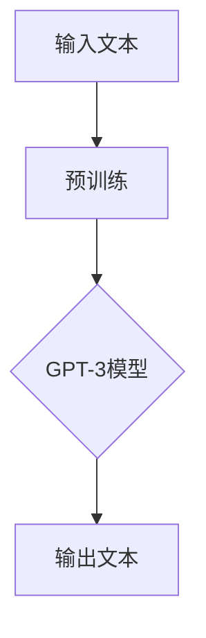

###### 1.3.2 BERT及其变体

BERT（Bidirectional Encoder Representations from Transformers）是一种基于Transformer架构的预训练模型，广泛应用于自然语言处理任务。BERT通过双向注意力机制捕捉文本的语义信息，并在多种任务上取得了优异的性能。

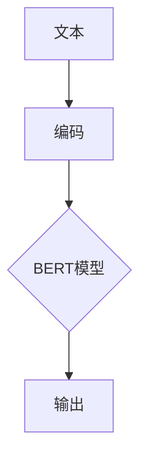

###### 1.3.3 其他知名大模型介绍

除了GPT和BERT，还有许多其他知名的大模型，如：

1. **ViT（Vision Transformer）**：一种将Transformer架构应用于计算机视觉任务的模型，适用于图像分类、目标检测等任务。
2. **T5（Text-To-Text Transfer Transformer）**：一种通用预训练模型，能够处理多种自然语言处理任务，如机器翻译、文本摘要等。
3. **XLNet**：一种基于Transformer的自回归预训练模型，解决了GPT等模型在预训练过程中的一些问题，并在多种任务上取得了优异的性能。

##### 1.4 AI大模型的应用场景

###### 1.4.1 AI大模型在自然语言处理中的应用

自然语言处理是AI大模型的重要应用领域之一。AI大模型在文本分类、问答系统、机器翻译、文本生成等方面取得了显著成果。例如，GPT-3在聊天机器人、内容生成等领域表现出了强大的能力。

###### 1.4.2 AI大模型在计算机视觉中的应用

计算机视觉是AI大模型的另一个重要应用领域。AI大模型在图像分类、目标检测、人脸识别、视频分析等方面取得了显著成果。例如，ViT在图像分类任务上取得了SOTA（State-of-the-Art）性能。

###### 1.4.3 AI大模型在其他领域的应用前景

除了自然语言处理和计算机视觉，AI大模型在其他领域也具有广泛的应用前景。例如，在医学影像分析领域，AI大模型可以用于疾病诊断、病灶检测等任务；在金融领域，AI大模型可以用于风险管理、投资决策等任务。

### 第二部分：AI大模型技术原理

#### 第2章：AI大模型技术基础

##### 2.1 深度学习与神经网络

###### 2.1.1 神经网络的基本原理

神经网络（Neural Network，NN）是深度学习（Deep Learning，DL）的基础。神经网络由多个神经元（节点）组成，每个神经元都是一个简单的计算单元。神经元之间通过权重（weight）连接，形成复杂的网络结构。

神经元的计算过程如下：

$$
\text{输出} = \text{激活函数}(\sum_{i=1}^{n} w_i \cdot x_i + b)
$$

其中，$w_i$ 是权重，$x_i$ 是输入，$b$ 是偏置，激活函数（activation function）用于引入非线性。

常见的激活函数包括：

1. **Sigmoid函数**：
   $$
   \sigma(x) = \frac{1}{1 + e^{-x}}
   $$
2. **ReLU函数**（Rectified Linear Unit）：
   $$
   \text{ReLU}(x) = \max(0, x)
   $$
3. **Tanh函数**：
   $$
   \tanh(x) = \frac{e^x - e^{-x}}{e^x + e^{-x}}
   $$

###### 2.1.2 深度学习的关键技术

深度学习的关键技术包括：

1. **反向传播算法**（Backpropagation）：用于计算网络参数的梯度，以更新权重。
2. **优化算法**（Optimization Algorithms）：用于优化网络参数，以获得更好的模型性能。常见的优化算法包括梯度下降（Gradient Descent）、Adam等。
3. **正则化技术**（Regularization Techniques）：用于防止模型过拟合。常见的正则化技术包括L1正则化、L2正则化、dropout等。

###### 2.1.3 神经网络的训练过程

神经网络的训练过程包括以下几个步骤：

1. **前向传播**（Forward Propagation）：输入数据通过网络，计算输出结果。
2. **计算损失**（Compute Loss）：计算输出结果与真实结果之间的差距，通常使用均方误差（MSE）等损失函数。
3. **反向传播**（Backpropagation）：计算损失函数关于网络参数的梯度。
4. **更新参数**（Update Parameters）：使用梯度下降等优化算法更新网络参数。
5. **迭代训练**（Iterative Training）：重复前向传播、计算损失、反向传播和更新参数的过程，直至达到预设的停止条件。

##### 2.2 自然语言处理

###### 2.2.1 词嵌入技术

词嵌入（Word Embedding）是将文本数据转换为向量的方法，用于表示单词或短语。常见的词嵌入技术包括：

1. **Word2Vec**：通过训练神经网络来学习词向量，能够捕捉单词的语义信息。
2. **GloVe**（Global Vectors for Word Representation）：通过矩阵分解学习词向量，具有较好的语义表示能力。

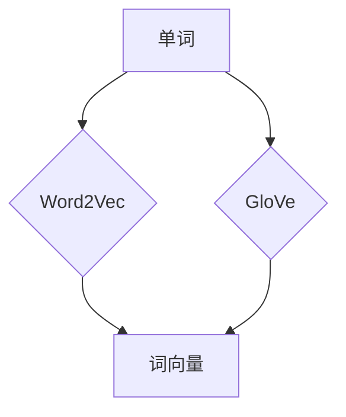

###### 2.2.2 序列模型与注意力机制

序列模型（Sequence Model）是处理序列数据（如文本、时间序列等）的方法。常见的序列模型包括：

1. **RNN（Recurrent Neural Network）**：通过循环结构捕获序列数据的长期依赖关系。
2. **LSTM（Long Short-Term Memory）**：一种改进的RNN，能够有效解决长短期依赖问题。
3. **GRU（Gated Recurrent Unit）**：另一种改进的RNN，具有更简洁的结构。

注意力机制（Attention Mechanism）是一种用于序列模型的技巧，能够自动调整不同位置的重要性。常见的注意力模型包括：

1. **Self-Attention**：用于计算序列中每个元素之间的相互影响。
2. **Transformer**：基于Self-Attention机制的模型，广泛应用于自然语言处理任务。

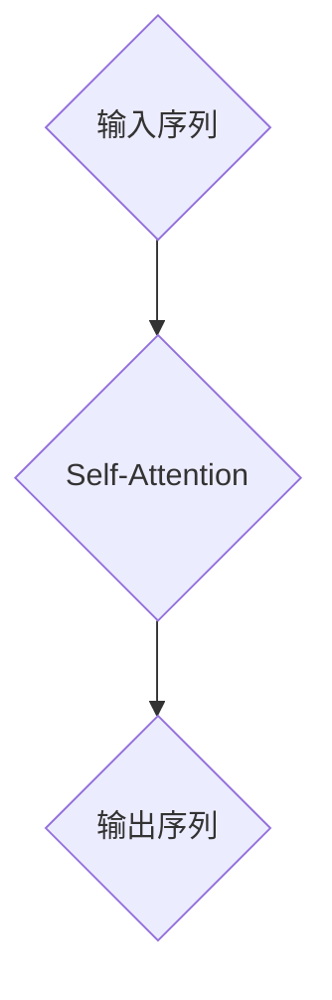

###### 2.2.3 转换器架构详解

转换器架构（Transformer）是一种基于Self-Attention机制的深度学习模型，广泛应用于自然语言处理任务。转换器架构的主要组成部分包括：

1. **编码器**（Encoder）：用于处理输入序列，生成编码表示。
2. **解码器**（Decoder）：用于生成输出序列，解码编码表示。

转换器架构的关键组件包括：

1. **多头注意力**（Multi-Head Attention）：通过多个独立的注意力机制捕获不同类型的依赖关系。
2. **位置编码**（Positional Encoding）：用于保留序列中的位置信息。
3. **前馈网络**（Feed-Forward Network）：对注意力机制的结果进行进一步加工。

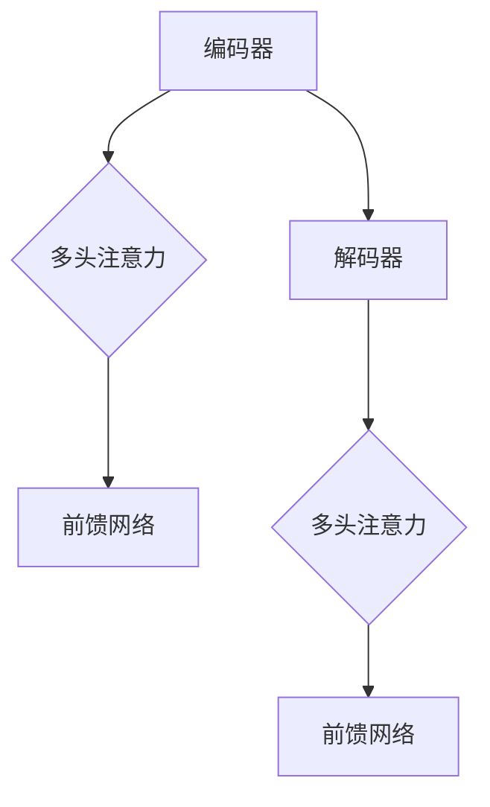

##### 2.3 大规模预训练模型

###### 2.3.1 预训练的概念与意义

预训练（Pre-training）是指在大规模数据集上对模型进行训练，以获得良好的泛化能力。预训练模型通常分为两个阶段：

1. **预训练阶段**：在大量未标记的数据上训练模型，以学习通用的语言表示。
2. **微调阶段**：在特定任务上对模型进行微调，以适应具体的应用场景。

预训练的意义在于：

1. **提高模型性能**：通过预训练，模型能够在多种任务上表现出良好的性能。
2. **减少训练数据需求**：预训练模型已经在大规模数据集上训练，因此可以在较小规模的数据集上实现较好的性能。
3. **加速模型训练**：预训练模型可以快速适应新任务，减少训练时间。

###### 2.3.2 自监督学习方法

自监督学习（Self-Supervised Learning）是一种无需人工标注数据的预训练方法。自监督学习的关键思想是从未标记的数据中提取有用信息，用于训练模型。

常见的自监督学习方法包括：

1. **Masked Language Model（MLM）**：随机遮挡文本序列的一部分，预测遮挡的单词或子序列。
2. ** masked Tokens Prediction（MTP）**：预测未标记的文本序列中的缺失部分。
3. ** Next Sentence Prediction（NSP）**：预测两个文本序列之间的连贯性。

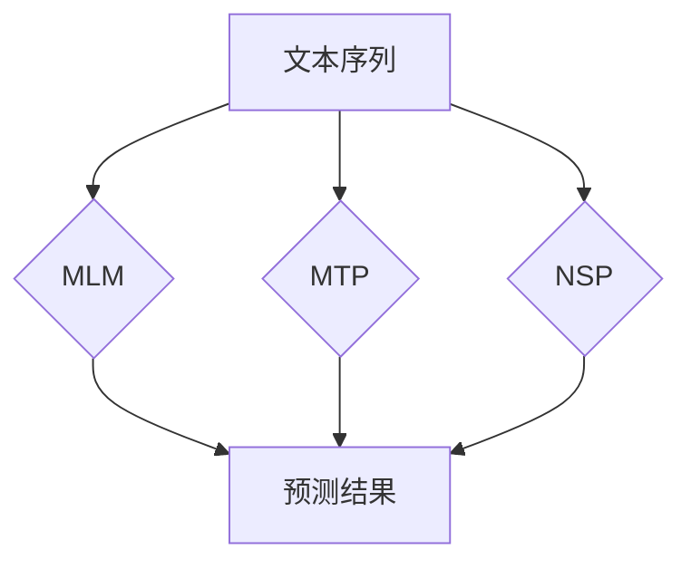

###### 2.3.3 迁移学习与微调技术

迁移学习（Transfer Learning）是指将预训练模型的知识迁移到新任务上，以减少对新数据的依赖。迁移学习的关键在于：

1. **预训练模型的选择**：选择合适的预训练模型，如BERT、GPT等。
2. **微调策略**：在特定任务上对预训练模型进行微调，以适应新任务。

常见的微调技术包括：

1. **全连接层添加**：在预训练模型的顶部添加全连接层，用于处理新任务。
2. **层剪枝**：剪枝预训练模型的部分层，以适应新任务。
3. **动态权重调整**：根据任务需求动态调整预训练模型的权重。

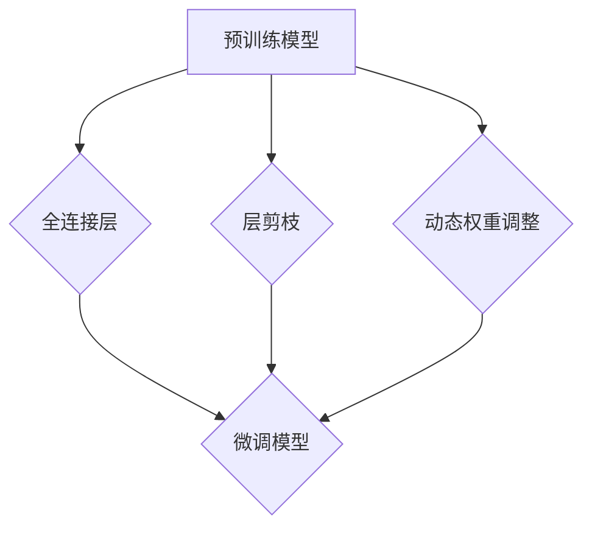

### 第三部分：AI大模型应用实战

#### 第3章：AI大模型项目策划与执行

##### 3.1 AI大模型项目策划

###### 3.1.1 项目立项与需求分析

项目立项是AI大模型项目策划的第一步，主要包括以下内容：

1. **项目背景**：明确项目的发展背景和目标。
2. **需求分析**：分析用户需求，确定项目的核心功能和技术难点。
3. **可行性分析**：评估项目的可行性，包括技术、资金、人力资源等。

需求分析的结果将形成项目需求文档，为后续项目执行提供指导。

###### 3.1.2 项目团队组建与分工

项目团队组建是确保项目顺利进行的关键。项目团队通常包括以下几个角色：

1. **项目经理**：负责项目整体规划和管理。
2. **数据科学家**：负责数据预处理、模型设计和调优。
3. **软件工程师**：负责模型实现、部署和运维。
4. **测试工程师**：负责模型测试和性能评估。

明确团队分工，确保每个成员明确自己的职责和任务。

###### 3.1.3 项目进度管理与风险控制

项目进度管理是确保项目按计划推进的关键。项目进度管理包括以下内容：

1. **项目计划**：制定详细的项目进度计划，包括里程碑、阶段目标等。
2. **进度跟踪**：定期跟踪项目进度，确保项目按计划推进。
3. **风险控制**：识别项目风险，制定风险应对策略，确保项目顺利进行。

##### 3.2 AI大模型开发流程

###### 3.2.1 数据收集与预处理

数据收集与预处理是AI大模型开发的关键步骤，主要包括以下内容：

1. **数据收集**：收集与项目相关的数据，包括文本、图像、音频等。
2. **数据清洗**：去除数据中的噪声和异常值，确保数据质量。
3. **数据预处理**：对数据进行归一化、标准化等处理，以适应模型训练。

常见的预处理方法包括：

1. **文本预处理**：去除停用词、分词、词性标注等。
2. **图像预处理**：缩放、裁剪、增强等。
3. **音频预处理**：降噪、分割、特征提取等。

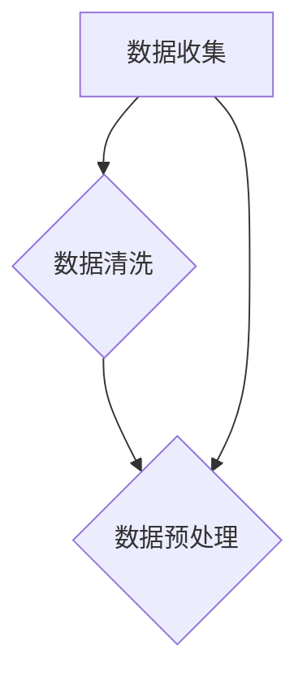

###### 3.2.2 模型设计与实现

模型设计与实现是AI大模型开发的核心步骤，主要包括以下内容：

1. **模型选择**：根据项目需求选择合适的模型架构。
2. **模型参数设置**：设置模型参数，如学习率、批量大小等。
3. **模型实现**：使用深度学习框架实现模型，如TensorFlow、PyTorch等。

常见的深度学习框架包括：

1. **TensorFlow**：由Google开发，具有丰富的API和资源。
2. **PyTorch**：由Facebook开发，具有简洁的API和动态图机制。
3. **Keras**：基于TensorFlow和PyTorch的高层次API，便于模型设计和调试。

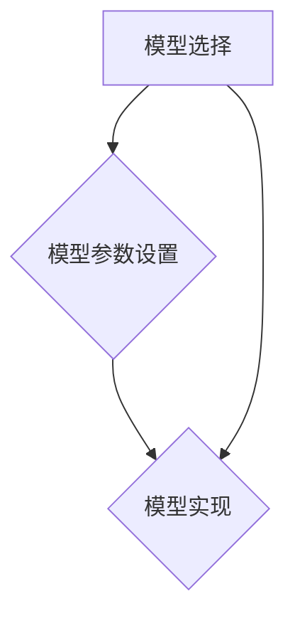

###### 3.2.3 模型训练与调优

模型训练与调优是提高模型性能的关键步骤，主要包括以下内容：

1. **模型训练**：使用训练数据对模型进行训练，优化模型参数。
2. **模型评估**：使用验证数据评估模型性能，调整模型参数。
3. **模型调优**：根据评估结果调整模型结构、超参数等，以提高模型性能。

常见的调优方法包括：

1. **学习率调整**：使用学习率调度策略，如学习率衰减、余弦退火等。
2. **正则化技术**：使用L1正则化、L2正则化等防止模型过拟合。
3. **数据增强**：通过数据增强技术增加训练数据的多样性，提高模型泛化能力。

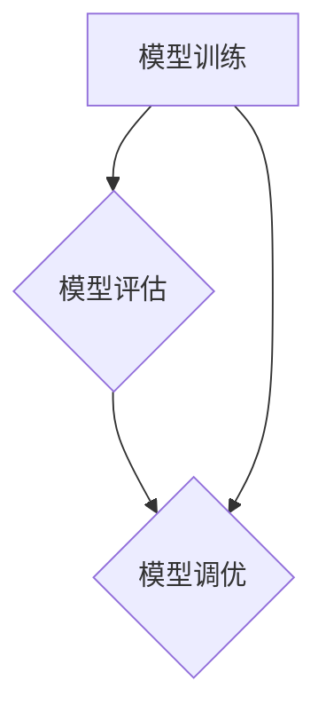

###### 3.2.4 模型部署与监控

模型部署与监控是AI大模型应用的关键步骤，主要包括以下内容：

1. **模型部署**：将训练好的模型部署到生产环境，如云服务器、边缘设备等。
2. **模型监控**：监控模型性能、资源消耗等指标，确保模型稳定运行。
3. **模型升级**：根据用户需求和业务发展，定期更新模型版本。

常见的部署方法包括：

1. **本地部署**：将模型部署到本地服务器，适用于数据量较小、计算资源充足的应用场景。
2. **云端部署**：将模型部署到云服务器，适用于数据量较大、计算资源需求高的应用场景。
3. **边缘部署**：将模型部署到边缘设备，如物联网设备、智能摄像头等，适用于实时性要求高的应用场景。

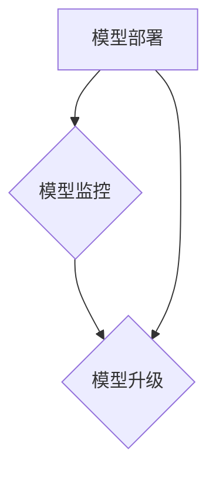

##### 3.3 AI大模型应用案例解析

###### 3.3.1 案例一：基于GPT-3的聊天机器人开发

基于GPT-3的聊天机器人开发主要包括以下几个步骤：

1. **数据收集与预处理**：收集对话数据，进行文本预处理，如分词、去停用词等。
2. **模型训练**：使用GPT-3模型进行训练，优化模型参数。
3. **模型部署与调优**：将训练好的模型部署到生产环境，通过用户反馈进行模型调优。
4. **用户交互**：实现用户与聊天机器人的交互，提供智能问答服务。

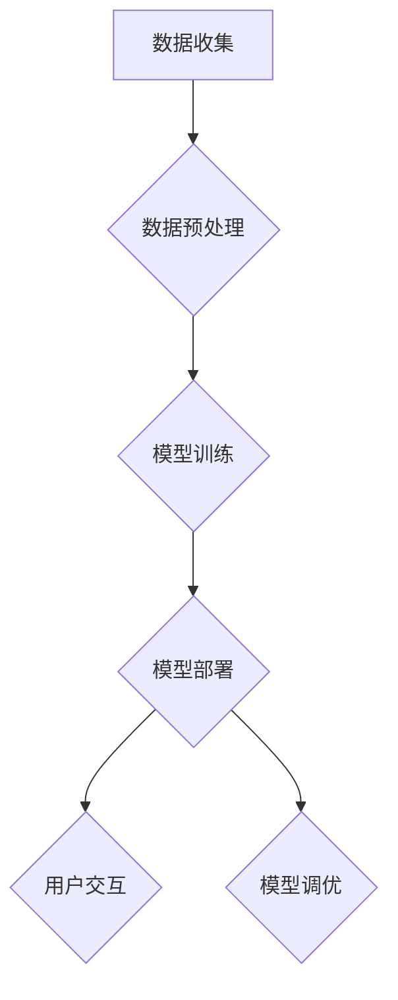

###### 3.3.2 案例二：基于BERT的文本分类应用

基于BERT的文本分类应用主要包括以下几个步骤：

1. **数据收集与预处理**：收集文本数据，进行文本预处理，如分词、词性标注等。
2. **模型训练**：使用BERT模型进行训练，优化模型参数。
3. **模型部署与调优**：将训练好的模型部署到生产环境，通过用户反馈进行模型调优。
4. **文本分类**：使用训练好的模型对新的文本数据进行分类。

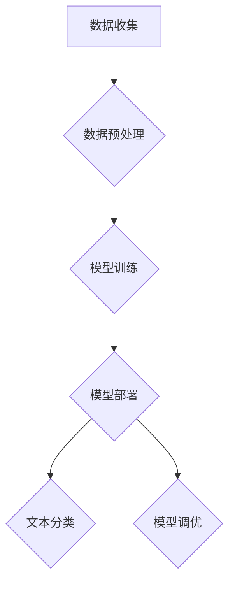

###### 3.3.3 案例三：基于ViT的图像识别应用

基于ViT的图像识别应用主要包括以下几个步骤：

1. **数据收集与预处理**：收集图像数据，进行数据增强、归一化等预处理。
2. **模型训练**：使用ViT模型进行训练，优化模型参数。
3. **模型部署与调优**：将训练好的模型部署到生产环境，通过用户反馈进行模型调优。
4. **图像识别**：使用训练好的模型对新的图像数据进行识别。

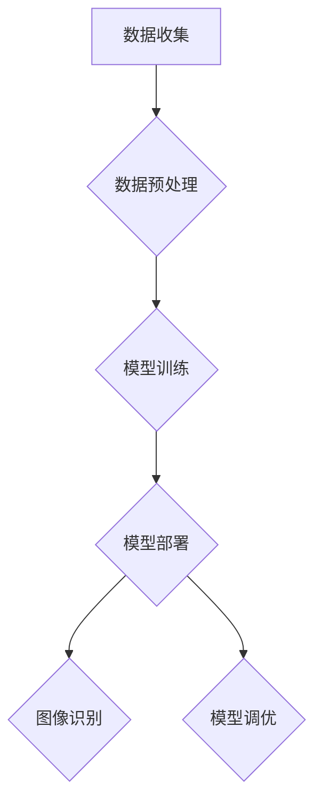

### 第四部分：AI大模型创业与竞争策略

#### 第4章：AI大模型创业准备

##### 4.1 AI大模型创业环境分析

###### 4.1.1 行业发展趋势与机遇

AI大模型技术正逐渐成熟，并在多个领域取得重要突破。这为创业者提供了广阔的发展空间和机遇。以下是目前AI大模型领域的发展趋势和机遇：

1. **自然语言处理**：AI大模型在自然语言处理领域的应用日益广泛，如聊天机器人、智能客服、内容生成等。
2. **计算机视觉**：AI大模型在计算机视觉领域的应用也取得显著成果，如图像识别、目标检测、视频分析等。
3. **推荐系统**：AI大模型在推荐系统领域的应用有助于提高推荐效果，提升用户体验。
4. **医疗健康**：AI大模型在医疗健康领域的应用有望提高疾病诊断和治疗的准确性，降低医疗成本。

###### 4.1.2 市场竞争态势分析

AI大模型领域竞争激烈，主要竞争因素包括：

1. **技术实力**：拥有强大技术实力的企业将在竞争中占据优势地位。
2. **数据资源**：拥有丰富数据资源的企业可以更好地训练和优化AI大模型。
3. **应用场景**：拥有丰富应用场景的企业可以更好地发挥AI大模型的价值。
4. **商业模式**：拥有创新商业模式的企业可以更好地吸引投资者和用户。

当前AI大模型领域的竞争格局如下：

1. **国际巨头**：如Google、Facebook、Microsoft等国际科技巨头在AI大模型领域拥有强大的技术实力和资金支持，处于领先地位。
2. **初创公司**：许多初创公司专注于特定领域或技术的AI大模型研发，通过创新和灵活的商业模式逐渐崭露头角。
3. **中国企业**：随着AI技术的快速发展，中国企业也在AI大模型领域取得重要突破，如百度、阿里巴巴、腾讯等。

###### 4.1.3 创业团队构建

构建一个高效的创业团队是实现AI大模型创业成功的关键。创业团队通常包括以下角色：

1. **技术核心团队**：包括AI大模型研发、数据科学、软件工程等领域的专家，负责技术实现和创新。
2. **产品管理团队**：负责产品规划、设计、开发和推广，确保产品满足市场需求。
3. **运营团队**：负责市场推广、用户运营、客户服务等，确保产品能够持续吸引用户。
4. **资金团队**：负责融资、投资、财务等，为创业公司提供资金支持。

构建创业团队时，应注重以下几点：

1. **技术实力**：团队成员应具备扎实的专业知识和实践经验，能够推动技术进步。
2. **团队协作**：团队成员应具备良好的沟通能力和协作精神，能够高效完成项目任务。
3. **多元化背景**：团队成员应具备不同领域的背景，以推动跨领域创新。
4. **企业文化**：团队成员应认同企业愿景和价值观，共同为实现企业目标而努力。

##### 4.2 AI大模型商业模式探索

###### 4.2.1 商业模式设计原则

设计AI大模型商业模式时，应遵循以下原则：

1. **用户价值**：以用户需求为导向，提供有价值的产品和服务。
2. **盈利模式**：明确盈利模式，确保企业可持续发展。
3. **资源整合**：整合内部和外部资源，提高资源利用效率。
4. **差异化优势**：突出差异化优势，提升企业竞争力。

常见的AI大模型商业模式包括：

1. **平台模式**：提供AI大模型平台，为开发者、企业和用户提供服务。
2. **服务模式**：提供AI大模型服务，如智能问答、文本生成、图像识别等。
3. **产品模式**：将AI大模型集成到产品中，提升产品附加值。
4. **数据模式**：通过数据采集、分析和共享，实现商业价值。

###### 4.2.2 价值主张与盈利模式

AI大模型的价值主张包括：

1. **提高效率**：通过AI大模型实现自动化、智能化，提高业务效率。
2. **降低成本**：通过AI大模型优化业务流程，降低运营成本。
3. **提升用户体验**：通过AI大模型提供个性化、智能化的服务，提升用户体验。
4. **创新应用**：通过AI大模型推动业务创新，开拓新市场。

常见的盈利模式包括：

1. **服务收费**：根据用户使用AI大模型服务的次数或时长收费。
2. **产品销售**：将AI大模型集成到产品中，通过产品销售获得收入。
3. **广告收入**：通过AI大模型实现个性化广告推送，获得广告收入。
4. **数据服务**：提供数据采集、分析和共享服务，获得数据服务收入。

###### 4.2.3 AI大模型服务的运营策略

AI大模型服务的运营策略包括：

1. **用户运营**：通过用户反馈、数据分析等手段，不断提升服务质量，满足用户需求。
2. **产品运营**：持续优化产品功能，提升用户体验，增加用户粘性。
3. **市场运营**：通过市场推广、品牌建设等手段，提高品牌知名度和市场占有率。
4. **技术运营**：不断优化AI大模型算法，提高模型性能和可靠性。

##### 4.3 AI大模型创业案例分析

###### 4.3.1 案例一：OpenAI与GPT-3的成功之路

OpenAI是一家成立于2015年的美国人工智能研究公司，致力于推动人工智能的发展和应用。OpenAI成功的关键因素包括：

1. **强大的团队**：OpenAI的核心团队成员包括人工智能领域的顶级专家，如Yann LeCun、Ilya Sutskever等。
2. **丰富的资源**：OpenAI获得了大量的资金支持，包括微软等知名企业的投资。
3. **技术创新**：OpenAI在深度学习、自然语言处理等领域取得了多项重要突破，如GPT-3模型的发布。
4. **开放合作**：OpenAI积极与其他研究机构和企业合作，推动人工智能技术的进步和应用。

GPT-3的成功之路包括：

1. **大规模训练**：GPT-3采用了大规模的训练数据集，训练了1750亿个参数的模型。
2. **自监督学习**：GPT-3采用了自监督学习方法，从未标记的数据中学习语言模式。
3. **广泛应用**：GPT-3在多个领域取得了显著成果，如聊天机器人、内容生成、自然语言理解等。

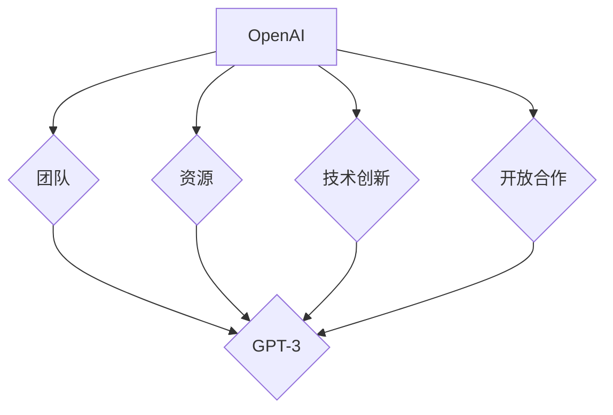

###### 4.3.2 案例二：百度飞桨在AI大模型领域的实践

百度飞桨（PaddlePaddle）是百度公司开发的开源深度学习平台，致力于推动人工智能技术的发展和应用。百度飞桨在AI大模型领域的实践包括：

1. **强大的模型库**：百度飞桨提供了丰富的预训练模型和工具，如PaddleSlim、PaddleDetection等，方便开发者快速搭建和部署AI大模型。
2. **高效的训练框架**：百度飞桨采用了动态图机制，提供了高效的训练框架，支持大规模模型的训练和推理。
3. **开源生态**：百度飞桨构建了完善的开源生态，包括社区、教程、案例等，为开发者提供全面的支持。
4. **企业应用**：百度飞桨在百度内部得到广泛应用，如搜索引擎、自动驾驶等，取得了显著成果。

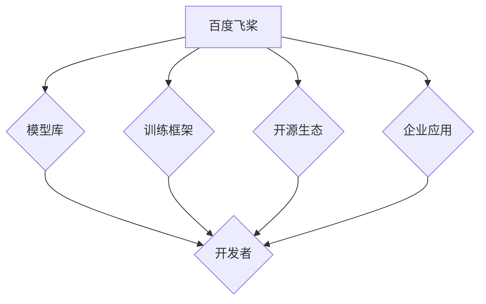

###### 4.3.3 案例三：创业公司AIGen的成功经验

AIGen是一家专注于AI大模型研发的创业公司，以下是其成功经验：

1. **技术创新**：AIGen在AI大模型领域取得了多项重要突破，如开发了基于Transformer的预训练模型。
2. **商业应用**：AIGen将AI大模型应用于多个领域，如自然语言处理、计算机视觉、推荐系统等，取得了显著成果。
3. **合作伙伴**：AIGen与多家企业建立了合作关系，共同推动AI大模型技术的发展和应用。
4. **用户反馈**：AIGen注重用户反馈，根据用户需求不断优化产品和服务，提升了用户满意度。

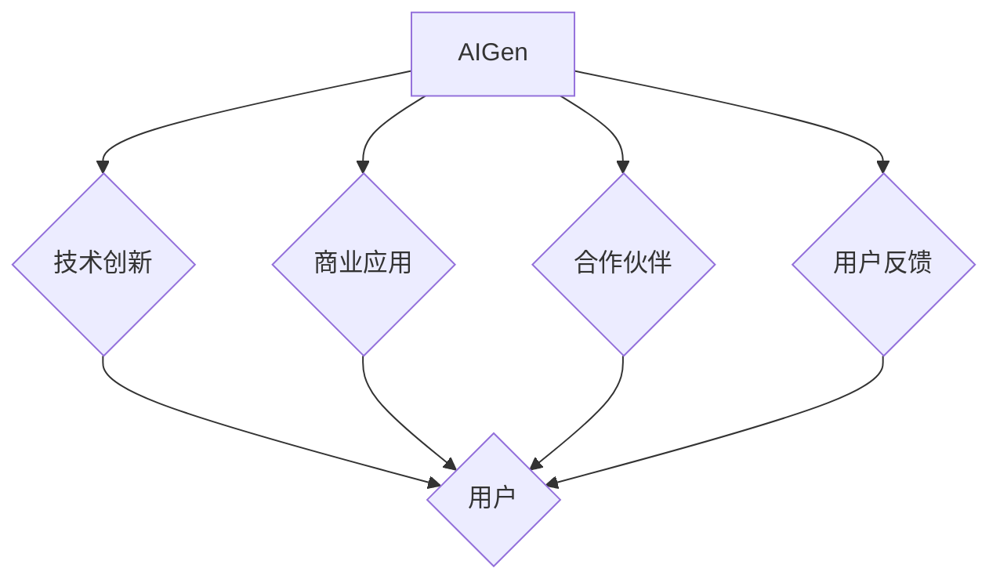

### 第五部分：AI大模型竞争策略

#### 第5章：AI大模型竞争优势分析

##### 5.1 竞争优势理论介绍

竞争优势（Competitive Advantage）是指企业在市场竞争中比竞争对手更具优势的方面。竞争优势理论主要包括以下几种：

1. **成本领先战略**（Cost Leadership）：通过降低成本来提供低价产品，获得市场份额。
2. **差异化战略**（Differentiation）：通过独特的产品或服务满足客户需求，形成竞争优势。
3. **集中战略**（Focus Strategy）：专注于特定市场或细分市场，提供定制化的产品或服务。

在AI大模型领域，企业可以通过以下方式建立竞争优势：

1. **技术优势**：通过技术创新和研发投入，开发具有竞争力的AI大模型。
2. **数据优势**：通过大量数据资源的积累和利用，提升AI大模型性能。
3. **生态优势**：建立完善的开发者生态，提供丰富的工具、资源和教程，吸引更多开发者。

##### 5.2 AI大模型技术竞争优势

AI大模型技术竞争优势主要体现在以下几个方面：

1. **模型性能**：AI大模型在多种任务上具有出色的性能，能够提供高质量的服务。
2. **技术创新**：持续的技术创新是企业保持竞争力的关键，如新模型架构、新算法等。
3. **研发能力**：强大的研发团队和充足的研发投入是企业提升技术竞争力的重要保障。
4. **模型可解释性**：提高模型的可解释性有助于用户理解和信任AI大模型，降低风险。
5. **安全性**：保证AI大模型的安全性，防止恶意攻击和数据泄露。

##### 5.3 AI大模型商业模式竞争优势

AI大模型商业模式竞争优势主要体现在以下几个方面：

1. **服务多样性与定制化**：提供多样化的AI大模型服务，满足不同客户的需求，实现定制化。
2. **用户体验与口碑**：提供优质的用户体验，树立良好的口碑，吸引更多客户。
3. **市场份额与品牌影响力**：扩大市场份额，提升品牌影响力，提高企业竞争力。
4. **运营效率**：优化运营流程，提高运营效率，降低成本，提高盈利能力。

### 第六部分：AI大模型未来展望

#### 第6章：AI大模型发展趋势与挑战

##### 6.1 AI大模型未来发展趋势

AI大模型在未来将继续发展，主要趋势包括：

1. **模型规模不断扩大**：随着计算能力和数据资源的提升，AI大模型将拥有更大的参数规模，以捕捉更复杂的数据模式。
2. **计算效率提升**：通过优化算法和硬件，AI大模型的计算效率将得到显著提升，降低应用成本。
3. **专用化模型**：针对特定应用场景的专用化AI大模型将不断涌现，提供更高效、更精准的服务。
4. **跨模态融合**：AI大模型将能够处理多种数据模态，实现更全面的信息理解和处理。

##### 6.2 AI大模型面临的主要挑战

AI大模型在发展过程中也面临以下主要挑战：

1. **技术难题与瓶颈**：AI大模型的训练和推理过程对计算资源和数据量要求极高，存在性能瓶颈。
2. **法律法规与伦理道德**：AI大模型的应用需要遵循相关法律法规和伦理道德，确保隐私保护和公平性。
3. **市场竞争与可持续发展**：AI大模型领域的竞争日益激烈，企业需要不断创新和优化商业模式，实现可持续发展。

##### 6.3 AI大模型发展策略建议

为应对AI大模型面临的发展挑战，企业可以采取以下策略：

1. **企业战略规划**：明确企业的发展目标和方向，制定长期战略规划，确保企业持续发展。
2. **政策支持与产学研合作**：争取政策支持，加强与高校、研究机构的合作，推动技术创新和应用。
3. **技术创新与人才培养**：加大研发投入，培养高水平的技术人才，推动AI大模型技术的发展。

### 第七部分：案例研究

#### 第7章：典型AI大模型企业案例分析

##### 7.1 企业背景与业务概述

案例企业AIGen是一家专注于AI大模型研发和应用的创业公司，成立于2018年。公司总部位于中国北京，核心团队成员来自清华大学、北京大学等知名高校，具备丰富的AI领域研究经验和创业经历。

AIGen的业务范围涵盖AI大模型的研发、部署和应用，主要产品包括自然语言处理、计算机视觉和推荐系统等领域的AI大模型服务。公司致力于为客户提供高效、精准、安全的AI解决方案，推动AI技术在各行业的应用。

##### 7.2 AI大模型技术布局

AIGen在AI大模型技术布局方面具有以下特点：

1. **技术创新**：AIGen在自然语言处理、计算机视觉等领域进行了多项技术创新，开发了具有自主知识产权的AI大模型。
2. **模型研发**：AIGen建立了强大的AI大模型研发团队，持续投入资金和资源进行模型优化和拓展。
3. **开源生态**：AIGen积极开源，贡献了多个AI大模型开源项目，吸引了大量开发者关注和使用。

AIGen在AI大模型技术布局方面的具体措施包括：

1. **建立研发团队**：组建了一支由顶级专家和年轻学者组成的研发团队，开展AI大模型的研究和开发。
2. **合作与交流**：与国内外知名高校、研究机构和企业建立了广泛的合作与交流，推动技术进步和应用。
3. **技术积累**：积累了丰富的AI大模型技术成果，包括预训练模型、模型优化算法和工具等。

##### 7.3 创业与竞争策略

AIGen在创业和竞争策略方面采取了以下措施：

1. **商业模式创新**：通过提供多样化的AI大模型服务，满足不同客户的需求，实现商业模式创新。
2. **市场拓展**：积极拓展市场，与多家企业建立合作关系，将AI大模型应用于各个行业。
3. **品牌建设**：注重品牌建设，提高品牌知名度和影响力，树立行业领先地位。

AIGen的创业与竞争策略包括：

1. **差异化竞争**：通过技术创新和独特的产品服务，实现差异化竞争，提高市场竞争力。
2. **战略合作**：与行业领先企业建立战略合作关系，共同推动AI大模型技术的发展和应用。
3. **持续创新**：不断进行技术创新和产品优化，保持企业的核心竞争力。

##### 7.4 企业发展成果与展望

AIGen自成立以来，在AI大模型领域取得了显著的发展成果：

1. **技术研发**：成功研发了多个具有自主知识产权的AI大模型，并在多个领域取得了突破性成果。
2. **市场拓展**：与多家企业建立了合作关系，将AI大模型应用于金融、医疗、教育等多个领域。
3. **品牌建设**：通过技术创新和优质服务，树立了良好的品牌形象，赢得了客户和市场的认可。

AIGen未来的发展展望包括：

1. **技术创新**：持续投入研发，推动AI大模型技术的创新和应用。
2. **市场拓展**：进一步拓展市场，将AI大模型服务应用于更多行业和领域。
3. **人才培养**：加大人才培养力度，吸引和培养高水平的技术人才，推动企业持续发展。

### 附录

#### 附录A：AI大模型相关资源

##### A.1 技术文档与开源框架

1. **TensorFlow**：由Google开发的开源深度学习框架，支持多种深度学习模型和算法。
2. **PyTorch**：由Facebook开发的开源深度学习框架，具有动态图机制和灵活的API。
3. **Hugging Face Transformers**：一个开源库，提供预训练转换器模型和工具，方便开发者使用和定制转换器模型。

##### A.2 学术论文与研究报告

1. **《大规模预训练语言模型》**：介绍GPT系列模型的论文，是自然语言处理领域的里程碑。
2. **《BERT：预训练的深度转换器用于语言理解》**：介绍BERT模型的论文，对自然语言处理领域产生了深远影响。
3. **《自然语言处理中的深度学习》**：介绍深度学习在自然语言处理领域应用的一篇综述论文。

##### A.3 实用工具与平台

1. **AI大模型训练平台**：提供AI大模型训练、部署和管理功能的平台，如Google Colab、AWS Sagemaker等。
2. **AI大模型应用平台**：提供AI大模型服务的平台，如OpenAI的GPT-3、百度飞桨等。
3. **开发者社区与论坛**：为AI大模型开发者提供交流和学习的平台，如GitHub、Stack Overflow等。

### 作者信息

作者：AI天才研究院/AI Genius Institute & 禅与计算机程序设计艺术/Zen And The Art of Computer Programming

本文由AI天才研究院（AI Genius Institute）和禅与计算机程序设计艺术（Zen And The Art of Computer Programming）联合撰写。AI天才研究院专注于AI领域的创新和研究，致力于推动人工智能技术的发展和应用。禅与计算机程序设计艺术则关注计算机科学领域的技术探索和理论创新，为人工智能领域的发展提供了丰富的理论支持和实践经验。希望本文能为AI大模型创业者和从业者提供有益的参考和启示。

