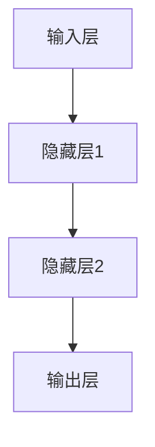
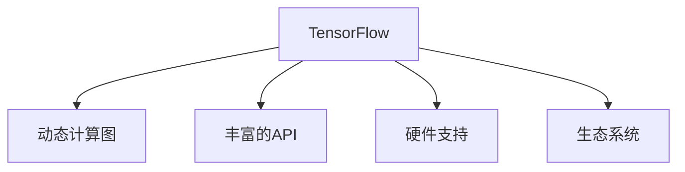
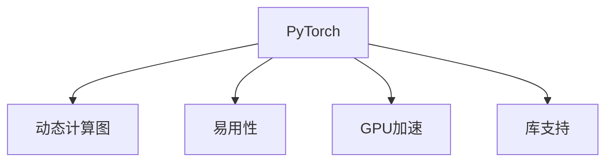
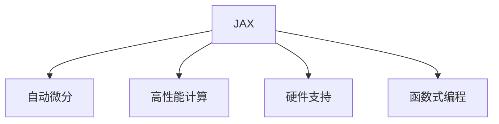

                 

### 《AI大模型创业：如何抓住未来机遇？》

关键词：AI大模型、创业、深度学习、自然语言处理、商业机会、技术基础

摘要：本文旨在探讨AI大模型创业的机遇与挑战，分析其技术基础，提供创业策略与案例分析，以及创业过程中所需资源与工具。通过本文，读者将全面了解AI大模型创业的潜在价值，掌握必要的技能和策略，以抓住未来的发展机遇。

## 《AI大模型创业：如何抓住未来机遇？》目录大纲

### 第一部分: AI大模型概述

#### 第1章: AI大模型基础

##### 1.1 AI大模型的概念与特点

###### 1.1.1 AI大模型的概念

###### 1.1.2 AI大模型的特点

###### 1.1.3 AI大模型与传统AI的区别

##### 1.2 主流AI大模型简介

###### 1.2.1 GPT系列模型

###### 1.2.2 BERT及其变体

###### 1.2.3 其他知名大模型介绍

##### 1.3 AI大模型的发展历程与趋势

###### 1.3.1 AI大模型的发展历程

###### 1.3.2 AI大模型的应用趋势

###### 1.3.3 AI大模型的未来发展方向

### 第二部分: AI大模型技术基础

#### 第2章: 深度学习与神经网络基础

##### 2.1 神经网络基础

###### 2.1.1 神经网络的基本结构

###### 2.1.2 常见的深度学习架构

###### 2.1.3 深度学习优化算法

##### 2.2 自然语言处理技术概览

###### 2.2.1 词嵌入技术

###### 2.2.2 序列模型与注意力机制

###### 2.2.3 转换器架构详解

##### 2.3 大规模预训练模型原理

###### 2.3.1 预训练的概念与意义

###### 2.3.2 自监督学习方法

###### 2.3.3 迁移学习与微调技术

### 第三部分: AI大模型创业实践

#### 第3章: AI大模型创业策略

##### 3.1 AI大模型创业市场分析

###### 3.1.1 AI大模型创业市场概述

###### 3.1.2 AI大模型创业机会与挑战

###### 3.1.3 创业成功的关键要素

##### 3.2 AI大模型创业项目规划

###### 3.2.1 项目目标与定位

###### 3.2.2 项目需求分析与设计

###### 3.2.3 项目风险管理与应对

##### 3.3 AI大模型创业团队建设

###### 3.3.1 团队成员的角色与职责

###### 3.3.2 团队协作与沟通机制

###### 3.3.3 团队文化建设与激励机制

### 第四部分: AI大模型创业案例分析

#### 第4章: 成功的AI大模型创业案例分析

##### 4.1 案例一：OpenAI的GPT系列模型创业历程

###### 4.1.1 OpenAI的成立背景

###### 4.1.2 GPT系列模型的发展历程

###### 4.1.3 OpenAI的商业模式与收益

##### 4.2 案例二：DeepMind的AlphaGo与深度学习创业

###### 4.2.1 DeepMind的成立背景

###### 4.2.2 AlphaGo的突破性进展

###### 4.2.3 DeepMind的商业模式与影响

### 第五部分: AI大模型创业资源与工具

#### 第5章: AI大模型创业资源与工具

##### 5.1 主流深度学习框架对比

###### 5.1.1 TensorFlow

###### 5.1.2 PyTorch

###### 5.1.3 JAX

###### 5.1.4 其他框架简介

##### 5.2 AI大模型开发工具与环境搭建

###### 5.2.1 GPU与TPU配置

###### 5.2.2 训练数据集收集与预处理

###### 5.2.3 模型训练与优化技巧

##### 5.3 AI大模型创业法律与伦理问题

###### 5.3.1 AI大模型创业的法律风险

###### 5.3.2 AI大模型创业的伦理问题

###### 5.3.3 风险防范与合规建议

### 附录

#### 附录A: AI大模型开发工具与资源

##### A.1 主流深度学习框架对比

###### A.1.1 TensorFlow

###### A.1.2 PyTorch

###### A.1.3 JAX

###### A.1.4 其他框架简介

##### A.2 AI大模型开发工具与环境搭建

###### A.2.1 GPU与TPU配置

###### A.2.2 训练数据集收集与预处理

###### A.2.3 模型训练与优化技巧

##### A.3 AI大模型创业法律与伦理问题

###### A.3.1 AI大模型创业的法律风险

###### A.3.2 AI大模型创业的伦理问题

###### A.3.3 风险防范与合规建议

---

接下来，我们将按照目录大纲结构，逐步分析并撰写每个章节的内容。

### 第一部分: AI大模型概述

#### 第1章: AI大模型基础

##### 1.1 AI大模型的概念与特点

###### 1.1.1 AI大模型的概念

AI大模型（Large-scale Artificial Intelligence Models）是指具有极高参数规模、能够处理海量数据的深度学习模型。这些模型通过大规模的预训练，具备了强大的知识捕捉和泛化能力，能够在多个领域实现高质量的任务表现。常见的AI大模型包括GPT系列、BERT、T5等。

###### 1.1.2 AI大模型的特点

1. **高参数规模**：AI大模型通常拥有数十亿至数万亿的参数，使其在模型复杂度和计算资源需求上远超传统模型。
2. **强大的泛化能力**：通过大规模预训练，AI大模型能够在未见过的数据上表现出优秀的性能，减少了对特定领域的依赖。
3. **多模态处理**：AI大模型能够处理不同类型的数据，如文本、图像、音频等，实现跨模态的统一建模。
4. **自适应能力**：AI大模型可以通过微调和迁移学习，快速适应特定任务的需求。

###### 1.1.3 AI大模型与传统AI的区别

1. **模型规模**：传统AI模型通常具有较少的参数，而AI大模型具有极高的参数规模。
2. **训练数据量**：传统AI模型可能仅依赖于少量的标注数据，而AI大模型通常使用大规模的未标注数据。
3. **性能表现**：传统AI模型在特定任务上可能表现优秀，但AI大模型能够在多个任务上实现高质量的泛化表现。
4. **计算资源需求**：传统AI模型对计算资源的需求相对较低，而AI大模型需要更多的计算资源，特别是高性能计算和分布式计算的支持。

---

在接下来的章节中，我们将深入探讨主流AI大模型的发展历程、应用趋势以及未来发展方向。这将为我们理解AI大模型的实际应用和创业机会提供重要的背景知识。

### 第一部分: AI大模型概述

#### 第1章: AI大模型基础

##### 1.2 主流AI大模型简介

在AI大模型领域，GPT系列模型、BERT及其变体是最为知名的代表。下面我们将对这些模型进行简要介绍。

###### 1.2.1 GPT系列模型

GPT（Generative Pre-trained Transformer）模型由OpenAI提出，是自注意力机制在自然语言处理中的首次大规模应用。GPT模型通过预训练的方式，学习到了语言的本质规律，从而在生成文本、机器翻译、问答系统等多个任务上表现出色。

- **GPT**：最初的GPT模型，采用12层的Transformer架构，具有1.17亿个参数。
- **GPT-2**：在GPT的基础上，参数规模增加到了15亿，预训练数据量也进一步扩大。
- **GPT-3**：最新的GPT模型，拥有1750亿个参数，能够处理多种语言和任务，实现了前所未有的文本生成能力。

###### 1.2.2 BERT及其变体

BERT（Bidirectional Encoder Representations from Transformers）模型由Google提出，是第一个双向Transformer模型，它通过在预训练过程中同时考虑上下文信息，实现了对文本语义的更准确理解。

- **BERT**：原始BERT模型，采用24层的Transformer架构，参数规模为3.4亿。
- **BERT-LG**：长文本版本，适用于长篇文档的处理。
- **RoBERTa**：基于BERT的改进版本，通过改变训练策略和数据预处理方法，进一步提升了模型的性能。
- **ALBERT**：通过参数共享和层归一化等技巧，减少了模型参数数量，同时保持了高性能。

###### 1.2.3 其他知名大模型介绍

除了GPT和BERT，还有许多其他知名的大模型，如：

- **T5**：由Google提出，旨在将Transformer模型应用于各种任务，通过统一的编码器-解码器架构，实现了对多种自然语言处理任务的端到端处理。
- **XLNet**：由Google提出，通过引入交叉注意力机制，提升了Transformer模型的预训练效果。
- **bigbird**：由微软提出，通过引入长距离依赖机制，增强了模型的长期记忆能力。

这些模型在自然语言处理领域取得了显著的成果，展示了AI大模型在理解和生成语言方面的巨大潜力。

在接下来的章节中，我们将进一步探讨AI大模型的发展历程、应用趋势以及未来发展方向，为我们理解AI大模型在创业中的应用提供更深入的视角。

### 第一部分: AI大模型概述

#### 第1章: AI大模型基础

##### 1.3 AI大模型的发展历程与趋势

AI大模型的发展可以追溯到深度学习技术的兴起。在过去的几十年里，深度学习从简单的单层神经网络发展到复杂的深度神经网络，包括卷积神经网络（CNN）和循环神经网络（RNN）。随着计算能力的提升和大数据的普及，深度学习在图像识别、语音识别等任务上取得了突破性的成果。

然而，真正意义上的AI大模型的发展始于2013年，当Google提出使用深度卷积神经网络（DCNN）进行图像分类，并在ImageNet比赛中取得了领先成绩。这一里程碑标志着深度学习技术进入了新阶段。

###### 1.3.1 AI大模型的发展历程

1. **2013-2015年**：深度学习在图像识别和语音识别领域取得了显著成果，但自然语言处理领域尚未有重大突破。
2. **2015年**：Google提出使用深度神经网络进行机器翻译，并在WMT机器翻译比赛中取得了领先成绩，引发了自然语言处理领域的变革。
3. **2017年**：Google提出Transformer模型，并在自然语言处理任务中取得了显著成果，标志着自注意力机制在深度学习中的重要性。
4. **2018年**：OpenAI发布GPT模型，实现了对语言生成任务的强大能力，开启了大规模预训练模型的浪潮。
5. **2018年**：Google提出BERT模型，通过双向编码器对文本进行建模，实现了对文本语义的更准确理解。
6. **2019年**：T5模型提出，通过统一的编码器-解码器架构，实现了对多种自然语言处理任务的端到端处理。

###### 1.3.2 AI大模型的应用趋势

随着AI大模型技术的不断成熟，它们在多个领域的应用趋势日益明显：

1. **自然语言处理**：AI大模型在文本生成、机器翻译、问答系统等任务上表现出色，逐渐取代传统的规则和统计方法。
2. **计算机视觉**：AI大模型在图像分类、目标检测、图像生成等任务上取得了重大突破，提升了计算机视觉系统的性能。
3. **语音识别与生成**：AI大模型在语音识别和语音合成任务中表现出强大的能力，使得智能语音助手和语音识别系统更加智能。
4. **多模态学习**：AI大模型通过融合不同类型的数据，实现了对多模态数据的处理，如视频、图像、文本等，推动了多模态学习的发展。

###### 1.3.3 AI大模型的未来发展方向

AI大模型未来的发展将面临以下几个方向：

1. **参数规模增加**：随着计算能力的提升，AI大模型的参数规模将不断增加，实现更高的模型复杂度和性能。
2. **更精细的任务处理**：通过特定的模型架构和训练策略，AI大模型将能够处理更加精细的任务，如情感分析、对话系统等。
3. **跨领域应用**：AI大模型将在更多领域得到应用，如医疗、金融、教育等，实现跨领域的智能化解决方案。
4. **边缘计算与实时处理**：随着边缘计算技术的发展，AI大模型将能够在边缘设备上进行实时处理，满足实时应用的需求。
5. **可解释性与伦理**：AI大模型的可解释性和伦理问题将成为研究的重要方向，确保模型的透明性和合规性。

总之，AI大模型的发展历程和趋势为我们揭示了其巨大的潜力和广阔的应用前景。在接下来的章节中，我们将深入探讨AI大模型的技术基础，了解其背后的原理和关键技术。

### 第二部分: AI大模型技术基础

#### 第2章: 深度学习与神经网络基础

##### 2.1 神经网络基础

神经网络是深度学习的核心组成部分，其基本结构如图所示：

###### 2.1.1 神经网络的基本结构

1. **输入层**：接收外部输入数据，如图像像素、文本单词等。
2. **隐藏层**：多层隐藏层通过非线性激活函数对输入数据进行变换，逐渐提取特征。
3. **输出层**：输出层生成最终的预测结果，如分类标签、回归值等。

###### 2.1.2 常见的深度学习架构

1. **卷积神经网络（CNN）**：主要用于图像和视频处理，通过卷积层提取局部特征。
2. **循环神经网络（RNN）**：用于序列数据建模，如自然语言处理和时间序列分析。
3. **Transformer**：一种基于自注意力机制的模型，广泛应用于自然语言处理任务。

###### 2.1.3 深度学习优化算法

1. **梯度下降（Gradient Descent）**：最基础的优化算法，通过反向传播计算梯度并更新模型参数。
2. **Adam优化器**：结合了Adagrad和RMSprop的优点，适应不同学习率。
3. **随机梯度下降（Stochastic Gradient Descent，SGD）**：每次更新使用一个样本的梯度。

##### 2.2 自然语言处理技术概览

自然语言处理（NLP）是AI大模型的重要应用领域，涉及文本处理、语义理解等任务。以下是NLP中的一些关键技术：

###### 2.2.1 词嵌入技术

词嵌入（Word Embedding）将文本中的单词映射到高维向量空间，以实现语义表示。常见的词嵌入方法包括：

1. **Word2Vec**：基于神经网络，通过训练获取词向量。
2. **GloVe**：基于全局统计方法，通过矩阵分解获取词向量。

###### 2.2.2 序列模型与注意力机制

序列模型（Sequence Model）用于处理序列数据，如自然语言、时间序列等。注意力机制（Attention Mechanism）在序列模型中用于捕捉重要信息。

1. **循环神经网络（RNN）**：通过循环结构处理序列数据。
2. **长短时记忆网络（LSTM）**：改进RNN，解决长距离依赖问题。
3. **门控循环单元（GRU）**：进一步简化LSTM，提高计算效率。

注意力机制通过加权方式对序列中的不同元素进行关注，提高模型的性能。

###### 2.2.3 转换器架构详解

转换器（Transformer）模型是一种基于自注意力机制的深度学习架构，广泛应用于自然语言处理任务。其基本结构包括编码器（Encoder）和解码器（Decoder），主要组件如下：

1. **多头自注意力（Multi-Head Self-Attention）**：通过多个独立的自注意力机制，捕捉不同层次的特征。
2. **位置编码（Positional Encoding）**：为序列中的每个元素添加位置信息。
3. **编码器（Encoder）**：对输入序列进行编码，生成固定长度的特征向量。
4. **解码器（Decoder）**：对编码器生成的特征向量进行解码，生成预测结果。

在接下来的章节中，我们将深入探讨大规模预训练模型原理，以及其在AI大模型中的应用。

### 第二部分: AI大模型技术基础

#### 第2章: 深度学习与神经网络基础

##### 2.3 大规模预训练模型原理

大规模预训练模型是AI大模型的核心技术之一，其基本原理包括预训练和微调两个阶段。

###### 2.3.1 预训练的概念与意义

预训练（Pre-training）是指在特定数据集上对模型进行初步训练，使其获得一定的泛化能力。预训练的意义在于：

1. **获取通用特征**：通过在大规模数据集上进行预训练，模型能够学习到通用的特征表示，从而在不同任务上表现出强大的泛化能力。
2. **减少标注需求**：预训练模型可以减轻对标注数据的依赖，通过无监督或半监督的方式，利用海量未标注数据进行训练。
3. **提升性能**：预训练模型在特定任务上的性能通常优于从头训练的模型，因为它已经学习了大量的语言规律和知识。

预训练通常分为以下几个步骤：

1. **数据收集**：选择大规模的文本数据集，如维基百科、新闻文章等。
2. **预处理**：对文本数据集进行分词、去停用词、词嵌入等预处理操作。
3. **模型初始化**：使用预训练的模型架构，如BERT、GPT等，初始化模型参数。
4. **预训练**：在预训练阶段，模型通常采用自监督学习方法，如掩码语言模型（Masked Language Model，MLM）和无监督语言建模（Unsupervised Language Modeling，ULM）。
   - **掩码语言模型（MLM）**：在输入序列中随机掩码一部分单词，模型需要预测这些掩码的单词。
   - **无监督语言建模（ULM）**：利用输入序列的上下文信息，预测下一个单词。

###### 2.3.2 自监督学习方法

自监督学习（Self-supervised Learning）是一种无监督学习的方法，其核心思想是从未标注的数据中提取监督信号。在自监督学习中，模型不需要依赖人工标注的数据，而是通过自身的推理能力，从数据中学习有用的特征表示。

1. **掩码语言模型（Masked Language Model，MLM）**：在预训练阶段，随机掩码输入序列中的部分单词，模型需要预测这些掩码的单词。MLM方法通过自监督的方式，使模型学习到语言中的隐藏结构，从而提高模型的泛化能力。

2. **无监督语言建模（Unsupervised Language Modeling，ULM）**：通过训练模型预测输入序列的下一个单词，模型从大量的文本数据中学习到语言的统计规律和语法结构。

3. **预测目标词（Next Sentence Prediction，NSP）**：在BERT模型中，通过预测下一句来增强模型对上下文的理解。NSP任务要求模型预测两个句子是否属于同一篇章，从而提高模型对长文本的处理能力。

###### 2.3.3 迁移学习与微调技术

迁移学习（Transfer Learning）是一种利用预训练模型在特定任务上表现优异的能力，通过微调（Fine-tuning）适应新任务的方法。迁移学习的核心思想是将预训练模型的知识迁移到新任务上，从而减少对新任务数据的依赖，提高模型的性能。

1. **微调（Fine-tuning）**：在迁移学习过程中，通常对预训练模型的最后一层或部分层进行微调，使其适应新任务。微调过程中，可以使用少量有标签的数据，加快模型的收敛速度。

2. **无监督迁移学习**：在无监督迁移学习中，不使用新任务的有标签数据，而是利用预训练模型在大规模未标注数据上的知识，对新任务进行迁移学习。

3. **半监督迁移学习**：在半监督迁移学习中，结合了有标签数据和未标注数据，利用预训练模型在未标注数据上的知识，对新任务进行迁移学习。

通过大规模预训练和迁移学习，AI大模型能够在多种任务上表现出强大的性能，成为当前自然语言处理、计算机视觉等领域的核心技术。在接下来的章节中，我们将探讨AI大模型在创业实践中的应用，以及如何抓住未来的发展机遇。

### 第三部分: AI大模型创业实践

#### 第3章: AI大模型创业策略

##### 3.1 AI大模型创业市场分析

AI大模型创业市场的迅速发展，吸引了众多创业者的目光。要成功进入这一市场，首先需要对市场进行全面的了解和分析。

###### 3.1.1 AI大模型创业市场概述

AI大模型创业市场主要包括以下几个领域：

1. **自然语言处理（NLP）**：如文本生成、机器翻译、问答系统等，是AI大模型最典型的应用场景。
2. **计算机视觉（CV）**：如图像分类、目标检测、图像生成等，AI大模型在图像处理领域具有巨大的潜力。
3. **多模态学习**：如视频分析、音频识别等，通过融合不同类型的数据，实现更复杂的任务。
4. **智能助手与对话系统**：如虚拟助手、智能客服等，利用AI大模型实现更自然的用户交互。

###### 3.1.2 AI大模型创业机会与挑战

AI大模型创业机会主要体现在以下几个方面：

1. **技术创新**：通过研发新的模型架构、优化算法等，提升模型性能，开拓新的应用场景。
2. **市场应用**：将AI大模型应用于各行各业，如医疗、金融、教育等，提供智能化解决方案。
3. **数据积累**：通过大规模数据收集和利用，提升模型训练效果，形成数据优势。

然而，AI大模型创业也面临一些挑战：

1. **技术门槛**：AI大模型需要深厚的理论基础和丰富的实践经验，对于创业者来说，技术门槛较高。
2. **计算资源**：训练和部署AI大模型需要大量的计算资源，特别是高性能计算和分布式计算，这对初创企业来说是一个重大挑战。
3. **数据隐私与安全**：AI大模型对数据的需求巨大，如何在保证数据隐私和安全的前提下，获取和处理数据，是创业者需要考虑的问题。
4. **市场竞争**：AI大模型创业市场竞争激烈，如何脱颖而出，建立品牌和用户信任，是创业成功的关键。

###### 3.1.3 创业成功的关键要素

要成功进行AI大模型创业，以下关键要素至关重要：

1. **技术创新**：具备前沿的技术创新能力和丰富的模型经验，不断提升模型性能和效率。
2. **市场洞察**：深入了解市场需求，找到痛点，提供具有竞争力的解决方案。
3. **团队协作**：构建高效的团队，确保项目顺利进行，充分利用每个人的优势。
4. **资金支持**：获得充足的资金支持，用于技术研发、市场推广和团队建设。
5. **合规与伦理**：严格遵守相关法律法规和伦理规范，确保业务的合法性和可持续性。
6. **持续迭代**：不断优化产品和服务，快速响应市场变化，保持竞争优势。

在了解了AI大模型创业市场的机会和挑战后，接下来我们将探讨如何进行AI大模型创业项目规划，为创业者提供实用的指导。

### 第三部分: AI大模型创业实践

#### 第3章: AI大模型创业项目规划

##### 3.2 AI大模型创业项目规划

在明确了AI大模型创业的市场机会和挑战后，接下来是进行项目的具体规划。项目规划包括项目目标与定位、需求分析与设计以及风险管理与应对。

###### 3.2.1 项目目标与定位

项目目标与定位是项目规划的核心，明确项目的方向和目标有助于指导后续的工作。以下是项目目标与定位的关键步骤：

1. **目标设定**：设定明确、可量化的项目目标，如提高模型性能、开拓新市场、实现盈利等。
2. **市场定位**：分析市场需求，确定目标客户群体，如医疗、金融、教育等行业的特定领域。
3. **产品定位**：根据市场需求和竞争环境，确定产品的特色和竞争优势，如高性能、低成本、高可靠性等。

举例：假设项目目标是开发一款基于AI大模型的智能医疗诊断系统，目标市场为中小型医疗机构，产品定位为高效、准确的诊断辅助工具。

###### 3.2.2 项目需求分析与设计

项目需求分析是项目规划的重要环节，通过需求分析明确项目的具体需求和功能。

1. **功能需求**：明确系统需要实现的功能，如病历数据输入、诊断建议生成、疾病分类等。
2. **性能需求**：确定系统需要达到的性能指标，如诊断准确率、响应时间等。
3. **非功能需求**：考虑系统的可靠性、可维护性、安全性等非功能性需求。

以下是一个简单的需求分析示例：

- **功能需求**：
  - 输入病历数据：系统应支持从电子病历系统中导入数据，包括患者信息、症状、检查结果等。
  - 诊断建议生成：根据输入的病历数据，系统应生成相应的诊断建议，包括可能的疾病、治疗方案等。
  - 疾病分类：系统应具备疾病分类功能，根据患者的症状和检查结果，将其归类到相应的疾病类别。

- **性能需求**：
  - 准确率：诊断准确率应达到90%以上。
  - 响应时间：诊断结果生成时间应小于5秒。

- **非功能需求**：
  - 可靠性：系统应具备高可靠性，确保在长时间运行中不出现故障。
  - 可维护性：系统应设计简洁，便于后期维护和升级。
  - 安全性：系统应具备严格的数据安全保护措施，防止数据泄露和未经授权的访问。

在明确需求后，进行系统设计。系统设计包括架构设计、模块划分、接口设计等。

- **架构设计**：选择合适的架构模式，如MVC（模型-视图-控制器）、微服务架构等，确保系统的高扩展性和高可用性。
- **模块划分**：根据功能需求，将系统划分为多个模块，如数据输入模块、诊断模块、推荐模块等。
- **接口设计**：设计系统内部的接口，如API接口、数据库接口等，确保模块之间的通信和协作。

###### 3.2.3 项目风险管理与应对

在项目规划阶段，识别和管理项目风险至关重要。以下是项目风险管理的关键步骤：

1. **风险识别**：识别可能影响项目目标实现的风险，如技术风险、市场风险、财务风险等。
2. **风险评估**：对识别的风险进行评估，确定其可能的影响和发生概率。
3. **风险应对**：制定相应的应对措施，降低风险的影响和发生概率。

以下是一个简单的风险识别和应对示例：

- **风险识别**：
  - **技术风险**：可能由于技术难题，导致项目延期或失败。
  - **市场风险**：市场需求变化，可能导致产品无法销售。
  - **财务风险**：资金不足，可能导致项目无法继续。

- **风险评估**：
  - **技术风险**：发生概率高，影响大。
  - **市场风险**：发生概率中等，影响中等。
  - **财务风险**：发生概率低，影响大。

- **风险应对**：
  - **技术风险**：加强技术团队建设，确保技术难题的解决。
  - **市场风险**：进行市场调研，了解市场需求，调整产品策略。
  - **财务风险**：寻找资金支持，确保项目有足够的资金支持。

通过以上步骤，可以有效地识别和管理项目风险，确保项目的顺利进行。

在项目规划阶段，除了上述关键步骤，还需要注意以下几点：

1. **时间规划**：合理安排项目进度，确保按期完成。
2. **资源管理**：合理分配人力、物力和财力资源，确保项目所需的资源得到充分利用。
3. **质量保证**：建立完善的质量管理体系，确保项目输出符合质量要求。

通过科学的项目规划，可以为AI大模型创业项目的成功奠定坚实的基础。在接下来的章节中，我们将探讨如何进行AI大模型创业团队建设，为项目的顺利推进提供支持。

### 第三部分: AI大模型创业实践

#### 第3章: AI大模型创业团队建设

##### 3.3 AI大模型创业团队建设

一个高效的AI大模型创业团队是实现项目成功的关键。团队建设涉及到团队成员的角色与职责、团队协作与沟通机制，以及团队文化建设与激励机制。

###### 3.3.1 团队成员的角色与职责

一个典型的AI大模型创业团队通常包括以下角色：

1. **技术领导者（CTO）**：负责整体技术战略的规划与执行，领导技术团队，解决技术难题。
2. **数据科学家**：负责数据预处理、特征工程、模型设计与优化，确保模型的性能和准确性。
3. **机器学习工程师**：负责模型训练、调优、部署，以及后期的运维和维护。
4. **软件工程师**：负责系统开发、测试、部署和维护，确保系统的稳定性和扩展性。
5. **产品经理**：负责产品规划、需求分析、市场调研，确保产品符合市场需求。
6. **市场营销人员**：负责市场推广、客户拓展和品牌建设，提高产品的市场认知度。
7. **运营人员**：负责日常运营管理、用户支持和服务，确保项目的持续运营。

明确团队成员的角色与职责，有助于提高团队协作效率和项目执行力。以下是每个角色的具体职责示例：

- **技术领导者（CTO）**：
  - 规划技术路线图，确定技术发展方向。
  - 领导和激励技术团队，确保项目的技术实现。
  - 技术评审，确保项目的技术方案和产品质量。

- **数据科学家**：
  - 数据预处理，清洗和转换数据。
  - 特征工程，提取和选择关键特征。
  - 模型设计与优化，选择合适的模型和优化算法。

- **机器学习工程师**：
  - 模型训练，使用大量数据进行训练。
  - 模型调优，调整参数以提高模型性能。
  - 模型部署，将模型部署到生产环境。

- **软件工程师**：
  - 系统开发，实现产品功能。
  - 测试与调试，确保代码质量和系统稳定性。
  - 部署与运维，维护系统正常运行。

- **产品经理**：
  - 产品规划，制定产品路线图。
  - 需求分析，与用户和市场沟通，获取需求。
  - 市场调研，了解市场动态和竞争对手。

- **市场营销人员**：
  - 市场推广，制定市场策略，提高产品知名度。
  - 客户拓展，开发新客户，维护老客户关系。
  - 品牌建设，策划品牌活动，提升品牌形象。

- **运营人员**：
  - 日常运营，处理用户反馈，确保服务质量。
  - 用户支持，解答用户疑问，解决用户问题。
  - 数据分析，分析运营数据，优化运营策略。

###### 3.3.2 团队协作与沟通机制

高效的团队协作与沟通机制是确保项目顺利进行的关键。以下是一些团队协作与沟通的最佳实践：

1. **定期会议**：设立定期会议，如周会、月度会议等，团队成员可以汇报工作进展、讨论问题、分享经验。
2. **任务管理工具**：使用任务管理工具，如Trello、JIRA等，明确任务分配、进度跟踪和任务优先级。
3. **沟通平台**：建立内部沟通平台，如Slack、微信等，方便团队成员实时沟通、交流信息。
4. **知识共享**：鼓励团队成员分享知识和经验，如技术博客、内部文档等，提高团队整体技术水平。
5. **代码管理**：使用版本控制工具，如Git，确保代码的版本管理和协作开发。
6. **跨部门协作**：促进不同部门之间的协作，确保项目的整体进度和质量。

以下是团队协作与沟通的具体措施示例：

- **定期会议**：
  - 周一上午举行周会，总结上周工作进展，安排本周任务。
  - 每月举行一次月度会议，回顾项目进展，制定下月计划。

- **任务管理工具**：
  - 使用Trello管理项目任务，每个团队成员可以查看自己的任务、任务进度和任务优先级。

- **沟通平台**：
  - 使用Slack建立项目沟通渠道，团队成员可以随时交流、提问和分享信息。

- **知识共享**：
  - 每周举行一次技术分享会，由团队成员分享自己的技术心得和经验。

- **代码管理**：
  - 使用Git管理代码，每个团队成员都可以提交自己的代码，其他成员可以查看、评论和合并代码。

- **跨部门协作**：
  - 定期举行跨部门会议，讨论项目的整体进度和问题，确保不同部门之间的协作顺畅。

通过建立高效的团队协作与沟通机制，可以确保项目的顺利进行，提高团队的整体效率和创新能力。

###### 3.3.3 团队文化建设与激励机制

团队文化建设是团队长期稳定发展的基础。以下是一些团队文化建设与激励机制的措施：

1. **价值观认同**：建立共同的价值观，如追求创新、注重质量、尊重人才等，确保团队成员在目标上的一致性。
2. **团队合作**：鼓励团队合作，提高团队的凝聚力和协作精神，通过共同目标实现团队的成功。
3. **持续学习**：鼓励团队成员持续学习，提升个人技能和团队整体水平，促进团队创新和发展。
4. **绩效激励**：建立科学的绩效评估体系，对团队成员的业绩进行公正评估，提供奖励和晋升机会。
5. **员工关怀**：关心团队成员的工作和生活，提供良好的工作环境和福利待遇，增强员工的归属感和满意度。

以下是团队文化建设与激励机制的示例：

- **价值观认同**：
  - 定期组织团队活动，如团建、团队拓展等，加强团队成员之间的沟通和交流。

- **团队合作**：
  - 设立团队目标，确保团队成员在共同目标下努力工作，共同完成任务。

- **持续学习**：
  - 提供培训和学习资源，如技术讲座、在线课程等，帮助团队成员提升技能。

- **绩效激励**：
  - 根据团队成员的工作表现，提供奖金、晋升机会等激励措施。

- **员工关怀**：
  - 提供弹性工作时间、健康保险、员工活动等福利待遇，关心团队成员的生活和工作状态。

通过建立良好的团队文化和激励机制，可以提高团队的凝聚力和执行力，确保项目的成功实施。

在团队建设方面，创业者需要关注团队成员的角色与职责、团队协作与沟通机制，以及团队文化建设与激励机制。一个高效的团队是创业成功的关键，创业者应不断优化团队建设，提高团队的整体能力和战斗力。在接下来的章节中，我们将探讨AI大模型创业的成功案例，为创业者提供有益的启示。

### 第四部分: AI大模型创业案例分析

#### 第4章: 成功的AI大模型创业案例分析

在AI大模型创业领域，有许多成功的案例为我们提供了宝贵的经验和启示。以下是两个典型的成功案例：OpenAI的GPT系列模型创业历程和DeepMind的AlphaGo与深度学习创业。

##### 4.1 案例一：OpenAI的GPT系列模型创业历程

OpenAI成立于2015年，是一家专注于人工智能研究的非营利性研究公司。其创始人包括著名人工智能专家山姆·阿尔特曼（Sam Altman）和伊隆·马斯克（Elon Musk）等。OpenAI以其GPT系列模型在自然语言处理领域的突破性成就而闻名。

###### 4.1.1 OpenAI的成立背景

OpenAI的成立源于对人工智能发展的共同愿景。阿尔特曼和马斯克等创始人认为，人工智能的发展应该以人类福祉为中心，而不是仅仅追求商业利益。因此，OpenAI致力于通过研究、开发和应用AI技术，促进人类社会的进步。

###### 4.1.2 GPT系列模型的发展历程

1. **GPT**：最初的GPT模型于2018年发布，采用Transformer架构，拥有约1.17亿个参数，是第一个大规模的预训练语言模型。GPT在多种自然语言处理任务上取得了显著的成果，包括文本生成、机器翻译和问答系统等。

2. **GPT-2**：在GPT的基础上，GPT-2的参数规模增加到15亿，预训练数据量进一步扩大。GPT-2在文本生成任务上表现出色，能够生成连贯、自然的文本，引起了广泛关注。

3. **GPT-3**：最新的GPT-3模型于2020年发布，拥有1750亿个参数，是当前最大的预训练语言模型。GPT-3在文本生成、机器翻译、问答系统等任务上取得了突破性的成果，其能力令人震惊。

###### 4.1.3 OpenAI的商业模式与收益

OpenAI的商业模式主要基于两个方面：提供AI技术服务和开源技术分享。OpenAI通过提供API接口，允许企业和研究机构使用其AI模型，从而获得收入。同时，OpenAI也积极参与开源社区，分享其研究成果和技术成果。

1. **API接口服务**：OpenAI通过提供GPT系列模型的API接口，为企业提供自然语言处理服务。这些服务包括文本生成、机器翻译、问答系统等，为企业提供了强大的AI能力。

2. **开源技术分享**：OpenAI积极参与开源社区，分享其研究成果和技术成果。这种开源模式不仅促进了技术的普及和应用，也为OpenAI带来了广泛的认可和声誉。

OpenAI的商业模式使其在AI大模型领域取得了巨大的成功。通过API接口服务，OpenAI获得了可观的收入，同时通过开源技术分享，吸引了大量的用户和合作伙伴，进一步巩固了其在行业中的地位。

##### 4.2 案例二：DeepMind的AlphaGo与深度学习创业

DeepMind成立于2010年，是一家总部位于英国的人工智能公司。其创始人为戴密斯·哈萨比斯（Demis Hassabis）等。DeepMind以其在人工智能领域的突破性成果而闻名，其中最具代表性的就是AlphaGo。

###### 4.2.1 DeepMind的成立背景

DeepMind的成立源于哈萨比斯对人工智能的热爱和追求。哈萨比斯从小就对人工智能充满兴趣，他曾在IBM Research工作，负责开发智能游戏系统。在2010年，他决定创办DeepMind，专注于人工智能的研究和应用。

###### 4.2.2 AlphaGo的突破性进展

AlphaGo是DeepMind开发的一款人工智能程序，用于玩围棋。AlphaGo在围棋领域取得了巨大的突破：

1. **2016年**：AlphaGo首次挑战世界围棋冠军李世石，以4比1获胜，引起了全球的关注。
2. **2017年**：AlphaGo升级版Master出现，连续击败了包括柯洁等顶尖围棋选手，展示了其在围棋领域的绝对实力。
3. **2018年**：AlphaGo宣布退役，但其在围棋领域的突破性成果为人工智能领域带来了深远的影响。

AlphaGo的成功不仅在于其强大的计算能力和算法优化，更在于其采用的深度学习技术和自我对弈策略。AlphaGo通过对海量围棋棋谱的学习，不断优化其策略和棋局判断能力，最终实现了在围棋领域的突破。

###### 4.2.3 DeepMind的商业模式与影响

DeepMind的商业模式主要基于两个方面：提供AI技术服务和开展科学研究。DeepMind通过提供AI技术服务，为企业提供智能解决方案，从而获得收入。同时，DeepMind也积极参与科学研究，推动人工智能的发展。

1. **AI技术服务**：DeepMind为多家企业提供了AI技术解决方案，包括医疗、金融、能源等领域。这些解决方案帮助企业提高了效率和生产力，获得了显著的经济效益。

2. **科学研究**：DeepMind积极参与人工智能领域的研究，发表了一系列重要论文，推动了人工智能技术的发展。DeepMind的研究成果不仅为自身带来了声誉，也为整个行业的发展做出了重要贡献。

DeepMind的成功案例展示了AI大模型在创业中的应用潜力。通过深度学习技术，DeepMind在围棋领域取得了突破性成果，同时也为其他领域的人工智能应用提供了有益的启示。

总之，OpenAI和DeepMind的成功案例为我们展示了AI大模型创业的巨大潜力。通过技术创新、商业模式和科学研究，这些公司不仅实现了商业成功，也为人工智能领域的发展做出了重要贡献。在接下来的章节中，我们将进一步探讨AI大模型创业所需的资源与工具，为创业者提供更具体的指导。

### 第五部分: AI大模型创业资源与工具

#### 第5章: AI大模型创业资源与工具

##### 5.1 主流深度学习框架对比

深度学习框架是AI大模型开发的重要工具，主流的深度学习框架包括TensorFlow、PyTorch、JAX等。下面将对比这些框架的主要特点。

###### 5.1.1 TensorFlow

TensorFlow是由Google开发的开源深度学习框架，广泛应用于各种机器学习和深度学习任务。其主要特点如下：

1. **生态系统成熟**：TensorFlow拥有丰富的生态系统，包括预训练模型、工具和库，方便开发者快速搭建和部署模型。
2. **动态计算图**：TensorFlow采用动态计算图，支持程序式编程，便于调试和优化。
3. **支持多平台**：TensorFlow支持多种平台，包括CPU、GPU、TPU等，适合大规模分布式训练。
4. **丰富的API**：TensorFlow提供丰富的API，包括Keras等高级API，简化模型构建和训练过程。

###### 5.1.2 PyTorch

PyTorch是由Facebook开发的开源深度学习框架，以其灵活性和易用性受到广泛欢迎。其主要特点如下：

1. **动态计算图**：PyTorch采用动态计算图，支持自动微分，方便构建复杂的模型。
2. **易用性**：PyTorch的API设计简洁直观，便于新手快速上手。
3. **丰富的库和工具**：PyTorch拥有丰富的库和工具，如Transformers、TorchVision等，支持多种数据预处理和模型训练任务。
4. **GPU加速**：PyTorch支持GPU加速，适合大规模训练任务。

###### 5.1.3 JAX

JAX是由Google开发的开源深度学习框架，旨在提高深度学习模型的计算效率。其主要特点如下：

1. **自动微分**：JAX支持自动微分，便于构建复杂的模型。
2. **高性能计算**：JAX利用自动微分和数值微分技术，优化计算效率，适合大规模训练任务。
3. **硬件优化**：JAX支持多种硬件加速，包括CPU、GPU、TPU等，适合分布式计算。
4. **灵活的编程模型**：JAX采用函数式编程模型，便于模型优化和扩展。

###### 5.1.4 其他框架简介

除了上述三个框架，还有一些其他流行的深度学习框架，如：

1. **MXNet**：由Apache Software Foundation开发，支持多种编程语言，包括Python、R等。
2. **Caffe**：由UC Berkeley Vision and Learning Center开发，主要用于计算机视觉任务。
3. **Theano**：由蒙特利尔大学开发，已于2017年停止维护。

这些框架各有特点，开发者可以根据项目需求选择合适的框架。

##### 5.2 AI大模型开发工具与环境搭建

AI大模型开发需要高效的计算资源和工具，以下介绍GPU与TPU配置、训练数据集收集与预处理、模型训练与优化技巧。

###### 5.2.1 GPU与TPU配置

1. **GPU配置**：GPU（图形处理单元）是AI大模型训练的主要计算资源，常见的GPU型号包括NVIDIA的Tesla系列、A100等。选择GPU时，应考虑计算能力、内存容量和功耗等因素。

2. **TPU配置**：TPU（Tensor Processing Unit）是Google专门为TensorFlow设计的专用硬件，适用于大规模TensorFlow模型训练。TPU具有高吞吐量和低延迟，适合进行大规模分布式训练。

###### 5.2.2 训练数据集收集与预处理

1. **数据集收集**：AI大模型训练需要大量高质量的训练数据。数据集可以来自公开数据集、自有数据或第三方数据源。

2. **数据预处理**：数据预处理包括数据清洗、数据增强、数据归一化等步骤，以提高模型的训练效果。

- **数据清洗**：去除数据中的噪声和异常值，确保数据质量。
- **数据增强**：通过旋转、缩放、裁剪等操作，增加数据多样性，提高模型泛化能力。
- **数据归一化**：对数据进行标准化或归一化处理，使模型更容易学习。

###### 5.2.3 模型训练与优化技巧

1. **模型训练**：模型训练是AI大模型开发的核心环节，包括前向传播、反向传播和参数更新等步骤。

2. **优化技巧**：以下是一些常见的模型训练和优化技巧：

- **学习率调整**：学习率是模型训练的关键参数，合适的调整可以加速模型收敛。常用的调整方法包括学习率衰减、学习率预热等。
- **批量大小**：批量大小影响模型的训练速度和稳定性。较小的批量大小可以提高模型泛化能力，但训练速度较慢。较大的批量大小可以提高训练速度，但可能降低模型泛化能力。
- **正则化**：正则化方法如L1、L2正则化可以防止模型过拟合，提高模型泛化能力。
- **数据增强**：数据增强可以增加模型训练数据的多样性，提高模型泛化能力。

通过合理的GPU和TPU配置、数据集收集与预处理、以及模型训练与优化技巧，可以显著提高AI大模型的训练效率和性能。

##### 5.3 AI大模型创业法律与伦理问题

AI大模型创业过程中，需要关注法律与伦理问题，确保企业的合法性和可持续发展。

###### 5.3.1 AI大模型创业的法律风险

1. **数据隐私与保护**：AI大模型通常需要处理大量的个人数据，涉及数据隐私问题。企业需要遵守相关法律法规，如《通用数据保护条例》（GDPR）和《加州消费者隐私法》（CCPA）等，确保数据的合法收集、存储和使用。
2. **知识产权保护**：企业需要关注知识产权保护，如专利、商标和版权等，防止技术被盗用或侵权。
3. **法律法规合规**：企业需要了解和遵守所在国家或地区的法律法规，如税收、劳动法等，确保业务的合法性和合规性。

###### 5.3.2 AI大模型创业的伦理问题

1. **算法偏见与歧视**：AI大模型在训练过程中可能会学习到数据中的偏见，导致算法偏见和歧视。企业需要关注算法的公平性和透明性，确保模型的决策过程公正、客观。
2. **模型解释性**：AI大模型通常被视为“黑盒”模型，其决策过程难以解释。企业需要提升模型的可解释性，增强用户对模型的信任。
3. **人工智能伦理**：企业需要关注人工智能伦理问题，如人工智能对就业的影响、人工智能的安全性和可控性等。

###### 5.3.3 风险防范与合规建议

1. **数据隐私保护**：
   - 实施数据隐私保护措施，如数据加密、匿名化处理等。
   - 建立数据隐私政策，明确数据收集、使用和分享的规则。
   - 定期进行数据隐私审计，确保合规性。

2. **知识产权保护**：
   - 注册相关专利、商标和版权，保护自身知识产权。
   - 与合作伙伴签订知识产权保护协议，确保技术成果的合法归属。

3. **法律法规合规**：
   - 了解并遵守所在国家或地区的法律法规。
   - 建立合规团队，负责法律事务和合规审查。
   - 定期进行法律法规培训，提高员工的法律意识。

4. **算法伦理**：
   - 评估算法的偏见和歧视风险，采取相应的措施进行纠正。
   - 提高算法的可解释性，增强用户信任。
   - 制定人工智能伦理规范，确保企业行为符合社会伦理标准。

通过关注和解决AI大模型创业的法律与伦理问题，企业可以降低风险，提高社会责任感和公信力，实现可持续发展。

在最后一部分，我们将总结本文的关键观点，并提供进一步学习和探索的途径。

### 总结与未来展望

本文系统地探讨了AI大模型创业的各个方面，从概念、技术基础到创业实践，再到案例分析以及法律与伦理问题。通过本文，读者可以了解到：

1. **AI大模型的概念与特点**：AI大模型是指具有极高参数规模、能够处理海量数据的深度学习模型，具备强大的知识捕捉和泛化能力。
2. **技术基础**：深度学习与神经网络是AI大模型的核心技术，自然语言处理技术如词嵌入、序列模型与注意力机制也在其中发挥关键作用。
3. **创业实践**：AI大模型创业需要明确的策略、细致的规划、高效的团队协作以及合法合规的运营。
4. **成功案例**：OpenAI的GPT系列模型和DeepMind的AlphaGo展示了AI大模型创业的巨大潜力。
5. **资源与工具**：主流深度学习框架、GPU与TPU配置、训练数据集收集与预处理、模型训练与优化技巧是AI大模型开发的重要支撑。

展望未来，AI大模型将在更多领域得到应用，如医疗、金融、教育等，为社会带来更多创新和变革。同时，随着技术的不断发展，AI大模型将面临更多法律与伦理挑战，如何平衡技术创新与社会责任将成为重要的课题。

为了进一步学习和探索AI大模型创业，读者可以：

1. **深入学习**：研究AI大模型的最新论文和技术报告，了解前沿研究动态。
2. **实践操作**：动手实现AI大模型项目，积累实践经验。
3. **参加培训**：参加相关的技术培训课程，提升自己的技术水平。
4. **加入社区**：加入AI大模型相关的技术社区，与同行交流经验，拓宽视野。

通过持续学习和实践，读者可以更好地把握AI大模型创业的机遇，为未来的发展做出贡献。

### 附录

#### 附录A: AI大模型开发工具与资源

##### A.1 主流深度学习框架对比

###### A.1.1 TensorFlow

TensorFlow是由Google开发的开源深度学习框架，具有以下特点：

- **动态计算图**：支持动态计算图编程，便于调试和优化。
- **丰富的API**：提供低级API和高级API，如TensorFlow和Keras，方便模型构建和训练。
- **硬件支持**：支持多种硬件加速，包括CPU、GPU和TPU。
- **生态系统**：拥有丰富的生态系统，包括预训练模型、工具和库。

###### A.1.2 PyTorch

PyTorch是由Facebook开发的开源深度学习框架，以其易用性和灵活性受到广泛欢迎，具有以下特点：

- **动态计算图**：支持动态计算图，便于模型构建和调试。
- **易用性**：简洁直观的API设计，方便新手快速上手。
- **GPU加速**：支持GPU加速，适合大规模训练任务。
- **库支持**：提供丰富的库和工具，如Transformers、TorchVision等。

###### A.1.3 JAX

JAX是由Google开发的开源深度学习框架，旨在提高深度学习模型的计算效率，具有以下特点：

- **自动微分**：支持自动微分，便于构建复杂的模型。
- **高性能计算**：利用自动微分和数值微分技术，优化计算效率。
- **硬件支持**：支持多种硬件加速，包括CPU、GPU和TPU。
- **函数式编程**：采用函数式编程模型，便于模型优化和扩展。

###### A.1.4 其他框架简介

除了上述三个框架，还有一些其他流行的深度学习框架，如：

- **MXNet**：由Apache Software Foundation开发，支持多种编程语言，包括Python、R等。
- **Caffe**：由UC Berkeley Vision and Learning Center开发，主要用于计算机视觉任务。
- **Theano**：由蒙特利尔大学开发，已于2017年停止维护。

这些框架各有特点，开发者可以根据项目需求选择合适的框架。

##### A.2 AI大模型开发工具与环境搭建

AI大模型开发需要高效的计算资源和工具，以下介绍GPU与TPU配置、训练数据集收集与预处理、模型训练与优化技巧。

###### A.2.1 GPU与TPU配置

1. **GPU配置**：GPU（图形处理单元）是AI大模型训练的主要计算资源，常见的GPU型号包括NVIDIA的Tesla系列、A100等。选择GPU时，应考虑计算能力、内存容量和功耗等因素。

2. **TPU配置**：TPU（Tensor Processing Unit）是Google专门为TensorFlow设计的专用硬件，适用于大规模TensorFlow模型训练。TPU具有高吞吐量和低延迟，适合进行大规模分布式训练。

###### A.2.2 训练数据集收集与预处理

1. **数据集收集**：AI大模型训练需要大量高质量的训练数据。数据集可以来自公开数据集、自有数据或第三方数据源。

2. **数据预处理**：数据预处理包括数据清洗、数据增强、数据归一化等步骤，以提高模型的训练效果。

- **数据清洗**：去除数据中的噪声和异常值，确保数据质量。
- **数据增强**：通过旋转、缩放、裁剪等操作，增加数据多样性，提高模型泛化能力。
- **数据归一化**：对数据进行标准化或归一化处理，使模型更容易学习。

###### A.2.3 模型训练与优化技巧

1. **模型训练**：模型训练是AI大模型开发的核心环节，包括前向传播、反向传播和参数更新等步骤。

2. **优化技巧**：以下是一些常见的模型训练和优化技巧：

- **学习率调整**：学习率是模型训练的关键参数，合适的调整可以加速模型收敛。常用的调整方法包括学习率衰减、学习率预热等。
- **批量大小**：批量大小影响模型的训练速度和稳定性。较小的批量大小可以提高模型泛化能力，但训练速度较慢。较大的批量大小可以提高训练速度，但可能降低模型泛化能力。
- **正则化**：正则化方法如L1、L2正则化可以防止模型过拟合，提高模型泛化能力。
- **数据增强**：数据增强可以增加模型训练数据的多样性，提高模型泛化能力。

通过合理的GPU和TPU配置、数据集收集与预处理、以及模型训练与优化技巧，可以显著提高AI大模型的训练效率和性能。

##### A.3 AI大模型创业法律与伦理问题

AI大模型创业过程中，需要关注法律与伦理问题，确保企业的合法性和可持续发展。

###### A.3.1 AI大模型创业的法律风险

1. **数据隐私与保护**：AI大模型通常需要处理大量的个人数据，涉及数据隐私问题。企业需要遵守相关法律法规，如《通用数据保护条例》（GDPR）和《加州消费者隐私法》（CCPA）等，确保数据的合法收集、存储和使用。
2. **知识产权保护**：企业需要关注知识产权保护，如专利、商标和版权等，防止技术被盗用或侵权。
3. **法律法规合规**：企业需要了解和遵守所在国家或地区的法律法规，如税收、劳动法等，确保业务的合法性和合规性。

###### A.3.2 AI大模型创业的伦理问题

1. **算法偏见与歧视**：AI大模型在训练过程中可能会学习到数据中的偏见，导致算法偏见和歧视。企业需要关注算法的公平性和透明性，确保模型的决策过程公正、客观。
2. **模型解释性**：AI大模型通常被视为“黑盒”模型，其决策过程难以解释。企业需要提升模型的可解释性，增强用户对模型的信任。
3. **人工智能伦理**：企业需要关注人工智能伦理问题，如人工智能对就业的影响、人工智能的安全性和可控性等。

###### A.3.3 风险防范与合规建议

1. **数据隐私保护**：
   - 实施数据隐私保护措施，如数据加密、匿名化处理等。
   - 建立数据隐私政策，明确数据收集、使用和分享的规则。
   - 定期进行数据隐私审计，确保合规性。

2. **知识产权保护**：
   - 注册相关专利、商标和版权，保护自身知识产权。
   - 与合作伙伴签订知识产权保护协议，确保技术成果的合法归属。

3. **法律法规合规**：
   - 了解并遵守所在国家或地区的法律法规。
   - 建立合规团队，负责法律事务和合规审查。
   - 定期进行法律法规培训，提高员工的法律意识。

4. **算法伦理**：
   - 评估算法的偏见和歧视风险，采取相应的措施进行纠正。
   - 提高算法的可解释性，增强用户信任。
   - 制定人工智能伦理规范，确保企业行为符合社会伦理标准。

通过关注和解决AI大模型创业的法律与伦理问题，企业可以降低风险，提高社会责任感和公信力，实现可持续发展。

### 附录B: 进一步学习资源

#### 附录B: 进一步学习资源

为了帮助读者更深入地了解AI大模型及其创业实践，我们推荐以下资源：

1. **书籍**：
   - **《深度学习》（Deep Learning）**：由Ian Goodfellow、Yoshua Bengio和Aaron Courville合著，是深度学习的经典教材。
   - **《AI：人工智能的未来》（AI: The Future of Humanity）**：由Nick Bostrom著，探讨了人工智能的哲学和伦理问题。
   - **《自然语言处理与深度学习》（Natural Language Processing with Deep Learning）**：由Colin Cherry著，详细介绍了自然语言处理和深度学习的结合。

2. **在线课程**：
   - **《深度学习特化课程》（Deep Learning Specialization）**：由Andrew Ng教授在Coursera上提供，涵盖了深度学习的各个方面。
   - **《自然语言处理与深度学习》（Natural Language Processing with Deep Learning）**：由TensorFlow团队在Udacity上提供，介绍了如何使用TensorFlow进行自然语言处理。
   - **《人工智能伦理》（Ethics and Philosophy of Artificial Intelligence）**：由Daniela Testa教授在edX上提供，探讨了人工智能的伦理问题。

3. **论文与报告**：
   - **《GPT-3：语言模型的突破》（GPT-3: Language Models are few-shot learners）**：由OpenAI发布，介绍了GPT-3模型的研发过程和应用。
   - **《BERT：预训练的语言表示》（BERT: Pre-training of Deep Bidirectional Transformers for Language Understanding）**：由Google发布，介绍了BERT模型的原理和应用。
   - **《AlphaGo的算法详解》（The Algorithm of AlphaGo）**：由DeepMind发布，详细介绍了AlphaGo的算法和策略。

4. **技术社区**：
   - **GitHub**：GitHub是开源代码托管平台，许多AI大模型项目开源在此，可供读者学习和参考。
   - **ArXiv**：ArXiv是计算机科学领域的预印本论文库，最新的人工智能研究论文在此发布。
   - **AI论坛**：如CSDN、知乎等，提供了丰富的AI讨论资源和交流平台。

通过这些资源，读者可以进一步学习和探索AI大模型及其创业实践，为未来的发展做好准备。希望这些资源能够帮助读者在AI大模型创业的道路上取得成功。作者：AI天才研究院/AI Genius Institute & 禅与计算机程序设计艺术/Zen And The Art of Computer Programming。

