                 

# AI大模型创业：如何抓住未来机遇？

> **关键词：** AI大模型，创业，深度学习，自然语言处理，应用，安全与伦理，前沿技术，发展趋势。

> **摘要：** 本文旨在探讨AI大模型在当前科技浪潮中的创业机遇，分析其技术基础、应用场景、创业实践及面临的挑战。我们将通过逐步分析，为创业者提供指导和建议，帮助他们抓住未来机遇，打造成功的企业。

## 目录大纲

1. **AI大模型概述**
    1.1 AI大模型简介
    1.2 AI大模型的发展历程
    1.3 AI大模型的特点与应用
2. **AI大模型技术基础**
    2.1 深度学习与神经网络基础
    2.2 自然语言处理技术概览
    2.3 大规模预训练模型原理
3. **AI大模型应用**
    3.1 AI大模型在金融行业的应用
    3.2 AI大模型在医疗健康领域的应用
    3.3 AI大模型在零售行业的应用
4. **AI大模型创业实践**
    4.1 创业机会分析
    4.2 产品设计与开发
    4.3 运营与推广
5. **AI大模型安全与伦理**
    5.1 AI大模型安全
    5.2 AI大模型伦理
6. **AI大模型前沿技术**
    6.1 新一代AI大模型
    6.2 多模态AI
7. **未来展望**
    7.1 AI大模型的发展趋势
    7.2 AI大模型创业建议
8. **附录**
    8.1 AI大模型开发资源
    8.2 AI大模型常见问题解答

## 第一部分：AI大模型概述

### 第1章：AI大模型简介

#### 1.1 AI大模型的概念

AI大模型，通常指的是具有极高参数量、能够处理大量数据并进行复杂任务的大型神经网络模型。这些模型在深度学习、自然语言处理、计算机视觉等领域具有广泛应用。例如，著名的GPT-3模型拥有1750亿个参数，是当前最大的自然语言处理模型。

#### 1.2 AI大模型的发展历程

AI大模型的发展历程可以追溯到20世纪80年代。当时，神经网络作为一种人工智能技术开始受到关注。随着计算能力的提升和数据量的增加，深度学习在21世纪初逐渐成为主流。特别是2012年，AlexNet在ImageNet比赛中取得突破性成绩，标志着深度学习时代的到来。此后，AI大模型的研究和应用得到了快速发展。

#### 1.3 AI大模型的特点与应用

AI大模型具有以下几个特点：

1. **高参数量**：能够处理复杂任务，具有很高的表达能力和泛化能力。
2. **大规模数据训练**：利用大规模数据进行训练，能够学习到更多有用的知识。
3. **自监督学习**：通过无监督学习的方式，能够从大量未标注的数据中提取知识。
4. **多模态处理**：能够处理多种类型的数据，如文本、图像、语音等。

AI大模型的应用场景非常广泛，包括但不限于以下几个方面：

1. **自然语言处理**：如机器翻译、文本生成、情感分析等。
2. **计算机视觉**：如图像分类、目标检测、图像生成等。
3. **语音识别**：如语音合成、语音识别等。
4. **金融领域**：如风险评估、量化交易、信贷审批等。
5. **医疗健康领域**：如疾病预测、药物研发、医疗资源优化等。
6. **零售行业**：如客户行为分析、商品推荐、库存管理等。

### 第2章：AI大模型技术基础

#### 2.1 深度学习与神经网络基础

##### 2.1.1 神经网络的基本结构

神经网络由大量的神经元（节点）和连接（边）组成。每个神经元接收来自其他神经元的输入信号，通过加权求和后，再经过激活函数输出信号。

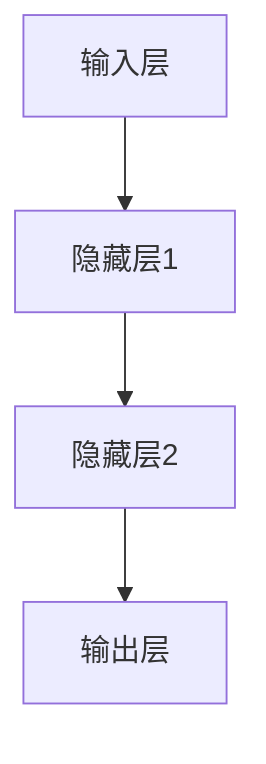

##### 2.1.2 常见的深度学习架构

常见的深度学习架构包括卷积神经网络（CNN）、循环神经网络（RNN）、变换器（Transformer）等。每种架构都有其特定的应用场景和优势。

1. **卷积神经网络（CNN）**：适用于图像处理和计算机视觉任务。
2. **循环神经网络（RNN）**：适用于序列数据处理，如自然语言处理和时间序列预测。
3. **变换器（Transformer）**：适用于自然语言处理和序列建模，是GPT-3等大模型的基础架构。

##### 2.1.3 深度学习优化算法

深度学习优化算法用于调整模型参数，以提高模型性能。常用的优化算法包括随机梯度下降（SGD）、Adam等。

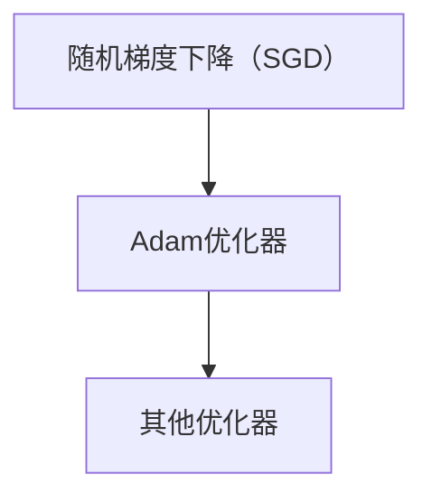

#### 2.2 自然语言处理技术概览

##### 2.2.1 词嵌入技术

词嵌入是将单词转换为向量的技术，用于处理文本数据。常见的词嵌入方法包括Word2Vec、GloVe等。

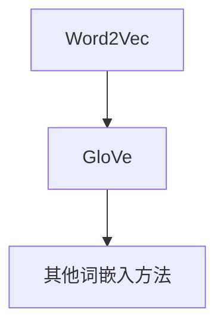

##### 2.2.2 序列模型与注意力机制

序列模型（如RNN）和注意力机制（Attention）是自然语言处理的关键技术。注意力机制能够使模型在处理序列数据时关注重要的部分，从而提高模型的性能。

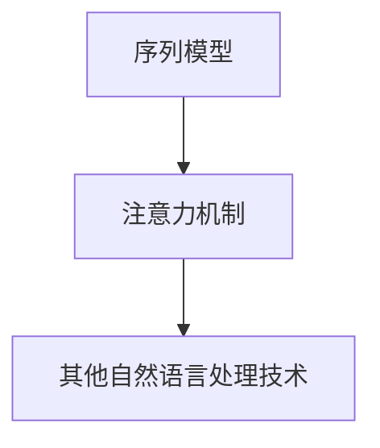

##### 2.2.3 转换器架构详解

转换器（Transformer）是自然语言处理的核心架构，其通过多头自注意力机制实现并行计算，显著提高了模型性能。

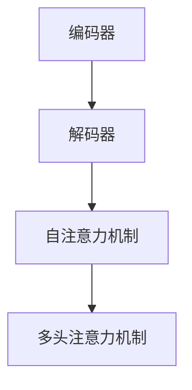

#### 2.3 大规模预训练模型原理

##### 2.3.1 预训练的概念与意义

预训练是指在大规模数据集上对模型进行训练，使其具有通用特征。预训练的意义在于，通过无监督学习的方式，模型能够自动学习到大量有用的知识，从而提高其性能。

##### 2.3.2 自监督学习方法

自监督学习是一种无监督学习方法，通过利用未标注的数据进行训练。自监督学习在大规模预训练中具有重要意义。

##### 2.3.3 迁移学习与微调技术

迁移学习是指将预训练模型的知识迁移到特定任务中。微调技术是一种迁移学习方法，通过在特定任务上对预训练模型进行少量训练，以提高模型在该任务上的性能。

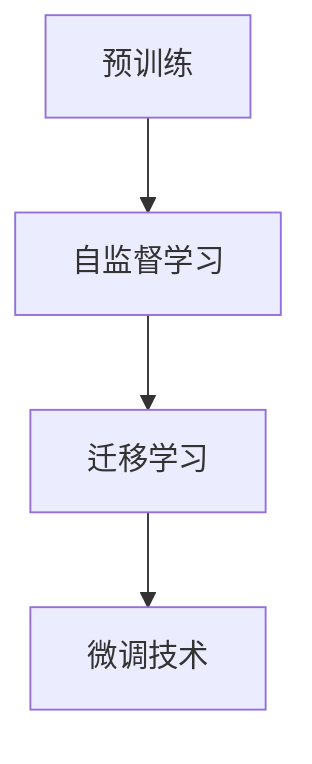

## 第二部分：AI大模型应用

### 第3章：AI大模型在企业中的应用

#### 3.1 AI大模型在金融行业的应用

##### 3.1.1 风险评估与预测

AI大模型在金融行业中的风险评估与预测方面具有重要作用。通过分析大量历史数据，模型可以预测投资者的风险承受能力和投资回报。

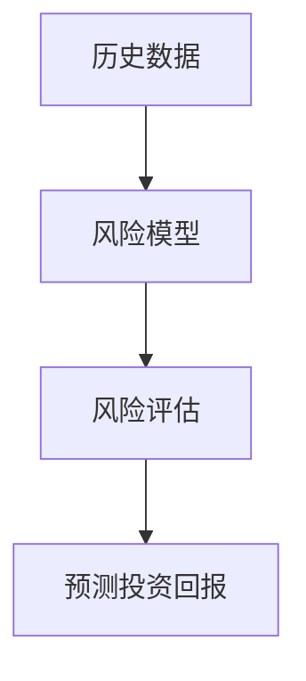

##### 3.1.2 量化交易

AI大模型在量化交易中的应用，包括股票预测、交易信号生成等。通过分析市场数据，模型可以预测股票价格走势，为投资者提供交易策略。

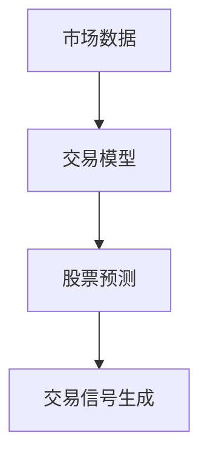

##### 3.1.3 信贷审批

AI大模型在信贷审批中的应用，包括信用评分、欺诈检测等。通过分析客户的信用记录和交易行为，模型可以预测客户的信用风险，从而提高审批效率。

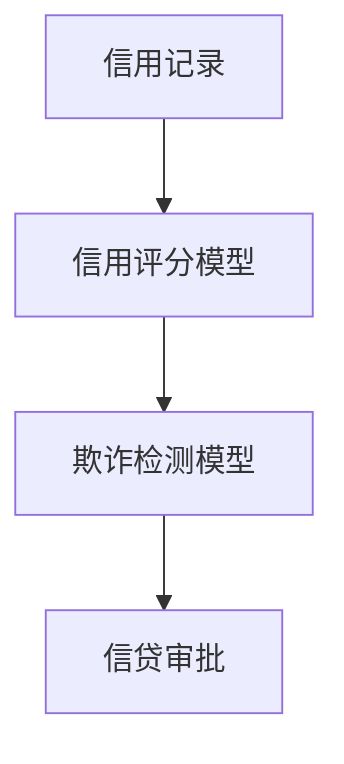

#### 3.2 AI大模型在医疗健康领域的应用

##### 3.2.1 疾病预测与诊断

AI大模型在疾病预测与诊断中的应用，包括疾病风险预测、疾病诊断等。通过分析患者的病历和检查数据，模型可以预测疾病的发生风险，为医生提供诊断依据。

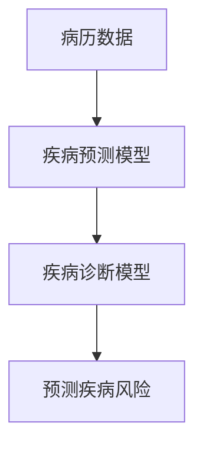

##### 3.2.2 药物研发

AI大模型在药物研发中的应用，包括药物筛选、药物设计等。通过分析药物的结构和生物信息，模型可以预测药物的疗效和毒性，为药物研发提供指导。

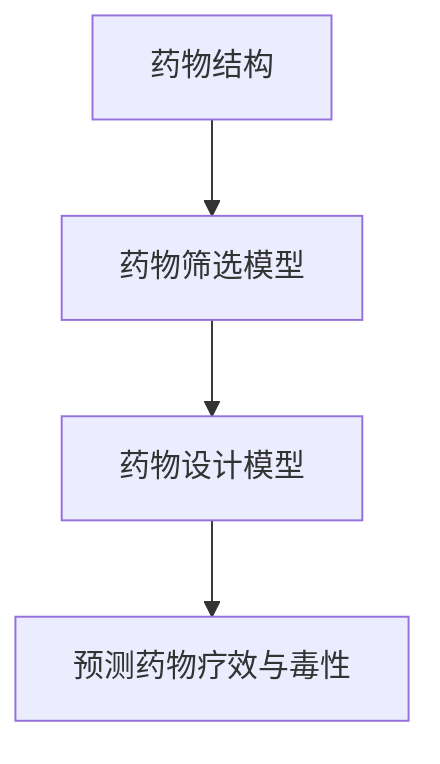

##### 3.2.3 医疗资源优化

AI大模型在医疗资源优化中的应用，包括医院运营优化、医疗设备管理等。通过分析医疗数据，模型可以优化医院的运营效率，提高医疗资源的利用效率。

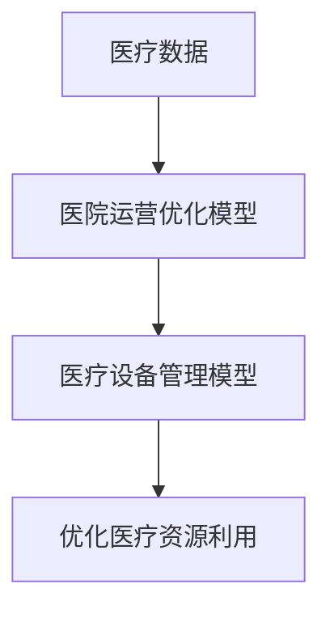

#### 3.3 AI大模型在零售行业的应用

##### 3.3.1 客户行为分析

AI大模型在客户行为分析中的应用，包括客户画像、客户需求预测等。通过分析客户的历史交易数据和在线行为，模型可以了解客户的偏好和需求，为零售企业提供营销策略。

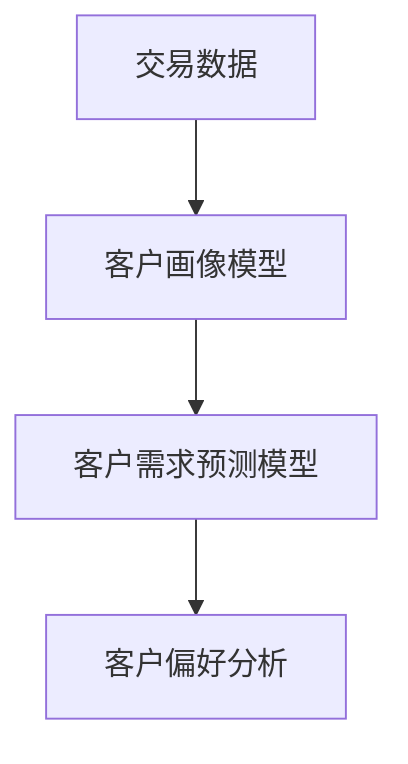

##### 3.3.2 商品推荐系统

AI大模型在商品推荐系统中的应用，包括商品推荐、购物篮分析等。通过分析用户的历史购买数据和商品属性，模型可以推荐用户可能感兴趣的商品，提高用户的购物体验。

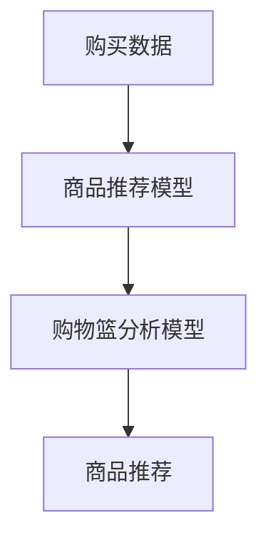

##### 3.3.3 库存管理

AI大模型在库存管理中的应用，包括库存预测、库存优化等。通过分析销售数据和市场需求，模型可以预测商品的库存需求，为零售企业优化库存管理。

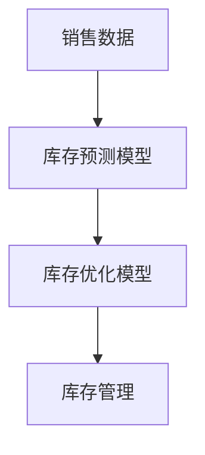

### 第4章：AI大模型创业实践

#### 4.1 创业机会分析

##### 4.1.1 行业趋势与机遇

AI大模型在多个行业中的广泛应用，为创业者提供了丰富的创业机会。随着技术的不断进步和应用的深入，AI大模型在金融、医疗、零售等行业的市场前景广阔。

##### 4.1.2 市场竞争分析

在AI大模型创业领域，市场竞争日益激烈。创业者需要关注行业领导者，分析其优势和劣势，找准自身的定位和差异化竞争力。

##### 4.1.3 创业团队建设

创业团队是创业成功的关键。创业者需要组建一支具备技术、市场、运营等多方面能力的团队，共同推进项目的发展。

#### 4.2 产品设计与开发

##### 4.2.1 需求分析与产品设计

产品设计和开发的第一步是需求分析。创业者需要深入了解目标用户的需求，设计出具有市场竞争力、用户体验优秀的产品。

##### 4.2.2 技术选型与架构设计

技术选型与架构设计是产品开发的核心环节。创业者需要根据产品需求，选择合适的AI大模型架构和开发工具，确保产品的性能和稳定性。

##### 4.2.3 开发流程与工具

开发流程与工具是确保产品按时交付的关键。创业者需要建立高效的开发流程，选择合适的开发工具和框架，提高开发效率。

#### 4.3 运营与推广

##### 4.3.1 运营策略与用户增长

运营策略是产品成功的重要因素。创业者需要制定合理的运营策略，通过线上线下活动、用户运营等方式，提高用户增长和活跃度。

##### 4.3.2 市场营销与品牌建设

市场营销与品牌建设是提升产品知名度的重要手段。创业者需要通过多种渠道进行市场营销，塑造品牌形象，提高市场竞争力。

##### 4.3.3 风险管理与应对策略

风险管理与应对策略是保证企业稳定发展的重要环节。创业者需要识别潜在风险，制定应对策略，确保企业在面对挑战时能够迅速应对。

### 第5章：AI大模型安全与伦理

#### 5.1 AI大模型安全

##### 5.1.1 数据安全与隐私保护

数据安全与隐私保护是AI大模型面临的重要挑战。创业者需要采取有效的数据保护措施，确保用户数据的安全和隐私。

##### 5.1.2 模型安全性与攻击防御

模型安全性与攻击防御是AI大模型面临的重要问题。创业者需要关注模型的安全性问题，采取有效的攻击防御措施，确保模型的安全性。

##### 5.1.3 安全开发与测试

安全开发与测试是确保AI大模型安全的重要环节。创业者需要在开发过程中关注安全，通过测试和审查确保产品的安全性。

#### 5.2 AI大模型伦理

##### 5.2.1 伦理问题的来源与影响

AI大模型伦理问题的来源包括算法偏见、隐私侵犯、数据滥用等。这些问题可能对用户和社会产生负面影响。

##### 5.2.2 AI伦理原则与实践

AI伦理原则包括公正性、透明性、可解释性等。创业者需要遵循这些原则，确保AI大模型的应用符合伦理要求。

##### 5.2.3 伦理教育与监管政策

伦理教育与监管政策是推动AI大模型伦理发展的重要手段。创业者需要关注伦理教育和监管政策，提高自身和社会的伦理意识。

### 第6章：AI大模型前沿技术

#### 6.1 新一代AI大模型

##### 6.1.1 Transformer模型

Transformer模型是新一代AI大模型的核心架构。其通过多头自注意力机制实现并行计算，具有很高的性能和灵活性。

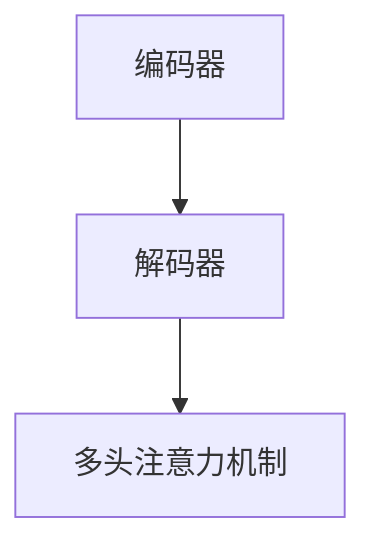

##### 6.1.2 GPT-3与更大规模模型

GPT-3是当前最大的自然语言处理模型，具有1750亿个参数。更大规模模型的研发是AI大模型领域的重要研究方向。

##### 6.1.3 大模型在不同领域的应用

大模型在不同领域的应用包括自然语言处理、计算机视觉、语音识别等。通过结合不同领域的技术，大模型可以解决更复杂的任务。

#### 6.2 多模态AI

##### 6.2.1 图像与文本融合

图像与文本融合是多模态AI的重要研究方向。通过结合图像和文本数据，模型可以更好地理解和生成信息。

##### 6.2.2 语音与文本转换

语音与文本转换是语音识别和语音合成的关键技术。通过结合语音和文本数据，模型可以实现更准确的语音识别和语音合成。

##### 6.2.3 多模态数据的预处理与融合

多模态数据的预处理与融合是多模态AI的重要环节。通过有效的预处理和融合方法，模型可以更好地理解和利用多模态数据。

### 第7章：未来展望

#### 7.1 AI大模型的发展趋势

##### 7.1.1 技术进步与创新

随着计算能力的提升和算法的优化，AI大模型的技术水平将不断提高。未来，更大规模、更智能的AI大模型将不断涌现。

##### 7.1.2 行业应用拓展

AI大模型将在更多行业中得到应用，推动各行各业的数字化、智能化转型。例如，AI大模型在智能制造、智慧城市等领域的应用前景广阔。

##### 7.1.3 社会影响与挑战

AI大模型的发展将带来巨大的社会影响。同时，也需要关注其可能带来的伦理、隐私等问题，确保技术的健康发展。

#### 7.2 AI大模型创业建议

##### 7.2.1 创业方向选择

创业者需要关注AI大模型在不同领域的应用，选择具有市场潜力的创业方向。

##### 7.2.2 创业资源整合

创业者需要整合技术、市场、资金等资源，确保创业项目的顺利推进。

##### 7.2.3 创业成功要素

创业成功需要创业者具备技术能力、市场洞察力、团队协作能力等。同时，还需要关注产品的用户体验和市场的需求。

### 附录

#### 附录A：AI大模型开发资源

##### A.1 开发工具与框架

包括TensorFlow、PyTorch等开发工具和框架，为AI大模型的开发提供了便利。

##### A.2 开源数据集

包括ImageNet、COCO等开源数据集，为AI大模型的研究和应用提供了丰富的数据资源。

##### A.3 学习资源与教程

包括在线课程、书籍、技术博客等学习资源，为AI大模型的学习和实践提供了指导。

#### 附录B：AI大模型常见问题解答

##### B.1 模型训练相关问题

包括模型训练的时间、资源消耗、优化策略等。

##### B.2 模型优化相关问题

包括模型参数优化、算法优化、模型压缩等。

##### B.3 应用部署相关问题

包括模型部署的环境配置、性能优化、安全性等。

## 作者信息

**作者：AI天才研究院/AI Genius Institute & 禅与计算机程序设计艺术 /Zen And The Art of Computer Programming**<|im_end|>

