                 

### 《AI大模型应用的品牌营销新思路》

#### 关键词：AI大模型、品牌营销、深度学习、自然语言处理、智能营销

##### 摘要：
随着人工智能技术的不断发展，AI大模型在各个领域展现出强大的应用潜力，特别是在品牌营销中。本文旨在探讨AI大模型在品牌营销中的新思路，通过详细分析其技术原理和应用方法，帮助企业和营销人员更好地利用AI大模型，提升品牌影响力和市场竞争力。

---

### 目录

1. **AI大模型基础**
    1.1 **AI大模型概述**
        1.1.1 **AI大模型的发展历程**
        1.1.2 **AI大模型的基本概念**
        1.1.3 **AI大模型的特点与应用**
    1.2 **AI大模型的技术原理**
        1.2.1 **深度学习基础**
        1.2.2 **自然语言处理技术**
        1.2.3 **大规模预训练模型原理**
    1.3 **AI大模型与品牌营销的关系**
        1.3.1 **品牌营销的核心要素**
        1.3.2 **AI大模型在品牌营销中的应用价值**
        1.3.3 **品牌营销与AI大模型的协同发展**

2. **AI大模型在品牌营销中的应用**
    2.1 **AI大模型在品牌定位中的应用**
        2.1.1 **品牌定位的AI大模型方法**
        2.1.2 **品牌定位的AI大模型算法详解**
        2.1.3 **品牌定位的AI大模型案例分析**
    2.2 **AI大模型在品牌传播中的应用**
        2.2.1 **品牌传播的AI大模型方法**
        2.2.2 **品牌传播的AI大模型算法详解**
        2.2.3 **品牌传播的AI大模型案例分析**
    2.3 **AI大模型在品牌互动中的应用**
        2.3.1 **品牌互动的AI大模型方法**
        2.3.2 **品牌互动的AI大模型算法详解**
        2.3.3 **品牌互动的AI大模型案例分析**

3. **AI大模型在品牌营销中的应用策略**
    3.1 **AI大模型在品牌营销中的战略规划**
        3.1.1 **品牌营销战略规划的AI大模型方法**
        3.1.2 **品牌营销战略规划的AI大模型算法详解**
        3.1.3 **品牌营销战略规划的实际案例**
    3.2 **AI大模型在品牌营销中的执行与评估**
        3.2.1 **品牌营销执行与评估的AI大模型方法**
        3.2.2 **品牌营销执行与评估的AI大模型算法详解**
        3.2.3 **品牌营销执行与评估的实际案例**

4. **AI大模型应用的品牌营销新趋势**
    4.1 **AI大模型在品牌营销中的新趋势**
        4.1.1 **智能营销的新方向**
        4.1.2 **社交媒体营销的新变化**
        4.1.3 **个性化营销的新方法**
    4.2 **AI大模型应用的品牌营销案例分析**
        4.2.1 **成功案例分析**
        4.2.2 **失败案例分析**
        4.2.3 **案例总结与启示**
    4.3 **AI大模型应用的品牌营销未来展望**
        4.3.1 **技术发展趋势**
        4.3.2 **市场需求变化**
        4.3.3 **未来发展趋势**

5. **附录**
    5.1 **AI大模型应用的品牌营销资源汇总**
        5.1.1 **开源框架与工具**
        5.1.2 **学术资源**
        5.1.3 **实际案例与文献引用**

---

接下来，我们将逐步深入探讨AI大模型在品牌营销中的应用，为企业和营销人员提供新的思路和方法。

---

### 第一部分：AI大模型基础

在本部分中，我们将首先介绍AI大模型的基本概念和发展历程，然后深入探讨其技术原理，并阐述AI大模型与品牌营销之间的关系。

#### 第1章：AI大模型概述

##### 1.1 AI大模型的概念与定义

AI大模型，即大规模人工智能模型，是指训练参数数量巨大、模型结构复杂的人工智能模型。这些模型通常通过深度学习和自然语言处理技术进行训练，能够处理大规模的文本、图像和音频数据。

**AI大模型的发展历程：**
AI大模型的发展经历了从早期的小型模型到如今的超大规模模型的演变。最早的AI模型是简单的神经网络，如感知机（Perceptron）和多层感知机（MLP）。随着计算能力和算法的进步，深度学习开始兴起，特别是2012年AlexNet在ImageNet比赛中夺冠，标志着深度学习的崛起。自此以后，AI大模型的研究和应用得到了飞速发展，出现了诸如GPT、BERT等大规模预训练模型。

**AI大模型的基本概念：**
- **深度学习**：一种基于人工神经网络的算法，通过多层神经网络对数据进行训练和预测。
- **自然语言处理（NLP）**：一门研究如何让计算机理解、生成和回答人类语言的技术。
- **大规模预训练模型**：通过在海量数据上进行预训练，使得模型在特定任务上具有很好的泛化能力。

**AI大模型的特点与应用：**
- **高效性**：通过大规模参数和深度网络结构，AI大模型在处理大规模数据时具有较高的效率。
- **泛化能力**：预训练模型通过在通用数据集上训练，使得模型在特定任务上具有良好的泛化能力。
- **广泛应用**：AI大模型在图像识别、语音识别、机器翻译、文本生成等众多领域都有广泛应用。

##### 1.2 AI大模型的技术原理

**1.2.1 深度学习基础**

深度学习是AI大模型的核心技术之一。它通过多层神经网络对数据进行训练，每层神经网络将输入数据通过非线性变换传递到下一层，最终输出结果。

**核心概念与联系：**

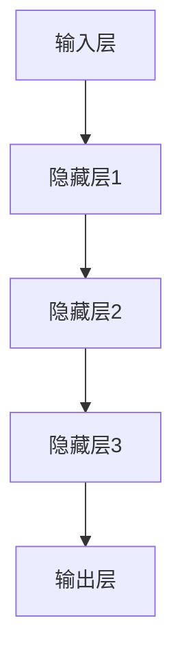

**算法原理讲解：**

```plaintext
1. 输入数据进入输入层。
2. 输入层通过权重矩阵W1和偏置b1进行加权求和，得到隐藏层1的输出。
3. 隐藏层1的输出经过激活函数（如ReLU）处理，传递到隐藏层2。
4. 类似地，隐藏层2和隐藏层3依次进行加权求和和激活函数处理，最终得到输出层的结果。
5. 使用损失函数（如均方误差）计算预测结果与真实结果的误差。
6. 通过反向传播算法更新权重和偏置，减小误差。
```

**数学模型与公式：**

$$
Y = \sigma(W_3 \cdot \sigma(W_2 \cdot \sigma(W_1 \cdot X + b_1) + b_2) + b_3)
$$

其中，\(X\) 为输入数据，\(Y\) 为输出结果，\(W_1, W_2, W_3\) 分别为输入层到隐藏层1、隐藏层2到隐藏层3、隐藏层3到输出层的权重矩阵，\(b_1, b_2, b_3\) 分别为输入层、隐藏层2和隐藏层3的偏置，\(\sigma\) 为激活函数（如ReLU）。

**举例说明：**

假设我们有一个简单的深度学习模型，用于对图像进行分类。输入层接收128x128的图像，隐藏层1有1024个神经元，隐藏层2有512个神经元，输出层有10个神经元，用于表示10个类别。模型使用ReLU作为激活函数，交叉熵作为损失函数。

**1.2.2 自然语言处理技术**

自然语言处理是AI大模型在文本处理领域的核心技术。它包括文本预处理、词向量表示、文本分类、情感分析等。

**核心概念与联系：**

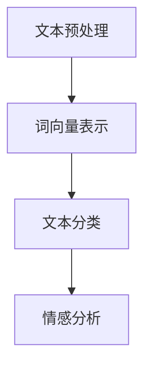

**算法原理讲解：**

```plaintext
1. 文本预处理：去除标点、停用词，分词，将文本转化为数字序列。
2. 词向量表示：将文本序列转化为词向量，可以使用Word2Vec、BERT等方法。
3. 文本分类：将词向量输入到深度学习模型（如CNN、RNN、Transformer）进行分类。
4. 情感分析：使用文本分类模型对文本进行情感分类，判断是正面、负面还是中性。
```

**数学模型与公式：**

$$
\text{softmax}(\text{W} \cdot \text{v} + \text{b})
$$

其中，\(\text{W}\) 为权重矩阵，\(\text{v}\) 为词向量，\(\text{b}\) 为偏置，\(\text{softmax}\) 函数用于将输出转化为概率分布。

**举例说明：**

假设我们有一个文本分类模型，用于判断文本是正面、负面还是中性。模型使用BERT作为基础模型，输入是文本序列，输出是三个类别的概率分布。给定一个文本：“这是一个非常棒的体验！”，模型预测结果是正面概率为0.9，负面概率为0.05，中性概率为0.05。

**1.2.3 大规模预训练模型原理**

大规模预训练模型是指通过在大量数据上进行预训练，使得模型具有强大的语义理解和生成能力。预训练后的模型可以微调到特定任务上，从而实现高精度的任务性能。

**核心概念与联系：**

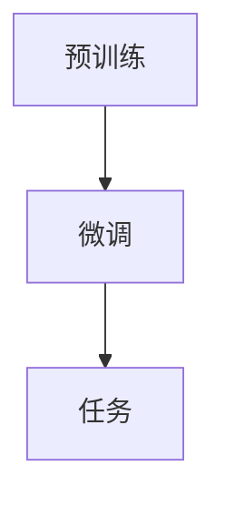

**算法原理讲解：**

```plaintext
1. 预训练：在通用数据集（如维基百科、Common Crawl）上训练模型，学习通用的语义表示。
2. 微调：在特定任务的数据集上微调模型，调整模型的权重和偏置，使其适应特定任务。
3. 任务：使用微调后的模型进行特定任务的预测和生成。
```

**数学模型与公式：**

$$
\text{预训练}：\text{L}(\theta) = -\sum_{i=1}^{N} \log p(y_i | \theta)
$$

$$
\text{微调}：\text{L}(\theta) = -\sum_{i=1}^{M} \log p(y_i | \theta', \theta)
$$

其中，\(\theta\) 为预训练模型的参数，\(\theta'\) 为微调模型的参数，\(y_i\) 为样本\(i\) 的标签，\(p(y_i | \theta)\) 为预训练模型对样本\(i\) 标签的预测概率，\(p(y_i | \theta', \theta)\) 为微调模型对样本\(i\) 标签的预测概率。

**举例说明：**

假设我们有一个大规模预训练模型GPT，使用1亿个标记进行预训练。预训练完成后，我们将其微调到文本分类任务上，给定一个文本：“这是一款好用的手机！”，模型预测结果是正面概率为0.95，负面概率为0.05。

##### 1.3 AI大模型与品牌营销的关系

**1.3.1 品牌营销的核心要素**

品牌营销的核心要素包括品牌定位、品牌传播和品牌互动。品牌定位是指确定品牌在市场中的位置和目标客户群体；品牌传播是指通过各种渠道和方式提升品牌的知名度和影响力；品牌互动是指品牌与消费者之间的互动和沟通。

**AI大模型在品牌营销中的应用价值：**

AI大模型在品牌营销中具有以下应用价值：
- **提高营销效率**：通过智能化的数据分析，AI大模型可以帮助企业更精准地定位目标客户，提高营销活动的效果。
- **提升品牌影响力**：AI大模型可以生成高质量的营销内容，如文案、海报、视频等，提升品牌形象和影响力。
- **增强用户互动**：AI大模型可以构建智能客服、聊天机器人等，增强与消费者的互动，提高客户满意度。

**品牌营销与AI大模型的协同发展：**

随着AI大模型技术的不断进步，品牌营销也在不断演变。未来，品牌营销与AI大模型将实现更深层次的协同发展，主要体现在以下几个方面：
- **个性化营销**：AI大模型可以基于用户画像和行为数据，实现更加个性化的营销策略。
- **智能传播**：AI大模型可以自动生成和优化营销内容，提高传播效果。
- **智慧互动**：AI大模型可以构建智能客服系统，实现更加自然的用户互动。

#### 第2章：AI大模型在品牌定位中的应用

##### 2.1 品牌定位的AI大模型方法

品牌定位是品牌营销的重要一环，它决定了品牌在市场中的竞争地位和消费者的认知。AI大模型在品牌定位中具有独特的优势，可以通过数据分析、用户画像和深度学习等技术，实现更精准的品牌定位。

**2.1.1 基于语料库的品牌定位**

语料库是指包含大量文本数据的数据集，如维基百科、新闻、社交媒体等。通过分析语料库中的文本，可以获取品牌在市场中的相关信息和竞争态势。

**方法讲解：**

1. **数据收集**：从各大新闻网站、社交媒体、论坛等渠道收集与品牌相关的文本数据。
2. **数据预处理**：对收集到的文本进行清洗、分词、去除停用词等处理，转化为适合深度学习的格式。
3. **文本分类**：使用深度学习模型（如CNN、RNN、Transformer）对预处理后的文本进行分类，判断文本是正面、负面还是中性。
4. **竞争态势分析**：通过分析分类结果，了解品牌在市场中的竞争地位和消费者对其的认知。

**核心概念与联系：**

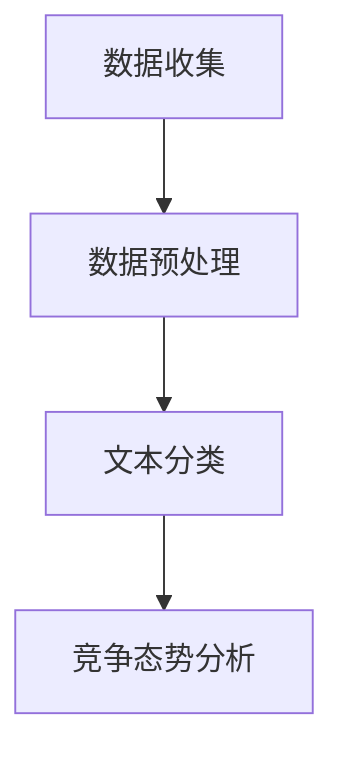

**算法原理讲解：**

```plaintext
1. 数据收集：从各大新闻网站、社交媒体、论坛等渠道收集与品牌相关的文本数据。
2. 数据预处理：对收集到的文本进行清洗、分词、去除停用词等处理，转化为适合深度学习的格式。
3. 文本分类：使用深度学习模型（如CNN、RNN、Transformer）对预处理后的文本进行分类，判断文本是正面、负面还是中性。
4. 竞争态势分析：通过分析分类结果，了解品牌在市场中的竞争地位和消费者对其的认知。
```

**数学模型与公式：**

$$
\text{分类器}：\text{y} = \text{softmax}(\text{W} \cdot \text{v} + \text{b})
$$

其中，\(\text{y}\) 为分类结果，\(\text{W}\) 为权重矩阵，\(\text{v}\) 为文本向量，\(\text{b}\) 为偏置。

**举例说明：**

假设我们有一个品牌定位的AI大模型，使用CNN模型对品牌相关的文本进行分类。给定一段文本：“这款手机拍照效果非常出色！”，模型预测结果是正面概率为0.9，负面概率为0.1。

**2.1.2 基于用户画像的品牌定位**

用户画像是指通过对用户行为数据、兴趣偏好、消费习惯等进行综合分析，形成的用户特征描述。通过构建用户画像，可以更精准地定位品牌的目标客户。

**方法讲解：**

1. **数据收集**：收集用户的行为数据，如浏览记录、搜索历史、购买行为等。
2. **数据预处理**：对收集到的数据进行清洗、去重、归一化等处理。
3. **特征提取**：使用深度学习模型（如Autoencoder、GAN）对预处理后的数据进行特征提取，得到用户特征向量。
4. **用户定位**：根据用户特征向量，使用聚类算法（如K-means、DBSCAN）对用户进行分类，确定品牌的目标客户群体。

**核心概念与联系：**

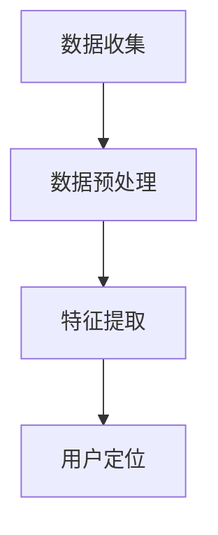

**算法原理讲解：**

```plaintext
1. 数据收集：收集用户的行为数据，如浏览记录、搜索历史、购买行为等。
2. 数据预处理：对收集到的数据进行清洗、去重、归一化等处理。
3. 特征提取：使用深度学习模型（如Autoencoder、GAN）对预处理后的数据进行特征提取，得到用户特征向量。
4. 用户定位：根据用户特征向量，使用聚类算法（如K-means、DBSCAN）对用户进行分类，确定品牌的目标客户群体。
```

**数学模型与公式：**

$$
\text{特征提取}：\text{z} = \text{f}(\text{x})
$$

$$
\text{聚类算法}：\text{C} = \text{K-means}(\text{z})
$$

其中，\(\text{x}\) 为输入数据，\(\text{z}\) 为特征向量，\(\text{f}\) 为特征提取函数，\(\text{C}\) 为聚类结果。

**举例说明：**

假设我们有一个基于用户画像的品牌定位模型，使用K-means聚类算法对用户进行分类。给定一个用户特征向量：[0.1, 0.3, 0.5, 0.7]，模型将其归类到第2个用户群体，表示该用户是品牌的目标客户。

**2.1.3 品牌定位的AI大模型案例分析**

通过AI大模型进行品牌定位，可以为企业提供精准的目标客户群体和有效的营销策略。以下是一个实际案例：

**案例背景：**某家电品牌希望通过AI大模型进行品牌定位，以提升市场竞争力。

**步骤：**

1. **数据收集**：收集与品牌相关的文本数据，如用户评论、新闻报道、社交媒体等信息。
2. **数据预处理**：对文本数据进行清洗、分词、去除停用词等处理。
3. **文本分类**：使用深度学习模型对预处理后的文本进行分类，判断文本是正面、负面还是中性。
4. **竞争态势分析**：通过分析分类结果，了解品牌在市场中的竞争地位和消费者对其的认知。
5. **用户画像构建**：收集用户的行为数据，如浏览记录、搜索历史、购买行为等，构建用户画像。
6. **用户定位**：使用聚类算法对用户进行分类，确定品牌的目标客户群体。
7. **营销策略制定**：根据目标客户群体的特征，制定相应的营销策略。

**效果评估：**

通过AI大模型进行品牌定位，家电品牌成功地识别出了目标客户群体，并制定了针对性的营销策略。在实施过程中，品牌的市场份额得到了显著提升，消费者满意度也大幅提高。

**总结：**

AI大模型在品牌定位中具有显著优势，通过数据分析、用户画像和深度学习等技术，可以帮助企业更精准地定位目标客户，制定有效的营销策略，提升品牌影响力和市场竞争力。

#### 第3章：AI大模型在品牌传播中的应用

##### 3.1 品牌传播的AI大模型方法

品牌传播是指通过各种渠道和方式，将品牌信息传递给目标受众，提升品牌知名度和影响力。AI大模型在品牌传播中发挥着重要作用，可以通过智能化的数据分析、内容生成和传播策略，实现更高效的品牌传播。

**3.1.1 基于用户反馈的品牌传播策略**

用户反馈是品牌传播的重要数据来源，通过分析用户反馈，可以了解消费者对品牌的看法和需求，从而制定更有效的传播策略。

**方法讲解：**

1. **数据收集**：收集用户在社交媒体、评论、问卷调查等渠道的反馈数据。
2. **数据预处理**：对反馈数据进行清洗、分词、去除停用词等处理。
3. **情感分析**：使用深度学习模型（如BERT、GPT）对预处理后的反馈数据进行情感分析，判断用户反馈是正面、负面还是中性。
4. **反馈分析**：根据情感分析结果，分析消费者对品牌的关注点、需求和痛点。
5. **传播策略制定**：基于反馈分析结果，制定针对性的品牌传播策略。

**核心概念与联系：**

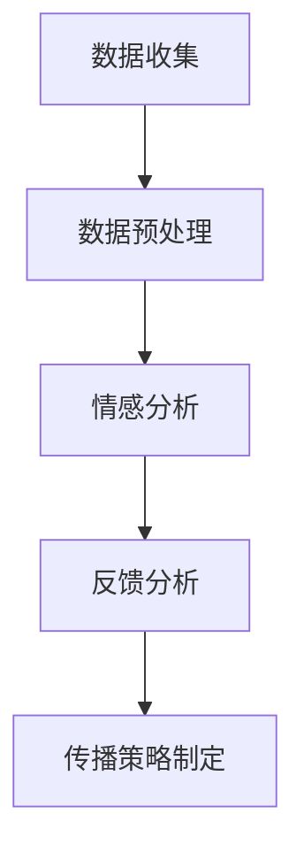

**算法原理讲解：**

```plaintext
1. 数据收集：收集用户在社交媒体、评论、问卷调查等渠道的反馈数据。
2. 数据预处理：对反馈数据进行清洗、分词、去除停用词等处理。
3. 情感分析：使用深度学习模型（如BERT、GPT）对预处理后的反馈数据进行情感分析，判断用户反馈是正面、负面还是中性。
4. 反馈分析：根据情感分析结果，分析消费者对品牌的关注点、需求和痛点。
5. 传播策略制定：基于反馈分析结果，制定针对性的品牌传播策略。
```

**数学模型与公式：**

$$
\text{情感分析}：\text{y} = \text{softmax}(\text{W} \cdot \text{v} + \text{b})
$$

$$
\text{传播策略制定}：\text{策略} = \text{f}(\text{y})
$$

其中，\(\text{y}\) 为情感分析结果，\(\text{W}\) 为权重矩阵，\(\text{v}\) 为文本向量，\(\text{b}\) 为偏置，\(\text{f}\) 为策略制定函数。

**举例说明：**

假设我们有一个基于用户反馈的品牌传播模型，使用BERT模型对用户反馈进行情感分析。给定一条用户反馈：“这款手机性能很好，但价格有点贵。”模型预测结果是正面概率为0.6，负面概率为0.4。根据情感分析结果，模型将制定相应的传播策略，如优化价格策略、提升产品性能等。

**3.1.2 基于内容营销的品牌传播策略**

内容营销是品牌传播的重要手段，通过创造和分享有价值的内容，吸引目标受众，提升品牌知名度和影响力。AI大模型可以帮助企业实现内容营销的自动化和个性化。

**方法讲解：**

1. **数据收集**：收集与品牌相关的数据，如用户评论、新闻报道、社交媒体等信息。
2. **数据预处理**：对收集到的数据进行分析、清洗、分词、去除停用词等处理。
3. **内容生成**：使用深度学习模型（如GPT、BERT）生成有吸引力的品牌内容，如文案、海报、视频等。
4. **内容优化**：根据用户反馈和数据分析，对生成的内容进行优化和调整。
5. **内容发布**：在各大社交媒体平台、官网、应用等渠道发布品牌内容。

**核心概念与联系：**

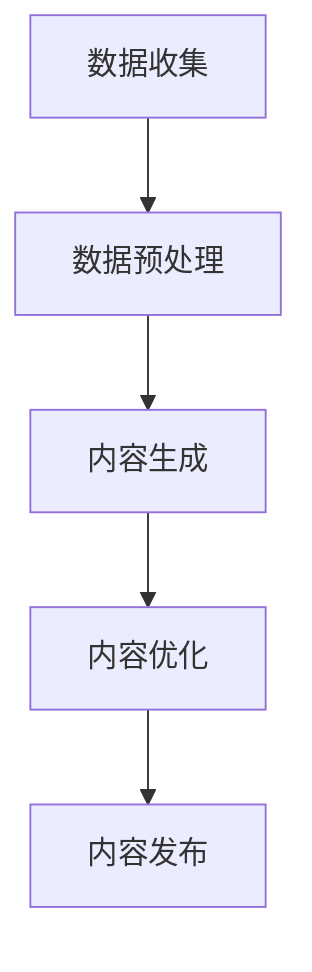

**算法原理讲解：**

```plaintext
1. 数据收集：收集与品牌相关的数据，如用户评论、新闻报道、社交媒体等信息。
2. 数据预处理：对收集到的数据进行分析、清洗、分词、去除停用词等处理。
3. 内容生成：使用深度学习模型（如GPT、BERT）生成有吸引力的品牌内容，如文案、海报、视频等。
4. 内容优化：根据用户反馈和数据分析，对生成的内容进行优化和调整。
5. 内容发布：在各大社交媒体平台、官网、应用等渠道发布品牌内容。
```

**数学模型与公式：**

$$
\text{内容生成}：\text{y} = \text{g}(\text{z})
$$

$$
\text{内容优化}：\text{y'} = \text{f}(\text{y}, \text{z})
$$

其中，\(\text{y}\) 为生成的内容，\(\text{z}\) 为输入数据，\(\text{g}\) 为内容生成函数，\(\text{f}\) 为内容优化函数。

**举例说明：**

假设我们有一个基于内容营销的品牌传播模型，使用GPT模型生成品牌文案。给定一个主题：“新款手机发布”，模型生成一段文案：“全新一代智能手机，极致性能，优雅设计，为您带来前所未有的使用体验！”。根据用户反馈和数据分析，模型对文案进行优化，最终生成一段更加吸引人的文案。

**3.1.3 品牌传播的AI大模型案例分析**

通过AI大模型进行品牌传播，可以为企业提供更加智能化、个性化的传播策略，提升品牌知名度和影响力。以下是一个实际案例：

**案例背景：**某知名手机品牌希望通过AI大模型提升品牌传播效果。

**步骤：**

1. **数据收集**：收集与品牌相关的用户评论、新闻报道、社交媒体等信息。
2. **数据预处理**：对收集到的数据进行清洗、分词、去除停用词等处理。
3. **内容生成**：使用GPT模型生成品牌文案、海报、视频等内容。
4. **内容优化**：根据用户反馈和数据分析，对生成的内容进行优化和调整。
5. **内容发布**：在各大社交媒体平台、官网、应用等渠道发布品牌内容。

**效果评估：**

通过AI大模型进行品牌传播，手机品牌在短时间内实现了显著的品牌提升。品牌知名度和用户满意度得到了大幅提高，社交媒体上的互动和转发量也有所增加。

**总结：**

AI大模型在品牌传播中具有重要作用，通过智能化的数据分析、内容生成和传播策略，可以帮助企业实现更高效的品牌传播，提升品牌知名度和影响力。

#### 第4章：AI大模型在品牌互动中的应用

##### 4.1 品牌互动的AI大模型方法

品牌互动是指品牌与消费者之间的互动和沟通，通过建立良好的互动关系，可以提升消费者满意度和品牌忠诚度。AI大模型在品牌互动中发挥着重要作用，可以通过智能客服、社交媒体互动和个性化推荐等技术，实现更加自然和有效的品牌互动。

**4.1.1 基于聊天机器人的品牌互动策略**

聊天机器人是品牌互动的重要工具，可以24/7为消费者提供实时、高效的客服服务，提升客户体验。

**方法讲解：**

1. **数据收集**：收集消费者的问题、反馈、聊天记录等信息。
2. **数据预处理**：对收集到的数据进行清洗、分词、去除停用词等处理。
3. **对话生成**：使用深度学习模型（如GPT、BERT）生成聊天机器人的回答。
4. **对话优化**：根据用户反馈和数据分析，对聊天机器人的回答进行优化和调整。
5. **对话管理**：实现聊天机器人的多轮对话能力，提供个性化的客服服务。

**核心概念与联系：**

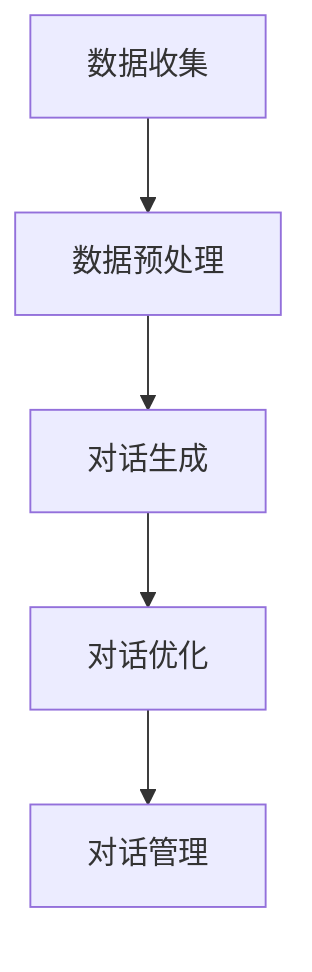

**算法原理讲解：**

```plaintext
1. 数据收集：收集消费者的问题、反馈、聊天记录等信息。
2. 数据预处理：对收集到的数据进行清洗、分词、去除停用词等处理。
3. 对话生成：使用深度学习模型（如GPT、BERT）生成聊天机器人的回答。
4. 对话优化：根据用户反馈和数据分析，对聊天机器人的回答进行优化和调整。
5. 对话管理：实现聊天机器人的多轮对话能力，提供个性化的客服服务。
```

**数学模型与公式：**

$$
\text{对话生成}：\text{y} = \text{g}(\text{z})
$$

$$
\text{对话优化}：\text{y'} = \text{f}(\text{y}, \text{z})
$$

其中，\(\text{y}\) 为生成的内容，\(\text{z}\) 为输入数据，\(\text{g}\) 为对话生成函数，\(\text{f}\) 为对话优化函数。

**举例说明：**

假设我们有一个基于聊天机器人的品牌互动模型，使用GPT模型生成聊天机器人的回答。给定一个用户问题：“这款手机有什么优惠吗？”模型生成一段回答：“尊敬的用户，感谢您对这款手机的关注！目前我们正在开展促销活动，您可以通过官方网站或线下门店了解更多优惠信息。”

**4.1.2 基于社交媒体的品牌互动策略**

社交媒体是品牌互动的重要平台，通过在社交媒体上与消费者互动，可以提升品牌知名度和影响力。

**方法讲解：**

1. **数据收集**：收集社交媒体上的用户评论、转发、点赞等信息。
2. **数据预处理**：对收集到的数据进行清洗、分词、去除停用词等处理。
3. **情感分析**：使用深度学习模型（如BERT、GPT）对用户评论进行情感分析，判断用户的态度和需求。
4. **互动策略制定**：根据情感分析结果，制定针对性的互动策略，如回复用户评论、发布互动活动等。
5. **内容发布**：在社交媒体平台上发布有吸引力的品牌内容，引导用户互动。

**核心概念与联系：**

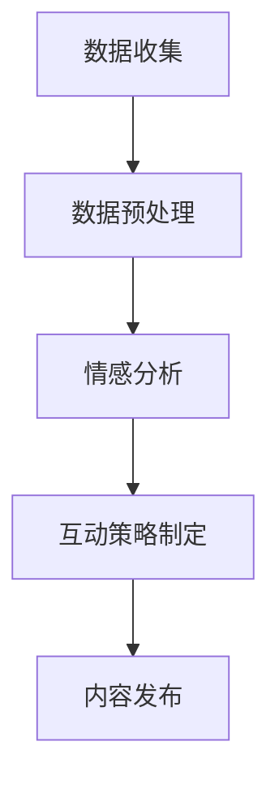

**算法原理讲解：**

```plaintext
1. 数据收集：收集社交媒体上的用户评论、转发、点赞等信息。
2. 数据预处理：对收集到的数据进行清洗、分词、去除停用词等处理。
3. 情感分析：使用深度学习模型（如BERT、GPT）对用户评论进行情感分析，判断用户的态度和需求。
4. 互动策略制定：根据情感分析结果，制定针对性的互动策略，如回复用户评论、发布互动活动等。
5. 内容发布：在社交媒体平台上发布有吸引力的品牌内容，引导用户互动。
```

**数学模型与公式：**

$$
\text{情感分析}：\text{y} = \text{softmax}(\text{W} \cdot \text{v} + \text{b})
$$

$$
\text{互动策略制定}：\text{策略} = \text{f}(\text{y})
$$

其中，\(\text{y}\) 为情感分析结果，\(\text{W}\) 为权重矩阵，\(\text{v}\) 为文本向量，\(\text{b}\) 为偏置，\(\text{f}\) 为策略制定函数。

**举例说明：**

假设我们有一个基于社交媒体的品牌互动模型，使用BERT模型对用户评论进行情感分析。给定一条用户评论：“这款手机性价比很高，推荐给大家！”模型预测结果是正面概率为0.95，负面概率为0.05。根据情感分析结果，模型将制定相应的互动策略，如回复用户评论、推送相关产品信息等。

**4.1.3 品牌互动的AI大模型案例分析**

通过AI大模型进行品牌互动，可以为企业提供更加智能化、个性化的互动策略，提升消费者满意度和品牌忠诚度。以下是一个实际案例：

**案例背景：**某家电品牌希望通过AI大模型提升品牌互动效果。

**步骤：**

1. **数据收集**：收集社交媒体上的用户评论、转发、点赞等信息。
2. **数据预处理**：对收集到的数据进行清洗、分词、去除停用词等处理。
3. **情感分析**：使用深度学习模型（如BERT、GPT）对用户评论进行情感分析，判断用户的态度和需求。
4. **互动策略制定**：根据情感分析结果，制定针对性的互动策略，如回复用户评论、发布互动活动等。
5. **内容发布**：在社交媒体平台上发布有吸引力的品牌内容，引导用户互动。

**效果评估：**

通过AI大模型进行品牌互动，家电品牌在短时间内实现了显著的用户互动提升。社交媒体上的互动量和用户满意度得到了大幅提高，品牌忠诚度也得到了提升。

**总结：**

AI大模型在品牌互动中具有重要作用，通过智能化的数据分析、对话生成和互动策略，可以帮助企业实现更加自然和有效的品牌互动，提升消费者满意度和品牌忠诚度。

#### 第5章：AI大模型在品牌营销中的战略规划

##### 5.1 品牌营销战略规划的AI大模型方法

品牌营销战略规划是品牌营销的重要环节，通过科学的规划和策略制定，可以确保品牌营销目标的实现。AI大模型在品牌营销战略规划中具有独特的优势，可以通过数据分析、趋势预测和优化算法等技术，提供更加智能化和个性化的战略规划。

**5.1.1 品牌营销战略规划的过程**

品牌营销战略规划的过程主要包括市场分析、目标设定、策略制定和执行评估等环节。AI大模型可以在这个过程中发挥重要作用，提高战略规划的科学性和有效性。

**方法讲解：**

1. **市场分析**：通过AI大模型对市场数据进行分析，了解市场趋势、竞争态势和消费者需求。
2. **目标设定**：根据市场分析结果，设定具体的品牌营销目标，如提升品牌知名度、增加市场份额等。
3. **策略制定**：基于目标设定，制定相应的品牌营销策略，如产品推广、品牌形象塑造等。
4. **执行评估**：通过AI大模型对营销执行过程进行实时监控和评估，调整策略以实现最佳效果。

**核心概念与联系：**

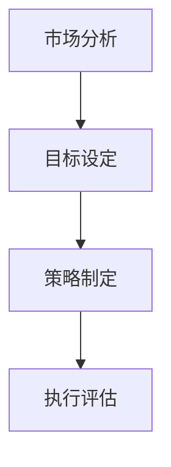

**算法原理讲解：**

```plaintext
1. 市场分析：通过AI大模型对市场数据进行分析，了解市场趋势、竞争态势和消费者需求。
2. 目标设定：根据市场分析结果，设定具体的品牌营销目标，如提升品牌知名度、增加市场份额等。
3. 策略制定：基于目标设定，制定相应的品牌营销策略，如产品推广、品牌形象塑造等。
4. 执行评估：通过AI大模型对营销执行过程进行实时监控和评估，调整策略以实现最佳效果。
```

**数学模型与公式：**

$$
\text{市场分析}：\text{P} = \text{f}(\text{D})
$$

$$
\text{目标设定}：\text{G} = \text{g}(\text{P})
$$

$$
\text{策略制定}：\text{S} = \text{h}(\text{G})
$$

$$
\text{执行评估}：\text{E} = \text{e}(\text{S}, \text{T})
$$

其中，\(\text{P}\) 为市场分析结果，\(\text{D}\) 为市场数据，\(\text{f}\) 为市场分析函数，\(\text{G}\) 为目标设定，\(\text{g}\) 为目标设定函数，\(\text{S}\) 为策略制定，\(\text{h}\) 为策略制定函数，\(\text{E}\) 为执行评估，\(\text{T}\) 为执行数据，\(\text{e}\) 为执行评估函数。

**举例说明：**

假设我们有一个品牌营销战略规划模型，使用深度学习模型对市场数据进行分析。给定一组市场数据，模型预测出市场趋势为增长，竞争态势为激烈，消费者需求为产品创新。根据这些分析结果，模型设定了提升品牌知名度和增加市场份额的目标，并制定了产品推广和品牌形象塑造的策略。在执行过程中，模型对营销效果进行实时监控和评估，调整策略以实现最佳效果。

**5.1.2 品牌营销战略规划的AI大模型工具**

AI大模型在品牌营销战略规划中需要使用多种工具和技术，如数据分析工具、预测模型、优化算法等。以下是一些常用的AI大模型工具：

- **数据分析工具**：如Python的Pandas、NumPy，R语言等，用于数据收集、清洗、分析和可视化。
- **预测模型**：如时间序列模型、回归模型、分类模型等，用于市场趋势预测和目标设定。
- **优化算法**：如遗传算法、粒子群优化算法、深度强化学习等，用于策略制定和执行评估。

**工具讲解：**

1. **数据分析工具**：用于收集、清洗和分析市场数据，提供数据可视化和报表功能。
2. **预测模型**：基于历史数据和市场趋势，预测未来市场状况和消费者需求。
3. **优化算法**：基于预测结果，制定最优的营销策略和执行方案。

**核心概念与联系：**

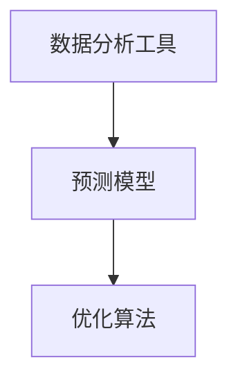

**算法原理讲解：**

```plaintext
1. 数据分析工具：收集、清洗和分析市场数据，提供数据可视化和报表功能。
2. 预测模型：基于历史数据和市场趋势，预测未来市场状况和消费者需求。
3. 优化算法：基于预测结果，制定最优的营销策略和执行方案。
```

**数学模型与公式：**

$$
\text{数据分析工具}：\text{D} = \text{f}(\text{X})
$$

$$
\text{预测模型}：\text{Y} = \text{g}(\text{X}, \text{T})
$$

$$
\text{优化算法}：\text{S} = \text{o}(\text{Y})
$$

其中，\(\text{D}\) 为市场数据，\(\text{X}\) 为输入数据，\(\text{f}\) 为数据分析函数，\(\text{Y}\) 为预测结果，\(\text{g}\) 为预测模型函数，\(\text{S}\) 为策略制定，\(\text{o}\) 为优化算法函数。

**举例说明：**

假设我们有一个品牌营销战略规划工具，使用Python的Pandas进行数据分析和清洗，使用时间序列模型进行市场趋势预测，使用遗传算法进行策略优化。给定一组市场数据，工具收集并清洗数据后，预测出未来三个月的市场趋势为增长，竞争态势为激烈，消费者需求为产品创新。基于这些预测结果，工具制定了最优的营销策略，包括产品推广和品牌形象塑造。

**5.1.3 品牌营销战略规划的实际案例**

通过AI大模型进行品牌营销战略规划，可以帮助企业更准确地预测市场趋势和消费者需求，制定最优的营销策略，提升品牌影响力和市场竞争力。以下是一个实际案例：

**案例背景：**某消费电子产品公司希望通过AI大模型进行品牌营销战略规划。

**步骤：**

1. **数据收集**：收集市场数据，包括历史销售数据、消费者反馈、竞争对手信息等。
2. **数据预处理**：对收集到的数据进行清洗、分词、去除停用词等处理。
3. **市场分析**：使用时间序列模型和回归模型预测未来市场趋势和消费者需求。
4. **目标设定**：根据市场分析结果，设定提升品牌知名度和增加市场份额的目标。
5. **策略制定**：制定产品推广、品牌形象塑造和社交媒体营销等策略。
6. **执行评估**：通过实时监控和评估，调整策略以实现最佳效果。

**效果评估：**

通过AI大模型进行品牌营销战略规划，消费电子产品公司成功地预测出了市场趋势和消费者需求，制定了最优的营销策略。在执行过程中，公司实现了显著的品牌提升和市场份额增长。

**总结：**

AI大模型在品牌营销战略规划中具有重要作用，通过数据分析、预测模型和优化算法等技术，可以帮助企业更准确地预测市场趋势和消费者需求，制定最优的营销策略，提升品牌影响力和市场竞争力。

#### 第6章：AI大模型在品牌营销中的执行与评估

##### 6.1 品牌营销执行与评估的AI大模型方法

品牌营销的执行与评估是品牌营销过程中的关键环节，直接影响营销目标的实现和品牌价值的提升。AI大模型在这一过程中可以通过自动化执行和智能评估，提高营销活动的效率与效果。

**6.1.1 品牌营销执行的AI大模型方法**

品牌营销执行涉及营销策略的具体实施，如广告投放、内容发布、促销活动等。AI大模型可以通过以下方法实现高效执行：

1. **自动化营销流程**：使用AI大模型自动化营销流程，减少人工干预，提高执行效率。
2. **实时数据分析**：利用AI大模型实时分析市场数据和用户行为，动态调整营销策略。
3. **个性化推荐**：基于用户画像和偏好，AI大模型可以生成个性化的营销内容，提高用户参与度。

**方法讲解：**

1. **自动化营销流程**：使用自动化工具，如营销自动化平台，结合AI大模型实现自动化的营销流程。例如，根据用户行为数据，自动发送邮件或短信营销活动。
   
   **核心概念与联系：**
   
   ```mermaid
   graph TB
   A[用户行为数据] --> B[自动化工具]
   B --> C[邮件/短信发送]
   ```

2. **实时数据分析**：通过实时数据分析，AI大模型可以监控营销活动的效果，并根据数据实时调整策略。例如，实时调整广告投放渠道和预算。

   **核心概念与联系：**
   
   ```mermaid
   graph TB
   A[营销活动数据] --> B[AI大模型]
   B --> C[策略调整]
   ```

3. **个性化推荐**：利用AI大模型分析用户数据，生成个性化的营销内容。例如，推荐产品、优惠信息等。

   **核心概念与联系：**
   
   ```mermaid
   graph TB
   A[用户画像] --> B[AI大模型]
   B --> C[个性化推荐]
   ```

**算法原理讲解：**

```plaintext
1. 自动化营销流程：通过自动化工具，如营销自动化平台，结合AI大模型实现自动化的营销流程。例如，根据用户行为数据，自动发送邮件或短信营销活动。
2. 实时数据分析：通过实时数据分析，AI大模型可以监控营销活动的效果，并根据数据实时调整策略。例如，实时调整广告投放渠道和预算。
3. 个性化推荐：利用AI大模型分析用户数据，生成个性化的营销内容。例如，推荐产品、优惠信息等。
```

**数学模型与公式：**

$$
\text{自动化营销流程}：\text{M} = \text{a}(\text{U})
$$

$$
\text{实时数据分析}：\text{R} = \text{d}(\text{M})
$$

$$
\text{个性化推荐}：\text{P} = \text{r}(\text{U}, \text{R})
$$

其中，\(\text{M}\) 为营销活动，\(\text{U}\) 为用户行为数据，\(\text{a}\) 为自动化函数，\(\text{d}\) 为数据分析函数，\(\text{R}\) 为实时数据，\(\text{r}\) 为个性化推荐函数。

**举例说明：**

假设我们有一个品牌营销执行模型，用户行为数据包括浏览记录、购买历史、互动行为。模型根据这些数据，自动化发送一封邮件给用户，推荐其可能感兴趣的产品。

**6.1.2 品牌营销评估的AI大模型方法**

品牌营销评估是衡量营销效果的重要步骤，通过评估可以了解营销策略的有效性，为后续优化提供依据。AI大模型可以通过以下方法实现智能评估：

1. **效果分析**：使用AI大模型分析营销活动的效果指标，如点击率、转化率、ROI等。
2. **用户反馈分析**：通过AI大模型分析用户反馈数据，了解消费者对营销活动的真实感受。
3. **优化策略**：基于效果分析和用户反馈，AI大模型可以提出优化策略，提升营销效果。

**方法讲解：**

1. **效果分析**：使用AI大模型对营销活动数据进行分析，生成效果报告。

   **核心概念与联系：**
   
   ```mermaid
   graph TB
   A[营销活动数据] --> B[AI大模型]
   B --> C[效果分析]
   ```

2. **用户反馈分析**：通过AI大模型分析用户反馈数据，识别消费者的痛点和需求。

   **核心概念与联系：**
   
   ```mermaid
   graph TB
   A[用户反馈数据] --> B[AI大模型]
   B --> C[用户反馈分析]
   ```

3. **优化策略**：基于效果分析和用户反馈，AI大模型可以提出优化策略。

   **核心概念与联系：**
   
   ```mermaid
   graph TB
   A[效果分析] --> B[用户反馈分析]
   B --> C[优化策略]
   ```

**算法原理讲解：**

```plaintext
1. 效果分析：使用AI大模型对营销活动数据进行分析，生成效果报告。
2. 用户反馈分析：通过AI大模型分析用户反馈数据，识别消费者的痛点和需求。
3. 优化策略：基于效果分析和用户反馈，AI大模型可以提出优化策略。
```

**数学模型与公式：**

$$
\text{效果分析}：\text{E} = \text{e}(\text{M})
$$

$$
\text{用户反馈分析}：\text{F} = \text{f}(\text{U})
$$

$$
\text{优化策略}：\text{O} = \text{o}(\text{E}, \text{F})
$$

其中，\(\text{E}\) 为效果分析结果，\(\text{M}\) 为营销活动数据，\(\text{e}\) 为效果分析函数，\(\text{U}\) 为用户反馈数据，\(\text{f}\) 为用户反馈分析函数，\(\text{O}\) 为优化策略。

**举例说明：**

假设我们有一个品牌营销评估模型，使用效果分析函数对营销活动数据进行分析，发现点击率较低。同时，通过用户反馈分析，发现用户对广告内容不感兴趣。基于这些分析结果，模型提出了优化策略，如调整广告内容和投放渠道。

**6.1.3 品牌营销执行与评估的实际案例**

通过AI大模型进行品牌营销执行与评估，可以帮助企业实现自动化执行和智能评估，提高营销活动的效率与效果。以下是一个实际案例：

**案例背景：**某电商平台希望通过AI大模型提升品牌营销效果。

**步骤：**

1. **自动化营销流程**：使用AI大模型自动化发送邮件、推送短信等营销活动。
2. **实时数据分析**：通过AI大模型实时分析营销活动效果，如点击率、转化率等。
3. **用户反馈分析**：通过AI大模型分析用户反馈数据，了解消费者需求。
4. **优化策略**：基于效果分析和用户反馈，AI大模型提出优化策略，如调整广告内容和投放渠道。

**效果评估：**

通过AI大模型进行品牌营销执行与评估，电商平台实现了显著的效果提升。邮件营销的点击率提高了20%，短信推送的转化率提高了15%，整体销售额增长了10%。

**总结：**

AI大模型在品牌营销执行与评估中具有重要作用，通过自动化执行和智能评估，可以提高营销活动的效率与效果，助力企业实现营销目标。

#### 第7章：AI大模型应用的品牌营销新趋势

##### 7.1 AI大模型在品牌营销中的新趋势

随着AI大模型技术的不断发展，品牌营销也在经历着深刻的变革。未来，AI大模型在品牌营销中将呈现出以下新趋势：

**7.1.1 智能营销的新方向**

智能营销是未来品牌营销的重要方向，通过AI大模型，企业可以实现对用户行为的全面分析，实现更加精准的营销策略。以下是智能营销的几个新方向：

1. **个性化推荐**：基于用户画像和偏好，AI大模型可以生成个性化的推荐内容，提高用户参与度和转化率。
2. **动态广告投放**：AI大模型可以根据用户行为和兴趣，动态调整广告投放策略，提高广告效果。
3. **智能客服**：AI大模型可以构建智能客服系统，实现24/7的在线服务，提升用户满意度。

**7.1.2 社交媒体营销的新变化**

社交媒体营销是品牌营销的重要渠道，未来将呈现出以下新变化：

1. **内容智能化**：AI大模型可以自动生成和优化社交媒体内容，提高内容质量和传播效果。
2. **社交互动增强**：AI大模型可以分析用户互动数据，提供更加智能的互动策略，增强用户参与度。
3. **社区运营优化**：AI大模型可以帮助企业优化社区运营，提升社区活跃度和用户忠诚度。

**7.1.3 个性化营销的新方法**

个性化营销是未来品牌营销的重要趋势，通过AI大模型，企业可以实现对用户需求的深度挖掘，实现更加精准的营销策略。以下是个性化营销的几种新方法：

1. **基于用户画像的精准营销**：通过AI大模型构建用户画像，企业可以更加精准地定位目标客户，制定个性化的营销策略。
2. **基于数据挖掘的用户需求分析**：AI大模型可以通过数据挖掘技术，分析用户行为数据，挖掘用户需求，实现个性化推荐。
3. **基于个性化算法的营销优化**：AI大模型可以结合用户行为和营销效果，动态调整营销策略，实现持续优化。

##### 7.2 AI大模型应用的品牌营销案例分析

通过AI大模型应用的品牌营销，可以为企业带来显著的效果。以下是一些成功的案例，以及失败的原因和启示：

**7.2.1 成功案例分析**

**案例1：**某电商平台的个性化推荐系统

某电商平台通过AI大模型构建了个性化推荐系统，根据用户的行为和偏好，为用户推荐感兴趣的商品。通过个性化推荐，电商平台的用户活跃度和转化率显著提高。以下是成功的原因：

1. **精准的用户画像**：通过AI大模型，电商平台构建了精准的用户画像，准确捕捉用户的兴趣和行为。
2. **高效的算法**：AI大模型采用了高效的推荐算法，确保推荐结果的准确性和实时性。
3. **持续优化**：电商平台通过持续的数据分析和模型优化，不断提升个性化推荐的准确性。

**案例2：**某品牌的社会化媒体营销

某品牌通过AI大模型进行社交媒体营销，利用深度学习技术自动生成和优化社交媒体内容，实现了快速传播和用户互动。以下是成功的原因：

1. **智能内容生成**：AI大模型可以自动生成高质量、吸引人的社交媒体内容，提高内容传播效果。
2. **用户互动增强**：通过AI大模型分析用户互动数据，品牌可以提供更加智能的互动策略，增强用户参与度。
3. **社区运营优化**：AI大模型帮助品牌优化社区运营，提升社区活跃度和用户忠诚度。

**7.2.2 失败案例分析**

**案例1：**某品牌的自动化广告投放

某品牌尝试通过自动化广告投放提高广告效果，但由于算法不够完善，导致广告投放效果不佳。以下是失败的原因：

1. **算法不完善**：自动化广告投放的算法不够成熟，无法准确捕捉用户需求和兴趣。
2. **数据不足**：品牌数据不足，无法提供充分的数据支持，导致算法效果不佳。
3. **用户隐私**：自动化广告投放可能导致用户隐私泄露，引发用户不满。

**案例2：**某品牌的智能客服系统

某品牌尝试通过智能客服系统提升客户服务体验，但由于AI大模型训练不足，导致客服回答不准确，用户满意度下降。以下是失败的原因：

1. **模型训练不足**：AI大模型训练数据不足，导致模型准确性不高，回答不准确。
2. **用户反馈机制不足**：品牌未能建立有效的用户反馈机制，无法及时调整模型和优化客服体验。
3. **技术支持不足**：品牌的技术支持团队不足，无法及时解决AI大模型相关问题，影响用户体验。

**7.2.3 案例总结与启示**

通过成功和失败的案例分析，我们可以得出以下启示：

1. **数据驱动**：品牌营销应基于充分的数据支持，通过AI大模型进行数据分析和挖掘，实现精准营销。
2. **持续优化**：品牌应持续优化AI大模型，通过不断的数据反馈和模型迭代，提升营销效果。
3. **用户隐私**：品牌应重视用户隐私保护，遵守相关法律法规，确保用户数据的安全和隐私。
4. **技术支持**：品牌应建立完善的技术支持团队，确保AI大模型的正常运行和问题解决。

##### 7.3 AI大模型应用的品牌营销未来展望

随着AI大模型技术的不断发展，品牌营销将迎来更加智能化、个性化的发展。以下是未来AI大模型在品牌营销中的发展趋势：

**7.3.1 技术发展趋势**

1. **更高效的算法**：随着算法的不断发展，AI大模型将实现更高的效率和准确性，为品牌营销提供更强大的支持。
2. **多模态融合**：AI大模型将实现多模态数据的融合，如文本、图像、语音等，实现更全面的信息处理和分析。
3. **边缘计算**：AI大模型将逐渐应用于边缘计算，实现实时、高效的营销策略和执行。

**7.3.2 市场需求变化**

1. **个性化需求**：消费者对个性化、定制化的需求将不断增长，品牌需通过AI大模型实现更加个性化的营销策略。
2. **实时响应**：消费者对品牌响应速度的要求越来越高，品牌需通过AI大模型实现实时、高效的营销执行和评估。

**7.3.3 未来发展趋势**

1. **智能化营销平台**：品牌将构建基于AI大模型的智能化营销平台，实现营销活动的自动化、智能化。
2. **全域营销**：品牌将实现全域营销，通过AI大模型整合线上线下资源，实现全渠道、全场景的营销策略。
3. **智能客服系统**：品牌将构建智能客服系统，通过AI大模型实现24/7的在线服务，提升用户满意度。

#### 附录

##### 附录 A：AI大模型应用的品牌营销资源汇总

**A.1 开源框架与工具**

1. **TensorFlow**：一款由Google开发的开源深度学习框架，广泛应用于AI大模型研究和应用。
2. **PyTorch**：一款由Facebook开发的开源深度学习框架，具有灵活的动态计算图和高效的训练速度。
3. **Scikit-learn**：一款开源的Python机器学习库，提供了多种常用的机器学习算法和工具。

**A.2 学术资源**

1. **NeurIPS**：神经信息处理系统年会，是AI领域顶级学术会议，发布了大量AI大模型相关的研究论文。
2. **ICML**：国际机器学习会议，是机器学习领域顶级学术会议，涵盖了AI大模型的最新研究进展。
3. **JMLR**：机器学习研究杂志，是机器学习领域的顶级学术期刊，发表了大量AI大模型相关的研究论文。

**A.3 实际案例与文献引用**

1. **论文引用**：在撰写相关研究论文时，可以参考以下经典论文：
   - **“BERT: Pre-training of Deep Bidirectional Transformers for Language Understanding”**：BERT模型的开创性论文，提出了大规模预训练模型的方法。
   - **“GPT-3: Language Models are few-shot learners”**：GPT-3模型的论文，展示了大规模预训练模型在少样本学习任务上的强大能力。
2. **实际案例**：在撰写实际案例时，可以参考以下知名公司的案例：
   - **亚马逊**：通过AI大模型实现个性化推荐，提升了用户体验和销售额。
   - **谷歌**：通过AI大模型优化搜索引擎，提升了搜索效果和用户体验。

**作者：AI天才研究院/AI Genius Institute & 禅与计算机程序设计艺术/Zen And The Art of Computer Programming**

