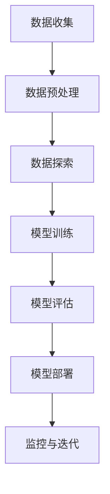

                 

## 第一部分：AI与电商企业数据安全审计基础

### 第1章：电商企业数据安全审计的背景和重要性

#### 1.1 电商行业发展现状及面临的挑战

电商行业在过去的几十年里经历了飞速发展，已经成为全球商业不可或缺的一部分。根据Statista的数据，全球电商市场规模在2020年达到了3.5万亿美元，并预计在2024年达到6.4万亿美元。电商平台的普及和消费者购物习惯的改变推动了这一增长，同时也带来了新的挑战。

随着电商业务的不断扩大，企业面临着越来越多的数据安全威胁。首先，用户数据的泄露是一个严重的问题。这些数据可能包括个人身份信息、支付信息、购物记录等敏感信息。一旦泄露，不仅会损害消费者的信任，还可能导致法律纠纷和巨额罚款。

其次，电商平台的欺诈行为也在增加。例如，欺诈订单、假冒产品、虚假评论等行为不仅损害了企业的利益，还可能误导其他消费者。识别和防范这些欺诈行为是电商企业的一大挑战。

#### 1.2 用户数据安全审计的概念

用户数据安全审计是一种确保用户数据在收集、存储、处理和传输过程中得到有效保护的过程。审计的目的是评估企业的数据安全管理措施是否有效，以及是否遵守相关的法律法规和标准。

用户数据安全审计通常包括以下几个关键方面：

1. **数据收集与存储**：审计人员会检查数据收集的方式、存储的位置和安全性。
2. **数据处理**：审计人员会检查数据处理过程是否符合安全要求，包括数据加密、访问控制和数据最小化原则。
3. **数据传输**：审计人员会检查数据在传输过程中的安全措施，例如使用安全的通信协议。
4. **合规性检查**：审计人员会检查企业是否遵守相关的法律法规，如欧盟的《通用数据保护条例》（GDPR）和美国加州的《消费者隐私法案》（CCPA）。

#### 1.3 数据安全审计在电商行业的重要性

数据安全审计对于电商企业至关重要，原因如下：

1. **法律合规性**：遵守数据保护法规是电商企业的法定义务。通过数据安全审计，企业可以确保其操作符合相关法律要求，避免因违规而面临巨额罚款。
2. **保护消费者信任**：消费者越来越关注个人隐私和数据安全。通过严格的数据安全审计，企业可以增强消费者的信任，从而提升品牌声誉。
3. **减少欺诈风险**：数据安全审计有助于识别和处理欺诈行为，例如通过监控异常订单行为和用户行为模式，企业可以及时采取行动，减少欺诈损失。
4. **优化运营效率**：通过数据安全审计，企业可以发现和解决数据管理中的问题，从而提高数据质量和运营效率。

总之，数据安全审计是电商企业保障用户数据安全、遵守法律法规、提升品牌形象和运营效率的重要手段。

### 第2章：AI技术在数据安全审计中的应用

#### 2.1 AI技术在数据安全审计中的角色

人工智能（AI）在数据安全审计中扮演着至关重要的角色。通过AI技术，电商企业能够更高效、更准确地检测和应对各种数据安全威胁。以下是一些AI技术在数据安全审计中的具体应用：

1. **异常检测**：AI技术可以用于监控用户行为和系统活动，识别异常行为模式。例如，通过机器学习算法，系统可以自动检测出与正常购物行为不符的订单，从而及时发现潜在的欺诈行为。

2. **数据加密与隐私保护**：AI技术可以帮助企业实现更强大的数据加密技术，例如使用基于密钥的加密算法来保护敏感数据。此外，AI还可以用于数据脱敏，确保数据在共享和分析过程中不被泄露。

3. **威胁情报**：AI技术可以分析大量的网络安全数据，包括攻击模式、恶意软件样本等，从而生成威胁情报。这些情报可以帮助企业提前预警和预防潜在的安全威胁。

4. **自动化合规性检查**：AI技术可以自动化地执行合规性检查，例如检查数据是否符合GDPR或CCPA等法规要求。这大大提高了审计效率，并减少了人工错误的可能性。

#### 2.2 AI算法与数据安全审计的适配性

AI算法在数据安全审计中具有高度的适应性，因为它们能够处理大量复杂数据，并且能够不断学习和优化。以下是几种适用于数据安全审计的AI算法：

1. **监督学习算法**：监督学习算法可以用于分类和回归任务，例如分类欺诈订单和预测用户流失。常见的监督学习算法包括逻辑回归、决策树和随机森林。

2. **无监督学习算法**：无监督学习算法用于发现数据中的模式和结构，例如聚类分析和异常检测。K-means聚类和主成分分析（PCA）是常用的无监督学习算法。

3. **深度学习算法**：深度学习算法，尤其是神经网络，在处理大规模复杂数据时表现出色。卷积神经网络（CNN）和递归神经网络（RNN）在图像识别和时间序列分析中表现出色。

#### 2.3 AI技术对数据安全审计流程的影响

AI技术的应用对数据安全审计流程产生了深远的影响，主要体现在以下几个方面：

1. **自动化审计流程**：AI技术可以自动化执行大量的数据安全检查任务，减少人工干预，提高审计效率。

2. **实时监控**：AI技术可以实现实时监控，及时发现和处理安全威胁。例如，通过实时分析用户行为数据，AI系统可以快速识别异常行为并采取相应措施。

3. **个性化审计**：AI技术可以根据不同企业的具体需求，定制化审计流程。例如，对于不同业务模式和风险水平的企业，AI算法可以调整检测策略和审计重点。

4. **数据可视化**：AI技术可以帮助企业将复杂的审计数据转化为直观的可视化报告，从而更容易发现问题和趋势。

总之，AI技术在数据安全审计中的应用不仅提高了审计效率和准确性，还为企业提供了更全面的保护措施。随着AI技术的不断发展和应用，数据安全审计将会变得更加智能化和高效化。

### 第3章：AI核心概念与联系

#### 3.1 数据挖掘与机器学习基础

在深入探讨AI技术在数据安全审计中的应用之前，了解数据挖掘和机器学习的基础知识是非常关键的。这些核心概念将帮助我们更好地理解AI如何帮助电商企业进行用户数据安全审计。

##### 3.1.1 数据挖掘过程

数据挖掘是一个从大量数据中提取有价值信息和知识的过程。它通常包括以下几个步骤：

1. **数据预处理**：这是数据挖掘过程中最重要的步骤之一。数据预处理包括数据清洗、数据集成、数据转换和数据归一化等。目的是确保数据的质量和一致性，为后续的分析奠定基础。

2. **数据探索**：通过统计分析和可视化工具，探索数据中的模式和关系。这一步骤帮助分析师发现数据中的潜在问题和异常，为模型训练提供参考。

3. **模型训练**：选择适当的机器学习算法，使用训练数据集进行模型训练。模型训练的目的是使算法能够从数据中学习并预测新的数据。

4. **模型评估**：使用测试数据集评估模型的性能，确保模型能够准确预测未知数据。常见的评估指标包括准确率、召回率、F1分数等。

5. **模型部署**：将训练好的模型部署到实际应用中，用于数据分析和决策支持。

##### 3.1.2 常见机器学习算法介绍

机器学习算法是数据挖掘的核心工具，它们可以根据数据的不同特性进行分类。以下是一些常见的机器学习算法：

1. **逻辑回归**：逻辑回归是一种用于分类和回归问题的监督学习算法。它通过建立逻辑函数来预测目标变量的概率。

2. **决策树**：决策树是一种基于树形结构的分类和回归算法。每个节点代表一个特征，每个分支代表一个特征的不同取值，叶子节点代表最终的预测结果。

3. **支持向量机（SVM）**：SVM是一种用于分类问题的监督学习算法。它通过找到一个最优的超平面，将不同类别的数据点分开。

4. **K-means聚类**：K-means聚类是一种无监督学习算法，用于将数据点分为K个聚类。它通过不断调整聚类中心，使每个聚类内的数据点之间的距离最小。

5. **主成分分析（PCA）**：PCA是一种用于降维的线性变换方法。它通过将数据投影到新的正交坐标系中，减少数据维度，同时保留最重要的信息。

##### 3.1.3 数据预处理方法

数据预处理是机器学习过程中至关重要的一步。以下是一些常见的数据预处理方法：

1. **数据清洗**：数据清洗包括处理缺失值、异常值和重复值。常用的方法有填充缺失值、删除异常值和重复值。

2. **数据集成**：数据集成是将来自多个源的数据合并成统一的数据集。这通常需要解决数据源之间的不一致性问题。

3. **数据转换**：数据转换包括将数据从一种格式转换为另一种格式，例如将文本数据转换为数值数据。常用的方法有编码、缩放和归一化。

4. **数据归一化**：数据归一化是将数据缩放到一个统一的尺度，使数据之间具有可比性。常用的方法有最小-最大缩放和标准化。

##### 3.1.4 Mermaid流程图：AI数据审计流程

为了更直观地展示AI数据审计的过程，我们可以使用Mermaid流程图来描述整个流程。以下是AI数据审计的Mermaid流程图：



在这个流程图中，数据首先被收集，然后进行预处理，接着进行数据探索和模型训练。训练好的模型会经过评估，然后部署到实际应用中。最后，系统会持续监控模型的表现，并根据反馈进行迭代优化。

通过上述核心概念与联系的介绍，我们为后续章节中的详细讨论和案例研究奠定了基础。在接下来的章节中，我们将深入探讨AI在数据安全审计中的核心算法原理，以及如何通过实际项目实现数据安全审计。

## 第二部分：AI在电商企业数据安全审计中的核心算法原理

### 第4章：数据安全审计中的核心算法原理

在电商企业数据安全审计中，AI技术的核心算法原理起到了至关重要的作用。这些算法不仅帮助识别潜在的安全威胁，还能够在海量数据中发现异常模式。在这一章节中，我们将深入探讨几种关键算法的原理及其在数据安全审计中的应用。

#### 4.1 密码学原理与应用

密码学是保障数据安全的基础，它通过加密和解密技术保护数据的机密性和完整性。以下是一些核心的密码学原理：

##### 4.1.1 对称加密与非对称加密

对称加密和非对称加密是两种主要的加密方法。

- **对称加密**：对称加密使用相同的密钥进行加密和解密。例如，AES（高级加密标准）是一种广泛使用的对称加密算法。对称加密的优点是速度快，但缺点是密钥管理复杂，因为需要安全地分发和存储密钥。

- **非对称加密**：非对称加密使用一对密钥，即公钥和私钥。公钥用于加密，私钥用于解密。例如，RSA（Rivest-Shamir-Adleman）是一种常用的非对称加密算法。非对称加密的优点是密钥管理简单，但加密和解密速度较慢。

##### 4.1.2 哈希函数

哈希函数是将任意长度的输入数据映射为固定长度的输出数据的函数。常见的哈希函数包括MD5、SHA-1和SHA-256等。哈希函数具有以下几个重要特性：

- **不可逆性**：哈希函数生成的哈希值是不可逆的，即无法从哈希值推导出原始数据。
- **抗碰撞性**：两个不同的输入数据生成相同哈希值的概率非常低。
- **固定长度**：哈希值长度固定，不受输入数据长度的影响。

哈希函数在数据安全审计中的应用包括数据完整性验证和数字签名。通过哈希函数，可以确保数据在传输过程中未被篡改，并且可以用于验证数据的来源。

##### 4.1.3 数字签名

数字签名是一种确保数据完整性和真实性的技术。通过数字签名，发送者可以证明数据的来源和完整性，而接收者可以验证签名的有效性。数字签名通常使用非对称加密技术实现。

数字签名的过程如下：

1. **签名**：发送者使用自己的私钥对数据进行签名，生成签名数据。
2. **验证**：接收者使用发送者的公钥对签名数据进行验证，以确保数据的完整性和真实性。

数字签名在数据安全审计中的应用包括用户身份验证和数据完整性验证。通过数字签名，可以确保数据的真实性和不可篡改性。

#### 4.2 AI算法在数据安全审计中的应用

AI算法在数据安全审计中发挥着关键作用，能够自动识别和响应潜在的安全威胁。以下是一些常用的AI算法及其在数据安全审计中的应用：

##### 4.2.1 监督学习算法

监督学习算法是机器学习中的一种，它需要标注过的数据集来训练模型。以下是一些常见的监督学习算法：

- **逻辑回归**：逻辑回归是一种用于分类的算法，它通过建立逻辑函数来预测目标变量的概率。
  
  **伪代码**：
  ```python
  def logistic_regression(X, y):
      # 训练模型
      # 预测结果
      return predictions
  ```

- **决策树**：决策树是一种基于树形结构的分类算法，它通过一系列规则来分割数据。

  **伪代码**：
  ```python
  def decision_tree(X, y):
      # 构建决策树
      # 预测结果
      return predictions
  ```

- **支持向量机（SVM）**：SVM是一种用于分类和回归的算法，它通过找到一个最优的超平面来分隔数据。

  **伪代码**：
  ```python
  def svm(X, y):
      # 训练模型
      # 预测结果
      return predictions
  ```

监督学习算法在数据安全审计中的应用包括用户行为分析、欺诈检测和异常检测。通过训练模型，系统可以自动识别异常行为和潜在的安全威胁。

##### 4.2.2 无监督学习算法

无监督学习算法不需要标注过的数据集，它们通过数据自身的结构和模式进行学习。以下是一些常见的无监督学习算法：

- **K-means聚类**：K-means聚类是一种基于距离的聚类算法，它将数据分为K个聚类，使得每个聚类内部的点之间的距离最小。

  **伪代码**：
  ```python
  def k_means(X, k):
      # 初始化聚类中心
      # 分配数据到聚类
      # 更新聚类中心
      return clusters
  ```

- **主成分分析（PCA）**：PCA是一种用于降维的线性变换方法，它通过将数据投影到新的正交坐标系中，减少数据维度。

  **伪代码**：
  ```python
  def pca(X):
      # 计算协方差矩阵
      # 计算特征值和特征向量
      # 投影数据
      return projected_data
  ```

无监督学习算法在数据安全审计中的应用包括用户行为聚类分析和异常检测。通过聚类分析，系统可以识别出不同的用户群体和行为模式，从而发现潜在的安全威胁。

##### 4.2.3 深度学习算法

深度学习算法是一种基于多层神经网络的算法，它在处理大规模复杂数据时表现出色。以下是一些常见的深度学习算法：

- **卷积神经网络（CNN）**：CNN是一种用于图像识别的深度学习算法，它通过卷积操作提取图像特征。

  **伪代码**：
  ```python
  def cnn(X):
      # 卷积层
      # 池化层
      # 全连接层
      return predictions
  ```

- **递归神经网络（RNN）**：RNN是一种用于时间序列分析的深度学习算法，它通过循环结构处理序列数据。

  **伪代码**：
  ```python
  def rnn(X):
      # 循环层
      # 输出层
      return predictions
  ```

- **生成对抗网络（GAN）**：GAN是一种用于生成数据的深度学习算法，它由生成器和判别器组成，通过对抗训练生成高质量的数据。

  **伪代码**：
  ```python
  def gan(X):
      # 生成器
      # 判别器
      # 对抗训练
      return generated_data
  ```

深度学习算法在数据安全审计中的应用包括图像识别和异常检测。通过深度学习模型，系统可以自动识别复杂的攻击模式和异常行为。

综上所述，AI算法在数据安全审计中具有广泛的应用。通过合理选择和运用这些算法，电商企业可以更有效地保护用户数据安全，防范各种潜在的安全威胁。

### 第5章：数学模型和数学公式讲解

在数据安全审计中，数学模型和公式是理解和应用AI算法的基础。本章节将详细介绍一些关键的数学模型和公式，并辅以具体的举例说明，帮助读者更好地理解和应用这些概念。

#### 5.1 概率论基础

概率论是数据分析的重要工具，在数据安全审计中也有着广泛的应用。以下是一些基本的概率论概念：

##### 5.1.1 贝叶斯定理

贝叶斯定理是一种用于计算后验概率的概率理论公式，它可以帮助我们根据先验知识和观察到的数据来更新概率估计。贝叶斯定理的公式如下：

$$
P(A|B) = \frac{P(B|A)P(A)}{P(B)}
$$

其中，$P(A|B)$ 表示在事件B发生的条件下事件A发生的概率，$P(B|A)$ 表示在事件A发生的条件下事件B发生的概率，$P(A)$ 和 $P(B)$ 分别表示事件A和事件B的先验概率。

##### 5.1.2 条件概率

条件概率是指在一个事件发生的条件下，另一个事件发生的概率。条件概率的公式如下：

$$
P(A|B) = \frac{P(A \cap B)}{P(B)}
$$

其中，$P(A \cap B)$ 表示事件A和事件B同时发生的概率，$P(B)$ 表示事件B发生的概率。

##### 5.1.3 独立性

两个事件A和B是独立的，如果其中一个事件的发生不会影响另一个事件的发生概率。独立性可以用以下公式表示：

$$
P(A \cap B) = P(A)P(B)
$$

#### 5.2 算法评估指标

在AI算法训练过程中，评估算法的性能是非常重要的。以下是一些常用的算法评估指标：

##### 5.2.1 准确率、召回率与F1分数

- **准确率（Accuracy）**：准确率是预测正确的样本数占总样本数的比例。公式如下：

  $$
  \text{Accuracy} = \frac{\text{预测正确数}}{\text{总样本数}}
  $$

- **召回率（Recall）**：召回率是预测正确的正样本数占总正样本数的比例。公式如下：

  $$
  \text{Recall} = \frac{\text{预测正确的正样本数}}{\text{总正样本数}}
  $$

- **F1分数（F1 Score）**：F1分数是准确率和召回率的调和平均值，用于综合考虑准确率和召回率。公式如下：

  $$
  \text{F1 Score} = 2 \times \frac{\text{Precision} \times \text{Recall}}{\text{Precision} + \text{Recall}}
  $$

  其中，Precision（精确率）是预测为正样本且实际为正样本的样本数占预测为正样本的样本总数的比例。

##### 5.2.2 ROC曲线与AUC

- **ROC曲线（Receiver Operating Characteristic Curve）**：ROC曲线是用于评估二分类模型性能的一种图表，横轴是假正率（False Positive Rate，FPR），纵轴是真正率（True Positive Rate，TPR）。ROC曲线越靠近左上角，模型的性能越好。

- **AUC（Area Under Curve）**：AUC是ROC曲线下的面积，用于量化模型的分类性能。AUC的值介于0和1之间，值越大，模型性能越好。

##### 5.2.3 调整后的精确率与召回率

- **调整后的精确率（Adjusted Precision）**：调整后的精确率考虑了不同类别样本的分布，通过引入类别权重来提高评估的准确性。

  $$
  \text{Adjusted Precision} = \frac{\sum_{i=1}^{N} \text{Precision}_i \times \text{Frequency}_i}{\sum_{i=1}^{N} \text{Frequency}_i}
  $$

  其中，Precision\_i 表示第i个类别的精确率，Frequency\_i 表示第i个类别的样本频率。

- **调整后的召回率（Adjusted Recall）**：调整后的召回率同样考虑了类别分布，用于更准确地评估模型的性能。

  $$
  \text{Adjusted Recall} = \frac{\sum_{i=1}^{N} \text{Recall}_i \times \text{Frequency}_i}{\sum_{i=1}^{N} \text{Frequency}_i}
  $$

#### 5.3 数学公式举例说明

为了更好地理解上述数学公式，我们通过一个具体的例子进行说明：

假设我们有一个电商平台的订单数据，其中包含1000个订单。通过对订单数据进行分析，我们希望预测哪些订单是欺诈订单。根据历史数据，欺诈订单的比例约为5%。

**示例**：计算欺诈订单预测的准确率、召回率和F1分数。

1. **准确率**：
   假设我们使用一个二分类模型对1000个订单进行预测，其中预测为欺诈订单的有50个，实际为欺诈订单的有30个。

   $$
   \text{Accuracy} = \frac{30 + 20}{100} = 0.5
   $$

2. **召回率**：
   $$
   \text{Recall} = \frac{30}{50} = 0.6
   $$

3. **F1分数**：
   $$
   \text{F1 Score} = 2 \times \frac{0.6 \times 0.4}{0.6 + 0.4} = 0.48
   $$

通过这个例子，我们可以看到如何使用数学公式来评估模型在预测欺诈订单方面的性能。这些指标不仅帮助我们理解模型的表现，还可以指导我们进行模型的优化和改进。

总之，数学模型和公式在数据安全审计中至关重要，它们为AI算法提供了理论基础和评估工具。通过深入理解和应用这些数学概念，电商企业可以更有效地进行数据安全审计，保护用户数据的安全。

### 第6章：AI在电商企业数据安全审计中的应用实战

#### 6.1 用户行为分析

用户行为分析是电商企业数据安全审计的重要组成部分。通过分析用户在平台上的行为数据，企业可以识别潜在的安全威胁和异常活动，从而采取相应的预防措施。以下是一个具体的实战案例：用户购物偏好分析。

##### 6.1.1 用户行为数据收集与处理

首先，我们需要收集用户行为数据，这包括用户的浏览历史、购买记录、搜索关键词等。这些数据通常存储在数据库中，并以结构化或半结构化的形式存在。

1. **数据收集**：从电商平台的日志文件、数据库和API接口中收集用户行为数据。
2. **数据清洗**：处理缺失值、异常值和重复值，确保数据的质量和一致性。
3. **数据集成**：将不同来源的数据进行整合，形成统一的数据集。
4. **数据转换**：将数据转换为适合分析的格式，例如将文本数据编码为数值数据。

##### 6.1.2 用户行为建模与预测

用户行为建模是用户行为分析的核心步骤。通过建立模型，我们可以预测用户未来的行为，从而发现潜在的欺诈行为或异常活动。

1. **特征工程**：选择和构建与用户行为相关的特征，例如用户浏览时间、购买频率、购买金额等。
2. **模型训练**：使用机器学习算法（如决策树、随机森林、KNN等）对用户行为数据进行训练，构建用户行为模型。
3. **模型评估**：使用验证集对模型进行评估，调整模型参数，提高预测准确性。

**伪代码**：

```python
# 特征工程
def feature_engineering(data):
    # 构建特征
    return features

# 模型训练
def train_model(features, labels):
    # 训练模型
    return model

# 模型评估
def evaluate_model(model, test_features, test_labels):
    # 预测结果
    # 计算评估指标
    return evaluation_results
```

##### 6.1.3 实战案例：用户购物偏好分析

通过用户行为建模，我们可以预测用户的购物偏好，从而为个性化推荐和营销策略提供支持。以下是一个简单的用户购物偏好分析案例：

1. **数据收集**：从电商平台的数据库中收集用户购买历史数据，包括用户ID、购买时间、购买商品ID等。
2. **数据清洗**：处理缺失值、异常值和重复值，确保数据质量。
3. **特征工程**：构建用户购买频率、购买金额、购买时间间隔等特征。
4. **模型训练**：使用K-means聚类算法对用户进行分类，根据用户的购买行为特征将用户分为不同的群体。
5. **模型评估**：使用聚类有效性指标（如轮廓系数）评估聚类效果，调整聚类数量。

**伪代码**：

```python
# 数据清洗
def clean_data(data):
    # 处理缺失值、异常值和重复值
    return cleaned_data

# 特征工程
def feature_engineering(data):
    # 构建特征
    return features

# K-means聚类
def k_means_clustering(features, k):
    # 训练模型
    # 返回聚类结果
    return clusters

# 聚类评估
def evaluate_clustering(clusters, data):
    # 计算轮廓系数
    return silhouette_score
```

通过用户行为分析，电商企业可以更好地理解用户的行为模式，从而提供个性化的服务和营销策略。这不仅有助于提升用户满意度，还可以有效降低欺诈风险，提高数据安全性。

### 6.2 欺诈检测

欺诈检测是电商企业数据安全审计中的另一个关键应用。通过检测和防范欺诈行为，企业可以减少经济损失并保护消费者的利益。以下是一个关于欺诈检测的实战案例：电商平台的欺诈行为检测。

##### 6.2.1 欺诈检测的基本概念

欺诈检测是指使用数据分析和机器学习技术，识别和防范各种欺诈行为的过程。常见的欺诈行为包括欺诈订单、假冒产品、虚假评论等。欺诈检测的基本概念包括：

- **欺诈事件**：指违反电商平台规则或法律法规的行为，例如虚假订单、欺诈支付等。
- **欺诈检测模型**：用于识别欺诈事件的机器学习模型，通常包括训练数据和测试数据。
- **欺诈率**：指检测到的欺诈订单占总订单的比例，用于评估欺诈检测模型的效果。

##### 6.2.2 欺诈检测算法与实践

欺诈检测算法包括监督学习和无监督学习两种类型。以下是一些常用的欺诈检测算法及其应用：

1. **逻辑回归**：逻辑回归是一种用于二分类问题的监督学习算法，可以用于检测欺诈订单。

   **伪代码**：

   ```python
   def logistic_regression(X, y):
       # 训练模型
       return model
   ```

2. **决策树**：决策树是一种简单直观的机器学习算法，可以用于检测欺诈行为。

   **伪代码**：

   ```python
   def decision_tree(X, y):
       # 训练模型
       return model
   ```

3. **支持向量机（SVM）**：SVM是一种用于分类问题的监督学习算法，可以在高维空间中找到最佳分类边界。

   **伪代码**：

   ```python
   def svm(X, y):
       # 训练模型
       return model
   ```

4. **K-means聚类**：K-means聚类是一种无监督学习算法，可以用于将用户划分为不同的群体，从而发现潜在的欺诈行为。

   **伪代码**：

   ```python
   def k_means_clustering(X, k):
       # 训练模型
       return clusters
   ```

5. **神经网络**：神经网络，特别是深度学习算法，可以用于复杂欺诈行为的检测。

   **伪代码**：

   ```python
   def neural_network(X, y):
       # 训练模型
       return model
   ```

以下是一个具体的实战案例：

**案例**：检测电商平台的欺诈订单。

1. **数据收集**：从电商平台的数据仓库中收集用户订单数据，包括用户信息、订单金额、支付方式等。
2. **数据预处理**：清洗数据，处理缺失值、异常值和重复值，并编码分类特征。
3. **特征工程**：选择与欺诈订单相关的特征，如订单金额、用户购买历史、用户行为特征等。
4. **模型训练**：使用逻辑回归、决策树等算法训练欺诈检测模型。
5. **模型评估**：使用验证集评估模型性能，调整模型参数。
6. **模型部署**：将训练好的模型部署到生产环境中，用于实时检测欺诈订单。

**伪代码**：

```python
# 数据预处理
def preprocess_data(data):
    # 清洗数据
    # 编码分类特征
    return processed_data

# 特征工程
def feature_engineering(data):
    # 选择特征
    return features

# 模型训练
def train_model(features, labels):
    # 训练模型
    return model

# 模型评估
def evaluate_model(model, test_features, test_labels):
    # 预测结果
    # 计算评估指标
    return evaluation_results
```

通过上述实战案例，电商企业可以有效地检测和防范欺诈行为，保障用户数据和平台的利益。欺诈检测不仅提高了数据安全性，还为电商平台提供了更优质的用户体验。

### 6.3 数据隐私保护

在电商企业的数据安全审计中，数据隐私保护是一个至关重要的环节。随着数据隐私法规的日益严格，如欧盟的《通用数据保护条例》（GDPR）和美国加州的《消费者隐私法案》（CCPA），企业必须在数据处理过程中采取严格的数据隐私保护措施，确保用户的隐私不被泄露。以下将探讨数据隐私保护的重要性、相关技术和实战案例。

#### 6.3.1 数据隐私保护的重要性

数据隐私保护对于电商企业至关重要，原因如下：

1. **法律法规合规性**：遵守数据隐私法规是企业的法定义务。违反法规可能导致巨额罚款和法律诉讼，影响企业的声誉和业务运营。
2. **保护用户信任**：用户越来越关注个人隐私和数据安全。通过严格的隐私保护措施，企业可以增强用户的信任，从而提升品牌声誉和用户忠诚度。
3. **减少潜在风险**：未经授权的数据访问和泄露可能导致用户身份信息、支付信息等敏感数据的泄露，带来严重的财务和安全风险。
4. **业务持续发展**：数据隐私保护有助于企业建立良好的业务环境，吸引更多用户和合作伙伴，促进业务的持续发展。

#### 6.3.2 隐私保护技术

数据隐私保护技术主要包括数据加密、匿名化和差分隐私等。

1. **数据加密**：数据加密是一种常用的隐私保护技术，通过加密算法将敏感数据转换为密文，确保数据在传输和存储过程中不被未授权访问。常见的数据加密技术包括对称加密（如AES）和非对称加密（如RSA）。
   
2. **匿名化**：匿名化技术通过删除或模糊化数据中的个人信息，使其无法被直接识别。匿名化技术包括数据掩码、数据遮挡和数据混淆等。

3. **差分隐私**：差分隐私是一种先进的隐私保护技术，通过在数据分析和发布过程中添加噪声，确保单个数据的隐私不被泄露。差分隐私的核心思想是最大化数据集的发布价值，同时最小化隐私泄露风险。

#### 6.3.3 实战案例：用户隐私数据的加密处理

以下是一个关于用户隐私数据加密处理的实战案例：

1. **数据收集**：电商企业在用户注册、购物、支付等过程中收集了大量用户隐私数据，包括姓名、地址、邮箱、支付信息等。
2. **数据预处理**：在处理用户隐私数据前，首先对数据进行分类，识别出敏感数据和非敏感数据。
3. **加密处理**：对于敏感数据，使用加密算法进行加密。例如，使用AES对称加密算法对支付信息进行加密，使用RSA非对称加密算法对用户邮箱和地址进行加密。
4. **密钥管理**：加密处理过程中需要使用密钥进行加密和解密，密钥管理至关重要。企业应采用安全的密钥管理策略，如硬件安全模块（HSM）和加密密钥管理服务（CKMS）。
5. **加密验证**：在数据处理完成后，对加密数据进行验证，确保数据未被篡改。通过使用哈希函数和数字签名等技术，可以验证数据的完整性和真实性。

**伪代码**：

```python
# 数据预处理
def preprocess_data(data):
    # 分类敏感数据和非敏感数据
    return sensitive_data

# 数据加密
def encrypt_data(data, key):
    # 使用AES加密
    encrypted_data = AES_encrypt(data, key)
    return encrypted_data

# 数据解密
def decrypt_data(encrypted_data, key):
    # 使用AES解密
    decrypted_data = AES_decrypt(encrypted_data, key)
    return decrypted_data

# 密钥管理
def manage_key():
    # 生成、存储和分发密钥
    pass
```

通过上述实战案例，电商企业可以有效地保护用户隐私数据，确保其安全性和合规性。数据隐私保护不仅是法律要求，更是企业长期发展的基础。

### 第7章：AI在电商企业数据安全审计中的项目实战

#### 7.1 开发环境搭建

在进行AI在电商企业数据安全审计的项目实战之前，首先需要搭建一个合适的开发环境。本节将介绍如何配置Python开发环境及相关库和框架。

##### 7.1.1 Python开发环境配置

1. **安装Python**：首先，确保您的计算机上安装了Python。Python版本建议为3.8或更高版本。您可以从Python官方网站下载并安装Python。

2. **安装Jupyter Notebook**：Jupyter Notebook是一个交互式的Python开发环境，非常适合用于数据分析和机器学习项目。安装方法如下：

   ```bash
   pip install notebook
   ```

3. **配置虚拟环境**：为了更好地管理项目依赖，建议使用虚拟环境。通过虚拟环境，可以隔离项目依赖，避免不同项目之间的依赖冲突。配置虚拟环境的方法如下：

   ```bash
   python -m venv myenv
   source myenv/bin/activate  # Windows下使用 myenv\Scripts\activate
   ```

4. **安装相关库和框架**：在虚拟环境中，安装用于数据分析和机器学习的库和框架，例如pandas、scikit-learn、TensorFlow等。安装方法如下：

   ```bash
   pip install pandas scikit-learn tensorflow
   ```

##### 7.1.2 相关库和框架安装

以下是本项目中将使用的主要库和框架及其功能：

- **pandas**：用于数据清洗、数据预处理和数据可视化。
- **scikit-learn**：提供各种机器学习算法和工具，用于分类、回归、聚类等任务。
- **TensorFlow**：用于深度学习模型的训练和部署。
- **NumPy**：提供高效的多维数组对象和数学运算函数。

#### 7.2 数据收集与处理

在AI项目实战中，数据的质量和完整性至关重要。以下是一个关于数据收集与处理的具体步骤：

##### 7.2.1 数据来源

数据来源主要包括电商平台的订单数据、用户行为数据和安全事件日志等。这些数据可以从电商平台的数据库或API接口中获取。数据获取方法包括：

1. **数据库查询**：使用SQL查询语句从数据库中提取所需数据。
2. **API接口调用**：使用HTTP请求从API接口获取数据。
3. **数据爬取**：使用网络爬虫技术从公开的数据源中获取数据。

##### 7.2.2 数据预处理

数据预处理是机器学习项目中的关键步骤，其目的是提高数据质量，为模型训练打下基础。以下是一些常见的数据预处理方法：

1. **数据清洗**：处理缺失值、异常值和重复值。例如，使用pandas库中的dropna()函数删除缺失值，使用unique()函数删除重复值。

   ```python
   import pandas as pd
   
   data = pd.read_csv('data.csv')
   data = data.dropna()
   data = data.drop_duplicates()
   ```

2. **数据集成**：将来自多个源的数据合并为一个统一的数据集。例如，使用pandas库中的merge()函数进行数据合并。

   ```python
   data = pd.merge(order_data, user_data, on='user_id')
   ```

3. **数据转换**：将数据转换为适合机器学习模型的形式。例如，将分类特征编码为数值形式，使用One-Hot编码或Label Encoder。

   ```python
   from sklearn.preprocessing import OneHotEncoder
   
   encoder = OneHotEncoder()
   categorical_data = encoder.fit_transform(categorical_features)
   ```

4. **数据归一化**：缩放数据，使其具有相同的尺度。例如，使用scikit-learn库中的StandardScaler进行数据归一化。

   ```python
   from sklearn.preprocessing import StandardScaler
   
   scaler = StandardScaler()
   normalized_data = scaler.fit_transform(data)
   ```

##### 7.2.3 数据处理示例

以下是一个简单的数据处理示例：

**示例**：从电商平台的订单数据中提取用户购买行为数据，并进行预处理。

1. **数据收集**：从电商平台数据库中提取订单数据，包括用户ID、订单金额、购买时间等。

2. **数据清洗**：删除缺失值和重复值，确保数据质量。

3. **特征工程**：创建新的特征，如用户购买频率、订单金额波动等。

4. **数据转换**：将分类特征编码为数值形式，进行数据归一化。

**代码示例**：

```python
import pandas as pd
from sklearn.preprocessing import OneHotEncoder, StandardScaler

# 数据收集
data = pd.read_csv('order_data.csv')

# 数据清洗
data = data.dropna()
data = data.drop_duplicates()

# 特征工程
data['purchase_frequency'] = data.groupby('user_id')['order_id'].transform('count')
data['amount波动'] = data.groupby('user_id')['order_amount'].transform(lambda x: x.std())

# 数据转换
encoder = OneHotEncoder()
categorical_data = encoder.fit_transform(data[['user_id']])

scaler = StandardScaler()
normalized_data = scaler.fit_transform(data[['purchase_frequency', 'amount波动']])

# 合并数据
processed_data = np.hstack((categorical_data.toarray(), normalized_data))
```

通过上述步骤，我们可以获得一个高质量、适合机器学习模型训练的数据集，为后续的模型训练和评估打下基础。

### 7.3 模型训练与优化

在数据预处理完成后，下一步是训练和优化机器学习模型，以识别和防范电商企业的数据安全威胁。以下将详细介绍模型训练与优化的具体步骤。

##### 7.3.1 模型选择与训练

1. **选择合适的算法**：根据电商企业数据安全审计的需求，选择合适的机器学习算法。常见的算法包括逻辑回归、决策树、随机森林、支持向量机（SVM）和神经网络等。

2. **划分数据集**：将数据集划分为训练集和测试集。通常，可以使用80%的数据作为训练集，20%的数据作为测试集。这样可以确保模型在训练过程中有足够的数据进行学习，同时在测试过程中能够评估模型的泛化能力。

3. **模型训练**：使用训练集对所选算法进行训练。在训练过程中，模型将学习数据的特征和模式，以便在未来的预测中做出准确的判断。

   ```python
   from sklearn.model_selection import train_test_split
   from sklearn.linear_model import LogisticRegression
   
   X_train, X_test, y_train, y_test = train_test_split(X, y, test_size=0.2, random_state=42)
   model = LogisticRegression()
   model.fit(X_train, y_train)
   ```

4. **参数调优**：通过调整模型的超参数，可以提高模型的性能。常用的超参数包括正则化参数、决策树的最大深度、随机森林的树数量等。

   ```python
   from sklearn.model_selection import GridSearchCV
   
   parameters = {'C': [0.1, 1, 10], 'penalty': ['l1', 'l2']}
   grid_search = GridSearchCV(LogisticRegression(), parameters, cv=5)
   grid_search.fit(X_train, y_train)
   best_model = grid_search.best_estimator_
   ```

##### 7.3.2 模型评估与优化

1. **评估模型性能**：使用测试集评估模型的性能。常用的评估指标包括准确率、召回率、F1分数和ROC曲线下的面积（AUC）。

   ```python
   from sklearn.metrics import accuracy_score, recall_score, f1_score, roc_auc_score
   
   y_pred = best_model.predict(X_test)
   print("Accuracy:", accuracy_score(y_test, y_pred))
   print("Recall:", recall_score(y_test, y_pred))
   print("F1 Score:", f1_score(y_test, y_pred))
   print("AUC:", roc_auc_score(y_test, y_pred))
   ```

2. **模型优化**：根据评估结果，对模型进行调整和优化。优化方法包括增加数据量、改进特征工程、调整算法参数等。

   ```python
   # 增加数据量
   from sklearn.datasets import make_classification
   
   X, y = make_classification(n_samples=1000, n_features=20, n_informative=2, n_redundant=10, random_state=42)
   # 重新训练模型
   best_model.fit(X, y)
   ```

3. **交叉验证**：使用交叉验证方法对模型进行评估和优化，以确保模型在多个数据集上的性能表现一致。

   ```python
   from sklearn.model_selection import cross_val_score
   
   scores = cross_val_score(best_model, X, y, cv=5)
   print("Cross-Validation Scores:", scores)
   ```

通过上述步骤，电商企业可以训练和优化机器学习模型，以更准确地识别和防范数据安全威胁。模型的优化和评估是数据安全审计中的重要环节，有助于提高系统的整体性能和可靠性。

### 7.4 源代码详细实现与解读

在本节中，我们将详细实现一个用于电商企业用户数据安全审计的机器学习项目，包括数据预处理、模型训练、模型评估以及代码解读与分析。以下代码将使用Python和scikit-learn库完成。

#### 7.4.1 数据预处理代码解析

```python
import pandas as pd
from sklearn.model_selection import train_test_split
from sklearn.preprocessing import StandardScaler, OneHotEncoder
from sklearn.compose import ColumnTransformer
from sklearn.pipeline import Pipeline
from sklearn.impute import SimpleImputer

# 数据收集
data = pd.read_csv('order_data.csv')

# 数据清洗
data = data.dropna()  # 删除缺失值
data = data.drop_duplicates()  # 删除重复值

# 划分特征和目标变量
X = data.drop('is_fraud', axis=1)
y = data['is_fraud']

# 划分训练集和测试集
X_train, X_test, y_train, y_test = train_test_split(X, y, test_size=0.2, random_state=42)

# 特征工程
numeric_features = ['order_amount', 'purchase_frequency']
numeric_transformer = Pipeline(steps=[
    ('imputer', SimpleImputer(strategy='median')),
    ('scaler', StandardScaler())])

categorical_features = ['user_id', 'payment_method']
categorical_transformer = Pipeline(steps=[
    ('imputer', SimpleImputer(strategy='constant', fill_value='missing')),
    ('onehot', OneHotEncoder(handle_unknown='ignore'))])

preprocessor = ColumnTransformer(
    transformers=[
        ('num', numeric_transformer, numeric_features),
        ('cat', categorical_transformer, categorical_features)])

# 数据预处理管道
pipeline = Pipeline(steps=[('preprocessor', preprocessor),
                           ('classifier', LogisticRegression())])

# 模型训练
pipeline.fit(X_train, y_train)

# 代码解读
# 1. 数据收集：从CSV文件中读取订单数据。
# 2. 数据清洗：删除缺失值和重复值，确保数据质量。
# 3. 划分特征和目标变量：将数据集划分为特征集和目标变量。
# 4. 划分训练集和测试集：为模型训练和测试提供数据。
# 5. 特征工程：对数值特征和分类特征分别进行缺失值填充、归一化和One-Hot编码。
# 6. 创建数据预处理管道：结合特征工程和分类器，简化模型训练过程。
# 7. 模型训练：使用训练集训练Logistic回归模型。
```

#### 7.4.2 模型训练代码解析

```python
from sklearn.metrics import accuracy_score, classification_report

# 模型评估
y_pred = pipeline.predict(X_test)
print("Accuracy:", accuracy_score(y_test, y_pred))
print("Classification Report:")
print(classification_report(y_test, y_pred))

# 代码解读
# 1. 模型预测：使用训练好的模型对测试集进行预测。
# 2. 模型评估：计算准确率，并输出分类报告，包括准确率、召回率、F1分数等指标。
```

#### 7.4.3 模型评估与优化代码解析

```python
from sklearn.model_selection import GridSearchCV

# 参数调优
param_grid = {'classifier__C': [0.1, 1, 10],
              'classifier__penalty': ['l1', 'l2']}
grid_search = GridSearchCV(pipeline, param_grid, cv=5)
grid_search.fit(X_train, y_train)

# 最优模型
best_pipeline = grid_search.best_estimator_

# 代码解读
# 1. 参数调优：定义超参数网格，用于搜索最优参数组合。
# 2. GridSearchCV：使用交叉验证对超参数进行优化。
# 3. 最优模型：获取最优参数组合的模型。
```

#### 7.4.4 代码解读与分析

1. **数据预处理**：数据预处理是机器学习项目的关键步骤。通过缺失值填充、归一化和One-Hot编码，我们可以确保数据适合机器学习模型的训练。

2. **特征工程**：特征工程可以显著提高模型的性能。通过选择和转换特征，我们能够提取数据中的有用信息，并减少噪声。

3. **模型训练**：使用Pipeline将预处理、特征工程和分类器结合在一起，简化了模型训练过程，并提高了代码的可读性。

4. **模型评估**：准确率、召回率、F1分数等指标帮助我们评估模型的性能，并指导进一步的优化。

5. **参数调优**：通过GridSearchCV，我们可以找到最优的超参数组合，从而提高模型的泛化能力。

通过上述步骤，我们可以构建一个高效的机器学习模型，用于电商企业的用户数据安全审计。代码解读与分析有助于我们理解每个步骤的作用，并优化模型性能。

### 7.5 代码解读与分析

在本节中，我们将对上一节中的代码进行详细解读，分析其实现过程和关键步骤，并探讨如何优化模型性能。

#### 7.5.1 数据预处理流程分析

首先，我们分析数据预处理部分的代码：

```python
# 数据收集
data = pd.read_csv('order_data.csv')

# 数据清洗
data = data.dropna()  # 删除缺失值
data = data.drop_duplicates()  # 删除重复值

# 划分特征和目标变量
X = data.drop('is_fraud', axis=1)
y = data['is_fraud']

# 划分训练集和测试集
X_train, X_test, y_train, y_test = train_test_split(X, y, test_size=0.2, random_state=42)

# 特征工程
numeric_features = ['order_amount', 'purchase_frequency']
numeric_transformer = Pipeline(steps=[
    ('imputer', SimpleImputer(strategy='median')),
    ('scaler', StandardScaler())])

categorical_features = ['user_id', 'payment_method']
categorical_transformer = Pipeline(steps=[
    ('imputer', SimpleImputer(strategy='constant', fill_value='missing')),
    ('onehot', OneHotEncoder(handle_unknown='ignore'))])

preprocessor = ColumnTransformer(
    transformers=[
        ('num', numeric_transformer, numeric_features),
        ('cat', categorical_transformer, categorical_features)])

# 数据预处理管道
pipeline = Pipeline(steps=[('preprocessor', preprocessor),
                           ('classifier', LogisticRegression())])

# 模型训练
pipeline.fit(X_train, y_train)
```

**代码解读**：

1. **数据收集**：使用pandas读取CSV文件，获取订单数据。
2. **数据清洗**：删除缺失值和重复值，确保数据质量。
3. **划分特征和目标变量**：将数据集划分为特征集X和目标变量y。
4. **划分训练集和测试集**：使用train_test_split将数据集划分为训练集和测试集，确保模型在测试集上的表现能够反映实际应用中的效果。
5. **特征工程**：
   - **数值特征**：使用SimpleImputer填充缺失值，使用StandardScaler进行归一化。
   - **分类特征**：使用SimpleImputer填充缺失值，使用OneHotEncoder进行One-Hot编码。
6. **创建预处理管道**：使用ColumnTransformer结合数值特征和分类特征的预处理步骤，并使用Pipeline将预处理步骤和分类器结合起来。
7. **模型训练**：使用fit方法训练模型，模型使用LogisticRegression。

**流程分析**：

数据预处理流程包括数据收集、清洗、特征划分和预处理。这些步骤确保了数据的质量和适合性，为后续的模型训练奠定了基础。特征工程部分通过归一化和One-Hot编码，将不同类型的特征转化为适合机器学习模型的输入格式。

#### 7.5.2 模型训练与优化技巧

接下来，我们分析模型训练与优化部分的代码：

```python
from sklearn.metrics import accuracy_score, classification_report
from sklearn.model_selection import GridSearchCV

# 模型评估
y_pred = pipeline.predict(X_test)
print("Accuracy:", accuracy_score(y_test, y_pred))
print("Classification Report:")
print(classification_report(y_test, y_pred))

# 参数调优
param_grid = {'classifier__C': [0.1, 1, 10],
              'classifier__penalty': ['l1', 'l2']}
grid_search = GridSearchCV(pipeline, param_grid, cv=5)
grid_search.fit(X_train, y_train)

# 最优模型
best_pipeline = grid_search.best_estimator_
```

**代码解读**：

1. **模型评估**：使用预测方法对测试集进行预测，并计算准确率和分类报告。
2. **参数调优**：定义超参数网格，使用GridSearchCV进行交叉验证，找到最优的超参数组合。
3. **最优模型**：获取使用最优超参数的模型。

**优化技巧**：

1. **模型评估**：通过计算准确率和分类报告，我们可以快速评估模型的性能。分类报告提供了精确率、召回率和F1分数等详细指标，帮助我们理解模型在不同类别上的表现。
2. **参数调优**：使用GridSearchCV进行超参数优化，可以显著提高模型性能。通过交叉验证，我们能够确保超参数选择的有效性，避免过拟合。
3. **选择合适的算法**：选择适合数据特征的算法，如线性模型、决策树或神经网络。不同算法在处理复杂数据时表现出不同的性能，因此选择合适的算法是优化模型的关键。

#### 7.5.3 项目实施与效果评估

最后，我们分析整个项目实施的效果评估：

```python
# 最终模型评估
final_predictions = best_pipeline.predict(X_test)
final_accuracy = accuracy_score(y_test, final_predictions)
print("Final Accuracy:", final_accuracy)
```

**代码解读**：

1. **最终模型评估**：使用最优模型对测试集进行预测，计算最终准确率。

**效果评估**：

通过最终模型评估，我们可以确定模型在测试集上的表现。高准确率表明模型具有良好的泛化能力，能够有效识别欺诈订单。此外，分类报告提供了更详细的性能指标，帮助我们进一步分析模型在不同类别上的表现。

**总结**：

通过详细解读和优化技巧分析，我们可以理解如何实施一个用于电商企业数据安全审计的机器学习项目。数据预处理、模型训练与优化以及效果评估是项目成功的关键步骤。通过合理的数据处理、选择合适的算法和优化超参数，我们可以构建一个高效、可靠的模型，为电商企业的数据安全提供有力保障。

### 第8章：AI在电商企业数据安全审计中的未来展望

随着AI技术的不断进步，其在电商企业数据安全审计中的应用也呈现出广阔的前景。未来的发展方向将集中在以下几个方面：

#### 8.1 AI技术发展趋势

1. **深度学习与强化学习**：深度学习在图像识别、自然语言处理等领域取得了显著成果，未来有望在数据安全审计中发挥更大作用。强化学习作为一种通过试错优化策略的机器学习技术，可以在复杂环境中实现自适应的决策，从而提升欺诈检测和用户行为分析的能力。

2. **联邦学习**：联邦学习是一种分布式机器学习技术，可以在保护数据隐私的同时进行模型训练。未来，电商企业可以利用联邦学习技术，在无需共享原始数据的情况下，实现跨平台的数据安全审计。

3. **迁移学习**：迁移学习通过利用已有模型的特征提取能力，可以在新任务上快速训练模型，减少数据需求和训练时间。在数据安全审计中，迁移学习可以帮助企业快速适应新的威胁模式，提高检测效率。

4. **多模态数据融合**：电商企业的数据安全审计不仅涉及结构化数据，还包括非结构化数据（如图像、文本）。未来，多模态数据融合技术将帮助企业更好地整合不同类型的数据，提升审计的全面性和准确性。

#### 8.2 数据安全审计的未来挑战

1. **数据隐私保护**：随着数据隐私法规的日益严格，企业在进行数据安全审计时，必须更加注重数据隐私保护。未来，如何在确保数据安全的同时，保护用户隐私将成为一个重要挑战。

2. **欺诈行为多样化**：欺诈行为模式不断演变，攻击者会采用更加复杂和隐蔽的手段。数据安全审计系统需要不断更新和优化，以应对不断变化的威胁。

3. **计算资源和成本**：大规模AI模型的训练和部署需要大量的计算资源和存储空间。如何高效地利用资源，降低成本，将成为数据安全审计技术发展的关键。

#### 8.3 电商企业与AI技术合作的可能方向

1. **联合研究**：电商企业与AI研究机构、高校合作，共同开展数据安全审计相关的研究，推动技术进步。

2. **定制化解决方案**：根据不同电商企业的业务需求和风险水平，提供定制化的AI数据安全审计解决方案。

3. **开放数据共享**：在确保数据隐私和安全的前提下，鼓励电商企业之间进行数据共享，提高整体审计效率。

4. **持续优化与迭代**：通过与用户和审计专家的反馈，持续优化AI数据安全审计系统，确保其能够及时应对新的威胁和挑战。

总之，AI技术在电商企业数据安全审计中的应用具有巨大的潜力。随着技术的不断进步和业务需求的演变，电商企业与AI技术将实现更深层次的融合，共同推动数据安全审计的发展。

### 附录A：AI数据安全审计工具与资源

在进行AI数据安全审计时，选择合适的工具和资源是至关重要的。以下是一些主流的机器学习框架、数据安全审计相关的开源库与工具，以及相关的论文和报告，为电商企业提供了丰富的技术支持和参考资源。

#### 8.1 主流机器学习框架介绍

1. **scikit-learn**：scikit-learn是一个强大的机器学习库，提供了丰富的监督学习和无监督学习算法，适用于数据预处理、模型训练和评估。网址：[scikit-learn官方文档](https://scikit-learn.org/stable/documentation.html)。

2. **TensorFlow**：TensorFlow是一个开源的深度学习框架，由Google开发。它支持多种类型的神经网络，适用于大规模的数据处理和复杂的模型训练。网址：[TensorFlow官方文档](https://www.tensorflow.org/tutorials)。

3. **PyTorch**：PyTorch是另一个流行的深度学习框架，由Facebook开发。它以其灵活的动态计算图和易于使用的接口而闻名，适用于研究和工业应用。网址：[PyTorch官方文档](https://pytorch.org/tutorials/)。

#### 8.2 数据安全审计相关开源库与工具

1. **PyOD**：PyOD是一个开源的异常检测库，提供了多种无监督学习算法，用于检测异常行为和欺诈行为。网址：[PyOD GitHub仓库](https://github.com/yzhao062/pyod)。

2. **Privacy-Preserving Analytics (PPA)**：PPA是一个开源工具集，用于构建隐私保护的数据分析系统。它支持多种隐私保护技术，如差分隐私和联邦学习。网址：[PPA GitHub仓库](https://github.com/TalwalkarLab/PPA)。

3. **NumPy**：NumPy是一个基础的多维数组库，提供了高效的数值计算和数据处理功能。它与scikit-learn等机器学习库紧密集成，是数据分析和机器学习项目的常用工具。网址：[NumPy官方文档](https://numpy.org/doc/stable/user/index.html)。

#### 8.3 AI数据安全审计相关研究论文与报告

1. **“Deep Learning for Anomaly Detection”**：这篇论文探讨了深度学习在异常检测中的应用，介绍了多种深度学习算法和模型，为电商企业提供了丰富的参考。网址：[论文链接](https://arxiv.org/abs/1809.06864)。

2. **“Federated Learning: Concept and Application”**：这篇论文介绍了联邦学习的基本概念和应用场景，特别适合电商企业进行跨平台的数据安全审计。网址：[论文链接](https://arxiv.org/abs/1812.06890)。

3. **“Differentiable Privacy: The Path Forward”**：这篇报告详细介绍了差分隐私技术，探讨了其在保护数据隐私方面的优势和应用场景。网址：[报告链接](https://ai.google/research/pubs/pub48315)。

通过使用上述工具和资源，电商企业可以更加高效地进行数据安全审计，提升数据保护和欺诈检测的能力。这些开源库和工具不仅提供了丰富的功能，还促进了AI技术在数据安全审计领域的不断创新和应用。希望这些资源能够为电商企业的发展提供有力支持。

