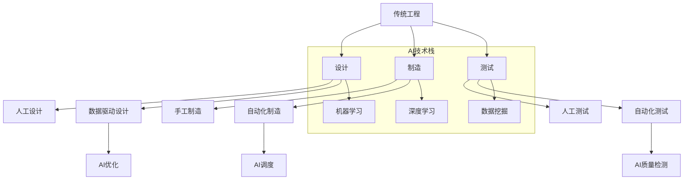

                 

### 引言

随着科技的飞速发展，人工智能（AI）技术已经成为现代工程领域的重要驱动力。AI技术不仅改变了传统的数据处理方式，还为各个行业带来了前所未有的创新机遇。本篇文章将以《AI技术栈与传统工程的对比》为主题，深入探讨AI技术栈与传统工程之间的差异与联系，帮助读者更好地理解和掌握这一前沿技术。

首先，我们需要明确什么是AI技术栈。AI技术栈是指一组用于构建、训练和部署人工智能模型的工具和框架，包括核心算法、数学模型和软件框架等。传统工程则是指那些基于物理原理和工程经验来设计、制造和运营系统的学科和行业。这两者之间的区别不仅仅在于技术层面，更在于其背后的思维方式和工作方法。

在本文中，我们将首先介绍AI技术栈的基础知识，包括其发展历程、核心组成部分以及与传统工程的异同。接着，我们将深入讲解AI技术栈中的核心算法原理，包括神经网络、深度学习算法以及统计学习中的数学模型。随后，我们将对比分析AI技术栈与传统工程在应用场景、优势与挑战等方面的异同。最后，我们将通过实际案例展示AI技术在传统工程中的应用效果，并探讨AI技术栈与传统工程的未来发展趋势。

通过这篇文章，读者将能够系统地了解AI技术栈的基础知识，深入理解其与传统工程之间的联系与差异，为未来在AI领域的发展奠定坚实的基础。

### AI技术栈概述

AI技术栈是指一套综合性的工具和框架，旨在构建、训练和部署人工智能模型。其历史可以追溯到20世纪50年代，当时人工智能（AI）的概念刚刚诞生。早期的研究主要集中在符号推理和逻辑编程上，但由于计算能力的限制，这些方法并未得到广泛应用。进入21世纪，随着计算能力和算法的进步，人工智能迎来了新一轮的发展高潮。

#### 1.1 AI技术的发展历程

AI技术的发展历程可以分为几个重要阶段：

- **符号主义阶段**（1950-1970）：这一阶段的主要研究方向是通过符号推理和逻辑编程来实现智能系统。典型的代表是约翰·麦卡锡（John McCarthy）提出的普林斯顿研讨会和达赖拉姆·霍普金斯（Dartmouth Conference），标志着人工智能作为一门独立学科的诞生。

- **知识表示和推理阶段**（1970-1980）：这一阶段的研究主要集中在如何表示和处理知识，以及如何利用这些知识进行推理。代表性工作是艾兹格·迪杰斯特拉（Edsger Dijkstra）提出的逻辑编程语言Prolog。

- **机器学习阶段**（1980-2000）：随着数据集的增大和计算能力的提升，机器学习方法逐渐成为研究热点。代表性工作是1986年Rumelhart、Hinton和Williams提出的反向传播算法，为神经网络的发展奠定了基础。

- **深度学习阶段**（2000至今）：深度学习在2012年AlexNet的成功之后迅速崛起。卷积神经网络（CNN）、循环神经网络（RNN）和生成对抗网络（GAN）等深度学习算法在图像识别、自然语言处理和生成模型等任务上取得了显著的突破。

#### 1.2 传统工程与AI技术栈的异同

传统工程与AI技术栈在多个方面存在显著差异：

- **目标和方法**：传统工程的目标是设计、制造和运营物理系统，依赖于物理原理和工程经验。而AI技术栈的目标是构建能够自主学习和适应的智能系统，依赖于数据驱动的方法和算法。

- **工具和框架**：传统工程使用CAD、CAE、CAM等工具来支持设计和制造，而AI技术栈则依赖于Python、R、TensorFlow、PyTorch等编程语言和框架。

- **数据依赖**：传统工程通常不需要大量的数据支持，而AI技术栈则高度依赖于数据的质量和数量，尤其是训练数据。

- **自动化程度**：传统工程在自动化方面有所涉及，但通常依赖预先设定的规则和程序。而AI技术栈通过机器学习和深度学习算法，可以实现更高程度的自动化和智能化。

#### 1.3 AI技术栈的核心组成部分

AI技术栈由多个核心组成部分构成：

- **核心算法**：包括神经网络、深度学习算法和统计学习算法等，是AI技术栈的核心。

  - **神经网络**：由一系列相互连接的神经元组成，通过学习输入数据的特征来实现复杂任务的预测和分类。

  - **深度学习算法**：通过多层神经网络来实现复杂的特征提取和任务预测，如卷积神经网络（CNN）、循环神经网络（RNN）和生成对抗网络（GAN）。

  - **统计学习算法**：基于统计学原理，通过学习数据中的模式和规律来进行预测和分类，如支持向量机（SVM）、随机森林（RF）和梯度提升树（GBDT）。

- **数学模型**：包括概率模型、优化模型和决策模型等，为AI算法提供理论基础和数学支持。

  - **概率模型**：用于描述不确定性和随机性，如贝叶斯网络和马尔可夫模型。

  - **优化模型**：用于解决优化问题，如线性规划和非线性规划。

  - **决策模型**：用于辅助决策制定，如决策树和随机森林。

- **软件框架**：包括TensorFlow、PyTorch、Keras等，提供编程接口和工具库，简化AI模型的开发和部署。

通过以上对AI技术栈的概述，我们可以看到，AI技术栈不仅是一种新的技术手段，更是一种全新的思维方式和工作方法。其与传统工程的差异和联系，正是现代工程领域中的一大课题。

### 核心算法原理讲解

在深入探讨AI技术栈的核心算法原理之前，我们需要先了解神经网络、深度学习算法以及统计学习算法的基本概念和核心原理。这些算法是AI技术栈中最为重要的组成部分，决定了AI模型的学习能力、预测精度和泛化能力。

#### 2.1 神经网络基础

神经网络（Neural Networks）是模拟人脑神经元结构和功能的计算模型，通过学习和记忆输入数据中的特征来进行预测和分类。神经网络的基本结构包括输入层、隐藏层和输出层，每层由多个神经元组成。神经元之间通过权重（weights）和偏置（biases）相连，并通过激活函数（activation function）进行非线性变换。

##### 2.1.1 神经网络的基本结构

一个简单的神经网络可以表示为：

```
输入层（Input Layer）: x1, x2, ..., xn
隐藏层（Hidden Layer）: h1, h2, ..., hn
输出层（Output Layer）: y1, y2, ..., yn
```

每个神经元通过以下公式进行计算：

$$
z_j = \sum_{i=1}^{n} w_{ij}x_i + b_j
$$

其中，\( z_j \) 是第 \( j \) 个神经元的输入，\( w_{ij} \) 是连接输入层和隐藏层的权重，\( b_j \) 是隐藏层的偏置。

##### 2.1.2 神经元的工作原理

神经元的工作原理可以概括为以下几个步骤：

1. **加权求和**：将输入数据与权重相乘并求和，得到神经元的输入。
2. **应用激活函数**：通过激活函数将输入值转换为输出值，激活函数通常是一个非线性函数，如Sigmoid函数、ReLU函数和Tanh函数。
3. **传递输出**：将激活后的值传递到下一层神经元，作为下一层的输入。

##### 2.1.3 前向传播与反向传播算法

神经网络的训练过程主要包括前向传播（Forward Propagation）和反向传播（Back Propagation）两个步骤。

- **前向传播**：输入数据从输入层传入网络，经过逐层计算，最终在输出层得到预测值。
- **反向传播**：通过比较预测值与真实值的差异，计算误差，然后反向传播误差，更新网络中的权重和偏置。

伪代码如下：

```
初始化权重w和偏置b
输入数据X
预测值Y = 前向传播(X, w, b)
误差E = 计算误差(Y, 真实值)
更新权重w和偏置b = 反向传播(E, w, b)
```

#### 2.2 深度学习算法

深度学习（Deep Learning）是神经网络的一种扩展，通过增加网络的层数（深度）来提高模型的表示能力和学习能力。深度学习算法在图像识别、自然语言处理和生成模型等领域取得了显著突破。

##### 2.2.1 卷积神经网络（CNN）

卷积神经网络（Convolutional Neural Networks，CNN）是一种专门用于处理图像数据的神经网络。CNN的核心组件是卷积层（Convolutional Layer），通过局部感知和共享权重来提取图像特征。

- **卷积层**：通过卷积操作提取图像特征，卷积核在图像上滑动，计算局部特征。
- **池化层**：通过池化操作（如最大池化或平均池化）降低特征图的维度，提高模型的泛化能力。

伪代码如下：

```
输入图像X
卷积层（卷积核K）：计算局部特征F = 卷积(X, K)
池化层：降低特征图维度P = 池化(F)
```

##### 2.2.2 循环神经网络（RNN）

循环神经网络（Recurrent Neural Networks，RNN）是一种用于处理序列数据的神经网络。RNN通过在时间步之间传递信息来捕捉序列中的依赖关系。

- **隐藏状态**：RNN在每个时间步更新隐藏状态，将当前输入和上一时间步的隐藏状态结合，产生新的隐藏状态。
- **门控机制**：通过门控机制（如门控循环单元（LSTM）和长短期记忆网络（GRU））来控制信息的流动，防止梯度消失问题。

伪代码如下：

```
输入序列X
隐藏状态H = 初始化
for每个时间步t：
  H = RNN(H, X[t])
输出Y = 隐藏状态H
```

##### 2.2.3 生成对抗网络（GAN）

生成对抗网络（Generative Adversarial Networks，GAN）是一种用于生成数据的神经网络。GAN由生成器（Generator）和判别器（Discriminator）两个部分组成，通过对抗训练（Adversarial Training）来提高生成器的生成能力。

- **生成器**：通过输入噪声生成数据，目标是使生成的数据尽可能真实。
- **判别器**：判断输入数据是真实数据还是生成数据，目标是准确分类。

伪代码如下：

```
初始化生成器G和判别器D
for每个迭代t：
  生成器更新：G = G' + η*梯度(G, D(G(z)))
  判别器更新：D = D' + η*梯度(D, X)
```

通过以上对神经网络、深度学习算法和统计学习算法的讲解，我们可以看到，AI技术栈中的核心算法不仅具有丰富的理论基础，而且在实际应用中也展现了强大的能力。这些算法为AI技术栈提供了强大的学习能力和适应性，为解决复杂问题提供了新的思路和方法。

### 数学模型和公式详解

在深入理解AI技术栈的核心算法后，我们需要进一步掌握其中的数学模型和公式。这些数学模型不仅为AI算法提供了理论基础，也为我们分析和优化算法提供了工具。在本节中，我们将详细讲解神经网络中的数学模型、统计学习中的数学模型，以及相关的优化算法。

#### 3.1 神经网络中的数学模型

神经网络的训练过程涉及到多个数学模型，包括激活函数、损失函数和优化算法。这些模型共同作用于神经网络的各个层次，以实现高效的训练和预测。

##### 3.1.1 激活函数

激活函数是神经网络中的一个关键组成部分，它决定了神经元输出是否会被激活。常用的激活函数包括Sigmoid函数、ReLU函数和Tanh函数。

- **Sigmoid函数**：
  $$
  \sigma(x) = \frac{1}{1 + e^{-x}}
  $$
  Sigmoid函数可以将输入值映射到（0, 1）区间，常用于分类问题。

- **ReLU函数**（Rectified Linear Unit）：
  $$
  \text{ReLU}(x) = \max(0, x)
  $$
  ReLU函数具有简单的计算形式和良好的梯度保持能力，在深度学习中广泛应用。

- **Tanh函数**：
  $$
  \tanh(x) = \frac{e^x - e^{-x}}{e^x + e^{-x}}
  $$
  Tanh函数可以将输入值映射到（-1, 1）区间，常用于回归问题。

##### 3.1.2 损失函数

损失函数是神经网络中用于评估模型预测性能的函数。常见的损失函数包括均方误差（MSE）、交叉熵损失（Cross-Entropy Loss）和Hinge损失（Hinge Loss）。

- **均方误差（MSE）**：
  $$
  \text{MSE}(y, \hat{y}) = \frac{1}{n}\sum_{i=1}^{n}(y_i - \hat{y}_i)^2
  $$
  均方误差用于回归问题，评估预测值与真实值之间的差异。

- **交叉熵损失（Cross-Entropy Loss）**：
  $$
  \text{CE}(y, \hat{y}) = -\sum_{i=1}^{n}y_i\log(\hat{y}_i)
  $$
  交叉熵损失用于分类问题，评估模型对类别的预测概率。

- **Hinge损失**：
  $$
  \text{Hinge Loss}(y, \hat{y}) = \max(0, 1 - y\hat{y})
  $$
  Hinge损失常用于支持向量机（SVM）等二分类问题。

##### 3.1.3 优化算法

优化算法是用于更新神经网络权重和偏置的算法。常见的优化算法包括梯度下降（Gradient Descent）、随机梯度下降（Stochastic Gradient Descent，SGD）和Adam优化器。

- **梯度下降（Gradient Descent）**：
  $$
  w_{\text{new}} = w_{\text{old}} - \alpha \cdot \nabla_w J(w)
  $$
  梯度下降通过计算损失函数关于权重的梯度，然后沿着梯度方向更新权重。

- **随机梯度下降（SGD）**：
  $$
  w_{\text{new}} = w_{\text{old}} - \alpha \cdot \nabla_w J(w; x_i, y_i)
  $$
  随机梯度下降在每次迭代中仅使用一个样本的梯度来更新权重，以提高计算效率。

- **Adam优化器**：
  $$
  \theta_{\text{new}} = \theta_{\text{old}} - \alpha \cdot \frac{m}{1 - \beta_1^t} - \beta_2 \cdot \frac{v}{1 - \beta_2^t}
  $$
  Adam优化器结合了SGD和动量方法，通过自适应地调整学习率来提高收敛速度。

#### 3.2 统计学习中的数学模型

统计学习（Statistical Learning）中的数学模型主要涉及监督学习和无监督学习。监督学习包括回归和分类，而无监督学习包括聚类和降维。

##### 3.2.1 监督学习

监督学习是通过已有标签的数据来训练模型，从而进行预测。监督学习中的数学模型包括线性回归、逻辑回归和支持向量机（SVM）。

- **线性回归（Linear Regression）**：
  $$
  \hat{y} = \beta_0 + \beta_1x
  $$
  线性回归通过找到最佳拟合直线来预测连续值。

- **逻辑回归（Logistic Regression）**：
  $$
  \hat{p} = \frac{1}{1 + e^{-(\beta_0 + \beta_1x)}}
  $$
  逻辑回归通过找到最佳拟合曲线来预测概率。

- **支持向量机（SVM）**：
  $$
  \min_{\beta, \beta_0} \frac{1}{2}\lVert \beta \rVert^2 + C \sum_{i=1}^{n} \max(0, 1 - y_i(\beta^T x_i + \beta_0))
  $$
  支持向量机通过找到一个最优超平面来分类数据。

##### 3.2.2 无监督学习

无监督学习是通过没有标签的数据来发现数据中的结构和模式。无监督学习中的数学模型包括K-均值聚类、主成分分析（PCA）和自编码器（Autoencoder）。

- **K-均值聚类（K-Means Clustering）**：
  $$
  \min \sum_{i=1}^{n} \lVert x_i - \mu_k \rVert^2
  $$
  K-均值聚类通过最小化数据点到聚类中心的距离平方和来划分数据。

- **主成分分析（PCA）**：
  $$
  \min_{U} \sum_{i=1}^{n} \lVert X - UU^T X \rVert^2
  $$
  主成分分析通过找到数据的主成分来降低数据的维度。

- **自编码器（Autoencoder）**：
  $$
  \min \sum_{i=1}^{n} \lVert \hat{x}_i - x_i \rVert^2
  $$
  自编码器通过编码器和解码器来重建输入数据，从而学习数据的特征。

通过以上对神经网络和统计学习中的数学模型和公式的详细讲解，我们可以看到，这些模型和公式在AI技术栈中扮演着至关重要的角色。它们不仅为AI算法提供了理论基础，也为我们分析和优化算法提供了具体的工具和方法。掌握这些数学模型和公式，将有助于我们更好地理解和应用AI技术栈中的各种算法。

### AI技术在传统工程中的应用

AI技术在现代工程领域中的应用正在迅速扩展，通过引入人工智能，传统工程在自动化、效率和创新能力方面得到了显著提升。以下是AI技术在传统工程中的一些主要应用场景。

#### 4.1 自动化控制

自动化控制是AI技术在传统工程中最早应用且最为广泛的领域之一。通过AI技术，尤其是机器学习和深度学习算法，可以实现对生产过程的实时监控和自动调节，从而提高生产效率和产品质量。

- **自动化生产线**：在制造业中，AI技术被用于自动化生产线的控制。例如，通过机器视觉技术，可以实现对生产线上零部件的识别、定位和检测，确保生产过程的准确性和高效性。同时，通过AI算法的优化，可以实时调整生产参数，提高生产效率和产品质量。

- **智能调度系统**：在物流和运输领域，AI技术被用于智能调度系统，通过分析历史数据和实时数据，优化运输路线和货物装载方案，提高运输效率和减少成本。例如，亚马逊的Kiva机器人系统就利用AI技术对仓库内的货物进行智能调度，显著提高了仓储和物流的效率。

#### 4.2 工业机器人

工业机器人是另一个AI技术在传统工程中具有重要应用的领域。通过引入AI技术，工业机器人可以执行更为复杂和精细的任务，从而提高生产效率和质量。

- **自动化装配**：在汽车制造和电子组装等行业，工业机器人被广泛应用于自动化装配线。通过机器视觉和深度学习算法，机器人可以识别和装配不同形状和尺寸的零部件，确保装配精度和一致性。

- **危险环境作业**：在危险或有害的工作环境中，如核能、化工和矿山等，工业机器人可以代替人类进行危险作业，提高作业安全。例如，日本福岛核电站事故后，机器人被用于清理核污染环境，大大减少了人员风险。

#### 4.3 质量检测

质量检测是AI技术在传统工程中另一个重要的应用领域。通过机器学习和深度学习算法，可以实现对产品制造过程中的实时质量检测和评估，从而提高产品质量和降低废品率。

- **缺陷检测**：在制造业中，AI技术被用于检测产品表面的微小缺陷。例如，通过机器视觉算法，可以自动识别和标记生产线上零部件的微小瑕疵，确保产品符合质量标准。

- **可靠性评估**：在工程设计和运行过程中，通过AI技术可以对设备运行状态进行实时监控和分析，预测设备故障并提前进行维护，从而提高设备的可靠性和使用寿命。

#### 4.4 设备预测性维护

AI技术在设备预测性维护中的应用，可以帮助企业和工厂提前预测和预防设备故障，减少停机时间和维护成本。

- **故障预测**：通过分析设备运行数据和历史故障记录，AI技术可以预测设备的潜在故障，并提供相应的预警和解决方案。例如，航空公司的发动机维护团队使用AI技术对发动机运行状态进行分析，提前预测和排除故障，确保飞行安全。

- **优化维护策略**：通过AI技术，可以制定更加科学和高效的维护计划，优化维护资源的分配和使用，从而降低维护成本。例如，一些大型制造企业通过引入AI技术，优化了设备维护周期和方式，显著降低了设备停机时间和维护成本。

#### 4.5 智能供应链管理

AI技术在供应链管理中的应用，可以优化供应链流程，提高供应链的灵活性和响应速度。

- **需求预测**：通过分析历史销售数据和市场趋势，AI技术可以准确预测未来产品的需求，帮助企业合理安排生产和库存，避免库存过剩或短缺。

- **供应链优化**：通过AI技术，可以对供应链的各个环节进行优化，如运输路线优化、库存管理优化等，提高供应链的整体效率和成本效益。

综上所述，AI技术在传统工程中的应用不仅提高了生产效率和产品质量，还降低了成本和风险。随着AI技术的不断发展和成熟，其在传统工程中的应用将越来越广泛，为现代工程带来更多创新和机遇。

#### 传统工程对AI技术的需求

在AI技术迅速发展的背景下，传统工程领域对其提出了强烈的需求。为了应对快速变化的市场环境和技术挑战，传统工程需要借助AI技术来提升其稳定性和可靠性，满足性能要求，并解决人才培养问题。

##### 4.2.1 稳定性要求

稳定性是工程项目的基石，尤其在大型和复杂的工程中，任何小的失误都可能导致严重的后果。AI技术通过引入自我学习和自适应能力，能够显著提高工程系统的稳定性。例如，在核能、航空航天和大型基础设施建设等领域，AI技术可以通过实时监测和故障预测，提前发现潜在问题，防止故障发生。此外，AI技术还可以通过自我优化，提高系统的鲁棒性和可靠性，确保长时间稳定运行。

##### 4.2.2 可靠性要求

可靠性是工程系统的关键指标，特别是在关键任务和高风险领域。传统工程常常依赖于人工监测和维护，而AI技术的引入可以显著提高系统的可靠性。通过机器学习算法，AI技术可以从大量历史数据中学习，识别出系统中的异常模式和潜在故障，从而进行实时监控和预警。例如，在电力系统中，AI技术可以用于预测设备老化趋势和故障风险，提前进行维护，避免突发故障导致的停电事故。在医疗设备领域，AI技术可以通过分析患者数据和医疗图像，提供更准确的诊断结果，提高医疗服务的可靠性。

##### 4.2.3 性能要求

随着工程项目的复杂性和规模不断增大，对系统的性能要求也日益提高。AI技术的引入可以显著提升工程系统的性能。例如，在数据密集型应用中，AI技术可以通过并行计算和分布式处理，提高数据处理速度和效率。在制造业中，AI技术可以通过自动化和优化，提高生产线的生产效率和产品质量。此外，AI技术还可以通过智能调度和资源优化，提高物流和运输系统的效率，减少能源消耗和运输成本。

##### 4.2.4 成本问题

虽然AI技术的引入可能会带来一定的初始投资，但从长远来看，它可以显著降低工程项目的运营和维护成本。例如，通过自动化和智能监控，AI技术可以减少人工成本和错误率，提高工作效率。在预防性维护方面，AI技术可以通过预测故障和提前维护，减少紧急维修和停机时间，降低运营成本。此外，AI技术还可以通过优化资源利用和流程，提高生产效率和降低成本。

##### 4.2.5 人才培养

AI技术的快速发展对工程领域的人才提出了新的要求。传统工程需要具备AI技术背景的专业人才，以应对复杂的技术挑战。然而，许多传统工程企业和教育机构在这方面存在不足。为了解决人才培养问题，需要加强工程教育改革，将AI技术纳入工程学科的教学内容。同时，企业可以通过培训项目和技能提升计划，帮助现有员工掌握AI技术，提高其职业竞争力。此外，政府和企业可以共同推动校企合作，通过科研项目和实践项目，培养具备实际应用能力的AI技术人才。

综上所述，传统工程对AI技术的需求不仅体现在提高稳定性、可靠性和性能，还包括解决成本问题和人才培养问题。AI技术的引入为传统工程带来了新的发展机遇，但同时也要求工程领域在技术、管理和人才培养等方面进行全面的变革和升级。

#### AI技术栈与传统工程的差异

AI技术栈与传统工程在多个方面存在显著差异，这些差异不仅体现在技术层面，还涉及到思维模式、工作流程和系统架构等方面。以下是对AI技术栈与传统工程差异的详细分析。

##### 5.1 AI技术的优势

AI技术栈在自动化程度、精度与效率以及创新能力方面具有明显优势：

- **自动化程度**：AI技术通过机器学习和深度学习算法，可以实现高度自动化。例如，在生产制造过程中，AI技术可以自动识别和分类产品，调整生产参数，实现全程自动化生产。相比之下，传统工程通常依赖于人工操作和预设规则，自动化程度较低。

- **精度与效率**：AI技术通过学习大量数据，可以识别和提取复杂模式，实现高精度的任务执行。例如，在医疗诊断中，AI技术可以通过分析医学图像和病历数据，提供准确的诊断结果。而在传统工程中，诊断和预测通常依赖于专家的经验和主观判断，精度和效率较低。

- **创新能力**：AI技术可以不断学习和进化，通过自动化生成新的设计方案和优化方案。例如，在建筑设计中，AI技术可以通过生成模型和优化算法，生成新颖且符合功能需求的设计方案。而传统工程往往需要依赖设计师的经验和创造力，设计创新能力有限。

##### 5.2 传统工程的问题与挑战

尽管AI技术具有诸多优势，但传统工程在技术壁垒、成本问题和人才培养等方面仍面临一系列挑战：

- **技术壁垒**：传统工程依赖于物理原理和工程经验，技术壁垒较高。例如，在复杂结构的设计和制造中，需要深厚的专业知识和技术积累。而AI技术虽然可以辅助传统工程，但其本身也涉及大量复杂的技术和算法，对工程技术人员提出了新的要求。

- **成本问题**：AI技术的引入可能会带来一定的初始投资，包括设备采购、软件开发和人员培训等。此外，AI技术需要大量的数据支持和计算资源，这也增加了运营成本。相比之下，传统工程虽然在自动化和智能化方面有所欠缺，但其建设和维护成本相对较低。

- **人才培养**：AI技术的快速发展对工程领域的人才提出了新的要求，需要具备跨学科的知识和技能。然而，目前大多数传统工程教育和培训项目尚未充分涵盖AI技术，导致人才短缺。此外，AI技术更新迅速，工程技术人员需要不断学习和更新知识，以适应技术变革。

##### 5.3 工作流程与系统架构的差异

AI技术栈与传统工程在工作流程和系统架构上也存在显著差异：

- **工作流程**：AI技术通常采用迭代式工作流程，通过多次迭代和优化来实现最终目标。例如，在开发AI模型时，通常需要进行数据预处理、模型训练、验证和测试等步骤，不断调整和优化模型参数。而传统工程通常采用线性工作流程，按照既定的步骤和流程进行设计和实施。

- **系统架构**：AI技术栈通常采用分布式和模块化的架构，以适应大规模数据处理和计算需求。例如，在分布式深度学习中，模型和数据可以分布在多个计算节点上，通过并行计算来提高效率。相比之下，传统工程系统架构通常较为单一和集中，难以适应大规模数据处理和复杂任务。

综上所述，AI技术栈与传统工程在自动化程度、精度与效率、创新能力等方面具有显著优势，但在技术壁垒、成本问题和人才培养等方面面临挑战。理解这些差异有助于我们更好地利用AI技术优化传统工程，实现工程领域的跨越式发展。

#### AI技术在传统工程中的实践案例

AI技术在传统工程中的实践案例越来越多，通过具体的应用实例，我们可以看到AI技术如何提升传统工程的效率、质量和安全性。以下将详细介绍两个典型的实践案例：智能制造和智慧城市。

##### 6.1 案例一：智能制造

智能制造是AI技术在工业生产中的典型应用，通过引入AI技术，实现生产过程的自动化和智能化，从而提高生产效率、降低成本、提升产品质量。

- **案例背景**：
  某知名汽车制造企业希望通过引入AI技术，优化其生产线，提高生产效率，降低产品不良率。该企业的生产线包括车身制造、涂装、装配等多个环节，每个环节都涉及到复杂的操作和大量的数据。

- **AI技术在智能制造中的应用**：
  - **生产过程监控**：通过部署机器视觉系统，对生产过程中的关键环节进行实时监控。机器视觉系统能够自动识别和分类零部件，确保生产的一致性和准确性。
  - **质量检测**：在产品出厂前，通过AI算法对产品进行质量检测。例如，通过深度学习算法，对车身外观的瑕疵进行识别和分类，从而及时发现和修复问题，降低不良率。
  - **智能调度**：利用AI技术优化生产调度，根据生产订单和历史数据，预测生产需求和资源消耗，制定最优的生产计划和调度方案。

- **案例分析与效果评估**：
  - **生产效率提升**：通过AI技术的引入，该企业的生产效率提高了30%以上，生产周期缩短，库存周转率提高。
  - **产品质量提升**：产品不良率显著降低，达到了国际先进水平，客户的满意度提高。
  - **成本降低**：通过智能调度和资源优化，生产成本降低了15%，同时，减少了人工操作的错误率，降低了人工成本。

##### 6.2 案例二：智慧城市

智慧城市是AI技术在城市管理中的典型应用，通过引入AI技术，实现城市管理的智能化和精细化，从而提高城市治理效率、提升居民生活质量。

- **案例背景**：
  某城市市政府希望通过引入AI技术，提升城市治理水平，提高城市管理效率。该城市面临着交通拥堵、环境污染和公共安全等问题，需要通过智能化的手段进行管理和优化。

- **AI技术在智慧城市中的应用**：
  - **交通管理**：通过部署AI监控系统，实时监测城市交通状况，根据实时数据动态调整交通信号灯，优化交通流。同时，利用AI算法预测交通拥堵趋势，提前采取措施，减少拥堵。
  - **环境监测**：通过部署传感器网络和AI算法，实时监测城市空气质量、水质和噪音等环境指标，及时发现和处理环境问题。
  - **公共安全**：通过视频监控和AI分析技术，实时监控城市公共场所的安全状况，识别和预警潜在的安全风险。

- **案例分析与效果评估**：
  - **交通效率提升**：通过AI技术的引入，该城市交通拥堵情况显著改善，平均通勤时间减少了20%，交通事故发生率降低。
  - **环境质量改善**：通过AI技术对环境数据的实时监测和处理，城市空气质量、水质和噪音等指标明显改善，居民的生活质量提高。
  - **公共安全提升**：通过AI技术的预警和监控，城市公共场所的安全风险得到有效控制，重大安全事故发生率降低。

通过以上两个案例，我们可以看到AI技术在传统工程中的应用效果显著。智能制造通过AI技术优化生产过程，提高了生产效率、质量和安全性；智慧城市通过AI技术提升城市治理水平，改善了居民生活质量。随着AI技术的不断发展和应用，传统工程将迎来更加智能化和高效化的未来。

#### AI技术栈与传统工程的未来趋势

随着AI技术的不断发展和成熟，AI技术栈和传统工程都将迎来新的发展趋势。这些趋势不仅反映了技术的进步，也揭示了未来工程实践中的潜在变革。

##### 7.1 AI技术发展趋势

AI技术的未来发展趋势主要体现在硬件、软件和伦理三个方面：

- **人工智能硬件**：随着深度学习算法的复杂度和数据量的增加，对计算能力的需求日益增长。未来的发展趋势将包括专用AI芯片（如GPU和TPU）的优化和普及，以及边缘计算的兴起。边缘计算将数据处理的任务分散到离数据源较近的设备上，减少数据传输延迟，提高处理效率。

- **人工智能软件**：AI软件将继续向模块化和平台化方向发展。未来的软件框架将提供更加灵活和可扩展的接口，支持多种算法和模型的快速部署和迭代。此外，AI开发工具和平台的用户体验也将进一步优化，降低开发门槛，使更多非专业人员能够参与到AI开发中来。

- **人工智能伦理**：随着AI技术的广泛应用，伦理问题日益凸显。未来的发展趋势将包括制定更加完善的AI伦理规范和法律法规，确保AI技术在道德和法律框架内运行。同时，加强对AI技术的透明度和可解释性研究，提高公众对AI技术的信任度。

##### 7.2 传统工程的发展趋势

传统工程在未来的发展中也将受到AI技术的深刻影响，主要体现在自动化升级、网络化协同和绿色可持续发展三个方面：

- **自动化升级**：随着AI技术的普及，传统工程的自动化水平将进一步提高。智能制造、智能交通和智能建筑等领域的自动化程度将显著提升，减少人工干预，提高生产效率和安全性。例如，通过引入智能传感器和执行器，工厂设备可以实现自我监控和故障预测，减少停机时间。

- **网络化协同**：物联网（IoT）和云计算技术的发展将推动传统工程向网络化协同方向发展。未来的工程实践将不再局限于单一项目或单一企业，而是通过跨领域、跨区域的网络化协同，实现资源共享和任务协同。这种协同模式将大大提高工程项目的效率和质量。

- **绿色可持续发展**：随着全球对环境保护和资源可持续利用的重视，绿色可持续发展成为传统工程的重要方向。AI技术在能源管理、废弃物处理和资源优化等方面的应用，将有助于减少能源消耗和环境污染。例如，智能电网和智能水务系统可以通过AI技术实现能源和水资源的高效利用，降低碳排放。

##### 7.3 AI技术栈与传统工程的融合

AI技术栈与传统工程的融合是未来工程发展的重要趋势。这种融合不仅体现在技术应用上，还涉及到思维模式、工作流程和系统架构的变革。

- **跨领域合作**：AI技术栈与传统工程的融合将推动跨领域的合作和创新。例如，在建筑领域，AI技术可以用于优化建筑设计、施工过程和运营维护，实现全生命周期的智能化管理。在医疗领域，AI技术可以与生物医学结合，开发智能诊断和治疗系统，提高医疗服务的质量和效率。

- **数据驱动的决策**：传统工程中的决策往往依赖于经验和直觉，而AI技术的引入将使决策更加数据驱动和科学化。通过分析大量历史数据和实时数据，AI技术可以提供更准确的预测和优化方案，帮助企业做出更加明智的决策。

- **智能化的工程系统**：未来的工程系统将更加智能化和自适应。AI技术可以实时监控和调整工程系统的运行状态，确保系统的稳定性和可靠性。例如，在智能电网中，AI技术可以实时监控电力需求和供应，动态调整发电和分配策略，提高能源利用效率。

综上所述，AI技术栈与传统工程的融合将带来一系列深远的变革，推动工程领域向更加智能化、高效化和可持续化的方向发展。随着技术的不断进步和应用场景的不断扩展，AI技术将在传统工程中发挥越来越重要的作用，为工程实践带来更多的创新和机遇。

### 附录

在本篇文章的最后，我们将提供一些AI技术栈和传统工程对比学习的资源，包括主流AI框架、开源AI工具以及相关书籍，以帮助读者更深入地学习和了解这两个领域。

##### 附录A：AI技术栈学习资源

- **主流AI框架**：

  - TensorFlow：由Google开发的开源机器学习框架，广泛用于深度学习和神经网络。

  - PyTorch：由Facebook开发的开源深度学习库，提供了灵活和动态的计算图。

  - Keras：基于TensorFlow和Theano的高层神经网络API，用于快速构建和迭代深度学习模型。

- **开源AI工具**：

  - Jupyter Notebook：用于数据科学和机器学习的交互式计算环境，便于编写和分享代码。

  - Scikit-learn：用于机器学习和数据分析的Python库，提供了丰富的算法和工具。

  - OpenCV：开源计算机视觉库，支持多种计算机视觉算法和应用程序。

- **AI技术栈相关书籍**：

  - 《深度学习》（Deep Learning）——Ian Goodfellow、Yoshua Bengio和Aaron Courville著
  - 《Python机器学习》（Python Machine Learning）——Sebastian Raschka著
  - 《机器学习实战》（Machine Learning in Action）——Peter Harrington著

##### 附录B：传统工程与AI技术对比的Mermaid流程图

为了更直观地展示传统工程与AI技术的对比，我们可以使用Mermaid语言绘制一个流程图。以下是一个简单的Mermaid流程图示例：



通过这个流程图，我们可以清晰地看到传统工程与AI技术栈在各个阶段的差异和联系，有助于读者更好地理解和应用AI技术在传统工程中的应用。

### 结语

通过本文的详细探讨，我们从多角度分析了AI技术栈与传统工程之间的异同。AI技术栈以其自动化、高精度和创新能力，为传统工程带来了革命性的变革，显著提升了生产效率、质量和可靠性。然而，传统工程在技术壁垒、成本问题和人才培养等方面仍然面临挑战。展望未来，AI技术栈与传统工程的深度融合将不断推动工程领域的智能化、高效化和可持续发展。希望本文能够为读者提供有价值的参考，激发对AI技术在工程领域应用的深入思考。感谢您的阅读！ 

### 作者信息

作者：AI天才研究院/AI Genius Institute & 禅与计算机程序设计艺术 /Zen And The Art of Computer Programming

