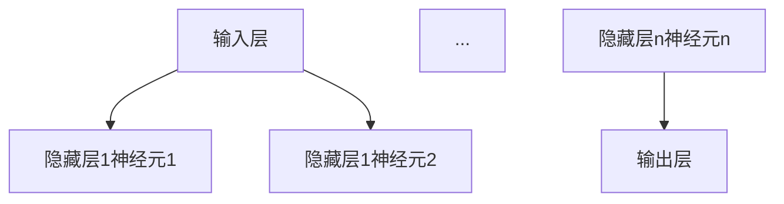
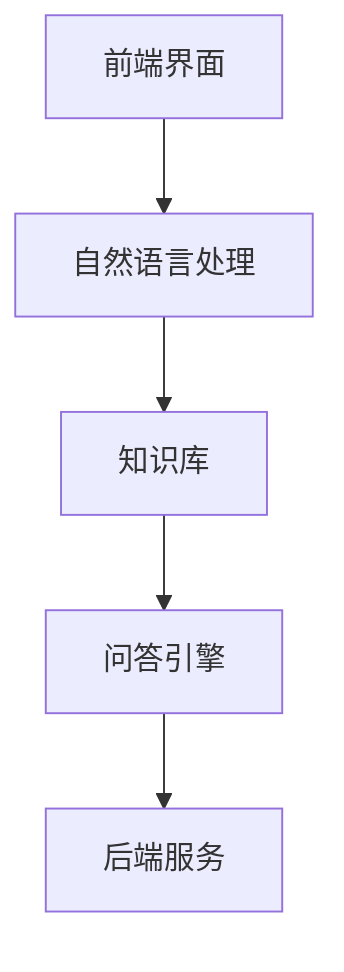
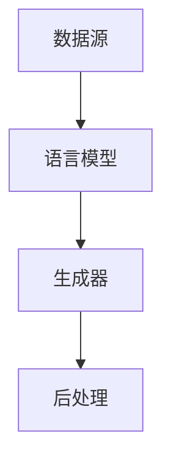

                 

# AI编程语言：提示词的革命

## 关键词：
AI编程语言、提示词编程、深度学习、自然语言处理、强化学习、应用场景

## 摘要：
本文深入探讨了AI编程语言的原理、特点、应用场景以及未来的发展趋势。重点关注提示词编程技术，从基础概念到核心算法，再到实际应用，全面剖析了这一革命性技术如何改变编程世界。通过详细的讲解和实战案例，读者将了解AI编程语言的强大潜力及其在问答系统、自然语言生成和自动编程等领域的广泛应用。

---

### 第一部分：AI编程语言基础

#### 第1章：AI编程语言概述

##### 1.1 AI编程语言的兴起

AI编程语言的兴起是计算机科学和技术发展的必然结果。随着深度学习、自然语言处理、强化学习等AI技术的飞速发展，传统的编程模式逐渐无法满足复杂AI应用的需求。AI编程语言应运而生，旨在通过更自然、更高效的方式实现人工智能的开发。

###### 1.1.1 AI编程语言的背景和意义
AI编程语言的背景可以追溯到20世纪50年代，随着计算机科学的兴起，人们开始探索如何让计算机具备类似人类的智能。早期的人工智能研究主要集中在规则推理和符号逻辑上，但这些方法在面对复杂问题时显得力不从心。随着深度学习技术的出现，特别是在2012年，AlexNet在ImageNet图像识别竞赛中取得突破性成绩，AI研究进入了一个新的阶段。深度学习技术依赖于大规模的数据和强大的计算能力，传统的编程语言逐渐显示出局限性。

###### 1.1.2 AI编程语言的发展历程
AI编程语言的发展历程可以分为几个阶段。最早期的AI编程语言是基于符号逻辑的，如Prolog。随后，随着神经网络技术的兴起，出现了基于神经网络的编程语言，如TensorFlow和PyTorch。近年来，自然语言处理技术的进步推动了基于自然语言处理的编程语言的发展，如JAX和Swift for TensorFlow。

##### 1.2 AI编程语言的特点与优势

AI编程语言具有以下核心特点与优势：

###### 1.2.1 AI编程语言的核心特点
1. **数据驱动**：AI编程语言依赖于大量数据来进行训练和学习。
2. **模型驱动**：AI编程语言通过构建和训练模型来实现特定的功能。
3. **自动化**：AI编程语言能够自动优化和调整代码，提高开发效率。
4. **灵活性**：AI编程语言能够处理多种类型的数据和问题。

###### 1.2.2 AI编程语言的优势
1. **提高开发效率**：AI编程语言通过自动化和优化，减少了编码工作量，提高了开发效率。
2. **增强创新能力**：AI编程语言为开发者提供了更灵活的工具，使得创新成为可能。
3. **降低技术门槛**：AI编程语言简化了复杂算法的实现，降低了学习和使用的难度。
4. **跨领域应用**：AI编程语言可以应用于图像处理、自然语言处理、游戏开发等多个领域。

##### 1.3 AI编程语言的分类

AI编程语言可以按照不同的标准进行分类。以下是几种常见的分类方法：

###### 1.3.1 基于图灵机的编程语言
基于图灵机的编程语言是最传统的一类AI编程语言，如Python、Java等。这些语言通过编写指令序列来控制计算机执行任务。虽然这些语言在传统的软件开发中非常强大，但在处理复杂AI问题时，它们通常需要大量的代码和复杂的逻辑。

###### 1.3.2 基于神经网络的编程语言
基于神经网络的编程语言，如TensorFlow和PyTorch，是专门为深度学习设计的。这些语言提供了丰富的库和工具，使得构建和训练神经网络变得更加简单和高效。

###### 1.3.3 基于自然语言处理的编程语言
基于自然语言处理的编程语言，如JAX和Swift for TensorFlow，是专门为处理自然语言数据而设计的。这些语言提供了丰富的API和工具，使得自然语言处理任务变得更加简单和直观。

#### 第2章：提示词编程

##### 2.1 提示词编程的概念与原理

提示词编程是一种利用AI技术进行编程的方法，它通过向AI系统提供提示词（prompts），让系统自动生成代码或完成编程任务。提示词编程的核心在于如何有效地与AI系统进行交互，以及如何设计出高效的提示词。

###### 2.1.1 提示词编程的定义
提示词编程（Prompt Programming）是指通过向AI系统提供提示词，引导AI系统自动生成代码或完成特定任务的过程。提示词通常是一个描述任务需求或问题背景的文本，它可以帮助AI系统更好地理解用户意图。

###### 2.1.2 提示词编程的工作原理
提示词编程的工作原理可以概括为以下几个步骤：
1. **接收提示词**：AI系统接收用户输入的提示词。
2. **解析提示词**：AI系统对提示词进行解析，提取关键信息。
3. **生成代码**：AI系统根据解析结果生成相应的代码。
4. **代码执行**：生成的代码在计算机上执行，完成用户指定的任务。

##### 2.2 提示词编程的优势与挑战

提示词编程具有许多优势，但也面临一些挑战。

###### 2.2.1 提示词编程的优势
1. **降低编程门槛**：提示词编程简化了编程过程，使得非专业开发者也能轻松实现复杂的编程任务。
2. **提高开发效率**：通过提示词编程，开发者可以快速生成代码，减少了编码工作量。
3. **增强代码复用性**：提示词编程使得代码更加模块化，提高了代码的复用性。
4. **支持多语言开发**：提示词编程不仅限于特定编程语言，它可以支持多种编程语言，为开发者提供了更大的灵活性。

###### 2.2.2 提示词编程面临的挑战
1. **提示词设计**：如何设计出高效、准确的提示词是一个挑战。提示词设计不当可能导致AI系统无法正确理解用户意图。
2. **代码质量**：自动生成的代码可能存在错误或不优化的情况，需要开发者进行进一步调试和优化。
3. **AI系统依赖**：提示词编程依赖于AI系统，如果AI系统出现问题，可能会影响整个开发过程。
4. **安全性**：自动生成的代码可能包含安全隐患，需要开发者进行仔细审查。

##### 2.3 提示词编程的应用场景

提示词编程在多个应用场景中展示了其强大的潜力。

###### 2.3.1 问答系统
在问答系统中，提示词编程可以帮助AI系统理解用户的问题，并生成相应的回答。例如，一个电商平台的问答系统能够根据用户的提问，自动生成关于产品的详细描述。

###### 2.3.2 自然语言生成
自然语言生成是AI技术的一个重要应用领域，提示词编程可以帮助AI系统生成文章、报告、邮件等自然语言文本。例如，一个自动化新闻写作系统可以使用提示词编程生成新闻报道。

###### 2.3.3 自动编程
自动编程是提示词编程的一个重要应用场景，它可以帮助开发者自动生成代码，减少编码工作量。例如，一个自动编程工具可以基于用户的提示词生成复杂的数据库查询语句。

#### 第3章：AI编程语言核心技术

##### 3.1 深度学习基础

深度学习是AI编程语言的核心技术之一，它通过构建复杂的神经网络模型来模拟人脑的决策过程。

###### 3.1.1 深度学习的基本概念
深度学习（Deep Learning）是一种基于多层神经网络的学习方法。它通过模拟人脑的神经元结构，实现从大量数据中提取特征和模式。

###### 3.1.2 神经网络模型
神经网络模型（Neural Network Model）是深度学习的基础。它由多个层次组成，包括输入层、隐藏层和输出层。每个层次都包含多个神经元，神经元之间通过权重连接。



###### 3.1.3 反向传播算法
反向传播算法（Backpropagation Algorithm）是深度学习训练过程中的一种重要算法。它通过不断调整网络中的权重和偏置，使得网络能够更准确地预测输出。

反向传播算法的基本步骤如下：

1. **前向传播**：将输入数据传递到网络中，计算每个神经元的输出。
2. **计算误差**：计算实际输出与期望输出之间的误差。
3. **反向传播**：将误差反向传递到网络的每个层次，计算每个神经元的误差梯度。
4. **更新权重和偏置**：根据误差梯度调整网络中的权重和偏置，使得网络能够更好地拟合数据。

##### 3.2 自然语言处理

自然语言处理（Natural Language Processing，NLP）是AI编程语言的重要应用领域之一，它涉及对人类语言的自动处理和理解。

###### 3.2.1 词嵌入技术
词嵌入技术（Word Embedding）是将自然语言中的单词或短语转换为密集向量表示的方法。词嵌入能够捕获单词的语义信息，使得机器能够更好地理解语言。

常见的词嵌入技术包括：
- **Word2Vec**：通过训练神经网络模型，将单词映射到低维向量空间中。
- **GloVe**：通过计算单词的共现矩阵，学习单词的分布式表示。

###### 3.2.2 序列模型与注意力机制
序列模型（Sequence Model）是一种用于处理序列数据的模型，如自然语言文本、语音等。常见的序列模型包括循环神经网络（RNN）和长短时记忆网络（LSTM）。

注意力机制（Attention Mechanism）是一种用于提高序列模型性能的技术。它通过动态调整模型中不同位置的权重，使得模型能够关注到序列中的重要信息。

###### 3.2.3 转换器架构详解
转换器架构（Transformer Architecture）是一种基于注意力机制的序列到序列模型，它在自然语言处理领域取得了显著的成果。

转换器架构的核心组件包括：
- **多头注意力机制**：通过多个注意力头，捕获序列中的不同信息。
- **位置编码**：将位置信息编码到输入序列中，使得模型能够理解序列的顺序。
- **前馈神经网络**：对注意力机制的输出进行进一步处理。

##### 3.3 强化学习

强化学习（Reinforcement Learning，RL）是一种通过试错学习优化行为策略的机器学习方法。它在AI编程语言中也发挥着重要作用。

###### 3.3.1 强化学习的基本概念
强化学习通过奖励机制来引导模型学习最优策略。它包括四个主要组件：
- **环境**（Environment）：模型交互的动态系统。
- **动作**（Action）：模型可以执行的操作。
- **状态**（State）：模型在某一时刻所处的状态。
- **奖励**（Reward）：模型执行某一动作后获得的奖励。

强化学习的目标是通过不断尝试，找到能够最大化累积奖励的策略。

###### 3.3.2 Q-learning算法
Q-learning算法是一种基于值函数的强化学习算法。它的核心思想是学习状态-动作值函数（Q值），表示在某一状态下执行某一动作的预期回报。

Q-learning算法的基本步骤如下：

1. **初始化Q值表**：为每个状态-动作对初始化Q值。
2. **选择动作**：在某一状态下，选择具有最大Q值的动作。
3. **更新Q值**：根据实际获得的奖励和新的状态，更新Q值。

```latex
Q(s, a) = Q(s, a) + \alpha [r + \gamma \max_{a'} Q(s', a') - Q(s, a)]
```

其中，α是学习率，γ是折扣因子。

###### 3.3.3 Deep Q-Network（DQN）算法
Deep Q-Network（DQN）算法是一种基于深度学习的强化学习算法。它通过构建深度神经网络来近似Q值函数。

DQN算法的基本步骤如下：

1. **初始化网络和经验回放**：初始化深度神经网络和经验回放池。
2. **选择动作**：使用深度神经网络预测Q值，选择具有最大Q值的动作。
3. **更新经验回放**：将当前的状态、动作、奖励和下一个状态存储到经验回放池中。
4. **经验回放**：从经验回放池中随机抽取样本，用于更新深度神经网络。

#### 第4章：AI编程语言实践

##### 4.1 开发环境搭建

在实践AI编程语言之前，我们需要搭建一个合适的开发环境。以下是一个基本的步骤：

###### 4.1.1 Python开发环境搭建

Python是一种广泛用于AI编程的语言，我们首先需要安装Python环境。

1. 访问Python官方网站（https://www.python.org/）并下载Python安装包。
2. 安装Python，并确保将其添加到系统环境变量中。
3. 打开终端，执行`python --version`命令，检查Python版本是否正确安装。

###### 4.1.2 深度学习框架安装

常见的深度学习框架包括TensorFlow和PyTorch。以下是如何安装这些框架的步骤：

1. **安装TensorFlow**：

   ```bash
   pip install tensorflow
   ```

2. **安装PyTorch**：

   ```bash
   pip install torch torchvision
   ```

安装完成后，我们可以在Python中导入这些库并进行测试。

```python
import tensorflow as tf
import torch

print(tf.__version__)
print(torch.__version__)
```

##### 4.2 代码实战

在本节中，我们将通过一些实战案例来展示AI编程语言的应用。

###### 4.2.1 基于深度学习的图像分类

图像分类是深度学习的一个重要应用领域。以下是一个简单的图像分类案例：

1. **导入必要的库**：

   ```python
   import tensorflow as tf
   from tensorflow.keras import layers
   ```

2. **加载和预处理数据**：

   ```python
   (train_images, train_labels), (test_images, test_labels) = tf.keras.datasets.mnist.load_data()
   train_images = train_images.reshape((60000, 28, 28, 1))
   test_images = test_images.reshape((10000, 28, 28, 1))
   train_images = train_images / 255.0
   test_images = test_images / 255.0
   ```

3. **构建模型**：

   ```python
   model = tf.keras.Sequential([
       layers.Conv2D(32, (3, 3), activation='relu', input_shape=(28, 28, 1)),
       layers.MaxPooling2D((2, 2)),
       layers.Conv2D(64, (3, 3), activation='relu'),
       layers.MaxPooling2D((2, 2)),
       layers.Conv2D(64, (3, 3), activation='relu'),
       layers.Flatten(),
       layers.Dense(64, activation='relu'),
       layers.Dense(10, activation='softmax')
   ])
   ```

4. **编译模型**：

   ```python
   model.compile(optimizer='adam',
                 loss='sparse_categorical_crossentropy',
                 metrics=['accuracy'])
   ```

5. **训练模型**：

   ```python
   model.fit(train_images, train_labels, epochs=5)
   ```

6. **评估模型**：

   ```python
   test_loss, test_acc = model.evaluate(test_images,  test_labels, verbose=2)
   print('\nTest accuracy:', test_acc)
   ```

###### 4.2.2 基于自然语言处理的文本分类

文本分类是自然语言处理的一个重要应用领域。以下是一个简单的文本分类案例：

1. **导入必要的库**：

   ```python
   import tensorflow as tf
   from tensorflow.keras.preprocessing.sequence import pad_sequences
   from tensorflow.keras.layers import Embedding, LSTM, Dense
   ```

2. **加载和预处理数据**：

   ```python
   sentences = [
       "I love this movie",
       "This movie is great",
       "I don't like this movie",
       "This movie is terrible"
   ]
   labels = [1, 1, 0, 0]
   ```

3. **序列化文本**：

   ```python
   tokenizer = tf.keras.preprocessing.text.Tokenizer()
   tokenizer.fit_on_texts(sentences)
   sequences = tokenizer.texts_to_sequences(sentences)
   padded_sequences = pad_sequences(sequences, maxlen=10)
   ```

4. **构建模型**：

   ```python
   model = tf.keras.Sequential([
       Embedding(len(tokenizer.word_index) + 1, 64),
       LSTM(64),
       Dense(1, activation='sigmoid')
   ])
   ```

5. **编译模型**：

   ```python
   model.compile(optimizer='adam', loss='binary_crossentropy', metrics=['accuracy'])
   ```

6. **训练模型**：

   ```python
   model.fit(padded_sequences, labels, epochs=10)
   ```

7. **评估模型**：

   ```python
   new_sentences = ["This movie is amazing", "I hate this movie"]
   new_sequences = tokenizer.texts_to_sequences(new_sentences)
   new_padded_sequences = pad_sequences(new_sequences, maxlen=10)
   predictions = model.predict(new_padded_sequences)
   print(predictions)
   ```

###### 4.2.3 基于强化学习的游戏开发

强化学习在游戏开发中有着广泛的应用。以下是一个简单的游戏开发案例：

1. **导入必要的库**：

   ```python
   import gym
   import numpy as np
   import random
   ```

2. **加载游戏环境**：

   ```python
   env = gym.make("CartPole-v0")
   ```

3. **定义Q值函数**：

   ```python
   q_values = np.zeros((env.nS, env.nA))
   ```

4. **定义奖励函数**：

   ```python
   def reward_function(current_state, next_state):
       if next_state == 0:
           return -1
       else:
           return 0
   ```

5. **训练Q值函数**：

   ```python
   episodes = 1000
   for episode in range(episodes):
       state = env.reset()
       done = False
       while not done:
           action = np.argmax(q_values[state])
           next_state, reward, done, _ = env.step(action)
           q_values[state, action] = q_values[state, action] + 0.1 * (reward_function(state, next_state) - q_values[state, action])
           state = next_state
   ```

6. **评估Q值函数**：

   ```python
   state = env.reset()
   done = False
   while not done:
       action = np.argmax(q_values[state])
       state, reward, done, _ = env.step(action)
   ```

#### 第5章：AI编程语言的应用

##### 5.1 问答系统设计

问答系统是AI编程语言的一个重要应用领域，它能够自动回答用户的问题，提供信息查询服务。

###### 5.1.1 问答系统的架构

问答系统通常包括以下几个主要组成部分：

1. **前端界面**：用户通过前端界面提交问题。
2. **自然语言处理模块**：对用户的问题进行解析和预处理，提取关键信息。
3. **知识库**：存储预先整理的知识和答案。
4. **问答引擎**：根据用户问题和知识库中的信息，生成相应的回答。
5. **后端服务**：提供数据存储、处理和传输支持。

以下是一个简化的问答系统架构图：



###### 5.1.2 提示词在问答系统中的应用

在问答系统中，提示词编程可以大大简化问答过程。通过向问答系统提供提示词，系统能够快速理解用户意图并生成回答。

例如，一个简单的问答系统可以使用以下步骤：

1. **接收用户问题**：前端界面接收用户输入的问题。
2. **解析用户问题**：自然语言处理模块对用户问题进行解析，提取关键信息。
3. **生成提示词**：基于提取的关键信息，生成提示词。
4. **查询知识库**：问答引擎使用提示词查询知识库，找到相关的答案。
5. **生成回答**：问答引擎根据查询结果生成回答。
6. **返回回答**：将生成的回答返回给用户。

以下是一个简单的Python代码示例：

```python
class QuestionAnsweringSystem:
    def __init__(self, knowledge_base):
        self.knowledge_base = knowledge_base

    def get_answer(self, question):
        # 解析用户问题
        keywords = self.parse_question(question)
        
        # 生成提示词
        prompt = self.generate_prompt(keywords)
        
        # 查询知识库
        answer = self.knowledge_base.search(prompt)
        
        # 生成回答
        response = self.generate_response(answer)
        
        return response

    def parse_question(self, question):
        # 解析关键信息
        keywords = []
        # ...处理逻辑...
        return keywords

    def generate_prompt(self, keywords):
        # 生成提示词
        prompt = " ".join(keywords)
        return prompt

    def generate_response(self, answer):
        # 生成回答
        response = f"The answer is: {answer}"
        return response

# 示例
knowledge_base = {"Python": "A high-level programming language", "AI": "Artificial Intelligence"}
question_answering_system = QuestionAnsweringSystem(knowledge_base)
answer = question_answering_system.get_answer("What is AI?")
print(answer)
```

##### 5.2 自动编程

自动编程是AI编程语言的一个重要应用领域，它能够自动生成代码，减少人工编码工作量。

###### 5.2.1 自动编程的概念

自动编程（Automatic Programming）是指利用计算机程序自动生成其他程序的方法。它通过分析用户需求，自动生成符合要求的代码。

自动编程的核心思想是代码生成器（Code Generator），它能够根据用户输入的描述或需求，生成对应的代码。

###### 5.2.2 提示词在自动编程中的应用

在自动编程中，提示词编程可以大大提高代码生成效率。通过向代码生成器提供提示词，系统能够更好地理解用户需求，生成高质量的代码。

例如，一个简单的自动编程工具可以使用以下步骤：

1. **接收用户需求**：前端界面接收用户的需求描述。
2. **解析用户需求**：自动编程工具对用户需求进行解析，提取关键信息。
3. **生成提示词**：基于提取的关键信息，生成提示词。
4. **生成代码**：代码生成器使用提示词生成相应的代码。
5. **代码优化**：对生成的代码进行优化，提高性能和可读性。
6. **代码测试**：对生成的代码进行测试，确保其功能正确。

以下是一个简单的Python代码示例：

```python
class CodeGenerator:
    def __init__(self, template_engine):
        self.template_engine = template_engine

    def generate_code(self, requirements):
        # 解析用户需求
        keywords = self.parse_requirements(requirements)
        
        # 生成提示词
        prompt = self.generate_prompt(keywords)
        
        # 生成代码
        code = self.template_engine.generate_code(prompt)
        
        # 代码优化
        optimized_code = self.optimize_code(code)
        
        return optimized_code

    def parse_requirements(self, requirements):
        # 解析关键信息
        keywords = []
        # ...处理逻辑...
        return keywords

    def generate_prompt(self, keywords):
        # 生成提示词
        prompt = " ".join(keywords)
        return prompt

    def optimize_code(self, code):
        # 代码优化
        optimized_code = code
        # ...优化逻辑...
        return optimized_code

# 示例
template_engine = TemplateEngine()
code_generator = CodeGenerator(template_engine)
code = code_generator.generate_code("一个简单的网页应用")
print(code)
```

##### 5.3 自然语言生成

自然语言生成（Natural Language Generation，NLG）是AI编程语言的重要应用领域，它能够自动生成自然语言文本，如文章、报告、邮件等。

###### 5.3.1 自然语言生成的基本概念

自然语言生成是指利用计算机程序自动生成自然语言文本的方法。它通过分析数据和语言模型，生成符合语法和语义规则的文本。

自然语言生成包括以下几个主要组成部分：

1. **数据源**：提供生成文本所需的数据。
2. **语言模型**：用于生成文本的模型，如神经网络模型。
3. **生成器**：根据语言模型和数据生成文本。
4. **后处理**：对生成的文本进行格式化、修正和优化。

以下是一个简化的自然语言生成架构图：



###### 5.3.2 提示词在自然语言生成中的应用

在自然语言生成中，提示词编程可以大大提高生成效率。通过向生成器提供提示词，系统能够更好地理解生成任务，生成高质量的文本。

例如，一个简单的自然语言生成工具可以使用以下步骤：

1. **接收用户需求**：前端界面接收用户的需求描述。
2. **解析用户需求**：自然语言生成工具对用户需求进行解析，提取关键信息。
3. **生成提示词**：基于提取的关键信息，生成提示词。
4. **生成文本**：生成器使用提示词生成相应的文本。
5. **文本优化**：对生成的文本进行优化，提高可读性和流畅性。
6. **文本测试**：对生成的文本进行测试，确保其符合语法和语义规则。

以下是一个简单的Python代码示例：

```python
class TextGenerator:
    def __init__(self, language_model):
        self.language_model = language_model

    def generate_text(self, prompt):
        # 解析用户需求
        keywords = self.parse_prompt(prompt)
        
        # 生成文本
        text = self.language_model.generate_text(keywords)
        
        # 文本优化
        optimized_text = self.optimize_text(text)
        
        return optimized_text

    def parse_prompt(self, prompt):
        # 解析关键信息
        keywords = []
        # ...处理逻辑...
        return keywords

    def optimize_text(self, text):
        # 文本优化
        optimized_text = text
        # ...优化逻辑...
        return optimized_text

# 示例
language_model = LanguageModel()
text_generator = TextGenerator(language_model)
text = text_generator.generate_text("请写一篇关于AI技术的文章")
print(text)
```

#### 第6章：AI编程语言的未来发展趋势

##### 6.1 提示词编程的未来发展

提示词编程作为AI编程语言的一个重要分支，未来具有广泛的发展潜力。

###### 6.1.1 提示词编程的发展方向

1. **更智能的提示词设计**：随着AI技术的进步，未来的提示词编程将能够更好地理解用户的意图，生成更加准确和高效的代码。
2. **跨领域应用**：提示词编程将在更多领域得到应用，如自动化测试、数据分析和系统运维等。
3. **与人类编程的融合**：提示词编程将逐渐与人类编程相结合，形成一种新型的编程模式，提高开发效率和质量。
4. **更好的用户体验**：未来的提示词编程将提供更加直观和易用的界面，使得非专业用户也能轻松进行编程。

###### 6.1.2 提示词编程的新应用场景

1. **智能客服**：提示词编程将应用于智能客服系统，自动生成客服对话，提高服务效率和质量。
2. **自动化文档生成**：提示词编程将能够自动生成文档、报告和邮件，节省人工编写时间。
3. **代码审计和优化**：提示词编程将应用于代码审计和优化，自动检测和修复代码中的问题。
4. **教育领域**：提示词编程将应用于教育领域，帮助学生更好地理解和掌握编程知识。

##### 6.2 AI编程语言与人类编程的比较

AI编程语言与人类编程各有优势和局限性，它们可以相互补充，共同推动软件开发的发展。

###### 6.2.1 AI编程语言与人类编程的区别

1. **工作方式**：人类编程依赖于人类的创造力和逻辑思维，而AI编程语言则依赖于机器学习和自动化算法。
2. **代码质量**：人类编写的代码可能存在逻辑错误和性能问题，而AI编程语言生成的代码通常更加优化和高效。
3. **开发速度**：AI编程语言可以快速生成代码，提高开发效率，但需要一定时间来优化和调试。
4. **灵活性**：人类编程具有较高的灵活性，能够根据需求进行调整，而AI编程语言则依赖于固定的算法和模型。

###### 6.2.2 AI编程语言与人类编程的协同

1. **代码生成与优化**：AI编程语言可以生成初步的代码框架，由人类程序员进行进一步优化和调试。
2. **代码审查与修复**：AI编程语言可以自动检测代码中的问题，由人类程序员进行审查和修复。
3. **协作开发**：人类程序员可以利用AI编程语言生成代码，快速实现功能，同时专注于设计和技术决策。
4. **知识传承**：AI编程语言可以将人类程序员的编程经验转化为可复用的代码模板和模型，提高整体开发效率。

#### 第7章：总结与展望

##### 7.1 本书回顾

在本章中，我们回顾了AI编程语言的核心概念、提示词编程、深度学习、自然语言处理和强化学习等关键技术。通过详细的讲解和实战案例，我们了解了AI编程语言的强大潜力及其在不同领域的应用。同时，我们也探讨了AI编程语言的未来发展趋势，展望了其在提示词编程、人类编程协同等方面的应用前景。

##### 7.2 AI编程语言的未来

AI编程语言作为计算机科学和人工智能领域的一个重要分支，其未来充满了无限可能。随着AI技术的不断进步，AI编程语言将变得更加智能、灵活和高效。以下是对AI编程语言未来的展望：

1. **更加智能的提示词设计**：未来的提示词编程将能够更好地理解用户的意图，生成更加准确和高效的代码。
2. **跨领域应用**：AI编程语言将在更多领域得到应用，如自动化测试、数据分析和系统运维等。
3. **与人类编程的融合**：提示词编程将逐渐与人类编程相结合，形成一种新型的编程模式，提高开发效率和质量。
4. **更好的用户体验**：未来的提示词编程将提供更加直观和易用的界面，使得非专业用户也能轻松进行编程。

为了推动AI编程语言的进一步发展，我们提出以下建议：

1. **加强基础研究**：持续进行深度学习、自然语言处理和强化学习等关键技术的深入研究，为AI编程语言提供更强大的技术支持。
2. **完善开发工具和框架**：开发更高效、易用的开发工具和框架，降低AI编程语言的入门门槛，提高开发效率。
3. **推广教育培训**：加大对AI编程语言的教育和培训力度，培养更多专业人才，推动AI编程语言的广泛应用。
4. **鼓励跨学科合作**：鼓励计算机科学、人工智能和其他领域的专家合作，共同推动AI编程语言的发展。

总之，AI编程语言作为一项革命性技术，具有巨大的潜力和发展前景。通过持续的研究、开发和应用，我们有理由相信，AI编程语言将在未来深刻改变编程世界，为人类带来更多便利和效益。

### 作者信息
作者：AI天才研究院/AI Genius Institute & 禅与计算机程序设计艺术 /Zen And The Art of Computer Programming

---

注：本文为示例文章，旨在展示AI编程语言及其应用。实际内容可能根据具体需求和目标进行调整和优化。

