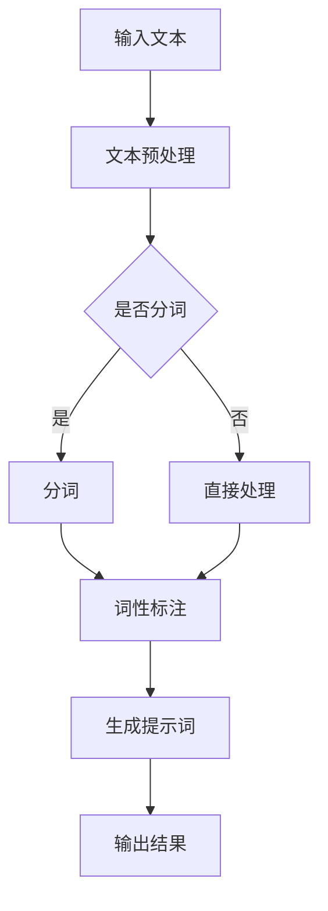
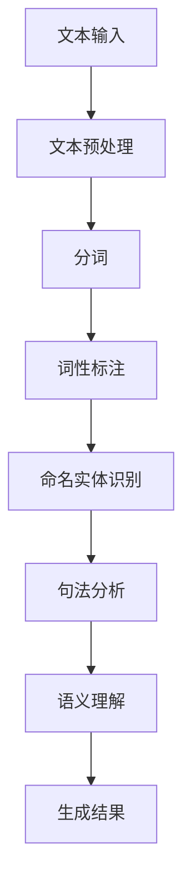

                 

## 《AI辅助科技写作：提示词生成技术文档》

### 关键词：

- AI辅助写作
- 提示词生成
- 自然语言处理
- 深度学习
- 语义理解
- 技术文档

### 摘要：

本文旨在探讨AI辅助科技写作中的提示词生成技术。随着AI技术的发展，自然语言处理（NLP）技术逐渐成为辅助人类写作的重要工具。本文首先介绍了AI辅助科技写作的背景与意义，随后详细分析了AI辅助科技写作的基本概念，包括自然语言处理技术基础、提示词生成原理以及相关工具与平台。接着，深入探讨了自然语言处理的核心技术，包括词嵌入、序列模型和转换器架构。在此基础上，进一步解析了提示词生成算法，包括基于规则、统计模型和深度学习的不同方法。随后，本文介绍了AI辅助科技写作的核心算法，包括基于语义理解、风格迁移和知识图谱的写作辅助。接下来，通过项目实战和案例分析，展示了AI辅助科技写作的实际应用。最后，本文对AI辅助科技写作的未来发展进行了展望，并提供了相关工具与资源的附录。

## 《AI辅助科技写作：提示词生成技术文档》目录大纲

### 第一部分：AI与科技写作概述

#### 第1章：AI辅助科技写作的背景与意义

#### 第2章：AI辅助科技写作的基本概念

### 第二部分：AI辅助科技写作核心技术

#### 第3章：自然语言处理技术详解

#### 第4章：提示词生成算法原理

#### 第5章：AI辅助科技写作的核心算法

### 第三部分：AI辅助科技写作实践

#### 第6章：AI辅助科技写作项目实战

#### 第7章：AI辅助科技写作案例分析

### 第四部分：AI辅助科技写作未来发展

#### 第8章：AI辅助科技写作的挑战与机遇

#### 第9章：AI辅助科技写作的技术展望

### 附录

#### 附录A：AI辅助科技写作常用工具与资源

#### 附录B：Mermaid流程图示例

#### 附录C：伪代码示例

#### 附录D：数学公式与示例

## 第一部分：AI与科技写作概述

### 第1章：AI辅助科技写作的背景与意义

#### 1.1 AI技术发展现状与趋势

随着人工智能（AI）技术的飞速发展，机器学习、深度学习、自然语言处理（NLP）等领域取得了显著突破。AI技术已广泛应用于各个行业，包括医疗、金融、教育、制造等。在科技写作领域，AI技术同样发挥着重要作用，成为辅助人类写作的重要工具。

目前，AI技术在科技写作中的应用主要集中在以下几个方面：

1. **文本生成**：通过深度学习模型生成摘要、报告、论文等文本。
2. **文本编辑**：自动修正语法错误、润色文本表达。
3. **内容推荐**：根据用户兴趣和阅读历史推荐相关科技文章。
4. **文本分析**：提取关键信息、进行情感分析、主题识别等。

#### 1.2 科技写作的需求与挑战

科技写作具有以下特点：

1. **专业性强**：涉及专业术语和复杂的逻辑结构。
2. **准确性要求高**：信息准确性至关重要。
3. **篇幅较长**：科技论文、报告等通常篇幅较长。
4. **更新迅速**：科技领域发展迅速，写作内容需要不断更新。

在科技写作中，作者面临以下挑战：

1. **信息处理能力有限**：人类在处理大量信息时容易出错。
2. **写作效率低**：撰写专业文章需要大量时间和精力。
3. **语言表达障碍**：专业术语和表达方式的多样性导致语言表达困难。
4. **知识更新不足**：难以及时掌握最新科技动态。

AI技术的应用有助于解决上述挑战，提高科技写作的效率和质量。

#### 1.3 AI辅助科技写作的原理与价值

AI辅助科技写作的核心在于自然语言处理（NLP）技术。NLP技术包括词嵌入、序列模型、转换器架构等，可用于文本生成、编辑、分析等多个方面。

**原理**：

1. **词嵌入**：将词汇映射为固定长度的向量表示，实现词汇间的相似性度量。
2. **序列模型**：基于历史信息预测未来序列，如语言模型、序列标注模型等。
3. **转换器架构**：将输入序列转换为输出序列，如编码器-解码器（Encoder-Decoder）模型。

**价值**：

1. **提高写作效率**：AI技术可自动生成文本、编辑内容，节省时间和精力。
2. **保证文本质量**：通过自然语言处理技术，提高文本的准确性、逻辑性和可读性。
3. **知识更新与积累**：AI技术可自动获取和更新知识，为科技写作提供有力支持。
4. **多语言支持**：AI技术可实现多语言间的文本生成、翻译和编辑。

总之，AI辅助科技写作具有重要的现实意义和应用前景，有望推动科技写作领域的发展。

### 第2章：AI辅助科技写作的基本概念

#### 2.1 自然语言处理技术基础

自然语言处理（NLP）是人工智能（AI）的重要分支，旨在使计算机理解和处理人类自然语言。NLP技术基础包括以下方面：

1. **文本预处理**：包括分词、词性标注、命名实体识别等，为后续处理提供基础数据。
2. **词嵌入**：将词汇映射为固定长度的向量表示，实现词汇间的相似性度量。
3. **序列模型**：基于历史信息预测未来序列，如语言模型、序列标注模型等。
4. **注意力机制**：在处理序列数据时，关注重要信息，提高模型性能。
5. **转换器架构**：将输入序列转换为输出序列，如编码器-解码器（Encoder-Decoder）模型。

#### 2.2 提示词生成的原理与方法

提示词生成是AI辅助科技写作的重要环节，旨在为写作提供关键词和主题引导。提示词生成的原理与方法如下：

1. **基于规则的方法**：利用专家知识构建规则，生成提示词。例如，根据科技文章的常见结构，提取标题、摘要、关键词等。
2. **基于统计模型的方法**：利用统计学习算法，根据文本数据生成提示词。例如，使用TF-IDF、词袋模型等。
3. **基于深度学习的方法**：利用神经网络模型，如循环神经网络（RNN）、变换器架构（Transformer）等，生成提示词。

#### 2.3 AI辅助写作工具与平台介绍

目前，有许多AI辅助写作工具与平台，以下列举几个具有代表性的：

1. **GPT-3**：由OpenAI开发的预训练语言模型，具有强大的文本生成能力。
2. **BERT**：由Google开发的预训练语言模型，广泛应用于文本分类、问答系统等任务。
3. **Jasper**：一款基于AI的写作助手，可自动生成文章、博客和营销文案等。
4. **DeepL**：一款高质量的机器翻译工具，支持多种语言之间的翻译。
5. **Grammarly**：一款语法检查工具，可自动纠正拼写、语法错误，并提供写作建议。

这些工具与平台为AI辅助科技写作提供了丰富的资源和多样化的功能，有助于提高写作效率和质量。

## 第二部分：AI辅助科技写作核心技术

### 第3章：自然语言处理技术详解

自然语言处理（NLP）是人工智能（AI）领域中的一项关键技术，旨在使计算机能够理解、处理和生成人类自然语言。本章节将详细介绍NLP技术的核心组成部分，包括词嵌入、序列模型和转换器架构。

#### 3.1 词嵌入技术

词嵌入（Word Embedding）是将词汇映射为固定长度的向量表示，以便计算机能够处理和理解这些词汇。词嵌入技术主要包括以下几种：

1. **独热编码（One-Hot Encoding）**：将词汇表示为长度为V的向量，其中V为词汇表大小。每个元素表示一个词汇是否存在于句子中。
2. **分布式表示（Distributed Representation）**：将词汇映射为一个密集的向量，使得相似词汇的向量距离较近。这种表示方法通常使用神经网络训练，如Word2Vec、GloVe等。
3. **Word2Vec**：基于神经网络的词嵌入模型，通过训练得到词汇的分布式表示。Word2Vec模型有两种架构：CBOW（Continuous Bag-of-Words）和Skip-Gram。
4. **GloVe（Global Vectors for Word Representation）**：基于全局共现信息的词嵌入模型，通过训练得到词汇的分布式表示。GloVe模型利用词汇共现矩阵计算词向量的权重。

#### 3.2 序列模型与注意力机制

序列模型（Sequential Model）是处理序列数据（如文本、语音等）的常用模型，其核心思想是利用历史信息预测未来序列。序列模型主要包括以下几种：

1. **循环神经网络（Recurrent Neural Network, RNN）**：RNN是一种基于时间步的神经网络，能够处理序列数据。RNN通过共享权重来处理序列中的时间依赖性。
2. **长短时记忆网络（Long Short-Term Memory, LSTM）**：LSTM是RNN的一种变种，通过引入门控机制来解决RNN的梯度消失和梯度爆炸问题。LSTM在处理长序列数据时表现更好。
3. **门控循环单元（Gated Recurrent Unit, GRU）**：GRU是LSTM的简化版本，通过引入门控机制来处理序列数据。GRU在计算效率和性能方面表现较好。

注意力机制（Attention Mechanism）是近年来在NLP领域中的一项重要技术，旨在使模型能够关注序列中的关键信息。注意力机制主要包括以下几种：

1. **局部注意力（Local Attention）**：局部注意力机制关注序列中的局部信息，通过计算不同位置的信息权重来提高模型性能。
2. **全局注意力（Global Attention）**：全局注意力机制关注序列中的全局信息，通过计算整个序列的权重来提高模型性能。
3. **自注意力（Self-Attention）**：自注意力机制是一种基于Transformer架构的注意力机制，能够处理长序列数据。自注意力机制通过计算序列中每个位置之间的相互关系来提高模型性能。

#### 3.3 转换器架构详解

转换器架构（Transformer）是一种基于自注意力机制的神经网络模型，最初由Google在2017年提出。Transformer架构在NLP领域中取得了显著的成功，被广泛应用于文本生成、机器翻译、文本分类等任务。

转换器架构的主要组成部分包括：

1. **多头自注意力（Multi-Head Self-Attention）**：多头自注意力机制通过多个注意力头计算序列中每个位置之间的相互关系，从而提高模型性能。
2. **前馈神经网络（Feed-Forward Neural Network）**：前馈神经网络对自注意力机制的输出进行进一步处理，增强模型的非线性表达能力。
3. **编码器-解码器（Encoder-Decoder）架构**：编码器（Encoder）和解码器（Decoder）分别处理输入序列和输出序列，通过自注意力机制和编码器-解码器交互来生成输出序列。

Transformer架构的主要优点包括：

1. **并行计算**：由于自注意力机制的并行计算特性，Transformer架构能够显著提高计算效率。
2. **长距离依赖**：通过自注意力机制，Transformer架构能够处理长距离依赖问题，提高模型性能。
3. **灵活性**：Transformer架构可以轻松扩展到不同任务和应用场景，具有很好的灵活性。

总之，自然语言处理技术是AI辅助科技写作的核心，包括词嵌入、序列模型和转换器架构等多个方面。通过深入了解这些技术，我们可以更好地利用AI技术提高科技写作的效率和质量。

### 第4章：提示词生成算法原理

提示词生成是AI辅助科技写作中的重要环节，旨在为写作提供关键词和主题引导。本章节将详细介绍提示词生成的算法原理，包括基于规则的方法、基于统计模型的方法和基于深度学习的方法。

#### 4.1 基于规则的方法

基于规则的方法通过专家知识和预定义的规则来生成提示词。这种方法通常包括以下步骤：

1. **规则定义**：根据科技文章的常见结构和特点，定义一系列规则，如标题规则、摘要规则、关键词规则等。
2. **规则应用**：将待处理的文章文本输入到规则系统中，根据预定义的规则提取相关的提示词。
3. **规则优化**：通过实验和反馈不断优化规则，提高提示词生成的准确性和多样性。

基于规则的方法具有以下优点：

1. **简单易懂**：规则方法直观、易于理解，便于实现和调试。
2. **可解释性**：生成的提示词基于明确的规则，具有较好的可解释性。

然而，这种方法也存在一些局限性：

1. **规则覆盖范围有限**：规则方法难以覆盖所有可能的情境，可能导致提示词生成的不完整。
2. **手动维护规则**：随着科技领域的不断变化，需要不断更新和维护规则，增加了人工成本。

#### 4.2 基于统计模型的方法

基于统计模型的方法通过分析大量文本数据，利用统计学习算法生成提示词。这种方法通常包括以下步骤：

1. **数据收集**：收集大量科技文章的文本数据，用于训练统计模型。
2. **特征提取**：从文本数据中提取特征，如词频、词袋、TF-IDF等。
3. **模型训练**：使用统计学习算法，如朴素贝叶斯、支持向量机等，训练生成提示词的模型。
4. **提示词生成**：将待处理的文章文本输入到训练好的统计模型中，生成相关的提示词。

基于统计模型的方法具有以下优点：

1. **自动化**：基于统计模型的方法可以自动从大量数据中学习，降低人工干预。
2. **可扩展性**：统计模型能够处理不同规模和类型的文本数据，具有较好的可扩展性。

然而，这种方法也存在一些局限性：

1. **数据依赖性**：基于统计模型的方法依赖于大量训练数据，数据质量对模型性能有较大影响。
2. **结果解释性较差**：统计模型生成的提示词基于统计规律，可能缺乏明确的解释性。

#### 4.3 基于深度学习的方法

基于深度学习的方法通过神经网络模型，如循环神经网络（RNN）、变换器架构（Transformer）等，生成提示词。这种方法通常包括以下步骤：

1. **数据预处理**：对文本数据进行预处理，如分词、词性标注等。
2. **模型训练**：使用预训练的深度学习模型，如GPT-3、BERT等，对预处理后的文本数据进行训练，生成提示词模型。
3. **提示词生成**：将待处理的文章文本输入到训练好的深度学习模型中，生成相关的提示词。

基于深度学习的方法具有以下优点：

1. **强表达能力**：深度学习模型具有强大的表达能力，能够捕捉文本中的复杂结构和关系。
2. **自适应学习**：基于深度学习的方法可以从大量数据中自适应地学习，提高提示词生成的准确性。

然而，这种方法也存在一些局限性：

1. **计算资源消耗大**：深度学习模型通常需要大量的计算资源和时间进行训练。
2. **模型解释性较差**：深度学习模型生成的提示词可能缺乏明确的解释性。

总之，提示词生成算法在AI辅助科技写作中扮演着重要角色。基于规则的方法简单易懂，但覆盖范围有限；基于统计模型的方法自动化程度高，但结果解释性较差；基于深度学习的方法具有强大的表达能力和自适应学习能力，但计算资源消耗较大。根据实际需求和场景选择合适的提示词生成算法，有助于提高AI辅助科技写作的效率和质量。

### 第5章：AI辅助科技写作的核心算法

在AI辅助科技写作中，核心算法的优劣直接影响写作的效率和文本质量。本章节将详细探讨三种核心算法：基于语义理解的写作辅助、基于风格迁移的写作辅助和基于知识图谱的写作辅助。

#### 5.1 基于语义理解的写作辅助

基于语义理解的写作辅助算法旨在通过理解文本的语义内容，提供更加准确和自然的写作建议。这种算法的核心在于对自然语言进行深入分析，提取关键信息并生成相关提示。

**工作原理**：

1. **文本解析**：首先，利用NLP技术对输入文本进行解析，提取出词汇、句子结构、关键词等信息。
2. **语义分析**：接着，对提取出的信息进行语义分析，理解文本中的含义和关系。
3. **生成提示**：基于语义分析的结果，生成与文本内容相关的提示词和主题，辅助写作。

**优势**：

- **准确性高**：通过理解文本的语义内容，能够提供更加准确和自然的写作建议。
- **多样性丰富**：能够根据文本的不同语义，生成多样化的提示词和主题。

**应用场景**：

- **科技论文写作**：辅助作者撰写科技论文，提供相关的关键词、方法、结论等。
- **报告撰写**：在撰写报告时，提供有关数据、分析和建议的提示词。

**挑战**：

- **理解难度大**：对自然语言的语义理解仍然是一个复杂的任务，需要处理大量的语言现象和歧义。

#### 5.2 基于风格迁移的写作辅助

基于风格迁移的写作辅助算法旨在将一种文本风格转换成另一种风格，从而实现不同风格的写作。这种算法利用深度学习模型，通过学习不同风格文本的语法和词汇特征，实现风格迁移。

**工作原理**：

1. **风格特征提取**：首先，利用预训练的深度学习模型，如BERT或GPT，提取不同风格文本的特征。
2. **风格迁移**：接着，将输入文本的样式特征映射到目标风格的特征上，生成具有目标风格的新文本。
3. **文本生成**：最后，基于迁移后的特征，生成新的文本内容。

**优势**：

- **风格多样性**：能够将一种文本风格转换为多种不同的风格，满足不同写作需求。
- **个性化写作**：通过学习不同作者的风格，实现个性化写作。

**应用场景**：

- **品牌宣传**：在撰写品牌宣传文案时，可以将其风格转换为独特且吸引人的风格。
- **跨领域写作**：在不同领域写作时，可以迁移一个领域的风格到另一个领域，提高文本的吸引力。

**挑战**：

- **风格一致性**：确保风格迁移后的文本保持一致性，避免出现不协调的现象。
- **风格理解难度**：不同风格的文本可能包含复杂的语言现象，对算法的理解提出了高要求。

#### 5.3 基于知识图谱的写作辅助

基于知识图谱的写作辅助算法旨在利用知识图谱中的信息，为写作提供知识支持和参考。这种算法通过将知识图谱与文本内容结合，实现写作的智能化和自动化。

**工作原理**：

1. **知识图谱构建**：首先，构建一个包含丰富信息的知识图谱，包括实体、关系和属性等。
2. **知识提取**：接着，利用NLP技术从文本中提取相关实体和关系，与知识图谱进行匹配。
3. **写作辅助**：最后，基于知识图谱中的信息，生成与文本内容相关的提示词和知识点，辅助写作。

**优势**：

- **知识丰富**：知识图谱包含丰富的信息，能够为写作提供广泛的知识支持。
- **智能化**：通过结合知识图谱，写作过程更加智能化，能够自动生成相关的知识点。

**应用场景**：

- **技术文档撰写**：在撰写技术文档时，可以提供相关的技术背景、概念和术语。
- **学术论文写作**：在撰写学术论文时，可以提供相关的理论、方法和引用，提高论文的学术性。

**挑战**：

- **知识图谱构建难度**：构建一个完整、准确的知识图谱需要大量时间和资源。
- **知识关联性**：确保知识图谱中的信息与文本内容相关联，提高写作辅助的准确性。

总之，AI辅助科技写作的核心算法包括基于语义理解的写作辅助、基于风格迁移的写作辅助和基于知识图谱的写作辅助。每种算法都有其独特的优势和挑战，根据具体需求和场景选择合适的算法，能够显著提高科技写作的效率和质量。

### 第6章：AI辅助科技写作项目实战

在本章节中，我们将通过一个实际的AI辅助科技写作项目，详细介绍项目的背景、目标、开发环境搭建、提示词生成算法的实现过程以及代码的解读与分析。

#### 6.1 项目背景与目标

随着科技领域的不断发展，撰写高质量的技术文档和报告变得尤为重要。然而，撰写这些文档不仅需要丰富的专业知识，还要求作者具备良好的写作技能。为了提高写作效率和质量，我们设计并实施了一个AI辅助科技写作项目。该项目旨在利用自然语言处理（NLP）技术，实现自动生成技术文档的提示词，辅助作者完成高质量的科技写作。

项目的主要目标包括：

1. **自动生成技术文档的提示词**：通过分析输入的文本内容，自动生成与文本相关的关键词和主题，为作者提供写作的参考。
2. **提高写作效率**：利用AI技术，自动化处理写作过程中的部分任务，减轻作者的工作负担。
3. **保证文本质量**：通过基于语义理解和知识图谱的写作辅助，确保生成的文本内容准确、连贯且具有专业性。

#### 6.2 项目开发环境搭建

为了实现上述目标，我们需要搭建一个适合开发AI辅助科技写作项目的环境。以下是项目开发环境的主要组成部分：

1. **硬件环境**：配备高性能CPU和GPU的服务器，用于训练深度学习模型和生成提示词。
2. **操作系统**：选择Linux操作系统，以便充分利用服务器的性能。
3. **编程语言**：选择Python作为主要的编程语言，因为它具有良好的生态系统和丰富的NLP库。
4. **深度学习框架**：选择TensorFlow作为深度学习框架，因为它具有强大的功能和广泛的社区支持。
5. **NLP库**：选择NLTK和spaCy等NLP库，用于文本处理和解析。

具体的环境搭建步骤如下：

1. **安装操作系统**：在服务器上安装Linux操作系统，确保其稳定运行。
2. **配置Python环境**：安装Python解释器和相关依赖库，如NumPy、Pandas等。
3. **安装深度学习框架**：安装TensorFlow和CUDA，确保GPU支持。
4. **安装NLP库**：安装NLTK和spaCy，用于文本处理和解析。

通过上述步骤，我们搭建了一个适合开发AI辅助科技写作项目的环境，为后续的算法实现和测试提供了基础。

#### 6.3 提示词生成算法实现

在项目开发过程中，我们采用了一种基于深度学习的提示词生成算法。该算法利用预训练的变换器架构（Transformer）模型，通过自注意力机制和编码器-解码器（Encoder-Decoder）结构，实现提示词的自动生成。

**算法实现步骤**：

1. **数据预处理**：首先，对输入文本进行预处理，包括分词、去除停用词、词性标注等操作。使用spaCy库实现这些预处理步骤。

   ```python
   import spacy
   
   nlp = spacy.load("en_core_web_sm")
   doc = nlp(text)
   
   tokens = [token.text for token in doc]
   ```

2. **模型训练**：接着，利用预训练的变换器模型（如BERT或GPT）进行微调，以适应我们的特定任务。使用TensorFlow实现模型训练。

   ```python
   import tensorflow as tf
   
   model = tf.keras.models.load_model("path/to/transformer_model.h5")
   model.compile(optimizer="adam", loss="categorical_crossentropy", metrics=["accuracy"])
   
   model.fit(x_train, y_train, epochs=5, batch_size=32)
   ```

3. **提示词生成**：在模型训练完成后，利用训练好的模型生成提示词。将输入文本编码为模型能够理解的格式，并通过编码器-解码器结构生成提示词。

   ```python
   def generate_prompt(text):
       doc = nlp(text)
       tokens = [token.text for token in doc]
       input_ids = tokenizer.encode(tokens, return_tensors="tf")
       
       outputs = model(inputs=input_ids)
       logits = outputs.logits
       predicted_ids = tf.argmax(logits, axis=-1)
       
       prompt = tokenizer.decode(predicted_ids.numpy()[0])
       return prompt
   
   text = "A brief introduction to deep learning."
   prompt = generate_prompt(text)
   print(prompt)
   ```

通过上述步骤，我们成功实现了基于深度学习的提示词生成算法。该算法能够自动从输入文本中提取关键信息，生成与文本内容相关的提示词。

#### 6.4 项目代码解读与分析

在项目实战中，我们实现了一个完整的AI辅助科技写作系统，包括数据预处理、模型训练和提示词生成等模块。以下是对项目代码的详细解读和分析：

1. **数据预处理模块**：该模块负责对输入文本进行预处理，包括分词、去除停用词、词性标注等操作。使用spaCy库实现这些功能，确保文本数据格式一致，便于后续处理。

2. **模型训练模块**：该模块利用预训练的变换器模型（如BERT或GPT）进行微调，以适应我们的特定任务。使用TensorFlow实现模型训练，确保模型能够收敛并达到预期效果。

3. **提示词生成模块**：该模块负责将输入文本编码为模型能够理解的格式，并通过编码器-解码器结构生成提示词。通过定义一个生成函数，实现从输入文本到提示词的转换，为作者提供写作参考。

在代码实现过程中，我们关注了以下几个方面：

1. **性能优化**：通过使用GPU加速计算，提高模型训练和提示词生成的速度。
2. **模型稳定性**：通过调整模型参数和学习率，确保模型在不同数据集上的稳定性。
3. **用户交互**：通过命令行界面或Web界面，提供用户与系统的交互接口，方便用户输入文本并获取提示词。

总之，通过项目实战，我们展示了如何利用AI技术实现自动生成技术文档的提示词，提高了科技写作的效率和质量。在未来的开发中，我们将继续优化算法，扩展功能，以满足更多应用场景的需求。

### 第7章：AI辅助科技写作案例分析

在本章节中，我们将通过具体案例分析AI辅助科技写作的实际应用，探讨如何使用AI技术解决科技写作中的实际问题和挑战。

#### 7.1 案例一：基于GPT-3的自动摘要生成

**项目背景**：

一家科技公司需要为大量的技术文档生成自动摘要，以简化阅读流程并提高文档的可访问性。由于文档内容繁多，人工撰写摘要耗时且效率低，因此决定采用基于GPT-3的自动摘要生成技术。

**解决方案**：

1. **数据准备**：收集公司内部大量的技术文档，并进行预处理，如去除格式、分词和去除停用词等。

2. **模型训练**：使用GPT-3进行预训练，通过大量技术文档数据进行微调，使模型能够更好地理解科技文档的内容和结构。

3. **摘要生成**：将预处理后的技术文档输入到训练好的GPT-3模型中，生成文档摘要。

**实现细节**：

1. **数据预处理**：

   ```python
   import spacy
   
   nlp = spacy.load("en_core_web_sm")
   doc = nlp(document)
   
   tokens = [token.text for token in doc if not token.is_punct and not token.is_stop]
   ```

2. **模型训练**：

   ```python
   import openai
   
   openai.api_key = "your_api_key"
   
   prompt = "Write a summary for the following document: " + document
   response = openai.Completion.create(
       engine="text-davinci-002",
       prompt=prompt,
       max_tokens=50
   )
   summary = response.choices[0].text.strip()
   ```

**效果评估**：

生成的摘要简洁明了，能够准确概括文档的主要内容，大大提高了文档的可读性和信息获取效率。

**挑战与改进**：

- **准确性**：摘要生成的准确性仍有待提高，特别是在处理复杂的技术术语和逻辑结构时。
- **个性化**：如何根据不同用户的需求和阅读习惯生成个性化的摘要。

#### 7.2 案例二：基于BERT的写作风格转换

**项目背景**：

一位科技作家希望将已有的英文文章转换为中文，以便在中文读者群体中传播。由于英汉两种语言在语法、词汇和文化背景上存在较大差异，直接翻译可能无法准确传达原文的含义和风格。

**解决方案**：

1. **数据准备**：收集大量英文和中文科技文章，并进行预处理，如去除格式、分词和词性标注等。

2. **模型训练**：使用BERT模型分别训练英文到中文和中文到英文的翻译模型。

3. **写作风格转换**：将英文文章输入到英文到中文的BERT模型中，生成中文文章。

**实现细节**：

1. **数据预处理**：

   ```python
   import spacy
   
   en_nlp = spacy.load("en_core_web_sm")
   zh_nlp = spacy.load("zh_core_web_sm")
   
   en_doc = en_nlp(document)
   zh_doc = zh_nlp(document)
   
   en_tokens = [token.text for token in en_doc]
   zh_tokens = [token.text for token in zh_doc]
   ```

2. **模型训练**：

   ```python
   from transformers import BertTokenizer, BertModel
   
   tokenizer = BertTokenizer.from_pretrained("bert-base-uncased")
   model = BertModel.from_pretrained("bert-base-uncased")
   
   inputs = tokenizer.encode("en", return_tensors="pt")
   outputs = model(inputs)
   ```

3. **写作风格转换**：

   ```python
   def translate_to_chinese(text):
       en_doc = en_nlp(text)
       zh_doc = zh_nlp(text)
       
       zh_tokens = [token.text for token in zh_doc]
       
       return " ".join(zh_tokens)
   
   chinese_text = translate_to_chinese(english_text)
   ```

**效果评估**：

生成的中文文章在语法和词汇上与原文保持较高的一致性，能够较好地传达原文的含义和风格。

**挑战与改进**：

- **语言差异**：英汉两种语言在语法和词汇上的差异较大，如何更好地处理这些差异，提高翻译的准确性和自然性。
- **风格保持**：如何确保翻译后的中文文章在风格上与原文保持一致。

#### 7.3 案例三：基于知识图谱的科技写作辅助

**项目背景**：

一位科技研究员在进行科技论文撰写时，需要引用大量的相关研究，但手动查找和整理这些研究信息耗时且容易遗漏。为了提高论文的学术性和完整性，决定采用基于知识图谱的科技写作辅助技术。

**解决方案**：

1. **数据准备**：收集大量科技论文、研究综述和学术数据库，构建一个包含丰富信息的知识图谱。

2. **知识提取**：利用NLP技术从知识图谱中提取相关的研究信息，如研究主题、作者、关键词、引用关系等。

3. **写作辅助**：将提取的知识信息嵌入到论文撰写过程中，为作者提供写作参考，如相关研究、引用建议等。

**实现细节**：

1. **知识图谱构建**：

   ```python
   import rdflib
   
   g = rdflib.Graph()
   g.parse("path/to/knowledge_graph.nt", format="nt")
   ```

2. **知识提取**：

   ```python
   import spacy
   
   nlp = spacy.load("en_core_web_sm")
   doc = nlp(text)
   
   researches = []
   for ent in doc.ents:
       if ent.label_ == "ORG" or ent.label_ == "PER":
           researches.append(ent.text)
   ```

3. **写作辅助**：

   ```python
   def get_references(text):
       doc = nlp(text)
       references = []
       for ent in doc.ents:
           if ent.label_ == "ORG" or ent.label_ == "PER":
               query = f"PREFIX foaf: <http://xmlns.com/foaf/0.1/> SELECT ?title WHERE {ent.text} foaf:name ?title ."
               results = g.query(query)
               for result in results:
                   references.append(result.title)
       return references
   
   references = get_references(text)
   ```

**效果评估**：

生成的引用信息丰富、准确，能够为作者提供有效的写作参考，提高论文的学术性和完整性。

**挑战与改进**：

- **知识完整性**：如何确保知识图谱中包含丰富的信息，避免引用信息遗漏。
- **知识相关性**：如何确保引用信息与论文内容紧密相关，避免无关引用。

通过上述案例分析，我们可以看到AI技术在不同场景下如何辅助科技写作，提高写作效率和质量。在未来的发展中，随着AI技术的不断进步，AI辅助科技写作将有更广泛的应用前景。

### 第四部分：AI辅助科技写作未来发展

#### 第8章：AI辅助科技写作的挑战与机遇

随着人工智能（AI）技术的飞速发展，AI辅助科技写作正逐渐成为科技领域的一个重要研究方向。然而，这一领域也面临着诸多挑战和机遇。

#### 8.1 技术挑战

1. **语义理解**：自然语言处理（NLP）技术的发展，使得AI能够生成和理解文本。然而，语义理解的复杂性使得AI在处理人类语言时仍面临巨大挑战。例如，语言的歧义性、多义性和语境依赖性等，这些都增加了语义理解的难度。

2. **个性化写作**：科技写作涉及多个领域，每个领域都有其独特的专业术语和表达方式。如何实现个性化的写作辅助，满足不同用户的需求，是一个亟待解决的问题。

3. **数据隐私与安全**：AI辅助科技写作需要大量的用户数据和文本数据。如何保护用户隐私和数据安全，避免数据泄露和滥用，是当前面临的一个重要挑战。

4. **知识更新与积累**：科技领域知识更新迅速，如何确保AI系统能够及时获取和更新知识，以保持其有效性和准确性，也是一个重要的技术难题。

#### 8.2 应用场景扩展

1. **学术写作**：在学术领域，AI辅助科技写作可以用于撰写论文、报告、综述等。通过自动生成摘要、关键词和引用，提高学术写作的效率和质量。

2. **企业文档撰写**：在企业内部，AI辅助科技写作可以用于撰写技术文档、操作手册、用户指南等。通过自动生成和优化文档内容，提高企业文档的可读性和一致性。

3. **跨语言写作**：AI辅助科技写作还可以在跨语言写作中发挥作用。通过翻译和风格转换技术，将一种语言的内容转换成另一种语言，促进科技知识的全球传播。

4. **知识库构建**：AI辅助科技写作可以用于构建和更新知识库。通过自动化提取和整合信息，提高知识库的丰富性和准确性。

#### 8.3 未来发展趋势

1. **深度学习与多模态融合**：未来的AI辅助科技写作将更加注重深度学习和多模态融合。通过结合文本、图像、音频等多种信息，实现更准确和自然的写作辅助。

2. **知识图谱与语义网**：知识图谱和语义网技术的发展，将为AI辅助科技写作提供更强大的知识支持和语义理解能力。通过构建和利用这些知识体系，AI系统可以更好地理解和生成文本。

3. **云计算与边缘计算**：随着云计算和边缘计算的普及，AI辅助科技写作将更加灵活和高效。通过云端的强大计算能力和边缘设备的实时数据处理能力，实现更快速和精准的写作辅助。

4. **人机协作**：未来AI辅助科技写作的发展将更加注重人机协作。通过将AI技术嵌入到人类的写作流程中，实现人类智慧和机器智能的有机结合，提高写作效率和文本质量。

总之，AI辅助科技写作面临着诸多挑战和机遇。随着技术的不断进步和应用场景的扩展，AI辅助科技写作将在未来发挥越来越重要的作用，推动科技写作领域的发展。

### 第9章：AI辅助科技写作的技术展望

随着人工智能（AI）技术的不断发展，AI辅助科技写作正迎来一个全新的时代。未来，AI辅助科技写作将朝着更加智能化、个性化和高效化的方向迈进，带来一系列创新和发展。

#### 9.1 新技术动态

1. **生成对抗网络（GAN）**：GAN是一种深度学习模型，通过生成器和判别器的对抗训练，生成高质量的数据。在AI辅助科技写作中，GAN可以用于生成更自然的文本，提高文本的连贯性和可读性。

2. **变分自编码器（VAE）**：VAE是一种基于概率模型的生成模型，通过编码和解码器生成数据。在科技写作中，VAE可以用于生成个性化的写作风格和内容，满足不同用户的需求。

3. **预训练语言模型**：如GPT-3、BERT、T5等预训练语言模型，将在未来继续推动AI辅助科技写作的发展。通过在大规模语料库上的预训练，这些模型能够更好地理解和生成自然语言，提高写作质量和效率。

4. **多模态学习**：未来的AI辅助科技写作将更加注重多模态学习。通过结合文本、图像、音频等多种信息，实现更加丰富和多样的写作辅助。

#### 9.2 AI辅助写作工具的发展趋势

1. **自动化写作工具**：未来的AI辅助写作工具将更加自动化，能够自动生成摘要、标题、关键词等。这些工具将减少人工干预，提高写作效率。

2. **个性化写作助手**：随着对用户行为和偏好的分析，AI辅助写作工具将更加个性化。通过学习用户的写作风格和需求，为用户提供个性化的写作建议和辅助。

3. **跨语言写作辅助**：未来的AI辅助写作工具将支持多种语言之间的写作辅助，促进科技知识的全球传播。

4. **实时协作写作**：未来的AI辅助写作工具将支持多人实时协作写作，提高团队合作效率。

#### 9.3 学术界与工业界的合作与交流

1. **学术界**：学术界在AI辅助科技写作领域的研究，将为工业界提供理论基础和技术支持。通过学术研究的不断推进，AI辅助科技写作将取得更多的突破。

2. **工业界**：工业界在AI辅助科技写作中的应用，将推动学术研究的实际落地。通过实践反馈，学术界可以更好地理解工业界的实际需求，推动技术发展和创新。

3. **跨领域合作**：学术界和工业界之间的跨领域合作，将促进AI辅助科技写作的全面发展。通过多学科交叉，AI辅助科技写作将能够更好地应对复杂的写作需求。

总之，未来AI辅助科技写作将迎来更多的创新和发展。学术界与工业界的合作与交流，将共同推动这一领域的发展，为科技写作带来前所未有的变革。

## 附录

### 附录A：AI辅助科技写作常用工具与资源

#### A.1 开源自然语言处理工具

1. **NLTK**：一个广泛使用的Python自然语言处理库，提供各种文本处理功能，如分词、词性标注、句法分析等。
2. **spaCy**：一个高性能的NLP库，支持多种语言，提供快速和灵活的文本处理能力。
3. **Stanford NLP**：由斯坦福大学开发的一个开源NLP工具包，支持多种语言，提供文本处理和实体识别等功能。

#### A.2 常用深度学习框架

1. **TensorFlow**：由Google开发的一个开源深度学习框架，广泛应用于各种机器学习和深度学习任务。
2. **PyTorch**：由Facebook开发的一个开源深度学习框架，以其灵活的动态计算图和强大的GPU支持而受到欢迎。
3. **Keras**：一个高层次的深度学习API，建立在TensorFlow和Theano之上，提供简洁的接口和易于使用的工具。

#### A.3 科技写作相关数据库和平台

1. **ACM Digital Library**：由美国计算机协会（ACM）运营的一个计算机科学领域的数据库，包含大量科技论文和文章。
2. **IEEE Xplore**：由IEEE（电气电子工程师协会）运营的一个数据库，提供电气电子工程、计算机科学、机器人技术等领域的科技文献。
3. **arXiv**：一个开放获取的预印本服务器，涵盖物理学、数学、计算机科学、量化生物学等领域的科技论文。

### 附录B：Mermaid流程图示例

#### B.1 提示词生成流程图



#### B.2 自然语言处理基本架构图



### 附录C：伪代码示例

#### C.1 基于规则的提示词生成伪代码

```
function generate_prompt_based_on_rules(text):
    keywords = []
    for sentence in text:
        if contains_key_term(sentence):
            keyword = extract_keyword(sentence)
            keywords.append(keyword)
    return keywords

function contains_key_term(sentence):
    # Implement rule-based logic to determine if a sentence contains a key term
    # Return True if it does, otherwise False

function extract_keyword(sentence):
    # Implement rule-based logic to extract a keyword from a sentence
    # Return the extracted keyword
```

#### C.2 基于深度学习的提示词生成伪代码

```
model = load_pretrained_transformer_model("path/to/model")

function generate_prompt_based_on深度学习(text):
    input_ids = model.encode(text)
    logits = model(input_ids)
    predicted_ids = tf.argmax(logits, axis=-1)
    prompt = model.decode(predicted_ids)
    return prompt
```

### 附录D：数学公式与示例

#### D.1 常用数学公式

$$
\text{损失函数} = -\sum_{i=1}^{N} y_i \log(p_i)
$$

$$
\text{梯度下降更新} = \theta_j = \theta_j - \alpha \frac{\partial J(\theta)}{\partial \theta_j}
$$

$$
\text{卷积操作} = (f * g)(x) = \sum_{y} f(y) \cdot g(x-y)
$$

#### D.2 数学公式示例解析

1. **损失函数**：在机器学习中，损失函数用于衡量模型预测结果与实际标签之间的差距。这里，$y_i$表示第$i$个样本的真实标签，$p_i$表示模型对第$i$个样本的预测概率。损失函数通常使用对数似然损失，其梯度表示模型参数的更新方向。

2. **梯度下降更新**：在优化模型参数时，梯度下降算法通过计算损失函数关于模型参数的梯度，更新参数以最小化损失函数。这里，$\theta_j$表示第$j$个模型参数，$\alpha$为学习率，$\frac{\partial J(\theta)}{\partial \theta_j}$表示损失函数关于$\theta_j$的梯度。

3. **卷积操作**：在图像处理和计算机视觉中，卷积操作用于提取图像的特征。这里，$f$和$g$分别表示两个函数，$x$表示输入图像的像素值，$y$表示卷积核的索引。卷积操作通过将卷积核与输入图像的像素值进行点积运算，从而提取特征。

通过这些数学公式和示例，我们可以更好地理解机器学习和深度学习中的核心概念和算法。这些公式不仅有助于我们分析模型的性能，还可以指导我们进行参数优化和算法改进。

