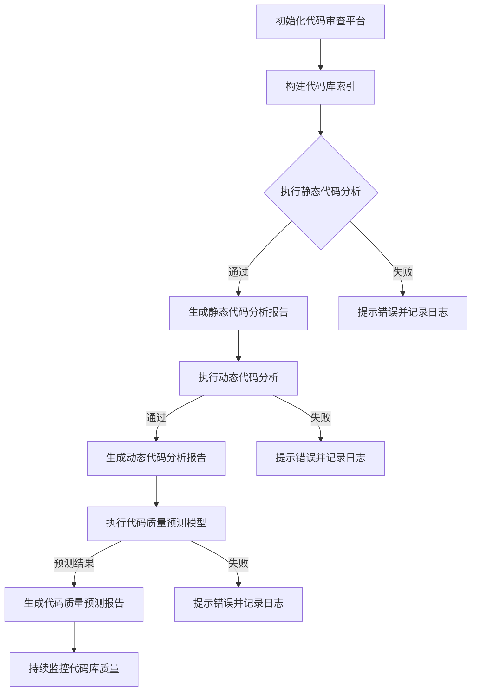

                 

# AI驱动的代码审查与质量控制

> **关键词：** 人工智能，代码审查，质量控制，静态代码分析，动态代码分析，持续监控

> **摘要：** 本文将深入探讨AI驱动的代码审查与质量控制技术，从基础理论到实际应用，详细解析AI在代码审查中的角色和优势，以及如何通过AI技术提升代码质量和开发效率。

## 目录大纲

### 第一部分：AI驱动的代码审查基础

#### 第1章：AI驱动的代码审查概述

1.1 AI驱动的代码审查定义

1.2 AI驱动的代码审查的优势

1.3 AI驱动的代码审查的挑战与机遇

#### 第2章：AI驱动的代码审查技术基础

2.1 代码审查的基本概念

2.2 代码质量评估的指标

2.3 自然语言处理在代码审查中的应用

2.4 机器学习在代码审查中的应用

### 第二部分：AI驱动的代码质量分析

#### 第3章：静态代码分析

3.1 静态代码分析的基本原理

3.2 静态代码分析工具介绍

3.3 静态代码分析结果评估

#### 第4章：动态代码分析

4.1 动态代码分析的基本原理

4.2 动态代码分析工具介绍

4.3 动态代码分析结果评估

#### 第5章：AI驱动的代码质量预测

5.1 代码质量预测模型介绍

5.2 代码质量预测模型训练

5.3 代码质量预测模型评估

### 第三部分：AI驱动的代码质量优化

#### 第6章：代码质量优化策略

6.1 代码质量优化原则

6.2 代码质量优化工具介绍

6.3 代码质量优化案例分析

#### 第7章：AI驱动的代码质量持续监控

7.1 持续监控的概念与意义

7.2 持续监控工具介绍

7.3 持续监控案例分析

### 第四部分：AI驱动的代码质量控制实战

#### 第8章：代码审查平台搭建

8.1 开发环境搭建

8.2 代码审查平台设计

8.3 代码审查平台实现

#### 第9章：AI驱动的代码审查项目实战

9.1 项目背景介绍

9.2 项目需求分析

9.3 项目实施过程

9.4 项目效果评估

#### 第10章：未来展望

10.1 AI驱动的代码审查发展趋势

10.2 AI驱动的代码审查面临的挑战

10.3 未来发展方向

### 附录

#### 附录A：常用代码审查工具及资源列表

#### 附录B：代码质量评估指标详解

#### 附录C：数学模型和算法原理简介

### 资源

1. Python代码示例及解释说明
2. AI驱动的代码审查Mermaid流程图
3. 代码质量预测模型的伪代码及详细解释说明
4. 代码质量持续监控的实现方法和案例分析

### Mermaid流程图示例



### 代码质量预测模型伪代码

```python
# 伪代码：代码质量预测模型

# 初始化模型
model = create_quality_prediction_model()

# 加载数据集
data = load_dataset()

# 预处理数据
processed_data = preprocess_data(data)

# 训练模型
model.fit(processed_data)

# 预测代码质量
predictions = model.predict(processed_data)

# 生成报告
generate_report(predictions)
```

### 数学模型和算法原理介绍

- **静态代码分析算法原理：** 主要基于抽象语法树（AST）分析，包括控制流图（CFG）生成、数据流分析、循环检测等。
- **动态代码分析算法原理：** 主要基于代码的执行轨迹，包括路径覆盖、分支覆盖、异常检测等。
- **代码质量预测模型：** 主要基于机器学习技术，使用历史代码库数据作为训练集，建立预测模型，对代码质量进行预测。
- **持续监控算法原理：** 主要基于实时监控技术和异常检测算法，对代码库质量进行持续监控，及时发现问题。

### 代码解读与分析

- **静态代码分析：** 使用Python的ast模块对代码进行解析，生成抽象语法树，然后对抽象语法树进行分析，提取出代码的质量指标。
- **动态代码分析：** 使用Python的unittest模块进行测试，捕获测试过程中产生的日志，分析日志内容，提取代码质量指标。
- **代码质量预测：** 使用scikit-learn库中的线性回归模型，对历史代码库数据进行训练，建立预测模型。
- **持续监控：** 使用Python的schedule模块实现定时任务，定期对代码库进行质量监控，并将监控结果保存到数据库中。

接下来，我们将分章节详细探讨AI驱动的代码审查与质量控制技术。首先，从AI驱动的代码审查概述开始。|<sop>

