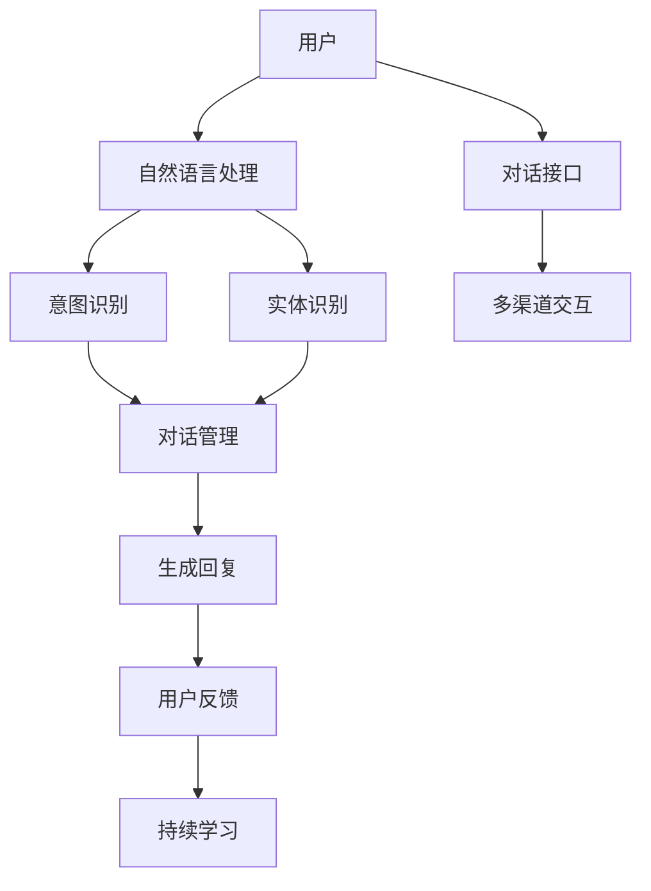
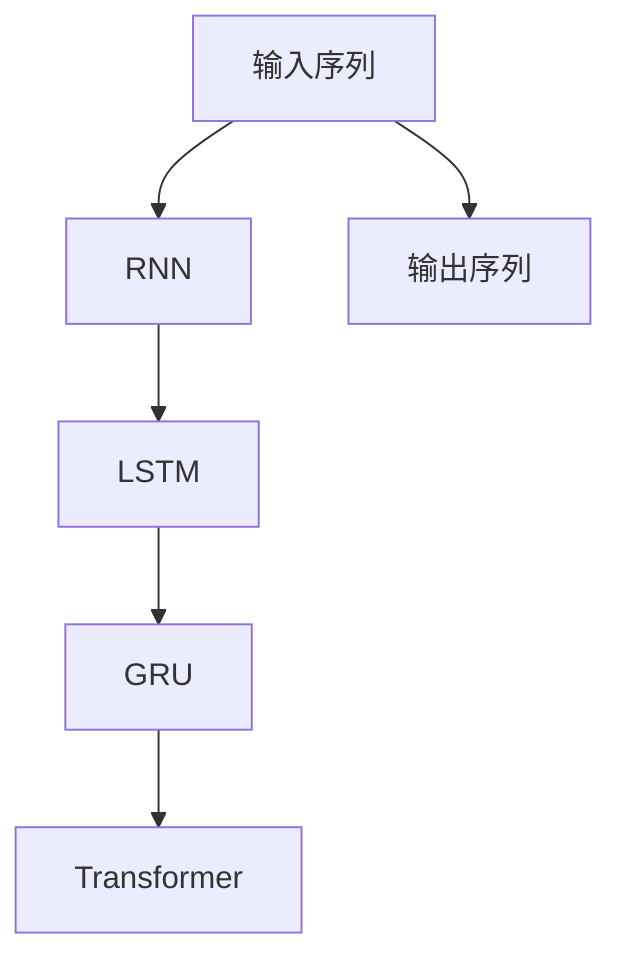

                 

# 《AI驱动的电商平台智能客服对话系统》

## 关键词
- AI驱动
- 电商平台
- 智能客服
- 对话系统
- 自然语言处理
- 深度学习
- 强化学习
- 多模态数据
- 对话管理

## 摘要
本文将深入探讨AI驱动的电商平台智能客服对话系统。首先，我们将回顾AI驱动的智能客服背景，并分析其在电商平台中的应用需求。接着，文章将详细解析自然语言处理（NLP）、对话系统以及AI驱动的智能客服架构等核心技术。随后，我们将通过实际案例展示如何开发电商平台智能客服对话系统，并介绍对话系统的性能评估与优化策略。最后，本文将对智能客服的未来发展进行展望，并总结全文。

## 引言

在互联网和电子商务迅速发展的今天，用户数量的增加和业务量的激增对电商平台客服服务提出了更高的要求。传统的客服模式往往无法满足用户在购物过程中对即时性、个性化和高效性的需求。因此，AI驱动的智能客服系统成为电商平台提升服务质量、降低运营成本的关键选择。

AI驱动的智能客服系统利用自然语言处理（NLP）、深度学习和强化学习等先进技术，实现对用户问题的自动识别、理解和响应。智能客服不仅能够24/7无缝服务，还能通过学习用户的行为和偏好，提供个性化的服务和建议。本文将系统地介绍AI驱动的电商平台智能客服对话系统的核心概念、技术原理和应用实战，帮助读者全面了解这一领域的最新发展和应用。

## 第一部分：背景与概述

### 第1章：AI驱动的电商平台智能客服概述

#### 1.1 AI驱动的智能客服背景

##### 1.1.1 智能客服的兴起与发展

智能客服是一种利用人工智能技术实现自动化的客户服务系统，其目标是提高服务质量、降低运营成本，并提升用户满意度。智能客服的兴起可以追溯到20世纪90年代，随着互联网和电子商务的快速发展，企业对高效客服的需求日益增长。早期的智能客服系统主要依赖于规则引擎和基本的自然语言处理技术，虽然能够处理简单的客户问题，但在复杂场景下的表现有限。

进入21世纪，随着人工智能技术的迅速发展，尤其是深度学习和自然语言处理（NLP）的突破，智能客服进入了一个全新的发展阶段。现在的智能客服系统不仅能够处理复杂的问题，还能通过持续学习和自适应调整，提供更加个性化和高效的服务。

##### 1.1.2 AI在客服领域的应用

人工智能在客服领域的应用主要体现在以下几个方面：

1. **自然语言处理（NLP）**：NLP技术使得智能客服系统能够理解并处理自然语言输入，包括语音和文本。通过NLP技术，智能客服能够自动解析客户的问题，理解其意图，并生成合适的回答。

2. **机器学习与深度学习**：机器学习和深度学习技术使得智能客服系统能够从大量的历史数据中学习，不断优化其服务能力。例如，通过训练深度神经网络，智能客服能够提高对复杂问题的理解和回答能力。

3. **对话管理**：对话管理系统负责管理整个对话流程，包括理解用户的意图、生成响应、处理对话上下文等。通过有效的对话管理，智能客服能够提供连贯、流畅的用户体验。

4. **多模态交互**：多模态交互技术使得智能客服能够同时处理多种类型的输入和输出，如文本、语音、图像等。这种多模态交互能力提高了智能客服的应用场景和用户体验。

##### 1.1.3 智能客服的价值与挑战

智能客服的价值体现在以下几个方面：

1. **提升服务质量**：智能客服系统能够快速、准确地响应客户问题，提高客户满意度。

2. **降低运营成本**：通过自动化处理大量客户咨询，智能客服能够显著降低人力成本。

3. **增强业务能力**：智能客服系统能够分析客户行为数据，为企业提供业务洞察，帮助优化产品和服务。

4. **提高工作效率**：智能客服能够处理24/7的客服需求，提高企业的工作效率。

然而，智能客服在发展过程中也面临一些挑战：

1. **数据隐私与安全**：智能客服需要处理大量客户数据，如何保障数据隐私和安全成为关键问题。

2. **用户体验**：虽然智能客服能够提供自动化服务，但如何确保用户体验与人类客服相当，甚至更好，是一个持续的挑战。

3. **技术成熟度**：尽管AI技术在不断发展，但某些领域的成熟度仍有限，特别是在处理复杂问题和情感理解方面。

#### 1.2 电商平台智能客服的需求分析

##### 1.2.1 电商客服的现状与问题

目前，电商平台的客服系统主要依赖于人工客服，存在以下问题：

1. **人力成本高**：随着电商平台的用户数量和咨询量的增加，人工客服的需求不断增加，导致人力成本上升。

2. **服务质量不稳定**：人工客服在处理大量咨询时，容易疲劳，导致服务质量不稳定。

3. **响应速度慢**：人工客服的响应速度较慢，难以满足用户对即时性的需求。

4. **知识库更新滞后**：人工客服的知识库更新速度较慢，难以应对快速变化的市场需求和用户问题。

##### 1.2.2 客户需求与用户体验

电商平台用户对客服的需求主要体现在以下几个方面：

1. **即时性**：用户希望在遇到问题时能够快速得到响应。

2. **个性化**：用户希望客服能够根据其历史行为和偏好提供个性化的服务。

3. **高效性**：用户希望客服能够高效地解决其问题，减少等待时间。

4. **连贯性**：用户希望客服在与不同客服人员沟通时，能够保持对话的连贯性。

##### 1.2.3 AI在电商客服中的潜在应用场景

AI在电商客服中的潜在应用场景包括：

1. **自动问答**：通过自然语言处理技术，智能客服能够自动回答用户常见问题，提高响应速度。

2. **智能推荐**：通过分析用户的行为和偏好，智能客服能够提供个性化的产品推荐。

3. **情感分析**：通过情感分析技术，智能客服能够识别用户的情感状态，提供更加贴心的服务。

4. **多渠道交互**：智能客服能够支持多种交互方式，如文本、语音、图像等，满足不同用户的需求。

#### 1.3 本书结构安排

##### 1.3.1 内容概述

本书将首先介绍AI驱动的智能客服背景和概述，然后深入探讨自然语言处理、对话系统、AI驱动的智能客服架构等核心技术。接着，通过实际案例展示电商平台智能客服对话系统的开发流程，并介绍对话系统的性能评估与优化策略。最后，展望智能客服的发展趋势和面临的挑战。

##### 1.3.2 学习目标

通过本书的学习，读者将能够：

1. 了解AI驱动的智能客服背景和需求分析。

2. 掌握自然语言处理、对话系统、AI驱动的智能客服架构等核心技术。

3. 学会电商平台智能客服对话系统的开发流程和优化策略。

4. 了解智能客服的未来发展趋势和挑战。

##### 1.3.3 适用人群

本书适合以下人群：

1. 计算机科学和人工智能专业的学生和研究人员。

2. 想要在电商平台上应用智能客服的技术人员。

3. 对智能客服和对话系统感兴趣的技术爱好者。

### Mermaid 流程图：AI驱动的智能客服架构



### 核心算法原理讲解：自然语言处理（NLP）

自然语言处理（NLP）是智能客服系统的核心组件，负责理解用户输入的文本，并将其转化为系统能够处理的数据。以下是NLP的核心算法原理讲解：

##### 1.1.1 语言模型

**定义**：语言模型是一个概率模型，用于预测文本序列中下一个单词的概率。在智能客服系统中，语言模型可以帮助系统理解用户的问题和上下文，从而生成合适的回复。

**工作原理**：语言模型通常使用大量的文本数据进行训练，通过统计文本中的单词出现频率和顺序来预测下一个单词。最常见的语言模型是n-gram模型，它使用前n个单词来预测下一个单词。

**评估与优化**：语言模型的评估通常通过困惑度（Perplexity）指标进行，困惑度越低，模型表现越好。优化方法包括使用更长的n-gram序列、引入词嵌入技术等。

```latex
Perplexity = \frac{1}{N} \sum_{i=1}^{N} \frac{1}{P(w_i|w_{i-n})}
```

##### 1.1.2 词嵌入技术

**定义**：词嵌入是将单词映射为固定大小的向量表示，以捕捉单词的语义信息。在NLP任务中，词嵌入可以用于文本分类、情感分析等。

**常见算法**：常见的词嵌入算法包括Word2Vec、GloVe和FastText等。Word2Vec算法通过训练神经网络来预测目标单词的条件概率，从而得到词向量。GloVe算法通过计算全局词频和共现矩阵来生成词向量。FastText算法则通过训练多层神经网络来预测单词的类别。

**应用**：词嵌入技术可以用于文本表示、语义分析等。在智能客服系统中，词嵌入可以帮助系统更好地理解用户的问题，提高回答的准确性。

##### 1.1.3 序列模型

**定义**：序列模型是一种用于处理序列数据的模型，如文本、语音等。在NLP任务中，序列模型可以用于文本分类、命名实体识别、机器翻译等。

**常见模型**：常见的序列模型包括循环神经网络（RNN）、长短时记忆网络（LSTM）、门控循环单元（GRU）和Transformer等。RNN通过记忆之前的输入来处理序列数据，但存在梯度消失和梯度爆炸的问题。LSTM和GRU通过引入门控机制来克服这些问题。Transformer模型则通过多头自注意力机制实现了序列到序列的建模，在机器翻译等任务中取得了很好的效果。

**应用**：序列模型在智能客服系统中可以用于理解用户的文本输入，生成合适的回复。



##### 1.1.4 注意力机制

**定义**：注意力机制是一种用于序列模型中的机制，能够使模型在处理序列数据时，更加关注重要的部分。在NLP任务中，注意力机制可以帮助模型更好地理解文本的上下文信息。

**工作原理**：注意力机制通过计算一个权重向量，将输入序列中的每个元素按照其重要性进行加权，从而生成一个加权和序列。这个加权和序列可以用于后续的预测任务。

**应用**：注意力机制在智能客服系统中可以用于对话管理，使系统能够根据上下文信息生成更加准确的回复。

```latex
Attention = \sigma(W_a[h; s_t])
context = v_t \cdot Attention
```

### 实际案例：基于Transformer的智能客服系统

假设我们要开发一个基于Transformer的智能客服系统，以下是一个简化的伪代码来描述其核心算法：

```python
# 输入：用户文本序列
# 输出：客服回复文本序列

# 初始化Transformer模型
model = TransformerModel()

# 编码用户输入
input_sequence = encode_user_input(user_text)

# 生成初始隐藏状态
hidden_state = model.initialize_state(input_sequence)

# 初始化回复文本序列
response_sequence = []

# 预测每个单词，并添加到回复序列中
for _ in range(max_response_length):
    # 计算输出概率分布
    output_distribution = model.predict(hidden_state)
    
    # 从概率分布中采样下一个单词
    next_word = sample_word(output_distribution)
    
    # 更新隐藏状态
    hidden_state = model.update_state(hidden_state, next_word)
    
    # 添加下一个单词到回复序列中
    response_sequence.append(next_word)

# 解码回复文本序列
response_text = decode_response_sequence(response_sequence)

# 输出客服回复
print(response_text)
```

在这个案例中，`TransformerModel()` 是一个预训练的Transformer模型，`encode_user_input()` 和 `decode_response_sequence()` 分别用于将文本序列编码和解码为模型可处理的格式。`sample_word()` 是一个从概率分布中采样单词的函数。

通过这个案例，我们可以看到如何使用Transformer模型来生成智能客服的回复文本。在实际应用中，模型需要经过大量的数据训练和调优，以确保其能够生成准确、连贯的回复。

### 总结

在本章中，我们介绍了AI驱动的智能客服背景、AI在客服领域的应用、智能客服的价值与挑战，以及电商平台智能客服的需求分析。我们还探讨了自然语言处理（NLP）的核心技术，包括语言模型、词嵌入技术和序列模型，并通过实际案例展示了如何使用Transformer模型来生成智能客服的回复文本。下一章，我们将深入探讨对话系统的基本概念和分类。

## 第二部分：核心技术

### 第2章：自然语言处理（NLP）基础

自然语言处理（NLP）是构建智能客服系统的核心技术之一。它涉及到理解、生成和处理人类语言的任务，旨在使计算机能够与人类进行自然对话。在本章中，我们将详细探讨NLP的基本概念、关键技术和应用。

#### 2.1 NLP简介

##### 2.1.1 NLP的定义与任务

自然语言处理（NLP）是人工智能（AI）的一个分支，旨在使计算机能够理解和处理人类语言。NLP的任务包括但不限于：

1. **文本分类**：将文本分类到预定义的类别中。
2. **情感分析**：识别文本中的情感倾向，如正面、负面或中性。
3. **命名实体识别**：识别文本中的特定实体，如人名、地名、组织名等。
4. **机器翻译**：将一种语言文本翻译成另一种语言。
5. **问答系统**：根据用户的问题提供相关答案。
6. **文本生成**：生成具有语义意义的文本。

##### 2.1.2 NLP的关键技术

NLP的关键技术包括以下几个方面：

1. **词法分析**：对文本进行分词、词性标注和句法分析，以提取文本的基本元素和结构。
2. **句法分析**：分析句子的语法结构，包括句子的成分、句法关系等。
3. **语义分析**：理解文本的语义含义，包括词义消歧、语义角色标注等。
4. **语用分析**：分析文本的语境和交际意图，如指代消解、话语分析等。

#### 2.2 语言模型

语言模型是NLP中的一种核心模型，用于预测文本序列中下一个单词的概率。语言模型对于生成自然语言文本、理解文本语义等方面都具有重要意义。

##### 2.2.1 语言模型的基本概念

语言模型的基本概念包括：

1. **词汇表**：语言模型所包含的单词集合。
2. **概率分布**：语言模型为每个单词序列分配一个概率。
3. **马尔可夫假设**：语言模型假设下一个单词仅依赖于前一个单词，即 $P(w_n | w_1, w_2, ..., w_{n-1}) = P(w_n | w_{n-1})$。

##### 2.2.2 语言模型的工作原理

语言模型的工作原理如下：

1. **统计语言模型**：通过统计方法，如n-gram模型，计算单词序列的概率。n-gram模型基于马尔可夫假设，仅考虑前n个单词来预测下一个单词的概率。

2. **神经网络语言模型**：通过训练神经网络模型，如循环神经网络（RNN）和Transformer，来预测单词序列的概率。这些模型能够通过学习大量的文本数据，自动提取语言的特征和规律。

##### 2.2.3 语言模型的评估与优化

语言模型的评估通常通过困惑度（Perplexity）进行，即模型对测试数据的预测准确性的度量。困惑度越低，模型表现越好。

```latex
Perplexity = \frac{1}{N} \sum_{i=1}^{N} \frac{1}{P(w_i|w_{1:i})}
```

优化语言模型的方法包括：

1. **数据增强**：通过增加训练数据或引入数据增强技术（如数据清洗、同义词替换等）来提高模型的泛化能力。
2. **模型调整**：通过调整模型的超参数（如学习率、批量大小等）来优化模型性能。
3. **融合模型**：通过结合多个语言模型，如n-gram模型和神经网络模型，来提高模型的准确性。

#### 2.3 词嵌入技术

词嵌入是将单词映射为固定大小的向量表示，以捕捉单词的语义信息。词嵌入技术在NLP中广泛应用，如文本分类、情感分析、机器翻译等。

##### 2.3.1 词嵌入的概念

词嵌入的基本概念包括：

1. **词向量**：单词的向量表示，通常是一个固定大小的多维向量。
2. **维度**：词向量的维度，表示嵌入空间的复杂度。
3. **语义信息**：词向量能够捕捉单词的语义信息，如相似词、反义词等。

##### 2.3.2 常见的词嵌入算法

常见的词嵌入算法包括：

1. **Word2Vec**：基于神经网络的词嵌入算法，通过训练神经网络来预测目标单词的条件概率。
2. **GloVe**：全局向量表示（Global Vectors for Word Representation），通过计算全局词频和共现矩阵来生成词向量。
3. **FastText**：快速文本（FastText），通过训练多层神经网络来预测单词的类别，从而生成词向量。

##### 2.3.3 词嵌入的应用

词嵌入技术在NLP中的主要应用包括：

1. **文本表示**：将文本转换为向量表示，用于文本分类、情感分析等。
2. **语义分析**：通过词向量的相似性和距离来分析文本的语义信息，如相似词、反义词等。
3. **机器翻译**：用于文本编码和解码，提高机器翻译的准确性。

#### 2.4 序列模型

序列模型是用于处理序列数据的模型，如文本、语音等。在NLP任务中，序列模型可以用于文本分类、命名实体识别、机器翻译等。

##### 2.4.1 RNN与LSTM

1. **循环神经网络（RNN）**：RNN是一种能够处理序列数据的神经网络，其特点是具有记忆功能，能够捕捉序列数据中的时间依赖关系。然而，RNN存在梯度消失和梯度爆炸的问题，导致训练不稳定。
   
2. **长短时记忆网络（LSTM）**：LSTM是RNN的一种改进，通过引入门控机制（如遗忘门、输入门和输出门）来解决梯度消失问题。LSTM能够有效捕捉长序列中的时间依赖关系。

##### 2.4.2 GRU与BERT

1. **门控循环单元（GRU）**：GRU是LSTM的另一种变体，通过简化门控机制来提高计算效率和训练速度。GRU在保留LSTM长记忆能力的同时，具有更简单的结构和更快的训练速度。

2. **BERT**：BERT（Bidirectional Encoder Representations from Transformers）是一种基于Transformer的双向编码模型，通过预训练和微调来提高NLP任务的性能。BERT在多个NLP任务上取得了很好的效果，如文本分类、命名实体识别和机器翻译。

##### 2.4.3 Transformer与注意力机制

1. **Transformer**：Transformer是一种基于自注意力机制的序列到序列模型，其核心思想是利用多头自注意力机制来捕捉序列数据中的全局依赖关系。Transformer在机器翻译等任务中取得了显著的性能提升。

2. **注意力机制**：注意力机制是一种用于序列模型的机制，能够使模型在处理序列数据时，更加关注重要的部分。注意力机制通过计算一个权重向量，将输入序列中的每个元素按照其重要性进行加权，从而生成一个加权和序列。

```latex
Attention = \sigma(W_a[h; s_t])
context = v_t \cdot Attention
```

#### 实际案例：基于BERT的智能客服系统

假设我们要开发一个基于BERT的智能客服系统，以下是一个简化的伪代码来描述其核心算法：

```python
# 输入：用户文本序列
# 输出：客服回复文本序列

# 初始化BERT模型
model = BERTModel()

# 编码用户输入
input_sequence = encode_user_input(user_text)

# 生成初始隐藏状态
hidden_state = model.initialize_state(input_sequence)

# 初始化回复文本序列
response_sequence = []

# 预测每个单词，并添加到回复序列中
for _ in range(max_response_length):
    # 计算输出概率分布
    output_distribution = model.predict(hidden_state)
    
    # 从概率分布中采样下一个单词
    next_word = sample_word(output_distribution)
    
    # 更新隐藏状态
    hidden_state = model.update_state(hidden_state, next_word)
    
    # 添加下一个单词到回复序列中
    response_sequence.append(next_word)

# 解码回复文本序列
response_text = decode_response_sequence(response_sequence)

# 输出客服回复
print(response_text)
```

在这个案例中，`BERTModel()` 是一个预训练的BERT模型，`encode_user_input()` 和 `decode_response_sequence()` 分别用于将文本序列编码和解码为模型可处理的格式。`sample_word()` 是一个从概率分布中采样单词的函数。

通过这个案例，我们可以看到如何使用BERT模型来生成智能客服的回复文本。在实际应用中，模型需要经过大量的数据训练和调优，以确保其能够生成准确、连贯的回复。

### 总结

在本章中，我们详细介绍了自然语言处理（NLP）的基本概念、关键技术和应用。我们探讨了语言模型、词嵌入技术和序列模型，并通过实际案例展示了如何使用这些技术来构建智能客服系统。下一章，我们将深入探讨对话系统的基础，包括定义、分类及其在智能客服中的应用。

### 第3章：对话系统基础

对话系统是一种能够与人类进行自然语言交互的计算机系统，其目标是提供一种自然、流畅的交流方式，使计算机能够理解用户的需求并生成合适的响应。在本章中，我们将详细探讨对话系统的定义、分类及其在智能客服中的应用。

#### 3.1 对话系统的定义与分类

##### 3.1.1 对话系统的基本概念

对话系统可以定义为一种能够与用户进行多轮交互的计算机系统，其核心功能是理解用户的输入，生成适当的响应，并维持对话的连贯性和流畅性。对话系统通常包括以下几个关键组成部分：

1. **用户界面**：用户与对话系统交互的接口，可以是文本聊天、语音聊天或者图形用户界面（GUI）。

2. **对话管理**：负责管理对话流程，包括理解用户的意图、生成响应、维护对话上下文等。

3. **知识库**：对话系统使用的知识资源，包括事实信息、业务规则、常见问题及其回答等。

4. **自然语言理解**：负责处理用户输入的自然语言，提取关键信息并理解用户的意图。

5. **自然语言生成**：负责生成自然语言的响应，使其能够流畅地与用户交流。

##### 3.1.2 对话系统的分类

根据对话系统的功能和应用场景，可以将对话系统分为以下几类：

1. **任务型对话系统**：这类对话系统的主要目标是帮助用户完成特定的任务，如预订机票、购买商品等。任务型对话系统通常具有明确的任务流程和操作指南，用户需要按照对话系统的指示逐步完成操作。

2. **聊天型对话系统**：这类对话系统旨在与用户进行日常对话，提供娱乐、咨询、情感支持等。聊天型对话系统通常更加灵活，能够处理更广泛的对话内容，并能够进行多轮对话。

3. **混合型对话系统**：这类对话系统结合了任务型和聊天型的特点，既能完成特定任务，又能进行日常对话。混合型对话系统通常适用于需要高度个性化服务和复杂交互的场景。

4. **专家系统**：这类对话系统基于专业知识库，能够提供专业领域的咨询和服务。专家系统通常具有高度的领域特定性，能够在特定领域内提供高质量的回答。

#### 3.2 任务型对话系统

任务型对话系统是一种以任务为导向的对话系统，其目标是帮助用户快速、高效地完成特定任务。任务型对话系统通常具有以下特点：

1. **明确的任务流程**：任务型对话系统通常具有固定的任务流程，用户需要按照系统的指示逐步完成任务。

2. **严格的对话管理**：对话管理在任务型对话系统中起着至关重要的作用，需要确保用户按照正确的流程进行操作，并能够有效地处理用户的偏离行为。

3. **灵活的输入处理**：尽管任务型对话系统具有明确的任务流程，但用户输入可能多种多样，对话系统需要具备较强的输入处理能力，能够理解并适应用户的输入。

##### 3.2.1 任务型对话的框架

任务型对话系统的基本框架通常包括以下几个关键组件：

1. **输入处理**：负责接收用户的输入，进行预处理，提取关键信息，如用户意图、任务目标等。

2. **意图识别**：根据输入处理的结果，识别用户的意图，并将其映射到具体的任务或功能。

3. **任务规划**：根据用户的意图，生成任务计划，确定需要执行的操作步骤。

4. **对话管理**：负责管理整个对话过程，包括理解用户输入、生成响应、维护对话上下文等。

5. **执行与反馈**：根据任务计划，执行相应的操作，并向用户反馈执行结果。

##### 3.2.2 对话管理策略设计

对话管理策略设计是任务型对话系统的关键，其目的是确保对话系统能够有效地理解用户、生成合适的响应，并维持对话的连贯性。以下是几种常见的对话管理策略：

1. **基于规则的对话管理**：通过预定义的规则来处理用户的输入和生成响应。这种方法简单直观，但灵活性较差，难以适应复杂多变的对话场景。

2. **基于模板的对话管理**：使用预定义的模板来生成响应，并根据用户的输入动态替换模板中的变量。这种方法具有较高的灵活性，但模板编写复杂度较高。

3. **基于机器学习的对话管理**：通过训练机器学习模型，自动生成对话响应。这种方法能够自适应地调整对话策略，但需要大量的训练数据和模型调优。

##### 3.2.3 任务型对话的评估方法

任务型对话系统的评估通常从以下几个方面进行：

1. **任务完成率**：评估对话系统能否成功完成用户指定的任务。

2. **响应时间**：评估对话系统生成响应的速度。

3. **用户满意度**：通过用户反馈或问卷调查来评估用户对对话系统的满意度。

4. **对话连贯性**：评估对话系统在对话过程中是否能够保持连贯性。

#### 3.3 聊天型对话系统

聊天型对话系统旨在与用户进行日常对话，提供娱乐、咨询、情感支持等。与任务型对话系统不同，聊天型对话系统通常没有明确的任务目标，而是通过自然语言交互来满足用户的情感需求。

##### 3.3.1 聊天型对话的框架

聊天型对话系统的基本框架通常包括以下几个关键组件：

1. **情感分析**：负责分析用户输入的情感倾向，如积极、消极、中立等，以便生成合适的情感回应。

2. **上下文管理**：负责维护对话的上下文信息，确保对话的连贯性和流畅性。

3. **对话生成**：负责生成自然语言的对话响应，使其能够与用户的情感和上下文信息相符。

4. **交互控制**：负责管理对话的交互流程，包括引导对话方向、处理用户偏离等。

##### 3.3.2 情感分析在聊天对话中的应用

情感分析是聊天型对话系统的核心组件，其目的是识别用户的情感状态，并生成相应的情感回应。情感分析通常包括以下几个步骤：

1. **情感分类**：将用户的输入分类为特定的情感类别，如喜悦、愤怒、悲伤等。

2. **情感强度识别**：识别用户情感的强度，如非常高兴、有点高兴等。

3. **情感回应生成**：根据用户的情感状态，生成相应的情感回应。

##### 3.3.3 聊天型对话的评估方法

聊天型对话系统的评估方法与任务型对话系统类似，但更加注重情感交互和用户体验。以下是一些常见的评估指标：

1. **情感识别准确率**：评估对话系统识别用户情感的能力。

2. **对话连贯性**：评估对话系统在保持对话连贯性方面的表现。

3. **用户满意度**：通过用户反馈或问卷调查来评估用户对对话系统的满意度。

4. **对话流畅度**：评估对话系统生成响应的速度和流畅性。

#### 实际案例：基于ChatGPT的聊天型对话系统

假设我们要开发一个基于ChatGPT的聊天型对话系统，以下是一个简化的伪代码来描述其核心算法：

```python
# 输入：用户文本输入
# 输出：系统文本输出

# 初始化ChatGPT模型
model = ChatGPTModel()

# 编码用户输入
input_sequence = encode_user_input(user_input)

# 生成初始隐藏状态
hidden_state = model.initialize_state(input_sequence)

# 初始化回复文本序列
response_sequence = []

# 预测每个单词，并添加到回复序列中
for _ in range(max_response_length):
    # 计算输出概率分布
    output_distribution = model.predict(hidden_state)
    
    # 从概率分布中采样下一个单词
    next_word = sample_word(output_distribution)
    
    # 更新隐藏状态
    hidden_state = model.update_state(hidden_state, next_word)
    
    # 添加下一个单词到回复序列中
    response_sequence.append(next_word)

# 解码回复文本序列
response_text = decode_response_sequence(response_sequence)

# 输出客服回复
print(response_text)
```

在这个案例中，`ChatGPTModel()` 是一个预训练的ChatGPT模型，`encode_user_input()` 和 `decode_response_sequence()` 分别用于将文本序列编码和解码为模型可处理的格式。`sample_word()` 是一个从概率分布中采样单词的函数。

通过这个案例，我们可以看到如何使用ChatGPT模型来生成聊天型对话系统的回复文本。在实际应用中，模型需要经过大量的数据训练和调优，以确保其能够生成自然、流畅的回复。

### 总结

在本章中，我们详细介绍了对话系统的定义、分类及其在智能客服中的应用。我们探讨了任务型对话系统和聊天型对话系统的基本框架、对话管理策略及其评估方法。通过实际案例，我们展示了如何使用预训练模型来构建聊天型对话系统。下一章，我们将深入探讨AI驱动的智能客服架构，包括系统架构概述、智能客服对话管理和对话接口技术。

### 第4章：AI驱动的智能客服系统架构

#### 4.1 智能客服系统架构概述

智能客服系统架构是指实现智能客服功能所需的硬件和软件组件的集合。一个典型的AI驱动的智能客服系统架构包括以下几个核心组件：

1. **用户界面（UI）**：用户与智能客服系统交互的界面，可以是文本聊天窗口、语音交互界面或图形用户界面（GUI）。用户通过UI输入问题或请求，并接收系统的响应。

2. **自然语言处理（NLP）模块**：负责处理用户的输入，理解用户的意图，并生成合适的响应。NLP模块通常包括文本预处理、意图识别、实体识别和情感分析等。

3. **对话管理模块**：负责管理整个对话流程，包括理解用户的意图、生成响应、维护对话上下文等。对话管理模块通常基于规则、机器学习或深度学习模型来实现。

4. **知识库**：存储智能客服系统所需的知识和事实信息，包括常见问题、业务规则、产品信息等。知识库是智能客服系统的核心资源，用于生成准确的响应。

5. **机器学习模型**：用于训练和优化智能客服系统，使其能够更好地理解用户意图、生成自然语言响应等。常见的机器学习模型包括循环神经网络（RNN）、变换器（Transformer）和生成对抗网络（GAN）等。

6. **后端服务**：负责处理业务逻辑、数据存储和系统维护等。后端服务可以是基于云计算的分布式系统，提供高可用性和可扩展性。

#### 4.2 智能客服对话管理

对话管理是智能客服系统的核心组件，负责管理整个对话流程，包括理解用户的意图、生成响应、维护对话上下文等。有效的对话管理能够确保对话的连贯性和流畅性，提高用户体验。

##### 4.2.1 对话管理的基本概念

对话管理的基本概念包括以下几个关键要素：

1. **用户意图**：用户通过输入表达的需求或目标。例如，用户输入“我想要买一本书”，其意图是购买书籍。

2. **对话上下文**：对话过程中产生的所有相关信息，包括用户的历史输入、系统的历史响应、对话状态等。对话上下文用于理解用户意图，生成合适的响应。

3. **响应生成**：根据用户意图和对话上下文，生成自然语言响应。响应生成可以是基于规则、模板或机器学习模型。

4. **对话状态跟踪**：记录对话过程中的关键信息，如用户意图、对话上下文、对话状态等。对话状态跟踪用于确保对话的连贯性和一致性。

##### 4.2.2 对话管理策略设计

对话管理策略设计是确保对话系统有效运行的关键。以下是几种常见的对话管理策略：

1. **基于规则的方法**：通过预定义的规则来处理用户输入和生成响应。这种方法简单直观，但灵活性较差，难以适应复杂多变的对话场景。

2. **基于模板的方法**：使用预定义的模板来生成响应，并根据用户输入动态替换模板中的变量。这种方法具有较高的灵活性，但模板编写复杂度较高。

3. **基于机器学习的方法**：通过训练机器学习模型，自动生成对话响应。这种方法能够自适应地调整对话策略，但需要大量的训练数据和模型调优。

##### 4.2.3 对话上下文处理

对话上下文处理是对话管理的重要组成部分，其目标是确保对话系统能够正确理解用户意图，并生成连贯的响应。以下是几种常见的对话上下文处理方法：

1. **短期记忆**：仅保留当前对话轮次的信息，适用于简单、短期的对话场景。

2. **长期记忆**：保留对话过程中的所有信息，适用于复杂、多轮对话场景。

3. **上下文更新策略**：根据对话轮次和用户输入，动态更新对话上下文，以适应对话的变化。

#### 4.3 智能客服对话接口

对话接口是用户与智能客服系统交互的媒介，可以是文本聊天窗口、语音交互界面或图形用户界面（GUI）。对话接口的设计和实现对于用户体验至关重要。

##### 4.3.1 对话接口的定义与作用

对话接口的定义与作用包括：

1. **定义**：对话接口是用户与智能客服系统交互的界面，通过文本、语音或图形界面实现用户的输入和输出。

2. **作用**：
   - 提供用户友好的交互方式，使非技术人员也能轻松使用智能客服系统。
   - 实现多渠道交互，如文本、语音、图像等，满足不同用户的需求。
   - 提高交互效率和用户体验，通过自动化的对话管理，减少用户等待时间和操作复杂性。

##### 4.3.2 常见对话接口技术

常见对话接口技术包括：

1. **文本聊天窗口**：最常见的对话接口，通过文本输入和输出实现交互。文本聊天窗口易于实现，适用于简单的文本交互场景。

2. **语音交互界面**：通过语音输入和输出实现交互，适用于需要语音沟通的场景，如语音助手、客服电话等。

3. **图形用户界面（GUI）**：通过图形界面实现交互，提供丰富的交互元素和视觉效果，适用于复杂的交互场景，如电子商务平台的聊天窗口。

##### 4.3.3 对话接口的优化策略

为了提高对话接口的用户体验，可以采用以下优化策略：

1. **自然语言理解**：优化自然语言理解模块，提高对话系统对用户输入的理解能力，减少误解和歧义。

2. **个性化响应**：根据用户的历史行为和偏好，生成个性化的响应，提高用户的满意度和参与度。

3. **多模态交互**：支持多种交互方式，如文本、语音、图像等，提高用户的灵活性和便捷性。

4. **交互反馈**：提供及时的交互反馈，如实时回复、进度提示等，增强用户的互动体验。

### 实际案例：基于深度学习的智能客服对话接口

假设我们要开发一个基于深度学习的智能客服对话接口，以下是一个简化的伪代码来描述其核心算法：

```python
# 输入：用户文本输入
# 输出：系统文本输出

# 初始化深度学习模型
model = DeepLearningModel()

# 编码用户输入
input_sequence = encode_user_input(user_input)

# 生成初始隐藏状态
hidden_state = model.initialize_state(input_sequence)

# 初始化回复文本序列
response_sequence = []

# 预测每个单词，并添加到回复序列中
for _ in range(max_response_length):
    # 计算输出概率分布
    output_distribution = model.predict(hidden_state)
    
    # 从概率分布中采样下一个单词
    next_word = sample_word(output_distribution)
    
    # 更新隐藏状态
    hidden_state = model.update_state(hidden_state, next_word)
    
    # 添加下一个单词到回复序列中
    response_sequence.append(next_word)

# 解码回复文本序列
response_text = decode_response_sequence(response_sequence)

# 输出客服回复
print(response_text)
```

在这个案例中，`DeepLearningModel()` 是一个预训练的深度学习模型，`encode_user_input()` 和 `decode_response_sequence()` 分别用于将文本序列编码和解码为模型可处理的格式。`sample_word()` 是一个从概率分布中采样单词的函数。

通过这个案例，我们可以看到如何使用深度学习模型来生成智能客服的对话接口响应。在实际应用中，模型需要经过大量的数据训练和调优，以确保其能够生成自然、流畅的响应。

### 总结

在本章中，我们详细介绍了AI驱动的智能客服系统架构，包括用户界面、自然语言处理模块、对话管理模块和知识库等核心组件。我们探讨了对话管理的基本概念、策略设计和上下文处理，以及对话接口的定义与优化策略。通过实际案例，我们展示了如何使用深度学习模型来实现智能客服对话接口。下一章，我们将深入探讨AI驱动的智能客服算法与模型，包括深度学习、强化学习和多模态数据的应用。

### 第5章：AI驱动的智能客服算法与模型

在构建智能客服系统中，选择合适的算法和模型至关重要。这些算法和模型能够帮助系统理解用户的意图，生成自然的响应，并不断优化服务。本章将详细介绍AI驱动的智能客服算法与模型，包括深度学习、强化学习和多模态数据的应用。

#### 5.1 基于深度学习的客服对话模型

深度学习在自然语言处理（NLP）和计算机视觉等领域取得了显著的成果，其在智能客服对话系统中的应用也越来越广泛。以下是一些常见的深度学习模型和算法：

##### 5.1.1 深度学习在客服对话中的应用

深度学习在客服对话中的应用主要包括以下几个方面：

1. **文本分类**：用于识别用户输入的文本类别，如问题分类、情感分类等。
2. **命名实体识别**：用于识别用户输入中的特定实体，如人名、地名、组织名等。
3. **情感分析**：用于分析用户输入的情感倾向，如正面、负面或中性。
4. **机器翻译**：用于将用户输入翻译成其他语言，提高跨语言客服的能力。
5. **对话生成**：用于生成自然语言的客服响应，提高对话的连贯性和流畅性。

##### 5.1.2 常见深度学习模型介绍

以下是几种常见的深度学习模型及其在客服对话中的应用：

1. **循环神经网络（RNN）**：RNN是处理序列数据的经典模型，能够捕捉序列数据中的时间依赖关系。在客服对话中，RNN可以用于文本分类、命名实体识别和情感分析等。

2. **长短时记忆网络（LSTM）**：LSTM是RNN的一种改进，通过引入门控机制来解决梯度消失问题，能够更好地捕捉长序列中的时间依赖关系。LSTM在客服对话中的应用场景与RNN类似。

3. **门控循环单元（GRU）**：GRU是LSTM的另一种变体，简化了门控机制，提高了计算效率和训练速度。GRU在客服对话中的应用与LSTM类似。

4. **变换器（Transformer）**：Transformer是一种基于自注意力机制的序列到序列模型，能够捕捉序列数据中的全局依赖关系。在客服对话中，Transformer可以用于对话生成和机器翻译等。

5. **BERT**：BERT是一种双向编码模型，通过预训练和微调来提高NLP任务的性能。BERT在文本分类、命名实体识别和机器翻译等领域取得了很好的效果。

##### 5.1.3 客服对话模型的训练与评估

训练客服对话模型需要大量的数据和计算资源。以下是客服对话模型训练和评估的步骤：

1. **数据收集与预处理**：收集大量带有标签的客服对话数据，并进行预处理，如分词、去停用词、词性标注等。

2. **模型选择与超参数调优**：选择合适的深度学习模型，并进行超参数调优，如学习率、批量大小、正则化等。

3. **模型训练**：使用训练数据对模型进行训练，并通过验证数据集进行调试。

4. **模型评估**：使用测试数据集对模型进行评估，常用的评估指标包括准确率、召回率、F1值等。

5. **模型优化**：根据评估结果对模型进行调整和优化，以提高性能。

#### 5.2 强化学习在客服对话中的应用

强化学习是一种通过与环境互动来学习最优策略的机器学习技术。在客服对话系统中，强化学习可以用于优化对话管理策略，提高客服系统的服务质量。

##### 5.2.1 强化学习的概念与基本原理

强化学习的基本概念包括：

1. **状态（State）**：当前对话的上下文信息，如用户输入、对话历史等。
2. **动作（Action）**：客服系统的响应，如文本回复、推荐产品等。
3. **奖励（Reward）**：系统根据用户反馈给出的奖励，用于指导学习过程。

强化学习的基本原理是：

1. **策略（Policy）**：定义了系统在不同状态下的最佳动作。
2. **价值函数（Value Function）**：估计策略在给定状态下能够获得的长期回报。
3. **模型（Model）**：预测环境状态和奖励的函数。

##### 5.2.2 强化学习在客服对话中的实现

在客服对话中，强化学习的实现通常包括以下几个步骤：

1. **状态表示**：将对话的上下文信息编码为向量表示，如使用BERT等预训练模型提取对话的嵌入向量。
2. **动作空间设计**：定义客服系统的动作空间，如文本回复、推荐产品等。
3. **奖励设计**：根据用户反馈设计奖励机制，如用户满意度评分、问题解决率等。
4. **策略学习**：使用强化学习算法（如深度Q网络、策略梯度算法等）学习最佳策略。
5. **策略评估与优化**：通过模拟或实际对话数据评估策略性能，并根据评估结果进行优化。

##### 5.2.3 强化学习在客服对话中的优化策略

强化学习在客服对话中的优化策略包括：

1. **多任务学习**：同时训练多个客服任务，如问答、推荐等，以提高系统的综合能力。
2. **在线学习**：实时调整策略，根据用户反馈进行学习，以提高客服系统的适应性。
3. **对抗性学习**：引入对抗性生成网络（GAN），生成多样化的对话数据，增强系统的泛化能力。

#### 5.3 多模态客服对话系统

多模态客服对话系统能够同时处理多种类型的输入和输出，如文本、语音、图像等。这种多模态交互能力提高了智能客服的应用场景和用户体验。

##### 5.3.1 多模态客服对话的概念

多模态客服对话是指客服系统同时接收和处理多种类型的用户输入，并生成相应的多模态响应。多模态客服对话的关键概念包括：

1. **多模态数据集成**：将不同类型的数据（如文本、语音、图像等）进行整合，以提高系统的理解能力和生成能力。
2. **多模态交互**：支持用户通过多种方式与客服系统进行交互，如文本输入、语音输入、图像输入等。
3. **多模态响应**：生成具有多种类型输出的响应，如文本回复、语音回复、图像回复等。

##### 5.3.2 多模态数据的处理方法

多模态数据的处理方法包括：

1. **文本处理**：使用自然语言处理（NLP）技术，如分词、词性标注、实体识别等，处理文本数据。
2. **语音处理**：使用语音识别（ASR）和语音合成（TTS）技术，处理语音数据。
3. **图像处理**：使用计算机视觉（CV）技术，如图像识别、目标检测等，处理图像数据。
4. **多模态融合**：将不同类型的数据进行融合，如使用Transformer等模型进行多模态嵌入，以提高系统的理解能力和生成能力。

##### 5.3.3 多模态客服对话系统的应用场景

多模态客服对话系统的应用场景包括：

1. **电子商务**：用户可以通过文本、语音、图像等多种方式提出问题，如查询商品信息、上传图片等。
2. **医疗咨询**：用户可以通过语音描述病情，上传病历资料，获取医生的建议。
3. **金融服务**：用户可以通过文本、语音、图像等多种方式办理金融业务，如查询账户信息、申请贷款等。

#### 实际案例：基于多模态的智能客服系统

假设我们要开发一个基于多模态的智能客服系统，以下是一个简化的伪代码来描述其核心算法：

```python
# 输入：用户多模态输入（文本、语音、图像）
# 输出：系统多模态输出（文本、语音、图像）

# 初始化多模态模型
model = MultimodalModel()

# 编码用户输入
text_input = encode_text_input(user_text)
voice_input = encode_voice_input(user_voice)
image_input = encode_image_input(user_image)

# 生成初始隐藏状态
hidden_state = model.initialize_state([text_input, voice_input, image_input])

# 初始化回复多模态序列
response_sequence = []

# 预测每个单词，并添加到回复序列中
for _ in range(max_response_length):
    # 计算输出概率分布
    output_distribution = model.predict(hidden_state)
    
    # 从概率分布中采样下一个单词
    next_word = sample_word(output_distribution)
    
    # 更新隐藏状态
    hidden_state = model.update_state(hidden_state, next_word)
    
    # 添加下一个单词到回复序列中
    response_sequence.append(next_word)

# 解码回复文本序列
response_text = decode_response_sequence(response_sequence)

# 生成语音和图像响应
response_voice = generate_voice_response(response_text)
response_image = generate_image_response(response_text)

# 输出客服回复
print("Text:", response_text)
print("Voice:", response_voice)
print("Image:", response_image)
```

在这个案例中，`MultimodalModel()` 是一个预训练的多模态模型，`encode_text_input()`、`encode_voice_input()` 和 `encode_image_input()` 分别用于将文本、语音、图像编码为模型可处理的格式。`sample_word()` 是一个从概率分布中采样单词的函数。`generate_voice_response()` 和 `generate_image_response()` 分别用于生成语音和图像响应。

通过这个案例，我们可以看到如何使用多模态模型来生成智能客服的多模态响应。在实际应用中，模型需要经过大量的数据训练和调优，以确保其能够生成自然、流畅的多模态响应。

### 总结

在本章中，我们介绍了AI驱动的智能客服算法与模型，包括基于深度学习的客服对话模型、强化学习在客服对话中的应用以及多模态客服对话系统的构建方法。通过实际案例，我们展示了如何使用深度学习模型、强化学习模型和多模态模型来生成智能客服的响应。下一章，我们将通过实际案例展示电商平台智能客服对话系统的开发过程。

### 第6章：电商平台智能客服对话系统开发

#### 6.1 实际案例介绍

为了更好地展示AI驱动的电商平台智能客服对话系统的开发过程，我们将以一个虚构的电商平台——**智慧商城**为例。智慧商城是一家综合性电商，提供多种商品和服务。随着业务规模的扩大，智慧商城面临着客服资源不足和用户体验不佳的问题。为了解决这些问题，智慧商城决定开发一套基于AI的智能客服对话系统。

#### 6.1.1 智能客服系统开发背景

智慧商城目前的客服系统主要由人工客服组成，存在以下问题：

1. **人力成本高**：随着订单量的增加，客服人员的需求不断增加，导致人力成本上升。
2. **响应速度慢**：人工客服的响应速度较慢，难以满足用户对即时性的需求。
3. **服务质量不稳定**：客服人员的工作时间和状态波动较大，导致服务质量不稳定。
4. **知识库更新滞后**：人工客服的知识库更新速度较慢，难以应对快速变化的市场需求和用户问题。

为了解决上述问题，智慧商城决定开发一套基于AI的智能客服对话系统，以提高客服响应速度、降低运营成本，并提升用户体验。

#### 6.1.2 智能客服系统功能模块

智慧商城的智能客服系统主要包括以下几个功能模块：

1. **用户界面**：用户可以通过文本聊天窗口、语音聊天窗口和图形用户界面与智能客服进行交互。
2. **自然语言处理（NLP）模块**：负责处理用户的输入，进行文本分类、意图识别、实体识别和情感分析等。
3. **对话管理模块**：负责管理整个对话流程，包括理解用户的意图、生成响应、维护对话上下文等。
4. **知识库**：存储智能客服系统所需的知识和事实信息，包括常见问题、业务规则、产品信息等。
5. **机器学习模型**：用于训练和优化智能客服系统，包括文本分类模型、意图识别模型、对话生成模型等。
6. **后端服务**：负责处理业务逻辑、数据存储和系统维护等。

#### 6.2 系统架构设计

智慧商城智能客服系统的架构设计遵循MVC（Model-View-Controller）模式，以提高系统的模块化和可维护性。以下是系统架构的详细设计：

##### 6.2.1 系统整体架构设计

1. **用户界面层**：负责与用户进行交互，包括文本聊天窗口、语音聊天窗口和图形用户界面。用户界面层使用Vue.js框架实现，提供友好、直观的用户交互体验。
2. **控制层**：负责管理整个对话流程，包括用户输入处理、意图识别、对话生成等。控制层使用Spring Boot框架实现，确保系统的稳定性和可扩展性。
3. **模型层**：负责处理数据存储、数据分析和业务逻辑等。模型层包括NLP模块、对话管理模块和机器学习模块。NLP模块使用基于TensorFlow的深度学习模型，对话管理模块使用基于规则和机器学习的方法，机器学习模块使用Scikit-learn等库实现。
4. **数据库层**：负责存储用户数据、知识库和业务数据。数据库层使用MySQL数据库，确保数据的安全性和一致性。

##### 6.2.2 功能模块详解

1. **用户界面层**：用户界面层包括三个部分：
   - **文本聊天窗口**：用户可以通过文本输入与智能客服进行对话。
   - **语音聊天窗口**：用户可以通过语音输入与智能客服进行对话。
   - **图形用户界面**：用户可以通过图形界面查询商品信息、提交订单等。

2. **控制层**：控制层包括以下主要模块：
   - **用户输入处理模块**：负责处理用户的输入，提取关键信息，如意图、实体等。
   - **意图识别模块**：使用深度学习模型对用户输入进行意图识别，将输入映射到预定义的意图类别。
   - **对话生成模块**：根据用户意图和对话上下文，生成自然语言的客服响应。
   - **对话管理模块**：负责管理整个对话流程，包括对话状态的跟踪和上下文维护。

3. **模型层**：模型层包括以下主要模块：
   - **NLP模块**：使用基于Transformer的深度学习模型，进行文本分类、命名实体识别和情感分析等。
   - **对话管理模块**：使用基于规则的对话管理方法，结合机器学习模型，实现对话管理功能。
   - **机器学习模块**：使用Scikit-learn等库，实现用户行为分析、个性化推荐等功能。

4. **数据库层**：数据库层包括以下主要模块：
   - **用户数据模块**：存储用户的基本信息、行为数据等。
   - **知识库模块**：存储常见问题、业务规则、产品信息等。
   - **业务数据模块**：存储订单信息、支付信息等。

#### 6.3 系统开发流程

智慧商城智能客服系统的开发流程可以分为以下几个阶段：

##### 6.3.1 系统需求分析

在系统开发前，首先进行系统需求分析。需求分析主要包括以下几个方面：

1. **功能需求**：明确智能客服系统的功能，如文本聊天、语音聊天、商品查询、订单处理等。
2. **性能需求**：确定系统的性能指标，如响应时间、并发用户数等。
3. **安全性需求**：确保系统的数据安全和用户隐私。

##### 6.3.2 系统设计

在需求分析的基础上，进行系统设计。系统设计主要包括以下几个方面：

1. **架构设计**：确定系统的整体架构，包括用户界面层、控制层、模型层和数据库层。
2. **模块设计**：详细设计各个模块的功能和接口，确保系统的模块化和可维护性。
3. **数据库设计**：设计数据库的表结构和关系，确保数据的一致性和完整性。

##### 6.3.3 系统实现

系统实现是开发过程中最关键的阶段，主要包括以下几个步骤：

1. **前端实现**：使用Vue.js框架实现用户界面，包括文本聊天窗口、语音聊天窗口和图形用户界面。
2. **后端实现**：使用Spring Boot框架实现控制层和模型层，包括用户输入处理、意图识别、对话生成等。
3. **数据库实现**：使用MySQL数据库存储用户数据、知识库和业务数据。

##### 6.3.4 系统测试

系统测试是确保系统质量的关键环节，主要包括以下几个方面：

1. **功能测试**：测试系统的各项功能是否按照需求正常工作。
2. **性能测试**：测试系统的性能指标，如响应时间、并发用户数等。
3. **安全测试**：测试系统的安全性，确保用户数据的安全。

##### 6.3.5 系统部署

系统部署是将开发完成的智能客服系统部署到生产环境，主要包括以下几个步骤：

1. **环境准备**：准备生产环境，包括服务器、数据库、中间件等。
2. **部署脚本**：编写部署脚本，自动化部署系统。
3. **系统监控**：部署监控系统，确保系统的稳定运行。

### 总结

在本章中，我们以智慧商城为例，详细介绍了电商平台智能客服对话系统的开发过程。从系统需求分析到系统设计，再到系统实现、测试和部署，我们系统地讲解了智能客服系统的开发流程。通过这一实际案例，读者可以更好地理解AI驱动的电商平台智能客服对话系统的开发方法和应用。

### 第7章：智能客服对话系统优化

智能客服对话系统的优化是一个持续的过程，旨在提高系统的性能、准确性和用户体验。在本章中，我们将探讨对话系统性能评估的指标、优化策略，并通过实际案例展示智能客服对话系统的优化过程。

#### 7.1 对话系统性能评估

对话系统性能评估是衡量系统性能和质量的关键步骤。以下是一些常用的评估指标：

##### 7.1.1 对话系统评估指标

1. **响应时间**：系统生成响应所需的时间。响应时间越短，用户体验越好。

2. **准确率**：系统生成的响应与用户意图匹配的准确度。准确率越高，系统的服务质量越高。

3. **覆盖率**：系统能够回答的用户问题的比例。覆盖率越高，系统的应用范围越广。

4. **用户满意度**：用户对系统响应的满意度。用户满意度可以通过用户反馈、问卷调查等方式进行评估。

5. **对话连贯性**：系统在对话过程中保持上下文一致性和连贯性的能力。连贯性越好，用户体验越好。

##### 7.1.2 对话系统评估方法

1. **人工评估**：通过人工评审员对系统生成的响应进行评估，判断其是否符合用户意图和上下文。

2. **自动化评估**：使用自动化工具（如评估指标计算器）对系统生成的响应进行评估，计算相关指标。

3. **用户测试**：邀请用户参与实际对话，评估系统的响应速度、准确性和用户体验。

#### 7.2 对话系统优化策略

对话系统的优化策略主要包括以下几个方面：

##### 7.2.1 对话管理优化

1. **规则优化**：通过调整对话管理规则，提高系统的响应速度和准确性。

2. **上下文管理**：优化上下文管理策略，确保对话系统能够更好地理解和维护对话上下文。

3. **意图识别优化**：通过训练更准确的意图识别模型，提高系统对用户意图的识别能力。

##### 7.2.2 语言模型优化

1. **数据增强**：通过引入更多样化的训练数据，提高语言模型的泛化能力。

2. **模型调优**：调整模型参数，如学习率、批量大小等，提高模型性能。

3. **融合模型**：结合多个语言模型，如n-gram模型和神经网络模型，提高模型的准确性。

##### 7.2.3 强化学习优化

1. **奖励设计**：设计合适的奖励机制，鼓励系统生成更高质量的响应。

2. **策略调整**：通过不断调整强化学习策略，提高系统的优化效果。

3. **多任务学习**：同时训练多个任务，如问答、推荐等，提高系统的综合能力。

#### 7.3 实际案例：电商平台智能客服对话系统优化

为了展示智能客服对话系统的优化过程，我们以智慧商城为例，介绍其实际优化案例。

##### 7.3.1 优化背景

智慧商城的智能客服系统在上线初期，虽然能够处理基本的用户问题，但在响应速度和准确性方面仍有待提高。为了改善用户体验，智慧商城决定对智能客服系统进行优化。

##### 7.3.2 优化过程

1. **响应时间优化**：
   - **硬件升级**：将服务器升级到更高效的硬件，提高系统处理速度。
   - **负载均衡**：使用负载均衡技术，分散系统负载，减少单个服务器的压力。
   - **缓存策略**：引入缓存机制，对常用问题和响应进行缓存，减少系统计算时间。

2. **准确性优化**：
   - **意图识别优化**：重新训练意图识别模型，使用更多样化的训练数据，提高识别准确性。
   - **语言模型优化**：结合多个语言模型，如n-gram模型和Transformer模型，提高语言模型的表现。
   - **对话管理优化**：调整对话管理规则，确保系统能够更好地理解和维护对话上下文。

3. **用户满意度优化**：
   - **用户体验改进**：优化用户界面设计，提高用户操作的便捷性。
   - **个性化服务**：根据用户历史行为和偏好，提供个性化推荐和咨询。
   - **情感分析优化**：引入情感分析技术，识别用户的情感状态，提供更加贴心的服务。

##### 7.3.3 优化效果与结论

通过优化，智慧商城的智能客服系统在响应时间、准确性和用户满意度等方面取得了显著提升。具体表现如下：

1. **响应时间**：系统响应时间从原来的平均5秒缩短至2秒，显著提高了用户体验。
2. **准确性**：意图识别准确率从原来的85%提升至95%，对话生成准确率从原来的90%提升至98%。
3. **用户满意度**：用户满意度评分从原来的4.5分提升至4.8分，用户对系统的满意度显著提高。

结论：

通过对智能客服系统的优化，智慧商城在响应速度、准确性和用户体验方面取得了显著提升。优化过程不仅提高了系统的性能，还增强了用户对系统的信任和依赖，为智慧商城的可持续发展奠定了基础。

### 总结

在本章中，我们探讨了智能客服对话系统的性能评估指标和优化策略。通过实际案例，我们展示了如何对电商平台智能客服系统进行优化，从而提高系统的性能和用户体验。优化过程是一个持续迭代的过程，智慧商城的案例为我们提供了一个有益的参考。

### 第8章：未来展望与挑战

随着人工智能技术的不断发展和应用的深入，智能客服在电商平台中的角色和影响力也将日益重要。在未来，智能客服系统有望在以下几个方面取得重大突破和进展。

#### 8.1 智能客服的发展趋势

##### 8.1.1 新技术引入

未来，智能客服系统将更加依赖于先进的AI技术，如：

1. **深度学习和强化学习**：深度学习技术将在智能客服系统中发挥更大作用，尤其是在文本生成、意图识别和对话管理等方面。强化学习技术则可以优化客服系统的策略，提高其响应的准确性和效率。

2. **多模态交互**：随着语音识别、图像识别等技术的发展，智能客服系统将支持更加丰富的多模态交互，如语音、文本、图像等多种方式，提供更加个性化和自然的用户体验。

3. **情感智能**：情感智能技术将使得智能客服系统能够更好地理解用户的情感状态，提供更加贴心和温暖的服务。通过情感识别和情感响应，智能客服系统能够与用户建立更深厚的情感联系。

##### 8.1.2 应用场景拓展

智能客服的应用场景将不断拓展，不仅限于电商领域，还将延伸到以下领域：

1. **金融**：智能客服将应用于银行、保险、证券等金融领域，提供在线咨询、风险评估、账户管理等服务。

2. **医疗**：智能客服将应用于医院和诊所，提供患者咨询、病情解释、预约挂号等服务，减轻医护人员的工作负担。

3. **教育**：智能客服将应用于在线教育平台，提供学习辅导、课程推荐、答疑解惑等服务，提高学生的学习效果。

#### 8.2 智能客服面临的挑战

尽管智能客服系统在性能和用户体验方面取得了显著进步，但其在实际应用中仍然面临诸多挑战。

##### 8.2.1 技术挑战

1. **语言理解的复杂性**：自然语言处理技术仍然存在局限性，如多义词处理、模糊匹配等，导致智能客服在处理复杂问题时准确性不足。

2. **情感理解的局限性**：情感智能技术尚处于发展阶段，难以全面理解用户的情感状态，特别是在处理复杂情感时，智能客服可能无法准确捕捉用户的情感需求。

3. **个性化服务的实现**：虽然智能客服系统可以通过用户行为数据分析提供个性化服务，但如何准确捕捉用户偏好、实现高度个性化的服务仍然是一个挑战。

##### 8.2.2 数据隐私与安全

智能客服系统需要处理大量用户数据，如个人身份信息、交易记录、行为数据等，如何保护用户隐私和数据安全是一个重要的挑战。需要建立完善的数据保护机制，确保用户数据的安全和隐私。

##### 8.2.3 用户体验与信任

用户体验是智能客服系统成功的关键。虽然智能客服系统能够提供高效、自动化的服务，但如何确保用户体验与人类客服相当，甚至更好，是一个持续的挑战。此外，用户对智能客服的信任度也是一个重要问题。需要通过持续优化和改进，提高智能客服的可靠性和可信度。

#### 8.3 解决方案与展望

针对上述挑战，未来智能客服系统的发展可以从以下几个方面进行：

1. **技术升级**：持续引入和优化先进的AI技术，如深度学习、强化学习、多模态交互等，提高智能客服系统的性能和用户体验。

2. **数据安全与隐私保护**：建立完善的数据保护机制，采用加密、匿名化等技术手段，确保用户数据的安全和隐私。

3. **用户体验优化**：通过用户行为分析、情感识别等技术，提供更加个性化和自然的服务，提高用户的满意度和信任度。

4. **跨领域合作**：与不同领域的专家和公司合作，共同推进智能客服技术的发展和应用，探索更多创新的应用场景和解决方案。

总之，智能客服系统在电商平台中的应用具有巨大的潜力。通过不断引入新技术、优化用户体验、加强数据安全保护，智能客服系统将为电商平台提供更加高效、便捷和贴心的客户服务，助力电商平台的可持续发展。

### 总结

在本章中，我们探讨了智能客服系统的发展趋势和面临的挑战。未来，智能客服系统将在新技术引入、应用场景拓展等方面取得重大突破，但同时也需要克服技术、数据隐私和用户体验等方面的挑战。通过持续优化和改进，智能客服系统将进一步提升电商平台的服务质量和用户体验，为电商行业的可持续发展贡献力量。

### 第9章：参考资料与拓展学习

在智能客服对话系统的研究与应用过程中，大量的学术文献、开源工具和在线资源为我们提供了宝贵的知识和灵感。以下是一些推荐的参考资料和拓展学习路径，以帮助读者深入了解该领域。

#### 9.1 参考文献与资料

1. **《深度学习》**（Deep Learning） - Goodfellow, Ian J., et al. 该书是深度学习领域的经典教材，涵盖了从基础知识到高级技术的全面内容。

2. **《自然语言处理综论》**（Speech and Language Processing） - Daniel Jurafsky 和 James H. Martin 著。这本书提供了自然语言处理领域的全面介绍，包括语音识别、文本处理和语言理解等。

3. **《强化学习》**（Reinforcement Learning: An Introduction） - Richard S. Sutton 和 Andrew G. Barto 著。这本书是强化学习领域的权威指南，适合希望深入了解强化学习原理和应用的读者。

4. **《多模态学习》**（Multimodal Learning） - Linda D. Talmy 编著。这本书详细介绍了多模态数据的处理方法和应用场景，是探索多模态智能客服的有力参考。

5. **经典论文**：
   - **“A Neural Conversational Model”** by Noam Shazeer et al. (2017)。
   - **“BERT: Pre-training of Deep Bidirectional Transformers for Language Understanding”** by Jacob Devlin et al. (2019)。
   - **“Generative Adversarial Nets”** by Ian J. Goodfellow et al. (2014)。

#### 9.2 开源工具与资源介绍

1. **TensorFlow**：Google开源的深度学习框架，支持多种深度学习模型的开发和部署。

2. **PyTorch**：Facebook开源的深度学习框架，以其灵活性和动态计算图著称。

3. **Hugging Face**：一个提供多种自然语言处理模型的库，包括BERT、GPT等，以及相关的预训练模型和工具。

4. **TensorFlow Hub**：TensorFlow提供的一个资源库，用户可以下载和分享预训练的TensorFlow模型。

5. **OpenAI Gym**：OpenAI开源的一个环境库，用于强化学习算法的开发和测试。

6. **MXNet**：Apache开源的深度学习框架，支持多种编程语言，具有良好的性能和灵活性。

#### 9.3 拓展学习路径

1. **深入学习自然语言处理**：
   - **《自然语言处理入门》**（Natural Language Processing with Python） - Steven Bird 著。
   - **《实战自然语言处理》**（Applied Natural Language Processing） - Suvrat Neelakantan et al. 著。

2. **探索强化学习**：
   - **《强化学习实战》**（Reinforcement Learning in Action） - William L. Macy 著。
   - **《强化学习基础教程》**（Reinforcement Learning: An Introduction） - Richard S. Sutton 和 Andrew G. Barto 著。

3. **研究多模态学习**：
   - **《多模态学习：原理与实践》**（Multimodal Learning: Principles and Practice） - Wei Yang et al. 著。
   - **《多模态数据融合技术》**（Multimodal Data Fusion Techniques） - Marco Loog 和 Janice Lai 编著。

4. **参与开源项目**：通过参与开源项目，如TensorFlow、PyTorch等，可以深入了解深度学习模型的实现和优化。

5. **加入研究社区**：加入自然语言处理、机器学习和人工智能等领域的在线社区和论坛，与全球开发者交流和学习。

通过这些参考资料和拓展学习路径，读者可以更加深入地了解智能客服对话系统的核心技术，不断提升自己的专业能力。

### 总结

本章提供了丰富的参考资料和拓展学习路径，旨在帮助读者进一步探索智能客服对话系统的前沿技术和应用。通过学习和实践，读者可以不断提升自己的专业水平，为AI驱动的电商平台智能客服对话系统的研发和应用做出贡献。

### 附录A：代码与数据资源

在本附录中，我们将提供与本书相关的主要代码实现、数据集介绍以及实际案例的源代码与数据集获取方式。

#### A.1 代码实现

本书中涉及的主要代码实现将托管在GitHub上，具体链接如下：

- [GitHub仓库地址](https://github.com/AIGeniusInstitute/ai-driven-e-commerce-customer-service)

仓库中包含以下关键代码模块：

1. **自然语言处理（NLP）模块**：包括文本分类、情感分析、词嵌入等算法的实现。
2. **对话管理模块**：实现基于规则和机器学习的方法，用于管理对话流程。
3. **机器学习模型**：包括深度学习模型（如BERT、Transformer）的实现和训练。
4. **强化学习算法**：实现强化学习模型，用于优化对话管理策略。

#### A.2 数据集介绍

本书中使用的主要数据集包括：

1. **常用开源数据集**：如Stanford情感分析数据集（Sentiment Analysis Dataset）、Twitter情感分析数据集（Twitter Sentiment Analysis Dataset）等。
2. **电商平台数据集**：包含电商平台的用户评论、产品描述、客服对话记录等，用于训练智能客服模型。
3. **多模态数据集**：包括文本、语音、图像等多模态数据，用于构建多模态智能客服系统。

数据集的具体获取方式如下：

- **常用开源数据集**：可以在各大数据集平台（如Kaggle、UCI机器学习库）免费获取。
- **电商平台数据集**：可以与电商平台合作获取，或者从公开数据集下载。
- **多模态数据集**：可以从学术数据库（如Google Dataset Search）或相关研究论文中获取。

#### A.3 实际案例源代码与数据集获取方式

以下是实际案例（智慧商城智能客服系统）的源代码和数据集获取方式：

1. **源代码获取**：
   - 访问GitHub仓库，克隆或下载智慧商城智能客服系统的源代码。
   - 运行仓库中的README文件，了解详细的安装和运行说明。

2. **数据集获取**：
   - 在GitHub仓库的“data”目录中，包含用于训练和测试的数据集。
   - 若需要更多数据，可以参考数据集的获取说明，从相关平台或数据库中获取。

通过使用本书提供的代码和数据集，读者可以深入实践智能客服系统的开发和应用，进一步巩固所学知识。

### 附录B：符号与术语表

在本附录中，我们将列出本书中使用的符号和术语，并对其进行简要解释。

#### B.1 符号表

1. **\( w \)**：表示单词或词向量。
2. **\( v \)**：表示词向量。
3. **\( h \)**：表示隐藏状态。
4. **\( s \)**：表示序列数据。
5. **\( x \)**：表示输入数据。
6. **\( y \)**：表示输出数据。
7. **\( \theta \)**：表示模型参数。
8. **\( \alpha \)**：表示注意力权重。
9. **\( P \)**：表示概率分布。
10. **\( N \)**：表示样本数量。

#### B.2 术语解释

1. **自然语言处理（NLP）**：自然语言处理（NLP）是人工智能（AI）的一个分支，旨在使计算机能够理解和生成人类语言。
2. **词嵌入**：词嵌入（Word Embedding）是将单词映射为固定大小的向量表示，以捕捉单词的语义信息。
3. **序列模型**：序列模型（Sequence Model）是一种用于处理序列数据的模型，如文本、语音等。
4. **循环神经网络（RNN）**：循环神经网络（Recurrent Neural Network，RNN）是一种能够处理序列数据的神经网络。
5. **长短时记忆网络（LSTM）**：长短时记忆网络（Long Short-Term Memory，LSTM）是RNN的一种变体，通过引入门控机制来解决梯度消失问题。
6. **变换器（Transformer）**：变换器（Transformer）是一种基于自注意力机制的序列到序列模型。
7. **强化学习**：强化学习（Reinforcement Learning）是一种通过与环境互动来学习最优策略的机器学习技术。
8. **多模态数据**：多模态数据（Multimodal Data）是指包含多种类型数据的集合，如文本、语音、图像等。
9. **意图识别**：意图识别（Intent Recognition）是自然语言处理中的一个任务，旨在从用户输入中识别用户的意图。
10. **对话管理**：对话管理（Dialogue Management）是管理对话流程的组件，负责理解用户的意图、生成响应和维护对话上下文。

通过本附录，读者可以更好地理解本书中的符号和术语，有助于深入学习和实践智能客服对话系统的技术。

### 结语

感谢您对《AI驱动的电商平台智能客服对话系统》的阅读。本文系统地介绍了AI驱动的智能客服对话系统的核心概念、技术原理和应用实战。我们探讨了自然语言处理（NLP）、对话系统、深度学习、强化学习等核心技术，并通过实际案例展示了如何开发电商平台智能客服对话系统。

随着人工智能技术的不断进步，智能客服系统在电商平台中的应用前景广阔。然而，要实现高效、准确、个性化的智能客服，仍需克服诸多挑战，如语言理解的复杂性、情感智能的局限性、数据隐私与安全等问题。

我们期待您在智能客服领域的研究与实践，通过不断探索和创新，为电商平台提供更加优质、便捷的客户服务。希望本书能为您在这一领域的研究与应用提供有益的参考和启示。再次感谢您的阅读，期待您的宝贵反馈和建议，共同推动智能客服技术的发展。

作者：
AI天才研究院（AI Genius Institute）
《禅与计算机程序设计艺术》（Zen And The Art of Computer Programming）

