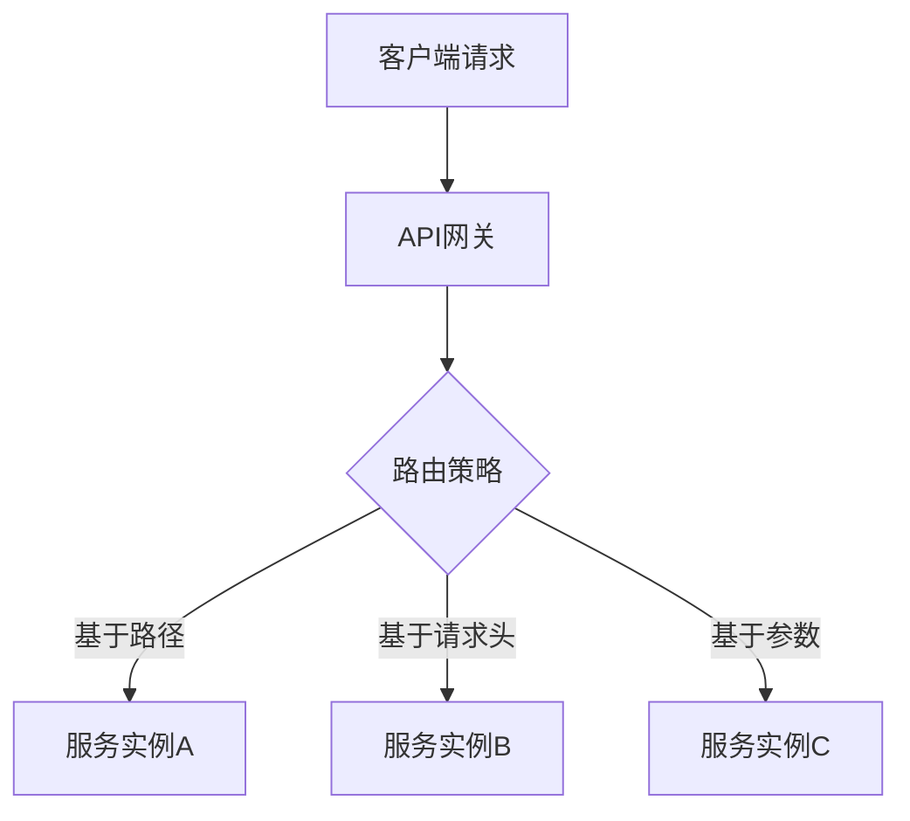
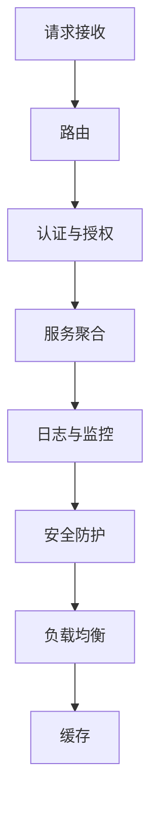
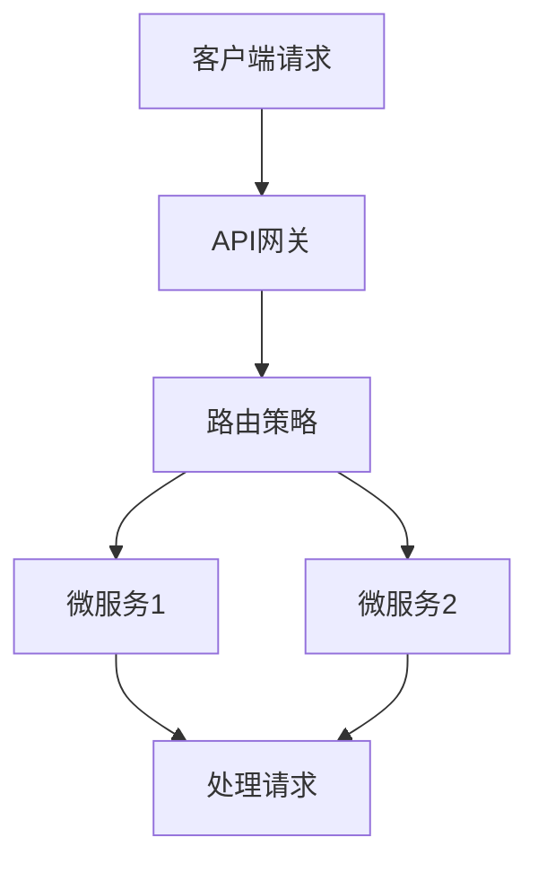
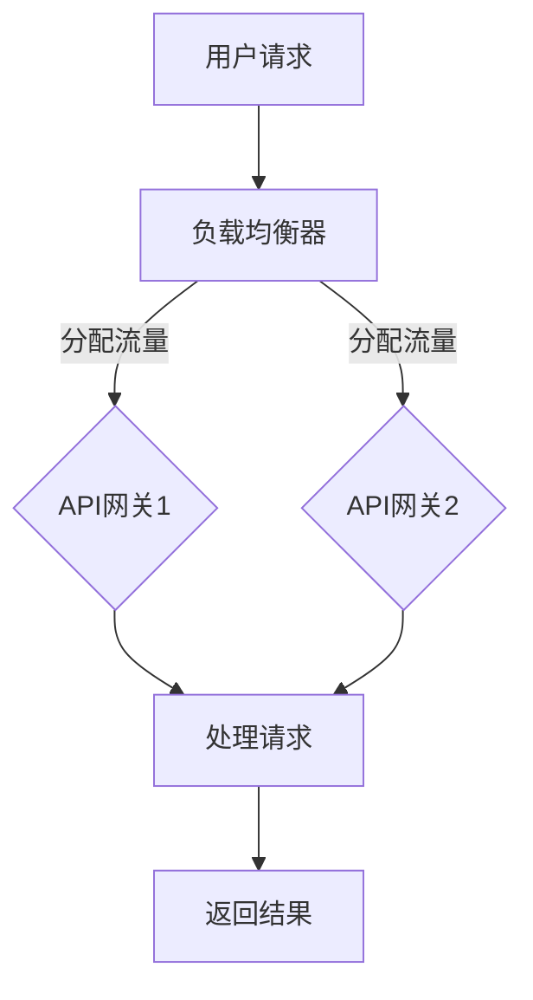
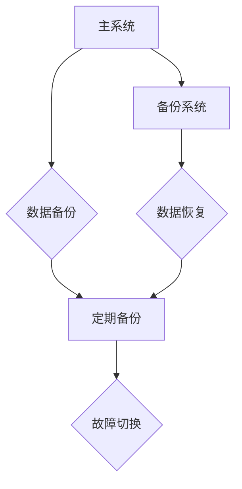
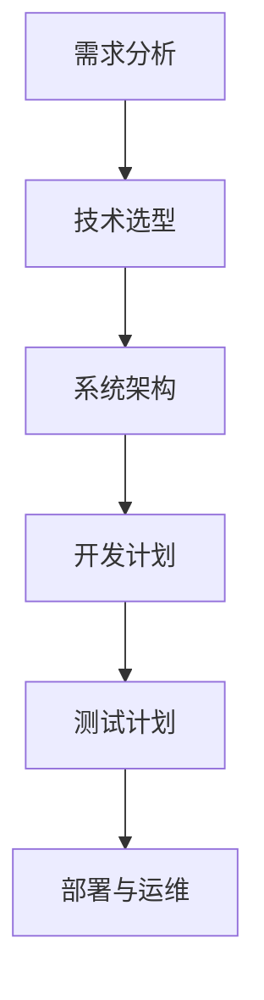
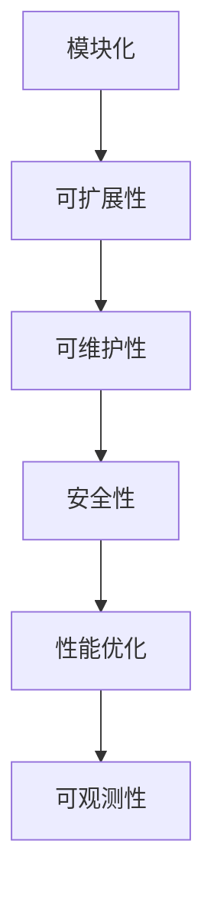
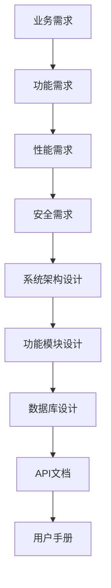
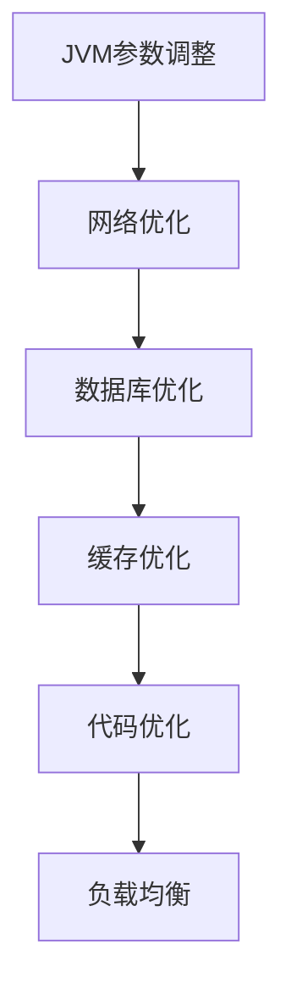
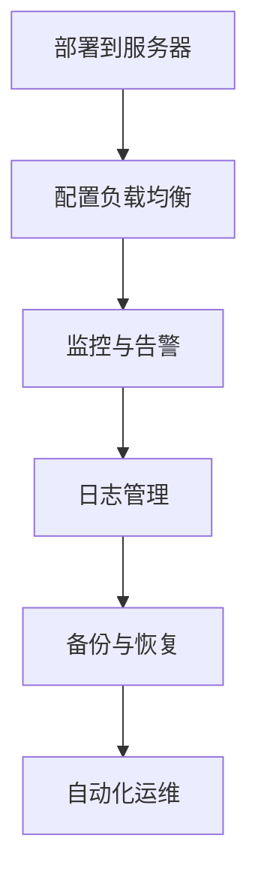

                 

# 《API 网关的详细使用》

> **关键词：** API网关、微服务、路由、负载均衡、服务熔断、性能优化、高可用性、监控与运维
>
> **摘要：** 本文将深入探讨API网关的概念、核心功能、技术架构、开发与性能优化，并通过项目实践案例，详细解析API网关的搭建与使用，为开发者提供全方位的技术指南。

## 目录大纲

### 第一部分：API网关概述

#### 第1章：API网关的概念与重要性

##### 1.1 API网关的定义

##### 1.2 API网关的作用

##### 1.3 API网关与传统架构的比较

#### 第2章：API网关的关键功能

##### 2.1 路由

##### 2.2 服务熔断与降级

##### 2.3 安全与认证

##### 2.4 负载均衡与流量控制

#### 第3章：API网关的技术架构

##### 3.1 API网关的组件与交互

##### 3.2 API网关与微服务的关系

##### 3.3 API网关的架构设计原则

### 第二部分：API网关的核心技术

#### 第4章：API网关开发技术

##### 4.1 API网关的开发工具与框架

##### 4.2 API网关的接口设计与文档生成

##### 4.3 API网关的安全防护措施

#### 第5章：API网关性能优化

##### 5.1 性能监控与日志分析

##### 5.2 优化策略与实践

##### 5.3 性能调优案例分析

#### 第6章：API网关容错与高可用性设计

##### 6.1 容错机制的实现

##### 6.2 高可用性设计

##### 6.3 容灾备份策略

#### 第7章：API网关的监控与运维

##### 7.1 监控指标与数据采集

##### 7.2 运维自动化工具与流程

##### 7.3 异常处理与故障恢复

### 第三部分：API网关项目实践

#### 第8章：API网关项目规划与设计

##### 8.1 项目规划

##### 8.2 API网关设计原则

##### 8.3 项目需求分析与文档编写

#### 第9章：API网关环境搭建与配置

##### 9.1 开发环境搭建

##### 9.2 系统配置与优化

##### 9.3 部署与运维环境设置

#### 第10章：API网关代码实现与解读

##### 10.1 API接口实现

##### 10.2 代码解读与分析

##### 10.3 典型场景代码示例

#### 第11章：API网关测试与性能分析

##### 11.1 测试策略与工具

##### 11.2 性能测试方法

##### 11.3 性能瓶颈分析与优化

### 附录

#### 附录A：API网关常用工具与技术资源

##### A.1 OpenAPI规范

##### A.2 OAuth2.0认证

##### A.3 Kubernetes在API网关中的应用

#### 附录B：API网关项目案例

##### B.1 项目背景与目标

##### B.2 系统架构设计

##### B.3 项目实施与挑战

##### B.4 项目总结与经验分享

---

### 第一部分：API网关概述

#### 第1章：API网关的概念与重要性

##### 1.1 API网关的定义

API网关是现代分布式系统中的一种关键组件，它作为所有外部请求进入系统的唯一入口，起到了“门卫”的作用。API网关通常位于外网和内网之间，负责接收客户端发送的请求，将请求路由到后端的服务，并对请求进行必要的处理和转换。

在微服务架构中，API网关的作用尤为重要。由于微服务系统通常由多个小型、独立的业务服务组成，这些服务各自运行在不同的服务器上，通过不同的端口号提供服务。因此，客户端在进行服务调用时，需要知道每个服务的具体地址和端口号。而API网关正是充当了服务发现和路由的作用，将客户端的请求路由到正确的服务实例上。

##### 1.2 API网关的作用

API网关的作用可以从以下几个方面来理解：

1. **统一接口管理**：API网关为所有的服务提供了一个统一的接口，客户端只需与API网关进行通信，无需关心后端的具体服务实现。这大大简化了客户端的开发工作。

2. **服务路由**：API网关根据请求的URL或其他标识信息，将请求路由到后端的具体服务实例上。这确保了请求能够到达正确的目的地。

3. **协议转换**：API网关能够对不同协议的请求进行转换，例如，将HTTP请求转换为其他服务所期望的协议（如gRPC、WebSocket等）。

4. **安全控制**：API网关可以对请求进行安全检查，包括身份验证、授权、请求参数验证等，确保只有合法的请求能够到达后端服务。

5. **流量控制与负载均衡**：API网关可以对进入的流量进行控制，实现流量的动态分配，从而实现负载均衡。这有助于确保系统在高并发情况下的稳定运行。

6. **服务聚合**：API网关可以将多个服务的功能聚合到一个接口中，对外提供单一的服务接口，这简化了客户端的调用过程。

7. **监控与日志**：API网关可以收集并监控整个系统的请求和响应数据，便于进行系统性能分析和故障排查。

##### 1.3 API网关与传统架构的比较

在传统的单体架构中，所有的服务都运行在同一个进程中，请求的处理和路由相对简单。而在微服务架构中，服务被拆分成多个独立的小服务，分布在不同的服务器上。这种架构的变化带来了以下几个方面的挑战：

1. **服务数量增多**：随着服务的增加，客户端需要知道更多的服务地址和端口号，调用过程变得复杂。

2. **服务动态变化**：微服务系统中的服务可能会动态启动或停止，服务地址和端口号也会随之变化。

3. **流量分配问题**：在分布式系统中，如何有效地分配流量，实现负载均衡，是保证系统性能的关键。

4. **服务安全性**：随着服务的增多，安全性问题变得更加复杂，需要确保所有的请求都经过严格的身份验证和授权。

5. **监控与运维**：分布式系统中的服务分布在不同的服务器上，监控和运维的难度大大增加。

API网关的出现，解决了上述挑战，成为微服务架构中的重要组成部分。与传统架构相比，API网关提供了以下优势：

1. **简化客户端调用**：API网关为客户端提供了一个统一的接口，简化了调用过程，降低了客户端的复杂度。

2. **服务动态管理**：API网关可以根据服务状态动态更新路由信息，确保请求能够到达正确的服务实例。

3. **流量动态分配**：API网关可以实现流量的动态分配，实现负载均衡，提高系统性能。

4. **安全性增强**：API网关可以对请求进行严格的身份验证和授权，提高系统的安全性。

5. **监控与运维简化**：API网关提供了统一的监控接口，简化了系统的监控和运维工作。

#### 第2章：API网关的关键功能

##### 2.1 路由

路由是API网关的核心功能之一，它决定了请求应该被发送到哪个服务实例。路由策略通常基于请求的URL、请求头或其他标识信息。以下是API网关常见的路由策略：

1. **基于路径的路由**：根据请求的URL路径，将请求路由到相应的服务实例。例如，如果请求的URL为`/users`,则将其路由到处理用户相关的服务实例。

2. **基于请求头的路由**：根据请求头中的特定信息（如`X-User-Id`），将请求路由到相应的服务实例。这种策略适用于根据用户身份或角色来路由请求的场景。

3. **基于参数的路由**：根据请求参数（如`?id=123`），将请求路由到相应的服务实例。这种策略适用于需要根据不同参数值来区分服务实例的场景。

4. **动态路由**：API网关可以根据服务实例的状态（如健康状态、负载情况等）动态调整路由策略。例如，当某个服务实例出现故障时，API网关可以将请求重定向到其他正常的服务实例。

为了更好地理解路由功能，下面是一个简单的Mermaid流程图：



##### 2.2 服务熔断与降级

服务熔断与降级是API网关在分布式系统中的重要功能，用于应对服务故障或高负载情况，确保系统的稳定性和可用性。

1. **服务熔断**

服务熔断是一种保险丝机制，当服务故障率超过一定阈值时，API网关会触发熔断，阻止新的请求到达故障服务实例，从而避免系统崩溃。服务熔断可以防止故障服务实例继续占用系统资源，导致雪崩效应。

熔断策略通常包括以下几个参数：

- **熔断阈值**：故障率超过该阈值时，触发熔断。
- **熔断持续时间**：触发熔断后，该服务实例会在一段时间内（熔断持续时间）被屏蔽，不再接受请求。
- **恢复阈值**：熔断持续时间结束后，故障率低于该阈值时，服务实例会自动恢复。

下面是一个简单的伪代码示例：

```python
def handle_request(request):
    if is_service熔断(service):
        return "服务不可用"
    else:
        return process_request(request)

def is_service熔断(service):
    if service故障率 > 熔断阈值 and time_since_last_recover() > 熔断持续时间:
        return True
    else:
        return False
```

2. **服务降级**

服务降级是一种在系统负载过高时，暂时关闭某些非核心功能的策略，以减轻系统的压力。通过服务降级，可以将系统的资源集中在核心功能上，确保核心服务的稳定运行。

服务降级的策略通常包括：

- **降级阈值**：当系统负载超过该阈值时，触发降级。
- **降级策略**：根据不同的服务功能，制定不同的降级策略。例如，可以降低服务的响应速度，减少服务的并发处理能力等。

下面是一个简单的伪代码示例：

```python
def handle_request(request):
    if is_system overloaded() and request属于非核心功能：
        return "服务降级中，请稍后重试"
    else:
        return process_request(request)

def is_system overloaded():
    if system_load > 降级阈值：
        return True
    else:
        return False
```

##### 2.3 安全与认证

API网关在安全性方面发挥着重要作用，它负责对请求进行身份验证和授权，确保只有合法的请求能够到达后端服务。

1. **身份验证**

身份验证是确保请求者身份的合法性，常用的身份验证方式包括：

- **用户名密码验证**：通过用户名和密码验证请求者的身份。
- **令牌认证**：使用JWT（JSON Web Token）或OAuth2.0等令牌认证机制，确保请求者拥有访问权限。
- **单点登录（SSO）**：通过单点登录系统，统一管理用户的身份认证。

2. **授权**

授权是确保请求者具有对特定资源的访问权限，常用的授权方式包括：

- **基于角色的访问控制（RBAC）**：根据用户的角色（如管理员、普通用户等），赋予不同的访问权限。
- **基于资源的访问控制（ABAC）**：根据资源的属性（如文件类型、访问时间等），进行访问控制。
- **权限令牌**：通过权限令牌（如OAuth2.0的Access Token），控制对特定资源的访问权限。

3. **安全防护**

API网关还需要对请求进行安全防护，防止常见的攻击方式，如SQL注入、跨站脚本攻击（XSS）等。常用的安全防护措施包括：

- **参数验证**：对请求参数进行严格的验证，防止恶意输入。
- **请求体验证**：对请求体进行验证，确保请求体中不包含恶意代码。
- **HTTP头验证**：对HTTP头进行验证，防止攻击者篡改请求头。

##### 2.4 负载均衡与流量控制

负载均衡是API网关的另一重要功能，它用于将进入的流量分配到多个服务实例上，确保系统的稳定运行。负载均衡策略可以基于不同的算法实现，如轮询、最小连接数、IP哈希等。

1. **轮询算法**

轮询算法是最简单的负载均衡策略，它按照顺序将请求分配到不同的服务实例上。轮询算法的优点是实现简单，但缺点是当某个服务实例出现故障时，其他服务实例可能会承受过多的流量。

2. **最小连接数算法**

最小连接数算法将请求分配到当前连接数最少的服务实例上，确保每个服务实例的负载相对均衡。这种算法适用于连接数较重要的场景，但需要定期更新服务实例的连接数信息。

3. **IP哈希算法**

IP哈希算法根据客户端的IP地址，将请求分配到相同的服务实例上。这种算法的优点是会话保持，但缺点是当服务实例出现故障时，会影响部分客户端的访问。

流量控制是API网关在处理高并发请求时的重要功能，它用于控制进入的流量，防止系统过载。常用的流量控制策略包括：

1. **基于时间的流量控制**：在一段时间内（如1分钟），限制某个IP地址或用户访问的请求数量。

2. **基于流量的流量控制**：在一段时间内（如1分钟），限制总的请求流量。

3. **令牌桶算法**：根据令牌的产生速度和消耗速度，控制流量的速率。

下面是一个简单的令牌桶算法的伪代码示例：

```python
class TokenBucket:
    def __init__(self, capacity, fill_rate):
        self.capacity = capacity
        self.fill_rate = fill_rate
        self.tokens = capacity
        self.last_time = time.time()

    def consume(self, tokens):
        if tokens <= self.tokens:
            self.tokens -= tokens
            return True
        else:
            return False

    def fill(self):
        now = time.time()
        elapsed_time = now - self.last_time
        new_tokens = elapsed_time * self.fill_rate
        if new_tokens > 0:
            self.tokens = min(self.capacity, self.tokens + new_tokens)
            self.last_time = now

# 使用令牌桶算法进行流量控制
def handle_request(request):
    token_bucket.consume(1)
    if token_bucket.consume(1):
        return process_request(request)
    else:
        return "流量过大，请稍后重试"
```

#### 第3章：API网关的技术架构

##### 3.1 API网关的组件与交互

API网关由多个组件组成，它们协同工作，实现API网关的功能。以下是API网关的主要组件及其交互关系：

1. **请求接收组件**：负责接收客户端的请求，将请求转发给后续处理组件。

2. **路由组件**：根据请求的URL、请求头或其他标识信息，将请求路由到相应的服务实例。

3. **认证与授权组件**：对请求进行身份验证和授权，确保只有合法的请求能够到达后端服务。

4. **服务聚合组件**：将多个服务的功能聚合到一个接口中，对外提供单一的服务接口。

5. **日志与监控组件**：收集并记录API网关的请求和响应数据，提供日志和监控功能。

6. **安全防护组件**：对请求进行安全防护，防止常见的攻击方式。

7. **负载均衡组件**：将进入的流量分配到多个服务实例上，实现负载均衡。

8. **缓存组件**：缓存部分请求和响应数据，提高系统的响应速度。

以下是API网关的组件交互关系的Mermaid流程图：



##### 3.2 API网关与微服务的关系

API网关与微服务之间存在着紧密的联系，它们共同构成了现代分布式系统。以下是API网关与微服务的关系：

1. **API网关是微服务架构的入口**：API网关作为外部请求进入系统的唯一入口，起到了“门卫”的作用，对请求进行统一管理和路由。

2. **API网关简化微服务调用**：通过API网关，客户端只需与API网关进行通信，无需关心后端的具体服务实现，简化了客户端的调用过程。

3. **API网关与微服务的联动**：API网关与微服务之间通过API进行交互，API网关负责将请求路由到相应的微服务实例上，微服务实例处理请求并返回结果。

4. **API网关优化微服务性能**：通过路由策略、负载均衡、缓存等机制，API网关可以优化微服务的性能，提高系统的整体性能。

以下是API网关与微服务关系的Mermaid流程图：



##### 3.3 API网关的架构设计原则

设计API网关时，需要遵循以下架构设计原则，以确保系统的稳定、高效和可维护性：

1. **高可用性**：API网关作为系统的入口，必须确保高可用性，避免单点故障。可以通过部署多个API网关实例，实现负载均衡和故障转移。

2. **可扩展性**：API网关的设计应具备良好的可扩展性，以支持服务的动态扩展和缩放。可以通过水平扩展（增加实例数量）和垂直扩展（增加硬件资源）来实现。

3. **安全性**：API网关需要具备严格的安全防护机制，确保请求的安全性。可以采用身份验证、授权、加密、安全防护等技术手段。

4. **可维护性**：API网关的设计应便于维护和升级，降低运维成本。可以通过模块化设计、自动化部署、监控与日志分析等技术手段来实现。

5. **高性能**：API网关需要具备高性能，确保系统的响应速度和稳定性。可以通过缓存、负载均衡、优化算法等技术手段来实现。

6. **可观测性**：API网关应具备良好的可观测性，便于监控系统性能和故障。可以通过日志、监控、告警等技术手段来实现。

7. **标准化**：API网关的设计应遵循标准化规范，便于集成和扩展。可以采用OpenAPI、RESTful API等标准化接口规范。

### 第二部分：API网关的核心技术

#### 第4章：API网关开发技术

##### 4.1 API网关的开发工具与框架

在开发API网关时，选择合适的工具和框架可以显著提高开发效率，以下是一些常用的开发工具和框架：

1. **Spring Cloud Gateway**：Spring Cloud Gateway是基于Spring Framework和Spring Boot的API网关开发框架，支持基于路径、请求头和参数的路由策略，以及服务熔断和降级功能。

2. **Kong**：Kong是一个开源的API网关，支持多种协议（如HTTP、HTTPS、gRPC等），具备负载均衡、缓存、安全防护等功能，适用于大规模的分布式系统。

3. **Nginx**：Nginx是一个高性能的HTTP和反向代理服务器，常用于API网关的部署。它支持负载均衡、缓存、安全防护等功能，通过配置文件可以实现复杂的功能。

4. **Apache APISIX**：Apache APISIX是一个开源的API网关，基于Nginx和LuaJIT，支持基于路径、请求头和参数的路由策略，以及负载均衡、缓存、服务熔断等功能。

5. **Traefik**：Traefik是一个开源的反向代理和负载均衡器，支持多种后端服务（如Docker、Kubernetes等），可以方便地集成到微服务架构中。

##### 4.2 API网关的接口设计与文档生成

接口设计是API网关开发的重要环节，合理的接口设计可以提高系统的可维护性和可扩展性。以下是一些接口设计的最佳实践：

1. **RESTful接口设计**：遵循RESTful接口设计原则，使用统一的URL结构，避免使用GET、POST等动词。

2. **参数传递**：使用URL参数、请求头和请求体传递参数，确保参数传递的简洁和可维护性。

3. **状态码使用**：使用标准的状态码（如200、400、500等），确保响应信息的准确和规范。

4. **数据格式**：使用统一的JSON或XML数据格式，确保数据传输的简洁和可读性。

5. **错误处理**：明确定义错误处理策略，返回详细的错误信息和状态码，方便客户端处理。

生成API文档可以帮助开发者和使用者更好地理解和使用API网关，以下是一些常用的API文档生成工具：

1. **Swagger**：Swagger是一个开源的API文档生成工具，支持生成基于OpenAPI规范（formerly Swagger Specification）的文档。它提供了可视化界面，便于查看和使用API。

2. **OpenAPI Generator**：OpenAPI Generator是一个基于OpenAPI规范的自动化工具，可以自动生成API文档、客户端代码和SDK。它支持多种编程语言和框架。

3. **Postman**：Postman是一个流行的API开发工具，支持编写API文档、执行API测试等。它提供了丰富的插件和扩展，方便用户定制和集成。

4. **Apiary**：Apiary是一个在线API设计和管理平台，支持生成API文档、原型设计和API测试。它提供了简洁的界面和丰富的功能，适合小型项目使用。

##### 4.3 API网关的安全防护措施

API网关是系统的入口，对系统的安全性至关重要。以下是一些常见的API网关安全防护措施：

1. **身份验证**：使用用户名密码验证、令牌认证（如JWT、OAuth2.0）等机制，确保只有合法的用户可以访问API。

2. **授权**：根据用户的角色和权限，对API的访问进行限制，确保用户只能访问被授权的资源。

3. **参数验证**：对请求参数进行严格的验证，防止恶意输入和攻击。可以使用正则表达式、白名单等方式进行参数验证。

4. **请求体验证**：对请求体进行验证，确保请求体中不包含恶意代码。可以限制请求体的长度和内容格式。

5. **HTTP头验证**：对HTTP头进行验证，防止攻击者篡改请求头。可以限制HTTP头的类型和内容。

6. **防火墙和反病毒**：部署防火墙和反病毒软件，防止外部攻击和病毒入侵。

7. **安全审计**：定期进行安全审计，检查系统的安全漏洞和风险。可以使用自动化工具进行安全扫描。

8. **加密传输**：使用HTTPS协议，确保数据传输的安全性。可以使用SSL/TLS证书进行加密传输。

9. **API签名**：使用API签名机制，确保请求的真实性和完整性。可以对API的请求参数和请求体进行签名，并在响应中验证签名。

10. **限流和限速**：对API的访问进行限流和限速，防止恶意攻击和过度请求。可以基于IP地址、用户ID等维度进行限制。

#### 第5章：API网关性能优化

##### 5.1 性能监控与日志分析

性能监控与日志分析是API网关性能优化的重要环节，通过监控和日志分析，可以及时发现性能瓶颈和故障，并进行优化。

1. **性能监控**：使用性能监控工具，如Prometheus、Grafana等，对API网关的请求响应时间、吞吐量、错误率等指标进行监控。可以通过设置报警阈值，及时发现异常情况。

2. **日志分析**：收集API网关的请求和响应日志，使用日志分析工具，如ELK（Elasticsearch、Logstash、Kibana）等，对日志进行分析和可视化。可以帮助定位故障点和性能瓶颈。

3. **性能瓶颈定位**：通过性能监控和日志分析，定位系统的性能瓶颈，如数据库查询慢、网络延迟、服务器性能不足等。

4. **性能优化策略**：根据性能瓶颈定位的结果，制定相应的性能优化策略，如缓存优化、数据库优化、网络优化等。

##### 5.2 优化策略与实践

以下是一些常见的API网关性能优化策略和实践：

1. **缓存优化**：使用缓存技术，如Redis、Memcached等，缓存部分请求和响应数据，减少数据库和后端服务的查询压力。可以通过设置合理的缓存过期时间，确保数据的实时性。

2. **数据库优化**：优化数据库查询语句，使用索引、分库分表等技术，提高数据库的查询性能。可以通过数据库连接池，减少数据库连接的开销。

3. **网络优化**：优化网络传输，使用压缩算法，如gzip，减少数据的传输量。可以使用CDN（内容分发网络），提高数据的访问速度。

4. **负载均衡**：使用负载均衡算法，如轮询、最小连接数、IP哈希等，合理分配流量，避免单点瓶颈。可以通过增加API网关实例，提高系统的吞吐量。

5. **并发处理**：优化API网关的并发处理能力，使用线程池、异步处理等技术，提高系统的并发性能。可以通过优化代码，减少同步操作的等待时间。

6. **代码优化**：优化API网关的代码，减少不必要的计算和资源消耗。可以通过代码分析工具，找出性能瓶颈，并进行优化。

7. **缓存预热**：在系统启动时，预热缓存数据，提高系统的响应速度。可以通过定时任务，定期刷新缓存。

##### 5.3 性能调优案例分析

以下是一个API网关性能调优的案例分析：

1. **问题定位**：通过性能监控和日志分析，发现系统的请求响应时间较长，吞吐量较低。

2. **瓶颈分析**：通过分析日志和监控数据，发现性能瓶颈主要在数据库查询和缓存不足。

3. **优化策略**：
   - 优化数据库查询：使用索引、分库分表等技术，提高数据库的查询性能。
   - 增加缓存：使用Redis缓存部分查询结果，减少数据库的查询压力。
   - 负载均衡：增加API网关实例，使用轮询算法，合理分配流量。

4. **实施与验证**：实施优化策略后，监控系统的性能指标，发现请求响应时间显著降低，吞吐量提高。

5. **总结**：通过性能调优，成功解决了系统的性能瓶颈，提高了系统的性能和稳定性。

### 第二部分：API网关的核心技术

#### 第6章：API网关容错与高可用性设计

##### 6.1 容错机制的实现

在分布式系统中，容错机制是确保系统高可用性的关键。API网关作为系统的入口，必须具备强大的容错能力，以应对各种故障情况。以下是一些常见的容错机制：

1. **服务熔断**：当后端服务出现故障或响应超时，API网关会触发熔断，阻止新的请求到达故障服务实例，防止系统过载和崩溃。

2. **服务降级**：在系统负载过高时，API网关会临时关闭某些非核心功能，将资源集中在核心服务上，确保核心服务的稳定运行。

3. **限流**：API网关可以对进入的流量进行控制，避免系统过载。常见的限流算法有令牌桶算法、漏桶算法等。

4. **重试**：当请求失败时，API网关可以尝试重新发送请求，避免因临时故障导致请求失败。

5. **超时设置**：为每个请求设置合理的超时时间，避免长时间占用系统资源。

以下是一个简单的容错机制的伪代码示例：

```python
def handle_request(request):
    try:
        response = send_request_to_backend(request)
        if is_response_valid(response):
            return response
        else:
            retry_request(request)
    except Exception as e:
        log_error(e)
        return "系统繁忙，请稍后重试"

def send_request_to_backend(request):
    # 发送请求到后端服务
    pass

def is_response_valid(response):
    # 检查响应是否有效
    pass

def retry_request(request):
    # 重新发送请求
    pass

def log_error(e):
    # 记录错误日志
    pass
```

##### 6.2 高可用性设计

高可用性设计是确保系统长时间稳定运行的关键。以下是一些常见的高可用性设计策略：

1. **负载均衡**：使用负载均衡器，如Nginx、HAProxy等，将流量分配到多个API网关实例上，避免单点瓶颈。

2. **集群部署**：部署多个API网关实例，组成集群，实现故障转移和负载均衡。

3. **故障转移**：当某个API网关实例出现故障时，其他实例可以接管其工作，确保系统的高可用性。

4. **数据备份与恢复**：定期备份系统数据，确保在发生故障时，可以快速恢复系统。

5. **监控与告警**：使用监控工具，如Zabbix、Prometheus等，实时监控系统的性能和健康状况，及时发现故障并进行处理。

6. **自动化运维**：通过自动化运维工具，如Ansible、Docker等，实现系统的自动化部署、监控和故障处理。

以下是一个简单的高可用性设计示例：



##### 6.3 容灾备份策略

容灾备份策略是确保系统在灾难发生时能够快速恢复的关键。以下是一些常见的容灾备份策略：

1. **异地备份**：将系统部署在多个地理位置，确保在某个地区发生灾难时，其他地区的系统可以继续运行。

2. **数据备份**：定期备份系统数据，包括数据库、配置文件、日志等，确保在灾难发生时，可以快速恢复数据。

3. **热备份**：在系统中部署实时备份机制，如数据库的实时复制，确保在发生故障时，可以快速切换到备份系统。

4. **故障切换**：当主系统发生故障时，自动切换到备份系统，确保系统的连续性和稳定性。

5. **应急预案**：制定详细的应急预案，包括备份系统启动、数据恢复、故障处理等步骤，确保在灾难发生时，可以迅速应对。

以下是一个简单的容灾备份策略示例：



### 第二部分：API网关的核心技术

#### 第7章：API网关的监控与运维

##### 7.1 监控指标与数据采集

API网关的监控是确保系统稳定运行的重要手段。以下是一些常见的监控指标和数据采集方法：

1. **请求响应时间**：记录API网关处理请求的时间，用于评估系统的性能。

2. **请求吞吐量**：记录单位时间内API网关处理的请求数量，用于评估系统的负载能力。

3. **错误率**：记录API网关处理请求时的错误数量和比例，用于评估系统的稳定性。

4. **系统资源使用情况**：监控API网关的系统资源使用情况，如CPU使用率、内存使用率、磁盘使用率等，用于评估系统的资源消耗。

5. **网络流量**：监控API网关的网络流量，包括入流量和出流量，用于评估系统的网络负载。

6. **日志数据**：采集API网关的日志数据，包括请求日志、错误日志、性能日志等，用于分析和排查问题。

以下是一个简单的监控指标和数据采集的伪代码示例：

```python
def monitor_api_gateway():
    response_time = get_response_time()
    throughput = get_throughput()
    error_rate = get_error_rate()
    resource_usage = get_resource_usage()
    network_traffic = get_network_traffic()
    log_data = get_log_data()

    # 存储监控数据
    store_monitor_data(response_time, throughput, error_rate, resource_usage, network_traffic, log_data)

def store_monitor_data(response_time, throughput, error_rate, resource_usage, network_traffic, log_data):
    # 存储监控数据到数据库或日志文件
    pass
```

##### 7.2 运维自动化工具与流程

自动化运维是提高系统运维效率的关键。以下是一些常见的运维自动化工具和流程：

1. **部署工具**：使用自动化部署工具，如Docker、Kubernetes等，实现API网关的自动化部署和更新。

2. **配置管理工具**：使用配置管理工具，如Ansible、Chef等，管理API网关的配置文件和依赖库。

3. **监控工具**：使用监控工具，如Prometheus、Grafana等，实时监控API网关的性能和健康状态。

4. **日志管理工具**：使用日志管理工具，如ELK（Elasticsearch、Logstash、Kibana）等，收集、存储和查询API网关的日志数据。

5. **自动化告警**：使用自动化告警工具，如PagerDuty、Opsgenie等，根据监控指标触发告警，通知运维人员。

6. **自动化备份**：使用自动化备份工具，定期备份API网关的数据和配置文件，确保在故障发生时，可以快速恢复系统。

以下是一个简单的运维自动化工具和流程的伪代码示例：

```python
def deploy_api_gateway():
    # 构建Docker镜像
    build_docker_image()

    # 部署到Kubernetes集群
    deploy_to_kubernetes()

def build_docker_image():
    # 拉取基础镜像
    pull_base_image()

    # 编译代码
    compile_code()

    # 打包和构建Docker镜像
    build_docker_image()

def deploy_to_kubernetes():
    # 创建Kubernetes部署对象
    create_kubernetes_deployment()

    # 更新Kubernetes部署配置
    update_kubernetes_deployment_config()

    # 应用部署配置
    apply_kubernetes_deployment()

def monitor_api_gateway():
    # 检查监控指标
    check_monitor_metrics()

    # 触发告警
    trigger_alerts()

def check_monitor_metrics():
    # 检查API网关的监控指标
    pass

def trigger_alerts():
    # 根据监控指标触发告警
    pass
```

##### 7.3 异常处理与故障恢复

在分布式系统中，异常处理与故障恢复是确保系统高可用性的关键。以下是一些常见的异常处理和故障恢复策略：

1. **异常处理**：当API网关处理请求时，遇到异常情况（如网络异常、服务异常等），应进行适当的异常处理，确保系统的稳定性。

2. **重试策略**：当请求失败时，可以尝试重新发送请求，避免因临时故障导致请求失败。

3. **熔断策略**：当后端服务故障率超过一定阈值时，触发熔断，阻止新的请求到达故障服务实例，避免系统过载和崩溃。

4. **降级策略**：在系统负载过高时，可以临时关闭某些非核心功能，将资源集中在核心服务上，确保核心服务的稳定运行。

5. **故障恢复**：当系统发生故障时，可以自动切换到备份系统，确保系统的连续性和稳定性。

以下是一个简单的异常处理和故障恢复的伪代码示例：

```python
def handle_request(request):
    try:
        # 处理请求
        process_request(request)
    except NetworkException as e:
        # 网络异常处理
        handle_network_exception(e)
    except ServiceException as e:
        # 服务异常处理
        handle_service_exception(e)
    except Exception as e:
        # 其他异常处理
        handle_other_exception(e)

def process_request(request):
    # 处理请求
    pass

def handle_network_exception(e):
    # 网络异常处理逻辑
    pass

def handle_service_exception(e):
    # 服务异常处理逻辑
    pass

def handle_other_exception(e):
    # 其他异常处理逻辑
    pass
```

### 第三部分：API网关项目实践

#### 第8章：API网关项目规划与设计

##### 8.1 项目规划

在开始API网关项目之前，进行合理的项目规划非常重要。以下是项目规划的主要内容：

1. **需求分析**：明确项目的需求，包括业务需求、功能需求、性能需求等。

2. **技术选型**：根据需求，选择合适的API网关框架和工具，如Spring Cloud Gateway、Kong等。

3. **系统架构**：设计系统的整体架构，包括API网关、后端服务、数据库、缓存等。

4. **开发计划**：制定项目的开发计划，包括开发周期、任务分配、里程碑等。

5. **测试计划**：制定项目的测试计划，包括单元测试、集成测试、性能测试等。

6. **部署与运维**：规划项目的部署与运维方案，包括环境搭建、监控与告警、备份与恢复等。

以下是一个简单的项目规划示例：



##### 8.2 API网关设计原则

在API网关的设计过程中，遵循以下设计原则，可以提高系统的可维护性和可扩展性：

1. **模块化**：将API网关的功能划分为多个模块，如路由模块、认证模块、日志模块等，便于管理和维护。

2. **可扩展性**：设计时考虑系统的扩展性，支持动态增加和删除功能模块，满足业务需求的变化。

3. **可维护性**：遵循良好的编程规范，使用清晰的命名和注释，确保代码的可读性和可维护性。

4. **安全性**：确保系统的安全性，包括身份验证、授权、加密等安全措施。

5. **性能优化**：在设计时考虑系统的性能优化，包括缓存、负载均衡、代码优化等。

6. **可观测性**：设计时考虑系统的可观测性，包括监控、日志、告警等。

以下是一个简单的API网关设计原则的示例：



##### 8.3 项目需求分析与文档编写

在项目规划阶段，需求分析是关键的一步。以下是一个简单的项目需求分析与文档编写的示例：

1. **需求分析文档**：

   - 业务需求：描述项目的业务背景、目标和应用场景。
   - 功能需求：列出项目需要实现的功能点，如API网关的路由功能、认证功能、日志功能等。
   - 性能需求：描述项目的性能要求，如请求响应时间、吞吐量等。
   - 安全需求：描述项目的安全要求，如身份验证、授权、加密等。

2. **设计文档**：

   - 系统架构设计：描述系统的整体架构，包括API网关、后端服务、数据库、缓存等。
   - 功能模块设计：描述各个功能模块的职责和接口，如路由模块、认证模块、日志模块等。
   - 数据库设计：描述数据库的结构和表关系。
   - API文档：描述API的接口定义、参数和返回值。

3. **用户手册**：

   - 系统概述：介绍系统的功能和用途。
   - 使用说明：详细描述如何使用系统，包括操作步骤、界面说明等。
   - 常见问题：列举用户可能遇到的问题和解决方法。

以下是一个简单的项目需求分析与文档编写的示例：



#### 第9章：API网关环境搭建与配置

##### 9.1 开发环境搭建

在开始API网关项目之前，需要搭建开发环境。以下是一个简单的开发环境搭建步骤：

1. **安装Java环境**：下载并安装Java开发工具包（JDK），配置环境变量。

2. **安装IDE**：选择合适的集成开发环境（IDE），如IntelliJ IDEA、Eclipse等，并配置相关的插件。

3. **安装Maven**：下载并安装Maven，配置环境变量。

4. **创建项目**：使用Maven创建一个Spring Boot项目，并引入相关的依赖。

5. **配置数据库**：选择合适的数据库（如MySQL、PostgreSQL等），并配置数据库连接。

6. **配置缓存**：选择合适的缓存（如Redis、Memcached等），并配置缓存连接。

以下是一个简单的开发环境搭建的伪代码示例：

```python
def install_java():
    # 下载并安装JDK
    pass

def install_ide():
    # 下载并安装IDE
    pass

def install_maven():
    # 下载并安装Maven
    pass

def create_project():
    # 创建Spring Boot项目
    pass

def configure_database():
    # 配置数据库连接
    pass

def configure_cache():
    # 配置缓存连接
    pass
```

##### 9.2 系统配置与优化

在开发环境搭建完成后，需要对API网关进行系统配置和优化，以提高系统的性能和稳定性。以下是一些常见的配置和优化方法：

1. **JVM参数调整**：调整JVM参数，如堆大小、垃圾回收策略等，以优化系统的性能。

2. **网络优化**：优化网络配置，如设置合理的TCP参数、关闭ICMP请求等，以减少网络延迟和丢包率。

3. **数据库优化**：优化数据库配置，如调整连接池大小、索引优化等，以提高数据库的查询性能。

4. **缓存优化**：优化缓存配置，如调整缓存大小、过期时间等，以提高系统的响应速度。

5. **代码优化**：优化代码，减少不必要的计算和资源消耗，以提高系统的性能。

6. **负载均衡**：使用负载均衡器，如Nginx、HAProxy等，实现流量的动态分配，以提高系统的负载能力。

以下是一个简单的系统配置和优化示例：



##### 9.3 部署与运维环境设置

在开发环境搭建和系统配置完成后，需要将API网关部署到生产环境，并进行运维管理。以下是一些常见的部署与运维环境设置：

1. **部署到服务器**：将API网关部署到服务器，如使用Docker、Kubernetes等进行容器化部署。

2. **配置负载均衡**：配置负载均衡器，如Nginx、HAProxy等，实现流量的动态分配和故障转移。

3. **监控与告警**：使用监控工具，如Prometheus、Grafana等，实时监控API网关的性能和健康状态，并配置告警。

4. **日志管理**：使用日志管理工具，如ELK（Elasticsearch、Logstash、Kibana）等，收集、存储和查询API网关的日志数据。

5. **备份与恢复**：定期备份API网关的数据和配置文件，并配置备份恢复策略，以防止数据丢失。

6. **自动化运维**：使用自动化运维工具，如Ansible、Docker等，实现系统的自动化部署、监控和故障处理。

以下是一个简单的部署与运维环境设置示例：



### 第三部分：API网关项目实践

#### 第10章：API网关代码实现与解读

##### 10.1 API接口实现

API接口是实现API网关功能的关键，以下是一个简单的API接口实现的示例：

```java
@RestController
@RequestMapping("/api")
public class ApiController {

    @GetMapping("/users")
    public ResponseEntity<List<User>> getUsers() {
        // 获取用户列表
        List<User> users = userService.getUsers();
        return ResponseEntity.ok(users);
    }

    @PostMapping("/users")
    public ResponseEntity<User> createUser(@RequestBody User user) {
        // 创建用户
        User savedUser = userService.createUser(user);
        return ResponseEntity.status(HttpStatus.CREATED).body(savedUser);
    }
}
```

在这个示例中，我们定义了一个`ApiController`类，并使用`@RestController`注解标记为控制器。通过`@GetMapping`和`@PostMapping`注解，定义了获取用户列表和创建用户的API接口。

##### 10.2 代码解读与分析

在API接口实现的基础上，我们对代码进行解读和分析，了解其工作原理和关键点：

1. **注解的使用**：

   - `@RestController`：用于标记控制器类，Spring Boot会自动将类的成员方法映射为HTTP接口。
   - `@RequestMapping`：用于标记方法的HTTP请求路径和处理方法。`@GetMapping`和`@PostMapping`是`@RequestMapping`的子注解，分别用于处理GET和POST请求。

2. **响应体和响应状态**：

   - `ResponseEntity`：用于封装HTTP响应体和响应状态。通过`ResponseEntity.ok()`和`ResponseEntity.status(HttpStatus.CREATED)`，可以设置响应体和响应状态。

3. **调用服务方法**：

   - `userService.getUsers()`：调用用户服务的方法，获取用户列表。
   - `userService.createUser(user)`：调用用户服务的方法，创建用户。

4. **代码结构**：

   - `ApiController`类中定义了两个方法，分别处理GET和POST请求。这样的结构使得代码清晰、易于维护。

##### 10.3 典型场景代码示例

以下是一个典型的API接口实现场景示例，包括用户登录和用户信息查询功能：

```java
@RestController
@RequestMapping("/api")
public class ApiController {

    @Autowired
    private UserService userService;

    @PostMapping("/login")
    public ResponseEntity<User> login(@RequestParam String username, @RequestParam String password) {
        User user = userService.login(username, password);
        if (user != null) {
            return ResponseEntity.ok(user);
        } else {
            return ResponseEntity.status(HttpStatus.UNAUTHORIZED).body(null);
        }
    }

    @GetMapping("/users/{id}")
    public ResponseEntity<User> getUserById(@PathVariable Long id) {
        User user = userService.getUserById(id);
        if (user != null) {
            return ResponseEntity.ok(user);
        } else {
            return ResponseEntity.status(HttpStatus.NOT_FOUND).body(null);
        }
    }
}
```

在这个示例中，我们增加了用户登录和用户信息查询的功能：

1. **用户登录**：通过`@PostMapping("/login")`，接收用户名和密码参数，调用用户服务的方法进行登录验证。

2. **用户信息查询**：通过`@GetMapping("/users/{id}")`，接收用户ID参数，调用用户服务的方法获取用户信息。

在这个示例中，我们使用了`@RequestParam`和`@PathVariable`注解，分别接收请求参数和路径变量。

### 第11章：API网关测试与性能分析

#### 11.1 测试策略与工具

API网关的测试是确保系统稳定性和性能的重要环节。以下是一些常见的测试策略和工具：

1. **功能测试**：验证API网关的功能是否正确实现，包括接口调用、参数传递、响应处理等。

2. **性能测试**：评估API网关的响应时间和吞吐量，确保系统在高并发情况下仍能稳定运行。

3. **安全测试**：验证API网关的安全性，包括身份验证、授权、参数验证等。

4. **压力测试**：模拟高并发请求，评估系统的最大承载能力和稳定性。

5. **自动化测试**：使用自动化测试工具，如Postman、JMeter等，实现测试用例的自动化执行。

6. **持续集成**：将测试集成到持续集成（CI）流程中，实现自动化测试和快速反馈。

以下是常用的测试工具：

- **Postman**：用于编写和执行API测试用例，支持多种协议和Mock数据。
- **JMeter**：用于进行性能测试和压力测试，支持多种协议和虚拟用户模拟。
- **Selenium**：用于自动化Web测试，支持浏览器和移动设备。

#### 11.2 性能测试方法

性能测试是评估API网关性能的重要手段。以下是一些常见的性能测试方法：

1. **基准测试**：使用标准测试数据，评估API网关的响应时间和吞吐量。

2. **负载测试**：模拟不同负载（如并发用户数、请求频率等），评估API网关的性能变化。

3. **压力测试**：模拟高并发请求，评估API网关的最大承载能力和稳定性。

4. ** soak测试**：在特定负载下，长时间运行测试，评估系统的稳定性和资源消耗。

5. **性能瓶颈分析**：通过监控和日志分析，定位系统性能瓶颈，进行优化。

以下是性能测试的伪代码示例：

```python
def perform_performance_test():
    # 设置测试参数
    concurrency = 100
    request_rate = 1000
    test_duration = 60

    # 启动性能测试
    start_time = time.time()
    start_load(concurrency, request_rate)
    
    # 等待测试结束
    while not is_test_finished():
        time.sleep(1)

    # 停止性能测试
    stop_load()
    end_time = time.time()

    # 记录测试结果
    response_time = calculate_average_response_time()
    throughput = calculate_throughput()

    # 输出测试结果
    print(f"测试结果：响应时间={response_time}ms，吞吐量={throughput}req/s")

def start_load(concurrency, request_rate):
    # 启动虚拟用户模拟请求
    pass

def stop_load():
    # 停止虚拟用户模拟请求
    pass

def is_test_finished():
    # 判断测试是否结束
    pass

def calculate_average_response_time():
    # 计算平均响应时间
    pass

def calculate_throughput():
    # 计算吞吐量
    pass
```

#### 11.3 性能瓶颈分析与优化

性能瓶颈分析是发现系统性能瓶颈并进行优化的关键步骤。以下是一些常见的性能瓶颈和优化方法：

1. **数据库瓶颈**：

   - **优化查询语句**：使用索引、优化查询语句，减少查询时间。
   - **分库分表**：将数据分散到多个数据库或表中，减少单个数据库的压力。
   - **缓存**：使用缓存技术，如Redis、Memcached等，减少数据库查询次数。

2. **网络瓶颈**：

   - **优化网络配置**：调整TCP参数、关闭ICMP请求等，减少网络延迟和丢包率。
   - **负载均衡**：使用负载均衡器，如Nginx、HAProxy等，实现流量的动态分配。

3. **服务瓶颈**：

   - **服务拆分**：将大型服务拆分为多个小型服务，减少单个服务的负载。
   - **限流和限速**：使用限流和限速策略，控制进入的流量，避免服务过载。

4. **代码瓶颈**：

   - **代码优化**：减少不必要的计算和资源消耗，提高代码的执行效率。
   - **异步处理**：使用异步处理，减少同步操作的等待时间。

5. **硬件瓶颈**：

   - **增加硬件资源**：增加服务器资源（如CPU、内存、磁盘等），提高系统的处理能力。
   - **分布式部署**：将系统分布式部署到多个服务器上，提高系统的负载能力。

以下是性能瓶颈分析与优化的伪代码示例：

```python
def analyze_performance_bottleneck():
    # 分析数据库瓶颈
    analyze_database_bottleneck()

    # 分析网络瓶颈
    analyze_network_bottleneck()

    # 分析服务瓶颈
    analyze_service_bottleneck()

    # 分析代码瓶颈
    analyze_code_bottleneck()

    # 分析硬件瓶颈
    analyze_hardware_bottleneck()

def analyze_database_bottleneck():
    # 分析数据库瓶颈
    pass

def analyze_network_bottleneck():
    # 分析网络瓶颈
    pass

def analyze_service_bottleneck():
    # 分析服务瓶颈
    pass

def analyze_code_bottleneck():
    # 分析代码瓶颈
    pass

def analyze_hardware_bottleneck():
    # 分析硬件瓶颈
    pass

def optimize_performance():
    # 根据分析结果，优化系统性能
    pass
```

### 附录

#### 附录A：API网关常用工具与技术资源

以下是一些常用的API网关工具和技术资源：

1. **OpenAPI规范**：OpenAPI规范是一种用于定义API的标准化方式，支持自动化工具生成文档和SDK。网址：[https://openapi-specification.org/](https://openapi-specification.org/)

2. **OAuth2.0认证**：OAuth2.0是一种开放标准，用于授权第三方应用访问用户资源。网址：[https://oauth.net/2/](https://oauth.net/2/)

3. **Kubernetes在API网关中的应用**：Kubernetes是一个开源的容器编排平台，可以用于部署和管理API网关。网址：[https://kubernetes.io/](https://kubernetes.io/)

#### 附录B：API网关项目案例

以下是一个API网关项目案例：

**项目背景与目标**：

某公司开发了一套企业级的微服务系统，包含用户管理、订单管理、库存管理等核心模块。随着业务的发展，系统需要对外开放API接口，供第三方应用调用。为了简化接口管理，提高系统性能和安全性，公司决定采用API网关作为统一的接口入口。

**系统架构设计**：

系统架构设计包括以下几个关键部分：

1. **API网关**：使用Spring Cloud Gateway作为API网关，提供统一的接口管理和路由功能。

2. **用户服务**：负责处理用户注册、登录、信息查询等功能。

3. **订单服务**：负责处理订单创建、查询、取消等功能。

4. **库存服务**：负责处理库存查询、库存更新等功能。

5. **数据库**：使用MySQL作为数据库，存储用户、订单、库存等数据。

6. **缓存**：使用Redis作为缓存，提高数据查询速度。

**项目实施与挑战**：

1. **接口管理**：通过API网关，实现了接口的统一管理和路由。同时，使用OpenAPI规范，自动化生成API文档和SDK，方便第三方应用接入。

2. **性能优化**：通过数据库优化、缓存使用、代码优化等手段，提高了系统的响应速度和吞吐量。

3. **安全性**：采用OAuth2.0认证和授权机制，确保接口的安全性。

4. **监控与运维**：使用Prometheus和Grafana进行实时监控，及时发现和处理故障。

5. **挑战**：

   - **接口一致性**：在多团队开发过程中，确保接口的一致性是一个挑战。通过接口规范和自动化文档生成，提高了接口一致性。
   - **性能瓶颈**：在项目初期，系统性能存在瓶颈。通过性能测试和优化，成功解决了性能瓶颈。

**项目总结与经验分享**：

1. **API网关的价值**：API网关简化了接口管理，提高了系统的性能和安全性。通过统一接口管理和路由，降低了客户端的接入复杂度。

2. **性能优化**：性能优化是系统稳定运行的关键。通过数据库优化、缓存使用、代码优化等手段，提高了系统的性能。

3. **安全性**：安全性是API网关的重要功能。采用OAuth2.0认证和授权机制，确保了接口的安全性。

4. **监控与运维**：实时监控和运维自动化是保障系统稳定运行的关键。通过Prometheus和Grafana等工具，实现了系统的实时监控和自动化运维。

### 结论

API网关是现代分布式系统中不可或缺的组件，它在接口管理、路由、安全、性能优化等方面发挥着重要作用。本文详细介绍了API网关的概念、功能、技术架构、开发实践和性能优化，并通过项目实践案例，展示了API网关的实际应用。通过本文的阅读，读者可以全面了解API网关的技术原理和实践方法，为实际项目开发提供有力支持。

**作者信息**：

作者：AI天才研究院/AI Genius Institute & 禅与计算机程序设计艺术/Zen And The Art of Computer Programming

---

请注意，本文所述内容仅供参考，具体实现和效果可能因具体项目和环境而异。在实际应用中，请根据具体情况进行调整和优化。希望本文对您在API网关领域的学习和应用有所帮助！<|im_end|>

