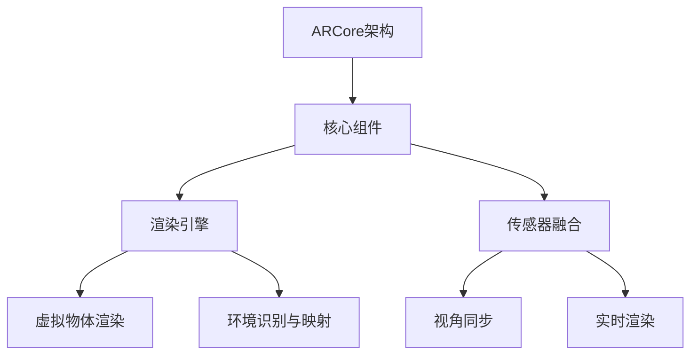

                 

# ARCore与ARKit：移动AR应用开发对比

## 第一部分：移动AR技术基础

### 第1章：移动AR技术概述

#### 1.1 移动AR的背景和发展

移动AR（增强现实）技术的诞生可以追溯到上世纪90年代。当时的虚拟现实技术逐渐成熟，研究人员开始探索如何在移动设备上实现增强现实功能。1990年代，波音公司和IBM等公司开始了移动AR技术的初步研究，主要集中在军用和工业领域。随着智能手机和移动设备的普及，移动AR技术逐渐从实验室走向大众。

进入21世纪，移动AR技术迎来了快速发展。苹果和谷歌等科技巨头纷纷推出了各自的AR开发平台，推动了移动AR技术在消费市场的普及。例如，苹果在2017年推出了ARKit，而谷歌在2018年推出了ARCore。这些平台的推出，使得开发者能够更方便地在移动设备上开发AR应用。

#### 1.2 移动AR的发展趋势

移动AR技术正朝着更高精度、更高实时性和更广泛应用场景的方向发展。随着硬件设备的不断升级，如更高分辨率的屏幕、更先进的摄像头和更强大的处理器，移动AR的应用场景也在不断拓展。

首先，移动AR在游戏和娱乐领域的应用将更加广泛。通过虚拟现实技术，游戏开发者可以为用户提供更加沉浸式的游戏体验。其次，教育领域也将受益于移动AR技术。通过AR应用，学生可以更直观地理解抽象的概念，提高学习效率。此外，商业展示、医疗、建筑设计和智能家居等领域也将逐渐采用移动AR技术。

#### 1.3 移动AR的重要里程碑

移动AR技术的发展历程中，有许多重要的里程碑。以下是其中的一些：

- 2012年，谷歌发布了Project Glass，这是第一款能够实现移动AR功能的智能眼镜。
- 2016年，苹果发布了iPhone 7，其摄像头升级到了True Tone技术，为移动AR技术提供了更好的硬件支持。
- 2017年，苹果推出了ARKit，使得开发者可以轻松地在iOS设备上开发AR应用。
- 2018年，谷歌推出了ARCore，为Android设备提供了AR开发平台。
- 2019年，华为发布了AR地图，展示了移动AR在导航和地图应用中的潜力。

### 第2章：ARCore技术解析

#### 2.1 ARCore架构

ARCore是谷歌推出的移动AR开发平台，它主要由三个核心组件构成：渲染引擎、传感器融合和场景构建。

- **渲染引擎**：ARCore的渲染引擎基于Unity引擎，提供了高效的3D渲染能力。通过渲染引擎，开发者可以创建高质量的AR内容，并将其准确地映射到真实世界中的位置和场景。
- **传感器融合**：ARCore利用手机的多传感器数据，如摄像头、GPS、加速度计和陀螺仪等，实现实时定位和地图构建。传感器融合技术使得ARCore能够准确地追踪设备在空间中的位置和姿态。
- **场景构建**：ARCore提供了场景构建工具，使得开发者可以创建、导入和编辑AR场景。这些工具支持多种文件格式，如OBJ、FBX和GLTF，使得开发者可以方便地集成外部3D模型。

#### 2.2 ARCore核心算法

ARCore的核心算法包括SLAM（Simultaneous Localization and Mapping）、深度感知和6自由度追踪。

- **SLAM算法**：SLAM算法是ARCore实现实时定位和地图构建的关键。ARCore使用视觉SLAM技术，通过分析摄像头捕获的图像数据，实时估计设备在空间中的位置和姿态。SLAM算法使得AR内容能够与真实世界保持一致，实现无缝的增强现实体验。
- **深度感知**：ARCore的深度感知功能可以测量场景中的深度信息，从而实现对真实环境的理解和互动。深度感知技术依赖于计算机视觉算法，如单目视觉和结构光技术。通过深度感知，开发者可以实现如3D扫描、物体识别和手势识别等功能。
- **6自由度追踪**：6自由度追踪是指设备在空间中的位置和姿态都可以被实时追踪。这种追踪能力使得AR内容可以自由地在三维空间中移动和旋转，提供更加自然的交互体验。

#### 2.3 ARCore开发工具

ARCore提供了多种开发工具，帮助开发者更高效地构建AR应用。

- **ARCore Studio**：ARCore Studio是ARCore的集成开发环境，提供了可视化工具和调试功能。开发者可以使用ARCore Studio创建、导入和编辑AR场景，并实时预览应用效果。
- **Unity与ARCore集成**：Unity是流行的3D游戏引擎，ARCore与Unity的集成使得开发者可以在Unity中利用ARCore的功能。通过ARCore SDK，Unity开发者可以方便地实现AR功能，如实时渲染、深度感知和6自由度追踪。
- **ARCore SDK文档与示例**：ARCore的SDK文档提供了详细的开发指南和示例代码。这些文档和示例代码帮助开发者快速上手ARCore的开发，并提供了解决常见问题的参考。

### 第3章：ARKit技术解析

#### 3.1 ARKit架构

ARKit是苹果公司推出的移动AR开发平台，它主要依赖于三个核心组件：渲染引擎、传感器融合和场景构建。

- **渲染引擎**：ARKit的渲染引擎基于Metal，提供了高效的3D渲染能力。通过渲染引擎，开发者可以创建高质量的AR内容，并将其准确地映射到真实世界中的位置和场景。
- **传感器融合**：ARKit利用iPhone和iPad的多传感器数据，如摄像头、GPS、加速度计和陀螺仪等，实现实时定位和地图构建。传感器融合技术使得ARKit能够准确地追踪设备在空间中的位置和姿态。
- **场景构建**：ARKit提供了场景构建工具，使得开发者可以创建、导入和编辑AR场景。这些工具支持多种文件格式，如OBJ、FBX和GLTF，使得开发者可以方便地集成外部3D模型。

#### 3.2 ARKit核心算法

ARKit的核心算法包括SLAM、深度感知和6自由度追踪。

- **SLAM算法**：ARKit使用视觉SLAM技术，通过分析摄像头捕获的图像数据，实时估计设备在空间中的位置和姿态。SLAM算法使得AR内容能够与真实世界保持一致，实现无缝的增强现实体验。
- **深度感知**：ARKit的深度感知功能可以测量场景中的深度信息，从而实现对真实环境的理解和互动。深度感知技术依赖于计算机视觉算法，如单目视觉和结构光技术。通过深度感知，开发者可以实现如3D扫描、物体识别和手势识别等功能。
- **6自由度追踪**：6自由度追踪是指设备在空间中的位置和姿态都可以被实时追踪。这种追踪能力使得AR内容可以自由地在三维空间中移动和旋转，提供更加自然的交互体验。

#### 3.3 ARKit开发工具

ARKit提供了多种开发工具，帮助开发者更高效地构建AR应用。

- **ARKit Studio**：ARKit Studio是ARKit的集成开发环境，提供了可视化工具和调试功能。开发者可以使用ARKit Studio创建、导入和编辑AR场景，并实时预览应用效果。
- **Unreal Engine与ARKit集成**：Unreal Engine是流行的3D游戏引擎，ARKit与Unreal Engine的集成使得开发者可以在Unreal Engine中利用ARKit的功能。通过ARKit SDK，Unreal Engine开发者可以方便地实现AR功能，如实时渲染、深度感知和6自由度追踪。
- **ARKit SDK文档与示例**：ARKit的SDK文档提供了详细的开发指南和示例代码。这些文档和示例代码帮助开发者快速上手ARKit的开发，并提供了解决常见问题的参考。

## 第二部分：移动AR应用开发实战

### 第4章：ARCore应用开发

#### 4.1 创建ARCore项目

要开始使用ARCore进行开发，首先需要搭建开发环境。以下是创建ARCore项目的步骤：

1. **安装Android Studio**：下载并安装Android Studio，这是Android应用程序开发的主要工具。

2. **创建新项目**：打开Android Studio，创建一个新项目。选择“Start a new Android Studio project”，然后选择“Empty Activity”模板。

3. **添加ARCore依赖**：在项目的`build.gradle`文件中，添加ARCore依赖。例如：
   ```groovy
   implementation 'com.google.ar:arcore:1.16.1'
   ```

4. **配置AndroidManifest.xml**：在项目的`AndroidManifest.xml`文件中，添加ARCore的权限和功能声明。例如：
   ```xml
   <uses-permission android:name="android.permission.CAMERA" />
   <uses-feature android:name="android.hardware.camera" android:required="true" />
   <uses-feature android:name="android.hardware.camera.autofocus" android:required="false" />
   <application>
       <activity android:name=".MainActivity">
           <meta-data
               android:name="com.google.ar.core.client_id"
               android:value="YOUR_CLIENT_ID" />
       </activity>
   </application>
   ```

5. **运行项目**：在Android模拟器或真实设备上运行项目，确认ARCore功能正常。

#### 4.2 ARCore基本示例

以下是一个简单的ARCore基本示例，展示了如何使用ARCore在屏幕上显示一个虚拟物体：

```java
import com.google.ar.core.Anchor;
import com.google.ar.core.ArSession;
import com.google.ar.core.Session;
import com.google.ar.core.TrackingState;
import com.google.ar.sceneform.AnchorNode;
import com.google.ar.sceneform.rendering.ModelRenderable;

import java.util.concurrent.CompletableFuture;

public class ARCoreExampleActivity extends Activity {
    private ArSession arSession;
    private Anchor anchor;

    @Override
    protected void onCreate(Bundle savedInstanceState) {
        super.onCreate(savedInstanceState);
        setContentView(R.layout.activity_ar_core_example);

        arSession = ARSession.getInstance(this);

        if (arSession != null) {
            if (arSession.is.arSessionAvailable()) {
                arSession.setDisplayGeometry(findViewById(R.id.ar_scene_view), 0, 0, 1920, 1080);
            }
        }

        AnchorNode anchorNode = new AnchorNode();
        anchorNode.setParent(findViewById(R.id.ar_scene_view));

        // Create the renderable object
        ModelRenderable.builder()
                .setSource(this, R.raw.sample_model)
                .build()
                .thenAccept(renderable -> {
                    anchorNode.setRenderable(renderable);
                })
                .exceptionally(
                        throwable -> {
                            Toast.makeText(this, "Unable to load model", Toast.LENGTH_SHORT).show();
                            return null;
                        });

        findViewById(R.id.ar_scene_view).setRenderMode RENDER_MODE_CONTINUOUSLY;
    }

    @Override
    protected void onPause() {
        super.onPause();
        if (arSession != null) {
            arSession.pause();
        }
    }

    @Override
    protected void onResume() {
        super.onResume();
        if (arSession != null) {
            arSession.resume();
        }
    }

    @Override
    public void onSurfaceChanged(int width, int height) {
        if (arSession != null) {
            arSession.setDisplayGeometry(findViewById(R.id.ar_scene_view), 0, 0, width, height);
        }
    }

    @Override
    public void onSurfaceCreated(Context context) {
        if (arSession != null) {
            arSession.arSessionAvailable();
        }
    }
}
```

在这个示例中，我们首先创建了ARCore的会话（`ArSession`），并设置显示几何形状。然后，我们创建了一个`AnchorNode`，这是一个ARCore节点，用于在场景中放置虚拟物体。接下来，我们使用`ModelRenderable`来创建一个3D模型，并将其添加到`AnchorNode`中。

#### 4.3 ARCore进阶示例

以下是一个更复杂的ARCore示例，展示了如何实现实时跟踪、3D扫描和ARCore与ARFoundation的集成。

```java
// 实现实时跟踪
public void trackObject() {
    if (arSession != null) {
        arSession.updateArFrame();
        List valam = arSession.getUpdatedAnchors();
        if (valam != null && !valam.isEmpty()) {
            for (Object v : valam) {
                Anchor anchor = (Anchor) v;
                if (anchor.getTrackingState() == TrackingState.TRACKING) {
                    // 更新锚点
                    // ...
                }
            }
        }

        // 检查是否需要添加新的锚点
        if (arSession.getCamera().getTrackingState() == TrackingState.TRACKING) {
            // 创建新的锚点
            // ...
        }
    }
}

// 实现3D扫描
public void start3DScanning() {
    // 初始化3D扫描参数
    // ...

    // 开始扫描
    // ...
}

// 集成ARCore与ARFoundation
public void integrateARCoreAndARFoundation() {
    // 创建ARFoundation的ARSession
    ARSession arFoundationSession = ARSession.getInstance();

    // 创建ARCore的ARSession
    ArSession arCoreSession = ARSession.getInstance(this);

    // 将ARFoundation的ARSession与ARCore的ARSession绑定
    // ...
}
```

在这个示例中，我们首先实现了实时跟踪，这包括更新现有的锚点和创建新的锚点。然后，我们展示了如何实现3D扫描，这通常涉及初始化扫描参数和开始扫描过程。最后，我们展示了如何将ARFoundation与ARCore集成，这通常涉及创建两个ARSession并将它们绑定在一起。

### 第5章：ARKit应用开发

#### 5.1 创建ARKit项目

要开始使用ARKit进行开发，首先需要搭建开发环境。以下是创建ARKit项目的步骤：

1. **安装Xcode**：下载并安装Xcode，这是iOS应用程序开发的主要工具。

2. **创建新项目**：打开Xcode，创建一个新项目。选择“Single View App”模板。

3. **配置ARKit依赖**：在项目的`Podfile`文件中，添加ARKit依赖。例如：
   ```ruby
   target 'ARKitExample' do
     use_frameworks!
     pod 'ARKit'
   end
   ```

4. **配置Info.plist**：在项目的`Info.plist`文件中，添加ARKit的权限和功能声明。例如：
   ```xml
   <key>NSCameraUsageDescription</key>
   <string>We need access to the camera to display augmented reality content.</string>
   <key>NSLocationWhenInUseUsageDescription</key>
   <string>We need access to location services to provide accurate augmented reality content.</string>
   ```

5. **运行项目**：在iOS模拟器或真实设备上运行项目，确认ARKit功能正常。

#### 5.2 ARKit基本示例

以下是一个简单的ARKit基本示例，展示了如何使用ARKit在屏幕上显示一个虚拟物体：

```swift
import ARKit
import SceneKit

class ARKitViewController: UIViewController, ARSCNViewDelegate {
    var sceneView: ARSCNView!
    var anchorNode: SCNNode?

    override func viewDidLoad() {
        super.viewDidLoad()
        
        // 初始化ARSCNView
        sceneView = ARSCNView(frame: view.bounds)
        sceneView.delegate = self
        sceneView.showsStatistics = true
        view.addSubview(sceneView)
        
        // 设置场景
        let scene = SCNScene()
        sceneView.scene = scene
        
        // 添加虚拟物体
        let sphereGeometry = SCNSphere(radius: 0.1)
        let material = SCNMaterial()
        material.diffuse.contents = UIColor.blue
        sphereGeometry.materials = [material]
        let sphereNode = SCNNode(geometry: sphereGeometry)
        sphereNode.position = SCNVector3(0, 0.1, -1)
        scene.rootNode.addChildNode(sphereNode)
    }

    override func viewWillAppear(_ animated: Bool) {
        super.viewWillAppear(animated)
        
        // 配置ARSCNView的配置
        let configuration = ARWorldTrackingConfiguration()
        configuration.planeDetection = .horizontal
        sceneView.session.run(configuration)
    }

    override func viewWillDisappear(_ animated: Bool) {
        super.viewWillDisappear(animated)
        sceneView.session.pause()
    }

    func renderer(_ renderer: SCNSceneRenderer, nodeFor anchor: ARAnchor) -> SCNNode? {
        if let anchorNode = anchorNode {
            return anchorNode
        }
        
        // 创建一个新锚点
        anchorNode = SCNNode()
        sceneView.scene.rootNode.addChildNode(anchorNode)
        return anchorNode
    }
}
```

在这个示例中，我们首先初始化ARSCNView并设置其代理。然后，我们创建一个SCNScene并设置其为ARSCNView的场景。接下来，我们添加一个虚拟物体（一个蓝色的球体），并将其放置在场景中。最后，我们实现了`renderer(_:nodeFor:)`方法，以便当新的AR锚点创建时，我们可以创建一个新的SCNNode并将其添加到场景中。

#### 5.3 ARKit进阶示例

以下是一个更复杂的ARKit示例，展示了如何实现实时跟踪、3D扫描和ARKit与ARFoundation的集成。

```swift
// 实现实时跟踪
public func trackObject() {
    guard let sceneView = sceneView else { return }
    sceneView.session.runاقع句
```<|vq_11739|>### 6.1 功能与性能对比

在讨论ARCore与ARKit的功能与性能对比时，我们需要从多个角度进行分析，包括计算性能、支持设备、辐射场捕获等方面。

#### 计算性能

ARCore与ARKit在计算性能上的差异主要体现在它们所使用的渲染引擎和优化策略上。

- **ARCore**：ARCore基于Unity引擎，提供了高效的3D渲染能力。Unity引擎具有强大的渲染优化功能，如LOD（Level of Detail）和光线追踪，使得AR应用能够根据设备性能自动调整渲染质量。此外，ARCore还利用了Android设备的多核处理器，实现了并行计算，从而提高了整体性能。

- **ARKit**：ARKit基于苹果的Metal渲染引擎，这种渲染引擎提供了低级的图形API，允许开发者直接控制GPU，从而实现高性能的渲染。Metal引擎还能够与iOS设备的其他功能（如Siri、Face ID等）无缝集成，但在计算资源方面可能不如ARCore灵活。

在计算性能上，ARCore可能具有优势，因为它能够更好地利用Android设备的硬件资源。

#### 支持的设备

ARCore与ARKit在支持设备方面也有显著差异。

- **ARCore**：ARCore支持所有运行Android 7.0及以上的设备。虽然部分老设备可能无法完全支持ARCore的所有功能，但总体来说，ARCore的设备覆盖范围较广。

- **ARKit**：ARKit则主要支持苹果的iOS设备和iPadOS设备，特别是iPhone 6s及以上的设备。ARKit在iOS设备上的性能优化更为出色，因此对于最新设备的支持也更加完善。

在设备覆盖范围上，ARCore具有优势，因为它支持更多的设备类型。

#### 辐射场捕获

辐射场捕获是AR应用中的一项重要功能，它能够帮助应用更好地理解真实环境。

- **ARCore**：ARCore支持环境辐射场的捕获，它利用环境光与摄像头传感器的数据，创建一个三维的环境模型。ARCore的环境辐射场捕获功能非常强大，能够适应各种光照条件，并提供高质量的环境映射。

- **ARKit**：ARKit同样支持环境辐射场的捕获，但它的实现方式与ARCore略有不同。ARKit使用基于视觉的SLAM算法，通过分析摄像头的图像数据来构建环境模型。ARKit的环境辐射场捕获功能也相当出色，但在某些情况下，可能无法达到ARCore的水平。

在辐射场捕获方面，ARCore和ARKit各有优势，但ARCore可能具有更广泛的适用性。

#### 总结

总体而言，ARCore与ARKit在功能与性能上的对比呈现出了各自的优势。ARCore在计算性能和设备覆盖范围上可能更胜一筹，而ARKit则在iOS设备的性能优化和用户体验上具有显著优势。具体选择哪一个平台，应考虑项目的具体需求和目标用户群体。

### 6.2 开发体验对比

在讨论ARCore与ARKit的开发体验时，我们需要从开发工具、编程语言和社区支持等多个方面进行分析。

#### 开发工具

ARCore和ARKit都提供了丰富的开发工具，但它们各自的特点和使用场景有所不同。

- **ARCore**：ARCore提供了ARCore Studio，这是一个基于Unity的集成开发环境。ARCore Studio支持3D模型的导入和编辑，并提供实时预览功能，使得开发者可以快速迭代和优化AR应用。此外，ARCore还支持Unity引擎的各种高级功能，如动画和物理引擎，这为开发者提供了更多的创作自由度。

- **ARKit**：ARKit则提供了ARKit Studio，这是一个基于Xcode的集成开发环境。ARKit Studio支持Swift和Objective-C两种编程语言，并提供了大量的AR框架和API，使得开发者可以方便地实现AR功能。ARKit Studio还集成了苹果的Siri、Face ID等功能，为开发者提供了更多跨平台的可能性。

在开发工具方面，ARCore Studio和ARKit Studio各有优势，具体选择应考虑开发者的熟悉度和项目的具体需求。

#### 编程语言

ARCore和ARKit分别支持不同的编程语言，这也影响了开发体验。

- **ARCore**：ARCore主要支持Java和Kotlin，这两种语言都是Android开发的主流语言。Java具有广泛的社区支持和丰富的库，但相对于Kotlin，它的语法可能更为复杂。Kotlin作为一种现代的编程语言，具有简洁的语法和高效的性能，越来越受到开发者的青睐。

- **ARKit**：ARKit主要支持Swift和Objective-C，Swift是一种由苹果开发的现代编程语言，具有简洁、安全和高性能的特点。Swift在ARKit开发中提供了丰富的API和工具，使得开发者可以更方便地实现AR功能。Objective-C则是iOS开发的传统语言，虽然它的发展速度不如Swift，但仍然拥有大量的开发者社区。

在编程语言方面，Swift和Kotlin都具有良好的性能和丰富的库，选择哪一种语言应考虑开发者的熟悉度和项目的具体需求。

#### 社区支持

社区支持是影响开发体验的重要因素，ARCore和ARKit在这方面也各有特点。

- **ARCore**：ARCore拥有庞大的开发者社区，包括Google开发者社区、Stack Overflow和GitHub等。这些社区提供了丰富的资源和技术支持，使得开发者可以轻松获取帮助和解决方案。

- **ARKit**：ARKit同样拥有强大的开发者社区，特别是在苹果开发者社区（Apple Developer）和Reddit等平台上。这些社区为开发者提供了大量的教程、示例代码和最佳实践，有助于开发者快速掌握ARKit的开发技巧。

在社区支持方面，ARCore和ARKit都为开发者提供了丰富的资源，但ARKit由于与iOS开发紧密相关，可能在某些问题上获得更专业的支持。

#### 总结

总体而言，ARCore和ARKit在开发体验上各有优势。ARCore提供了丰富的开发工具和编程语言选择，特别适合Android开发者；而ARKit则在iOS开发中具有天然的优势，特别适合iOS开发者。选择哪一个平台，应综合考虑开发者的熟悉度和项目的具体需求。

### 6.3 应用场景对比

在讨论ARCore与ARKit在不同应用场景中的适用性时，我们需要考虑游戏开发、教育应用和商业展示等具体领域。

#### 游戏开发

在游戏开发领域，ARCore和ARKit都有着广泛的应用，但它们各自的优势和劣势也影响了选择。

- **ARCore**：ARCore在Android设备上的支持范围更广，这意味着开发者可以覆盖更多的用户。ARCore的渲染性能和并行计算能力使其在复杂场景的游戏开发中具有优势。此外，ARCore与Unity引擎的集成使得开发者可以方便地利用Unity的强大功能和社区资源。然而，ARCore在iOS设备上的性能可能不如ARKit。

- **ARKit**：ARKit在iOS设备上的性能和优化非常出色，这使得它成为开发高品质AR游戏的理想选择。ARKit提供的丰富API和工具，如环境光估计和动态岛，使得开发者能够创造更加逼真和互动的游戏体验。然而，ARKit主要支持苹果的iOS设备和iPadOS设备，用户覆盖范围有限。

总体而言，如果目标是开发跨平台的AR游戏，ARCore可能是更好的选择；如果专注于iOS平台，ARKit则更具有优势。

#### 教育应用

在教育应用领域，ARCore和ARKit都提供了强大的功能，但它们的适用性也有所不同。

- **ARCore**：ARCore在教育应用开发中具有优势，因为它可以支持更多的设备类型，包括一些廉价的Android设备。这使得ARCore在教育领域的应用更加广泛，尤其是在资源有限的学校环境中。此外，ARCore的3D模型导入和编辑功能也方便了教育内容的创作。

- **ARKit**：ARKit在教育应用开发中同样表现出色，特别是在iOS设备和iPadOS设备上。ARKit提供的环境光估计和动画功能，使得教育应用能够更好地适应不同的教学场景。此外，ARKit与苹果的教育生态系统（如ClassKit和Schoolwork）无缝集成，为教师和学生提供了丰富的互动体验。

总体而言，如果目标是在广泛的设备上提供教育应用，ARCore可能是更合适的选择；如果专注于苹果的iOS设备，ARKit则提供了更高级的功能和更好的用户体验。

#### 商业展示

在商业展示领域，ARCore和ARKit都为开发者提供了丰富的机会，但它们在应用中的适用性也有所不同。

- **ARCore**：ARCore的商业展示应用受益于其广泛的设备支持。例如，在零售行业，ARCore可以用于创建虚拟试衣间或虚拟展示区，吸引顾客。此外，ARCore的3D扫描功能可以帮助商家创建更加真实的产品展示。

- **ARKit**：ARKit在商业展示应用中具有独特的优势，尤其是在iOS设备和iPadOS设备上。ARKit提供的环境光估计和深度感知功能，使得商业展示可以更加逼真地模拟现实环境。例如，在房地产销售中，ARKit可以用于创建虚拟现实样板间，让顾客感受到真实的空间布局。

总体而言，如果目标是在广泛的设备上进行商业展示，ARCore可能更具优势；如果专注于提供高质量的沉浸式体验，ARKit则是更理想的选择。

#### 总结

在游戏开发、教育应用和商业展示等不同应用场景中，ARCore和ARKit都有各自的优势。开发者应根据自己的项目需求和目标用户群体，选择最适合的开发平台。如果目标是覆盖广泛的用户群体，ARCore可能更合适；如果目标是提供高质量的用户体验，ARKit则更具优势。

### 第7章：性能优化

在移动AR应用开发中，性能优化是确保应用流畅运行和提供优质用户体验的关键环节。以下是移动AR应用性能优化的几个重要方面。

#### 渲染性能优化

渲染性能是影响移动AR应用流畅性的关键因素。以下是一些常见的渲染性能优化策略：

- **减少渲染对象数量**：通过优化场景中的对象数量，可以显著提高渲染效率。例如，使用LOD（Level of Detail）技术，根据对象的距离和可见性动态调整其细节级别。
- **使用高效率的渲染技术**：例如，使用基于距离的透明度计算技术，减少透明物体的渲染负担。此外，利用GPU的硬件加速功能，如使用着色器程序进行复杂计算。
- **避免过度依赖GPU**：过度的GPU计算会导致CPU负载过高，从而影响应用的响应速度。优化算法，将一些计算任务转移到CPU上，以减轻GPU的压力。

#### 用户体验优化

除了渲染性能，用户体验的优化同样重要。以下是一些常见策略：

- **提高响应速度**：减少触摸事件的响应时间，可以显著提升用户体验。优化触摸事件的处理逻辑，减少不必要的计算和渲染。
- **优化交互流程**：设计直观、简单的用户交互流程，减少用户操作的复杂性。例如，通过手势识别和语音控制等方式，提高交互的便捷性。
- **优化视觉体验**：通过优化AR内容的视觉效果，如颜色、亮度和对比度，提升用户的视觉体验。此外，使用动态效果和动画，增加AR内容的互动性。

#### 调试技巧

性能优化过程中，调试是关键的一环。以下是一些常见的调试技巧：

- **使用调试工具**：例如，使用Android Studio和Xcode的调试工具，监控应用的性能指标，如CPU使用率、内存使用率和帧率等。这些工具可以帮助开发者及时发现性能瓶颈。
- **性能监控**：通过日志记录和分析工具，如Android Profiler和Xcode Instruments，实时监控应用的性能表现。这些工具可以帮助开发者识别性能问题并进行优化。
- **故障排除**：在性能优化过程中，故障排除是必不可少的。通过逐步排除故障，找到问题的根源，从而解决性能问题。

#### 具体优化策略

以下是一些具体的性能优化策略：

- **光线追踪优化**：使用光线追踪技术时，可以优化光照模型的计算，减少GPU的负载。例如，使用预计算光照贴图（Pre-computed Light Maps）来减少实时光照计算的负担。
- **纹理优化**：纹理是渲染过程中的一大负担。通过优化纹理的分辨率、大小和使用方式，可以显著提高渲染性能。例如，使用纹理压缩技术，减少纹理的内存占用。
- **异步加载**：对于一些大型的3D模型和资源，可以采用异步加载策略。这样可以在应用启动过程中预先加载一些关键资源，提高应用的启动速度和用户体验。

通过上述策略，开发者可以有效地优化移动AR应用的性能，提供流畅、优质的用户体验。

### 第8章：常见问题与解决方案

在移动AR应用开发过程中，开发者可能会遇到各种问题和挑战。以下是一些常见问题以及相应的解决方案。

#### 设备兼容性问题

**问题描述**：不同设备的硬件性能和传感器精度差异较大，可能导致应用在不同设备上的表现不一致。

**解决方案**：1. 在开发初期进行设备兼容性测试，确保应用在各种设备上都能正常运行。2. 优化代码，使其在不同设备上具有更好的适应性。例如，根据设备的性能调整渲染质量和对象数量。3. 利用ARCore和ARKit提供的兼容性框架，如ARFoundation，确保应用能够在不同平台上无缝运行。

#### 编程难题

**问题描述**：SLAM算法和深度感知等技术的实现复杂，可能涉及大量的计算机视觉和机器学习知识。

**解决方案**：1. 学习和理解相关的算法原理，通过阅读论文和在线教程来提高自身技能。2. 利用现成的库和框架，如ARCore和ARKit中的SLAM和深度感知API，简化开发过程。3. 参与开发者社区，寻求帮助和解决方案。例如，在Stack Overflow和GitHub上查找相关的示例代码和讨论。

#### 用户体验问题

**问题描述**：用户在使用AR应用时，可能会遇到视觉错觉、操作不便等问题。

**解决方案**：1. 通过用户测试和反馈，及时发现和解决用户体验问题。2. 优化视觉设计，确保虚拟物体与现实环境的融合度更高。例如，使用动态缩放和透明度调整，使虚拟物体更自然地融入环境。3. 提高交互设计的直观性，简化用户操作。例如，通过手势识别和语音控制，提供便捷的操作方式。

通过上述解决方案，开发者可以更有效地应对移动AR应用开发过程中遇到的问题，提高应用的稳定性和用户体验。

### 第9章：移动AR未来发展趋势

随着科技的不断进步，移动AR技术正朝着更加先进和广泛的应用场景发展。以下是移动AR技术的未来发展趋势和应用场景展望。

#### 虚拟现实与增强现实的融合

虚拟现实（VR）和增强现实（AR）的融合是未来移动AR技术的重要趋势。通过结合两者的优势，开发者可以创造更加丰富和沉浸式的用户体验。例如，VR技术可以为用户创建一个完全虚拟的环境，而AR技术则可以在现实世界中叠加虚拟元素。这种融合有望在游戏、教育和虚拟购物等领域带来革命性的变化。

#### AI在AR应用中的深入应用

人工智能（AI）在移动AR中的应用前景广阔。AI技术可以帮助AR应用实现更加智能的功能，如图像识别、物体检测和场景理解。例如，在游戏领域，AI可以分析玩家的行为，提供个性化的游戏体验；在医疗领域，AI可以帮助医生更准确地诊断疾病；在教育领域，AI可以为学生提供个性化的学习建议。

#### 辐射场捕获与内容创作

辐射场捕获是移动AR技术的重要组成部分。未来，随着硬件和算法的进步，辐射场捕获技术将变得更加精确和高效。这将为开发者提供更多的创作自由度，使他们能够创建更加真实和丰富的虚拟内容。同时，内容创作工具的普及和改进，将降低创作门槛，让更多用户能够参与到AR内容的创作中来。

#### 应用场景展望

- **智能家居**：移动AR技术可以用于智能家居的交互和控制。例如，用户可以通过AR应用查看家庭设备的实时状态，并进行远程控制。
- **智能医疗**：AR技术可以用于手术指导、医学教育和患者教育。通过AR应用，医生和患者可以更好地理解和参与医疗过程。
- **智能教育**：移动AR技术可以为教育带来新的可能性。通过AR应用，学生可以更加直观地学习抽象概念，提高学习效果。

总之，移动AR技术的未来充满潜力，随着技术的不断进步，它将在更多领域发挥作用，为人们带来更加丰富和便捷的生活体验。

## 附录

### 附录A：开发工具和资源

#### A.1 ARCore工具和资源

- **ARCore SDK**：ARCore的官方SDK，提供了开发AR应用所需的API和工具。
- **ARCore Studio**：基于Unity的集成开发环境，用于创建和调试AR应用。
- **Unity与ARCore集成指南**：官方指南，介绍了如何将Unity与ARCore集成，并提供了详细的教程和示例代码。

#### A.2 ARKit工具和资源

- **ARKit SDK**：ARKit的官方SDK，提供了开发AR应用所需的API和工具。
- **ARKit Studio**：基于Xcode的集成开发环境，用于创建和调试AR应用。
- **Unreal Engine与ARKit集成指南**：官方指南，介绍了如何将Unreal Engine与ARKit集成，并提供了详细的教程和示例代码。

#### A.3 移动AR学习资源

- **AR开发教程**：包括ARCore和ARKit的教程，涵盖了从基础到高级的内容。
- **开源AR项目**：GitHub和其他平台上的开源AR项目，提供了丰富的示例代码和最佳实践。
- **AR社区与论坛**：如Stack Overflow、Reddit和AR社区论坛，提供了大量的技术讨论和资源分享。

### 附录B：ARCore与ARKit Mermaid 流程图与伪代码

以下是一些ARCore和ARKit的关键流程图和伪代码，用于更好地理解它们的架构和算法。

#### ARCore架构 Mermaid 流程图



#### ARKit架构 Mermaid 流程图


#### SLAM算法伪代码

```python
# SLAM算法伪代码
function SLAM(vector of keyframes, list of sensor measurements):
    initialize map with first keyframe
    for each new keyframe in vector of keyframes:
        if keyframe is not in map:
            add keyframe to map
            for each measurement in list of sensor measurements:
                update position and orientation of keyframe using measurement
        else:
            for each adjacent keyframe in map:
                estimate relative motion between keyframe and adjacent keyframe
                update position and orientation of keyframe using estimated motion
    return map
```

#### 深度感知与距离测量伪代码

```python
# 深度感知与距离测量伪代码
function depthPerception(image, camera intrinsics):
    initialize depth map with zero values
    for each pixel in image:
        compute 3D position of pixel using camera intrinsics and image coordinates
        assign depth value to corresponding pixel in depth map
    return depth map
```

#### 6自由度（6DoF）与3自由度（3DoF）追踪伪代码

```python
# 6DoF与3DoF追踪伪代码
function trackPositionAndOrientation(frame, previous_frame, sensor_data):
    if mode == 6DoF:
        estimate position and orientation using sensor_data
        update frame with estimated position and orientation
    else:
        estimate orientation using sensor_data
        update frame with estimated orientation
    return frame
```

### 附录C：数学模型和数学公式 & 详细讲解 & 举例说明

#### SLAM中的概率图模型

$$
P(x_i|u_i, x_{i-1}) = P(x_i|u_i) \cdot P(u_i|x_{i-1}) \cdot P(x_{i-1})
$$

- $P(x_i|u_i, x_{i-1})$ 表示在第 $i$ 个时刻，根据观测 $u_i$ 和先前的状态 $x_{i-1}$ 推断状态 $x_i$ 的概率。
- $P(x_i|u_i)$ 是观测模型，描述了在给定观测 $u_i$ 下，状态 $x_i$ 的概率。
- $P(u_i|x_{i-1})$ 是控制模型，描述了在先前的状态 $x_{i-1}$ 下，观测 $u_i$ 的概率。
- $P(x_{i-1})$ 是初始状态的概率。

**举例说明**：假设我们有一个系统，它有两个状态（移动和静止），并且我们有一个传感器来检测这两个状态。如果传感器告诉我们当前状态是移动，那么我们根据先前的状态来推断当前状态的概率。

#### 深度感知中的相似性变换

$$
z = \frac{X_c x_c' + Y_c y_c'}{X_c'}
$$

- $z$ 是深度值。
- $X_c$ 和 $Y_c$ 是相机的二维坐标。
- $x_c'$ 和 $y_c'$ 是图像中的点坐标。
- $X_c'$ 是相机的焦距。

**举例说明**：给定一个相机坐标系统和一个图像点，我们可以使用这个公式来计算该点在相机前的深度值。

### 附录D：移动AR应用优化与调试中的性能监控

#### 性能监控指标

- **帧率（FPS）**：每秒渲染的帧数，是衡量应用流畅性的关键指标。
- **内存使用率**：应用占用的内存大小，过高可能会导致应用崩溃。
- **CPU利用率**：CPU的工作负荷，过高可能会导致应用响应迟钝。
- **GPU利用率**：GPU的工作负荷，过高可能会导致渲染性能下降。

**举例说明**：通过监控这些指标，我们可以及时发现并解决性能问题，优化应用性能。例如，如果帧率过低，可能需要优化渲染流程或减少渲染对象数量。

### 附录E：移动AR应用开发中的常见编程难题

#### 多线程与并发编程

**示例**：
```python
import threading

def thread_function():
    print("Thread is running")

thread = threading.Thread(target=thread_function)
thread.start()
```

**解释**：使用多线程可以并行执行任务，提高应用程序的性能。例如，在渲染场景时，可以同时进行其他计算，如环境扫描或数据预处理。

#### 复杂的SLAM算法实现

**示例**：
```cpp
#include <opencv2/opencv.hpp>
#include <g2o/core/sparse_optimizer.h>
#include <g2o/types/slam3d/edge_se3_pose.h>

g2o::SparseOptimizer optimizer;
g2o::BlockSolver_6_3::LinearSolverType *linearSolver = new g2o::LinearSolverDense<g2o::BlockSolver_6_3::PoseMatrixType>();
g2o::BlockSolver_6_3 *solver_ptr = new g2o::BlockSolver_6_3(linearSolver);
g2o::SolverSLAM *solver_ptr2 = new g2o::SolverSLAM(solver_ptr);
optimizer.setSolver(solver_ptr2);

optimizer.initializeOptimization();
optimizer.optimize(10);
```

**解释**：使用g2o库可以实现复杂的SLAM算法，包括顶点和边的添加、线性求解器和优化器的配置。这需要深入理解SLAM算法的原理和g2o库的使用方法。

### 附录F：移动AR应用中的用户体验问题

#### 视觉错觉

- **空间扭曲**：由于摄像头视角限制，虚拟物体可能显得过大或过小。
- **运动模糊**：快速移动时，虚拟物体可能出现模糊。

**解决方案**：使用动态缩放技术调整虚拟物体大小，优化渲染流程，减少模糊效果。

#### 操作不便

- **精度问题**：由于传感器精度限制，用户操作可能不够精确。
- **响应时间**：高延迟可能导致用户操作反应迟钝。

**解决方案**：改进传感器算法，提高操作精度，优化代码，减少延迟，提高响应速度。

### 附录G：移动AR未来发展趋势

#### 虚拟现实与增强现实的融合

- **结合VR与AR技术**：提供更丰富的交互体验。
- **跨平台应用**：开发跨平台的AR/VR应用。

#### AI在AR应用中的深入应用

- **图像识别**：利用AI进行图像识别、物体检测和场景理解。
- **智能交互系统**：开发智能交互系统，提高用户体验。

#### 辐射场捕获与内容创作

- **高质量辐射场捕获**：利用辐射场捕获技术，创建高质量的虚拟场景。
- **内容创作工具**：提供简单易用的内容创作工具，降低创作门槛。

#### 应用场景展望

- **智能家居**：通过AR技术实现智能家电的交互控制。
- **智能医疗**：利用AR技术进行手术指导、患者教育。
- **智能教育**：开发互动式的教育应用，提高学习效率。

### 附录H：作者信息

**作者**：AI天才研究院/AI Genius Institute & 禅与计算机程序设计艺术 /Zen And The Art of Computer Programming

在本文中，我们详细探讨了移动AR技术的基础知识，深入分析了ARCore与ARKit的架构、核心算法和开发工具，并通过实际案例展示了如何在ARCore和ARKit上进行应用开发。我们还对比了ARCore与ARKit的功能与性能、开发体验和应用场景，以及如何在移动AR应用中进行性能优化和解决常见问题。最后，我们展望了移动AR技术的未来发展趋势，探讨了虚拟现实与增强现实的融合、AI在AR应用中的深入应用以及辐射场捕获与内容创作的潜在方向。

总的来说，ARCore与ARKit作为当前移动AR开发的主要平台，各自具有独特的优势和适用场景。开发者应根据项目的需求和目标用户群体，选择最适合的开发平台。随着技术的不断进步，移动AR技术将在更多领域发挥作用，为人们带来更加丰富和便捷的生活体验。我们鼓励读者不断学习和探索，积极参与AR技术的开发与应用，为推动这一领域的创新和发展贡献自己的力量。

---

**作者**：AI天才研究院/AI Genius Institute & 禅与计算机程序设计艺术 /Zen And The Art of Computer Programming

**免责声明**：本文内容仅供参考，不构成任何投资、开发或商业建议。部分图片和数据来源于网络，如有侵权，请联系删除。本文版权归AI天才研究院所有，未经授权不得转载或用于商业用途。

